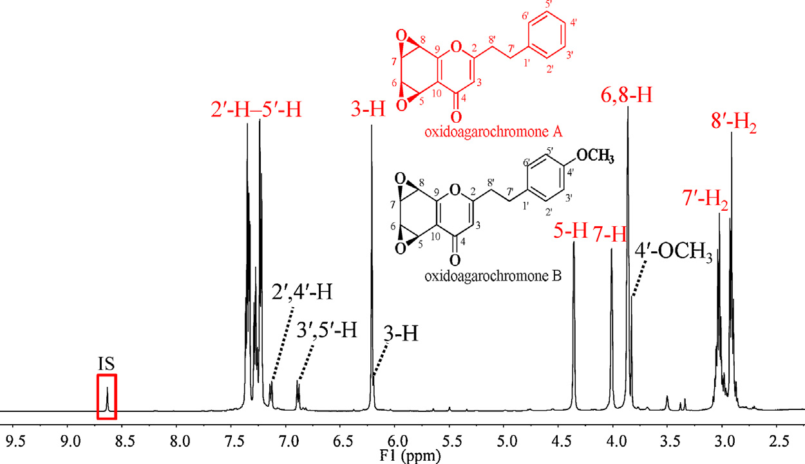
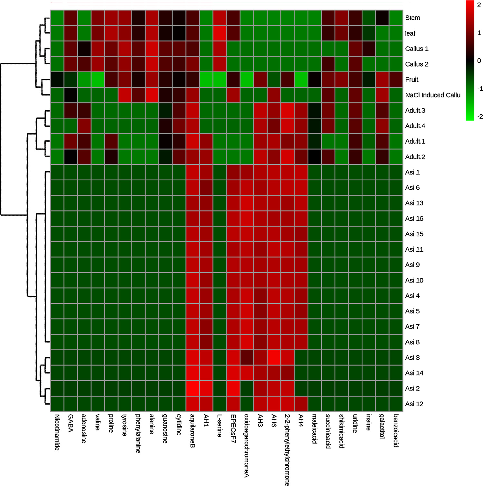

<!-- 方針: ほぼ全訳＋必要に応じた補足。原文構成に沿って訳出。「> 補足:」は訳者注。 -->

## 書誌情報

- 原題: A full solution for multi-component quantification-oriented quality assessment of herbal medicines, Chinese agarwood as a case
- 著者: Huixia Huo, Yao Liu, Wenjing Liu, Jing Sun, Qian Zhang, Yunfang Zhao, Jiao Zheng, Pengfei Tu, Yuelin Song（責任著者）, Jun Li（責任著者）（北京中医薬大学 中薬学院 現代中医薬研究センター, 中国・北京）
- 掲載: *Journal of Chromatography A* 1558 (2018) 37–49. https://doi.org/10.1016/j.chroma.2018.05.018
- インパクトファクター: **3.8**（*Journal of Chromatography A*, JCR 2024 / Clarivate, Q1。分離科学の代表的国際誌。出典により3.8〜4.2の幅がある）
- 受領 2018-02-28 / 改訂 2018-04-17 / 採録 2018-05-08 / オンライン公開 2018-05-09
- 助成: 中国国家自然科学基金（No. 81573572, 81773875, 81530097）ほか

> 補足: 沈香（じんこう, Chinese agarwood）は、ジンチョウゲ科 *Aquilaria*（中国産は主に *Aquilaria sinensis*＝白木香）の樹幹が傷などの刺激を受けて分泌する樹脂が材に染み込んだ部分を削り取ったもの。東南アジア・バングラデシュ・中国で伝統薬（鎮静・強心・鎮痛・止瀉など）や香料・宗教用途に用いられ、金より高価とも言われる。乱伐で野生木が激減しワシントン条約（CITES）附属書IIに *Aquilaria* 属が掲載されている一方、市場には偽和品・混ぜ物が多く、厳格な品質評価が急務。本論文の主役成分は **2-(2-フェニルエチル)クロモン誘導体（PCDs; 2-(2-phenylethyl)chromone derivatives）** で、沈香に特徴的な化学クラスタ（＝真贋・品質の目印）とされる。

> 補足（本稿の位置づけと難易度）: 本論文は「特定の生薬のQC法を1本作った」報告ではなく、**生薬の多成分定量に共通する4つの技術的ボトルネックを、複数の先端技術を1本のワークフローに統合して同時に解く**という方法論志向（メソドロジー）の色が濃い。用語・装置構成が高度なため `level: researcher` とし、要所に訳者補足を厚めに置いた。

## 要旨（Abstract）

生薬（herbal medicines, HMs）の品質は臨床での確かな治療効果の前提であり、多成分（＝品質マーカー, Q-marker）の定量は品質評価の有効な手段として広く重視されてきた。しかし化学的多様性ゆえに、品質管理の実践は主に4つの技術的ボトルネックによって著しく妨げられている。すなわち **(1) 標準品（authentic compounds）の欠如、(2) 広い極性範囲、(3) 広い濃度範囲、(4) シグナルの誤認（signal misrecognition）** である。本研究では、これらの障害に対処するために LC–MS/MS の潜在能力を引き上げる試みを行い、中国産沈香をケーススタディとして用いた。

第一に、自作のフラクションコレクターを導入し、抽出物全体を関心対象の複数画分（fractions-of-interest）へ自動的に分割した。第二に、定量的 1H-NMR（q1H-NMR）を用いて各画分の詳細な化学プロファイリングを行い、LC–MS/MS の能力を補い、良く定義された画分をプールしていくつかの入手可能な標準品と組み合わせて **擬似混合標準溶液（pseudo-mixed standard solution）** を作製した。第三に、LC–MS/MS 測定に一連の改良を施した。広い極性窓に対応して逆相 LC（RPLC）と親水性相互作用 LC（HILIC）を直列に連結し、MS/MS 領域では **オンラインパラメータ最適化・応答テーラリング（response tailoring）・RRCEC（相対応答 vs. 衝突エネルギー曲線, relative response vs. collision energy curve）照合** を統合して定量的信頼性を高めた。メソッドバリデーションののち、沈香中の合計 **26 成分** を同時定量した。特に、**8 種の 2-(2-フェニルエチル)クロモン誘導体（PCDs）については標準品なしでの定量を達成した**。以上より、本戦略は沈香をはじめとする生薬の Q-marker 定量指向型品質管理に向けた技術的障壁を完全に克服しうる有望な解であることを示した。

## 1. 序論（Introduction）

生薬（HMs）の化学的多様性は、多因子性疾患に対する「多成分・多標的（multi-components on multi-targets）」という独自の治療原理を生む[1–6]一方で、その品質管理を悩ましい課題にしている。近年、品質マーカー（Q-marker）という新概念が生薬の品質評価の実践的戦略として広く普及し[7,8]、作業の重点は「与えられた生薬（＝複雑な化合物プール）から Q-marker の定量情報を正確に取り出せる、目的適合的な分析ツールを追求すること」へと移った。世界中の分析科学者による多大な努力にもかかわらず、一見最先端の装置でも次の技術的障害を完全には解決できていない。すなわち **標準品の欠如・比較的狭い極性窓・限られた線形ダイナミックレンジ・シグナル誤認** である。本論では、いくつかの適切な技術を統合することで、これらのボトルネックを打破する実行可能な解を提案する。

**標準品**は、大半の装置（例えば現在生薬品質評価の主力である LC–MS/MS）で、応答値と濃度を対応づける検量線を作るために必須である。しかし標準品の収集は高コスト・煩雑で、時に全ての目的化合物を集めることが不可能ですらある。幸い定量的 1H-NMR 分光法（q1H-NMR）は、必要な標準品の代わりに単純な内部標準（例：トリメチルシリルプロピオン酸ナトリウム, 4,4-ジメチル-4-シラペンタン-1-スルホン酸）を用いて定量情報を与えうる。共鳴シグナルが理論上、共鳴核の数に直接比例するためである[9–11]。分解能・感度の本質的な弱点から、生薬抽出物全体の 1H-NMR スペクトルから各成分（特に微量成分）の定量情報を取り出すのはなお困難だが、数十化合物程度を含む比較的単純な画分に対してなら、NMR 技術の急速な進歩により詳細な定量分析が今や実行可能である[12]。技術発展のもう一つの恩恵として、自動フラクションコレクターにより生薬抽出物全体を q1H-NMR の定量特性に適う程度まで単純化できる。結果として、**q1H-NMR とクロマトグラフィー分画の組み合わせ**が、標準品なし定量に応える実行可能な手段となる。

Q-marker には半極性で豊富な成分が関わることが多いが、一部の親水性成分や微量成分も生薬品質に重要な役割を果たす。したがって、適格な手法は **広い濃度幅と極性幅**をもつ一群のターゲットを同時に定量できる能力を備える必要がある。妥協策として、全対象化合物をいくつかの部分集団（一次成分クラスタ・親水性成分クラスタ 等）に分けて複数の手法を開発・適用することも可能だが、極めて煩雑な作業を要する。幸い、極性・濃度を拡張した定量を達成する先進的パイプラインが検証されている[13–15]。**逆相 LC（RPLC）と親水性相互作用 LC（HILIC）を直列連結**することで、単一カラム LC に比べ保持窓と分離能を拡張し、各成分にハイブリッドなクロマト機構を割り当てられる[16,17]。MS/MS 領域では、**テーラード MRM（多重反応モニタリング）** により、各分析対象（特に主要成分）の線形範囲を全試料中の分布量に合わせて拡げる。これは全分析対象に必ずしも最適でない適切なパラメータを定義することで実現する[18,19]。さらに **オンラインパラメータ最適化**は、純粋な標準品がなくても対象化合物に適したパラメータを得る実践的手段となる[20–22]。

生薬には異性体、時にはジアステレオ異性体が広く存在するが、LC–MRM が捉えたシグナルの同定を確固たるものにして**ピーク誤認**の可能性を排除する配慮は、これまでほとんど払われてこなかった。異性体はクロマト挙動も MS 挙動も似るため識別は骨が折れる。例えば *Peucedanum praeruptorum*（前胡）の LC–MS/MS で以前 praeruptorin E と帰属されていたピークを分取して 1H-NMR にかけたところ、その位置異性体（3′-isovaleryl-4′-angeloylkhellactone）の存在が判明した例がある[23,24]。したがって、生薬で排他的な定量を成すには、より多くの構造的証拠が必要である。この位置異性体対では **RRCEC（相対応答 vs. 衝突エネルギー曲線）** が異なっており、オンラインパラメータ最適化により各化合物の RRCEC を簡便に構築できた。**RRCEC 照合**は、こうして MRM モードの定量的信頼性を高める手段となる。

（沈香の背景は上の「書誌情報」補足に記した通り。）沈香、特に中国産沈香は非常に高価で、市場には偽和品・混ぜ物が多く、臨床効果と経済的価値の双方を保証するため厳格な品質評価が急務である。本論では、上記の全技術を統合したワークフロー（Fig. 1）を提案し、沈香の精確な品質評価の要件を完全に満たすことを目指す。第一に自作フラクションコレクターで抽出物全体を関心画分に自動分割し、第二に q1H-NMR を用いて各画分の詳細な化学プロファイリングで LC–MS/MS の能力を補強し、良く定義された画分をプールして入手可能な標準品と組み合わせ擬似混合標準溶液を作り、第三に先進的 LC–MS/MS で 26 成分を同時定量する。特に 8 種の PCD については標準品なし定量を達成した。本戦略は生薬品質評価の4つの障壁すべてに対処するよう設計されており、Q-marker 概念の実践のための「フルソリューション」となると展望する。

## 2. 実験（Experimental）

### 2.1. 試薬・材料

植物に普遍的に分布する親水性成分を手法の適用性確認に用いた。ニコチンアミド、γ-アミノ酪酸（GABA）、バリン、プロリン、チロシン、フェニルアラニン、アラニン、L-セリン、ガラクチトール、アデノシン、グアノシン、シチジン、ウリジン、イノシンは Xinjingke Biotechnology（北京）より供給。4 種の有機酸（マレイン酸・コハク酸・シキミ酸）と安息香酸は Sigma-Aldrich（米国 MO）より購入。

> 補足: 原文は「Four organic acids, i.e. maleic acid, succinic acid, shikimic acid, along with benzoic acid」と書くが、列挙は 3 有機酸＋安息香酸の計 4 物質。"Four organic acids" は 4 物質の意で、有機酸が 4 種という意味ではない（安息香酸を含めて 4 つ）。定量表（Table 3）では有機酸 4 種＝マレイン酸・コハク酸・シキミ酸・安息香酸として扱われている。原文ママを尊重しつつ注記する。

正・負イオン化それぞれの内部標準（IS）として **タラチサミン（talatisamine, 正イオン用）** と **リクイリチンアピオシド（liquiritin apioside, 負イオン用）** を Standard Biotech（上海）より入手。全化合物の化学構造は 1H・13C NMR で確認し、各標準品の純度は HPLC–DAD–IT-TOF-MS（島津, 東京）で 98% 超と決定した。

ギ酸・メタノール・アセトニトリル（ACN）は LC–MS グレード（Thermo-Fisher, 米国 PA）。CD3OD および CDCl3（いずれも重水素存在度 99.8 atom%）は Cambridge Isotope Laboratories（米国 FL）。q1H-NMR の内部標準として **ピラジン（純度 >99%）**（Aldrich, 米国 MO）を用いた。脱イオン水は Milli-Q（Millipore, 米国 MA）で調製。

試料は、中国産沈香を計 **16 ロット（Asi1–16）** 収集。**偽和品 4 ロット（Adult. 1–4）** を生薬市場（河北省安国）で収集。さらに *Aquilaria sinensis* の関連材料として、果実・茎・葉・カルス・NaCl 刺激カルス（各 1 ロット）を同研究所の Shepo Shi 教授より提供。Adult. 1–4 を除き、全材料は著者の一人（Pengfei Tu 教授）により *Aquilaria sinensis* 由来と鑑定された。全標本は北京中医薬大学中薬学院 現代中医薬研究センターに保管。

### 2.2. 沈香抽出物からの関心画分の分取

Asi1–16 の各ロットから 200 mg ずつを分取・プールし、メタノールで 30 分間、超音波補助抽出した。抽出物を濃縮後、島津 LC-20AD モジュラーシステムで半分取クロマトグラフィー分画にかけた。カラムは半分取用 **YMC-Pack C18（10 × 250 mm, 5 μm）**。移動相は水（A）と ACN（B）で、グラジエントは以下。流速 2 mL/min、254 nm でモニタ。

| 時間（min） | %B（ACN） |
|---|---|
| 0–30 | 35 → 95% |
| 30–36 | 95% |

2 個の 6 ポジション/7 ポート電子バルブで構成された自動フラクションコレクターを用い、**8 つの関心画分 Fr. I–VIII**（Fig. 2）を分取した。各画分に対応する溶出時間はそれぞれ 7.4–8.5、8.5–9.5、14.2–15.0、17.3–18.3、21.0–21.6、23.5–24.0、26.7–27.3、27.3–28.1 min。

> 補足: Fig. 2（半分取 LC による沈香全抽出物の UV 254 nm クロマトグラムと Fr. I–VIII の分取プログラム）はベクター図のため本稿には転載していない（原文参照）。

### 2.3. Fr. I–VIII の NMR と LC–高分解能 MS/MS による並行測定

各画分（Fr. I–VIII）から 50 μL を LC–IT-TOF-MS 測定用に分取。残部を蒸発乾固し、残渣を **600 μL の CD3OD（Fr. I–III）または CDCl3（Fr. IV–VIII）** で再溶解、いずれもピラジン（最終濃度 3.125 mol/L）を添加して即座に NMR 管（内径 5 mm, Norell ST500-7）へ移した。

> 補足: 原文のピラジン最終濃度「3.125 mol/L」は q1H-NMR 内部標準としては非現実的に高く、単位（mmol/L あるいは別の記載）の誤植の可能性が高いが、数値は原文ママとした。

1H-NMR は **Varian UNITY plus 500 MHz 分光計（VNMR500, プロトン周波数 499.91 MHz）**（TCI クライオプローブ・Z 勾配系搭載）で、全スペクトルとも既定パラメータで取得。

LC–IT-TOF-MS 測定では、**Waters Acquity UPLC HSS T3 カラム（2.1 × 100 mm, 1.8 μm）** で分離し、溶出液は内径 0.13 mm の PEEK チューブ（適切な長さ）を通じて ESI インターフェースへ導入。移動相は 0.1% ギ酸水（A）と ACN（B）、総流速 0.15 mL/min、グラジエントは以下。UV は 190–400 nm を記録、注入量 2 μL。MS パラメータは推奨値を適用。

| 時間（min） | %B（ACN） |
|---|---|
| 0–4 | 10 → 28% |
| 4–8 | 28 → 30% |
| 10–14 | 30 → 55% |
| 14–20 | 55 → 72% |
| 20–23 | 72 → 95% |
| 23–25 | 95% |
| 25.1–30 | 10% |

### 2.4. 試料前処理

q1H-NMR と LC–IT-TOF-MS のデータを慎重に解析した結果、**8 化合物** の構造同定と定量情報が得られた（Table 1）。すなわち aquilarone B、AH1、rel-(1aR,2R,3R,7bS)-1a,2,3,7b-テトラヒドロ-2,3-ジヒドロキシ-5-(2-フェニルエチル)-7H-オキシレノ[f][1]ベンゾピラン-7-オン（略称 **EPECs:F7**）、oxidoagarochromone A、AH3、AH6、2-(2-フェニルエチル)クロモン、AH4 である。これら分析対象を富む画分（Fr. I–VIII）を蒸発乾固して **擬似標準品（pseudo-authentic compounds）** とみなし、各画分中の分析対象量（Table 1）が明確に定まっているため、入手可能な標準品と合わせて **擬似混合標準溶液** の構築に用いた。IS を除く全ての入手可能な標準品と分析対象を富む画分を、DMSO で個別に溶かし各 4 mg/mL のストック溶液群を作製。全ストックをプールし 10% ACN 水で希釈して作業標準溶液群を得た。各作業標準溶液をさらに、2 種の IS（最終濃度：タラチサミン 28 ng/mL、リクイリチンアピオシド 166 ng/mL）を含む 10% ACN 水で 2 倍希釈し、所望濃度の検量用試料系列を得た。

一方、各乾燥試料（Asi1–16、Adult. 1–4、果実・茎・葉・カルス・NaCl 刺激カルス）を個別に粉砕し 0.25 mm 篩を通した。全乾燥試料に含まれる成分を網羅すると期待される **プール試料** は、全試料から各 10 mg ずつを混合して調製。各抽出は、粉砕材料 100 mg を 50% メタノール水 5 mL に懸濁し超音波補助抽出。抽出後に減った重量分の 50% メタノール水を補い、10000 × g で 10 分遠心、上清を 0.22 μm 膜でろ過。検量用試料と並行して、各ろ液を 10% ACN 水で 100 倍希釈し、さらに IS 添加 10% ACN 水で 2 倍希釈してから測定した。

**Table 1. Fr. I–VIII の MS スペクトルおよび 1H-NMR シグナルの帰属。**（tR は LC–IT-TOF-MS 由来。誤差は理論値に対する ppm）

| 画分 | tR (min) | MS1 [M+H]+ | 分子式 | MS2（主要フラグメント） | 誤差 (ppm) | 同定 | 定量された量 |
|---|---|---|---|---|---|---|---|
| Fr. I | 8.66 | 319.1184 | C17H18O6 | 301, 283, 255 | 2.51 | AH1 | 7.147 mg |
| Fr. II | 8.12 | 319.1172 | C17H18O6 | 301, 91 | −1.25 | aquilarone B | 3.272 mg |
| Fr. III | 15.33 | 301.1069 | C17H16O5 | 283, 255, 173 | −0.66 | EPECs:F7 | 7.641 mg |
| Fr. IV | 17.03 | 283.0963 | C17H14O4 | 255, 192, 153 | −0.71 | oxidoagarochromone A | 31.020 mg |
| Fr. IV（微量） | 16.80 | 313.1075 | C18H16O5 | 121 | 1.28 | oxidoagarochromone B | –（定量せず） |
| Fr. V | 18.76 | 267.1010 | C17H14O3 | 189, 176, 137 | −2.25 | AH3 | 6.948 mg |
| Fr. VI | 19.79 | 311.1272 | C19H18O4 | 220, 205, 181 | −1.93 | AH6 | 4.817 mg |
| Fr. VII | 21.79 | 281.1173 | C18H16O3 | 203, 190, 151 | −0.80 | AH4 | 3.083 mg |
| Fr. VIII | 21.19 | 251.1065 | C17H14O2 | 173, 160, 91 | −0.36 | 2-(2-フェニルエチル)クロモン | 4.894 mg |

> 補足: Fr. IV には主要ピーク（oxidoagarochromone A, tR 17.03）と微量ピーク（oxidoagarochromone B, tR 16.80, A の C-4′ メトキシ化体）が共存する。B は正確に定量できないため定量対象から外された。したがって同定された PCD は計 9 種だが、**定量対象の PCD は 8 種**（表中で量が入っている行）。1H-NMR の詳細な化学シフト帰属（δ, J 値）は原文 Table 1 に記載（本稿では紙幅の都合で省略。原文参照）。

### 2.5. RPLC-HILIC 構成

RPLC-HILIC 領域は複数の島津 LC モジュール（4 台の LC-20ADXR ポンプ A–D、CBM-20A コントローラ、DGU-20A3R デガッサー、CTO-20AC カラムオーブン、2 個の HP ミキサ）で構成。先行論文の装置構成・溶出プログラムに軽微な変更を加えて踏襲した。要約すると、**Waters Acquity UPLC HSS T3 カラム（2.1 × 100 mm, 1.8 μm）** と **Waters Xbridge Amide カラム（4.6 × 150 mm, 3.5 μm）** を直列連結し、各分析対象に RPLC と HILIC の機構を順に割り当てた。ポンプ A・B が 0.1% ギ酸水（A）と ACN（B）をミキサ経由で T3 カラムへ（LC–IT-TOF-MS と同一グラジエント）供給。一方ポンプ C・D が 10 mM ギ酸アンモニウム水（C）と ACN（D）を RPLC カラム溶出液に添加し、以下のように送液。流速 1.0 mL/min。両カラムとも 40 ℃、オートサンプラー注入量 2 μL。

| 時間（min） | %D（ACN） |
|---|---|
| 0–4 | 100% |
| 4–14 | 100 → 80% |
| 14–22 | 80 → 70% |
| 22.1–30 | 100% |

RPLC-HILIC の利点評価のため、単一カラム LC も実施。並行測定を保証するため、RPLC-HILIC と単一カラム RPLC/HILIC の差は、同程度長の PEEK チューブで T3 カラム（単一 RPLC 用）または Amide カラム（単一 HILIC 用）を置換した点のみとした。

### 2.6. テーラード MRM 検出

LC 領域からの溶出液は **SCIEX 5500 Qtrap 質量分析計**（ESI インターフェース搭載）で受けた。各分析対象の前駆体イオン・生成物イオンは、標準品または関心画分を RPLC-HILIC–MS/MS へ注入して取得し、MS/MS は EMS-EPI モード（enhanced mass spectrum triggering enhanced product ion）で。正負極性を別々に適用。EMS の主要パラメータは DP（脱溶媒和電位）±100 V、CE（衝突エネルギー）±5 eV、EPI 実験では CE ±35 eV、CES（衝突エネルギースプレッド）25 eV。

次いで **オンラインパラメータ最適化**で適切なパラメータを得て各分析対象の RRCEC を構築した。要約すると、優勢な前駆体・生成物イオンで MRM イオン遷移候補を作り、各候補が一群の**擬似イオン遷移（PITs; pseudo-ion transitions）**を生成する。AH3 を例にとると、[M+H]+ が m/z 267、主要フラグメントが m/z 189・137・91 で観測され、m/z 267 > 189、267 > 137、267 > 91 等のイオン遷移候補が構築される。各候補（例 267 > 189）が多数の PITs（例 267.000 > 189.000、267.001 > 189.000 …）を生み、これらが 5–135 eV の間で 2 eV 刻みにずらした CE に対応する。大幅に増えたイオン遷移にはスケジュールアルゴリズムを用いた。PITs は DP 最適化にも同様に利用した。

### 2.7. メソッドバリデーションと定量測定

バリデーションは直線性・感度・精度・安定性・回収率で実施。直線性以外は推奨プロトコルに従い、混合標準溶液を擬似混合標準溶液に置換した軽微な変更を加えた。

直線性は内部標準検量線で（各分析対象 6 濃度水準超）評価し、分析対象と対応 IS のピーク面積比を濃度比に対してプロット。必要に応じ 1/x 重み付けを適用。予備実験で、沈香中の主要成分（aquilarone B、AH1、EPECs:F7、oxidoagarochromone A、AH3、AH6、2-(2-フェニルエチル)クロモン、AH4）の含量が、最適パラメータ使用時には線形範囲を超えることが判明。そこで **応答抑制（response suppression）** を採り、劣位の CE を用いて定量上限（ULOQ）を拡大し、主要成分の豊富な分布に合わせた。これらの適切な CE が最適 CE に代わりモニタリングリストに入り（主要成分の定量用）、他成分には最適パラメータを適用した（Table 2）。MRM は EPI スキャンをトリガする調査実験としても機能し MS2 スペクトルを取得した。

バリデーション済み手法を全収集試料（Asi1–16、Adult. 1–4、果実・茎・葉・カルス・NaCl 刺激カルス）の 26 成分同時定量に適用。各試料に 3 プログラム（全正 PITs、全負 PITs、定量プログラム＝Table 2 の情報）を適用。定量では Qtrap の高速極性切替能力により正負極性を同時適用。各実験は 3 連。

**Table 2. 全 26 分析対象＋2 IS の保持時間・イオン遷移・化合物依存 MS パラメータ。** CE 列の「*」付きは線形範囲拡張のためのテーラード CE、括弧内が手動チューニングで得た最適 CE。

| No. | 分析対象 | tR-RPLC-HILIC (min) | tR-RPLC (min) | tR-HILIC (min) | イオン遷移 | DP (V) | CE (eV) |
|---|---|---|---|---|---|---|---|
| 1 | ニコチンアミド | 5.13 | 2.06 | 2.48 | 123 > 80 | 30 | 30 |
| 2 | GABA | 8.57 | 1.56 | 8.05 | 104 > 87 | 40 | 16 |
| 3 | アデノシン | 8.70 | 2.24 | 5.58 | 268 > 136 | 40 | 30 |
| 4 | バリン | 8.85 | 1.86 | 7.97 | 118 > 72 | 25 | 18 |
| 5 | プロリン | 9.48 | 1.67 | 9.13 | 116 > 70 | 50 | 20 |
| 6 | チロシン | 10.25 | 2.32 | 9.62 | 183 > 136 | 25 | 19 |
| 7 | フェニルアラニン | 10.35 | 4.24 | 7.21 | 166 > 120 | 50 | 19 |
| 8 | アラニン | 10.38 | 1.59 | 10.38 | 90 > 44 | 25 | 17 |
| 9 | グアノシン | 10.60 | 2.32 | 9.40 | 284 > 152 | 40 | 25 |
| 10 | シチジン | 11.32 | 1.64 | 11.92 | 244 > 112 | 25 | 17 |
| 11 | aquilarone B | 11.82 | 8.38 | 2.52 | 319 > 283 | 50 | 20*（28） |
| 12 | AH1 | 12.97 | 9.18 | 2.93 | 319 > 283 | 50 | 20*（25） |
| 13 | L-セリン | 14.28 | 1.56 | 14.46 | 106 > 60 | 40 | 16 |
| 14 | EPECs:F7 | 18.65 | 15.69 | 1.74 | 301 > 91 | 70 | 25*（55） |
| 15 | oxidoagarochromone A | 19.85 | 17.13 | 1.61 | 283 > 227 | 100 | 10*（20） |
| 16 | AH3 | 22.21 | 19.16 | 1.63 | 267 > 189 | 130 | 15*（32） |
| 17 | AH6 | 23.40 | 20.39 | 1.57 | 311 > 205 | 50 | 20*（40） |
| 18 | 2-(2-フェニルエチル)クロモン | 24.66 | 21.72 | 1.54 | 251 > 160 | 60 | 15*（32） |
| 19 | AH4 | 25.23 | 22.29 | 1.54 | 281 > 151 | 120 | 25*（50） |
| IS1 | タラチサミン | 10.88 | 7.54 | 3.82 | 422 > 390 | 120 | 39 |
| 20 | マレイン酸 | 4.77 | 2.26 | 2.16 | 115 > 71 | −35 | −15 |
| 21 | コハク酸 | 5.67 | 2.71 | 2.35 | 117 > 73 | −35 | −12 |
| 22 | シキミ酸 | 6.10 | 1.84 | 4.09 | 173 > 111 | −70 | −15 |
| 23 | ウリジン | 7.28 | 2.16 | 4.28 | 243 > 200 | −120 | −15 |
| 24 | イノシン | 9.07 | 2.37 | 6.04 | 267 > 135 | −80 | −30 |
| 25 | ガラクチトール | 10.24 | 1.63 | 10.17 | 181 > 101 | −100 | −19 |
| 26 | 安息香酸 | 15.01 | 11.07 | 1.92 | 121 > 77 | −40 | −14 |
| IS2 | リクイリチンアピオシド | 11.79 | 8.10 | 4.73 | 549 > 255 | −150 | −42 |

> 補足: No.11–19（PCD 8 成分＋oxidoagarochromone A）は正イオン、No.20–26（有機酸・ヌクレオシドの一部・ガラクチトール）は負イオンで検出。RPLC-HILIC 直列では、疎水性 PCD は前段 RPLC（T3）で強く保持され後段 HILIC ではほぼ非保持（tR-HILIC が 1.5 分台）、逆に親水性のアミノ酸・有機酸・糖アルコールは前段でほぼ非保持・後段 HILIC で保持、という**相補的な保持**が数値で読み取れる。単一カラムでは必ずどちらかがボイド近くに溶出し（イオン化競合＝マトリックス効果）てしまうことを、直列連結が解消している。

### 2.8. データ処理・統計解析

データ処理（ピーク検出・積分・検量線回帰・定量）には Analyst ソフト（v1.6.2, SCIEX）の定量モジュールを使用。Analyst クラシック積分アルゴリズム（スムージング係数 2、バンチング係数 1）で全ピーク面積を算出。定量データセットを GraphPad Prism 5.0 に移して RRCEC を描画。階層クラスタリング付きヒートマップは MetaboAnalyst（http://www.metaboanalyst.ca）で作成。

## 3. 結果と考察（Results and discussions）

### 3.1. 関心画分の詳細な化学プロファイリング

沈香全抽出物を q1H-NMR にかけると複雑なスペクトルが得られ、q1H-NMR の基準を満たすシグナル（まして対象化合物）を見つけるのは困難だった。そこでクロマト分画で抽出物全体を単純化し、潜在的 Q-marker を濃縮する必要が生じた。自動フラクションコレクター（2 個の 6 ポジション/7 ポート電子バルブ）は 1 回の分析で最大 10 画分を自動収集できる。本研究では 8 化合物を富む 8 画分（Fr. I–VIII, Fig. 2）を取得し、バルブ切替を 7.4, 8.5, 9.5, 14.2, 15.0, 17.3, 18.3, 21.0, 21.6, 23.5, 24.0, 26.7, 27.3, 28.1 min に順次スケジュールした。

各画分を 1H-NMR と LC–IT-TOF-MS で並行測定。NMR と LC–IT-TOF-MS データの統合解析から、沈香の診断的化学クラスタとされる **計 9 種の PCD** を明確に同定した（Table 1）。Fr. IV を例にとると、主要ピーク（tR 17.03）と微量ピーク（tR 16.80）が LC–IT-TOF-MS で検出された。主要ピークは [M+H]+ m/z 283.0963（C17H15O4 として誤差 −0.71 ppm）とフラグメント m/z 255・192・153 を与え、微量ピークは m/z 313.1075（C18H17O5 として 1.28 ppm）と 121 を示した。1H-NMR（Fig. 3）で δ 6.21（1H, s）, 4.35（1H, d, J=3.0）, 3.86（1H, br s）, 4.01（1H, br s）, 3.86（1H, br s）, 7.09（2H, d, J=8.5）, 6.84（2H, d, J=8.5）, 7.29（5H, m）, 3.02（2H, m）, 2.91（2H, m）は **oxidoagarochromone A** を示した。同時に δ 6.19, 7.13（2H, d, J=7.0）, 6.88（2H, d, J=7.0）, 3.83（3H, s, 4′-OCH3）も検出され、MS データと合わせ微量ピークは A の C-4′ メトキシ化体 **oxidoagarochromone B** と同定された。同様に AH1・aquilarone B・EPECs:F7・AH3・AH6・AH4・2-(2-フェニルエチル)クロモンを Fr. I, II, III, V, VI, VII, VIII から同定した。うち **aquilarone B と AH1 はジアステレオ異性体対**で、A 環のヒドロキシ基の立体配置のみが異なり、定量時の誤認リスクを示唆する。

ピラジンの診断的一重線は常に δ 8.65 に孤立して現れた。多くの PCD（AH1・oxidoagarochromone A・AH3・AH6・AH4・2-(2-フェニルエチル)クロモン）の 5-H の二重線は孤立して現れ、定量シグナルに用いた。aquilarone B・EPECs:F7 では 8-H（δ 4.61 d, J=5.0／4.58 d, J=5.0）を定量シグナルとした。oxidoagarochromone A の H-3 一重線（δ 6.21）は B の H-3（δ 6.19）と満足に分離でき定量に使えたが、oxidoagarochromone B の量は正確に算出できず定量対象から除外した。各画分中の各分析対象量（Table 1）は確立された式で算出した。

### 3.2. 全分析対象の包括的な保持と分離

RPLC/HILIC 各機構の候補を精査し、全分析対象に満足な保持・分離を得るよう溶出プログラムも最適化した（RPLC-HILIC 構成と溶出最適化の詳細は原文の補足情報 B 参照）。

単一 RPLC/HILIC カラムでは非保持性の成分が多数ボイド時間に共溶出し、深刻なイオン化競合が起きて MS 応答に広範なマトリックス効果が生じる。そこで RPLC-HILIC 構築の主目的は、親水性・疎水性成分の双方に普遍的な保持を与えることだった。擬似混合標準を用いて RPLC-HILIC・単一 RPLC・単一 HILIC を比較（Fig. 4）。全体として、RPLC-HILIC で得た各分析対象の保持時間は **4.50 min 超**で、全成分が満足な保持を得た（Fig. 4A）。一方、単一 T3 カラム（RPLC）ではニコチンアミド・GABA・アデノシン・バリン・プロリン・チロシン・アラニン・グアノシン・シチジン・L-セリン・マレイン酸・シキミ酸・ウリジン・イノシン・ガラクチトールがボイド近くに溶出、単一 Amide（HILIC）ではニコチンアミド・aquilarone B・AH1・EPECs:F7・oxidoagarochromone A・AH3・AH6・2-(2-フェニルエチル)クロモン・AH4・マレイン酸・コハク酸・安息香酸がボイド近くに溶出した（極性範囲の保持限界のため, Fig. 4B・C）。特に AH1 と隣接干渉ピークの分離能は RPLC-HILIC（tR 12.67 min）が単一 RPLC（tR 8.98 min）より優れ、単一 HILIC では干渉と AH1 が重大に重なった。総じて RPLC-HILIC が単一カラムより優れる選択だった。

> 補足: Fig. 4（RPLC-HILIC・単一 RPLC・単一 HILIC の擬似混合標準の重ね書き EIC、およびプール抽出物・沈香試料の代表クロマトグラム A–E）、Fig. 5（RRCEC 曲線）、Fig. 6（線形範囲カスタマイズ）はいずれもベクター図のため本稿には転載していない（原文参照）。

### 3.3. オンラインパラメータ最適化

擬似標準品（実体は分析対象を富む画分）を得た後、MRM パラメータ（イオン遷移・DP・CE）の最適化を試みた。標準品があれば最適パラメータは推奨プロトコルで容易に得られるが、画分をシリンジポンプで質量分析計に注入しても対象の前駆体・生成物イオンを見つけるのは困難だった。そこで標準品非依存の **オンラインパラメータ最適化**を、標準 PCD の欠如に応じて展開した。AH3 を富む Fr. V を代表例として、前駆体イオンは m/z 267、生成物イオンは m/z 189・137・91（それぞれフェニル開裂・レトロディールスアルダー開裂・ベンジル開裂に対応）を Fr. V の RPLC-HILIC–EMS-EPI 測定で得た。全イオン遷移候補（267 > 189、267 > 137、267 > 91）をパラメータ最適化に用い 3 組の PITs を生成、全 PITs の応答をガウス曲線フィッティングで RRCEC 構築に用いた。イオン遷移 m/z 267 > 189 が最も高感度で、RRCEC の頂点（最適 CE）はそれぞれ 32・52・60 eV に観測された。最適 DP は各 PIT に最適 CE を割り当て 130 V と得た。結局、最適イオン遷移・DP・CE は m/z 267 > 189・130 V・32 eV。他成分も同様に最適化し全値を Table 2 にまとめた。

### 3.4. RRCEC 照合による同定の確固化

異性体は生薬に広く分布しクロマト・MS 挙動が酷似するため、定量結果はシグナル誤認や不純物混入のリスクを負う。そこで RRCEC を、保持時間・MRM イオン遷移・MS2 スペクトルに加える**直交的な構造手がかり**として実装した。擬似混合標準（Fig. 4A）のクロマトグラムで、m/z 319 > 283 のイオン遷移は aquilarone B（tR 11.82）・AH1（tR 12.97）に加え別のシグナル（tR 12.67）を捉えた。この干渉と AH1 の tR 間隔はわずか 0.3 min で、軽微な tR シフトでもシグナル誤認を招きうる。aquilarone B・AH1・干渉シグナルの RRCEC を PITs 応答から GraphPad Prism 5.0 で構築して異性体を判別。3 曲線に差が観測され、最大応答はそれぞれ 25・27・29 eV に現れ（Fig. 5）、RRCEC が異性体判別能をもつことを示した。

各沈香試料（Asi1–16）で、11.80 min（±0.3 min）付近の m/z 319 > 283 シグナルの RRCEC は Fr. II 由来の参照曲線とよく一致し、その正体が aquilarone B と示された。ただし m/z 319 > 283 は Asi1–16 の tR 窓 12.4–13.3 min で主要シグナルと微量ピークを捉え、各ピークにわずかな移動（±0.3 min）が見られた。主要シグナルの RRCEC は概ね AH1 と一致し、微量の RRCEC は干渉ピーク（tR 12.67）と一致したため、**主要シグナルのピーク面積のみ**を AH1 の検量線で濃度算出に用いた。RRCEC 照合は他の捕捉シグナルの同定確固化にも用い、擬似混合標準と抽出試料の RRCEC を（保持時間 ±0.3 min とイオン遷移で整列後に）対応づけたところ、各対で正確に一致し、捕捉シグナルの同定と純度が確定した。

### 3.5. 線形範囲のカスタマイズ

最適パラメータで検量線を作ると 8 PCD の線形範囲がその豊富な含量を完全にはカバーできなかった。MRM 定量の原理は Q3 チャンバ末端の電子増倍管で規定生成物イオンを数えることであり、ULOQ はセンサ飽和で狭まりがちなので、理論上、標的生成物イオンの生成を抑えれば ULOQ を拡大できる。化合物依存パラメータ（イオン遷移・DP・CE）のうち CE が線形範囲カスタマイズに最も柔軟なので、CE 調整で PCD の ULOQ 拡大を試みた。

AH6 では、最適パラメータ（m/z 311 > 205、CE 40 eV、DP 130 V）で 62.5 μg/mL 超の濃度の応答が期待ピーク面積比より著しく低かった（Fig. 6A）。PITs を個別に検量線構築に用いると、最適 CE（40 eV）から離れるほど ULOQ が拡大し、CE 20 eV で **ULOQ が 1000 μg/mL** に到達（Fig. 6B）、全試料での AH6 定量が可能になった。よって劣位 CE（20 eV）が最適 CE（40 eV）を AH6 定量用モニタリングリストで代替した。他 PCD も同様に線形範囲をカスタマイズし、適切なイオン遷移・CE・DP を Table 2 にまとめ、応答テーラリングに関わる主要成分を「*」で示した。

> 補足: Fig. 6 の回帰式（原文）— (A) 最適 CE 40 eV: y = 0.325x − 0.0174, R² = 0.9938（ULOQ 62.5 ng/mL）／(B) 適切 CE 20 eV: y = 0.00217x − 0.0203, R² = 0.9993（ULOQ 1000 ng/mL）。本文は ULOQ を「μg/mL」、Fig. 6 キャプションは「ng/mL」と単位表記が混在しており（原文の不整合）、数値は原文ママとした。要旨・本文の趣旨は「感度を意図的に落として高含量成分の飽和を避け、上限を拡げる」点にある。

### 3.6. メソッドバリデーション

擬似混合標準溶液（分析対象を富む画分＋入手可能な標準品）を各種バリデーションに供した。適切なパラメータと最適化溶出プログラムを適用した検量試料の代表クロマトグラムが Fig. 4A。全対象化合物は各濃度範囲で良好な直線性（**r > 0.994**）を示した（原文 Table S1, 補足情報 B）。感度は **LLOQ 0.09–188.25 ng/mL、LOD 0.04–93.75 ng/mL**（Table S1）で、26 成分同時定量に十分な感度を実証。精度は **日内 RSD 2.46–14.42%、日間 RSD 3.56–14.58%**、回収率は **81.65–119.35%（RSD 1.10–11.76%）**（低・中・高濃度, 原文 Table S2）。再現性（repeatability）RSD 3.20–11.46% も良好。以上より本手法は 26 成分の高感度・高精度・正確・再現性ある定量を達成した。

> 補足: 検量線・LOD/LLOQ の成分別詳細（Table S1）と精度・回収率の成分別詳細（Table S2）は補足情報（Supplemental information B）にあり本体 PDF に含まれないため、本稿では範囲値のみ記載（原文参照）。

### 3.7. 全試料中 26 成分の同時定量

バリデーション済み手法を全試料の 26 成分同時定量に適用。内訳は **PCD 8 種**（aquilarone B・AH1・EPECs:F7・oxidoagarochromone A・AH3・AH6・2-(2-フェニルエチル)クロモン・AH4）、**ヌクレオシド 5 種**（アデノシン・グアノシン・シチジン・ウリジン・イノシン）、**有機酸 4 種**（マレイン酸・コハク酸・シキミ酸・安息香酸）、**アミノ酸 7 種**（GABA・バリン・プロリン・チロシン・フェニルアラニン・アラニン・L-セリン）、およびガラクチトールとニコチンアミド。全定量結果を Table 3 に示す。沈香試料（Asi1–16）と他試料（偽和品・果実・茎・葉・カルス・NaCl 刺激カルス）で定量パターンに有意差が見られた。

沈香試料は **PCD に富み**他成分に乏しい。逆に他試料には一次代謝物（炭水化物・ヌクレオシド・有機酸・アミノ酸）が豊富だが、PCD は偽和品・関連材料で微量〜痕跡だった。したがって PCD は真正沈香の診断的化学クラスタとして機能し、一次代謝物の不在も品質の基準となりうる。

沈香試料間の変動も顕著だった。8 PCD の合計量は **Asi13（109.02 mg/g）・Asi16（114.80 mg/g）** が他より格段に高く、Asi3・Asi14・Asi2 ではそれぞれわずか **2.36・2.40・3.65 mg/g** にとどまった。oxidoagarochromone A が最も豊富な成分となることが多く、特に Asi8（38.10）・Asi13（52.37）・Asi16（52.43 mg/g）で高値、Asi1–3・Asi10・Asi12・Asi14 では微量。aquilarone B は全沈香試料で有意に検出（**1.35–11.33 mg/g**, 生薬のほぼ 0.5% に相当）、EPECs:F7 も広く分布（**0.50–16.71 mg/g**）した。

含量データはヒートマップ化された（Fig. 7）。全沈香試料は単一群（群 I）に、偽和品は群 II に、関連材料（果実・茎・葉・カルス・NaCl 刺激カルス）は群 III にクラスタされた。群 I は PCD に富み他成分に乏しく、群 II・III は一次代謝物が豊富だが PCD は微量〜痕跡。したがって偽和品も関連材料も沈香の代替にはならず、**PCD は真正沈香を判別する適格な Q-marker**であり、一次代謝物も沈香を他試料から区別できる。

**Table 3（抜粋）. 全試料中 26 成分の含量（mg/g, 平均 ± SD, n = 3）— 主要 PCD の代表値。** N.D.＝検出不能、N.Q.＝定量不能。

| 分析対象 | Asi1 | Asi8 | Asi13 | Asi16 | Adult.1 | 果実 | 葉 |
|---|---|---|---|---|---|---|---|
| aquilarone B | 5.81 ± 0.11 | 11.33 ± 1.37 | 5.27 ± 0.57 | 7.20 ± 0.26 | N.Q. | N.Q. | N.Q. |
| AH1 | 1.13 ± 0.014 | 0.58 ± 0.0010 | 1.88 ± 0.16 | 3.74 ± 0.060 | 0.22 ± 0.010 | N.D. | N.D. |
| EPECs:F7 | 0.50 ± 0.059 | 5.48 ± 0.30 | 9.40 ± 1.24 | 16.71 ± 1.53 | N.Q. | N.Q. | N.Q. |
| oxidoagarochromone A | N.Q. | 38.10 ± 5.30 | 52.37 ± 6.46 | 52.43 ± 4.67 | N.D. | N.D. | N.D. |
| AH3 | 2.55 ± 0.13 | 0.86 ± 0.097 | 10.27 ± 1.17 | 10.59 ± 0.19 | 0.33 ± 0.029 | 0.11 ± 0.015 | N.D. |
| AH6 | 3.55 ± 0.29 | 9.28 ± 0.98 | 9.57 ± 1.18 | 6.94 ± 0.10 | 0.47 ± 0.023 | N.Q. | N.D. |
| 2-(2-フェニルエチル)クロモン | 4.92 ± 0.22 | 4.07 ± 0.19 | 15.97 ± 2.29 | 11.11 ± 1.35 | N.Q. | N.Q. | N.D. |
| AH4 | 3.56 ± 0.14 | 4.85 ± 0.69 | 4.29 ± 0.41 | 6.08 ± 0.44 | N.Q. | N.D. | N.D. |

> 補足: Table 3 の原表は全 26 成分 × 全 33 試料（Asi1–16・Adult. 1–4・果実・茎・葉・カルス 1/2・NaCl 刺激カルス）の巨大表。ここでは論旨（真正沈香は PCD に富み、偽和品・関連材料は PCD 微量で一次代謝物が主）を示す代表列を抜粋した。全数値は原文 Table 3 参照。真正沈香では一次代謝物（アミノ酸・有機酸・大半のヌクレオシド）が軒並み N.D. なのに対し、カルス・葉・茎などでアミノ酸・ヌクレオシドが検出される点が、群分離のもう一つの根拠。

### 考察（ピーク誤認と RRCEC の意義）

通常、混合標準と試料のピーク整列には保持時間と MRM イオン遷移しか使われず、ピーク形状が定量要件を満たせば捕捉シグナルの純度への注意は払われないことが多い。多数の異性体（ジアステレオ異性体すら）を含むと信じられる生薬の多成分定量では、ピーク誤認と不純シグナルの重大なリスクがある。Qtrap の EPI で生成する MS2 スペクトルの照合で信頼性は上げられるが、異性体はほぼ同一の物理化学パラメータをもつため干渉を完全には除けない。理論上、前駆体→生成物イオンの遷移には結合解離が伴い、結合エネルギーと規定 CE が生成物イオンの形成過程を共に決める。結合エネルギーは構造変化に鋭敏で、不純物（ジアステレオ異性体を含む）の混入は解離過程を有意に変えうる（著者らの未発表データ）。RRCEC は保持時間・イオン遷移・MS2 に対する直交的構造証拠として構築され、参照シグナルと捕捉シグナルの精密なピーク整列を可能にする。本研究では aquilarone B・AH1・干渉シグナルに、構造が酷似するにもかかわらず異なる RRCEC が観測された。よって RRCEC 照合は LC–MRM の定量的信頼性を高める適格な手段である。

標準品は LC–MS 定量の前提だが、全ての高純度（>98%）標準品を市販で集めるのは高コストで時に不可能、生薬から精製するのも時間・費用を要する。q1H-NMR は 1H-NMR のピーク生成原理ゆえ、比較的単純なマトリックスに対する標準品なし定量ツールとして推奨され、自動フラクションコレクターが生薬抽出物を画分群に単純化する実行可能な手段を与える。PITs 間の差（0.001 Da）は Q1/Q3 セルの分解能（0.6–0.8 Da）よりはるかに小さく、ドウェル時間・ポーズ時間が 3 ms まで短縮できるため、SCIEX 5500 Qtrap は 1 回の分析で複数組の PITs 応答を取得でき、標準品なしでパラメータ最適化を達成できる。さらに、限られた線形ダイナミックレンジと狭い極性窓という残る 2 つの障壁は RPLC-HILIC–テーラード MRM で回避できる。以上、RRCEC 照合・q1H-NMR・自動フラクションコレクター・オンラインパラメータ最適化・RPLC-HILIC–テーラード MRM の統合により、広い含量・極性幅をもつ一群の分析対象を標準品なしで精確に定量できる。

## 4. 結論（Conclusions）

生薬は常に「多成分・多標的」で特徴づけられるが、化学的多様性がこの特徴に伴い、品質評価に膨大な作業を課す。その障壁は **標準品の欠如・比較的狭い極性窓・限られた線形ダイナミックレンジ・シグナル誤認** の 4 つである。本論では、q1H-NMR の標準品なし定量能力、RPLC-HILIC–テーラード MRM の含量・極性拡張型定量能力、RRCEC 照合による構造確固化を統合し、4 制約すべてに対処する「フルソリューション」を提案した。3 段階は次の通り。(1) 自作の自動フラクションコレクターで抽出物全体を関心画分群に分割、(2) q1H-NMR と LC–MS/MS を組み合わせて全画分を詳細プロファイリングし、これらをプールして入手可能な標準品と合わせ擬似混合標準溶液を作製、(3) RPLC-HILIC–テーラード MRM で定量し RRCEC 照合で定量結果の信頼性を高める。

本戦略の適用性は、親水性〜疎水性・微量〜豊富にわたる **26 成分**を、PCD の標準品がない状況下でも沈香・偽和品・関連材料で同時定量することで確認され、各種バリデーションが新手法の信頼性を実証した。定量パターンには試料種間だけでなく沈香ロット間でも有意な変動が生じた。PCD は沈香に濃縮されるが偽和品・関連材料では微量〜痕跡であり、PCD は沈香の Q-marker として機能し、一次代謝物の微量分布も品質の負の要因として考慮すべきである。より重要なことに、本研究は沈香をはじめとする生薬の Q-marker 概念指向型品質管理にまさに適合する適格な分析アプローチを提供した。

## 参考文献

1. Y.L. Song, W.H. Jing, G. Du, F.Q. Yang, R. Yan, Y.T. Wang, Qualitative analysis and enantiospecific determination of angular-type pyranocoumarins in Peucedani Radix using achiral and chiral liquid chromatography coupled with tandem mass spectrometry, J. Chromatogr. A 1338 (2014) 24–37.
2. Q.L. Liang, X.P. Liang, Y.M. Wang, Y.Y. Xie, R.L. Zhang, X. Chen, R. Gao, Y.J. Cheng, J. Wu, Q.B. Xu, Q.Z. Xiao, X. Li, S.F. Lv, X.M. Fan, H.Y. Zhang, Q.L. Zhang, G.A. Luo, Effective components screening and anti-myocardial infarction mechanism study of the Chinese medicine NSLF6 based on system to system mode, J. Transl. Med. 10 (2012) 1–11.
3. T. Xue, R. Roy, Studying traditional Chinese medicine, Science 300 (2003) 740–741.
4. J. Qiu, Traditional medicine: a culture in the balance, Nature 448 (2007) 126–128.
5. Q.Y. Zhang, J.H. Mao, P. Liu, Q.H. Huang, J. Lu, Y.Y. Xie, L. Weng, Y. Zhang, Q. Chen, S.J. Chen, Z. Chen, A systems biology understanding of the synergistic effects of arsenic sulfide and Imatinib in BCR/ABL-associated leukemia, Proc. Natl. Acad. Sci. U. S. A. 106 (2009) 3378–3383.
6. S.L. Li, J.Z. Song, C.F. Qiao, Y. Zhou, H.X. Xu, UPLC-PDA-TOFMS based chemical profiling approach to rapidly evaluate chemical consistency between traditional and dispensing granule decoctions of traditional medicine combinatorial formulae, J. Pharm. Biomed. Anal. 52 (2010) 468–478.
7. W.Z. Yang, Y.B. Zhang, W.Y. Wu, L.Q. Huang, D. Guo, C.X. Liu, Approaches to establish Q-markers for the quality standards of traditional Chinese medicines, Acta Pharm. Sin. B 7 (2017) 439–446.
8. J. Zhao, S.C. Ma, S.P. Li, Advanced strategies for quality control of Chinese medicines, J. Pharm. Biomed. Anal. 147 (2018) 473–478.
9. W.G. Wang, X.L. Ma, X.Y. Guo, M.B. Zhao, P.F. Tu, Y. Jiang, A series of strategies for solving the shortage of reference standards for multi-components determination of traditional Chinese medicine, Mahoniae Caulis as a case, J. Chromatogr. A 1412 (2015) 100–111.
10. Y.L. Song, W.H. Jing, Y.G. Chen, Y.F. Yuan, R. Yan, Y.T. Wang, 1H nuclear magnetic resonance based-metabolomic characterization of Peucedani Radix and simultaneous determination of praeruptorin A and praeruptorin B, J. Pharm. Biomed. Anal. 93 (2014) 86–94.
11. Y.G. Chen, Y.L. Song, Y. Wang, Y.F. Yuan, X.J. Huang, W.C. Ye, Y.T. Wang, Q.W. Zhang, Metabolic differentiations of Pueraria lobata and Pueraria thomsonii using 1H NMR spectroscopy and multivariate statistical analysis, J. Pharm. Biomed. Anal. 93 (2014) 51–58.
12. X.L. Ma, P.P. Zou, W. Lei, P.F. Tu, Y. Jiang, Optimization of experimental parameters for quantitative NMR (qNMR) and its application in quantitative analysis of traditional Chinese medicines, Yao Xue Xue Bao 49 (2014) 1248–1257.
13. Y. Yan, Q.Q. Song, X.J. Chen, J. Li, P. Li, Y.T. Wang, T.X. Liu, Y.L. Song, P.F. Tu, Simultaneous determination of components with wide polarity and content ranges in Cistanche tubulosa using serially coupled reverse phase-hydrophilic interaction chromatography-tandem mass spectrometry, J. Chromatogr. A 1501 (2017) 39–50.
14. Q.Q. Song, W.J. Liu, X.J. Chen, J. Li, P. Li, F.Q. Yang, Y.T. Wang, Y.L. Song, P.F. Tu, Serially coupled reversed phase-hydrophilic interaction liquid chromatography-tailored multiple reaction monitoring, a fit-for-purpose tool for large-scale targeted metabolomics of medicinal bile, Anal. Chim. Acta (2017). http://dx.doi.org/10.1016/j.aca.2017.11.072.
15. Q.Q. Song, W.J. Liu, Y. Yan, P. Li, J. Li, P.F. Tu, Y.T. Wang, Y.L. Song, Polarity-extended quantitative analysis of bear bile and its analogues using serially coupled reversed phase-hydrophilic interaction liquid chromatography-tailored multiple reaction monitoring, RSC Adv. 7 (2017) 52822–52831.
16. J. Haggarty, M. Oppermann, M.J. Dalby, R.J. Burchmore, K. Cook, S. Weidt, K.E. Burgess, Serially coupling hydrophobic interaction and reversed-phase chromatography with simultaneous gradients provides greater coverage of the metabolome, Metabolomics 11 (2015) 1465–1470.
17. T. Alvarez-Segura, J.R. Torres-Lapasió, Ortiz-Bolsico, M.C. García-Alvarez-Coque, Stationary phase modulation in liquid chromatography through the serial coupling of columns: a review, Anal. Chim. Acta 923 (2016) 1–23.
18. H. Liu, L. Lam, P.K. Dasgupta, Expanding the linear dynamic range for multiple reaction monitoring in quantitative liquid chromatography-tandem mass spectrometry utilizing natural isotopologue transitions, Talanta 87 (2011) 307–310.
19. Z. Yan, R. Yan, Tailored sensitivity reduction improves pattern recognition and information recovery with a higher tolerance to varied sample concentration for targeted urinary metabolomics, J. Chromatogr. A 1443 (2016) 101–110.
20. Y.L. Song, Q.Q. Song, J. Li, J. Zheng, C. Li, Y. Zhang, L.L. Zhang, Y. Jiang, P.F. Tu, An integrated platform for directly widely-targeted quantitative analysis of feces part II: An application for steroids, eicosanoids, and porphyrins profiling, J. Chromatogr. A 1460 (2016) 74–83.
21. Y.L. Song, Q.Q. Song, Y. Liu, J. Li, J.B. Wan, Y.T. Wang, Y. Jiang, P.F. Tu, Integrated work-flow for quantitative metabolome profiling of plants, Peucedani Radix as a case, Anal. Chim. Acta 953 (2017) 40–47.
22. X.L. Ma, X.Y. Guo, Y.L. Song, L.R. Qiao, W.G. Wang, M.B. Zhao, P.F. Tu, Y. Jiang, An integrated strategy for global qualitative and quantitative profiling of Traditional Chinese Medicine formulas: baoyuan decoction as a case, Sci. Rep. 6 (2016) 38379.
23. Y. Tao, J. Luo, Y. Lu, D. Xu, Z. Hou, L. Kong, Rapid identification of two species of Peucedanum by high-performance liquid chromatography-diode array detection-electrospray ionization tandem mass spectrometry, Nat. Prod. Commun. 4 (2009) 1079–1084.
24. Y. Liu, Q.Q. Song, W.J. Liu, P. Li, J. Li, Y.F. Zhao, L. Zhang, P.F. Tu, Y.T. Wang, Y.L. Song, Authentic compound-free strategy for simultaneous determination of primary coumarins in Peucedani Radix using offline high performance liquid chromatography-nuclear magnetic resonance spectroscopy-tandem mass spectrometry, Acta Pharm. Sin. B (2018). http://dx.doi.org/10.1016/j.apsb.2017.01.005.
25. L.S.L. Chua, Agarwood (Aquilaria malaccensis) in Malaysia, Forest Research Institute Malaysia. CONABIO NDF Workshop case studies WG1-Trees, Case study 3, Mexico, 2008.
26. Y.B. Li, N. Sheng, L.L. Wang, S.J. Li, J.N. Chen, X.P. Lai, Analysis of 2-(2-phenylethyl)chromones by UPLC-ESI-QTOF-MS and multivariate statistical methods in wild and cultivated agarwood, Int. J. Mol. Sci. 17 (2016) 771.
27. J. Sun, Y.L. Song, J. Zhang, Z. Huang, H.X. Huo, J. Zheng, Q. Zhang, Y.F. Zhao, J. Li, P.F. Tu, Characterization and quantitative analysis of phenylpropanoid amides in eggplant (Solanum melongena L.) by high performance liquid chromatography coupled with diode array detection and hybrid ion trap time-of-flight mass spectrometry, J. Agric. Food Chem. 63 (2015) 3426–3436.
28. D. Chen, Z.R. Xu, X.Y. Chai, K.W. Zeng, Y.X. Jia, D. Bi, Z.Z. Ma, P.F. Tu, Nine 2-(2-phenylethyl)chromone derivatives from the resinous wood of Aquilaria sinensis and their inhibition of LPS-induced NO production in RAW 264.7 cells, Eur. J. Org. Chem. (2012) 5389–5397.
29. Y. Shimada, T. Konishi, S. Kiyosawa, Studies on the agalwood (Jinkō). VI. structures of three 2-(2-phenylethyl)-5,6,7,8-tetrahydrochromone derivatives, AH1A, AH2a and AH2b, Chem. Pharm. Bull. 34 (1986) 3033–3037.
30. B. Wu, S.W. Kwon, G.S. Hwang, J.H. Park, Eight new 2-(2-phenylethyl)chromone (=2-(2-phenylethyl)-4H-1-benzopyran-4-one) derivatives from Aquilaria malaccensis agarwood, Helv. Chim. Acta 95 (2012) 1657–1665.
31. J.L. Yang, W.H. Dong, F.D. Kong, G. Liao, J. Wang, W. Li, W.L. Mei, H.F. Dai, Characterization and analysis of 2-(2-phenylethyl)chromone derivatives from agarwood (Aquilaria crassna) by artificial holing for different times, Molecules 21 (2016) 911.
32. T. Yagura, N. Shibayama, M. Ito, F. Kiuchi, G. Honda, Three novel diepoxy tetrahydrochromones from agarwood artificially produced by intentional wounding, Tetrahedron Lett. 46 (2005) 4395–4398.
33. Y. Shimada, T. Tominaga, T. Konishi, S. Kiyosawa, Studies on the agarwood (Jinkō). I. structures of 2-(2-phenylethyl)chromone derivatives, Chem. Pharm. Bull. 30 (1982) 3791–3795.
34. K. Hashimoto, S. Nakahara, T. Inoue, Y. Sumida, M. Takahashi, Y. Masada, A new chromone from agarwood and pyrolysis products of chromone derivatives, Chem. Pharm. Bull. 33 (1985) 5088–5091.
35. Q.Q. Song, Y.F. Zhao, X.J. Chen, J. Li, P. Li, Y. Jiang, Y.T. Wang, Y.L. Song, P.F. Tu, New instrumentation for large-scale quantitative analysis of components spanning a wide polarity range by column-switching hydrophilic interaction chromatography-turbulent flow chromatography-reversed phase liquid chromatography-tandem mass spectrometry, RSC Adv. 7 (2017) 31838–31849.
36. Q.Q. Song, Y.L. Song, N. Zhang, J. Li, Y. Jiang, K.R. Zhang, Q. Zhang, P.F. Tu, Potential of hyphenated ultra-high performance liquid chromatography-scheduled multiple reaction monitoring algorithm for large-scale quantitative analysis of traditional Chinese medicines, RSC Adv. 5 (2015) 57372–57382.
37. Y.L. Song, N. Zhang, Y. Jiang, J. Li, Y.F. Zhao, S.P. Shi, P.F. Tu, Simultaneous determination of aconite alkaloids and ginsenosides using online solid phase extraction hyphenated with polarity switching ultra-high performance liquid chromatography coupled with tandem mass spectrometry, RSC Adv. 5 (2015) 6419–6428.
38. S.L. Wang, Y.C. Tsai, S.L. Fu, M.J. Cheng, M.I. Chung, J.J. Chen, 2-(2-Phenylethyl)-4H-chromen-4-one derivatives from the resinous wood of Aquilaria sinensis with anti-inflammatory effects in LPS-induced macrophages, Molecules 23 (2018) 289.
39. Y. Yang, H.Q. Chen, F.D. Kong, L.M. Zhou, W. Li, W.H. Dong, Z.B. Chen, W.L. Mei, H.F. Dai, Dimeric sesquiterpenoid-4H-chromone derivatives from agarwood of Aquilaria crassna and their cytotoxicity, Phytochemistry 145 (2018) 207–213.
40. H.N. Wang, W.L. Mei, W.H. Dong, F.D. Kong, W. Li, J.Z. Yuan, H.F. Dai, Two new 2-(2-Hydroxy-2-phenylethyl)chromens from agarwood originating from Aquilaria crassna, J. Asian Nat. Prod. Res. 20 (2018) 122–127.
41. R. Guo, Y.F. Zhao, J. Li, Y.F. Gu, H.X. Huo, S.S. Li, Y.L. Song, Z.X. Zhu, P.F. Tu, GYF-21, an epoxide 2-(2-phenethyl)-chromone derivative, suppresses innate and adaptive immunity via inhibiting STAT1/3 and NF-κB signaling pathways, Front. Pharmacol. 8 (2017) 281.
42. G. Liao, W.L. Mei, F.D. Kong, W. Li, J.Z. Yuan, H.F. Dai, 5,6,7,8-Tetrahydro-2-(2-phenylethyl)chromones from artificial agarwood of Aquilaria sinensis and their inhibitory activity against acetylcholinesterase, Phytochemistry 139 (2017) 98–108.
43. H.X. Huo, Y.F. Gu, H. Sun, Y.F. Zhang, W.J. Liu, Z.X. Zhu, S.P. Shi, Y.L. Song, H.W. Jin, Y.F. Zhao, P.F. Tu, J. Li, Anti-inflammatory 2-(2-phenylethyl)chromone derivatives from Chinese agarwood, Fitoterapia 118 (2017) 49–55.
44. H. Shao, W.L. Mei, W.H. Dong, C.J. Gai, W. Li, G.P. Zhu, H.F. Dai, 2-(2-Phenylethyl)chromone derivatives of agarwood originating from Gyrinops salicifolia, Molecules 21 (2016) 1313.
45. Z.X. Zhang, X.H. Wang, W.Q. Yang, J. Wang, C. Su, X. Liu, J. Li, Y.F. Zhao, S.P. Shi, P.F. Tu, Five 2-(2-phenylethyl)chromones from sodium chloride-elicited Aquilaria sinensis cell suspension cultures, Molecules 21 (2016) 555.
46. Z.X. Zhu, Y.F. Gu, Y.F. Zhao, Y.L. Song, J. Li, P.F. Tu, GYF-17, a chloride substituted 2-(2-phenethyl)-chromone, suppresses LPS-induced inflammatory mediator production in RAW264.7 cells by inhibiting STAT1/3 and ERK1/2 signaling pathways, Int. Immunopharmacol. 35 (2016) 185–192.
47. D.L. Yang, B. Xia, Y. Jiang, W.L. Mei, D. Kuck, Fragmentation of protonated 2-(2-phenylethyl)chromones from agarwood: the diagnostic role of ion/neutral complexes as reactive intermediates, Eur. J. Mass Spectrom. (Chichester) 21 (2015) 609–621.
48. B. Xia, J.R. Li, W.L. Mei, L.S. Ding, H.X. Xu, Y. Zhou, Tandem mass spectrometry fragmentation of the protonated 2-(2-phenylethyl)chromones from agarwood: radical ions versus non-radical ions, J. Mass Spectrom. 48 (2013) 979–982.
49. K. Levsen, Fundamental aspects of organic mass spectrometry, 1. Aufl. ed., Verlag Chemie Weinheim; New York, 1978.

## 訳者補足（本手法の意義と読みどころ）

- **「4つの壁」を1本のワークフローで同時に壊す構成**が本論の骨子。単独技術の紹介ではなく、q1H-NMR（標準品なし定量）／RPLC-HILIC 直列（広極性）／テーラード MRM・応答抑制（広濃度）／RRCEC 照合（異性体誤認排除）を組み合わせた「フルソリューション」を主張している点が新規性。多成分処方や希少・高価生薬の QC を組む際のメソッド設計テンプレートとして参照価値が高い。
- **擬似混合標準溶液（pseudo-mixed standard）という発想**が実務上のキモ。標準品が買えない PCD を、分画→q1H-NMR で「その画分に何 mg 入っているか」を確定した上で疑似標準として検量に使う。これにより「標準品がないから定量できない」という生薬 QC の根本的制約を回避している。
- **RRCEC（相対応答 vs. 衝突エネルギー曲線）** は本論の特徴的アイデア。同じイオン遷移・似た保持時間をもつジアステレオ異性体（aquilarone B と AH1）を、CE を掃引したときの応答プロファイル（＝解離挙動が構造で微妙に違う）で見分ける。保持時間・m/z・MS2 に「直交する」第 4 の同定軸を足す発想で、MRM 多成分定量のピーク誤認対策として応用が利く。
- **応答抑制による ULOQ 拡張**（あえて最適でない CE を使い感度を落として飽和を避ける）は、豊富な主成分と微量成分を 1 メソッドで同時に測るための現実的テクニック。同一注入で高含量成分と微量成分の双方を線形域に収める工夫として、多成分定量メソッド開発時に効く。
- **数値の単位表記に原文の不整合が散見される**（ピラジン濃度 3.125 mol/L、Fig. 6 の ULOQ の μg/mL と ng/mL の混在など）。本稿は改変せず原文ママ＋注記の方針をとった。詳細な検量線・LOD/LLOQ・精度・回収率の成分別データと Fig. 2/4/5/6 は補足情報・ベクター図で本体 PDF に含まれないため「原文参照」とした箇所がある。
