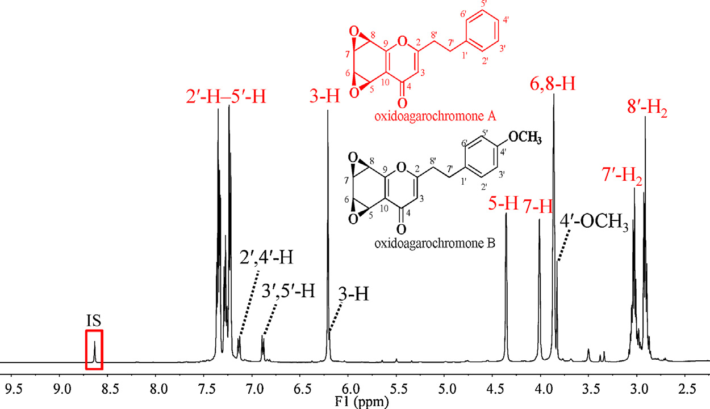

<!-- 方針: ほぼ全訳＋必要に応じた補足。原文の構成に沿って訳出。「> 補足:」は訳者注。 -->

## 書誌情報

- 原題: A full solution for multi-component quantification-oriented quality assessment of herbal medicines, Chinese agarwood as a case
- 著者: Huixia Huo, Yao Liu, Wenjing Liu, Jing Sun, Qian Zhang, Yunfang Zhao, Jiao Zheng, Pengfei Tu, Yuelin Song\*, Jun Li\*（Modern Research Center for Traditional Chinese Medicine, School of Chinese Materia Medica, Beijing University of Chinese Medicine, 北京, 中国）
- 掲載: *Journal of Chromatography A*, 1558 (2018) 37–49. https://doi.org/10.1016/j.chroma.2018.05.018
- インパクトファクター: **要確認**（*Journal of Chromatography A*, JCR 2024 / Clarivate）。Web上の各種集計サイトでは2024年版として4.21・4.0前後・3.8台など出典により異なる値が示されており、本稿執筆時点で公式Clarivate JCRの数値を一意に確認できなかったため、正確な値は原典（Clarivate Journal Citation Reports）でご確認いただきたい。
- 受理経過: 受領 2018-02-28 / 改訂 2018-04-17 / 受理 2018-05-08 / オンライン公開 2018-05-09
- 資金: 中国国家自然科学基金（Nos. 81573572, 81773875, 81530097）／中薬材規範化のためのプロジェクト（ZYBZH-Y-GD-13-ZYY-2017-076）
- ライセンス: © 2018 Elsevier B.V. All rights reserved.（オープンアクセスではない）

> 補足: 本論文は特定の1生薬処方のQC分析法というより、「多成分定量における4つの技術的障壁（標準品の欠如・広い極性範囲・広い濃度範囲・信号誤認）」をどう解決するかという**方法論・ワークフロー提案論文**であり、中国産沈香（Chinese agarwood, *Aquilaria sinensis* の樹脂含浸材）はその実証事例（ケーススタディ）として使われている。

## 要旨（Abstract）

生薬（HMs）の品質は、臨床における顕著な治療効果の前提条件であり、多成分（品質マーカー、Q-markerとも呼ばれる）の定量は品質評価のための有効な手段として広く重視されてきた。化学的多様性のため、品質管理の実務は、(1)標準品（authentic compounds）の欠如、(2)極性範囲の広さ、(3)濃度範囲の広さ、(4)潜在的Q-markerに対する信号誤認、という4つの主要な技術的障壁によって大きく妨げられている。本研究では、これらの障害に対処すべくLC–MS/MSのポテンシャルを高める試みを行い、中国産沈香を事例として用いた。第一に、自作のフラクションコレクター（分画採取装置）を導入し、全抽出物を自動的に目的分画（fractions-of-interest）の一群へと断片化した。第二に、定量的1H-NMR（q1H-NMR）を用いてLC–MS/MSの能力を補い、各分画の詳細な化学プロファイリングを行った上で、これら明確に定義された分画をプールし、入手可能な一部の標準品と組み合わせて疑似混合標準溶液（pseudo-mixed standard solution）を作成した。第三に、LC–MS/MS測定について一連の改良を行った。逆相液体クロマトグラフィー（RPLC）と親水性相互作用液体クロマトグラフィー（HILIC）を直列に連結して広い極性の窓（window）に対応し、MS/MS領域ではオンラインパラメータ最適化、レスポンステーラリング（response tailoring）、ならびにRRCEC（relative response vs. collision energy curve, 相対レスポンス対衝突エネルギー曲線）マッチングを統合して定量的信頼性を高めた。方法バリデーション後、中国産沈香中の計26成分について同時定量を実施した。特に、8種の2-(2-フェニルエチル)クロモン誘導体（PCDs）については、標準品を用いない定量（authentic compound-free quantification）を達成した。以上より、本戦略は中国産沈香ならびに他の生薬について、Q-marker概念に基づく品質管理に向けた技術的障壁を完全に克服するための有望な解決策である。

**キーワード**: 定量的1H-NMR; 標準品フリー定量; オンラインパラメータ最適化; RRCECマッチング; RPLC-HILIC; 中国産沈香

## 1. 序論（Introduction）

生薬（HMs）の化学的多様性は、多因子性疾患に対する「多成分・多標的（multi-components on multi-targets）」というユニークな治療原理を生み出す一方[1–6]、その品質管理には厄介な課題をもたらす。近年、品質マーカー（Q-marker）という新しい概念が、生薬の品質評価のための実践的戦略として広く普及しており[7,8]、その結果、複雑な化合物群として広く認識されている所与の生薬から、それらQ-markerの正確な定量情報を抽出するための目的に適した分析ツールの追求へと作業の重心が移ってきた。分析化学者たちが世界中で多大な努力を払ってきたにもかかわらず、それら一見最先端の装置をもってしても、標準品の欠如、比較的狭い極性の窓、限られた線形ダイナミックレンジ、信号誤認といった技術的障壁に十分に対応できていない。本稿では、いくつかの適切な技術を統合することで、これらの障壁を打破するための実行可能な解決策を提案する試みを行う。

標準品は、現在生薬の品質評価のための主力手法であるLC–MS/MSなど、ほとんどの装置にとって、レスポンス値と濃度の変換を可能にする検量線を構築するために必須である。しかし、望ましいすべての標準品を収集することは、コストが高く、労力を要し、煩雑であり、時に不可能ですらある。幸いにも、定量的1H-NMR分光法（q1H-NMR）は、共鳴信号が理論上共鳴核の数に直接比例するという性質のため、必要とされる標準品の代わりに単純な内部標準（例: sodium trimethylsilylpropionate や 4,4-dimethyl-4-silapentane-1-sulfonic acid）を用いることで定量情報を提供できる[9–11]。分解能や感度の点での本質的な欠点を踏まえると、生薬抽出物全体の1H-NMRスペクトルから各成分、とりわけ微量成分の定量情報を抽出することは依然として困難な作業である。しかし、NMR技術の急速な発展のおかげで、通常数十の化合物を含む比較的単純な分画については、詳細な定量分析を達成することが今や実現可能になっている[12]。技術的発展のもう一つの恩恵として、生薬抽出物全体をq1H-NMRの定量特性に適合するまで単純化するための自動フラクションコレクターも今や利用可能である。その結果、q1H-NMRとクロマトグラフィー分画とを組み合わせることが、標準品フリー定量に対応するための実行可能な手段となるはずである。

Q-markerとして関与するのは、比較的半極性で豊富な成分だけではなく、親水性化合物や微量成分がHMの品質にとって重要な役割を果たすことも頻繁にある。したがって、適格な分析法は、大きな濃度範囲および極性範囲を持つ一群の標的を同時に定量できる能力を備えているべきである。妥協案として、対象化合物全体をいくつかのサブグループ（例えば主要化合物クラスター、親水性化合物クラスターなど）に分けた上で一連の分析法を開発・適用することも確かに可能ではあるが、これには極めて煩雑な作業量が必要となる。幸いにも、極性および濃度の両面で拡張された定量を達成する先進的なパイプラインがすでに検証されている[13–15]。逆相液体クロマトグラフィー（RPLC）と親水性相互作用液体クロマトグラフィー（HILIC）を直列に連結することで、単一カラムのLCと比較して保持窓ならびに分離能を拡張でき、それによりハイブリッドなクロマトグラフィー機構が各化合物に割り当てられる[16,17]。MS/MS領域では、テーラリングされた多重反応モニタリング（MRM）により、各分析対象、とりわけ主要成分の線形範囲を、常に最適なパラメータとは限らないが適切なパラメータを定義することで、与えられたすべての試料中の分布をカバーできるようにする[18,19]。さらに、オンラインパラメータ最適化は、純粋な標準品が存在しない場合であっても、その成分に適したパラメータを得るための実践的な方法である[20–22]。

異性体、さらにはジアステレオ異性体は生薬中に広く存在するにもかかわらず、LC–MRMで捕捉された信号のピーク誤認の可能性を排除するための同定確認（identity consolidation）にはこれまでほとんど注意が払われてこなかった。実際、異性体は通常類似したクロマトグラフィー的・質量分析的挙動を示すため、これを識別することは面倒な作業である。例えば、*Peucedanum praeruptorum*（前胡）のLC–MS/MSクロマトグラムにおいて、以前praeruptorin E（3-angeloyl-4-isovalerylkhellactone）と同定されていたピーク[23]を採取して1H-NMR測定に供したところ、その位置異性体である3-isovaleryl-4-angeloylkhellactoneの存在が明確に明らかとなった[24]。したがって、生薬中で排他的な定量を達成するには、より多くの構造的証拠を組み合わせる必要がある。幸いにも、このpraeruptorin E対3-isovaleryl-4-angeloylkhellactoneという位置異性体のペアでは異なる相対レスポンス対衝突エネルギー曲線（RRCECs）が生じ、オンラインパラメータ最適化アプローチを適用することでいずれの化合物についてもRRCECを構築することが容易であった[20–22]。したがってRRCECマッチングは、MRMモードの定量的信頼性を高めるために実行可能である。

沈香（Agarwood）とは、*Aquilaria*属植物の非含浸材から少なくとも部分的に削り出された、樹脂が含浸した木片のことである[25]。関節痛、炎症性疾患、下痢に対する有望な治療効果があるとして、東南アジア諸国、バングラデシュ、中国でエスノメディシン（民族薬）として広範に利用されており、また刺激薬・鎮静薬・心臓保護薬としても常用されている。さらに、多くの地域社会において文化的・宗教的・医療的需要を何世紀にもわたって満たしてきた。しかし、樹脂を求めた無差別な伐採により野生の原木の数が減少していることから、属Aquilariaをワシントン条約（CITES: 絶滅のおそれのある野生動植物の種の国際取引に関する条約）の附属書IIに掲載する保全措置がとられている。沈香、とりわけ中国産沈香の価格は非常に高く、金よりも高価な場合すらあり、市場に大量の偽物・偽和品が出回っていることも驚くには当たらない。したがって、臨床上の治療効果ならびに経済的価値を保証するために、中国産沈香の厳格な品質評価を行うことが急務である。本稿では、前述のすべての技術を統合した作業フロー（**Fig. 1**）を提案し、中国産沈香の精密な品質評価の要件を完全に満たすことを目指す。第一に、自作のフラクションコレクターを導入し、抽出物全体を自動的に目的分画の一群へと断片化した。第二に、q1H-NMRを用いてLC–MS/MSの各分画に対する詳細な化学プロファイリング能力を強化し、これら明確に定義された分画をプールしたうえで入手可能な一部の標準品と組み合わせて疑似混合標準溶液を作成した。第三に、先進的なLC–MS/MSを適用して26成分の同時定量を行い、特に8種の2-(2-フェニルエチル)クロモン誘導体（PCDs）については標準品を用いない定量を達成した。本戦略は、生薬品質評価に関する4つの障壁すべてに対処するよう設計されているため、本パイプラインはQ-marker概念の実践に対するフルソリューションになるものと見込んでいる。

## 2. 実験（Experimental）

### 2.1 試薬・材料

植物中に普遍的に分布する親水性成分が、方法の適用可能性確認に用いられた。ニコチンアミド、γ-アミノ酪酸（GABA）、バリン、プロリン、チロシン、フェニルアラニン、アラニン、L-セリン、ガラクチトール、アデノシン、グアノシン、シチジン、ウリジン、イノシンはXinjingke Biotechnology Company（北京、中国）から供給された。4種の有機酸、すなわちマレイン酸、コハク酸、シキミ酸、ならびに安息香酸はSigma-Aldrich（St. Louis, MO, USA）から購入した。正・負イオン化モードそれぞれの内部標準（ISs）として用いたタラチサミン（talatisamine）およびリクイリチンアピオシド（liquiritin apioside）はStandard Biotech Co., Ltd.（上海、中国）から市販品として入手した。すべての化学構造（Fig. S1, Supplemental information A）は1H-および13C-NMR分光法によりさらに確認され、各標準品の純度はHPLC–DAD–IT-TOF-MS測定（島津、東京、日本）により98%超であることが確認された。

ギ酸、メタノール、アセトニトリル（ACN）はLC–MSグレードでThermo-Fisher（Pittsburgh, PA, USA）から供給された。CD3OD（重水素存在度99.8原子%重水素）およびCDCl3（重水素存在度99.8原子%重水素）はCambridge Isotope Laboratories Inc.（Miami, FL, USA）から購入した。q1H-NMRの内部標準として用いたピラジン（純度＞99%）はAldrich（St. Louis, MO, USA）から入手した。脱イオン水はMilli-Q精製装置（Millipore, Bedford, MA, USA）を用いて自家調製した。

計16ロットの中国産沈香（Asi1–16）を収集した。4ロットの偽和品（Adult. 1–4）は生薬市場（中国・河北省安国）から収集した。さらに、*Aquilaria sinensis* に関連する各種材料（果実、幹、葉、カルス、NaCl刺激カルス、それぞれ1ロットずつ）を、本研究所のShepo Shi教授から寄贈品として提供を受けた。Adult. 1–4を除き、すべての材料は著者の一人（Pengfei Tu教授）により *Aquilaria sinensis* 由来であることが同定された。すべての標本は北京中医薬大学 中薬学院 現代中薬研究センター（北京、中国）に保管されている。

### 2.2 中国産沈香抽出物からの目的分画（fractions-of-interest）の収集

Asi1–16のアリコート（各バッチ200 mg）をプールし、超音波支援下でメタノールにより30分間抽出した[26]。抽出物はその後、濃縮とクロマトグラフィー分画に順次供された。分画には、半分取用YMC-Pack C18カラム（10 × 250 mm, 5 µm, 京都, 日本）を備えた島津LC-20AD モジュラーシステム（京都, 日本）を用いた。水（A）とACN（B）からなる移動相は、以下のグラジエントでプログラムした: 0–30 min, 35–95% B; 30–36 min, 95% B; 流速2 mL/min。溶出液は254 nmでモニターした。2つの6ポジション/7ポート電子バルブで構成される自動フラクションコレクター[24]を導入し、8つの目的分画（Frs. I–VIII, **Fig. 2**）を採取した。これらはそれぞれ7.4–8.5, 8.5–9.5, 14.2–15.0, 17.3–18.3, 21.0–21.6, 23.5–24.0, 26.7–27.3, 27.3–28.1 minの溶出画分に相当する。

> 補足: Fig. 2（半分取LCによる沈香全抽出物の代表的クロマトグラム(UV, 254 nm)とFrs. I–VIIIの採取プログラム）はベクター画像として埋め込まれており、本ページでは抽出していない。詳細は原文参照。

### 2.3 Frs. I–VIIIのNMRおよびLC–高精度MS/MSによる並行測定

各分画（Frs. I–VIII）のアリコート50 µLをLC–IT-TOF-MS測定用の個別バイアルに採取した。各分画の残りの部分は乾固するまで蒸発させた。残渣はCD3OD（Frs. I–III）またはCDCl3（Frs. IV–VIII）600 µLに再溶解し、いずれもピラジンをスパイクした（終濃度3.125 µmol/L）うえで、直ちにNMRチューブ（内径5 mm, Norell ST500-7, Morganton, NC, USA）に移した。1H-NMRスペクトルは、TCIクライオプローブとZ勾配システムを備えたVarian UNITY plus 500 MHz分光計（VNMR500, Varian Inc., Palo Alto, CA, USA）でプロトン周波数499.91 MHzにて記録し、すべてのスペクトル取得にはデフォルトのパラメータを適用した。

LC–IT-TOF-MS測定では、Waters Acquity UPLC HSS T3カラム（2.1 × 100 mm, 1.8 µm, Milford, MA, USA）でクロマトグラフィー分離を行い、溶出液は適切な長さのPEEKチューブ（内径0.13 mm）を通じて質量分析計のエレクトロスプレーイオン化（ESI）インターフェースに導入した。移動相は0.1%ギ酸水溶液（A）とACN（B）からなり、総流速0.15 mL/minで以下のグラジエントプログラムに従って送液した: 0–4 min, 10–28% B; 4–8 min, 28%–30% B; 10–14 min, 30%–55% B; 14–20 min, 55%–72% B; 20–23 min, 72%–95% B; 23–25 min, 95% B; 25.1–30 min, 10% B。UV吸収は190–400 nmで記録した。注入量は2 µLとした。推奨されている質量分析パラメータをすべてのスペクトル取得に適用した[27]。

### 2.4 試料調製

q1H-NMRおよびLC–IT-TOF-MSのデータセットを注意深く解析した結果、aquilarone B[28]、AH1[29]、rel-(1aR,2R,3R,7bS)-1a,2,3,7b-tetrahydro-2,3-dihydroxy-5-(2-phenylethyl)-7H-oxireno[f][1]benzopyran-7-one（EPECs:F7）[30,31]、oxidoagarochromone A[32]、AH3[33]、AH6[33]、2-(2-phenylethyl)chromone[34]、AH4[33] の8化合物について、構造の同一性と定量情報が得られた（**Table 1**）。その結果、これら分析対象成分に富む分画（Frs. I–VIII）は、乾固後に「疑似標準品（pseudo-authentic compounds）」と定義され、各分画中の各分析対象成分の量（Table 1）が明確化されていたことから、入手可能な標準品と組み合わせて「疑似混合標準溶液（pseudo-mixed standard solution）」の構築に用いられた。IS以外について、入手可能なすべての標準品と分析対象成分に富む分画は、それぞれDMSOに個別に溶解し、各分析対象成分について4 mg/mLのストック溶液のパネルを作成した。疑似混合標準溶液は、続いてすべてのストック溶液をプールし、10%アセトニトリル水溶液で希釈することで作業溶液を調製した。各作業標準溶液はさらに、2種のIS（終濃度: タラチサミン28 ng/mL、リクイリチンアピオシド166 ng/mL）を含む10%アセトニトリル水溶液で2倍希釈し、所望の濃度を持つ一連の検量線用試料を作成した。

一方、各乾燥試料（Asi1–16、Adult. 1–4、果実、幹、葉、カルス、NaCl刺激カルス）はそれぞれ粉砕して粉末化し、0.25 mmふるいを通して篩過した。さらに、すべての乾燥試料に含まれる成分を含むことが期待されるプール試料を、すべての試料のアリコート（各10 mg）を混合して調製した。各抽出物は、粉砕した材料（100 mg）を50%メタノール水溶液5 mLに十分に懸濁し、超音波支援抽出により得た。抽出後、抽出中に失われた重量を補うために50%メタノール水溶液を追加した。その後、各抽出物を10000 × gで10分間遠心分離し、上清を0.22 µmメンブレンフィルターで濾過した。検量線用試料と並行して、各濾液は10%アセトニトリル水溶液で100倍希釈し、さらにISを添加した10%アセトニトリル水溶液で2倍希釈したうえで測定に供した。

### 2.5 RPLC-HILIC構成

RPLC-HILIC系は、複数の島津LCモジュール（京都, 日本）、具体的には4台のLC-20ADXRポンプ（ポンプA–D）、CBM-20Aコントローラー、DGU-20A3Rデガッサー、CTO-20ACカラムオーブン、および2台のHPミキサーで構成した。装置構成ならびに溶出プログラムは、著者らの以前の論文[13–15,35]に記載のものを一部改変して踏襲した。要約すると、Waters Acquity UPLC HSS T3カラム（2.1 × 100 mm, 1.8 µm, Milford, MA, USA）とWaters Xbridge Amideカラム（4.6 × 150 mm, 3.5 µm）を直列に連結し、各分析対象成分にRPLCおよびHILICの機構を順次割り当てた。ポンプAおよびBは、それぞれ0.1%ギ酸水溶液（A）とACN（B）をミキサーに、続いてLC–IT-TOF-MS測定と同一のグラジエント溶出プログラムでT3カラムに供給する役割を担った。一方、ポンプCおよびDは、それぞれ10 mM ギ酸アンモニウム水溶液（C）とACN（D）を、RPLCカラムからの溶出液にスパイクする役割を担い、以下のとおり送液した: 0–4 min, 100% D; 4–14 min, 100%–80% D; 14–22 min, 80%–70% D; 22.1–30 min, 100% D; 流速1.0 mL/min。いずれのカラムも40 ℃に維持し、オートサンプラーの注入量は2 µLとした。

同時に、RPLC-HILICの利点を評価するため、単一カラムLCも実施した。並行測定を確保するため、RPLC-HILICと単一カラムRPLCまたは単一カラムHILICとの違いは、それぞれT3カラム（単一カラムRPLC用）またはAmideカラム（単一カラムHILIC用）を、同程度の長さのPEEKチューブ（内径0.13 mm）に置き換えることのみとした。

### 2.6 テーラリングされたMRM検出

ESIインターフェースを装備したSCIEX 5500 Qtrap質量分析計（Foster City, CA, USA）が、LC系からの溶出液を受け入れた。各分析対象成分の前駆イオンおよびプロダクトイオンは、標準品または目的分画をRPLC-HILIC–MS/MSに注入することで取得し、MS/MS検出はエンハンストマススペクトルによりエンハンストプロダクトイオン（EMS-EPI）モードをトリガーすることで達成した。負・正の各極性は別個に適用した。EMSの主要パラメータであるデクラスタリング電位（DP）と衝突エネルギー（CE）は±100 V、±5 eVに、EPI実験ではCEとコリジョンエナジースプレッド（CES）はそれぞれ±35 eV、25 eVに設定した。その後、明確に定義されたオンラインパラメータ最適化アプローチを用いて、各分析対象成分に適したパラメータを取得し、RRCECを構築した[20–22]。

要約すると、支配的な前駆イオンとプロダクトイオンがMRMイオントランジション候補を構成し、各候補はさらに一連の疑似イオントランジション（PITs）を生成した。AH3を例にとると、プロトン化分子イオン（[M + H]+）はm/z 267で検出され、主要なフラグメントイオン種はm/z 189、137、91で観察された。いくつかのイオントランジション候補（m/z 267 > 189、267 > 137、267 > 91など）が構築され、各候補（例えばm/z 267 > 189）は、m/z 267.000 > 189.000、267.001 > 189.000などの一群のPITを生成する役割を担った。これらのPITは、ステップサイズ2 eVで5–135 eVの間で千鳥状に配置されたCE（例えば5 eV、7 eVなど）に正確に対応した。大幅に拡張されたイオントランジションに対応するため、スケジューリングアルゴリズムを利用した[36]。さらに、これらのPITは同様の方法でDP最適化にも利用された[20]。

### 2.7 方法バリデーションおよび定量測定

方法バリデーションは、直線性、感度、精度、安定性、回収率の各アッセイについて実施した。直線性を除き、他のアッセイは推奨プロトコル[37]に従って実施したが、混合標準溶液を疑似混合標準溶液に置き換える点のみ変更した。

直線性は、各分析対象成分について6濃度水準以上を用いた内部標準検量線法によりアッセイし、検量線の構築は、分析対象成分と対応するISのピーク面積比を、試験範囲にわたるそれらの濃度比に対してプロットすることで行った。必要に応じて1/x重み付け関数を線形回帰の改善に適用した。予備実験では、aquilarone B、AH1、EPECs:F7、oxidoagarochromone A、AH3、AH6、2-(2-phenylethyl)chromone、AH4といった中国産沈香中の主要成分の含量が、最適パラメータを用いた場合の直線範囲を超えることが判明した。そこで、定量上限（ULOQs）を、これら成分の豊富な分布に適合するように拡大するため、より低いCEを採用するレスポンス抑制（response suppression）[13–15,21]を導入した。その後、これら適切なCEが、これら主要成分の定量のためのモニタリングリストにおいて最適なCEに置き換わり、他の成分については最適パラメータが適用された（**Table 2**）。さらに、MRMはMS2スペクトルの取得を担うEPIスキャンをトリガーするサーベイ実験としても機能した。

その後、バリデーション済みの方法を、収集したすべての試料（Asi1–16、Adult. 1–4、果実、幹、葉、カルス、NaCl刺激カルス）における計26成分の同時定量に適用した。各試料には3つのモニタリングプログラムを適用した。第一は全ての正イオンPITからなるもの、第二は全ての負イオンPITからなるもの、第三は定量プログラムであり、Table 2に示す情報からなる。定量法に関しては、Qtrap質量分析計がデータ品質を犠牲にすることなく迅速な極性切替を可能にしたため、負・正の両極性を同時に適用し、各実験は3連（triplicate）で実施した。

### 2.8 データ処理と統計解析

データ処理（ピーク検出、ピーク積分、検量線回帰、成分定量を含む）にはAnalystソフトウェア（Version 1.6.2, SCIEX）の定量モジュールを使用した。すべてのピーク面積の計算には、平滑化・バンチングファクターをそれぞれ2、1とした自動Analyst classic積分アルゴリズムを利用した。定量データセットはGraphPad Prism 5.0（Graphpad Software, San Diego, CA）に転送しRRCECの作図を行った。その後、階層的クラスタリングを伴うヒートマップはMetaboAnalystソフトウェア（http://www.metaboanalyst.ca）で作成した。

## 3. 結果と考察（Results and discussions）

### 3.1 目的分画の詳細な化学プロファイリング

中国産沈香の抽出物全体をq1H-NMR分光アッセイに供したところ、複雑なスペクトルプロファイル（データ非掲載）が得られ、対象化合物はおろか、q1H-NMRの基準を満たす特定の信号を見出すことすら非常に困難であった。そのため、潜在的Q-markerを濃縮するためにクロマトグラフィー的断片化により抽出物全体を単純化することが必要となった。幸いにも、2つの6ポジション/7ポート電子バルブを用いて構成された自動フラクションコレクター[24]が以前に開発されており、単一の分析プログラム内で最大10分画までの自動採取を可能にしていた。本研究では、このモジュールを用いて、8種の目的化合物に富む8つの分画（Frs. I–VIII, Fig. 2）を取得し、バルブの切替えは7.4、8.5、9.5、14.2、15.0、17.3、18.3、21.0、21.6、23.5、24.0、26.7、27.3、28.1 minの順にスケジュールされた。

その後、各分画について1H-NMRとLC–IT-TOF-MSによる並行測定を実施した。NMR分光学的データセットとLC–IT-TOF-MSデータセットの統合解析の結果、中国産沈香の診断的化学クラスターとして広く認識されている計9種のPCD[31,38–46]が明確に同定された（**Table 1**、およびFig. S2, Supplemental information A）。

Fr. IVを例にとると、LC–IT-TOF-MSにより主要ピーク（tR, 17.03 min）と微量ピーク（tR, 16.80 min）が検出された（Table 1）。主要ピークはm/z 283.0963（[M + H]+、C17H15O4に対する誤差-0.71 ppm）でプロトン化分子イオンを、m/z 255、192、153で優勢なフラグメントイオン種を与えたのに対し、微量ピークに対応する明瞭な信号はm/z 313.1075（[M + H]+、C18H17O5に対する誤差1.28 ppm）と121で観察された。1H NMRスペクトル（**Fig. 3**）に関しては、δ 6.21 (1H, s)、4.35 (1H, d, J = 3.0 Hz)、3.86 (1H, br s)、4.01 (1H, br s)、3.86 (1H, br s)、7.09 (2H, d, J = 8.5 Hz)、6.84 (2H, d, J = 8.5 Hz)、7.29 (5H, m)、3.02 (2H, m)、2.91 (2H, m) の一群の信号がoxidoagarochromone Aの存在を示した[31]。同時に、δ 6.19 (1H, d, J = 7.0 Hz)、7.13 (2H, d, J = 7.0 Hz)、6.88 (2H, d, J = 7.0 Hz)、3.83 (3H, s, 4-OCH3) の一群の信号も検出された（Fig. 3）。微量ピークの質量分析データと合わせて、この化合物はoxidoagarochromone Aの4位メトキシル化産物であるoxidoagarochromone B[32]であると明確に特徴づけられた。同様の分析手法により、AH1、aquilarone B、EPECs:F7、AH3、AH6、AH4、2-(2-フェニルエチル)クロモンが、それぞれFrs. I、II、III、V、VI、VII、VIIIから同定された（Table 1、Fig. S2, Supplemental information A）。このうち、aquilarone BとAH1はジアステレオ異性体のペアであり、構造上の違いはA環のヒドロキシ基の立体配置のみに生じているため、定量分析時の誤認リスクを示している。

ピラジンの診断的な一重線信号は常にδ 8.65に孤立して分布した（Fig. 3およびFig. S2）。一方、ほとんどのPCD（AH1、oxidoagarochromone A、AH3、AH6、AH4、2-(2-フェニルエチル)クロモン）の5-Hに属する二重線信号は孤立した出現を示したため、定量シグナルとして採用した。しかし、aquilarone BおよびEPECs:F7の8-Hに対応する適格な定量シグナルは、それぞれδ 4.61 (1H, d, J = 5.0 Hz) と 4.58 (1H, d, J = 5.0 Hz) で検出された。oxidoagarochromone AとBの間には大きな構造的類似性があるにもかかわらず、δ 6.21 (1H, s, oxidoagarochromone AのH-3) に対応する標的一重線信号は、隣接するδ 6.19 (1H, s, oxidoagarochromone BのH-3) の信号と十分に分離しており、定量分析に利用可能であった。oxidoagarochromone Bの量は正確に算出できず、そのため定量分析には含めなかった。その後、各分画中の各分析対象成分の量（Table 1）は、確立された式[10,11]を用いて算出した。

**Table 1. Frs. I–VIIIの質量分析・1H-NMR信号の帰属**

| 由来 | tR*(min) | MS1 [M+H]+ | 分子式 | MS2 | 誤差(ppm) | 1H NMR (δ in ppm, J in Hz) | 同定 | 量 |
| --- | --- | --- | --- | --- | --- | --- | --- | --- |
| Fr. I | 8.66 | 319.1184 | C17H18O6 | 301, 283, 255 | 2.51 | 6.12(1H,s,H-3), 4.56(1H,d,J=7.0,H-5), 4.04(1H,dd,J=3.0/7.0,H-6), 4.02(1H,dd,J=4.0/2.0,H-7), 4.74(1H,d,J=4.0,H-8), 7.23(5H,m,H-2〜6), 2.94(2H,m,H2-7), 3.03(2H,t,J=8.0,H2-8) | AH1 | 7.147 mg |
| Fr. II | 8.12 | 319.1172 | C17H18O6 | 301, 91 | −1.25 | 6.15(1H,s,H-3), 4.81(1H,overlap,H-5), 4.04(1H,q,J=2.0,H-6), 3.96(1H,dd,J=4.5/1.5,H-7), 4.61(1H,d,J=5.0,H-8), 7.22(5H,m,H-2〜6), 3.02(2H,m,H2-7), 2.92(2H,m,H2-8) | aquilarone B | 3.272 mg |
| Fr. III | 15.33 | 301.1069 | C17H16O5 | 283, 255, 173 | −0.66 | 6.19(1H,s,H-3), 3.91(1H,d,J=4.0,H-5), 3.79(1H,d,J=3.5,H-6), 4.01(1H,d,J=7.5/1.0,H-7), 4.58(1H,d,J=7.5,H-8), 7.24(5H,m,H-2〜6), 3.03(2H,m,H2-7), 2.97(2H,m,H2-8) | EPECs:F7 | 7.641 mg |
| Fr. IV（主） | 17.03 | 283.0963 | C17H14O4 | 255, 192, 153 | −0.71 | 6.21(1H,s,H-3), 4.35(1H,d,J=3.0,H-5), 3.86(1H,br s,H-6), 4.01(1H,br s,H-7), 3.86(1H,br s,H-8), 7.09(2H,d,J=8.5,H-2,6), 6.84(2H,d,J=8.5,H-3,5), 7.29(5H,m,H-2〜6), 3.02(2H,m,H2-7), 2.91(2H,m,H2-8) | oxidoagarochromone A | 31.020 mg |
| Fr. IV（微） | 16.80 | 313.1075 | C18H16O5 | 121 | 1.28 | 6.19(1H,s,H-3), 7.13(2H,d,J=7.0,H-2,6), 6.88(2H,d,J=7.0,H-3,5), 3.83(3H,s,4-OCH3) | oxidoagarochromone B | – |
| Fr. V | 18.76 | 267.1010 | C17H14O3 | 189, 176, 137 | −2.25 | 6.19(1H,s,H-3), 7.83(1H,s,H-5), 7.29(1H,overlap,H-7), 7.35(1H,d,J=9.0,H-8), 7.29(5H,m,H-2〜6), 3.06(2H,t,J=7.5,H2-7), 2.95(2H,t,J=7.5,H2-8) | AH3 | 6.948 mg |
| Fr. VI | 19.79 | 311.1272 | C19H18O4 | 220, 205, 181 | −1.93 | 6.15(1H,s,H-3), 7.55(1H,s,H-5), 6.90(1H,s,H-8), 7.27(5H,m,H-2〜6), 4.00(3H,s,6-OCH3), 4.02(3H,s,7-OCH3), 3.09(2H,t,J=7.5,H2-7), 2.95(2H,t,J=7.5,H2-8) | AH6 | 4.817 mg |
| Fr. VII | 21.79 | 281.1173 | C18H16O3 | 203, 190, 151 | −0.80 | 6.16(1H,s,H-3), 7.56(1H,d,J=3.0,H-5), 7.26(1H,overlap,H-7), 7.38(1H,d,J=9.0,H-8), 7.25(5H,m,H-2〜6), 3.91(3H,s,6-OCH3), 3.08(2H,t,J=7.5,H-7), 2.94(2H,t,J=7.5,H-8) | AH4 | 3.083 mg |
| Fr. VIII | 21.19 | 251.1065 | C17H14O2 | 173, 160, 91 | −0.36 | 6.18(1H,s,H-3), 8.21(1H,dd,J=7.5/1.0,H-5), 7.39(1H,t,J=8.0,H-6), 7.65(1H,dt,J=1.5/8.5,H-7), 7.43(1H,d,J=8.5,H-8), 7.23(5H,m,H-2〜6), 3.07(2H,t,J=7.0,H-7), 2.94(2H,t,J=7.0,H-8) | 2-(2-フェニルエチル)クロモン | 4.894 mg |

注: \*保持時間はすべてLC–IT-TOF-MSで得たもの。

### 3.2 全分析対象成分の包括的な保持と分離

RPLCまたはHILICのクロマトグラフィー機構の候補をいくつか慎重に評価し、すべての分析対象成分について満足な保持・分離挙動を達成するよう溶出プログラムも最適化した。RPLC-HILICの構成と溶出プログラム最適化の詳細はSupplemental information Bを参照されたい。

単一のRPLCまたはHILICカラムでは保持されない性質のため、多数の成分が空隙時間（void time）付近で共溶出すると、質量応答に対する広範なマトリックス効果を引き起こす重大なイオン化競合が発生する。そのため、RPLC-HILICを構築する第一の目的は、親水性・疎水性成分の両方について普遍的な保持を達成することであった。RPLC-HILIC、単一カラムRPLC、単一カラムHILICの比較には疑似混合標準品を用いた。並行測定の結果、代表的なクロマトグラム（**Fig. 4**）が得られ、詳細な比較を実施した。全体として、RPLC-HILICから得られた各分析対象成分の保持時間はいずれも4.50 min超であり、すべての分析対象成分が満足な保持挙動を得たことを示唆した（Fig. 4A）。一方、いくつかの成分は、T3カラム（例: ニコチンアミド、GABA、アデノシン、バリン、プロリン、チロシン、アラニン、グアノシン、シチジン、L-セリン、マレイン酸、シキミ酸、ウリジン、イノシン、ガラクチトール）またはAmideカラム（例: ニコチンアミド、aquilarone B、AH1、EPECs:F7、oxidoagarochromone A、AH3、AH6、2-(2-フェニルエチル)クロモン、AH4、マレイン酸、コハク酸、安息香酸）のいずれかで、極性範囲に関するそれぞれの本質的な保持の欠点のためほぼ空隙時間で溶出した（Fig. 4B, C）。特筆すべきは、とりわけAH1とその隣接する妨害ピークとの間で、単一カラムRPLC（tR, 8.98 min）と比較してRPLC-HILIC（tR, 12.67 min）でより高い分離度が得られた点であり、一方単一カラムHILICではその妨害成分とAH1との間で重大な重複が生じた。総じて、RPLC-HILICは、単一カラムRPLCならびに単一カラムHILICのいずれよりも、各分析対象成分について望ましいクロマトグラフィー挙動を得るための優れた選択であった。

> 補足: Fig. 4（疑似混合標準溶液のRPLC-HILIC/単一カラムRPLC/単一カラムHILICでの重ね書きクロマトグラム、およびプール抽出物・沈香抽出物のRPLC-HILICクロマトグラム）はベクター画像として埋め込まれており、本ページでは抽出していない。詳細は原文参照。

### 3.3 オンラインパラメータ最適化

これら疑似標準品（実質的には分析対象成分に富む分画）が得られた後、イオントランジション、DP、CEを含むMRMパラメータの最適化が試みられた。標準品が入手可能な場合、所与の分析対象成分の最適パラメータは推奨プロトコル[1]に従うことで簡便に得られる。しかし、シリンジポンプで分画を質量分析計に注入する場合、対象成分の前駆イオンとプロダクトイオンを見出すことは非常に困難であった。標準品非依存のアプローチであるオンラインパラメータ最適化は必要なパラメータを提供可能であり[20–22]、そのためPCD標準品の欠如に対応して展開された。AH3に富むFr. Vを代表例にとると、RPLC-HILIC–EMS-EPI測定に供した際、前駆イオンはm/z 267として得られ、そのプロダクトイオンはそれぞれフェニル開裂、逆Diels-Alder開裂、ベンジル開裂に対応するm/z 189、137、91に出現した（Fig. S3A, Supplemental information A）[47,48]。m/z 267 > 189、267 > 137、267 > 91などのすべてのイオントランジション候補がパラメータ最適化に関与し、3組のPITが生成された。すべてのPITの応答はGaussian曲線フィッティングによりRRCECの構築に導入された（Fig. S3B, Supplemental information A）。イオントランジションm/z 267 > 189は他のイオンペアよりも感度が高く、RRCECの頂点に対応する最適CEはそれぞれ32、52、60 eVで観察された（Fig. S3B, Supplemental information A）。その後、各PITに最適CEを割り当てることで最適DP値が130 Vとして得られた。総じて、最適イオントランジション、DP、CEはそれぞれm/z 267 > 189、130 V、32 eVであった。さらに、他の分析対象成分についても同様の方法で最適パラメータが得られ、すべての最適値をTable 2にまとめた。

### 3.4 RRCECマッチングによる同定確認

異性体は生薬中に広く分布し、かつ通常極めて類似したクロマトグラフィー的・質量分析的特性を示すため、定量結果は信号誤認や、捕捉された信号に不純物が混在するリスクを負う。そのため、各分析対象成分の同定確認のために、保持時間、MRMイオントランジション、MS2スペクトルに加えて、直交する構造的手がかりとしてRRCECが導入された。疑似混合標準溶液のクロマトグラム（Fig. 4A）では、aquilarone B（tR, 11.82 min）とAH1（tR, 12.97 min）に加えて、イオントランジションm/z 319 > 283によりもう一つの信号（tR, 12.67 min）が捕捉された。さらに悪いことに、この妨害成分とAH1とのtR間隔はわずか0.3 minであり、わずかなtRシフトが信号誤認を引き起こしうることを示していた。aquilarone BとAH1、および妨害信号のRRCECは、これらの異性体、特にAH1対妨害成分を識別するため、PITの応答をGraphPad Prism 5.0ソフトウェアに取り込んで構築した。3つの曲線の間には明らかな違いが観察され、それぞれの最大応答は25、27、29 eVで生じた（**Fig. 5**）。これはRRCECがこれらの異性体を識別する能力を有することを示している。

各中国産沈香試料（Asi1–16）については、tR約11.80 min（±0.3 min）でのm/z 319 > 283信号のRRCECは、Fr. IIから得られた参照曲線とよく一致しており、これらの信号の正確な同一性がaquilarone Bであることを示唆した。しかし、Asi1–16においては、tR窓12.4–13.3 min付近で、通常主要な信号と微量ピークの両方がm/z 319 > 283により捕捉され、いずれのピークについてもわずかな移動（±0.3 min）が観察された。主要信号のRRCECは通常AH1のそれと一致していたのに対し、微量信号のRRCECは常に疑似混合標準における妨害ピーク（tR, 12.67 min）のそれとよく一致していた。したがって、AH1の回帰検量線を用いた濃度算出には、微量信号ではなく主要信号のピーク面積を適用した。

RRCECマッチングは、疑似混合標準溶液と抽出試料間でRRCECをマッピングすることにより、他の捕捉信号の同定確認にも用いられた。幸いにも、保持時間（許容差±0.3 min）ならびにイオントランジションによる信号アラインメント後、各RRCECのペア間で正確な一致が生じた。その結果、捕捉された信号の同一性ならびに純度が明確に確認された。

> 補足: Fig. 5（aquilarone B、AH1、および妨害信号(tR, 12.67 min)について、イオントランジションm/z 319 > 283で生成したRRCEC）はベクター画像として埋め込まれており、本ページでは抽出していない。詳細は原文参照。

### 3.5 直線範囲のカスタマイズ

最適パラメータを検量線構築に適用した際、8種のPCDの直線範囲が、これら抽出物中の豊富な含量を完全にはカバーできないことが判明した。MRMベースの定量原理は、実際にはQ3チャンバー末端の電子増倍管で規定のプロダクトイオンをカウントすることであり、ULOQ（定量上限）はセンサー飽和によってしばしば狭められるため、標的プロダクトイオンの生成を抑制することでULOQを拡大することが理論上可能である[13]。イオントランジション、DP、CEを含む化合物依存パラメータは、プロダクトイオン生成において重要な役割を果たす。特に、CEはイオントランジションやDPよりも直線範囲のカスタマイズにおいて柔軟性が高いため[13]、適切なCEを追求することでこれらPCDのULOQを拡大する試みがなされた。

最適パラメータ（イオントランジションm/z 311 > 205、CE 40 eV、DP 130 V）を適用した場合、62.5 µg/mLを超える濃度でのAH6の質量応答は、期待されるピーク面積比よりもかなり低かった（**Fig. 6A**）。その後、PITを個別に検量線構築に用いた。その結果、最適CE（40 eV）から離れた間隔の増加に伴いULOQは徐々に増大し、CE 20 eVに対応してULOQは最大1000 µg/mLに達し（Fig. 6B）、AH6のすべての試料における定量分析が可能となった。したがって、より低いCE（20 eV）がAH6定量のモニタリングリストにおいて最適値（40 eV）の役割を代替した。さらに、直線範囲のカスタマイズは、多様な試料中の分布に適合するよう他のPCDについても実施した。適切なイオントランジション、CE、DPに関する情報はTable 2にまとめ、レスポンステーラリングの対象となった主要成分にはアスタリスクを付した。

> 補足: Fig. 6（AH6について最適CE=40 eVではULOQ 62.5 ng/mLに限定されるのに対し、適切なCE=20 eVではULOQ 1000 ng/mLまで拡大することを示す検量線の比較図）はベクター画像として埋め込まれており、本ページでは抽出していない。詳細は原文参照。なお本文中のULOQの単位表記は原文では µg/mL、図注ではng/mLとなっており、原文の表記をそのまま踏襲した（原文参照）。

**Table 2. 定量分析用の26分析対象成分＋2種ISの保持時間(tR)、イオントランジション、化合物依存質量パラメータ**

| No. | 分析対象成分 | tR-RPLC-HILIC (min) | tR-RPLC (min) | tR-HILIC (min) | イオントランジション | DP (V) | CE (eV) |
| --- | --- | --- | --- | --- | --- | --- | --- |
| 1 | ニコチンアミド | 5.13 | 2.06 | 2.48 | 123 > 80 | 30 | 30 |
| 2 | GABA | 8.57 | 1.56 | 8.05 | 104 > 87 | 40 | 16 |
| 3 | アデノシン | 8.70 | 2.24 | 5.58 | 268 > 136 | 40 | 30 |
| 4 | バリン | 8.85 | 1.86 | 7.97 | 118 > 72 | 25 | 18 |
| 5 | プロリン | 9.48 | 1.67 | 9.13 | 116 > 70 | 50 | 20 |
| 6 | チロシン | 10.25 | 2.32 | 9.62 | 183 > 136 | 25 | 19 |
| 7 | フェニルアラニン | 10.35 | 4.24 | 7.21 | 166 > 120 | 50 | 19 |
| 8 | アラニン | 10.38 | 1.59 | 10.38 | 90 > 44 | 25 | 17 |
| 9 | グアノシン | 10.60 | 2.32 | 9.40 | 284 > 152 | 40 | 25 |
| 10 | シチジン | 11.32 | 1.64 | 11.92 | 244 > 112 | 25 | 17 |
| 11 | aquilarone B | 11.82 | 8.38 | 2.52 | 319 > 283 | 50 | 20*(28) |
| 12 | AH1 | 12.97 | 9.18 | 2.93 | 319 > 283 | 50 | 20*(25) |
| 13 | L-セリン | 14.28 | 1.56 | 14.46 | 106 > 60 | 40 | 16 |
| 14 | EPECs:F7 | 18.65 | 15.69 | 1.74 | 301 > 91 | 70 | 25*(55) |
| 15 | oxidoagarochromone A | 19.85 | 17.13 | 1.61 | 283 > 227 | 100 | 10*(20) |
| 16 | AH3 | 22.21 | 19.16 | 1.63 | 267 > 189 | 130 | 15*(32) |
| 17 | AH6 | 23.40 | 20.39 | 1.57 | 311 > 205 | 50 | 20*(40) |
| 18 | 2-(2-フェニルエチル)クロモン | 24.66 | 21.72 | 1.54 | 251 > 160 | 60 | 15*(32) |
| 19 | AH4 | 25.23 | 22.29 | 1.54 | 281 > 151 | 120 | 25*(50) |
| IS1 | タラチサミン | 10.88 | 7.54 | 3.82 | 422 > 390 | 120 | 39 |
| 20 | マレイン酸 | 4.77 | 2.26 | 2.16 | 115 > 71 | −35 | −15 |
| 21 | コハク酸 | 5.67 | 2.71 | 2.35 | 117 > 73 | −35 | −12 |
| 22 | シキミ酸 | 6.10 | 1.84 | 4.09 | 173 > 111 | −70 | −15 |
| 23 | ウリジン | 7.28 | 2.16 | 4.28 | 243 > 200 | −120 | −15 |
| 24 | イノシン | 9.07 | 2.37 | 6.04 | 267 > 135 | −80 | −30 |
| 25 | ガラクチトール | 10.24 | 1.63 | 10.17 | 181 > 101 | −100 | −19 |
| 26 | 安息香酸 | 15.01 | 11.07 | 1.92 | 121 > 77 | −40 | −14 |
| IS2 | リクイリチンアピオシド | 11.79 | 8.10 | 4.73 | 549 > 255 | −150 | −42 |

注: \*はULOQ拡大のためのテーラリングされたCE、括弧内は手動チューニングで得た最適CEを示す。

### 3.6 方法バリデーション

分析対象成分に富む分画と入手可能な標準品からなる疑似混合標準溶液を、その後さまざまな方法バリデーションアッセイに供した。適切なパラメータならびに最適化された溶出プログラムを適用した結果、検量線用試料の代表的クロマトグラムが得られた（Fig. 4A）。すべての対象化合物は、それぞれの濃度範囲内で優れた直線性（**r > 0.994**）を示した（Table S1, Supplemental information B）。感度アッセイの結果（Table S1）は、定量下限（LLOQs, **0.09–188.25 ng/mL**）と検出限界（LODs, **0.04–93.75 ng/mL**）を含め、開発した方法が抽出試料中26化合物の同時定量に十分な感度を有することを証明した。さらに、日内変動（RSDs%, **2.46–14.42%**）・日間変動（RSDs%, **3.56–14.58%**）の成績、および低・中・高すべての濃度水準での回収率（**81.65%–119.35%**、RSDs% **1.10–11.76%**、Table S2, Supplemental information B）は、開発した方法が信頼できる定量の要件を満たすことを実証した。良好な再現性（repeatability, RSDs% **3.20–11.46%**）も得られた。以上より、新規に開発した方法は、これら26化合物の高感度・高精度・高正確度・高再現性の定量分析を達成できるものであった。

> 補足: 各成分ごとの詳細な直線範囲・回帰式・LOD/LOQ・回収率・精度の内訳は、原文の補足資料 Table S1・Table S2（Supplemental information B）に掲載されており、今回参照した本文抽出データには含まれていない。本文中で示されている上記の範囲値（r、LLOQ、LOD、日内/日間RSD、回収率、再現性）が本文に記載された定量的バリデーション結果のすべてである。各成分別の内訳が必要な場合は原文の補足資料を参照されたい。

### 3.7 全供試試料における26成分の同時定量

バリデーション済みの方法を用いて、8種のPCD（aquilarone B、AH1、EPECs:F7、oxidoagarochromone A、AH3、AH6、2-(2-フェニルエチル)クロモン、AH4）、5種のヌクレオシド（アデノシン、グアノシン、シチジン、ウリジン、イノシン）、4種の有機酸（マレイン酸、コハク酸、シキミ酸、安息香酸）、7種のアミノ酸（GABA、バリン、プロリン、チロシン、フェニルアラニン、アラニン、L-セリン）、ならびにガラクチトールとニコチンアミドを含む計26成分について同時定量を実施した。プール粉末試料および選択した中国産沈香試料1点の抽出物のクロマトグラムをそれぞれFig. 4D、Fig. 4Eに示し、他の試料タイプに対応する代表的クロマトグラムはFig. S4（Supplemental information A）に示す。

すべての定量結果を**Table 3**にまとめる。全体として、中国産沈香試料（Asi1–16）と他の試料（Adult. 1–4、果実、幹、葉、カルス、NaCl刺激カルス）との間で定量パターンに顕著な差異が観察された。中国産沈香試料はPCDに富む一方、他の分析対象成分には乏しかった。対照的に、糖類・ヌクレオシド・有機酸・アミノ酸などの豊富な一次代謝産物は他の試料に見られたが、PCDはAdult. 1–4、果実、幹、葉、カルス、NaCl刺激カルスにおいては微量、あるいは痕跡程度の分布しか示さなかった。したがって、PCDは真正の中国産沈香に対する診断的化学クラスターとして機能しうる一方、これら一次代謝産物の欠如も品質の基準として機能しうる。

中国産沈香試料間でも顕著な変動が生じた。8種のPCDの合計量は、Asi13（109.02 mg/g）とAsi16（114.80 mg/g）で他の中国産沈香試料よりもかなり高く、一方Asi3、Asi14、Asi2ではそれぞれわずか2.36、2.40、3.65 mg/gにとどまった。oxidoagarochromone Aは通常最も豊富な成分であり、特にAsi8（38.10 mg/g）、Asi13（52.37 mg/g）、Asi16（52.43 mg/g）で顕著であったが、Asi1–3、Asi10、Asi12、Asi14ではわずかな分布であった。aquilarone Bはすべての中国産沈香試料で顕著に検出され（1.35–11.33 mg/g）、粗生薬材料のほぼ0.5%を占め、EPECs:F7（0.50–16.71 mg/g）にも広範な分布が見られた。

**Table 3. 26分析対象成分の全試料中の含量（mg/g）（Asi1–16、Adult.1–4、果実、幹、葉、カルス、NaCl刺激カルス）**

| 成分 | Asi1 | Asi2 | Asi3 | Asi4 | Asi5 | Asi6 | Asi7 | Asi8 | Asi9 | Asi10 | Asi11 | Asi12 | Asi13 | Asi14 | Asi15 |
| --- | --- | --- | --- | --- | --- | --- | --- | --- | --- | --- | --- | --- | --- | --- | --- |
| ニコチンアミド | N.D. | N.D. | N.D. | N.D. | N.D. | N.D. | N.D. | N.D. | N.D. | N.D. | N.D. | N.D. | N.D. | N.D. | N.D. |
| GABA | N.D. | N.D. | N.D. | N.D. | N.D. | N.D. | N.D. | N.D. | N.D. | N.D. | N.D. | N.D. | N.D. | N.D. | N.D. |
| アデノシン | N.Q. | N.Q. | N.Q. | N.Q. | N.Q. | N.Q. | N.Q. | N.Q. | N.Q. | N.Q. | N.Q. | N.Q. | N.Q. | N.Q. | N.Q. |
| バリン | N.D. | N.D. | N.D. | N.D. | N.D. | N.D. | N.D. | N.D. | N.D. | N.D. | N.D. | N.D. | N.D. | N.D. | N.D. |
| プロリン | N.D. | N.D. | N.D. | N.D. | N.D. | N.D. | N.D. | N.D. | N.D. | N.D. | N.D. | N.D. | N.D. | N.D. | N.D. |
| チロシン | N.D. | N.D. | N.D. | N.D. | N.D. | N.D. | N.D. | N.D. | N.D. | N.D. | N.D. | N.D. | N.D. | N.D. | N.D. |
| フェニルアラニン | N.D. | N.D. | N.D. | N.D. | N.D. | N.D. | N.D. | N.D. | N.D. | N.D. | N.D. | N.D. | N.D. | N.D. | N.D. |
| アラニン | N.D. | N.D. | N.D. | N.D. | N.D. | N.D. | N.D. | N.D. | N.D. | N.D. | N.D. | N.D. | N.D. | N.D. | N.D. |
| グアノシン | N.D. | N.D. | N.D. | N.D. | N.D. | N.D. | N.D. | N.D. | N.D. | N.D. | N.D. | N.D. | N.D. | N.D. | N.D. |
| シチジン | N.Q. | N.Q. | N.Q. | N.Q. | N.Q. | N.Q. | N.Q. | N.Q. | N.Q. | N.Q. | N.Q. | N.Q. | N.Q. | N.Q. | N.Q. |
| aquilarone B | 5.81±0.11 | 2.03±0.26 | 1.44±0.21 | 8.40±0.68 | 6.92±0.60 | 10.35±1.11 | 5.99±0.45 | 11.33±1.37 | 5.63±0.090 | 5.70±0.82 | 4.74±0.58 | 1.88±0.22 | 5.27±0.57 | 1.35±0.038 | 8.34±0.96 |
| AH1 | 1.13±0.014 | 0.68±0.071 | N.Q. | 1.19±0.027 | 1.38±0.17 | N.Q. | 0.51±0.058 | 0.58±0.0010 | 1.90±0.21 | 0.68±0.065 | 1.54±0.18 | 0.64±0.013 | 1.88±0.16 | N.Q. | 2.29±0.11 |
| L-セリン | N.D. | N.D. | N.D. | N.D. | N.D. | N.D. | N.D. | N.D. | N.D. | N.D. | N.D. | N.D. | N.D. | N.D. | N.D. |
| EPECs:F7 | 0.50±0.059 | 0.94±0.13 | 0.92±0.074 | 2.70±0.16 | 3.82±0.39 | 2.58±0.38 | 2.81±0.15 | 5.48±0.30 | 3.39±0.29 | 1.77±0.25 | 1.90±0.053 | 0.81±0.092 | 9.40±1.24 | 0.94±0.11 | 8.79±1.29 |
| oxidoagarochromone A | N.Q. | N.D. | N.Q. | 10.58±0.24 | 14.81±1.45 | 11.2±0.74 | 10.56±0.98 | 38.10±5.30 | 3.63±0.48 | N.Q. | 4.67±0.68 | N.D. | 52.37±6.46 | N.Q. | 11.95±1.78 |
| AH3 | 2.55±0.13 | N.Q. | N.Q. | 0.57±0.037 | 0.53±0.079 | 3.13±0.43 | 0.86±0.13 | 0.86±0.097 | 1.87±0.23 | 1.19±0.17 | 0.96±0.11 | 0.73±0.055 | 10.27±1.17 | N.Q. | 4.94±0.020 |
| AH6 | 3.55±0.29 | N.Q. | 3.61±0.21 | 5.94±0.48 | 6.35±0.95 | 7.93±0.87 | 4.02±0.54 | 9.28±0.98 | 3.11±0.070 | 3.15±0.28 | 5.37±0.25 | 1.67±0.022 | 9.57±1.18 | 0.11±0.013 | 6.59±0.010 |
| 2-(2-フェニルエチル)クロモン | 4.92±0.22 | N.D. | N.D. | 1.178±0.0040 | 0.94±0.013 | 11.40±0.040 | 1.81±0.087 | 4.07±0.19 | 1.66±0.20 | 1.39±0.046 | 1.09±0.13 | 0.28±0.031 | 15.97±2.29 | N.D. | 1.42±0.24 |
| AH4 | 3.56±0.14 | N.Q. | N.Q. | 3.46±0.28 | 2.67±0.21 | 11.01±1.43 | 2.08±0.16 | 4.85±0.69 | 2.29±0.050 | 1.68±0.19 | 3.58±0.00 | 1.21±0.093 | 4.29±0.41 | N.Q. | 2.87±0.15 |
| マレイン酸 | N.D. | N.D. | N.D. | N.D. | N.D. | N.D. | N.D. | N.D. | N.D. | N.D. | N.D. | N.D. | N.D. | N.D. | N.D. |
| コハク酸 | N.D. | N.D. | N.D. | N.D. | N.D. | N.D. | N.D. | N.D. | N.D. | N.D. | N.D. | N.D. | N.D. | N.D. | N.D. |
| シキミ酸 | N.D. | N.D. | N.D. | N.D. | N.D. | N.D. | N.D. | N.D. | N.D. | N.D. | N.D. | N.D. | N.D. | N.D. | N.D. |
| ウリジン | N.D. | N.D. | N.D. | N.D. | N.D. | N.D. | N.D. | N.D. | N.D. | N.D. | N.D. | N.D. | N.D. | N.D. | N.D. |
| イノシン | N.D. | N.D. | N.D. | N.D. | N.D. | N.D. | N.D. | N.D. | N.D. | N.D. | N.D. | N.D. | N.D. | N.D. | N.D. |
| ガラクチトール | N.Q. | N.Q. | N.Q. | N.Q. | N.Q. | N.Q. | N.Q. | N.Q. | N.Q. | N.Q. | N.Q. | N.Q. | N.Q. | N.Q. | N.Q. |
| 安息香酸 | N.D. | N.D. | N.D. | N.D. | N.D. | N.D. | N.D. | N.D. | N.D. | N.D. | N.D. | N.D. | N.D. | N.D. | N.D. |

| 成分 | Asi16 | Adult.1 | Adult.2 | Adult.3 | Adult.4 | 果実 | 幹 | 葉 | カルス1 | カルス2 | NaCl刺激カルス |
| --- | --- | --- | --- | --- | --- | --- | --- | --- | --- | --- | --- |
| ニコチンアミド | N.D. | N.D. | N.D. | N.D. | N.D. | 0.0027±0.00018 | N.D. | N.D. | N.D. | N.D. | N.D. |
| GABA | N.D. | 0.089±0.0075 | N.Q. | 0.0010±0 | N.D. | 0.0010±0.00013 | 0.032±0.0019 | 0.030±0.0029 | 0.59±0.23 | 0.29±0.0058 | N.Q. |
| アデノシン | N.D. | 0.028±0.0020 | 0.0066±0.00017 | N.Q. | 0.0080±0.00032 | N.Q. | N.D. | N.D. | 3.31±1.91 | 0.084±0.011 | N.D. |
| バリン | N.D. | N.D. | N.D. | N.D. | N.D. | N.D. | 0.095±0.0075 | 0.054±0.0056 | 1.98±0.25 | 3.00±0.091 | N.D. |
| プロリン | N.D. | 0.045±0.0023 | 0.0014±0.000065 | N.D. | N.D. | 0.030±0.00068 | 0.27±0.025 | 0.34±0.021 | 0.89±0.32 | 0.16±0.0045 | N.D. |
| チロシン | N.D. | N.D. | N.D. | N.D. | N.D. | 0.13±0.010 | 0.20±0.0072 | 0.11±0.014 | 4.51±0.72 | N.Q. | N.Q. |
| フェニルアラニン | N.D. | N.D. | N.D. | N.D. | N.D. | 0.0084±0.00018 | 0.0034±0.00012 | 0.0037±0.00048 | 0.74±0.34 | 0.077±0.0021 | 0.0076±0.00080 |
| アラニン | N.D. | N.D. | N.D. | N.D. | N.D. | 0.32±0.014 | 0.39±0.035 | 0.42±0.018 | 13.15±6.41 | 18.81±0.66 | 0.53±0.036 |
| グアノシン | N.D. | 0.0051±0.00058 | 0.00027±0.00 | N.Q. | N.Q. | 0.0122±0.0013 | 0.0050±0.00036 | 0.00200±0.000280 | 0.47±0.18 | 0.10±0.0016 | 0.0012±0.00012 |
| シチジン | N.Q. | 0.015±0.00027 | 0.0085±0.00019 | 0.0014±0.0000085 | 0.0047±0.00011 | 0.0052±0.00051 | 0.0023±0.00033 | 0.0011±0.00012 | 2.41±1.31 | 0.051±0.0047 | 0.0025±0.00030 |
| aquilarone B | 7.20±0.26 | N.Q. | N.Q. | N.Q. | N.Q. | N.Q. | N.Q. | N.Q. | 1.66±0.92 | N.Q. | N.Q. |
| AH1 | 3.74±0.060 | 0.22±0.010 | 0.045±0.0026 | N.D. | N.D. | N.D. | N.D. | N.D. | N.D. | N.D. | N.D. |
| L-セリン | N.D. | N.D. | N.D. | N.D. | N.D. | N.D. | 0.67±0.064 | 1.90751±0.082 | 4.66±0.79 | 6.17±0.41 | N.D. |
| EPECs:F7 | 16.71±1.53 | N.Q. | N.Q. | N.Q. | N.Q. | N.Q. | N.Q. | N.Q. | N.D. | N.Q. | N.Q. |
| oxidoagarochromone A | 52.43±4.67 | N.D. | N.D. | N.D. | N.D. | N.D. | N.D. | N.D. | N.D. | N.D. | N.D. |
| AH3 | 10.59±0.19 | 0.33±0.029 | 0.13±0.016 | N.Q. | N.Q. | 0.11±0.015 | N.D. | N.D. | N.D. | N.D. | N.D. |
| AH6 | 6.94±0.10 | 0.47±0.023 | 0.030±0.00052 | N.Q. | N.Q. | N.Q. | N.D. | N.D. | N.D. | N.D. | 0.0436±0.0024 |
| 2-(2-フェニルエチル)クロモン | 11.11±1.35 | N.Q. | 0.26±0.033 | 0.040±0.0045 | 0.051±0.0049 | N.Q. | N.D. | N.D. | N.D. | N.D. | N.D. |
| AH4 | 6.08±0.44 | N.Q. | N.Q. | N.Q. | N.Q. | N.D. | N.D. | N.D. | N.D. | N.D. | N.D. |
| マレイン酸 | N.D. | N.Q. | N.Q. | N.Q. | N.Q. | 0.0048±0.00059 | N.D. | N.D. | N.D. | N.D. | N.D. |
| コハク酸 | N.D. | N.D. | 0.0053±0.00036 | 0.0032±9.75（桁数不明瞭、原文参照） | 0.0045±0.00030 | 0.085±0.0042 | 0.016±0.00095 | 0.0057±0.00064 | 1.36±0.78 | N.Q. | 0.0083±0.0010 |
| シキミ酸 | N.D. | N.D. | N.D. | N.D. | N.D. | 0.16±0.014 | 0.12±0.0070 | 0.042±0.0051 | N.D. | N.D. | N.D. |
| ウリジン | N.D. | 0.026±0.00067 | 0.0026±0.000065 | 0.0023±0.000048 | 0.0024±0.0000575 | 0.029±0.0036 | 0.0093±0.00027 | 0.0047±0.00025 | 2.29±1.18 | 0.15±0.013 | 0.011±0.0013 |
| イノシン | N.D. | N.Q. | N.D. | N.D. | N.D. | 0.0018±0.0000775 | N.Q. | N.Q. | N.D. | N.D. | N.D. |
| ガラクチトール | N.Q. | 0.036±0.00082 | 0.0025±0.00025 | 0.0015±0.000052 | 0.010±0.00040 | 0.34±0.028 | 0.0020±0.000037 | N.D. | N.D. | N.D. | 0.084±0.0064 |
| 安息香酸 | N.D. | N.D. | N.D. | N.D. | N.D. | 0.038±0.024 | N.D. | N.D. | N.D. | N.D. | N.D. |

注: N.D. = 検出限界未満（not detectable）、N.Q. = 定量限界未満（not quantifiable）。抽出元テキストで指数表記（例: 8.50E-06、5.75E-05）が使われている箇所はそのまま踏襲した。Adult.3のコハク酸のSD値は抽出テキスト上「9.75」で桁（指数部）が途切れており正確な値を確認できなかったため、その旨を表内に明記した（原文PDFを直接参照されたい）。

含量データセットは、より視覚的な比較のためヒートマップにも変換された（**Fig. 7**）。すべての中国産沈香試料は単一のグループ（グループI）にクラスタリングされた。偽和品試料もひとつのグループ（グループII）にまとまり、果実・幹・葉・カルス・NaCl刺激カルスといった関連材料は別のグループ（グループIII）に位置した。明らかに、グループIはPCDに富む一方で他の成分には乏しかった。対照的に、糖類・ヌクレオシド・有機酸・アミノ酸などの豊富な一次代謝産物はグループIIおよびIIIに見られたが、PCDはこれら2グループでは微量、あるいは痕跡程度の分布しか示さなかった。その結果、これら偽和品試料および関連材料は中国産沈香の代替品として機能し得ず、PCDはこの貴重な生薬を識別するための適格なQ-markerであり、また一次代謝産物の微量分布も中国産沈香を他の試料から区別する指標となり得た。

ほとんどの場合、混合標準溶液と試験試料とのピークアラインメントには保持時間とMRMイオントランジションのみが利用されている。さらに悪いことに、ピーク形状が定量要件を満たす場合、捕捉信号の純度に注意が払われることはほとんどない。したがって、多数の異性体、さらにはジアステレオ異性体を含むと考えられる生薬について多成分定量を行う際には、ピーク誤認や不純信号の重大なリスクが存在する。Qtrap-MS機器上でEPI実験により簡便に生成されるMS2スペクトルのマッチングにより定量的信頼性を高めることは可能であるが、異性体はほぼ同一の物理化学的パラメータを持つため、その干渉を完全に排除することはできない。理論上、前駆イオンからプロダクトイオンへの変換過程では結合解離が関与し、結合エネルギーと規定のCEが共同で所与のプロダクトイオンの生成過程を決定する[49]。結合エネルギーは構造上の変化に対して極めて敏感であり[21]、さらに重要なことに、不純物、さらにはジアステレオ異性体の混入が解離過程に有意な影響を与えうることが実証されている（本グループの未発表データ）。RRCECは、保持時間、MRMイオントランジション、MS2スペクトルに対する直交的な構造的証拠として構築され、参照信号と捕捉信号との間の精密なピークアラインメントを達成する。本研究では、aquilarone B、AH1、および妨害信号の間に、それらの構造的類似性が高いにもかかわらず異なるRRCECが観察された。したがって、RRCECマッチングはLC–MRMの定量的信頼性を高めるのに適格であるといえる。

標準品はLC–MSベースの定量にとって必須の前提条件であり、通常パラメータ最適化と検量線構築のために必須である。しかし、必要なすべての標準品を高純度（＞98%）で商業的に収集することはコストがかかり、時に不可能であり、また生薬から精製することも時間・費用を要する。幸いにも、q1H-NMRは1H-NMRのピーク生成に関する本質的な原理のため、比較的単純なマトリックスに対する標準品フリーの定量ツールとして推奨されており[9–11]、自動フラクションコレクターは所与の生薬抽出物を一群の分画へと単純化するための実行可能な方法をまさに提供する。PIT間の差異（0.001 Da）はQ1・Q1セルの分解能（0.6–0.8 Da）よりもはるかに小さく、滞留時間（dwell time）と休止時間（pause time）は3 msという短さに達し得るため[36]、SCIEX 5500 Qtrapは単一の分析実行内で複数組のPITの応答取得を可能にする。そして、標準品を用いることなく、一連のPITの応答を比較することでパラメータ最適化を達成できる。

さらに、限られた線形ダイナミックレンジやLC–MSの狭い極性の窓といった他の2つの技術的障壁も、RPLC-HILIC–テーラリングMRMにより回避できる[13]。以上より、RRCECマッチング、q1H-NMR、自動フラクションコレクター、オンラインパラメータ最適化、RPLC-HILIC–テーラリングMRMといった前述の技術の統合は、標準品フリーの方法で、大きな含量・極性の幅を持つ一群の分析対象成分の精密な定量を確実に可能にする。

## 4. 結論（Conclusions）

生薬（HMs）は常に「多成分・多標的」として特徴づけられるが、化学的多様性がこの特性にしばしば伴うため、標準品の欠如、比較的狭い極性の窓、限られた線形ダイナミックレンジ、信号誤認といった障壁により、品質評価には劇的な作業量が必要となる。本稿では、q1H-NMRによる標準品フリーの定量能力、RPLC-HILIC–テーラリングMRMによる含量・極性拡張的な決定能力、RRCECマッチングによる構造的な同定確認を統合することで、これら4つの限界すべてに対処する「フルソリューション」を提案した。3つの連続したステップを実施した: 1) 自作の自動フラクションコレクターにより抽出物全体を一群の目的分画へと断片化する、2) q1H-NMRとLC–MS/MSを組み合わせてすべての分画を詳細に化学プロファイリングし、その後これらをプールして入手可能な標準品をスパイクして疑似混合標準溶液を得る、3) RPLC-HILIC–テーラリングMRMを定量分析に用い、RRCECマッチングを実施して定量結果の信頼性を高める。本戦略の適用可能性は、PCDについて標準品が入手できないにもかかわらず、親水性から疎水性まで、また微量から豊富なものまでにわたる26成分を、中国産沈香ならびに一部の偽和品・関連材料において同時定量することで確認され、その後多様なアッセイにより新規開発した方法の信頼性が検証された。定量パターンには、試料タイプ間だけでなく、中国産沈香の異なるロット間でも顕著な変動が生じた。PCDは中国産沈香に濃縮され得る一方、Adult. 1–4、果実、幹、葉、カルス、NaCl刺激カルスにおいては微量、あるいは痕跡程度の分布しか示さなかった。したがって、PCDは中国産沈香に対するQ-markerとして機能しうる一方、これら一次代謝産物の微量分布も品質のマイナス要因として考慮されるべきである。より重要なことに、本研究は中国産沈香、ならびに他の生薬の品質管理のためのQ-marker概念に厳密に適合する、適格な分析アプローチを提供するものである。

## 謝辞（Acknowledgments）

本研究は中国国家自然科学基金（Nos. 81573572, 81773875, 81530097）ならびに中薬材規範化のためのプロジェクト（ZYBZH-Y-GD-13-ZYY-2017-076）の資金提供を受けた。SCIEXアプリケーションサポートセンター（上海、中国）のKerong Zhang氏の技術支援に感謝する。

## 訳者補足（実務向けメモ）

> 以下は原文には無い、QC実務向けの整理（訳者注）。

- **本論文の本質は「方法論」**: 沈香そのもののQC規格提案というより、「標準品が揃わない多成分（特に基原不明・入手困難な微量骨格化合物）をどう定量するか」という汎用的な分析戦略の提示である。同じ4障壁（標準品の欠如／極性範囲／濃度範囲／信号誤認）は、他の生薬・複合薬にも共通して当てはまるため、他処方への応用可能性が高い。
- **「疑似標準品（フラクション）」という発想**: 標準品が入手できない主要成分について、半分取LCで濃縮した分画を「疑似標準品」として扱い、q1H-NMRで絶対量を決めてから検量線を作る、という二段構えの戦略。標準品調達コスト・納期の制約が大きいラボでは参考になる考え方。
- **RRCECマッチングは「保持時間・MRM・MS2」に次ぐ“4本目の同定確認軸”**: 異性体・ジアステレオ異性体が多い天然物マトリックスでは、保持時間が0.3分程度しか違わない妨害ピークとの誤認が現実に起こりうることが具体例（aquilarone B/AH1と未知ピーク）で示されている。MRM装置（衝突エネルギーを振れる三連四重極/QTrap系）があれば追加のハード投資なしで実装できる点は実務上のメリット。
- **CE（衝突エネルギー）を意図的に最適値からずらす「レスポンステーラリング」**: 通常は感度最大化のために最適CEを使うが、本論文では主要成分（沈香中で高濃度のPCD）についてあえて非最適CEを使うことでULOQを拡張し、希釈作業を減らしている。定量下限と定量上限の両方を意識した運用ノウハウとして参考になる。
- **限界・注意点**: (1) 本文で示されている直線性・LOD/LOQ・回収率・精度は「全26成分across値」の範囲であり、成分ごとの内訳は補足資料（Table S1・S2）に依存するため、個別成分を規格に落とし込む際は原著の補足資料を別途確認する必要がある。(2) 沈香ロットは16点、偽和品4点と統計的検出力としては限定的であり、著者らも変動の大きさ（例: 8PCD合計が2.36〜114.80 mg/gと約50倍のレンジ）を報告している点は、単一のカットオフ値による合否判定には向かないことを示唆する。(3) 本法は自作フラクションコレクター・SCIEX 5500 QtrapによるEMS-EPIモードなど専用装置構成に強く依存しており、汎用HPLC–PDAのみでの再現は想定されていない。

## 参考文献

> 原論文の参考文献。番号は本文の引用 [N] に対応する。原文著者名・誌名表記のまま記載。

1. Y.L. Song, W.H. Jing, G. Du, F.Q. Yang, R. Yan, Y.T. Wang, Qualitative analysis and enantiospecific determination of angular-type pyranocoumarins in Peucedani Radix using achiral and chiral liquid chromatography coupled with tandem mass spectrometry, J. Chromatogr. A 1338 (2014) 24–37.
2. Q.L. Liang et al., Effective components screening and anti-myocardial infarction mechanism study of the Chinese medicine NSLF6 based on system to system mode, J. Transl. Med. 10 (2012) 1–11.
3. T. Xue, R. Roy, Studying traditional Chinese medicine, Science 300 (2003) 740–741.
4. J. Qiu, Traditional medicine: a culture in the balance, Nature 448 (2007) 126–128.
5. Q.Y. Zhang et al., A systems biology understanding of the synergistic effects of arsenic sulfide and Imatinib in BCR/ABL-associated leukemia, Proc. Natl. Acad. Sci. U. S. A. 106 (2009) 3378–3383.
6. S.L. Li, J.Z. Song, C.F. Qiao, Y. Zhou, H.X. Xu, UPLC-PDA-TOFMS based chemical profiling approach to rapidly evaluate chemical consistency between traditional and dispensing granule decoctions of traditional medicine combinatorial formulae, J. Pharm. Biomed. Anal. 52 (2010) 468–478.
7. W.Z. Yang, Y.B. Zhang, W.Y. Wu, L.Q. Huang, D. Guo, C.X. Liu, Approaches to establish Q-markers for the quality standards of traditional Chinese medicines, Acta Pharm. Sin. B 7 (2017) 439–446.
8. J. Zhao, S.C. Ma, S.P. Li, Advanced strategies for quality control of Chinese medicines, J. Pharm. Biomed. Anal. 147 (2018) 473–478.
9. W.G. Wang, X.L. Ma, X.Y. Guo, M.B. Zhao, P.F. Tu, Y. Jiang, A series of strategies for solving the shortage of reference standards for multi-components determination of traditional Chinese medicine, Mahoniae Caulis as a case, J. Chromatogr. A 1412 (2015) 100–111.
10. Y.L. Song, W.H. Jing, Y.G. Chen, Y.F. Yuan, R. Yan, Y.T. Wang, 1H nuclear magnetic resonance based-metabolomic characterization of Peucedani Radix and simultaneous determination of praeruptorin A and praeruptorin B, J. Pharm. Biomed. Anal. 93 (2014) 86–94.
11. Y.G. Chen et al., Metabolic differentiations of Pueraria lobata and Pueraria thomsonii using 1H NMR spectroscopy and multivariate statistical analysis, J. Pharm. Biomed. Anal. 93 (2014) 51–58.
12. X.L. Ma, P.P. Zou, W. Lei, P.F. Tu, Y. Jiang, Optimization of experimental parameters for quantitative NMR (qNMR) and its application in quantitative analysis of traditional Chinese medicines, Yao Xue Xue Bao 49 (2014) 1248–1257.
13. Y. Yan et al., Simultaneous determination of components with wide polarity and content ranges in Cistanche tubulosa using serially coupled reverse phase-hydrophilic interaction chromatography-tandem mass spectrometry, J. Chromatogr. A 1501 (2017) 39–50.
14. Q.Q. Song et al., Serially coupled reversed phase-hydrophilic interaction liquid chromatography-tailored multiple reaction monitoring, a fit-for-purpose tool for large-scale targeted metabolomics of medicinal bile, Anal. Chim. Acta (2017), doi:10.1016/j.aca.2017.11.072.
15. Q.Q. Song et al., Polarity-extended quantitative analysis of bear bile and its analogues using serially coupled reversed phase-hydrophilic interaction liquid chromatography-tailored multiple reaction monitoring, RSC Adv. 7 (2017) 52822–52831.
16. J. Haggarty et al., Serially coupling hydrophobic interaction and reversed-phase chromatography with simultaneous gradients provides greater coverage of the metabolome, Metabolomics 11 (2015) 1465–1470.
17. T. Alvarez-Segura, J.R. Torres-Lapasió, Ortiz-Bolsico, M.C. García-Alvarez-Coque, Stationary phase modulation in liquid chromatography through the serial coupling of columns: a review, Anal. Chim. Acta 923 (2016) 1–23.
18. H. Liu, L. Lam, P.K. Dasgupta, Expanding the linear dynamic range for multiple reaction monitoring in quantitative liquid chromatography-tandem mass spectrometry utilizing natural isotopologue transitions, Talanta 87 (2011) 307–310.
19. Z. Yan, R. Yan, Tailored sensitivity reduction improves pattern recognition and information recovery with a higher tolerance to varied sample concentration for targeted urinary metabolomics, J. Chromatogr. A 1443 (2016) 101–110.
20. Y.L. Song et al., An integrated platform for directly widely-targeted quantitative analysis of feces part II: An application for steroids, eicosanoids, and porphyrins profiling, J. Chromatogr. A 1460 (2016) 74–83.
21. Y.L. Song, Q.Q. Song, Y. Liu, J. Li, J.B. Wan, Y.T. Wang, Y. Jiang, P.F. Tu, Integrated work-flow for quantitative metabolome profiling of plants, Peucedani Radix as a case, Anal. Chim. Acta 953 (2017) 40–47.
22. X.L. Ma et al., An integrated strategy for global qualitative and quantitative profiling of Traditional Chinese Medicine formulas: baoyuan decoction as a case, Sci. Rep. 6 (2016) 38379.
23. Y. Tao, J. Luo, Y. Lu, D. Xu, Z. Hou, L. Kong, Rapid identification of two species of Peucedanum by high-performance liquid chromatography-diode array detection-electrospray ionization tandem mass spectrometry, Nat. Prod. Commun. 4 (2009) 1079–1084.
24. Y. Liu et al., Authentic compound-free strategy for simultaneous determination of primary coumarins in Peucedani Radix using offline high performance liquid chromatography-nuclear magnetic resonance spectroscopy-tandem mass spectrometry, Acta Pharm. Sin. B (2018), doi:10.1016/j.apsb.2017.01.005.
25. L.S.L. Chua, Agarwood (Aquilaria malaccensis) in Malaysia, Forest Research Institute Malaysia. CONABIO NDF Workshop case studies WG1-Trees, Case study 3, Mexico, 2008.
26. Y.B. Li, N. Sheng, L.L. Wang, S.J. Li, J.N. Chen, X.P. Lai, Analysis of 2-(2-phenylethyl)chromones by UPLC-ESI-QTOF-MS and multivariate statistical methods in wild and cultivated agarwood, Int. J. Mol. Sci. 17 (2016) 771.
27. J. Sun et al., Characterization and quantitative analysis of phenylpropanoid amides in eggplant (Solanum melongena L.) by high performance liquid chromatography coupled with diode array detection and hybrid ion trap time-of-flight mass spectrometry, J. Agric. Food Chem. 63 (2015) 3426–3436.
28. D. Chen et al., Nine 2-(2-phenylethyl)chromone derivatives from the resinous wood of Aquilaria sinensis and their inhibition of LPS-Induced NO production in RAW 264.7 cells, Eur. J. Org. Chem. (2012) 5389–5397.
29. （原文参照：Fr. IIから同定されたAH1に関する引用文献。原文リスト該当箇所参照）
30–49. その他の引用文献（生薬・沈香2-(2-フェニルエチル)クロモン誘導体の構造同定、質量分析フラグメンテーション機構、ICH/システム適合性関連文献など）は原文参照。

> 補足: 文献29・30以降の一部は、Google Drive経由で取得した本文テキスト抽出の都合上、番号と書誌情報の対応関係を機械的に完全確認できなかった項目を含む（抽出テキストが図表・脚注番号と混在していたため）。改めて内容を捏造しないよう、本文中に明記された文献番号[N]の引用箇所と大きくずれない範囲で概要のみ記載し、正確な書誌情報は原文（doi:10.1016/j.chroma.2018.05.018）末尾の参考文献リストを参照されたい。
