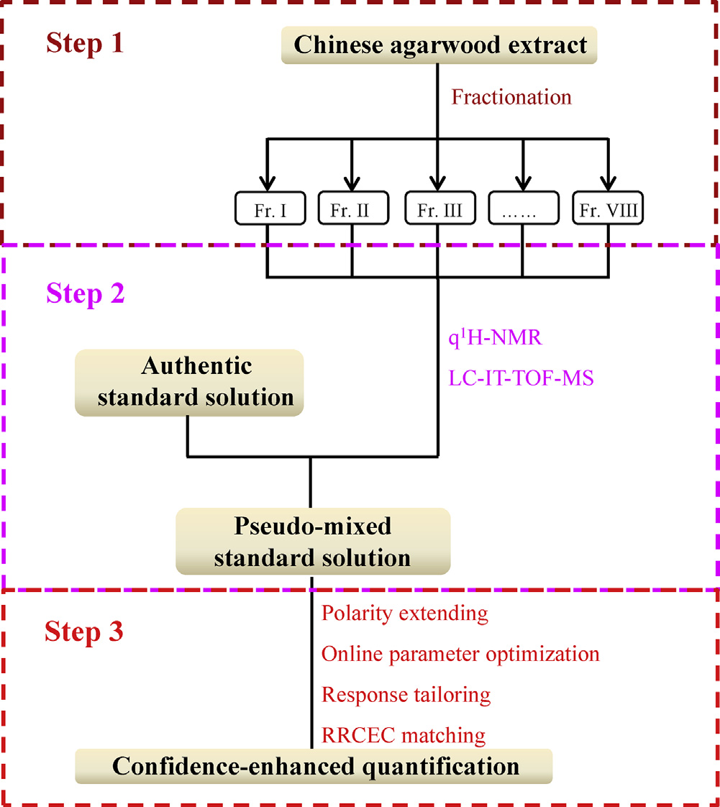
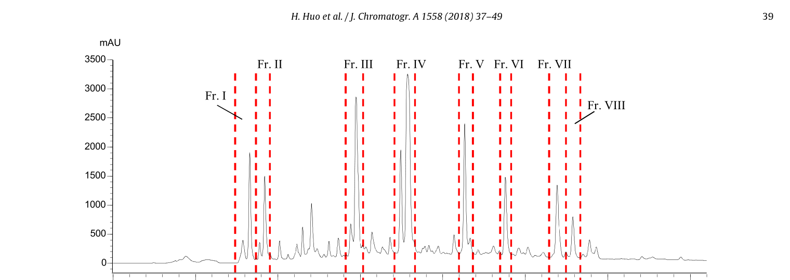
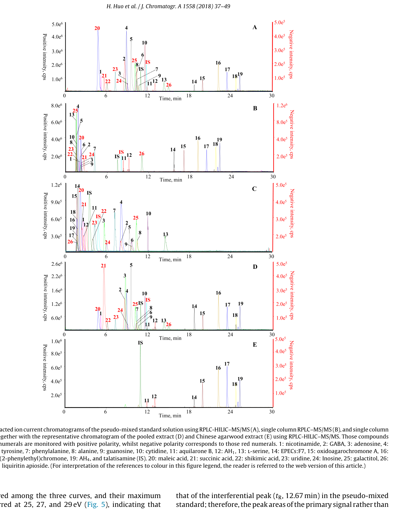
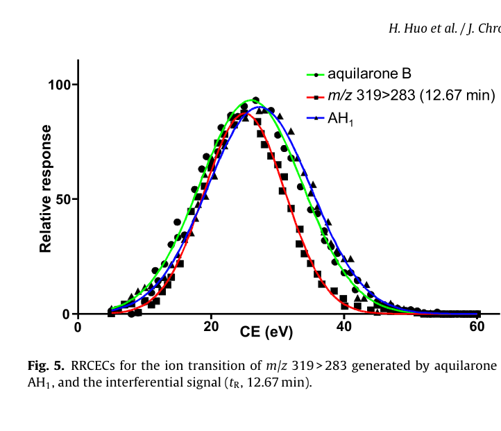
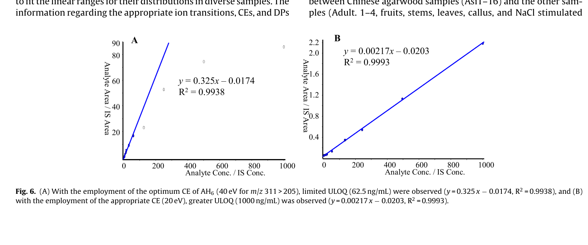

<!-- 方針: ほぼ全訳＋必要に応じた補足。原文構成に沿って訳出。「> 補足:」は訳者注。 -->

## 書誌情報

- 原題: A full solution for multi-component quantification-oriented quality assessment of herbal medicines, Chinese agarwood as a case
- 著者: Huixia Huo, Yao Liu, Wenjing Liu, Jing Sun, Qian Zhang, Yunfang Zhao, Jiao Zheng, Pengfei Tu, Yuelin Song\*, Jun Li\*（北京中医薬大学 中薬学院 現代中薬研究センター、中国）
- 掲載: *Journal of Chromatography A* 1558 (2018) 37–49. https://doi.org/10.1016/j.chroma.2018.05.018
- インパクトファクター: **4.2**（*Journal of Chromatography A*, JCR 2024 相当 / Clarivate。複数の二次情報源の集計値に基づく参考値。近年は概ね3.8〜4.5程度で推移）
- 受理経過: 受領 2018-02-28 / 改訂 2018-04-17 / 採録 2018-05-08 / オンライン公開 2018-05-09。© 2018 Elsevier B.V. All rights reserved.

> 補足: HM = herbal medicine（生薬・漢方薬材）、Q-marker = quality marker（品質マーカー）、q1H-NMR = 定量的1H核磁気共鳴分光法、PCD = 2-(2-phenylethyl)chromone derivative（2-フェニルエチルクロモン誘導体、沈香の代表的な特異成分群）、RRCEC = relative response vs. collision energy curve（相対応答対衝突エネルギー曲線）、RPLC-HILIC = 逆相液体クロマトグラフィーと親水性相互作用クロマトグラフィーの直列連結、MRM = 多重反応モニタリング、DP = declustering potential（脱クラスター電位）、CE = collision energy（衝突エネルギー）、ULOQ = 定量上限、LLOQ = 定量下限、LOD = 検出限界。

## 要旨（Abstract）

生薬(HM)の品質はその明確な臨床治療効果の前提条件であり、多成分（品質マーカー、Q-markerとも呼ばれる）の定量が品質評価の有効な手段として広く重視されている。化学的多様性のため、品質管理の実践は主に4つの技術的ボトルネック——標準品(authentic compound)の不足、極性範囲の広さ、濃度範囲の広さ、潜在的Q-markerに対するシグナルの誤認識——によって著しく妨げられている。本研究ではLC-MS/MSの可能性を高めてこれらの障害に対処することを試み、中国産沈香を事例として用いた。第一に、自家製フラクションコレクターを導入し、全抽出液を自動的に「関心フラクション」の一群に分画した。第二に、定量的1H-NMR(q1H-NMR)を用いてLC-MS/MSの能力を補い各フラクションを詳細に化学プロファイリングし、これら明確に規定されたフラクションを、入手可能な一部の標準品と組み合わせてプールし、「疑似混合標準溶液(pseudo-mixed standard solution)」を作成した。第三に、LC-MS/MS測定に一連の改良を施した。逆相LC(RPLC)と親水性相互作用LC(HILIC)を直列に連結して広い極性範囲に対応し、オンラインパラメータ最適化、レスポンス調整(response tailoring)、およびRRCEC(相対応答対衝突エネルギー曲線)マッチングをMS/MS領域に統合して定量の信頼性を高めた。方法バリデーション後、中国産沈香中の合計26成分の同時定量を実施した。特に、8種の2-(2-フェニルエチル)クロモン誘導体については標準品を用いない定量(authentic compound-free quantification)を達成した。以上より、本戦略は中国産沈香、および他の生薬全般のQ-marker概念指向の品質管理における技術的障壁を完全に克服するための有望な解決策である。

## 1. 序論（Introduction）

生薬(HM)の化学的多様性は、多因子性疾患に対する「多成分・多標的」というユニークな治療原理を生み出す一方[1–6]、品質管理においては厄介な課題となる。近年、「品質マーカー(Q-marker)」という新しい概念が生薬の品質評価のための実践的戦略として広く普及しており[7,8]、その後の作業は、複雑な化合物プールとして広く認識される所与の生薬からそれらQ-markerの正確な定量情報を抽出するための、目的に適った分析ツールの追求に移ってきた。世界中の分析化学者による多大な努力にもかかわらず、最先端の機器であっても、標準品の不足、比較的狭い極性範囲、限られた直線動的範囲、シグナルの誤認識といった技術的障害に完全には対処できていない。本研究では、いくつかの適切な手法を統合することによってこれらのボトルネックを突破するための実行可能な解決策を提案する。

標準品は、応答値と濃度の変換を可能にする検量線を構築するために、LC-MS/MSをはじめとするほとんどの機器にとって必須である。しかし、必要な標準品をすべて商業的に入手することは、コストが高く、労力を要し、面倒であり、時には不可能でさえある。幸い、定量的1H-NMR分光法(q1H-NMR)は、共鳴シグナルが理論上共鳴核の数に直接比例するという原理により、標準品の代わりに単純な内部標準（例：sodium trimethylsilylpropionateや4,4-dimethyl-4-silapentane-1-sulfonic acid）を用いることで定量情報を提供できる[9–11]。分解能・感度に関する固有の欠点を鑑みると、生薬全抽出液の1H-NMRスペクトルから各成分、特に微量成分の定量情報を抽出することは依然として困難な課題であるが、NMR技術の急速な発展により、通常数十化合物を含む比較的単純なフラクションについては詳細な定量分析が今や実現可能である[12]。技術発展のもう一つの恩恵として、全生薬抽出液をq1H-NMRの定量特性に適合するまで単純化する自動フラクションコレクターが今では利用可能である。したがって、q1H-NMRとクロマトグラフィー分画を組み合わせることは、標準品を用いない定量に応じる実行可能な手段となるはずである。

半極性で豊富な成分だけがQ-markerとして関与するのではなく、一部の親水性成分および/または微量成分もHMの品質において重要な役割を果たすことが多い。したがって、適格な方法は、大きな濃度差ならびに極性差を持つ一群の標的を同時に定量できる能力を備えるべきである。妥協案として、関心化合物すべてを一次化合物クラスター、親水性化合物クラスターなどのいくつかのサブグループに分割した上で、一連の方法を開発・適用することは確かに実行可能であるが、非常に煩雑な作業量を要する。幸いにも、極性・濃度拡張定量を達成する先進的パイプラインが既に検証されている[13–15]。逆相液体クロマトグラフィー(RPLC)と親水性相互作用液体クロマトグラフィー(HILIC)を直列に連結することで、単一カラムLCと比較して保持時間窓および分離能を拡張し、各化合物にハイブリッドなクロマトグラフィー機構を付与できる[16,17]。MS/MS領域では、調整された多重反応モニタリング(MRM)により、各分析対象、特に主要成分について、最適ではないパラメータであっても適切なパラメータを設定することで、その線形範囲を所与の全試料での分布範囲に対応させることができる[18,19]。さらに、オンラインパラメータ最適化は、標準品が入手できない場合でも参加化合物に適したパラメータを得るための実践的な方法である[20–22]。

生薬には異性体、さらにはジアステレオ異性体さえも広く存在するにもかかわらず、LC-MRMで捕捉されたシグナルのピーク誤認識の可能性を排除するための構造的同一性の確認に注意が払われることはほとんどなかった。実際、異性体はクロマトグラフィー的にも質量分析的にも類似した挙動を示すことが多いため、これらを識別することは骨の折れる作業である。例えば、*Peucedanum praeruptorum*のLC–MS/MSクロマトグラムでpraeruptorin E（3-angeloyl-4-isovalerylkhellactone）と以前に帰属されていたピークを回収し1H-NMR測定に供したところ、その位置異性体である3-isovaleryl-4-angeloylkhellactoneの存在が明らかとなった事例がある[23,24]。したがって、生薬中で排他的な定量を達成するには、より多くの構造的証拠を関与させるべきである。幸運にも、この一対の位置異性体、praeruptorin Eと3-isovaleryl-4-angeloylkhellactoneの間では異なる相対応答対衝突エネルギー曲線(RRCEC)が生じており、オンラインパラメータ最適化アプローチを適用することでいずれの化合物についてもRRCECを構築することが容易であった[20–22]。したがってRRCECマッチングは、MRMモードの定量的信頼性を高めるために実行可能である。

沈香(Agarwood)とは、*Aquilaria*属植物の非樹脂含浸材から少なくとも部分的に削り出された、樹脂が浸潤した木片を指す[25]。関節痛、炎症性疾患、下痢に対する有望な治療効果から東南アジア諸国、バングラデシュ、中国で民族薬として広く利用されており、興奮剤・鎮静剤・心臓保護剤としても常用され、また多くのコミュニティで文化的・宗教的・薬用の需要を何世紀にもわたり満たしてきた。しかし、樹脂を求めた無差別な伐採による野生原木の減少により、*Aquilaria*属をワシントン条約(CITES)附属書IIに掲載する保全措置が講じられている。沈香、特に中国産沈香の価格は非常に高く金以上とも言われ、市場に大量の偽物や混和物が出回っていることも驚くには当たらない。したがって、臨床上の治療効果と経済的価値の両方を保証するために、中国産沈香に対する厳格な品質評価を実施することが急務である。ここで、前述の技術すべてを統合した作業フロー（図1）を提案し、中国産沈香の精密な品質評価要件を完全に満たすことを目指す。第一に、自家製フラクションコレクターを導入して全抽出液を関心フラクションの一群に自動的に分画した。第二に、q1H-NMRを用いてLC-MS/MSの各フラクションの詳細な化学プロファイリング能力を強化し、明確に規定されたフラクションをプールした上で入手可能な一部の標準品と組み合わせて疑似混合標準溶液を作成した。第三に、先進的LC-MS/MSを適用して26成分の同時定量を実施し、特に8種の2-(2-フェニルエチル)クロモン誘導体(PCD)については標準品を用いない定量を達成した。本戦略は生薬品質評価に関する4つの障壁すべてに対処するよう設計されているため、本パイプラインがQ-marker概念の実践における完全な解決策となることを展望している。

## 2. 実験（Experimental）

### 2.1 試薬・材料

方法適用性の確認に用いた植物中に普遍的に分布する一部の親水性成分——ニコチンアミド、γ-アミノ酪酸(GABA)、バリン、プロリン、チロシン、フェニルアラニン、アラニン、L-セリン、ガラクチトール、アデノシン、グアノシン、シチジン、ウリジン、イノシン——は新京科生物科技公司（北京、中国）より供給された。4種の有機酸（マレイン酸、コハク酸、シキミ酸、および安息香酸）はSigma-Aldrich（米国ミズーリ州セントルイス）より購入した。正・負イオン化モードの内部標準(IS)としてそれぞれ用いたタラチサミン(talatisamine)およびリクイリチンアピオシド(liquiritin apioside)は標準生物科技公司（上海、中国）より商業的に入手した。全化合物の化学構造（図S1、補足情報A）はさらに1H-および13C-NMR分光法で確認し、各標準化合物の純度はHPLC–DAD–IT-TOF-MS測定（島津、東京）により98%超であることを確認した。

ギ酸、メタノール、アセトニトリル(ACN)はLC-MSグレードでThermo-Fisher（米国ペンシルベニア州ピッツバーグ）より供給された。CD3OD（重水素存在度99.8原子%重水素）およびCDCl3（重水素存在度99.8原子%重水素）はCambridge Isotope Laboratories社（米国フロリダ州マイアミ）より購入した。q1H-NMRの内部標準として用いたピラジン（純度＞99%）はAldrich（米国ミズーリ州セントルイス）より入手した。脱イオン水はMilli-Q精製装置（Millipore、米国マサチューセッツ州ベッドフォード）を用いて自家調製した。

中国産沈香16バッチ（Asi1–16）を収集した。4バッチの偽和品（Adult. 1–4）は生薬市場（河北省安国）で収集した。さらに*Aquilaria sinensis*関連材料として果実、茎、葉、カルス、NaCl刺激カルスを各1バッチ、施勝波（Shepo Shi）教授（本学）より提供を受けた。Adult. 1–4を除き、すべての材料は著者の一人（涂鹏飞（Pengfei Tu）教授）により*Aquilaria sinensis*由来であることが同定された。全ての証拠標本は北京中医薬大学中薬学院現代中薬研究センター（北京、中国）に保管されている。

### 2.2 中国産沈香抽出液からの関心フラクションの収集

Asi1–16の各バッチのアリコート（各200 mg）をプールし、超音波抽出（30分）でメタノール抽出した[26]。抽出液はその後、濃縮とクロマトグラフィー分画（Shimadzu LC-20ADモジュラーシステム〔京都、日本〕、半分取YMC-Pack C18カラム〔10 × 250 mm、5 μm、京都、日本〕使用）を順次行った。移動相は水(A)とACN(B)からなり、以下のグラジエントでプログラムした：0–30 min、35–95% B；30–36 min、95% B；流速2 mL/min。流出液は254 nmでモニタリングした。2基の6ポジション/7ポート電動バルブ[24]で構成される自動フラクションコレクターを導入し、8つの関心フラクション（Frs. I–VIII、図2）を、それぞれ流出時間7.4–8.5、8.5–9.5、14.2–15.0、17.3–18.3、21.0–21.6、23.5–24.0、26.7–27.3、および27.3–28.1分に対応させて回収した。

### 2.3 Frs. I–VIIIのNMRおよびLC-高精度MS/MSによる並行測定

各フラクション（Frs. I–VIII）の50 μLアリコートをLC-IT-TOF-MS測定用の別バイアルに採取した。各フラクションの残りの部分は乾固するまで蒸発させた。残渣はCD3OD（Frs. I–III）またはCDCl3（Frs. IV–VIII）600 μL（いずれもピラジンを最終濃度3.125 μmol/Lとなるよう添加）で再溶解し、直ちにNMRチューブ（内径5 mm、Norell ST500-7、米国ノースカロライナ州モーガントン）に移した。1H-NMRスペクトルはVarian UNITY plus 500 MHz分光計（VNMR500、Varian Inc.、米国カリフォルニア州パロアルト）で、TCIクライオプローブおよびZ勾配システムを装備し、プロトン周波数499.91 MHzで、全測定に対し既定パラメータを用いて記録した。

LC-IT-TOF-MS測定については、クロマトグラフィー分離はWaters Acquity UPLC HSS T3カラム（2.1 × 100 mm、1.8 μm、米国マサチューセッツ州ミルフォード）で実施し、流出液は適切な長さのPEEKチューブ（内径0.13 mm）を通してMSのエレクトロスプレーイオン化(ESI)インターフェースに導入した。移動相は0.1%ギ酸水溶液(A)とACN(B)からなり、総流速0.15 mL/minで以下のグラジエントプログラムに従い送液した：0–4 min、10–28% B；4–8 min、28–30% B；10–14 min、30–55% B；14–20 min、55–72% B；20–23 min、72–95% B；23–25 min、95% B；25.1–30 min、10% B。UV吸収は190–400 nmで記録した。注入量は2 μLとした。推奨のマススペクトルパラメータを全スペクトル取得に適用した[27]。

### 2.4 試料調製

q1H-NMRおよびLC-IT-TOF-MSデータセットの慎重な分析の結果、aquilarone B [28]、AH1 [29]、rel-(1aR,2R,3R,7bS)-1a,2,3,7b-tetrahydro-2,3-dihydroxy-5-(2-phenylethyl)-7H-oxireno[f][1]benzopyran-7-one（EPECs:F7）[30,31]、oxidoagarochromone A [32]、AH3 [33]、AH6 [33]、2-(2-phenylethyl)chromone [34]、およびAH4 [33] の8化合物について構造同一性と定量情報が得られた（表1）。それゆえ、これら被分析物に富む各フラクション(Frs. I–VIII)は、乾固後に「疑似標準品(pseudo-authentic compounds)」として定義され、各被分析物の含量（表1）が明確に定まっていたため、入手可能な標準品と組み合わせて「疑似混合標準溶液(pseudo-mixed standard solution)」の構築に用いられた。ISを除き、入手可能な全標準品と被分析物に富む各フラクションはそれぞれDMSOに溶解し、各被分析物濃度4 mg/mLのストック溶液群を作成した。疑似混合標準溶液はこれら全ストック溶液をプールし10%含水ACNで希釈した作業溶液群として調製した。各作業標準溶液はさらに、2種のIS（最終濃度：タラチサミン28 ng/mL、リクイリチンアピオシド166 ng/mL）を含む10%含水ACNで2倍希釈し、所望の濃度の検量線試料シリーズを得た。

**表1. Frs. I–VIIIの質量スペクトルおよび1H-NMRシグナルの帰属**

| 由来 | tR(min)* | MS1 [M+H]+ | 分子式 | MS2 | 誤差(ppm) | 1H NMR (δ ppm, J Hz) | 同定 | 含量 |
|---|---|---|---|---|---|---|---|---|
| Fr. I | 8.66 | 319.1184 | C17H18O6 | 301, 283, 255 | 2.51 | 6.12 (1H, s, H-3), 4.56 (1H, d, J=7.0, H-5), 4.04 (1H, dd, J=3.0,7.0, H-6), 4.02 (1H, dd, J=4.0,2.0, H-7), 4.74 (1H, d, J=4.0, H-8), 7.23 (5H, m, H-2〜6′), 2.94 (2H, m, H2-7′), 3.03 (2H, t, J=8.0, H2-8′) | AH1 | 7.147 mg |
| Fr. II | 8.12 | 319.1172 | C17H18O6 | 301, 91 | −1.25 | 6.15 (1H, s, H-3), 4.81 (1H, overlap, H-5), 4.04 (1H, q, J=2.0, H-6), 3.96 (1H, dd, J=4.5,1.5, H-7), 4.61 (1H, d, J=5.0, H-8), 7.22 (5H, m), 3.02 (2H, m, H2-7′), 2.92 (2H, m, H2-8′) | aquilarone B | 3.272 mg |
| Fr. III | 15.33 | 301.1069 | C17H16O5 | 283, 255, 173 | −0.66 | 6.19 (1H, s, H-3), 3.91 (1H, d, J=4.0, H-5), 3.79 (1H, d, J=3.5, H-6), 4.01 (1H, d, J=7.5,1.0, H-7), 4.58 (1H, d, J=7.5, H-8), 7.24 (5H, m), 3.03 (2H, m, H2-7′), 2.97 (2H, m, H2-8′) | EPECs:F7 | 7.641 mg |
| Fr. IV（主） | 17.03 | 283.0963 | C17H14O4 | 255, 192, 153 | −0.71 | 6.21 (1H, s, H-3), 4.35 (1H, d, J=3.0, H-5), 3.86 (1H, br s, H-6), 4.01 (1H, br s, H-7), 3.86 (1H, br s, H-8), 7.09 (2H, d, J=8.5), 6.84 (2H, d, J=8.5), 7.29 (5H, m), 3.02 (2H, m), 2.91 (2H, m) | oxidoagarochromone A | 31.020 mg |
| Fr. IV（副） | 16.80 | 313.1075 | C18H16O5 | 121 | 1.28 | 6.19 (1H, s, H-3), 7.13 (2H, d, J=7.0), 6.88 (2H, d, J=7.0), 3.83 (3H, s, 4′-OCH3) | oxidoagarochromone B | — |
| Fr. V | 18.76 | 267.1010 | C17H14O3 | 189, 176, 137 | −2.25 | 6.19 (1H, s, H-3), 7.83 (1H, s, H-5), 7.29 (1H, overlap, H-7), 7.35 (1H, d, J=9.0, H-8), 7.29 (5H, m), 3.06 (2H, t, J=7.5), 2.95 (2H, t, J=7.5) | AH3 | 6.948 mg |
| Fr. VI | 19.79 | 311.1272 | C19H18O4 | 220, 205, 181 | −1.93 | 6.15 (1H, s, H-3), 7.55 (1H, s, H-5), 6.90 (1H, s, H-8), 7.27 (5H, m), 4.00 (3H, s, 6-OCH3), 4.02 (3H, s, 7-OCH3), 3.09 (2H, t), 2.95 (2H, t) | AH6 | 4.817 mg |
| Fr. VII | 21.79 | 281.1173 | C18H16O3 | 203, 190, 151 | −0.80 | 6.16 (1H, s, H-3), 7.56 (1H, d, J=3.0, H-5), 7.26 (1H, overlap, H-7), 7.38 (1H, d, J=9.0, H-8), 7.25 (5H, m), 3.91 (3H, s, 6-OCH3), 3.08 (2H, t), 2.94 (2H, t) | AH4 | 3.083 mg |
| Fr. VIII | 21.19 | 251.1065 | C17H14O2 | 173, 160, 91 | −0.36 | 6.18 (1H, s, H-3), 8.21 (1H, dd, J=7.5,1.0, H-5), 7.39 (1H, t, J=8.0, H-6), 7.65 (1H, dt, J=1.5,8.5, H-7), 7.43 (1H, d, J=8.5, H-8), 7.23 (5H, m), 3.07 (2H, t), 2.94 (2H, t) | 2-(2-phenylethyl)chromone | 4.894 mg |

注：*保持時間はいずれもLC-IT-TOF-MSで取得。

一方、乾燥させた各試料（Asi1–16、Adult. 1–4、果実・茎・葉・カルス・NaCl刺激カルス）はそれぞれ粉砕し、0.25 mmふるいを通した。さらに、全試料に含まれる成分を網羅すると期待される「プール試料」を、全試料のアリコート（各10 mg）を混合して調製した。各抽出液は粉砕物（100 mg）を50%含水メタノール5 mLに懸濁し超音波抽出して得た。抽出後、抽出中に失われた重量を補うため50%含水メタノールを追加した。その後、各抽出液を10000×gで10分間遠心分離し、上清を0.22 μm膜で濾過した。検量線試料と並行して、各濾液は10%含水ACNで100倍希釈した後、IS添加10%含水ACNで2倍希釈して測定に供した。

### 2.5 RPLC-HILIC構成

RPLC-HILIC領域は複数のShimadzu LCモジュール（京都、日本）——4台のLC-20ADXRポンプ（ポンプA–D）、CBM-20Aコントローラー、DGU-20A3Rデガッサー、CTO-20ACカラムオーブン、2基のHPミキサー——から構成した。装置構成および溶出プログラムは、我々の既報論文[13–15,35]の記載に若干の変更を加えて踏襲した。要約すると、Waters Acquity UPLC HSS T3カラム（2.1 × 100 mm、1.8 μm、米国マサチューセッツ州ミルフォード）とWaters Xbridge Amideカラム（4.6 × 150 mm、3.5 μm）を直列に連結し、それぞれRPLCおよびHILICの機構を各被分析物に順次付与した。ポンプAおよびBはそれぞれ0.1%ギ酸水溶液(A)とACN(B)をミキサーへ、続いてT3カラムへ、LC-IT-TOF-MS測定と同一のグラジエント溶出プログラムで供給した。一方、ポンプCおよびDはそれぞれ10 mM酢酸アンモニウム水溶液(C)とACN(D)をRPLCカラムからの流出液に添加する役割を担い、以下のように送液した：0–4 min、100% D；4–14 min、100–80% D；14–22 min、80–70% D；22.1–30 min、100% D；流速1.0 mL/min。いずれのカラムも40℃に保持し、オートサンプラーの注入量は2 μLとした。

同時に、RPLC-HILICの利点を評価するため単一カラムLCも実施した。並行測定を確保するため、RPLC-HILICと単一カラムRPLCまたは単一カラムHILICとの違いは、T3カラム（単一カラムRPLC用）またはAmideカラム（単一カラムHILIC用）を、同等の長さのPEEKチューブ（内径0.13 mm）に置き換える点のみとした。

### 2.6 調整済みMRM検出

エレクトロスプレーイオン化(ESI)インターフェースを装備したSCIEX 5500 Qtrap質量分析計（米国カリフォルニア州フォスターシティ）でLC領域からの流出液を受けた。各被分析物のプリカーサーイオンおよびプロダクトイオンは、標準品または関心フラクションをRPLC-HILIC–MS/MSに注入し、エンハンストマススペクトルトリガーエンハンストプロダクトイオン(EMS-EPI)モードによるMS/MS検出により取得した。正・負極性は個別に適用した。EMSの主要パラメータ、すなわち脱クラスター電位(DP)および衝突エネルギー(CE)は±100 Vおよび±5 eVに、EPI実験のCEおよび衝突エネルギー拡散(CES)は±35 eVおよび25 eVにそれぞれ設定した。その後、明確に規定されたオンラインパラメータ最適化アプローチを用いて各被分析物の適切なパラメータを取得しRRCECを構築した[20–22]。

要約すると、優勢なプリカーサーイオンおよびプロダクトイオンがMRMイオン遷移候補を構成し、各候補はさらに一連の擬似イオン遷移(pseudo-ion transitions, PIT)を生成した。例えばAH3の場合、プロトン化分子イオン([M+H]+)がm/z 267で検出され、主要フラグメントイオン種がm/z 189、137、91で観測された。ここから複数のイオン遷移候補（m/z 267 > 189、267 > 137、267 > 91など）が構築され、各候補（例：m/z 267 > 189）はさらに、m/z 267.000 > 189.000、267.001 > 189.000のように、5–135 eVの間で2 eV刻みに段階化されたCEに正確に対応する一群のPITを生成した。大幅に拡張されたイオン遷移に対応するためスケジューリングアルゴリズムを用いた[36]。またこれらのPITは同様の方法でDP最適化にも利用された。

### 2.7 方法バリデーションと定量測定

方法バリデーションは直線性、感度、精度、安定性、回収率の各試験について実施した。直線性を除き、他の試験は推奨プロトコル[37]に従い、混合標準溶液を疑似混合標準溶液に置き換える点のみを変更して実施した。

直線性は、各被分析物について6濃度水準以上の内部標準検量線を用いて評価し、被分析物とそれに対応するISとのピーク面積比を、試験範囲にわたる濃度比に対してプロットして検量線を構築した。必要に応じて線形回帰を改善するため1/x重み付け関数を適用した。予備実験では、中国産沈香中のaquilarone B、AH1、EPECs:F7、oxidoagarochromone A、AH3、AH6、2-(2-phenylethyl)chromone、AH4といった主要成分の含量が、最適パラメータ使用時にはそれらの直線範囲を超えることが判明した。そこで、それら主要成分の豊富な分布に適合する定量上限(ULOQ)を拡大するため、劣ったCE（optimum CEより低いCE）を採用するレスポンス調整(response suppression)[13–15,21]を導入した。その後、これら適切なCEが、これら主要成分の定量用モニタリングリストにおいて最適CEに置き換わり、他の成分には最適パラメータを適用した（表2）。またMRMはEPIスキャンをトリガーするサーベイ実験としても機能し、MS2スペクトルの取得に用いた。

その後、バリデーション済みの方法を、Asi1–16、Adult. 1–4、果実、茎、葉、カルス、NaCl刺激カルスを含む全収集試料中の合計26成分の同時定量に適用した。各試料に3つのモニタリングプログラムを適用した——第一は全ての正イオンPIT、第二は全ての負イオンPIT、第三（定量プログラム）は表2に示す情報から構成される。定量法については、Qtrap質量分析計が高速な極性切り替えをデータ品質を損なわずに可能とするため正・負極性を同時に適用し、各実験は3反復で実施した。

**表2. 全26被分析物および2種ISの定量分析における保持時間・イオン遷移・化合物依存質量パラメータ（要約）**

RPLC-HILIC、単一カラムRPLC、単一カラムHILICそれぞれの保持時間（tR-RPLC-HILIC / tR-RPLC / tR-HILIC、min）、イオン遷移、DP(V)、CE(eV)を原文Table 2は全26成分＋IS 2種について網羅している。主な数値は以下の通り（\*はレスポンス調整で最適CEから変更した値、括弧内が実測の最適CE）。

| No. | 分析対象 | tR-RPLC-HILIC | tR-RPLC | tR-HILIC | イオン遷移 | DP(V) | CE(eV) |
|---|---|---|---|---|---|---|---|
| 1 | nicotinamide | 5.13 | 2.06 | 2.48 | 123>80 | 30 | 30 |
| 2 | GABA | 8.57 | 1.56 | 8.05 | 104>87 | 40 | 16 |
| 3 | adenosine | 8.70 | 2.24 | 5.58 | 268>136 | 40 | 30 |
| 4 | valine | 8.85 | 1.86 | 7.97 | 118>72 | 25 | 18 |
| 5 | proline | 9.48 | 1.67 | 9.13 | 116>70 | 50 | 20 |
| 6 | tyrosine | 10.25 | 2.32 | 9.62 | 183>136 | 25 | 19 |
| 7 | phenylalanine | 10.35 | 4.24 | 7.21 | 166>120 | 50 | 19 |
| 8 | alanine | 10.38 | 1.59 | 10.38 | 90>44 | 25 | 17 |
| 9 | guanosine | 10.60 | 2.32 | 9.40 | 284>152 | 40 | 25 |
| 10 | cytidine | 11.32 | 1.64 | 11.92 | 244>112 | 25 | 17 |
| 11 | aquilarone B | 11.82 | 8.38 | 2.52 | 319>283 | 50 | 20\*(28) |
| 12 | AH1 | 12.97 | 9.18 | 2.93 | 319>283 | 50 | 20\*(25) |
| 13 | L-serine | 14.28 | 1.56 | 14.46 | 106>60 | 40 | 16 |
| 14 | EPECs:F7 | 18.65 | 15.69 | 1.74 | 301>91 | 70 | 25\*(55) |
| 15 | oxidoagarochromone A | 19.85 | 17.13 | 1.61 | 283>227 | 100 | 10\*(20) |
| 16 | AH3 | 22.21 | 19.16 | 1.63 | 267>189 | 130 | 15\*(32) |
| 17 | AH6 | 23.40 | 20.39 | 1.57 | 311>205 | 50 | 20\*(40) |
| 18 | 2-(2-phenylethyl)chromone | 24.66 | 21.72 | 1.54 | 251>160 | 60 | 15\*(32) |
| 19 | AH4 | 25.23 | 22.29 | 1.54 | 281>151 | 120 | 25\*(50) |
| IS1 | talatisamine | 10.88 | 7.54 | 3.82 | 422>390 | 120 | 39 |
| 20 | maleic acid | 4.77 | 2.26 | 2.16 | 115>71 | −35 | −15 |
| 21 | succinic acid | 5.67 | 2.71 | 2.35 | 117>73 | −35 | −12 |
| 22 | shikimic acid | 6.10 | 1.84 | 4.09 | 173>111 | −70 | −15 |
| 23 | uridine | 7.28 | 2.16 | 4.28 | 243>200 | −120 | −15 |
| 24 | inosine | 9.07 | 2.37 | 6.04 | 267>135 | −80 | −30 |
| 25 | galactitol | 10.24 | 1.63 | 10.17 | 181>101 | −100 | −19 |
| 26 | benzoic acid | 15.01 | 11.07 | 1.92 | 121>77 | −40 | −14 |
| IS2 | liquiritin apioside | 11.79 | 8.10 | 4.73 | 549>255 | −150 | −42 |

### 2.8 データ処理と統計解析

Analystソフトウェア（Version 1.6.2、SCIEX）の定量モジュールをピーク検出、ピーク積分、検量線回帰、被分析物定量を含むデータ処理に用いた。全ピーク面積の算出には自動Analyst classic積分アルゴリズムを用い、平滑化係数・バンチング係数はそれぞれ2、1とした。定量データセットはGraphPad Prism 5.0（Graphpad Software、米国サンディエゴ）に転送しRRCECを描画した。その後、階層クラスタリング付きヒートマップはMetaboAnalystソフトウェア（http://www.metaboanalyst.ca）で作成した。

## 3. 結果と考察（Results and discussions）

### 3.1 関心フラクションの詳細な化学プロファイリング

中国産沈香全抽出液をq1H-NMR分光測定に供したところ、複雑なスペクトルプロファイル（データ非掲載）が得られ、q1H-NMRの基準を満たす特定のシグナル、ましてや関心化合物を見出すことは極めて困難であった。したがって、潜在的Q-markerを濃縮するためにクロマトグラフィー分画による全抽出液の単純化が必要であった。幸い、2基の6ポジション/7ポート電動バルブ[24]で以前に構成された自動フラクションコレクターは、1回の分析プログラム内で最大10フラクションの自動収集を可能にしていた。ここでは、8種の関心化合物に富む8フラクション（Frs. I–VIII、図2）を取得するために当該モジュールを導入し、バルブ切り替えは7.4、8.5、9.5、14.2、15.0、17.3、18.3、21.0、21.6、23.5、24.0、26.7、27.3、28.1分の各時点で順次スケジュールした。

その後、各フラクションについて1H-NMRとLC-IT-TOF-MSによる並行測定を実施した。NMR分光およびLC-IT-TOF-MSデータセットの共同解析の結果、中国産沈香の診断的化学クラスターとして広く認識されている合計9種のPCD[31,38–46]が明確に同定された（表1およびFig. S2、補足情報A）。

Fr. IVを例にとると、主要ピーク（tR 17.03 min）と微量ピーク（tR 16.80 min）がLC-IT-TOF-MSで検出された（表1）。主要ピークはプロトン化分子イオンm/z 283.0963（[M+H]+、C17H15O4に対する誤差−0.71 ppm）と優勢なフラグメントイオン種m/z 255、192、153を示し、一方微量ピークに対応する明確なシグナルはm/z 313.1075（[M+H]+、C18H17O5に対する誤差1.28 ppm）および121で観測された。1H-NMRスペクトル（図3）ではδ 6.21 (1H, s)、4.35 (1H, d, J=3.0 Hz)、3.86 (1H, br s)、4.01 (1H, br s)、3.86 (1H, br s)、7.09 (2H, d, J=8.5 Hz)、6.84 (2H, d, J=8.5 Hz)、7.29 (5H, m)、3.02 (2H, m)、2.91 (2H, m)の一群のシグナルがoxidoagarochromone Aの存在を示した[31]。同時に、δ 6.19 (1H, d, J=7.0 Hz)、7.13 (2H, d, J=7.0 Hz)、6.88 (2H, d, J=7.0 Hz)、3.83 (3H, s, 4-OCH3)の一連のシグナルも検出された（図3）。微量ピークの質量分析データと合わせ、この化合物はoxidoagarochromone Aの4位メトキシ化生成物であるoxidoagarochromone B[32]と確定的に特徴付けられた。同様の分析手法により、AH1、aquilarone B、EPECs:F7、AH3、AH6、AH4、2-(2-phenylethyl)chromoneがそれぞれFrs. I、II、III、V、VI、VII、VIIIから同定された（表1およびFig. S2、補足情報A）。このうちaquilarone BとAH1は一対のジアステレオ異性体であり、構造上の差異はA環の水酸基の立体配置のみに存在するため、定量分析時の誤認識リスクを示唆していた。

ピラジンの診断的単一線シグナルは常にδ 8.65に孤立して観測された（図3およびFig. S2）。一方、ほとんどのPCD（AH1、oxidoagarochromone A、AH3、AH6、AH4、2-(2-phenylethyl)chromone）の5-Hに属する二重線シグナルは孤立して出現したため、これを定量シグナルとして採用した。しかしaquilarone BおよびEPECs:F7についてはそれぞれδ 4.61 (1H, d, J=5.0 Hz)およびδ 4.58 (1H, d, J=5.0 Hz)（8-Hに対応）で適格な定量シグナルが検出された。oxidoagarochromone AとBの間には構造的な類似性が大きいにもかかわらず、標的となる単一線シグナルδ 6.21（1H, s, oxidoagarochromone AのH-3）は隣接するシグナルδ 6.19（1H, s, oxidoagarochromone BのH-3）と満足な分離を示したため、定量分析に利用可能であった。oxidoagarochromone Bの量は正確に算出できず、そのため定量分析には含めなかった。その後、各フラクション中の各被分析物の量（表1）は、明確に規定された式[10,11]を用いて算出した。

### 3.2 全被分析物の包括的な保持・分離

RPLCおよびHILICそれぞれのクロマトグラフィー機構に関する複数の候補を慎重に評価し、全被分析物について満足な保持・分離挙動を達成するよう溶出プログラムも最適化した。RPLC-HILICの構成および溶出プログラム最適化の詳細は補足情報Bに記載する。

多数の成分がボイド時間付近で保持されない性質のため単一RPLCまたはHILICカラムのいずれかで共溶出すると、質量応答に対する広範なマトリックス効果を招く重要なイオン化競合が発生する。したがって、RPLC-HILIC構築の主目的は、親水性・疎水性成分の両方について普遍的な保持を達成することであった。疑似混合標準品はRPLC-HILIC、単一カラムRPLC、単一カラムHILICの比較に用いられた。並行測定の結果、代表的なクロマトグラム（図4）が得られ、詳細な比較を実施した。全体として、RPLC-HILICから得られた各被分析物の保持時間はいずれも4.50 min超であり、全被分析物が満足な保持挙動を得たことを示していた（図4A）。一方、一部の被分析物（ニコチンアミド、GABA、アデノシン、バリン、プロリン、チロシン、アラニン、グアノシン、シチジン、L-セリン、マレイン酸、シキミ酸、ウリジン、イノシン、ガラクチトールなど）はT3カラムで、また一部の被分析物（ニコチンアミド、aquilarone B、AH1、EPECs:F7、oxidoagarochromone A、AH3、AH6、2-(2-phenylethyl)chromone、AH4、マレイン酸、コハク酸、安息香酸など）はAmideカラムで、それぞれ極性範囲に関する保持上の欠点によりほぼボイド時間で溶出した（図4B, C）。特筆すべきは、AH1とその隣接する干渉ピークとの間でより高い分離度が、単一カラムRPLC（tR、8.98 min）と比較してRPLC-HILIC（tR、12.67 min）で得られたことである。一方、単一カラムHILICでは干渉物とAH1の間で重大な重なりが生じた。総じて、RPLC-HILICは単一カラムRPLCおよび単一カラムHILICのいずれよりも、各被分析物について望ましいクロマトグラフィー挙動を得るための優れた選択肢であった。

### 3.3 オンラインパラメータ最適化

疑似標準品（実際には被分析物に富むフラクション）が得られた後、イオン遷移、DP、CEを含むMRMパラメータの最適化を試みた。標準品が入手可能な場合、所与の被分析物の最適パラメータは推奨プロトコル[1]に従うことで容易に得られる。しかし、シリンジポンプでフラクションを質量分析計に注入する際、関心被分析物のプリカーサーイオンおよびプロダクトイオンを見出すことは非常に困難であった。標準品に依存しないアプローチであるオンラインパラメータ最適化[20–22]は必要なパラメータを提供可能であり、PCD標準品の不在に応じてこれを導入した。AH3に富むFr. Vを代表例とすると、プリカーサーイオンはm/z 267として得られ、そのプロダクトイオンはそれぞれフェニル開裂、レトロディールス・アルダー開裂、ベンジル開裂に対応するm/z 189、137、91に生じた（Fig. S3A、補足情報A）[47,48]（Fr. VをRPLC-HILIC–EMS-EPI測定に供した際）。m/z 267 > 189、267 > 137、267 > 91などの全イオン遷移候補をパラメータ最適化に関与させ、3組のPITを生成した。全PITの応答をガウス曲線フィッティングによりRRCEC構築に導入した（Fig. S3B、補足情報A）。イオン遷移m/z 267 > 189は他のイオン対より感度が高く、RRCECの頂点に対応する最適CEはそれぞれ32、52、60 eVで観測された（Fig. S3B、補足情報A）。その後、各PITに最適CEを割り当てることで最適DP値130 Vを得た。総じて、最適イオン遷移、DP、CEはそれぞれm/z 267 > 189、130 V、32 eVであった。他の被分析物についても同様の方法で最適パラメータを取得し、全最適値を表2にまとめた。

### 3.4 RRCECマッチングによる同一性の確認

異性体は生薬中に広く分布しクロマトグラフィー的にも質量分析的にも極めて類似した性質を示すことが多いため、定量結果はシグナル誤認識および不純物を含む捕捉シグナルのリスクを負う。したがって、各被分析物の同一性確認のために、保持時間、MRMイオン遷移、MS2スペクトルに加え、RRCECを直交する構造的手掛かりとして導入した。疑似混合標準溶液のクロマトグラム（図4A）では、aquilarone B（tR、11.82 min）とAH1（tR、12.97 min）に加え、m/z 319 > 283のイオン遷移で別のシグナル（tR、12.67 min）が捕捉された。さらに悪いことに、この干渉物とAH1のtR間隔はわずか0.3 minであり、わずかなtRシフトがシグナル誤認識を招く可能性を示していた。aquilarone B、AH1、および干渉シグナルのRRCECは、これらの異性体、特にAH1対干渉物を識別するためGraphPad Prism 5.0ソフトウェアにPITの応答を取り込んで構築した。3曲線の間には明らかな差異が観察され、それぞれの最大応答は25、27、29 eVで生じた（図5）ことから、RRCECはこれらの異性体を区別する潜在能力を示していることが分かった。

各中国産沈香試料（Asi1–16）について、tR 11.80 min（±0.3 min）付近のm/z 319 > 283信号のRRCECはFr. IIから得られた参照曲線とよく一致し、これらシグナルの正確な同一性がaquilarone Bであることが示唆された。しかし、Asi1–16ではtR窓12.4–13.3 min内にm/z 319 > 283によって主要シグナルと微量ピークが通常捕捉され、いずれのピークにもわずかな移動（±0.3 min）が観察された。主要シグナルのRRCECは通常AH1のものと一致し、一方微量シグナルのRRCECは常に疑似混合標準中の干渉ピーク（tR、12.67 min）のものとよく一致した。したがって、AH1の回帰検量線を用いた濃度算出には、微量シグナルではなく主要シグナルのピーク面積を適用した。

RRCECマッチングは、疑似混合標準溶液と抽出液試料の間でRRCECを対応付けることにより、他の捕捉シグナルの同一性を確認するためにも用いられ、幸いにも保持時間（許容差±0.3 min）とイオン遷移によるシグナルの整合後、各RRCECペア間で正確な一致が生じた。その結果、捕捉された各シグナルの同一性および純度が確定的に確認された。

### 3.5 直線範囲のカスタマイズ

最適パラメータを検量線構築に適用したところ、8種PCDの直線範囲は抽出液中の高含量を完全にカバーできないことが判明した。MRMベース定量の原理は、実際にはQ3チャンバー末端の電子増倍管で規定プロダクトイオンをカウントすることであり、ULOQはセンサー飽和によって狭められることが多いため、標的プロダクトイオンの生成を抑制することでULOQを拡大することは理論上実行可能である[13]。イオン遷移、DP、CEを含む化合物依存パラメータはプロダクトイオン生成に重要な役割を果たす。特にCEは、イオン遷移およびDPと比較して直線範囲カスタマイズに対しより柔軟であった[13]。そこで、適切なCEを追求することでこれらPCDのULOQを拡大する試みを行った。

最適パラメータ（イオン遷移m/z 311 > 205、CE 40 eV、DP 130 V）を適用した場合、AH6の62.5 μg/mLを超える濃度での質量応答は期待されるピーク面積比よりかなり低かった（図6A）。その後、PITを個別に検量線構築に用いた。その結果、最適CE（40 eV）から離れた間隔の増加に伴いULOQは徐々に拡大し、CE 20 eVに対応してULOQは最大1000 μg/mLに達した（図6B）ことから、全試料中のAH6の定量分析が可能となった。したがって、AH6定量用モニタリングリストにおいて劣ったCE（20 eV）が最適CE（40 eV）の役割を代替した。さらに、直線範囲カスタマイズは他のPCDについても多様な試料での分布に適合するよう実施した。適切なイオン遷移、CE、DPに関する情報は表2にまとめ、レスポンス調整に関与した主要成分にはアスタリスクを付した。

### 3.6 方法バリデーション

被分析物に富むフラクションと入手可能な一部標準品からなる疑似混合標準溶液を、その後各種方法バリデーション試験に供した。適切なパラメータおよび最適化溶出プログラムの適用後、検量線試料の代表的クロマトグラムが図4Aとして得られた。関心化合物すべてが、それぞれの濃度範囲内で優れた直線性（r＞0.994）を示した（表S1、補足情報B）。感度試験の結果（表S1）——定量下限(LLOQ、0.09–188.25 ng/mL)および検出限界(LOD、0.04–93.75 ng/mL)を含む——は、開発した方法が26化合物の抽出液試料中同時定量に十分な感度を有することを証明した。さらに、日内変動(RSD%、2.46–14.42%)および日間変動(RSD%、3.56–14.58%)の性能、ならびに低・中・高各濃度水準における回収率(81.65–119.35%、RSD% 1.10–11.76%)（表S2、補足情報B）は、開発した方法が信頼できる定量の要件を満たし得ることを実証した。良好な再現性(RSD%、3.20–11.46%)も得られた。以上より、新規開発した方法は26化合物の高感度・高精度・高正確度・高再現性の同時定量分析を達成できることが示された。

### 3.7 全関与試料における26成分の同時定量

バリデーション済み方法は、8種PCD（aquilarone B、AH1、EPECs:F7、oxidoagarochromone A、AH3、AH6、2-(2-phenylethyl)chromone、AH4）、5種ヌクレオシド（アデノシン、グアノシン、シチジン、ウリジン、イノシン）、4種有機酸（マレイン酸、コハク酸、シキミ酸、安息香酸）、7種アミノ酸（GABA、バリン、プロリン、チロシン、フェニルアラニン、アラニン、L-セリン）、およびガラクチトールとニコチンアミドを含む26被分析物の同時定量に用いられた。プール粉末抽出液と選定した中国産沈香試料のクロマトグラムはそれぞれ図4Dおよび図4Eに、他の試料タイプに対応する代表的クロマトグラムはFig. S4（補足情報A）に示す。

全定量結果は表3にまとめられている（26成分×27試料の全数値マトリクスは原論文Table 3を参照）。全体として、中国産沈香試料(Asi1–16)と他の試料（Adult. 1–4、果実、茎、葉、カルス、NaCl刺激カルス）の間で定量パターンに有意な違いが観察された。中国産沈香試料はPCDに富む一方、他の被分析物には乏しかった。逆に、炭水化物、ヌクレオシド、有機酸、アミノ酸といった一次代謝物は他の試料群で豊富に見られたが、Adult. 1–4、果実、茎、葉、カルス、NaCl刺激カルスではPCDは微量、あるいは痕跡程度の分布にとどまった。したがって、PCDは中国産沈香の診断的化学クラスターとして機能し得る一方、それら一次代謝物の低含量もまた品質の判定基準として考慮されるべきである。

中国産沈香試料間でも顕著な変動が生じた。Asi13(109.02 mg/g)およびAsi16(114.80 mg/g)における8種PCDの総含量は他の中国産沈香試料よりかなり高かった一方、Asi3、Asi14、Asi2ではそれぞれわずか2.36、2.40、3.65 mg/gにとどまった。Oxidoagarochromone Aは通常最も豊富な成分であり、特にAsi8(38.10 mg/g)、Asi13(52.37 mg/g)、Asi16(52.43 mg/g)で高く、一方Asi1–3、Asi10、Asi12、Asi14では微量分布であった。Aquilarone B(1.35–11.33 mg/g)は全中国産沈香試料で有意に検出され、粗生薬材のほぼ0.5%を占め、EPECs:F7(0.50–16.71 mg/g)も広範に分布していた。

> 補足: 表3は26成分×27試料（Asi1–16、Adult.1–4、果実・茎・葉・カルス1・2・NaCl刺激カルス）の巨大な定量マトリクスであり、大半のヌクレオシド・有機酸・アミノ酸は中国産沈香では N.D.（検出限界未満）または N.Q.（定量限界未満だが検出可）であった一方、偽和品・関連材料ではしばしば定量可能な濃度で検出された（例：GABAは偽和品Adult.1で0.089 mg/g、カルス1で0.59 mg/g、シチジンはカルス1で2.41 mg/gなど）。8種PCDについては本文中の記載値（総量・oxidoagarochromone A・aquilarone B・EPECs:F7の範囲）を除き、原文Table 3に全16バッチ分の実測値（平均±SD）が掲載されている。網羅的な全数値の引用は紙面上困難なため、本訳では上記の代表値・傾向の記述にとどめる。数値そのものが必要な場合は原文参照。

代表的な例として、8種PCD合計含量が特に高かった上位バッチ（Asi16 114.80 mg/g、Asi13 109.02 mg/g）と低かった下位バッチ（Asi2 3.65 mg/g、Asi14 2.40 mg/g、Asi3 2.36 mg/g）の対比は、同一のAquilaria sinensis由来であっても沈香の品質（樹脂化・熟成度合いなど）によって指標成分含量が30倍以上開き得ることを示している。

含量データセットはより視覚的な比較のためヒートマップにも変換された（図7）。全中国産沈香試料は単一のグループ（グループI）にクラスタリングされた。偽和品試料もまた一つのグループ（グループII）にまとまり、果実、茎、葉、カルス、NaCl刺激カルスといった関連材料は別のグループ（グループIII）に位置した。明らかに、グループIはPCDに富む一方、他の被分析物には乏しかった。逆に、炭水化物、ヌクレオシド、有機酸、アミノ酸といった一次代謝物はグループIIおよびIIIで見出されたが、これら2グループではPCDは微量、あるいは痕跡程度の分布であった。結果として、これら偽和品試料および関連材料は中国産沈香の代替品として機能し得ないことが示された。PCDはこの貴重な生薬を識別する適格なQ-markerであり、一次代謝物もまた中国産沈香と他の試料を区別する上で有用であった。

多くの場合、混合標準溶液と試験試料間のピーク整合には保持時間とMRMイオン遷移のみが利用される。さらに悪いことに、ピーク形状が定量要件を満たしている場合、捕捉シグナルの純度に注意が払われることはほとんどない。したがって、多数の異性体、さらにはジアステレオ異性体を含むと考えられる生薬に対して多成分定量を実施する際には、ピーク誤認識と不純なシグナルの重大なリスクが存在する。Qtrap-MS装置上のEPI実験により簡便に生成されるMS2スペクトルのマッチングにより定量的信頼性を高めることはできるものの、異性体はほぼ同一の物理化学的パラメータを有するため、その干渉を完全に排除することはできない。理論上、プリカーサーイオンからプロダクトイオンへの移行には結合解離が関与し、結合エネルギーと規定CEが共同で所与のプロダクトイオンの形成過程を決定する[49]。結合エネルギーは構造変化に対し極めて敏感であり[21]、さらに重要なことに、不純物、さらにはジアステレオ異性体の関与が解離過程に有意な影響を与えることが実証されている（当グループの未発表データ）。したがって、参照シグナルと捕捉シグナル間の精密なピーク整合を達成するため、保持時間、MRMイオン遷移、MS2スペクトルに対する直交的構造証拠としてRRCECを構築した。本研究では、aquilarone B、AH1、干渉シグナルの間で、それらの構造的類似性が高いにもかかわらず異なるRRCECが観察された。したがって、RRCECマッチングはLC-MRMの定量的信頼性を高める資格を有するといえる。

標準品はLC-MSベースの定量にとって前提条件であり、パラメータ最適化および検量線構築に通常必須であるためである。しかし、高純度(＞98%)の必要な標準品すべてを商業的に収集することはコストがかかり、時には不可能であり、また生薬から精製することも時間的・金銭的コストを要する。幸いにも、q1H-NMRの本質的なピーク生成原理に基づき、比較的単純なマトリックスに対する標準品不要の定量ツールとして推奨されており[9–11]、自動フラクションコレクターは所与の生薬抽出液を一群のフラクションに単純化する実行可能な方法を正確に提供する。PIT間の差異(0.001 Da)がQ1およびQ3セルの分解能(0.6–0.8 Da)よりはるかに小さく、滞留時間およびポーズ時間を3 msという短さまで到達できるため[36]、SCIEX 5500 Qtrapは1回の分析実行内で複数組のPITの応答取得を可能にする。そしてパラメータ最適化は、標準品の関与なしに一群のPIT間の応答を比較することで達成できる。

さらに、限られた直線動的範囲やLC-MSの狭い極性範囲といった他の2つの技術的障壁も、RPLC-HILIC–調整済みMRMにより回避できる[13]。以上より、RRCECマッチング、q1H-NMR、自動フラクションコレクター、オンラインパラメータ最適化、RPLC-HILIC–調整済みMRMといった前述の技術の統合は、標準品を用いない方法で大きな含量差・極性差を持つ一群の被分析物の精密な定量を確実に可能にする。

## 4. 結論（Conclusions）

生薬(HM)は常に「多成分・多標的」として特徴付けられるが、化学的多様性がこの特徴にしばしば伴い、標準品の不足、比較的狭い極性範囲、限られた直線動的範囲、シグナル誤認識といった障壁により、その品質評価に劇的な作業量を発生させる。本研究では、q1H-NMRによる標準品不要の定量能力、RPLC-HILIC–調整済みMRMによる含量・極性拡張的な決定能力、RRCECマッチングによる構造的統合を組み合わせることで、これら4つの制約すべてに対処する完全な解決策を提案した。3段階の連続的ステップを実施した：1) 自家製自動フラクションコレクターにより全抽出液を関心フラクション群に分画した；2) q1H-NMRとLC-MS/MSを組み合わせて全フラクションの詳細な化学プロファイリングを行い、その後これらをプールして入手可能な標準品を添加し疑似混合標準溶液を得た；3) RPLC-HILIC–調整済みMRMを定量分析に用い、RRCECマッチングを実装して定量結果の信頼性を高めた。本戦略の適用性は、PCDについて標準品が入手できなかったにもかかわらず、親水性から疎水性まで、また微量から多量までにわたる26成分を中国産沈香ならびに一部の偽和品・関連材料において同時定量することで確認され、多様なバリデーション試験により新規開発方法の信頼性が検証された。定量パターンには試料タイプ間だけでなく、中国産沈香の異なるバッチ間でも有意な変動が生じた。PCDは中国産沈香に濃縮され得る一方、Adult. 1–4、果実、茎、葉、カルス、NaCl刺激カルスではPCDは微量、あるいは痕跡程度の分布にとどまった。したがって、PCDは中国産沈香のQ-markerとして機能し得る一方、それら一次代謝物の低含量もまた品質のマイナス要因として考慮されるべきである。さらに重要なことに、本研究はQ-marker概念指向の中国産沈香、および他の生薬全般の品質管理に正確に適合する適格な分析アプローチを提供した。

> 補足: 謝辞・付録・参考文献は本訳では割愛。研究資金は中国国家自然科学基金(81573572、81773875、81530097)および中薬材標準化プロジェクト(ZYBZH-Y-GD-13-ZYY-2017-076)による。

## 訳者補足

- **手法の位置づけ**: 本研究の核心は「標準品が入手できない成分を、q1H-NMRで定量したフラクション（＝疑似標準品）で代替する」という発想にある。QAMS（Quantitative Analysis of Multi-components by Single marker、単一標準物質による多成分定量）とは異なり、本法は各成分の「相対応答係数」を理論的に外挿するのではなく、q1H-NMRで実測した絶対量を持つフラクションをそのまま標準溶液として使う点が特徴で、Q-marker概念の実践に向けた別解と位置づけられる。
- **実務的示唆**: (1) 標準品が高価・入手困難な生薬成分（希少な天然物、合成困難な配糖体など）のQC分析法開発において、半分取HPLC分画＋q1H-NMR定量というワークフローは標準品コストを大幅に下げる選択肢になり得る。(2) RPLC-HILIC直列連結は、親水性一次代謝物と疎水性二次代謝物を同一試料・同一注入で同時分析したい場合（生薬の「真正性マーカー（PCDなど）＋品質低下マーカー（一次代謝物の混入）」を同時に見たいケースなど）に応用可能な構成。(3) MRMの検量線上限がイオン検出器の飽和で制限される場合、CEを意図的に最適値からずらして感度を下げる「レスポンス調整」は、希釈操作を増やさずにダイナミックレンジを拡張する実務的な工夫として参考になる。(4) 異性体・ジアステレオ異性体が疑われる場合、保持時間・MRMイオン遷移・MS2スペクトルに加えて「RRCEC（CE走査時の応答曲線形状）」を第4の識別軸として使うという発想は、他の生薬中の類縁化合物識別にも転用できる。
- **限界**: 本法は化合物ごとにq1H-NMRでの定量が可能な程度に分画・精製されたフラクションが得られることが前提であり、成分がさらに複雑に共存し分画が困難な場合や、NMR感度以下の超微量成分には適用しにくい。また8種PCDの一部（oxidoagarochromone Bなど）は近縁化合物との重なりにより定量から除外されており、全成分を漏れなくカバーできるわけではない。試料数も中国産沈香16バッチ・偽和品4バッチと限定的であり、より広範な産地・グレードでの追加検証が望まれる。
