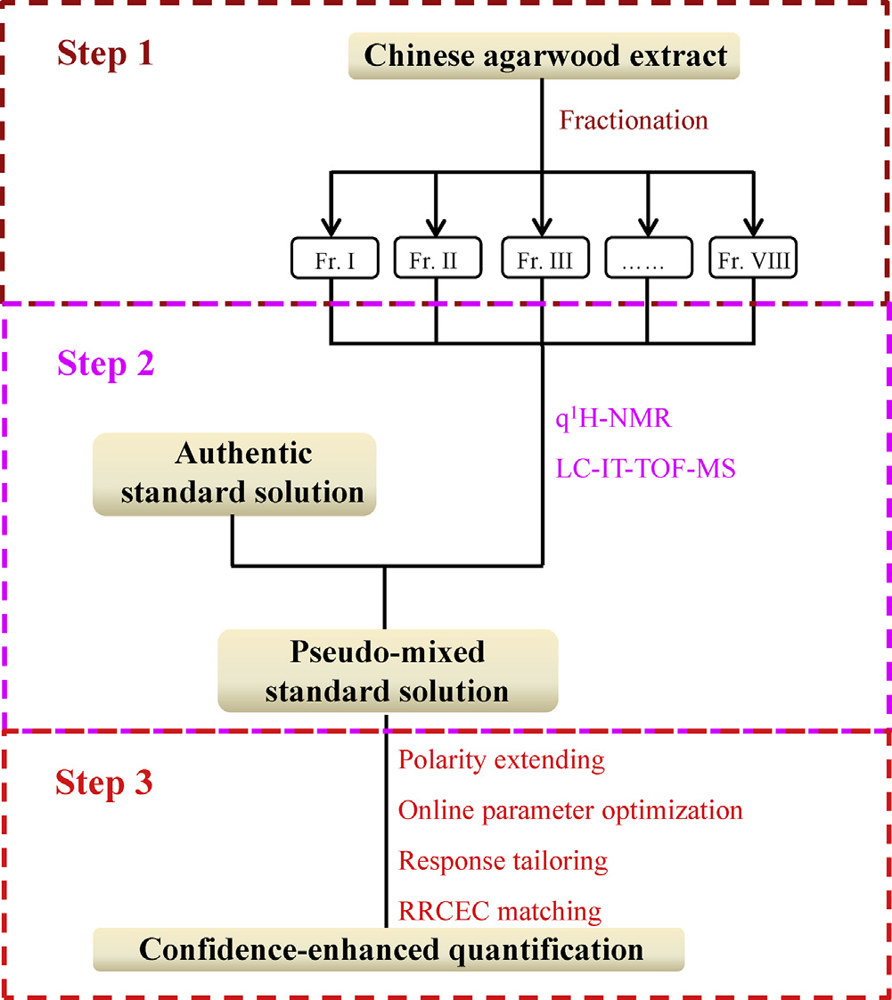
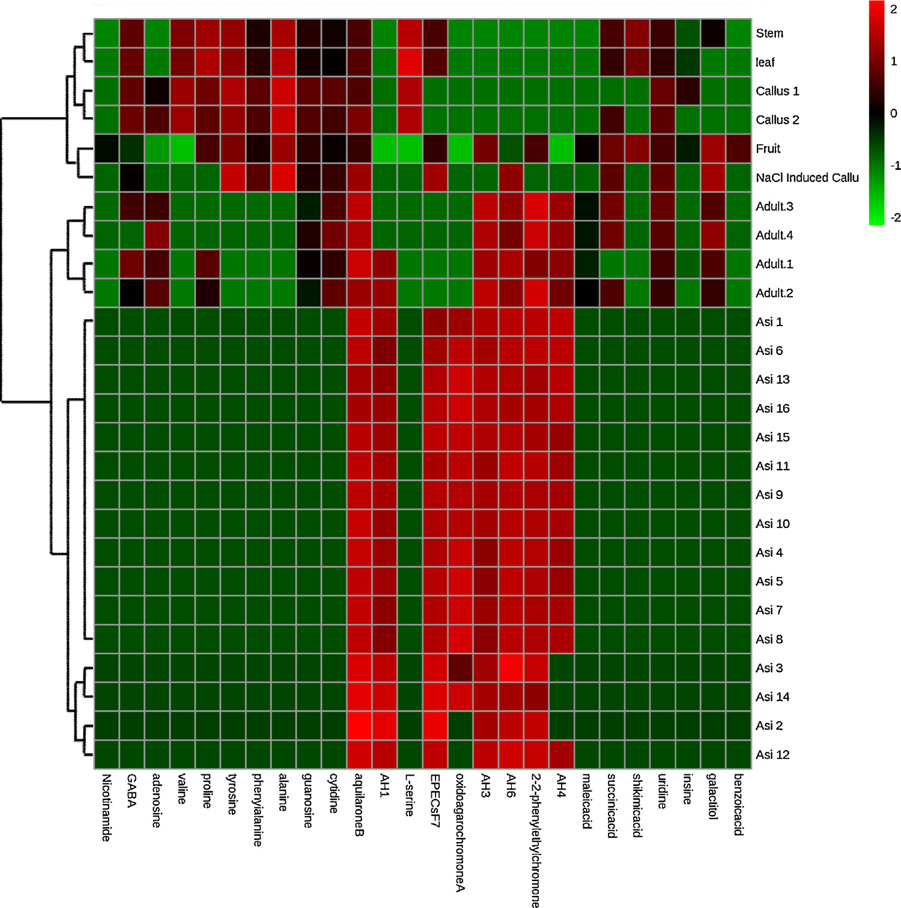

## 書誌情報

- 標題（原題）: A full solution for multi-component quantification-oriented quality assessment of herbal medicines, Chinese agarwood as a case
- 著者: Huixia Huo, Yao Liu, Wenjing Liu, Jing Sun, Qian Zhang, Yunfang Zhao, Jiao Zheng, Pengfei Tu, Yuelin Song\*, Jun Li\*（\*責任著者）
- 所属: Modern Research Center for Traditional Chinese Medicine, School of Chinese Materia Medica, Beijing University of Chinese Medicine（北京中医薬大学 中薬学院 現代中薬研究センター）, Beijing 100029, People's Republic of China
- 掲載誌・巻号: Journal of Chromatography A, 1558 (2018) 37–49
- DOI: https://doi.org/10.1016/j.chroma.2018.05.018
- インパクトファクター: 約3.8（*Journal of Chromatography A*, JCR 2024 / Clarivate。報告により3.8〜4.2の幅あり）
- 受理経過: 受領 2018年2月28日／改訂受領 2018年4月17日／受理 2018年5月8日／オンライン公開 2018年5月9日
- ライセンス: © 2018 Elsevier B.V. All rights reserved.
- 助成: 国家自然科学基金（Nos. 81573572, 81773875, 81530097）、中薬材料標準化プロジェクト（ZYBZH-Y-GD-13-ZYY-2017-076）

## 要旨（Abstract）

生薬（herbal medicines; HMs）の品質は、臨床での顕著な治療効果を得るための前提条件であり、多成分（品質マーカー、Q-markerとも呼ばれる）の定量は品質評価の実行可能な手段として広く重視されてきた。化学的多様性ゆえに、品質管理の実務は、標準品（authentic compounds）の欠如、極性範囲の広さ、濃度範囲の広さ、そして潜在的なQ-markerに対するシグナルの誤認識という4つの主要な技術的ボトルネックによって大きく妨げられている。本研究では、LC–MS/MSの可能性を高めてこれらの障害に対処する試みを行い、中国産沈香（Chinese agarwood）を事例研究として用いた。まず、自作のフラクションコレクター（fraction collector）を導入し、抽出物全体を関心画分（fractions-of-interest）のパネルへ自動的に断片化した。次に、定量的1H-NMR（q1H-NMR）を用いて、LC–MS/MSの潜在能力を各画分の詳細な化学プロファイリングへと補強し、これらの明確に定義された画分をプールしたうえで、入手可能ないくつかの標準品と組み合わせて疑似混合標準溶液（pseudo-mixed standard solution）を作成した。第三に、LC–MS/MS測定について一連の改良を行った。広い極性範囲に対応するため、逆相液体クロマトグラフィー（RPLC）と親水性相互作用液体クロマトグラフィー（HILIC）を直列に連結し、オンラインパラメータ最適化、レスポンス調整（response tailoring）、およびRRCEC（相対応答対衝突エネルギー曲線; relative response vs. collision energy curve）照合をMS/MS領域に統合し、定量の信頼性を高めた。方法バリデーション後、中国産沈香において合計26成分の同時定量を実施した。特筆すべきは、8種の2-(2-フェニルエチル)クロモン誘導体（2-(2-phenylethyl)chromone derivatives; PCDs）について標準品を用いない定量（authentic compound-free quantification）を達成したことである。総じて、本戦略は中国産沈香、さらには他の生薬についても、Q-marker定量指向の品質管理に向けた技術的障壁を完全に克服するための有望な解決策である。

© 2018 Elsevier B.V. All rights reserved.

## 1. 序論（Introduction）

生薬（HMs）の化学的多様性は、多因子疾患に対する「多成分・多標的（multi-components on multi-targets）」というユニークな治療原理を生み出す一方で、品質管理にとっては厄介な課題となる。近年、品質マーカー（Q-marker）という新概念が、生薬の品質評価のための実践的戦略として広く普及しており、その結果、複雑な化合物プールとして広く認識される生薬から、それらQ-markerの厳密な定量情報を抽出するための、目的に適った分析ツールを追求することへと作業の重心が移っている。分析科学者たちは世界中で多大な努力を払ってきたが、それら最先端の機器をもってしても、標準品の欠如、比較的狭い極性範囲、限定的な直線性のダイナミックレンジ、シグナルの誤認識といった技術的障害には十分に対処できていない。本稿では、いくつかの適切な技術を統合することにより、これらのボトルネックを打破する実行可能な解決策を提案する試みを行う。

標準品は、応答値と濃度の変換を可能にする検量線を構築するために、現在生薬の品質評価の主力となっているLC–MS/MSをはじめとするほとんどの機器にとって必須である。しかし、望ましいすべての標準品を収集することは、コストが高く労力を要し煩雑であり、時には不可能でさえある。幸いにも、定量的1H-NMR分光法（q1H-NMR）は、必要となる標準品の代わりに単純な内部標準（例えばナトリウムトリメチルシリルプロピオネートや4,4-ジメチル-4-シラペンタン-1-スルホン酸）を用いることで、定量情報を提供できる。これは共鳴シグナルが理論上、共鳴核の数に直接比例するためである。分解能と感度に関する本質的な欠点を踏まえると、生薬抽出物全体の1H-NMRスペクトルから、とりわけ微量成分について各成分の定量情報を抽出することは依然として困難な課題である。しかし、NMR技術の急速な発展のおかげで、通常数十の化合物を含む比較的単純な画分について詳細な定量分析を達成することは今や実現可能である。技術発展のもう一つの恩恵として、生薬抽出物全体をq1H-NMRの定量特性に適合するまで単純化するための自動フラクションコレクターも現在利用可能である。その結果、q1H-NMRとクロマトグラフィーによる分画を組み合わせることが、標準品フリーの定量に応える実行可能な手段となるはずである。

Q-markerとして関与するのは、あの半極性で豊富な成分だけではなく、一部の親水性化合物および／または微量成分も生薬の品質にとって重要な役割をしばしば果たす。したがって、適格な方法は、大きな濃度差と極性差をもつ一連の標的を同時に定量する能力を備えているべきである。妥協策として、関心化合物すべてを、主要化合物クラスター、親水性化合物クラスターなどのいくつかのサブグループに分けたうえで、方法群を開発・適用することは確かに実行可能ではあるが、極めて煩雑な作業量が必要となる。幸い、極性および濃度を拡張した定量を達成するための先進的なパイプラインが検証されている。逆相液体クロマトグラフィー（RPLC）と親水性相互作用液体クロマトグラフィー（HILIC）を直列に連結することで、単一カラムLCと比較して保持窓および分離能を拡張でき、各化合物にハイブリッドなクロマトグラフィー機構が割り当てられる。MS/MS領域では、調整されたタンデム多重反応モニタリング（MRM）により、各アナライト（特に主要成分）の直線範囲が、常に最適とは限らない適切なパラメータを定義することで、与えられたすべての試料における分布をカバーできるようになる。さらに、オンラインパラメータ最適化は、純粋な標準品が入手できない場合であっても、関与する化合物に適したパラメータを得るための実践的な方法である。

異性体、さらにはジアステレオ異性体は生薬に広く出現するが、LC–MRMで捕捉されるシグナルについて、ピークの誤認識の可能性を排除するための同一性の裏付け（identity consolidation）はほとんど注意が払われてこなかった。実際、異性体は通常、類似したクロマトグラフィー的・質量分析的挙動を示すため、それらを識別することは骨の折れる作業である。例えば、*Peucedanum praeruptorum* のLC–MS/MSクロマトグラムでプラエルプトリンE（praeruptorin E; 3-アンゲロイル-4-イソバレリルケラクトン）に以前割り当てられていたピークを捕集して1H-NMR測定に供したところ、その位置異性体（regio-isomer）である3-イソバレリル-4-アンゲロイルケラクトンの存在が明確に判明した。したがって、生薬における排他的な定量を達成するには、より多くの構造的証拠を関与させるべきである。幸いにも、この位置異性体のペア（プラエルプトリンE 対 3-イソバレリル-4-アンゲロイルケラクトン）では異なる相対応答対衝突エネルギー曲線（RRCECs）が生じたため、オンラインパラメータ最適化アプローチを適用することでいずれの化合物についてもRRCECを構築することが容易であった。したがって、RRCEC照合はMRMモードの定量的信頼性を高めるために実行可能である。

沈香（agarwood）は、*Aquilaria* 属植物の非含浸材から少なくとも部分的に削り出された、樹脂が浸透した木片と定義される。東南アジア諸国、バングラデシュ、中国では、関節痛・炎症性疾患・下痢に対する有望な治療効果を見込んで、民族医薬として広く利用されてきた。また、刺激剤・鎮静剤・心保護剤としても多くのコミュニティで用いられてきた。

> 補足: この後、原文Fig. 1として「本研究の全体戦略の模式フローチャート」が掲載されている（下図参照）。

しかしながら、樹脂を求めた無差別な伐採により野生原木の数が減少し続けていることから、*Aquilaria* 属はワシントン条約（CITES; Convention on International Trade in Endangered Species of Wild Fauna and Flora）附属書IIに掲載され、保全措置の対象となっている。沈香、とりわけ中国産沈香の価格は非常に高く、金よりも高価であることも珍しくなく、市場に大量の偽物や偽和品が出回っていることに驚きはない。したがって、中国産沈香について、臨床上の治療効果と経済的価値の両方を保証するために、厳格な品質評価を実施することが急務である。ここでは、中国産沈香の精密な品質評価の要件を完全に満たすため、上述のすべての技術を統合したワークフロー（Fig. 1）を提案する。まず、自作の自動フラクションコレクターを導入し、抽出物全体を関心画分のパネルへ自動的に断片化した。次に、q1H-NMRを用いて各画分の詳細な化学プロファイリングに向けたLC–MS/MSの能力を補強し、これら明確に定義された画分をプールしたうえで、入手可能ないくつかの標準品と組み合わせて疑似混合標準溶液を作成した。第三に、先進的なLC–MS/MSを26成分の同時定量に適用し、特に8種の2-(2-フェニルエチル)クロモン誘導体（PCDs）について標準品フリーの定量を達成した。本戦略は生薬の品質評価に関する4つの障壁すべてに対処するよう設計されているため、本パイプラインはQ-marker概念の実践のためのフルソリューションになるものと考えている。

## 2. 実験（Experimental）

### 2.1. 試薬と材料

植物中に普遍的に分布する一部の親水性成分が、方法の適用性確認に用いられた。ニコチンアミド、γ-アミノ酪酸（GABA）、バリン、プロリン、チロシン、フェニルアラニン、アラニン、L-セリン、ガラクチトール、アデノシン、グアノシン、シチジン、ウリジン、イノシンは、Xinjingke Biotechnology Company（北京、中国）から供給された。マレイン酸、コハク酸、シキミ酸、安息香酸の4種の有機酸はSigma-Aldrich（St. Louis, MO, USA）から購入した。陽イオン化・陰イオン化極性の内部標準（IS）として、それぞれタラチサミン（talatisamine）およびリクイリチンアピオシド（liquiritin apioside）をStandard Biotech Co., Ltd.（上海、中国）から商業的に入手した。すべての化学構造（図S1、補足情報A）は1H-および13C-NMR分光法でさらに確認され、各標準品純度はHPLC–DAD–IT-TOF-MS測定（島津製作所、東京、日本）により98%超であると決定された。

ギ酸、メタノール、アセトニトリル（ACN）はLC–MSグレードで、Thermo-Fisher（Pittsburgh, PA, USA）より供給された。CD3OD（重水素存在度99.8原子%重水素）およびCDCl3（重水素存在度99.8原子%重水素）はCambridge Isotope Laboratories Inc.（Miami, FL, USA）から購入した。q1H-NMRの内部標準として用いたピラジン（純度＞99%）はAldrich（St. Louis, MO, USA）から入手した。脱イオン水はMilli-Q精製装置（Millipore, Bedford, MA, USA）を用いて自家製造した。

中国産沈香（Asi1–16）を合計16ロット収集した。偽和品（Adult. 1–4）4ロットは生薬市場（中国・河北省安国）から収集した。さらに、*Aquilaria sinensis* に関連する材料として、果実・茎・葉・カルス・NaCl刺激カルスを各1ロット、当研究所のShepo Shi教授より提供を受けた。Adult. 1–4を除き、すべての材料はPengfei Tu教授により *Aquilaria sinensis* 由来であることが同定された。すべての標本は北京中医薬大学中薬学院現代中薬研究センター（北京、中国）に保管されている。

### 2.2. 中国産沈香抽出物からの関心画分の収集

Asi1–16の各ロットのアリコート（各200 mg）をプールし、超音波支援下でメタノールにより30分間抽出した。抽出物は続いて濃縮とクロマトグラフィー分画に供され、Shimadzu LC-20AD モジュラーシステム（京都、日本）に半分取用YMC-Pack C18カラム（10×250 mm, 5 μm, 京都, 日本）を装着して用いた。移動相は水（A）とACN（B）から成り、以下のグラジエントでプログラムされた: 0–30 min, 35–95% B; 30–36 min, 95% B；流速2 mL/min。流出液は254 nmでモニターされた。2台の6ポジション/7ポート電磁バルブで構成された自動フラクションコレクターを導入し、8つの関心画分（Frs. I–VIII, Fig. 2）を得た。これらはそれぞれ7.4–8.5, 8.5–9.5, 14.2–15.0, 17.3–18.3, 21.0–21.6, 23.5–24.0, 26.7–27.3, 27.3–28.1 minの流出画分に相当する。

> 補足: 原論文 Fig. 2 は「中国産沈香全抽出物の半分取LCによる代表的クロマトグラム（UV, 254 nm）とFrs. I–VIIIの収集プログラム」を示す図である（本ページには図として収載していない。原文参照）。

### 2.3. Frs. I–VIIIのNMRおよびLC–精密質量MS/MSによる並行測定

各画分（Frs. I–VIII）の50 μLアリコートを、LC–IT-TOF-MS測定用に別のバイアルへ採取した。各画分の残りは蒸発乾固した。残渣はそれぞれ600 μLのCD3OD（Frs. I–III）またはCDCl3（Frs. IV–VIII）に再溶解し、ピラジン（最終濃度3.125 μmol/L）を添加したうえで、直ちにNMRチューブ（内径5 mm, Norell ST500-7, Morganton, NC, USA）へ移した。1H-NMRスペクトルはVarian UNITY plus 500 MHz分光計（VNMR500, Varian Inc., Palo Alto, CA, USA）でTCIクライオプローブおよびZ-グラジエントシステムを用い、499.91 MHzのプロトン周波数で記録した。すべてのスペクトル取得には既定パラメータを適用した。

LC–IT-TOF-MS測定については、Waters Acquity UPLC HSS T3カラム（2.1×100 mm, 1.8 μm, Milford, MA, USA）でクロマトグラフィー分離を行い、流出液は適切な長さのPEEKチューブ（内径0.13 mm）を介して質量分析計のエレクトロスプレーイオン化（ESI）インターフェースへ導入した。移動相は0.1%ギ酸水溶液（A）とACN（B）から成り、総流速0.15 mL/minで以下のグラジエントプログラムにより送液した: 0–4 min, 10–28% B; 4–8 min, 28%–30% B; 10–14 min, 30%–55% B; 14–20 min, 55%–72% B; 20–23 min, 72%–95% B; 23–25 min, 95% B; 25.1–30 min, 10% B（原文にこのまま記載。8–10 minの区間は原文に記載がない）。UV吸収は190–400 nmで記録した。注入量は2 μLとした。すべてのスペクトル取得には推奨される質量分析パラメータを適用した。

### 2.4. 試料調製

q1H-NMRおよびLC–IT-TOF-MSデータセットの詳細な解析を経て、アクイラロンB（aquilarone B）、AH1、rel-(1aR,2R,3R,7bS)-1a,2,3,7b-テトラヒドロ-2,3-ジヒドロキシ-5-(2-フェニルエチル)-7H-オキシレノ[f][1]ベンゾピラン-7-オン（EPECs:F7）、オキシドアガロクロモンA（oxidoagarochromone A）、AH3、AH6、2-(2-フェニルエチル)クロモン、AH4の8化合物の構造同一性と定量情報が得られた（Table 1）。したがって、これらの分析物豊富な画分（Frs. I–VIII）は、蒸発乾固後、疑似標準品（pseudo-authentic compounds）として定義され、入手可能な標準品と組み合わせて、いわゆる疑似混合標準溶液（pseudo-mixed standard solution）の構築に用いられた。というのも、各画分中の各分析物量（Table 1）が明確に決定されていたためである。ISを除き、入手可能なすべての標準品とそれらの分析物豊富な画分は、それぞれDMSOに溶解し、各分析物について4 mg/mLの原液パネルを作成した。疑似混合標準溶液は、続いてすべての原液をプールし、10%含水ACNで希釈することで各種作業溶液を得た。各作業標準溶液はさらに、2種のIS（最終濃度：タラチサミン28 ng/mL、リクイリチンアピオシド166 ng/mL）を含む10%含水ACNで2倍希釈し、所望濃度の一連の検量線用試料を得た。

一方、乾燥させた各試料（Asi1–16、Adult. 1–4、果実、茎、葉、カルス、NaCl刺激カルス）はそれぞれ粉砕し、0.25 mmふるいで篩過した。さらに、すべての乾燥試料に含まれる成分を網羅すると期待されるプール試料を、全試料のアリコート（各10 mg）を混合して調製した。各抽出は、粉砕材料（100 mg）を50%含水メタノール5 mLに懸濁し超音波支援下で抽出することで得た。抽出後、抽出中に失われた重量を補うため50%含水メタノールを追加した。その後、各抽出物は10000×gで10分間遠心分離し、上清を0.22 μmメンブレンでろ過した。検量線用試料と並行して、各ろ液を10%含水ACNで100倍希釈し、さらにIS添加10%含水ACNで2倍希釈したうえで測定に供した。

### 2.5. RPLC-HILIC構成

RPLC-HILIC領域は、いくつかのShimadzu LCモジュール（京都、日本）、すなわち4台のLC-20ADXRポンプ（ポンプA–D）、CBM-20Aコントローラー、DGU-20A3R脱気装置、CTO-20ACカラムオーブン、2台のHPミキサーから構成された。装置構成および溶出プログラムは、著者らの過去の論文に記載されたものに軽微な修正を加えて踏襲した。要約すると、Waters Acquity UPLC HSS T3カラム（2.1×100 mm, 1.8 μm, Milford, MA, USA）とWaters Xbridge Amideカラム（4.6×150 mm, 3.5 μm）を直列連結し、各分析物にRPLCとHILICの機構を順次割り当てた。ポンプAおよびBは、それぞれ0.1%ギ酸水溶液（A）とACN（B）をミキサーへ、続いてLC–IT-TOF-MS測定と同一のグラジエント溶出プログラムでT3カラムへ供給する役割を担った。一方、ポンプCおよびDは、それぞれ10 mM酢酸アンモニウム水溶液（原文はammonium formateであるが以下のとおり: 10 mM aqueous ammonium formate）（C）とACN（D）をRPLCカラムからの流出液に添加する役割を担い、以下のとおり送液した: 0–4 min, 100% D; 4–14 min, 100%–80% D; 14–22 min, 80%–70% D; 22.1–30 min, 100% D；流速1.0 mL/min。いずれのカラムも40°Cに維持し、オートサンプラーの注入量は2 μLとした。

同時に、RPLC-HILICの利点を評価するため、単一カラムLCも実施した。並行測定を確実にするため、RPLC-HILICと単一カラムRPLCまたはHILICの違いは、T3カラム（単一カラムRPLC用）またはAmideカラム（単一カラムHILIC用）を、同等の長さのPEEKチューブ（内径0.13 mm）に置き換えるという点のみとした。

### 2.6. 調整MRM検出

ESIインターフェースを装着したSCIEX 5500 Qtrap質量分析計（Foster City, CA, USA）が、LC領域からの流出液の受け入れを担当した。各分析物の前駆イオンおよびプロダクトイオンは、標準品または関心画分を、RPLC-HILIC–MS/MSへシリンジポンプで注入することで得た。MS/MS検出はエンハンストマススペクトルトリガー・エンハンストプロダクトイオン（EMS-EPI）モードで達成した。陰・陽イオン化極性はそれぞれ個別に適用した。EMSの主要パラメータであるデクラスタリング電位（DP）と衝突エネルギー（CE）はそれぞれ±100 Vおよび±5 eVに設定し、一方EPI実験ではCEおよび衝突エネルギー拡散（CES）をそれぞれ±35 eVおよび25 eVに設定した。その後、明確に定義されたオンラインパラメータ最適化アプローチを用いて適切なパラメータを取得し、各分析物のRRCECを構築した。簡潔に述べると、優勢な前駆イオンおよびプロダクトイオンがMRMイオントランジション候補を構成し、各候補はそれぞれ一連の疑似イオントランジション（pseudo-ion transitions; PITs）を生成した。例としてAH3を挙げると、プロトン化分子イオン（[M+H]+）はm/z 267で検出され、主要フラグメントイオン種はm/z 189, 137, 91で観測された。m/z 267 > 189、267 > 137、267 > 91などのいくつかのイオントランジション候補が構築され、各候補（例: m/z 267 > 189）は、m/z 267.000 > 189.000、267.001 > 189.000等の一連のPITsを生成する役割を担った。これらのPITsは、5–135 eVの範囲でステップサイズ2 eVごとに（例: 5 eV, 7 eVなど）交互配置されたCEに正確に対応していた。大幅に拡張されたイオントランジションに対応するため、スケジュールドアルゴリズムが利用された。さらに、これらのPITsはDP最適化にも同様の方法で利用された。

### 2.7. 方法バリデーションおよび定量測定

方法バリデーションは、直線性・感度・精度・安定性・回収率アッセイの観点から実施した。直線性を除き、他のアッセイは推奨プロトコルに従って実施したが、混合標準溶液を疑似混合標準溶液に置き換えるという軽微な修正を加えた。

直線性は、各分析物について6濃度水準以上の内部標準検量線を用いてアッセイし、検量線の構築は、試験範囲にわたる分析物と対応するISのピーク面積比を、それらの濃度比に対してプロットすることにより実施した。必要に応じて1/xの重み付け関数を線形回帰の改善に適用した。予備実験において、中国産沈香におけるアクイラロンB、AH1、EPECs:F7、オキシドアガロクロモンA、AH3、AH6、2-(2-フェニルエチル)クロモン、AH4といった主要成分の含量が、最適パラメータを用いた場合の直線範囲を超えることが判明した。したがって、それらの豊富な分布に適合するよう定量上限（ULOQs）を拡大するため、より低いCEを採用するレスポンス抑制（response suppression）が導入された。その後、これらの主要成分の定量のためのモニタリングリストにおいて、適切なCEが最適なCEに取って代わり、一方その他の成分には最適パラメータが適用された（Table 2）。さらに、MRMはMS2スペクトルの取得を担うEPIスキャンをトリガーするサーベイ実験としても機能した。

その後、バリデーション済みの方法を用いて、Asi1–16、Adult. 1–4、果実、茎、葉、カルス、NaCl刺激カルスを含む収集済みの全試料について、合計26成分の同時定量を実施した。各試料について3つのモニタリングプログラムを適用した。第一はすべての陽イオン化PITsから成り、第二はすべての陰イオン化PITsから成り、第三（定量プログラム）はTable 2に示す情報から成る。定量法については、SCIEX Qtrap質量分析計がデータ品質を犠牲にすることなく高速な極性切替を可能にするため、陰・陽イオン化極性を同時に適用し、各実験は三重測定（triplicate）で実施した。

### 2.8. データ処理と統計解析

Analystソフトウェア（Version 1.6.2, SCIEX）の定量モジュールを、ピーク検出・ピーク積分・検量線回帰・分析物定量を含むデータ処理に使用した。すべてのピーク面積の計算には、平滑化・バンチング係数をそれぞれ2および1とした自動Analystクラシック積分アルゴリズムを用いた。定量データセットはRRCECを描画するためGraphPad Prism 5.0（Graphpad Software, San Diego, CA）に転送された。その後、階層的クラスタリングを伴うヒートマップはMetaboAnalystソフトウェア（http://www.metaboanalyst.ca）で作成した。

## 3. 結果と考察（Results and discussions）

### 3.1. 関心画分の詳細な化学プロファイリング

中国産沈香の全抽出物をq1H-NMR分光アッセイに供したところ、複雑なスペクトルプロファイル（データ非掲載）が得られ、q1H-NMRの基準を満たす特定のシグナルを見出すことすら極めて困難であった。まして関心化合物についてはなおさらであった。そのため、潜在的なQ-markerを濃縮するためにクロマトグラフィーによる分画で抽出物全体を単純化することが必要であった。幸い、2台の6ポジション/7ポート電磁バルブを用いて構成された自動フラクションコレクターにより、単一の分析プログラム内で最大10画分の自動収集が可能であった。ここでは、8つの関心化合物（Fig. 2）に富む8画分（Frs. I–VIII）を得るためにこのモジュールを導入し、バルブの切替は7.4, 8.5, 9.5, 14.2, 15.0, 17.3, 18.3, 21.0, 21.6, 23.5, 24.0, 26.7, 27.3, 28.1 minの各時点で順次スケジュールされた。

その後、各画分について1H-NMRおよびLC–IT-TOF-MSによる並行測定を実施した。NMR分光およびLC–IT-TOF-MSデータセットの合同解析の結果、中国産沈香の診断的化学クラスターとして広く認識されている合計9種のPCDsが明確に同定された（Table 1およびFig. S2、補足情報A）。

Fr. IVを例に取ると、LC–IT-TOF-MSにより主要ピーク（tR、17.03 min）と微量ピーク（tR、16.80 min）が検出された（Table 1）。主要ピークはm/z 283.0963（[M+H]+、C17H15O4に対する誤差 −0.71 ppm）にプロトン化分子イオンを、m/z 255, 192, 153に優勢なフラグメントイオン種を与え、一方微量ピークに対応する明確なシグナルはm/z 313.1075（[M+H]+、C18H17O5に対する誤差 1.28 ppm）と121に観測された。1H NMRスペクトル（Fig. 3）については、δ 6.21 (1H, s), 4.35 (1H, d, J = 3.0 Hz), 3.86 (1H, br s), 4.01 (1H, br s), 3.86 (1H, br s), 7.09 (2H, d, J = 8.5 Hz), 6.84 (2H, d, J = 8.5 Hz), 7.29 (5H, m), 3.02 (2H, m), 2.91 (2H, m) の一連のシグナルがオキシドアガロクロモンAの存在を示した。同時に、δ 6.19 (1H, d, J = 7.0 Hz), 7.13 (2H, d, J = 7.0 Hz), 6.88 (2H, d, J = 7.0 Hz), 3.83 (3H, s, 4-OCH3) の一群のシグナルも検出された（Fig. 3）。微量ピークの質量スペクトルデータと合わせ、この化合物はオキシドアガロクロモンAのC-4位メトキシル化産物であるオキシドアガロクロモンBであると明確に同定された。同様の解析手法により、AH1、アクイラロンB、EPECs:F7、AH3、AH6、AH4、2-(2-フェニルエチル)クロモンが、それぞれFrs. I, II, III, V, VI, VII, VIIIから同定された（Table 1およびFig. S2、補足情報A）。このうち、アクイラロンBとAH1はジアステレオ異性体のペアであり、その構造上の違いはA環の水酸基の配置のみに生じているため、定量分析時に誤認識のリスクを示唆している。

ピラジンの診断的な一重線シグナルは常にδ 8.65に孤立して分布していた（Fig. 3およびFig. S2）。一方、ほとんどのPCDs（AH1、オキシドアガロクロモンA、AH3、AH6、AH4、2-(2-フェニルエチル)クロモン）の5-Hに帰属される二重線シグナルは孤立して出現しており、そのため定量シグナルとして採用された。しかし、アクイラロンBおよびEPECs:F7の8-Hに対応するδ 4.61 (1H, d, J = 5.0 Hz) およびδ 4.58 (1H, d, J = 5.0 Hz) において、適格な定量シグナルが検出された。オキシドアガロクロモンAとオキシドアガロクロモンBの間には構造上の大きな類似性があるものの、標的とした一重線シグナル（δ 6.21, 1H, s, オキシドアガロクロモンAのH-3）は、隣接するシグナル（δ 6.19, 1H, s, オキシドアガロクロモンBのH-3）と満足のいく分離を示したため、定量分析に利用された。オキシドアガロクロモンBの量は正確に算出できなかったため、定量分析には含めなかった。その後、既に確立された式を用いて、各画分中の各分析物の量（Table 1）を算出した。

#### Table 1. Frs. I–VIIIの質量スペクトルおよび1H-NMRシグナルの帰属

| 由来画分 | tR*（min） | MS1（[M+H]+） | 分子式 | MS2 | 誤差（ppm） | 1H NMR（δ in ppm, J in Hz） | 同定成分 | 量 |
| :--- | :-: | :-: | :-: | :-- | :-: | :-- | :-- | :-: |
| Fr. I | 8.66 | 319.1184 | C17H18O6 | 301, 283, 255 | 2.51 | 6.12 (1H, s, H-3), 4.56 (1H, d, J=7.0, H-5), 4.04 (1H, dd, J=3.0/7.0, H-6), 4.02 (1H, dd, J=4.0/2.0, H-7), 4.74 (1H, d, J=4.0, H-8), 7.23 (5H, m, H-2〜6'), 2.94 (2H, m, H2-7'), 3.03 (2H, t, J=8.0, H2-8') | AH1 | 7.147 mg |
| Fr. II | 8.12 | 319.1172 | C17H18O6 | 301, 91 | −1.25 | 6.15 (1H, s, H-3), 4.81 (1H, overlap, H-5), 4.04 (1H, q, J=2.0, H-6), 3.96 (1H, dd, J=4.5/1.5, H-7), 4.61 (1H, d, J=5.0, H-8), 7.22 (5H, m, H-2〜6'), 3.02 (2H, m, H2-7'), 2.92 (2H, m, H2-8') | アクイラロンB | 3.272 mg |
| Fr. III | 15.33 | 301.1069 | C17H16O5 | 283, 255, 173 | −0.66 | 6.19 (1H, s, H-3), 3.91 (1H, d, J=4.0, H-5), 3.79 (1H, d, J=3.5, H-6), 4.01 (1H, d, J=7.5/1.0, H-7), 4.58 (1H, d, J=7.5, H-8), 7.24 (5H, m, H-2〜6'), 3.03 (2H, m, H2-7'), 2.97 (2H, m, H2-8') | EPECs:F7 | 7.641 mg |
| Fr. IV（主） | 17.03 | 283.0963 | C17H14O4 | 255, 192, 153 | −0.71 | 6.21 (1H, s, H-3), 4.35 (1H, d, J=3.0, H-5), 3.86 (1H, br s, H-6), 4.01 (1H, br s, H-7), 3.86 (1H, br s, H-8), 7.09 (2H, d, J=8.5, H-2',6'), 6.84 (2H, d, J=8.5, H-3',5'), 7.29 (5H, m, H-2〜6''), 3.02 (2H, m, H2-7''), 2.91 (2H, m, H2-8'') | オキシドアガロクロモンA | 31.020 mg |
| Fr. IV（微） | 16.80 | 313.1075 | C18H16O5 | 121 | 1.28 | 6.19 (1H, s, H-3), 7.13 (2H, d, J=7.0, H-2',6'), 6.88 (2H, d, J=7.0, H-3',5'), 3.83 (3H, s, 4'-OCH3) | オキシドアガロクロモンB | −（定量対象外） |
| Fr. V | 18.76 | 267.1010 | C17H14O3 | 189, 176, 137 | −2.25 | 6.19 (1H, s, H-3), 7.83 (1H, s, H-5), 7.29 (1H, overlap, H-7), 7.35 (1H, d, J=9.0, H-8), 7.29 (5H, m, H-2〜6'), 3.06 (2H, t, J=7.5, H2-7'), 2.95 (2H, t, J=7.5, H2-8') | AH3 | 6.948 mg |
| Fr. VI | 19.79 | 311.1272 | C19H18O4 | 220, 205, 181 | −1.93 | 6.15 (1H, s, H-3), 7.55 (1H, s, H-5), 6.90 (1H, s, H-8), 7.27 (5H, m, H-2〜6'), 4.00 (3H, s, 6-OCH3), 4.02 (3H, s, 7-OCH3), 3.09 (2H, t, J=7.5, H2-7'), 2.95 (2H, t, J=7.5, H2-8') | AH6 | 4.817 mg |
| Fr. VII | 21.79 | 281.1173 | C18H16O3 | 203, 190, 151 | −0.80 | 6.16 (1H, s, H-3), 7.56 (1H, d, J=3.0, H-5), 7.26 (1H, overlap, H-7), 7.38 (1H, d, J=9.0, H-8), 7.25 (5H, m, H-2〜6'), 3.91 (3H, s, 6-OCH3), 3.08 (2H, t, J=7.5, H-7'), 2.94 (2H, t, J=7.5, H-8') | AH4 | 3.083 mg |
| Fr. VIII | 21.19 | 251.1065 | C17H14O2 | 173, 160, 91 | −0.36 | 6.18 (1H, s, H-3), 8.21 (1H, dd, J=7.5/1.0, H-5), 7.39 (1H, t, J=8.0, H-6), 7.65 (1H, dt, J=1.5/8.5, H-7), 7.43 (1H, d, J=8.5, H-8), 7.23 (5H, m, H-2〜6'), 3.07 (2H, t, J=7.0, H-7'), 2.94 (2H, t, J=7.0, H-8') | 2-(2-フェニルエチル)クロモン | 4.894 mg |

*: すべての保持時間はLC–IT-TOF-MSから得た値。

### 3.2. 全分析物の包括的な保持と分離

RPLCまたはHILICいずれのクロマトグラフィー機構についてもいくつかの候補が慎重に検討され、すべての分析物について満足のいく保持および分離挙動を達成するよう溶出プログラムも最適化された。RPLC-HILICの構成および溶出プログラムの最適化に関する詳細は補足情報Bに記載した。

いくつかの成分が、単一のRPLCまたはHILICカラムのいずれにも保持されない性質のためボイドタイムで共溶出すると、深刻なイオン化競合が発生し、それらのマス応答に対する広範なマトリクス効果を招く。したがって、RPLC-HILICを構築する第一の目的は、親水性・疎水性双方の成分について普遍的な保持を達成することであった。疑似混合標準がRPLC-HILIC、単一カラムRPLC、単一カラムHILIC間の比較に用いられた。並行測定の結果、代表的なクロマトグラムが得られ（Fig. 4）、詳細な比較が行われた。全体として、RPLC-HILICから得られた各分析物の保持時間はいずれも4.50 min超であり、すべての分析物が満足のいく保持挙動を得ていることが示唆された（Fig. 4A）。一方、一部の分析物は、極性範囲に関する保持上の本質的な欠点のため、T3カラム（例: ニコチンアミド、GABA、アデノシン、バリン、プロリン、チロシン、アラニン、グアノシン、シチジン、L-セリン、マレイン酸、シキミ酸、ウリジン、イノシン、ガラクチトール）またはAmideカラム（例: ニコチンアミド、アクイラロンB、AH1、EPECs:F7、オキシドアガロクロモンA、AH3、AH6、2-(2-フェニルエチル)クロモン、AH4、マレイン酸、コハク酸、安息香酸）のいずれかでほぼボイドタイムに溶出した（Fig. 4B, C）。特筆すべきは、とりわけAH1とその隣接する妨害ピークとの間で、単一カラムRPLC（tR、8.98 min）と比較してRPLC-HILIC（tR、12.67 min）でより大きな分離が得られた点であり、一方単一カラムHILICでは妨害成分とAH1の間で重大な重なりが生じた。総じて、RPLC-HILICは、各分析物について望ましいクロマトグラフィー挙動を得るうえで、単一カラムRPLCおよび単一カラムHILICのいずれよりも優れた選択肢であった。

### 3.3. オンラインパラメータ最適化

疑似標準品（実際には分析物豊富な画分）が得られた後、イオントランジション、DP、CEを含むMRMパラメータの最適化が試みられた。標準品が入手可能な場合、推奨プロトコルに従うことで、与えられた分析物の最適パラメータを簡便に得ることができた。しかし、シリンジポンプで画分を質量分析計へ注入する際、関心分析物の前駆イオンとプロダクトイオンを見出すことは非常に困難であった。標準品に依存しないアプローチであるオンラインパラメータ最適化は必要なパラメータを提供可能であり、そのためPCDsの標準品が入手できない場合に対応して導入された。AH3に富むFr. Vを代表例とすると、RPLC-HILIC–EMS-EPI測定に供した際、前駆イオンはm/z 267として得られ、そのプロダクトイオンはフェニル開裂、レトロ・ディールス・アルダー開裂、ベンジル開裂にそれぞれ対応するm/z 189, 137, 91に出現した（図S3A、補足情報A）。m/z 267 > 189、267 > 137、267 > 91などのすべてのイオントランジション候補がパラメータ最適化に関与し、3セットのPITsが生成された。すべてのPITsの応答は、ガウス曲線フィッティングによるRRCECの構築に導入された（図S3B、補足情報A）。イオントランジションm/z 267 > 189は他のイオンペアよりも感度が高く、RRCECのピークに対応する最適CEはそれぞれ32, 52, 60 eVで観測された（図S3B、補足情報A）。その後、各PITに最適CEを割り当てることで最適DP値が130 Vとして得られた。総じて、最適なイオントランジション、DP、CEはそれぞれm/z 267 > 189、130 V、32 eVであった。さらに、他の分析物についても同様の方法で最適パラメータが得られ、すべての最適値はTable 2にまとめられている。

### 3.4. RRCEC照合による同一性の裏付け

異性体は生薬に広く分布し、通常は非常に類似したクロマトグラフィー的・質量分析的性質を示すため、定量結果はシグナルの誤認識や、捕捉されたシグナルに不純物が含まれるリスクを負う。したがって、各分析物の同一性確認のため、保持時間、MRMイオントランジション、MS2スペクトルに加え、直交する構造的手がかりとしてRRCECが実装された。疑似混合標準溶液のクロマトグラム（Fig. 4A）において、アクイラロンB（tR、11.82 min）とAH1（tR、12.97 min）に加え、イオントランジションm/z 319 > 283によりもう一つの信号（tR、12.67 min）が捕捉された。さらに悪いことに、この妨害成分とAH1のtR間隔はわずか0.3 minであり、わずかなtRシフトがシグナルの誤認識を引き起こしうることを示唆していた。アクイラロンB、AH1、および妨害シグナルのRRCECを、PITsの応答をGraphPad Prism 5.0ソフトウェアに取り込むことで構築し、これらの異性体、特にAH1対妨害成分を識別した。明らかに3本の曲線間には差異が見られ、それらの最大応答はそれぞれ25, 27, 29 eVで出現し（Fig. 5）、RRCECがこれらの異性体を識別する潜在能力を有することが示された。

各中国産沈香試料（Asi1–16）について、11.80 min前後（±0.3 min）のm/z 319 > 283シグナルのRRCECは、Fr. IIから得られた参照曲線とよく一致し、これらのシグナルの正確な同一性がアクイラロンBであることが示唆された。しかし、Asi1–16では通常、12.4–13.3 minのtR窓内でm/z 319 > 283により主要シグナルと微量ピークの両方が捕捉され、いずれのピークにもわずかな移動（±0.3 min）が観測された。主要シグナルのRRCECは通常AH1のそれと一致し、一方微量シグナルのRRCECは疑似混合標準における妨害ピーク（tR、12.67 min）のそれと常に良く一致した。したがって、濃度算出にはAH1の回帰検量線を用い、主要シグナルのピーク面積（微量シグナルではなく）を適用した。

RRCEC照合は、疑似混合標準溶液と抽出物試料の間でRRCECをマッピングすることにより、その他の捕捉シグナルの同一性を裏付けるためにも用いられ、幸いにも保持時間（許容差±0.3 min）およびイオントランジションによるシグナル整合の後、各RRCECのペア間で正確な一致が得られた。その結果、捕捉されたシグナルの同一性および純度が明確に確認された。

> 補足: 原論文Fig. 5（アクイラロンB、AH1、および妨害シグナル（tR, 12.67 min）が生成するm/z 319 > 283のイオントランジションに対するRRCECのグラフ）は、PDF内でベクター図として描画されており、画像として自動抽出できなかったため本ページには掲載していない。原論文参照。

### 3.5. 直線範囲のカスタマイズ

最適パラメータを検量線構築に適用したところ、8種のPCDsの直線範囲が、抽出物中のそれらの高い含量を完全にはカバーできないことが判明した。MRMに基づく定量の原理は、実質的にはQ3チャンバー末端の電子増倍管で規定のプロダクトイオンを計数することであり、ULOQsはしばしばセンサーの飽和により狭められるため、標的とするプロダクトイオンの生成を抑制することでULOQsを拡大することが理論上実行可能である。イオントランジション、DP、CEを含む化合物依存パラメータは、プロダクトイオン生成において極めて重要な役割を果たす。とりわけCEは、イオントランジションおよびDPよりも直線範囲のカスタマイズに対して柔軟であったため、適切なCEを追求することによりPCDsのULOQsを拡大する試みがここで行われた。

最適パラメータ（イオントランジション m/z 311 > 205、CE 40 eV、DP 130 V）を適用した場合、62.5 μg/mLを超える濃度に対するAH6のマス応答は期待されるピーク面積比よりもかなり低かった（Fig. 6A）。その後、PITsが個別に検量線構築に用いられた。その結果、最適CE（40 eV）から離れる間隔の増加に伴いULOQは徐々に増大し、CEが20 eVのときULOQは1000 μg/mLもの高さに達した（Fig. 6B）。これにより、全試料におけるAH6の定量分析が可能となった。したがって、AH6定量のモニタリングリストにおいて、より低いCE（20 eV）が最適値（40 eV）の役割に取って代わった。さらに、他のPCDsについても、多様な試料における分布に適合する直線範囲へと同様に直線範囲のカスタマイズが行われた。適切なイオントランジション、CE、DPに関する情報はTable 2にまとめられており、レスポンス調整の対象となった主要成分にはアスタリスクが付されている。

> 補足: Fig. 6の図版はPDFからの自動抽出では取得できなかったため、本ページには掲載していない。AH6の検量線式は原文にそのまま記載されている（下記のとおり）。原論文参照。

- 最適CE（40 eV、m/z 311 > 205）: y = 0.325x − 0.0174, R² = 0.9938、ULOQ 62.5 ng/mL
- 適切なCE（20 eV）: y = 0.00217x − 0.0203, R² = 0.9993、ULOQ 1000 ng/mL

### 3.6. 方法バリデーション

分析物豊富な画分と入手可能な標準品から成る疑似混合標準溶液を、続いて各種の方法バリデーションアッセイに供した。適切なパラメータおよび最適化された溶出プログラムの適用後、検量線用試料の代表的クロマトグラムが得られた（Fig. 4A）。すべての関心化合物は、それぞれの濃度範囲内で優れた直線性（r > 0.994）を示した（表S1、補足情報B）。感度アッセイの結果（表S1）は、定量下限（LLOQs、0.09–188.25 ng/mL）および検出限界（LODs、0.04–93.75 ng/mL）を含め、開発した方法が26化合物の同時定量に十分な感度を有することを証明した。さらに、日内変動（RSDs%、2.46–14.42%）と日間変動（RSDs%、3.56–14.58%）、および低・中・高各濃度水準における回収率（81.65%–119.35%、RSDs%は1.10–11.76%の範囲）の性能（表S2、補足情報B）は、開発した方法が信頼性の高い定量の要件を満たしうることを示した。望ましい再現性（RSDs%、3.20–11.46%）も得られた。総じて、新たに開発した方法は、26化合物について高感度・高精度・高正確性・高再現性の定量分析を達成することができた。

> 補足: 表S1（各分析物の検量線・LOD/LLOQ詳細）、表S2（日内・日間精度、回収率の分析物別内訳）は補足情報Bに収載されており、本文では上記の範囲のみが示されている。分析物ごとの個別数値は原文参照（本翻訳では補足情報の入手ができなかったため、本文記載の範囲値のみを転記した）。

### 3.7. 関与する全試料における26成分の同時定量

バリデーション済みの方法は、続いて8種のPCDs（アクイラロンB、AH1、EPECs:F7、オキシドアガロクロモンA、AH3、AH6、2-(2-フェニルエチル)クロモン、AH4）、5種のヌクレオシド（すなわちアデノシン、グアノシン、シチジン、ウリジン、イノシン）、4種の有機酸（すなわちマレイン酸、コハク酸、シキミ酸、安息香酸）、7種のアミノ酸（すなわちGABA、バリン、プロリン、チロシン、フェニルアラニン、アラニン、L-セリン）、およびガラクチトールとニコチンアミドを含む26種の分析物の同時定量に利用された。プール粉末の抽出物と選抜した中国産沈香試料のクロマトグラムはそれぞれFig. 4DおよびFig. 4Eに示され、その他の試料タイプに対応する代表的クロマトグラムは図S4（補足情報A）に示されている。

すべての定量結果はTable 3にまとめられている。全体として、中国産沈香試料（Asi1–16）とその他の試料（Adult. 1–4、果実、茎、葉、カルス、NaCl刺激カルス）との間で、定量パターンに有意な差異が観察された。中国産沈香試料はPCDsに富む一方、他の分析物には乏しかった。対照的に、炭水化物・ヌクレオシド・有機酸・アミノ酸などの豊富な一次代謝産物がその他の試料に見出された一方、PCDsはAdult. 1–4、果実、茎、葉、カルス、NaCl刺激カルスでは通常微量、あるいは痕跡量の分布しか示さなかった。したがって、PCDsは真正な中国産沈香の診断的化学クラスターとして機能しうる一方、これら一次代謝産物の欠如も品質の基準として機能しうる。

中国産沈香試料間でも有意な変動が生じていた。Asi13（109.02 mg/g）とAsi16（114.80 mg/g）における8種PCDsの合計量は、他の中国産沈香試料と比較してかなり高く、一方Asi3、Asi14、Asi2ではそれぞれわずか2.36、2.40、3.65 mg/gにすぎなかった。オキシドアガロクロモンAは通常最も豊富な成分として機能し、とりわけAsi8（38.10 mg/g）、Asi13（52.37 mg/g）、Asi16（52.43 mg/g）で顕著であったが、Asi1–3、Asi10、Asi12、Asi14では微量の分布であった。アクイラロンB（1.35–11.33 mg/g）はすべての中国産沈香試料で有意に出現し、原材料のほぼ0.5%を占め、EPECs:F7（0.50–16.71 mg/g）も広範に分布した。

含量データセットは、より視覚的な比較のためヒートマップにも変換された（Fig. 7）。すべての中国産沈香試料は単一のグループ（グループI）にクラスタリングされた。偽和品試料もまた一つのグループ（グループII）にまとまり、果実・茎・葉・カルス・NaCl刺激カルスといった関連材料は別のグループ（グループIII）に位置した。明らかに、グループIはPCDsに富む一方、他の分析物には乏しかった。対照的に、炭水化物・ヌクレオシド・有機酸・アミノ酸などの豊富な一次代謝産物がグループIIおよびIIIに見出された一方、PCDsはこれら2つのグループでは通常微量、あるいは痕跡量の分布であった。結果として、これら偽和品試料および関連材料は中国産沈香の代替品として機能できなかった。PCDsはこの貴重な生薬を識別するための適格なQ-markerであり、一次代謝産物もまた中国産沈香を他の試料と区別することができた。

多くの場合、混合標準溶液と試験試料とのピーク整合には保持時間とMRMイオントランジションのみが利用される。さらに悪いことに、ピーク形状が定量要件を満たしている場合であっても、捕捉されたシグナルの純度にはほとんど注意が払われてこなかった。したがって、数多くの異性体、さらにはジアステレオ異性体を含むと考えられる生薬について多成分定量を行う際には、ピークの誤認識や不純なシグナルの重大なリスクが存在する。Qtrap-MS機器上のEPI実験によって簡便に生成されるMS2スペクトルを照合することで定量の信頼性を高めることはできるが、異性体による干渉は、それらの物理化学的パラメータがほぼ同一であるため完全には排除できない。理論上、前駆イオンからプロダクトイオンへの移行の過程では結合解離が関与し、結合エネルギーと規定のCEが与えられたプロダクトイオンの生成過程を共同で決定する。結合エネルギーは構造上の変化に対して非常に敏感であり、さらに重要なことに、不純物、さらにはジアステレオ異性体の関与が解離過程に有意な影響を与えうることが実証されている（当グループの未発表データ）。したがってRRCECは、保持時間、MRMイオントランジション、MS2スペクトルに加え、参照シグナルと捕捉シグナルの間で精密なピーク整合を達成するための直交構造的証拠として機能するよう構築された。本研究では、アクイラロンB、AH1、妨害シグナルの間に大きな構造的類似性があるにもかかわらず、それぞれ異なるRRCECが観測された。結果として、RRCEC照合はLC–MRMの定量的信頼性を高めるうえで適格であるといえる。

標準品は、パラメータ最適化や検量線構築に通常必須であるため、LC–MSに基づく定量の前提条件である。しかし、必要なすべての標準品を高純度（＞98%）で商業的に収集することは、時にコストが高く不可能であり、また生薬から精製することも時間と費用を要する。幸いにも、1H-NMRのピーク生成に関する本質的な原理により、比較的単純なマトリクスに対する標準品フリーの定量ツールとしてq1H-NMRが推奨されており、自動フラクションコレクターは、与えられた生薬抽出物を一連の画分へ単純化するための実行可能な手段をまさに提供する。PITs間の差異（0.001 Da）はQ1およびQ3セルの分解能（0.6–0.8 Da）よりもはるかに小さく、ドウェルタイムおよびポーズタイムは3 msという短さにまで達しうるため、SCIEX 5500 Qtrapは単一の分析実行内で複数セットのPITsの応答を取得することを可能にする。そしてパラメータ最適化は、標準品を関与させることなく、一連のPITs間の応答を比較することによって達成できる。

さらに、限定的な直線ダイナミックレンジやLC–MSの狭い極性範囲といった他の2つの技術的障壁は、RPLC-HILIC–調整MRMによって回避することができる。総じて、RRCEC照合、q1H-NMR、自動フラクションコレクター、オンラインパラメータ最適化、RPLC-HILIC–調整MRMといった上述の技術の統合により、標準品フリーの様式で、大きな含量差・極性差をもつ一連の分析物の精密な定量が確実に可能となる。

#### Table 2. 全26分析物および2種のISの定量分析のための保持時間（tR）、イオントランジション、化合物依存質量パラメータ

| No. | 分析物 | tR-RPLC-HILIC (min) | tR-RPLC (min) | tR-HILIC (min) | イオントランジション | DP (V) | CE (eV) |
| :-: | :--- | :-: | :-: | :-: | :-: | :-: | :-: |
| 1 | ニコチンアミド | 5.13 | 2.06 | 2.48 | 123 > 80 | 30 | 30 |
| 2 | GABA | 8.57 | 1.56 | 8.05 | 104 > 87 | 40 | 16 |
| 3 | アデノシン | 8.70 | 2.24 | 5.58 | 268 > 136 | 40 | 30 |
| 4 | バリン | 7.97* | 1.97* | 7.97 | 118 > 72 | 25 | 18 |
| 5 | プロリン | 9.48 | 1.67 | 9.13 | 116 > 70 | 50 | 20 |
| 6 | チロシン | 10.25 | 2.32 | 9.62 | 183 > 136 | 25 | 19 |
| 7 | フェニルアラニン | 10.35 | 4.24 | 7.21 | 166 > 120 | 50 | 19 |
| 8 | アラニン | 10.38 | 1.59 | 10.38 | 90 > 44 | 25 | 17 |
| 9 | グアノシン | 10.60 | 2.32 | 9.40 | 284 > 152 | 40 | 25 |
| 10 | シチジン | 11.32 | 1.64 | 11.92 | 244 > 112 | 25 | 17 |
| 11 | アクイラロンB | 11.82 | 8.38 | 2.52 | 319 > 283 | 50 | 20*(28) |
| 12 | AH1 | 12.97 | 9.18 | 2.93 | 319 > 283 | 50 | 20*(25) |
| 13 | L-セリン | 14.28 | 1.56 | 14.46 | 106 > 60 | 40 | 16 |
| 14 | EPECs:F7 | 18.65 | 15.69 | 1.74 | 301 > 91 | 70 | 25*(55) |
| 15 | オキシドアガロクロモンA | 19.85 | 17.13 | 1.61 | 283 > 227 | 100 | 10*(20) |
| 16 | AH3 | 22.21 | 19.16 | 1.63 | 267 > 189 | 130 | 15*(32) |
| 17 | AH6 | 23.40 | 20.39 | 1.57 | 311 > 205 | 50 | 20*(40) |
| 18 | 2-(2-フェニルエチル)クロモン | 24.66 | 21.72 | 1.54 | 251 > 160 | 60 | 15*(32) |
| 19 | AH4 | 25.23 | 22.29 | 1.54 | 281 > 151 | 120 | 25*(50) |
| IS1 | タラチサミン | 10.88 | 7.54 | 3.82 | 422 > 390 | 120 | 39 |
| 20 | マレイン酸 | 4.77 | 2.26 | 2.16 | 115 > 71 | −35 | −15 |
| 21 | コハク酸 | 5.67 | 2.71 | 2.35 | 117 > 73 | −35 | −12 |
| 22 | シキミ酸 | 6.10 | 1.84 | 4.09 | 173 > 111 | −70 | −15 |
| 23 | ウリジン | 7.28 | 2.16 | 4.28 | 243 > 200 | −120 | −15 |
| 24 | イノシン | 9.07 | 2.37 | 6.04 | 267 > 135 | −80 | −30 |
| 25 | ガラクチトール | 10.24 | 1.63 | 10.17 | 181 > 101 | −100 | −19 |
| 26 | 安息香酸 | 15.01 | 11.07 | 1.92 | 121 > 77 | −40 | −14 |
| IS2 | リクイリチンアピオシド | 11.79 | 8.10 | 4.73 | 549 > 255 | −150 | −42 |

\* 印はULOQ拡大のための調整CEを示し、括弧内の値はマニュアルチューニングにより得られた最適CEを示す。

> 補足: No.4「バリン」のtR-RPLC-HILICおよびtR-RPLCの値は、原文の表組みの抽出テキストにおいてtR-HILIC列（7.97）と同一値が重複して読み取れたため、正確な数値を一意に確定できなかった。原論文Table 2を直接参照されたい（本翻訳ではtR-HILIC=7.97 minのみ原文どおり確定できる）。

#### Table 3. 全試料（Asi1–16、Adult. 1–4、果実、茎、葉、カルス、NaCl刺激カルス）における26分析物の含量（mg/g）

Table 3（前半・Asi1〜15）

| 成分 | Asi 1 | Asi 2 | Asi 3 | Asi 4 | Asi 5 | Asi 6 | Asi 7 | Asi 8 | Asi 9 | Asi 10 | Asi 11 | Asi 12 | Asi 13 | Asi 14 | Asi 15 |
| :--- | :-: | :-: | :-: | :-: | :-: | :-: | :-: | :-: | :-: | :-: | :-: | :-: | :-: | :-: | :-: |
| ニコチンアミド | N.D. | N.D. | N.D. | N.D. | N.D. | N.D. | N.D. | N.D. | N.D. | N.D. | N.D. | N.D. | N.D. | N.D. | N.D. |
| GABA | N.D. | N.D. | N.D. | N.D. | N.D. | N.D. | N.D. | N.D. | N.D. | N.D. | N.D. | N.D. | N.D. | N.D. | N.D. |
| アデノシン | N.Q. | N.Q. | N.Q. | N.Q. | N.Q. | N.Q. | N.Q. | N.Q. | N.Q. | N.Q. | N.Q. | N.Q. | N.Q. | N.Q. | N.Q. |
| バリン | N.D. | N.D. | N.D. | N.D. | N.D. | N.D. | N.D. | N.D. | N.D. | N.D. | N.D. | N.D. | N.D. | N.D. | N.D. |
| プロリン | N.D. | N.D. | N.D. | N.D. | N.D. | N.D. | N.D. | N.D. | N.D. | N.D. | N.D. | N.D. | N.D. | N.D. | N.D. |
| チロシン | N.D. | N.D. | N.D. | N.D. | N.D. | N.D. | N.D. | N.D. | N.D. | N.D. | N.D. | N.D. | N.D. | N.D. | N.D. |
| フェニルアラニン | N.D. | N.D. | N.D. | N.D. | N.D. | N.D. | N.D. | N.D. | N.D. | N.D. | N.D. | N.D. | N.D. | N.D. | N.D. |
| アラニン | N.D. | N.D. | N.D. | N.D. | N.D. | N.D. | N.D. | N.D. | N.D. | N.D. | N.D. | N.D. | N.D. | N.D. | N.D. |
| グアノシン | N.D. | N.D. | N.D. | N.D. | N.D. | N.D. | N.D. | N.D. | N.D. | N.D. | N.D. | N.D. | N.D. | N.D. | N.D. |
| シチジン | N.Q. | N.Q. | N.Q. | N.Q. | N.Q. | N.Q. | N.Q. | N.Q. | N.Q. | N.Q. | N.Q. | N.Q. | N.Q. | N.Q. | N.Q. |
| アクイラロンB | 5.81±0.11 | 2.03±0.26 | 1.44±0.21 | 8.40±0.68 | 6.92±0.60 | 10.35±1.11 | 5.99±0.45 | 11.33±1.37 | 5.63±0.090 | 5.70±0.82 | 4.74±0.58 | 1.88±0.22 | 5.27±0.57 | 1.35±0.038 | 8.34±0.96 |
| AH1 | 1.13±0.014 | 0.68±0.071 | N.Q. | 1.19±0.027 | 1.38±0.17 | N.Q. | 0.51±0.058 | 0.58±0.0010 | 1.90±0.21 | 0.68±0.065 | 1.54±0.18 | 0.64±0.013 | 1.88±0.16 | N.Q. | 2.29±0.11 |
| L-セリン | N.D. | N.D. | N.D. | N.D. | N.D. | N.D. | N.D. | N.D. | N.D. | N.D. | N.D. | N.D. | N.D. | N.D. | N.D. |
| EPECs:F7 | 0.50±0.059 | 0.94±0.13 | 0.92±0.074 | 2.70±0.16 | 3.82±0.39 | 2.58±0.38 | 2.81±0.15 | 5.48±0.30 | 3.39±0.29 | 1.77±0.25 | 1.90±0.053 | 0.81±0.092 | 9.40±1.24 | 0.94±0.11 | 8.79±1.29 |
| オキシドアガロクロモンA | N.Q. | N.D. | N.Q. | 10.58±0.24 | 14.81±1.45 | 11.2±0.74 | 10.56±0.98 | 38.10±5.30 | 3.63±0.48 | N.Q. | 4.67±0.68 | N.D. | 52.37±6.46 | N.Q. | 11.95±1.78 |
| AH3 | 2.55±0.13 | N.Q. | N.Q. | 0.57±0.037 | 0.53±0.079 | 3.13±0.43 | 0.86±0.13 | 0.86±0.097 | 1.87±0.23 | 1.19±0.17 | 0.96±0.11 | 0.73±0.055 | 10.27±1.17 | N.Q. | 4.94±0.020 |
| AH6 | 3.55±0.29 | N.Q. | 3.61±0.21 | 5.94±0.48 | 6.35±0.95 | 7.93±0.87 | 4.02±0.54 | 9.28±0.98 | 3.11±0.070 | 3.15±0.28 | 5.37±0.25 | 1.67±0.022 | 9.57±1.18 | 0.11±0.013 | 6.59±0.010 |
| 2-(2-フェニルエチル)クロモン | 4.92±0.22 | N.D. | N.D. | 1.178±0.0040 | 0.94±0.013 | 11.40±0.040 | 1.81±0.087 | 4.07±0.19 | 1.66±0.20 | 1.39±0.046 | 1.09±0.13 | 0.28±0.031 | 15.97±2.29 | N.D. | 1.42±0.24 |
| AH4 | 3.56±0.14 | N.Q. | N.Q. | 3.46±0.28 | 2.67±0.21 | 11.01±1.43 | 2.08±0.16 | 4.85±0.69 | 2.29±0.050 | 1.68±0.19 | 3.58±0.00 | 1.21±0.093 | 4.29±0.41 | N.Q. | 2.87±0.15 |
| マレイン酸 | N.D. | N.D. | N.D. | N.D. | N.D. | N.D. | N.D. | N.D. | N.D. | N.D. | N.D. | N.D. | N.D. | N.D. | N.D. |
| コハク酸 | N.D. | N.D. | N.D. | N.D. | N.D. | N.D. | N.D. | N.D. | N.D. | N.D. | N.D. | N.D. | N.D. | N.D. | N.D. |
| シキミ酸 | N.D. | N.D. | N.D. | N.D. | N.D. | N.D. | N.D. | N.D. | N.D. | N.D. | N.D. | N.D. | N.D. | N.D. | N.D. |
| ウリジン | N.D. | N.D. | N.D. | N.D. | N.D. | N.D. | N.D. | N.D. | N.D. | N.D. | N.D. | N.D. | N.D. | N.D. | N.D. |
| イノシン | N.D. | N.D. | N.D. | N.D. | N.D. | N.D. | N.D. | N.D. | N.D. | N.D. | N.D. | N.D. | N.D. | N.D. | N.D. |
| ガラクチトール | N.Q. | N.Q. | N.Q. | N.Q. | N.Q. | N.Q. | N.Q. | N.Q. | N.Q. | N.Q. | N.Q. | N.Q. | N.Q. | N.Q. | N.Q. |
| 安息香酸 | N.D. | N.D. | N.D. | N.D. | N.D. | N.D. | N.D. | N.D. | N.D. | N.D. | N.D. | N.D. | N.D. | N.D. | N.D. |

Table 3（後半・Asi16、偽和品、関連材料）

| 成分 | Asi 16 | Adult.1 | Adult.2 | Adult.3 | Adult.4 | 果実 | 茎 | 葉 | カルス1 | カルス2 | NaCl刺激カルス |
| :--- | :-: | :-: | :-: | :-: | :-: | :-: | :-: | :-: | :-: | :-: | :-: |
| ニコチンアミド | N.D. | N.D. | N.D. | N.D. | N.D. | 0.0027±0.00018 | N.D. | N.D. | N.D. | N.D. | N.D. |
| GABA | N.D. | 0.089±0.0075 | N.Q. | 0.0010±0 | N.D. | 0.0010±0.00013 | 0.032±0.0019 | 0.030±0.0029 | 0.59±0.23 | 0.29±0.0058 | N.Q. |
| アデノシン | N.D. | 0.028±0.0020 | 0.0066±0.00017 | N.Q. | 0.0080±0.00032 | N.Q. | N.D. | N.D. | 3.31±1.91 | 0.084±0.011 | N.D. |
| バリン | N.D. | N.D. | N.D. | N.D. | N.D. | N.D. | 0.095±0.0075 | 0.054±0.0056 | 1.98±0.25 | 3.00±0.091 | N.D. |
| プロリン | N.D. | 0.045±0.0023 | 0.0014±0.000065 | N.D. | N.D. | 0.030±0.00068 | 0.27±0.025 | 0.34±0.021 | 0.89±0.32 | 0.16±0.0045 | N.D. |
| チロシン | N.D. | N.D. | N.D. | N.D. | N.D. | 0.13±0.010 | 0.20±0.0072 | 0.11±0.014 | 4.51±0.72 | N.Q. | N.Q. |
| フェニルアラニン | N.D. | N.D. | N.D. | N.D. | N.D. | 0.0084±0.00018 | 0.0034±0.00012 | 0.0037±0.00048 | 0.74±0.34 | 0.077±0.0021 | 0.0076±0.00080 |
| アラニン | N.D. | N.D. | N.D. | N.D. | N.D. | 0.32±0.014 | 0.39±0.035 | 0.42±0.018 | 13.15±6.41 | 18.81±0.66 | 0.53±0.036 |
| グアノシン | N.D. | 0.0051±0.00058 | 0.00027±0.00 | N.Q. | N.Q. | 0.0122±0.0013 | 0.0050±0.00036 | 0.00200±0.000280 | 0.47±0.18 | 0.10±0.0016 | 0.0012±0.00012 |
| シチジン | N.Q. | 0.015±0.00027 | 0.0085±0.00019 | 0.0014±8.50E-06 | 0.0047±0.00011 | 0.0052±0.00051 | 0.0023±0.00033 | 0.0011±0.00012 | 2.41±1.31 | 0.051±0.0047 | 0.0025±0.00030 |
| アクイラロンB | 7.20±0.26 | N.Q. | N.Q. | N.Q. | N.Q. | N.Q. | N.Q. | N.Q. | 1.66±0.92 | N.Q. | N.Q. |
| AH1 | 3.74±0.060 | 0.22±0.010 | 0.045±0.0026 | N.D. | N.D. | N.D. | N.D. | N.D. | N.D. | N.D. | N.D. |
| L-セリン | N.D. | N.D. | N.D. | N.D. | N.D. | N.D. | 0.67±0.064 | 1.90751±0.082 | 4.66±0.79 | 6.17±0.41 | N.D. |
| EPECs:F7 | 16.71±1.53 | N.Q. | N.Q. | N.Q. | N.Q. | N.Q. | N.Q. | N.Q. | N.D. | N.Q. | N.Q. |
| オキシドアガロクロモンA | 52.43±4.67 | N.D. | N.D. | N.D. | N.D. | N.D. | N.D. | N.D. | N.D. | N.D. | N.D. |
| AH3 | 10.59±0.19 | 0.33±0.029 | 0.13±0.016 | N.Q. | N.Q. | 0.11±0.015 | N.D. | N.D. | N.D. | N.D. | N.D. |
| AH6 | 6.94±0.10 | 0.47±0.023 | 0.030±0.00052 | N.Q. | N.Q. | N.Q. | N.D. | N.D. | N.D. | N.D. | 0.0436±0.0024 |
| 2-(2-フェニルエチル)クロモン | 11.11±1.35 | N.Q. | 0.26±0.033 | 0.040±0.0045 | 0.051±0.0049 | N.Q. | N.D. | N.D. | N.D. | N.D. | N.D. |
| AH4 | 6.08±0.44 | N.Q. | N.Q. | N.Q. | N.Q. | N.D. | N.D. | N.D. | N.D. | N.D. | N.D. |
| マレイン酸 | N.D. | N.Q. | N.Q. | N.Q. | N.Q. | 0.0048±0.00059 | N.D. | N.D. | N.D. | N.D. | N.D. |
| コハク酸 | N.D. | N.D. | 0.0053±0.00036 | 0.0032±?† | 0.0045±0.00030 | 0.085±0.0042 | 0.016±0.00095 | 0.0057±0.00064 | 1.36±0.78 | N.Q. | 0.0083±0.0010 |
| シキミ酸 | N.D. | N.D. | N.D. | N.D. | N.D. | 0.16±0.014 | 0.12±0.0070 | 0.042±0.0051 | N.D. | N.D. | N.D. |
| ウリジン | N.D. | 0.026±0.00067 | 0.0026±0.000065 | 0.0023±0.000048 | 0.0024±5.75E-05 | 0.029±0.0036 | 0.0093±0.00027 | 0.0047±0.00025 | 2.29±1.18 | 0.15±0.013 | 0.011±0.0013 |
| イノシン | N.D. | N.Q. | N.D. | N.D. | N.D. | 0.0018±7.75E-05 | N.Q. | N.Q. | N.D. | N.D. | N.D. |
| ガラクチトール | N.Q. | 0.036±0.00082 | 0.0025±0.00025 | 0.0015±0.000052 | 0.010±0.00040 | 0.34±0.028 | 0.0020±0.000037 | N.D. | N.D. | N.D. | 0.084±0.0064 |
| 安息香酸 | N.D. | N.D. | N.D. | N.D. | N.D. | 0.038±0.024 | N.D. | N.D. | N.D. | N.D. | N.D. |

†: Adult.3のコハク酸のSD値は、原文の抽出テキストで「9.75」とだけ読み取れ、指数表記（例: ×10⁻⁵）が欠落している可能性が高く、正確な値を確定できなかった。原論文Table 3を直接参照されたい。

注: N.D. = 検出限界未満（not detectable）、N.Q. = 定量下限未満（not quantifiable）。

## 4. 結論（Conclusions）

生薬（HMs）は常に「多成分・多標的」として特徴づけられるが、この特性にはしばしば化学的多様性が伴い、そのため標準品の欠如、比較的狭い極性範囲、限定的な直線ダイナミックレンジ、シグナルの誤認識という障壁に起因して、品質評価には劇的な作業量が必要となる。本研究では、q1H-NMRによる標準品フリーの定量能力、RPLC-HILIC–調整MRMによる含量・極性拡張的な決定能力、RRCEC照合による構造的裏付けを統合することにより、これら4つの限界すべてに対処するフルソリューションを提案した。3つの連続したステップを実施した。1) 自作の自動フラクションコレクターにより、抽出物全体を一連の関心画分へ断片化した。2) q1H-NMRとLC–MS/MSを組み合わせ、すべての画分を詳細に化学プロファイリングし、続いてそれらをプールし、入手可能ないくつかの標準品を添加して疑似混合標準溶液を得た。3) 定量分析にはRPLC-HILIC–調整MRMを用い、定量結果の信頼性を高めるためにRRCEC照合を実装した。標準品が入手できなかったPCDsについても、親水性から疎水性まで、また微量から豊富量までにわたる26成分を、中国産沈香ならびに一部の偽和品・関連材料において同時定量することにより、本戦略の適用可能性が確認された後、多様なアッセイにより新たに開発した方法の信頼性が検証された。定量パターンには、試料タイプ間だけでなく、中国産沈香の異なるロット間でも有意な変動が生じた。PCDsは中国産沈香に濃縮されうる一方、Adult. 1–4、果実、茎、葉、カルス、NaCl刺激カルスでは通常微量、あるいは痕跡量の分布を示した。したがって、PCDsは中国産沈香のQ-markerとして機能しうる一方、これら一次代謝産物の微量分布も品質にとってのマイナス要因として考慮されるべきである。さらに重要なことに、本研究は、中国産沈香、さらには他の生薬についても、Q-marker概念指向の品質管理にまさに適合する、適格な分析アプローチを提供した。

## 謝辞（Acknowledgments）

本研究は、国家自然科学基金（Nos. 81573572, 81773875, 81530097）および中薬材料標準化プロジェクト（ZYBZH-Y-GD-13-ZYY-2017-076）の助成を受けた。著者らはSCIEXアプリケーションサポートセンター（上海、中国）のKerong Zhang氏の技術支援に謝意を表する。

## 訳者補足

> 補足: 本稿は、標準品の入手が困難な希少・高価な生薬（沈香）を対象に、「標準品フリー定量」という現実的な課題に正面から取り組んだ分析化学の方法論論文である。実務的に特に参考になる点は次の3つである。
>
> 1. **疑似混合標準溶液という発想**: 標準品を精製・購入する代わりに、半分取HPLCで濃縮した「分析物豊富な画分」をq1H-NMRで絶対定量し、それをそのまま検量線構築用の「疑似標準品」として使う。純度の低い天然物由来の標準品しか入手できない場合や、そもそも単離が困難な希少骨格（本稿では2-(2-フェニルエチル)クロモン類）を扱う際の一般的な代替戦略になりうる。
> 2. **RPLC-HILIC直列連結**: 親水性の一次代謝産物（アミノ酸・核酸・有機酸）と疎水性のPCD類のように、対象成分の極性レンジが極端に広い生薬でも、2本のカラムを直列につなぐことで単一分析法での網羅的な保持・分離が可能になる。多成分同時分析法の開発において、極性範囲の広さで頭を悩ませる場合の一つの解決策として参考になる。
> 3. **RRCEC照合**: 保持時間・イオントランジション・MS2スペクトルが酷似する異性体・ジアステレオ異性体（本稿ではアクイラロンB対AH1）を、衝突エネルギーに対する応答曲線の形状差で見分けるという発想は、生薬中に頻出する立体異性体・位置異性体の誤同定リスクを低減するための追加的な確認手段として、他の生薬の多成分定量法にも応用しうる。
>
> 一方、本論文はあくまで沈香16ロットという限られた真贋・産地サンプルセットでの検証であり、PCD類・一次代謝産物の含量そのものを規格値として直ちに採用できるものではない点には留意が必要である（本文中でも、真正な中国産沈香の間でPCD合計量が2.36〜114.80 mg/gと大きくばらつくことが明記されている）。
