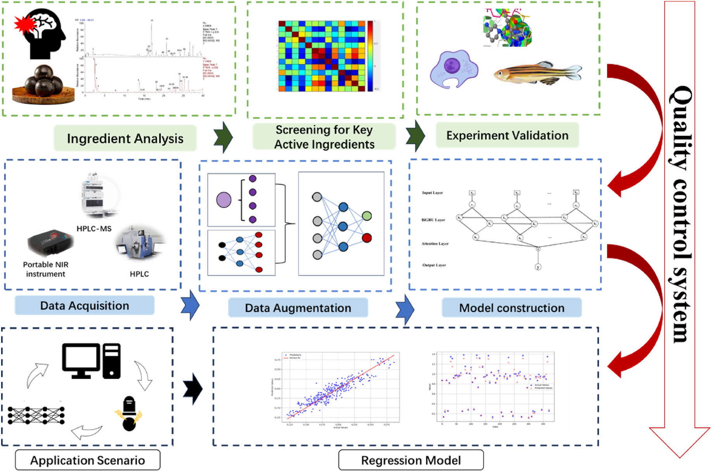
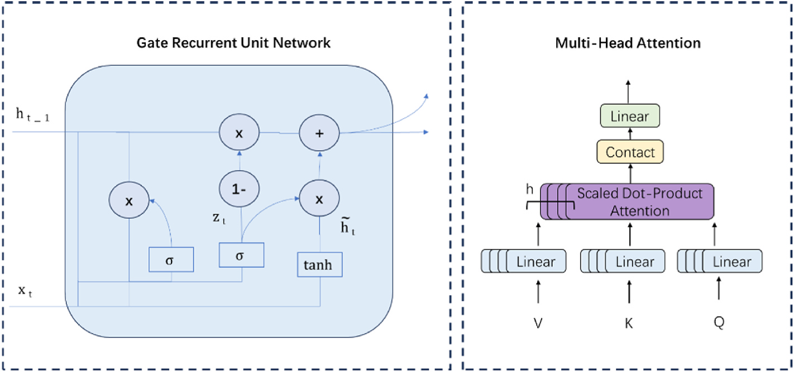
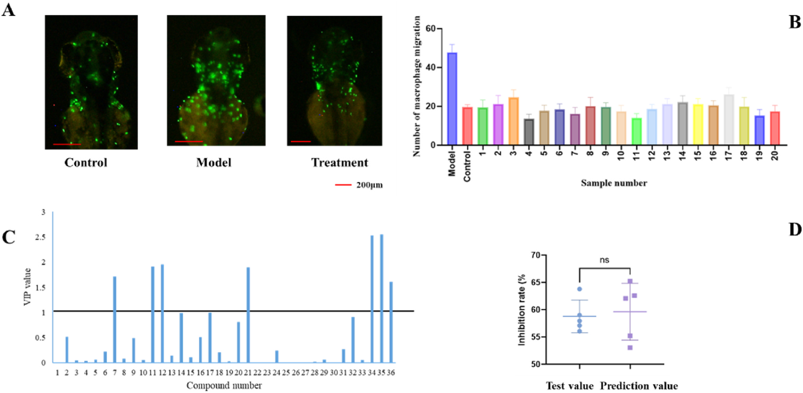
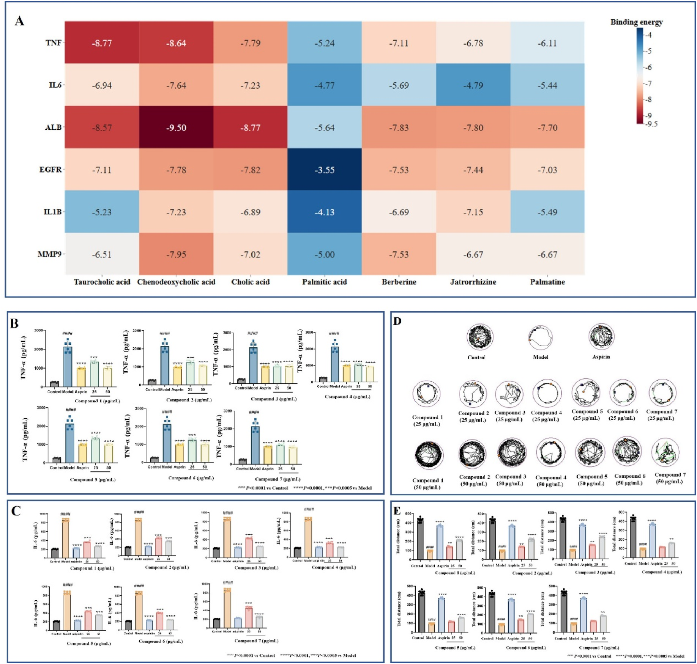
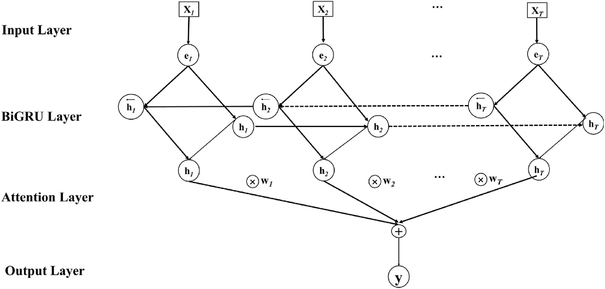
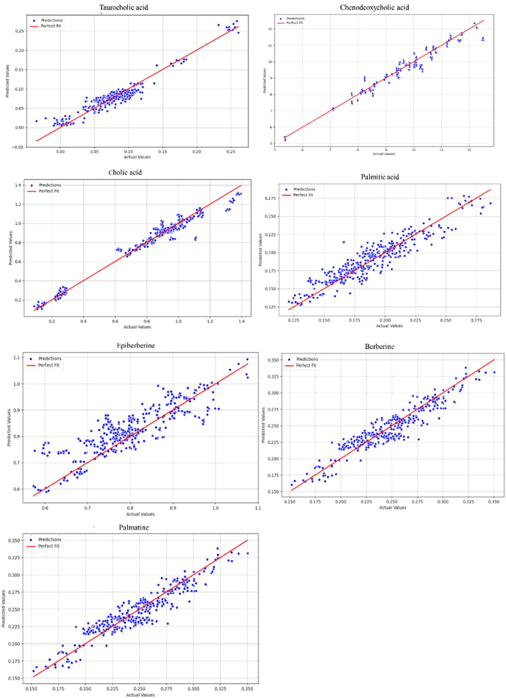

<!-- 方針: ほぼ全訳＋必要に応じた補足。原文構成に沿って訳出。「> 補足:」は訳者注。 -->

## 書誌情報

- 原題: Screening of bioactive compounds and deep learning-driven quality control of Angong Niuhuang pills
- 著者: Mengyin Tian, Xiaobo Ma, Lei Nie, Hengchang Zang（山東大学薬学院 NMPA薬物製品技術研究評価重点実験室／国家糖工程研究センター／化学生物学重点実験室（教育部）, 中国）。Tian と Ma は同等貢献の共同第一著者、Zang が責任著者。
- 掲載: *Journal of Ethnopharmacology* 351 (2025) 120095. https://doi.org/10.1016/j.jep.2025.120095
- インパクトファクター: **5.4**（*Journal of Ethnopharmacology*, JCR 2024 / Clarivate）
- キーワード: 天然物、バイオインフォマティクス、生物活性評価、品質管理
- 受理経過: 受領 2025-02-12 / 改訂 2025-05-30 / 採録 2025-06-02 / オンライン公開 2025-06-07

> 補足: AGNHP = 安宮牛黄丸（Angong Niuhuang Pill）。pCms = proprietary Chinese medicines（中成薬・既製漢方製剤）。IS = ischemic stroke（虚血性脳卒中）。NIR = 近赤外分光。BiGRU-MAR = 双方向GRU（Bi-GRU）＋多頭アテンション（Multi-head Attention）＋残差機構（Residual）を組み合わせた本研究の深層学習モデル。本論文は「活性指向のスクリーニング」＋「AI（深層学習）QC」を融合した研究論文で、原文は引用を著者・年号方式（例: Liu et al., 2019）で記す。本稿では該当箇所に同方式で引用者を残し、末尾に**参考文献**一覧を付す。

## 略語一覧（原文 Abbreviations）

AGNHP＝安宮牛黄丸／BP＝誤差逆伝播（Back Propagation）／Bi-GRU＝双方向ゲート付き回帰ユニット／CNN＝畳み込みニューラルネットワーク／DAVID＝アノテーション・可視化・統合的発見のためのデータベース／DEGs＝差次発現遺伝子／DMSO＝ジメチルスルホキシド／dpf＝受精後日数（day post-fertilization）／ELISA＝酵素結合免疫吸着法／FBS＝ウシ胎児血清／GO＝遺伝子オントロジー／GRU＝ゲート付き回帰ユニット／hpf＝受精後時間（hour post-fertilization）／IL-6＝インターロイキン6／KEGG＝京都遺伝子・ゲノム百科事典／LC-MS＝液体クロマトグラフ質量分析／LPS＝リポ多糖／RNN＝回帰型ニューラルネットワーク／PBS＝リン酸緩衝生理食塩水／PLS＝部分最小二乗／pCms＝中成薬（既製漢方製剤）／TCM＝伝統中国医学（漢方）／TNF-α＝腫瘍壊死因子α／VIP＝投影に対する変数重要度。

## 要旨（Abstract）

**民族薬理学的関連性:** 安宮牛黄丸(AGNHP)は脳卒中など脳疾患に広く用いられる著名な漢方複方製剤である。しかし生薬成分の複雑さと製法の多様性のため、品質管理が難しい。

**目的:** 深層学習駆動の品質管理法を探索し、AGNHP中の主要活性成分の含量を正確・効率的に定量して、大規模な品質管理と収量モニタリングを実現することを目的とした。

**方法:** 本研究では、液体クロマトグラフ質量分析(LC-MS)をネットワーク薬理・部分最小二乗(PLS)解析と組み合わせて活性成分をスクリーニング・検証した。抗炎症活性をゼブラフィッシュおよび細胞モデルで検証し、近赤外分光(NIR)と深層学習モデルで品質管理を達成した。これにより AGNHP の包括的な品質管理体系の確立を目指した。

**結果:** タウロコール酸・ケノデオキシコール酸を含む **7つの主要活性成分** を、LC-MS解析とネットワーク薬理予測でスクリーニングした。これらの成分は in vitro/in vivo モデルで有意な抗炎症活性を示した。BiGRU-MARモデルはこれらの含量を実測値と高い一致度で正確に予測でき、AGNHPのQCにおける有効性を実証した。

**結論:** 本研究はAGNHPの完全な品質管理体系を構築し、科学的・標準化された品質分析・管理を促進した。本研究成果は中成薬(pCms)の大規模QCの強固な科学的基盤を築き、重要な理論的・応用的価値をもつ。

## 1. 序論（Introduction）

脳卒中は罹患率・障害率・死亡率が高く、人の健康を著しく脅かす神経疾患である。なかでも虚血性脳卒中(IS)は特に危険で、全脳卒中の **80%** を占め、その死亡率も相対的に高い。漢方(TCM)は多標的・多成分の治療特性、個別化治療、全体調節、そして高い安全性という利点をもち、脳卒中治療で重要な役割を果たす。AGNHPは古くから確立された複方処方であり、脳卒中・熱性けいれんなどの治療に広く用いられてきた(Liu et al., 2019; Xu et al., 2022)。古典的なAGNHPは、**牛黄（Bos taurus domesticus Gmelin）・郁金（Curcuma aromatica Salisb.）・水牛角・麝香（Moschus）・珍珠（真珠, Pernulo）・梔子（Gardenia jasminoides Ellis）・黄連（Coptis chinensis Franch）・黄芩（Scutellaria baicalensis Georgi）・朱砂・雄黄・氷片（竜脳, borneol）** からなる(Zhang et al., 2024)。古代の宮廷では、AGNHPは希少で貴重な補剤とみなされていた。しかし現代医学の進展と標準化・品質保証への要求の高まりに伴い、AGNHPを含む中成薬(pCms)の品質管理は前例のない課題に直面している。

中成薬(pCms)の品質検査には2つの大きな課題がある。第一に、**指標物質と薬効の関連が不明確**であること——これはpCmsの組成が複雑であることに由来し、鍵となる薬効成分を的確に捉えることを難しくしている。第二に、**pCmsの検査作業が膨大**であること——技術・装置の制約から包括的・正確な検査が難しく、その結果、品質問題を適時に検出しにくい。pCmsのスペクトル−薬効(spectrum-effect)相関解析により、指紋(フィンガープリント)の特徴ピークとpCmsの薬効との間に密接な関連があることが明らかにされており、これらのピークに対応する化学成分が薬効の基盤となりうる。スペクトル−相関解析は、アルコール依存の治療に用いる葛根−黄芩湯(Pueraria-Scutedaria Decoction)の活性成分の解析にも用いられた。指紋と薬効データを比較することで鍵となる活性成分の同定に成功し、同処方の臨床応用と品質管理に科学的根拠を提供した(Zhang et al., 2023)。

深層学習モデルは、その優れたデータ処理・解析能力ゆえ、pCmsの精密な検出に大きな可能性をもつ(Liu, J. et al., 2023)。モデル構造とパラメータを継続的に最適化することで、検出の精度・正確性を大幅に高められる。近年、深層学習は漢方(TCM)の品質管理に成功裏に応用され、顕著な成果を上げている(Chen et al., 2024; Liu, H. et al., 2023)。一部の研究では、畳み込みニューラルネットワーク(CNN)を用いてTCM画像から深層学習を行い、画像特徴の抽出・分類によって種類や産地の正確な同定を実現している。この技術は同定の効率を高めるだけでなく、生薬のトレーサビリティと品質管理を支える(Bai and Zhang, 2024)。回帰型ニューラルネットワーク(RNN)も、pCms製造中の品質変化の解析・予測に応用されてきた(Xue et al., 2023)。製造工程のパラメータとデータをリアルタイムに監視することで、RNNは潜在的な品質問題を適時に検出し、自動的に適切な介入・調整を行い、pCmsの安定性・安全性を確保できる。

本研究は、IS治療のためのAGNHP活性成分をスクリーニング・評価し、厳密な実験設計を通じてその薬効を系統的に検証し、鍵となる品質管理指標を確定することを目的とした(Fig. 1)。多層設計に残差機構を組み合わせ、さらに複数のアテンション機構を組み込んだモデルアーキテクチャを革新的に提案し、同時に携帯型近赤外分光と深層学習を採用して、AGNHP含量定量の精度・効率を大幅に向上させた。これら一連の研究は、pCmsの大規模品質管理のための強固な科学的基盤を築き、重要な理論的価値をもつ。

## 2. 材料と方法（Materials and Methods）

### 2.1 試料調製（処方組成）

AGNHPは固有の処方をもつ中成薬(pCm)である。処方は——**牛黄（Bos taurus domesticus Gmelin）100 g、郁金（Curcuma aromatica Salisb.）100 g、水牛角濃縮粉 200 g、麝香（Moschus）25 g、珍珠（真珠, Pernulo）50 g、梔子（Gardenia jasminoides Ellis）100 g、黄連（Coptis chinensis Franch）100 g、黄芩（Scutellaria baicalensis Georgi）100 g、朱砂 100 g、雄黄 100 g、氷片（竜脳）25 g** ——を含む。AGNHPの配合原則に従い、**牛黄−黄連の比率を変え、牛黄の品種も変えて計20バッチ** の試料を調製した（組成は補足データFig.1）。試料 100 mg を メタノール:DMSO:水(1:1:1) 溶媒 10 mL に懸濁し、**200 W で 60 分間**超音波抽出した。全溶液を 0.22 μm 膜で濾過した。全標準品溶液も 0.22 μm 微多孔膜で濾過した(Sun et al., 2021)。

### 2.2 LC-MS法

- **装置:** Agilent 1290 Infinity II-Ultivo、ESI（エレクトロスプレーイオン化）源。定量には多重反応イオン監視(MRM)を用い、監視モードはフルスキャン監視モードとした。
- **カラム:** Waters ACQUITY UPLC BEH C18（100 mm × 2.1 mm, 1.7 μm）、カラム温度 30 ℃。
- **移動相:** A=アセトニトリル、B=0.1%ギ酸水溶液。グラジエント溶出——0–5 min: 3–15%A／5–12 min: 15–17%A／12–22 min: 17–25%A／22–24.5 min: 25%A／24.5–32.5 min: 25–40%A／32.5–（30）min: 40–90%A。平衡化時間 10 min。
- **流速** 0.25 mL/min、注入量 10 μL(Wang et al., 2014)。
- **MS条件:** イオン源電圧＝正イオンモード 3.0–5.0 kV／負イオンモード −3.0～−5.0 kV。キャピラリー温度 350 ℃（エアロゾル形成と溶媒蒸発を助ける）。コーン電圧は通常 10–50 V。窒素をネブライザーガス(GS1)・補助ガス(GS2)に用い、GS1=30–60 psi、GS2=10–30 psi。質量範囲 m/z 50–1000(Wang et al., 2014)。

### 2.3 ゼブラフィッシュ安全性試験

採取したゼブラフィッシュ胚を 1 mg mL⁻¹ のストレプトアビジンE溶液で 48 時間培養し、過剰なストレプトアビジンEをゼブラフィッシュ培養水で洗浄してインキュベーター内で培養した。48 hpf に、顕微鏡下で発生正常かつ健常な個体を選び、24ウェルプレートの試料プレートへ 1ウェルあたり10個体で移した。予備試験に基づき、**ブランク対照群・溶媒対照群(DMSO)・AGNHP群(200・400・600・800・1200 μg L⁻¹)** を設定し、各群3反復とした。続いて胚を光照射インキュベーター内で **28.0 ± 0.5 ℃** の恒温下で培養し、**2日間**連続投与した(Yang et al., 2021)。培養溶媒は毎日交換した。投与後 **24・48 時間**に各群のゼブラフィッシュの死亡を観察・記録し、**心拍の有無**を生死判定の基準として死亡率を算出した(Han et al., 2022)（補足データFig.2、補足データTable 1）。全ゼブラフィッシュは山東省科学院生物学研究所の実験動物福祉倫理委員会(3071027331728)の許可のもとで使用した（承認番号 SWS20190322）。

### 2.4 ゼブラフィッシュ脳炎症活性アッセイ

48 hpf に採取した発生正常・健常な胚を顕微鏡下で選び、24ウェルプレートへ移した（1ウェルあたり10個体）。安全性試験に基づき、最大非致死濃度 **100・200 μg L⁻¹** を投与濃度とした。化合物（タウロコール酸・ケノデオキシコール酸・コール酸・パルミチン酸・エピベルベリン・ベルベリン・パルマチン）の実験用量は、最大無毒性量(no observed adverse effect level)から **25・50 μg/mL** に設定した。予備試験に基づき、ブランク対照群・溶媒対照群(DMSO)・モデル群（ポナチニブ 2 μg/mL）を設けた。試料処理群(100・200 μg/mL)は各群3反復とした。ゼブラフィッシュを光照射インキュベーター内で **28.0 ± 0.5 ℃** の恒温で 24 時間培養した(Lin et al., 2023)。0.3% トリカインで 2 分間処理して麻酔し、実体顕微鏡下で脳領域の写真を撮影してマクロファージ数を計数した。

### 2.5 ゼブラフィッシュ行動実験

5 dpf（受精後日数）以降、稚魚は自ら長距離を遊泳し餌を探すようになる。5 dpf から、行動投与の 24 時間後に行動測定を行った。各群から野生型稚魚 10 個体を選び、48ウェルプレートへ移した（1ウェル1個体、胚培地 300 μL）(Androuin et al., 2021)。追跡前に約 15 分間馴化させた。ゼブラフィッシュの遊泳軌跡を Zebralab (Viewpoint, Lyon, France) で記録した。行動軌跡は **20 分間、60 秒ごと**に記録した(Androuin et al., 2021)。各群の総移動距離を、行動指標の変化として解析した。

### 2.6 部分最小二乗(PLS)解析

少数データの多変量共線性を効果的に解消し、複雑な背景干渉を低減し、モデルの解釈性・予測精度を高めるため、部分最小二乗(PLS)を適用した。質量分析ピークの応答強度を独立変数(X)、薬効データを従属変数(Y)とした(Xiong et al., 2023)。

### 2.7 化合物−疾患標的予測

Swiss Target Prediction (http://www.swisstargetprediction.ch/) を用いて、LC-MS解析で確認された成分に基づき標的を収集した。関連標的遺伝子は UniProt データベース(http://www.uniprot.org/uploadlists/)から取得した(Zhou et al., 2022)。本研究では DisGeNET (https://www.disgenet.org/) と GeneCards (https://www.genecards.org/) から脳卒中(stroke)関連標的の遺伝子情報を収集し、キーワード「stroke」で検索して脳卒中関連標的を同定した(Jiao et al., 2022)。重複を除去し、UniProt (https://www.uniprot.org/) で検証したのち脳卒中関連標的を得た。標的遺伝子には「Homo sapiens」のタンパク質のみを用いた。ISとAGNHPの交差標的を選び、作用機序をさらに検討した(Jiao et al., 2022)。

### 2.8 PPIタンパク質ネットワーク相互作用

共通標的を STRING (https://string-db.org/) データベースに投入し、種を「Homo sapiens」に設定、「medium confidence」かつ「combined score > 0.9」をスクリーニング基準として、相互作用に関与しない標的を除外し、共通標的のPPIネットワークを得た。Cytoscape 3.9.0 のプラグインで解析し、コア標的を抽出した(Peng et al., 2017)。

### 2.9 分子ドッキング

ネットワーク薬理研究における成分−標的の関連を検証するため分子ドッキングを行った。分子構造は TCMSP データベースから取得した。PPIネットワークの上位6標的タンパク質をドッキング対象に選んだ。標的タンパク質の3次元構造は PDB 形式で RCSB PDB データベース(http://www.rcsb.org/)から取得し、AutoDock Vina 1.5.7 に読み込んで水素付加・脱水などの前処理を行った。AutoDock Vina が生成したドッキング結果はまず pdbqt 形式で保存した。受容体タンパク質構造(pdbqt形式)とドッキングしたリガンド構造を PyMOL 3.1 に読み込んで可視化した。

### 2.10 in vitro 抗炎症活性

BV2ミクログリア細胞を DMEM 完全培地（DMEM＋10%FBS＋1%ペニシリン/ストレプトマイシン）中、5%CO₂・37 ℃ で培養した。継代・実験には密度約 80% まで培養した(Nam et al., 2018)。実験は4群に分けた——**対照群**（完全培地 100 μL）、**モデル群**（2 μg/mL LPS を 24 時間）、**AGNHP群**（2 μg/mL LPS で 24 時間刺激後、選定AGNHP化合物を最適濃度 50 μM でさらに 24 時間処理）、**アスピリン群**（2 μg/mL LPS で 24 時間刺激後、5 mM アスピリンでさらに 24 時間処理）。LPS 刺激 24 時間後、対照群を除く全群を PBS で洗浄して未結合LPSを除いた。4群から適量の PBS で回収した BV2 細胞を **1000×g で 15 分間**遠心して上清を得た。上清中の **腫瘍壊死因子α(TNF-α)・インターロイキン6(IL-6) を ELISA で定量**した(Nam et al., 2018)。各試料は3回分析した。

### 2.11 スペクトルデータ取得

光ファイバーモードを用い、試料の異なる3か所からランダムにスペクトルを取得した。NIRスペクトルは SW2560-050MRC (OtO Photonics, China)（重水素化硫酸トリグリセリン検出器搭載）で取得した。全スペクトルは **900–1700 nm・分解能 5 nm** で記録し、各取得を3回スキャンした(Yang et al., 2022)（試料スペクトルは補足データFig.3）。

### 2.12 含量定量

試料に対して繰り返し試験を行った（補足データTable 2）。AGNHP 7成分の回収率解析結果は平均回収率(%)とRSD(%)で示した（補足データTable 3）。線形回帰の結果は補足データTable 4に示した。線形回帰試験に用いた AGNHP 7成分の標準品(Patil et al., 2014)は、すべて上海源葉生物科技有限公司(Shanghai Yuanye Biotechnology Co., Ltd.)より購入した。

### 2.13 理論とアルゴリズム

モデルの汎化性能を高めるため、ノイズ付加に基づくデータ拡張を行った。具体的には、正規化データに **平均0・標準偏差0.01** のガウスノイズを付加し、元データに類似しつつ固有の特性をもつ複数の拡張試料を生成した(Li et al., 2023)。データ拡張倍率を **10** とし、元データセットを10倍に拡張して、モデル訓練のための豊富で包括的なリソースを提供した。

RNNの変種のうち、**ゲート付き回帰ユニット(GRU)** は代表的なゲート機構である(Fig. 2、補足データTable 5)(Urban et al., 2022)。多くの研究が、GRUは従来のRNNに比べて勾配問題や長期記憶の問題を解決できることを示している(Munir et al., 2021)。**多層双方向ゲート付き回帰ユニット(Bi-GRU)** は、双方向回帰型ニューラルネットワークとゲート付き回帰ユニットを相乗的に組み合わせて機能する(Aly Abdelkader et al., 2023)。ゲート付き回帰ユニットは、これら2つの隠れ状態に基づいて情報を統合・フィルタリングし、最終的な表現を得る(Ahuja et al., 2022)。この構造により、時系列データの長期依存性をより良く捉え、モデルの性能・汎化能を高められる。**アテンション機構**は2014年に初めて提案され、当初は自然言語処理に応用されたが（GRUモデルと同様）、以降さまざまな発展・適応を経て多様な領域のニーズに合わせて用いられている(Fig. 2)(He et al., 2023)。アテンション機構は入力系列を異なる視点から並列に処理でき、系列中の潜在的な複数の意味的関連をより包括的に捉える。訓練過程を安定化するため、多頭アテンション機構の出力後に通常、残差結合(residual concatenation)と層正規化(layer normalization)を付加する。

### 2.14 評価指標

一般的に用いられる相補的な3指標——**平均二乗誤差(MSE)・平均絶対誤差(MAE)・決定係数(R²)** ——を用いた。これらは異なる観点からモデル性能を包括的に評価する(Vijayan et al., 2023)。

### 2.15 比較手法

提案する BiGRU-MAR の有効性を示すため、他モデルと比較した。機械学習モデルの実験では、深層学習モデルとの比較解析のために各種の一般的な回帰モデルを選んだ。すなわち **線形回帰・決定木・ランダムフォレスト・K近傍法(KNN)・誤差逆伝播(BP)・勾配ブースティング** である。

### 2.16 データ解析

統計解析には GraphPad Prism 9.0 を用いた。2群間比較には t 検定、多群間比較には一元配置分散分析(one-way ANOVA)を用いた。データは平均 ± 標準偏差(x ± s)で表し、**P < 0.05** を統計的有意とした。全実験は少なくとも3回反復した(Fischer et al., 2024)。

## 3. 結果（Results）

### 3.1 試料情報解析

LC-MS技術で試料中の成分を解析し、研究・学会資料を用いて組成を確認した。由来である**牛黄・黄連から計36成分**を同定した（Table 1、補足データFig.4）。同定された成分のイオン応答強度も取得した（補足データSFig.5）。

**Table 1. 試料中で同定された成分（全36成分）**

| No. | 相対時間(min) | 名称 | 分子式 | 実測分子量 | Δ(ppm) |
|---|---|---|---|---|---|
| 1 | 2.05 | Lysine（リシン） | C6H14N2O2 | 146.1053 | −0.374 |
| 2 | 2.4 | Taurine（タウリン） | C2H7NO3S | 125.147 | 0.984 |
| 3 | 2.68 | Phenylalanine | C9H11NO2 | 165.19 | 0.65 |
| 4 | 2.9 | Histidine | C6H9N3O2 | 155 | 1.39 |
| 5 | 4.34 | Leucine | C6H13NO2 | 131.17 | 0.354 |
| 6 | 7.4 | Palmitic acid（パルミチン酸） | C16H32O2 | 256.424 | 1.543 |
| 7 | 11.98 | Protocatechuic acid | C7H6O4 | 153.0199 | 1.665 |
| 8 | 12.1 | Ferulic acid | C10H10O4 | 193.0508 | 1.305 |
| 9 | 13.15 | Aporphine alkaloid | C20H24NO4 | 342.1706 | 0.605 |
| 10 | 16.09 | Tetrahydroberberine | C20H21NO4 | 340.1548 | 0.415 |
| 11 | 16.8 | Tryptophan | C11H12N2O2 | 204.0900 | 1.898 |
| 12 | 17.12 | Tetrahydropalmatine | C21H25NO4 | 356.1863 | 0.645 |
| 13 | 17.26 | Noroxyhydrastinine | C10H9NO3 | 192.0661 | 0.61 |
| 14 | 18.05 | Taurocholic acid（タウロコール酸） | C26H45NO7S | 514.285 | 1.896 |
| 15 | 18.5 | Berlambine | C20H17NO5 | 352.1184 | 0.491 |
| 16 | 19.06 | Hydrastine | C21H21NO6 | 368.1498 | 0.501 |
| 17 | 19.35 | Groenlandicine | C19H16NO4+ | 322.1078 | 0.436 |
| 18 | 20.1 | Jatrorrhizine | C20H20NO4 | 338.1392 | 0.535 |
| 19 | 20.2 | Coptisine | C19H14NO4+ | 320.0923 | 0.556 |
| 20 | 20.85 | Epiberberine（エピベルベリン） | C20H18NO4+ | 336.1236 | 0.595 |
| 21 | 21.08 | (5β,7α,12α)-7,12-Dihydroxy-3-oxocholan-24-oic acid | C24H38O5 | 406.556 | 1.396 |
| 22 | 21.85 | Glycocholic acid | C26H43NO6 | 465.63 | 2.514 |
| 23 | 22.03 | 7-Ketolithocholic acid | C24H38O4 | 390.56 | 2.424 |
| 24 | 22.45 | Chenodeoxycholic acid（ケノデオキシコール酸） | C24H40O4 | 392.57 | 1.739 |
| 25 | 22.75 | Cholic acid（コール酸） | C24H40O5 | 408.57 | 1.565 |
| 26 | 23.05 | Taurochenodeoxycholic acid | C26H45NO6S | 498.2909 | 1.595 |
| 27 | 23.32 | Taurodeoxycholic acid | C26H45NO6S | 499.7 | −2.09 |
| 28 | 23.55 | Glycochenodeoxycholic acid | C26H43NO5 | 449.62 | 1.75 |
| 29 | 23.78 | Glycodeoxycholic acid | C26H43NO5 | 449.6003 | −1.375 |
| 30 | 23.92 | Deoxycholic acid | C24H40O4 | 392.57 | 3.23 |
| 31 | 24.54 | Glaucentrine | C20H23NO4 | 340.1549 | 0.515 |
| 32 | 24.7 | Berberine（ベルベリン） | C20H18NO4 | 336.1236 | 0.654 |
| 33 | 24.85 | Glycocholic acid | C26H43NO4 | 433.63 | 1.818 |
| 34 | 25.16 | Arachidonic acid | C20H32O2 | 304.467 | 1.313 |
| 35 | 25.5 | Palmatine（パルマチン） | C21H22NO4 | 352.1551 | 0.725 |
| 36 | 25.8 | Lithocholic acid | C24H40O3 | 376.57 | −0.711 |

> 補足: 各成分の MS² 断片イオンと帰属文献（Liu et al., 2020／Xiao-li et al., 2023／Yiming et al., 2020／Xiao-ru et al., 2018／Quanlin et al., 2024／Yu-shuang et al., 2020 ほか）は原文Table 1に列挙されている。分子量・Δ(ppm)の一部は原文表記の桁・丸めをそのまま踏襲した（例: No.4 Histidine の実測分子量 155、No.27 Taurodeoxycholic acid の 499.7 など、原文どおり）。

### 3.2 脳炎症モデルの評価

トランスジェニックゼブラフィッシュを用いて、脳卒中時の脳内マクロファージの遊走を観察し、頭部へ浸潤するマクロファージの程度・数を監視して脳炎症状態を評価した(Fig. 3A)(Lin et al., 2023)。対照群では観察されるマクロファージが少なかった。Fig. 3B に示すように、モデル群ではポナチニブ処理後に脳領域へマクロファージが集積した(P < 0.0001 vs 対照群)。投与濃度の増加に伴い、脳領域のマクロファージ数は徐々に減少し、集積も有意に低下した(P < 0.005 vs モデル群)。

36成分のうち、**タウロコール酸・ケノデオキシコール酸・コール酸・パルミチン酸・エピベルベリン・ベルベリン・パルマチン** が PLSR モデルで **VIP値 > 1** を示した(Fig. 3C)。Fig. 3D の t 検定結果は、PLSR モデルの予測が **P = 0.7300** で実測値と有意差がなく、良好であることを示した。

### 3.3 品質マーカーのスクリーニングと検証

脳の抗炎症活性と関連する **7成分**を選定した——タウロコール酸(化合物1)・ケノデオキシコール酸(化合物2)・コール酸(化合物3)・パルミチン酸(化合物4)・エピベルベリン(化合物5)・ベルベリン(化合物6)・パルマチン(化合物7)。これら7成分を潜在的活性成分とし、実験的に検証した。

PPIネットワークは **154ノード・534エッジ** から構成された（補足データSFig.6）。DEGREE と DMNC の2解析法で交差度が最も高い6標的——**TNF・IL6・ALB・EGFR・IL1B・MMP9**——を選定した。これらはPPIネットワークのコア標的であり、処方薬による脳卒中治療で鍵となる役割を果たしうる。スクリーニングした7成分は、牛黄−黄連（Bezoar-Coptidis rhizome）という薬対における潜在活性成分とみなされた。同時に、ISに直接関連する標的も考慮した。鍵標的として6つ——**TNF-α (PDB ID: 2AZ5)、IL6 (1ALU)、ALB (4L9K)、EGFR (6LUD)、IL1B (4×37)、MMP9 (1ITV)**——を用いた。潜在的品質マーカーの各標的への**結合エネルギーはいずれも −5 未満**で、良好な結合活性を示した(Fig. 4A)。7つの鍵成分を選び、最良ドッキング結果を用いてドッキング様式を可視化した（補足データSFig.7）。

### 3.4 TNF-α・IL-6 濃度測定

分子ドッキングの結果から、他の標的と比べて **TNF-α と IL6 が、ISに対するAGNHPの鍵標的**であることが示された。これらのサイトカインは脳卒中に伴う炎症応答で重要な役割を果たす。TNF-α は炎症反応のカスケードを引き起こす前炎症性サイトカインで、組織損傷・神経細胞傷害をもたらす。IL-6 も炎症過程に関与し、脳卒中患者で発現亢進が示されている。

そこで、BV2細胞における TNF-α・IL6 のレベルを測定し、7つの潜在活性成分の脳卒中に対する治療効果を詳しく検討した。Fig. 4B・C に示すように、モデル群の TNF-α・IL6 は対照群より有意に高かった(P < 0.0005 vs 対照群)。定量解析の結果、AGNHP中の7つの潜在活性成分は **TNF-α・IL6 を抑制することでISに治療効果**を示すことが示された。

### 3.5 ゼブラフィッシュ行動評価

6 dpf で稚魚の運動行動を測定し、異なる濃度における潜在的な鍵活性成分の、ポナチニブ誘発ゼブラフィッシュ行動異常への効果を評価した(Eachus et al., 2021)。ポナチニブと化合物に曝露したゼブラフィッシュの遊泳行動を追跡撮影した。対照群と比べ、モデル群はゼブラフィッシュの移動軌跡と総移動距離が減少した(Fig. 4D・E)。AGNHPの7成分により、ゼブラフィッシュの行動は明確に改善した。

### 3.6 深層学習モデルの構築

BiGRU-MARの設計では、**3層の双方向GRU** を含むアーキテクチャを構築し、系列データの双方向依存性を最大限に活用して時系列特徴の理解を深めることを狙った(Fig. 5)。双方向GRUの層を積み重ねることで、データの深層学習と双方向情報フローの効果的な捕捉を実現する。各GRU層の出力を結合(connectivity)操作で慎重に接続し、異なる方向からの情報を融合させて、複雑データの解析能力を高める。さらにモデルの表現能力を高めるため、**多頭アテンション機構(multi-attention mechanism)** を導入した。複数の独立したアテンションヘッドを設けることで、異なる部分空間におけるデータの豊かな情報を捉え、複雑パターンの認識・捕捉能力を大幅に向上させる。

### 3.7 比較実験の結果

事前スクリーニング・検証で得たAGNHPの鍵活性成分について、含量予測モデルを構築した。7成分の予測結果を Table 2 に示す。深層学習モデルの予測性能は複数要因の組み合わせに影響され、成分含量の高低が予測結果を直接決めるわけではなかった(Fig. 6)。予測精度を高めるには、データ品質・モデル複雑性・特徴選択と処理・モデル選択とチューニング、そして成分間の非線形関係の可能性などを総合的に考慮する必要がある。特に **タウロコール酸・ケノデオキシコール酸・コール酸** では、モデルの **R² が 0.9 超**で理想値1に極めて近く、予測値が実測値とほぼ一致し、予測精度が極めて高いことを示した。同時に、MAE・MSE の2指標でも他モデルを有意に上回り、予測精度における顕著な優位性がさらに裏づけられた。この優位性は、多層BiGRU-MARモデルの適用と、各層間に導入した残差結合に由来すると推測される。これらの設計は複雑特徴の捕捉能力を高めるだけでなく、モデルの安定性も向上させる。とりわけ残差結合は、深層ネットワーク訓練における勾配消失問題の緩和を助け、訓練効果を最適化し、汎化能を高める。

**Table 2. 比較モデルの予測性能（BiGRU-MAR と各機械学習モデル・7指標成分×各モデル）**

| 指標成分 | モデル | MSE | MAE | R² Score |
|---|---|---|---|---|
| タウロコール酸 | BiGRU-MAR | 0.0002 | 0.0101 | 0.9176 |
| | BP | 0.0013 | 0.0216 | 0.4404 |
| | Random Forest | 0.0005 | 0.0148 | 0.7611 |
| | KNN | 0.0013 | 0.0245 | 0.3677 |
| | Gradient Boosting | 0.0003 | 0.0121 | 0.8582 |
| | Decision Tree | 0.0004 | 0.0135 | 0.8052 |
| | Linear Regression | 0.0008 | 0.0216 | 0.6260 |
| ケノデオキシコール酸 | BiGRU-MAR | 0.0001 | 0.0020 | 0.9086 |
| | BP | 0.0003 | 0.0053 | 0.6555 |
| | Random Forest | 0.0003 | 0.0086 | 0.3516 |
| | KNN | 0.0001 | 0.0030 | 0.8094 |
| | Gradient Boosting | 0.0005 | 0.0065 | 0.5670 |
| | Decision Tree | 0.0003 | 0.0087 | 0.2657 |
| | Linear Regression | 0.0005 | 0.0060 | 0.6567 |
| コール酸 | BiGRU-MAR | 0.0750 | 0.1952 | 0.9201 |
| | BP | 0.1305 | 0.2665 | 0.8527 |
| | Random Forest | 0.0782 | 0.2365 | 0.9029 |
| | KNN | 0.4600 | 0.5116 | 0.4285 |
| | Gradient Boosting | 0.0733 | 0.2045 | 0.9089 |
| | Decision Tree | 0.2030 | 0.2981 | 0.7478 |
| | Linear Regression | 0.4385 | 0.5377 | 0.4552 |
| パルミチン酸 | BiGRU-MAR | 0.0055 | 0.0556 | 0.9481 |
| | BP | 0.0127 | 0.0931 | 0.8508 |
| | Random Forest | 0.0269 | 0.1259 | 0.6853 |
| | KNN | 0.0697 | 0.2063 | 0.1836 |
| | Gradient Boosting | 0.0209 | 0.0951 | 0.7554 |
| | Decision Tree | 0.0282 | 0.0873 | 0.6701 |
| | Linear Regression | 0.0525 | 0.1395 | 0.3856 |
| エピベルベリン | BiGRU-MAR | 0.0002 | 0.0108 | 0.8222 |
| | BP | 0.0018 | 0.0333 | 0.3389 |
| | Random Forest | 0.0004 | 0.0159 | 0.6689 |
| | KNN | 0.0008 | 0.0279 | 0.5740 |
| | Gradient Boosting | 0.0004 | 0.0165 | 0.6504 |
| | Decision Tree | 0.0006 | 0.0171 | 0.4593 |
| | Linear Regression | 0.0003 | 0.0139 | 0.7247 |
| ベルベリン | BiGRU-MAR | 0.0036 | 0.0439 | 0.6337 |
| | BP | 0.0087 | 0.0599 | 0.0604 |
| | Random Forest | 0.0032 | 0.0444 | 0.6364 |
| | KNN | 0.0082 | 0.0732 | 0.0573 |
| | Gradient Boosting | 0.0029 | 0.0439 | 0.6724 |
| | Decision Tree | 0.0080 | 0.0453 | 0.0883 |
| | Linear Regression | 0.0023 | 0.0387 | 0.7397 |
| パルマチン | BiGRU-MAR | 0.0003 | 0.0132 | 0.7811 |
| | BP | 0.0092 | 0.0545 | 0.5268 |
| | Random Forest | 0.0003 | 0.0145 | 0.7637 |
| | KNN | 0.0009 | 0.0256 | 0.3358 |
| | Gradient Boosting | 0.0003 | 0.0152 | 0.7518 |
| | Decision Tree | 0.0006 | 0.0167 | 0.5015 |
| | Linear Regression | 0.0003 | 0.0142 | 0.7267 |

> 補足: BiGRU-MARは7成分中6成分で最良または上位のR²を示した。ベルベリンのみ線形回帰(R²=0.7397)がBiGRU-MAR(0.6337)を上回る例外があり、原文もこの点を「成分ごとにスペクトル情報の類似性や含量分布・相互作用が異なるため、モジュールの効き方に差が出る」と説明している（3.8参照）。

### 3.8 アブレーション試験の結果

Table 3 のデータは、丸剤中の複数指標を予測する際に **BiGRU-MARモジュールのいずれか一部を除去すると、モデルの MSE・MAE が上昇し R² が低下する**ことを示す。この性能低下は、部分的にはこれら成分のスペクトル情報が本質的に類似していることに起因する。各モジュールの影響度は成分によって異なることが観察された。これは成分間で化学的性質・含量分布・他成分との相互作用が異なることに由来すると考えられる。しかしいずれにせよ、**BiGRU-MARモジュールの各部が含量予測の精度向上に不可欠**であることは明らかである。

**Table 3. アブレーション試験の結果（各成分について、完全なBiGRU-MAR／アテンション除去／残差結合除去）**

| 指標成分 | 実験条件 | MSE | MAE | R² Score |
|---|---|---|---|---|
| タウロコール酸 | BiGRU-MAR | 0.1442 | 0.2797 | 0.9218 |
| | Without Attention | 0.2000 | 0.3308 | 0.8978 |
| | Without Residual | 0.1500 | 0.3102 | 0.9144 |
| ケノデオキシコール酸 | BiGRU-MAR | 0.0405 | 0.0920 | 0.9086 |
| | Without Attention | 0.0001 | 0.0078 | 0.3050 |
| | Without Residual | 0.0050 | 0.0650 | 0.9500 |
| コール酸 | BiGRU-MAR | 0.0750 | 0.1952 | 0.9201 |
| | Without Attention | 0.1801 | 0.3086 | 0.2550 |
| | Without Residual | 0.0737 | 0.1390 | 0.9648 |
| パルミチン酸 | BiGRU-MAR | 0.0055 | 0.0556 | 0.9481 |
| | Without Attention | 0.0084 | 0.0705 | 0.9200 |
| | Without Residual | 0.0080 | 0.0651 | 0.9242 |
| エピベルベリン | BiGRU-MAR | 0.0002 | 0.0108 | 0.8222 |
| | Without Attention | 0.0003 | 0.0134 | 0.7277 |
| | Without Residual | 0.0003 | 0.0134 | 0.7266 |
| ベルベリン | BiGRU-MAR | 0.0036 | 0.0439 | 0.6337 |
| | Without Attention | 0.0047 | 0.0478 | 0.6229 |
| | Without Residual | 0.0047 | 0.0491 | 0.5269 |
| パルマチン | BiGRU-MAR | 0.0003 | 0.0132 | 0.7811 |
| | Without Attention | 0.0003 | 0.0135 | 0.7782 |
| | Without Residual | 0.0003 | 0.0150 | 0.7131 |

> 補足: アブレーション試験のBiGRU-MAR値は、Table 2の対応値と一部で数値が異なる（例: タウロコール酸のMSE=0.1442 vs Table2の0.0002）。これは原文の掲載値ママである（Table 2 は含量予測の比較実験、Table 3 はアブレーション条件下の別実験系列と解される）。ケノデオキシコール酸・コール酸では「残差結合を外した方がR²が上がる」逆転も一部見られるが、平均すると各モジュールの寄与は正で、原文は「全体としてアテンション・残差の各部が精度に不可欠」と結論している。

## 4. 考察（Discussion）

漢方(TCM)の品質管理成分と、その主要な適応症との関連の研究が近年ますます重視されている(Bahetjan et al., 2023; Yang et al., 2017)。本研究のスクリーニング戦略は **活性指向(activity-oriented)** である。TCM複方の成分は複雑だが、活性成分のスクリーニングに焦点を絞ることで、薬効に寄与する鍵物質を的確に標的化できる。これにより、多数の非活性/低活性成分に研究労力を浪費することを避け、研究効率を高められる。鍵活性成分を選定した後、ネットワーク薬理のアプローチでこれら化合物の標的・作用経路を予測した。in vitro 細胞実験と in vivo 動物モデルを組み合わせ、スクリーニングした化合物の活性を包括的・系統的に検証した。

迅速・非破壊の品質分析のため、携帯型NIR分光計を用いた。データ拡張は試料コスト・希少性の問題に対処しつつ、モデルの予測精度を高める(Shorten et al., 2021)。本研究の BiGRU-MAR モデルは複雑データに対して強い能力を示し、迅速かつ精密な予測を実現した。本研究は、スクリーニング・検証した指標成分を実製品に適用し、実製品の検証を通じてこれら指標の有効性・正確性をさらに確認した(Yang et al., 2017; Wu et al., 2018)。

ただし本研究にはいくつかの限界がある。**BiGRU-MARモデルは複雑データセットに有効だが、解釈性に欠ける**。今後の研究でこの点を改良する予定である。加えて、本研究の活性成分スクリーニング・検証体系は包括的だが、これら化合物の治療効果・安全性プロファイルを正確に評価するには、より高感度・特異的な評価手法が必要である。

## 5. 結論（Conclusion）

本研究では、AGNHPを研究対象として、pCmsの完全な品質管理体系の構築に成功した。複数の先進技術・手法を統合し、AGNHP中の**7つの鍵活性成分を革新的に同定・検証**し、これら成分の含量定量の精度・効率を大幅に高める効率的な **BiGRU-MARモデル**を構築した。実製品の検証により、これら品質管理指標の有効性・正確性をさらに確認した。本研究は、他のpCmsの品質管理に新たな発想・手法を提供するだけでなく、TCMの品質管理プロセスの標準化を促進するもので、重要な理論的価値と実務的意義をもつ。

## 参考文献

1. Ahuja, S., Shelke, N.A., Singh, P.K., 2022. A deep learning framework using CNN and stacked Bi-GRU for COVID-19 predictions in India. Signal Image Video Proc. 16 (3), 579–586.

2. Aly Abdelkader, G., Ngnamsie Njimbouom, S., Oh, T.J., Kim, J.D., 2023. ResBiGAAT: Residual Bi-GRU with attention for protein-ligand binding affinity prediction. Comput. Biol. Chem. 107 (24), 107969–107975.

3. Androuin, A., Verweij, F.J., van Niel, G., 2021. Zebrafish as a preclinical model for extracellular Vesicle-based therapeutic development. Adv. Drug Deliv. Rev. 176 (6), 113815–113820.

4. Bahetjan, Y., Muhaxi, M., Pang, K., Kizaibek, M., Tang, H., Sefidkon, F., Yang, X., 2023. Chemistry, bioactivity, and prediction of the quality marker (Q-Marker) of ferula plants in China: a review. Molecules 28 (13), 966–972.

5. Bai, Y., Zhang, H., 2024. The cluster analysis of traditional Chinese medicine authenticity identification technique assisted by chemometrics. Heliyon 10 (18), e37479–e37484.

6. Chen, Z., Zhang, D., Liu, C., Wang, H., Jin, X., Yang, F., Zhang, J., 2024. Traditional Chinese medicine diagnostic prediction model for holistic syndrome differentiation based on deep learning. Integr. Med. Res. 13 (1), 101019–101024.

7. Eachus, H., Choi, M.K., Ryu, S., 2021. The effects of early life stress on the brain and behaviour: insights from zebrafish models. Front. Cell Dev. Biol. 9 (1), 657591–657599.

8. Fischer, M.A., Mustafa, A.-H.M., Hausmann, K., Ashry, R., Kansy, A.G., Liebl, M.C., Brachetti, C., Piée-Staffa, A., Zessin, M., Ibrahim, H.S., Hofmann, T.G., Schutkowski, M., Sippl, W., Krämer, O.H., 2024. Novel hydroxamic acid derivative induces apoptosis and constrains autophagy in leukemic cells. J. Adv. Res. 60 (10), 201–214.

9. Han, L., Xia, Q., Zhang, L., Zhang, X., Li, X., Zhang, S., Wang, L., Liu, C., Liu, K., 2022. Induction of developmental toxicity and cardiotoxicity in zebrafish embryos/larvae by acetyl-11-keto-β-boswellic acid (AKBA) through oxidative stress. Drug Chem. Toxicol. 45 (1), 143–150.

10. He, M., Hou, X., Ge, E., Wang, Z., Kang, Z., Qiang, N., Zhang, X., Ge, B., 2023. Multi-head attention-based masked sequence model for mapping functional brain networks. Front. Neurosci. 17 (6), 1183145–1183150.

11. Jiao, W., Mi, S., Sang, Y., Jin, Q., Chitrakar, B., Wang, X., Wang, S., 2022. Integrated network pharmacology and cellular assay for the investigation of an anti-obesity effect of 6-shogaol. Food Chem. 374 (5), 131755–131760.

12. Li, Q., Wang, J., Zhou, Y., 2023. Data augmentation method based on the Gaussian kernel density for glioma diagnosis with Raman spectroscopy. Anal. Methods 15 (15), 1861–1869.

13. Lin, S., Liu, X., Sun, A., Liang, H., Li, Z., Ye, S., Ma, H., Fan, W., Shen, C., Jin, M., He, Q., 2023. Qilong capsule alleviates ponatinib-induced ischemic stroke in a zebrafish model by regulating coagulation, inflammation and apoptosis. J. Ethnopharmacol. 314 (1), 116397–116402.

14. Liu, H., Yan, Y., Pang, P., Mao, J., Hu, X., Li, D., Zhou, B., Shan, H., 2019. Angong Niuhuang pill as adjuvant therapy for treating acute cerebral infarction and intracerebral hemorrhage: a meta-analysis of randomized controlled trials. J. Ethnopharmacol. 237 (1), 307–313.

15. Liu, H., Yu, S., Li, X., Wang, X., Qi, D., Pan, F., Chai, X., Wang, Q., Pan, Y., Zhang, L., Liu, Y., 2023. Integration of deep learning and sequential metabolism to rapidly screen dipeptidyl peptidase (DPP)-IV inhibitors from Gardenia jasminoides ellis. Molecules 28 (21), 98–102.

16. Liu, J., Dan, W., Liu, X., Zhong, X., Chen, C., He, Q., Wang, J., 2023. Development and validation of predictive model based on deep learning method for classification of dyslipidemia in Chinese medicine. Health Inf. Sci. Syst. 11 (1), 21–28.

17. Liu, W.X., Cheng, X.L., Guo, X.H., Hu, X.R., Wei, F., Ma, S.C., 2020. Identification of Calculus Bovis and its mixed varieties by ultra-high-performance liquid chromatography/quadrupole time-of-flight mass spectrometry (UHPLC-Q/TOF-MS) combined with the principal component analysis (PCA) method. J. Pharm. Biomed. Anal. 179 (6), 112979–112983.

18. Munir, H.S., Ren, S., Mustafa, M., Siddique, C.N., Qayyum, S., 2021. Attention based GRU-LSTM for software defect prediction. PLoS One 16 (3), e0247444–e0247449.

19. Nam, H.Y., Nam, J.H., Yoon, G., Lee, J.Y., Nam, Y., Kang, H.J., Cho, H.J., Kim, J., Hoe, H.S., 2018. Ibrutinib suppresses LPS-induced neuroinflammatory responses in BV2 microglial cells and wild-type mice. J. Neuroinflammation 15 (1), 271–277.

20. Patil, A.A., Sachin, B.S., Wakte, P.S., Shinde, D.B., 2014. Optimization of supercritical fluid extraction and HPLC identification of wedelolactone from Wedelia calendulacea by orthogonal array design. J. Adv. Res. 5 (6), 629–635.

21. Peng, X., Wang, J., Peng, W., Wu, F.X., Pan, Y., 2017. Protein-protein interactions: detection, reliability assessment and applications. Briefings Bioinf. 18 (5), 798–819.

22. Quanlin, Y., Jiajia, S., Hanbing, L., Minfeng, L., Shizu, T., Qiaoping, J., Tianshu, W., Chengke, C., Hongfei, W., 2024. Probing chemical composition of Pheretima guillelmi extracts based on UPLC-Q-Exactive-MS and various techniques. Drug Evaluation Res. 47 (6), 1285–1294.

23. Shorten, C., Khoshgoftaar, T.M., Furht, B., 2021. Text data augmentation for deep learning. J. Big Data 8 (1), 101–108.

24. Sun, M., Liu, Q., Liang, Q., Gao, S., Zhuang, K., Zhang, Y., Zhang, H., Liu, K., She, G., Xia, Q., 2021. Toosendanin triggered hepatotoxicity in zebrafish via inflammation, autophagy, and apoptosis pathways. Comp. Biochem. Physiol. C Toxicol. Pharmacol. 250 (1), 109171–109179.

25. Urban, M., Klum, M., Pielmus, A.G., Liebrenz, F., Mann, S., Tigges, T., Orglmeister, R., 2022. GRU neural network improved bioimpedance based stroke volume estimation during ergometry stress test. Sensors (Basel) 22 (20), 101–109.

26. Vijayan, M., Sridhar, S.S., Vijayalakshmi, D., 2023. A deep learning regression model for photonic crystal fiber sensor with XAI feature selection and analysis. IEEE Trans. NanoBioscience 22 (3), 590–596.

27. Wang, D.D., Liang, J., Yang, W.Z., Hou, J.J., Yang, M., Da, J., Wang, Y., Jiang, B.H., Liu, X., Wu, W.Y., Guo, D.A., 2014. HPLC/qTOF-MS-oriented characteristic components data set and chemometric analysis for the holistic quality control of complex TCM preparations: Niuhuang Shangqing pill as an example. J. Pharm. Biomed. Anal. 89 (6), 130–141.

28. Wu, X., Zhang, H., Fan, S., Zhang, Y., Yang, Z., Fan, S., Zhuang, P., Zhang, Y., 2018. Quality markers based on biological activity: a new strategy for the quality control of traditional Chinese medicine. Phytomedicine 44 (1), 103–108.

29. Xiao-li, W., Mei-mei, P., Qi, C., Xi, M., Tian-yu, H., Jin-cai, H., Yong, G., Tu-lin, L., Chun-qin, M., 2023. Identification of chemical components and network pharmacology of Huanglian decoction based on UPLC-Q-TOF-MS/MS technology. China J. Chin. Mater. Med. 48 (5), 1249–1263.

30. Xiao-ru, H., Lei, S., Xin-tong, F., Ming-juan, W., Zhong, D., Shuang-cheng, M., 2018. Study on fingerprint and quantitative analysis of Calculus Bovis and its substitutes. Chin. J. Pharma. Anal. 38 (4), 648–656.

31. Xiong, W., Zhu, Y., Zeng, Q., Du, J., Wang, K., Luo, J., Yang, M., Zhou, X., 2023. Dose-effect relationship analysis of TCM based on deep Boltzmann machine and partial least squares. Math. Biosci. Eng. 20 (8), 14395–14413.

32. Xu, M., Wu, R.X., Li, X.L., Zeng, Y.S., Liang, J.Y., Fu, K., Liang, Y., Wang, Z., 2022. Traditional medicine in China for ischemic stroke: bioactive components, pharmacology, and mechanisms. J. Integr. Neurosci. 21 (1), 26–33.

33. Xue, Q., Miao, P., Miao, K., Yu, Y., Li, Z., 2023. An online automatic sorting system for defective Ginseng Radix et Rhizoma Rubra using deep learning. Chin Herb. Med. 15 (3), 447–456.

34. Yang, F., Yao, J., Zheng, F., Peng, H., Jiang, S., Yao, C., Du, H., Jiang, B., Stanciu, S.G., Wu, A., 2022. Guarding food safety with conventional and up-conversion near-infrared fluorescent sensors. J. Adv. Res. 41 (23), 129–144.

35. Yang, W., Zhang, Y., Wu, W., Huang, L., Guo, D., Liu, C., 2017. Approaches to establish Q-markers for the quality standards of traditional Chinese medicines. Acta Pharm. Sin. B 7 (4), 439–446.

36. Yang, X., Wang, X., Gao, D., Zhang, Y., Chen, X., Xia, Q., Jin, M., Sun, C., He, Q., Wang, R., Liu, K., 2021. Developmental toxicity caused by sanguinarine in zebrafish embryos via regulating oxidative stress, apoptosis and wnt pathways. Toxicol. Lett. 350 (7), 71–80.

37. Yiming, H., Jinhai, H., Tao, W., Guodong, S., Weiming, W., 2020. Analysis of alkaloids and their fragmentation behavior of coptis rootlet by UPLC-Q-TOF-MS. Chinese J. Modn. App. Pharm. 37 (21), 2582–2586.

38. Yu-shuang, C., Hu-hu, Z., Yuan-feng, Xiao, S., Ting, W., Zhen, Y., Chun-lin, F., Wen-cai, Y., 2020. UPLC characteristic fingerprint and chemical pattern recognition of Angong Niuhuang pills. China J. Chin. Mater. Med. 45 (3), 565–571.

39. Zhang, H., Wei, Z., Tong, Y., Song, X., Li, S., Sun, Y., Liu, C., Han, F., Yu, J., 2023. Spectrum-effect relationship study to reveal the pharmacodynamic substances in flos Puerariae-Semen Hoveniae medicine pair for the treatment of alcohol-induced liver damage. J. Ethnopharmacol. 314 (23), 116628–116633.

40. Zhang, J., Tian, L., Cao, G., Yin, Z., Wang, S., Zhao, C., Yang, H., 2024. AnGong NiuHuang (AGNH) pill attenuated traumatic brain injury through regulating NF-κB/Nlrp3 axis and glycerophospholipid metabolism. Phytomedicine 132, 155798–155804.

41. Zhou, W., Zhang, H., Wang, X., Kang, J., Guo, W., Zhou, L., Liu, H., Wang, M., Jia, R., Du, X., Wang, W., Zhang, B., Li, S., 2022. Network pharmacology to unveil the mechanism of moluodan in the treatment of chronic atrophic gastritis. Phytomedicine 95 (9), 153837–153845.

## 訳者補足

> 補足（実務的示唆）: 本研究の枠組みは「活性指向で指標成分を選ぶ → ネットワーク薬理＋in vivo/in vitroで裏取り → 携帯NIR＋深層学習で日常的に含量を予測」という三段構え。実務的には、HPLC等の確定分析に対し、携帯NIR＋学習済みモデルを**スクリーニング/工程内モニタリング**に使い、逸脱が疑われるロットを確定分析に回す運用が想定される。ただしモデルの解釈性・外挿性(訓練範囲外のロットへの適用)には注意が必要で、定期的な再キャリブレーションが前提となる。なお朱砂(水銀)・雄黄(ヒ素)・麝香等を含む製剤であり、ここで扱う有機指標成分の管理は安全性管理(重金属等)とは別枠である点に留意。
>
> 補足（データの読み方）: R²は「1に近いほど良い」指標で、胆汁酸3種（タウロコール酸・ケノデオキシコール酸・コール酸）が0.9超と特に高精度。MSE/MAEは「小さいほど良い」誤差指標。成分ごとにスペクトル特徴の強さ（吸収の明瞭さ・含量水準・他成分との重なり）が違うため、ベルベリン・パルマチンのように予測がやや難しい成分もある。原文は補足データ(Supplementary)にゼブラフィッシュ組成・回収率・線形回帰・スペクトル図など多数の図表を持つが、本稿では本体PDF掲載の図1〜6のみを収録し、補足データ図表は「補足データ参照」とした。
>
> 補足（本論文の位置づけ）: 「特定生薬成分をどれだけ精確に定量するか」に加え、「どの成分を指標にすべきか（活性指向スクリーニング）」と「携帯機器＋AIでどう日常運用するか」までを一気通貫で示した点が特徴。同ワークスペースには、指紋＋多成分定量や深層学習QCの関連解説が複数あり、本論文はその中で「活性検証（ゼブラフィッシュ／BV2細胞）と深層学習含量予測を結合した中成薬QC」の一事例として読める。
