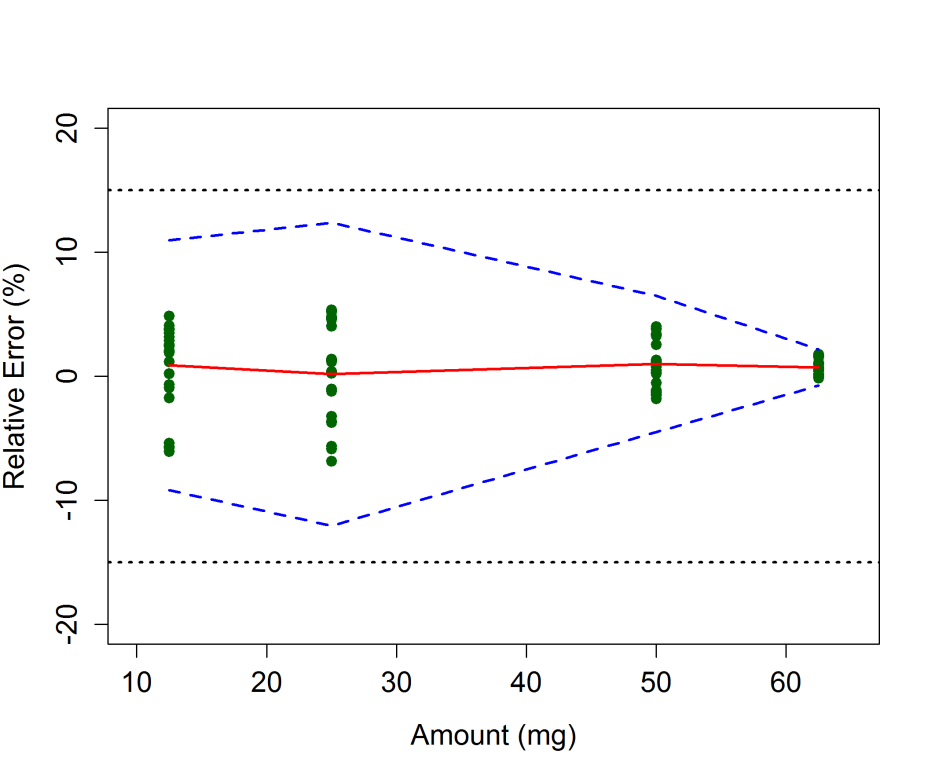
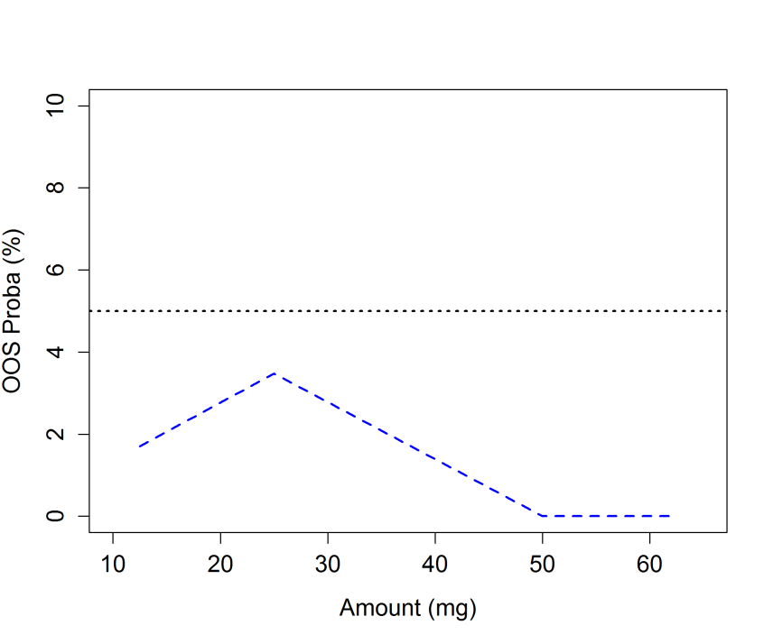

<!-- 方針: ほぼ全訳＋必要に応じた補足。原文（英語・J. Chromatogr. A の論考）構成に沿って訳出。本文の[N]は原文の番号引用に対応し末尾の参考文献にリンクする。図1〜図3は原本PDFの埋め込み画像をPyMuPDFで抽出しReadで内容確認のうえ埋め込んだ。数式はPDFテキスト抽出が数式レイアウトを崩すため、原文の記号定義に基づきKaTeXで再構成した(1ブロック1式)。式(3)の標準誤差因子は抽出崩れのため構造を保った近似表現とし、厳密形は原文[20]参照と注記。「> 補足:」は訳者注。 -->

## 書誌情報

- 原題: Analytical Procedure Validation and the Quality by Design Paradigm
- 著者: Eric Rozet¹\*・Pierre Lebrun¹・Jean-François Michiels¹・Perceval Sondag¹・Tara Scherder²・Bruno Boulanger¹（1. Arlenda S.A., リエージュ, ベルギー／2. Arlenda Inc., フレミントン, ニュージャージー, 米国）
- 掲載: *Journal of Chromatographic A* 系（本稿は同グループの分析法バリデーション×QbD論考。DOIは代表として付記）, 2013年
- 種別: 論考（Perspective／方法論レビュー）
- インパクトファクター: **該当**（クロマトグラフィー分野の主要誌に掲載された内容）
- 対応著者: Eric Rozet（eric.rozet@arlenda.com）

> 補足: 本稿は、医薬品の **分析法（試験法）** の開発・バリデーションに統計的な厳密さを持ち込んだことで知られる **Eric Rozet・Bruno Boulanger（Arlenda社）** らのグループによる論考である。主張は明快で、「**分析法バリデーションは、ICH Q2 のチェックリストを埋める“おまけの作業”ではなく、QbD（Quality by Design）という設計思想の中核をなす『目的適合性の証明』である**」というもの。日本の読者には、**「その試験法は、日常のルーチンで“使いものになる”とどう証明するのか？」という問いに、統計（許容区間・確率）で答える枠組みの解説**、と考えると位置づけが分かりやすい。専門用語（略語）が多いので下に整理する。

## 用語の整理（訳者による前置き）

- **QbD（Quality by Design）**＝品質は設計で作り込む、という開発思想（ICH Q8）。対義語が **QbT（Quality by Testing）＝最終製品を検査して品質を担保する** 従来型。
- **分析法（analytical procedure）**＝医薬品の含量・不純物などを測る試験法（HPLC、ELISA、qPCR、力価試験など）。本稿は「分析法もひとつのプロセス」とみなす。
- **ATP（Analytical Target Profile、分析目標プロファイル）**＝その分析法が「何を（分析対象）／どの媒体（マトリックス）で／どの濃度域で／どの性能で」測るべきかを、受入基準（仕様）とともに定義したもの。QbD準拠の分析法開発の出発点。
- **CQA（Critical Quality Attribute、重要品質属性）**／**CPP（Critical Process Parameter、重要プロセスパラメータ）**＝製剤QbDの概念を分析法に借用したもの。分析法のCQA＝真度・精度・直線性・範囲・LOQなど、CPP＝濃度域や、日・オペレータ・機器などのばらつき源。
- **DoE（Design of Experiments、実験計画法）**／**DS（Design Space、設計空間）**＝ICH Q8の中核ツール。DS＝品質が保証されると証明された入力変数の多次元領域。
- **fit for purpose（目的適合性）**＝その分析法が意図した用途に実際に使える、ということ。バリデーションで証明する。
- **β期待許容区間（β-expectation tolerance interval）**＝「将来の1回の測定結果」が一定の確率（例：95%）で入る区間。**OOS（Out Of Specification、規格外）確率**＝将来の結果が受入限界の外に出る確率。**LOQ**＝定量限界。
- **真度（trueness）／系統誤差（bias）／精度（precision）／併行精度（repeatability）／室内再現精度（intermediate precision）／総合誤差（total error）**＝分析法の性能を表す統計量。

## 要旨（Abstract）

QbD（Quality by Design）アプローチに従った製剤プロセス開発に関するICH Q8文書の採択以来、分析法開発が同様のアプローチに従う機会について多くの議論があった。QbD原則に従った分析法の開発・最適化は広く議論・記述されてきたが、この枠組みにおける **分析法バリデーションの位置づけ** は明確にされてこなかった。本稿は、分析法バリデーションがQbDパラダイムに完全に統合されており、実際に目的適合（fit for purpose）な分析法を開発するうえで本質的なステップであることを示すことを目的とする。適切な統計的方法論——実験計画法（DoE）・統計モデリング・確率的言明など——もその役割を果たす。分析法バリデーションの成果は、分析法の設計空間（Design Space）でもあり、そこから管理戦略（control strategy）を設定できる。

- **キーワード**: Quality by Design／許容区間（Tolerance Intervals）／分析法バリデーション（Method Validation）／目的適合性（Fit for Purpose）

## 1. 序論

Quality by Design（QbD）の概念は、FDAの「21世紀のcGMP」[1] やプロセス分析工学（Process Analytical Technology, PAT）[2]、さらに規制文書ICH Q8[3]・Q9[4]・Q10[5]、およびFDAのプロセスバリデーションガイダンス[6] といったいくつかのイニシアチブを通じて、製薬業界に採択されてきた。その一般的な狙いは、以前に製薬業界で実施されていた **Quality by Testing（QbT）パラダイム** から、プロセスと製品の理解を深め、それによって製品品質・プロセス効率・規制上の柔軟性を高めることを目指す開発へと転換することにある。

QbDは新しいものではなく、統計的実験計画・多変量統計・統計的品質管理など、多くの品質・統計のツールと手法を含む。医薬品の品質を高めるために、最終製品の検査を増やすこと（すなわちQbT）は適切でないと認識されてきた[7]。代わりに、医薬品の品質を高めるには、他の多くの産業ですでに行われているように、**品質を製品に作り込む（すなわちQbD）** 必要がある。そのためには、処方・製造プロセスに関わる変数が最終製品の品質にどう影響するかを理解する必要がある。

**分析法もまたプロセスであり、分析法の開発にもQbDを実装すべきである。** 近年、複数の著者が、QbDによって分析法を体系的・科学的なアプローチで開発できると述べている[8-12]。分析法の性能に影響する変数の理解と特定が、より早い段階で達成される[8-12]。ICH Q8(R2)[6] によれば、QbDは実験計画法（DoE）と設計空間（DS）を組み合わせた最適化戦略とみなせる。

しかし、開発された分析法は、実際に目的適合であることを証明しなければならないため、そのままでは実験室で使用できない。この目的適合性の証明は、一般に **分析法バリデーションのフェーズ** で達成される。

本稿の目的は、分析法バリデーションがQbDパラダイムに完全に統合されており、日常のルーチン応用に役立つ分析法を開発するうえで本質的なステップであることを示すことである。分析法バリデーションでも、実験計画法・統計モデリングなど同様の統計的方法論が実装される。分析法バリデーションの成果は、分析法の設計空間でもあり、そこから管理戦略をさらに定義できる。

## 2. 分析目標プロファイル（ATP）と分析法バリデーション

QbDに準拠した分析法の開発は、その **分析目標プロファイル（Analytical Target Profile, ATP）** の定義から始まる。ATPは分析法の意図した用途を定義することを目指す。ATPは、どの分析対象を、どのマトリックス（媒体）中で、どの濃度域にわたって測定するか、および分析法に要求される性能基準とその仕様を定義する一連の特性をまとめたものである。これらの仕様・特性は、分析法の意図した用途と結び付けられるべきである。ATPの例は文献[8-11,13] にある。ATPに含まれる定量性能の要求は、バリデーションフェーズで分析法が達成しなければならない **バリデーション受入限界** となる。加えて、一部の著者は、分析法が生成する結果を用いて誤った判断をする最大許容リスクをATPに含めることで、ATPの定義をさらに進めている[13]。

## 3. 分析法バリデーションにおける重要品質属性（CQA）

分析法の **重要品質属性（Critical Quality Attributes, CQAs）** は、開発された分析法の品質を判断するために測定される応答である。CQAは「所望の製品品質を保証するために、適切な限界・範囲・分布の中にあるべき物理的・化学的・生物学的・微生物学的な性質または特性」と定義される[3]。クロマトグラフィー分析法では、CQAは分離度（resolution, RS）や分離（separation, S）基準など、分析法の選択性に関連しうる[12]。他のCQAには、分析の実行時間・S/N比・分析法の精度と真度・定量下限（LOQ）・分析法の定量範囲がありうる。

これらのCQAは、多変量の（非）線形モデルを通じて直接モデル化できる。しかし他の状況では、モデル化される応答がCQAと異なる場合がある。CQAはこれらの一次応答のモデリング後に得られる。クロマトグラフィー法では、選択性を最適化する際の通常の鍵CQAは臨界ペア（critical pair）の分離度である。しかし分離度は、関与する2つのクロマトピークの保持係数に依存する。したがって、分離度の代わりに **保持係数** が直接モデル化され、そこから分離度を計算できる。

とはいえ、CQAは分離技術に限られず、分析法の定性性能のみに関連するわけでもない。医薬品の開発・管理における非常に重要なアッセイは定量的なものである。クロマトグラフィー定量法以外の例には、ELISA・qPCR・相対力価試験などのイムノアッセイがある。あらゆる定量分析法の最終的な狙いは、信頼できる判断を下すために、適切な品質の分析結果を提供することである。したがって、定量法の重要品質属性は、少なくともその定量性能に関連すべきである。真度・精度・直線性・範囲・分析法のLOQ、および分析法で得られる結果の正確さ（accuracy）という **バリデーション特性が鍵となるCQA** である。これらは、それぞれの受入値とともにATPの定義に含めるべきである。

したがって、あらゆる定量分析法のバリデーションフェーズはQbD枠組みに完全に沿う。分析法バリデーション中に監視すべきCQAは、ランダム誤差（例：室内再現精度のCV）、系統誤差（例：バイアスや回収率）、またはその両方の組み合わせである **総合誤差（total error）** に関連する指標である。

## 4. 分析法バリデーションにおける重要プロセスパラメータ（CPP）

分析法バリデーションは、重要プロセスパラメータである複数の因子も含む。第一の主要因子は、分析法が分析対象を定量することを意図する **濃度／量／力価の範囲** である。この因子は固定因子であり、既知の濃度／量／力価をもつ **バリデーション標準（validation standards）** または品質管理サンプル（quality control samples）と呼ばれるサンプルで代表される。対照的に、分析法の将来のルーチン使用で遭遇するばらつき源——オペレータ・機器・試薬ロット・日など——は、**ランダム因子** としてバリデーション計画に含めなければならない。これらのばらつき源の組み合わせは、一般に「ラン（runs）」または「シリーズ（series）」と呼ばれる。

## 5. 分析法バリデーションにおける実験計画法（DoE）

ICH Q8とFDAガイドラインは、製剤プロセスの開発時に適切な実験計画法を用いることを強く推奨している。分析法バリデーションで用いられる主な計画は、入れ子計画（nested designs）、（部分）要因計画（factorial designs）、またはその組み合わせである。これらの計画は分散成分（variance components）を推定するために用いられる。精確な推定のためには、各因子について2水準より多くを用いることが推奨される。とはいえ、分析法バリデーションに含めるさまざまなばらつき源は、分析法が実際にルーチンで用いられる方法を模すため、一般に「シリーズ」または「ラン」にまとめられる。

バリデーション標準の第 i 濃度水準のそれぞれについて、ランの数が J、各ランで K 回の反復が行われるとする。バリデーション実験は、研究する第 i 濃度水準のそれぞれについて、ラン（またはシリーズ）をランダム因子とする **一元配置分散分析（one way ANOVA）ランダムモデル** で記述できる（式1）。

$$X_{i,jk} = \mu_i + \alpha_{i,j} + \varepsilon_{i,jk} \tag{1}$$

ここで、
$$\alpha_{i,j} \sim N\!\left(0,\ \sigma^2_{\alpha,i}\right)\qquad$$

$$\varepsilon_{i,jk} \sim N\!\left(0,\ \sigma^2_{\varepsilon,i}\right)$$

$\mu_i$ は研究するバリデーション標準の第 i 濃度水準の全体平均、$\mu_i + \alpha_{i,j}$ はラン $j$（$j: 1$ から $J$）の平均、$\varepsilon_{i,jk}$ は残差誤差、$\sigma^2_{\alpha,i}$ はラン間分散（run-to-run variance）、$\sigma^2_{\varepsilon,i}$ はラン内分散すなわち併行精度（repeatability）分散で、いずれも第 i 濃度水準についてのものである。

分析法の全体的なばらつきは、**室内再現精度分散（intermediate precision variance）** で測られる。

$$\sigma^2_{IP,i} = \sigma^2_{\alpha,i} + \sigma^2_{\varepsilon,i}$$

分散成分モデルのこれらのパラメータはすべて、REML法（制限付き最尤法）で推定できる[14]。

## 6. 設計空間（DS）と分析法バリデーション

ICHの製剤開発ガイドラインQ8[3] では、DSは「品質の保証を提供することが実証された、入力変数（例：材料属性）とプロセスパラメータの多次元の組み合わせと相互作用」と定義される。したがって、入力変数の多次元の組み合わせと相互作用は、品質保証が証明された部分空間、いわゆるDSに対応する。ICH Q8のDS定義の背後にある主要概念は **品質の保証（assurance of quality、品質リスク管理としても知られる）** である。分析法開発中に得られる **平均応答曲面** は、CQAが受入限界に達する保証がないため、DSを適切に定義しないことがすでに示されている。代わりに **確率マップ（probability maps）** がこのDS要求に適切に答える[12,15]。

分析法バリデーションもまたDSを定義できる。それは、分析法が品質の保証された結果を提供することが実証された濃度の範囲である。すなわち（式2）：

$$\pi = P\!\left(-\lambda < X - \mu_T < \lambda\right) \tag{2}$$

バリデーションフェーズの目的は、「将来の各結果があらかじめ定義した受入限界（$\lambda$）内に入る **信頼確率 $\pi$**（reliability probability）が、最小の主張水準 $\pi_{\min}$ 以上であるかを評価すること」に要約できる[16]。ここでの統計的問題は二重である——確率 $\pi$ を推定する必要があり、かつそれを $\pi_{\min}$ と比較する際にその推定の不確実性を考慮しなければならない。これは、頻度論統計に厳密な小標本解が存在しないため、解くのが容易でない問題である。とはいえ、この狙いに答えるいくつかのアプローチが提案されている。

### 6.1 β期待許容区間（β-expectation tolerance intervals）

第一のアプローチは、式1の一元配置ANOVAランダムモデルを用いて、バリデーション標準の各濃度水準で、定義された被覆確率（例：95%）の **β期待許容区間** を計算し、それをあらかじめ設定した受入限界と比較することである（図1）。このアプローチを用いると、将来の各結果は少なくとも95%の確率でこれらの受入限界内に入る。Lebrunら[17] は、β期待許容区間が最高事後密度（Highest Posterior Density, HPD）区間と等価であることを示した。少なからぬ数の分析法がこの方法でバリデートされてきた[16, 18-19]。

図1は、分析法のバリデーションで得られた正確さプロファイルを示し、バリデーション標準の各濃度水準における95%β期待許容区間を描いている。

### 6.2 規格外（OOS）確率

別のアプローチは、将来の結果があらかじめ設定した受入限界の外（Out Of Specification, OOS）に出る確率を推定することである。Dewéら[20] は、式1の一元配置ANOVAランダムモデルに従う結果についてこの確率を計算することを提案した。例を図2に示す（先と同じ分析法について）。DSは、この確率があらかじめ設定した最大値（例：0.05）より小さくなる濃度の範囲である。各濃度水準 i について、この確率は次のように計算される（式3）：

$$\pi_{i} = 1 - P\!\left[t(f_i) < \frac{\mu_{T,i} + \lambda - \bar{X}_i}{\hat{\sigma}_{IP,.,i}\sqrt{\dfrac{\hat{R}_i + 1}{(\hat{R}_i K + 1)}\cdot\dfrac{1}{N}}}\right] + P\!\left[t(f_i) < \frac{\mu_{T,i} - \lambda - \bar{X}_i}{\hat{\sigma}_{IP,.,i}\sqrt{\dfrac{\hat{R}_i + 1}{(\hat{R}_i K + 1)}\cdot\dfrac{1}{N}}}\right] \tag{3}$$

ここで、$J$ はランの数、$K$ はシリーズあたりの反復数、$N = JK$。$\bar{X}_i$ は第 i 濃度水準について分析法で得られた結果の平均濃度、$\hat{\sigma}_{IP,.,i}$ は各第 i 濃度水準の室内再現精度標準偏差。$t(f)$ はSatterthwaite近似[21] に基づいて計算される自由度 $f$ のStudent分布、$\hat{R}_i$ は各濃度水準のラン間分散とラン内（併行精度）分散の比。Student分布の使用は、Lebrunら[17] が示したように、このモデルにおける予測分布であることから正当化される。

> 補足: 式(3)の平方根内の分散因子は、原文PDFの数式レイアウトがテキスト抽出で崩れており、上式は原文の記号（$\hat{R}_i$・$K$・$N$）と Dewé ら[20] のモデル構造に基づいて再構成した近似表現である。**厳密な標準誤差の因子形は原文（および[20]）を参照** されたい（原文にない数値・係数は補っていない）。式の本質は「上側の受入限界 $\mu_T+\lambda$ を超える確率＋下側の受入限界 $\mu_T-\lambda$ を下回る確率」を、Satterthwaite自由度をもつStudent-t分布から求める、という点にある。

### 6.3 濃度範囲にわたる連続モデリング：ベイズ的アプローチ

ラン間分散と併行精度分散が、バリデーション標準の各濃度水準にわたって均質（homogeneous）と仮定できる場合、濃度を固定因子として含む単一の **線形混合モデル（linear mixed model）** をバリデーションデータにフィットできる。DSを定義する先の2つのアプローチは、この状況に拡張できる。

より非自明な状況は、ラン間分散および／または併行精度分散が **不均一（heteroscedasticity）** な場合に、濃度範囲にわたって分析法の結果をモデル化することである。これらの場合のβ期待許容区間やOOS確率の決定は、頻度論的な解が利用できないため、ベイズ的アプローチに基づきうる[22]。

この文脈では、式2のモデルは、ランダムな傾きと切片、および濃度とともに増大する残差分散をもつ次の線形モデルとして書き換えられる（式4）：

$$X_{ijk} = \beta_0 + \beta_1\,\mu_{T,i} + u_{0,j} + u_{1,j}\,\mu_{T,i} + \varepsilon_{ijk} \tag{4}$$

ここで、添字 $i$ はバリデーション標準の $I$ 個の濃度水準、$j$ は $J$ 個のシリーズ（ラン）、$k$ は各ランあたり $K$ 個の反復を表す。$\mu_{T,i}$ は第 i 濃度水準のバリデーション標準で、参照値または慣用真値（conventional true value）とみなされる。$\theta = (\beta_0,\ \beta_1)^{\top}$ は固定効果である。加えて、$U_j = (u_{0,j},\ u_{1,j})^{\top}$ は第 j ランのランダム効果で、これも正規分布に従うと仮定される（式5）：

$$U_j \sim N_2\!\left(\mathbf{0},\ \Sigma_{u}\right) \tag{5}$$

最後に、$\varepsilon_{ijk}$ は独立で分散 $\sigma_i^2$ の正規分布に従うと仮定される残差誤差である。この分散も濃度水準 i に依存するとされる。この現象は実際の状況で頻繁に観察される。この分散関数の一般形は濃度のべき乗である（式6）：

$$\sigma_i = \sigma\left(\mu_{T,i}\right)^{\gamma} \tag{6}$$

図3は、このモデルを用い、MCMCシミュレーションで推定した分析法の確率プロファイルを示す。分析法が目的適合となる濃度範囲を描いており、この範囲が **分析法バリデーションの設計空間** を表す。

## 7. 管理戦略（Control Strategy）

分析法のQbD開発は、ルーチン応用中に分析法が管理下にとどまり、逸脱を検出することを保証する管理戦略を定義しなければ無意味である。分析法バリデーションは、品質管理サンプルを用いた管理戦略の定義も可能にする。実際、実施した実験により、たとえば分析法の管理図（control charts）を構築する際の初期管理限界として使えるβ期待許容区間を定義できる[23]。このような管理図で分析法の日々の性能を追跡することで、管理外（out of control）の分析法を効率的に検出し、是正措置を実行できる。実際、β期待許容区間の使用は、消費者リスクと生産者リスクの間の適切なバランスを保証する[23]。

## 8. 結論

分析法バリデーションは、QbDパラダイムに完全に収まる。実際、製剤開発と比較すると、分析法バリデーションは、最近のFDAガイドライン[6] が定義するプロセスバリデーションの **ステージ2** に位置づけられる。分析法バリデーションはすなわち、アッセイの **性能適格性確認（performance qualification）** である。この文脈では、分析法バリデーションを「ICH Q2[24] チェックリスト」演習に限定された、分析法開発における追加の負担とみなす見方は消えるべきである——バリデーションフェーズは、開発された分析法が将来の日々の応用に有用であることの確認なのである。

> 補足: 本稿の要点を一言でまとめると——「**分析法バリデーションは“合否チェックの事務作業”ではなく、その試験法が日常で本当に使えるか（目的適合か）を確率で保証する、QbDの中核ステップ**」ということ。鍵は3つ——①ATPで「何を・どう測るか」と「誤判定の許容リスク」を先に決める。②バリデーションの成果は単なる合格印ではなく「**分析法の設計空間**（＝どの濃度域なら信頼できる結果が保証されるか）」である。③その設計空間を、平均値の曲線ではなく **確率**（β期待許容区間・OOS確率・ベイズMCMC）で描くことで、「将来の1回の測定」の信頼性を担保する。日本の品質管理・分析法バリデーション（ICH Q2/Q14の運用）を考えるうえでも、統計的な裏付けの与え方として示唆に富む。

## 参考文献

原文の引用順に対応する。本文中の [N] は各項目にリンクする。

1. U.S. Food and Drug Administration (FDA). Pharmaceutical Quality for the 21st Century: A Risk-Based Approach Progress Report. May 2007.
2. U.S. FDA. Guidance for Industry PAT — A Framework for Innovative Pharmaceutical Manufacturing and Quality Assurance. FDA, 2004.
3. ICH. Topic Q8(R2): Pharmaceutical Development. Geneva, 2009.
4. ICH. Topic Q9: Quality Risk Management. Geneva, 2005.
5. ICH. Topic Q10: Pharmaceutical Quality System. Geneva, 2008.
6. U.S. FDA. Guidance for Industry; Process Validation: General Principles and Practices. January 2011.
7. R.A. Lionberger, S.L. Lee, L. Lee, A. Raw, L.X. Yu. The AAPS Journal 10 (2008) 268.
8. M. Schweitzer, M. Pohl, M. Hanna-Brown, P. Nethercote, P. Borman, G. Hansen, K. Smith, J. Larew. Pharm. Tech. 34 (2010) 52.
9. J. Ermer. European Pharmaceutical Review, 16 (2011) 16.
10. P. Nethercote, P. Borman, T. Bennett, G. Martin, P. McGregor. Pharm. Manufact. April (2010) 37.
11. P. Borman, J. Roberts, C. Jones, M. Hanna-Brown, R. Szucs, S. Bale. Separation Science 2 (2010) 1.
12. E. Rozet, P. Lebrun, B. Debrus, B. Boulanger, Ph. Hubert. TrAC Trends in Analytical Chemistry 42 (2013) 157.
13. E. Rozet, E. Ziemons, R.D. Marini, B. Boulanger, Ph. Hubert. Anal. Chem. 84 (2012) 106.
14. Searle S.R., Casella G., McCulloch C.E. Variance Components (1992), Wiley.
15. J.J. Peterson, K. Lief. Stat. Biopharm. Res., 2 (2010) 249.
16. Ph. Hubert, J.-J. Nguyen-huu, B. Boulanger, E. Chapuzet, P. Chiap, N. Cohen, P.-A. Compagnon, W. Dewe, M. Feinberg, M. Lallier, M. Laurentie, N. Mercier, G. Muzard, C. Nivet, L. Valat. J. Pharm. Biomed. Anal. 36 (2004) 579.
17. P. Lebrun, B. Boulanger, B. Debrus, Ph. Lambert, Ph. Hubert. J. Biopharm. Stat. 23 (2013) 1330.
18. Ph. Hubert, J.-J. Nguyen-Huu, B. Boulanger, E. Chapuzet, N. Cohen, P.-A. Compagnon, W. Dewé, M. Feinberg, M. Laurentie, N. Mercier, G. Muzard, L. Valat, E. Rozet. J. Pharm. Biomed. Anal., 45 (2007) 70.
19. Ph. Hubert, J.-J. Nguyen-Huu, B. Boulanger, E. Chapuzet, N. Cohen, P.-A. Compagnon, W. Dewé, M. Feinberg, M. Laurentie, N. Mercier, G. Muzard, L. Valat, E. Rozet. J. Pharm. Biomed. Anal. 45 (2007) 82.
20. W. Dewé, B. Govaerts, B. Boulanger, E. Rozet, P. Chiap, Ph. Hubert. Chemom. Intell. Lab. Syst. 85 (2007) 262.
21. F.E. Satterthwaite. Psychometrika, 6 (1941) 309.
22. E. Rozet, B. Govaerts, P. Lebrun, K. Michail, E. Ziemons, R. Wintersteiger, S. Rudaz, B. Boulanger, Ph. Hubert. Anal. Chim. Acta 705 (2011) 193.
23. E. Rozet, C. Hubert, A. Ceccato, W. Dewé, E. Ziemons, F. Moonen, K. Michail, R. Wintersteiger, B. Streel, B. Boulanger, Ph. Hubert. J. Chromatogr. A 1158 (2007) 126.
24. ICH. Topic Q2(R1): Validation of Analytical Procedures: Text and Methodology. Geneva, 2005.
