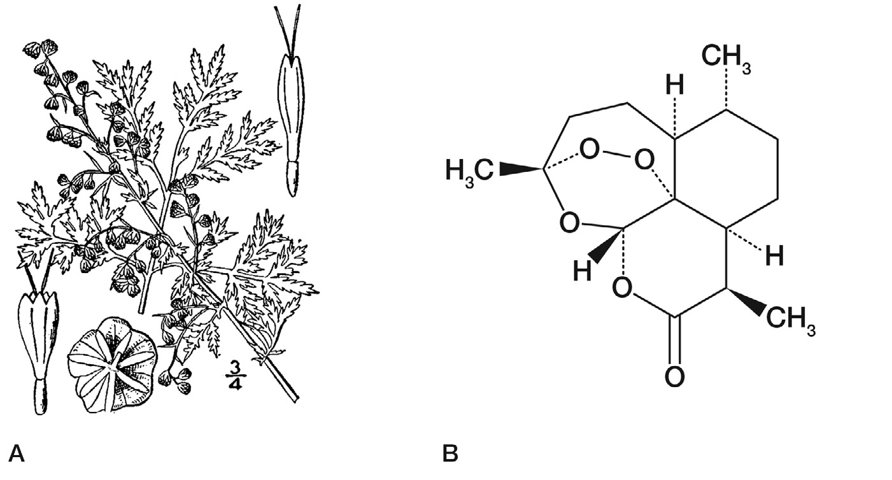

<!-- 方針: 全訳。原文（英語・Science/AAAS Custom Publishing Office 制作のスポンサー付き特別増刊、査読外だが伝統医学研究の専門家からなる国際編集チームが評価）の序文3編＋論説8編の構成に沿って訳出。図は原本PDFからPyMuPDFで埋め込み画像を xref 抽出し、Read で内容を目視確認のうえ全訳キャプションを付けて埋め込んだ（9点）。原文の Figure 番号は各記事ごとに 1 から振り直されるため、本ページでは「第N編 図M」の形で一意化した。各記事末尾の参考文献は原文の番号のまま転記した。「> 補足:」は訳者注。 -->

## この増刊について

- 原題: **The Art and Science of Traditional Medicine — Part 1: TCM Today – A Case for Integration**
- 制作: **Science/AAAS Custom Publishing Office**
- 掲載: *Science* **346**(6216) 補冊 **S1–S25**（2014年12月19日）
- スポンサー付き特別増刊（sponsored collection）
- **査読について（原文の注記）**: 「本セクションに掲載された資料は *Science* 編集スタッフによる査読あるいは評価を受けていないが、伝統医学研究の専門家からなる国際編集チームによって評価されている」

### 編集チーム

| 役割 | 氏名・所属 |
|---|---|
| **ゲスト・プロジェクト編集者** | **Tai-Ping Fan, Ph.D.**（ケンブリッジ大学, 英国） |
| 編集委員 | **Josephine Briggs, M.D.**（NIH 国立補完代替医療センター, 米国） |
| 編集委員 | **Liang Liu, M.D., Ph.D.**（マカオ科技大学, 中国マカオ特別行政区） |
| 編集委員 | **Aiping Lu, M.D., Ph.D.**（香港浸会大学, 中国香港特別行政区） |
| 編集委員 | **Jan van der Greef, Ph.D.**（ライデン大学・TNO, オランダ） |
| 編集委員 | **Anlong Xu, Ph.D.**（北京中医薬大学, 中国） |
| Science/AAAS 編集 | Sean Sanders, Ph.D.（編集長）／Tianna Hicklin, Ph.D.（編集補）／Yuse Lajiminmuhip（校正）／Amy Hardcastle（デザイン） |
| カスタム出版 | Bill Moran（グローバル・ディレクター）／Ruolei Wu（アジア担当アソシエイト・ディレクター） |

> 補足: **本サイトには既にパート2（2015年・Science 347巻6219号 S26–S52）を収録している。** 全3部構成のうち、本ページが**第1部**にあたる。
>
> 3部の性格の違いを整理しておく。
>
> | | **パート1（本稿・2014年12月）** | **パート2（2015年）** |
> |---|---|---|
> | 副題 | TCM Today: A Case for Integration（今日のTCM：統合への論拠） | Multidisciplinary Approaches for Studying Traditional Medicine（伝統医学研究のための学際的アプローチ） |
> | 重心 | **なぜ統合するのか**——政策・哲学・方法論の枠組み | **どう研究するのか**——ゲノミクス・品質管理・規制・個別処方の実例 |
> | 執筆陣 | WHO事務局長、NIH所長、AAAS CEO を含む | FDA審査官、各分野の研究者 |
>
> パート1は**枠組みと問題設定**、パート2は**具体的な方法と事例**、という役割分担になっている。

### 目次

| 頁 | 表題 | 執筆者 |
|---|---|---|
| **序文** | | |
| S2 | 伝統医学の統合と近代化を支援する | Margaret Chan（WHO事務局長） |
| S3 | 伝統医学のための中道 | Alan Leshner（Science/AAAS） |
| S4 | 編集チームからのメッセージ | Tai-Ping Fan ほか |
| **論説** | | |
| S5 | WHO伝統医学戦略 2014–2023：一つの視点 | Zhang Qi, Edward Kelley（WHO） |
| S7 | 世界的な科学的挑戦：古代の治療実践から正しい教訓を学ぶ | Josephine P. Briggs（NIH/NCCAM） |
| S10 | 東は東、西は西、両者は決して交わらないのか？ | Yan Schroën ほか（オランダ・中国） |
| S13 | 証（Zheng）：診断と治療への系統生物学的アプローチ | Yonghua Wang, Anlong Xu（北京中医薬大学） |
| S16 | 統合ネットワーク基盤医学：新世代の医学を開発するうえでの伝統中医薬の役割 | Elaine Lai-Han Leung ほか（マカオ科技大学） |
| S19 | 抗線維化・線維化促進の植物性素材を探す | Qihe Xu ほか（キングス・カレッジ・ロンドンほか） |
| S21 | i-Needle：鍼の生物学的機構を検出する | Christine Nardini, Sandro Carrara ほか |
| S23 | 鍼におけるプリン作動性シグナル伝達 | Geoffrey Burnstock（UCL／メルボルン大学） |

---

## 序文1：伝統医学の統合と近代化を支援する

**執筆: Margaret Chan, M.D.（世界保健機関 事務局長）**

**伝統医学（TM）は人々の健康と福祉を改善する大きな可能性を持っている。** それは**医療の重要な、しかししばしば過小評価されている部分**である。**TM は世界のほぼすべての国に見出され、そのサービスへの需要は日々増大している。**

**TM は21世紀の多くの世界的健康課題、とりわけ慢性の非感染性疾患と人口高齢化の領域に貢献しうる。**

**TM はしばしば、より利用しやすく、より安価で、人々にとってより受け入れやすいものと見なされており、したがってユニバーサル・ヘルス・カバレッジの達成を助ける手段にもなりうる。** アフリカ・アジア・ラテンアメリカの広い地域で一般的に用いられている。**開発途上国の農村部に住むことが多い何百万もの人々にとって、生薬・伝統的治療・伝統医療者は、医療の主要な——そして時には唯一の——供給源である。** 大半の伝統薬の安価さは、**医療費が高騰し緊縮財政が広がる時代にあって、それらをいっそう魅力的にしている。**

**富裕国においては、TM は別の一連のニーズに応えている。** 人々はますます天然物を求め、**自らの健康をより自分で管理したいと望んでいる。** 一般的な症状を緩和し、生活の質を改善し、**全体論的で非専門特化的な仕方で**病気や疾患から身を守るために TM に向かう。

**ちなみに、近代医薬品のほぼ4分の1が天然物に由来しており、その多くは最初に伝統医学の文脈で用いられたものである。** したがって TM は**プライマリ・ヘルス・ケアの資源であるとともに、革新と発見のための資源**でもある。

**しかしながら、TM はその有効性を実証するために厳密な科学的データを必要とする。** また、**適切な規制を支えるために、品質と安全性の評価についてのエビデンスに基づく基準も必要**である。私は、*Science* 誌のこの特別特集に、世界の専門家チームによる TM についての一連の視点が含まれることを嬉しく思うとともに、**将来、TM の領域でより多くの見解が共有され、より堅固な研究が実施されることを奨励したい。**

**TM の世界的な使用に関する全般的状況は、最近 WHO 伝統医学戦略 2014–2023 を通じて周知された。** それは、**対等に信頼される立場で主流医学へと進むためには、TM がより強固なエビデンス基盤を必要とすることを明らかにしている。** **より強い規制上の管理の必要は、製品だけでなく、実践と実践者にも及ぶ。**

**伝統医学と西洋医学という2つの体系は衝突する必要はない。** プライマリ・ヘルス・ケアの文脈において、両者は**それぞれの体系の最良の特徴を活かし、それぞれの一定の弱点を補い合いながら、有益な調和のうちに融合しうる。**

**理想的な世界では、TM は、治療サービスと予防ケアのバランスをとる、よく機能する人間中心の医療制度が提供する選択肢の一つとなるだろう。** **課題は、TM に統合された医療制度の中での適切な位置を与え、すべての実践者がそのユニークで価値ある貢献を理解するのを助け、それに何ができて何ができないかを消費者に教育することである。** 言い換えれば、**我々はこの豊かな資源と文化遺産を近代化し、今日の世界における適切な位置に置く必要がある。**

## 序文2：伝統医学のための中道

**執筆: Alan Leshner, Ph.D.（AAAS CEO／*Science* 発行責任者）**

**かつてある時点では、これら2つの哲学は確かに対立していた。しかし今日ではそうではないように見える。東洋と西洋の間の線は薄れつつある。**

**一つの学問領域としての系統生物学（systems biology）の興隆は、およそ50年前に始まった。**

**還元主義は、依然として尊敬される哲学ではあるが、もはや一貫して唯一の道とは見なされていない。** 逆に、**純粋に全体論的なアプローチをとることは、それ自身の問題を生みうる。**

**仏教において、中道（Middle Way）は悟りへの道——快楽への耽溺と自己否定という両極端の間の道——として説かれる。** **伝統医学のためにも同様の中道が見出されうる。それは東洋と西洋の最良のものをとり、すべての人の利益のために両者を結び合わせるものである。**

> 補足: Leshner のこの短い序文は、増刊全体の姿勢を一言で言い当てている。**「還元主義も全体論も、それだけでは足りない」**。仏教の中道になぞらえた比喩は、以降の8編に繰り返し現れる基調——**東西を対立させず、方法論として組み合わせる**——を先取りしている。

## 序文3：編集チームからのメッセージ

**執筆: Tai-Ping Fan（ゲスト・プロジェクト編集者）ほか編集チーム**

**ほぼすべての文化が固有の生薬の伝統を持ち、それぞれに固有の植物と独自の実践を備えている。しかし一つの前提がそれらすべてを結びつけている——生薬は、それを潜在的に強力な医薬品の源とする顕著な性質を持つ、ということである。**

**マルコ・ポーロ（1254–1324）のような初期の探検家のおかげで、生薬（materia medica）は何世紀にもわたって東西を行き来してきた。** いまや我々にとって重要なのは、**世界中の伝統医薬を活用すること**である。

- **英国**では、伝統医学使用の豊かな歴史が、**ヘンリー8世（1491–1547）の1500年代初頭の「薬草医憲章（Herbalists Charter）」** によって認められた。
- **中国**における同時代人 **李時珍（1518–1593）** は、**40年に及ぶ研究プロジェクトを主導し『本草綱目』の刊行に至った偉大な博物学者**である。同書は薬局方であるとともに、**植物学・動物学・鉱物学・冶金学の論考**でもある。

**伝統医学が現代社会にとって価値ある洞察を持つという論を立てるために、伝統医学研究に関連する幅広い主題の専門家からなる独立した編集チームが集められた。**

**我々は、全体論的治療という古来の実践の背後にある技と科学を、そして品質管理・薬理と毒性の試験・注意深く設計された臨床試験・適切な規制といった良き実践がすべての伝統医薬に適用可能であることを示すために、伝統中医薬（TCM）を選んだ。**

**この第1号は、WHO 伝統医学戦略（2014–2023）を紹介し、世界的な科学的課題を浮き彫りにし、系統生物学的アプローチが診断にどう適用され、統合ネットワーク基盤医学へと至りうるかを示す。鍼の機構研究における最近の進展も論じられる。**

**TCM 研究における刺激的な領域には以下が含まれる。**

- **インフルエンザ・がん・糖尿病・心血管疾患に対する生薬療法の治療的可能性**
- **慢性炎症に対する腸内細菌叢を標的とした食事介入の探索**
- **薬用植物に存在する複雑多糖の生物活性の研究**

**ケモゲノミクスとネットワーク薬理学が、複合生薬処方に見出される純粋化合物あるいは植物複合体（phytocomplexes）の分子標的の予測と作用機序の解読に適用されてきた。**

**伝統的処方に用いられる中薬の君（Jun）・臣（Chen）・佐（Zuo）・使（Shi）という分類の相乗的相互作用の哲学のより良い理解は、簡略化された「君-使 適合性（Jun-Shi compatibility）」創薬戦略モデルへとつながった。**

**生薬の安全性の評価は、それらが妥当な治療剤として広く受け入れられるために決定的に重要である。** 統合毒性学的アプローチがこの領域で成功裏に適用されてきた。例えば**一定の薬用植物における抗線維化物質と線維化促進物質の同定**である。

**伝統医学のより広い応用への研究が続くにつれ、より新しいオミクス技術とポリ薬物動態学（poly-pharmacokinetics）も、中医学理論の個別化アプローチと現代の臨床研究方法論との間の隔たりを埋めるうえで、ますます大きな役割を果たすだろう。**

### 謝辞

**本プロジェクトに着手するよう我々を鼓舞してくれた中華人民共和国全国人民代表大会常務委員会副委員長 陳竺（Zhu Chen）氏**、**WHO 事務局長 Margaret Chan 氏とそのチーム**、**国家中医薬管理局 王国強（Guoqiang Wang）局長**、**AAAS CEO Alan Leshner 氏**に、本特集への構想と支援について特に感謝する。**古代の伝統医薬を明日の治療へと翻訳する道筋を描いてくれたすべての著者・査読者・助言者・スポンサー**にも謝意を表する。

---

## 第1編：WHO伝統医学戦略 2014–2023：一つの視点

**執筆: Zhang Qi（WHO サービス提供・安全部 伝統・補完医療ユニット コーディネーター）、Edward Kelley（同部 部長）**（スイス・ジュネーブ）

### 世界における T&CM の使用

**伝統・補完医療（T&CM）に対する需要と一般的使用は、世界中で継続している。**

| 地域・国 | 数値 |
|---|---|
| **アフリカ** | **伝統医療者と住民の比は 1:500**。これに対し**医師と住民の比は 1:40,000**（文献1） |
| **ラオス人民民主共和国** | **人口の80%が農村部**に居住し、**各村は1〜2名の伝統医療者**によってサービスを受けている（文献2） |
| **欧州** | **1億人を超える人々**が現在 T&CM の利用者であり、**5分の1が常用者**。同様の割合が T&CM を含む医療を選択している（文献3） |
| **中国** | 全国調査によれば、**2009年に伝統中医薬の実践者が9億700万件の患者受診**を受け、これは調査対象施設への**全医療受診の18%**にあたる。さらに**伝統中医薬の入院患者は1,360万人**で、調査対象全病院の**総数の16%**（文献4） |

**少数の国では、一定の種類の伝統医学（TM）が医療制度に完全に統合されている。** 中国、朝鮮民主主義人民共和国（北朝鮮）、大韓民国（韓国）、インド、ベトナムである。

**例えば中国では、伝統中医薬と通常医療が医療サービスのあらゆるレベルで並行して実践されており、公的・私的保険の両方が両形態の治療をカバーしている**（下記 BOX 1）。

**他の多くの国では、T&CM は国の医療制度に部分的に統合されており、一部の国では統合が全く行われていない。**

> **BOX 1. 中国における伝統医学の医療サービス統合**
>
> **中国には、TM サービスを提供する医療機関がおよそ 440,700 施設あり、52万600床の病床を持つ。** これにはあらゆるレベルの TM 病院と総合病院、都市部・農村部の診療所と保健所が含まれる。
>
> **総合病院のおよそ90%が TM 部門を持ち、すべての患者に TM サービスを提供している。**
>
> **TM 医療機関は、通常の医療機関と同じ国の医療機関法によって規律される。TM 実践者は公立・私立の診療所と病院の双方で診療することが認められている。** **公衆は自らが好む形の医療サービスを自由に選択でき、あるいは医師の助言に従うことができる**（文献12）。

### 最近の変化・新たな課題・ニーズ

**WHO の前回の世界戦略文書が2002年に公表されて以来、多くのことが変わった。** ますます多くの国が、**T&CM が個人の健康と福祉、そして医療制度の包括性に対してなしうる貢献を受け入れるようになっている。**

**1999年から2012年の期間に、TM をカバーする国家政策を持つ WHO 加盟国の数は著しく増加した。** これには、**生薬をよりよく規制する国**や、**T&CM を研究する国立研究所を創設する国**が含まれる（文献5）。

**政府と消費者は、T&CM の実践のより広い側面に対して、またそれらを医療サービス提供の統合された一部として考えることに対して、より開かれつつある。**

| 地域 | 動き |
|---|---|
| **アフリカ** | **国家規制枠組みの数が、1999/2000年の1件から2010年には28件に増加**（文献6） |
| **ブラジル** | **保健省が統合・補完的実践に関する国家政策を策定**（文献7） |
| **東地中海地域** | **5つの加盟国が T&CM 実践者に特化した規制を持つと報告**（文献5） |
| **東南アジア地域** | 加盟国が現在、**TM の教育・実践・研究・文書化・規制について調和のとれたアプローチを追求**（文献5） |
| **日本** | **日本人医師の84%が日常診療で漢方（日本の伝統医学）を使用**（文献8） |
| **スイス** | **一定の補完療法が、全スイス市民が利用できる基礎健康保険制度に復帰**（文献9） |

> 補足: **日本の数字（医師の84%が日常診療で漢方を使用）** は、Moschik らが2012年に *Evidence-Based Complementary and Alternative Medicine* 誌に発表した代表性のある質問紙調査に基づく（文献8）。**WHO の公式文書に日本の漢方の普及度がこの数字で引かれている**ことは、日本の読者にとって押さえておく価値がある。世界的に見て、**伝統医学がこれほど通常医療の内側に入り込んでいる国は例外的**である。

**著しい進展にもかかわらず、T&CM の製品・実践・実践者の規制は同じ速度では進んでいない**（文献5）。

**加盟国は、生薬の規制ではより速い進展が見られる一方、T&CM の実践と実践者についての規制は遅れていると報告している。**

**懸念されるのは、実践と実践者の適切な規制が無ければ、T&CM サービスの安全性・品質・有効性が保証されえないことである。** この状況は、**国家政策の策定に関する知識と経験を欠く多くの加盟国にとって深刻な課題**をもたらし、**弱いあるいは不在の規制と、医療サービス提供制度への T&CM サービスの適切な統合の欠如**につながっている。

### WHO 伝統医学戦略 2014–2023 の3つの目的

**加盟国が特定したニーズと課題に応え、WHO 伝統医学戦略 2002–2005（文献10）のもとで行われた作業を基盤として、2014–2023年の期間についての更新された戦略は、前身よりも医療サービスと制度——T&CM の製品・実践・実践者を含む——に多くの注意を払っている。**

#### 目的1: 適切な国家政策を通じて T&CM の能動的管理のための知識基盤を構築すること

**T&CM には製品・実践・実践者の大きな多様性がある。**

- **第1の戦略的ステップ**: **T&CM の役割と可能性を理解し認識すること。** 戦略は、加盟国が**自国の人々がどの種類の T&CM を用いているかを詳細に認識・評価し、T&CM の実践について自国のプロファイルを作成する**ことを推奨する。**T&CM の市場がよりグローバルになるにつれ、調和と協力がより重要になる。**
- **第2の戦略的ステップ**: **加盟国が、知的資源と天然資源を含む T&CM 資源の知識生成・協働・持続可能な利用を強化すること。**

#### 目的2: T&CM の製品・実践・実践者を規制することにより、品質保証・安全性・適正使用・有効性を強化すること

- **第1の戦略的要素**: **製品規制の役割と重要性を認識すること。** 重点は**TM 製品について確立された規制の監視と実施**に置かれるべきである。**生薬は今や国際的に用いられており、製品はしばしば、もともと栽培・開発・製造された場所とは別の世界の地域で使用される。** これは**異なる国の異なる法制度を考慮することの重要性**を浮き彫りにし、**製品が適切に使用されるよう品質と安全性の情報が共有されること**を確保する。
- **第2の戦略的方向**: **教育・訓練、技能開発、サービス、療法についての T&CM の実践と実践者の規制を認識し develop すること。** より多くの国が政策と規制枠組みを策定するにつれ、**その有効性を評価し、実践と実践者の規制に関する課題が適切な参照基準に対するベンチマーキングによってどう対処されうるかを特定する必要**がある。

#### 目的3: T&CM サービスを医療サービス提供とセルフケアに統合することによりユニバーサル・ヘルス・カバレッジを促進すること

**近年 T&CM について提起された最も重要な問いの一つは、医療制度、とりわけプライマリ・ヘルス・ケアにおけるサービス提供の改善を通じて、それがどのようにユニバーサル・ヘルス・カバレッジに貢献しうるか、である。**

- **第一歩**: **医療サービスと健康アウトカムを改善するための T&CM の潜在的貢献を活用すること。** 人々と共同体の伝統と慣習に配慮しつつ、**加盟国は T&CM がどのように疾病予防あるいは治療、ならびに健康維持と健康増進を支えうるかを検討すべきである。** **このプロセスは安全性・品質・有効性の基準と整合し、患者の選択と期待に沿うべきである。** **各国の現実に基づいて、T&CM を国の医療制度に統合するモデルを探索することが推奨される。**
- **次に重要なこと**: **T&CM の消費者がセルフケアについて情報に基づいた選択をできることを確保すること。** **多くの加盟国において、T&CM 製品の自己選択が T&CM 市場の大部分を占めている。** **消費者教育が、倫理的・法的考慮とともに、T&CM 介入についての情報に基づく選択の鍵となる側面を支え形づくるべきである。**

**WHO 決議 WHA67.18 は、加盟国が WHO 伝統医学戦略 2014–2023 を国の T&CM プログラムあるいは作業計画の基礎として適応・採用・実施し、戦略の実施の進捗を WHO に報告するよう促している。** 同決議はまた、**今後10年間における戦略の実施において WHO が加盟国を支援することを奨励している**（文献11）。

### 結論

**世界中で、T&CM は人気を増し続けている。** **T&CM の規制の進展は勢いを増しつつあるが、T&CM の実践と実践者についての規制はいくぶん遅い速度で進んでいる。**

**T&CM サービスの安全性・品質・有効性は最重要であるが、実践と実践者の適切な規制が整っていなければ確保されえない。**

**WHO 伝統医学戦略 2014–2023 の目標は、健康・福祉・人間中心の医療・ユニバーサル・ヘルス・カバレッジに対する T&CM の潜在的貢献を活用するうえで加盟国を支援するとともに、T&CM の製品・実践・実践者の規制・研究・医療制度への統合を通じて、T&CM の安全かつ有効な使用を促進することである。**

**強調されるべきは、加盟国間で T&CM の製品・実践・実践者に大きな多様性があることを踏まえ、知識と実践の共有、科学的知識と訓練プログラムの開発と交換、政策と規制の策定・実施における経験の共有において、国際的なコミュニケーションと協働を強化することが重要である、ということである。**

**また、T&CM の市場がよりグローバル化するにつれ、異なる国における T&CM の品質・安全性・適正使用・有効性は、エビデンスに基づく科学を用いて調和され標準化される必要がある。**

### 第1編の引用文献

1. A. A. Abdullahi, *African J. Trad., Comp. and Altern. Med.* **8**, 115 (2011).
2. Lao Ministry of Health and World Health Organization. *Health Service Delivery Profile, Lao PDR, 2012*.
3. European Information Centre for Complementary & Alternative Medicine.
4. State Administration of Traditional Chinese Medicine, *Report of a survey on T&CM basic situation in 2009* (2011).
5. *WHO Traditional Medicine Strategy 2014-2023* (WHO, Geneva, 2013), pp. 15-56.
6. WHO, *Progress report on decade of traditional medicine in the Africa region* (WHO AFRO, Brazzaville, 2011).
7. ブラジル保健省 統合・補完的実践に関する国家政策.
8. E. C. Moschik et al., *Usage and Attitudes of Physicians in Japan Concerning Traditional Japanese Medicine (Kampo Medicine)*. *Evid.-Based Compl. Altern. Med.* 2012 (Article ID 139818, 13 pp., 2012).
9. Swiss Confederation, *Five CAM methods eligible for reimbursement under specific conditions for a provisional period of six years* (2011).
10. *WHO Traditional Medicine Strategy 2002–2005* (WHO, Geneva, 2002).
11. WHO Governing Body Documentation Official Records.
12. Government of China, National Bureau of Statistics of China. *China Statistical Yearbook 2011: Chinese Medicine (1987–2010)*.

---

## 第2編：世界的な科学的挑戦——古代の治療実践から正しい教訓を学ぶ

**執筆: Josephine P. Briggs（米国 NIH 国立補完代替医療センター 所長, メリーランド州ベセスダ）**

**健康は人間の根本的価値である。** したがって、**大半の文化が幅広い治療実践を求め、用いてきた。**

**先進国・途上国いずれの経済においても、近代医学の実践は伝統的アプローチや代替療法と並存している。** **途上国経済に生きる多くの人々にとって、伝統的治療者と生薬療法は利用可能な唯一の医療の供給源である。** 対照的に、**先進国経済は典型的には、患者の選好に駆動されて、これらのアプローチを近代医学への任意の補完として用いる。**

**しかし中国とインドの両国では、古代の医学的伝統——伝統中医薬とアーユルヴェーダ医学——が、先進的な近代医療と並行してあるいは統合されて栄えてきた。**

**現在、北米と欧州では、鍼・伝統中医薬・マッサージ・瞑想といった一定の古代の治療実践が関心を高めており、通常のケアに対するより穏やかで「ローテク」な補完と見なされている。**

**これらの設定における伝統的実践の存続は、我々がそれらから学ぶべきことが多いことを示唆する。近代科学の方法は、伝統的実践を検討する手段を提供しうる。**

### マラリアと植物由来の治療

**過去20年間に開発され米国 FDA によって承認された医薬品のおよそ半分は、天然物であるか、合成誘導体であるか、あるいはその中核に天然物由来の原型分子を持っていた**（文献1）。

**マラリアの治療がその好例である。**

**近代のマラリア治療は、キナ（Cinchona, アカネ科）樹皮の発見に始まった。** これは**南米の先住民の伝統的治療実践で用いられていたと報告され、17世紀にイエズス会の宣教師によってヨーロッパに持ち帰られた。**

**1990年代半ばまで、マラリアの治療のほぼすべてが、キナアルカロイドのテルペノイド構造に基づく分子的実体であった。** これには**キニーネ、クロロキン、および合成誘導体のメフロキン**が含まれる。

**アルカロイドはキナ樹皮に豊富で、重量比で最大15%に達し、キニーネ自体がアルカロイド含量の半分以上を占めうる**（文献2）。**キナ樹皮の単純な茶抽出物には実質的な抗マラリア活性がある。**

**キニーネ系化合物はマラリアの治療と予防の双方にとって依然として決定的に重要であるが、とりわけ熱帯熱マラリア原虫（*Plasmodium falciparum*）における耐性の出現が、新薬開発の巨大な緊急性を生み出した。**

**抗マラリア療法の開発における次の章は、*Artemisia annua*——世界中に広く分布する繁茂力の強い雑草的な一年草——に属する（図1A）。** ***Artemisia annua* は中国の生薬の伝統において青蒿（qinghao）として、また欧州ではスイート・ワームウッドとして知られる。**

**アルテミシニン系抗マラリア薬の開発は、民族医学の最近の偉大な勝利の一つである。** **その発見は複雑なチームの努力であり、当初は中国人によって主導され、後に西側の非営利団体・政府機関・製薬企業を巻き込んだ**（文献3, 4）。

**この物語は、治療の伝統が新薬を見つける方向へと科学者を導きうることを示すと同時に、植物から治療薬を開発することがいかに困難でありうるかをも例証している。**

**中国政府は大規模なスクリーニングの取り組み「523プロジェクト」に資金を提供し、マラリアのマウスモデルを用いて多数の生薬を試験した。** 労働集約的な方法論を用いて、**数千の生薬、数百の抽出「レシピ」を研究し、数百のヒットを得た。**

**これらのヒットから、生理活性化合物の最初の単離と特徴づけへと進むには、途方もない粘り強さが必要であった。** **新しい治療法を見つける取り組みは容易に失敗しえた。報告は、薬物反応が時に一過性で再現が困難であったことを示唆している。**

**しかし、活性本体の活性を保つ穏和な抽出法が、屠呦呦（Tu YouYou）によってついに開発された**（文献3）。

**キナアルカロイドとは対照的に、アルテミシニン（図1B）は低濃度でしか存在せず、時には重量比で0.05%という低さである**（文献2）。**さらに、それは *Artemisia annua* にのみ検出され、他の *Artemisia* 種には検出されない。** **その特異なエンドペルオキシド構造は活性に決定的に重要であるが、多くの抽出条件下で比較的不安定である。**

**それにもかかわらず、この取り組みは成功し、いまやマラリア治療の礎石となっている小分子をもたらした。**

> 補足: **この段落が「正しい教訓を学ぶ」という表題の意味を最もよく示している。** アルテミシニンは伝統医学の勝利であるが、同時に**「伝統的使用があれば簡単に薬になる」わけではないことの証拠**でもある。
>
> Briggs が並べた3つの困難を整理すると、
>
> | 困難 | 内容 |
> |---|---|
> | **濃度が低い** | キナ樹皮のアルカロイドは重量比最大15%。アルテミシニンは**0.05%**——300倍の差 |
> | **種が限定される** | *Artemisia* 属の中で ***A. annua* にしかない** |
> | **不安定** | 活性に必須のエンドペルオキシドが**多くの抽出条件で壊れる** |
>
> つまり、**通常の抽出をしていたら活性は消え、発見に至らなかった**。屠呦呦が低温抽出にたどり着いたのは、葛洪『肘後備急方』の「絞り汁を飲む」という記述がヒントだったと伝えられる。**伝統文献が指し示したのは「どの植物か」だけでなく「どう扱うか」でもあった**、という点がこの物語の核心である。

### 鍼と慢性疼痛

**鍼はアジアの医学的伝統の不可欠な一部であり、そこでは伝統的な実践の場で広く用いられ、疼痛緩和における有効性は自明のこととされている。** **しかし、鍼の米国および欧州の医療現場への導入は、多くの患者と提供者に歓迎される一方で、医療専門家からの相当な懐疑に直面してきた。**

**その価値を探るために相当数の臨床試験が実施されており、その多くは疼痛管理に焦点を当てている。** これには**効能試験（efficacy trials）と有効性試験（effectiveness trials）の双方**が含まれる。

| 試験の型 | 対照 |
|---|---|
| **効能試験（efficacy）** | 概して鍼を**偽鍼（sham）対照**と比較する。偽鍼対照は被験者にとって伝統的な鍼と区別できないように設計される。典型的な偽鍼対照は、**同じ儀式、同じ施術者の安心づけ、同じ鍼あるいは圧点の対刺激効果**を比較群に用いる（ただし**鍼は非穿刺デバイスに置き換えられることがあり、刺入点は治療経絡上にない**） |
| **有効性試験（effectiveness）** | 典型的には、**無作為に割り付けられた異なる治療（鍼あるいは標準治療）** に対する被験者の反応を比較する |

**約18,000名の研究参加者を含む29試験の最近の系統的レビューは、いくつかの明確な結論をもたらした——鍼の効果の大きさは、比較にどの群を用いるかに依存する**（文献5）。

- **鍼を「鍼なし」と比較した場合（有効性試験）**: **便益はかなり大きく見え、疼痛の重症度がおよそ50%減少する。**
- **鍼を偽治療と比較した場合（効能試験）**: **より穏やかな効果が観察される（図2）。統計的有意性は達成されるものの、疼痛重症度の減少はそれほど実質的でなく、典型的にはわずか20%である。**

**この分析に基づけば、鍼刺入それ自体が鍼の疼痛軽減効果に寄与しているかもしれないが、全体の便益は文脈——鍼の儀式が生み出す安心感と期待——に大きく依存すると結論するのが合理的に思われる。**

> 補足（図2について）: **原文の第2編には「FIGURE 2. 鍼の効果と対照との比較」というキャプションが存在する**（29の高品質無作為化臨床試験のメタ解析の結果を3つの病態について示し、対照に対する治療の平均標準化差と95%信頼区間を表示するもの）。**しかしこの図は PDF 内に埋め込み画像として存在せず、ベクター描画として作図されているため、他の図と同じ方法では抽出できなかった。** 数値（無治療比で約50%、偽鍼比で約20%）は本文に明記されているため上記に訳出したが、**図そのものは省略した。捏造による代替は行っていない。**

**これは臨床実践にとって何を意味するのか？ ここで議論が噴出する。**

**疼痛を和らげ薬剤の必要を減らす文脈効果（ある人々はそれをプラセボと呼ぶだろう）は、受け入れ可能な治療の形なのか？** **これは多くの西洋の実践者にとって、今なお単純な答えの無い難問である。**

**疼痛の神経科学に基づくより良い生物学的理解の構築が、いくらかの共通基盤を提供しうる。** **中枢の疼痛回路についてより多くを学ぶにつれ、鍼の効果——特異的なものも非特異的なものも——の根底にある機構も解き明かされうる。**

**鍼は疼痛の中枢回路を調節するように見え**（文献6）、**その一部は末梢におけるアデノシンの作用から**（文献7）、**一部は中枢におけるエンドルフィンの作用から**（文献8）**来ている。** **さらに、特異的効果と文脈効果によって動員される下行性疼痛回路には重複があるかもしれない。**

**究極的に研究の目標は明確である。我々は、利用可能な薬剤が持つ鎮静・麻薬性・依存性の作用を伴わない、より良い疼痛治療を必要としている。** **この古代の伝統を理解することは、疼痛治療を改善する洞察を求めて向かうべき良い場所である。**

### 伝統的医療制度と近代的医療制度

**資源集約的な環境と資源の乏しい環境の間の主要な違いは、日常生活のありふれた訴えが、介入・助力・治療を要する医学的問題としてどの程度見なされるか、である。**

**医療化（medicalization）** は「**人間の状態と問題が医学的状態として定義され治療されるようになり、それによって医学的研究・診断・治療の対象となるプロセス**」と定義されている（文献9）。

**資源集約的環境の医療提供者として、我々はしばしば、悲しみ・心配・疲労・筋骨格の不快感・さらにはむずむず脚といった幅広い訴えの医療化を、必要かつ正常なものとして当然視している。**

**伝統的な医療制度と近代的な医療制度の比較は、これらの前提に疑問を投げかける。**

**近代医学は、伝統的な医療制度のそれとは大きく異なる、幅広いありふれた問題についての症状ベースの診断カテゴリーの一式を作り出した。**

**症状と限られた身体所見に基づき、検査室の診断基準を欠いた診断基準が、慢性疲労症候群や、線維筋痛症・間質性膀胱炎・外陰部痛・慢性前立腺炎といった慢性機能性疼痛症候群など、様々な身体的訴えについて開発されてきた。**

**これらの診断カテゴリーは、まとまって現れる症状についての臨床的洞察を担っており、時に患者は利益を得られる。診断が明確さと共同体の支持を提供しうる場合もある。**

**にもかかわらず、そうした状態の一部について薬物治療の有効性のエビデンスがいくらか存在するとはいえ、しばしばこれらの障害は利用可能な治療に一貫性なく、あるいは乏しくしか反応しない。** **これらの診断が時に慢性的な機能障害への期待を助長しうるという臨床的懸念もある。**

**伝統的な診断はしばしば一時的な不均衡を強調し、対象が健康に戻るという期待を促す。**

**これらの状態を持つ多くの患者が代替療法を求めるが、便益のエビデンスの大半は逸話的である。** **資源の乏しい環境では、人々はほぼ確実に同じ一連の症状に苦しんでおり、少なくとも逸話的には、これらの訴えは伝統的治療者のケアを通じて時に効果的に対処されうる。**

**我々は現在、太極拳（文献10）・ヨガ・マインドフルネス瞑想といった介入の情緒的・社会的支持が、治療の伝統の便益の一部を捉えうるかどうかを扱う少数の試験を支援している。**

**明らかに、西洋医学がすべての答えを持っているわけではない。治療の伝統と近代医学の思慮深い統合を可能にする医療制度は、悩める患者に助けを提供しうる。**

### 第2編の引用文献

1. D. J. Newman, G. M. Cragg, *J. Nat. Prod.* **70**, 461 (2007).
2. P. M. Dewick, *Medicinal Natural Products: A Biosynthetic Approach* (Wiley, New York, ed. 3, 2009), pp. 335–336.
3. Y. Tu, *Nat. Med.* **17**, 1217 (2011).
4. D. G. Dalyrmple, *Artemisia annua, Artemisinin, ACTs and Malaria Control in Africa: Tradition, Science and Public Policy* (Politics and Prose Bookstore, Washington, DC, 2012).
5. A. J. Vickers et al., *Arch. Int. Med.* **172**, 1444 (2012).
6. J. Kong et al., *Neuroimage* **47**, 1066 (2009).
7. T. Takano et al., *J. Pain* **13**, 1215 (2012).
8. J. S. Han, *Neurosci. Lett.* **361**, 258 (2004).
9. Medicalization entry. Wikipedia（2014年6月21日アクセス）.
10. C. Wang et al., *NEJM* **363**, 743 (2010).

---

## 第3編：東は東、西は西、両者は決して交わらないのか？

**執筆: Yan Schroën、Herman A. van Wietmarschen、Mei Wang、Eduard P. van Wijk、Thomas Hankemeier、Guowang Xu、Jan van der Greef（責任著者）**
（蘭中予防・個別化医療センター／TNO／Oxrider／ライデン大学 LACDR 分析生物科学部門／SU BioMedicine／中国科学院 大連化学物理研究所）

**西洋医学と中医学は、自然界についての異なる文化と視座の文脈の中で発展した。**

- **西洋の生物医科学のより還元主義的なアプローチ**は、**解剖学・生理学・組織学・遺伝学・生化学の膨大な知識**を生み出した。
- **中医学の現象論的アプローチ**は、**より全体論的な生物学の理解**を生み出した。

**2つの概念は相補的であり、詳細と文脈を最適に釣り合わせるために両者を組み合わせることは、医学にとって非常に実りある一歩を生み出しうる。**

### モデル依存実在論

**人類の異なる文化を通じて、生命と意識についての多様な視座が発展してきた。**

**西半球では、タレス・ピタゴラス・アルキメデスといったギリシャのイオニア学派の学者による、我々の現実を創り組織するのは神々ではなく自然法則であるという確認が、重要な発展であった。**

**自然法則という近代的概念は、ケプラーやガリレオといった学者の仕事を通じて17世紀に現れ、最も注目すべき貢献はニュートンと、心と物理的身体の二元性を強調したデカルトからもたらされた。**

**哲学者たちは、複数の法則の集合がありうるかを考察してきた。** **自然法則についての我々の概念は、現実を理解する我々のアプローチに依存するのかもしれない。**

**ホーキングとムロディノフは「モデル依存実在論（model-dependent realism）」という考え方を導入した。** これは、**物理理論あるいは世界観は、モデルの要素を観測に結びつける規則の集合を伴うモデルである**とする（文献1）。すなわち、ホーキングとムロディノフの言葉では「**描像に依存しない、あるいは理論に依存しない実在の概念は存在しない**」のであり、**あらゆるモデルは実在の近似にすぎない。**

**近代西洋の科学モデルは、哲学的探究を可能にし科学哲学者に肥沃な土壌を提供した歴史的・文化的発展の文脈の中で生まれた。** **現実と自然法則を理解する異なるアプローチが、中国のような東洋文化に生まれた。** **両モデルとも妥当と見なされうる。それぞれが自らのモデル依存実在論を持つ。**

### 隔たりを橋渡しする

**健康と医学についてのギリシャの概念と中国の概念には多くの類似があるが、西洋と東洋に生じた医学体系はまったく異なる。** **最も顕著なのは、西洋では高度に還元主義的で詳細な見方が支配的であるのに対し、中国ではより現象論的・記述的・システムベースの見方が優勢である、という点である。**

**近年、西洋のシステム思考家たちは、多様な学問分野からの理論を組み合わせ、医学の拡張されたシステム的見方を発展させ始めている。** **システム思考、とりわけ系統生物学（systems biology）は、西洋医学と伝統医学モデル（伝統中医薬 TCM を含む）との間の科学的な橋として認識されてきた**（文献2, 3）。

**図1は、システムベースの理論がどのように東洋と西洋のモデルを橋渡しし、また古代と近代の観念を結びつけうるかを示している。**

- **左手前の像**は、**様々な遺伝子・タンパク質・代謝物の間の相互作用の動的な相関ネットワーク**を示す。**このノードのネットワークは、西洋の生物医科学が特徴とする、生化学経路の複雑さと身体の動的な組織化についての個別的理解を反映している。**
- **右手前の像**は、**道教の内経図（Taoist Inner Landscape）の描画**である。**古代道教の伝統に従い、この図は身体の様々な臓腑機能の間の複雑な関係を詩的に記述する。**
- **図の背景**は、**システム思考のきわめてよく知られた、ほとんど元型的な2つの象徴を融合させている。**
  - **ウィトルウィウス的人体図（Le proporzioni del corpo umano secondo Vitruvio）**——**レオナルド・ダ・ヴィンチ**による。**エビデンスに基づく宇宙の科学的見方の先見者・先駆者**である。人が**正方形**（**人間の地上的側面**を反映）と**円**（**精神的領域**を表す）の中に描かれる。
  - **太極（Taiji、西洋ではしばしば陰陽の記号と呼ばれる）**——**東洋の道教的なシステム思考の伝統**を表す。**既知の宇宙を包含する二元性の2つの成分の間の動的な関係**を描く。**興味深いことに、人間を永遠の宇宙の一部として象徴する太極は、フラクタルのすべての性質を持っている。**

### 融合の実際

**図2は、我々が「システム医学（systems medicine）」と呼ぶ、西洋と東洋の医学体系の融合を描いている。**

**図の左側**は、**分子が細胞へと組織化され、さらに組織・臓器、そして最終的に個体全体へと統合されていく、単純化された階層的な見方**を示す。**これは西洋の生物医科学で実践されるボトムアップ・アプローチを表している。**

**それは膨大な量の解剖学・生理学・細胞・遺伝子・生化学の知識を生み出してきた。同時に、高度に専門化された、しかし議論の余地はあるが断片化された知識を持つ医師を生み出してもきた。**

**西洋の科学モデルでは、データが収集されて情報・知識、そして最終的にある形の知恵を生み出す。** **対照的に、伝統的な医療体系、とりわけ TCM は、システムの全体論的理解を得ることに焦点を当て、その知恵をトップダウンに適用して、知識・情報・データを探索してきた。**

### 診断の統一——関節リウマチの例

**2つの世界観を橋渡しする一つの方法は、症状と徴候の集まりと配置の統合に基づく、診断の統一を通じてである。**

**西洋の生物医学の進歩は、高度な機器で検出・測定できる多数のバイオマーカーを提供する一方、中医学は徴候と症状の間の動的な関係についての知識を提供する。**

**図2の右側は、関節リウマチ（RA）についてのこの相互関係の一例を提供する。**

**中国文化において、RA は「痺証（Bi Zheng）」——いわゆる疼痛性閉塞症候群——として分類される。**

**TCM の診断では、あらゆる病態がまず八綱（eight basic principles）に従って区別される。すなわち 表-裏（External-Internal）、熱-寒（Heat-Cold）、実-虚（Excess-Deficiency）、陰-陽（Yin-Yang）である。図2は寒熱の弁別に焦点を当てている。**

**RA の徴候と症状は、概念と強調に違いは見られるものの、文化を問わず人々に普遍的に現れる。** **TCM では、RA 患者は「熱」症状と「寒」症状のどちらが優勢かに基づいて細分されうる。**

| 分類 | 症状の例（図2に示されるもの） |
|---|---|
| **「熱」症状** | **口渇、発熱、いらだち、落ち着かなさ、熱感、口の乾き、冷やすと軽減する痛み** |
| **「寒」症状** | **澄んだ尿、鋭い痛み、こわばった関節、温めると軽減する痛み** |

**この系統的アプローチは、生物医学の研究者が、医療の個別化につながりうる仕方で RA の生物学的亜型を区別するのを助けうる。** **第一には、より個別化された生活指導を通じて。長期的には、RA 亜型の研究における近代の生物医学技術の応用を通じて。**

**究極的に、系統的アプローチに基づいて異なる患者にわたる RA の個別化された現れ方を認識することは、治療選択とアウトカムを改善しうる。**

### 実際の研究成果

**最近、研究チームが RA について西洋と東洋の医学の観念を統合するプロセスを始めている。**

| 研究 | 内容 |
|---|---|
| **Van Wietmarschen ら**（文献4） | **質問紙**を用いて**「寒」と「熱」の RA 亜型を区別**した。**これら2つの患者群は、アポトーシスの制御、CD4+ T細胞の遺伝子発現水準、血漿と尿の代謝物プロファイルにおいて差異を示す。** |
| **別の研究**（文献5） | **筋肉の分解の違いに関連する11のアシルカルニチン代謝物変異体**を用いて、**「寒」と「熱」の RA 亜型を区別**した。 |
| **Wei ら**（文献6） | **前糖尿病についての類似の最近の研究。** 中国の前糖尿病の亜型——**気陰両虚（湿を伴うものと伴わないもの）、および気陰両虚に停滞（stagnation）を伴うもの**——で分類された患者の血液・尿試料を検討。**多数の糖・アミノ酸の水準の差が記録され、これらの亜型が炭水化物代謝と腎機能の変動によって特徴づけられることを示した。** |

**他のいくつかの研究も、西洋の医学体系で診断された患者において、生物学的機構が TCM に基づく群分けと相関しうることを示している**（文献7–10）。

### 今後の道

**上記の研究では、TCM の亜型分類と西洋の診断基準が一致した。** **これは、症状パターンの質問紙が、患者を TCM の下位群へと分ける作業を信頼できる形で標準化しうることを示唆する**（文献11）。

**RA 研究で用いられた包括的な症状質問紙は、関節炎を痺証と捉える TCM の視座に基づいていた。** **質問紙の完了後、データは主成分分析（PCA）にかけられ、「表」と「裏」の概念に関連する1つの主成分と、「寒」と「熱」に関連するもう1つの主成分が明らかになった**（文献11）。

**これらの知見は、TCM の概念が患者間の実際の生物学的変動に基盤を持つという主張を支持する。** **現在の課題は、質問紙結果によって明らかにされた診断的症状クラスターの間の非線形の関係を解明することである。**

**我々は、西洋の診断が、症状間の関係についてのより広い知識——TCM の症候記述の考慮を含む——の統合から大いに恩恵を受けるだろうと信じている。**

**TCM の記述は、詳細で説明的な生物医学研究への潜在的な方向を提供し、疾患・心理・行動の間のますます多くの関係が明らかにされる健康の生物心理社会モデルへと我々を近づける**（文献12）。

**議論の余地はあるが、システムの動態についての理解の欠如こそが、西洋の医療診断の改善にとって最大の機会を提示している。** **医療の焦点が急性疾患の治療から慢性疾患の長期管理と予防へと移るにつれ、この主題の重要性は増すばかりであろう。**

**システムの動態についての我々の理解を改善しうる有望な発展**には以下が含まれる。

- **脳におけるコヒーレントな振動の研究への非線形動的モデリング技法の応用**（文献13）
- **心拍・呼吸リズムといった生理的リズムの同期の検討**（文献14）
- **振動的挙動を示す代謝過程の研究**（文献15）
- **生物のコヒーレントで自発的な超微弱光子放射パターン**（文献16, 17）——**光子分布の動態が高いシステムレベルでの制御のコヒーレンスについての洞察を提供しうる**（文献18, 19）。**これらのコヒーレントな光機能は、生化学ネットワークに影響するのに加えて、コミュニケーションに直接関与している可能性がある**（文献20, 21）

**西洋で開発された近代の定量的技術が中国の診断に提供しうるものが多いことも明らかである。とりわけ関連するのは、システムの大規模な組織化とその組織化の動態についての情報を提供する方法論である（図2）。**

**西洋と中国の医学思考の統合は、近代の技術的・社会的イノベーションを統合する巨大な可能性を持つ。** **中国医学と西洋医学は今日まったく異なるパラダイムとして受け取られているが、患者が自らの健康と福祉を管理する上でより大きな役割を担いうる、個別化されたシステム医学の場において融合しようとしている。**

**キプリングがその有名な詩の冒頭で述べるように「東は東、西は西」であるが（文献22）、少なくとも診断医学の領域においては、この2つの世界文化は出会ったのである。**

### 第3編の引用文献

1. S. Hawking, L. Mlodinov, *The Grand Design* (Bantam Press, New York, 2010).
2. M. Wang et al., *J. Phytother. Res.* **19**, 173 (2005).
3. J. van der Greef, H. van Wietmarschen, Y. Schroën, M. Wang, T. Hankemeier, G. Xu, *Planta Med.* **76**, 1 (2010).
4. H. van Wietmarschen et al., *J. Clin. Rheumatol.* **15**, 330 (2009).
5. H. van Wietmarschen et al., *PLOS ONE* **7**, e44331 (2012).
6. H. Wei et al., *Mol. Biosyst.* **8**, 1482 (2012).
7. S. Li et al., *IET Syst. Biol.* **1**, 51 (2007).
8. C. Matsumoto, T. Kojima, K. Ogawa et al., *Evid.-Based Compl. Altern. Med.* **5**, 463 (2008).
9. B. Patwardhan, G. Bodeker, *J. Altern. Compl. Med.* **14**, 571 (2008).
10. Q. Wang, S. Yao, *Am. J. Chin. Med.* **36**, 827 (2008).
11. H. van Wietmarschen et al., *PLOS ONE* **6**, e24846 (2011).
12. G. Engel, *Science* **196**, 129 (1977).
13. G. Buzsáki, A. Draguhn, *Science* **304**, 1926 (2004).
14. L. Glass, *Nature* **410**, 277 (2011).
15. J. Bass, J. S. Takahashi, *Science* **330**, 1349 (2010).
16. F. A. Popp, L. Beloussov, *Integrative Biophysics: Biophotonics* (Kluwer, Dordrecht, 2003).
17. R. van Wijk, *Light in Shaping Life: Biophotons in Biology and Medicine* (Ten Brink, Meppel, 2014).
18. R. P. Bajpai, E. P. A. van Wijk, R. van Wijk, J. van der Greef, *J. Photochem. Photobiol. B* **129**, 6 (2013).
19. R. van Wijk, E. P. A. van Wijk, H. A. van Wietmarschen, J. van der Greef, *J. Photochem. Photobiol. B* S1011 (2013).
20. G. Albrecht-Buehler, *Proc. Natl. Acad. Sci. USA* **102**, 5050 (2005).
21. D. Fels, *PLOS ONE* **4**, e5086 (2009).
22. R. Kipling, *The Ballad of East and West* (Sterling Publishing, New York, 1889).

---

## 第4編：証（Zheng）——診断と治療への系統生物学的アプローチ

**執筆: Yonghua Wang、Anlong Xu（責任著者）**（北京中医薬大学 基礎医学院, 中国・北京）

**伝統中医薬（TCM）は、人体の統合性と、それと自然環境との相互関係の調節を強調する古代の医療実践体系である。**

**TCM における鍵概念として、証（Zheng, 症候群あるいはパターンの意）は、与えられた内的・外的条件に対する人体の全般的な生理的および/または病理的パターンである。** これは通常、**実践者が望診・聞診・嗅診・問診・切脈によって収集した臨床症状と徴候の包括的分析によって定義される、内的不調和の抽象化**である（文献1）。

**証を正しく同定することは疾病の診断と治療にとって根本的である。** **さらに、証は歴史的に、生薬処方の処方を導く鍵となる病理学的原理として適用されてきた（図1）。**

**証についての研究の不足は、その基礎にある生物学や、異なる証・疾病・薬物の間の関係について、我々にほとんど理解を残してこなかった。** **さらに、証の弁別を近代の生物医学的診断法と統合しようとする試みもあったが、これらの努力は望まれた結果を達成していない**（文献2）。

**六味地黄丸（Liu Wei Di Huang Wan）や金匱腎気丸（Jin Kui Shen Qi Wan）といった多くのよく知られた生薬レシピが、証の障害の臨床治療に長く用いられてきた。** **しかし、症候と治療効果のエビデンスに基づく解釈の欠如のため、証に導かれた治療は依然として乏しい。**

**したがって、分子からシステムのレベルまで証の生物学的基盤を探究することは、これらの症候の同定と治療を前進させ、より客観的で定量的な診断基準を提供するために重要である。**

### 証に導かれた疾病研究

**西洋医学では、疾病は人体の一部あるいは全体に影響する特定の異常で病理的な状態であり、しばしば特定の症状に関連する医学的状態として解釈される。** **対照的に、証は疾病のまったく異なる定義を提示し、患者が呈するすべての症状を包含する。**

**ヒトのインタラクトームが高度に相互接続した性質を持つため、異なる疾病を分子レベルで完全に互いに独立して研究することは困難であり**（文献3）、**この問題は証にも当てはまる。**

**さらに、証は境界が変化し、症状が重なり合い、多尺度的な性質を持つ点で動的であり、生物学的・機構的レベルで理解することを難しくしている。**

**そこで我々は、すべての証を分子的・細胞的関係に基づいて結びつける包括的な「証マップ（Zheng map）」の構築を提案する。**

**さらに、ネットワークを基本的な研究単位として、分子からシステムのレベルまで人体に存在する階層を探究する新しいオミクス分野として「Zhengome（証オーム）」を創出することを提案する。**

**Zhengome の包括的な理解には、異なる証の間の関係を捉えるために、共有される遺伝子からタンパク質-タンパク質相互作用、共有される環境要因、共通の治療、表現型的・臨床的な現れ方まで、複数の証拠の源をまとめる必要がある。**

**証は陰-陽、表-裏、寒-熱、虚-実の定義を用いて患者の状態を記述し、それらは証に固有のレシピによって管理される（図1）。**

**系統生物学的アプローチを通じて、バイオインフォマティクスと生体ネットワークモデルを組み合わせた近代のオミクス技術が、証の間の差異を探究し新規バイオマーカーを同定するために適用されてきた。**

| 研究 | 内容 |
|---|---|
| **RA の寒熱**（文献4） | **「熱」と「寒」の証に基づいて区別された関節リウマチ患者が、異なる基礎的なゲノミクス・メタボロミクスのプロファイルと関連することが示された。熱群は寒群よりも多くのアポトーシス活性を示した。** |
| **Li ら**（文献5） | **ネットワークベースの計算モデル**を用いて神経-内分泌-免疫ネットワークの文脈で証を理解し、**寒証と熱証が代謝-免疫の不均衡と密接に関連する**ことを見出した。 |
| **Wang ら**（文献6） | **黄疸症候群とその2つの亜型である陽黄（急性）・陰黄（慢性）の患者の尿メタボロームを調査し、いくつかのバイオマーカー代謝物を同定した。** |

**しかしながら、現在の研究の大半は分子プロファイリングについて1つあるいは2つのアプローチにしか依拠しておらず、異なるオミクスレベルで得られたデータを統合する効率的な方法を欠いていた。** **これらの研究はまた、分子データの解析を臨床変数と組み合わせて見ることをしておらず、より説得力のある結論を生み出す機会を逃している可能性がある。**

**過去の研究の限界を考慮し、今後の取り組みは、異なる証について多数の患者試料から得られるすべてのレベルのオミクス（ゲノミクス、トランスクリプトミクス、エピゲノミクス、プロテオミクスなど）データの解析を統合し、データ全体としての予後的・治療的有用性の検討を含めるべきである。**

**証は疾病の進行中に動的に変化しうる。疾病の各段階で関与する特定の証を区別することは、動的な治療レシピを処方するための価値ある指針を提供しうる。**

**動的ネットワークモデリングを用いれば、疾病過程はネットワーク構造の時空間的変化として概念化されうる。** **動的治療のもとでの証に関連する変化は、動的な生物学的ネットワークにおける鍵要因を同定するために使用できる。** **適切なネットワーク摂動モデルとそれに続く頑健性・トポロジー解析は、疾病の進行あるいは進化に関与する潜在的な疾病関連遺伝子あるいは治療標的を明らかにするのに役立ちうる**（文献7）。

### 証に駆動された創薬

**ゲノム・トランスクリプトーム・プロテオーム・メタボロームに基づくハイスループット・スクリーニング法と合理的創薬における相当な進歩にもかかわらず、創薬はしばしば、近代の創薬体系の忠実性に疑問を投げかける多大な費用を伴う失敗に直面する。**

**証に駆動された創薬は、中医学の歴史を通じて伝統的な創薬に大きな成功をもたらしてきた。** **しかしこの概念は西洋医学にとってまったく新しいものであるため、証に駆動された創薬を近代の創薬ワークフローに組み込むことは容易な仕事ではない。**

**ここで我々は、生物系を探究し新しい治療薬を開発するために、系統薬理学の枠組みの中で「Zheng to TCM（証からTCMへ）」と「TCM to Zheng（TCMから証へ）」の2つの戦略を提案する（図2）。**

#### 戦略1: Zheng to TCM（証からTCMへ）

**証の診断から TCM 薬へのパイプラインを開発することを提案する。** 手順は以下を含む。

1. **証を弁別する**
2. **証に関連する疾病と関連する遺伝子・タンパク質を同定する**
3. **薬効の逆標的化（reverse targeting）**
4. **ネットワーク／システムの構築と解析**
5. **最終的に有効な生薬を同定する**（文献8）

**実質的に、この戦略は、複数の証あるいは関連する疾病を標的としうる薬物を天然物から明らかにするよう設計された、逆標的化・スクリーニングのアプローチと見なせる。**

**この方法の目標は、薬用植物および多成分の相乗的な生薬処方あるいは薬物組み合わせの中の活性成分を研究者が同定するのを助けることである**（文献9）。

**実際、この新規戦略は既に気血の研究に成功裏に適用されており、そこで我々は、気を補い血を養う生薬の活性化合物、その標的、および気血両虚証の治療に関与する対応する経路を同定した**（文献8）。

#### 戦略2: TCM to Zheng（TCMから証へ）

**生薬あるいは生薬処方から出発し、証の同定に至る全システム的な評価プロセスから成る。** このプロセスは以下を含む。

1. **生薬の最初の収集と分類**
2. **成分の吸収・分布・代謝・排泄・毒性（ADME/T）のスクリーニング**
3. **標的を絞った薬物スクリーニングと組織局在の実施**
4. **ネットワークの構築と解析**
5. **最終的に証／疾病を同定する**（文献10）

**この戦略を用いれば、天然物の中に新規の多標的薬を同定することが可能である**（文献11）。

**とりわけ顕著な一例は、冠動脈性心疾患における血瘀証と気虚証、およびそれらの症候の治療に用いられる生薬の系統的解析である。**

**結果は以下を示す。**

- **血瘀を除く生薬**は、**血管を拡張し、微小循環を改善し、血液粘度を下げ、血中脂質を調節する**薬理活性を持つ。
- **気を補う生薬**は、**エネルギー代謝を高め、抗炎症作用を持つ**可能性がある（文献12）。

**TCM to Zheng 戦略は、生薬と処方の薬理学的有効性を解明するのにも役立ちうる。**

### 進行中の研究——脾虚証と四君子湯

**証の文脈における脾虚証（Pi-deficiency syndrome, PDS）を調査する進行中の研究では、PDS に対する人体の病因と複雑な応答を解読するために、患者試料を以下の方法で解析している。**

- **選択的ポリアデニル化部位の配列決定（SAPAS）法**
- **RNA シークエンシング**（文献13）
- **脂質メタボロミクス、プロテオミクス、トランスクリプトミクス**

**創薬の観点からは、PDS に広く用いられる生薬レシピである四君子湯（Si Jun Zi decoction）を「TCM to Zheng」戦略の枠組みの中で系統的に調査し、このレシピがなぜ免疫応答を調節し、血液循環を促し、胃腸の消化機能を調整しうるのかを理解する計画である。**

**証に導かれた創薬における進歩にもかかわらず、その将来の成功には、多因子疾患の理解と新しい治療の開発を促進するために、多分野の技術の統合と、これらの技術のさらなる革新が必要である。**

> 補足: **四君子湯（人参・白朮・茯苓・甘草）** は日本の漢方でも基本処方の一つであり、**気虚**——本稿の言う脾虚証——に用いられる。図2Bに写真で示されている4生薬は、**Panax ginseng（人参）、Atractylodes macrocephala（白朮）、Wolfiporia cocos（茯苓）、Radix glycyrrhizae（甘草）** である。
>
> ここで提案されている「TCM to Zheng」の手順は、**本サイトが扱ってきたネットワーク薬理学の研究の標準的なワークフロー**そのものである。ADME/T によるスクリーニングで経口吸収されうる成分に絞り、標的を予測し、ネットワークを構築して、最後に適応（証／疾病）にたどり着く。

### 第4編の引用文献

1. F. Cheung, *Nature* **480**, S82 (2011).
2. A. Lu, M. Jiang, C. Zhang, K. Chan, *J. Ethnopharmacol.* **141**, 549 (2012).
3. A. L. Barabasi, N. Gulbahce, J. Loscalzo, *Nat. Rev. Genet.* **12**, 56 (2011).
4. H. van Wietmarschen et al., *J. Clin. Rheumatol.* **15**, 330 (2009).
5. S. Li et al., *IET Syst. Biol.* **1**, 51 (2007).
6. X. Wang et al., *Mol. Cell. Proteomics* **11**, 370 (2012).
7. P. Csermely, T. Korcsmaros, H. J. M. Kiss, G. London, R. Nussinov, *Pharmacol. Therapeut.* **138**, 333 (2013).
8. J. Liu et al., *Evid. Based Compl. Alt. Med.* **2013**, 938764 (2013).
9. P. Li et al., *J. Ethnopharmacol.* **151**, 93 (2014).
10. C. Huang et al., *Brief. Bioinform.* **15**, 710 (2014).
11. C. Zheng et al., *Mol. Diversity* **18**, 621 (2014).
12. W. Zhou, Y. Wang, *J. Ethnopharmacol.* **151**, 66 (2014).
13. Y. G. Fu et al., *Genome Res.* **21**, 741 (2011).

---

## 第5編：統合ネットワーク基盤医学——新世代の医学を開発するうえでの伝統中医薬の役割

**執筆: Elaine Lai-Han Leung、Vincent Kam-Wai Wong、Zhi-Hong Jiang、Ting Li、Liang Liu（責任著者）**
（マカオ科技大学 中薬品質研究国家重点実験室, 中国マカオ）

**伝統中医薬（TCM）の哲学によれば、健康とは個人の内的生理ネットワーク（internal physiological networks, IPNs）と外的環境ネットワーク（external environmental networks, EENs）の間の調和の状態である。**

**これらのネットワークの間および内部での異常な相互作用が複雑な疾病を引き起こす。**

**TCM はこうした全体論的原理に基づいており、技（art）と科学の哲学を統合し、身体の諸系と自然との間のバランス、すなわちホメオスタシスの維持を強調する。**

**我々は、この種のネットワークに基づく医学への全体論的アプローチが、今日の生物学的還元主義に基づく思考への有用な対置を提供すると信じている。**

**我々は、病を説明するために遺伝子変異のような離散的な構成要素に依拠するのではなく、個人の身体を全体として理解するシステム的アプローチをとる「統合ネットワーク基盤医学（integrated network-based medicine, INBM）」を提唱する**（文献1）。

**IPNs と EENs の原理の上に構築される INBM は、全体論的で動的なネットワークベースのアプローチに基づいて、基礎理論・診断法・治療法を統合する包括的な医療体系を提供する。**

![第5編 図1：統合ネットワーク基盤医学（INBM）がどのように働くか。左下の細い矢印が「表現型に基づく医学（Phenotype-based Medicine）」から「標的に基づく生物医学（Target-based Biomedicine）」へと太くなりながら「新世代の医学（New Generation Medicine）」へ向かう。中央の円環は 伝統中医薬（Traditional Chinese Medicine）個別化医療（Personalized Medicine）デジタル化医療（Digitized Medicine）の3領域が 計算技術（Computational Technology）系統生物学（Systems Biology）トランスレーショナル研究（Translational Research）に囲まれている。左上には メトホルミンあるいは抗糖尿病中薬による代謝調節と抗がん作用の例 右上には 脂質・グルコース・コレステロール値と遺伝子変異プロファイルによる代謝的分類（ワールブルク効果）。右下は 実験台（Bench）から臨床（Bedside）そして患者へのトランスレーショナル研究の循環。下部の帯は 過去（Past）現在（Present）未来展望（Future Perspective）の時間軸を示す。](assets/art-science-traditional-medicine-part1/fig6-1-inbm.png)

### INBM の体系

**表現型に基づく医学や標的に基づく生物医学（target-based biomedicine, TBBM）といった医学への還元主義的アプローチは、人体とその環境の相互作用的な性質を考慮しないことによって制限されている。**

**TBBM はしばしば、疾病を、病原体の排除や疾病関連分子標的の抑制といった単一の治療標的を提示する組織／臓器ベースの状態として捉える。** **この狭い焦点は、生理的・環境的ネットワークの内部にあるより広範な病原体と標的を見逃しうる。**

**また、介入が持ちうる潜在的に有用な全体的ネットワーク効果を見過ごしうる。**

| 例 | 内容 |
|---|---|
| **メトホルミン** | もともとは**ミトコンドリア呼吸鎖を阻害し AMPK 経路を活性化して糖新生を阻害し血糖を下げる抗糖尿病薬**としてのみ捉えられていた（文献2）。**最近、グルコース代謝ネットワーク全体への薬物の影響を研究することによって、新規の抗がん作用が同定された**（文献3）。**これは、この薬物が新しい治療用途を持つ可能性を提起した**（文献4）。 |
| **インドメタシン** | 通常の西洋医学の薬物。**プロスタグランジン E2（PGE2）合成を阻害することで抗炎症作用を発揮する**（文献5）が、**この PGE2 の抑制が粘液分泌の受容体にも影響し、胃粘膜の傷害につながる**（文献6, 7）。 |

**身体の接続のネットワークについての全体論的な見方は、医療の治療がもたらすこうした正負の影響を予期するだろう。**

**INBM は厳密な概念設計と実践的な実装を必要とし、TCM はこれを達成するのに役立つ多くの原理と資源を持っている。**

これには以下が含まれる。

- **「疾病の診断と治療における弁証論治（pattern differentiation in diagnosis and treatment of diseases）」**——**個別化された INBM の基本原理と見なせる**（文献8）
- **中薬（CHM）の「3つの m（three m's）」**——**「multi-chemical components（多成分）」「multi-pharmacological effects（多薬理作用）」「multi-action targets and pathways（多作用標的・経路）」**

**CHM の複雑な生薬処方は、人の生理的／病理的ネットワークを全体論的に調節することを意図しており、新しい薬物組み合わせを開発するうえで、「3つの m」は有用な最適化ツールを提供する**（文献9）。

**図1は、CHM の開発への「3つの m」アプローチが、系統生物学的技法・計算技術・トランスレーショナル研究といったデジタル化医療の進歩とどのように組み合わされ、「個別化された」INBM 戦略の基礎を提供しうるかを示している。**

### がん治療への応用例

**がん治療への新しい個別化アプローチについての我々の提案は、ネットワークベースの治療のための CHM の使用の一例にすぎない。**

**我々は最近、2つの CHM——人参（*Panax ginseng*）と黄連（Rhizoma Coptidis）——を研究し、それらががんの増殖を阻害することを見出し、これらの生薬ががん細胞の代謝に及ぼす影響を調べることを促された。**

**液体クロマトグラフィー、質量分析、核磁気共鳴といったプロファイリング法を用いて、グルコースと脂肪酸の代謝経路にネットワークレベルでの変化があることを見出した**（文献10, 11）。

**そこで我々は、代謝バイオマーカーが、脂質・グルコース関連の代謝障害を持つ患者の下位群を同定するのに使用できるのではないかと推測している。これらの患者は、生薬の活性化合物から最も恩恵を受ける可能性が高い。**

**このアプローチは、生薬療法の相乗効果を最適化するためのオミクス技術の応用によってさらに洗練されうる**（文献12–15）。**臨床医と基礎研究者が協働して個人の治療反応のデータベースを作成すれば、生薬処方の継続的な改善が可能になるだろう。**

### TBBM から INBM へ

**INBM の体系を観念から実践に変えるにはどうすればよいか？**

**一つの大きな前進は、個々の CHM 成分の系統的な定量的・定性的解析であろう。そうしたデータベースは、併用治療のパラメータを定義するのに役立つ。**

**一つの要件は、主要な代謝経路を同定し、監視し、制御することである。鍵となる分子スイッチを変えることが、ネットワーク全体に意図しない増幅された影響を及ぼしうるからである。**

**多くの研究が、様々な CHM 抽出物あるいは CHM 由来化学物質の特異的なネットワーク効果を同定し始めている。** これには**紅麹（red yeast rice）、雷公藤（*Tripterygium wilfordii* Hook. F.）、霊芝（*Ganoderma lucidum*）、三妙丸（San Miao Wan）、硫化ヒ素、アストラガロシドIV、茵蔯蒿（*Artemisia capillaris* Thunb）、当帰（Radix Angelica Sinensis）、雄黄-青黛処方（Realgar-Indigo naturalis formula）、キノロン**が含まれる（文献11–16）。

**我々自身の研究からの別の例では、最近、*Ampelopsis grossedentata*（藤茶）由来の活性成分が IKK-β キナーゼ上の新規の薬物結合部位を標的とすることを見出した。** **この成分をデキサメタゾンと組み合わせて使用すると、マウスにおける炎症を抑制するとともに、デキサメタゾンの副作用の一つである胸腺の萎縮を軽減する**（文献17）。

**我々はまた、苦参（Radix Sophorae Flavescentis）に見出されるアルカロイドであるマトリン（matrine）を研究してきた。** **この小分子は Ca²⁺-NFAT（活性化T細胞核因子）経路を活性化し、アナジー（免疫無応答）をもたらしうるため、自己免疫疾患の治療に有用かもしれないことを示唆する**（文献18）。

**ネットワーク接続のさらなる調査により、CHM 成分である PAB（プセウドラル酸B）、サイコサポニンd、シコニンが IKK-β と NFκB の経路を同時に阻害する一方、NFAT の活性化はマトリンによって引き起こされうることが明らかになった。図2に示すとおり、全体としての影響は免疫寛容を引き起こすことである**（文献19–21）。

**他の多くの研究も、PHY906（文献22）、クルクミン（文献23）、ベルベリン（文献24）といった CHM 化合物による、炎症性疾患とがんにおけるネットワークベースの効果を実証している。**

### 結論

**INBM の発展は我々の医療・保健制度を強化するだろうし、TCM はそのアプローチの基礎を築くうえで重要な役割を果たす。**

**TBBM から INBM への道には障害がある。複数の分子経路のクロストークを解きほぐすことから、CHM のネットワーク効果を理解すること、膨大な量のデータをデジタル化することまで。**

**それにもかかわらず、TCM——そして我々の祖先の知恵——は、人類の向上のために INBM 体系を確立し実装するための青写真を我々に提供している。**

### 第5編の引用文献（抜粋）

1. H. J. Federoff, L. O. Gostin, *JAMA* **302**, 994 (2009).
2. G. Rena, E. R. Pearson, K. Sakamoto, *Diabetologia* **56**, 1898 (2013).
3. D. Li, *J. Diabetes* **3**, 320 (2011).
4. R. J. Dowling, M. Zakikhani, I. G. Fantus, M. Pollak, N. Sonenberg, *Cancer Res.* **67**, 10804 (2007).
5. S. G. Rhind, G. A. Gannon, M. Suzui, R. J. Shephard, P. N. Shek, *Am. J. Physiol.* **276**, R1496 (1999).
6. P. Kalinski, *J. Immunol.* **188**, 21 (2012).
7. T. J. Weber, T. J. Monks, S. S. Lau, *Am. J. Physiol.* **273**, F507 (1997).
8. W. L. Hsiao, L. Liu, *Planta Med.* **76**, 1118 (2010).
9. C. T. Keith, A. A. Borisy, B. R. Stockwell, *Nat. Rev. Drug Discov.* **4**, 71 (2005).
10. R. J. DeBerardinis, C. B. Thompson, *Cell* **148**, 1132 (2012).
11. M. Journoud, P. J. Jones, *Life Sci.* **74**, 2675 (2004).
12. F. F. Costa, *Drug Discov. Today* **19**, 433 (2014).
13. J. van der Greef et al., *Planta Med.* **76**, 2036 (2010).
14. Q. Y. Zhang et al., *Proc. Natl. Acad. Sci. U.S.A.* **106**, 3378 (2009).
15. J. Zhao, P. Jiang, W. Zhang, *Brief. Bioinform.* **11**, 417 (2010).
16. J. Sendzik, M. Shakibaei, M. Schafer-Korting, H. Lode, R. Stahlmann, *Int. J. Antimicrob. Ag.* **35**, 366 (2010).
17. Z. Q. Liu et al., *J. Pharmacol. Sci.* **99**, 381 (2005).
18. T. Li et al., *Biol. Pharm. Bull.* **33**, 40 (2010).
19. T. Li et al., *J. Cell. Biochem.* **108**, 87 (2009).
20. T. Li, F. Yan, R. Wang, H. Zhou, L. Liu, *Evid. Based Compl. Alt. Med.* **2013**, 379536 (2013).
21. V. K. Wong, H. Zhou, S. S. Cheung, T. Li, L. Liu, *J. Cell. Biochem.* **107**, 303 (2009).
22. W. Lam et al., *Sci. Transl. Med.* **2**, 45ra59 (2010).
23. A. Koeberle, O. Werz, *Drug Discov. Today* (2014), doi: 10.1016/j.drudis.2014.08.006.
24. Z. Li, Y. N. Geng, J. D. Jiang, W. J. Kong, *Evid. Based Compl. Alt. Med.* **2014**, 289264.

---

## 第6編：抗線維化・線維化促進の植物性素材を探す

**執筆: Qihe Xu（責任著者）、Yibin Feng、Pierre Duez、Bruce M. Hendry、Peter J. Hylands**
（キングス・カレッジ・ロンドン 腎科学科／香港大学 中医薬学院／モンス大学 治療化学・生薬学科／キングス・カレッジ・ロンドン 薬科学研究所）

**米国政府は、米国における死亡の45%が線維性疾患に帰しうると推定している。** 線維性疾患は**組織の瘢痕化を特徴とし、しばしば慢性臓器不全に至る**（文献1）。

**過去数十年にわたり、研究者は線維化に関与する基礎的機構を調査し、分子メディエーターやエフェクター細胞といった多くの可能な薬物標的を突き止めることに成功してきた。** さらに、**そうした標的に対するきわめて強力かつ選択的な化合物が多数開発されてきたが、その多くは期待に届かなかった**（文献2）。

**例えば、欧州と米国で登録されている唯一の抗線維化薬であるピルフェニドンは、特発性肺線維症と線維性腎疾患の患者において有益な効果を示している。しかし、その有効性のエビデンスは控えめな機能的改善にとどまり、線維化に対する臨床的有効性は依然として捉えどころがない**（文献3–5）。

**他方、伝統中医薬（TCM）で用いられるものなど、多くの生薬製品が線維化の調節因子として報告されているが、植物性素材が安全かつ有効な抗線維化治療薬であるという決定的で包括的な科学的エビデンスは欠けている。**

### 植物性素材——両刃の剣

**植物性素材は抗線維化活性の重要な源である。**

| 素材 | 内容 |
|---|---|
| **ハロフジノン** | 常山（*Dichroa febrifuga* Lour.）から単離されたフェブリフジンの誘導体。抗線維化性が報告されている（文献6–8） |
| **クルクミン** | ウコン（*Curcuma longa* L.）由来。抗線維化性（文献6–8） |
| **シリマリン** | マリアアザミ〔*Silybum marianum* (Linn.) Gaertn.〕由来のフラボリグナンの標準化混合物。**慢性肝疾患において肝保護・抗線維化剤として広く用いられてきた**（文献9, 10） |
| **扶正化瘀（Fuzheng Huayu）** | **肝線維化の予防と回復のために中国で広く用いられる処方。最近、米国で FDA 承認の第II相試験を完了した**（文献11, 12） |

**炎症非依存的な抗線維化活性を発見・比較するために、我々は、全コラーゲンの過剰蓄積（線維化の臨床診断のゴールドスタンダード）と、それに続く細胞単層の破壊（線維化に誘導される組織構築の破壊に似る）を可視化・定量するハイスループットな線維化の細胞モデルを開発した**（文献13）。

**この *in vitro* プラットフォームを用いて、5つの活性化合物、11の個別生薬、16の生薬処方の直接的な抗線維化活性を確立した**（文献14, 15）。

**我々は、扶正化瘀と、その主成分である丹参（*Salvia miltiorrhiza* Bunge, SMB）の根が、試験したすべての処方と生薬の中で最も強力な *in vitro* 抗線維化活性を示すことを見出した**（文献14）。

**さらに、慢性B型肝炎の臨床治療についての最近の系統的レビュー——138の試験、62の特許伝統薬、16,393名の患者を対象とする——において、SMB とその抽出物は、最も強力な抗線維化活性を持つと報告された上位5つの生薬に挙げられた**（文献16）。

### 線維化を促進する生薬

**対照的に、一部の植物性素材は線維化を引き起こすと疑われている。**

**生薬は、アフリカからアジア、そして世界中で、慢性肝障害と関連することが定期的に報告されてきた**（文献17–21）。

**例えば北京と上海からの臨床報告では、生薬が薬物誘発性肝障害の 21%〜53.6% を占めた**（文献18, 22, 23）。**これらの研究の一つでは、生検所見が、生薬関連の肝障害を持つ患者において肝線維化がまれでないことを示した**（文献18）。

**生薬はまた、心臓・腸間膜・腎臓の線維化とも関連することが報告されている**（文献24）。

| 事例 | 内容 |
|---|---|
| **腸間膜線維化** | **山梔子（*Gardenia jasminoides* Ellis）の果実を含む処方の長期服用**と関連して、**日本の患者**において報告されている（文献25–27） |
| **腎線維化** | **一部の *Aristolochia*（ウマノスズクサ）分類群およびアリストロキア酸（AAs）を含む他の種**によって誘発されることは今やよく知られている（文献25–27） |
| **山芋（*Dioscorea villosa* L.）根茎** | **オーストラリアで更年期症状と関節リウマチの治療に一般的に用いられる生薬**。腎線維化との関連（文献28） |
| **益母草（*Leonurus japonicus* Houtt.）** | **TCM で婦人科・産科に一般的に用いられる生薬**。腎線維化との関連（文献15, 29） |
| **烏頭／附子（*Aconitum carmichaeli* Debx.）** | **未加工の主根のエタノール抽出物が強力な *in vitro* 線維化促進活性を持つ**ことを我々は以前に見出した（文献15）。***Aconitum* 種の摂取は急性腎不全を引き起こすことが知られており、英国 MHRA の症例報告で最近、末期腎不全（ESRD）と関連づけられた**ため、臨床的に関連する可能性が高い（文献30） |

**かつて多くの異なる地域で薬用として報告されていた AA 含有植物は、今やアリストロキア酸腎症（AAN）との関連のために世界的な健康脅威と認識され、大半の西洋諸国で禁止されている。** **AAN には、*Aristolochia* の種子で汚染された穀物の摂取から生じるバルカン風土病性腎症も含まれる**（文献27）。

**線維化促進の植物性素材を同定し、それへの曝露を避けることの影響は甚大である。**

**例えば、台湾の人口のおよそ3分の1が1997年から2003年の間に AA 含有生薬を摂取しており**（文献31）、**AAN は以前、台湾における全 ESRD の最大10%を占めていた**（文献32）。

**AA 含有生薬の禁止は、公衆啓発キャンペーン、患者教育、慢性腎臓病研究への資金提供、統合ケアの提供といった他の取り組みとあわせて、台湾を ESRD 発生率の増加が鈍化した数少ない地域の一つに変えた**（文献33）。

> 補足: **この一節が、伝統医学に好意的な論調で統一されがちな本増刊の中で、最も批判的で最も重要な部分である。**
>
> **アリストロキア酸腎症（AAN）** は、生薬による最も深刻な健康被害として知られる。**1990年代のベルギーで、痩身目的の生薬にウマノスズクサ属が混入し、多数の女性が末期腎不全と尿路上皮がんを発症した事例**（当時「Chinese herb nephropathy」と呼ばれた）が発端である。台湾の数字——**人口の3分の1が曝露、ESRD の最大10%**——は、規制がなければ何が起こるかを示す。
>
> 同時にこの節は、**規制が効くことも示している**。禁止＋啓発＋研究資金＋統合ケアによって、台湾は ESRD 増加が鈍化した数少ない地域になった。
>
> 日本の読者にとっては、**山梔子（サンシシ）による腸間膜静脈硬化症**の記述が直接関係する。これは**日本の症例から見出された副作用**であり、加味逍遙散・黄連解毒湯など山梔子を含む処方の長期服用で報告されている。本増刊が国際誌でこれを取り上げている点は注目に値する。

### 前進するために

**線維性疾患において植物性素材が果たす矛盾した複雑な役割のため、植物由来の治療法の有効性・安全性・良き実践を調査する研究が緊急に必要である。**

**線維性疾患は多因子性の状態であり、植物性素材は典型的には多標的の実体であるため、有効性に基づく戦略が抗線維化の植物性素材の研究にとりわけ適している（図1）。**

> **第6編 図1（原文の図。ベクター描画のため画像として抽出できず、内容を文章で再現する）**
>
> **有効性に基づく創薬戦略のために提案される段階**：
>
> 1. **モデル（Model）**——創薬に適した疾患モデルを開発し洗練する
> 2. **薬物（Drug）**——これらのモデルで試験される薬物候補を同定する
> 3. **試験（Trial）**——ベネフィット・リスク比を確立し最適化する
> 4. **機構（Mechanism）**——有効な薬物について機構的研究を行う
>
> *（本ページでは、この図が PDF 内でベクター描画として作図されており埋め込み画像として抽出できないため、原文キャプションと図中の4段階のテキストをそのまま訳出して示した。画像による代替や再作図は行っていない。）*

**そうした戦略は疾患モデリングに大きく依存する。** **抗線維化物質の調査を容易にし、線維化促進活性を検出しうる高品質な *in silico*・*in vitro*・*in vivo* モデルを開発するために、イノベーションが必要であることを強調しておきたい。**

**エビデンスに基づく医療は多くの国で比較的新しい概念であるため**（文献34）、**線維性疾患の生薬治療についての多くの臨床報告は品質が低いと批判されている。** 最近文献レビューが行われた疾患には、**肝線維症**（文献35, 36）、**肺線維症**（文献36）、**多発性硬化症**（文献36）、**癒着性小腸閉塞**（文献37）が含まれる。

**有効性に基づく戦略は、最終的には抗線維化効果を証明する高品質の臨床試験を要求し、線維化促進の植物性素材についてのファーマコビジランスにおける地域間協力を必要とする。** これは、**線維化の潜行性と、地域による植物性素材の流通経路と法的地位の多様性のために困難**である（文献38, 39）。

**最後に、伝統的使用は指標にすぎず、安全性の証明でも有効性の証明でもまったくない**（文献40）。

**植物性素材を、潜在的な抗線維化治療薬として、また線維性疾患の予防のために活用し理解するためには、今後の研究と革新が有効性と安全性に焦点を当て、我々が最近詳細に定義した良き実践の上に構築されそれに貢献するものでなければならない**（文献41）。**しかし、良き実践の開発と洗練は、持続可能な資金提供によってのみ達成されうる。**

### 第6編の引用文献

1. T. A. Wynn, *Nat. Rev. Immunol.* **4**, 583 (2004).
2. S. L. Friedman, D. Sheppard, J. S. Duffield, S. Violette, *Sci. Transl. Med.* **5**, 167sr1 (2013).
3. P. W. Noble et al., *Lancet* **377**, 1760 (2011).
4. K. Sharma et al., *J. Am. Soc. Nephrol.* **22**, 1144 (2011).
5. M. E. Cho, D. C. Smith, M. H. Branton, S. R. Penzak, J. B. Kopp, *Clin. J. Am. Soc. Nephrol.* **2**, 906 (2007).
6. M. Pines, I. Vlodavsky, A. Nagler, *Drug. Dev. Res.* **50**, 371 (2000).
7. D. Punithavathi, N. Venkatesan, M. Babu, *Br. J. Pharmacol.* **131**, 169 (2000).
8. R. Bruck et al., *Liver Int.* **27**, 373 (2007).
9. N. D. Freedman et al., *Aliment Pharmacol. Ther.* **33**, 127 (2011).
10. F. Wei et al., *Eur. J. Clin. Microbiol. Infect. Dis.* **32**, 657 (2013).
11. P. Liu, *Chin. J. Integr. Med.* **18**, 398 (2012).
12. Z. Xu, *Nature* **480**, S90 (2011).
13. Q. Xu, J. T. Norman, S. Shrivastav, J. Lucio-Cazana, J. B. Kopp, *Am. J. Physiol. Renal Physiol.* **293**, F631 (2007).
14. Q. Hu et al., *Nephrol. Dial. Transplant.* **24**, 3033 (2009).
15. Q. Xu et al., in *Recent Advances in Theories and Practice of Chinese Medicine*, X. Kuang Ed. (Intech, Rijeka, 2012), p. 337.
16. T. Zhan, X. Wei, Z. Q. Chen, D. S. Wang, X. P. Dai, *J. Tradit. Chin. Med.* **31**, 288 (2011).
17. B. J. Auerbach et al., *PLOS ONE* **7**, e41737 (2012).
18. R. T. Lai et al., *Zhonghua Gan Zang Bing Za Zhi* **20**, 185 (2012).
19. J. B. Wang et al., *PLOS ONE* **6**, e24498 (2011).
20. J. Y. Wang et al., *Liver Int.* **34**, 583 (2014).
21. R. Teschke, J. Schulze, A. Schwarzenboeck, A. Eickhoff, C. Frenzel, *Eur. J. Gastroenterol. Hepatol.* **25**, 1093 (2013).
22. F. Q. Hou, T. L. Wang, X. Liu, N. Huo, G. Q. Wang, *Hepatogastroenterology* **57**, 554 (2010).
23. G. D. Zhou et al., *Zhonghua Gan Zang Bing Za Zhi* **15**, 212 (2007).
24. D. H. Connor, K. Somers, A. M. Nelson, P. G. D'Arbela, R. Lukande, *Trop. Doct.* **42**, 206 (2012).
25. K. Hiramatsu et al., *Aliment Pharmacol. Ther.* **36**, 575 (2012).
26. K. Nomura et al., *Nihon Shokakibyo Gakkai Zasshi* **109**, 1567 (2012).
27. M. R. Gökmen et al., *Ann. Intern. Med.* **158**, 469 (2013).
28. K. Wojcikowski, H. Wohlmuth, D. W. Johnson, G. Gobe.
29. R. Sun, X. Wu, J. Liu, L. Sun, L. Lv, *Pharmacology and Clinics of Chinese Materia Medica*.
30. MHRA, 無認可生薬の危険性についての警告.
31. S. C. Hsieh, I. H. Lin, W. L. Tseng, C. H. Lee, J. D. Wang, *Chin. Med.*
32. F. L. Lin Wu et al., *Nephron. Clin. Pract.* **120**, c215 (2012).
33. V. Jha et al., *Lancet* **382**, 260 (2013).
34. J. Wang, *Lancet* **375**, 532 (2010).
35. F. Cheung et al., *Chin. Med.* **7**, 5 (2012).
36. J. Liu, in *The Fundamentals of Fibrosis, and the Prevention*.
37. T. Suo et al., *Cochrane Database Syst. Rev.* **5**, CD008836 (2012).
38. EMA, EMA/322570/2011 Rev. 3 (2013).
39. T. P. Fan et al., *J. Ethnopharmacol.* **140**, 568 (2012).
40. Q. Xu et al., *BMC Complement Altern. Med.* **13**, 132 (2013).
41. H. Uzuner et al., *J. Ethnopharmacol.* **140**, 458 (2012).

---

## 第7編：i-Needle——鍼の生物学的機構を検出する

**執筆: Christine Nardini、Sandro Carrara（ともに責任著者・同等貢献）、Yuanhua Liu、Valentina Devescovi、Youtao Lu、Xiaoyuan Zhou**

**鍼については、疼痛制御（文献2）、組織の機能的回復（文献3）、免疫調節（文献4）について研究が進んでおり、疼痛制御とプリン作動性シグナル伝達の相関について注目すべき仕事がなされている（文献5, 6）。**

**オミクスに基づく技術とネットワーク表現を用いて、研究者は伝統的なカテゴリーの分子的基盤をマッピングすることに成功してきた**（文献7）。

**より一般的には、鍼で用いられる全体論的方法は、科学的な還元主義的観点と長く調和させることが困難であったが、最近、系統生物学的アプローチと両立しうることが見出されている**（文献8）。

### オミクスの現状

**オミクスに基づく技術は多様で、核酸（DNA シークエンシング、RNA シークエンシング）からタンパク質・代謝物（質量分析／液体クロマトグラフィー、核磁気共鳴）、およびそれらの異種間相互作用（クロマチン免疫沈降シークエンシング）まで、標的のスクリーニングを可能にする。**

**最近、メタゲノミクスとメタトランスクリプトミクスによって、宿主-マイクロバイオーム関係を系統的かつ *in situ* に解析できる、まったく新しい探索領域が開かれた。**

**さらに、急速に低下するコストが、比較的高い空間分解能（異なる身体領域と組織）と時間分解能を研究者があらかじめ構想することを可能にしている。**

**ここで我々は、そうした高分解能の分子的・時間的・空間的データを統合して、鍼の先端から疾患／損傷部位へと流れる分子シグナル伝達経路を明らかにすることを提案する。**

### メカノトランスダクションから出発する

**鍼の機械的な回転が始動させる生化学的シグナル伝達経路を理解することが重要な出発点である**（文献9）。

**メカノセンシングとメカノトランスダクションは生物学において広く見られ、胚発生、すなわち1型の上皮間葉転換（EMT）における関連性はよく評価されている**（文献10）。

**しかしその役割は、創傷治癒（2型 EMT）やがん（3型 EMT）といった事象を含む、EMT のより広い定義のもとでは十分に探索されていない**（文献11）。**機械的刺激が局所的に適用されたときの有望な治療結果があるにもかかわらずである**（文献12）。

**鍼の刺入刺激**（文献9）**と低出力レーザー療法**（文献13）**は、治癒を開始することが知られている一連の相乗的事象——カルシウム波、ATP フラックス（プリン作動性シグナル伝達）、活性酸素種・窒素種濃度の変化——を開始することが示されている引き金の一つである**（文献14, 15）。

**2型 EMT のホメオスタシス効果には、損傷部位におけるプリン作動性シグナル伝達の局所的変化、炎症の制御、再生、リモデリングが含まれる。** **対照的に、鍼は関節リウマチのような全身性疾患に推奨されており**（文献1）、**より全体的な仕方で作用すると考えられている。**

### 提案する枠組み

**ここで提案する枠組みを用いれば、創傷治癒過程について既に報告されていること（EMT の末梢マーカーの存在を含む）を基盤として、メカノトランスダクションの長距離・全身的効果を調査できる**（文献16）。

**鍼の長距離効果を探索するために、分子的事象のマルチオミクス解析——近位（経穴）、刺激点から遠位（標的臓器）、および全身的（血液と消化管マイクロバイオーム）に生じるもの——を用いて空間的解析を構築できる**（文献17）。

**この情報は次に、後の時点に加えて初期遺伝子発現の時間的発現についてのデータによって豊かにされ、生化学的事象の系統生物学的見方（ネットワーク）を構築できる（図1A）。**

**そうしたネットワークを構築し、診断と治療のための新しい標的を同定するには、計算解析が異なるオミクスのアプローチをまとめ（図1B）、データの必要な時間的・空間的分解能と組み合わせなければならない**（文献19）。

**この種のネットワーク・アプローチは、解析される数千から数万の相互作用と数百から数千の分子の中から最も重要な分子を同定できるとともに、病態を引き起こしたり調節したりする役割を果たしうる遠位の因子も考慮に入れる。**

### i-Needle の構想

**さらに、これらのオミクス解析のハイスループットだが低感度という性質に対する相補的アプローチによって、追加のマーカーの同定が可能になる。**

**これは、鍼の大きさと形状をしたナノバイオチップ——したがって「知的（intelligent）」な鍼、すなわち i-needle——の形で構想できる（図1C）。**

**この目的に向けて、我々は最近、革命的なカーボンナノチューブとナノグラファイト・ペタルを統合し、高感度かつ選択的なナノバイオセンサーを用いて5つの内因性ヒト代謝物を監視できる、原理実証のための小型化プラットフォームを作製した**（文献20）。

**検出された信号を取得・伝送するのに必要な電子回路は既に十分に小型化されており**（文献21）、**市場で現在入手可能で提案する i-needle のエネルギー需要（約80〜130 μAh）を満たしうる超薄型のポリマーベース電池によって駆動できる**（文献22）。

**i-needle の実現に向けた課題は、既に小型化から統合の段階へと移っている**（文献23）。**単一プラットフォームの酵素-カーボンナノチューブ・ハイブリッドセンサーを用いた温度・pH・内因性代謝物データの測定と伝送についての最近の報告に基づき、進展が既に得られている**（文献24, 25）。

### 結論

**全体として、この研究が、鍼に対する患者の反応の複雑な性質——疼痛・変性・炎症の制御といった多様な効果を含む——を理解するためのより統一されたアプローチを提供し、鍼治療における根本的な問題——施術の頻度、より精密な治療適応の開発、適切な「用量」ガイドラインの確立——に取り組むことを可能にすることを我々は希望している。**

**これらの段階は疑いなく、疼痛制御や変性・慢性炎症性疾患を含む幅広い領域における重要な応用を伴う、補完的および/または代替的な個別化治療としての鍼の受容を促すだろう。**

### 第7編の引用文献

1. WHO, *Acupuncture: review and analysis of reports on controlled clinical trials* (WHO, Geneva, 2002).
2. G. Burnstock, *Med. Hypotheses* **73**, 470 (2009).
3. Y. Ding et al., *BMC Neurosci.* **10**, 35 (2009).
4. Y. Liu et al., *PLOS ONE* **8**, e51573 (2013).
5. N. Azorin et al., *Exp. Dermatol.* **20**, 401 (2011).
6. W. Z. Tu et al., *Neurochem. Int.* **60**, 379 (2012).
7. H. van Wietmarschen et al., *J. Clin. Rheumatol.* **15**, 330 (2009).
8. J. Jia et al., *J. Ethnopharmacol.* **140**, 594 (2012).
9. H. M. Langevin, N. A. Bouffard, G. J. Badger, D. L. Churchill, A. K. Howe, *J. Cell. Physiol.* **207**, 767 (2006).
10. A. Mammoto, T. Mammoto, D. E. Ingber, *J. Cell Sci.* **125**, 3061 (2012).
11. R. Kalluri, R. A. Weinberg, *J. Clin. Invest.* **119**, 1420 (2009).
12. V. W. Wong, S. Akaishi, M. T. Longaker, G. C. Gurtner, *J. Invest. Dermatol.* **131**, 2186 (2011).
13. E. Takai, M. Tsukimoto, H. Harada, S. Kojima, *Radiat. Res.* **175**, 358 (2011).
14. J. V. Cordeiro, A. Jacinto, *Nat. Rev. Mol. Cell. Biol.* **14**, 249 (2014).
15. G. C. Gurtner, S. Werner, Y. Barrandon, M. T. Longaker, *Nature* **453**, 314 (2008).
16. M. Mildner et al., *PLOS ONE* **8**, e60103 (2013).
17. S. E. Winter, C. A. Lopez, A. J. Baumler, *EMBO Rep.* **14**, 319 (2013).
18. P. Tieri, X. Zhou, L. Zhu, C. Nardini, *Front. Cell Dev. Biol.* **2** (2014), doi: 10.3389/fcell.2014.00059.
19. B. Kholodenko, M. B. Yaffe, W. Kolch, *Sci. Signal.* **5**, re1 (2012).
20. I. Taurino et al., *Nano Letters* **14**, 6 (2014).
21. J. Yoo, L. Yan, S. Lee, Y. Kim, H.-J. Yoo, *IEEE Journal of Solid-State Circuits* **45**, 178 (2010).
22. H. Nishide, K. Oyaizu, *Science* **319**, 737 (2008).
23. T. E. Kazior, *Phil. Trans. R. Soc. A* **372**, 20130105 (2014).
24. A. Cavallini, C. Baj-Rossi, S. Ghoreishizadeh, G. De Micheli, S. Carrara, *BioCAS 2012 IEEE*, p. 124 (2012).
25. S. Carrara, A. Cavallini, S. Ghoreishizadeh, J. Olivo, G. De Micheli, *IEEE Sensors conference* (2012), pp. 28–31.

---

## 第8編：鍼におけるプリン作動性シグナル伝達

**執筆: Geoffrey Burnstock**（ユニヴァーシティ・カレッジ・ロンドン医学校 自律神経科学センター／メルボルン大学 薬理学・治療学教室）

**鍼の生理学的基盤におけるプリン作動性シグナル伝達の役割の提案は、2009年に最初に提示された。**

**鍼治療中にケラチノサイトおよび他の皮膚細胞から ATP が放出されることを示すデータが、この仮説を裏付けている。**

**ATP は次いで皮膚の感覚神経上の P2X3 受容体を活性化し、それらが自律機能を制御し侵害受容活動を調節する脳幹の運動ニューロンへとメッセージを伝達する。**

### 序論

**アデノシン5'-三リン酸（ATP）が細胞生化学における細胞内エネルギー源であることは十分に確立されている。**

**1970年、Burnstock らは、ATP が腸において非アドレナリン作動性・非コリン作動性の神経伝達物質として作用することを示唆した**（文献1）。**1972年、彼は ATP の細胞外作用を「プリン作動性シグナル伝達（purinergic signaling）」と名づけ（ATP はプリンヌクレオチドであるため）、プリン作動性シグナル伝達仮説を定式化した**（文献2）。

**2009年、Burnstock はプリン作動性シグナル伝達が鍼の生理学的基盤であると提案した**（文献3）。

### 仮説を支える初期のエビデンス

- **(i)** **ケラチノサイトからの ATP の放出**（文献4–6）、**および ATP を高濃度に含むメルケル細胞からの放出の可能性**（文献7, 8）。**ATP は加熱によってもケラチノサイトから放出されることが示されている**（文献9）
- **(ii)** **皮膚**（文献10–12）**および舌**（文献13）**の感覚神経線維上の P2X3 受容体の存在を実証する免疫組織化学データ**
- **(iii)** **単離した舌／舌神経標本において、フォン・フライ毛による舌の機械的活性化が舌の感覚神経線維の発火をもたらし、それが ATP の活性化によって模倣され P2X3 受容体拮抗薬によって遮断された**（文献14）
- **(iv)** **中枢神経系のシナプスにおいて、アデノシン A1 および P2Y 受容体を介したシナプス前抑制と、P2X および A2A 受容体を介した増強の双方が報告されている**（文献15）

### その後の証拠の蓄積

**鍼の技法によって影響を受ける皮膚細胞をプリン作動性シグナル伝達と関連づける研究が複数ある。**

| 細胞・刺激 | 内容 |
|---|---|
| **ヒトケラチノサイト** | **低浸透圧ショックによる機械的刺激に応答して ATP を放出**（文献16）、**熱に応答して放出**（文献17） |
| **肥満細胞** | **鍼の周囲に集積し、機械的刺激に応答して ATP を放出**（文献18） |
| **ヒト皮下線維芽細胞** | **ブラジキニンとヒスタミンに応答して ATP を放出**（文献19, 20） |
| **カルシウム波** | **Tsutsumi らは、機械的刺激が ATP と P2Y2 受容体の活性化によって誘導されるヒトケラチノサイト間のカルシウム波の伝播を引き起こしうることを実証**（文献21, 22）。**これは Koizumi らの以前の結果と一致する**（文献5） |
| **推拿・灸** | **推拿（伝統的治療マッサージ）と灸（もぐさ——しばしば乾燥ヨモギから作られ、ふわふわの状態で用いられるか葉巻状の棒に加工される——を用いる中医薬の療法。間接的に、鍼とともに、あるいは患者の皮膚上で燃やして用いられる）も、プリン作動性シグナル伝達経路を介して作用しうる**（文献23） |
| **ATP 放出機構** | **コネキシン・ヘミチャネルと小胞性ヌクレオチドトランスポーターを含む小胞を介したヒト表皮ケラチノサイトからの ATP 放出**を記述する論文が最近公表された（文献24–26） |
| **アデノシン** | **2010年の研究は、鍼治療中に放出された ATP の分解に続くアデノシンが、A1 受容体を介した神経伝達のシナプス前抑制因子として作用し、抗侵害受容作用をもたらしうると主張した**（文献27） |

**異なる皮膚領域から脳幹と高次脳中枢の構造へと至る神経経路を記述する有用なレビューが利用可能である。** **これらの経路は重要である。異なる鍼施術部位が、鍼によって調節されうる自律機能を制御する脳幹の特定の核に作用する異なる神経経路を活性化しうるからである（図2）**（文献28, 29）。

### プリン作動性シグナル伝達と電気鍼

**電気鍼は、鍼の対の間に微弱な電流を流す鍼の一形態である。これは伝統的な鍼を増強すると考えられており、とりわけ疼痛の治療に有用であると信じられている。**

| 知見 | 内容 |
|---|---|
| **脊髄上性抗侵害受容** | **電気鍼の脊髄上性抗侵害受容効果は、中脳水道周囲灰白質領域における P2X3 受容体の活性化と関連づけられている**（文献30） |
| **慢性神経障害性疼痛** | **慢性神経障害性疼痛に対する電気鍼の鎮痛効果が、ラット後根神経節ニューロンにおける P2X3 受容体によって媒介されることが示された**（文献31） |
| **受容体発現の低下** | **電気鍼が、慢性神経障害性疼痛**（文献32）**および内臓過敏**（文献33）**のラットの後根神経節における P2X3・P2X2 受容体の発現低下をもたらすことが示された** |
| **兪募配穴** | **兪募穴（He-Mu points）への電気鍼は、内臓過敏における結腸と脊髄の P2X4 受容体発現も低下させうる**（文献34） |
| **神経保護** | **Lin らのレビューでは、鍼の神経保護効果が、ATP の刺激を介した脳由来神経栄養因子（BDNF）発現の増加によって作用すると報告された**（文献35） |

### 結論

**鍼の効果の基礎にある生理学的機構をプリン作動性シグナル伝達が媒介するという仮説を支持するエビデンスは、近年蓄積されつつある。**

**この仮説をさらに検証するのを助けるため、私は以下を提案する。**

1. **経験豊富な鍼灸師が、心拍数や血圧の増減といった定量できる効果を誘導する鍼施術部位に焦点を当て、非侵襲的な走査技術を用いて脳内で活性化される特定のニューロンを同定すること。**
2. **鍼によって誘導される効果が同定・定量できれば、研究者は次に、ATP がその反応を模倣するかどうか、また P2X3 受容体拮抗薬がその効果を遮断するかどうかを検証できる。**
3. **さらに、動物モデルにおいて皮膚と舌の感覚ニューロンからの反応を記録する実験を行い、鍼に関与する低閾値線維と、侵害受容を媒介する高閾値線維を区別すること。また自律機能を担う脳幹の運動神経からの記録も行うこと。**

> 補足: **Geoffrey Burnstock（1929–2020）** は、**プリン作動性シグナル伝達の概念そのものを提唱した人物**である。1972年に「purinergic signalling」を命名し、当初は激しい抵抗に遭いながら、最終的に ATP が細胞外シグナル分子として働くことを確立させた。本稿はその Burnstock 自身による、鍼への応用の提案である。
>
> **この一編の科学的な位置づけを正確に押さえておきたい。** 本稿は**仮説の提示と、それを支持する状況証拠の整理**であって、鍼の効果がプリン作動性シグナルで説明されたという主張ではない。結論部が**「この仮説をさらに検証するのを助けるため」に具体的な実験設計を提案している**ことが、そのことを示している。
>
> 第2編で Briggs が示した**「偽鍼と比べると効果は約20%」というメタ解析の数字**と、本編の機構仮説は、矛盾するものではない。**刺入そのものに何らかの生物学的作用があること（本編）と、臨床効果の大部分が文脈に依存すること（第2編）は両立する。** 本増刊がこの2編を同じ号に収めているのは、その両面を示すためと読める。

### 第8編の引用文献

1. G. Burnstock, G. Campbell, D. Satchell, A. Smythe, *Br. J. Pharmacol.* **40**, 668 (1970).
2. G. Burnstock, *Pharmacol. Rev.* **24**, 509 (1972).
3. G. Burnstock, *Med. Hypotheses* **73**, 470 (2009).
4. N. Mizumoto, M. E. Mummert, D. Shalhevet, A. Takashima, *J. Invest. Dermatol.* **121**, 1066 (2003).
5. S. Koizumi et al., *Biochem. J.* **380**, 329 (2004).
6. H. E. Burrell et al., *J. Biol. Chem.* **280**, 29667 (2005).
7. R. Crowe, M. Whitear, *Cell Tissue Res.* **190**, 273 (1978).
8. M. Silberstein, *Med. Hypotheses* **75**, 272 (2010).
9. S. Mandadi et al., *Pflugers Arch.* **458**, 1093 (2009).
10. E. J. Bradbury, G. Burnstock, S. B. McMahon, *Mol. Cell. Neurosci.*
11. G. Burnstock, *Br. J. Anaesth.* **84**, 476 (2000).
12. M. Taylor, J. C. Peleshok, A. Ribeiro-da-Silva, *J. Comp. Neurol.*
13. X. Bo et al., *Neuroreport* **10**, 1107 (1999).
14. W. Rong, G. Burnstock, K. M. Spyer, *J. Physiol.* **524**, 891 (2000).
15. G. Burnstock, *Physiol. Rev.* **87**, 659 (2007).
16. N. Azorin et al., *Exp. Dermatol.* **20**, 401 (2011).
17. J. R. Gifford, C. Heal, J. Bridges, S. Goldthorpe, G. W. Mack.
18. L. Wang et al., *Evid. Based Complement. Alternat. Med.* **2013**.
19. R. Pinheiro et al., *Cell Commun. Signal.* **11**, 70 (2013).
20. R. Pinheiro et al., *J. Biol. Chem.* **288**, 27571 (2013).
21. M. Tsutsumi et al., *Cell Tissue Res.* **338**, 99 (2009).
22. M. Tsutsumi et al., *Skin Res. Technol.* **16**, 146 (2010).
23. L. Fan, L. M. Yin, *J. Acupunct. Tuina Sci.* **12**, 125 (2014).
24. T. P. Barr et al., *PLOS ONE* **8**, e56744 (2013).
25. T. Takahashi et al., *J. Invest. Dermatol.* **133**, 2407 (2013).
26. K. Inoue et al., *J. Invest. Dermatol.* **134**, 1465 (2014).
27. N. Goldman et al., *Nat. Neurosci.* **13**, 883 (2010).
28. Z. J. Zhang, X. M. Wang, G. M. McAlonan, *Evid. Based Complement. Alternat. Med.*
29. Q. Q. Li et al., *Evid. Based Complement. Alternat. Med.* **2013**.
30. Z. Xiao et al., *Brain Res.* **1330**, 31 (2010).
31. W. Z. Tu et al., *Neurochem. Int.* **60**, 379 (2012).
32. R. D. Cheng et al., *Chin. J. Integr. Med.* **19**, 374 (2013).
33. Z. Wang et al., *Neural Regen. Res.* **8**, 802 (2013).
34. X. Guo et al., *Neural Regen. Res.* **8**, 2069 (2013).
35. D. Lin et al., *Int. J. Mol. Sci.* **15**, 3234 (2014).
36. G. Burnstock, *The Scientist* **25**, 24 (2011).

---

## 訳者による補足

### パート1の全体像——「統合への論拠」とは何か

副題の "A Case for Integration"（統合への論拠）が示すとおり、本号は**伝統医学と近代医学をなぜ・どう統合するのか**という問いに、8つの角度から答えようとしている。8編を性格で分けると次の3層になる。

| 層 | 該当編 | 問い |
|---|---|---|
| **政策・制度** | 第1編（WHO戦略） | 世界の医療制度の中に伝統医学をどう位置づけるか |
| **認識論・方法論** | 第2編（Briggs）、第3編（東西）、第4編（証）、第5編（INBM） | 還元主義と全体論をどう接続するか。証をどう科学の言葉にするか |
| **具体的な研究課題** | 第6編（線維化）、第7編（i-Needle）、第8編（プリン作動性） | 個別の生薬・鍼について何がどこまで分かっているか |

### この号の誠実さ——都合の悪い数字を隠していない

スポンサー付きの特別増刊は、往々にして提灯記事になりやすい。**本号がそうなっていない**ことは、次の3点に表れている。

1. **鍼のメタ解析（第2編）**——**偽鍼と比べれば効果は約20%にとどまる**という数字をそのまま示し、「文脈効果は受け入れ可能な治療か」という問いを開いたまま残している。**NIH の補完代替医療センター所長がこれを書いている**ことに意味がある。
2. **アルテミシニンの困難（第2編）**——成功譚として語りながら、**0.05%という低濃度、種の限定、構造の不安定性**という3つの障壁を明示し、「失敗しても不思議はなかった」と書いている。
3. **線維化促進の生薬（第6編）**——**アリストロキア酸腎症**を世界的な健康脅威として扱い、台湾で ESRD の最大10%を占めていたという数字を挙げる。**「伝統的使用は指標にすぎず、安全性の証明でも有効性の証明でもない」** と締めくくる。

### 本サイト収録の関連ページとの関係

- **パート2（本サイト収録済み）**——本号の続編。**FDA 審査官自身による「証拠の総体」の解説**、生薬ゲノミクス、品質管理の各論を収める。本号が枠組みを示し、パート2が方法を示す。
- **FDA 植物性医薬品開発ガイダンス（本サイト収録済み）**——第1編の WHO 戦略が説く「規制の必要」を、米国の制度として具体化したもの。
- **Wu ら 2020年 FDA 視点（本サイト収録済み）**——本号刊行（2014年）以降の運用実態。**アジア由来の原料が IND の約34%（TCM 23%・アーユルヴェーダ 11%・韓国日本 1%）** という数字は、第1編の WHO 戦略が描く世界地図と対応する。
- **丹紅注射液の ¹H NMR＋IPCA 研究（本サイト収録済み）**——第4編・第5編が説くオミクスとネットワークによる証・処方の解析の、品質管理側での具体例にあたる。

### 原本の性格について

- 本増刊は ***Science* 編集スタッフによる査読を受けていない**（原文に明記）。**伝統医学研究の専門家からなる国際編集チームが評価**している。学術的な位置づけとしては、**査読論文ではなく、専門家による論説（perspective）の集成**である。
- **数値・引用文献はすべて原文どおり転記**した。原文に無い数値・結論は加えていない。
- **図9点を PyMuPDF で抽出し、Read で内容を目視確認したうえでキャプションを付けて埋め込んだ。** **第2編 図2（鍼のメタ解析）と第6編 図1（有効性ベース戦略の4段階）は、PDF 内でベクター描画として作図されており埋め込み画像として抽出できなかった**ため、**本文とキャプションの内容を文章で示し、画像による代替や再作図は行っていない。**
- 原文の Figure 番号は**各記事ごとに 1 から振り直される**ため、本ページでは混同を避けて「**第N編 図M**」の形に統一した。

## 参考文献

本増刊は8編の論説それぞれが独立した文献リストを持つ。全訳にあたり、各編の文献リストは当該編の末尾（「第N編の引用文献」）に原文の番号のまま転記した。所在は以下のとおり。

| 編 | 表題 | 文献数 | 掲載位置 |
|---|---|---|---|
| 第1編 | WHO伝統医学戦略 2014–2023 | 12件 | 第1編末尾 |
| 第2編 | 世界的な科学的挑戦 | 10件 | 第2編末尾 |
| 第3編 | 東は東、西は西 | 22件 | 第3編末尾 |
| 第4編 | 証（Zheng） | 13件 | 第4編末尾 |
| 第5編 | 統合ネットワーク基盤医学 | 24件 | 第5編末尾 |
| 第6編 | 抗線維化・線維化促進の植物性素材 | 41件 | 第6編末尾 |
| 第7編 | i-Needle | 25件 | 第7編末尾 |
| 第8編 | 鍼におけるプリン作動性シグナル伝達 | 36件 | 第8編末尾 |

序文3編（Chan、Leshner、編集チーム）には文献リストが無い。
