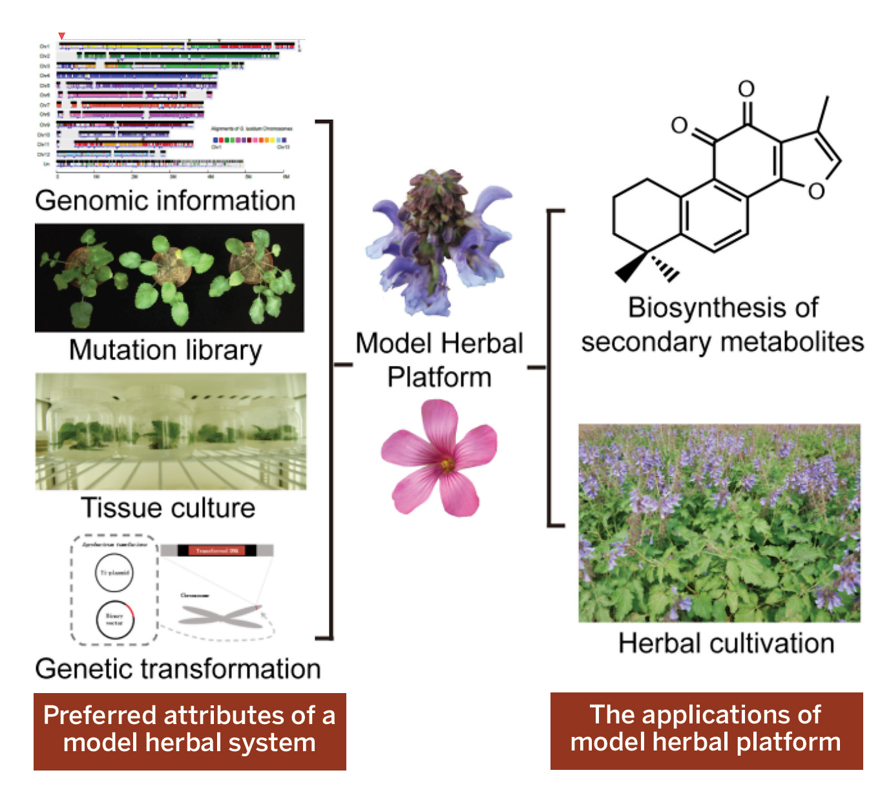
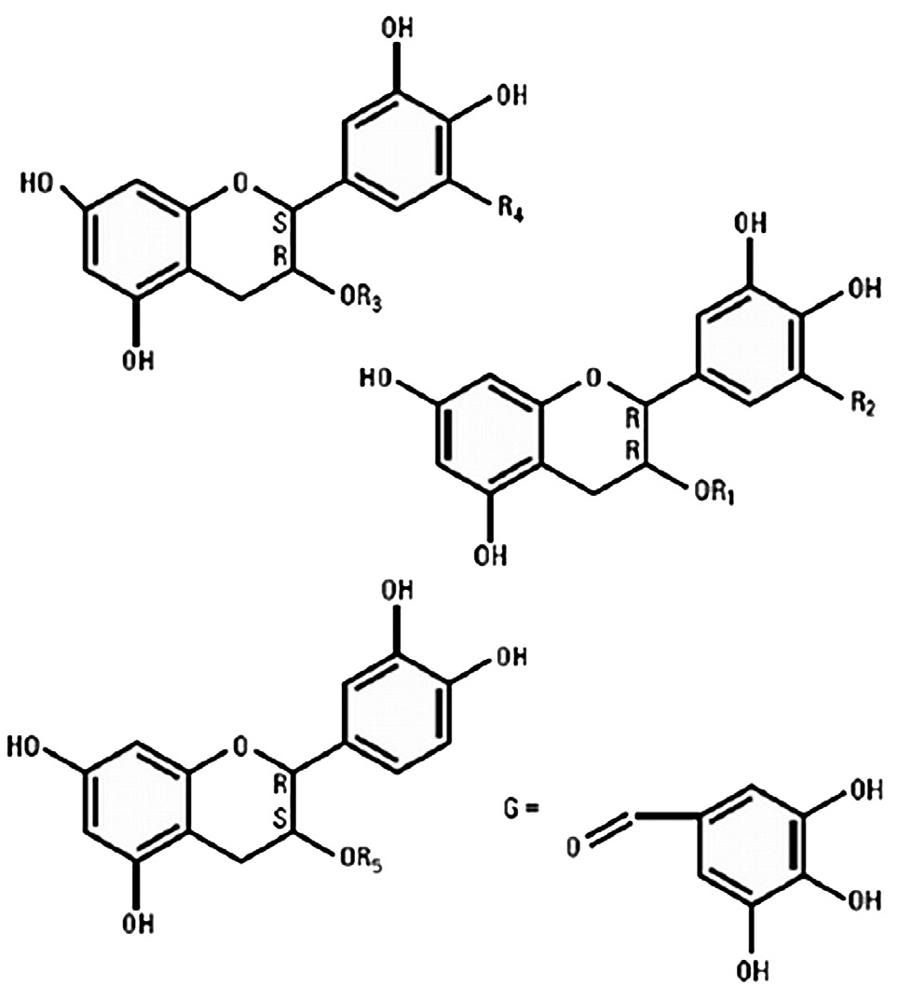
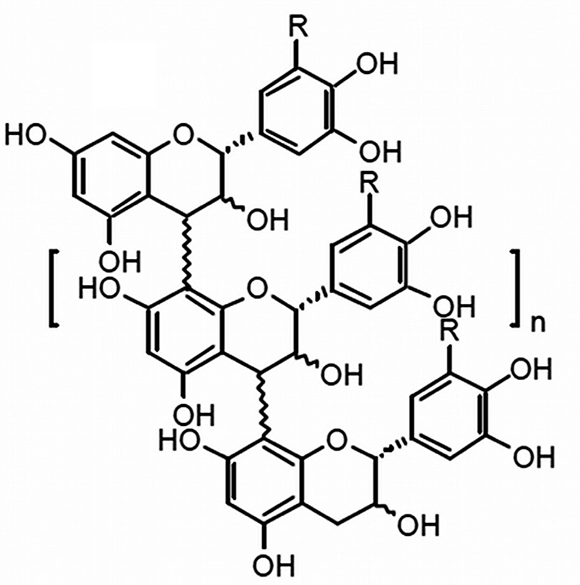
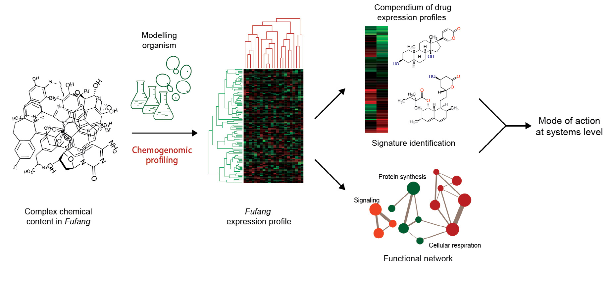

<!-- 方針: ほぼ全訳＋必要に応じた補足。原文（英語・Science/AAAS Custom Publishing Office 制作のスポンサー付き特別増刊、査読外）の10編の節構成に沿って訳出。図は原本PDFからPyMuPDFで埋め込み画像を xref 抽出しReadで内容確認のうえ全訳キャプションで埋め込んだ（11点）。表1（FDAのIND件数）・インフルエンザ対照表・中薬の標的表・統合毒性評価戦略表は全行を転記。各編の参考文献は原文の並び順で全件を掲げる。「> 補足:」は訳者注。 -->

## この増刊について

- 原題: **The Art and Science of Traditional Medicine — Part 2: Multidisciplinary Approaches for Studying Traditional Medicine**
- 掲載: *Science* **347**(6219 Suppl), S26–S52（2015年）／制作: Science/AAAS Custom Publishing Office
- 引用形式（原文指定）: [Author Name(s)], *Science* **347** (6219 Suppl), Sxx–Sxx (2015).

> **原文の注記（重要）**: 本特別スポンサー付きセクションに含まれる内容は、Science/AAAS Custom Publishing Office が委託・編集・出版したものである。**Science 誌の編集スタッフによる査読も評価も受けていない。** ただし全原稿は、プロジェクト編集者が選任した伝統医学研究の専門家からなる国際編集チームによる批判的評価を受けている。本セクションの意図は、世界各国の機関の著者が、この急成長分野における最近の進展を強調する総説／展望型の論文を通じて、最先端の伝統医学研究を示す手段を提供することにある。**科学的内容と記載された事実の正確性については、編集チームと著者が全責任を負う。**

**編集チーム**

| 役割 | 氏名・所属 |
|---|---|
| ゲストプロジェクト編集者 | Tai-Ping Fan 博士（英国ケンブリッジ大学） |
| 編集委員 | Josephine Briggs 医学博士（米国NIH 国立補完代替医療センター〈NCCAM〉） |
| 編集委員 | Liang Liu 医学博士・博士（マカオ科技大学, 中国マカオ特別行政区） |
| 編集委員 | Aiping Lu 医学博士・博士（香港浸会大学, 中国香港特別行政区） |
| 編集委員 | Jan van der Greef 博士（オランダ ライデン大学・TNO） |
| 編集委員 | Anlong Xu 博士（北京中医薬大学, 中国） |
| 編集 | Sean Sanders 博士／編集補 Tianna Hicklin 博士／校正 Yuse Lajiminmuhip／デザイン Amy Hardcastle |

**この増刊の狙い（原文の巻頭言）**

全3部からなる特別増刊の第2部にあたる本号では、**伝統生薬その他の本草（materia medica）の研究——ひいてはその利用——に革命をもたらす新たなアプローチとしての「生薬ゲノミクス（herbal genomics）」**、および**その品質管理と標準化の進展**を強調する。中心的な焦点となるのは、**小分子医薬と同じ基準に基づいて、ボタニカル（伝統医薬を含む）を新薬へと発展させるための、米国食品医薬品局（FDA）の実務的な枠組み**である。伝統療法からの創薬・医薬品開発への機構論的研究の応用について、**前臨床毒性評価・ファーマコビジランス・比較効果研究・「P4」医療の実践**——特にインフルエンザ・虚血性心疾患・脳卒中・がんの文脈において——に重点を置いて論じる。

**収録論文（全10編）**

| 頁 | 表題 |
|---|---|
| S27 | 生薬ゲノミクス——伝統医薬の生物学を検証する |
| S29 | 伝統中医薬の品質管理に対する全体論的アプローチ |
| S32 | 伝統医薬からボタニカルドラッグへの進化 |
| S35 | 伝統中医薬を用いたインフルエンザ治療の開発 |
| S38 | 伝統医学の哲学に着想を得た新規創薬戦略 |
| S40 | 古代の組み合わせ処方を読み解く——麝香保心丸 |
| S43 | 伝統中医薬処方 PHY906 の開発から得られた教訓 |
| S45 | がん管理における中薬の潜在的役割 |
| S47 | 生薬医薬の安全性評価——統合的毒性学アプローチ |
| S50 | 'omics と比較効果研究の結合——中医薬のためのエビデンスに基づく臨床研究の意思決定 |

> 補足: この増刊の位置づけを、日本の読者向けに整理しておきたい。
>
> **これは Science 誌の査読論文ではない。** 巻頭に明記されているとおり、AAAS のカスタム出版部門がスポンサーを得て制作した「特別セクション」であり、Science 本誌の編集部による査読を経ていない。したがって個々の主張の強度は、通常の Science 掲載論文と同列には扱えない。
>
> **にもかかわらず読む価値が高い**理由は2つある。第一に、**第3編の著者陣が FDA CDER の当事者そのもの**であること——Sau L. Lee、Jinhui Dou、Robert Temple、Julie Beitz、Charles Wu、Lawrence X. Yu、そして当時の CDER 所長 **Janet Woodcock** が名を連ねている。規制当局が自ら「複雑混合物の品質をどう担保しているか」を説明した文書であり、実務上の一次情報に近い。第二に、生薬ゲノミクス・品質管理・創薬・臨床・安全性・研究方法論という**この分野の論点がひととおり揃っている**ため、地図として使える。
>
> なお本サイトには、同じ論点を扱う関連ページが複数ある——「ボタニカルドラッグ（植物薬）の開発——総説」（McChesney・Dou・Harrington 2019）、「植物由来製品をがん診療に組み込む」（Berman ら 2025）。Dou Jinhui は本増刊 第3編と McChesney 2019 の両方に名を連ねており、Veregen/Fulyzaq の事例は3本すべてで繰り返し登場する。読み比べると、**2015年（本増刊）→2019年→2025年**と規制環境がどう動いたかが見えてくる。

---

# 第1編　生薬ゲノミクス——伝統医薬の生物学を検証する

**原題**: Herbal genomics: Examining the biology of traditional medicines（S27）

**著者**: Shilin Chen（陳士林）¹\*・Jingyuan Song ²・Chao Sun ²・Jiang Xu ¹・Yingjie Zhu ¹・Rob Verpoorte ³・Tai-Ping Fan ⁴\*

- ¹ WHO伝統医学協力センター, 中国中医科学院 中薬研究所（中国 北京）
- ² 中国医学科学院・北京協和医学院 薬用植物研究所（中国 北京）
- ³ ライデン大学 IBL 天然物研究室（オランダ ライデン）
- ⁴ ケンブリッジ大学 薬理学科（英国 ケンブリッジ）
- \*責任著者: slchen@implad.ac.cn（S.C.）／tpf1000@cam.ac.uk（T.F.）

## 導入

植物や真菌をもとにした伝統生薬は、**5000年以上**にわたって用いられてきた。しかしながら、大半の伝統生薬について、**遺伝的背景・農業形質・薬効品質はほとんど理解されていない**。

**ハイスループットシーケンシング技術の急速な進歩と大幅なコスト低下**により、「**生薬ゲノミクス（herbal genomics）**」と呼ばれる新しい学問分野が出現した。研究者らは現在、薬用生薬のゲノムをシーケンス・アセンブル・アノテーションし、その遺伝子機能を解析することによって、薬用生薬を体系的に分類しつつある。

**霊芝（Lingzhi、*Ganoderma lucidum*、「不老不死のキノコ」）** など、一般に使われるいくつかの生薬のゲノムはすでにシーケンスされている。この種は、**薬用真菌種における二次代謝産物の生合成経路の研究を促進する、有効なモデル系**を提供してきた [1]。

したがって、**ゲノム情報を、トランスクリプトーム・プロテオーム・メタボロームのデータと合わせて用いることで、二次代謝産物の生合成経路とその制御を予測でき**、生薬の遺伝学と生物学を理解することを目指す発見主導型研究に革命を引き起こす。

生薬ゲノミクスは、**1つを超える活性成分を含みうる複雑な生薬製品の化学的・生物学的解析を支える有効なプラットフォーム**を提供する。そのため現在、生薬関連の生物学研究の多くの領域に応用され、伝統医薬の品質の理解や、**生薬遺伝子バンクの構築を通じた分子レベルでの生薬同定**に役立っている。

さらに、**機能的生薬ゲノミクス**は、**モデル生薬研究プラットフォーム・道地薬材（geoherbal）研究・ゲノミクス支援生薬育種・生薬合成生物学**に貢献しうる。これらはいずれも、将来にわたって薬用植物とその活性化合物の供給を確保するために重要である。

## モデル生薬を創る

バイオテクノロジーとゲノミクスの近年の発展により、***Ganoderma lucidum*（霊芝）・*Salvia miltiorrhiza*（丹参）・*Catharanthus roseus*（ニチニチソウ）** を含むいくつかの種が、**生薬の遺伝学と代謝活性を研究するための価値あるモデル**として浮上してきた。これらの種は、**トリテルペン・ジテルペンキノン・インドールアルカロイド**を含む活性医薬成分を合成することが示されている。

生薬における二次代謝産物の**中核的な生合成経路は保存されている**ものの、**下流の経路は進化し、高度に多様化した** [2]。したがって、薬用生薬の異なる栽培品種や進化的に近縁な種に由来する遺伝子を、これらの生薬モデルを用いて評価し、**自然変異の背後にある機構を理解できる**。

これらのモデル系はまた、**近縁の生薬種における収斂的な二次代謝産物の新規生合成経路を同定する**ためにも使える。**ゲノム編集**の最近の進歩は、特定の対立遺伝子を導入・改変することによる実行可能なアプローチを提供しており、それによって**代謝産物に対する遺伝的制御**を検討できる [3]。

生合成経路の解明は最も魅力的な特徴の1つではあるが、モデル生薬は、**多年生の習性・発達パターン・栽培要件・環境的または生物学的ストレスへの抵抗性**についての情報も提供しうる（**図1**）。

## 道地薬材（geoherbalism）の生物学的基盤

中国の**「道地薬材（geoherbalism）」** の概念は、**特定の地域または環境で生産された「正品」あるいは「優良」な生薬**を用いて、高い効能をもつ治療製品を生み出すことを包含する。

新しい 'omics 技術を道地薬材に適用することで、**薬用製品の最適な生育条件と特定の生薬遺伝子型についての情報**が得られ、生薬の生育を考える際に**遺伝的要因と環境的要因の両方を考慮に入れる**ことが可能になる。'omics は、道地薬材の背後にある分子基盤を解明し、優良品種を選抜するための、新しく強力な道具を提供する。

**生薬のパンゲノム**——ある種に属するすべての系統の遺伝コード全体——を作成することで、その種の「**コアゲノム**」と「**ディスペンサブルゲノム（可欠ゲノム）**」の同定、および異なる地域や生態的環境に存在する個々の遺伝的変異についての洞察が得られる。

環境ストレスは**エピジェネティックな修飾**をもたらしうる。**DNAメチロームの解析、クロマチン免疫沈降（ChIP）シーケンシング、small RNAシーケンシング**といった技術が、エピジェネティック要因の影響を調べるのに有用である。

加えて、**土壌微生物**が生薬の環境に影響しうる。土壌微生物集団の**メタゲノム解析**は、生育条件を変えうる微生物と生薬の重要な相互作用を指し示しうる [4]。

> 補足: 「道地薬材（どうちやくざい）」は、日本の生薬でいえば「産地指定」に近い概念だが、より強い。中医では **同じ植物種でも産地が違えば別物**という扱いで、例えば四川産の川芎、河南産の懐山薬、といった具合に、生薬名に産地が組み込まれているものすらある。
>
> 本節が言っているのは、この経験知を **パンゲノム＋エピゲノム＋土壌メタゲノム**で説明しようという試みである。産地差の原因を、①遺伝的変異（コアゲノム／可欠ゲノム）②環境ストレスによるエピジェネティック修飾 ③根圏微生物叢——の3層に分解する枠組みは筋がよい。
>
> なお、本サイト収録の McChesney ら（2019）は、*Tithonia diversifolia* では環境が代謝プロファイルを直接動かした一方、*Copaifera langsdorffii* では10産地由来の種子を同一圃場で育てると代謝産物が一様になった、という対照的な2例を紹介している。**種によって遺伝と環境の効き方が違う**ので、「道地」の必要性は生薬ごとに検証すべきだ、ということになる。

## 標的を絞った生薬育種

**分子育種**には、多型マーカーおよび／または形質関連遺伝子の情報が必要である。生薬は**マイナー作物**とみなされているため、コストの高さゆえにゲノミクス支援の改良が限られてきた。しかし、**次世代シーケンシングとその手頃さの向上**により、遺伝的多様性の価値ある貯蔵庫を代表する野生変種や異なる栽培品種のシーケンシングを通じて、**マーカー選抜育種プログラムが劇的に加速した**。

生薬 'omics 研究は、モデル種における多くの機能遺伝子の同定を加速し、また**望ましい化合物の生産に特異的な機能マーカーの開発**を可能にした。この情報は標的を絞った分子育種に使える [5]。

## 生薬合成生物学の研究

生薬は新規および既知の治療用化合物の供給源であるが、**供給（sourcing）の問題は一般的**である。バイオテクノロジーと遺伝子工学は、代替的な生産方法へのアプローチを提供する。

薬用植物の**代謝工学**は広く研究されており、例えば ***Atropa belladonna*（ベラドンナ）にアトロピンではなくスコポラミンを生産させる**といった成果が得られている。しかしながら、植物化合物の全体的な生産を向上させるには、**経路中の一次コード遺伝子や制御遺伝子を過剰発現させるだけでは不十分**であることが明らかである。**区画化（compartmentalization）・輸送・貯蔵・補因子の利用可能性**が重要な律速因子となりうるからである。

関与する経路をよりよく理解することが、代謝工学へのより包括的なアプローチの基盤を築くだろう。これが**生薬合成生物学**の目標であり、それは**ゲノムの改変あるいは de novo 合成**を伴い、資源と純度の問題に対処する可能性をもつ。

さらに、創薬のための天然物は、**植物の代謝経路を細菌や酵母などの他の生物に組み込み・導入することによって構造的に多様化できる** [6]。生薬合成生物学における従来の実践は、異種の生合成経路を、産物を生産できる発現系に導入することである。しかし、純粋化合物の大規模生産のための異なるアプローチとしては、***Mycoplasma* について記述されたような、まったく新しい合成ゲノムの構築**がありうる [7]。

## 分子的アイデンティティを定義する

**DNAバーコーディング**は、「**一配列一種（one sequence, one species）**」の概念を利用して、生薬同定の実務に革命をもたらしつつある。標準化されたDNAバーコーディング同定システムは利用可能だが、その過程は煩雑になりうる。

**プラスチドゲノムを「スーパーバーコード」として解析すること**は、従来のDNAバーコーディングでは明確に区別できない近縁種や栽培品種にとって、有望な代替手段である [8, 9]。

DNAバーコードの利用可能性が高まることで、**劣悪な代替品・混和物・偽造品の使用に起因する、生薬医薬の現在の市場問題を解決できる**可能性がある。全体として、**DNAバーコーディングに基づく標準化された同定システムは、生薬原料の正確な同定を通じて、伝統医薬の品質管理に重要な役割を果たしうる**。

## 生薬遺伝子バンクの構築

生薬の遺伝情報は加速度的に蓄積されつつあり、**すべての 'omics データへの統合的・統一的なアクセスのための共通プラットフォームの必要性が最重要**となっている。

現在の資源を分類するために、いくつかの生薬関連データベースがすでに開発されている。

| データベース | 内容 | URL |
|---|---|---|
| ゲノム情報 | 生薬ゲノム | http://herbalgenomics.org |
| トランスクリプトーム情報 | 薬用植物ゲノミクス | http://medicinalplantgenomics.msu.edu |
| DNAバーコードデータベース | 中薬バーコード | http://tcmbarcode.cn/en |
| 代謝経路データベース | CathaCyc | http://cathacyc.org |

しかしながら、**これら分散した資源は長期的な維持管理の対象になっておらず、使用にはバイオインフォマティクスのスキルが必要**である。**生薬医薬の分子・生物学データを保存する、包括的でアクセスしやすいデータベースが必要**である。生薬のDNA／タンパク質配列とメタボロームを、そうしたデータベースに統合できる [10, 11]。

バイオインフォマティクスのアプローチが改善されれば、**ゲノム情報と化学情報を用いて二次代謝産物の生合成経路を同定でき**、植物・真菌ベースの治療薬について、より効率的で標的を絞った探索の設計につながる [12]。

## 課題と展望

これまでの成功にもかかわらず、**生薬ゲノミクスはなお重大な技術的・倫理的課題に直面している**。

例えば、**十分にアセンブルされた生薬ゲノムはこれまでにごくわずかしか公開されていない**。一部にはその複雑性のためである。**高いヘテロ接合性・反復配列に富むDNA配列・倍数性**が、ショートリードの全ゲノムショットガンシーケンシングからのデータアセンブリを妨げる要因である。

さらに、**ハイスループット手法の欠如**が、二次代謝産物の生合成に関与する酵素と経路の同定効率を下げている。**合成生物学については、科学コミュニティと市民の双方から倫理的・バイオセキュリティ上の懸念**も表明されている。

それでもなお、**生薬ゲノミクスは、伝統生薬医薬の使用と受容に革命をもたらす前例のない機会を提供し**、同時にさらなるプロテオーム・メタボローム研究に不可欠な知識基盤に貢献する。

### 第1編の引用文献

1. S. Chen et al., *Nat. Commun.* **3**, 913 (2012).
2. S. J. Gagne et al., *Proc. Natl. Acad. Sci. U.S.A.* **109**, 12811 (2012).
3. Q. Shan, Y. Wang, J. Li, C. Gao, *Nat. Protoc.* **9**, 2395 (2014).
4. P. R. Hirsch, T. H. Mauchline, *Nat. Biotechnol.* **30**, 961 (2012).
5. R. K. Varshney, A. Graner, M. E. Sorrells, *Trends Plant Sci.* **10**, 621 (2005).
6. F. Geu-Flores, N. H. Sherden, V. Courdavault, *Nature* **492**, 138 (2012).
7. D. G. Gibson et al., *Science* **329**, 52 (2010).
8. X. Li et al., *Biol. Rev. Camb. Philos. Soc.* doi:10.1111/brv.12104 (2014).
9. S. Chen et al., *Biotechnol. Adv.* **32**, 1237 (2014).
10. B. Berger, J. Peng, M. Singh, *Nat. Rev. Genet.* **14**, 333 (2013).
11. M. Yandell, D. Ence, *Nat. Rev. Genet.* **13**, 329 (2012).
12. L. Chae, T. Kim, R. Nilo-Poyanco, S. Y. Rhee, *Science* **344**, 510 (2014).

---

# 第2編　伝統中医薬の品質管理に対する全体論的アプローチ

**原題**: A holistic approach to the quality control of traditional Chinese medicines（S29）

**著者**: De-an Guo（果徳安）¹\*・Wan-Ying Wu ¹・Min Ye ²・Xuan Liu ¹・Geoffrey A. Cordell ³

- ¹ 中薬標準化技術国家工程実験室, 中国科学院 上海薬物研究所（中国 上海）
- ² 北京大学 薬学院（中国 北京）
- ³ Natural Products Inc.（米国イリノイ州 Evanston 60203）およびフロリダ大学薬学部 薬科学科（米国フロリダ州 Gainesville）
- \*責任著者: daguo@simm.ac.cn

## QSEC——品質・安全性・有効性・一貫性

植物と伝統医薬（TM）は、疾病の予防と治療のために世界中で用いられ、また数多くの処方薬・一般用医薬品の供給源となっている [1]。多くの場合、これらのTMは**数千年にわたって使用されており、なお大部分が野生から採取されている**。

しかしながら、**大半のTMの生育と単離についての品質管理は貧弱か、あるいは存在しない**。患者も施術者も同様に、TMの **QSEC——品質（Quality）・安全性（Safety）・有効性（Efficacy）・一貫性（Consistency）** に確信をもつ必要があり、それには**植物調製のあらゆる側面の標準化**が必要である。

これは**正しい植物の同定**から始まり、**すべての生物活性成分の単離と特性評価**を含む。TMのQSECを判定するエビデンスに基づく基準は、**世界中で大きく異なっている**。その結果、TM製品の販売に要求されるエビデンスの水準は、**国ごとに大きく変わりうる**。

有名なシカゴの建築家 **ルイス・サリヴァン**が言ったように、「**形は永遠に機能に従う（form forever follows function）**」。患者と施術者にとって、TMへの期待は「**効くこと（機能）**」でなければならない。その結果を保証するための戦略（形）には、**強固なエビデンス基盤**が必要であり、成功へのある種の障壁を克服することが求められる。

多くの社会において、**TMの受容は医療システムへの統合に先行しており**、そのために——少なくとも部分的にはエビデンス基盤の欠如ゆえに——**哲学的・規制的障壁に直面**している。

**世界保健機関（WHO）** はこれらの問題のいくつかを認識しており [1, 2]、**北京宣言**を通じて、**エビデンスに基づくTMの各国医療システムへの統合**を奨励し、「**伝統医学の適切・安全・有効な使用を確保する**」規制と基準を推進してきた [3]。

## 克服すべき「思い込み」

TMを各国の医療システムに完全に統合し、その使用にエビデンスに基づく正当化を与えるためには、**根強く定着した慣習と信念のいくつかに対処する必要**がある。それらには以下が含まれる。

- **数千年にわたって使われてきた伝統医薬は安全で有効に違いない**、という考え
- 単に「**正しい**」植物を使えば十分である、という考え
- **生物学的効果は、植物の地理的起源・使用部位・調製方法によらず一貫している**、という考え
- **古いあるいは栽培された植物材料は、新鮮な野生植物より効果が劣る**、という考え
- **複雑な植物混合物は有効性のために必要だが、標準化できない**、という考え
- **伝統知識と特定の薬用植物は常に入手可能であり続ける**、という考え

現代の情報を、**植物学的・化学的・生物学的・臨床的研究**と合わせて適用することが、施術者と患者の双方に資するエビデンスに基づく伝統医学の研究アジェンダを提供する [4]。

次の段階は**標準化** [5] であり、これには **DNAバーコーディングによる適切な植物の真正性確認** [6, 7] と、材料中の**すべての生物活性成分の化学的プロファイリングと定量** [8, 9] が含まれる。

> 補足: 6つの「思い込み」の列挙は、この分野で仕事をする人にとって耳の痛いリストである。特に3番目——**産地・部位・調製法によらず効果は一貫している**——は、前編の道地薬材の議論と正面から衝突する。そして5番目の「複雑だから標準化できない」は、まさに本増刊全体が反証しようとしている命題である。
>
> 「form follows function」を引くくだりは洒落ているが、論旨は真剣である。**「効くこと」が目的なら、それを保証する仕組み（形）を作らねばならない**——伝統だから、経験があるから、では通らない、という宣言になっている。

## 還元主義と全体論の合流

**伝統中医薬（TCM）** は、経験的評価を通じて確立された古代の全体論的治療体系であり、**大中華圏・日本・韓国・ベトナム・マレーシア・シンガポール**で多くの関連する形で存在している。それは**薬用植物・真菌・動物性生産物・鉱物**の使用を通じて、**気（エネルギー）** と**陰陽（バランス）** を回復させようとするものであり、表面的には西洋医学の還元主義的アプローチとはかなり異なって見える。

しかしながら、**現代の生物医科学は今や「システム生物学」の概念を受け入れつつある**。システム生物学は、**ヒトの疾患を恒常性における多因子的な不安定性の結果として捉える** [10]。がんやHIV-AIDSの治療は現在、**異なる作用機序を標的とする薬剤のカクテル**を伴う。

同時に、**TCMは「ネットワーク薬理学」を受け入れつつある**。ネットワーク薬理学は、**ある植物（あるいは複数の植物）の主要成分が、いかにして様々な生物学的経路に作用し、複数の相乗的な作用を生み出すか**を研究する [11, 12]。

**TCMの品質管理（QC）は圃場から始まり、生産工程全体を通じて継続されるべき**である。TM製剤のQCシステムの開発は、**生物学的・臨床的研究に適した標準化製品の製造にとって、決定的かつ基礎的な段階**である。

典型的なTM製剤は、しばしば複数植物の混合からなり、**観察される治療効果をもたらすために相乗的に働く膨大な化学成分の配列**を代表する。そうした複雑なTM製剤について、化学的・生物学的な品質規格を確立することは、**分析上の途方もない挑戦**である。したがって、TMの品質規格を確立するためのパラダイムとして機能する、**化学的・代謝的・生物学的手法を統合した包括的な分析アプローチ**が開発された。

## 系統的な分析法の開発

**複雑な製剤の各成分の化学的フィンガープリントを提供できる包括的な分析アッセイ**が、TMの品質と生物学的一貫性を監視するために必要である（**図1**）[13, 14]。

我々の研究室では、**液体クロマトグラフィー／多段階質量分析（LC-MSⁿ）** の技術を用いて、様々なTM植物材料の化学プロファイルを探索してきた。

**ニンジン（人参）・三七（サンシチニンジン）・アメリカニンジン（西洋参）**（*Panax* 属, ウコギ科）は、TCM処方で一般的に用いられ、活性成分としてトリテルペンおよびステロイドサポニンであるジンセノシド類を含む。**これら3つの類似した植物は臨床的効能が異なり、特に加工後の形態では混同されやすい**。

**3植物から合計 623種のジンセノシド（うち 437種は新規ジンセノシド候補）が特性評価され**、それらを明確に区別できる特異的バイオマーカーの開発が可能になった [15]。この技術は、***Salvia miltiorrhiza*（丹参）・*Ganoderma lucidum*（霊芝）・*Glycyrrhiza uralensis*（甘草）・*Rheum palmatum*（大黄）** を含む多数のTM生薬にも同様に適用された。

ある事例では、**代謝フィンガープリンティング技術**により、***S. miltiorrhiza*（丹参）を経口投与した後のラットにおいて、主要なタンシノン類とサルビアノール酸類の代謝産物70種**が同定され、**代謝経路と排泄経路の決定**が可能になった [16, 17]。

**化学的解析と生物学的解析を組み合わせることは、活性成分を明らかにする有効な戦略**を提供する。*S. miltiorrhiza* の複雑な代謝マトリクスを考慮し、**単一化合物・抽出画分・生薬全体の解析を伴う三層戦略**が採用された。薬理学・分子生物学・システム生物学を統合した**多層的な生物学的アプローチ**が用いられた。

標的タンパク質と作用機序は、**分子・細胞・組織・個体レベル**で影響を受けることが判明し、**TMが複数の経路を通じて複数の標的に作用する**という主張を裏づけた。*S. miltiorrhiza* の場合、**サルビアノール酸B**は、**マトリックスメタロプロテアーゼ9・上皮成長因子受容体・インテグリン**を含むいくつかの分子標的を調節することが判明し [18]、**主要なタンシノン誘導体は心保護作用と抗酸化作用をもつ**ことが見出された [19]。

## 全体的な品質規格の作成

**バッチ間一貫性を監視する分析フィンガープリンティング**と、**真正性と品質を保証する多成分アッセイ**を組み合わせた新しい品質管理モデルが開発され、いくつかの中国生薬原料とその製剤に有効に適用されてきた（**図2**）。

サルビアノール酸類とタンシノン類に基づき、***S. miltiorrhiza* の全体的な品質規格が、SSDMC（single standard to determine multicomponents、一標多測）法**を用いて確立された。SSDMCは**単一の標準物質を用いて混合物中の多数の関連化合物の含量を定量する**方法であり、**中国薬局方と米国薬局方の双方で採用されている**。

**臨床評価には薬局方品質の材料のみを用いること**が、製品の一貫性と安全性を確保するために推奨される。

> 補足: 図2の構成が秀逸で、漢字2文字ずつで論点を整理している。上半分が **「真偽」**（これは本物か＝基原の鑑定）、下半分が **「優劣」**（品質は良いか＝定量的評価）。この2つは別の問題であり、別の手法が要る、という主張が一目で分かる。
>
> **SSDMC（一標多測）** は、本サイトでも繰り返し登場する手法である——標準品を1つだけ買い、他の成分は相対応答比（補正係数）で換算する。標準品コストが劇的に下がるが、低濃度・高濃度で誤差が膨らむという弱点をもつ。この弱点を検量線の切片誤差を組み込むことで解決したのが **MAML** で、本サイト収録の「双黄連口服液の総合的品質評価」（*J. Chromatogr. A* 2023）が詳しい。
>
> 中国薬局方と米国薬局方の双方が SSDMC を採用しているという記述は重要である。日本薬局方では同種の考え方（相対感度係数を用いた定量）が個別の医薬品各条で限定的に使われている。

## 結論

**多数の内在的・外在的要因が、薬用植物とその代謝産物の品質・一貫性・安定性に影響する** [12, 13]。**GACP（適正農業規範・採取規範）・GLP（適正試験所基準）・GMP（適正製造規範）・GCP（適正臨床試験実施基準）** の規制された適用が、施術者と患者のために**高品質で安全・有効・一貫したTCM製品**を保証するために必要である [5]。

TCM製品が**グローバルでエビデンスに基づく医療システムに受け入れられる**ためには、その**生育・採取・加工・投与を統括する強固な国際基準と手順が開発されることが不可欠**である。

さらに、**TCMの極度の複雑性は、生物活性成分の適切な解析のための新技術と戦略の統合を必要とし**、それによって影響を受ける標的と経路を完全に理解できるようになる [20]。

### 第2編の引用文献

1. World Health Organization, *The Regional Strategy for Traditional Medicine in the Western Pacific (2011–2020)*. WHO Regional Office for the Western Pacific, Manila, Republic of the Philippines. 71 pp. (2012).
2. World Health Organization, *WHO Traditional Medicine Strategy 2014–2023*. WHO, Geneva, Switzerland. 71 pp. (2014).
3. World Health Organization, http://www.who.int/medicines/areas/traditional/congress/beijing_declaration/en/ (2008). 2014年8月15日アクセス.
4. G. A. Cordell, *Phytochem. Lett.*, Epub before print (2014), doi:10.1016/j.phytol.2014.06.002.
5. H. Uzuner et al., *J. Ethnopharmacol.* **140**, 458 (2012).
6. N. Techen, I. Parveen, Z. Q. Pan, I. A. Khan, *Curr. Opin. Biotech.* **25**, 103 (2014).
7. Ž. F. Pečnikar, E. V. Buzan, *J. Appl. Genet.* **55**, 43 (2014).
8. J. Liang et al., *J. Chromatogr. A* **1294**, 58 (2013).
9. J. Jing, W. C. Ren, S. B. Chen, M. Wei, H. S. Parekh, *Trends Anal. Chem.* **44** (2013).
10. J. van der Greef, *Nature* **480**, S87 (2011).
11. G. B. Zhang, Q. Y. Li, Q. L. Chen, S. B. Su, *Evid. Based Complement. Alternat. Med.*, id: 621423 (2013), doi:10.1155/2013/621423.
12. S. Li, B. Zhang, *Chin. J. Nat. Med.* **11**, 110 (2013).
13. G. A. Cordell, *Planta Med.* **77**, 1129 (2011).
14. G. A. Cordell, M. D. Colvard, *J. Nat. Prod.* **75**, 514 (2012).
15. W. Z. Yang et al., *Anal. Chim. Acta* **739**, 56 (2012).
16. M. Yang, C. R. Cheng, J. L. Yang, D. A. Guo, *Curr. Drug Metab.* **13**, 535 (2012).
17. X. Qiao et al., *AAPS J.* **16**, 101 (2014).
18. L. X. Feng et al., *Proteomics* **11**, 1473 (2011).
19. X. Liu, W. Y. Wu, B. H. Jiang, M. Yang, D. A. Guo, *Trends Pharmacol. Sci.* **34**, 620 (2013).
20. R. Tilton et al., *Chin. Med.* **5**, 30 (2010).

---

# 第3編　伝統医薬からボタニカルドラッグへの進化

**原題**: Evolution of traditional medicines to botanical drugs（S32）

**著者**: **Sau L. Lee\*・Jinhui Dou\*・Rajiv Agarwal・Robert Temple・Julie Beitz・Charles Wu・Andrew Mulberg・Lawrence X. Yu・Janet Woodcock**（米国食品医薬品局 医薬品評価研究センター〈CDER〉, 米国メリーランド州 Silver Spring）

- \*責任著者: sau.lee@fda.hhs.gov（S.L.L.）／jinhui.dou@fda.hhs.gov（J.D.）

> 補足: **本増刊の白眉**である。著者9名全員が **FDA CDER** の所属で、しかも **Janet Woodcock**（当時のCDER所長、後にFDA長官代行）、**Robert Temple**（CDER 臨床科学担当副所長）、**Lawrence X. Yu**（CDER 医薬品品質局 副局長）という、米国の医薬品規制の中枢にいた面々が名を連ねている。**規制当局が自ら「複雑混合物の品質をどう担保するか」を説明した文書**であり、実務上の一次情報に極めて近い。

## ボタニカル審査チームと10年間の実績

**ボタニカルは新薬の重要な供給源を構成する** [1, 2]。ボタニカルドラッグ開発を促進するため、**米国食品医薬品局（FDA）の医薬品評価研究センター（CDER）は 2003年に「ボタニカル審査チーム（Botanical Review Team）」を設置**し、**2004年に最初の「Guidance for Industry: Botanical Drug Products」を公表した** [3]。

このガイダンスはFDAの考え方を示すものであり、**治験薬申請（IND）および新薬承認申請（NDA）のプロセスを通じたボタニカル新薬開発に伴う、品質・非臨床・臨床その他の独自の側面についての推奨**を提供する。

**2004年から2013年にかけて、CDERは 400件を超えるボタニカルIND申請とpre-IND会合要請を受理した（表1）。** **INDの大半は、患者における治験ボタニカル製品の予備的な安全性と有効性の評価のため、第2相臨床試験への移行が許可された。**

FDAは、**2006年に Veregen（シネカテキン）の最初のボタニカルNDA** [4, 5]、**2012年に Fulyzaq（クロフェレマー）の2番目のボタニカルNDA** [6, 7] を承認した。**これら2件のNDA承認は、天然の複雑混合物に由来する新しい治療法が、品質・安全性・有効性についての現代FDA基準を満たすように開発されうることを示している。** 現在、少数のINDが第3相臨床試験にあり、将来さらなるNDAにつながる可能性がある。

**表1　CDERに提出されたボタニカルpre-INDおよびINDの件数（2004–2013年）**

| 提出区分 | 2004 | 2005 | 2006 | 2007 | 2008 | 2009 | 2010 | 2011 | 2012 | 2013 | 合計 |
|---|---|---|---|---|---|---|---|---|---|---|---|
| Pre-IND | 12 | 6 | 11 | 7 | 14 | 10 | 10 | 8 | 5 | 8 | **91** |
| IND | 21 | 38 | 22 | 39 | 27 | 27 | 27 | 33 | 33 | 51 | **318** |
| Pre-IND および IND | 33 | 44 | 33 | 46 | 41 | 37 | 37 | 41 | 38 | 59 | **409** |

> 補足: 表1の数字は貴重である。**10年間で409件の申請があり、承認に至ったのは2件**。本サイト収録の Berman ら（2025）が引く FDA の解析では「**商業ボタニカルINDのうち第3相まで進むのは5%未満**」とされている。表1と併せると、ボタニカルドラッグ開発の「漏斗」の細さが具体的に見えてくる。
>
> なお2013年に IND が 51件と急増している。2016年のガイダンス改訂（早期相試験の柔軟化）へ向けた期待の高まりを反映している可能性がある。

## 「証拠の総体（Totality-of-Evidence）」アプローチ

米国で医薬品として販売されることを意図した新規ボタニカル製品について、申請者は**小分子製品に期待されるのと同水準の安全性と有効性のエビデンスを提供する必要がある**。

ボタニカル製品はまた、**製品品質の基準を満たす必要がある**。それによって、市販される製品バッチが、臨床試験で試験された製品バッチで観察されたのと一貫した治療効果をもたらす（すなわち**治療的一貫性, therapeutic consistency**）ようにするためである。

しかしながら、**ボタニカル製品の品質管理は困難**である。これらの製品は、**活性成分が既知でないかもしれない複雑混合物**を含み、また**バッチ間で相当の変動（例: 化学組成）** をもちうるからである。小分子製品の品質確保に用いられる**従来のCMC（化学・製造・品質管理）データ（主に化学試験による）は、ボタニカル製品には不十分でありうる**。

この課題に対処するため、FDAは、**ボタニカルINDおよびNDA提出の審査から得た知識と経験に基づき、「証拠の総体（totality-of-evidence）」アプローチを開発した**。

この統合的アプローチは、従来のCMCデータに加えて、以下を含む**他のエビデンス**を考慮する。

- **原料管理（raw material control）**
- **臨床的に関連する生物学的アッセイ（clinically relevant bioassay(s)）**
- **その他の非CMCデータ**（医薬品製品の複数バッチに基づいて生成された用量反応の臨床データを含む）

**これら他のデータへの依存の度合いは、そのボタニカル混合物をどの程度まで特性評価・定量できるかによって決まる。** そうした統合的アプローチは、**FDAの最初の2件のボタニカルNDAの経験を通じて説明・例示するのが最良**である。

## Veregen（シネカテキン）

**Veregen（シネカテキン）軟膏**は、**外性器および肛門周囲の尖圭コンジローマの外用治療**について承認された [4, 5]。**15%（w/w）のシネカテキン**を含有する。シネカテキンは、**チャノキ *Camellia sinensis*（L.）Kuntze（ツバキ科）の緑茶葉の水抽出物の部分精製画分**であるボタニカル物質である。

シネカテキンは、**カテキン類（総原薬の重量で85〜95%）とその他の緑茶成分の混合物**である。これらのカテキン類には、**55%超のエピガロカテキンガレート（EGCG）** と他のカテキン誘導体が含まれる（**図1A**）[4]。

**図1A の置換基表（原文 Figure 1A の一覧）**

| 成分 | 略号 | R1 | R2 | R3 | R4 | R5 |
|---|---|---|---|---|---|---|
| (−)-エピガロカテキンガレート | (−)-EGCg | — | — | G | OH | — |
| (−)-エピカテキンガレート | (−)-ECg | — | — | G | H | — |
| (−)-エピガロカテキン | (−)-EGC | — | — | H | OH | — |
| (−)-エピカテキン | (−)-EC | — | — | H | H | — |
| (−)-ガロカテキンガレート | (−)-GCg | G | OH | — | — | — |
| (−)-ガロカテキン | (−)-GC | H | OH | — | — | — |
| (−)-カテキンガレート | (−)-Cg | G | H | — | — | — |
| (+)-カテキン | (+)-C | — | — | — | — | H |

> 補足: 原本PDFのテキスト層では、この置換基表の列と行の対応が組版の都合で入れ替わって抽出される（成分名・略号・R1〜R5 の値が縦一列に並ぶ）。上の表は、**カテキン類の化学構造の一般則**（エピ体は R3/R4 位、ガロカテキン体は R1/R2 位、カテキンは R5 位で表現される）と原文の値の並び順から再構成したものである。**置換基の割り当ての細部は原著の Figure 1A を参照されたい。** 原文に無い値を補ってはいない。

### 承認の根拠

FDA承認のため、**Veregen の安全性と有効性は、2件の無作為化・二重盲検・基剤対照臨床試験**で確立された。試験結果は、**Veregen を投与された治療群が、基剤対照群と比較して有意に高い奏効率を示した（53.6% vs 35.3%）** ことを示した [4]。**奏効率**は、**16週までにすべての外性器および肛門周囲疣贅（ベースラインおよび新規）が完全に臨床的（視覚的）に消失した患者の割合**と定義された。

緑茶の広範なヒト摂取経験とカテキン類に関する文献研究データが、カテキン類の外用の安全性についてかなりの安心材料を提供したものの、**この情報は Veregen の NDA 承認を支持するには十分とはみなされなかった**。**Veregen の安全性を支持するために標準的な非臨床試験が実施された。**

### 品質をどう担保したか

**活性成分が十分に定義されていない天然の混合物**として、Veregen 中に同定された個々の主要・微量化学成分は、**市販される各製品バッチについて監視・管理される必要がある**。

**化学的性質と臨床反応を相関づけるデータがない状況では、これら成分の許容範囲は、主として臨床試験で試験された複数バッチで観察された水準に基づいて設定された。**

**異なる栽培品種の茶葉からカテキン類その他の化学成分に有意な変動が同定されている** [8] ことから、このボタニカル製品は**相当なバッチ間変動（例: 総カテキン量と異なるカテキン類の比率）** をもちうる。

加えて、成分の大半は適切に特性評価・定量できるものの、**シネカテキン中の微量成分の化学的性質については、なお残存する不確実性がありうる**。したがって Veregen の一貫した品質を確保するため、FDAは申請書からの**他の2つの重要な情報**を考慮した。以下に要約する。

- **将来の市販製品バッチ向けのボタニカル原料は、Veregen の臨床試験で使用された栽培品種に限定された。** これらの栽培品種は、茶園で採取された標本の特徴と履歴に基づいて、植物学者と茶の専門家によって同定された。**栽培地または農園は、適正農業規範・採取規範（GACP）の原則に従うべきである**ことが強調された。これらの管理措置は、**植物および原料のレベルでの化学組成の変動を低減する**ため、市販される製品バッチは、臨床試験で使用されたバッチで観察された範囲と同様の自然変動を示すことになる。
- **臨床試験の有効性結果は、2つの用量（すなわち 10% と 15%）の間で臨床反応に有意差がないことを示した。** この観察は、**特性評価されていない画分の微妙な変動が治療効果に影響を及ぼさないかもしれない**ことを示唆している。

## Fulyzaq（クロフェレマー）

**Fulyzaq（クロフェレマー）** は、**抗レトロウイルス療法を受けているHIV/AIDS患者における非感染性下痢の症状緩和**について、FDAが初めて承認した医薬品である [6, 7]。**125 mg のクロフェレマーを含有する徐放性錠剤**として利用可能である。

クロフェレマーは、**南米の樹木 *Croton lechleri* Müll.Arg.（トウダイグサ科）の赤い樹液**に由来するボタニカル原薬である。クロフェレマーは、**(+)-カテキン・(−)-エピカテキン・(+)-ガロカテキン・(−)-エピガロカテキン**のモノマー単位が**ランダムな配列で結合した、オリゴマー性プロアントシアニジンの混合物**である（**図1B**）[6]。

この赤い樹液は、一般に「**竜血（Dragon's Blood）**」として知られ、**南米で下痢治療の生薬医薬として広く用いられてきた** [9, 10]。

**無作為化・二重盲検・プラセボ対照およびプラセボフリーの臨床試験**の結果は、（下痢の既往をもち、安定した抗レトロウイルス療法を受けている）HIV陽性患者のうち、**クロフェレマー 125 mg 1日2回群の割合が、プラセボ群より有意に高い臨床反応を経験した（17.6% vs 8.0%）** ことを示した [6]。**臨床反応**は、**プラセボ対照期の4週のうち少なくとも2週にわたって、週あたり水様便が2回以下**であることと定義された。

### 特性評価がさらに困難だった

シネカテキンと比較して、**クロフェレマーの化学的特性評価はさらに大きな課題を突きつけた**。この医薬品は、**組成・配列・長さが変動するオリゴマーの混合物**からなり、そのため**複数の従来型クロマトグラフィー法に基づくプロアントシアニジンオリゴマーの適切な分離と定量が不可能**であった。

**当時の分析技術の最先端をおそらく代表する、追加のクロマトグラフィー・分光法・質量分析・酸加水分解法**が、クロフェレマーの包括的な特性評価のために必要とされた。これらの分析法は集合的に、クロフェレマーの**構造的シグネチャー**（例: プロアントシアニジンオリゴマーの組成）についての広範な情報を明らかにしたが、**最終的にはこの複雑なボタニカル混合物の特性評価と品質管理を支持するには不十分**とみなされた（例: 分子レベルでのプロアントシアニジンの定量の困難さ、最適とはいえない収率しか与えない加水分解法の限界）[11]。

### 生物学的アッセイの導入

**クロフェレマーの化学的特性評価に関する不確実性の程度は、シネカテキンと比較してはるかに大きかった**ため、FDAは、**原料管理と複数用量・複数製品バッチからの臨床データに加えて、医薬品製品の活性を評価する臨床的に関連する生物学的アッセイ（bioassay）が、Fulyzaq の承認のために正当化される**と結論した。

FDAが Fulyzaq の品質の一貫性を確保するために依拠した非CMCデータを以下に要約する。

- **Veregen と同様、ボタニカル原料管理には、GACPの実装と、ボタニカル原料の採取を特定の生態地理区（eco-geographic regions, EGRs）に限定すること**が含まれた。これらの管理措置は、**植物および原料のレベルでの変動を低減する**助けとなる。
- **クロフェレマーの作用機序（MOA）** は、文献において、**腸細胞の管腔側膜における、cAMP刺激性の嚢胞性線維症膜貫通調節因子（CFTR）クロライドイオンチャネルおよびカルシウム活性化クロライドイオンチャネルの双方の強力な阻害剤**として報告されていた [12]。**クロフェレマーのMOAの知識が、臨床的に関連する生物学的アッセイの重要な開発につながり**、それによって**臨床的に関連する規格の設定が可能になった**。臨床的に関連する生物学的アッセイの存在は、**製造業者が承認後の変更（例: ボタニカル原料の供給を増やし多様化するためのEGRの拡大）を行う際に、より大きな柔軟性を与えうる**。
- **複数用量（125〜500 mg 1日2回）からの臨床データは、本薬の効果が試験された用量に対して感受性でないことを示した。** これは *in vitro* の観察および臨床薬理データと整合しており、**経口投与（125 mg 1日2回）後の消化管内の推定薬物濃度が、最大クロライドイオンチャネル阻害に用いられる濃度の数倍高く、作用部位における薬物の飽和をもたらす**ことを示唆している [7, 12, 13]。**クロフェレマーの複数バッチからの臨床データも、異なる原薬バッチを用いて製造された医薬品バッチ間に、目立った差を示さなかった。** 以上の情報は、**クロフェレマーで観察された自然変動が、Fulyzaq の有効性に有意な影響を及ぼす可能性は低い**ことを示唆した。

> 補足: **Veregen と Fulyzaq の対比が、この論文の教育的な核**である。両者は「証拠の総体」の**依存の度合い**が異なる。
>
> | | Veregen（シネカテキン） | Fulyzaq（クロフェレマー） |
> |---|---|---|
> | 化学的特性評価 | 大半の成分を特性評価・定量できる | オリゴマー混合物で分離・定量が困難 |
> | 原料管理 | 臨床試験と同じ栽培品種に限定＋GACP | GACP＋**生態地理区（EGR）に限定** |
> | 生物学的アッセイ | 不要 | **必須**（CFTR/CaCC クロライドチャネル阻害） |
> | 用量反応 | 10% と 15% で差なし | 125〜500 mg で差なし（作用部位が飽和） |
>
> 論理は明快である。**化学分析で分かることが少ないほど、他の証拠で埋め合わせる必要が増す。** クロフェレマーは化学的にお手上げに近かったので、「作用機序に基づく生物学的アッセイ」という別の軸を持ち込んだ。しかもそのアッセイがあるおかげで、**承認後に原料の産地を拡げる余地**まで生まれている——品質を「産地の固定」ではなく「機能の測定」で担保できるようになったからである。
>
> なお、両剤とも**用量反応曲線が平坦**であることを積極的に活用している点は共通する。これは本サイト収録の McChesney ら（2019）でも同じ論法として詳述されている。

## 結論

**Veregen と Fulyzaq の承認は、FDAの科学に基づく「証拠の総体」規制アプローチが、製品品質の一貫性——ひいてはボタニカルドラッグの治療効果——を確保できることを実証した。**

品質管理の目的において、**原料管理・臨床的に関連する生物学的アッセイ・臨床データを含む他のエビデンスに依拠することで、利用可能な分析技術に基づいてボタニカル混合物全体またはその活性成分を特性評価する能力の限界を克服できる。**

これら2件のボタニカルNDAの承認は、統合的アプローチの成功を実証し、**小分子医薬と同じFDA基準に従って、ボタニカル（伝統医薬を含む）を新薬へと発展させるための実務的な枠組みを産業界に提供する**ものである。

### 第3編の引用文献

1. S. T. Chen et al., *Nat. Biotechnol.* **26**, 1077 (2008).
2. D. J. Newman, G. M. Cragg, *J. Nat. Prod.* **75**, 311 (2012).
3. FDA Guidance for Industry — Botanical Drug Products. http://www.fda.gov/downloads/Drugs/GuidanceComplianceRegulatoryInformation/Guidances/ucm070491.pdf（2014年6月28日アクセス）
4. Approved Labeling for Veregen (NDA 021902). http://www.accessdata.fda.gov/drugsatfda_docs/nda/2006/021902s000_prntlbl.pdf（2014年6月28日アクセス）
5. Drugs@FDA: Veregen (NDA 021902). http://www.accessdata.fda.gov/drugsatfda_docs/nda/2006/021902s000TOC.cfm（2014年6月28日アクセス）
6. Approved Labeling for Fulyzaq (NDA 202292). http://www.accessdata.fda.gov/drugsatfda_docs/nda/2012/202292Orig1s000Lbl.pdf（2014年6月28日アクセス）
7. Drugs@FDA: Fulyzaq Delayed-Release Tablets (NDA 202292). http://www.accessdata.fda.gov/drugsatfda_docs/nda/2012/202292Orig1s000TOC.cfm（2014年6月28日アクセス）
8. L. Chen, Z. X. Zhou, *Plant Foods Hum. Nutr.* **60**, 31 (2005).
9. K. Jones, *J. Altern. Complement. Med.* **9**, 877 (2003).
10. D. Gupta, B. Bleakley, R. K. Gupta, *J. Ethnopharmacol.* **115**, 361 (2008).
11. J. A. Kennedy, G. P. Jones, *J. Agric. Food Chem.* **49**, 1740 (2001).
12. L. Tradtrantip, W. Namkung, A. S. Verkman, *Mol. Pharmacol.* **77**, 69 (2010).
13. J. Cottreau, A. Tucker, R. Crutchley, K. W. Garey, *Expert Rev. Gastroenterol. Hepatol.* **6**, 17 (2012).

---

# 第4編　伝統中医薬を用いたインフルエンザ治療の開発

**原題**: Developing influenza treatments using traditional Chinese medicine（S35）

**著者**: Zi-Feng Yang（楊子峰）¹‡・Elaine Lai-Han Leung ²‡・Liang Liu ¹・Zhi-Hong Jiang ¹・**Nanshan Zhong（鍾南山）\*** ²

- ¹ 呼吸疾病国家重点実験室・呼吸器疾患国家臨床研究センター, 広州医科大学附属第一病院（中国 広東省広州）
- ² 中薬質量研究国家重点実験室, マカオ科技大学（中国マカオ特別行政区）
- ‡ 同等に貢献　\*責任著者: nanshan@vip.163.com

> 補足: 責任著者の **鍾南山（Nanshan Zhong）** は、2003年のSARS流行時に中国の対応を主導した呼吸器科医で、中国で最も著名な医師の一人である（後の COVID-19 でも中枢的役割を担った）。その人物が「インフルエンザに対する中医薬」を論じている点に、この論文の位置づけがよく表れている。

## 中医薬と西洋薬の作用様式の違い

人類はその存在を通じて、インフルエンザのような**流行病（エピデミック）** の脅威に直面してきた。**伝統中医薬（TCM）** の施術者は、中国医学の古典『**黄帝内経（Emperor Internal Medical Classic）**』において、流行病に関する診断・治療の原則を記録し始めた [1]。インフルエンザと闘うために用いられた独自の治療法と生薬処方は、**新薬開発のための情報と着想の源泉**となりうる [2]。

**西洋と中国のインフルエンザ治療の主要な違いは、その作用様式と標的にある。** 最初の抗ウイルス化学薬は **1960年代半ば**に西洋で登場した。それ以来、多数の**単一標的**治療薬が設計されてきたが、**薬剤耐性が一般的**である。これを回避するため、西洋医学は**併用療法**を用いて複数の分子標的を1つの治療に組み込むようになり、この実践は現在では西洋でよく受け入れられている。

一方、**中国生薬処方（Chinese herbal formulas, CHFs）は、しばしば複数の様式を通じて作用し、ウイルスだけでなく宿主の免疫応答の様々な構成要素をも標的とし（表1）、相乗効果を生み出す**。

例えば、**金柴カプセル（jinchai capsules）** は、**ビリオンの吸着を阻害し、ウイルスによる痛覚過敏誘発性の膜融合を防ぐ**ことで、ウイルス複製を鈍らせる [3]。一方、**エボジアミン（evodiamine、呉茱萸由来）** は、**ウイルス誘発性オートファジーと関連する AMPK/TSC2/mTOR シグナル伝達経路に干渉する**ことで、ウイルスの作用を阻止する [4]。**図1**は、インフルエンザ治療における CHF の作用点を要約している。

## 板藍根（Isatis indigotica 根）とインフルエンザ

***Isatis indigotica* の根（IIR、板藍根 Banlangen）** は、中国において季節性インフルエンザの治療に長く用いられてきた。現在までに **IIR の化学成分100種以上**が同定されている。そのうち、**エピゴイトリン（epigoitrin）・2,4(1H,3H)-キナゾリンジオン・4(3H)-キナゾリノン・クレマスタニンB（clemastanin B）** の化合物が、**インフルエンザウイルスを殺すか、有意に阻害する**ことが実証されている。

我々の研究室の研究は、**IIR から抽出した多糖類が、ヘマグルチニンを介する過程を通じて、インフルエンザウイルスが宿主細胞表面に付着するのを防ぐ**ことを示した [5]。さらに、**インドールアルカロイド**が宿主細胞へのウイルス感染を防ぐ主要な役割を果たすことが見出され [6]、また **IIR 由来の化合物は、主として NF-κB シグナル伝達の調節を通じて、複製の初期段階におけるヌクレオカプシドタンパク質の移行を阻止し**、ウイルス複製を阻害しうる [7]。

加えて、**IIR は *in vitro* および *in vivo* で免疫調節作用を発揮する**ことが示されている。**リポ多糖（LPS）刺激 RAW264.7 マウスマクロファージ**において、IIR のメタノール抽出物は、**IκBα の分解と、一酸化窒素・プロスタグランジンE2・インターロイキン（IL）6 の産生を阻害した** [8]。

IIR 由来の多糖類は、マウスモデルにおいて**リンパ球とマクロファージの増殖、および IL-2 とインターフェロン（IFN）γ の産生を促進**しえた [9]。**インジルビン（indirubin）とその誘導体**は、感染したヒト気管支上皮細胞・ヒト末梢血由来マクロファージ・肺胞上皮細胞において、**多数の炎症性サイトカイン／ケモカインを抑制**しうる（**表1**）[10, 11]。

以上を総合すると、これらのデータは、**IIR が、ウイルスと宿主の双方を標的とすることによって、ウイルス感染から防御する多様な役割を果たす**ことを含意する——**市販の化学合成薬とは著しく異なる作用である**。

**表1　TCMと西洋の抗インフルエンザ薬の例**

| 区分 | 抗ウイルス薬／生薬 | 標的 | 標的対象 | 作用機序または治療効果 | 記録年 | 文献 |
|---|---|---|---|---|---|---|
| **西洋の抗インフルエンザ化合物** | シアノビリン-N（Cyanovirin-N） | エンベロープウイルスの表面糖タンパク質 | ウイルス | ウイルス侵入を阻害 | 1997 | 12 |
| | ニタゾキサニド（Nitazoxanide） | インフルエンザ ヘマグルチニン | ウイルス | ヘマグルチニンの細胞内輸送を障害 | 2009 | 13 |
| | DAS181 | インフルエンザウイルス受容体 | 宿主 | ウイルス受容体を除去 | 2006 | 14 |
| | アマンタジン／リマンタジン | インフルエンザ M2タンパク質 | ウイルス | M2のプロトン伝導を阻害 | 1965 | 15, 16 |
| | ファビピラビル（T-705） | インフルエンザ RNAポリメラーゼ | ウイルス | ウイルスRNAポリメラーゼ活性を阻害 | 2002 | 17, 18 |
| | オセルタミビル／ペラミビル／ザナミビル／ラニナミビル | インフルエンザ ノイラミニダーゼ | ウイルス | ウイルスの放出を阻止 | 1996／2000／1993／2005 | 19–22 |
| **中国の抗インフルエンザ生薬処方・化合物・成分** | | | | | | |
| 単味生薬: **板藍根**（*Isatis indigotica* 根） | メタノール抽出物 | NF-κB シグナル伝達 | 宿主 | マクロファージにおける一酸化窒素・プロスタグランジンE2 の産生と NF-κB シグナル伝達を阻害 | 1260年代 | 8 |
| | 多糖類 | — | 宿主 | リンパ球の形質転換、IL-2 と IFN-γ の産生を促進 | | 9 |
| | クレマスタニンB | — | — | インフルエンザ リボヌクレオタンパク質の核外輸送を阻止、感染マウスの平均生存期間を延長 | | 7, 23 |
| | インジルビン | NF-κB シグナル伝達 | 宿主 | ウイルス誘発性の p38 MAPキナーゼ活性化と NF-κB 転移を中断し、ヒト気管支上皮細胞における CCL5 の発現を低減 | | 10 |
| | インジルビン誘導体 | — | 宿主 | 炎症性サイトカインとケモカインを抑制 | | 11 |
| 単味生薬: **大青葉**（Folium isatidis） | モノマー | — | — | インフルエンザウイルス感染マウスの死亡率を低減 | 紀元前202–220年 | 24 |
| 単味生薬: **金銀花**（*Lonicera japonica*） | エタノール抽出物 | マウス血清中の抗ウイルス・免疫調節・抗炎症タンパク質 | 宿主 | インフルエンザウイルス感染マウスの肺指数を低減し、肺病変を緩和 | 1400年代 | 25 |
| 単味生薬: **連翹**（*Forsythia suspensa*） | エタノールおよび水抽出物 | — | 宿主 | H1N1ウイルス感染 A549細胞における CCL5 と MCP-1 の分泌を調節 | | 26 |
| **複合生薬処方** | 麻杏石甘湯＋銀翹散 | — | — | H1N1インフルエンザウイルス感染患者の解熱までの時間を短縮 | 2011 | 27 |
| | 連花清瘟カプセル | — | — | H1N1インフルエンザウイルス感染患者の解熱までの時間を短縮 | 2004 | 28 |

> 補足: 表1の対比は示唆に富む。**西洋薬はすべて「ウイルス」を標的にしている**（DAS181 のみ宿主受容体を除去）。対して**中国生薬は大半が「宿主」を標的にしている**——免疫調節、炎症性サイトカインの抑制、粘膜防御の増強。
>
> この違いは薬剤耐性の観点で決定的である。ウイルスを直接叩けば、ウイルスは変異して逃れる（オセルタミビル耐性株の出現がその典型）。**宿主側を調整するなら、ウイルスに耐性を獲得する余地は原理的に少ない。** 本節末尾が「複数の作用部位をもつ治療法を用いることが、耐性ウイルス株の発生を防ぐか遅らせうる」と述べるのは、この含意である。
>
> なお、**金銀花と連翹**が登場するが、この2生薬に黄芩を加えたものが**双黄連口服液**である。本サイトには、その品質評価を扱った論文（*J. Chromatogr. A* 2023）の全訳を収録している。
>
> 表中の「1260年代」「紀元前202–220年」「1400年代」といった記録年は、その生薬が文献に初出した年代を指しており、西洋薬の発見年（1965年など）と並べることで**使用の歴史の長さを対比**させる意図がある。

## TCMを用いた創薬戦略

**高い品質の一貫性・治療の有効性・安全性の保証・患者にとっての手頃さ**が、医薬品開発の鍵となる要因である。TCMは以下の点でこれらの領域の研究に情報を与えうる。

**第一に**、TCMベースのインフルエンザ治療に用いられる**トランスレーショナル研究の戦略と原則は、より広く適用できる**だろう。2つのアプローチがありうる——標準的な**ボトムアップのベンチ・トゥ・ベッドサイド戦略**か、あるいは**TCMの経験的医学知識をエビデンスに基づく研究戦略へと移行させる、より革新的なアプローチ**である。**我々は後者のほうが、基礎科学とTCMの臨床経験の間の現実世界の相互作用をよりよく反映すると考える。**

**第二に**、CHFに関する**基礎研究と臨床研究は並行して実施できる**だろう。例えば、一般的に処方される CHF の**抽出物および／または活性化合物の組み合わせの効果**を、文書化された臨床経験に基づく**標準化された臨床試験と同時に**検討できる。

**第三に**、CHFの**品質・有効性・安全性の標準化された評価のための、明確に定義された方法論がなお欠けている**。**基礎研究プロジェクトや臨床試験に含める前に、CHF中の生薬の組成と活性成分の水準を標準化し、データの完全性を維持することが重要**である。

**最後に**、TCM研究は複雑である。したがって、**すべての研究者が学際的・革新的・協働的な研究プロジェクトを開発すること**が求められる。それを通じてTCMの科学的基盤を解明し、**現代医科学を組み込んだ新しい枠組み**を構築できる。

我々は、IIR を用いて上記の戦略を実装しようとする先駆者であり、**2010年に中国で最初の無作為化対照試験を開始した**。生物活性化合物の探索には様々な 'omics 技術が同時に用いられており、将来的に独自の薬学的活性をもつ活性成分がさらに見つかることを期待している。

我々はまた、**現代技術の応用とTCMの臨床経験を組み合わせて**きた。例えば施術者は、**IIR が疾患の発症早期に投与されると有益な臨床効果を示すように見える**ことに気づいている [9]。これらの研究は、**IIR の作用機序のさらなる調査が正当化される**ことを示唆する。重要なことに、**複数の作用部位をもつ治療法を用いることは、耐性ウイルス株の発生を防ぎ、あるいは遅らせうる。**

**謝辞**: データ収集と図の作成について Runfeng Li と Zhou Rong に感謝する。財政支援は、広東省自然科学基金（S2012010008276）、中国国家自然科学基金（U1201227）、第12次5か年計画「重大新薬創製」国家科技重大特定項目（2013ZX09201021）、マカオ特別行政区科学技術発展基金（019/2013/A1、ZNS宛）による。

### 第4編の引用文献

1. J. Curran, G. P. Locum, Glasgow, *Brit. Med. J.* **336**, 777 (2008).
2. L. Jiang, L. Deng, T. Wu, *Cochrane Database Syst. Rev.* **3**, CD004559 (2013).
3. J. Zhong, X. Cui, Y. Shi, Y. Gao, H. Cao, *J. Tradit. Chin. Med.* **33**, 200 (2013).
4. J. P. Dai et al., *PLOS ONE* **7**, e42706 (2012).
5. Z. Yang et al., *Mol. Med. Rep.* **5**, 793 (2012).
6. Q. Zhu et al., Chinese Patent CN 102836168 A (2012).
7. Z. Yang et al., *Int. J. Mol. Med.* **31**, 867 (2013).
8. E. K. Shin, D. H. Kim, H. Lim, H. K. Shin, J. K. Kim, *Inflammation* **33**, 110 (2010).
9. Y. L. Zhao et al., *Chin. J. Integr. Med.* **14**, 207 (2008).
10. N. K. Mak et al., *Biochem. Pharmacol.* **67**, 167 (2004).
11. C. K. Mok et al., *Antiviral Res.* **106**, 95 (2014).
12. B. R. O'Keefe et al., *Antimicrob. Agents Chemother.* **47**, 2518 (2003).
13. J. F. Rossignol, S. La Frazia, L. Chiappa, A. Ciucci, M. G. Santoro, *J. Biol. Chem.* **284**, 29798 (2009).
14. M. P. Malakhov et al., *Antimicrob. Agents Chemother.* **50**, 1470 (2006).
15. R. R. Grunert, J. W. McGahen, W. L. Davies, *Virology* **26**, 262 (1965).
16. J. R. Schnell, J. J. Chou, *Nature* **451**, 591 (2008).
17. Y. Furuta et al., *Antimicrob. Agents Chemother.* **46**, 977 (2002).
18. Y. Furuta et al., *Antimicrob. Agents Chemother.* **49**, 981 (2005).
19. C. U. Kim et al., *J. Am. Chem. Soc.* **119**, 681 (1997).
20. Y. S. Babu et al., *J. Med. Chem.* **43**, 3482 (2000).
21. M. von Itzstein et al., *Nature* **363**, 418 (1993).
22. M. Yamashita et al., *Antimicrob. Agents Chemother.* **53**, 186 (2009).
23. D. D. Sun, S. H. Yan, J. W. Chen, X. Li, L. W. He, *J. Nanjing Univ. TCM* **29**, 53 (2013).
24. Z. Liu, Z. Q. Yang, H. Xiao, *Virol. Sin.* **25**, 445 (2010).
25. H. Zhang, J. Song, J. Shi, *Chin. J. Chin. Materia Medica* **36**, 1071 (2011).
26. H. C. Ko, B. L. Wei, W. F. Chiou, *J. Ethnopharmacol.* **102**, 418 (2005).
27. C. Wang et al., *Ann. Intern. Med.* **155**, 217 (2011).
28. H. X. Ouyang, Q. Y. Tang, Y. Z. Chen, Y. Wei, G. S. Li, *Chin. Med. Herald* **30**, 7 (2010).

---

# 第5編　伝統医学の哲学に着想を得た新規創薬戦略

**原題**: A novel drug discovery strategy inspired by traditional medicine philosophies（S38）

**著者**: Xinfeng Zhao ¹†・Xiaohui Zheng ¹†・**Tai-Ping Fan ²\***・Zijian Li ³・Youyi Zhang ³・**Jianbin Zheng ¹\***

- ¹ 西北大学（中国 西安）
- ² ケンブリッジ大学 薬理学科（英国 ケンブリッジ）
- ³ 北京大学第三病院 血管医学研究所／衛生部 心血管分子生物学・調節ペプチド重点実験室／教育部 分子心血管科学重点実験室／北京市 心血管受容体研究重点実験室（中国 北京）
- † 同等に貢献　\*責任著者: tpf1000@cam.ac.uk（T.F.）／zhengjb@nwu.edu.cn（J.Z.）

## 還元主義の限界

数千年にわたり、**中国（伝統中医薬, TCM）・日本（漢方医学, Kampō medicine）・韓国（伝統韓医学）・インドネシア（ジャムウ, Jamu）・インド（アーユルヴェーダ医学）・北米（植物療法）・欧州（ハーバリズム）** の伝統医学は、健康の維持ならびにヒト疾患の予防・治療のための主要な手段であった [1]。

時とともに、天然物の医学的応用から得られた経験的知識は、**各文化に固有の自然理解によって特徴づけられる複雑な医学知識体系——本草（materia medica）——へと組み込まれていった**。

**ほぼ200年にわたり、天然物の伝統的使用は有効な医薬品の供給源でもあり続けてきた** [2–5]。この戦略は、天然物からの活性成分の単離・精製、ハイスループット・ハイコンテントスクリーニング、そして米国食品医薬品局その他の規制当局のガイドラインに従った後続の解析と試験を通じた、**新規医薬品の同定と開発への成功したアプローチ**を代表する [6–8]。

しかしながら、**フィトコンプレックス（植物複合体）の薬理学的活性成分は、必ずしも元の天然分子であるとは限らず、宿主特異的な代謝産物や、他の生薬との併用後に形成される分子複合体でありうる**。この複雑性が、天然物の研究において重大な科学的課題を生み出してきた [9, 10]。

**伝統医薬の多成分性は、複数の潜在的な分子相互作用・複数の標的・多数の代謝副産物**をもたらすため、**従来の還元主義的アプローチは活性成分の同定において限界をもち**、より**ネットワーク志向の全体論的アプローチ**が好ましいことが示唆される [12]。

## 君臣佐使と七情——「君使」モデルの提案

天然物の複雑な組成に内在する課題に対処するため、**TCMの根底にある理論的原則**から着想を得た [13]。これには**臨床観察の緻密な記録**が含まれ、それが伝統的治療の実践に情報を与え、ガイドラインと原則の構築を助ける。これらの実践の原則は、**実際の臨床問題にうまく適用されたときに検証される** [13]。

我々はこのアプローチを、**TCMの複方（Fufang、複合処方）を作る際に、異なる本草を特定の様式で組み合わせる「君臣佐使（Jun-Chen-Zuo-Shi）」の原則**の解析に適用した。さらに、創薬の戦略として、**TCM処方のうち血流に到達する成分と、体内で及ぼしうる薬理効果を同定するための、単純化した「君使（Jun-Shi）」モデル**を提案する。

**君臣佐使**と**七情（Qiqing、相性のよい生薬を組み合わせる7つの方法）** は、TCM治療の処方構成の背後にある基礎理論である。君臣佐使理論は、**各生薬の治癒的・薬理学的特性と成分に基づいて、複方における異なる生薬の組み合わせを導く**。

| 構成 | 役割 |
|---|---|
| **君（Jun、皇帝）** | 疾患の主症状を標的とする**主たるフィトコンプレックス**。単一処方として投与される君薬の種類はごく少数で、通常は**大量**に用いられる。 |
| **臣（Chen、大臣）** | 君と相乗して**治療効果を強化**し、副次的な症状も治療しうる。 |
| **佐（Zuo、補佐）** | 君および／または臣の**有害作用・毒性作用を軽減または排除**しつつ、それらの効果も高め、時に副次的症状を治療する。 |
| **使（Shi、使者）** | 主要成分の**病変部位への送達を促進**し、あるいは他の成分の全体的な作用を促進する [14, 15]。 |

**七情**の原則は、生薬が**独立して用いられうること**、他の生薬の効果を**「相須（reinforce）」**（両生薬が類似の特性をもつ場合）あるいは**「相使（enhance）」**（主たる薬物の効能が改善される場合）できること、または望ましくない負の副作用に**「拮抗（antagonize）」** できることを記述する。実際上、七情は**処方における2つの生薬の最適な組み合わせと比率を決定する**のに役立つ。

**我々は、君臣佐使と七情の原則を組み合わせて「君使（Jun-Shi）生薬ペア」という概念を創出し、単一の生薬と比較してより良い治療効能を提供することを提案する** [16]。

君使生薬ペアはまた、**複方の相乗的特性**をもち、活性植物化学成分を指定された作用部位に標的化する。同時に、**君使生薬ペアのより単純な組成は、科学的解析のためのより複雑さの低い処方**を提供し、TCM関連の供給源から新薬を探索する際の複雑さと困難を軽減するはずである。

これらの理論に基づき、我々は**君使生薬ペアからの生体内エフェクター化合物のスクリーニングを通じた、革新的な新薬発見戦略**を提案する。**君薬が主要な作用を担い、使薬が、君薬の物理化学的性質を修飾するか、薬理学的標的との相互作用を促進することによって、その活性を増強する。** したがって、**使薬の有無で君薬の作用と効能を比較することにより、薬理学的に意味のある差を同定できる。**

> 補足: 「君臣佐使」を4要素すべて扱うのではなく、**君と使の2要素に絞る**——これが本編の技術的な工夫である。
>
> 理由は単純で、**成分数を減らせば解析可能になる**からである。4成分の複方なら組み合わせは膨大だが、2生薬のペアなら「使を入れた／入れない」の比較だけで済む。しかも君使の関係は「主作用 vs 送達・増強」と役割がはっきりしているので、**差分（differential compounds）** として現れやすい。
>
> つまり伝統理論を「信じる」のではなく、**解析可能な最小単位を切り出すための設計指針として使う**——という態度である。TCM理論の扱い方として、かなり実務的で節度がある。

## 君使モデルの検証——丹参＋氷片

**複方丹参滴丸（Fufang Danshen Diwan、Dantonic pill）** は、**米国で第2相臨床試験を完了し、現在第3相試験が進行中**であり [17]、我々の創薬戦略を試験する完璧な候補となった。

我々は、この丸剤に含まれる **丹参（Danshen、*Radix Salviae miltiorrhizae*）と 氷片（Bingpian、ボルネオール）の生薬ペア**に焦点を当て、君使相性モデルを検討することにした。その過程を**図1**に示す。

**氷片の併用投与により、ウサギ心臓において、丹参由来のフェノール酸——3-(3,4-ジヒドロキシフェニル)-2-ヒドロキシプロピオン酸（ダンシェンス, Danshensu）など——の濃度が上昇する**ことが見出された。

加えて、複方丹参滴丸における**ダンシェンスの新規代謝産物、イソプロピル 3-(3,4-ジヒドロキシフェニル)-2-ヒドロキシプロパノエート（IDHP）** が同定された [18]。

**薬物動態研究は、この新規化合物が心臓組織と脳組織に優先的に見出される**ことを示した。これは、**TCMの原則に従ってこの処方が標的とすると期待される病変部位と一致している**。

さらに、**合成 IDHP が生成され、心筋虚血傷害および脳虚血傷害に対する保護機能をもつことが示された** [19, 20]。このことは、**IDHP が複方丹参滴丸中の丹参−氷片の生薬処方におけるエフェクター化合物である**ことを強く示唆する。

**図1の凡例（原文全訳）**: 我々はまず、君使生薬相性モデルの原則を用いて、複雑な複方から**君薬と使薬**を研究対象として選択した。君使生薬ペアの生体内・生体外の化合物を、**高速液体クロマトグラフィー質量分析（LC-MS）と核磁気共鳴**によって解析した。LC-MSで得られたデータを抽出し、**主成分分析**（総パラメータ分散の再現を目指す分散重視の手続きで、各成分は各パラメータの共通分散と固有分散の両方を反映する）によってさらに解析し、**差異化合物**を明らかにした。得られた化合物を、**グレンジャー因果性検定**などの因果関係解析を用いて検討した。同定されたエフェクター化合物の生物活性は、**受容体アフィニティクロマトグラフィー**によってスクリーニングされ、**古典的な機能薬理学的アッセイ**によって確認されて、関心のあるリード化合物を同定した。1つのリードである **IDHP** は、米国食品医薬品局その他の規制当局が定めた治験新薬開発のガイドラインに従って、さらに評価された。**IDHP の作用機序が、君使生薬相性モデルの創薬への広範な適用可能性をさらに確認することを期待する。**

## 結論と今後の展望

ここに述べた研究は、**TCM生薬処方における活性物質の同定に基づく新規の創薬戦略**を提案する。この戦略は、**君使生薬ペアの選択、因果関係解析のための定量モデルの確立、受容体アフィニティクロマトグラフィーによる活性物質同定システム**からなる（図1）[21, 22]。

還元主義的アプローチを用いる従来の創薬手順と比較して、現行の戦略は、**君臣佐使と七情の原則を用いて君使生薬相性モデルを考案し、活性成分同定のための標的の数を減らす**。これにより、**創薬過程の恣意性を減らし、その効率を向上させる**ことができる。重要なことに、これは**TCM理論をさらに豊かにし、複雑な生物医学的問題の研究に新しい視点を提供しうる**。

**IDHP での成功した研究に基づき**、我々は創薬戦略に従って、**ダンシェンス・カフェ酸・ロスマリン酸といった丹参の活性化合物の構造にボルネオールを組み込むことにより**、**1,7,7-トリメチルビシクロ[2.2.1]ヘプタン-2-イル 3-(3,4-ジヒドロキシフェニル)-2-ヒドロキシプロパノエート**を含む一連の**君使化合物**をさらに合成した。

これらの化合物の**特許は、米国（No. 8017786）・カナダ（No. 2652299）・ロシア（No. 2421443）・欧州連合（No. 2019090）を含む 34の国・地域で承認**されている。予備的な薬理学的研究は、これらの化合物のいくつかが **ApoE⁻/⁻ マウスにおけるアテローム性プラーク形成に対して有効**であることを示している（Yonggong Zhai、未発表の観察）。

結果は、これらの**君使化合物が、創薬のための組み合わせ型TCM由来分子のデータベース構築の潜在的候補**となりうることを示している。

**謝辞**: 君使相互作用のモデル化について陝西省人民病院の Qinshe Liu、IDHP の薬物動態と組織分布の研究への協力について山東省科学院生物研究所の Kechun Liu と西安交通大学の Weijin Zang・Xiaopu Zheng、IDHP の合成について西安石油大学の Qunzheng Zhang に感謝する。本研究は、中国国家自然科学基金（21275116, 21475103, 81030001）、長江学者と大学革新研究チーム推進計画（IRT1174）、陝西省研究技術革新研究チームプロジェクト（2013KCT-24）、中国国家重大科学機器設備開発プロジェクト（2013YQ170525）の助成を受けた。

### 第5編の引用文献

1. H. Itokawa, S. L. Morris-Natschke, T. Akiyama, K. H. Lee, *J. Nat. Med.* **62**, 263 (2008).
2. W. Lam et al., *Sci. Transl. Med.* **45**, 1 (2010).
3. W. H. J. Li, J. C. Vederas, *Science* **325**, 161 (2009).
4. D. Normile, *Science* **299**, 188 (2003).
5. V. D. Luca, V. Salim, S. M. Atsumi, F. Yu, *Science* **336**, 1658 (2012).
6. F. E. Koehn, G. T. Carter, *Nat. Rev. Drug Discov.* **4**, 207 (2005).
7. Editorial, *Nat. Rev. Drug Discov.* **6**, 3 (2007).
8. L. Paterson, E. A. Anderson, *Science* **310**, 451 (2005).
9. G. Le, L. Zhang, S. B. Su, *Mod. Tradit. Chin. Med. Mater. Med.* **12**, 15 (2010).
10. J. P. Zhu, R. Ken, *Clin. Acupunct. Orient. Med.* **3**, 77 (2002).
11. S. Prizker, *Clin. Acupunct. Orient. Med.* **3**, 99 (2002).
12. S. E. Phelan, *Emergence* **3**, 120 (2001).
13. Y. Jiang, *Inform. Tech.* **11**, 20 (2001).
14. L. Wang et al., *Proc. Natl. Acad. Sci. U.S.A.* **105**, 4826 (2008).
15. T. P. Fan, J. C. Yeh, K. W. Leung, P. Y. K. Yue, R. N. S. Wong, *Trends Pharmacol. Sci.* **27**, 297 (2006).
16. S. P. Wang et al., *J. Ethnopharmacol.* **143**, 412 (2012).
17. http://www.clinicaltrials.gov/ct2/show/study/NCT01659580
18. X. H. Zheng et al., *J. Sep. Sci.* **30**, 851 (2007).
19. S. P. Wang et al., *Eur. J. Pharmacol.* **579**, 283 (2008).
20. J. W. Tian et al., *Neurosci. Lett.* **442**, 279 (2008).
21. X. H. Zheng et al., *Chinese Sci. Bull.* **53**, 842 (2008).
22. X. F. Zhao et al., *J. Chromatogr. B* **878**, 2029 (2010).

---

# 第6編　古代の組み合わせ処方を読み解く——麝香保心丸

**原題**: Deciphering ancient combinatorial formulas: The Shexiang Baoxin pill（S40）

**著者**: Runhui Liu ¹‡・R. Scott Runyon ²‡・Yuchong Wang ³・Stephen G. Oliver ³・**Tai-Ping Fan ²\***・**Weidong Zhang（張衛東）¹\***

- ¹ 第二軍医大学 薬学院（中国 上海）
- ² ケンブリッジ大学 薬理学科（英国 ケンブリッジ）
- ³ ケンブリッジ・システム生物学センター／生化学科, ケンブリッジ大学（英国 ケンブリッジ）
- ‡ 同等に貢献　\*責任著者: tpf1000@cam.ac.uk（T.F.）／wdzhangy@hotmail.com（W.Z.）

## 複方とポリピル

**古代の組み合わせ処方（複方, Fufang）は、西洋医学で用いられる「ポリピル（polypill）」と類似点をもつ。** ポリピルとは、**複数の医薬品治療を1つに含む単一の薬剤**であり、単一あるいは複数の疾患の治療を意図しうる。

ポリピルの例が **Polycap** で、**アスピリン・シンバスタチン・ラミプリル・アテノロール・ヒドロクロロチアジド**からなり、高血圧の治療と心臓発作・脳卒中の予防に用いられる [1]。

**伝統中医薬（TCM）** において、**複方**は、複数の植物・鉱物、時に動物由来の供給源から得られる治療用化合物の集合を指す。例えば、**四硫化四砒素（As₄S₄）・インジルビン・タンシノンIIA** を含む処方「**雄黄−青黛（Realgar-Indigo naturalis）**」は、**前骨髄球性白血病の有効な治療法**であることが実証されている [2]。

欧州では、**キバナノクリンザクラ（*Primula veris/elatior*）・キバナリンドウ（*Gentiana lutea*）・セイヨウニワトコ（*Sambucus nigra*）・スイバ属（*Rumex* 種）・クマツヅラ（*Verbena officinalis*）** の5生薬処方が、**欧州医薬品庁 生薬製品委員会**により**副鼻腔炎および気管支炎**に承認されている。

## 麝香保心丸（SBP）とは

組み合わせ処方の有効性と生物活性を研究するため、**麝香保心丸（Shexiang Baoxin Pill, SBP）** を試験例として選んだ。

SBPは、**南宋時代（10〜12世紀）に呼吸困難を伴う胸痛の治療に用いられた『太平恵民和剤局方（Prescriptions of the Bureau of Taiping People's Welfare Pharmacy）』に記録された古典的な古代処方「蘇合香丸（Suhexiang Pill）」に由来する**。

現代型のSBPは、**1981年に戴瑞鴻（Rui-Hong Dai）教授の指導のもとで開発され** [3]、**7種の中国本草**からなる（**図1**）。

今日の中国において、SBPは、**安定狭心症、および冠動脈疾患（CHD）に起因する胸痛・胸部不快感**の治療のために広く用いられる複方となっている。**いくつかの無作為化前向き臨床研究**は、SBPが **CHDによる狭心症の頻度と日々のニトログリセリン使用を減少させうる** [4, 5] こと、さらには**心電図と灌流イメージングで測定される虚血性心筋変化を軽減しうる** [6] ことを強く示唆している。

しかしながら、多くの複方と同様、**SBPが食品医薬品規制の厳格な国々の患者集団に届くためには、数多くの問いに答えねばならない**。

**現代の西洋医薬品では、活性成分が合成され、併用投与される前に臨床試験で個別に検討される。TCMではこの過程が逆になっている。** 現在の課題は、**SBPの組成・薬力学・薬物動態、そして処方であるがゆえに存在しうる薬力学的シナジーを定義すること**である。

## 還元主義的アプローチ——SBPを分解する

**ガスクロマトグラフィー・液体クロマトグラフィーと質量分析を組み合わせた高度な分離・解析技術**により、複方ベースの治療法を構成する正確な化学種を同定することが可能になった。

現在までに、**SBPから 70種を超える不揮発性化学種と 40種を超える揮発性化学種**が同定されている [7, 8]。ラットへのSBPの経口投与後、これら純化合物のうち **22種と 8種の代謝産物が血漿中に観察**されえた [9, 10]。

これらの分析技術は、**SBPの「化学的フィンガープリント」の確立**に役立ち、個々の本草と得られた薬剤の**バッチ間比較**を可能にする。これは製造における品質管理 [11, 12]、および**再現性のある安全性と有効性**に向けた重要な一歩である。

そうした化学的フィンガープリントは、**活性成分の同定にとっても不可欠**である。例えば、SBPで同定された主要な化合物クラスには、**ブファジエノリド類・ジンセノシド類・胆汁酸類**が含まれる（図1）。

同定された2つの胆汁酸、**ウルソデオキシコール酸とケノデオキシコール酸**は、米国食品医薬品局（FDA）により承認され、それぞれ**ウルソジオール（ursodiol）とケノジオール（chenodiol）** として販売されている。**胆石の予防と管理**のために処方されるこれらの胆汁酸は、**コレステロールの産生を減少させ、CHDの強力な危険因子である高トリグリセリド血症を軽減する** [13]。

**蟾酥（*V. bufonis*）とSBPに豊富な ブファジエノリド類** [11] は**強心配糖体**であり、植物由来の強心配糖体でFDA承認のクラスV抗不整脈薬かつ陽性変力作用薬である**ジゴキシン**と類似点をもつ [14]。*V. bufonis* の主要なブファジエノリドである**ブファリン（bufalin）** はまた、**Na⁺,K⁺-ATPase 阻害剤**であり、**心収縮力を増加させ** [15]、**心不全時にレニン−アンジオテンシン系を保護的にダウンレギュレートしうる** [16]。

**肉桂（*Cortex cinnamomi*）に豊富な小分子 シンナムアルデヒド** [7] は、**強力な血管拡張物質**であることが示されており [17]、**侵害受容に関与する一過性受容体電位チャネル（TRPV1 と TRPA1）を活性化する** [18, 19]。

**疼痛知覚の能動的な低減、コレステロール・トリグリセリド値の低下、収縮力への効果**は、SBPの生物活性成分が心保護効果を発揮するいくつかの経路を代表しうる。

任意の複方についての還元主義的アプローチの一部として、**同定された生物活性成分が疾患過程にどう影響するかをより深く検討することが、処方の作用機序を特徴づけるうえで不可欠**でありうる。

> 補足: SBPの構成生薬には、**麝香（ジャコウジカの分泌物）・蟾酥（ヒキガエルの毒腺分泌物）・牛黄（ウシの胆石）** という動物由来生薬が含まれる。第3編で見たとおり、FDAのボタニカル定義は動物由来成分を原則除外するが、「**伝統的なボタニカル調製物の軽微な部分を構成する場合を除く**」という例外があり、SBPのような処方はこの例外に該当しうる。
>
> また、麝香はワシントン条約（CITES）附属書の対象で、国際流通には制約がある。日本薬局方にも麝香は収載されているが、実際の製剤では入手性が課題になる。

## システム生物学的アプローチ——SBPを丸ごと保つ

**システム生物学は、複方の作用機序を探索する追加の戦略を提供**し、すでに**2つの抗狭心症薬 ラノラジンとイバブラジン**の開発成功に貢献している [20]。

複雑系をその個々の構成要素を調べることで研究する還元主義的アプローチとは対照的に、**システム生物学は、トランスクリプトミクス・プロテオミクス・メタボロミクス・バイオインフォマティクスのデータと解析を統合することによって、より広い文脈で生物学的ネットワークを理解することに焦点を当てる** [20, 21]。

最近我々は、**ケモゲノミクス（chemogenomic）アプローチ**を用いた、複方の生体内機構のより包括的な研究を開始した（**図2**）。

例えば、**出芽酵母 *Saccharomyces cerevisiae* における薬物誘発性ハプロ不全プロファイリング（drug-induced haploinsufficiency profiling）** [22] を用いれば、**機能喪失アッセイから機能情報を得て、SBPの個々の生物活性実体または組み合わせたサブセットに対する細胞応答を体系的に検討**できる。

**SBPに対して過敏性を示すヘテロ接合株は、薬剤に応答する経路と標的を明らかにしうる**ため、細胞という文脈におけるその作用様式についての手がかりを提供する。**低分子に対する細胞応答の既存の集成（compendium）** により、確立された薬剤とのプロファイル類似性に基づいて、新規化合物の機構を推論できる [23]。

**メタボロミクス的手法は、すでにSBPの特性評価に有用であることが証明されている。** ラットの**急性心筋梗塞（MI）モデル**において、**酸化的傷害・エネルギー代謝およびアミノ酸代謝の機能不全・炎症**に関与する多数の血漿・尿中バイオマーカーが、**部分最小二乗判別分析（PLS-DA）プロット**を用いて同定されている [24, 25]。

**MI前に経口投与されたSBPは、同定されたこれらのバイオマーカーの多く——乳酸・ホモシステイン・プロスタグランジンE2 を含む——の変化を有意に反転させ、ほぼ正常値に戻すことができた** [25]。

**SBPその他の複方のケモゲノミクスおよびメタボロミクスの応答シグネチャーの解析は、より広い細胞過程への影響を明らかにし、潜在的な標的を同定しうる。**

## 複雑さから単純さへ——複方の新しい開発戦略

**複方のすべての成分が活性であるわけではない**ため、**その活性成分の組み合わせが、治療標的と作用機序のより容易な同定を促進する「簡略化された複方」を提供しうる**。

**SBPの簡略化処方を開発する初期の試み**（図1の太字の分子）は、ラットMIモデルにおいて**いくらか有望な結果**を示しており [26]、複方の開発における**還元主義的アプローチとシステム生物学的アプローチの統合の可能性**を示している。

究極的には、**厳格な品質管理と精製を実施し、余分な化合物を除去することにより、そうしたアプローチは他の疾患のための新世代のポリピルを創出するのにも等しく適用できる**だろう。

> 補足: 本編の戦略は「**複方 → 簡略化複方 → ポリピル**」という一本の道筋である。伝統処方をそのまま医薬品にするのではなく、**活性成分だけを残した簡略版**を作って開発対象にする。
>
> これは第3編のFDAアプローチ（混合物のまま「証拠の総体」で承認する）とは**思想が異なる**点に注意したい。FDAは「全体をAPIとみなす」、本編は「活性なものだけ残す」。前者は伝統処方の姿を保つが品質管理が難しく、後者は品質管理が容易だが伝統からは離れる。**どちらが正しいという話ではなく、開発の目標次第**である。
>
> なお図1で太字になっている簡略化候補は、**ブファリン・ジンセノシドRb1・ジンセノシドRe・桂皮酸・コール酸・ムスコン・ボルネオール**の7成分。7生薬から1成分ずつ選んだ格好になっている。

### 第6編の引用文献

1. N. J. Wald, D. S. Wald, *Postgrad. Med. J.* **86**, 257 (2010).
2. L. Wang et al., *Proc. Natl. Acad. Sci. U.S.A.* **105**, 4826 (2008).
3. X. P. Luo, H. M. Shi, E. H. Fan, R. H. Dai, *Chin. J. Integ. Trad. Wester. Med.* **22**, 718 (2002).
4. S. Y. Wang et al., *Chin. J. Integ. Trad. Wester. Med.* **16**, 717 (1996).
5. H. Zhu et al., *Chin. J. Integ. Trad. Wester. Med.* **30**, 474 (2010).
6. L. J. Wang et al., *Chin. J. Integ. Med. Cardio-/Cerebrovascular Disease* **6**, 129 (2008).
7. P. Jiang et al., *Chromatogr.* **70**, 133 (2009).
8. R. H. Liu et al., *Chem. Nat. Compd.* **45**, 599 (2009).
9. L. A. Guo et al., *J. Pharm. Practice* **30**, 207 (2012).
10. P. Jiang et al., *Biomed. Chromatogr.* **23**, 1333 (2009).
11. S. K. Yan, W. D. Zhang, R. H. Liu, Y. C. Zhan, *Chem. Pharm. Bull.* **54**, 1058 (2006).
12. S. K. Yan, Y. Yang, Y. W. Wu, R. H. Liu, W. D. Zhang, *J. Anal. Chem.* **64**, 141 (2009).
13. M. Watanabe et al., *J. Clin. Invest.* **113**, 1408 (2004).
14. A. P. Ambrosy et al., *J. Am. Coll. Cardiol.* **63**, 1823 (2014).
15. A. R. Patel, T. Kurashina, J. P. Granger, K. A. Kirchner, *Hypertension* **27**, 668 (1996).
16. M. M. Kau, J. R. Wang, S. C. Tsai, C. H. Yu, P. S. Wang, *Br. J. Pharmacol.* **165**, 1868 (2012).
17. A. Yanaga et al., *Biol. Pharm. Bull.* **29**, 2415 (2006).
18. A. Szallasi, D. N. Cortright, C. A. Blum, S. R. Eid, *Nat. Rev. Drug Discov.* **6**, 357 (2007).
19. F. Sui et al., *J. Asian Nat. Prod. Res.* **12**, 76 (2010).
20. C. Macilwain, *Cell* **144**, 839 (2011).
21. E. Holmes, I. D. Wilson, J. K. Nicholson, *Cell* **134**, 714 (2008).
22. G. Giaever et al., *Nature* **418**, 387 (2002).
23. A. Y. Lee et al., *Science* **344**, 208 (2014).
24. P. Jiang et al., *Mol. Biosyst.* **7**, 824 (2011).
25. L. Xiang et al., *Mol. Biosyst.* **8**, 2434 (2012).
26. L. Xiang et al., *Alt. Integr. Med.* **6**, doi:10.4172/2327-5162.1000127 (2013).

---

# 第7編　伝統中医薬処方 PHY906 の開発から得られた教訓

**原題**: Lessons from the development of the traditional Chinese medicine formula PHY906（S43）

**著者**: Wing Lam・Shwu-Huey Liu・Zaoli Jiang・**Yung-Chi Cheng（鄭永齊）\***（イェール大学医学部 薬理学科, 米国コネチカット州 New Haven）

- \*責任著者: yccheng@yale.edu

## 黄芩湯からPHY906へ

**伝統中医薬（TCM）は数千年にわたって実践されてきた。** TCMの歴史的な使用はよく文書化されているものの、**主流の医師には広く受け入れられていない**。彼らは、**TCM製品の品質と一貫性、使用の科学的根拠、エビデンスに基づく臨床研究の欠如**を疑問視している。

それでもなお、TCM処方は現在、**下痢・悪心・嘔吐・疲労を含む、化学療法に起因する非血液学的毒性の副作用を緩和するために使用されている**。我々は、**化学療法におけるTCMの作用機序をさらに探索し、補助療法としての潜在的使用の基礎を築く**ことにした。

上記の症状の治療のために、**一般的な生薬から構成されるいくつかのTCM処方を選択した**。長い使用の歴史を考慮すれば、これらの処方は**比較的安全である**はずである。**品質管理を容易にし、作用機序の解析を単純化するため、限られた数の生薬からなる単純な処方**を用いた。

これらの処方のうち、**黄芩湯（Huang-Qin Tang）** が、**転移性結腸・直腸がんの化学療法剤であるイリノテカンの治療係数（therapeutic index）を高めうる**ことを見出した。

この**4生薬処方**（***Glycyrrhiza uralensis* Fisch（甘草）・*Paeonia lactiflora* Pall（芍薬）・*Scutellaria baicalensis* Georgi（黄芩）・*Ziziphus jujuba* Mill（大棗）**）は、**およそ1800年にわたって消化器疾患の治療に用いられてきた**。**PHY906** と名づけられたこの処方は、**標準作業手順書に従い、現行の適正製造規範（cGMP）基準に準拠して製造された**。

> 補足: **黄芩湯**は『傷寒論』に収載される古方で、日本の漢方でもよく知られる。イェール大学の鄭永齊（Yung-Chi Cheng）教授がこれを **PHY906** として医薬品開発の俎上に載せた取り組みは、TCMの近代的開発の代表例として国際的に引用されている。
>
> **「治療係数（therapeutic index）を高める」** という表現が的確である。PHY906 単独で抗腫瘍作用を狙うのではなく、**イリノテカンの副作用（下痢）を減らしつつ抗腫瘍効果を上げる**——つまり有効用量と毒性用量の比を広げる。補助療法（adjuvant）としての位置づけが最初から明確な点が、この開発の特徴である。

## TCMの品質管理——Phytomics QC

**TCMの作用部位と生物活性化合物は必ずしも既知でない**ため、品質管理（QC）の目的で**化学 [1, 2] または生物学的解析 [3] のいずれか一方だけに依拠するのでは不十分**である。

そこで我々は、**化学データと生物学データ（*in vitro* および *in vivo* 研究から）の双方を統合し、新規の統計手法を用いてTCMの一貫性を評価する解析システム「Phytomics QC」を開発した** [4]。

このシステムを用いて、**10年以上にわたる PHY906 処方のバッチが、Phytomics 類似度指数（Phytomics Similarity Index, PSI）0.9 超**（1が完全一致、0が類似性なし）であることを実証した。

興味深いことに、**市販の黄芩湯製品は PSI の幅がより広く、PHY906 と比較して *in vivo* 生物活性が一貫していなかった。**

> 補足: この対比が **PHY906 の最大の成果**かもしれない。「TCM処方は複雑だから一貫した製品は作れない」という主流医学側の疑念に対し、**10年以上・PSI 0.9超**という具体的な数字で反証している。しかも同時に、**市販の黄芩湯製品はばらついていた**ことも示しており、「TCM一般が一貫している」と主張しているわけではない——**cGMP のもとで作れば一貫する**、という条件付きの主張である。誠実な提示の仕方だと言える。
>
> PSI（Phytomics 類似度指数）は、化学的フィンガープリント（LC-MS 等）と生物学的応答（遺伝子発現等）の**両方**を統合した指標である点が、化学だけを見る通常の類似度と異なる。

## 処方中のすべての生薬は必要か

TCMの原則に基づけば、処方は**「君（imperial）」生薬（主成分）・「臣（ministerial）」生薬（君の補助）・「佐（assistant）」生薬（主生薬の副作用を軽減）・「使（servant）」生薬（他の生薬の調和を助ける）** の適切な比率をもち、最良の治療効果を達成すべきである [5]。

**1つの生薬を除いた処方**と**単味生薬製剤**を比較することにより、**イリノテカンと組み合わせて最適な治療効果を達成する PHY906 の処方が見出された** [6]。

**異なる生薬が、抗腫瘍活性の増強、および体重減少と死亡に対する保護において、それぞれ異なる役割を果たしているように見える** [6]。これらの知見は、**TCM処方において各生薬が特定の役割を果たしうるという理論を支持**し、PHY906 の作用には**複数の標的と、各標的に対する複数の活性化合物**が関与していることを示唆する。

**TJ14（半夏瀉心湯）** は7生薬のTCM処方で、**化学療法に起因する下痢と口腔粘膜炎を軽減する可能性**をもつ [7–9]。TJ14 は PHY906 と3つの生薬を共有するが、**我々の予備研究ではイリノテカンの治療係数を増加させなかった**（未発表データ）。

## TCMの科学的検証

前臨床研究において、**PHY906 は、複数の炎症過程を阻害することおよび／または腸の回復を促進することによって、イリノテカンまたは放射線照射後の下痢と腸損傷を軽減する**ことが見出された [10, 11]。

これらの PHY906 の前臨床研究は、**黄芩湯が下痢の治療に有効である理由の説明**に役立ちうる。これらの知見に基づき、**炎症性腸疾患の治療と幹／前駆細胞の増殖刺激における PHY906 の使用**が探索されている。

前臨床研究は、**PHY906 が *in vivo* において広範な抗がん剤の抗腫瘍活性を増強しうる**ことを示している [12]。**PHY906 とイリノテカンの併用は、強いマクロファージ浸潤を伴う腫瘍細胞アポトーシスを増加させ、腫瘍における急性炎症を誘導しうる** [13]。

**PHY906 の化学物質と代謝産物は、検討する組織によって異なっており**、これが**腸と腫瘍組織で PHY906 に対する炎症応答が異なる理由**を部分的に説明しうる [13]。

PHY906 と同様、**他の多くの生薬処方も複数の効果をもつことが報告されている**。**TJ14** は、様々な生物活性化合物を通じて**シクロオキシゲナーゼ経路の複数の標的を阻害する**と考えられている [14]。**TJ48（補中益気湯）** は、**化学療法後の患者の宿主免疫と生活の質を改善し** [15]、腫瘍における**抗血管新生活性**をもつ [16] とともに、**造血幹細胞の増殖を刺激する** [17] ことが示された。

**TCMは患者を全体論的に治療する機会を提供する。** TCMの多化学物質性（polychemical nature）により、**吸収と代謝がかなり異なりうる複数の臓器を標的にできる**。加えて、**異なる組織（肝・脾・腫瘍）にわたるRNA発現への PHY906 の *in vivo* 影響は多様であった** [13]。

**生薬処方に対する異なる臓器・組織の応答をより詳細に解析することは、特定の生薬に対して特定の臓器で優先的な応答がありうるというTCM理論を支持しうる。** この研究は**TCMの新しい応用**につながりうる。

> 補足: 「異なる臓器で異なる応答」という知見は、TCMの**帰経（きけい）** 理論——生薬が特定の臓腑・経絡に作用するという考え方——を思わせる。本編はそこまで踏み込んでいないが、「特定の生薬に対して特定の臓器で優先的な応答がありうるというTCM理論を支持しうる」という控えめな書き方で示唆している。
>
> 実際、PHY906 が**腸では炎症を抑え、腫瘍では炎症を誘導する**という正反対の作用を示したのは驚くべき結果である。単一の分子ではこうはならない。**組織ごとに到達する成分と代謝産物が違う**ことが、多成分製剤ならではの「使い分け」を生んでいる、という説明になっている。

## TCM臨床試験の課題

**伝統的に、TCMは施術者の診断と個々の患者のニーズに基づいて煎じ薬（decoction）として処方される。** したがって、**無作為化・プラセボ対照・用量漸増試験を設計することは困難**である。

生薬処方は長年カプセル形態で投与されてきたため、**カプセル化した製品を用いて臨床研究を開始するのが理にかなっていた**。

米国における**第1/2相または第2相臨床試験**は、**カプセル化された PHY906 が、進行結腸直腸がん・肝細胞がん・膵がんに対してイリノテカンまたはカペシタビンで治療されるがん患者に有益な効果をもちうる**ことを示唆した [18–22]。

最近、**結腸直腸がん・肝がん・直腸がんに対する、イリノテカン・ソラフェニブまたは放射線と PHY906 を併用する臨床試験が米国で開始された**。これらは**包括的なシステム生物学的アプローチ**を用いて、**免疫サイトカイン・メタボロームプロファイル・生薬代謝産物・循環腫瘍DNA** を含む、PHY906 治療に関連する**予測的な薬力学バイオマーカー**を同定しようとしている。これらの結果は、**活性化合物の同定と、治療前の患者集団の層別化**に役立ちうる。

**様々な臨床開発段階にある生薬製品**には、**Dantonic（T89）** [23]、**Selected Vegetable and Herb Mix**（NCT00246727）、***Rhodiola rosea* 抽出物**（NCT01098318）、**扶正化瘀（Fuzheng Huayu）**（NCT00854087）、**HMPL-004**（NCT01805791）が含まれる。

これまでのところ、**米国食品医薬品局（FDA）は、明確に定義された多化学物質をもつ高度精製ボタニカルドラッグを2剤のみ承認している**——**Veregen 軟膏**（尖圭コンジローマの外用治療のための緑茶抽出物、2006年）と、**Fulyzaq（クロフェレマー）**（HIV患者の下痢治療のための *Croton lechleri* 由来の精製オリゴマー性プロアントシアニジン、2012年）である（**S32ページ〔本増刊 第3編〕参照**）。

**FDAは、経口投与される生薬混合物について特定の品質管理ガイダンスを提供していない。** しかし、**一貫した有効性を実証するため、生薬製品の複数バッチを第3相臨床試験にかけることを推奨している**。現在のところ**生薬混合物からの活性成分を同定することは要求されていない**が、**将来FDAがより詳細な研究からの情報を要求することが予想される**。

要約すると、**TCM処方はしばしば変動するものの、PHY906 が例示するように、一貫した調製物を作ることは可能である**。TCMはしばしば**複数の作用部位**をもち、各部位で作用する活性化合物は異なりうる。**将来の医療応用に向けてTCMの価値を完全に探索するには、システム生物学と現代のバイオインフォマティクス技術が必要**である。

**謝辞**: 本原稿の批判的な通読について Sharon Lin と Peikwen Cheng に感謝する。本研究は、米国国立がん研究所（PO1CA154295-01A1）、国立補完代替医療センター（NCCAM）、米国国立衛生研究所の栄養補助食品オフィスの支援を受けた。Yung-Chi Cheng は米国国立がん研究財団のフェローである。

### 第7編の引用文献

1. J. Wang et al., *J. Pharm. Biomed. Anal.* **83**, 57 (2013).
2. X. Cheng et al., *Sci. Rep.* **4**, 5147 (2014).
3. A. Buriani et al., *J. Ethnopharmacol.* **140**, 535 (2012).
4. R. Tilton et al., *Chin. Med.* **5**, 30 (2010).
5. H. Y. H. Hsu, C. S. Hsu, *Commonly used Chinese herb formulas with illustrations*. Oriental Healing Art Institute, Long Beach, CA, 1980.
6. S. H. Liu, Y. C. Cheng, *J. Ethnopharmacol.* **140**, 614 (2012).
7. Y. Sakata, H. Suzuki, T. Kamataki, *Cancer & Chemotherapy* **21**, 1241 (1994).
8. T. Aoyama et al., *Cancer Chemother. Pharmacol.* **73**, 1047 (2014).
9. K. Mori et al., *Cancer Chemother. Pharmacol.* **51**, 403 (2003).
10. W. Lam et al., *Sci. Transl. Med.* **2**, 45 (2010).
11. S. Rockwell et al., *Int. J. Radiat. Biol.* **89**, 16 (2013).
12. S. H. Liu et al., *Proc. Am. Assoc. Cancer Res.* **45**, 128 (2004).
13. E. Wang et al., *BMC Med. Genomics* **4**, 38 (2011).
14. T. Kono et al., *Integr. Cancer Ther.* **13**, 435 (2014).
15. J. J. Gao et al., *Drug Discov. Ther.* **6**, 1 (2012).
16. H. Kamiyama et al., *Biol. Pharm. Bull.* **28**, 2111 (2005).
17. H. Hisha et al., *Blood* **90**, 1022 (1997).
18. M. P. Farrell, S. Kummar, *Clin. Colorectal Cancer* **2**, 253 (2003).
19. S. Kummar et al., *Clin. Colorectal Cancer* **10**, 85 (2011).
20. M. W. Saif et al., *Phytomedicine* **17**, 161 (2010).
21. Y. Yen et al., *Anticancer Res.* **29**, 4083 (2009).
22. M. W. Saif et al., *Cancer Chemother. Pharmacol.* **73**, 373 (2014).
23. S. Ling et al., *J. Cardiovasc. Pharmacol.* **60**, 513 (2012).

---

# 第8編　がん管理における中薬の潜在的役割

**原題**: The potential role of Chinese herbal medicines in cancer management（S45）

**著者**: **Clara Bik-San Lau（劉碧珊）** ¹˒²\*・Grace Gar-Lee Yue ¹˒²・Kwok-Pui Fung ¹˒²˒³・Ning-Hua Tan ⁴・Ping Chung Leung（梁秉中）¹˒²

- ¹ 中医薬研究所、² 華西植物化学・植物資源国家重点実験室（CUHK）、³ 生物医学院——香港中文大学（中国香港）
- ⁴ 華西植物化学・植物資源国家重点実験室, 中国科学院 昆明植物研究所（中国 昆明）
- \*責任著者: claralau@cuhk.edu.hk

## 補完代替医療（CAM）の利用実態

がんの管理には、**外科・化学療法・放射線療法・分子標的療法・生物学的療法・全身療法**を含む複数の診療科が関わる。これらの治療の科学的進歩とエビデンスに基づく実践にもかかわらず、**そのベネフィットには依然として限界があり**、その結果、**がん患者とサバイバーによる補完代替医療（CAM）の使用が増加している** [1]。

過去10年間に、CAMの数多くの前臨床・臨床研究が文書化されてきた [1, 2]。最近の調査は、**がん患者におけるCAM使用の全体的な有病率が、ドイツで 77%** [3]、**アイルランドで 32.5%** [4] であることを明らかにした。米国における他の前向き・多施設研究では、**がん患者の 52〜54% がCAM使用を報告**している [5, 6]。

中国のがん患者で一般的に使われるモダリティの1つが **中薬（Chinese herbal medicines, CHMs）** である。中国南西部のがん患者でも**同様の割合（53%）がCHMを使用している**ことが報告されている [7]。しかしながら、**がん治療としてのCHMの潜在的ベネフィットについての研究は十分ではない**。

本稿は、**がん管理におけるCHMの潜在的役割と、従来のがん治療における補助的価値**を例示することを目的とする。

## がん管理におけるCHMの想定される標的

**CHMから様々な活性抗腫瘍化合物が単離されている** [8] ものの、**CHMを用いたがん治療の治療的根拠は細胞毒性だけに限られない**。他の治療原則には、**宿主の自然免疫応答の増強・生活の質の改善・術後の再発予防**が含まれる [8–10]。

過去10年間、科学者（我々の研究グループを含む）は、異なる実験系を用いて、**がん治療におけるCHMの4つの想定される標的**——**細胞毒性（多剤耐性の解除を含む）・免疫調節・血管新生阻害・転移抑制**——を検討する一連の研究を行ってきた（**表1**）[11–24]。

**表1　実験系における中薬（CHMs）の想定される標的とその意義**

| 想定される標的 | CHMまたは単離化合物の例 | 実験系 | 測定した主要パラメータ | 意義 |
|---|---|---|---|---|
| **細胞毒性** | ・アンドログラフォリド（*Andrographis paniculata* 穿心蓮 由来）[11] ・クルクミン（*Curcuma longa* ウコン 由来）[12] ・エリオカリキシンB（*Isodon eriocalyx* 由来）[13] | ・がん細胞株 ・担がん動物 | ◊ 増殖阻害 ◊ アポトーシス誘導 | 原発巣における腫瘍増殖の阻害 |
| | ・*Hedyotis corymbosa*（傘房花耳草）[14] ・*Scutellaria barbata*（半枝蓮）[15] | 多剤耐性 肝がん細胞 | ◊ P-糖タンパク質を介する多剤耐性の解除 ◊ アポトーシス誘導 | 化学療法の有効性の向上 |
| **免疫調節** | ・*Astragalus* 属（黄耆）[16] ・*Coriolus versicolor*（雲芝）[17] ・*Ganoderma sinense*（紫芝）[18] | ・免疫細胞（リンパ球・樹状細胞など） ・担がん動物 | ◊ サイトカインおよび／またはケモカインの産生 ◊ 特定の免疫細胞型の集団変化 | 免疫応答の改善、がん細胞に対する免疫細胞の攻撃システムの強化 |
| **血管新生阻害** | ・ビゲロビン（*Inula helianthus-aquatica* 由来）[19] ・n-ブチリデンフタリド（*Angelica sinensis* 当帰 由来）[20] ・シクロペプチド RA-V（*Rubia yunnanensis* 由来）[21] | 内皮細胞 | ◊ 阻害——増殖／管腔形成／遊走 | 腫瘍に向かう、および腫瘍内部の新生血管形成の阻害 |
| | | ・ゼブラフィッシュ胚 ・担がん動物 | ◊ 血管の成長の阻害 | |
| **転移抑制** | ・*Andrographis paniculata*（穿心蓮）[22] ・*Camellia sinensis*（チャノキ）[23] ・*Ganoderma lucidum*（霊芝）[24] | 浸潤性がん細胞株 | ◊ 阻害——遊走／浸潤 | 腫瘍細胞の原発巣から他臓器への遊走の防止 |
| | | 担がん動物 | ◊ 転移の阻害 | |

**中国では数百のCHMが臨床でがん患者の治療に用いられている** [25] にもかかわらず、**国際的な品質基準（二重盲検・プラセボ対照）を満たす臨床試験を実施しているのはごく一握り**である。

一例が我々自身の臨床試験で、**雲芝−丹参カプセル（Yunzhi-Danshen capsule）の経口摂取が、上咽頭がん患者の従来治療後の免疫学的機能の促進に有益であった**ことを実証した [26]。

米国では、**PHY906（黄芩湯）** が最近、**結腸直腸がん患者での第1相試験** [27] と**膵がん患者での第2相試験** [28] を通過した。さらに、**漢方処方 TJ14（半夏瀉心湯）が日本で胃がん患者を対象とした第2相試験を実施中**である [29]。

## 単一作用機序 vs 多標的アプローチ

**生薬は、単独で用いられる場合も、他の生薬と組み合わせて用いられる場合も、がん治療のCAMとして機能しうる。** 生薬から単離された活性化合物は、しばしば特定の標的を狙う**抗がん剤として開発されうる** [8]。

**構成分子の複雑な配列を含む単味生薬の特定の抽出物**は、**直接的または間接的な抗腫瘍活性を示す**ことが示されている [30, 31]。この場合、**その抽出物は多標的併用療法とみなしうる**。

**CHMは一般に複数の生薬の組み合わせとして投与され**、これは**複数の標的を治療しつつ内的な調和を保護する**というCAMの原則の1つを強調している。**CHMの多成分・多標的・相乗的な性質は、こうして完全に活用できる**。特に、我々の研究室の活発な研究領域である**多因子的な転移の管理**においてそうである。

## 補助療法としてのCHM

**CHMは化学療法・放射線療法と併用される機会が増えており**、治療の有害作用を緩和あるいは排除し、また全体的な有効性を改善することが期待されている [1, 32]。

これまでのメタ解析は、**黄耆（*Astragalus*）ベースのCHMが、プラチナベース化学療法の有効性を高めうる**ことを示唆している [33]。最近の研究は、**化学療法とCHMを併用したがん患者において、抗腫瘍効果の増強** [27, 28]、**予後の改善** [34]、**生存への有益な効果** [35] を示しており、**がん治療におけるCHMの補助的役割の潜在的な有益性**を強調している。

## 今後の方向性

がん管理におけるCHMの潜在的役割を**図1**に要約する。CHMの今後の発展には、**エビデンスに基づく有効性研究・標準化と品質管理・作用機序に関する 'omics ベースの研究・バイオアベイラビリティ研究・安全性と生薬-薬物相互作用の綿密な検討**といった、広範なさらなる研究が必要である。

**今後の研究は、予後と生存アウトカムを改善するための多標的療法アプローチに向けたCHM処方の開発に焦点を当てるべき**であると提案する。**CHMと化学療法剤の相互作用に関するさらなる研究**は、補助療法の安全性および／または潜在的ベネフィットについてより多くの情報を提供しうる。

このようにして、**がん管理における中薬の全体論的ベネフィットを完全に実現できる**。

### 第8編の引用文献

1. G. Deng, B. Cassileth, *Nat. Rev. Clin. Oncol.* **10**, 656 (2013).
2. U. Werneke, D. Ladenheim, T. McCarthy, *Cancer Therapy* **2**, 475 (2004).
3. J. Huebner et al., *Oncol. Res. Treat.* **37**, 304 (2014).
4. K. H. Chang et al., *BMC Cancer* **11**, 196 (2011).
5. M. S. Moran et al., *Int. J. Radiat. Oncol. Biol. Phys.* **85**, 40 (2013).
6. A. Naing et al., *Cancer* **117**, 5142 (2011).
7. T. G. Liu et al., *Evid. Based Complement. Alternat. Med.* **2012**, 769042 (2012).
8. D. J. Newman, G. M. Cragg, *J. Nat. Prod.* **75**, 311 (2012).
9. Z. Wang et al., *Evid. Based Complement. Alternat. Med.* **2013**, 268963 (2013).
10. L. Y. Wong et al., *Patient Prefer. Adherence* **4**, 223 (2010).
11. J. C. Lim et al., *Clin. Exp. Pharmacol. Physiol.* **39**, 300 (2012).
12. S. Prasad et al., *Biotechnol. Adv.* **32**, 1053 (2014).
13. L. Li et al., *Curr. Mol. Med.* **14**, 673 (2014).
14. G. G. Yue et al., *Xenobiotica* **42**, 562 (2012).
15. P. M. Tang et al., *Mol. Cancer* **8**, 56 (2009).
16. F. Hong et al., *Planta Med.* **77**, 817 (2011).
17. G. Ragupathi et al., *Vaccine* **26**, 4860 (2008).
18. G. G. Yue et al., *Nutr. Cancer* **65**, 765 (2013).
19. G. G. Yue et al., *Eur. J. Med. Chem.* **59**, 243 (2013).
20. J. C. Yeh et al., *Angiogenesis* **14**, 187 (2011).
21. G. G. Yue et al., *Br. J. Pharmacol.* **164**, 1883 (2011).
22. G. G. Yue et al., *Planta Medica* **78**, 1183 (2012).
23. K. W. Luo et al., *J. Nutr. Biochem.* **25**, 395 (2014).
24. J. Loganathan et al., *Int. J. Oncol.* **44**, 2009 (2014).
25. X. Li et al., *PLOS ONE* **8**, e60338 (2013).
26. Y. X. Bao et al., *J. Altern. Complement. Med.* **12**, 771 (2006).
27. S. Kummar et al., *Clin. Colorectal Cancer* **10**, 85 (2011).
28. M. W. Saif et al., *Cancer Chemother. Pharmacol.* **73**, 373 (2014).
29. T. Aoyama et al., *Cancer Chemother. Pharmacol.* **73**, 1047 (2014).
30. Y. Niu, Q. X. Meng, *J. Asian Nat. Prod. Res.* **15**, 550 (2013).
31. C. C. Lin et al., *In Vivo* **25**, 633 (2011).
32. J. Chiu, T. Yau, R. Epstein, *Support Care Cancer* **17**, 231 (2009).
33. M. McCulloch et al., *J. Clin. Oncol.* **24**, 419 (2006).
34. H. Guo et al., *Integr. Cancer Ther.* **10**, 127 (2011).
35. L. Zhao et al., *Evid. Based Complement. Alternat. Med.* **2014**, 625493 (2014).

---

# 第9編　生薬医薬の安全性評価——統合的毒性学アプローチ

**原題**: Evaluating the safety of herbal medicines: Integrated toxicological approaches（S47）

**著者**: **Elizabeth M. Williamson ¹\***・Kelvin Chan ²・Qihe Xu ³・Amandine Nachtergael ⁴・Valérian Bunel ⁵˒⁶・Li Zhang ⁷・Moustapha Ouedraogo ⁵˒⁸・Joëlle Nortier ⁶・Fan Qu ⁹・Debbie Shaw ¹⁰・Xinmin Liu ¹¹・Caroline Stévigny ⁵・Joseph Kahumba ¹²・Olavi Pelkonen ¹³・**Pierre Duez ⁴˒⁵\***

- ¹ レディング大学 薬学部（英国）／² 西シドニー大学 薬学部（オーストラリア）／³ キングス・カレッジ・ロンドン 腎臓科学科（英国）／⁴ モンス大学 治療化学・生薬学科（ベルギー）／⁵ ブリュッセル自由大学（ULB）生薬学・食品学・人間栄養学研究室（ベルギー）／⁶ ブリュッセル自由大学 実験腎臓学研究室（ベルギー）／⁷ 中国食品薬品監督管理総局 薬品再評価センター（中国 北京）／⁸ ワガドゥグ大学 薬理学・毒性学研究室（ブルキナファソ）／⁹ 浙江大学医学院 婦人病院（中国）／¹⁰ Guy's and St Thomas NHS Trust（英国 ロンドン）／¹¹ 中国医学科学院 薬用植物研究所（中国 北京）／¹² ルブンバシ大学 生薬学科（コンゴ民主共和国）／¹³ オウル大学 薬理学・毒性学科（フィンランド）
- \*責任著者: e.m.williamson@reading.ac.uk（E.M.W.）／pierre.duez@umons.ac.be（P.D.）
- ‡ 本稿を、2014年1月に逝去した近しい同僚かつ共著者 Moustapha Ouedraogo に捧げる。

## 生薬の安全性をめぐる現状

**多くの複雑な生薬混合物が、プライマリ・ヘルスケアあるいは補完代替医療として、すでに世界中で広く用いられている** [1]。古代の伝統療法——とりわけ**伝統中医薬（TCM）とアーユルヴェーダ**——は、長い臨床使用の歴史を通じて伝えられ洗練されてきた。

**しばしば無害と認識されているが、一部の生薬は遅発性あるいは蓄積性の毒性を示す**。それは明らかに生薬に起因するとは限らず、**偶然あるいは不幸な臨床所見によって同定される**ことがある。

**市場に出回る生薬製品の数の多さと、これまで研究に利用可能な予算が比較的少なかったことを考えると、現代のガイドラインに従った安全性評価が実施された生薬は比較的少ない** [2]。

これらの懸念にもかかわらず、**欧州と中国の施術者を対象とした最近の調査**は——範囲は限定的ながら——**日常的に使用される生薬の大多数が比較的安全であることが知られている**という、いくらかの安心材料を提供している [3]。TCMに関する重篤な有害事象の報告は、主として**欧州ではごく稀にしか使われず、中国では極めて慎重に使われる生薬**に関わるものである [4]。

**内在的な生薬毒性と、不適正な実践（malpractice）を区別することも重要**である。**香港の最近の研究では、トリカブト（aconite）中毒の52件の臨床症例報告のうち、大半が実際には品質の悪い生薬・不適切な処方実践・調剤ミスに関連していた** [5]。

**欧州では、有害事象は主として汚染された製品と施術者の力量不足に起因しており、生薬医薬が本質的に危険であることによるのではない**。生薬製品の臨床使用における安全性が損なわれうる理由を**図1**に要約する。

**生薬医薬についてのファーマコビジランス（医薬品安全性監視）体制はごく最近確立されたばかり**であり、そのため**有害事象の真の発生率は過小報告されている可能性がある**。それでもなお、利用可能なデータは、**混和された製品や既に毒性が知られている生薬に関わる、広く報道された事件から示唆されるよりも、その全体的な安全性は良好である**ことを示している。

> 補足: 図1の「**生薬・治療・患者の三角形**」という整理が秀逸である。**生薬そのものが毒だから事故が起きる**のではなく、**三角形のどの頂点が崩れても事故は起きる**——という視点は、リスク管理の考え方として正しい。
>
> 香港のトリカブト中毒52例の内訳（大半が品質不良・処方不適切・調剤ミス）は、この主張を具体的に裏づけている。トリカブト（附子・烏頭）は確かに有毒だが、**適切に修治（加工）され、適切に処方され、適切に調剤されれば使える**——実際に日本の漢方でも附子は日常的に使われている。事故の原因を「生薬が危険」に還元してしまうと、対策を誤ることになる。

## 前臨床毒性評価が不十分な現状

**生薬医薬の前臨床および臨床の毒性学研究は、大半の場合、公式の医薬品登録要件を満たすには不十分あるいは不完全**である。

安全性は主として、**合理的な臨床使用・薬物相互作用の回避・正しい植物学的同定と表示の確保・混和物と汚染物質（とりわけマイコトキシンと重金属）に対する品質管理・時に複雑な加工法の習熟・新たな構造アラート（structural alerts）の検出・既知の毒性発現団（toxicophore）をもつ種の回避**に依拠してきた。

しかしながら、**これらの措置は、組成が不完全にしか分かっていない複雑混合物を評価するには不十分**であり、また**有害事象が現れるまでに数か月あるいは数年を要しうる場合**にも不十分である [2, 4]。

## 薬用生薬の前臨床毒性評価

**伝統的に調製され臨床的に用いられる形の生薬医薬について、その毒性を現実的に評価する必要がある。** ファーマコビジランスでは容易に検出されない**潜行性の毒性**——**遺伝毒性・発がん性・発生毒性**を含む——には特別の注意を払わねばならない [6]。

**生薬医薬の複雑性は安全性評価の主要な問題**である。しばしば多数の成分が、様々な標的に対して**多様な効力と親和性**をもつためである。**毒性は、有効性と同様、単一の化学実体ではなく活性化合物の混合物の結果でありうる**。したがって、**古典的な医薬品リスク評価で日常的に用いられる方法を置き換え、あるいは補完する、異なる試験法が必要**である。

**生薬材料の個々の成分の毒性学的・薬物動態学的研究は、適切な分析手法** [7]、***in vitro* および *in silico* 手法** [2]、**現代のスクリーニング技術** [8] を用いて、**抽出物全体の定性的・定量的プロファイリングデータと比較されねばならない**。

**細胞内小器官やヒト由来細胞系を用いる *in vitro* モデル**は、薬理学的・毒性学的スクリーニングの基礎をなし、一般に**低コスト・効率的・扱いやすい**。しかしながら、これらは**還元主義的な技術**であり、細胞レベルでの非特異的な現象に焦点を当て、**活性成分の性質と濃度に影響する臨床条件に関連する薬物動態学的・薬力学的側面を無視する**。

したがって、**生体内の細胞微小環境をシミュレートする、最近開発された *in vitro* 3次元組織モデルや臓器チップ（organ-on-a-chip）モデル**も、生薬の毒性学的・薬理学的評価のために考慮すべきである。**生薬マトリクス効果**も毒性スクリーニングの実験計画において考慮されねばならない。

**したがって *in vitro* および *in silico* モデルは、毒性学的リスクを直接推定するためではなく、毒性プロファイルの比較や、分子レベルでの毒性作用の解読のためにのみ用いるべきである。**

**成分と潜在的標的を結びつける *in silico* 手法**は、複数成分をもつことに起因しうる有害作用の兆候を提供し、関連する毒性学的・薬理学的問題のより詳細な調査の必要性を知らせうる。

**代謝・輸送・活性成分の体内動態・マトリクス効果の速度論的特性の測定**は、***in vivo* 研究がこれらの決定的なパラメータを効果的に統合することを確保するために必要な情報**を提供し、様々な臓器における現実的な曝露レベルと、**ヒトの消費に関連する濃度における生物活性**を考慮する機会を与えるはずである [9, 10]。

**ゼブラフィッシュ・ショウジョウバエ・線虫（*Caenorhabditis elegans*）** といった *in vivo* モデルは、**ハイスループット毒性評価のための便利な手法**を提供し、さらなる毒性学的検討に情報を与えるが、**ヒト生理学との差異のため慎重に解釈されねばならない**。

したがって、**生薬医薬の前臨床の薬理学的・毒性学的評価は、'omics・バイオインフォマティクス・ネットワーク中心のシステム生物学を、*in vitro* および *in vivo* アッセイと組み合わせ**、動物実験から同定されたバイオマーカーに対象を絞った研究を行う必要がある [11–13]。**表1**に要約する。

**すべての段階において、生薬療法の多成分性と可変性を念頭に置くことが不可欠**であり、また**誤同定・誤加工・汚染・混和された調製物を用いた研究は、毒性学的評価にとって無益であるばかりか誤解を招く**ことを忘れてはならない [14]。

**表1　生薬医薬の毒性学的評価のための統合的戦略**

| 戦略 | 得られる情報 |
|---|---|
| **分析化学** | ・化学プロファイル、関心のあるあるいは懸念される成分の同定 |
| **_in vitro_・_in silico_ 手法および非哺乳類動物モデル**（最終的には 'omics ベースの手法と組み合わせる） | ・主要な薬理学的・毒性学的問題の同定 ・毒性プロファイルの比較 ・分子レベルでの毒性作用の解読 |
| **哺乳類モデル**（最終的には 'omics ベースの手法と組み合わせる） | ・単回および反復投与毒性（動物モデルのみ） ・薬物動態データ、代謝 ・薬理学的・毒性学的問題の同定 ・曝露バイオマーカーまたは毒性バイオマーカーの同定 ・遺伝毒性、発がん性、生殖・発生毒性 |
| **臨床研究**（最終的には 'omics ベースの個別化手法と組み合わせる）／**ファーマコエピデミオロジーとファーマコビジランス** | ・臨床使用における安全性の評価 ・臨床的に関連する有害作用の同定 |

## ファーマコビジランスと臨床評価

**生薬医薬の安全性評価の不足を補うため、ファーマコビジランスを通じた経験的な臨床評価が実施されねばならない。** これは、**生薬製品と施術者が何らかの形で規制され、有害事象を特定の医薬品または実践に遡って追跡できる場合にのみ可能**である。

**継続的な専門教育（continuing professional development）を義務化**し、施術者その他の医療従事者が患者に安全かつ適切な助言を提供できるようにすべきである。

**臨床的文脈における生薬の毒性学的リスクを評価する新しい技術**が開発されつつある。**尿メタボロミクス**は、**特定の臓器毒性の予測のための有望な非侵襲的ツール**であるように見える [15]。この種の**能動的サーベイランス**は、**因果関係のより良い評価と、治療の有害成分となりうるものの検出を可能にし**、他の生薬医薬にも適応できる。

**大半の生薬伝統において、生薬の特定の組み合わせは毒性を軽減すると信じられ、他の組み合わせは毒性を増強すると信じられている。** 処方を合理化し安全性を高めるには、**生薬混合物（および混合物の混合物）の中で起こる複雑な化学的相互作用を、システムベースのアプローチを用いて考慮に入れることが決定的に重要**である。

> 補足: 「毒性を軽減する組み合わせ／増強する組み合わせ」という記述は、TCMの**七情**——相殺・相畏（毒性を減らす）と相反・相悪（害をなす）——に対応している。第5編で扱った「君臣佐使」の**佐薬**（君・臣の毒性を軽減する）もこの文脈である。
>
> 日本漢方でも、附子の毒性を甘草や乾姜が軽減する（四逆湯の構成）といった経験知がある。本編はこれを「システムベースのアプローチで検証すべき」と述べているわけで、経験知を頭ごなしに否定も肯定もしない態度が一貫している。

## 結論

**生薬の安全性は、「生薬医薬－施術者－患者」の三角形のいずれかの要素が損なわれたときに危うくなる。** この課題に応えるには、**新興のシステムベース技術を従来の手段と統合することが不可欠**である。

**中期および長期の主要な毒性の指標を迅速に特定し、警告シグナルを生み出し、さらなる毒性学的調査を要する生薬とその処方を同定できる、新規の手法への明確かつ緊急の必要が残されている。**

**'omics とバイオインフォマティクス技術の最近の進歩により、有効性と毒性を個体レベルで、かつ個別化された方法で調査することが可能になった。** これらの手法がさらに発展・検証されれば、**潜行性の毒性の検出を高め、効果的なファーマコビジランスに必要な背景情報を提供し、特定の生薬医薬の機構論的研究を助ける**はずである。

### 第9編の引用文献

1. Q. Xu et al., *BMC Complement. Altern. Med.* **13**, 132 (2013).
2. M. Ouedraogo et al., *J. Ethnopharmacol.* **140**, 492 (2012).
3. E. M. Williamson, A. Lorenc, A. Booker, N. Robinson, *J. Ethnopharmacol.* **149**, 453 (2013).
4. D. Shaw, *Planta Med.* **76**, 2012 (2010).
5. S. P. Chen et al., *Drug Safety* **35**, 575 (2012).
6. J. Zhou, M. Ouedraogo, F. Qu, P. Duez, *Phytother. Res.* **27**, 1745 (2013).
7. Y. Z. Liang, P. S. Xie, K. Chan, *Comb. Chem. High Throughput Screen.* **13**, 943 (2010).
8. V. Bunel, M. Ouedraogo, A. T. Nguyen, C. Stevigny, P. Duez, *Planta Med.* **80**, 1210 (2014).
9. O. Pelkonen et al., *J. Ethnopharmacol.* **140**, 587 (2012).
10. I. C. Munro, A. G. Renwick, B. Danielewska-Nikiel, *Toxicol. Lett.* **180**, 151 (2008).
11. M. L. Coghlan et al., *PLOS Genet.* **8**, e1002657 (2012).
12. K. M. Wu, J. G. Farrelly, R. Upton, J. Chen, *Phytomed.* **14**, 273 (2007).
13. S. G. Newmaster, M. Grguric, D. Shanmughanandhan, S. Ramalingam, S. Ragupathy, *BMC Med.* **11**, 222 (2013).
14. K. Chan et al., *J. Ethnopharmacol.* **140**, 469 (2012).
15. S. C. Hsieh, J. N. Lai, P. C. Chen, H. J. Chen, J. D. Wang, *Pharmacoepidemiol. Drug Saf.* **15**, 889 (2006).

---

# 第10編　'omics と比較効果研究の結合——中医薬のためのエビデンスに基づく臨床研究の意思決定

**原題**: Combining 'omics and comparative effectiveness research: Evidence-based clinical research decision-making for Chinese medicine（S50）

**著者**: **Claudia M. Witt ¹˒²˒³\***・Jianping Liu ⁴・Nicola Robinson ⁴˒⁵

- ¹ チューリッヒ大学病院・チューリッヒ大学 補完統合医療研究所（スイス チューリッヒ）
- ² メリーランド大学医学部 統合医療センター（米国メリーランド州ボルチモア）
- ³ シャリテ－ベルリン医科大学 社会医学・疫学・保健経済学研究所（ドイツ ベルリン）
- ⁴ 北京中医薬大学 エビデンスに基づく中医薬センター（中国 北京）
- ⁵ ロンドン・サウスバンク大学 保健・社会ケア学部（英国 ロンドン）
- \*責任著者: claudia.witt@uzh.ch

## 問題の所在

**中医薬の臨床試験のシステマティックレビューとメタ解析は、一貫した品質の問題と、伝統的治療の実践と研究の間のエビデンスギャップを実証してきた。**

**臨床実践は、知識・臨床経験・患者の選好の上に築かれており、これらはすべて価値観と信念体系の影響を受けうる。**

臨床医学研究における現在の潮流である「**比較効果研究（comparative effectiveness research, CER）**」は、**臨床現場でのより情報に基づいた意思決定と、より妥当な保健政策を可能にする、エビデンスに基づく推奨の開発を支持する**。これは「**P4医療（predictive 予測的・preventive 予防的・personalized 個別化・participatory 参加型）**」の実践基準も満たす。

**ステークホルダーの視点を考慮に入れ、患者中心のアプローチに従い、混合研究法（mixed methods）の方法論を用い、システム生物学ベースの 'omics 技術のような現代の科学技術を組み合わせた、中医薬のための現代的で戦略的な研究枠組みを創出することは、中医薬理論と現代の臨床研究方法論の間のギャップを埋めるのに有益**であろう。

## 背景——「一疾患一治療」モデルの限界

**最も卓越した医学研究モデルは「一疾患一治療（one disease, one treatment）」を比較する**ものである。しかしながら、**この戦略はしばしば比較可能な臨床実践をもたない**。

さらに、そうした研究モデルに基づく臨床試験は、通常、**注意深く選択された患者群を対象に標準化された設定で実施され**、しばしば**一般化可能でもなく、臨床ケアを導き情報を与えることもできない結果を生み出す**。

そうした試験を要約するシステマティックレビューとメタ解析は、**様々な慢性疾患について、とりわけ糖尿病・心血管疾患・疼痛のような複雑な状態——複数の併存疾患をもち、多数の異なる治療を受けている患者にしばしば生じる——については、誤解を招くことさえありうる**。

**意思決定者——臨床医・患者・支払者——は、現実の設定における実際の治療選択肢と比較可能な研究を必要としている** [1]。

**比較効果研究（CER）は、臨床医と患者が個人のニーズと選好に最も適した選択肢を選ぶのを助ける、現実世界のエビデンスを提供することを意図している** [2]。CERは、**すべての関連する段階でステークホルダーのニーズを取り込み**、臨床試験を含む多くの異なる種類の研究デザインを含む。

いわゆる「**プラグマティック試験（pragmatic trials）**」は、以下によって特徴づけられる。

- **併存疾患をもち併用薬を使用している患者を含む、日常臨床ケアに現れるより「現実的」な患者を含める**
- **より個別化された治療を提供する**
- **患者にとって関連する（patient-relevant）アウトカムを用いる**
- **日常臨床ケアと「整合した」設定で実施される** [3]

## 中医薬とシステム生物学

**中医薬は歴史的に記述的・現象学的アプローチに基づいており**、生薬医薬の複雑な混合物のみならず、**鍼灸や生活指導のような非薬物的介入**にも依拠してきた。

中医薬の個々の治療構成要素（例: 鍼灸）についての研究は、すでにCERのエビデンスに関連する貢献をしており [4]、さらなる鍼灸CERの設計への指針を提供している [5]。

しかしながら、**臨床実践において中医薬は複雑な介入であり、生理学的経路や単一標的ではなく、システム全体の組織化に焦点を当てる**。治療は、**古典籍・専門家・臨床経験・患者の選好から蓄積された知識**の上に築かれ、それらは価値観と信念体系の影響を受ける [6]。

**中医薬には基本的な患者参加の要素があり**、複雑な介入戦略に**一般的な生活面（例: 食事と運動）** を含む。

**伝統中医学的診断（あるいは「弁証（syndrome differentiation）」）**——中医薬の観点からの臨床情報の包括的な解析（例: 問診、脈診・舌診から得られる情報）——が、**個別化された治療選択肢を導くために用いられる** [7]。**各証は、それ自身の固有の治療プロトコルを決定する症状から構成される。**

**弁証を現代臨床実践の生物医学的技術と統合することは、個別化治療の決定に有用**であろう [8]。**国際疾病分類（ICD）11のベータ版は、西洋の診断に加えて中医学的な証のコーディングをすでに可能にしている** [9]。

現在、これらの中医学的証は**疾患予測の重要なツール**とみなされており [10, 11]、**測定可能なバイオマーカーとの相関づけ**の取り組みが進行中である。最近、**システム生物学ベースのアプローチが中医薬の弁証研究に利用され、患者集団の層別化を可能にしている** [8]。

この戦略は、**特定の介入にどの患者が最も適切かを判定する能力をもつことによって、臨床試験デザインの最適化**を研究者に助けうる。

**システム生物学的アプローチの1つの利点は、伝統医学のような動的で非線形なシステム内における個々の構成要素の連結性と相互依存性、および異なる組織化レベルで出現する特性の双方を理解しようとする点にある。**

加えて、**'omics 技術（ゲノミクス・プロテオミクス・メタボロミクス・トランスクリプトミクス・リピドミクスを含む）の使用は、中医薬の概念と実践に非常に近く整合する** [8]。中医薬に 'omics ベースの技術を用いることは、**個別化された診断とシステムベースの介入の双方をよりよく理解する独自の機会**を提供する [12]。

**関節リウマチに関する最近の2つの研究**は、従来医学に対するこのアプローチの可能性を実証した。**中医学的な証の診断を、バイオマーカーの同定と、診断サブグループを決定するためのゲノミクスの使用と組み合わせる**ことによって、**より良い治療アウトカムの機会が提供された** [13, 14]。

## P4医療との接続

**将来、P4医療が、後手に回る医療（reactive health care）ではなく、疾患の予測と予防を可能にすることが期待されている** [15]。

**個人のゲノム的差異が、その人の環境曝露とともに、どのように生物学的システムに影響するかを理解することは、医療専門職が患者特異的な予測を行い、それに続く個別化治療、あるいはさらに良いことに予防的介入を行うことを可能にする潜在力をもつ。**

将来、医療の消費者は、**ゲノム配列・罹患組織の分子プロファイル・バイオマーカーパネル**を含む個人の健康情報をますます装備するようになるだろう [16]。**この新しい医療の時代のために臨床的・保健政策的な指針を提供するには、すべての主要ステークホルダーの参加が必要**となる。

さらに、**CERが恩恵を受けうる1つの戦略は、将来の研究アプローチの一部として少なくともゲノミクスを組み込むこと**である [17]。**'omics 技術をCERに含めることは、中医薬にとって新しい領域**であり、方法論的なCERガイダンスにはまだ組み込まれていない [18]。それは、**中医薬理論の個別化アプローチと西洋科学の間のギャップを直接埋めうる**。

**CERにおけるP4医療への潮流**はまた、**大規模で現実的な集団からの情報を提供する理想的な設定**を創り出す。さらに、**P4医療の特徴は中医薬の基礎とよく噛み合う。**

## 提言（Recommendations）

以下に、**CERの根底にある概念と、システム生物学ベースの 'omics 技術を組み合わせて、伝統医学の使用を広げ臨床的意思決定を最適化するために使える、中医薬の科学的エビデンスを収集するための提言**を示す。

**ある治療について十分なエビデンスがない場合、既存の試験データと文献のシステマティックレビューの双方の組み合わせを用いて、将来の研究に情報を与え、臨床的意思決定を支持すべきである。** これには以下が必要となる。

- **研究の文脈と、結果がどの程度一般化可能かの双方について包括的な情報を提供する、システマティックレビューとメタ解析のためのツール**
- **中医薬における弁証・他の患者特性・疾患進行の間の可能な関連を同定するために、システム生物学的アプローチを利用した既存研究の二次データ解析**

**中医薬に関する将来の臨床研究は、発展しつつあるCER方法論・現代のシステム生物学 'omics アプローチ・日常ケアにおける患者のニーズを組み合わせることから恩恵を受けるだろう。** 実際上、これには以下が必要となる。

**1. 戦略的な臨床試験デザイン**

- **不均質で「現実的な」患者標本を含み、患者の日常ケアを反映する設定で実施され、さらなるサブグループ解析を容易にする標本サイズをもつ試験**
- **研究の種類と、関連する診断シナリオの文脈**を、**定性的情報**（例: 中医学的弁証・患者の選好・期待）と**定量的パラメータ**（例: 'omics 解析を含むシステム生物学）の双方とバランスさせた試験デザイン
- **将来の研究のための適切なアウトカム指標についてのガイダンスの開発**
- **生活因子を含む複雑な介入の使用を可能にし、日常臨床実践中に患者が経験する変化を反映する、個別化ケアモデルへと患者治療を移行させる現実的な治療プロトコル**。**複雑な生薬製剤によって活性化される複雑な薬理学的ネットワークについての未解決の問いに答えるため、'omics ベースの解析を用いるべきである** [12]
- **中医薬からの予測因子が現代の定量的パラメータとどう相関するかを学ぶため、診断に焦点を当てた研究がさらに必要**

**2. ステークホルダーの関与**

- **各ステークホルダー（患者・臨床医・政府・支払者）のニーズが、研究の焦点の同定・臨床試験デザインの計画・結果の解釈において考慮されるべきである。** ステークホルダーの視点を高い水準で体系的に包含するには、**定性的・定量的の双方の研究方法論を適用する必要がある** [19]

**謝辞**: 本研究は、欧州連合 第7次フレームワークプログラムが資金提供する協調活動「ポストゲノム時代の伝統中医薬研究における良好な実践（GP-TCM）」（223154）の支援を受けた。Claudia Witt は、CERに関する方法論的研究について、The Institute for Integrative Health（米国メリーランド州ボルチモア）から旅費助成を受けた。

### 第10編の引用文献

1. M. Helfand et al., *Clin. Transl. Sci.* **4**, 188 (2011).
2. P. H. Conway, C. Clancy, *N. Engl. J. Med.* **361**, 330 (2009).
3. M. Zwarenstein et al., *BMJ* **337**, a2390 (2008).
4. C. M. Witt et al., *PLOS ONE* **7**, e32399 (2012).
5. C. M. Witt et al., *BMC Complement. Altern. Med.* **12**, 148 (2012).
6. N. Robinson et al., *J. Ethnopharmacol.* **140**, 604 (2012).
7. M. Jiang et al., *J. Ethnopharmacol.* **140**, 634 (2012).
8. J. van der Greef, *Nature* **480**, S87 (2011).
9. ICD-11 Beta. http://apps.who.int/classifications/icd11/browse/f/en (2012).
10. J. Dai et al., *Evid. Based Complement. Alternat. Med.* 706762 (2013).
11. S. Sun et al., *Evid. Based Complement. Alternat. Med.* 453503 (2012).
12. A. Buriani et al., *J. Ethnopharmacol.* **140**, 535 (2012).
13. H. A. van Wietmarschen et al., *PLOS ONE* **7**, e44331 (2012).
14. H. A. van Wietmarschen et al., *J. Clin. Rheumatol.* **15**, 330 (2009).
15. C. Auffray, D. Charron, L. Hood, *Genome Med.* **2**, 57 (2010).
16. L. Hood, Q. Tian, *Genomics Proteomics Bioinformatics* **10**, 181 (2012).
17. N. I. Simonds et al., *J. Natl. Cancer Inst.* **105**, 929 (2013).
18. C. M. Witt et al., *Trials* **15**, 169 (2014).
19. P. A. Deverka et al., *J. Comp. Eff. Res.* **1**, 181 (2012).

---

## 訳者による総括

10編を通読して見えてくるのは、**伝統医学を近代科学に接続しようとする試みが、「どこで接続するか」によって大きく3つの流派に分かれる**ということである。

**(1) 上流で接続する——ゲノミクスと品質管理（第1・2編）**
生薬という「モノ」の段階で標準化する。DNAバーコーディングで基原を確定し、'omics で道地薬材の生物学的基盤を解明し、LC-MSⁿ で全成分をプロファイルし、SSDMC で規格に落とす。**伝統処方の姿を変えずに、その品質を測れるようにする**アプローチである。郭代安らの図2（「真偽」と「優劣」の二層）が、この流派の到達点をよく示している。

**(2) 中流で接続する——創薬（第5・6編）**
複雑な処方から**活性成分だけを取り出す**。君使モデルで解析可能な最小単位に絞り、差分から IDHP を見つけて単一化合物の新薬にする（第5編）。あるいは麝香保心丸を7成分の「簡略化複方」に還元してポリピル化する（第6編）。**伝統処方を出発点にはするが、最終製品は近代薬**になる。

**(3) 下流で接続する——規制と臨床（第3・7・10編）**
混合物を混合物のまま医薬品にする。FDAの「証拠の総体」（第3編）、PHY906 の Phytomics QC（第7編）、CER と 'omics の結合（第10編）。**成分が全部分からなくても、品質の一貫性と臨床効果を担保できる仕組みを作る**という発想である。

この3つは競合するのではなく、**目的が違う**。医薬品として承認を取りたいなら(3)、新規化合物を見つけたいなら(2)、既存製品の品質を上げたいなら(1)。本増刊の編集の巧みさは、この3層を並置して読者に選択肢を見せている点にある。

個別に最も価値が高いのは、やはり**第3編**である。**FDA CDER の当事者が、Veregen と Fulyzaq という2つの実例に即して「証拠の総体」の中身を説明している**——化学的特性評価が困難になるほど、原料管理（GACP・生態地理区の限定）と生物学的アッセイへの依存を増やす、という原理が具体的に示されている。しかも生物学的アッセイを持てば承認後に原料産地を拡げられる、という規制上の実利まで書かれている。

**第9編**の「生薬－施術者－患者の三角形」も実務的である。香港のトリカブト中毒52例の大半が品質不良・処方不適切・調剤ミスに起因したという知見は、**「生薬が危険か否か」という問いの立て方自体が間違っている**ことを示す。

一方、限界も明記しておくべきである。冒頭に断られているとおり、**本増刊は Science 誌の査読を受けていないスポンサー付き特別セクション**であり、各編は総説・展望型で、個々の主張の一次データは引用元に当たる必要がある。特に第5編・第6編は著者ら自身の研究の紹介という色彩が強く、未発表データへの言及もある。第4編の表1にある記録年（「1260年代」「紀元前202–220年」）のような数値も、出典の性質上そのまま検証はできない。

日本の読者にとって具体的に効くのは、**第7編の PHY906** だろう。黄芩湯という日本でも馴染みのある古方が、cGMP のもとで10年以上 PSI 0.9超の一貫性を保ち、米国で第2相まで進んだ——という事実は、「漢方エキス製剤を国際的な医薬品開発の俎上に載せる」ことが不可能ではないと示している。同時に「市販の黄芩湯製品はばらつきが大きく生物活性も不安定だった」という対比が、**何が決め手なのか（製造管理と品質評価システム）** を明確にしている。

## 参考文献

本増刊は10編の総説からなり、**各編がそれぞれ独自の文献リストをもつ**。原文の並び順のまま、各編の末尾に「**第N編の引用文献**」として全件を掲げてある。内訳は以下のとおり（合計188件）。

| 編 | 表題 | 文献数 |
|---|---|---|
| 第1編 | 生薬ゲノミクス——伝統医薬の生物学を検証する | 12 |
| 第2編 | 伝統中医薬の品質管理に対する全体論的アプローチ | 20 |
| 第3編 | 伝統医薬からボタニカルドラッグへの進化 | 13 |
| 第4編 | 伝統中医薬を用いたインフルエンザ治療の開発 | 28 |
| 第5編 | 伝統医学の哲学に着想を得た新規創薬戦略 | 22 |
| 第6編 | 古代の組み合わせ処方を読み解く——麝香保心丸 | 26 |
| 第7編 | 伝統中医薬処方 PHY906 の開発から得られた教訓 | 23 |
| 第8編 | がん管理における中薬の潜在的役割 | 35 |
| 第9編 | 生薬医薬の安全性評価——統合的毒性学アプローチ | 15 |
| 第10編 | 'omics と比較効果研究の結合 | 19 |

増刊全体の引用形式は、原文の指定により次のとおり。

> [Author Name(s)], *Science* **347** (6219 Suppl), Sxx–Sxx (2015).
