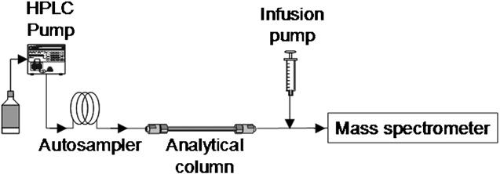
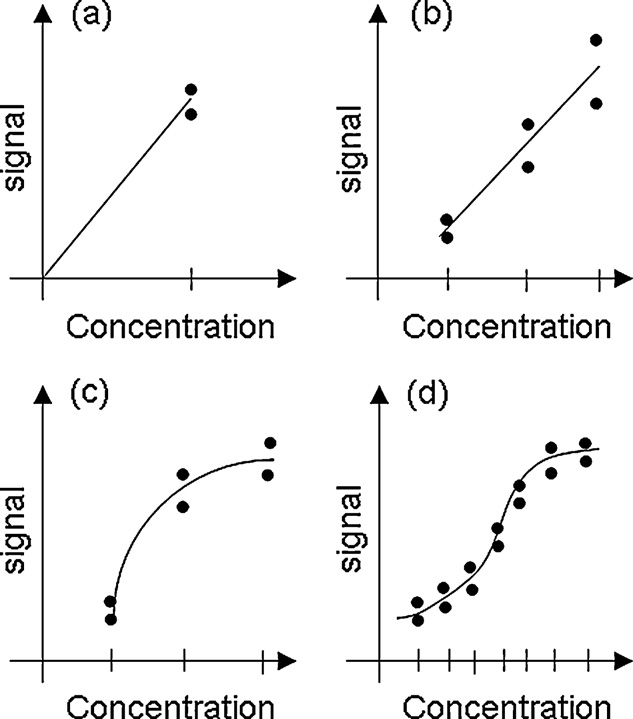
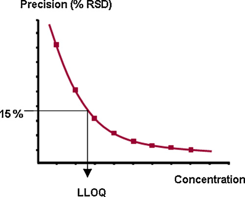
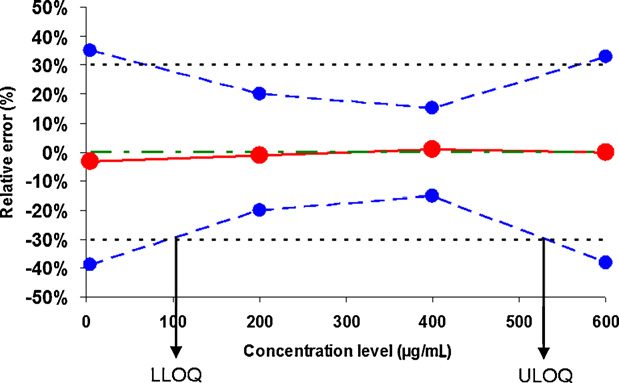
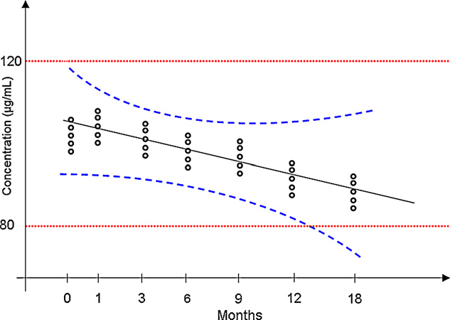

<!-- 方針: ほぼ全訳＋必要に応じた補足。原文（英語・J. Pharm. Biomed. Anal. 総説）の節構成に沿って訳出。図1〜図6は原本PDFからPyMuPDFで埋め込み画像を xref 抽出し（キャプション矩形との位置関係で対応を検証）Read で内容確認のうえ全訳キャプションで埋め込んだ。表1は全数値を転記。「> 補足:」は訳者注。 -->

## 書誌情報

- 原題: Advances in validation, risk and uncertainty assessment of bioanalytical methods
- 著者: **E. Rozet\*** ᵃ ¹・R.D. Marini ᵃ・E. Ziemons ᵃ・**B. Boulanger** ᵇ・**Ph. Hubert** ᵃ
  - ᵃ リエージュ大学 薬学部 CIRM 分析化学研究室（ベルギー リエージュ）
  - ᵇ Arlenda s.a.（ベルギー リエージュ）
- 責任著者: E. Rozet（Laboratory of Analytical Chemistry, Institute of Pharmacy, Université de Liège, CHU, B 36, B-4000 Liège／eric.rozet@ulg.ac.be）
- ¹ ベルギー F.R.S.-FNRS ポスドク研究員
- 掲載: *Journal of Pharmaceutical and Biomedical Analysis* **55** (2011) 848–858. DOI: 10.1016/j.jpba.2010.12.018
- 受理: 2010年10月20日受付／12月9日改訂／12月10日受理／12月21日オンライン公開
- 種別: **総説（Review）**
- キーワード: バイオ分析法バリデーション／結果の正確性（Results accuracy）／検量線（Standard curve）／実試料再現性（Incurred sample reproducibility）／測定不確かさ（Measurement uncertainty）

> 補足: 著者陣は前ページの [SFSTP パートIV] とほぼ重なる（Hubert・Rozet・Boulanger）。ただし **B. Boulanger の所属が Arlenda s.a. になっている**点が目を引く。Arlenda は Boulanger が創業した統計コンサルティング企業で、まさに本稿で論じられる手法を製薬企業に提供している。
>
> 本稿は SFSTP の4部作とは性格が違う。4部作が「**我々の手法はこうだ**」という提案だったのに対し、こちらは「**既存のガイドライン（特にFDA 2001）の記述をどう読むべきか**」を整理する総説である。ガイドラインの言葉づかいの曖昧さが、実務のリスクにどう跳ね返るか——という視点で貫かれている。

## 要旨（Abstract）

**バイオ分析法バリデーションは、開発した方法が日常適用において正確な結果を提供する能力を評価するための必須の段階**であり、それによって、その方法で下される重要な意思決定を信頼できるようになる。

バイオ分析法バリデーションの実施を助けるガイドラインはいくつか存在するものの、**バイオ分析法バリデーションの判定基準と方法論の意味と解釈を明確にする必要がなお残っている**。実際、バリデーションガイドラインについても、また判定基準の定義についても、**異なる解釈が可能**である。これは、これらの基準を満たそうとして実装される**実験計画が多様になる**ことにつながる。最終的に、これらのガイドラインからは**異なる意思決定の方法論も読み取れる**。したがって、**バリデート済みのバイオ分析法が将来の目的に適合しないというリスクは、分析者個人のガイドライン解釈に依存する**ことになる。

本総説の目的は、**方法バリデーションのいくつかの本質的側面を議論・強調すること**であり、対象はクロマトグラフ法に限らず、**バイオ医薬品産業でその役割を増しているリガンド結合アッセイ（LBA）** にも及ぶ。

検討する点は、共通の判定基準——**選択性・検量線・真度・精度・正確性・定量限界と範囲・希釈整合性・分析物安定性**——である。**定義・方法論・実験計画・判定基準**を検討する。

方法バリデーションと密接に関連する他の2点も検討する。**実試料再現性（ISR）試験**と**測定不確かさ**であり、これらはバイオ分析結果の信頼性と高度に結びついている。**これらを追加的に実装することで、目的に適合しないバイオ分析法をバリデートしてしまうリスクを大幅に減らせる**と予見される。

## 1. 緒言（Introduction）

分析法バリデーションは、開発した方法が日常適用において正確な結果を提供する能力を評価するための必須の段階である。実際、**適切な品質あるいは信頼性のある結果がなければ、方法の日常適用中に下される重要な意思決定は信頼できないものとなり**、新薬の効果の過大・過小評価、患者状態の不適切なモニタリング、臨床試験の誤った結論などにつながる。

過去15〜20年間、方法バリデーションは多くの議論の対象であった。バイオ分析法バリデーションに関する一般的指針は **1990年の AAPS/FDA ワークショップ** [1] で与えられた。**2000年**には、バイオ分析法のバリデーション [2]、および高分子向けアッセイの特別な場合 [3] を扱う新しいワークショップが開催された。**2001年**、米国食品医薬品局（FDA）は、よく知られた**バイオ分析法バリデーションのガイダンス文書**を公表した [4]。

最近では **2006年**、小分子と高分子の両方についてバイオ分析法バリデーションの主題を刷新するために新しい AAPS/FDA ワークショップが開催され、**コンセンサス・ホワイトペーパー** [5] に至った。関心のある読者は、バイオ分析法バリデーションと規制の決定的な歴史を [6] に見出せる。

**欧州にバイオ分析法バリデーションの指針が欠けていること**を認め、**欧州医薬品庁（EMA）は 2008年12月にこの主題に関するコンセプトペーパー**を公表した [7]。このコンセプトペーパーは明らかに FDA ガイダンス [4] に依拠しており、それは今やバイオ医薬品産業によってほぼ一般的に**ゴールドスタンダードの方法バリデーションアプローチとして受け入れられている** [8]。この動きは、バイオ分析法バリデーションガイドラインを世界的に議論・調和させるという国際的な機運につながった [9]。

しかしながら、バイオ分析法バリデーションガイドラインを世界的に標準化する試みが進行中であっても、**バイオ分析法バリデーションの判定基準と方法論の意味と解釈を明確にする必要がなお残っている。**

実際、**バイオ分析法バリデーションには固有のリスクがいくつか存在する。**

- **第一のリスク**は、FDA ガイダンス [4] や最近の FDA/AAPS ホワイトペーパー [5] のような**バリデーションガイドラインについてなされうる異なる解釈**にある。判定基準の定義について様々な解釈が可能であり [10–12]、これらの基準を満たそうとして**多様な実験計画が実装され** [11, 13, 14]、これらのガイドラインからは**異なる意思決定の方法論も読み取れる** [14–16]。したがって、**バリデート済みのバイオ分析法が将来の用途に適合しないリスクは、これらのガイドラインの主観的解釈に依存する。**
- 加えて、方法バリデーション研究において**添加（スパイク）した生体マトリックス試料を一般的に用いること**は、少なくとも**重要な被験者間変動を無視する**ことによって、実際の実試料の分析に不適切なバイオ分析法をバリデートしてしまうリスクを高めうる [17, 18]。
- 最後に、**最良のバリデーションアプローチを適用しても、バイオ分析法から得られる結果は不確かさを免れない**。この文脈で、各分析結果に関連する**測定不確かさ** [19] を知ることも、これらの結果を規制順守限界や製品規格限界と比較する際の不適切な解釈のリスクを減らしうる。

本総説の目的は、方法バリデーションのいくつかの本質的側面を議論・強調することである。

> 補足: 緒言の論理構成が明快である。**「ガイドラインはある。しかし解釈が分かれる。解釈が分かれると実験計画も判定も分かれる。したがってリスクは分析者個人の読み方に依存してしまう」** ——規格の存在が品質を保証しないことを、はっきり言っている。
>
> そして著者らが挙げるリスクの3層が重要である。①**ガイドラインの解釈**（同じ文書から違う結論）、②**添加試料の限界**（実試料の被験者間変動を捉えられない → ISR で補う）、③**結果そのものの不確かさ**（→ 測定不確かさで定量する）。本稿の構成そのものがこの3層に対応している。

## 2. バリデーションの判定基準

### 2.1 選択性（Selectivity）

**「選択性（selectivity）」と「特異性（specificity）」という用語はしばしば互換的に使われるが、その意味は異なる** [20–26]。**選択性は段階づけできるもの（graded）であるのに対し、特異性は絶対的な特性**である。**特異性は究極の選択性**とみなせる [20, 23, 27]。この理由から、**選択性のほうが好ましく、推奨される用語**である。

いかなるバイオ分析法も干渉を受けうる。したがって、**まず分析法の選択性を文書化することが決定的に重要**である。選択性とは、**バイオ分析手順が分析物を干渉成分から識別する能力を、文書によって実証すること**である。通常は「**存在すると予期されうる成分の存在下で、分析物を明確に測定し識別するバイオ分析法の能力**」と定義される [4]。

典型的には、これらには**代謝物・不純物・分解物・マトリックス成分**などが含まれうる [4]。これらの干渉は、研究対象の生体マトリックスの構成成分から生じうる。それらは研究対象の個体の特性——動物なら**年齢・性別・人種・民族**、植物なら**発達段階・品種・土壌の性質**——に依存しうるし、**環境曝露**（UV光・温度・相対湿度といった気候条件）にも依存しうる。臨床研究では**併用薬**も潜在的干渉の原因となりうる。バイオテクノロジー製品では、**原料バイオマテリアルの供給源の変動**も干渉化合物の基盤となる。**容器の種類や保存剤**も行列効果の原因となりうる [28]。

#### 選択性を実証する方法

方法の選択性の実証と文書化は、いくつかのアプローチで行える。

**第一のアプローチ**は、**ブランクマトリックスにおける検出器信号の不在を実証する**ことである [1, 2, 14, 29–35]。現行の FDA バイオ分析法バリデーションガイダンスは、**方法の選択性を実証するために少なくとも6つの独立したマトリックス供給源を用いること**を要求している [4]。

しかし、研究対象マトリックスの多様性から生じる潜在的干渉源のすべてが、検討した6供給源に存在するわけではないことは明白である。したがって、**異なる研究グループは 10〜20 の異なるブランクマトリックス供給源を分析することを推奨してきた** [14, 30]。これらのブランク血漿は、潜在的干渉化合物を自然には含まない場合、**それらを最大想定濃度で添加すべき**である（例: 臨床研究で併用投与される薬物、主要代謝物など）。ブランク血漿の信号を、**予期される定量下限（LLOQ）で目的分析物を添加した血漿の信号と比較する**ことで、方法の選択性を文書化できる。

**分離技術については、直交する分離モード（orthogonal modes of separation）** が手順の選択性の文書化に役立つ。直交分離モードの例としては、**逆相HPLCと順相HPLC、クロマトグラフィーと電気泳動**がある。2つの直交分離モードを用いて**同じ数のピークが存在することが示されれば**、方法の選択性を文書化する良い出発点となる。

**UV検出を用いる方法**では、**ダイオードアレイ検出器**によって得られたクロマトグラム中の主要ピークの**ピーク純度**を確認できる。**質量検出器**でもピーク純度を評価でき、通常は目的のクロマトグラフィーピークの**開始・頂点・終了における質量スペクトルを分析**する。

方法の選択性を評価する**もう1つのアプローチ**は、**干渉の完全な不在を実証しようとするのではなく、少量の干渉化合物を許容する**ものである。このアプローチも、**最大20の異なるマトリックス供給源**を、追加の潜在的干渉化合物および研究対象分析物をその定量下限（LLOQ）で添加して分析することを要求する。**選択性は、LLOQ において結果の真度・精度、したがって正確性がなお許容できるとみなされることを実証すること**になる [14, 30]。

一部の著者は、クロマトグラフ法について、**ブランクマトリックス中で分析物の保持時間における干渉化合物のピーク応答が、定量下限試料の応答の最大20%以下であるべき**とも提案している [36]。

#### 行列効果（Matrix effect）の評価

**ハイフネーテッド MS(-MS) 技術では、行列効果が無視できるどころではない**ことがよく知られている [18, 37–40]。MS信号に対するマトリックスのこの影響は、通常、方法開発中に**連続的なポストカラム注入（post-column infusion）**（**図1**参照）を用いて研究され、カラムから溶出する干渉化合物がイオン化を**抑制または増強**する際の検出器信号の低下・増加をモニターする [41–48]。これは例えば、**試料前処理とクリーンアップ手順の選択を方向づける**。

**方法バリデーションでは、この行列効果の確認を有益に追加できる。** Matuszewski ら [18] は、**3つの異なるタイプの試料**における分析物の信号を測定することによって、この行列効果を評価する方法論を提案した。

- **タイプ1**: マトリックスを含まない標準
- **タイプ2**: 異なる供給源のブランクマトリックスを抽出し、**抽出後に**分析物を添加したもの
- **タイプ3**: 同じ供給源のブランクマトリックスに**抽出前に**添加したもの

そして彼らは次のように定義する。

| 指標 | 定義 |
|---|---|
| **行列効果（ME）** | タイプ2の応答 ÷ タイプ1の応答 |
| **回収率（recovery）** | タイプ3の応答 ÷ タイプ2の応答 |
| **プロセス効率（process efficiency）** | タイプ3の検出器信号 ÷ タイプ1の信号 |

Matuszewski ら [18] が提案した方法論は、最近 **Marchi ら** [49] によって、**抽出収率（EY）** を評価できる補足溶液を追加することで改良された。これは**多分析物同時定量の場合に特に有用**である。この改良では、第4のタイプの試料を分析する。

- **タイプ4**: マトリックスを含まない標準を**抽出操作にかけたもの**

**EY はタイプ4の応答 ÷ タイプ1の応答**として定義される [49]。

興味深いことに、Matuszewski ら [18] は、**この行列効果を少なくとも5つの異なるマトリックス供給源で調査すること**を提案した。最後に彼らは、**試料マトリックスと抽出回収率の変動の複合効果を、アッセイ結果の品質——すなわち結果の正確性——について評価すべき**であると強調している [18, 50]。

行列効果を評価・測定する代替アプローチとしては、**異なる供給源のマトリックス中で調製した検量線の傾きの変動を比較する** [50]、あるいは**これら外部検量線の傾きを、試料に対して行った標準添加法と比較する** [39] というものがありうる。

**リガンド結合アッセイ（LBA）** でも同様に、選択性の欠如は信号の増強・抑制を誘発しうる（結合タンパク質・内因性類似体・併用薬・類似クラスの免疫グロブリンなどによる）。こうした状況での行列効果の評価も、**潜在的干渉化合物なしのマトリックス試料と、それらが様々な濃度レベルで存在する場合とで、薬物分析物のアッセイ結果を比較する**ことによって実施できる [51–53]。

見てのとおり、**複数のマトリックス供給源を用いて、バリデーション対象アッセイの選択性を調査することがますます不可欠**になっている。この選択性評価は、**定性的側面（適切な分離・干渉の不在・信号の増強や抑制の不在など）に限定されるべきではなく、方法の定量的性能、主としてアッセイが生成する結果の品質にも及ぶべき**である。

> 補足: Matuszewski の3試料法（+ Marchi の4番目）は、LC-MS/MS のバイオ分析では標準的な手順になっている。要点は**「行列効果」と「回収率」を分離して測る**ことにある。
>
> - タイプ2/タイプ1 = **イオン化の抑制・増強**（マトリックス成分がイオン源で悪さをする分）
> - タイプ3/タイプ2 = **抽出でどれだけ失われたか**
> - タイプ3/タイプ1 = 両方を合わせた**プロセス全体の効率**
>
> この切り分けができないと、「信号が低い」原因が抽出なのかイオン化なのか分からず、改善の打ち手を誤る。
>
> なお、FDA が要求する「6供給源」に対して、著者らが「10〜20」を推奨している点は実務的に重い。血漿の個体差（脂質量、併用薬、溶血の有無）は大きく、6検体では代表性が心もとない。

### 2.2 検量線（Standard curve）

バイオ分析手順の検量線とは、**指定された範囲内における、応答（信号——曲線下面積・ピーク高さ・吸光度など）と試料中の分析物濃度（量）との間に存在する関係**である。

この検量線（キャリブレーション曲線）は、**信頼できる測定——すなわち後述する正確な結果——を与える、単純な単調（すなわち厳密に増加または減少する）応答関数**によって記述されるのが望ましい。用いる検量標準は、一般に**マトリックス適合かつ分析物適合**であるべきである。すなわち、**日常分析で遭遇するのと同じブランクマトリックスに、研究対象分析物を添加して調製する**。

**検量線は「直線性（linearity）」の基準としばしば広く混同されている** [10]。**直線性の基準は、「導入した量」と「検量線から逆算した量」の関係を指す。これは「装置応答」と「濃度」の関係を指す検量線とは異なる。**

#### 2.2.1 検量線の種類

**線形関数を系統的に強制することは要求されておらず、しばしば無関係であり、測定結果に大きな誤差をもたらしうる**（例: LC–MS/MS やリガンド結合アッセイを用いるバイオ分析法では、直線範囲が作業範囲や投与範囲と異なりうる）[54, 55]。**分析測定におけるバイアスと不精確さの重大な原因は、検量曲線の統計モデルの不適切な選択によって引き起こされうる** [56]。

2001年5月に発行された FDA のバイオ分析法バリデーションガイダンス [4] は、「**濃度－応答関係を適切に記述する最も単純なモデルを用いるべきである**」とのみ要求している。用いる分析技術に応じて、検量線を得るためにいくつかの関数が使える。

**最も一般的なのは通常最小二乗（OLS）線形回帰**であり、**最も単純なのは単一濃度レベルを用いて原点を通らせる線形回帰**である（**図2**参照）。この最後のものの適用可能性はバイオ分析では珍しくなく、**多くの場面で多点検量と比較して比較的良好に機能する** [57]。

OLS 線形回帰は、UV・蛍光・MS(-MS) 検出器を用いる HPLC 法で一般的に使われる。通常は最初の推測であり、適切な検量線を選択する出発点である。**比較的狭い濃度範囲でうまく機能する。**

実際、バイオ分析法が調査する**濃度範囲が広くなると、分散不均一性（heteroscedasticity）が観察され**、OLS 線形回帰の当てはめが不適切になり、したがって分析結果が不正確になりうる [56, 58, 59]。したがって代替として、より一般的な**重み付き最小二乗（WLS）線形回帰**が有用となりうる [56, 58, 59]。用いる重みは、**濃度が増加するときの信号分散の増加の速さ**を記述する。よく使われる重みには次のものがある。

$$
\frac{1}{x^{0.5}},\quad \frac{1}{x},\quad \frac{1}{x^{2}},\quad \frac{1}{y^{0.5}},\quad \frac{1}{y},\quad \frac{1}{y^{2}}
$$

ここで $x$ は濃度、$y$ は検出器応答である。

あるいは、**信号および／または濃度の変換**が、適切な検量線を得るのに有用と分かることもある [56]。変換の背後にある考えは複数ある——**信号と濃度の関係を線形化する、残差の分布を正規分布に近づける、分散不均一性を減らす**。それはまず**数学関数の観測データへの当てはめを改善すること**を目的とする。**最も一般的な変換は対数変換または平方根変換**である [60–64]。**Box–Cox 族の変換**も候補となりうる [65–67]。

用いる検出器によって、あるいは広い濃度範囲については、**重み付きあるいは重みなしの、変換ありまたはなしの二次検量線 $y = ax^2 + bx + c$**（図2参照）が使えることもある [56, 64]。**変換と重み付けを組み合わせることは1つの解決策**であるが、そうした組み合わせを行う際には、**変換と重み付けが分散に対して反対の効果をもちうる**ため注意が必要である。したがって、これらの組み合わせによる**悪影響を診断するために残差を監視すべき**である。

**LBA については、検量線は一般にパラメータについて非線形であり、通常はシグモイド型**である。最も使われる検量モデルは、**4パラメータロジスティック（4-PL）モデル**であり、図2に例示される [52, 68, 69]。濃度と検出器信号の関係に**補足的な非対称性**が観察される場合には、**5-PL モデル**も有用でありうる [69, 70]。

これらのモデルでも重み付けが適切でありうるが、一般にクロマトグラフィーベースのアッセイのような物理化学的アッセイで用いられるものより複雑である。分散の関係は通常、**平均応答のべき乗**である。

#### 2.2.2 検量線のための実験計画

検量線の**最小・最大の検量標準が、バイオ分析法がバリデートされうる最大の濃度範囲を定義する**。**外挿はめったに受け入れられない**からである [2, 14, 16, 72, 73]。したがってこれらは、方法の具体的な目的に応じて選ばれなければならない。

ただし、**バリデーション範囲は検量範囲の内側に含まれることもあり**、最終的な方法のバリデート可能な濃度範囲を定義するのは、**用いるバリデーション標準の濃度レベル**である。

**検量線のモデルごとに、最も正確な逆算結果を得るための最適計画がある** [74]。しかし、**効率的な経験則は、標準を互いに等間隔に配置すること**である。これは、4パラメータロジスティック関数のような複雑な検量線についてさえ、**最適に近い計画を与える**ことが示されている [74]。

**濃度レベルあたり少なくとも2反復を分析すべき**であるが、**方法バリデーションと日常分析で同じ手順を用いることが本質的**である [14, 16, 72]。**方法バリデーションにおいて、日常適用で用いるよりも多くの反復・多くの濃度レベルを検量線に使うことは避けるべき**である。

実際、**方法バリデーションは、分析手順の挙動と、日常使用中に生成される結果の正確性を、可能な限り模倣すべき**であることを念頭に置かねばならない。**バリデーションの考えは、適切な検量線が、それを生成するために用いる計画とともに選択されたことを確認することでもある。** 一般に、**濃度レベルを少なくして反復を多くするほうが、その逆より望ましい** [14, 74]。

**D最適計画（D-optimal designs）** は、検量線として用いる数学モデルが十分に分かっているときに求められる。

- **線形モデル**: 最良の精度の分析結果を与える計画は、**2つの極端な検量点** [15, 74]
- **二次モデル**: D最適計画は、**極端な濃度の標準＋検量濃度範囲の中央に1標準** [15, 74]

検量標準に反復を用いることで、**回帰パラメータの推定の品質を改善できる**。

**LBA** については、4-PL が検量線の正しいモデルと仮定するなら、**5〜8の検量濃度レベル**を、レベルあたり **2〜3反復**で用い、パラメータ推定量の精度を高めるべきである [57, 68]。**アンカー検量点**も当てはめを改善するのに有用でありうる。LBA では、**プレート上の検量標準の位置も決定的に重要**である [68]。すべての種類の試料の**完全な無作為化が理想的なシナリオ** [75] ではあるが、実務的には実行不可能であり、**妥協的な計画**が行われうる [68]。

最後に、実務的側面も検量点数の選択を方向づけうる——検量曲線の調製に用いる材料（標準物質・生体マトリックスなど）の**コストと入手可能性**、実試料のスループットを上げるための**ラン数や検量標準に割り当てるスペースの最小化**など。**ただし、これらの基準がアッセイの生成する結果の正確性を損なってはならない。**

#### 2.2.3 適切な検量線の選択

これほど多くの検量線の候補があるなかで、**どうやって良いものを選ぶのか。**

**検量線は、正確な測定を提供する能力によって評価されなければならないことが本質的である。** 分析測定におけるバイアスと不精確さの重大な原因は、検量線の統計モデルの不適切な選択によって引き起こされうる。

**決定係数「R²」・当てはまりの欠如検定（lack-of-fit test）・その他モデルの当てはまりの良さを実証するいかなる統計検定も、情報的であるにすぎず、アッセイの目的に対してはほとんど無関係である** [10, 11, 14, 54, 59, 68, 76–78]。

**適切な検量線を選ぶ一般的な考えは、その曲線（そしてバイオ分析手順全体）が適切な品質あるいは正確性の結果を提供できることを実証すること**である。これは、**検量曲線範囲の全部または一部にまたがる複数の濃度レベルで調製した独立のバリデーション標準を分析する**ことによって達成される。

その後、いくつかの方法論が存在する。第一は、**各バリデーション標準濃度レベルにおけるバイアスと相対標準偏差を、それぞれの信頼区間の有無にかかわらず、事前の受容限界と比較する**ものである [4, 14, 15, 52, 53]。

最後に、複数の著者 [10, 79–81] が、**検量モデルが十分な品質の結果を与えるかを判断するために、統計的許容区間に基づく「正確性プロファイル」を用いること**を導入している。**モデルは、逆算結果の正確性——それがあらゆる定量的バイオ分析法の最終目的である——に基づいて保持または棄却されるべきである。**

> 補足: **「R² は情報的であるにすぎず、目的に対してはほとんど無関係」** ——ここは強い主張だが、正しい。R² が 0.999 でも、その検量線から逆算した濃度が真値から 20% ずれていることは普通に起こる。R² は「点が線に乗っているか」を測るのであって、「逆算した濃度が合っているか」を測らない。
>
> 特に**濃度範囲が広い場合**が危ない。高濃度側の点が大きいので、R² は高濃度側の当てはまりに支配される。低濃度側で大きくずれていても R² はほとんど下がらない。だから**重み付き回帰**が要る。
>
> 判断の基準は一貫している——**「逆算した結果が受容限界に収まるか」**。検量線もこの基準で選ぶ。

### 2.3 正確性 ＝ 真度（バイアス）＋ 精度

#### 2.3.1 真度（Trueness、バイアス）

**真度は系統誤差に関係する** [10, 79, 82–84]。実際、それは**一連の測定の平均値 $\bar{x}_i$**（すなわち、定義された濃度レベルにおける添加QC試料〈またはバリデーション標準〉の平均）と、**参照値 T**（すなわち添加した濃度）との**距離**として表現される。この概念は、**バイアス・相対バイアス・回収率**によって測定される。

**ブランクマトリックスへの添加（スパイク）は、方法の真度を評価する最も一般的な方法**の1つである。ただし他のアプローチも利用可能である。

- **認証標準物質（certified reference material）を用いる**
- **参照法との結果の比較**

可能な場合には、**これらの代替アプローチもアッセイの真度の評価に用いるべき**である [11, 12]。

**FDA のバイオ分析法バリデーション文書 [4] では、真度が「正確性（accuracy）」の概念と混同されているが、これは避けるべきである** [10, 13, 82]。

**「結果」と「平均値」の違いを区別することが本質的**である。**分析手順の結果こそが、まさにその目的である** [10, 79]。**この平均値は、同じ真の含量をもつ結果の分布の中心位置を与えるにすぎず、個々の結果の位置を与えない**（**図3**参照）。敷衍すれば、**バイアス・相対バイアス・回収率は、分析手順が生成する結果の分布の中心を、認められた真値に対して位置づける**ものである。

> 補足: **図3が本稿で最も重要な図**である。左右のパネルが示すのは、
>
> - **(a) バイアスは小さいが、ばらつきが大きい** → 個々の結果は目標円からはみ出す
> - **(b) バイアスは大きいが、ばらつきが小さい** → 個々の結果はすべて円内に収まる
>
> **従来のバリデーションは (a) を合格、(b) を不合格と判定する**（バイアスだけを見るので）。しかし実務で使えるのは明らかに **(b)** である。患者検体を1つ測ったときに、その1個の測定値が使えるかどうかが問題なのであって、100回測った平均が真値に近いことは慰めにならない。
>
> これが「accuracy（総合誤差）で判定せよ」という主張の直感的な根拠である。日本語では accuracy も trueness も「正確さ」と訳されがちなので、**JIS Z 8402 の用語（真度 trueness／精度 precision／正確さ accuracy）** を意識して読み分けるとよい。

#### 2.3.2 精度（Precision）

**精度**（時に不精確さ imprecision とも呼ばれる）は、**標準偏差 (s)・分散 (s²)・相対標準偏差 (RSD)・変動係数 (CV)** として表現される。それは分析手順に結びついた**偶然誤差**、すなわち**結果の平均値まわりの散らばり**を測定する [10, 79, 82, 83]。

FDA の文書 [4] は、「**単一の分析ラン中の精度を評価する within-run／intra-batch precision または repeatability**」と、「**時間を通じた精度を測定し、異なる分析者・装置・試薬・実験室を伴いうる between-run／inter-batch precision または repeatability**」を区別している。

**この文書に見られるとおり、同じ語すなわち「repeatability」が両方のばらつき成分に対して2度使われており、これは分析者にとって確実に混乱の元である。** さらにこの文書は、**単一実験室内のばらつきと異なる実験室でのばらつきを同じレベルで扱っている。**

バリデーション段階で分析手順の2つのばらつき成分を正しく評価するには、**調査した濃度レベルごとの分散分析（ANOVA）が推奨される**。計画がバランスしている限り——すなわち1つの濃度レベルについて系列ごとの反復数が同じである限り——**分散成分の最小二乗推定**が使える。**しかしこの条件が満たされない場合には、これら成分の最尤推定を優先すべき**である [64]。

**既知の分散の式の誤用が今なお広く行われており、分散成分の劇的な過小・過大評価につながりうる**ことは重要な指摘である [53, 85, 86]。

例えば、**表1のデータ**を用いると、**実験が複数日にわたって実施されたという事実を無視して通常の分散の式で室内再現精度を計算すると RSD 値は 5.2%** となるが、**系列効果を考慮する ANOVA モデルを用いると RSD 値は 6.0%** となる。

ここでの分散式の誤用は、**室内再現精度を過小評価しており、「日」効果に含まれる外部の変動源に影響されているにもかかわらず、方法の定量的性能について楽観的すぎる見方を与えている**。**もう1つの誤用は、この併行精度分散を推定するのに全データを ANOVA モデルにかけるのではなく、ある1日から併行精度分散を選ぶこと**であろう。

**表1　室内再現精度の相対標準偏差（RSD）の推定における分散式の誤用を例示するために用いたデータ**

| 反復 | 1日目 | 2日目 | 3日目 |
|---|---|---|---|
| 1 | 34.10 | 32.34 | 30.49 |
| 2 | 34.75 | 31.35 | 29.38 |
| 3 | 33.21 | 32.33 | 30.39 |
| 4 | 33.18 | 33.50 | 29.97 |
| 5 | 34.25 | 32.45 | 31.12 |

規制文書に見られるとおり、**within-run repeatability と between-run repeatability の違いを作るのは「系列（series）」ないし「ラン（run）」の概念**である。これらの系列・ランは、**少なくとも異なる日、場合によっては異なる作業者および／または異なる装置**で構成される。**ランまたは系列とは、一定に保たれた併行精度条件下で分析が実行される期間**である。

この文脈で、**併行精度は、ここで挙げた他のすべての変更可能な分析条件を一定に保った場合の、分析手順の自然な、あるいは本質的な変動**とみなせる。

**ラン／系列を構成する異なる要因を選ぶ根拠は、分析手順の日常使用中に遭遇する条件を模倣すること**である。分析手順が1日だけ使われることはなく、複数の作業者、複数の装置で使われうることは明白である。したがって、**日常実施される分析中に用いられる手順の通常の変動を表す異なる要因が、バリデーションプロトコルに導入され**、分析手順のばらつきの代表的な推定につながる。

**統計的実験計画を定義することで、費用対効果の高い分析時間でこれら要因の主効果を説明するためのラン数・系列数を最適化できる。**

> 補足: 表1の実例が効いている。**同じ15個のデータから、計算の仕方だけで RSD が 5.2% と 6.0% に分かれる**。差は小さく見えるが、受容基準が 15% のときに「5.2% だから余裕」と「6.0% だから余裕」では、真の性能の見積もりが変わる。しかも**誤用のほうが常に小さく出る**（日間変動を無視するため）ので、**必ず楽観側に間違える**——これが問題である。
>
> Excel で `STDEV()` を全データに当てるのが典型的な誤用である。正しくは**濃度レベルごとに一元配置 ANOVA** をかけ、ラン間分散とラン内分散を分けて推定し、室内再現精度 = √(ラン間分散 + ラン内分散) とする。前ページの [Hoffman & Kringle] の表I・表II がまさにその計算手順である。

#### 2.3.3 正確性（Accuracy）

FDA のバイオ分析法バリデーション文書 [4] では、正確性は次のように定義されている。

> 「……その方法によって得られる**平均**試験結果が、分析物の真値（濃度）に近いこと。（……）**平均値は実際の値の15%以内であるべき**であり、LLOQ では 20% を超えて逸脱すべきでない。**平均の真値からの偏差が正確性の尺度**となる。」

**前節までに述べたとおり、この定義は分析法の「真度」に対応する。** バイオ分析法について、**正確性と真度の定義の決定的な違いという問題**は、以前の総説でも既に強調されている [10–12, 14, 79, 87]。

**大半の用途において、真値からの偏差が偶然誤差（精度の欠如）によるものか系統誤差（真度の欠如）によるものかは問題ではない。誤差の総量が許容可能なままである限りは。**

したがって、**偶然誤差と系統誤差の組み合わせである「総合分析誤差（total analytical error）」あるいは「正確性」の概念が本質的**である。さらに、**すべての分析者は、その方法の誤差の総量が試験結果の解釈に影響を及ぼし、その後の意思決定を損なわないことを確実にしたい** [29, 53, 54, 79, 16, 88]。

**真度と精度の基準を別々に評価した判断では、これを達成できない** [89]。**総合誤差の概念を考慮に入れた結果の正確性の評価のみが、その方法が最終目的を達成する能力について、実験室と規制当局の双方に保証を与える。**

総合誤差の計算の詳細は本稿の範囲外であるが、関心のある読者は総合誤差を得るための全計算段階を詳述した文献 [64, 80, 81] を参照されたい。

#### 2.3.4 正確性のための実験計画——真度＋精度

正確性、したがって真度と精度は、**バリデーション標準（VS。これらの試料は品質管理〈QC〉試料と呼ばれることもある。例えば [4]）の分析から推定される**。

これらの VS 試料は、**バイオ分析法の日常適用で研究される実試料のマトリックスと一致すべき**である。実際、それらは**実試料（incurred samples）を可能な限り近く模倣**しなければならない。理想的には、**VS 試料の調製に用いるブランクマトリックスは、検量線の調製に用いたものとは異なるべき**である。手順の日常運用ではそうなるからである。

**最小・最大の VS レベルは、最小・最大の検量標準の内側または等しい範囲で選ばれるべき**である。一般に**外挿を行うことは受け入れられない**からである [4, 5]。また、**バリデーション範囲の中央付近に少なくとも第3の VS レベル**を用いなければならない [4, 5]。

ただし、**期待される LLOQ でのバイオ分析手順の妥当性が不確かに感じられる場合には、最小 VS レベル付近にさらに VS レベルを追加**することが有益でありうる。例えば FDA ガイド [4] は、分析法をバリデートするのに **4つの VS レベル**——**期待 LLOQ に1つ、その3倍に1つ、中央に1つ、最大に1つ**——を用いることを提案している。**LBA アッセイでは少なくとも5濃度レベル**が推奨される [52, 53]。

FDA ガイドおよび最近のホワイトペーパーは、**各 VS レベルで少なくとも5反復を分析すること**を要求している [4, 5]。しかし、**ラン間精度を評価するために実施すべきラン数についての推奨はない**。

**ほとんど意味のあるラン間標準偏差を計算するには、最低3ラン**を用いるべきである。しかし多くの著者は**ラン数を増やすことを提案**してきた。**8ラン** [14]、**少なくとも5ラン** [32, 52]、**6ラン** [53] を提案する者がいる。**NCCLS は、20日間にわたって実施する20ランについて各濃度レベル2反復という計画を提案した** [90]。**LBA でも2反復が最小**として提案されている [53]。

**各ランは、関連する場合には異なる分析者・装置・試薬によって、異なるブランクマトリックス供給源を用いて、異なる日に実施されうる／実施されるべき**であることを想起せねばならない。**これを怠れば、精度、ひいては結果の正確性について人為的に楽観的すぎる推定を与えることになる。**

### 2.4 定量限界（LOQ）と範囲

FDA のバイオ分析法バリデーション文書は、**定量下限と定量上限**を「**精度と正確性をもって定量的に測定できる、試料中の分析物の最低（最高）量**」と定義している [4]。

**LLOQ を推定するにはいくつかのアプローチが存在する。**

**第一のアプローチ**は、よく知られた **S/N（信号対雑音）比**に基づく。**S/N 10:1** が背景雑音から分析物を識別するのに十分とみなされる [91]。

**他のアプローチ**は「**応答の標準偏差と傾き**」に基づく。LLOQ の計算は次のとおり。

$$
\mathrm{LLOQ} = \frac{10\,\sigma}{S}
$$

ここで $\sigma$ は応答の標準偏差、$S$ は検量曲線の傾きである。

**LLOQ を推定するもう1つのアプローチ**は、**期待 LLOQ に近い濃度に対して RSD をプロットする**ものである。**図4**に示すとおり、**LLOQ は RSD が目標最大 RSD 値に対応する濃度**となる [92]。

**これらの LLOQ 推定法は、その重大な落とし穴でよく知られている** [10, 12, 93, 94]。**これらのアプローチはいずれも LLOQ の定義を満たしていない。** 実際、それらは**このレベルにおける真度と精度、したがって正確性の許容可能性を評価することによって LLOQ を推定していない**。

したがって、**そうしたアプローチを用いて LLOQ を定義する場合には、このレベルにおける結果の正確性が許容できることを実証するさらなる実験を行うべき**であり、少なくとも**このレベルにおける方法の精度と真度が適切であることを示すべき**である。

**LLOQ および定量上限（ULOQ）の適切な推定を可能にする最後のアプローチが、図5に例示する正確性プロファイル法**である [10, 74, 79, 88, 95, 96]。実際、この方法論は、**これらの濃度レベルにおいて結果の総合誤差が既知であり許容可能であること——すなわち系統誤差と偶然誤差の双方が許容水準であること——を実証する。**

**定量範囲**は「**濃度－応答関係を用いて、正確性と精度をもって信頼でき再現的に定量できる、ULOQ と LLOQ を含む濃度範囲**」である [4]。したがって、**定量範囲は方法バリデーション中に実施したすべての実験から導かれる。**

> 補足: 図4（精度プロファイル）と図5（正確性プロファイル）の違いが要点である。
>
> - **図4**: 縦軸が **RSD だけ** → 「ばらつきが 15% 以下になる濃度」を LLOQ とする
> - **図5**: 縦軸が **総合誤差（バイアス＋ばらつき）** → 「結果全体の誤差が 30% 以下になる濃度」を LLOQ とする
>
> 図4 の方法だと、**低濃度でばらつきは小さいがバイアスが大きい**場合を見逃す。実際、前ページの [SFSTP パートIV] の不純物の例（レベル1で RSD 23% かつ相対バイアス +33%）のように、低濃度域では両方が同時に悪化することが多い。片方だけ見れば必ず甘い判定になる。
>
> S/N=10 も同様で、**「ノイズから見分けられること」と「正しく定量できること」は別物**である。信号が雑音の10倍あっても、回収率が 50% ならその濃度値は使えない。

### 2.5 希釈整合性（Dilutional integrity）

分析物が **ULOQ を超える濃度で試料中に存在する場合、試料濃度を有効な濃度範囲内に戻すために試料を希釈すべき**である。したがって、**いくつかの希釈手順と希釈倍率をバリデートすべき**である [4, 5, 53]。

**この追加の試料操作が、方法の真度と精度、したがってそのようにして得られる結果の正確性を損なわないことを実証すべき**である。これを実証するため、**ブランクマトリックス試料に ULOQ を超える濃度で添加し、次いで希釈手順にかける**。その後、**方法の精度と真度、あるいは結果の正確性を評価するのと同じ方法論を用いて、希釈整合性を評価すべき**である。

### 2.6 安定性（Stability）

**分析物の安定性の評価は、信頼できるバイオ分析法を得るための前提条件**である。したがって、**少なくとも方法バリデーションの段階で分析物の安定性を評価することが本質的**である。

FDA のバイオ分析法バリデーションガイド [4] および最近の AAPS/FDA ホワイトペーパー [5] は、**異なる段階での分析物安定性の評価**を要求している。それらには次が含まれる。

- **数回の凍結融解サイクル**を通じた生体マトリックス中の分析物安定性
- **ベンチトップ安定性**（すなわち試料調製の条件下）
- **長期安定性**（例えば −20 °C または −70 °C、すなわち試料の保存条件下）
- **オートサンプラー上での試料の安定性**

一般に、**安定性は少なくとも2つの濃度レベル**で、**低濃度と高濃度で添加したブランク生体マトリックス適合試料**を用いて評価すべきである [4, 5, 53]。**分析物が定量される各マトリックスと各動物種で評価すべき**である。

**ベンチトップ安定性は、試験試料が調製される条件を代表するもの**であるべきで、例えば関連する場合には室温および／または冷蔵温度で行う。**凍結融解安定性は一般に3回の凍結融解サイクルで評価**され、**常に、バイオ分析法の日常適用中に試料が取り扱われる方法を模倣すべき**である。

安定性は、**新たに調製した検量標準を用いて回収率を計算すること**によって評価する。回収率は、安定性研究の開始時に評価した試料の公称濃度から、あるいは**安定性試料と同じ公称濃度レベルで各分析時点に調製した品質管理試料を用いて**求める [97]。**各時点で、安定性試料と VS（または QC）試料の双方について少なくとも6反復の分析**が一般に推奨される [97]。

**分析物の安定性を受け入れる一般的な規則**は、**安定性試料と VS（または QC）試料の比をモニターし、個々の安定性試料の比の3分の2が、80〜120% または 85〜115% といった指定の受容限界内に収まることを検証する**ことである [4, 5, 53]。

あるいは、**回収率の平均とその信頼区間が受容限界内に含まれるべき**である。最後に、**保存時間に対する回収率の単純な線形回帰によって分析物の不安定性をモデル化し、その信頼区間とともに、事前に指定した受容限界と比較する**という別のアプローチが提案されている（**図6**に例示）[97]。

**これら最後の2つのアプローチは統計的な同等性検定であり、安定であると誤って結論するリスクを効率的に制御することによって、安定性評価に適切な枠組みを提供する** [97]。

> 補足: 安定性評価を **「同等性検定（equivalence test）」** として扱うのが本節の眼目である。
>
> よくある誤りは、「分解しているか」を**通常の有意差検定**で調べることである。しかし有意差検定の帰無仮説は「差がない」なので、**データが少なければ「有意差なし＝安定」という結論が自動的に出てしまう**。つまり**雑な実験ほど「安定」と結論できる**という倒錯が起きる。
>
> 同等性検定はこれを逆転させ、「差が受容限界内にあること」を積極的に示させる。図6 のように**信頼区間が受容限界の内側に収まっている期間**を安定期間とすれば、データが少なければ信頼区間が広がり、安定期間は短く出る——正しい方向に働く。

## 3. 実試料再現性（Incurred sample reproducibility, ISR）

**実試料（実際の試験試料）の分析は、FDA のバイオ分析法バリデーションガイダンス [4] では正式には要求されていない**ものの、**監査やレビュー中に観察された大きな不一致のため、FDA は実際の状況におけるバイオ分析法のばらつきの評価をますます要求している** [98]。

**異なるラン中に実試料を再分析する際に観察されるこの重大なばらつきは、バイオ分析法のバリデート済みという地位を損なう。** そのため、最近の議論とホワイトペーパーは、**バイオ分析法バリデーション中に実試料再現性（ISR）を含めること**を推進している [5, 69, 97]。

実際、**バイオ分析法バリデーション段階の限界の1つは、それが通常、実際の実試料を多かれ少なかれ模倣するにすぎない添加試料を用いて実施される**ことである。したがって、**これら添加試料は、試験試料や実試料で得られる精度・真度といったバイオ分析法の定量的性能の適切な推定を、有効には提供しないかもしれない。**

**ISR 試験の目的は、バイオ分析法が別の機会に再分析されたときに、試験試料から一貫した結果を生成することを実証すること**である。

現在、バイオ医薬品の実験室で採用されている一般的な受容基準は **「4-6-δ ルール」** であり、**小分子については δ = ±20%、大分子については δ = ±30%** の受容限界とする [99, 100]。これは、**再分析した実試料の3分の2が、元の結果の ±20%（または ±30%）以内になければならない**ことを意味する。

**ISR を試験するには、有効な濃度範囲をカバーするように、また被験者間のマトリックス変動を最大限含むよう十分に異なる被験者から、再試験する試料を無作為に選ぶことが推奨される** [99–101]。

**研究試料の固定した割合を再分析すると定義するのではなく、ISR 試験を不当に棄却するリスクを減らし、ISR 試験を適切に受け入れる確率を高めるように標本サイズを定義すべき**である。これを達成するには、**Hoffman [100] が提案したようなシミュレーション**が使える。

例えば彼らは、**40の実試料という標本サイズであれば、真に再現性のない方法を90%の確率で棄却できる**ことを示した。この標本サイズについて、**真の RSD が 10% の真に再現性のある方法を棄却するリスクは約1%** である [100]。**実試料は、ISR 試験を誤って不合格にするリスクを減らすため、実験室内で実行可能な限り多くの分析ランにわたって分析すべき**である。

**4-6-δ ルールは統計的な判断規則ではなく、その性能は非常に乏しい** [102] が、**他の厳密な統計的方法論が利用可能**である。これらのアプローチは、**真に再現性のないバイオ分析法を誤って受け入れるリスクを厳密に制御する**。それが**許容区間アプローチと確率アプローチ**である [81, 100, 103–105]。

**許容区間アプローチ**は、「**再分析試料の結果 − 元の結果**」の差が確率 β で入る領域を定義する。ISR 試験の場合、**この確率は β = 66.7% に設定できる** [100]。この区間を受容限界と比較する。**Hoffman [100] は 21.2% という受容限界を提案している**（根拠は [100] を参照）。許容区間の統計計算の詳細は [64, 81, 100, 104] に見出せる。

**確率アプローチ**は、「再分析試料の結果 − 元の結果」の差が事前定義の受容限界内に入る**確率を直接推定し、最小品質水準（例えば 66.7%）と比較する**。計算の詳細は [100, 104, 105] を参照されたい。

> 補足: **ISR（実試料再現性）** は、バイオ分析の実務でここ15年ほどで定着した概念である。背景には、FDA の査察で「バリデーションは通っているのに、実試料を再測定すると値が全然合わない」という事例が続出したことがある。
>
> 原因ははっきりしている。**バリデーションは「ブランク血漿に標準品を添加した試料」で行うが、実試料には代謝物・抱合体・併用薬が入っている**。抱合体が分析中に脱抱合すれば親化合物の値が上がるし、代謝物がイオン化を抑制すれば下がる。添加試料ではこれが再現できない。
>
> 判定に使われる **4-6-δ ルール**（6検体中4検体が ±20% 以内）は、前ページの [Hoffman & Kringle] が批判した **4-6-15 ルール**とまったく同じ構造である。本稿が「統計的な判断規則ではなく性能が乏しい」と切り捨て、許容区間アプローチを推すのは一貫している。**Hoffman が提案する受容限界 21.2%** は、2つの独立な測定の差の分散が元の分散の2倍になる（√2 倍）ことから来ている——15% × √2 ≈ 21.2%。

## 4. 測定不確かさ（Measurement uncertainty）

**ISO 測定不確かさガイド（GUM）** [19, 106] が定義する不確かさとは、「**測定の結果に付随する、測定量に合理的に結びつけられうる値のばらつきを特徴づけるパラメータ**」である。

このパラメータは通常、**標準偏差、その所定の倍数、または信頼区間の幅**である。ある係数で**拡張された**この不確かさは、**測定結果の真値が所定の確率で存在する区間**として解釈される。例えば**包含係数が2**の場合、結果が正規分布すると仮定すれば、**真の測定結果がこの区間内にある確率は約95%** である。

測定不確かさについてのより詳しい説明は各種のガイドや論文に見出せる [107–110]。

数行で述べれば、**当初の考えは「ボトムアップ」アプローチ**である。**最終結果に結びついた不確かさの個々の源をすべて決定し、不確かさバジェットを作成し、誤差伝播の法則を通じてこれらの不確かさをすべて合成する**。各不確かさの寄与は、**実験データに基づく（タイプA評価）か、事前に選択した分布を用いる科学的判断に基づく（タイプB評価）** 標準偏差として表現される。

**このボトムアップ手順は、不確かさのすべての源を定義・測定し、最も重要な不確かさ源を減らすことで分析手順の改善を可能にする**という利点をもつ。また、関与する分析プロセスの詳細な理解も可能にする。

**しかし、GUM をバイオ分析の実験室で直接適用するのは面倒で骨が折れると分かっており、バイオ分析の実験室が生き残るために必要な競争力に反する。**

したがって、**「トップダウン」アプローチと呼ばれる他のアプローチが提案されてきた** [107, 111–113]。これらは、**真度・精度・バリデーション・頑健性・実験室間研究**といった様々な研究、あるいはそれらの組み合わせから得られる実験を用いる。**これらのトップダウンアプローチは、費用対効果の高い形で測定不確かさの推定をバイオ分析の実験室に提供できる。**

**バイオ分析法バリデーションがよく設計されていれば——複数の作業者を含み、異なる装置で、異なる分析日に実施されていれば——測定不確かさの推定は適切なものとなるはず**である。一部の著者はさらに、**正確性プロファイルのバリデーション方法論で用いる統計的許容区間と測定不確かさの数学的な関係**を実証している [95]。

**GUM の前提条件は、分析法が系統誤差から完全に自由であるべきこと、そしてそうでない場合には結果をそれについて補正すべきこと**である [19] という点も注意すべきである。**これは、バイアスがない、あるいはバイアスが最も小さい検量曲線を選ぶという方向づけを与えうる。** そして、系統的影響のすべての源を排除したうえで、**不確かさを標準偏差として表現できる**。

**系統誤差のすべての源を抑制することが常に可能あるいは実際的とは限らない場合には、方法のバイアスを不確かさバジェットに含めるべき**である [107, 114–116]。

**測定不確かさは、実試料から得られた日常の結果のまわりに、実際の未知の真の結果を観察する可能性が高い領域を定義する。** 測定不確かさは、**実試料から得られた結果が規格限界や法定閾値に適合しているかどうかを評価すること**によって、バイオ分析法の日常適用において良い位置を占めうる [109, 117–120]。

**しかし測定不確かさが実際に用いられることは稀**である——**ISO 17025 [121] や ISO 15189 [122] の認定を目指す実験室にとっては必須の段階**であるにもかかわらず。

> 補足: 測定不確かさの実務上の意味を一言でいえば、**「78.5 mg/L」と報告するのではなく「78.5 ± 6.2 mg/L」と報告する**ということである。規格が「80 mg/L 以下」なら、78.5 単独では合格だが、不確かさを併記すると**規格を超える可能性が無視できない**ことが分かる。
>
> **ボトムアップ（GUM 式）** は、秤量・希釈・検量・注入……とすべての誤差源を洗い出して合成する。理屈は正しいが、バイオ分析のように工程が長い方法では現実的でない。**トップダウン**は「バリデーションで得た室内再現精度がすべての誤差源を含んでいるはずだ」と考えて、そこから逆算する。実務的にはこちらである。
>
> そして著者らが指摘するとおり、**バリデーションが適切に設計されていれば（複数作業者・複数装置・複数日）、室内再現精度がそのまま不確かさの良い推定になる**。逆に言えば、1人が1日で回したバリデーションからは不確かさは出せない。ここでも「日常を模倣せよ」という本稿一貫の主張に戻ってくる。

## 5. 結論（Conclusion）

**バイオ分析法は、意図された用途への適合性を客観的に実証するためにバリデートされなければならない。**

本総説は、バイオ分析法の主要なバリデーション判定基準——**選択性・検量線・真度・精度・正確性・定量限界と範囲・希釈整合性・分析物安定性**——を評価するために用いられる解釈と方法論を報告し明確化することを目的とした。

**目的に適合しないバイオ分析法をバリデートしてしまうリスクを減らすための、同様に重要な2つの要素**も議論した。

- **第一は実試料再現性（ISR）試験**であり、**実際の日常試料に対するアッセイの一貫性を評価し、それによって分析結果の信頼性を高める**ために推奨される。
- **第二は測定不確かさ**であり、**分析結果が試料の実際の濃度の推定にすぎないことを分析者に想起させる**。したがって測定不確かさは、**適合・不適合を誤るリスクを知ったうえで、分析者が信頼できる意思決定を行うのを助けるために、結果についての疑いを定量化する。**

## 訳者による総括

本稿は「新しい手法の提案」ではなく「**既存の言葉づかいを正す**」ことに力点を置いた総説である。地味だが、実務への波及は大きい。

**最大の論点は accuracy と trueness の取り違えである。** FDA ガイダンス（2001）は accuracy を「平均が真値の ±15% 以内」と定義しているが、それは trueness の定義であり、accuracy（＝真度＋精度＝総合誤差）ではない。図3 が示すとおり、**バイアスが小さくても個々の結果が受容範囲に収まる保証はない**。分析者が知りたいのは「100回測った平均」ではなく「いま手元にあるこの1個の測定値」である。

**分散式の誤用**（表1、RSD 5.2% vs 6.0%）も見過ごせない。誤用は**常に楽観側に外れる**——日間変動を無視するのだから当然である。濃度レベルごとに ANOVA をかけ、バランス計画なら最小二乗、不均衡なら最尤で分散成分を推定する。これだけのことだが、実際には守られていない。

**LLOQ の求め方**についての批判も本質を突いている。S/N=10 も「10σ/S」も、**「そこで正しく定量できるか」を評価していない**。ノイズから見分けられることと、正しい値が出ることは別問題である。正確性プロファイルなら、総合誤差が受容限界を超えない濃度域として LLOQ と ULOQ を同時に決められる（図5）。

**ISR と測定不確かさ**の2章は、バリデーションの外側にある補強策である。添加試料でのバリデーションは実試料の被験者間変動を捉えられないので、実試料を再測定して確かめる（ISR）。そして結果には必ず不確かさが伴うので、それを定量して報告する。どちらも「バリデーションを通ったから安心」という思い込みへの歯止めになっている。

前ページの [SFSTP パートIV] と併せて読むと役割分担がはっきりする——**パートIV が「正確性プロファイルをどう回すか」の実演**、**本稿が「そもそも各判定基準の言葉をどう読むか」の整理**である。そして両方が同じ結論に収束する：**判定は「将来の測定値が受容限界に収まるか」の一点で行え。**

日本の読者への実務的な注意を1つ。**用語の対応は JIS Z 8402 に従うのが安全**である。

| 英語 | JIS Z 8402 | 意味 |
|---|---|---|
| trueness | **真度** | 系統誤差（バイアス）の小ささ |
| precision | **精度** | 偶然誤差（ばらつき）の小ささ |
| accuracy | **正確さ**（総合誤差） | 真度＋精度 |

日本語では accuracy も trueness も「正確さ／精度」と訳されがちで、本稿が問題にしている混同がそのまま持ち込まれやすい。**FDA ガイダンスの「accuracy」を「正確さ」と訳すと二重の誤りになる**——原文が既に取り違えているうえに、訳語でも区別が消えるからである。

## 参考文献

原文 References（全122件）。本文で直接参照される主要文献 1〜30 番を掲げ、31番以降は原文を参照されたい（原本PDFのテキスト層が途中で切れているため、捏造を避けて確認できた範囲のみ掲載する）。

1. V.P. Shah, K.K. Midha, S. Dighe, I.J. McGilveray, J.P. Skelly, A. Yacobi, T. Layloff, C.T. Viswanathan, C.E. Cook, R.D. McDowall, K.A. Pittman, S. Spector, Analytical methods validation: bioavailability, bioequivalence, and pharmacokinetic studies, *Pharm. Res.* **9** (1992) 588–592.
2. V.P. Shah, K.K. Midha, J.W.A. Findlay, H.M. Hill, J.D. Hulse, I.J. McGilveray, G. McKay, K.J. Miller, R.N. Patnaik, M.L. Powell, A. Tonelli, C.T. Viswanathan, A. Yacobi, Bioanalytical method validation—a revisit with a decade of progress, *Pharm. Res.* **17** (2000) 1551–1557.
3. K.J. Miller, R.R. Bowsher, A. Celniker, J. Gibbons, S. Gupta, J.W. Lee, S.J. Swanson, W.C. Smith, R.S. Weiner, Workshop on bioanalytical methods validation for macromolecules: summary report, *Pharm. Res.* **18** (2001) 1373–1383.
4. **Guidance for Industry: Bioanalytical Method Validation**, US Department of Health and Human Services, US FDA, CDER, CBER, Rockville, May 2001.
5. C.T. Viswanathan, S. Bansal, B. Booth, A.J. DeStefano, M.J. Rose, J. Sailstad, V.P. Shah, J.P. Skelly, P.G. Swann, R. Weiner, Workshop/conference report—quantitative bioanalytical methods validation and implementation: best practices for chromatographic and ligand binding assays, *AAPS J.* **9** (2007) E30–E42.
6. V.P. Shah, The history of bioanalytical method validation and regulation: evolution of a guidance document on bioanalytical methods validation, *AAPS J.* **9** (2007) E43–E47.
7. European Medicines Agency (EMA), Concept paper/recommendations on the need for a (CHMP) guideline on the validation of bioanalytical methods, EMA/CHMP/EWP/531305/2008 (2008).
8. G. Smith, Review of the 2008 European Medicines Agency concept paper on bioanalytical method validation, *Bioanalysis* **1** (2009) 877–881.
9. P. van Amsterdam, B. Lausecker, S. Luedtke, Ph. Timmerman, M. Brudny-Kloeppel, Towards harmonized regulations for bioanalysis: moving forward!, *Bioanalysis* **4** (2010) 689–691.
10. E. Rozet, A. Ceccato, C. Hubert, E. Ziemons, R. Oprean, S. Rudaz, B. Boulanger, Ph. Hubert, **Analysis of recent pharmaceutical regulatory documents on analytical method validation**, *J. Chromatogr. A* **1158** (2007) 111–125.
11. D. Stöckl, H. D'Hondt, L.M. Thienpont, Method validation across the disciplines—critical investigation of major validation criteria and associated experimental protocols, *J. Chromatogr. B*（原本参照）
12–30. （選択性・検量線・精度・LLOQ・LBA・行列効果に関する文献群。原本 References を参照）

> 補足: 原本PDFの参考文献欄はテキスト層の抽出が11番の途中で切れており、12番以降の完全な書誌は取得できなかった。**捏造を避けるため、確認できた範囲のみを掲げている。** 本文中の引用番号はすべて原文どおり保持してあるので、原著の References と照合できる。
>
> なお、本文で頻出する主要文献のうち特に重要なものを挙げておく。
>
> - **[4]** FDA バイオ分析法バリデーションガイダンス（2001年5月）——本稿が繰り返し批判的に検討する対象
> - **[5]** AAPS/FDA ホワイトペーパー（2007）——2006年ワークショップのコンセンサス
> - **[10]** Rozet ら（2007）*J. Chromatogr. A* **1158**, 111–125 ——規制文書の分析。本稿の姉妹論文
> - **[18]** Matuszewski ら——行列効果評価のタイプ1〜3法
> - **[100]** Hoffman ——ISR の統計的評価とシミュレーション（本サイト収録の Hoffman & Kringle 2007 と同じ著者）
