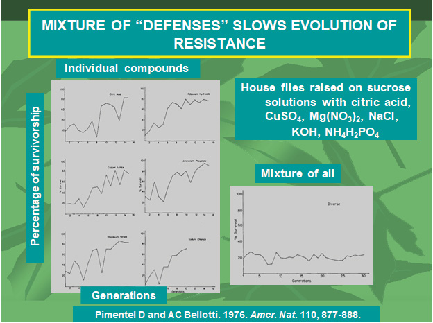

<!-- 方針: ほぼ全訳＋必要に応じた補足。原文（英語・Pharmaceutical Regulatory Affairs: Open Access 原著、CC-BY）の節構成に沿って訳出。図1〜図3は原本PDFからPyMuPDFで抽出（図3は複数の埋め込み画像で1枚を構成するため該当領域をレンダリング）しReadで内容確認のうえ全訳キャプションで埋め込んだ。「> 補足:」は訳者注。 -->

## 書誌情報

- 原題: The Development of Botanical Drugs – A Review
- 著者: **James D. McChesney\*** ¹・**Jinhui Dou（竇金輝）** ²・**Peter B. Harrington** ³
  - ¹ Veiled Therapeutics, LLC（米国ミシシッピ州 Etta）
  - ² Mustang Peak Health, Inc.（MPHi）（米国メリーランド州 Boyds）
  - ³ オハイオ大学 化学・生化学科 Clippinger Laboratories（米国オハイオ州 Athens）
- 掲載: *Pharmaceutical Regulatory Affairs: Open Access* 2019, **8**(2): 1000224. ISSN 2167-7689
- 受理: 2019年8月10日受付／9月24日受理／9月30日公開
- 種別: 総説（Review Article）／**オープンアクセス（CC-BY）**
- キーワード: ボタニカルドラッグ開発／アントラージュ効果／化合物シナジー

> 補足: 著者の顔ぶれがこの論文の性格をよく表している。**McChesney** は天然物化学の研究歴50年で、NCI の抗がん剤探索プログラム時代からパクリタキセル等に関わってきた研究者。**Dou Jinhui** は **FDA CDER のボタニカル審査チーム（Botanical Review Team）の元メンバー**で、後述する「Guidance for Industry: Botanical Drug Development」の策定側にいた人物である。**Harrington** はケモメトリクス（多変量解析による化学データ解析）の専門家。
>
> つまり本稿は「①天然物の薬としての価値を語る人」「②FDAの規制側で実際に審査していた人」「③品質を数値で担保する解析手法の人」が組んで書いた総説であり、**理念・規制・分析技術の3層をひとつながりに読める**構成になっている。日本の漢方エキス製剤やサプリメントを「医薬品」として海外展開しようとする場合の、地図として使える内容である。

## 要旨（Abstract）

本稿は、**植物（ボタニカル）製剤を承認医薬品（医薬品）として開発する価値と、そのための戦略**についての根拠を提示した。そうした製剤は歴史的に多くの（大半の）伝統医薬の基盤となってきたが、通常は、**その安全性と有効性、そして重要なことに「一貫性」——患者ごとに、また時間を通じて再現的に、予測可能な臨床成績を提供すること——を確認できるような形で臨床開発されてこなかった**。我々は、これらの属性を達成しうる過程を概説する。ボタニカルドラッグが解決に貢献しうるアンメット・メディカル・ニーズは数多く存在する。

## 緒言（Introduction）

植物は数千年にわたり、我々の疾患を治療するために用いられる薬用化合物の主要な供給源であり続けてきた。**1900年代初頭まで**、植物由来医薬品——主として植物材料から直接得られた混合物の製剤として——は、世界中で医薬品の主要な供給源を占めていた。今日でさえ、世界保健機関（WHO）によれば、**世界人口のおよそ3分の2から4分の3が、プライマリ・ヘルスケアのニーズを薬用植物製剤に依存している**。

これら複雑な混合物における有効成分の重要性が認識されたことが、有機化学・生理学・薬理学が医療実践への重要な貢献者として発展する契機となった。選ばれた天然物の構造の単離と同定によって、合成有機化学が医薬品への重要な貢献者となり、天然物をモデルとした数多くの重要な医薬品が開発され始めた。**ヤナギ樹皮のサリチル酸に基づくアスピリンの開発**は、その古典的な例である。

20世紀初頭、重要な寄生虫症に対して多数の化学化合物を試験し、有効性を観察したことから、**パウル・エールリヒは「魔法の弾丸（the Magic Bullet）」の概念**を提唱するに至った [1, 2]。1930年代には、微生物が他の微生物の増殖・発達を阻害する物質を産生するという観察が「**抗生物質の時代**」とその医療利用の引き金となった [3]。これらの天然物質は、かつてヒトの早期死亡の主因であった感染症を適切に治療することを通じて、人類に深遠な影響を与えた。その結果、過去100年間で寿命の顕著な延伸が起こった。これら新たに発見された薬剤の有効性と安全性は、**魔法の弾丸パラダイムへの我々の信念をさらに強固にした** [4]。

微生物発酵を利用して医療応用向けの天然物を生産することと、合成有機化学の高度化の進展は、1940年代から1980年代にかけて、**医薬品としての植物由来物質への関心を大きく駆逐した**。重要なことに、単一化学物質を剤形へ標準化することの容易さ——それによって投与量に対する予測可能な結果が得られること——が、そうした医薬品製剤への移行をさらに後押しした。それでもなお、創薬・医薬品開発における天然由来物質の重要性は、Newman と Cragg が2012年に公表した解析によって、依然として強く裏づけられていた [5]。

> 補足: ここでいう「一貫性」「予測可能な投与結果」という論点が、本稿全体の背骨である。**単一化合物なら「1錠100 mg」と書けば誰が飲んでも同じ量が入る。植物混合物ではそれが自明ではない。** 医薬品として認められるかどうかの分かれ目はここにある——という認識が、以下の議論すべての前提になっている。

植物由来天然物の研究への関心は、アカデミアに委ねられるようになった。しかし米国の国立がん研究所（NCI）は、抗がん医薬品の発見・開発のための植物由来天然物研究の中核プログラムを維持した。1960年代から1990年代にかけての **Taxol（パクリタキセル）** の発見と開発は、史上最も成功した抗がん剤として、天然物創薬への関心を一時的に再燃させた [6]。

この関心は、**コンビナトリアルケミストリー**やコンピュータによる分子モデリングと、生体分子モデル（受容体・酵素など）のハイスループットスクリーニングを結びつけた新しい創薬アプローチ、そして最近では分子遺伝学・免疫学への理解の深化によって、再び置き換えられた。製薬産業における植物由来天然物の重要性は、抗生物質の発見以来、数十年をかけて著しく衰退し、今日では実質的に消滅している。

**単一化学物質の薬剤に対する耐性の出現**——医薬品（抗生物質耐性感染症・薬剤耐性マラリア・薬剤耐性結核ほか多数）であれ、殺虫剤（殺虫剤耐性の蚊や作物害虫）であれ、除草剤（作物中の除草剤耐性雑草）であれ——は、魔法の弾丸パラダイムに疑問符を突きつけてきた、あるいは突きつけつつある [7]。**耐性の出現を克服する新戦略の開発のために、新規の活性リードを同定する緊急の必要がある。**

1940年代・50年代の「奇跡の」抗生物質、そして1950年代から1970年代にかけての抗がん剤パクリタキセルほかの発見によって劇的に示されたように、**自然こそがそうした独自かつ新規のリード発見の第一の源泉である**。世界的に著名な天然物研究者の第一人者、Norman Farnsworth 博士が強調したように、「**植物の世界、そして実にあらゆる天然の供給源は、想像力に富む先進的な企業を待ち受ける、事実上未開拓の新薬の貯蔵庫である**」[8]。

原型的医薬品の発見における植物由来天然物の役割は、**植物が化学的手段によって環境と相互作用している**という観察から生じる。植物は化学物質によって自らを守り、送粉者を引き寄せる。それらの相互作用は非常に効果的である。植物は場所に根を張っているため、化学的な防御物質を産生することで自らを守る機構を進化させてきた。

これらの化学物質の機能は、その環境における植物の競争力を高め、より成功させ、ひいては子孫を繁殖させる機会を作り出すことにある。何十万もの植物種があり、そのすべてが多数の個別の化学的防御物質と、近隣生物との相互協調のための化学的シグナリングを産生しているため、**医薬品応用のための評価対象として選べる化学構造タイプは文字どおり数百万種類存在する**。また、これらの物質は「**自然のコンビナトリアル化学品**」を表しており、**薬理学的有用性について進化的にすでにスクリーニングを受けている**という利点をもつ、と論じることもできる。

以下の3化合物は、新しい医薬品を定義した植物由来天然物の、近年の重要な例である。

- **パクリタキセル（Paclitaxel）**: セイヨウイチイ *Taxus brevifolia* の樹皮から単離されたジテルペン。過去数十年で開発された最も重要な抗がん剤である。現在利用可能な抗腫瘍薬のなかで独特なのは、**チューブリン重合を促進**し、その機構により有糸分裂毒として作用する点である。
- **トポテカン（Topotecan）**: より近年に承認された抗がん剤で、*Camptotheca acuminata* から単離されたアルカロイドである天然物**カンプトテシン**の誘導体。これも独自の作用機序をもち、**トポイソメラーゼI阻害剤**として機能する。

## 文献レビュー（Literature Review）

### 混合物は耐性の発現を抑える——3つの実証

薬剤耐性マラリア株は、世界中で年間数十万人の命を奪っている。薬剤耐性マラリアに有効な、より新しく安全な薬剤の開発に向けて、多大な努力が続けられている。そのために研究者たちは、再び植物由来天然物に立ち返った。

何世紀にもわたり、**青蒿（Qinghao、*Artemisia annua*、クソニンジン）** として知られる植物の抽出物が、中国伝統医学において脳性マラリアを含むマラリアの治療に用いられてきた。中国の研究者は、青蒿の活性成分を、**セスキテルペン・エンドペルオキシドという珍しい構造をもつアルテミシニン**として単離・同定したことを報告した。アルテミシニンの半合成誘導体は現在いくつかの国で承認されており、**クロロキン耐性マラリア治療の第一選択薬**となっている。

残念なことに、予想されたとおり、**我々はこれら重要な薬剤に対する耐性の発現を目にしている**。耐性発現の重要な要素は、**単一化学物質の薬剤への依存**である。天然物製剤の組成を検討するとき、自然は我々に強いメッセージを発している。それらは**多数の化合物の混合物**であり、しばしば我々が「有効主成分」と認識するものと近縁の化合物を含んでいる。

これら天然物が病原体や捕食者から身を守る役割を果たしていること、そして標的生物による耐性発現が起こらないことは、**混合物が耐性発現の防止に重要な貢献をしている**ことを我々に示唆するはずである。混合物が耐性の発現を抑制または防止する役割を支持する多数の観察が公表されている。

**(1) イエバエの実験（1976年）**——古くは1976年に **Pimentel と Bellotti** が、培養下で飼育したイエバエに対する毒性化学物質の混合物に対して、耐性発現が防止されることを報告した研究を公表した（**図1**）。

**(2) Bt毒素の共発現（2003年）**——より近年では、**Zhao ら**が、複数の形態の *Bacillus thuringiensis*（Bt）毒素を作物植物のゲノムに組み込むと**耐性発現が抑制される**という観察を公表した（**図2**）[9]。

**(3) ニームエキス対アザジラクチン**——天然物殺虫剤である**アザジラクチン**を単剤として、その原料植物の抽出物を「活性成分」等濃度で含む形と比較評価したところ、同様に**抽出物の混合物のほうが耐性発現を抑制した**（**図3**）。

> 補足: この3つの図は、それぞれ**まったく異なる生物・異なる毒性物質・異なる年代**の実験でありながら、同じ結論に収束している点が重要である。
>
> - 図1: イエバエ × 無機塩・有機酸（1976年）
> - 図2: コナガ × Bt毒素タンパク質（2003年）
> - 図3: アブラムシ × 植物由来殺虫剤（年代不明）
>
> 「混合物なら耐性が出にくい」というのが、特定の系に固有の現象ではなく**一般的な原理**であることの傍証として並べられている。理屈は単純で、単一標的に対する耐性変異は1つ獲得すれば効くが、**複数の異なる標的に同時に耐性を獲得する確率は、それぞれの確率の積になるので桁違いに小さい**——医療でHIVやがんに多剤併用療法（カクテル療法）を使う理由とまったく同じである。
>
> なお図1・図2はスライド（プレゼン資料）から取り込まれた画像で、元グラフの解像度が低く軸目盛の細部までは読み取れない。ここでは図の趣旨と出典が明示されている範囲で訳出している。

### アントラージュ効果

クロロキン耐性マラリア治療のためのアルテミシニンの発見と開発は画期的と喧伝され、発見者は2015年のノーベル医学生理学賞を受賞した。しかしながら、アルテミシニンの広範な使用は、WHOが他の抗マラリア薬との併用を推奨していたにもかかわらず、**耐性の出現をもたらした**。

最近、**Pamela Weathers 博士の研究室**が、WHO推奨併用薬による標準的アルテミシニン療法を**2コース失敗した患者を、無傷の *Artemisia* 葉製剤が治癒させた**ことを実証する研究を公表した [10–12]。

一連の最近の刊行物において、中国の研究者らは、**単離された有効主成分の製剤**と、**同じ有効主成分を等濃度で含む伝統的な全草抽出物**を実験動物（げっ歯類）に経口投与した際の、薬物動態上の帰結を比較してきた [13]。

彼らは**一貫して高いバイオアベイラビリティ**を実証し、興味深いことに、強力ながん化学療法剤である**パクリタキセル**の臓器組織分布を検討したところ、**抽出物は経口バイオアベイラビリティを最大10倍にまで有意に増加させただけでなく、検討したすべての臓器へのパクリタキセルの分布も増加させた**ことを見出した [13]。

無傷の葉の材料や全草抽出物に存在する化合物の混合物は、どのようにして製剤の有効性に影響しうるのか。可能性は数多くある——存在する化合物が「有効主成分」の活性に**相加的あるいは相乗的に**作用しうる。それらの化合物が**吸収・分布を高め、あるいは有効主成分の代謝を修飾**しうる。それらの化合物が**感染因子や望ましくない種の耐性機構を抑制**する働きをしうる。まだ同定されていない有効性増強機構が他にも存在するかもしれない。

この観察された有効性の増強は「**アントラージュ効果（the entourage effect）**」と呼ばれてきた [14]。

> 補足: **entourage** は「取り巻き・随行団」の意。有効主成分の周りにいる“脇役”たちが、実は効果を底上げしているという含意である。もともとは1998年に **Ben-Shabat ら**が内因性カンナビノイド系で見つけた現象——それ自体は不活性な脂肪酸グリセロールエステルが 2-アラキドノイルグリセロールの活性を高める——に付けられた名前で [14]、その後カンナビス（大麻）研究を中心に広まった。
>
> 漢方の文脈で言えば「君臣佐使」や「相須・相使」の考え方と、着眼点としては重なる。本稿が興味深いのは、それを**薬物動態のデータ（バイオアベイラビリティ10倍）**という西洋薬理学の言語に翻訳して提示している点である。

細胞毒性のある化学療法剤の場合、より大きなバイオアベイラビリティ（血中濃度）によるにせよ、組織保護的な排出機構（**ABCトランスポーター**）の抑制によるにせよ、**より大きな全身分布は、有効性の増大につながりうる一方で、副作用毒性の増大というリスクも高める**。これはがん化学療法の主要な律速因子である。

植物ベースの製剤（ボタニカルドラッグ、さらには栄養補助食品として人気の植物素材＝「ニュートラシューティカル」）への一般の関心、そして全米を席巻するマリファナ合法化（医療用大麻）の潮流は、**植物ベースの医薬製剤の開発を再訪すべきである**ことを強く支持している。

## ボタニカル——「新しい」医薬品カテゴリー

FDAが提供するガイダンスは、**ボタニカルドラッグ**を「**植物材料・藻類・大型真菌、またはそれらの組み合わせを含む植物性材料を成分として含有し、医薬品として使用される製品**」と定義している。（注: 「ボタニカル」成分は「医薬品」や「栄養補助食品」のカテゴリーに限定されない [15]）。

ボタニカルは——現在も過去も——**化粧品・食品・食品原料、さらには栄養補助食品原料**であってきた。**医療機器**（例: 歯科用アルギン酸塩）や**生物学的製剤**（アレルゲンワクチン等）でもありうる。製品スポンサーがそのボタニカル成分で何をしたいかに基づいて、**製品が医薬品の法的定義を満たすとき、米国においてボタニカルは医薬品となる**。

大半のボタニカル（おそらくサイリウム〈オオバコ種皮〉と、ごく限られた数の他の成分を除く）は「**新薬（new drug）**」となる。米国において、医薬品への意図された使用について GRAS（Generally Recognized as Safe、一般に安全と認められる）と既に認識されていないためである。これは、「**食品への使用を意図した GRAS 成分**」と判定された成分（栄養補助食品向けの「GRAS」ボタニカルがこれに該当する）が、「**医薬品への使用を意図した GRAS**」としては適格とならない、という意味である。

以下に述べるとおり、「新薬」として、ボタニカルの圧倒的多数は **IND（治験薬申請）／NDA（新薬承認申請）のプロセス**を経て開発される必要がある。

ボタニカルドラッグは、**溶液（例: 茶）・粉末・錠剤・カプセル・エリキシル・外用剤・注射剤**（これらに限らない）として利用可能／製剤化されうる。**明示的に除外される**のは、発酵産物、高度に精製された（あるいは化学的に修飾された）植物性物質、遺伝子組換え植物、アレルゲンエキス、およびボタニカル成分を含有するワクチンである。

> 補足: この「除外リスト」が実務的には決定的である。**パクリタキセルもトポテカンも、高度精製された単一分子なので「ボタニカルドラッグ」ではない**——通常の低分子医薬品として扱われる。ボタニカルドラッグ制度が対象にするのは、あくまで**混合物のまま医薬品にする**場合である。
>
> 米国では、同じ植物素材が「意図された用途」次第で 食品・栄養補助食品・化粧品・医薬品・医療機器・生物学的製剤のどれにもなりうる。**モノの性質ではなく、何を主張して売るかで規制区分が決まる**——この考え方は日本の薬機法における「医薬品該当性」の判断（いわゆる46通知）とも通じるところがある。

### 新薬としてのボタニカルの臨床開発

ボタニカルドラッグの臨床開発プロセスについての、より広範で詳細な議論は **Dou ら** [16] に見ることができる。

**ボタニカル原料**（すなわち単一植物種の植物部位、または部分精製されていてもなお1つ以上の分子クラスを含む抽出物）は、**ボタニカルドラッグ製品として研究できる**。スポンサーは、**単一植物の単一部位に由来するボタニカル製品について、各分子実体の臨床効果を確立する必要はない**——複数化合物の固定配合剤であれば要求されることである。

FDAは最近、**固定配合剤規制を修正**し、様々なボタニカル原料に由来する多数の異なる成分を含有する特定の複雑なボタニカルについて、**各ボタニカル原料の全体への寄与を実証するという要件を免除しうる**ようにした。多数の成分（例: 4〜5以上）がある場合、組み合わせ論的に、主効果とその交互作用を評価する要因計画研究（例: ABCD > ABC, ABD, BCD, ACD…）は**単純に実行不可能**だからである。

> 補足: これは漢方処方をFDA承認薬にしようとするときの、最大級の障害が1つ取り除かれたことを意味する。従来の配合剤規制では「各生薬が効果に寄与していることを示せ」と要求される。生薬が5種類あれば、抜き差しの組み合わせは 2⁵−1 = 31 通り——**それぞれについて臨床試験を回すのは現実的に不可能**である。この免除規定によって、「配合全体」で有効性を示せばよいことになった。本サイトに収録している PHY906（黄芩湯）や双黄連口服液のような多生薬製剤の開発を、実際に可能にした変更である。

### ヒト臨床研究にINDが必要となる場合

ボタニカル製品は、**その意図された用途と表示のされ方**に基づいて、医薬品としても栄養補助食品としても規制されうる。

一般に、食品／栄養補助食品として販売されているボタニカルを用いるヒト研究に **IND（治験薬申請）** が必要かどうかは、意図された用途が**構造・機能クレーム（IND不要）** なのか **疾病クレーム（IND必要）** なのかによるのであって、**製品の物理的・化学的性質によるのではない**。

抗酸化活性・免疫調節・COX-2阻害といった、特定の細胞機構や薬力学的応答を評価する研究については、INDが必要かどうかは、**その臨床データが当該医薬品の将来の表示や市販での使用を支持するために用いられるか**、および**安全性の懸念があるか**に基づいて判断されうる。

例えば、栄養補助食品がヒトの正常な構造・機能に及ぼす影響の関係を研究するようデザインされた臨床試験（例: ガラナ〈*Paullinia cupana* Kunth の種子〉と最大酸素摂取量）や、栄養補助食品がそうした構造・機能を維持する機序を特徴づける試験（例: 食物繊維と便通の規則性）は、**INDのもとで実施する必要はない**。

〔現在販売されている、あるいは食品・栄養補助食品・化粧品としての使用を意図する生薬製品について、特定のヒト研究にINDが必要かどうかの照会は、FDA（INDsFoodsDietarySuppCosmetics@fda.hhs.gov）に連絡することが推奨される〕

提案された臨床研究において、**疾病またはその関連状態を治療・軽減・予防するための医薬品として使用される場合、ボタニカル製品にはINDが必要となる**。INDのもとで実施される研究のレビューは、FDAがその研究が適切にデザインされ安全性の懸念に配慮していることを確保する助けとなる。特に、患者管理に重要な影響をもつ大規模かつ高コストの試験については、FDAからの助言が、生成される臨床データが提案された用途を支持し、あるいは効果を実証するために有用となることを確保する助けとなりうる。

### 早期相試験を支えるボタニカルガイダンスの基本原則

ボタニカルドラッグの初期治験に対する基本要件は、**ボタニカルに固有の特徴と、その開発における実務上の課題**（例: 有効成分が不明あるいは定量困難な複雑混合物であること、実質的な既存のヒト使用経験が存在すること）を考慮に入れている。

原則として、**FDAが承認するすべての新薬に要求される製品品質の基準と、有効性・安全性のエビデンス**は、米国で医薬品として販売されることを意図した新規ボタニカル製品にも同様に適用される。これらの基準は、**有効性と安全性の実証については比較的単純明快でありうる**が、**製品品質の保証については、ボタニカルが「有効化合物が既知でないかもしれない混合物」であるという事実を考慮に入れる必要がある**。

規制上の意図は、**ボタニカルのために別個の治療薬カテゴリーを作ることではなく**、非ボタニカル医薬品に存在するのと同程度の信頼を、その品質と臨床的有用性について確保することにある。

### INDのもとでの最初の試験

**任意の第1相試験（Optional phase 1 studies）**: 既存のヒト使用経験のない低分子の治験とは異なり、ボタニカルドラッグの治験は、開発プログラムにおける**第1相・第2相試験の時期や順序について、より大きな柔軟性**をもつ。広範なヒト使用経験のある多くの市販ボタニカルについては、新規分子実体に典型的な第1相試験は必要でないかもしれない。

したがって、**多くのINDスポンサーは第1相試験を飛ばし、患者における第2相比較試験を開始して、ボタニカルドラッグ候補の有効性の予備的エビデンスを求めることができる**。用量は通常、栄養補助食品や生薬医薬の応用における既存のヒト使用経験から示唆されるものを用いる。無作為化・並行群・複数ボタニカルの固定比（固定用量配合剤とも呼ばれる）の、用量反応試験は、ボタニカルの初回試験として特に有用でありうる。

**第2相試験の開始（Initiation of phase 2 studies）**: 生薬医薬または栄養補助食品として使用されてきた製品についての、既存のヒト使用経験の解析——症例報告、その他の非対照の歴史的データ、文献に報告された予備的試験を含む——は、**正式な第1相試験を先行させることなく、INDのもとで第2相試験を開始することの安全性を支持する有用な情報を提供しうる**。既存の経験は、特定の疾患適応症、用量設定、INDのもとでの比較試験の根拠についての情報も提供しうる。

第2相試験によって示唆されたボタニカル製品の臨床的ベネフィットを、後の臨床試験で実証することが目的である場合、**製品の組成**（例: 生薬／ボタニカル原料の数と各生薬の重量）と、**ボタニカル製品の調製に用いる工程**（例: 抽出を伴う場合の溶媒対生薬比）を、後期相の比較試験を実施する前に決定し適切に管理する必要があることは明らかである。

十分な安全性情報をもつ市販の栄養補助食品は、第2相試験に入りうる。ただし一般に、**第3相試験にはより大量の、複数かつ合理的に一貫したバッチの製品が必要となる**。

市販のOTCボタニカル製品を研究することを選択した研究者は、特に類似製品が複数入手可能な場合、**正しい製品を選択するという困難な課題**にしばしば直面する。栄養補助食品／生薬医薬のメーカーは、合理的に十分特性が明らかにされた製品と、関連する品質・工程情報をスポンサーに提供することに同意しない、あるいは提供できない可能性があり、IND提出のための参照データを提供できないこともある。品質に関連する変数や他の多くの因子が臨床結果を変えうるため、**第2相試験の有望な結果は、他の研究によって裏づけられるべきである**。

生物学的アッセイが利用可能であれば、早期の段階から用量選択とバッチ間一貫性の評価を助けうる。確立された有効な治療法が存在する重篤な疾患については、ボタニカルドラッグのスポンサーは初回試験に「**アドオン（add-on）デザイン**」を用いることが推奨される。すなわち、ボタニカルドラッグとプラセボを、それぞれ標準治療に上乗せして比較する。これにより **3群試験**——プラセボ、プラセボ＋標準治療、プラセボ＋ボタニカルドラッグ候補——が構成される。

> 補足: 原文の3群の記述は "placebo, placebo plus standard of care, and placebo plus botanical drug candidate" となっており、**3群目は "standard of care plus botanical drug candidate" の誤りと思われる**（そうでなければ被験薬の群が存在しない）。原文の表記をそのまま訳出したうえで指摘にとどめ、**数値や記述を補って修正することはしない**。
>
> アドオンデザインの意義は倫理面にある。有効な標準治療がある重篤疾患で、被験者をプラセボ単独に割り付けるのは倫理的に許容されない。そこで**全員に標準治療を与えたうえで、被験薬 vs プラセボを上乗せ比較する**。本サイト収録の PHY906 の臨床試験（イリノテカン＋PHY906 vs イリノテカン＋プラセボ）がまさにこの型である。

### CMC（化学・製造・品質管理）の課題

ボタニカルについての既存のヒト使用経験は、合成医薬品でヒト曝露歴がない場合に要求されるのと比べて、**スポンサーが提供するCMC・非臨床薬理・毒性データを著しく少なくして**臨床試験を開始することを支持しうる。例えば、**スポンサーは、複数の分子クラスを含む可能性が高い複雑なボタニカル抽出物について、さらなる精製や有効成分の同定を要求されない**。

しかしながら、純粋な非ボタニカル医薬品とは異なり、**原薬・製剤に対する典型的なCMC管理では、ボタニカル製品には不十分でありうる**。後期相の医薬品開発中のバッチ間一貫性を確保するため、追加のボタニカル原料管理（標準化された**適正農業規範・採取規範〈GACP〉** を含む）が要求される可能性が高い。ガイダンスに概説されているとおり、ボタニカルドラッグのバッチ間・ロット間の一貫性を確保するために追加の方法が推奨される。（ここに概説した製品の化学的特性評価のための統計的方法に加えて、厳格な原料管理・工程管理・関連する生物学的アッセイ、そしておそらく他の手段による「**証拠の総体（totality of evidence）**」である。）

### ボタニカルの後期相臨床開発への進展

一般に、天然由来の複雑な医薬品の試験デザインは、通常は均質で高度に精製された低分子に用いられるデザインと、大きく異なるわけではない。**第3相試験で最も重要な論点の1つは、先行研究から導かれる対照群に対する有効性の推定値に基づく、症例数（サンプルサイズ）の決定**である。スポンサーは、第2相データや非対照データを**過度に楽観的に解釈しない**よう注意が必要である。それによって第3相試験が小さすぎて、治験薬の治療効果を適切に評価できなくなるためである。

ボタニカルやその配合剤のような複雑な天然由来混合物の研究は、**再現性ないし一貫性**の点で独自の課題を抱えている。特に分子レベルでの有効成分が完全には特性評価も定量もされていない場合がそうである。この懸念に対処するため、**「許容可能なレベル」の化学的不均一性をもつ代表的な原薬／製剤バッチ**を第3相試験用に選択すべきである。

**複数用量の設定**——Veregen®（10%および15%軟膏）や Fulyzaq®（Mytesi®）（125 mg・250 mg・500 mg BID＝1日2回）の第3相試験で採用されたアプローチ——は、これらの薬剤が安全かつ有効であることを実証しただけでなく、**ボタニカル製品に存在する小さな制御不能な品質のばらつきが臨床成績に影響しないこと**をも実証した。

### 医薬品承認を支える用量反応効果の実証

ボタニカルドラッグの臨床反応データは、**検討した用量がプラセボまたは実薬対照より有効である（あるいは実薬治療に劣らない）ことを実証するだけでなく、臨床成績への薬剤の効果が用量に対して感受性でないことを示しうる**。したがって用量反応は、**治療効果が異なるバッチのばらつきによって影響されうるかどうかを示す**ために使える。

**無作為化・複数用量・並行群デザインの第3相試験が、複数用量にわたって同様の治療効果を実証すれば、バッチ間の化学組成のばらつきの影響についての懸念は軽減されうる。**

例えば **Veregen®** では、検討した2用量（10%と15%）の間で臨床反応に有意差はなく、両用量とも基剤対照群に対して外性器および肛門周囲の尖圭コンジローマに有意な治療効果を示した。この**本質的に平坦な用量反応曲線**は、原薬組成における一定の自然変動と残存する不確実性が、治療効果にとって決定的とはならないであろうことを示した。

**Fulyzaq®**（HIV/AIDS関連下痢症に適応）の場合、承認判断は、3つのプラセボ対照試験において **125〜500 mg BID の用量範囲で Fulyzaq® を投与された HIV陽性患者 計696名**からの、安全性と有効性の全体的所見に基づいてなされた。

**Fulyzaq® 125 mg 1日2回**群では、プラセボ群と比較して有意に高い割合の患者が臨床反応（**週あたり水様便2回以下**）を経験した（**17.6% vs 8.0%、片側 p < 0.01**）。この反応は 500 mg BID 群のそれと同様であった。

125 mg BID で投与した場合、原薬である**クロフェレマー**の推定消化管内腔濃度は **240 μM** であり、これは本薬の既知の作用機序であるクロライド分泌阻害に必要な *in vitro* 濃度より**何倍も高い**。薬理学的研究は、Fulyzaq® が 125〜500 mg BID で**本質的にクロライドチャネルを飽和させうる**ことも示唆した。したがって、この用量範囲では明確な用量反応は観察されず、また予期もされなかった。

以上を総合すると、複数用量の第3相試験と薬理学的研究は、**作用部位における薬剤の飽和と臨床反応が、第3相試験で使用された薬剤バッチの化学的変動に影響されない可能性が高い**ことを示唆した。本薬の既知の作用機序はまた、Fulyzaq® のバッチ間一貫性の確保を助ける**生物学的アッセイの実装を可能にした**。

> 補足: この節の論法は、ボタニカルドラッグ開発の核心を突いていて美しい。
>
> 通常、「用量反応関係が見えない（＝平坦な用量反応曲線）」のは臨床試験としては悪いニュースである。用量を増やしても効果が変わらなければ、本当に効いているのか疑わしくなるからだ。ところが**ボタニカルの場合、これが逆に武器になる**。
>
> 論理はこうである。① 10%と15%で効果が変わらない ② ならば ±50% の組成変動でも効果は変わらないはずだ ③ **したがって、ロット間の自然な組成ばらつき（せいぜい数%〜十数%）が効果を左右する心配はない**。「成分が完全には分からない」という弱点を、「そもそも効果は組成の細部に鈍感である」という臨床データで正面から埋めている。
>
> Fulyzaq の場合はさらに強く、**作用部位（腸管クロライドチャネル）がすでに飽和している**ことを薬理学的に示している。飽和しているなら、多少成分が増減しても効果は動かない——これは機序に基づく議論なので、単なる経験的観察より説得力が高い。

### 一貫性を実証するための多バッチ第3相臨床試験

ボタニカルドラッグ中のすべての活性成分を分子レベルで同定することは、しばしば実務的でないため、**ボタニカル原薬の成分混合物全体が、一般に有効医薬品成分（API）とみなされる**。ボタニカル原料の組成変動は予期されるものであり、ボタニカル原薬もまた、標準化イチョウ葉抽出物や緑茶抽出物などの精製手順に起因するものを含め、化学組成に変動をもつことが予期される。

高度に精製された均質な低分子医薬品では、不純物が適切に管理されていれば、臨床効果を有効医薬品成分に結びつけることができる。しかし複雑なボタニカル製剤では、**品質と治療効果の両面でバッチ間一貫性をよりよく確保するために、多バッチ・多用量の臨床試験からのデータが必要**である。

低分子医薬品に日常的に適用されるような従来のCMC機構が、不均質なボタニカルその他の天然由来複雑医薬品の品質・治療的一貫性の確保に不十分とみなされる場合、**スポンサーが検証試験用に代表的なバッチをどのように選択するか**が重要な考慮事項となる。ボタニカル製剤がボタニカルドラッグとして承認された場合に、患者への一貫した臨床的ベネフィットを保証するためには、多バッチ・多用量の研究の必要性が決定的となる。

ボタニカルドラッグの第3相試験で使用された複数バッチの品質データは、**承認後の規格設定のための重要なデータを提供しうる**。例えば Veregen® の原薬である**シネカテキン（別名 Polyphenon E®）** は、**カテキン類が総原薬の85〜95%（重量比）** を構成し、そこに **55%超のエピガロカテキンガレート（EGCG）** と他の7種のカテキン誘導体が含まれる、と定義された。

原薬中の総カテキンおよび個々のカテキンの規格は、**臨床バッチの分析データに基づいて設定された**。第3相試験に選ばれるバッチは、**上市予定バッチを代表するものであるべきであり、かつ均質すぎてはならない**——そうでないと承認後の大規模生産が実務的でなくなる。

標準化緑茶抽出物 Polyphenon E® についての文献データを仮想例として用い、臨床研究に複数バッチを選択することの有用性を概説する。

| Polyphenon E® のバッチ | (−)-EGCG | 総カテキン | 出典 |
|---|---|---|---|
| バッチ1 | 65% | 89.5% | Rizzi ら（文献報告） |
| バッチ2（がん化学予防動物試験に使用） | 65% | 89.4% | [18] |
| バッチ3（初期の研究に使用） | **51.4%** | 記載なし | [19] |

バッチ1とバッチ2は、いくつかの微量カテキンの百分率がわずかに異なるだけであった。バッチ3は EGCG の百分率が**はるかに低かった**。

- **もし** 最初の2つの非常に似たバッチによく似た Polyphenon E® バッチを第3相試験に選んだなら、将来の上市バッチのEGCGおよびカテキン規格は、おそらく**非常に狭くなる**であろう。
- **もし** より広いEGCG（例: 51%と65%）およびカテキンの百分率範囲をもつバッチを試験に含め、規格の決定に際して考慮し、かつ**バッチの含量と臨床効果の間に関係が観察されなければ**、承認後のEGCG／カテキン規格は**より広く設定できる**であろう。

比較的多数のバッチが第3相試験で研究される場合、スポンサーは、既知の変数（例: 異なる地域／供給源から採取されたボタニカル原料から作られたバッチ）と観察された組成変動（例: Polyphenon E® の EGCG や他のカテキンといった既知マーカー化合物の指定重量%範囲）の、臨床成績への影響を除外するために、**バッチ効果の解析（batch effect analyses）** を行うことが推奨される。

バッチ解析の目的は、研究において異なるバッチを受け取った被験者に対する、**化学的不均一性の臨床成績への潜在的影響を同定し定量すること**である。効果のバッチ間一貫性を確保する助けとなるバッチ効果解析の重要性にもかかわらず、これらの解析は通常**探索的**とみなされ、**第I種の過誤率（偽陽性率）の制御は正式には要求されない**。各施設で被験者を異なるバッチに無作為割付することが、バッチ効果解析を容易にする。正式なバッチ効果解析が正当化される場合（例: 第3相で比較的多数のバッチを使用し、それらのバッチ間に明らかな不均一性がある場合）、スポンサーはこれらの解析を容易にするよう臨床研究をデザインし、統計解析計画にこれらの解析をどう実施するかを**事前に規定する**ことが重要である。

> 補足: **これは実務者にとって最も価値のある一節**かもしれない。要点を一言でまとめると——
>
> **「第3相試験に均質すぎるバッチばかり使うと、自分の首を絞める」**
>
> 承認後の規格は臨床バッチの実測値から決まる。だから EGCG 65% のバッチばかりで試験をやれば、規格は「65% ± わずか」になり、**その後の製造で少しでも外れたら出荷できなくなる**。逆に、あえて 51% と 65% の両方を試験に入れて「どちらでも効いた」と示せば、規格を 51〜65% と広く取れる。
>
> つまり**臨床試験の設計段階で、承認後の製造の自由度が決まってしまう**。天然物のばらつきを「隠す」のではなく「試験に組み込んで、ばらついても効くことを示す」——発想の転換がここにある。

### 臨床開発中のボタニカル製品の安全性評価

ボタニカルについても、合成品や高度精製医薬品についても、**絶対的な安全性は存在せず**、FDAは連邦規則集（CFR）第21編312.22条に従って、臨床的ベネフィットを考慮しつつリスクを評価しなければならない [20]。

合成品や高度精製医薬品の場合と同様、新規開発されたボタニカルについての最良の安全性データは比較試験から得られるが、慢性適応症については**長期の非盲検継続投与（open-label extension）** も重要となる。慢性疾患については、**ICH E1A ガイダンス**（非生命危機的状態の長期治療を意図した医薬品の臨床安全性評価のための集団曝露の範囲、1995年3月）に従い、通常**6〜12か月以上の曝露期間**が適切である [21]。

### 固定配合剤としてのボタニカル

FDAのボタニカルドラッグに関するガイダンスは、**単一植物種の単一部位に由来するボタニカルドラッグ製品（すなわち単一生薬）は、各成分の治療効果への寄与を実証しなければならない配合剤とはみなされない**ことを示している。

複数生薬の配合であっても、**安全性の懸念がなければ、各生薬の効果への寄与に対処することなく早期相試験を開始できる**。固定配合剤規制は、**伝統医学体系（例: アーユルヴェーダ、中国伝統医学）で用いられるボタニカル配合のような複雑混合物の評価により大きな柔軟性を与えるため、規則案において改訂された**。

複数生薬処方のメーカーは、実務的でない場合（例: 4〜5成分以上を試験する要因計画研究は通常不可能）、**販売承認申請において各生薬が最終製品に寄与していることを実証するよう要求されない可能性がある**。この変更は、しばしば複数の生薬を併用する生薬医薬の、新規ボタニカルドラッグとしてのさらなる臨床開発を促すはずである。

したがって、複雑な複数生薬配合の治療効果を、配合中の各生薬とともに研究することが実務的でない場合、**焦点は成分ではなく配合そのものの臨床開発に置かれるべきである**。

### カンナビス由来のボタニカルドラッグ製品の可能性

カンナビス（大麻）ベースの医薬は、**単一カンナビノイド単離物に対して、全草あるいはフルスペクトラム抽出物こそが選択されるべき医薬である**ことを裏づけつつある。

**GW Pharma の Epidiolex®**（現行のFDA医薬品開発パラダイムのもとで開発された単一成分CBD製剤）のような単一カンナビノイド医薬や、他のCBD単独の植物医薬は、小児のてんかん発作を止める効力が**およそ40%程度**しかない。一方、ある研究では、カンナビス治療のためにコロラド州に移住した家族が **60%の成功率**を達成したことが見出された。これは、低濃度のテトラヒドロカンナビノール（THC）や、カンナビス由来CBD製品に含まれる他のテルペン類など、**追加のカンナビス成分を含む製剤**を使用したためかもしれない。

ブラジルのグループによる公表報告のメタ解析は、**全草製剤がCBD単独製品より最大5倍有効**でありうることを示唆している [22]。

カンナビスは違法な医薬として発展してきたため、初期の研究の多くは、選抜された栽培品種（バラエティ）の名前のみで識別された植物や生の抽出物を用いていた。加工設備や分析ラボへのアクセスが限られていたため、これら初期製品の多くは他の特性評価手段をもたなかった。この初期の「系統（strain）による医薬の特性評価」は、研究者が過去に行われたように**系統によって医療成績を相関づけようとする**流れにつながった。

カンナビスの系統は**ケモバー（chemovar）** としても命名され、CBD・THC・他のカンナビノイド、および微量テルペン成分の濃度・比率など、化学プロファイルに大きな差をもつことが多い。カンナビス中の他の成分にはフラボノイド・精油・テルペノイドなどがある。

THCとCBDの両方が新薬として承認され、かつその化学プロファイルに多様性があることから、**カンナビスのケモバーは新規ボタニカルドラッグ開発の優れた候補**である。その一例が **GW Pharma の Sativex** で、THCとCBDをおよそ **1:1 の比**で含むカンナビス・ボタニカルドラッグであり、**25か国以上で多発性硬化症に承認**されている [23]。しかしながら、進行がん患者の疼痛管理を目的として米国で Sativex を研究する試みは、望まれた臨床的ベネフィットを生み出せなかった。

高THCまたは高CBDのケモバー由来の他の様々なカンナビス製品も、ボタニカルドラッグ開発に適した候補である。膨大な数のカンナビス由来製品を含め、ボタニカルドラッグ開発者にとっての潜在的な利点の1つは、**ボタニカルドラッグのジェネリックコピーを容易には作れない**ことである。**2つのボタニカル製品バッチ間の「同一性」を実証することさえ非常に困難**であり、ましてや2つのカンナビス製品間ではなおさらである。特にCMC情報の多くが通常は営業秘密であるか、公知でない場合はそうである。

### ボタニカルドラッグの化学・製造・品質管理における課題への対処

ボタニカルドラッグ開発を成功させるには、**そのボタニカル製剤が望ましい有効な医療成績をもたらすと予測できることを保証する手段**を開発しなければならない。現行の製薬パラダイムでは、この目標は最終的に、**1つまたは限られた数の成分を軸に定義された特性評価・標準化・投与量**とともに、製造工程の厳格な管理と製剤の分析によって達成される。

**化学的特性評価**は広い用語であり、分析化学の技術と装置を包含する。単一化合物製品（今日の標準的な医薬品）は、**標的分析（targeted analysis）** によって容易に測定できる。有効医薬品成分についての事前知識があるため、分析法が目的の、すなわち標的とする化合物を同定・定量できる。標的分析は、既知の化合物群を同定・定量するために広く用いられている。例えば、カンナビス中のTHCおよびCBD含量は、規制順守のため、品質を測定するため、投与量を標準化するために重要であり、これらの化合物を正確に定量するための標的分析法が開発されてきた。

複雑なボタニカルドラッグの標的分析における1つの問題は、それが**近視眼的（myopic）** であり、現在の知識に制約されることである。新しい活性化合物や成分が発見されると、古いデータベースは陳腐化する。標的化合物の分析とその結果得られる相関は、**標的分析に含まれていない、標的の活性に影響する追加の「隠れた」成分の影響のために、因果関係を定義しないかもしれない**。

**非標的分析（non-targeted analysis）** は、**NIR（近赤外）・UV-vis・NMR・MS** といったスペクトル法を用いて植物材料の化学組成を測定しようとする。スペクトル法は、クロマトグラフィーなどの他の分析技術に比べ、**迅速な分析で豊富な情報を提供し、試料前処理が少なく、消耗品と廃棄物も少ない**という利点をもつ。

スペクトル法による**化学プロファイリング（ケモタイピング）** は、特定の目的化合物ではなく、**薬効特性と相関しうる複雑なスペクトルの「形」（すなわち特徴の分布）** に焦点を当てる。強力な統計技術を活用することで、非標的分析は**化合物が同定される前に、混合物内のパターン・変化・相関を探すことができる**。化学プロファイリングのアプローチは、目的の特性と相関する化合物の位置を特定でき、その後それらの化合物を同定し、研究と投与のための標的分析法を開発できる。

従来のアプローチは、**すべての化合物を同定・単離し、それから個別に活性を試験する**ことを試みるものであるが、ボタニカル材料についてはこれは端的に実行不可能である。

**非標的の化学的フィンガープリンティングは、すでに栄養補助食品業界で使われている**——ボタニカル原料成分は当初、高度な「ゴールドスタンダード」法によって特性評価されるが、**受入原料の合否判定は NIR スペクトルフィンガープリント**によって行われ、混和・誤表示・分解に起因する供給源および製品ストリームの逸脱を検出する。

**Chen ら**は、96ウェルプレート中の抽出物のスペクトルを迅速に収集できる **UVマイクロプレートリーダー**を用いたカンナビスの化学プロファイリングに関する最近の研究を公表した [24]。別の研究では、**ナノエレクトロスプレー高分解能質量分析**をカンナビス試料の特性評価に用いた [25]。この研究では実験計画法を用いて質量スペクトルの前処理を最適化した。クランベリー由来の代謝フェノール類を研究する非標的アプローチでは、**ファジー・クロマトグラフィー質量分析**にエキスパートシステムとバイオインフォマティクスを組み合わせて用いた [26]。**Wang ら**は **NMR分光法**を用いたカンナビスの迅速な抽出・ケモタイピング法を考案した [27, 28]。彼女はまた、カンナビス抽出物を高分解能質量分析計に直接注入する際の前処理の効果も研究した [29]。

### ケモメトリクスによる化学プロファイリングの2つのアプローチ

典型的には、ケモメトリクスによる化学プロファイリングには**2つの一般的なアプローチ**がある。

**(1) モデリング（modeling）アプローチ**——「**一クラス分類（one-class classification）**」とも呼ばれる。

**(2) 分類（classification）アプローチ**——スペクトルを複数クラスのいずれかに割り当てる。

**モデリングのアプローチはスペクトルの形の「類似性」を見つけることで機能し、一般に分類のアプローチほど選択的ではない。** モデリングはしばしば非標的・探索的な解析に用いられる。

**分類は、異なるクラスに属するスペクトルの形の「差異」を見つけることに依拠する。** 差異を用いるため、これらのアプローチはより選択的で、識別能が高い。分類は通常、標的型のアプローチに用いられる。例えば、スペクトルのクラスを**薬理学的に活性か不活性か**に分類する場合である。この場合、活性製品と不活性製品の両方からのスペクトル群が必要となる。

モデリングでは、代表的なスペクトルのセットを収集してモデルを構築する。おそらく最も単純なのは**平均スペクトルの計算**である。次にモデルの周囲に境界を設ける。最も単純な場合には、**平均から最も遠いスペクトルまでの距離**として定義できる。新しいスペクトルが提示され、それが境界の外にあればモデルから棄却され、境界内にあれば受け入れられる。

基本的に、すべてのモデルはこのアプローチに依拠する——モデル自体は平均スペクトルを用いるよりずっと複雑でありうるが。**SIMCA（Soft Independent Modeling of Class Analogies、クラスアナロジーの緩やかな独立モデリング）** が最も一般的であり、そのモデルは**主成分**を基礎としている [30]。

これらのアプローチは、**大規模プロセスストリームのモニタリングのために、工業化学エンジニアによって長年用いられてきた** [31, 32]。他に使用されうる手法には**クラスター分析**や**サポートベクターマシン**がある。

分類では、代表的なスペクトルの複数のセットを、各セットが1つのクラスを代表するように収集する。分類法は、クラス間の差異を増強するモデルを最適化しようとする。おそらく最も古い分類法は**線形判別分析（LDA）** であり、ちなみにこれは**植物分類のために開発された**ものである。

モデリングとは異なり、分類法は多数存在する。よく使われる手法の1つが **PLS-DA（部分最小二乗判別分析）** である。他に流行の手法として、使いやすくパラメータフリーな **SVC（サポートベクター分類器）** や **SVM-Tree（サポートベクターマシン木）** がある。

**警告**——分類法は非常に強力であるため、モデルが**スペクトルに過学習（オーバーフィット）** しうる（すなわちスペクトル中のノイズやベースラインのアーティファクトを使ってしまう）。したがって、**必ず外部の予測セット**（モデルの最適化・構築に一度も使われていないセット）で検証しなければならない。

分類法の問題は、**どのクラスにも対応しない新しいスペクトルが提示されたときに、誤分類されてしまう**ことがある点である。この問題は **Chen と Harrington** によって解決されており、彼らは**モデリング法と分類法をパイプラインに組み合わせた**。パイプラインの入口でモデリング法を用いて、スペクトルが以前に収集されたスペクトルと整合的かどうかを判定する。整合的でなければ**外れ値としてパイプラインから棄却**し、整合的であれば後続の分類法によって標的クラスの1つに分類する。

> 補足: この「モデリング → 分類」の2段パイプラインは、実務的にとても重要な工夫である。
>
> 分類器（PLS-DA など）は、与えられたスペクトルを**必ずどれかのクラスに割り当てる**。だから「見たこともない偽和品」を入れても、平然と「合格品」と答えてしまう。これは品質管理としては致命的である。
>
> そこで前段に SIMCA のような**一クラスモデル**（「これは今まで見たものの範囲内か？」だけを判定するモデル）を置き、範囲外なら「未知」として弾く。範囲内のものだけを分類器に流す。**「知らないものを知らないと言える」システム**になるわけである。
>
> なお LDA が「もともと植物分類のために開発された」というのは、Fisher が1936年にアヤメ（iris）の3品種の判別のために考案した——あの有名な iris データセットのことである。ケモメトリクスの総説らしい小粋な一言。

### AI・メタボロミクスの寄与

現代の装置と高度な統計技術は、**ヒトゲノムの研究と、それを複雑なボタニカルドラッグに相関づけること**を可能にする。**人工知能は、人間の目を逃れるデータの機微から情報を引き出せる**。

こうした研究が重要なのは、**ボタニカル混合物中の化合物間の相乗効果は十分に文書化されている**にもかかわらず、アントラージュ効果を実証する確固たる研究がほとんど行われてこなかったからである。大半の研究は「魔法の弾丸」の概念——すなわち有効主成分が観察された生物活性の責任を負っているという考え——に焦点を当ててきた。

より多くのボタニカルが評価されるにつれ、**我々はおそらく、ほぼ確実に、アントラージュ効果が例外ではなく規則であることを目にするだろう**。この認識は間違いなく、将来のより有効な医薬をもたらし、また**耐性発現を遅らせる、あるいは排除する**助けとなるだろう——ボタニカルドラッグを開発すべき強力な論拠である。

**メタボロミクス**研究もまた、新しいボタニカルの開発を促進している。そうした研究は、環境・季節その他の因子が植物代謝産物の生産に及ぼす影響を検討することを可能にするからである。

*Tithonia diversifolia*（ニトベギク）の場合、メタボロミクス研究によって代謝プロファイルへの環境の影響が明らかにされ、**植物中のフェニルプロパノイド類とセスキテルペンラクトン類の生産の変動が、周囲環境の条件変化への直接の応答**であるように見えることが示された [33]。

他方、ブラジル南東部の10の異なる地域から採取した種子から育て、**同じ圃場で栽培した** *Copaifera langsdorffii* の個体についての代謝研究では、**フェノール性代謝産物の生産に対する環境因子の全体的影響は、*C. langsdorffii* の各グループ間で一様であった**ことが明らかになった [34]。

メタボロミクス研究は、薬用植物種における代謝産物生産に影響する因子を理解し、**ボタニカル生産のための原料の標準化に貢献する**鍵となる道具である。

> 補足: 最後の2つのメタボロミクス研究の対比は、**「地道（geoherbalism、道地薬材）」という概念を科学的に検証している**と読める。
>
> *Tithonia* では環境が代謝プロファイルを直接動かした——つまり「産地が違えば中身が違う」。一方 *Copaifera* では、種子の産地が10通り違っても**同じ圃場で育てれば代謝産物は一様**になった——つまり「遺伝より環境が支配的」。
>
> どちらが正しいという話ではなく、**種によって遺伝要因と環境要因の効き方が違う**ということである。実務的には「この生薬は産地指定が要る／要らない」を実験で判定できる、という意味をもつ。次のセクション（B論文）で扱う「道地薬材のゲノミクス」とも直結する論点である。

## 考察と結論（Discussion and Conclusion）

伝統医薬として使用され、あるいは販売されているものを含め、**複雑なボタニカル由来製品は、なお実行可能なボタニカルドラッグ開発の候補**でありうる。FDAによる **Veregen** と **Fulyzaq** の承認は、業界が学ぶべき良い先例を打ち立てた。

困難なCMCの問題は、**ボタニカル原料の供給源と品質の管理、固定された製造工程、広範な化学分析、およびバッチ間一貫性を確保する生物学的アッセイ**によって適切に対処されうる。

本稿の前半で例示したような**シナジー（相乗作用）** は、ボタニカルドラッグ候補を選択する際の重要な指標となりうる。1つのボタニカル抽出物に由来する複数分子、あるいは複数生薬の配合は、それらが相加的または相乗的な効果をもつならば、**新薬としてより良い可能性をもって開発されうる**。

**文書化されたヒトでのデータの歴史**があれば、スポンサーは有効性（および安全性）の臨床評価に直接進むことができ、それによって**潜在的に長期かつ高コストの前臨床開発を迂回できる**。有効性の早期の臨床エビデンスはまた、**単一新規化学物質の医薬品開発における主要な共通課題である開発失敗のリスクを大幅に低減する**。

我々は、**天然物全般、特にボタニカルドラッグ開発に対して、十分な資金が得られてこなかった**ことを認識している。米国の医薬品基準に沿って医薬品を開発するには実に「本物の資金」が要るが、残念なことに大半の投資家は依然として米国のボタニカルを「食品」や「サプリメント」とみなしている——すなわち、**投資に見合うだけの利益率がそこにはない**、と。

この見方を変えるには、投資家が、投資する製品が**専有的な防護（proprietary insulation）** をもち、現在と将来の規制がその製品を「医薬品」として保護することに確信をもてなければならない。また、**適応症（期待される医療応用）が、大きな見返りを生むのに十分な市場規模を代表する**か、あるいは高収益価格をもつ**オーファンドラッグ**でなければならない。

現在承認されている米国のボタニカルドラッグは、その高収益性のハードルを完全には満たしてこなかった。しかしながら、**独占期間の満了から長く経ってもジェネリック競合が出現していない**ことは、研究者と投資家に、**CMCにおける課題（複雑な組成を含む）が実は「営業秘密」として機能し、精製された低分子医薬品における特許と同様の仕方で、承認されたボタニカルドラッグのイノベーターを保護しうる**ことを気づかせる助けとなるかもしれない。

**ボタニカルドラッグが患者に真の利益を、投資に真の金銭的リターンをもたらしうるアンメット・メディカル・ニーズは、数多く存在する。**

> 補足: 最後の議論は逆説的で面白い。**「品質管理が難しい」ことが、実は参入障壁として働く**という主張である。
>
> 低分子医薬品なら、特許が切れた瞬間にジェネリックが「同一の分子だ」と示して参入してくる。ところがボタニカルドラッグでは、**「同じものだ」と証明すること自体が極めて困難**である。原料の産地、栽培条件、抽出条件、精製工程——どれも組成に効き、そのすべてが公開されているわけではない。結果として、独占期間が切れてもジェネリックが出てこない。
>
> つまり **CMCの難しさ ＝ 特許に代わる事実上の防御壁**。天然物創薬に投資が集まらない最大の理由（＝特許が取りにくい）に対する、実務的な反論になっている。C論文（Berman ら）で扱われる PERA（特許適格性回復法）の議論と、ちょうど裏表の関係にある。

## 訳者による総括

本総説の価値は、**「なぜ混合物なのか」を思想ではなくデータで論じ、そこから規制実務までを一本の線でつないでいる**点にある。整理すると次の3層になる。

**第1層（なぜ混合物か）**——耐性の話である。単一標的への耐性変異は1つで済むが、複数標的への同時耐性は確率の積になるので出にくい。イエバエ・コナガ・アブラムシという3つの独立系での実証（図1〜3）は、これが特定条件下の偶然ではないことを示す。そこにアルテミシニン耐性マラリアに対する全草製剤の症例、パクリタキセルの経口バイオアベイラビリティ10倍という薬物動態データが重なり、「アントラージュ効果」という概念にまとまる。

**第2層（どう承認まで持っていくか）**——FDAの制度設計の話である。ヒト使用実績があれば第1相を省ける、単一植物・単一部位なら配合剤規制の各成分寄与要求が免除される、複数生薬でも要因計画が非現実的なら免除されうる——ここまでは大幅な柔軟化である。しかし品質だけは緩めない。代わりに「証拠の総体」——原料管理（GACP）＋工程管理＋化学分析＋生物学的アッセイ＋多バッチ多用量の臨床データ——で担保する。**平坦な用量反応曲線を「組成変動に鈍感である証拠」として使う**という発想は、この分野固有の知恵である。

**第3層（どう測るか）**——ケモメトリクスの話である。標的分析だけでは「測っていない成分」に足元をすくわれる。スペクトル全体の形を見る非標的分析へ。ただし分類器は過学習しやすく、未知クラスを誤分類する。だから外部予測セットでの検証と、「モデリング→分類」の2段パイプラインが要る。

日本の読者にとって特に示唆的なのは、**Polyphenon E のバッチ選択の議論**だろう。「第3相にどのロットを使うかが、承認後の規格幅を決めてしまう」——これは漢方エキス製剤やサプリメントの海外展開を考える際、開発の最初期に効いてくる論点である。均質なロットで固めたくなるのが人情だが、それは将来の自分の製造を縛る。

なお本稿には、アドオンデザインの3群の記述に誤記と思われる箇所がある（本文の訳注参照）。総説という性格上、個々の主張の一次データは引用元に当たる必要があり、特に図1〜図3はスライドからの転載で元グラフの数値が読み取りにくい。ただし主張の骨格そのものは明快で、出典も明示されている。

## 参考文献

原文 References（34件）

1. Schwartz RS (2004) Paul Ehrlich's magic bullets. *New Engl J Med* **350**: 1079-1080.
2. Strebhardt K, Ullrich A (2008) Paul Ehrlich's magic bullet concept: 100 years of progress. *Nature Reviews Cancer* **8**: 473-480.
3. Aminov RI (2010) A brief history of the antibiotic era: Lessons learned and challenges for the future. *Front Microbiol* **1**: 134.
4. Bosch F, Rosich L (2008) The contributions of Paul Ehrlich to pharmacology: A Tribute on the Occasion of the Centenary of His Nobel Prize. *Pharmacology* **82**: 171-179.
5. Newman DJ, Cragg GM (2012) Natural products as sources of new drugs over the 30 years from 1981 to 2010. *J Nat Prod* **75**: 311-335.
6. Wani MC, Horwitz SB (2014) Nature as a remarkable chemist: A personal story of the discovery and development of Taxol®. *Anticancer Drugs* **25**: 482-487.
7. Ventola CL (2015) The antibiotic resistance crisis: Part 1: Causes and threats. *Pharmacy and Therapeutics* **40**: 277-283.
8. Brahmachari G (2008) Mother nature - An inexhaustible source of drugs and lead molecules. *Natural Products: Chemistry, Biochemistry and Pharmacology*, Alpha Science International Ltd, Oxford, UK.
9. Zhao JZ, Cao J, Li Y, Collins HL, Roush RT, et al. (2003) Transgenic plants expressing two Bacillus thuringiensis toxins delay insect resistance evolution. *Nat Biotechnol* **21**: 1493-1497.
10. Daddy NB, Kalisya LM, Bagire PG, Watt RL, Towler MJ, et al. (2017) Artemisia annua dried leaf tablets treated malaria resistant to ACT and i.v. artesunate: Case reports. *Phytomedicine* **32**: 37-40.
11. Desrosiers MR, Weathers PJ (2018) Artemisinin permeability via Caco-2 cells increases after simulated digestion of Artemisia annua leaves. *J Ethnopharmacol* **210**: 254-259.
12. Munyangi J, Cornet-Vernet L, Idumbo M, Lu C, Lutgen P, et al. (2019) Artemisia annua and Artemisia afra tea infusions vs. artesunate-amodiaquine (ASAQ) in treating Plasmodium falciparum malaria in a large scale, double blind, randomized clinical trial. *Phytomedicine* **57**: 49-56.
13. Zhang XL, Lv JJ, Wang LL, Shao H (2016) Comparison of pharmacokinetics and biodistribution of 10-deacetylbaccatin III after oral administration as pure compound or in Taxus chinensis extract: A pilot study. *Planta Medica* **82**: 230-237.
14. Ben-Shabat S, Fride E, Sheskin T, Tamiri T, Rhee MH, et al. (1998) An entourage effect: Inactive endogenous fatty acid glycerol esters enhance 2-arachidonoyl-glycerol cannabinoid activity. *Eur J Pharmacol* **353**: 23-31.
15. FDA: Botanical Drug Development — Guidance for Industry. https://www.fda.gov/regulatory-information/search-fda-guidance-documents/botanical-drug-development-guidance-industry
16. Dou J, Beitz J, Temple R (2019) Development of plant-derived mixtures as botanical drugs: Clinical considerations. In: *The Science and Regulations of Naturally Derived Complex Drugs* (1st edn), Springer, Heidelberg, DE.
17. Huang SM, Temple R, Throckmorton DC, Lesko LJ (2007) Drug interaction studies: study design, data analysis, and implications for dosing and labeling. *Clin Pharmacol Ther* **81**: 298-304.
18. Fu H, He J, Mei F, Zhang Q, Hara Y, et al. (2009) Lung cancer inhibitory effect of epigallocatechin-3-gallate is dependent on its presence in a complex mixture (Polyphenon E). *Cancer Prev Res (Phila)* **2**: 531-537.
19. Chang PY, Mirsalis J, Riccio ES, Bakke JP, Lee PS, et al. (2003) Genotoxicity and toxicity of the potential cancer-preventive agent polyphenon E. *Environ Mol Mutagen* **41**: 43-54.
20. Code of Federal Regulations Title 21, Part 312. https://www.accessdata.fda.gov/scripts/cdrh/cfdocs/cfcfr/CFRsearch.cfm?CFRPart=312
21. ICH E1A guidance. https://www.fda.gov/media/71180/download
22. Pamplona FA, Da Silva LR, Coan AC (2018) Potential clinical benefits of CBD-rich cannabis extracts over purified CBD in treatment-resistant epilepsy: Observational data meta-analysis. *Front Neurol* **9**: 759.
23. GW Pharma: Sativex. https://www.gwpharm.com/healthcare-professionals/sativex
24. Chen Z, Harrington PB, Baugh SF (2018) High-throughput chemotyping of Cannabis and hemp extracts using an ultraviolet microplate reader and multivariate classifiers. *J Analysis & Testing* **2**: 210-222.
25. Tang Y, Harrington PB (2019) Non integer root transformations for preprocessing nanoelectrospray ionization high-resolution mass spectra for the classification of Cannabis. *Anal Chem* **91**: 1328-1334.
26. Wang YF, Vorsa N, Harrington PD, Chen P (2018) Non-targeted metabolomic study on variation of phenolics in different cranberry cultivars using UPLC-IM-HRMS. *J Agric Food Chem* **66**: 12206-12216.
27. Wang XY, Harrington PD, Baugh SF (2017) Comparative study of NMR spectral profiling for the characterization and authentication of Cannabis. *J AOAC Int* **100**: 1356-1364.
28. Harrington PB, Wang X (2017) Spectral Representation of Proton NMR Spectroscopy for the Pattern Recognition of Complex Materials. *J Analysis & Testing* **1**: 1-13.
29. Wang XY, Harrington PD, Baugh SF (2018) Effect of preprocessing high-resolution mass spectra on the pattern recognition of Cannabis, hemp and liquor. *Talanta* **180**: 229-238.
30. Wold S (1976) Pattern-recognition by means of disjoint principal components models. *Pattern Recogn* **8**: 127-139.
31. Biancolillo A, Marini F (2018) Chemometric methods for spectroscopy-based pharmaceutical analysis. *Front Chem* **6**: 1.
32. Wise BM, Gallagher NB (1996) The process chemometrics approach to process monitoring and fault detection. *J Process Contr* **6**: 329-348.
33. Sampaio BL, Edrada-Ebel R, Da Costa FB (2016) Effect of the environment on the secondary metabolic profile of Tithonia diversifolia: a model for environmental metabolomics of plants. *Sci Rep* **6**: 29265.
34. Motta EVS, Sampaio BL, Costa JC, Teixeira SP, Bastos JK (2019) Quantitative analysis of phenolic metabolites in Copaifera langsdorffii leaves from plants of different geographic origins cultivated under the same environmental conditions. *Phytochem Anal* **30**: 364-372.
