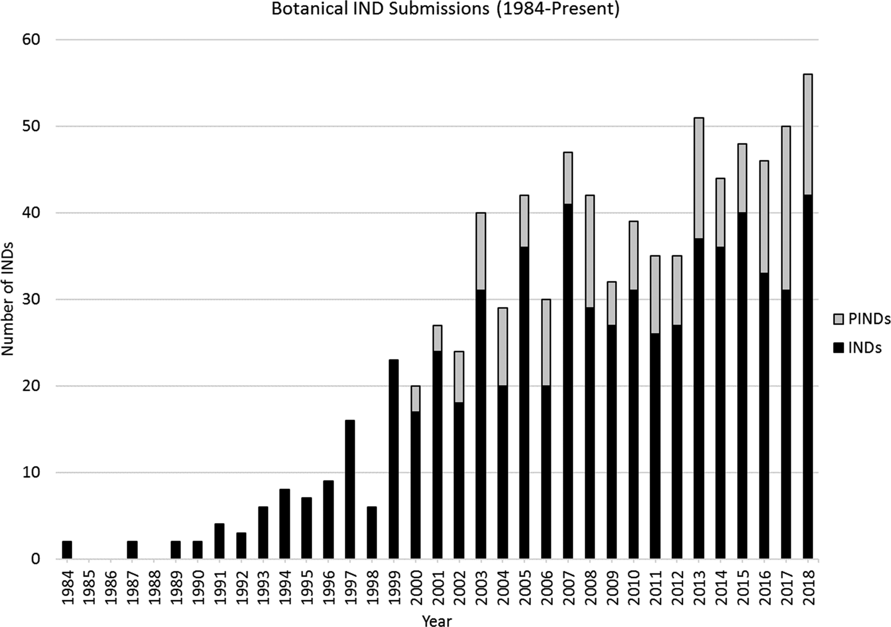
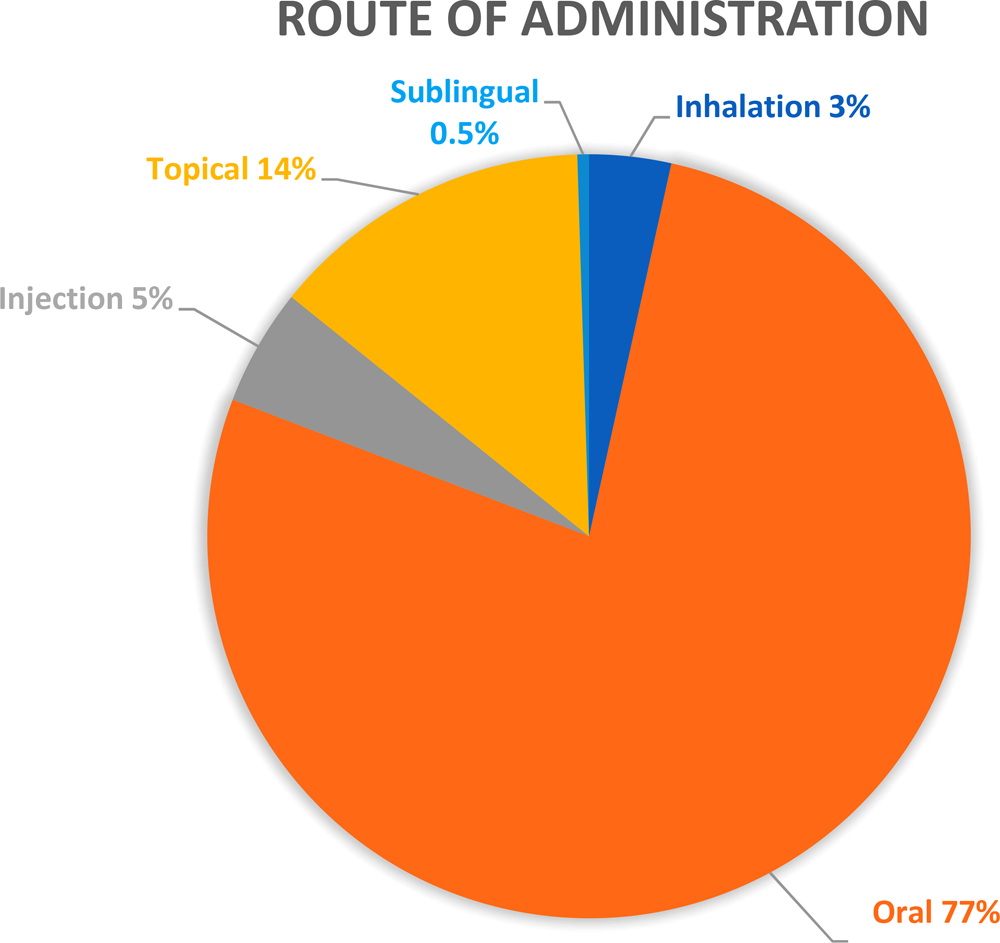

<!-- 方針: 全訳。原本は米国政府職員による著作で米国著作権の対象外。図4点は PyMuPDF で抽出し Read で目視確認済み。原文の節構成（見出し）をすべて保持し、本文・数値・図中の内訳をすべて日本語化した。原文内部の不整合（Figure 1 の「56」の扱い）は訳注で明示する。補足資料 Table S1 は本体PDFに含まれないため取得できていない。「> 補足:」は訳者注。 -->

## 書誌情報

- 原題: **Scientific and Regulatory Approach to Botanical Drug Development: A U.S. FDA Perspective**
- 著者: **Charles Wu**（責任著者）、Su-Lin Lee、Cassandra Taylor、Jing Li、Yen-Ming Chan、Rajiv Agarwal、**Robert Temple**、**Douglas Throckmorton**、Katherine Tyner
- 所属（原文の記載どおり）:
  - **Charles Wu / Cassandra Taylor / Jing Li / Yen-Ming Chan** — 植物性医薬品審査チーム（Botanical Review Team, BRT）、サイエンススタッフ、医薬品品質部（OPQ）直属室、CDER、FDA（米国メリーランド州シルバースプリング）
  - **Su-Lin Lee / Katherine Tyner** — サイエンススタッフ、OPQ 直属室、CDER、FDA
  - **Rajiv Agarwal** — 新薬製品第II課、新薬製品第I部、新薬製品室、OPQ、CDER、FDA
  - **Robert Temple / Douglas Throckmorton** — CDER センター長室
- 責任著者連絡先: Charles.wu@fda.hhs.gov（ORCID 0000-0001-6790-6737）
- 掲載: *Journal of Natural Products* **83** (2020) 552–562（総説, Review）
- DOI: 10.1021/acs.jnatprod.9b00949
- 受理経過: 2019年10月1日受領／2020年1月24日公開
- 著作権: **本論文は米国著作権の対象外**（米国政府職員による著作）
- 利益相反: 著者らは競合する財務的利害関係が無いと申告
- **免責**: 本刊行物は著者らの見解を反映するものであり、**FDA の見解あるいは方針を代表するものと解釈されるべきではない**（謝辞欄の記載）

> 補足: 「**植物性医薬品（botanical drug）**」とは、米国 FDA が定義する**植物由来の複雑混合物をそのまま有効成分とする医薬品**を指す。単一の精製化合物ではなく、複数成分の混合物のまま「薬」として承認される点が、パクリタキセルのような単離化合物とは根本的に異なる。漢方・生薬（TCM、アーユルヴェーダ、Kampo 等）を医薬品として米国で開発する際の入口がこの制度であり、**本稿は FDA 審査当局自身が制度の運用実態と考え方を解説した一次資料**として価値が高い。
>
> 略語の対応は以下のとおり。
>
> | 略語 | 原語 | 意味 |
> |---|---|---|
> | **IND** | Investigational New Drug application | 治験薬申請（臨床試験を開始する許可の申請） |
> | **PIND** | pre-IND meeting request | IND 提出前の相談ミーティング要請 |
> | **NDA** | New Drug Application | 新薬承認申請 |
> | **ANDA** | Abbreviated New Drug Application | 後発医薬品承認申請 |
> | **BRT** | Botanical Review Team | 植物性医薬品審査チーム（2003年設置） |
> | **CDER** | Center for Drug Evaluation and Research | 医薬品評価研究センター |
> | **OND** | Office of New Drugs | 新薬部 |
> | **OPQ** | Office of Pharmaceutical Quality | 医薬品品質部 |
> | **CMC** | Chemistry, Manufacturing, and Controls | 化学・製造・品質管理 |
> | **GACP** | Good Agricultural and Collection Practices | 適正農業規範・採集規範 |
> | **BRM / BDS** | Botanical Raw Material / Botanical Drug Substance | 原料生薬／植物性原薬 |
> | **DSHEA** | Dietary Supplement Health and Education Act (1994) | 栄養補助食品健康教育法 |

## 要旨（Abstract）

米国 FDA は、2018 年に至るまでの期間に **800 件を超える植物性医薬品の治験薬申請（IND）および pre-IND ミーティング要請（PIND）** を受理してきた。現在のデータでは、**提出された IND の適応症は FDA のほぼ全審査部門にわたっている。**

植物性混合物を医薬品として研究する世界的関心の高まりにもかかわらず、**米国で承認された植物性医薬品の新薬承認申請（NDA）は2件のみ**である。すなわち、**2006 年の Veregen** と **2012 年の Fulyzaq（別名 Mytesi）** である。

植物性医薬品の化学的・生物学的な複雑さを踏まえると、**その薬理の特徴づけ、治療有効性の実証、品質の一貫性の担保は、依然として科学的・規制的な課題であり続けている。**

FDA は **2016 年 12 月に改訂版「Botanical Drug Development Guidance for Industry（産業界向け植物性医薬品開発ガイダンス）」** を公表し、**後期試験に関する開発上の考慮事項に対応する**とともに、**植物性医薬品開発を促進するための推奨事項**を提供した。

本稿では、植物性 IND の分析を通じて、**その原料生薬の多様性**（例：由来する地理的地域の違い、単一生薬か複数生薬か）、**これまでのヒトでの使用経験のレベルの違い**、**治療領域**を示すとともに、**植物性医薬品を審査してきた経験と課題の概観**を提供する。

## 序論（Introduction）

**植物性医薬品やその他の天然物は、幅広いヒトの疾患の治療のために、伝統的に生薬（herbal medicines）として何千年にもわたって使われてきた。** 医学の歴史は、**中国・エジプト・ギリシャ・インド・中東**の古代にさかのぼる [1]。

**世界保健機関（WHO）によれば、80% の人々が今なおプライマリ・ヘルスケアを植物由来の伝統医薬に依存しており** [2]、**植物由来医薬品 122 品目のうち 80% は、もともとの民族薬理学的用途と関係している可能性がある** [3]。

**近代医学は、古代以来、数世紀にわたる科学研究と技術革新の結果として、すべての治療領域において著しい進歩を遂げてきた。しかし新薬開発は依然として伝統医薬と結びついており、その大半は植物ベースの治療である** [4–6]。

多くの植物性素材の薬理学的性質は、動物由来医薬品や鉱物のそれと同様に、**多くの初期段階の創薬・開発プログラムの出発点として使われてきた** [7, 8]。伝統医薬の知識と実用は、**薬用植物を新薬候補としてさらに探索することにつながり**、**よく知られた医薬品となった多くの天然由来分子あるいは植物由来分子の誘導体の単離**をもたらした（例：**ジゴキシン、パクリタキセル、アルテミシニン系薬剤**）[9, 10]。

> 補足: 挙げられている3例は、それぞれ性格が異なる。
>
> - **ジゴキシン**——ジギタリス（*Digitalis* 属）由来の強心配糖体。古典的な「薬用植物からの単離」。
> - **パクリタキセル**——タイヘイヨウイチイの樹皮から単離された抗がん剤。本稿が後で「単一化合物を単離・精製して開発する通常のやり方」の代表例として再度言及する。
> - **アルテミシニン**——青蒿（セイコウ、クソニンジン）由来の抗マラリア薬。**屠呦呦（Tu Youyou）が2015年ノーベル生理学・医学賞を受賞**した業績で、文献10がノーベル財団の頁を指しているのはこのためである。**伝統医学の文献（葛洪『肘後備急方』）を手がかりに低温抽出にたどり着いた**という経緯から、「伝統医薬 → 近代医薬」の最も象徴的な事例として引かれる。
>
> ただし**これら3例はいずれも「単離された単一化合物」であって、本稿が扱う植物性医薬品（複雑混合物のままの薬）ではない**。序論はこの対比を作るために単離化合物の成功例を先に並べている。

**植物性素材は自然界において不均一な混合物であり、しばしば明確な活性成分を欠く。そのため、複数の成分が全体の治療効果に寄与している可能性がある。**

植物性混合物に内在する化学的複雑さのために、**植物性医薬品の開発者は、治験薬申請（IND）の臨床試験を開始しようとする際に、一貫した製品品質の保証などの様々な困難に直面することが多い。複数の植物部位および/または複数の植物種に由来する植物性製品は、この困難をさらに増幅させる** [11]。

**しかしながら、多くの植物性製品が千年紀にわたる使用の歴史を持つことは、初期段階のヒト試験の安全性を裏付けるために通常必要とされる新規の動物毒性試験の必要を減らす、あるいは先送りするために、これまでのヒトでの経験を活用する機会を提供する。**

**この状況に対応するとともに、植物性医薬品開発を奨励・促進するために、米国 FDA は 2016 年 12 月にその「Botanical Drug Development Guidance for Industry」を改訂・最終化した** [12]。このガイダンスは、**植物性 IND および NDA の提出に関心を持つスポンサーに対して、申請プロセスと、化学的に複雑な植物性製品がどのようにして FDA の厳格な医薬品審査プロセスを満たしうるかの両方について助言する。**

**本稿では、当局の更新された規制上の期待を提示し、植物性医薬品申請の審査における我々の経験を共有して、植物性医薬品開発の全体像を提供する** [12]。

## 植物性医薬品申請の全体像——現在までの規制状況

米国内では、**企業あるいは研究者は IND を提出することによって臨床研究を開始する許可を得る。** FDA は、**IND が提出される前に当局と連絡を取ることを企業に推奨している。FDA スタッフとの早期のやりとりは、クリニカルホールド（FDA が試験の進行を許可しないこと）の問題が生じるのを防ぐのに役立つ**からである。そうしたコミュニケーションの一形態が **pre-IND ミーティング（PIND）** であり、これは**完全な IND を提出する準備をスポンサーに助言する情報を提供**しうる。

**市販される新薬の規制と管理は NDA プロセスを通じて行われる。** NDA 申請は、**医薬品スポンサーが FDA に対して新しい医薬品の米国内での販売・市販の承認を正式に求める手段**である。**通常 IND のもとで実施される動物試験およびヒト臨床試験で収集されたデータが、NDA の一部となる。**

**植物性医薬品は、低分子医薬品と同じ規制経路の対象となり、同じ経路を進む。**

**2003 年、FDA は植物性医薬品審査チーム（BRT）を設置した。** BRT は、**すべての原 IND・NDA 申請について、原料生薬の分析、これまでのヒトでの使用経験、および植物化学的成分プロファイルの分析を含む、生薬学（pharmacognosy）の観点からの審査**を、あらゆる植物性申請に対して提供する。

**FDA BRT は、植物性 pre-IND・IND・NDA 申請の内部データベースを維持しており、これは 1984 年（植物性 IND の受理が始まった年）から現在までの期間にわたる。** 以下に示すデータは **1984 年から 2018 年まで**に受理された申請に適用され、**投与経路、治療領域、申請の状態と性格（例：商用か研究か）、原料生薬の地理的由来**に基づいて分析されている。

### 年次 PIND/IND 提出数（1984–2018）

**FDA は 1984 年に、限られた数の適応症について植物性 IND の受理と審査を開始した。** より多くの、より複雑な植物性医薬品を受理するにつれ、**FDA は植物由来製品が通常の化学医薬品・生物学的医薬品とは重要な点で異なることを認識した。** そのため FDA は、**植物性医薬品の開発経路と審査プロセスに関する情報を提供するために、2004 年に最初の Botanical Guidance を公表した（2016 年に改訂）。**

それ以来、植物性医薬品開発への関心が高まり、**スポンサーは pre-IND ミーティング要請を提出し始めた。** これは、完全な IND を提出する準備を助け、**植物性素材（例：これまでのヒトでの使用、原料生薬の出所と同定）、化学・製造・品質管理（CMC）、非臨床あるいは臨床の安全性データに関する情報が不十分であることから生じるクリニカルホールドの問題を回避する**ためである。

**過去 34 年間に 800 件を超える植物性 PIND/IND が FDA によって受理・審査され、IND については時間とともに増加傾向にある**（図1）。

**年次の IND 提出数は 2 件（1984 年）から 56 件（2018 年）の範囲にあった。**

**2000 年から 2018 年のデータは、年次 PIND/IND 提出数に3つの顕著なスパイクを示した。すなわち 2007 年、2013 年、2018 年である。**

| 年 | 提出数 | 直前の出来事 |
|---|---|---|
| **2007年** | **47件** | **最初の植物性 NDA（Veregen）承認の1年後** |
| **2013年** | **51件** | **2番目の植物性 NDA（Fulyzaq、別名 Mytesi）承認の1年後** |
| **2018年** | **56件** | **2016年12月の改訂・最終版ガイダンス公表の1年余り後**。BRT が各種の学会・セミナー・ワークショップを通じて外部ステークホルダーとの対話に能動的に取り組み、当局の現在の考え方の周知と植物性医薬品開発の促進を図り始めた時期 |

**直近 15 年間では、学術研究機関と製薬企業から毎年およそ 40 件の PIND/IND が提出された。** これは以下と比べて全体として増加傾向を示す [11]。

- **1984〜98 年: 年平均 10 件未満**
- **1999〜2002 年: 年平均 22 件**

**これらのデータは、米国市場向けの植物性医薬品開発への関心の高まりを示している。**

**2000 年以降、植物性 IND のスポンサーのおよそ4分の1が PIND ミーティングを要請し**、植物性医薬品開発の早い段階で当局の助言を求め、将来の IND 提出における潜在的なクリニカルホールドの問題を回避しようとした。**これらの PIND 要請の大半は商用 IND のスポンサーからのものであった。**

> 補足（原文内部の不整合）: 本文は「**年次の IND 提出数は 2 件（1984年）から 56 件（2018年）の範囲**」と書き、続けて「**2018 年のスパイクは 56 件**」と書いている。しかし**図1は積み上げ棒グラフ**であり、2018 年の棒は **IND（黒）が約42、PIND（灰）が約14、合計が56** である。
>
> つまり **56 は「IND 単独の件数」ではなく「PIND＋IND の合計」** と読むのが図と整合する。同様に 2007 年の 47、2013 年の 51 も合計値である。**本文の「annual IND submissions ranged between 2 and 56」という表現は、図の読み方と食い違っている**（56 を IND 単独の数として書いている）。
>
> **どちらが著者の意図かは原文からは決められないため、両方を併記するにとどめる。** なお 1984 年の 2 件については、図でも黒棒のみで PIND が無いため、IND 単独＝合計＝2 で矛盾しない（PIND 制度の利用が始まるのは 2000 年前後である）。

### 研究目的別に分類した植物性 IND

**2018 年までに FDA に提出された IND のうち、およそ3分の2は、学術・研究機関の個人研究者（主として医師）によって実施された研究 IND（research IND）であった。**

これらは主として**小規模な概念実証（proof-of-concept）研究**であり、**しばしば 1994 年の栄養補助食品健康教育法（DSHEA）のもとで一般的な健康増進の主張や栄養欠乏症に関連する主張を掲げて栄養補助食品として販売されている製品を用いていた。**

**これに対し、疾病の診断・治癒・軽減・治療を目的として使用される植物性製品は、FD&C 法 201(g)(1)(B) 条のもとで医薬品の定義に該当し、医薬品として規制される。**

そうした研究 IND が提案する適応症は、**主として腫瘍、皮膚、心血管疾患、ウイルス性疾患におけるアンメット・メディカル・ニーズの領域**に集中していた。提出のプロファイルは概して、**以前に実施・公表された調査と類似**していた [11]。提出は、**製造業者から供給された製品を使用した、あるいは市販の栄養補助食品を使用した個人研究者**からのものであった。

**対照的に、残る3分の1の商用 IND（commercial IND）は、明確な医薬品開発の意図を持つ製薬メーカーによってスポンサーされていた。**

これらの提出は、**原料生薬とその他の CMC 情報、および製品のこれまでのヒトでの経験について、より詳細を提供する**ことが多かった。また、これらの提出は通常、**新たに製造された製品**（すでに市販されている製品ではなく）を使用していた。**この種の詳細な情報を提供することは、試験を初期段階の臨床試験へと進めることを可能にする安全性・品質評価を FDA が行いやすくする。**

**これら商用の植物性 IND のうち、第3相試験に進んだ医薬品は5%未満であった（データ非表示）。** 第3相試験到達は**最終的な NDA 提出の強力な予測因子**である。**この成功率は、全商用 IND の全体提出率である約 14% よりも低い** [13]。

**成功率が低い理由として考えられるもの:**

1. **有効成分（API）の特徴づけの困難**——しばしば複数の植物成分の混合物であるため、大規模な第3相試験に入る前に品質の保証を提供することが難しい。
2. **財務的な逆インセンティブ**——植物性医薬品の研究者・開発者は公開会合において、**植物性栄養補助食品がすでに市販されていること、したがって意味のある独占権（exclusivity）が存在しないことが、容易に入手可能な植物性製品について厳密な医薬品開発に取り組むうえで重大な財務的逆インセンティブになる**と指摘してきた [14]。
3. **仮説化の困難**——**in vitro および in vivo の薬理データの裏付けなしに、伝統医学における逸話的経験を検証可能な仮説へと翻訳することも、後期臨床開発にとって問題となりうる。**

> 補足: 2番目の理由が構造的に厳しい。**同じ植物素材がすでにサプリメントとして自由に売られている以上、多額を投じて医薬品として承認を取っても、その独占権が競合を排除してくれない**。医薬品開発の投資回収モデルが成り立ちにくい、ということである。本稿は後段（承認の便益の項）で、それでも承認を取る意義として「**処方者・患者・支払者が価値を評価できる証拠が得られる**」ことを挙げて、この逆インセンティブに対する反論を試みている。

### 投与経路別に分類した植物性 IND

**医薬品一般と同様に、植物性 IND の大多数は経口投与（77%）であった**（図2）。

**植物性 IND のスポンサーが選んだ経口製剤は多様**で、**錠剤、丸剤、カプセル剤、懸濁剤、チンキ剤**を含んでいた。

| 投与経路 | 比率 |
|---|---|
| **経口（oral）** | **77%** |
| **外用（topical）** | **14%** |
| **注射（injectable、筋注 im および静注 iv）** | **5%** |
| **吸入（inhalation）** | **3%** |
| **舌下（sublingual）** | **0.5%** |

**本文は「残る 4% の IND がその他の投与経路（吸入・腟内・舌下・直腸）であった」と記述している。**

**非経口（parenteral）の曝露経路は生薬においてはより一般的でない。また、非経口経路は、品質管理・無菌性の課題、およびこの投与経路に伴う安全性の懸念といった開発上の障害のために忌避されていると推測される。**

> 補足（本文と図の内訳の関係）: 本文は「経口77%、外用14%、注射5%、残り4%がその他（吸入・腟内・舌下・直腸）」と書いている。一方、**図2の円グラフは「吸入3%」「舌下0.5%」を個別に表示**しており、腟内・直腸は表示されていない（3% + 0.5% = 3.5% で、残りの 0.5% 程度が腟内・直腸に相当すると推測されるが、図には出ていない）。
>
> **本サイトでは本文の記述と図の内訳を両方そのまま示し、推測による補完はしていない。**

### 治療領域別に分類した植物性 IND

**FDA に申請が提出されると、その治療領域に基づいて、医薬品評価研究センター（CDER）内の特定の臨床審査部門に割り当てられる。**

**新薬部（OND）のすべての新薬審査部門が、少なくとも1件の植物性医薬品 IND の提出を受けている**（図3）。**植物性の提出の大部分は3つの審査部門/室に集中している。**

| 審査部門/室 | 比率 | 内容 |
|---|---|---|
| **血液・腫瘍製品室（OHOP）** | **33%** | 各種のがん研究。適応症は**がん予防、がん症状の改善、がんの治療**（腫瘍縮小効果や増悪までの期間、および腫瘍バイオマーカーへの影響）。**うち 27% が固形がん、6% が血液悪性腫瘍** |
| **皮膚科・歯科製品部（DDDP）** | **11%** | **乾癬、疣贅（いぼ）、創傷、足潰瘍**などの各種皮膚疾患。**承認された NDA が1件（Veregen）** |
| **麻酔・鎮痛・依存製品部（DAAAP）** | **9%** | **関節痛・筋肉痛の疼痛緩和と炎症低減**を狙った適応症の外用剤と経口剤（例：各種の**大麻あるいは大麻由来製品**の製剤） |
| **その他13の臨床審査部門** | 残り | 神経、消化器、抗ウイルスなど |

**全体として、植物性 IND の治療領域は広範な適応症のスペクトルをカバーしている。**

**IND のもとで FDA が審査した疾患適応症は、EMA（欧州医薬品庁）が受理した生薬申請の公表報告といくつかの類似を示した** [15]。**ただし腫瘍領域の製品は例外である。**

**各種のがん患者において研究された植物性 IND の割合は、腫瘍領域における全体的な医薬品開発の関心と一致しているように見えた** [16]。**この結果は我々の予想と合致する。とくにがん患者の間で、従来の臨床ケアを補うために植物性栄養補助食品あるいは「生薬」を用いることへの公衆の関心が高まっているからである** [17]。

**一部の植物抽出物ががんその他の疾患に対して活性を持つことは知られているが、医薬品開発における通常のアプローチは、単一の化学化合物を単離・特徴づけし、その精製分子あるいは合成類縁体を医薬品開発の候補として用いることであった（例：パクリタキセル）。**

**植物由来の多くの治療薬ががんの治療のために開発されてきた。今日市場にある植物由来低分子抗がん剤には主要な4クラスがある。**

| クラス | 例 |
|---|---|
| **ビンカアルカロイド** | ビンブラスチン、ビンクリスチン、ビンデシン |
| **エピポドフィロトキシン** | エトポシド、テニポシド |
| **タキサン** | パクリタキセル、ドセタキセル |
| **カンプトテシン誘導体** | カンプトテシン、イリノテカン |

**より最近では、2014 年に第5のクラスとして、オマセタキシン メペスクシネート（Synribo）が市場に加わった** [18]。

**しかしながら、植物性医薬品は単一分子の単離物ではなく複雑混合物である。これらの複雑混合物は、植物性製品中の異なる成分による相乗的活性の可能性を持つ。また、植物抽出物中に複数の化合物が存在することが、活性成分の毒性を低減する可能性もある** [19]。

> 補足: この段落は本稿の主張の核心にかかわる。**「単一化合物を単離する」やり方（パクリタキセル型）と「混合物のまま薬にする」やり方（植物性医薬品型）の対比**である。
>
> 混合物のままにする理由として著者らが挙げるのは2つで、いずれも**混合物であることが積極的な利点になりうる**という主張である。
>
> 1. **相乗効果（synergy）**——複数成分が協調して効く。
> 2. **毒性の低減**——共存成分が活性成分の毒性を和らげる。
>
> ただし本稿はこれを「possibility（可能性）」として慎重に書いており、実証されたものとしては提示していない。この慎重さは、審査当局の文書としては当然のものである。

### 原料生薬の地理的分布とハーブ医薬品の由来

**FDA が植物種を検討するにあたっては、国際命名規約に従った基原植物種のラテン語二名法による正しい原料生薬の同定が決定的に重要であり、IND 提出におけるすべての植物性製品について期待される。**

**原料生薬の地理的所在地も同様に重要**であり、当局が IND のもとで研究される植物性医薬品を審査する際の**真正性・品質・安全性の保証**にかかわる。

**原料生薬と医薬品のロット間一貫性を確保するため、とくに後期の植物性医薬品開発については、適正農業規範・採集規範（GACP）**（WHO の GACP ガイドライン [20] あるいは EMA の生薬由来出発原料に関する GACP ガイドライン [21] を参照）**が IND スポンサーによって策定され、各地理的地域における原料生薬の生産を指導するために栽培者/農場のレベルで実施されるべきである。**

**2018 年までに、北米で栽培/採集された原料生薬に由来する植物性製品が IND の 37% を占めた**（図4）。

#### 北米（37%）

これらの植物性製品は通常、**米国では栄養補助食品として販売される**か、消費者から「**補完代替医療（CAM）**」とみなされており、**カナダでは「天然健康製品（natural health products）」** とされる。

これらの製品は、**アメリカニンジン（*Panax quinquefolius*）、ブロッコリースプラウト、ブルーベリー、クランベリー、エキナセア、ブラックコホシュ、ソウパルメット**などの植物に由来する。

**特別な関心を集めるもう一つの主要な植物性素材が、北米で栽培される大麻（cannabis、スケジュールI 物質として使用される場合はマリファナと通称される）** である。**アジア原産であるが、*Cannabis sativa* L. は医療用・嗜好用のために世界中で栽培されている。**

**米国では、NIH の国立薬物乱用研究所（NIDA）の薬物供給プログラムが、ミシシッピ大学との連邦契約を通じて、IND のための臨床研究者に大麻の原料と製品を供給してきた。**

#### アジア（合計およそ 34%）

**IND のもとで研究される植物性製品の2番目に大きい割合（およそ 34%）は、アジアの生薬体系に由来する。**

| 由来 | 比率 | 例 |
|---|---|---|
| **中医薬（TCM）** | **23%** | **オタネニンジン（*Panax ginseng* の根）、黄耆（オウギ、astragalus root, Huang Qi）、丹参（タンジン、Chinese Salvia, Dan Shen）** に由来する製品 |
| **インドの伝統生薬（アーユルヴェーダを含む）** | **11%** | **ウコン（*Curcuma longa*、ターメリック）** に由来する製品——**最もよく研究されている植物性製品の一つ** |
| **韓国・日本で一般的に用いられる生薬（例：漢方 Kampo medicine）** | **1%** | — |

**原料生薬のこの地理的分布パターンは、植物性製品が伝統的に用いられ、生薬/栄養補助食品として今なお人気を保っている地域——中国・インド・米国・日本といった最も人口の多い国々を含む——における科学研究への公衆の関心の水準を反映しているのかもしれない** [22]。

#### 欧州（およそ 5%）

**欧州諸国で用いられている生薬に由来する植物性 IND がおよそ 5% あり、シリマリン、ラベンダー、大麻**を含む。

***Cannabis sativa* L. から開発された植物性製品 Sativex は、多発性硬化症に伴う痙縮の治療のために、欧州・カナダその他（合計 25 か国以上）で植物性医薬品として市販されている。**

#### その他の地域

**アフリカ、南米、太平洋地域（オーストラリアなど）に由来する原料生薬からの植物性製品も少数ある。**

**興味深いことに、IND の 5% は、異なる地理的地域からの原料生薬を含む複数の植物性素材で構成されている。** これらは通常、**中国・インド・欧州・米国に由来する複数の植物性素材で構成された、合法的に市販されているサプリメント**である。

**IND のもとで研究される植物性製品の一部は、混合あるいは不明な地理的出所（16%）に由来する。** これには、**市販の食餌製品を用いて初期段階の臨床試験を実施することを目的とするいくつかの研究 IND** が含まれる。**これらの栄養補助食品はしばしば、各地域からの複数のビタミン・ミネラル・植物性素材を含んでおり、原料生薬の地理的由来についての情報は限られている。**

### 原料生薬に関連する品質上の考慮事項

**初期段階の研究については、市販の植物性製品は通常受け入れ可能である。ただしスポンサーが、提案された試験の安全性を裏付けるために、十分な製剤 CMC データと、これまでのヒトでの経験（例：販売情報）および有害作用の情報を提供する限りにおいてである。**

**しかし、そうした植物性製品が NDA を裏付ける臨床の安全性・有効性データを生成するために後期試験（例：第3相）で研究される場合には、品質と治療の一貫性を確保するために、原料生薬の特徴づけと品質管理（例：地理的所在地とその他の GACP 標準）を含む、より詳細な CMC 情報が必要となる。**

**植物性医薬品開発の過程では、GACP パラメータ、原料生薬（BRM）の生育条件、および材料が栽培種から採取されたか野生種から採取されたかが、全体的な品質と治療の一貫性に及ぼす影響が研究されるべきである。**

**野生から採集された原料生薬は、栽培種からのものより大きな変動を持つことが予想される。栽培された薬用植物種についても、温室栽培と露地栽培では原料生薬の品質が異なりうる。**

#### 栽培か野生採集か

| 由来 | 比率 | 例 |
|---|---|---|
| **栽培された原料生薬** | **およそ 70%** | アメリカニンジン・ブロッコリースプラウトは主に北米で、オタネニンジン（*Panax ginseng* の根）とウコンはアジアで栽培 |
| **野生採集された原料生薬** | **およそ 4%** | — |
| **混合出所（栽培・野生採集の両方）の複数原料生薬から製造** | **およそ 11%** | — |
| **原料生薬の出所の詳細について限られた製品情報しか提供されなかったもの** | **最大 15%** | とくに輸入原料生薬を用いて米国で栄養補助食品として販売されているもの（例：**緑茶抽出物**） |

**TCM などアジアの伝統生薬体系で用いられる生薬のかなりの部分は、今なお野生から採集されている。**

**多くの生薬家（herbalists）は、野生採集された生薬あるいは特定の地域から採集された種は、栽培されたものと比べて優れており品質が高いと信じているが、成長の遅い一部の生薬の野生採集は、その種と環境に重大なストレスを与える可能性がある。**

**野生採集された植物性素材について品質管理を実証することは、依然として困難である。** 例えば、**GACP（病害虫防除や重金属管理を含む）に従うこと、およびロット間の一貫性を確保することは、野生採集品にとって重大な課題**である。

**研究によれば、草食動物の存在が植物における化学的応答を引き起こし、それが結果として様々な生理活性分子を産生させる可能性がある** [23]。**さらに、長期にわたる野生採集の慣行は、一部の生薬の存続そのものを脅かす可能性がある。**

**特定の生薬を植物性医薬品としてさらに開発するためには、一貫した品質基準をもつ原料生薬の持続可能な採集慣行の維持、および/または世界中の適切かつ多様な立地における原料生薬の栽培が検討されうる** [24]。

**例えば、Fulyzaq（Mytesi）の原料生薬である *Croton lechleri* の樹液は、GACP 手順の一部として開発・実施された持続可能な収穫方法を用いて、成熟した野生の樹木から採集されている。**

#### 栽培における考慮事項

**栽培においては、自然環境に見られる条件を模倣し、肥料と農薬の使用を制限することがしばしば望ましい。**

栽培者は、**認証有機ガイドライン**を利用してよく、これには以下が含まれる。

- **WHO の GACP** [20]
- **EMA の生薬由来出発原料に関する GACP ガイドライン** [21]
- **国連食糧農業機関（FAO）の適正農業規範（GAP）標準** [25]

**FAO は GAP を「農場での生産および生産後の工程について、環境的・経済的・社会的な持続可能性に取り組み、安全で健康的な食品および非食品の農産物をもたらすもの」と説明している。**

**品質保証のために、収穫情報と由来のトレーサビリティ（GAP の2つの基準）は、米国の栽培者が購入者に提供する重要な品質・安全性の特徴**であり、他の情報とともに、**真正性証明書（Certificate of Authenticity）** あるいは**生薬規格書（herb specification sheet）** の形で提供される。

**提供される情報は実施された試験に応じて異なる。** 最低限、これらの文書には通常、以下が記載される。

- **属名と種名**
- **由来**
- **収穫日と収穫部位**
- **ロット番号**——以下の情報を含む:
  - **試験日**
  - **生薬材料の植物部位と形態**
  - **官能試験（organoleptic）および微生物学的試験の結果**
  - **農薬および重金属分析の結果**

**同定・定量・定性のデータが入手できる場合もある。**

#### GACP と基原の同定

**GACP は基原植物の特徴づけから始まり、品質を確保し誤用を防ぐために重要である。**

**GACP は、小規模・大規模の栽培者、採集者、加工業者がベストプラクティスを実施・文書化するための指針を提供するだけでなく、製造業者が、医薬品に用いる原料生薬が正確に同定され、公衆衛生上のリスクをもたらしうる汚染物質で偽和されておらず、表示されているすべての品質基準に完全に適合していることを確認するのを助ける。**

**エフェドラ（Ephedra）やエキナセア（Echinacea）のような多数の生薬は、野生で一般的に生育しているか広く栽培されている複数の種に由来する。後期開発のためには、種あるいは変種ごとに GACP が策定されるべきである。**

**また、生薬の使用に伴う一般名（common names）は、場合によっては混乱を招きうる。**

- **「ginseng」（ウコギ科 *Panax* 属）** には、**北米と東アジアの冷涼な気候に自生する、いくつかの異なる種と変種**がある [26]。
- **生薬においては、「同じ生薬」を製造するために、異なる属あるいは異なる科の複数の種が用いられていることがある**（例：**青黛（せいたい、indigo naturalis）**）[27]。

**植物種と変種の特徴づけ、および標準的なラテン語二名法の使用は、植物学的な基原の確認のために不可欠である。** これは「ginseng」のような場合にとくに重要である。上述のとおり、**一般名「ginseng」は実際には複数の種と変種を表している。**

**これらの手順に従わないことは、異なるあるいは全く無い臨床有効性と、異なる安全性プロファイルを持つ植物性医薬品を製造するリスク、および同じ植物の複数種による偽和の可能性を招く。**

**ginseng の場合、利用可能な薬局方の方法が、ギンセノシドのプロファイル——特定のギンセノシドの相対存在量および有無——に基づいて異なる種を識別するための、バリデートされた分析法を提供している。**

**種を識別するためのゲノム的方法も利用可能であるが、DNA ベースの方法はクロマトグラフィー的方法に対する直交的（orthogonal）な手段としてのみ使用できる。**

> 補足: 最後の一文は実務上重要な線引きである。**DNA バーコーディングは「その植物が何であるか」は言えても、「その抽出物に何がどれだけ入っているか」は言えない。** 逆にクロマトグラフィーは成分プロファイルを示すが基原種の確定には弱い。だから**両者は代替ではなく直交（orthogonal）＝互いに補い合う関係**として位置づけられる、という整理である。
>
> 「orthogonal」は分析化学で「原理の異なる独立した方法」を指す語で、片方で見落とす種類の誤りをもう片方が拾うことを期待して併用する。

## FDA 改訂版植物性医薬品開発ガイダンス——課題と成功事例

**2016 年、FDA は改訂版 Botanical Drug Development Guidance for Industry を公表した。**

**初期段階の臨床試験に追加的な柔軟性を与えることに加え、ガイダンスは、植物性医薬品が他のあらゆる新薬と同様に扱われ、適切かつ管理された試験からの臨床データと、NDA 承認を裏付けるその他の全体的な品質基準について、同じ水準の確信が求められることを述べた。**

**植物性医薬品のスポンサーは、当局との pre-IND、第2相終了時（EOP2）、pre-NDA の各協議に参加することが推奨される。** これにより、以下を評価する。

- **IND のための既存情報の妥当性**
- **十分に管理された検証的第3相試験の開始**
- **NDA 提出を裏付けるデータ**

**当局とのミーティングその他の形のコミュニケーションを通じて、スポンサーは追加試験の必要性、臨床プロトコル設計の問題、初期あるいは全体の医薬品開発計画に関する助言を得ることができる。**

**FDA が承認するすべての新薬に求められる製品品質の基準と有効性・安全性の証拠は、米国で新薬として販売されることを意図した植物性製品にも同様に適用される。**

**品質基準は高度に精製された単一分子の医薬品については比較的単純明快でありうるが、後期の医薬品開発に入る植物性製品の品質保証は依然として重大な課題である。**

**課題の一部は、植物性素材の大半が複雑混合物であり、主要な活性化合物が既知でないか完全には特徴づけられていないことから生じる。さらに、生薬製剤の化学組成は、植物の由来、栽培地域と栽培方法、気候条件、加工プロトコルなどの違いによって大きく変動しうる** [14]。

**当局は、スポンサーが自社の植物性医薬品の品質・安全性・治療の一貫性を確保するための一般的なガイダンスを提供し、自社製品について助言を求め、より具体的な推奨を得るために、当局との早期のコミュニケーションを強く推奨している。**

### 初期段階の柔軟性

**植物性素材についての最初の調査は、植物性素材の固有の特徴と開発上の実務的課題——複雑混合物の存在、および未知あるいは不完全にしか同定されていない主要活性成分——を考慮する。**

**相当な事前のヒトでの使用は、ときにこれらの課題を緩和しうる。活性成分、生物活性、および/または事前の臨床使用が未知である場合、申請はそのことを明確に述べるべきである。**

**特定の医薬品について IND に提出される情報の量は、複数の要因に依存する。**

- **事前のヒトでの経験と過去の臨床研究の程度**
- **その医薬品の既知あるいは疑われるリスク**
- **その医薬品の開発段階**

**例えば、1994 年の DSHEA のもとで販売されている植物性栄養補助食品、あるいは既知の安全性問題のない伝統医学体系で用いられている植物性素材は、新たに発見されたか、何らかの理由で DSHEA のもとでも伝統医学体系でも販売されてこなかった、あるいは既知の安全性問題がある植物性製品と比べて、初期段階の研究を開始するために必要な CMC データや毒性データが少なくて済むことが多い。**

**一般的に言って、ヒトでの使用について広範な市販経験のある製品の初期段階の植物性医薬品開発（例：第1相・第2相臨床研究）は、分子レベルでの活性成分の特徴づけといった詳細な CMC 情報なしに進むことができることが多い。**

### 後期開発への追加的推奨

**後期開発の最も重要な課題のいくつかにより良く対応するために、当局は第3相試験と NDA 提出に関する追加的な推奨を加えて Botanical Drug Development ガイダンス文書を改訂した** [12]。

**当局は、植物性医薬品のスポンサーが臨床開発に段階的（stepwise）アプローチを用いることを推奨している。** とくに、**初期段階の研究結果を後期臨床研究の設計に役立てる**一方で、**原料生薬の管理を改善し、植物性原薬と製剤をさらに特徴づける努力を継続する**ことである。

**第3相試験は、複数ロット・複数用量の研究となる可能性が高い。** これが成功すれば、**その医薬品がある疾患適応症について安全かつ有効であることを実証するだけでなく、承認後の市販製造のために提案された医薬品が十分なロット間一貫性を持つことをも示す**ことになる。

**植物性医薬品の全体的なロット間一貫性は、「証拠の総体（totality-of-the-evidence）」アプローチによって実証されうる。** これには以下が含まれる。

- **指紋分析（fingerprint analysis）**
- **化学的同定**
- **原薬中の活性成分あるいは化学成分の定量**
- **非臨床研究および臨床有効性を伴う生物学的アッセイ**——臨床ロットとの相互作用が無いことを示すもの

**必要な場合には、開発の様々な段階で用いられた原薬/製剤のロットが、第3相試験あるいは NDA のために従前の非臨床・臨床試験結果に依拠することを許すのに十分に類似しているという結論を裏付けるために、ブリッジング試験（bridging studies）が要求されることがある。**

### 植物性医薬品研究の課題と潜在的便益

**植物性医薬品の品質管理には固有の課題がある。**

例えば、**植物の遺伝的差異と生育/栽培条件（例：土壌、光、温度、湿度、収穫時期）の違いが、潜在的な活性成分および/または毒性成分の濃度に重大な差をもたらしうる。**

**植物性製品はしばしば不均一な混合物を含み、とくに複数生薬のもの、および完全には同定されていない活性成分を含むものがそうである。**

**地理的地域、季節、加工の違いのために、原料生薬の化学組成と生物薬理学的活性にかなりの変動が予想される。したがって、低分子の品質管理（QC）に用いられる従来の CMC アプローチでは、ときに不十分である。**

**植物性医薬品について多くの技術的課題が残っているが、FDA とスポンサーの双方が、現在の医薬品基準を植物性医薬品に適用するための主要な規制的・科学的問題への取り組みを始めている。当局は植物性医薬品開発を促進するための規制方針を策定してきた。**

**一般に、植物性 IND 申請の大半は、提案された初期の第1相あるいは第2相臨床研究について「進行可（safe to proceed, STP）」となった。** しばしば、**プロトコルの修正、および/または品質・安全性に関する情報要求（information requests, IRs）への対応**——**伝統医薬（例：TCM やアーユルヴェーダ）としての、あるいは市販経験（例：販売量と報告された有害事象を伴う栄養補助食品としての）事前のヒトでの経験を提供すること**——を経てのことである。

**この柔軟な規制アプローチは、原薬をさらに精製したり活性成分を同定したりすることなしに植物性製品の初期段階試験を奨励するインセンティブを植物性医薬品産業に提供するとともに、動物毒性試験を代替あるいは先送りするために従前のヒトでのデータを用いることを可能にし、植物性医薬品開発のタイムラインを短縮しうる。**

**その結果、2018 年に審査された IND のうち、クリニカルホールドとなったのは 10.71% のみ、スポンサーによって取り下げられたのは 7.14% であった**（補足情報の表S1）。

**ホールドあるいは取り下げの理由には以下が含まれる。**

- **事前のヒトでの使用経験が不十分**
- **提案された用量の安全性を評価するための製品情報の欠如**
- **その植物性製品に関連する重篤な有害作用**

**後期段階（例：第3相/NDA）に進んだおよそ 5% の植物性医薬品について、当局は通常、Botanical Drug Development Guidance for Industry、とくに「INDs for Phase 3 Clinical Studies」と題された第VI節に従い、植物性医薬品を用いた第3相臨床研究に関する追加的指針とする。**

**植物性医薬品の複雑さと、植物性素材の実際の「活性成分」の不確実性を認識して、FDA は NDA における植物性素材の品質を確保するために異なる規制アプローチを用い、将来のすべての市販ロットの治療的一貫性が保証されうるようにしている。**

**従来の化学的特徴づけが決定的に重要な品質保証手段であり続ける一方で、治療の一貫性は「証拠の総体」アプローチによって裏付けられる必要があるかもしれない。** これには以下が含まれる。

- **原料の品質と工程管理**
- **CMC**
- **臨床的に関連する生物学的アッセイ（bioassay）**
- **ロット間一貫性を確保するための臨床データ**

**このうち、原料生薬（BRM）についての GACP は、製品が第3相試験で試験されている間に策定され、NDA 申請の提出前に完全に実施されるべきである。**

**第3相試験後に栽培地を変更したり新たな栽培地を追加したりすることは、NDA 提出をより困難にする。FDA は、NDA 提出前にできるだけ多くの栽培地を適格性確認しておく可能性を検討するようスポンサーに推奨している。**

### 承認がもたらすもの

**FDA による厳格な審査の後、植物性製品が提案された用途について安全かつ有効であることが示され、その医薬品の便益がリスクを上回ることが明らかであり、提案された添付文書（package insert）が適切であり、その医薬品の製造に用いられる方法と品質を維持するための管理が、医薬品の一貫した同一性・力価・品質・純度を保つのに十分である場合、NDA は承認されうる。**

**そして、その医薬品は処方薬あるいは OTC 薬として独占権（exclusivity）を伴って一般に販売されることになる。** 独占権は、**FDA が単独でも配合でも従前に承認したことのない化学的実体を含む医薬品に対して付与される。**

**これは医薬品開発者を勇気づけるはずである。栄養補助食品として販売するのと異なり、このプロセスは、その植物性素材が実際に有益な効果を持つという証拠をもたらし、その価値を処方者・患者・支払者が評価できるようになるからである。**

### 2つの植物性 NDA 承認からの経験

**開発上の困難にもかかわらず、FDA は2件の植物性 NDA を承認することができた。**

#### Veregen（2006年承認）

**最初の植物性処方薬 Veregen（シネカテキン、Sinecatechins）軟膏は 2006 年に承認された。**

- **原薬**: **緑茶（*Camellia sinensis*）の葉からの部分精製混合物**
- **適応**: **ヒトパピローマウイルス（HPV）によって引き起こされる外性器・肛門周囲疣贅（external genital perianal warts, EGW）の治療** [28, 29]

**この承認は、天然の複雑混合物からの新しい治療薬が、現行の FDA の品質管理と臨床試験の基準を満たすように開発されうることを示した** [11]。

#### Fulyzaq / Mytesi（2012年承認）

**2012 年に承認された Fulyzaq（別名 Mytesi）は、2番目の植物性 NDA であった。**

- **原薬**: ***Croton lechleri*（クロトン・レクレリ）樹木の赤い樹皮の樹液**由来の**クロフェレマー（crofelemer）**
- **適応**: **HIV/AIDS によって引き起こされる下痢の治療** [30, 31]

**この植物性医薬品の安全性と有効性は、3つの治療用量を用いた対照臨床試験を通じて確立された。**

**さらに、Fulyzaq の製造業者は、ロット間一貫性を達成するために、原料の厳格な品質管理と適正農業規範・採集規範を確保するとともに、複雑混合物の分析試験と、臨床的に関連する生物学的アッセイを実施しなければならなかった** [32]。

#### 2つの承認が示したもの

**Veregen と Fulyzaq の承認は、FDA の科学に基づく「証拠の総体」規制アプローチが、製品品質の一貫性、ひいては植物性医薬品の治療効果を確保しうるという、成功したパラダイムを実証した。**

**本質的には、従来の CMC に加えて、原料管理、臨床的に関連する生物学的アッセイ、および/または臨床データを含む証拠が、利用可能な分析技術によって植物性混合物の全体あるいはその活性成分を特徴づける能力の限界を克服しうる。**

**これら2件の承認は、FDA の厳格な基準を維持しつつ、植物性素材（伝統医薬を含む）を開発するための実践的な枠組みを産業界に提供する。**

> 補足: 2件の承認の性格の違いに注意したい。
>
> | | **Veregen** | **Fulyzaq / Mytesi** |
> |---|---|---|
> | 承認年 | 2006 | 2012 |
> | 原料 | **緑茶葉**（栽培） | ***Croton lechleri* の樹液**（野生・持続可能収穫） |
> | 剤形 | **外用軟膏** | **経口（腸溶錠）** |
> | 適応 | HPV による外性器疣贅 | HIV/AIDS 関連下痢 |
> | 特徴 | **部分精製混合物**。FDA 基準を満たしうることを最初に示した | **野生採集原料での GACP**、**臨床的に関連するバイオアッセイ**、**3用量での対照試験**という後期開発の要素が揃った事例 |
>
> **Fulyzaq のほうが、本稿が後段で説く「証拠の総体」の構成要素をより完全に体現している。** 野生採集という最も管理の難しい原料でありながら、持続可能収穫を GACP 手順に組み込み、バイオアッセイでロット一貫性を担保した。だから本稿は Fulyzaq を繰り返し引き合いに出す。

## 植物性医薬品開発における今後の考慮事項と機会

### 信頼できる一貫性のための「証拠の総体」アプローチ

**植物性医薬品の不均一な性質を踏まえると、植物性医薬品の同一性を完全に決定し、分子レベルでその一貫性を確保することは技術的に困難でありうる。**

**改訂ガイダンス案は、市販ロットが市販前臨床開発の間に用いられたロットと治療的に一貫していることを実証するために「証拠の総体」アプローチを推奨している。**

**そうした品質管理は、以下の組み合わせから成る。**

- **原料生薬の管理**（例：適正農業規範・採集規範）
- **化学試験による品質管理**
- **製造管理**

**適切な化学的・生物学的アッセイは、NDA 提出前に、真度（accuracy）・精度（precision）・特異性（specificity）・直線性（linearity）・範囲（range）についてバリデートされる。**

**さらに、必要な場合には、治療の一貫性を裏付けるために、生物学的アッセイや複数ロット・複数用量の臨床データといった追加の証拠が提供されうる。**

#### 生物学的アッセイ（Biological Assays）

**化学分析の限界を克服するために、生物学的アッセイが植物性製品の品質管理に組み込まれることがある。** とくに、**粗製の植物性混合物や複数抽出物の組み合わせから成る医薬品**で、**化学試験だけでは品質と治療の一貫性を確保するのに不十分でありうる場合**にそうである。

**理想的には、品質管理のためのバイオアッセイは、その植物性医薬品の既知あるいは意図された作用機序を反映し、および/または提案された適応症の薬力学的あるいは代替（surrogate）バイオマーカーに関連する。**

**原料生薬の管理とその他の CMC 手段は、植物性医薬品の同一性の確立と品質の確保に役立ちうるが、原料と原薬の変動が製品の治療的一貫性に影響しないことを保証するために、品質パラメータと薬理活性あるいは臨床効果との相関に関する情報を確立することがしばしば推奨される。**

**生物学的アッセイの結果は本質的に大半の化学アッセイよりも変動が大きくなりうることを考慮して、ロットの力価と活性はしばしば適切な標準品あるいは標準物質に対して相対的に測定され、結果は標準品あるいは標準物質に対して較正された活性の単位で表される。**

> 補足: **「バイオアッセイは化学試験より変動が大きい」という前提が明示的に置かれている**点が実務的に重要である。だからこそ、絶対値ではなく**標準品に対する相対力価（relative potency）** で表す、という運用になる。これは生物学的製剤（ワクチン、ホルモン製剤など）の力価管理で確立されたやり方を、植物性医薬品に持ち込んだものである。

#### 臨床データ（Clinical Data）

**更新されたガイダンスは、植物性医薬品に対する臨床応答が異なるロットの変動によって影響されないことを示すために、主要有効性解析を超えた臨床データを求めており、当局はこの点についてスポンサーに2つの選択肢を推奨している。**

**第1のアプローチ**は、**複数ロット解析（multiple-batch analyses）** を実施し、**臨床エンドポイントに対するロット効果を見る**ことである。これにより、**研究において異なるロットを投与された被験者の臨床アウトカムにおける潜在的な異質性の定量**が可能になる。**原理的には、これは他の種類のサブグループ解析と同様である。**

**第2のアプローチ**は、**臨床応答が用量に対して感受性でない（dose-insensitive）ことを示す**とともに、**研究された用量がプラセボあるいは対照より有効である、あるいは実薬治療に劣らないことを実証する**ことである。

**これらのアプローチは、承認された2件の植物性 NDA の重要臨床試験において実証されている。** そこでは、**様々な治療用量での治療応答が同一であることが示される一方で、プラセボ対照とは有意に異なっていた** [29, 31]。**これは、ロットが規格の範囲内に管理されている限り、化学成分に内在する異質性が最終的な臨床アウトカムに影響しえないことを示した。**

> 補足: 第2のアプローチの論理が巧妙である。
>
> **「用量を変えても効果が変わらない（用量非感受性）」+「しかしプラセボよりは明確に効く」** という2つが同時に成り立つとき、何が言えるか。**用量の変動——すなわち有効成分量のばらつき——が臨床効果を動かさない**、ということである。ロット間で成分量が多少ぶれても、効果は変わらない。だからロット一貫性が臨床的に担保される。
>
> 通常の医薬品開発では「用量反応性が示せない」ことはむしろ弱点とみなされるが、**植物性医薬品の文脈では、それがロット一貫性の証明に転用できる**。この読み替えが本稿の見どころの一つである。

### 配合剤規制の適用可能性

**1984 年から 2018 年までに IND で審査された植物性医薬品の大半（およそ 70%）は単一の原料生薬を含んでいた。残る 30% は2つ以上の原料生薬（すなわち1つの植物種の複数部位、あるいは複数種）を含んでいた。**

**植物性医薬品は、複数の植物性原薬（BDS）および/または複数の原料生薬（BRM）を一緒に抽出した植物性調製物の組み合わせでありうる。**

- **大半の場合、BDS は別々に調製される**（例：BRM から抽出・部分精製した後、固定比率で混合して最終の植物性製剤を作る）。
- **しかし場合によっては、BRM を固定比率で混合してから特定の溶媒で抽出することもある。**

**実務上、複数生薬の調製物（例：神麹（しんぎく、Shen qu、別名 Medicated Leaven** [33]**）、動物性の部位（例：ミミズ）、鉱物**——**とくに伝統生薬（TCM やアーユルヴェーダ）で用いられるもの**——**が、植物性配合剤の一部となりうる。**

**現在、複数の原料生薬に由来する植物性医薬品は固定配合剤（fixed-combination drugs）とみなされている。**

**しかし FDA は、複数の原料生薬を含む製品において、各原料生薬の有効性と安全性への寄与を実証することが常に実行可能とは限らないことを認識している。**

**要因計画研究（factorial study）で試験される植物性素材の数が増えるにつれ、ベータエラー（誤った陰性の所見）も増大する。**

**提案された改訂配合剤規則（21 CFR 300.53）の導入は、少なくとも4つの比較を必要とする5成分製品（ABCDE）を記述した。すなわち5群試験（プラセボ群があれば6群）である** [34]。

$$
\text{ABCDE} \quad \text{vs} \quad \text{ABCD},\ \text{ABCE},\ \text{ABDE},\ \text{BCDE}
$$

**それぞれが検出力 90% で設計され、各比較が 90% の成功率（その比較について $p < 0.05$）を持つとすると、すべてが成功する確率はわずか 60% である。成分数が増えればさらに悪化する。歴史的に用いられてきた植物性配合の一部では、要因計画試験は事実上不可能になる。**

> 補足: この 60% という数字を確認しておく。**4つの比較がそれぞれ独立に 90% の確率で成功するなら、すべて成功する確率は $0.9^4 = 0.6561$、およそ 66%** である。原文の「60%」はこの概算値と読める（あるいはプラセボ比較を含めて $0.9^5 = 0.590$ ≒ 59% とすればほぼ 60% になる）。
>
> いずれにせよ論点は明快で、**成分が増えるほど「全比較を同時に成功させる」ことが指数関数的に難しくなる**。6成分なら $0.9^5 = 59\%$、7成分なら $0.9^6 = 53\%$ と落ちていく。**十数種の生薬を組む漢方処方では、要因計画による成分寄与の証明は原理的に不可能**ということになる。だからこそ次のウェイバー（免除）の話につながる。

**提案された配合剤規則のもとで、当局は、すべての成分の組み合わせを研究することが実行可能でない場合にウェイバー（免除）を付与しうる。**

**単一の基原（例：アメリカニンジンの根）に由来する植物性医薬品は、複数の活性物質を持っていたとしても、活性成分の意図的な組み合わせが行われていない場合には、提案された固定配合規則のもとで一般に固定用量配合剤とはみなされない。**

**改訂された 21 CFR 300.60 に従い、天然物由来医薬品に含まれる成分の部分集合を含む製品、あるいは提案規則のもとですでにウェイバーを受けた製品についても、ウェイバーが付与されうる。**

**複数の原料生薬から成る植物性医薬品候補についてウェイバーの適用可能性を、適切な OND 審査部門と議論することがスポンサーに推奨される。**

**複数生薬製品が増えるにつれ、「証拠の総体」アプローチはますます重要になるだろう。ロット間の治療的一貫性を確保し実証するために、バイオアッセイと複数用量/複数ロットの臨床データが、それら複数の生薬における「自然に生じる変動」が安全かつ有効であり、一貫した品質管理を持つことを実証するうえで決定的に重要となる。**

### 後発植物性医薬品への考慮

**後発医薬品は、以下の一般的基準を満たさなければならない。**

- **安全かつ有効であること**
- **薬剤学的に同等（pharmaceutically equivalent）であること**
- **生物学的に同等（bioequivalent）であること**
- **適切に表示されていること**
- **CGMP 規制に適合して製造されていること**

**ANDA 申請者は、後発医薬品と参照医薬品の間の同等性を実証するために十分な科学的証拠を提供する責任を負う。**

**参照医薬品と同様に、植物性医薬品については、「証拠の総体」アプローチによる製剤の特徴づけが、同等性の実証において決定的に重要となる。**

**当局は、製品開発計画と適切な科学的正当化について当局と早期に議論することが、植物性医薬品の後発品開発を促進すると予想している。**

## 結論（Conclusions）

**FDA は、34 年の経過の中で 800 件を超える植物性申請を審査することによって、貴重な経験を蓄積してきた。**

**医薬品開発が第3相や NDA といった後期段階に進むにつれ、当局は、市販ロットが市販前臨床開発の間に用いられたロットと治療的に一貫していることを実証するために「証拠の総体」アプローチを推奨する。**

**したがって、品質管理は原料生薬から始まる。地理的所在地、土壌、気候、収穫時期といった要因はすべて、重要な成分の濃度に重大な差をもたらし、最終的に治療と品質の一貫性に影響しうるからである。後期の植物性医薬品開発には広範な GACP が求められる。**

**植物性医薬品の不均一な性質を踏まえると、同一製品の異なるロット間で治療と品質の一貫性を実証することは、医薬品開発者にとっても、FDA の規制・科学審査スタッフにとっても、依然として課題であり続けている。**

**大半の植物性医薬品について、詳細な CMC 情報（例：原薬の包括的な特徴づけのデータ）は初期段階の開発（第1相・第2相臨床研究）には要求されないかもしれず、当局は植物性医薬品の品質管理および固定用量配合規則について、ある程度の柔軟性をもった実践的なアプローチをとりうる。**

**結論として、2件の承認された NDA と、800 件を超える植物性申請の審査から蓄積された経験と知識をもって、2016 年に改訂された Botanical Guidance は、後期の医薬品開発のための推奨をもって、最も重要な課題のいくつかによりよく対応している。**

**より多くの植物性製品が米国で植物性医薬品としての承認を得るべく開発され、それによって患者のアンメット・メディカル・ニーズに応えることを、我々は期待している。**

## 補足資料・著者情報・謝辞

**補足資料（Supporting Information）**: https://pubs.acs.org/doi/10.1021/acs.jnatprod.9b00949 において無料で入手可能。補足の表（PDF）。

**謝辞**: 本刊行物は著者らの見解を反映するものであり、FDA の見解あるいは方針を代表するものと解釈されるべきではない。植物性医薬品の規制審査に関する専門知識について Jinhui Dou 博士に、編集上の助力について Charles Ganley 博士・Lawrence Yu 博士・Sarah Arden 博士に、図表作成の技術的助力について Geng Tian 博士・Adele Fu 氏・Lara Sissman 氏に謝意を表する。

> 補足: **補足資料の表S1（2018年のクリニカルホールド 10.71%・取り下げ 7.14% の詳細内訳）は本体 PDF に含まれておらず、本ページの作成にあたって取得できていない。** 詳細は原文の Supporting Information を参照されたい。
## 訳者補足（本稿の位置づけ）

- **本稿は分析法の論文ではなく、FDA 審査当局が自ら書いた「制度と実務の解説」** である。個別の検量線・LOD/LOQ・回収率などの分析条件は登場せず、代わりに 800 超の申請の統計（投与経路・治療領域・原料の地理的由来）と、後期開発で品質・治療一貫性をどう担保するかの規制哲学が中心。数値はすべて Figure 1〜4 と本文に示された集計値を原文どおり転記した。
- **キーワード「証拠の総体（totality-of-the-evidence）」** が本稿の背骨。単一マーカーの含量だけでは複雑混合物の品質を保証できないため、①原料生薬の GACP、②化学試験（指紋分析・成分定量）、③製造管理、④臨床的に関連する生物学的アッセイ、⑤複数ロット/用量の臨床データ、を束ねてロット間一貫性を証明する、という考え方。これは本サイトの他の解説（QAMS・指紋分析・スペクトル-効果関係・Q-marker 等）が扱う「多成分での品質評価」と規制の側から響き合う。
- **漢方（Kampo）実務への示唆**（訳者補足・原文の主張ではない）: 日本の漢方由来原料は全 IND のわずか 1%（韓国と合算）。TCM の 23%・アーユルヴェーダの 11% と比べプレゼンスは小さいが、逆に言えば「指紋＋多成分定量＋バイオアッセイ＋GACP」で証拠の総体を組み上げれば、多生薬処方（固定配合）でもウェイバーを活用して FDA 植物性医薬品を目指す道が制度上は開かれている。要因計画試験の同時成功率が成分数の増加で急落する（5 成分で 60%）という指摘は、多成分処方を「各成分の寄与を統計的に切り分ける」発想で開発することの限界を端的に示しており、ロット一貫性の実証（＝品質側）に軸足を移す本稿の論旨の根拠になっている。
- 補足情報 Table S1（クリニカルホールド/取り下げの詳細内訳）は本体 PDF に含まれず、原文（Supporting Information）参照。

## 参考文献

（原著（J. Nat. Prod. 2020）は上付き番号方式の引用。以下は原著の文献リスト＝出現順）

1. Dias, D. A.; Urban, S.; Roessner, U. Metabolites 2012, 2, 303–336.
2. Farnsworth, N. R.; Akerele, O.; Bingel, A. S.; Soejarto, D. D.; Guo, Z. Bull. World. Health Organ. 1985, 63, 965–981.
3. Fabricant, D. S.; Farnsworth, N. R. Environ. Health Perspect. 2001, 109, 69–75.
4. Mishra, B. B.; Tiwari, V. K. Eur. J. Med. Chem. 2011, 46, 4769–4807.
5. Rey-Ladino, J.; Ross, A. G.; Cripps, A. W.; McManus, D. P.; Quinn, R. Vaccine 2011, 29, 6464–6471.
6. Cragg, G. M.; Newman, D. J. Pure Appl. Chem. 2005, 77, 7–24.
7. McRae, J.; Yang, Q.; Crawford, R.; Palombo, W. Environmentalist 2007, 27, 165–174.
8. Fellows, L.; Scofield, A. In Intellectual Property Rights and Biodiversity Conservation—An Interdisciplinary Analysis of the Values of Medicinal Plants; Swanson, T., Ed.; University Press: Cambridge, UK, 1995.
9. Cragg, G. M. Med. Res. Rev. 1998, 18, 315–331.
10. The Nobel Prize in Physiology or Medicine 2015. Nobel Foundation. https://www.nobelprize.org/prizes/medicine/2015/summary/ (accessed September 27, 2019).
11. Chen, S. T.; Dou, J.; Temple, R.; Agarwal, R.; Wu, K. M.; Walker, S. Nat. Biotechnol. 2008, 26, 1077–1083.
12. FDA Revised Botanical Drug Development, Guidance for Industry: https://www.fda.gov/media/93113/download (accessed July 3, 2019).
13. Cross, R. Drug development success rates are higher than previously reported. C&EN Chemical & Engineering News. https://cen.acs.org/articles/96/i7/Drug-development-success-rates-higher.html (accessed on July 2, 2019).
14. Khan, I. A. Life Sci. 2006, 78, 2033–2038.
15. European Medicines Agency. Matching patients friendly therapeutic areas for browse search on herbal medicines for human use with ATC therapeutic groups (level 2). http://www.ema.europa.eu/docs/en_GB/document_library/Other/2011/06/WC500108080.pdf (accessed July 3, 2019).
16. Pharmaceutical Research and Manufacturers of America. Nearly 800 New Medicines in Development to Help in the Fight against Cancer. https://www.phrma.org/press-release/nearly-800-new-medicines-in-development-to-help-in-the-fight-against-cancer (2014) (accessed July 3, 2019).
17. Deng, G. E.; Frenkel, M.; Cohen, L.; Cassileth, B. R.; Abrams, D. I.; Capodice, J. L.; Courneya, K. S.; Dryden, T.; Hanser, S.; Kumar, N.; Labriola, D.; Wardell, D. W.; Sagar, S. J. Soc. Integr. Oncol. 2009, 7, 85–120.
18. Alvandi, F.; et al. Oncologist 2014, 19, 94–99.
19. McCune, J. S.; Hatfield, A. J.; Blackburn, A. A.; Leith, P. O.; Livingston, R. B.; Ellis, G. K. Support Care Cancer 2004, 12, 454–462.
20. WHO guidelines on good agricultural and collection practices (GACP) for medicinal plants. https://www.who.int/medicines/publications/traditional/gacp2004/en/ (accessed July 2, 2019).
21. European Medicines Agency. Guidelines for Good Agricultural and Wild Collection Practices for Medicinal and Aromatic Plants (GACP-MAP). http://europam.net/documents/gacp/EUROPAM_GACP_MAP_8.0.pdf (accessed July 2, 2019).
22. Wilken, R.; Veena, M. S.; Wang, M. B.; Srivatsan, E. S. Mol. Cancer 2011, 10, 12.
23. Zhuyun, Y. Pharmacy and Clinics of Chinese Materia Medica 2012, 3, 1–6.
24. Huang, L.; Peng, H.; Xiao, P. Zhongguo Zhong Yao Za Zhi 2011, 36, 1–4.
25. Food and Agriculture Organization. A scheme and training manual on good agricultural practices (GAP) for fruits and vegetables. http://www.fao.org/3/a-i5739e.pdf (accessed July 2, 2019).
26. Gingseng. http://www.theplantlist.org/tpl1.1/search?q=panax (accessed September 12, 2019).
27. Lin, Y. K.; Leu, Y. L.; Yang, S. H.; Chen, H. W.; Wang, C. T.; Pang, J. H. J. Dermatol. Sci. 2009, 54, 168–174.
28. Approved Labeling for Veregen (NDA 021902). http://www.accessdata.fda.gov/drugsatfda_docs/nda/2006/021902s000_prntlbl.pdf (accessed July 3, 2019).
29. Drugs@FDA FDA: Veregen (NDA 021902). http://www.accessdata.fda.gov/drugsatfda_docs/nda/2006/021902s000TOC.cfm (accessed July 3, 2019).
30. Approved Labeling for Fulyzaq (NDA 202292). http://www.accessdata.fda.gov/drugsatfda_docs/nda/2012/202292Orig1s000Lbl.pdf (accessed July 3, 2019).
31. Drugs@FDA FDA: Fulyzaq Delayed-Release Tablets (NDA 202292). http://www.accessdata.fda.gov/drugsatfda_docs/nda/2012/202292Orig1s000TOC.cfm (accessed July 3, 2019).
32. Lee, S.; Dou, J. H.; Agarwal, R.; Temple, R.; Beitz, J.; Wu, C.; Mulberg, A.; Yu, L. X.; Woodcock, J. Science 2015, 347, S32–S34.
33. Acupuncture Today. Massa Fermentata (shen qu): What is massa fermentata? What is it used for? https://www.acupuncturetoday.com/herbcentral/massa_fermentata.php (accessed July 2, 2019).
34. 80 FR 79776 Fixed-Combination and Co-Packaged Drugs: Applications for Approval and Combinations of Active Ingredients Under Consideration for Inclusion in an Over-the-Counter Monograph. https://www.federalregister.gov/documents/2015/12/23/2015-32246/fixed-combination-and-co-packaged-drugs-applications-for-approval-and-combinations-of-active (accessed September 12, 2019).
