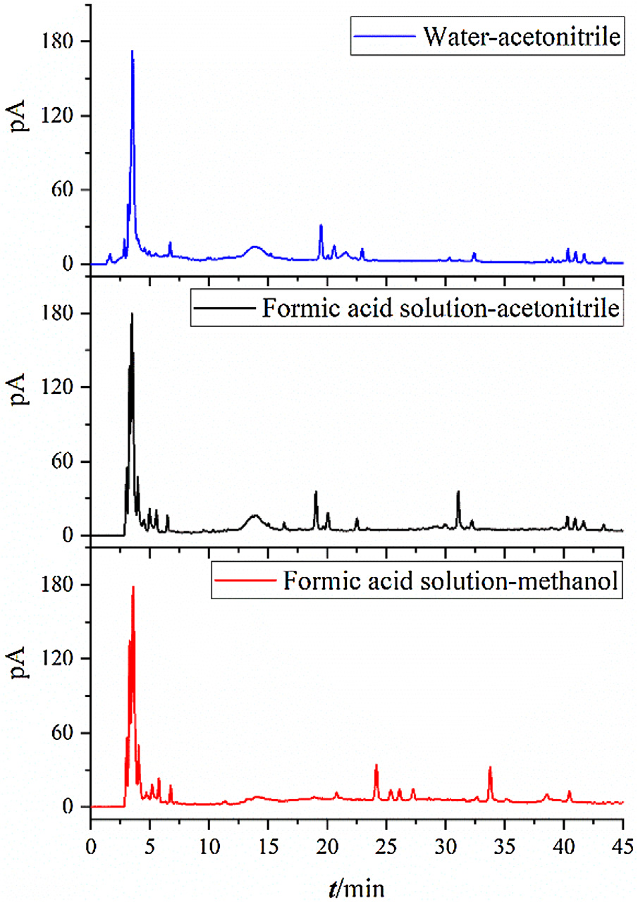
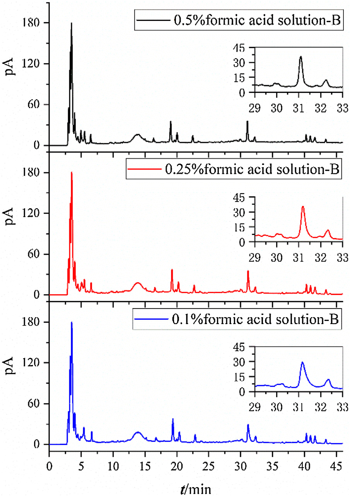
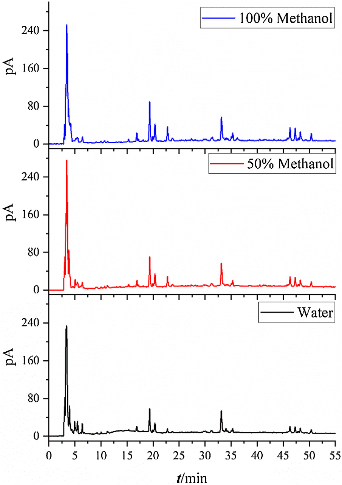
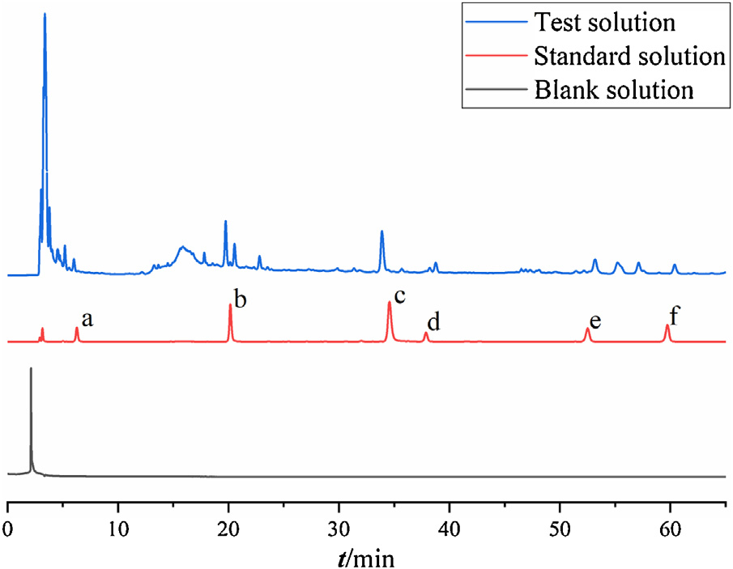
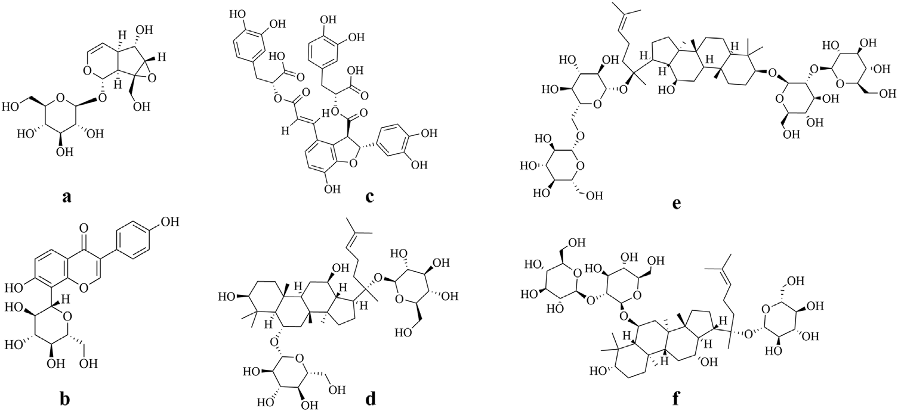
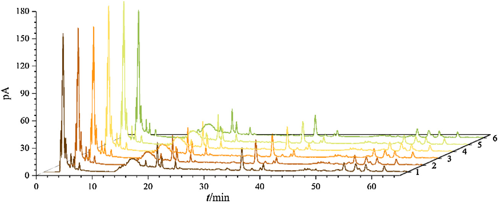
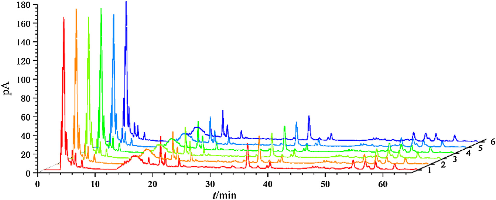
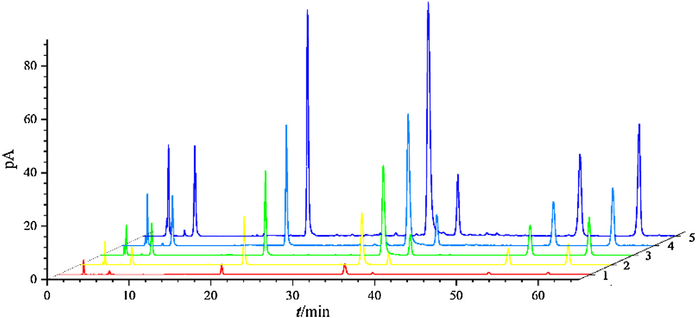
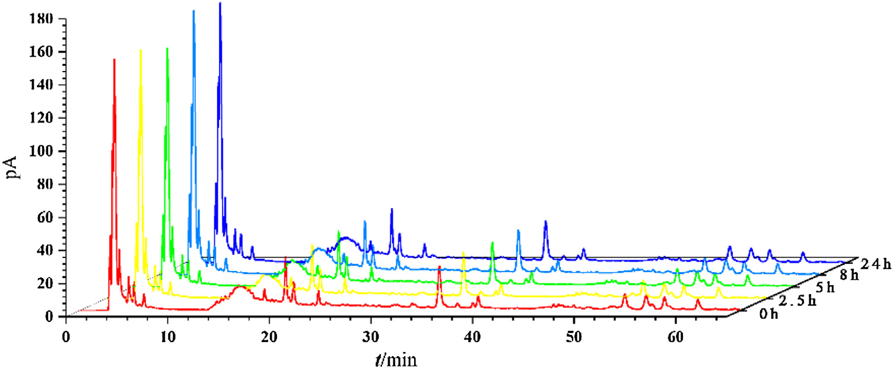
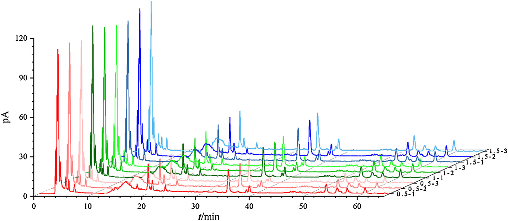

<!--
Xie et al., J. Pharm. Biomed. Anal. 201 (2021) 114087 の全訳密度日本語版。
漢方方剤の多成分定量・CAD応用の実験論文。practitioner レベル。表1-7を保持。図（Fig.1-10）を本文に埋め込み。
CAD応答理論（式1-3）は本文の通り記載。
-->

## 書誌情報

- 標題（原題）: Simultaneous determination of six main components in Bushen Huoxue prescription by HPLC-CAD
- 著者: Mengjun Xie, Yueting Yu, Ziyu Zhu, Liping Deng, Bo Ren（責任著者）, Mei Zhang（責任著者）
- 所属: 成都中医薬大学 薬学院（中国・四川省成都）
- 掲載誌・巻号・DOI: Journal of Pharmaceutical and Biomedical Analysis, 201 (2021) 114087. DOI: 10.1016/j.jpba.2021.114087
- インパクトファクター: 3.1（J. Pharm. Biomed. Anal., JCR 2024 / Clarivate。Q2）
- 受理経過: 2020年11月13日受領／2021年4月13日改訂／4月16日受理／4月23日オンライン公開。© 2021 Elsevier B.V.
- 資金: 国家自然科学基金（81774202）／四川省科技計画／成都中医薬大学ほか

> 補足: 補腎活血方（Bushen Huoxue prescription, BHP）は、著者らの研究グループが糖尿病網膜症の予防・治療用に独自開発した漢方複方（特許200910308470.3）で、葛根（Puerariae Lobatae Radix）・丹参（Salviae Miltiorrhizae Radix et Rhizoma）・地黄（Rehmanniae Radix）・人参（Ginseng Radix et Rhizoma）から成る。本論文の技術的核心は、**UV吸収を持たない成分（ジンセノシド類）でも検出できる「荷電化エアロゾル検出器（CAD）」** を使い、性質の異なる6成分を1回の分析で定量した点。DAD（UV）検出では見えにくい生薬成分をどう定量するかという実務課題への解答で、本文にツムラ（Tsumura And Co.）からのダウンロード記録がある。

## 要旨（Abstract）

**背景**: 補腎活血方（BHP）は、著者らの研究グループが開発した糖尿病網膜症治療の伝統中医薬（TCM）方剤である。カタルポール・プエラリン・サルビアノール酸B・ジンセノシドRg1・ジンセノシドRb1・ジンセノシドRdは主要有効成分6つで、この方剤を部分的に代表しうる。荷電化エアロゾル検出器（corona CAD）はHPLCに装備される万能検出器の一種で、複雑混合物の分析に多くの利点を持つが、TCM化合物への応用はまだ少ない。

**目的**: 本研究の目的は、BHP中6成分の定量法を確立し、TCM化合物でのCADの利用を増やすことである。

**方法**: HPLC-CAD分析はInertsil ODS-SP（4.6 mm×250 mm, 5 μm）で、0.5%ギ酸溶液(A)-アセトニトリル(B)の移動相、流速1 mL/min（勾配: 0–7分 1%B；7–12分 1→12%B；12–22分 12→19%B；22–40分 19→28%B；40–43分 28→33%B；43–50分 33%B；50–65分 33→42%B）で実施。カラム温度30℃、注入量20 μL、噴霧温度モードLOW、濾過定数3.6、データ収集10 Hz。方法論を検討し、異なる関数の回帰直線性を比較。16バッチの試料を調製し含量を測定した。

**結果**: 6化合物は線形関数使用時に濃度範囲で良好な直線性（R²>0.9990）。平均回収率99.18%–101.30%。プエラリンとジンセノシドRg1のRSD値が平均回収率調査中にわずかに3%を超えたが、他の6成分の方法論的調査は全て3%以内。精度・安定性・再現性は良好。16バッチのBHP試料で6成分の含量は、カタルポール0.3138%–0.6042%、プエラリン0.8095%–1.2917%、サルビアノール酸B0.7416%–1.1189%、ジンセノシドRg1 0.0231%–0.0418%、ジンセノシドRb1 0.0702%–0.1724%、ジンセノシドRd 0.0384%–0.1196%。

**結論**: HPLC-CADに基づくBHP中6成分定量法を、高精度・良好な再現性・簡便な操作で確立し、BHPの品質基準改善の参照を提供する。TCM複方方剤の定量でのCAD応用は合理的でアクセス可能である。

**キーワード**: HPLC-CAD、荷電化エアロゾル検出器、補腎活血方、含量測定

## 1. 序論（Introduction）

伝統中医薬（TCM）は、中国人の数千年にわたる疾病予防・治療経験の集大成である。現代研究はTCMが依然として医療に大きく貢献でき、多経路治療・少ない副作用などの利点を持つことを示した。TCM方剤は、TCM理論に従った多数の生薬の有機的組み合わせで、TCMの最も重要な治療法である。

品質管理は薬の安全性・有効性を確保する重要な環である。試験の一部として、成分の定量的検出が注目を集めている。しかしTCM生薬はほぼ天然物由来のため、TCM方剤は高い化学的多様性を持ち、その品質は多くの因子に影響される。これらの複雑な条件が検出を困難にする。さらにTCM方剤中のアナライトは大量または極微量で存在しうるため、検出には非常に高感度で選択的な方法が必要になりうる。

HPLCは分離の最も汎用的な技術の一つで、多様な検出器を組み合わせられ、TCMの化合物分析に多くのアイデアを提供する。HPLCの一般的検出器には、DAD（ダイオードアレイ）・RID（屈折率）・MSD（質量分析）・FLD（蛍光）・ELSD（蒸発光散乱）・corona CAD（荷電化エアロゾル）などがある。RIDは勾配溶出に不向き、FLDは高選択性のためTCM方剤の分析にほとんど使われない。DADはUV/vis検出の一分野で、広い応用・感度・広い直線範囲・勾配溶出との適合性からHPLCで最も一般的な検出だが、アナライト分子が適切な発色団を欠く場合（蛍光検出も非蛍光団の場合）に限界がある。非発色団化合物は、面倒な誘導体化手順を経るか、感度を損なう低UV波長法で分析せねばならない。

そこで一般に、CADやELSDのような万能検出器に頼る。電気エアロゾル技術が両検出器の基盤だが、CADはELSDより直線性・感度・安定性が優れるため、含量測定でCADの選択が大きな利点を持つ。米国薬局方・欧州薬局方でCAD法の採用が増え、中国薬典の一般章にも新たに導入されたことは、CAD検出器への前向きな姿勢を反映する。複雑混合物検出の利点から、多くの天然物とその製剤がCADを分析ツールとして試みてきた。現在、TCM・複方薬・その製剤でのCAD使用への熱意も高まっている（延齢草・鴉胆子種子・人参・三黄片など）。しかし現時点でTCM化合物への応用報告は少ない。

補腎活血方（BHP）は、著者らの研究グループが早期に独自開発した糖尿病網膜症予防・治療のTCM複方（特許200910308470.3）で、葛根（PLR）・丹参（SMRR）・地黄（RR）・人参（GRR）から成る。先行研究で、プエラリン・カタルポール・サルビアノール酸B・ジンセノシドなどがこの複方の有効成分でありうると分かった。ジンセノシドはUV発色団を欠く化合物として知られる。したがって本研究では、有効成分の含量をHPLC-CADで同時定量し、BHPの他の関連研究の基礎支援を提供し、同時にTCMでのCAD応用を増やすことを目指した。

## 2. 材料と方法（Materials and methods）

### 2.1 植物材料

地黄（RR）は Rehmannia glutinosa の乾燥塊根、丹参（SMRR）は Salvia miltiorrhiza の乾燥根、人参（GRR）は Panax ginseng の乾燥細枝・ひげ根、葛根（PLR）は Pueraria lobata の乾燥根（Table 1）。成都の蓮池中薬材卸売市場で購入し、成都中医薬大学のJin Pei教授が鑑定。産地は葛根（四川綿陽・重慶）、丹参（山東臨沂）、地黄（山西運城・河南）、人参（吉林撫松）など。

### 2.2 装置

HPLCシステム（Dionex UltiMate3000, Thermo Fisher）に4元ポンプ・オンライン脱気装置・オートサンプラー・恒温カラムコンパートメント・荷電化エアロゾル検出器（Dionex Corona Veo, Thermo Fisher）を装備。

### 2.3 化学薬品と試薬

メタノール・ギ酸（Chron Chemicals）、アセトニトリル（Sigma-Aldrich, HPLCグレード）、脱イオン水（Milli-Q）。カタルポール・プエラリン・サルビアノール酸B（Must Biotechnology）、ジンセノシドRg1・Rb1・Rd（Push Biotechnology）。6化合物の純度はそれぞれ≥99.98%, ≥99.71%, ≥99.41%, ≥98.0%, ≥98.0%, ≥95.0%。

### 2.4 試料溶液・標準溶液の調製

BHP抽出物は伝統的方法で調製。重量比（人参:地黄:丹参:葛根＝1:2:2:2）で採取・粉砕し、蒸留水で2回煎じ（各1時間、1回目8倍量・2回目6倍量）、濾過・混合・蒸発・乾燥して乾燥クリーム抽出物とした。乾燥クリームを秤量して抽出率を計算。16バッチを調製（Table 2）。試料溶液: 乾燥クリーム粉末0.1000 gを秤量、水5 mLを加え40分超音波、EPチューブに移し10分遠心、上清を0.45 μm濾過。

混合標準溶液: カタルポール2.1376・プエラリン5.5178・サルビアノール酸B10.0598・ジンセノシドRg1 1.8478・Rb1 3.4344・Rd 3.9615 mg/mL を調製。水で段階希釈し4℃保存。

**Table 2. 16バッチの試料（g）と抽出率**（抜粋）

| No. | 葛根 | 丹参 | 地黄 | 人参 | 乾燥抽出 | 抽出率 |
|---|---|---|---|---|---|---|
| 1 | 3.99 | 4.00 | 3.99 | 2.00 | 7.32 | 52.36% |
| 4 | 4.00 | 4.00 | 4.00 | 2.00 | 7.99 | 57.07% |
| 8 | 4.01 | 4.00 | 3.99 | 2.01 | 6.88 | 49.11% |
| 15 | 4.00 | 3.99 | 3.99 | 2.00 | 7.89 | 56.44% |

（抽出率は49.11%〜57.07%。各バッチは異なる産地・収穫時期の生薬を組み合わせ）

### 2.5 CADの性能条件

HPLC-CAD分析はInertsil ODS-SP（4.6 mm×250 mm, 5 μm）で、0.5%ギ酸溶液(A)-アセトニトリル(B)、流速1 mL/min（勾配は要旨に記載）。カラム温度30℃、注入量20 μL、噴霧温度モードLOW、濾過定数3.6、取得周波数10 Hz。

## 3. 結果（Results）

### 3.1 分析条件の最適化

含量測定法をよりよく確立するため、クロマト条件・抽出条件を最適化。サルビアノール酸Bはこの方剤で比較的高含量・高効力で測定価値があるが、多数の酸性基による貧弱なピーク形状が課題であった。

移動相・溶出勾配・カラム温度・流速・注入量・噴霧温度モード・濾過定数・取得周波数・カラムを調査。移動相の種類（ギ酸-メタノール／水-アセトニトリル／ギ酸-アセトニトリル）を最初に調査（Fig.1）。ギ酸-メタノール・水-アセトニトリルはピークが少なく一部が分離できず、**ギ酸溶液-アセトニトリルを移動相に選択**。ギ酸濃度（0.5%/0.25%/0.1%）を調査し、より対称なピーク形状・高いカラム効率から**0.5%ギ酸-アセトニトリル**を最終決定。ギ酸はCADの応答に悪影響を与えず低いバックグラウンド電流が得られる（pH調整の緩衝液として機能）。

抽出溶媒（メタノール/50%メタノール/水）を調査（Table 3）。メタノール添加後は多くのピークが分離できずピーク面積が表面上増加。溶媒干渉と伝統的調製法を考慮し**純水を溶媒に選択**。

### 3.2 特異性とシステム適合性

ブランク・標準・試験溶液を注入。6化合物と隣接ピークの分解能は1.5超、各ピークの理論段数は15000超。目的化合物の保持時間に妨害なし（Fig.4）。

### 3.3 直線性

6化合物の標準溶液を1:2:5:10:20の比で5濃度に希釈して分析。回帰式を3形式（線形 Y=aX+b、二次 Y=aX²+bX+c、両対数 Log(Y)=aLog(X)+b）で計算。R²値から**線形関数と二次関数が適する（R²>0.9990）**、両対数より優れる（Table 4）。CADでは信号と質量の関係は本質的に非線形だが、本研究の6成分の比較的狭い勾配域の便宜から線形関数を採用。

**Table 4. 検量線（R²）（抜粋）**

| 成分 | 線形関数（R²） | 二次関数（R²） |
|---|---|---|
| カタルポール | Y=17.649X+0.1951（0.9995） | Y=−2.0699X²+18.613X+0.1365（0.9995） |
| プエラリン | Y=23.811X+0.6453（0.9991） | Y=−1.5577X²+25.164X+0.4921（0.9994） |
| サルビアノール酸B | Y=31.070X+1.1178（0.9993） | Y=−1.9833X²+33.493X+0.7324（0.9998） |
| ジンセノシドRg1 | Y=51.463X+0.0358（0.9995） | Y=20.873X²+48.381X+0.0950（0.9998） |
| ジンセノシドRb1 | Y=68.032X+0.0990（0.9997） | Y=1.6684X²+67.687X+0.1083（0.9997） |
| ジンセノシドRd | Y=63.483X+0.1406（0.9993） | Y=−11.23X²+66.349X+0.0453（0.9995） |

（Rg1・Rb1の二次項係数は正、他4成分は負——CAD応答理論と対応。後述）

### 3.4 検出限界・定量限界（Table 5）

S/N=3, 10でLOD・LOQを決定（μg/mL）: カタルポール（LOD 0.93/LOQ 3.27）・プエラリン（0.11/0.32）・サルビアノール酸B（0.71/2.33）・Rg1（0.78/2.40）・Rb1（0.68/2.13）・Rd（0.69/2.27）。直線範囲はプエラリン206〜5517.8 μg/mLなど。

### 3.5–3.8 精度・再現性・安定性・回収率（Table 6）

| 成分 | 精度RSD(%) | 平均回収率(%) | 回収率RSD(%) | 安定性RSD(%) | 再現性RSD(%) |
|---|---|---|---|---|---|
| カタルポール | 2.49 | 101.30 | 2.13 | 2.00 | 2.94 |
| プエラリン | 1.82 | 101.13 | 3.11 | 1.40 | 1.68 |
| サルビアノール酸B | 2.36 | 101.11 | 1.67 | 1.09 | 2.76 |
| ジンセノシドRg1 | 2.87 | 99.59 | 3.33 | 2.48 | 2.86 |
| ジンセノシドRb1 | 0.95 | 99.18 | 1.32 | 0.96 | 2.73 |
| ジンセノシドRd | 2.31 | 100.88 | 2.00 | 1.79 | 1.70 |

精度は6連続注入（試料No.4）、再現性は6独立調製、安定性は0/2.5/5/8/24時間、回収率は3濃度（標準:試料=1.5:1, 1:1, 0.5:1）で評価。プエラリンとRg1の回収率RSDがわずかに3%超、他は3%以内。

### 3.9 試料分析（Table 7）

16バッチのBHPで6成分を定量。含量: カタルポール0.3138–0.6042%、プエラリン0.8095–1.2917%、サルビアノール酸B0.7416–1.1189%、ジンセノシドRg1 0.0231–0.0418%、Rb1 0.0702–0.1724%、Rd 0.0384–0.1196%。**バッチ間の差が大きく、原料の産地がBHPの品質に影響しうる**ことを示す。

## 4. 考察（Discussion）

本実験では単因子調査でクロマト条件・抽出条件を決定。**移動相の酸性度が結果に有意な因子**であった。酸性度の増加は一般に成分の検出率とピーク形状を改善する。ギ酸自体はCADの応答に有意な影響を与えないが、サルビアノール酸Bは構造中の複数の酸性基のため、酸性度が検出器内での存在形を変え結果に影響する。適切な酸性度がサルビアノール酸Bのような化学組成の測定で決定的因子であることを証明した。

CAD検出器使用時は、注入前・停止前にポンプを止めてN₂で内部を平衡化し、均一な溶媒気化と電荷移動効果を得る。より安定で信頼できるデータのため、正式注入前にブランク注入を加えられる。

CADは揮発性物質の対象範囲には適用できないが、水煎液の方剤には合理的。より重要なのは、CADの動作原理により応答値が広い濃度範囲で非線形であること。しかしCADで化合物濃度を検出する際、大半の化合物の分析範囲は比較的狭い。文献レビューでも大半の分析対象が狭い濃度範囲で線形関数回帰を採用する。本実験も比較を行い、線形・二次関数とも R²>0.999 だが両対数（べき関数）では達成できないと分かった。

加えて、ジンセノシドRb1・Rg1の二次関数の二次項係数が正（>0）、残り4成分が負（<0）だった。成分と応答には関係がある。まず濃度は液滴径と正相関する（式1）。dp>10 nmのとき感度は液滴径と正相関（式2、a<0）、dp<10 nmのとき逆（式3、a>0）:

$$d_p = d_0 \times (c/\rho)^{1/3} \tag{1}$$

$$S = \frac{3.01 \times 10^{11}}{\rho} \times d_p^{-1.89} \tag{2}$$

$$S = \frac{4.4 \times 10^5}{\rho} \times d_p^{3.6} \tag{3}$$

（dp: 乾燥粒子径 nm、d0: 初期微小液滴径、c: アナライト濃度、S: 検出感度、ρ: アナライト密度）

ジンセノシドRb1・Rg1が線形回帰で正の定数を得たのは、この方剤で両成分が他の試験アナライトより低濃度だからと推測される。

この方剤ではプエラリン・サルビアノール酸Bの含量が他成分より高く、弱UV吸収物質（ジンセノシド）の存在により、多くの検出器がBHPに使いにくい。UV・ELSD・MSと比べCAD検出器は一定の利点を持つ: UVと比べCADは大半のアナライトに万能で、応答が分子内の特定官能基・部位に依存しない。CADが検出するピーク数はELSDより多く、多くのクロマト情報が失われない。コストはMS検出器ほど高くなく現段階での普及を助ける。加えてCADは安定・一貫した応答で高濃度・低濃度化合物を同時検出できる。これらの特性がTCM複方の複雑混合物分析に適する。

## 5. 結論（Conclusion）

本実験でHPLC-CADに基づくBHP中6成分定量法を、高精度・良好な再現性・簡便な操作で確立し、BHPの品質基準改善の参照を提供する。TCM複方方剤（特に非発色団を含むもの）や他の複雑化学系の定量でのCAD応用は合理的でアクセス可能である。

## 参考文献

1. J.L. Ren, A.H. Zhang, X.J. Wang, Traditional Chinese medicine for COVID-19 treatment, Pharmacol. Res. 155 (2020), 104743.

2. H.M. Gao, Z.M. Wang, Y.J. Li, Z.Z. Qian, Overview of the quality standard research of traditional Chinese medicine, Front. Med. (Lausanne) 5 (2) (2011) 195–202.

3. J.L. Wolfender, HPLC in natural product analysis: the detection issue, Planta Med. 75 (7) (2009) 719–934.

4. Charged aerosol detection for liquid chromatography and related separation techniquesH.A. Azeem, Paul H. Gamache (Eds.), Anal. Bioanal. Chem. 410 (11) (2018) 2663–2664.

5. K. Filip, G. Grynkiewicz, M. Gruza, K. Jatczak, B. Zagrodzki, Comparison of ultraviolet detection and charged aerosol detection methods for liquid-chromatographic determination of protoescigenin, Acta Pol. Pharm. 71 (6) (2014) 933–940.

6. I.A. Haidar Ahmad, A. Blasko, J. Tam, N. Variankaval, H.M. Halsey, R. Hartman, E.L. Regalado, Revealing the inner workings of the power function algorithm in charged aerosol detection: a simple and effective approach to optimizing power function value for quantitative analysis, J. Chromatogr. A 1603 (2019) 1–7.

7. H.Y. Eom, S.Y. Park, M.K. Kim, J.H. Suh, H. Yeom, J.W. Min, U. Kim, J. Lee, J.R. Youm, S.B. Han, Comparison between evaporative light scattering detection and charged aerosol detection for the analysis of saikosaponins, J. Chromatogr. A 1217 (26) (2010) 4347–4354.

8. S. Almeling, D. Ilko, U. Holzgrabe, Charged aerosol detection in pharmaceutical analysis, J. Pharm. Biomed. Anal. 69 (2012) 50–63.

9. R. Yang, Z.N. Wu, Y.Q. Pu, T. Zhang, B. Wang, Fast and non-derivative method based on high-performance liquid chromatography-charged aerosol detection for the determination of fatty acids from Agastache rugosa (Fisch. et Mey.) O. Ktze. seeds, Nat. Prod. Res. 33 (13) (2019) 1969–1974.

10. S. Martin-Torres, A.M. Jimenez-Carvelo, A. Gonzalez-Casado, L. Cuadros-Rodriguez, Differentiation of avocados according to their botanical variety using liquid chromatographic fingerprinting and multivariate classification tree, J. Sci. Food Agric. 99 (11) (2019) 4932–4941.

11. Y.J. Yang, X.G. Sun, J. Yang, Q. Li, J. Zhang, Y. Zhao, B.P. Ma, B.L. Guo, Determination of three saponins in rhizoma and fibrous root of Trillium tschonoskii and Trillium kamtschaticum, Zhongguo Zhong Yao Za Zhi 42 (6) (2017) 1146–1151.

12. Z.N. Wu, L. Li, N. Li, T. Zhang, Y.Q. Pu, X.T. Zhang, Y. Zhang, B. Wang, Optimization of ultrasonic-assisted extraction of fatty acids in seeds of Brucea Javanica (L.) Merr. from different sources and simultaneous analysis using high-performance liquid chromatography with charged aerosol detection, Molecules 22 (6) (2017) 931.

13. S.D. Jia, J. Li, N. Yunusova, J.H. Park, S.W. Kwon, J. Lee, A new application of charged aerosol detection in liquid chromatography for the simultaneous determination of polar and less polar ginsenosides in ginseng products, Phytochem. Anal. 24 (4) (2013) 374–380.

14. H.Y. Fung, Y. Lang, H.M. Ho, T.L. Wong, D.L. Ma, C.H. Leung, Q.B. Han, Comprehensive quantitative analysis of 32 chemical ingredients of a Chinese patented drug Sanhuang tablet, Molecules 22 (1) (2017) 111.

15. Y. Li, Preliminary Study on the Chemical Composition in Vivo and Vitro of Bushen Huoxue Prescription and the Mechanism of Treating DR, Chengdu University of Traditional Chinese Medicine, 2018 (in Chinses).

16. S.Y. Liu, Study on the Basis of the Efficacy of Bushen Huoxue Prescription in the Prevention and Treatment of DR Based on the Multi-dimensional Spectrum-Effect Relationship, Chengdu University of Traditional Chinese Medicine, 2019 (in Chinses).

17. L.F. Ouyang, Z.L. Wang, J.G. Dai, L. Chen, Y.N. Zhao, Determination of total ginsenosides in ginseng extracts using charged aerosol detection with post-column compensation of the gradient, Chin. J. Nat. Med. 12 (11) (2014) 857–868.

18. X.J. Xie, M. Zhang, M.F. Wang, The Invention Relates to a Chinese Traditional Medicine Composition and a Preparation Method Thereof. China, 2021.

19. Z. Long, Z.M. Guo, I.N. Acworth, X.D. Liu, Y. Jin, X.G. Liu, L. Liu, L. Liang, A non-derivative method for the quantitative analysis of isosteroidal alkaloids from Fritillaria by high performance liquid chromatography combined with charged aerosol detection, Talanta 151 (2016) 239–244.

20. N. Vervoort, D. Daemen, G. Torok, Performance evaluation of evaporative light scattering detection and charged aerosol detection in reversed phase liquid chromatography, J. Chromatogr. A 1189 (2008) 92–100.

21. C. Asthana, G.M. Peterson, M. Shastri, R.P. Patel, Development and validation of a novel high performance liquid chromatography-coupled with corona charged aerosol detector method for quantification of glucosamine in dietary supplements, PLoS One 14 (5) (2019), e0216039.

22. S.D. Jia, W.J. Lee, W.E. Ji, J.H. Park, S.W. Kwon, J. Lee, Comparison of ultraviolet detection, evaporative light scattering detection and charged aerosol detection methods for liquid-chromatographic determination of anti-diabetic drugs, J. Pharm. Biomed. Anal. 51 (4) (2010) 973–978.

23. S. Furota, N.O. Ogawa, Y. Takano, T. Yoshimura, N. Ohkouchi, Quantitative analysis of underivatized amino acids in the subto several-nanomolar range by ion-pair HPLC using a corona-charged aerosol detector (HPLC-CAD), J Chromatogr B 1095 (2018) 191–197.

24. C.E. Zhang, L.J. Liang, X.H. Yu, H. Wu, P.F. Tu, Z.J. Ma, K.J. Zhao, Quality assessment of astragali radix from different production areas by simultaneous determination of thirteen major compounds using tandem UV/charged aerosol detector, J. Pharm. Biomed. Anal. 165 (2019) 233–241.

25. J. Fibigr, D. Satinsky, P. Solich, A UHPLC method for the rapid separation and quantification of phytosterols using tandem UV/Charged aerosol detection - a comparison of both detection techniques, J. Pharm. Biomed. Anal. 140 (2017) 274–280.

26. S. Granica, J.P. Piwowarski, A.K. Kiss, Determination of C-glucosidic ellagitannins in Lythri herba by ultra-high performance liquid chromatography coupled with charged aerosol detector: method development and validation, Phytochem. Anal. 25 (3) (2014) 201–206.

27. Y. Wang, Y.X. Liu, H.S. Yue, W.Y. Xu, J.M. Cao, H.Y. Jin, S.C. Ma, Comparison between the charged aerosol detector and evaporative light scattering detector for the analysis of sugar in Zhusheyong Yiqifumai and the study on the accuracy of methods, Zhongguo Zhong Yao Za Zhi 45 (2020) 5511–5517.

28. Z.Y. Wang, C.Q. Li, M.J. Mu, J.Y. Dong, M.L. Liu, M. Zhang, X.J. Xie, Simultaneous determination of the content of danshensu, puerarin, daidzin and salvianolic acid B in Bushen Huoxue prescription by HPLC wavelength switching technology, Chin. J. Pharm. Anal. 36 (6) (2016) 1020–1026 (in Chinese).

29. S.Y. Liu, X. Wang, Y.L. Li, Y.X. Pan, Y. Li, X.J. Xie, M. Zhang, HPLC-UV-ELSD fingerprint of different Bushen Huoxue prescriptions with different ratios, Liaoning J. Tradit. Chin. Med. 46 (02) (2019), 362-365+447 (in Chinese). 9

## 訳者補足

- **なぜCADなのか**: 補腎活血方には性質が大きく異なる成分が混在する——プエラリン（UV吸収あり・葛根）、サルビアノール酸B（酸性基多数・丹参）、そして**UV吸収をほとんど持たないジンセノシド類（人参）**。UV検出器（DAD）ではジンセノシドが見えにくい。CAD（荷電化エアロゾル検出器）は「分離後に溶媒を蒸発させ、残った粒子を帯電させて数える」万能検出器なので、UV発色団の有無に関係なく質量ベースで一括定量できる。これが本論文の技術的キモ。生薬の多成分定量で「発色団のない成分をどう測るか」という定番の悩みへの実践解。

- **CADの弱点と回避法**: CADの応答は本来「濃度に対して非線形」（式1〜3で説明される液滴径依存性のため）。ただし本研究のように濃度域を狭く取れば線形近似が実用上十分（R²>0.999）。ジンセノシドRg1・Rb1だけ二次項が正になったのは、方剤中でこれらの濃度が特に低く、液滴径が小さい領域（dp<10 nm）に入るため——という理論的説明も付けている。

- **実務的教訓**: (1) サルビアノール酸B（酸性基が多い）はピーク形状が崩れやすく、移動相の酸性度（0.5%ギ酸）が定量の鍵。(2) CAD使用時はN₂で内部平衡を取る・ブランク注入を先に入れると安定する、という運用ノウハウ。(3) 16バッチで含量が大きくばらついた（例: カタルポール0.31〜0.60%）＝原料産地の品質管理が方剤品質に直結する。

- **補腎活血方（BHP）とは**: 糖尿病網膜症の治療用に開発された漢方複方（葛根・丹参・地黄・人参）。日本の一般的な漢方方剤ではなく研究グループの独自処方だが、「複数生薬・複数成分を1法で測る」品質管理の手法として汎用性が高い。

- 図（Fig.1〜10：移動相・溶媒検討、構造式、各種クロマトグラム）を本文の該当箇所に埋め込み。
