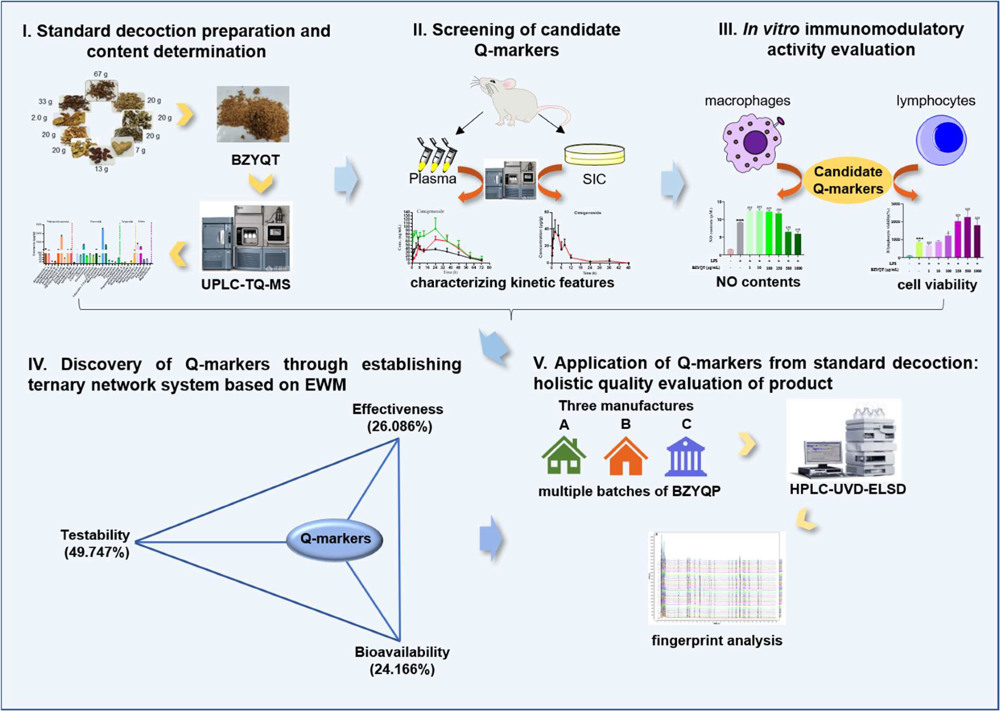
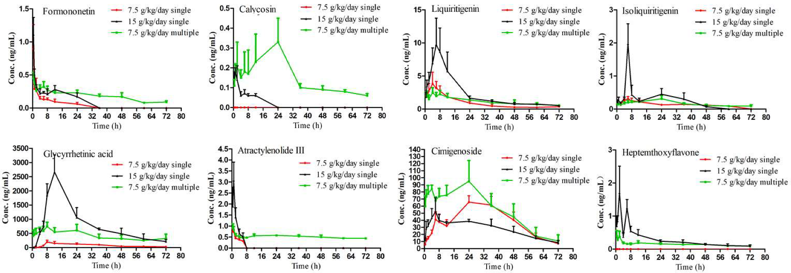
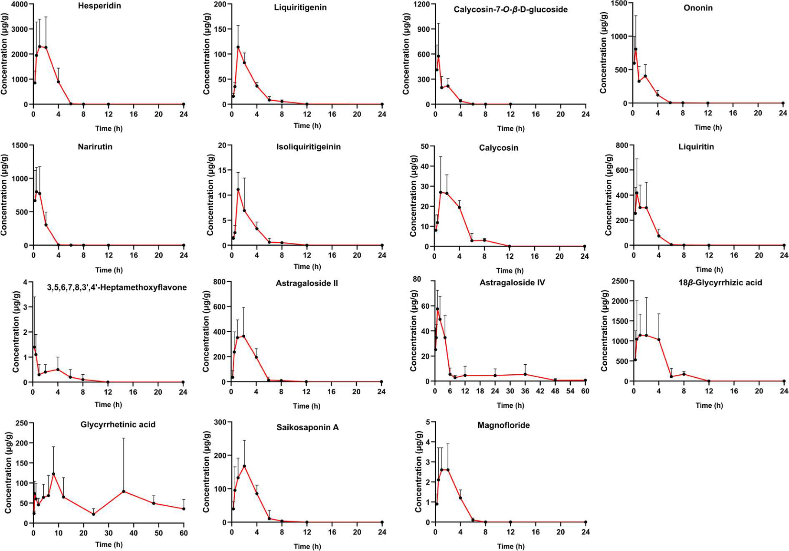
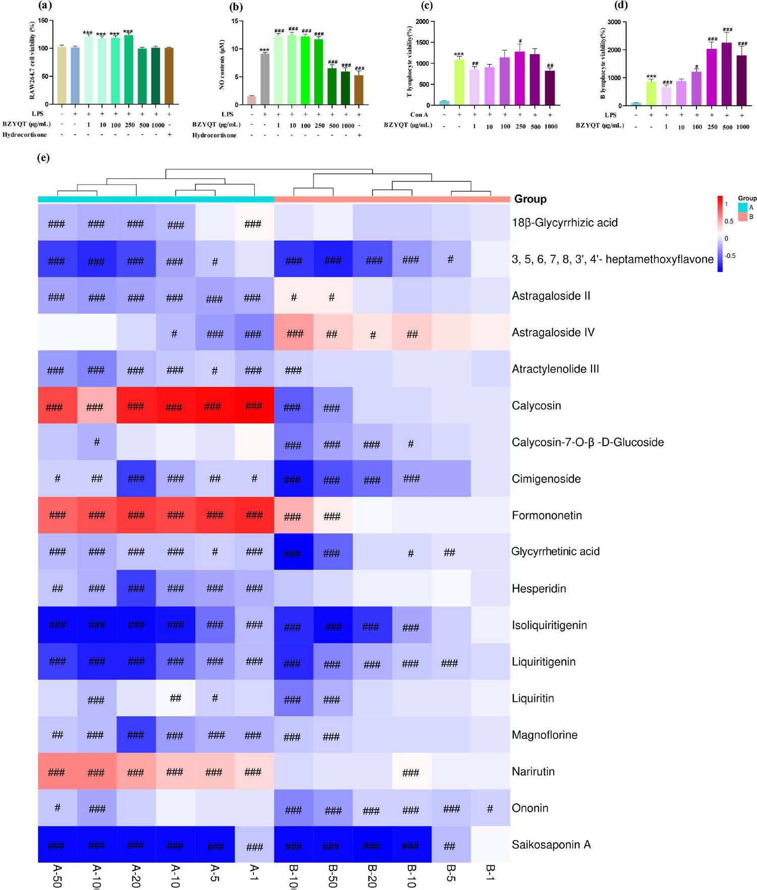
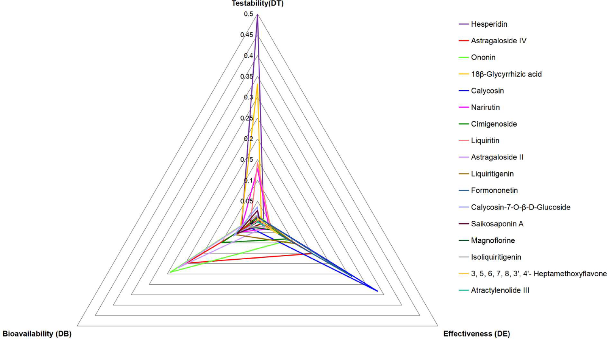

<!-- 方針: ほぼ全訳＋必要に応じた補足。原文構成に沿って訳出。「> 補足:」は訳者注。定量値は原文（本文・要旨）と突き合わせて検証。詳細な検量線・LOD/LLOQ・回収率の個別値は補足表(Table S1–S25)にあり本体PDFに含まれないため、本文が与える集約値のみを転記し、個別表は「原文（補足資料）参照」とした。 -->

## 書誌情報

- 原題: Quantitative ternary network-oriented discovery of Q-markers from traditional Chinese medicine prescriptions: Bu-Zhong-Yi-Qi-Tang as a case study
- 著者: Liufang Hu, Guotao Chen（両名は同等貢献）, Jiali Chen, Zhenyu Zou, Yuan Qiu, Jing Du, Xupeng Tong, Jiaxu Chen, Xinsheng Yao, Pei Lin（責任著者）, Liangliang He（責任著者）, Zhihong Yao（責任著者）
- 所属: 暨南大学 薬学院／中医薬近代化・革新的創薬 教育部国際協力研究室、生物活性分子・成薬性評価 国家重点実験室ほか（中国 広州）、湘潭大学、同仁堂科技（北京）、杭州辰峰清興科技
- 掲載: *Phytomedicine* 133 (2024) 155918. https://doi.org/10.1016/j.phymed.2024.155918
- インパクトファクター: **約7.9**（*Phytomedicine*, Elsevier, JCR 2024 / Clarivate, Q1。出典により6.7〜8.8の幅があり要確認）
  > 補足: IF は情報源によって値が割れており（6.7〜8.8 の範囲で報告）、確定値は Clarivate JCR の原典で要確認。いずれにせよ植物療法・生薬薬理分野の代表的な高IF誌（Q1）である。
- 受領 2024-05-03 / 改訂受領 2024-07-04 / 採録 2024-07-26 / オンライン公開 2024-07-31。© 2024 Elsevier GmbH

> 補足: 補中益気湯（Bu-Zhong-Yi-Qi-Tang, BZYQT）は「脾胃論（Pi-Wei-Lun）」に収載された700年以上の歴史をもつ古典的漢方処方で、下痢・慢性閉塞性肺疾患・喘息・子宮脱など消化器・呼吸器・泌尿生殖器の疾患改善に広く用いられる。**日本では「補中益気湯（Hochuekkito）」、韓国では「補中益気湯（Bojungikki-tang）」**として、術後の疲労・食欲不振の栄養状態改善の補剤として認知されている。構成は、君薬＝黄耆（Astragali Radix）、臣薬＝甘草（Glycyrrhizae Radix et Rhizoma）・白朮（Atractylodis Macrocephalae Rhizoma）・党参（Codonopsis Radix）、佐薬＝当帰（Angelicae Sinensis Radix）・陳皮（Citrus Reticulatae Pericarpium）、使薬＝升麻（Cimicifugae Rhizoma）・柴胡（Bupleuri Radix）・大棗（Jujubae Fructus）・生姜（Zingiberis Rhizoma Recens）の10生薬。BZYQP は BZYQT 由来の代表的市販製剤「補中益気丸（Bu-Zhong-Yi-Qi-Pill）」。

## 要旨（Abstract）

**背景:** 伝統中薬（TCM）に対する品質マーカー（Q-marker）の提唱は、TCM 処方の品質管理に関わる新しい研究の道筋を表す。しかし、複数の特性をもつ Q-marker に関するこれまでの探索的研究は、一貫して**重み（weight）の考慮を怠って**おり、各特性の重要度を正確に評価する能力を妨げ、Q-marker の理解を歪める可能性があった。

**目的:** 本研究では、TCM 処方から Q-marker を**視覚的に発見する定量的三元ネットワーク戦略を初めて提案**し、古典的 TCM 処方である補中益気湯（BZYQT）の品質管理研究に適用した。

**方法:** まず、BZYQT 中の**34成分の含量**と、**17の候補 Q-marker** の生体試料（血漿および小腸内容物）中での動態特性を UPLC-QqQ-MS/MS により特徴づけ、マクロファージと脾リンパ球における免疫調節活性も評価した。次に、得られたデータを**試験性（testability）・生物学的利用能（bioavailability）・有効性（effectiveness）の3特性**に統合し、**エントロピー重み法（EWM）**でそれぞれの重みを算出して、Q-marker を定量的にスクリーニングするための三元ネットワークを構築した。続いて、同定された BZYQT の Q-marker を用いて、3社が製造する市販製剤・補中益気丸（BZYQP）の**36ロット**の総合的品質評価を、Q-marker を基準とした指紋の類似度評価により行った。

**結果:** 三元ネットワークの回帰面積のランキングに基づき、試験性・生物学的利用能・有効性という3つの核心特性を示す**9成分（ヘスペリジン、アストラガロシドIV、オノニン、18β-グリチルリチン酸、ナリルチン、カリコシン、シミゲノシド、アストラガロシドII、リクイリチン）**が BZYQT の Q-marker として選び出された。Q-marker を共通ピークとして用いると、36ロットの BZYQP の類似度は **HPLC-UVD モードで 0.914〜0.998、HPLC-ELSD モードで 0.631〜1.000** となり、従来の共通ピークで評価した類似度（HPLC-UVD: 0.946〜0.990、HPLC-ELSD: 0.957〜0.997）より**小さく（＝ばらつきが広く）**なった。この観察は、同定された Q-marker が、異なる製造業者の TCM 関連製品の総合的品質評価のための指紋の共通ピークとして、より代表性が高いことを示唆する。

**結論:** BZYQT からの Q-marker の定量的発見は、関連する市販製品の総合的品質評価に重要な基盤を築いた。本研究は、TCM 処方の一貫性と有効性を保証するための新しい戦略を提供する。

> 補足（略語）: BZYQT＝補中益気湯、BZYQP＝補中益気丸、SIC＝小腸内容物（small intestinal contents）、EWM＝エントロピー重み法、ConA＝コンカナバリンA、LPS＝リポ多糖、LLOQ＝定量下限。

## 1. 序論（Introduction）

中華文明の宝である伝統中薬（TCM）処方は、数千年にわたり疾病の予防・治療に重要な役割を果たしてきた。とりわけ COVID-19 パンデミックの間、治癒率の改善・罹病期間の短縮・死亡率の低下における有効性から世界的な注目を集めた（Huang et al., 2021）。しかし TCM は「多成分・多標的（multi-component, multi-target）」という特徴をもち、これが複数の慢性・複雑疾患の治療における信頼性の源である一方、有効成分と機序の不明確さ、および満足のいかない品質管理といった限界のために、標準化・国際化が大きな課題に直面している（He et al., 2021）。これを踏まえ、TCM の品質規格体系を強化するために品質マーカー（Q-marker）の概念が提唱された（Liu et al., 2016）。Q-marker は、TCM とその製品（飲片・煎剤・エキス・製剤など）に見出される固有の化学成分を指し、TCM の機能特性と密接に関連し、品質管理において安全性・有効性を評価するための指標物質として有効に機能する。

Q-marker 概念の導入以来、ネットワーク薬理学・薬力学・フィトケミカル・薬物動態学・Chinmedomics・「蜘蛛の巣（spider-web）」モード・「レーダーチャート（radar chart）」モードなど、いくつかの戦略が TCM や TCM 処方における Q-marker の同定・判別のために提案・適用されてきた（Yeqing et al., 2022; Chu et al., 2022; Wang et al., 2023; He et al., 2021; Zhang et al., 2021, 2020）。これらの戦略は Q-marker の発見に成功し新たな視点と参照を提供したものの、なお注意すべき問題がある。強調すべき重要な点は、**複数の特性をもつ Q-marker に関するこれまでの探索的研究が一貫して重みの考慮を怠ってきた**ことである。この見落としは各特性の重要度を正確に評価する能力を妨げ、Q-marker の誤った理解につながりうる。さらに、多くの研究は主に**吸収された成分**に注目してきたが、腸内細菌叢の調節や腸管への直接作用を通じて間接的効果を発揮しうる**腸内容物中の外来物質（xenobiotics）を無視**しがちであり、生物活性成分の除外につながっていた。とりわけ消化器系の障害を改善する TCM 処方については、腸管に存在する成分も考慮に値する。

補中益気湯（BZYQT）は「脾胃論」に収載された700年以上の歴史をもつ著名な TCM 処方で、下痢・慢性閉塞性肺疾患・喘息・子宮脱など消化器・呼吸器・泌尿生殖器の疾患改善に広く用いられてきた（Hu et al., 2019, 2022）。構成は、**君薬：黄耆（Astragali Radix）；臣薬：甘草（Glycyrrhizae Radix et Rhizoma）・白朮（Atractylodis Macrocephalae Rhizoma）・党参（Codonopsis Radix）；佐薬：当帰（Angelicae Sinensis Radix）・陳皮（Citrus Reticulatae Pericarpium）；使薬：升麻（Cimicifugae Rhizoma）・柴胡（Bupleuri Radix）・大棗（Jujubae Fructus）・生姜（Zingiberis Rhizoma Recens）**。BZYQT はその薬効・健康効果によって中国を越えて広く認知され、日本では **Hochuekkito**、韓国では **Bojungikki-tang** と呼ばれ、術後の疲労・食欲不振患者の栄養状態を改善する補剤として認められている（Kiyohara et al., 2006; Lee et al., 2012）。現代薬理学的研究は、BZYQT が抗ウイルス（Takanashi et al., 2017）・抗炎症（Yang et al., 2015）・抗菌（Yan et al., 2002）・免疫調節（Kao et al., 2000; Liu et al., 2019）活性を示すことを実証してきた。広範な臨床応用を背景に、丸剤・顆粒剤・経口液剤を含む関連製剤が中国で開発され、いずれも中国薬典に収載されている。

しかし、**現行の BZYQT 関連製剤の品質規格はアストラガロシドIV 単独を定量指標に頼って**おり（Commission, 2020）、有効性・安全性の保証にはほど遠い。さらに既存研究は、製剤ではなく BZYQT の物質的・生物学的基盤に主眼を置いてきた。したがって、BZYQT を基盤とする適切な Q-marker の発見は、BZYQT 関連製剤の包括的品質評価の指針原理として大きな意義をもつ。

先行研究では、BZYQT 中の**計161の化学成分**と、生体試料（血漿・尿・糞便）中の **162の BZYQT 由来外来物質**が特徴づけられ、フラボノイド類とトリテルペノイド類が血漿中の生物学的利用可能成分の重要部分を占めていた（Hu et al., 2019; Liu et al., 2019）。加えて、poly(I:C) 誘発肺炎症と腸のパイエル板に対する BZYQT の免疫調節活性が示され、肺の好中球浸潤の低減、B リンパ球数の増加、F4/80（マクロファージの細胞マーカー）の mRNA 発現の下方制御が含まれた（Hu et al., 2022; Liu et al., 2019）。最近の知見は、ラットの**小腸内容物（SIC）**中に大半の BZYQT 由来成分が存在することも明らかにした（Hu et al., 2022）。粘膜免疫に対する BZYQT の特異的調節効果を踏まえ、Q-marker の発見には血漿と SIC の両方の外来物質を考慮することが不可欠となる。

本研究では、TCM からの Q-marker の定量的発見と、それに続く市販製品の総合的品質評価への応用のための戦略を、BZYQT を例として開発した（Fig. 1）。すなわち、(1) BZYQT を調製し UPLC-QqQ-MS/MS で多成分含量を定量、(2) 血漿・SIC 中の外来物質を同時定量して候補 Q-marker の動態特性を特徴づけ、(3) in vivo 有効性に密接に関連する in vitro 活性で候補の活性を確認、(4) 含量・動態・活性のデータを**試験性・生物学的利用能・有効性**の3核心特性に統合し EWM で各特性に重みを付与、三元ネットワークを構築して**回帰面積値のランク**を同定基準として Q-marker を定量的に発見、(5) 3社の市販 BZYQP 多ロット品を HPLC-UVD-ELSD 指紋に基づき総合評価、という流れである。

## 2. 材料と方法（Materials and Methods）

### 2.1. 化学品・試薬

生薬（蜜炙 黄耆＝Astragali Radix praeparata cum melle、麦麸炒 白朮、蜜炙 甘草、当帰、党参、柴胡、升麻、陳皮、生姜、大棗）はすべて同仁堂科技（北京）より提供された。これら10生薬の品質評価（水分・外観・試験項目・マーカー含量）は同仁堂科技が実施した（Hu et al., 2023）。3社（各12ロット）が製造した **BZYQP を36ロット**、広州の各地の薬店から購入した。純度 98% 以上の標準品は Chengdu Chroma-Biotechnology（成都）より入手。LC-MS グレードのアセトニトリルとギ酸は Fisher Scientific（米国）製。精製水は Watsons Group（広州）製で、その他の試薬は分析用グレード。

マウス RAW264.7 マクロファージは FuHeng Biology（上海）より入手。ConA と LPS は Sigma（独）製。ACK 溶血バッファー、NO・CCK8 キットは Beyotime Biotechnology（上海）製。DMEM・FBS・PBS・ペニシリン-ストレプトマイシン混合液は Hyclone（米国）製。

### 2.2. BZYQT の調製

「脾胃論（Pi-Wei-Lun）」記載の抽出法と 2020 年版中国薬典の生薬配合比に基づき、1日用量の BZYQT 標準煎液を次のように調製した：**蜜炙 黄耆 6.7 g・麦麸炒 白朮 2.0 g・蜜炙 甘草 3.3 g・当帰 2.0 g・党参 2.0 g・柴胡 2.0 g・升麻 2.0 g・陳皮 2.0 g・大棗 1.3 g・生姜 0.7 g** の混合物を、飲用水 600 ml で 100 ℃ で煎じ、最終容量 300 ml とした。煎液を 45 ℃ 減圧下で生薬重量の5倍まで濃縮し、凍結乾燥して凍結乾燥粉末を得た。

### 2.3. 動物実験と試料採取

**動物:** SD ラット（体重 200 g ± 10 g）と BALB/c マウス（7週齢）を Beijing HFK Biotechnology より購入。飼育は 24 ± 2 ℃、相対湿度 50 ± 5%、12時間明暗周期。倫理審査番号 20210826–12（暨南大学）。実験前に7日間馴化。

**血漿薬物動態:** 実験前に12時間絶食（飲水自由）。ラットを3群にランダム割付（I・II・III群、各 n = 6）。I・II 群は BZYQT を **7.5、15 g/kg/day（生薬換算）** で単回経口投与、III 群は 7.5 g/kg/day を1日2回・3日連続経口投与。最終投与後 0.5, 1, 2, 4, 6, 8, 12, 24, 36, 48, 60, 72 h に頸静脈から約 200 µl ずつ採血しヘパリン処理管に入れ、遠心（13,000 rpm, 10 min）して血漿を得た。

**小腸内容物（SIC）の動態:** BZYQT を 7.5 g/kg/day で1日2回・3日連続経口投与。最終胃内投与後、各時点（0.25, 0.5, 1, 2, 4, 6, 8, 12, 24, 36, 48, 60 h）（n = 5）でラットを麻酔し小腸を摘出。管腔を蒸留水で十分に洗って小腸内容物を採取し、凍結乾燥して粉末試料を得た。各試料は直ちに −80 ℃ で保存。

### 2.4. 試料前処理

- **BZYQT エキス:** 凍結乾燥粉末 0.2 g を 60% メタノール-水（w/v）10 ml で超音波（30 ℃, 100 KHz）30分抽出。適切な溶媒で希釈し最終 100 µg/ml とし UPLC-QqQ-MS/MS 分析。分析前に全作業液を 14,000 rpm で10分遠心。化学成分の定量には計6ロットの BZYQT を調製。上清 **2 µl** を注入。
- **血漿:** 血漿 100 µl に IS1（ジクロフェナク）50 µl、アセトニトリル 300 µL、メタノール 50 µl を加えて1分ボルテックス後、14,000 rpm（4 ℃, 10 min）遠心。上清を室温で窒素乾固し、残渣をメタノール 100 µl で再溶解、1分ボルテックス後10分遠心。上清 **4 µl** を注入。
- **SIC:** 小腸内容物粉末 約1 mg を精秤し、IS2（エピメジンC）50 µl、メタノール 250 µl、アセトニトリル 200 µl で2分抽出。14,000 rpm・20分（4 ℃）遠心後、上清 100 µL を採り窒素乾固。残渣をメタノール 300 µl で再溶解、2分ボルテックス後 14,000 rpm・20分遠心。上清 **2 µl** を注入。
- **BZYQP:** 36ロットを個別に微粉末化。1.0 g を精秤し 10倍容量の 60% メタノール-水（w/v）で超音波（30 ℃, 100 KHz）30分抽出。分析前に 14,000 rpm・10分遠心。

### 2.5. 定量分析のバリデーション

- **BZYQT 中34成分の定量:** 34標準品の個別ストック液をメタノールで調製（10 mL メスフラスコ、4 ℃ 保存）。検量線用に、各標準品液を 10 ml メスフラスコに移しメタノールで2倍段階希釈して7段階の標準作業液を作成。直線性・精度・併行精度・安定性・回収率でバリデーション。
- **血漿・SIC 中外来物質の濃度測定:** 米国 FDA の生体試料分析法バリデーションガイダンス（FDA, 2001）に従い、特異性・精度と正確性・直線性と定量下限（LLOQ）・抽出回収率・マトリックス効果・安定性を評価。
- **BZYQP の指紋分析:** 同一溶液を6回連続注入して精度を、同一ロットから調製した6つの別々の溶液で併行精度を評価。安定性は 0, 2, 4, 8, 12, 24 h の各時点で測定。

### 2.6. 装置・分析条件

**UPLC-QqQ-MS/MS:**
(1) クロマト分析は Waters ACQUITY™ UPLC I-Class システム（二元ポンプ＋オートサンプラー）。カラムは **ACQUITY UPLC HSS T3（2.1 mm × 100 mm, 1.8 µm）、40 ℃**。移動相は水（A）とアセトニトリル（B）でいずれも 0.1% ギ酸（v/v）含有、流速 **0.3 ml/min**。定量用グラジエントは、BZYQT エキス：0–0.5 min 5%B、0.5–3.5 min 5→30%B、3.5–12.5 min 30→40%B、12.5–15 min 40→100%B。血漿：0–2 min 10→30%B、2–5 min 30→35%B、5–6 min 35→40%B、6–10 min 40→60%B、10–14 min 60→90%B、14–15 min 90→100%B。SIC：0–0.5 min 5%B、0.5–1.5 min 5→22%B、1.5–4.5 min 22%B、4.5–8.5 min 22→40%B、8.5–13 min 40→65%B、13–14.5 min 65→85%B、14.5–15.5 min 85→100%B。オートサンプラー温度 15 ℃。
(2) MS 検出は Waters Xevo TQ-XS（ESI 源）。**MRM モードを陽イオン（ESI+）で運用**。イオン源温度 150 ℃、脱溶媒温度 500 ℃、キャピラリー電圧 3 kV、コーンガス流量 50 L/h、脱溶媒ガス流量 1000 L/h。滞留時間は自動設定。各化合物の最適化 MRM パラメータは Table S1（補足）に記載。

**HPLC-UVD-ELSD（BZYQP 指紋分析）:** Agilent 1200 HPLC（多波長 UVD ＋蒸発光散乱検出器 ELSD）。ソフトは ChemStation・Allchrom Plus。カラムは **Poroshell 120 EC–C18（100 mm × 4.6 mm, 2.7 µm）、40 ℃**。移動相は (B) アセトニトリルと (C) 水（いずれも 0.1% ギ酸 v/v 含有）、流速 **1 mL/min**。グラジエント：0–15 min 10→30%B、15–25 min 30→62%B、25–30 min 62→100%B。注入量 **10 µl**。検出波長は **0〜16 min で 280 nm、16〜30 min で 254 nm**。ELSD のドリフトチューブ温度 95 ℃、キャリアガス流量 2.5 L/min。

### 2.7. 細胞実験

- **RAW264.7 マクロファージ:** DMEM（10% FBS、1% ペニシリン-ストレプトマイシン）で 37 ℃・5% CO₂ 培養。細胞（2 × 10⁵ cells/mL, 100 µl）を96ウェルプレートに播種し24時間培養（融合度80–90%）。培地を除去し LPS（1 µg/mL）含有新鮮培地 90 µl と、BZYQT エキス（滅菌水溶解）または単一成分（DMSO 溶解、最終 DMSO 0.5% v/v）10 µl を添加。さらに24時間培養後、CCK8 で細胞生存率を、上清の NO 含量を Griess 法で測定。陽性対照は 100 µM ヒドロコルチゾン。
- **脾リンパ球:** BALB/c マウスの脾臓を無菌摘出し 70 µm セルストレーナーで機械的に解離、PBS 洗浄・ろ過。遠心・ACK 溶血後、5% FBS・1% ペニシリン-ストレプトマイシン・0.05 mM β-メルカプトエタノール含有 RPMI 1640 に懸濁。ConA（1 µg/mL）または LPS（10 µg/mL）含有 RPMI 1640 で細胞密度を 3 × 10⁶ cells/ml に調整し96ウェルプレート（90 µl）へ。BZYQT エキス（1, 10, 100, 250, 500, 1000 µg/ml）または単一成分（1, 5, 10, 20, 50, 100 µM）10 µl を添加。48時間培養後、T・B リンパ球増殖活性を CCK8 で測定。

### 2.8. 三元ネットワークによる Q-marker の発見

**エントロピー重み法（EWM）による重み計算:** ある指標の重みを次式で算出した。

- Pᵢⱼ = Xᵢⱼ / Σᵢ₌₁ᵐ Xᵢⱼ （i = 1, 2, …, m；j = 1, 2, …, n）
- Hⱼ = −k ( Σᵢ₌₁ᵐ Pᵢⱼ ln(Pᵢⱼ) )、k = 1 / ln(m)
- wⱼ = (1 − Hⱼ) / Σⱼ₌₁ⁿ (1 − Hⱼ)

ここで i・j は評価単位と評価指標数、X は変数の標準化値。指標が正方向のときは Xᵢⱼ = (Xᵢⱼ − Xᵢ max)/(Xᵢ max − Xᵢ min)、負方向のときは Xᵢⱼ = (Xᵢ max − Xᵢⱼ)/(Xᵢ max − Xᵢ min) で標準化。P は比率、m は評価指標数、H は情報エントロピー、w はエントロピー重み。

> 補足: エントロピー重み法（EWM）は、各指標のばらつき（情報量）の大きさから客観的に重みを決める手法。主観的な重み付け（研究者が「この特性が大事」と決める）を避けられるのが利点。本論文はこの EWM を使い「試験性・生物学的利用能・有効性のどれをどれだけ重視するか」をデータから自動的に決めている点が新しい。

**候補 Q-marker の試験性・生物学的利用能・有効性の評価:**
- **試験性（testability）** は、標準化処理後の BZYQT 中含量で決定。
- **生物学的利用能（bioavailability）** は血漿・SIC 中の in vivo 曝露量（AUC₀-t／dose）に基づく。まず血漿と SIC の重みを EWM で算出し、各候補の標準化曝露量に重み係数を掛けて合算し生物学的利用能値とした。
- **有効性（effectiveness）** は脾リンパ球とマクロファージへの免疫調節活性で評価。まず両細胞の重みを BZYQT の fold change データから EWM で求め、各候補の最小有効濃度を統計解析結果に基づき決定・標準化。その濃度での RAW264.7 の NO 産生の fold change または脾リンパ球の細胞生存率を算出・合算して有効性値とした。
- 最後に、これら3特性の標準化データに基づき試験性・生物学的利用能・有効性の重みを EWM で求め、各重みを掛けて候補 Q-marker の最終値を算出した。

**三元ネットワークの構築と Q-marker の定量的発見:** Excel で DT・DB・DE（試験性・生物学的利用能・有効性）からなる三次元レーダーマップを作成。各候補の回帰面積を次式で計算した：**S = 1/2 × Sin(360/3)° × (DT × DE + DE × DB + DT × DB)**。回帰面積のスコア順位を優先して Q-marker を定量的に選定した。

### 2.9. 統計解析

GraphPad Prism 8.0.2 で解析。有意性は一元配置分散分析（one-way ANOVA）＋Dunnett の多重比較検定で評価し、p < 0.05 で有意とした。結果は平均 ± SD（少なくとも2回の独立実験）で示した。

## 3. 結果（Results）

### 3.1. BZYQT 中の化学成分の定量分析

BZYQT 中の多成分の含量分布を包括的に把握し品質を管理するため、主要成分の定量評価が不可欠である。通常、血中に吸収された外来物質が有効性の指標とされるが、生物学的利用能が限られる成分でも腸管内で作用して効果を発揮しうる（He et al., 2018）。とりわけ脾胃を整える TCM 処方ではこの点が重要である。そこで、BZYQT の化学的・in vivo 代謝プロファイルの先行研究（Hu et al., 2019; Liu et al., 2019）に基づき、**フラボノイド15・トリテルペノイド10・テルペノイド5・有機酸2・アルカロイド1・その他構造1の計34成分**を UPLC-QqQ-MS/MS による同時定量の対象に選定した。

定量法は特異性・直線性・精度と併行精度・正確性・安定性の観点から厳密にバリデーションした。**34成分すべての検量線の相関係数（r²）≥ 0.9990**、精度・併行精度・安定性の RSD はそれぞれ **5.8%・6.9%・4.3% 以下**、平均回収率は **96.15%〜104.88%（RSD 4.7% 以内）** であった（Fig. S1, Table S2–S4：補足）。

開発した定量法で6ロットの BZYQT 中34成分を定量した（Fig. 2, Table S5：補足）。**定量成分の総含量は 8661.59 µg/g**。うち最も豊富だったのは**ヘスペリジン（2478.96 µg/g）**で、次いで **18β-グリチルリチン酸（1652.22 µg/g）・イソフェルラ酸（798.30 µg/g）・リクイリチン（712.79 µg/g）・ナリルチン（641.41 µg/g）・フェルラ酸（438.01 µg/g）・アストラガロシドI（232.76 µg/g）** の順。一方、**ブチルフタリドは 0.73 µg/g** と極めて少なく、他のテルペノイド類も低濃度で、これは煎じ時の高温曝露による安定性の低さに起因すると考えられる。

> 補足: 34成分すべての個別含量は補足の Table S5 にあり本体PDFには含まれない（**原文（補足資料）参照**）。本文が明示する上位成分と総量のみを上に転記した。

### 3.2. 血漿・SIC における BZYQT の動態特性

先行代謝研究（Hu et al., 2019）と、(1) 血漿または SIC で確実に検出できる、(2) 多様な化学構造・生薬を網羅する、という原則に基づき、**血漿で8成分・SIC で15成分**の生物学的利用可能成分を定量対象に選んだ。UPLC-QqQ-MS/MS で同時定量法を開発・バリデーションした。

- **血漿の8分析対象:** 良好な特異性（Fig. S2）、良好な直線性（**r ≥ 0.9928**, Table S6）、許容できる日内・日間精度と正確性（**RSD ≤ 13.2%、−14.1 ≤ RE ≤ 13.2%**）、マトリックス効果（85.3〜111.6%、ただしグリチルレチン酸は 64.6〜72.2%）、抽出回収率（85.6〜110.5%）（Table S7）、良好な安定性（RSD ≤ 13.5%, Table S8）。
- **SIC の15分析対象:** 適格な方法論を示した（Fig. S3, Table S9–S13）。

（各補足表の個別値は本体PDFに含まれない。**原文（補足資料）参照**。）

#### 3.2.1. 血漿薬物動態

（Fig. 3, Table S14）**フォルモノネチン**は血中への速やかな吸収を示した。一方、7.5 g/kg/day 単回投与では**カリコシン**と **3,5,6,7,8,3′,4′-ヘプタメトキシフラボン**は血漿中濃度が低く十分に定量できなかった。15 g/kg/day 投与でもカリコシンの Cmax は **0.20 ± 0.03 ng/ml**、AUC₀–∞は **2.14 ± 0.57 ng/ml·h** に留まった。生体内での一連の脱メチル化反応（Hu et al., 2019）のため、ヘプタメトキシフラボンは 15 g/kg/day 経口投与で Cmax **1.86 ± 0.68 ng/ml**、AUC₀–∞ **24.52 ± 4.14 ng/ml·h** と低値を示した。白朮由来のセスキテルペノイド **アトラクチレノリドIII** は速やかに吸収され（Tmax 0.83 ± 0.26 h、Cmax 0.78 ± 0.10 ng/ml）、8 h で概ね消失した（t₁/₂ 9.97 ± 4.70 h）。

BZYQT エキス中の 18β-グリチルリチン酸の含量は 1652.22 µg/g に達するが、腸内細菌により速やかに**グリチルレチン酸**へ加水分解され、血中に吸収されて効果を発揮する（Chen et al., 2017; Wang et al., 2017）。本研究でグリチルレチン酸は緩やかな吸収・消失（Tmax 12.00 ± 6.20 h、t₁/₂ 26.46 ± 5.35 h）を示し、7.5 g/kg/day 単回投与で他分析対象より比較的高い値（Cmax **204.162 ± 65.52 ng/ml**、AUC₀–∞ **6942.75 ± 517.03 ng/ml·h**）を示した。特に 15 g/kg/day 単回投与では、グリチルレチン酸の AUC₀–∞が **67,118.59 ± 10,247.41 ng/ml·h** へ有意に増加し、中用量（7.5 g/kg/day）投与の約10倍となった。**シミゲノシド**の血漿曝露は顕著に高く、AUC₀–∞は 7.5 g/kg/day で **2933.963 ± 280.00 ng/ml·h**、15 g/kg/day で **2279.42 ± 291.17 ng/ml·h** に達したが、明確な用量依存関係はなかった。文献検索では、Cimicifuga foetida L. エキス経口投与後のシミゲノシドの絶対的経口バイオアベイラビリティは 238〜319% と報告され、この著しい高さは他のシミシフゴシド類からシミゲノシドへの相互変換に起因しうる（Gai et al., 2012）。

> 補足: 原文では 15 g/kg/day のグリチルレチン酸 AUC₀–∞ を一箇所で単位「g/ml·h」と表記しているが、文脈（他の値・約10倍という記述）から **ng/ml·h の誤記**と判断される（原文ママを併記）。

7.5 g/kg/day 反復投与時の動態は単回投与と差を示した（Table S15）。例えばグリチルレチン酸（Cmax 845.29 ± 80.59 ng/mL）とシミゲノシド（Cmax 80.41 ± 8.98 ng/mL）の Cmax は単回投与より高かった。逆にフォルモノネチン・リクイリチゲニン・イソリクイリチゲニン・アトラクチレノリドIII は Cmax が低下したが、AUC₀–∞は MRT₀–∞とともに増加した。

#### 3.2.2. SIC における動態特性

（Fig. 4, Table S16）大半のフラボノイドは 2 h 以内に Cmax に達し、代謝変換または次の腸管への排泄によって 6 h までに消失した。**フラボノイド単配糖体**（リクイリチン、オノニン、カリコシン-7-O-β-D-グルコシド）は Tmax・T₁/₂・MRT₀–∞値が著しく類似し、**フラボノイド二配糖体**（ヘスペリジン、ナリルチン）も同様だった。特にリクイリチンは腸管内で主に**リクイリチゲニン**へ加水分解され、リクイリチゲニンの Cmax（**113.92 ± 43.11 µg/g**）はイソリクイリチゲニンより有意に高かった。またヘスペリジンは最高の Cmax（**2524.07 ± 1252.30 µg/g**）を示したが、短い MRT₀–∞（**2.07 ± 0.12 h**）と AUC₀-t（**7880.01 ± 4261.13 µg/g·h**）が示すように速やかに代謝された。

フラボノイドに比べトリテルペノイドは緩やかに代謝され、腸管内滞留時間が長かった。例えばグリチルレチン酸・アストラガロシドIV・シミゲノシドの MRT₀–∞はそれぞれ **103.59 ± 48.93 h・14.20 ± 11.81 h・13.14 ± 7.07 h** と顕著に延長した。興味深いことに、18β-グリチルリチン酸の Cmax は **1372.94 ± 863.10 µg/g** だったのに対し、そのアグリコンであるグリチルレチン酸は **141.49 ± 104.89 µg/g** のみで、SIC 中濃度は血漿よりかなり低かった。ただし両者の AUC₀–∞は類似していた。さらにグリチルレチン酸には 36 h に**二峰性（double-peak）現象**が観察され、腸から血中へ吸収された後、肝から胆管経由で排泄され再び腸へ戻る吸収経路の可能性が示唆された。シミゲノシドの AUC₀–∞（**377.15 ± 27.84 µg/g·h**）も血漿中濃度より低く、速やかに排泄された。したがって、グリチルレチン酸とシミゲノシドは血流を介して効果を発揮し、アストラガロシドIV は主に腸で作用しうると推測される。サイコサポニンA については BZYQT 水抽出物中の含量が **125.84 µg/g** だったのに対し Cmax は **167.69 ± 77.62 µg/g** に達し、これは 2-O-アセチルサイコサポニンA/B2 などの脱アセチル化生成物によると考えられる。アルカロイド類は Tmax 約 1.5 h で速やかにピーク濃度に達したが、高い MS スペクトル応答にもかかわらず**マグノフロリン**の Cmax は **2.88 ± 1.30 µg/g** のみだった。

### 3.3. 候補 Q-marker の選定と in vitro 免疫調節活性評価

化学的移行性（transitivity）と追跡可能性（traceability）の原則に従い、経口投与後に血漿・SIC で定量的に検出できる BZYQT 中の**固有化学成分17を候補 Q-marker として選定**した：18β-グリチルリチン酸、3,5,6,7,8,3′,4′-ヘプタメトキシフラボン、アストラガロシドII、アストラガロシドIV、アトラクチレノリドIII、カリコシン、カリコシン-7-O-β-D-グルコシド、シミゲノシド、フォルモノネチン、ヘスペリジン、イソリクイリチゲニン、リクイリチゲニン、リクイリチン、マグノフロリン、ナリルチン、オノニン、サイコサポニンA（Fig. 5）。先行研究（Hu et al., 2022）で BZYQT はマクロファージとリンパ球への免疫調節効果を示したため、これら候補の活性を RAW264.7 細胞と脾リンパ球で評価した。グリチルレチン酸は in vivo 代謝物だが、免疫調節活性評価には含めた。

まず LPS 誘発 RAW264.7 の細胞生存率と NO 産生、および ConA・LPS 誘発の T・B リンパ球増殖率に対する BZYQT の効果を評価した（Fig. 6a, b）。モデル群と比べ、BZYQT は **1〜250 µg/ml** の濃度で RAW264.7 の増殖と NO 含量を有意に促進したが、**500・1000 µg/ml の高濃度では NO 放出を劇的に抑制**した。また T・B リンパ球の増殖は 1 µg/ml の BZYQT で阻害された一方、T リンパ球は 250 µg/ml で顕著に促進、1000 µg/ml で抑制された。B リンパ球は 100〜500 µg/ml で用量依存的に増加し、1000 µg/ml で軽度低下した（Fig. 6c, d）。B リンパ球への調節効果が T より強いと考えられたため、候補 Q-marker の免疫調節活性は **LPS 誘発 脾 B リンパ球**の増殖で評価した。

17候補の免疫調節効果は、LPS 誘発 RAW264.7 の NO レベルと LPS 誘発 脾 B リンパ球の細胞生存率の標準化 fold change として、ヒートマップ（Fig. 6e）で可視化した（詳細ヒストグラムは Fig. S4, S5、RAW264.7 生存率は Table S17）。大半の候補は各濃度で NO 放出または B リンパ球増殖に抑制効果を示した。特に**カリコシン・フォルモノネチン・ナリルチン**は 1〜100 µM で RAW264.7 の増殖促進と NO 増加に強い活性を示した。一方、**アストラガロシドII・IV・フォルモノネチン**は主に脾 B リンパ球の増殖を誘導し免疫増強効果を示唆したが、他成分は主に免疫抑制活性を示した。

> 補足: Fig. 5（17候補の構造式）は本体PDFでキャプションが欠落（"Fig. 5. XXXX"）していたため図として取り込んでいない。**原文参照**。

### 3.4. 三元ネットワークに基づく BZYQT からの Q-marker のスクリーニング

**17候補の試験性・生物学的利用能・有効性:**
- 試験性は標準化含量に基づき算出（Table S18）。
- 生物学的利用能では、血漿と SIC の in vivo 曝露に割り当てた重みが EWM により **血漿 63.73%・SIC 36.27%** と算出された。18β-グリチルリチン酸は主にグリチルレチン酸の形で血中吸収されるため、その血漿 AUC₀-t はグリチルレチン酸の薬物動態パラメータに基づき決定した（詳細は Table S19）。
- 有効性では、リンパ球と RAW264.7 細胞の重みがまず **62.48%・37.52%** と決定された（Table S20）。次に両免疫細胞への17候補の標準化活性値を算出（Table S21, S22）。RAW264.7 とリンパ球のデータを統合して有効性値を評価した結果、**カリコシンが最高**で、次いでフォルモノネチン・アストラガロシドIV・リクイリチゲニン・オノニンの順だった（Table S22）。

**三元ネットワークに基づく Q-marker の発見:** 上記の標準化含量・血漿/SIC 曝露・マクロファージ/リンパ球への免疫調節活性に基づき、EWM で **試験性 49.747%・生物学的利用能 26.086%・有効性 24.166%** の重みが算出された。3特性の評価データを統合して三元ネットワークを構築し、17候補の回帰面積値を計算した（Table S23, Fig. 7）。回帰面積値のランキングで**中央値（median）の原則**に基づき、**ヘスペリジン、アストラガロシドIV、オノニン、18β-グリチルリチン酸、ナリルチン、カリコシン、シミゲノシド、アストラガロシドII、リクイリチンの9成分が BZYQT の Q-marker として選び出された**。これら Q-marker はフラボノイドとトリテルペノイドの2つの主要化学構造にわたる。

> 補足: 本文の要旨・結論では 9 Q-marker の重み順を「重み順」ではなく回帰面積ランキングで並べ、要旨では「hesperidin, astragaloside IV, ononin, 18β-glycyrrhizic acid, narirutin, calycosin, cimigenoside, astragaloside II, liquiritin」の順で列挙している（本稿もこの順に従った）。個別の回帰面積値・順位は Table S23 にあり本体PDFに含まれない（**原文（補足資料）参照**）。

### 3.5. BZYQP の総合的品質評価への Q-marker の適用

BZYQP は BZYQT 由来の代表的市販製品で、主に3社が製造する。10生薬の産地の違いや製法の違いにより、製造業者ごとに BZYQP の成分は変動しうる。そこで BZYQT の Q-marker を用いて36ロットの BZYQP の総合品質を評価した。企業側の要求により整合しやすいよう、より汎用的な Q-marker ベースの指紋分析法を **HPLC-UVD-ELSD** で開発した。

確立した HPLC-UVD-ELSD 指紋法を精度・併行精度・安定性で総合バリデーションした結果、すべてのパラメータが基準を満たし、特徴的ピークの**相対保持時間の RSD は 0.08%・0.10%・0.42% 以下**、**相対ピーク面積の RSD は 4.01%・4.3%・4.74% 以下**であった。BZYQP 指紋中の特徴ピークは標準品との保持時間比較で同定（Fig. 8(a), (b)）し、**計25成分（うち8つの Q-marker を含む）が精確に同定**された。ただし、現行の HPLC-UVD-ELSD 条件では**アストラガロシドIV は検出できなかった**。

そこで36ロットの総合品質評価には、アストラガロシドIV を除く**8つの Q-marker を共通ピーク**として類似度評価システムで類似度解析を行った。結果（Table S24, Fig. 8(c), (d)）、3社（A・B・C）製造の36ロットの類似度は **HPLC-UVD モードで 0.914〜0.998、HPLC-ELSD モードで 0.631〜1.000** の範囲だった。従来の共通ピークでも類似度解析を行ったが、Q-marker 解析とは有意に異なり、同36ロットの類似度は **HPLC-UVD で 0.946〜0.990、HPLC-ELSD で 0.957〜0.997** とより高い（＝ばらつきが狭い）値を共有した（Table S25）。

> 補足: 原文 Fig. 8 のキャプションでピーク1は "5-hydroxymethylglyoxal" と表記されているが、保持時間（最初期に溶出）と一般的な生薬煎剤の指紋から**5-ヒドロキシメチルフルフラール（5-HMF）**の誤記の可能性が高い（原文の表記に従いつつ、より一般的な物質名を併記）。

## 4. 考察（Discussion）

煎剤は最も広く用いられ臨床応用の歴史が最も長い TCM 剤形で、速やかな作用発現と吸収の良さという利点をもつ。したがって、伝統的煎剤の物質的・生物学的基盤に基づいて発見された Q-marker は、現代製剤の品質評価の品質管理指標として機能しうる。BZYQT は中国・日本・韓国で人気を得ている古典的処方で、多様な市販製品がある。本研究では標準煎液の調製法に従い、水で煎じ・濃縮・凍結乾燥して BZYQT を調製した。先行研究で化学的・in vivo 代謝プロファイルを定性的に特徴づけ、マクロファージ・リンパ球への免疫調節活性を同定済み（Hu et al., 2022; Liu et al., 2019）であるため、BZYQT は TCM 処方の標準煎液からの Q-marker 発見の理想的な事例となる。

Changxiao Liu 教授が提唱した Q-marker 確立のアプローチによれば、吸収成分の化学組成と薬物動態特性を決定することが不可欠であり、加えて TCM 処方の主要効果に関連する成分を調査して効果関連マーカーを発見すべきである（Yang et al., 2017）。ただし、効果に密接に関連しうる吸収成分に加えて、一部の非吸収成分は腸管の上皮・免疫細胞に直接作用したり腸内細菌叢のバランスを調節したりして役割を果たしうる（Lin et al., 2021）。また、TCM や TCM 処方から Q-marker を発見する様々な手法が存在するにもかかわらず（Yeqing et al., 2022 ほか）、大半の研究者は Q-marker の基本条件を**等重み（equal weight）**で解析・評価する傾向があり、Q-marker 特性の重要度ランキングを見落としてきた。本研究では、TCM 処方の Q-marker の先駆的発見のため、試験性・生物学的利用能・有効性を統合する新しい定量的三元ネットワークを導入した。この革新的アプローチは従来法の限界を突破し、各特性の重要度をより精密に評価できる。

異なる核心特性は Q-marker に異なる程度の影響を与えうるため、これら特性の重要度を定義することが不可欠となる。重み計算には AHP（階層分析法）・EWM・PCA・因子分析などがあり、なかでも AHP と EWM がよく使われる（Guo et al., 2022; Zeng et al., 2023）。本研究で EWM を選んだ理由は、(1) 各指標の重み計算における主観的付与法の欠点を大きく回避できる、(2) 本研究の目的が Q-marker 特性の相対的強度を比較し意思決定に関わる平均的固有情報を明らかにすることであり EWM の概念と整合する（Jin et al., 2024）、ためである。EWM により3核心特性の重みを算出した結果、**試験性が最大（49.747%）、次いで有効性（26.086%）・生物学的利用能（24.166%）**となり、TCM 処方の品質評価における Q-marker 含量の重要性が改めて浮き彫りになった。

三元ネットワークの構築と回帰面積の計算を通じ、3核心特性を反映する9成分が BZYQT の Q-marker として選び出された。うち**アストラガロシドIV・ヘスペリジン・リクイリチン・18β-グリチルリチン酸は中国薬典が定める品質管理指標**である。加えてシミゲノシドとカリコシンは poly(I:C) 誘発気道炎症での in vivo 免疫調節活性が実証され、いずれも BZYQT の生物活性成分とされる（Hu et al., 2021, 2022）。さらに**アストラガロシドIV・オノニン・カリコシン・アストラガロシドII は君薬 黄耆由来、18β-グリチルリチン酸・リクイリチンは臣薬 甘草由来、ヘスペリジン・ナリルチンは佐薬 陳皮由来、シミゲノシドは使薬 升麻由来**であり、BZYQT の配伍（compatibility）特性をある程度反映している。特異性（specificity）は三元ネットワークには含めていないが、候補選定時に第一に考慮しており（黄耆の特異成分アストラガロシドII・IV、甘草のリクイリチン、升麻のシミゲノシドなど）、9つの Q-marker は本質的に**5つの基本特性（試験性・有効性・追跡可能性・配伍性・特異性）**と関連する。以上の経験的証拠から、本手法は妥当かつ合理的と裏付けられる。

Fig. 8(d) は、保持時間 23〜25 min の**グリシクマリン・アストラガロシドI・シミゲノシド・サイコサポニンD の4ピーク**が製造業者B（S13–S24）で検出される一方、他2社の他ロットではほとんど検出できないことを示す。この場合、従来の共通ピークで類似度を解析するとこれら4ピークの寄与が無視され、36ロットの類似度は3社間で比較的高い（HPLC-ELSD で 0.957〜0.997）値になる。一方 Q-marker を共通ピークにすると、類似度はより広く変動（HPLC-ELSD で 0.631〜1.000）した。明らかに、BZYQT の Q-marker を共通ピークに用いる類似度評価は、従来の共通ピークより**代表性が高く品質変動に鋭敏**である。このアプローチは異なる製造業者の製品品質の微妙な差を際立たせるだけでなく、一貫性評価の精度を高め、信頼性の高い頑健な評価プロセスを保証する。総じて本研究は BZYQT の9つの Q-marker の同定に成功しただけでなく、TCM 煎剤ベースの Q-marker を TCM 関連製品の総合品質評価に応用する先例を確立し、TCM 処方の一貫性と有効性を保証する新戦略を提供した。

## 5. 結論（Conclusions）

本研究は、TCM 処方における Q-marker の定量的発見の新戦略を提示し、これらマーカーを複数ロットの市販製品の総合品質評価に応用した。BZYQT を事例として、34成分の含量、血漿・SIC における17候補 Q-marker の動態特性、マクロファージ・脾リンパ球における免疫調節活性を特徴づけた。次に、試験性・生物学的利用能・有効性の3核心特性からなる三元ネットワークを構築し、EWM による重み計算で各特性の重要度を割り当てた。三元ネットワークから得られる回帰面積値のランキングに従い、**9つの Q-marker（ヘスペリジン、アストラガロシドIV、オノニン、18β-グリチルリチン酸、ナリルチン、カリコシン、シミゲノシド、アストラガロシドII、リクイリチン）**を定量的にスクリーニングした。最後に、3社製造の36ロットの BZYQP の総合品質評価を通じて、選定した Q-marker の優位性を実証した。本研究は Q-marker の定量的同定・可視化の着想を提案したのみならず、TCM 関連製品の総合品質評価に Q-marker を活用する範例を提供した。

## 訳者補足（本稿の位置づけ）

- **何が新しいか:** 従来の Q-marker 探索（レーダーチャート／蜘蛛の巣モードなど）は複数特性を**等しい重み**で扱っていた。本論文は、成分含量（試験性）・体内曝露（生物学的利用能）・免疫活性（有効性）の3特性に**エントロピー重み法で客観的な重みを付け**、三次元レーダー（三元ネットワーク）の面積で成分を順位付けする点が新規。重みは 試験性 49.7% と最も大きく、「まず十分な量があること」が Q-marker の第一条件だと定量的に示した。
- **「腸」を評価軸に入れた点:** 消化器に効く処方であることを踏まえ、血中に吸収される成分だけでなく **小腸内容物（SIC）に留まる成分の動態**も生物学的利用能の評価に組み込んだ。これは腸内で直接効く／腸内細菌に作用する成分を見落とさないための工夫。
- **実務的な含意:** 現行の中国薬典は BZYQT 製剤をアストラガロシドIV 単独で管理しているが、本研究は9成分（うち4成分は薬典指標）を Q-marker として提案。しかも HPLC-UVD-ELSD の実運用条件では**アストラガロシドIV が検出できず8成分で運用**した点は、「薬典指標がそのまま実装できるとは限らない」という現場感覚を伴う知見。日本の補中益気湯（医療用漢方エキス製剤）の品質規格を考えるうえでも参考になる。
- **注意点:** 検量線・LOD/LLOQ・回収率・薬物動態パラメータ・回帰面積の**個別数値の多くは補足資料（Table S1–S25）にあり本体PDFに含まれない**。本稿では本文が明示する集約値（r² ≥ 0.9990、回収率 96.15〜104.88% など）と代表値のみを転記し、成分別の詳細は「原文（補足資料）参照」とした。
