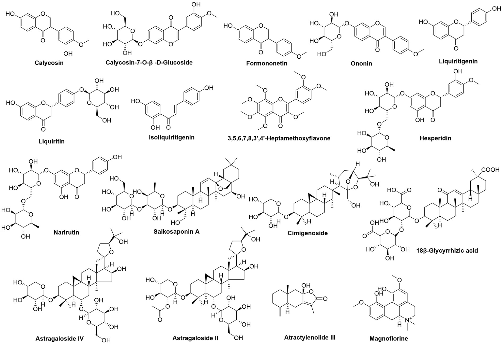

<!-- 方針: ほぼ全訳＋必要に応じた補足。原文構成（Abstract→Introduction→Materials and methods→Results→Discussion→Conclusions）に沿って訳出。「> 補足:」は訳者注。 -->

## 書誌情報

- 標題（原題）: Quantitative ternary network-oriented discovery of Q-markers from traditional Chinese medicine prescriptions: Bu-Zhong-Yi-Qi-Tang as a case study
- 著者・所属: Liufang Hu, Guotao Chen, Jiali Chen, Zhenyu Zou, Yuan Qiu, Jing Du, Xupeng Tong, Jiaxu Chen, Xinsheng Yao, Pei Lin\*, Liangliang He\*, Zhihong Yao\*（暨南大学(Jinan University)薬学院 中医薬現代化・新薬開発国際共同実験室／広東省中医薬効成分・新薬研究重点実験室ほか、中国広州。Tong Ren Tang Technologies Co. Ltd.（北京）、Hangzhou Chenfeng Qingxing Technology Co., Ltd.（杭州）との共同研究。\*印は責任著者）
- 掲載誌・巻号・DOI: *Phytomedicine* 133 (2024) 155918. https://doi.org/10.1016/j.phymed.2024.155918
- インパクトファクター: 約7.9（*Phytomedicine*, JCR 2024 / Clarivate。出典により6.7〜11.3と幅があり要確認）
- 受理経過 / ライセンス: 2024年5月3日受理、2024年7月4日改訂受理、2024年7月26日受理、2024年7月31日オンライン公開。© 2024 Published by Elsevier GmbH.

> 補足: BZYQT = 補中益気湯（Bu-Zhong-Yi-Qi-Tang、日本では「補中益気湯」、韓国では「Bojungikki-tang」）。BZYQP = 補中益気丸（Bu-Zhong-Yi-Qi-Pill、BZYQTの商品化製剤）。SIC = 小腸内容物（small intestinal contents）。EWM = エントロピー重み法（entropy weight method）。Q-marker = 品質マーカー（quality marker）。ConA = コンカナバリンA、LPS = リポ多糖。本論文は分析化学（UPLC-QqQ-MS/MS、HPLC-UVD-ELSD）と薬物動態、in vitro薬効評価を統合した研究論文。

## 要旨（Abstract）

**背景:** 漢方薬（TCM）処方に対するQ-marker提案は、TCM処方の品質管理における新たな研究領域である。しかし、複数の性質を持つQ-markerに関するこれまでの探索的研究は、一貫して重みの考慮を欠いており、各性質の重要度を正確に把握することを妨げ、Q-markerの理解を誤らせる可能性があった。

**目的:** 本研究では、TCM処方からQ-markerを視覚的に発見するための定量的三元ネットワーク戦略を初めて提案し、これを古典的なTCM処方である補中益気湯(BZYQT)の品質管理研究に適用した。

**方法:** まず、BZYQT中の34成分の含量と、生体試料（血漿および小腸内容物）中の17候補Q-markerの動態特性をUPLC-QqQ-MS/MSで特性評価するとともに、マクロファージおよび脾リンパ球における免疫調節活性を評価した。次に、得られたデータを被験性(testability)・バイオアベイラビリティ(bioavailability)・有効性(effectiveness)の3性質に統合し、エントロピー重み法(EWM)を用いてそれらの重みを算出することで、Q-markerを定量的にスクリーニングするための三元ネットワークをさらに構築した。続いて、同定されたBZYQTのQ-markerを、3社が製造する市販BZYQT製剤である補中益気丸(BZYQP)36バッチの全体的品質評価に、Q-marker基準の指紋の類似度評価を通じて活用した。

**結果:** 被験性・バイオアベイラビリティ・有効性という3つの中核性質を示す9化合物（ヘスペリジン、アストラガロシドIV、オノニン、18β-グリチルリチン酸、ナリルチン、カリコシン、シミゲノシド、アストラガロシドII、リクイリチン）が、三元ネットワークの回帰面積の順位に基づきBZYQTのQ-markerとして選抜された。Q-markerを共通ピークとして用いた場合、36バッチのBZYQPの類似度はHPLC-UVDモードで0.914〜0.998、HPLC-ELSDモードで0.631〜1.000となり、従来の共通ピークで評価した類似度（HPLC-UVDモード: 0.946〜0.990、HPLC-ELSDモード: 0.957〜0.997）よりも低い値を示した。この結果は、同定されたQ-markerが、異なる製造元によるTCM関連製品の全体的品質評価において、クロマトグラフィー指紋の共通ピークとしてより代表性が高いことを示唆している。

**結論:** BZYQTからのQ-markerの定量的発見は、その関連する商品化製品の全体的品質評価にとって重要な基盤を築くものであり、本研究はTCM処方の一貫性と有効性を確保するための新たな戦略を提供する。

> 補足: 略語一覧（原文Abbreviations）: BZYQT＝補中益気湯; BZYQP＝補中益気丸; SIC＝小腸内容物; EWM＝エントロピー重み法; TCM＝中医薬; ConA＝コンカナバリンA; LPS＝リポ多糖; LLOQ＝直線性・定量下限。

## 1. 序論（Introduction）

中国文明の宝である中医薬(TCM)処方は、数千年にわたり疾病の予防・治療に重要な役割を果たしてきた。特にCOVID-19パンデミック下では、治癒率の向上、罹病期間・死亡率の低減における有効性から世界的に注目が高まった(Huang et al., 2021)。しかし、TCMは「多成分・多標的」という特徴を持つため、複数の慢性・複合疾患の治療に有用である一方、有効成分・作用機序の不明確さや品質管理の不十分さといった限界により、標準化・国際化は大きな課題に直面している(He et al., 2021)。これを受けて、TCMの品質標準体系を強化するため、品質マーカー(Q-marker)の概念が提唱された(Liu et al., 2016)。Q-markerとは、TCM飲片・煎剤・エキス・製剤などのTCMおよびその製品に含まれる内在的化学成分であり、TCMの機能特性と密接に関連し、品質管理における安全性・有効性の指標物質として効果的に機能する。

Q-markerの概念が導入されて以来、TCMまたはTCM処方中のQ-markerを同定・弁別するため、ネットワーク薬理学、薬効学、フィトケミカル、薬物動態学、Chinmedomics、「スパイダーウェブ」モード、「レーダーチャート」モードなど、複数の戦略が提案・応用されてきた(Yeqing et al., 2022; Chu et al., 2022; Wang et al., 2023; He, et al., 2021; Zhang et al., 2021, 2020)。これらの戦略はTCM処方中のQ-markerの発見に成功し、新たな視点と参照を提供してきたが、依然として注意すべき論点が残されている。特に強調すべき重要な点は、複数の性質を持つQ-markerに関するこれまでの探索的研究が、一貫して重みの考慮を欠いていたことである。この見落としは、各性質の重要度を正確に把握する能力を妨げ、Q-markerの理解を誤らせる可能性がある。さらに、これまでの研究の多くは主に吸収成分に注目しており、腸内細菌叢を調節したり腸管に直接作用したりすることで間接的な効果を及ぼしうる腸内容物中の異物成分(xenobiotics)をしばしば無視しており、生理活性成分の除外につながっていた。特に消化器系の障害を改善するTCM処方については、腸管中に存在する成分についても考慮が必要である。

補中益気湯(BZYQT)は700年以上の歴史を持つ著名なTCM処方であり（「脾胃論」に記載）、下痢、慢性閉塞性肺疾患、喘息、子宮脱など、消化器・呼吸器・泌尿生殖器系の疾患の改善に広く用いられてきた(Hu et al., 2019, 2022)。君薬: 黄耆(Astragali Radix)；臣薬: 甘草(Glycyrrhizae Radix et Rhizoma)、白朮(Atractylodis Macrocephalae Rhizoma)、党参(Codonopsis Radix)；佐薬: 当帰(Angelicae Sinensis Radix)、陳皮(Citrus Reticulatae Pericarpium)；使薬: 升麻(Cimicifugae Rhizoma)、柴胡(Bupleuri Radix)、大棗(Jujubae Fructus)、生姜(Zingiberis Rhizoma Recens)から構成される。BZYQTはその薬効と健康効果によって高い評価を得ており、その人気は中国を越えて広がっている。日本では「補中益気湯」、韓国では「Bojungikki-tang」として広く認知されており、術後に疲労・食欲不振を経験する患者の栄養状態を改善する強壮剤として用いられている(Kiyohara et al., 2006; Lee et al., 2012)。現代の薬理学的研究では、BZYQTが抗ウイルス作用(Takanashi et al., 2017)、抗炎症作用(Yang et al., 2015)、抗菌作用(Yan et al., 2002)、免疫調節作用(Kao et al., 2000; Liu et al., 2019)を示すことが実証されている。BZYQTの広範な臨床応用を鑑み、丸剤・顆粒剤・内服液などの関連製剤が中国で開発され、いずれも中国薬局方に収載されている。しかし、BZYQT関連製剤の現行の品質規格はアストラガロシドIVのみを定量指標としており(Commission, 2020)、有効性と安全性を保証するには程遠い。さらに、既存の研究はBZYQTの製剤そのものよりも、物質的・生物学的基盤に主眼を置く傾向にあった。したがって、BZYQTに基づく適切なQ-markerの発見は、BZYQT関連製剤の包括的な品質評価の指針原則として、大きな意義を持つ。

我々の先行研究では、BZYQT中の161種の化学成分と、生体試料（血漿、尿、糞便）中の162種のBZYQT関連異物成分が同定され、血漿中のバイオアベイラブルな成分のうちフラボノイド類とトリテルペノイド類が重要な部分を占めることが示された(Hu, et al., 2019; Liu, et al., 2019)。さらに、poly(I:C)誘発肺炎症およびPeyer板に対するBZYQTの免疫調節活性が実証されており、これには肺への好中球浸潤の減少、B細胞数の増加、マクロファージのマーカーであるF4/80のmRNA発現の下方制御が含まれる(Hu, et al., 2022; Liu, et al., 2019)。最近の知見では、ラットの小腸内容物(SIC)中にもBZYQT関連成分の大部分が存在することが明らかとなっている(Hu, et al., 2022)。BZYQTの粘膜免疫に対する特徴的な調節作用を踏まえると、BZYQTのQ-marker発見においては、血漿だけでなくSIC中の異物成分も考慮することが不可欠である。

本研究では、BZYQTを事例として、TCMからのQ-marker定量的発見とそれに続く市販製品の全体的品質評価への応用のための戦略を開発した(Fig. 1)。第一に、BZYQTを調製し、その多成分の含量をUPLC-QqQ-MS/MSにより定量した。第二に、候補Q-markerをスクリーニングするため、血漿およびSIC中の異物成分を同時定量することでBZYQTの動態特性を特性評価した。第三に、BZYQTのin vivo有効性と密接に関連するin vitro活性を評価し、候補Q-markerの活性を確認した。第四に、候補Q-markerの含量・動態特性・活性に関するデータを、被験性・バイオアベイラビリティ・有効性という3つの中核性質にそれぞれ統合し、エントロピー重み法(EWM)を用いて各性質に重みを付与した。続いて、回帰面積値の順位を同定の根拠として、三元ネットワークを構築することでBZYQTのQ-markerを定量的に発見した。最後に、HPLC-UVD-ELSD指紋に基づき、3社が製造する複数バッチの市販BZYQT製剤である補中益気丸(BZYQP)の全体的品質を評価するために、Q-markerを用いた。本研究は、TCM標準煎剤からのQ-marker発見、および関連製品の全体的品質評価のパラダイムを提供することが期待される。

## 2. 材料と方法（Materials and Methods）

### 2.1 試薬・材料

蜜炙黄耆(Astragali Radix praeparata cum mellex)、麩炒白朮(Atractylodis Macrocephalae Rhizoma)、蜜炙甘草(Glycyrrhizae Radix et Rhizoma praeparata cum melle)、当帰(Angelicae Sinensis Radix)、党参(Codonopsis Radix)、柴胡(Bupleuri Radix)、升麻(Cimicifugae Rhizoma)、陳皮(Citrus Reticulatae Pericarpium)、生姜(Zingiberis Rhizoma Recens)、大棗(Jujubae Fructus)の生薬は、Tong Ren Tang Technologies Co. Ltd.（北京、中国）から提供された。これら10種の薬用材料の水分含量・外観・検査項目・マーカー含量を含む品質評価は、同社によって実施された(Hu et al., 2023)。3つの人気製造元による補中益気丸(BZYQP)36バッチ（各12バッチ）は、広州（中国）の各地の薬局から購入された。純度98％以上の標準品はChengdu Chroma-Biotechnology Co., Ltd.（成都、中国）から調達した。LC-MSグレードのアセトニトリルおよびギ酸はFisher Scientific（Fair Lawn, New Jersey, USA）から入手した。精製水はWatsons Group（広州、中国）から入手し、その他の試薬は市販の分析グレードを用いた。マウスRAW264.7マクロファージはFuHeng Biology Co., Ltd.（上海、中国）から入手した。コンカナバリンA(ConA)およびリポ多糖(LPS)はSigma（Sigma-Aldrich Co., Germany）から購入した。ACK溶解バッファー、一酸化窒素(NO)およびCCK8キットはBeyotime Biotechnology Co., Ltd.（上海、中国）から入手した。Dulbecco改変イーグル培地(DMEM)、ウシ胎児血清(FBS)、リン酸緩衝生理食塩水(PBS)、ペニシリン-ストレプトマイシン混合溶液はHyclone（Utah, USA）から入手した。

### 2.2 BZYQTの調製

古書「脾胃論(Pi-Wei-Lun)」に記載の抽出方法と、2020年版中国薬局方に収載された生薬配合比に基づき、BZYQT標準煎剤の1日量を以下のように調製した: 蜜炙黄耆(6.7 g)、麩炒白朮(2.0 g)、蜜炙甘草(3.3 g)、当帰(2.0 g)、党参(2.0 g)、柴胡(2.0 g)、升麻(2.0 g)、陳皮(2.0 g)、大棗(1.3 g)、生姜(0.7 g)の混合物を、飲用水600 mLとともに100 ℃で煎じ、最終容量300 mLとした。この煎液を減圧下45 ℃で生薬重量の5倍まで濃縮し、凍結乾燥して粉末とした。

### 2.3 動物実験と検体採取

**動物:** Sprague-Dawley(SD)ラット（体重200 g±10 g）およびBALB/cマウス（生後7週）はBeijing HFK Biotechnology Co., Ltd（北京、中国）から購入した。動物は温度24±2 ℃、相対湿度50±5％、12時間明暗サイクルの制御された環境で飼育し、標準飼料と水を自由摂取させた。全ての動物実験は暨南大学の実験動物の管理・使用に関する倫理基準（倫理審査番号20210826-12）に従って実施した。全ての動物は実験前に7日間馴化させた。

**血漿薬物動態:** 実験前にラットを12時間絶食させ、自由に水を摂取させた。その後、3群（Group I、II、III、各n=6）に無作為に割り付けた。Group IおよびIIのラットはBZYQTをそれぞれ7.5、15 g/kg/day（生薬換算）で単回経口投与し、Group IIIのラットはBZYQTを7.5 g/kg/dayで1日2回、3日間連続経口投与した。最終投与後0.5、1、2、4、6、8、12、24、36、48、60、72時間にラットの頸静脈から約200 μLの血液を採取し、ヘパリン処理チューブに入れた後、遠心分離（13,000 rpm、10分）して血漿を得た。

**小腸内容物中の動態:** ラットにBZYQTを7.5 g/kg/dayで1日2回、3日間連続経口投与した。最終投与後、各時点（0.25、0.5、1、2、4、6、8、12、24、36、48、60時間、各n=5）でラットを麻酔し、小腸を丁寧に摘出した。管腔内を蒸留水で十分に洗浄して小腸内容物を採取し、凍結乾燥して粉末試料を得た。

全ての試料は分析まで直ちに-80 ℃で保管した。

### 2.4 検体前処理

**BZYQTエキス前処理:** BZYQT凍結乾燥粉末0.2 gを正確に量り、60％メタノール水溶液(w/v) 10 mLで、超音波処理（30 ℃、100 KHz）を伴う水浴中30分間抽出した。得られたエキスを適切な溶媒で希釈し、UPLC-QqQ-MS/MS分析用の最終濃度（100 μg/mL）とした。分析前に全ての作業溶液を14,000 rpmで10分間遠心した。定量分析のため、BZYQT 6バッチを調製・処理した。最終的に上清2 μLをUPLC-QqQ-MS/MSに注入した。

**血漿試料前処理:** 血漿100 μLをIS1（ジクロフェナク）作業溶液50 μL、アセトニトリル300 μL、メタノール50 μLとボルテックス混合1分し、遠心分離（14,000 rpm、4 ℃、10分）した。得られた上清を移し、室温で窒素ガス下乾固した。残渣をメタノール100 μLに再溶解し、ボルテックス混合1分後、14,000 rpmで10分間遠心した。最終的に上清4 μLをUPLC-QqQ-MS/MSに注入した。

**SIC試料前処理:** 小腸内容物粉末約1 mgを正確に秤量し、IS2（エピメジンC）作業溶液50 μL、メタノール250 μL、アセトニトリル200 μLでボルテックス抽出2分した。14,000 rpmで20分間、4 ℃で遠心後、上清100 μLを移し、室温で窒素ガス下乾燥した。残渣をメタノール300 μLに再溶解し、ボルテックス混合2分後、再度14,000 rpmで20分間遠心した。最終的に上清2 μLをUPLC-QqQ-MS/MSに注入した。

**BZYQP前処理:** BZYQP試料36バッチをそれぞれ微粉末に粉砕した。粉末1.0 gを量り、60％メタノール水溶液(w/v) 10倍量で、超音波処理（30 ℃、100 KHz）を伴う水浴中30分間抽出した。全ての作業溶液を分析前に14,000 rpmで10分間遠心した。

### 2.5 装置・分析条件

**(1) UPLC-QqQ-MS/MS分析（クロマトグラフィー）:** 二元ポンプ溶媒系とオートサンプラーを備えたACQUITY™ UPLC I-Classシステム（Waters Co., Milford, MA, USA）を使用した。ACQUITY UPLC HSS T3カラム（2.1 mm×100 mm、1.8 μm、40 ℃）を、BZYQTエキス・血漿・SIC中の多成分決定用の分離システムとして用いた。移動相は水(A)およびアセトニトリル(B)（いずれも0.1％ギ酸(v/v)含有）とし、流速0.3 mL/minで送液した。定量分析に用いたグラジエントプログラムは以下の通り: B 5％(0–0.5 min)、5–30％(0.5–3.5 min)、30–40％(3.5–12.5 min)、40–100％(12.5–15 min)。血漿については、10–30％(0–2 min)、30–35％(2–5 min)、35–40％(5–6 min)、40–60％(6–10 min)、60–90％(10–14 min)、90–100％(14–15 min)。SICについては、5％(0–0.5 min)、5–22％(0.5–1.5 min)、22％(1.5–4.5 min)、22–40％(4.5–8.5 min)、40–65％(8.5–13 min)、65–85％(13–14.5 min)、85–100％(14.5–15.5 min)。オートサンプラー温度は15 ℃に維持した。

**(2) 質量分析(MS)検出:** ESI源を備えたXevo TQ-XS質量分析計（Waters Co.）で実施した。多重反応モニタリング(MRM)モードを陽イオンモード(ESI+)で使用した。MS分析条件: イオン源温度150 ℃、脱溶媒温度500 ℃、キャピラリー電圧3 kV、コーンガス流量50 L/h、脱溶媒ガス流量1000 L/h。滞留時間は自動設定とし、各化合物の最適化MRMパラメータはTable S1に記載。

**HPLC-UVD-ELSD分析（BZYQP指紋）:** 多波長紫外検出器(UVD)および蒸発光散乱検出器(ELSD)を備えたAgilent 1200 HPLCシステムを用いてBZYQPの指紋分析を実施した。システム制御・データ解析はChemStationおよびAllchrom Plusソフトウェアで実施した。クロマトグラフィー分離はPoroshell 120 EC-C18カラム（100 mm×4.6 mm、2.7 μm、40 ℃）で実施した。移動相は流速1 mL/minで、(B)アセトニトリルおよび(C)水（いずれも0.1％ギ酸含有、v/v）とした。グラジエント溶出プロファイル: 10–30％B(0–15 min)、30–62％B(15–25 min)、62–100％B(25–30 min)。注入量10 μL、検出波長は280 nm(0〜16 min)および254 nm(16〜30 min)で測定した。ELSDのドリフトチューブ温度は95 ℃、キャリアガス流量は2.5 L/minとした。

### 2.6 細胞実験

**RAW264.7マクロファージの培養・処理:** マウスRAW264.7マクロファージは、10％ウシ胎児血清(FBS)および1％ペニシリン-ストレプトマイシンを添加したDMEM培地中、5％CO2・37 ℃の加湿インキュベーターで培養した。細胞（2×10^5 cells/mL、100 μL）を96ウェルプレート（Corning, Franklin Lakes, NJ, USA）に播種し、融合度が80〜90％に達するまで24時間培養した。次に、元の培地を除去し、LPS（1 μg/mL）を含む新鮮培地90 μLと、種々の濃度のBZYQTエキス（滅菌水に溶解）または単一化合物（DMSOに溶解、最終DMSO濃度0.5％(v/v)）10 μLを添加した。さらに24時間培養後、細胞生存率をCCK8アッセイで測定し、上清を用いてGriess法によりNO含量を測定した。本実験ではヒドロコルチゾン100 μMを陽性対照薬とした。

**脾リンパ球の培養・処理:** BALB/cマウスから脾リンパ球を得るため、マウスを安楽死させた後、無菌条件下で脾臓を摘出した。脾臓を無菌の70 μmセルストレーナー（BD, Franklin Lakes, NJ, USA）上に置き、注射器プランジャーの基部を用いてメッシュ内にわずかに擦り潰した。その後、PBSで細胞を洗浄しセルストレーナーを通すことで細胞懸濁液を調製した。遠心分離とACK溶解バッファーによる赤血球除去の後、細胞沈渣を、5％FBS、1％ペニシリン-ストレプトマイシン、0.05 mM β-メルカプトエタノールを含むRPMI 1640完全培地3 mLに懸濁した。BZYQTおよび候補Q-markerのリンパ球増殖への影響を検討するため、細胞密度を、ConA（1 μg/mL）またはLPS（10 μg/mL）を含むRPMI 1640完全培地を用いて3×10^6 cells/mLに調整した。続いて、細胞を96ウェルプレート（90 μL）に添加し、種々の用量のBZYQTエキス（1、10、100、250、500、1000 μg/mL）または単一化合物（1、5、10、20、50、100 μM）10 μLで処理した。細胞を48時間培養した後、CCK8アッセイによりT・B両リンパ球の増殖活性を測定した。

### 2.7 定量分析法のバリデーション

**BZYQT中34化合物の定量分析:** 34種の標準品それぞれの原液をメタノールに溶解して10 mLメスフラスコに保存し、4 ℃で保管した。検量線作成のため、各標準品溶液の適量を10 mLメスフラスコに移し、メタノールで段階的に希釈（希釈係数=2）して濃度の異なる7種の標準作業溶液を得た。開発した方法は直線性・精度・再現性・安定性・回収率の観点からバリデートした。

**血漿・SIC中異物成分の濃度決定:** 米国食品医薬品局(FDA)のバイオアナリティカル法バリデーションガイダンス(FDA, 2001)に従い、特異性、精度・正確度、直線性・定量下限(LLOQ)、抽出回収率、マトリックス効果、安定性を含む方法バリデーションを実施した。

**BZYQPの指紋分析:** 同一溶液を連続6回注入して精度を決定し、同一バッチのBZYQPから調製した6個の独立した溶液を用いて再現性を評価した。安定性は0、2、4、8、12、24時間の異なる時間間隔で測定した。

### 2.8 三元ネットワークの構築とQ-markerの定量的発見

三元ネットワークはExcelソフトウェアを用いて、DT（被験性）・DB（バイオアベイラビリティ）・DE（有効性）からなる三次元レーダーマップとして構築した。続いて、各候補Q-markerの回帰面積を以下の式で算出した:

S = 1/2 × sin(360/3)° × (DT×DE + DE×DB + DT×DB)

回帰面積のスコア順位を優先することで、Q-markerを定量的に選抜した。

### 2.9 統計解析

データはGraphPad Prism 8.0.2ソフトウェア（GraphPad Software Inc., La Jolla, CA, USA）で解析し、結果の有意性はDunnettの多重比較検定を伴う一元配置分散分析(one-way ANOVA)で評価した。p値が0.05未満の場合、群間に有意差があると判定した。結果は平均値±SDで示し、少なくとも2回の独立した実験から得た。

## 3. 結果（Results）

### 3.1 BZYQT中の化学成分の定量分析

BZYQT中の多成分の含量分布についての包括的な理解を得て、その品質を管理するためには、主要成分を定量的に評価することが不可欠である。通常、血流に吸収された異物成分は有効性の指標と考えられるが、バイオアベイラビリティが限られた一部の成分でも、腸管内で作用することによって効果を発揮しうることに注意を要する(He et al., 2018)。これは特に、脾胃を調整するTCM処方において重要である。そこで、BZYQTの化学的・in vivo代謝プロファイルに関する先行の特性評価(Hu, et al., 2019; Liu, et al., 2019)に基づき、フラボノイド15種、トリテルペノイド10種、テルペノイド5種、有機酸2種、アルカロイド1種、その他構造1種を含む34種の特徴的化合物を選定し、UPLC-QqQ-MS/MSによる同時定量分析を実施した。

定量法は特異性・直線性・精度・再現性・正確度・安定性の各観点から厳密にバリデートされた。Fig. S1およびTable S2-S4より、同一保持時間における明らかな妨害は認められず、34化合物すべての検量線は相関係数(r²)≥0.9990を示し、精度・再現性・安定性のRSDはそれぞれ最大5.8％、6.9％、4.3％を超えなかった。平均回収率は96.15％〜104.88％の範囲で、RSDは4.7％以内であった。次に、確立した定量法を用い、BZYQT 6バッチ中の34化合物の含量を定量することに成功した（Fig. 2、Table S5参照）。BZYQT中の定量化合物の総含量は8661.59 μg/gであった。これらの化合物のうち、ヘスペリジン(2478.96 μg/g)が最も多く、次いで18β-グリチルリチン酸(1652.22 μg/g)、イソフェルラ酸(798.30 μg/g)、リクイリチン(712.79 μg/g)、ナリルチン(641.41 μg/g)、フェルラ酸(438.01 μg/g)、アストラガロシドI(232.76 μg/g)の順であった。一方、ブチルフタリドの含量はわずか0.73 μg/gにとどまり、他のテルペノイド類も低濃度であったが、これは煎じる際の高温曝露下での安定性の低さに起因すると考えられる。

### 3.2 血漿・SIC中の動態特性の特性評価

我々の先行の代謝学的研究(Hu, et al., 2019)、および以下の原則: (1) 血漿またはSIC中で確実に検出可能であること、(2) 多様な化学構造・薬用材料を網羅することに基づき、それぞれ8種・15種のバイオアベイラブルな成分をラット血漿・SIC中の定量対象として選定した。次いで、血漿・SIC中の多成分同時定量法をUPLC-QqQ-MS/MSにより開発・バリデートした。方法バリデーション結果は、血漿中8種の分析対象成分が良好な特異性（明らかな妨害なし、Fig. S2）、良好な直線性（r≥0.9928、Table S6）、許容可能な日内・日間精度および正確度（RSD≤13.2％、−14.1≤RE≤13.2％）、マトリックス効果（85.3〜111.6％、ただしグリチルレチン酸は64.6〜72.2％を除く）、抽出回収率（85.6〜110.5％、Table S7）、良好な安定性（RSD≤13.5％、Table S8）を示すことを明らかにした。SIC中15種の分析対象成分のバリデーション結果はFig. S3、Table S9-S13に示されており、方法論として適格であることが確認された。これらの信頼性の高い方法は、BZYQTのラットへの経口投与後の対応する生体試料中の分析対象成分の定量、および濃度-時間曲線と関連する動態パラメータの描出に、首尾よく適用された。

**血漿中のBZYQTの薬物動態:** Fig. 3およびTable S14に示すように、フォルモノネチンは血中への速やかな吸収を示した。しかし、BZYQTを7.5 g/kg/dayの単回投与としたラットにおいて、カリコシンおよび3,5,6,7,8,3′,4′-ヘプタメトキシフラボンの血漿中濃度は低く、十分に定量できなかった。15 g/kg/dayの投与時でも、カリコシンのCmaxおよびAUC0–∞はそれぞれ0.20±0.03 ng/mL、2.14±0.57 ng/mL・hにとどまった。生体内での一連の脱メチル化反応に起因して(Hu, et al., 2019)、3,5,6,7,8,3′,4′-ヘプタメトキシフラボンはBZYQT 15 g/kg/day経口投与後もCmax(1.86±0.68 ng/mL)、AUC0–∞(24.52±4.14 ng/mL・h)ともに低値を示した。アトラクチレノリドIII（主に白朮由来のセスキテルペノイド）は速やかに吸収され(Tmax、0.83±0.26 h)、Cmax 0.78±0.10 ng/mLに達した後、8時間でほぼ消失し(t1/2、9.97±4.70 h)、これは先行研究(Yan et al., 2015)の知見と一致した。

BZYQTエキス中の18β-グリチルリチン酸含量は1652.22 μg/gに達したが、腸内細菌により容易にグリチルレチン酸へと加水分解された後、血流に吸収されて効果を発揮した(Chen et al., 2017; Wang et al., 2017)。本研究では、グリチルレチン酸は緩徐な吸収・消失特性を示し(Tmax、12.00±6.20 h; t1/2、26.46±5.35 h)、BZYQTを7.5 g/kg/dayで単回経口投与した後、他の分析対象成分と比較して相対的に高い値（Cmax、204.162±65.52 ng/mL; AUC0–∞、6942.75±517.03 ng/mL・h）を示した。特筆すべきことに、ラットにBZYQT 15 g/kg/dayを単回投与した場合、グリチルレチン酸のAUC0–∞は67,118.59±10,247.41 ng/mL・hへと有意に増加し、これは中用量（7.5 g/kg/day）投与時の約10倍であった。血漿中のシミゲノシドの曝露量は顕著に高く、AUC0–∞はBZYQT 7.5 g/kg/day単回投与時に2933.963±280.00 ng/mL・h、15 g/kg/day投与時に2279.42±291.17 ng/mL・hに達したが、明らかな用量依存的関係は認められなかった。文献調査によると、Cimicifuga foetida L.エキスのラットへの経口投与後のシミゲノシドの絶対経口バイオアベイラビリティは238〜319％であり、この著しく高いバイオアベイラビリティは、他のシミシフゴシド類のシミゲノシドへの相互変換に起因する可能性がある(Gai et al., 2012)。

7.5 g/kg/dayの複数回経口投与後のBZYQTの薬物動態特性は、単回投与レジメンと比較して差異を示した(Table S15)。例えば、グリチルレチン酸(845.29±80.59 ng/mL)およびシミゲノシド(80.41±8.98 ng/mL)のCmaxは、単回投与時に観察された値より高かった。逆に、フォルモノネチン、リクイリチゲニン、イソリクイリチゲニン、アトラクチレノリドIIIはCmaxの低下を示したが、AUC0–∞は増加し、MRT0–∞も増加した。

**SIC中のBZYQTの動態特性:** Fig. 4およびTable S16に示すように、大部分のフラボノイド類は2時間以内にCmaxに達し、その後6時間で代謝変換または次の腸管への排出を経て消失した。リクイリチン、オノニン、カリコシン-7-O-β-D-グルコシドなどのフラボノイドモノグリコシド類は、Tmax・T1/2・MRT0–∞の値に基づき顕著に類似した動態特性を示し、ヘスペリジン、ナリルチンなどのフラボノイドジグルコシド類も同様であった。特にリクイリチンは腸管内で主にリクイリチゲニンへと加水分解され、その結果、リクイリチゲニンのCmax(113.92±43.11 μg/g)はイソリクイリチゲニンと比較して有意に高値を示した。さらに、ヘスペリジンは2524.07±1252.30 μg/gという最も高いCmaxを示したが、そのMRT0–∞（2.07±0.12 h）とAUC0-t（7880.01±4261.13 μg/g・h）が比較的短いことに示されるように、急速に代謝された。

フラボノイド類と比較して、トリテルペノイド類は代謝が緩慢で、腸管内での平均滞留時間が長かった。例えば、グリチルレチン酸、アストラガロシドIV、シミゲノシドのMRT0–∞はそれぞれ103.59±48.93 h、14.20±11.81 h、13.14±7.07 hと顕著に延長した。興味深いことに、18β-グリチルリチン酸のCmaxが1372.94±863.10 μg/gであったのに対し、そのアグリコンであるグリチルレチン酸はわずか141.49±104.89 μg/gであった。このSIC中の濃度は血漿中で見られた濃度よりもかなり低かったが、両化合物のAUC0–∞値は同程度であった。さらに、グリチルレチン酸には36時間で二峰性のピークが観察され、腸管から血流への吸収の後、肝臓から胆管を介して排出され、再び腸管内へ戻る経路の可能性が示唆された。シミゲノシドのAUC0–∞（377.15±27.84 μg/g・h）も血漿中濃度より低く、急速に排出された。したがって、グリチルレチン酸およびシミゲノシドは血液循環を介して効果を発揮する可能性があるのに対し、アストラガロシドIVは主に腸管に作用する可能性があると推察された。サイコサポニンAについては、BZYQT水エキス中の含量が125.84 μg/gであったのに対し、そのCmaxは167.69±77.62 μg/gに達し、これは2-O-アセチルサイコサポニンA/B2などの脱アセチル化産物に起因する可能性がある。アルカロイド類については、約1.5時間というTmax値で速やかにピーク濃度に達した。しかし、高いMSスペクトル応答にもかかわらず、マグノフロリンのCmaxはわずか2.88±1.30 μg/gであった。

### 3.3 候補Q-markerの選定とRAW264.7・脾リンパ球でのin vitro免疫調節活性評価

本研究では、化学的伝達性・トレーサビリティの原則に従い、BZYQT中に内在し、経口投与後に血漿・SIC中で定量的に検出可能であった17種の化学成分を候補Q-markerとして選定した。これには18β-グリチルリチン酸、3,5,6,7,8,3′,4′-ヘプタメトキシフラボン、アストラガロシドII、アストラガロシドIV、アトラクチレノリドIII、カリコシン、カリコシン-7-O-β-D-グルコシド、シミゲノシド、フォルモノネチン、ヘスペリジン、イソリクイリチゲニン、リクイリチゲニン、リクイリチン、マグノフロリン、ナリルチン、オノニン、サイコサポニンA(Fig. 5)が含まれる。さらに、先行研究で示されたように、BZYQTはマクロファージおよびリンパ球に対する免疫調節効果を示す(Hu, et al., 2022)。したがって、これら候補Q-markerの活性をRAW264.7細胞および脾リンパ球を用いて評価した。グリチルレチン酸はin vivoでの代謝物ではあるが、免疫調節活性の評価対象に含めた。

RAW264.7におけるLPS誘発性の細胞生存率・NO産生、およびConA・LPSによりそれぞれ誘発されるT・Bリンパ球の増殖率に対するBZYQTの効果を、まず評価した。Fig. 6a・bに示すように、モデル群と比較して、BZYQTは1〜250 μg/mLの濃度範囲でRAW264.7細胞の増殖を有意に促進し、NO含量も同様であった。しかし、500・1000 μg/mLというより高い濃度では、BZYQTはNO放出を著しく抑制した。さらに、Tリンパ球およびBリンパ球の増殖は、BZYQT 1 μg/mLで妨げられた。逆に、Tリンパ球は250 μg/mLで顕著な促進を、1000 μg/mLで抑制を示した。一方、Bリンパ球数は100〜500 μg/mLで用量依存的な様態を示し、1000 μg/mLでわずかな低下が観察された(Fig. 6c・d)。BZYQTのBリンパ球に対する調節効果がTリンパ球に対するものより強いと考えられたことから、候補Q-markerの免疫調節活性はさらに、LPS誘発性脾B細胞増殖を用いて評価した。

17種の候補Q-markerの免疫調節効果は、LPS誘発RAW264.7細胞のNOレベルおよびLPS誘発脾B細胞の細胞生存率の標準化フォールドチェンジとして示され、Fig. 6eのヒートマップに視覚的に表現した。詳細なヒストグラムはFig. S4・S5に示す。RAW264.7細胞に対する17種の候補Q-markerの細胞生存率はTable S17にまとめた。結果を観察すると、大部分の候補Q-markerは異なる濃度でNO放出またはBリンパ球増殖に対して抑制効果を示すことが明らかとなった。特に、カリコシン、フォルモノネチン、ナリルチンは1〜100 μMの濃度でRAW264.7細胞の増殖促進とNOレベルの上昇に強い活性を示した。一方、アストラガロシドII・IV・フォルモノネチンは主に脾B細胞の増殖を誘導し、免疫増強効果を示したのに対し、他の化合物は主に免疫抑制活性を示した。

### 3.4 三元ネットワークに基づくBZYQTからのQ-markerスクリーニング

**17種の候補Q-markerの被験性・バイオアベイラビリティ・有効性:** BZYQT中の17種の候補Q-markerの被験性の値は、標準化した含量に基づき算出した(Table S18)。バイオアベイラビリティ評価については、血漿およびSICへのin vivo曝露に割り当てられた重みは、EWMによりそれぞれ63.73％、36.27％と算出された。18β-グリチルリチン酸については、主にグリチルレチン酸の形で血流に吸収されるため、その血漿AUC0-tはグリチルレチン酸の薬物動態パラメータに基づき決定した。17種の候補Q-markerのバイオアベイラビリティ値の詳細データはTable S19に示す。有効性の算出にあたっては、まずリンパ球およびRAW264.7細胞の重みがそれぞれ62.48％、37.52％と決定され、詳細な算出結果はTable S20に示した。次に、両免疫細胞に対する17種の候補Q-markerの標準化活性値はTable S21・Table S22に示す通り算出した。有効性の値は、RAW264.7とリンパ球のデータを組み合わせて評価した。Table S22に示すように、カリコシンが最も高い有効性値を示し、次いでフォルモノネチン、アストラガロシドIV、リクイリチゲニン、オノニンの順であった。

**三元ネットワークに基づくBZYQT中のQ-markerの発見:** 17種の候補Q-markerの標準化含量、血漿・SICへの曝露、マクロファージ・リンパ球に対する免疫調節活性という前述のデータに基づき、被験性(49.747％)、バイオアベイラビリティ(26.086％)、有効性(24.166％)の重みをEWMにより算出した。次に、3性質の評価データを統合して三元ネットワークを構築し、17種の候補Q-markerの回帰面積値をTable S23・Fig. 7に示す通り算出した。回帰面積値の順位に基づき、中央値の原則により、ヘスペリジン、アストラガロシドIV、オノニン、18β-グリチルリチン酸、ナリルチン、カリコシン、シミゲノシド、アストラガロシドII、リクイリチンがBZYQTのQ-markerとして選抜された。これらのQ-markerは、フラボノイド類とトリテルペノイド類という2つの主要な化学構造を含む。

> 補足: 上記の重み値について、原文の本セクションでは「被験性(49.747%)、バイオアベイラビリティ(26.086%)、有効性(24.166%)」という順に列挙されているが、原文の考察(Discussion)セクションおよびFig. 1のフローチャート内の数値表示では「被験性49.747%、有効性26.086%、バイオアベイラビリティ24.166%」となっており、有効性とバイオアベイラビリティの数値が入れ替わっている。図中の表記および考察部の記述が一致していることから、正しくは被験性49.747%・有効性26.086%・バイオアベイラビリティ24.166%である可能性が高い（本セクションの原文の記載順は誤記の可能性がある）。数値そのものは原文のまま訳出し、ここに原文内の不整合として付記する。

### 3.5 BZYQTのQ-markerを用いたBZYQPの全体的品質評価

BZYQPはBZYQTから派生した人気の市販製品であり、主に3つの製造元により製造される。BZYQP中の成分は、使用される10種の薬用材料の産地の違いや調製技術の違いにより、製造元間で変動しうる。そこで、BZYQTのQ-markerを用いて、36バッチのBZYQPの全体的品質を評価した。本研究では、関連企業の要求により整合するよう、HPLC-UVD-ELSDを用いたQ-marker基準の指紋分析法という、より汎用性の高い分析法を新たに開発した。確立したHPLC-UVD-ELSD指紋法は、精度・再現性・安定性を評価するための包括的なバリデーションを実施した。結果は全パラメータが要求規格を満たすことを示し、特徴的ピークの相対保持時間のRSDはそれぞれ最大0.08％、0.10％、0.42％を超えず、相対ピーク面積のRSDはそれぞれ最大4.01％、4.3％、4.74％を超えなかった。BZYQPの指紋で観察された特徴的ピークは、標準品との保持時間比較により同定した(Fig. 8(a)・(b))。合計25化合物が正確に同定され、これには8種のQ-markerが含まれた。ただし、アストラガロシドIVは現行のHPLC-UVD-ELSD条件下では検出できなかった点に留意すべきである。

> 補足: 上記の相対保持時間RSD(0.08%・0.10%・0.42%)および相対ピーク面積RSD(4.01%・4.3%・4.74%)は、原文の記載順から精度(precision)・再現性(repeatability)・安定性(stability)の各評価に対応すると解される（2.7節参照）が、原文に明示的な対応表記はなく、詳細はTable S24等原文参照。

次に、36バッチのBZYQPの全体的品質を評価するため、Similarity Evaluation Systemソフトウェアを用いて、8種のQ-marker（アストラガロシドIVを除く）を共通ピークとした類似度解析を実施した。結果(Table S24、Fig. 8(c)・(d))は、3つの製造元(A、B、C)による36バッチのBZYQPの類似度が、HPLC-UVDモードで0.914〜0.998、HPLC-ELSDモードで0.631〜1.000の範囲であることを示した。また、クロマトグラフィー指紋における従来の共通ピークを用いた類似度解析も実施した。しかし、その結果はQ-marker解析で得られた類似度値と大きく異なった。この場合、同じ36バッチのBZYQPの類似度は、HPLC-UVDモードで0.946〜0.990、HPLC-ELSDモードで0.957〜0.997というより高い値を共有していた(Table S25)。

## 4. 考察（Discussion）

煎剤は、TCMの中で最も広く使用され、臨床応用の歴史が最も長い剤形であり、速やかな発現と吸収の良さという利点を有する。したがって、伝統的煎剤の物質的基盤・生物学的基盤に基づいて発見されたQ-markerは、現代製剤の品質評価における品質管理指標として機能しうる。BZYQTは、中国・日本・韓国で人気を博している古典的TCM処方であり、様々な市販製剤として入手可能である。本研究では、標準煎剤の調製法に従い、水で煎じた後、濃縮・凍結乾燥することによりBZYQTを調製した。我々の先行研究は、その化学的・in vivo代謝プロファイルを定性的に特性評価し、マクロファージおよびリンパ球に対する免疫調節活性を同定してきた(Hu, et al., 2022; Liu, et al., 2019)。したがって、BZYQTは、TCM処方の標準煎剤からのQ-marker発見に理想的な事例研究として機能する。得られた結果は、TCM関連市販製品の全体的品質評価に応用できる。

Liu Changxiao教授が提唱したQ-marker確立のアプローチによれば、吸収成分の化学組成と薬物動態特性を決定することが不可欠である。さらに、TCM処方の主要な作用に関連する成分を検討し、TCM理論に従って効果関連マーカーを発見することが必要であり、これはQ-markerとみなすことができる(Yang et al., 2017)。しかし、有効性と密接に関連しうる吸収可能成分に加えて、実際には一部の非吸収成分が、腸管の上皮細胞・免疫細胞に直接作用したり、腸内細菌叢のバランスを調節したりすることで役割を果たしている可能性がある(Lin et al., 2021)。さらに、TCMまたはTCM処方からQ-markerを発見するための様々な方法が存在するにもかかわらず(Yeqing et al., 2022; Chu et al., 2022; Wang et al., 2023; He, et al., 2021; Zhang et al., 2021, 2020)、大部分の研究者はQ-markerの基本条件を等重みで解析・評価する傾向にあり、Q-marker性質の重要度の順位付けを見過ごしてきた。本研究では、TCM処方におけるQ-markerの先駆的発見のために、被験性・バイオアベイラビリティ・有効性を統合した新規の定量的三元ネットワークを導入した。この革新的アプローチは、従来法の限界を打破し、各性質の重要度をより精緻に評価することを可能にする。BZYQTの含量・動態特性・細胞生物活性は、それぞれ被験性・バイオアベイラビリティ・有効性として割り当てられ、それらの重みを算出してさらに三元ネットワークを構築するために用いられた。化合物の含量はTCMの品質管理の基盤であり、in vivo曝露を決定する上でも重要な役割を果たすため、有効性の基本的な保証としても機能する。したがって、成分の被験性は含量に基づき評価した。さらに、成分のin vivo曝露は、そのバイオアベイラビリティを反映するために利用できる。BZYQTが臨床的に消化器疾患の改善に広く用いられていることを考慮し、血流に吸収される成分だけでなく、明確な動態特性を持つSIC中の異物成分も候補Q-markerとして検討し、そのバイオアベイラビリティプロファイルの理解をさらに深めた。加えて、Q-markerの有効性は、BZYQTの主要な免疫調節効果に関連する2種の免疫細胞で検証したが、これはQ-marker発見における重要な側面である。

異なる中核性質はQ-markerに対して様々な程度の影響を及ぼしうると考えられる。したがって、これらの中核性質の重要度を定義することが不可欠となる。重み算出の方法としては、階層分析法(AHP)、EWM、主成分分析(PCA)、因子分析など複数存在する。これらのうち、AHPとEWMが重み算出でより一般的に用いられている(Guo et al., 2022; Zeng et al., 2023)。本研究では、以下の理由からEWMを選択して重みを決定した。第一に、各指標の重み算出における主観的割当法の欠点を大幅に回避できること、第二に、本研究の目的がQ-marker性質の相対的な強さを比較し、意思決定に関与する平均的な内在情報を明らかにすることであり、これはEWMの概念と一致すること(Jin et al., 2024)である。したがって、EWMを重み決定に使用した。EWMを用いることで3つの中核性質の重みを算出した結果、被験性が最大の割合を占め49.747％に達し、次いで有効性(26.086％)、バイオアベイラビリティ(24.166％)の順となり、TCM処方の品質評価におけるQ-marker含量の重要性がさらに浮き彫りとなった。

三元ネットワークの構築と回帰面積の算出により、被験性・バイオアベイラビリティ・有効性という3つの中核性質を反映する9化合物が、BZYQTのQ-markerとして首尾よく選抜された。これらのうち、アストラガロシドIV、ヘスペリジン、リクイリチン、18β-グリチルリチン酸は中国薬局方が規定する品質管理指標である。さらに、シミゲノシドおよびカリコシンは、poly(I:C)誘発気道炎症においてin vivo免疫調節活性を示すことが実証されており、いずれもBZYQTの生理活性成分とみなされている(Hu et al., 2021; Hu, et al., 2022)。さらに、アストラガロシドIV、オノニン、カリコシン、アストラガロシドIIは君薬である黄耆(Astragali Radix)に由来し、18β-グリチルリチン酸とリクイリチンは臣薬である甘草(Glycyrrhizae Radix et Rhizoma)に由来し、ヘスペリジンとナリルチンは佐薬である陳皮(Citrus Reticulatae Pericarpium)に由来し、シミゲノシドは使薬である升麻(Cimicifugae Rhizoma)に由来する。これはBZYQTの配合特性をある程度反映している。定量的三元ネットワークによるQ-marker発見には特異性が含まれていないが、黄耆に特異的なアストラガロシドII・IV、甘草由来のリクイリチン、升麻由来のシミゲノシドなど、候補Q-marker選定の際には特異性がまず考慮された。要するに、これら9種のQ-markerは本質的に5つの基本性質（被験性、有効性、トレーサビリティ、配合性、特異性）に関連している。したがって、経験的証拠に基づき、TCM処方からQ-markerを定量的に発見する我々の方法論は、十分かつ妥当であることが立証された。

Fig. 8(d)は、保持時間23〜25分の間にグリココウマリン・アストラガロシドI・シミゲノシド・サイコサポニンDと同定された4本のピークが、製造元Bが製造したS13-S24では検出可能であった一方、他の2製造元の他バッチでは検出が困難であったことを示している。この場合、クロマトグラフィー指紋における従来の共通ピークを用いて類似度を解析すると、これら4本のピークの寄与は無視されることになり、3製造元間の36バッチBZYQP指紋の類似度は比較的高い値（HPLC-ELSDモードで0.957〜0.997）を示した一方、Q-markerを共通ピークとして類似度評価に用いた場合はより広い変動幅（HPLC-ELSDモードで0.631〜1.000）を示した。BZYQTのQ-markerを共通ピークとして類似度評価に用いることは、クロマトグラフィー指紋における従来の共通ピークを用いる場合よりも、品質の変動に対してより代表性・感度が高いことは明らかである。本アプローチは、異なる製造元の製品品質の微妙な違いを際立たせるだけでなく、一貫性評価の精度を高め、それにより信頼性の高い堅牢な評価プロセスを確保する。総じて、本研究はBZYQTの9種のQ-markerを成功裡に同定しただけでなく、TCM関連製品の全体的品質評価におけるTCM煎剤ベースのQ-marker応用の先例を確立し、TCM処方の一貫性と有効性を確保する新たな戦略を提供する。

## 5. 結論（Conclusions）

本研究では、TCM処方におけるQ-markerの定量的発見のための新規戦略を提示し、これらのマーカーを複数バッチの市販製品の全体的品質評価に応用した。BZYQTを事例として、34成分の含量、血漿・SIC中の17種の候補Q-markerの動態特性、マクロファージおよび脾リンパ球における免疫調節活性を特性評価した。次に、被験性・バイオアベイラビリティ・有効性という3つの中核性質からなる三元ネットワークを構築した。各性質の重要度は、EWMを用いた重み算出により割り当てられた。三元ネットワークから得られた回帰面積値の順位に従い、9種のQ-marker（ヘスペリジン、アストラガロシドIV、オノニン、18β-グリチルリチン酸、ナリルチン、カリコシン、シミゲノシド、アストラガロシドII、リクイリチン）が定量的に選抜された。最後に、選抜されたQ-markerの優位性は、3つの製造元が製造する36バッチのBZYQPの全体的品質評価を通じて実証された。本研究は、Q-markerの定量的同定・可視化のためのアイデアを提案しただけでなく、TCM関連製品の全体的品質評価にQ-markerを活用するためのパラダイムも提供した。

## 訳者補足

- 本論文は「品質マーカー(Q-marker)」概念（Liu Changxiao教授, 2016年提唱）の実践研究であり、含量（被験性）・薬物動態（バイオアベイラビリティ）・薬効（有効性）という3性質を、従来の等重み評価ではなくエントロピー重み法(EWM)で重み付けし、幾何学的な「三元ネットワーク」の回帰面積という定量指標に落とし込んでQ-markerを選抜する点が新規性の核心である。
- 選抜された9種のQ-markerのうち4種（アストラガロシドIV・ヘスペリジン・リクイリチン・18β-グリチルリチン酸）は既に中国薬局方の品質管理指標であり、残る5種（オノニン・ナリルチン・カリコシン・シミゲノシド・アストラガロシドII）が本研究で新たに提案された点は、実務上のQC規格拡張の候補として参考になる。
- 血中に検出困難でも小腸内容物(SIC)中では明確な動態を示す成分（例: アストラガロシドIV）をQ-marker候補に含めた設計は、「吸収成分のみを指標とする」従来のQ-marker研究の限界（序論で指摘）に対する具体的な解決策であり、腸管作用型の生薬成分を扱う際の方法論として参考になる。
- Q-markerを共通ピークとした指紋の類似度が、従来の共通ピークを用いた場合よりも「低く・ばらつきが大きい」という結果は、一見すると品質のばらつきが大きく見えて品質評価上不利にも思えるが、著者らは「製造元間の実際の品質差をより鋭敏に検出できている」と解釈している。QC実務では、類似度が高いこと自体を目的化せず、識別力（弁別性能）の観点から共通ピークの選び方を検討する必要があることを示す好例といえる。
- 本文中で指摘した通り、被験性・バイオアベイラビリティ・有効性の重み値の記載順（結果セクションと考察セクション・図表とで、バイオアベイラビリティと有効性の数値が入れ替わっている）には原文自体に不整合が見られる。数値は原文のまま訳出したが、実務で数値を引用する際は原論文のTable S23や図表を直接確認することを推奨する。
