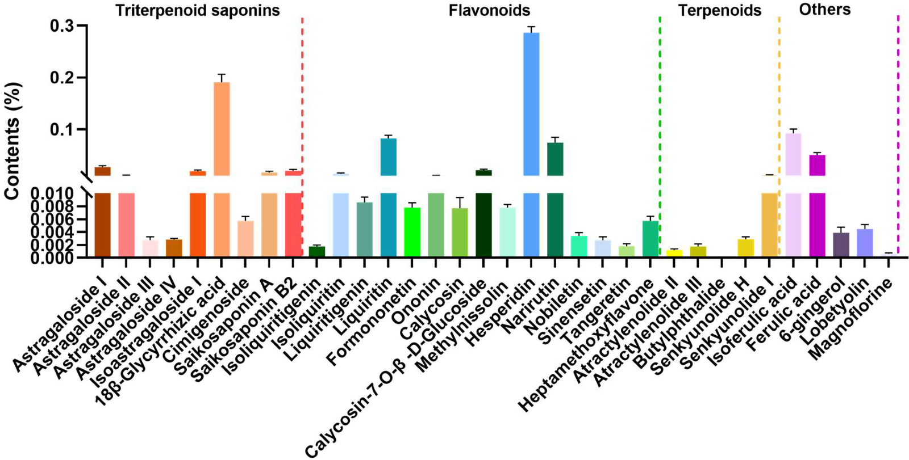
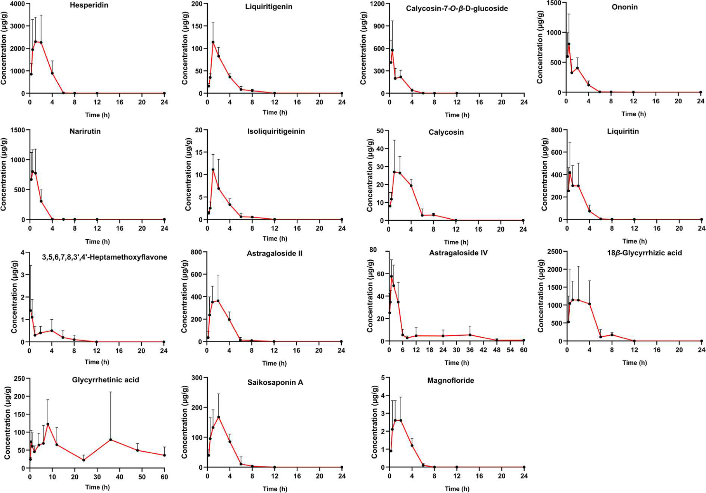
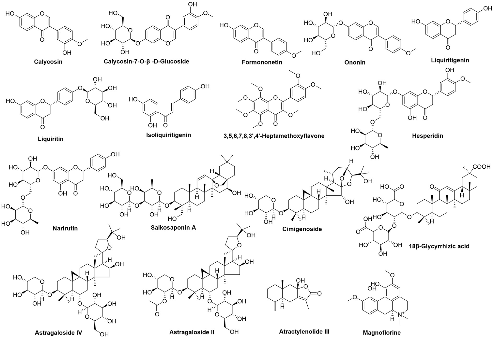
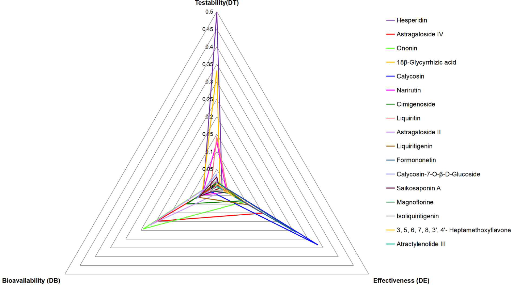

<!-- 方針: ほぼ全訳＋必要に応じた補足。原文構成（Abstract→Introduction→Materials and methods→Results→Discussion→Conclusions）に沿って訳出。「> 補足:」は訳者注。 -->

## 書誌情報

- 標題（原題）: Quantitative ternary network-oriented discovery of Q-markers from traditional Chinese medicine prescriptions: Bu-Zhong-Yi-Qi-Tang as a case study
- 著者: Liufang Hu、Guotao Chen、Jiali Chen、Zhenyu Zou、Yuan Qiu、Jing Du、Xupeng Tong、Jiaxu Chen、Xinsheng Yao、Pei Lin*、Liangliang He*、Zhihong Yao*（*責任著者）
- 所属: 暨南大学薬学院 中医薬現代化・新薬開発国際協力実験室（中国教育部）／広東省中薬薬効物質・新薬研究重点実験室／中薬学・天然物研究所（a）、暨南大学 生物活性分子・成薬性評価国家重点実験室（b）、暨南大学中医学院 広州市方剤配合パターン重点実験室（c）、湘潭大学化学工程学院（d）、同仁堂科技有限公司（北京）（e）、杭州晨風軽星科技有限公司（f）
- 掲載誌・巻号・DOI: *Phytomedicine* 133 (2024) 155918、https://doi.org/10.1016/j.phymed.2024.155918
- インパクトファクター: 8.81（*Phytomedicine*誌、JCR 2024 / Clarivate。複数のジャーナル指標集計サイトで確認。前年(2023年)の6.7から約28%上昇したとされる。Clarivate公式ポータルへの直接アクセスは確認できなかったため、参考値として扱うこと）
- 受理経過: 受理 2024-05-03、改訂稿受理 2024-07-04、accept 2024-07-26、オンライン公開 2024-07-31
- ライセンス: © 2024 Published by Elsevier GmbH（ライセンス詳細は原文参照）

> 補足: BZYQT = 補中益気湯（Bu-Zhong-Yi-Qi-Tang。日本では補中益気湯、韓国ではBojungikki-tangと呼ばれる古典的漢方方剤）。BZYQP = 補中益気丸（BZYQTの商業製剤）。SIC = 小腸内容物（small intestinal contents）。EWM = エントロピー重み法（entropy weight method）。Q-marker = 品質マーカー。DT・DB・DE = それぞれ検出可能性(testability)・生体利用能(bioavailability)・有効性(effectiveness)の三元ネットワーク上の値。

## 要旨（Abstract）

**背景:** 漢方薬（TCM）方剤のQ-marker提唱は、TCM方剤の品質管理に関する新たな研究領域である。しかし、複数属性を持つQ-markerに関するこれまでの探索的研究は一貫して重みの考慮を怠っており、各属性の重要性を正確に測ることを妨げ、Q-markerの理解に欠陥をもたらす可能性があった。

**目的:** 本研究では、TCM方剤からQ-markerを視覚的に発見するための定量的三元ネットワーク戦略を初めて提唱し、古典的TCM方剤である補中益気湯（BZYQT）の品質管理研究に応用した。

**方法:** まず、BZYQT中の34成分の含量、および生体試料（血漿・小腸内容物）中の17候補Q-markerの体内動態特性をUPLC-QqQ-MS/MSで特性解析し、マクロファージおよび脾臓リンパ球における免疫調節活性も評価した。次に、得られたデータを検出可能性(testability)・生体利用能(bioavailability)・有効性(effectiveness)の3属性に統合し、それぞれの重みをエントロピー重み法(EWM)で算出して、Q-markerを定量的に選定するための三元ネットワークをさらに構築した。続いて、同定されたBZYQTのQ-markerを用いて、3つの製造者による商業製剤（補中益気丸、BZYQP）36バッチの全体的品質評価を、Q-marker指紋の類似度評価を通じて実施した。

**結果:** 三元ネットワークの回帰面積の順位に基づき、検出可能性・生体利用能・有効性という3つの中核属性を示した9化合物（ヘスペリジン、アストラガロシドIV、オノニン、18β-グリチルリチン酸、ナリルチン、カリコシン、シミゲノシド、アストラガロシドII、リクイリチン）が、BZYQTのQ-markerとして選定された。これらQ-markerを共通ピークとして用いた場合、36バッチのBZYQPの類似度はHPLC-UVDモードで0.914〜0.998、HPLC-ELSDモードで0.631〜1.000となり、従来の共通ピークで評価した類似度（HPLC-UVDモード: 0.946〜0.990；HPLC-ELSDモード: 0.957〜0.997）よりも変動幅が大きかった。この観察結果は、同定されたQ-markerが、異なる製造者によるTCM関連製品の全体的品質評価のためのクロマトグラフィー指紋における共通ピークとして、より代表性が高いことを示唆する。

**結論:** BZYQTからのQ-markerの定量的発見は、その関連する商業的に入手可能な製品の全体的な品質評価のための重要な基盤を築いた。本研究は、TCM方剤の一貫性と有効性を確保するための新戦略を提供するものである。

**略語:** BZYQT, 補中益気湯; BZYQP, 補中益気丸; SIC, 小腸内容物; EWM, エントロピー重み法; TCM, 漢方薬; ConA, コンカナバリンA; LPS, リポ多糖; LLOQ, 直線性と定量下限。

**キーワード:** 補中益気湯（Bu-Zhong-Yi-Qi-Tang）；品質マーカー（Q-markers）；漢方方剤（Traditional Chinese medicine prescriptions）；定量的三元ネットワーク（Quantitative ternary network）；体内動態（Pharmacokinetics）；免疫調節活性（Immunomodulatory activity）

## 1. 序論（Introduction）

中華文明の至宝として、漢方薬（TCM）方剤は数千年にわたり疾病の予防・治療に重要な役割を果たしてきた。とりわけCOVID-19パンデミック下では、治癒率の向上・罹病期間と死亡率の低減における有効性から、世界的に注目が高まっている（Huang et al., 2021）。しかしTCMは「多成分・多標的」という特徴を持つため、複数の慢性・複雑疾患の治療に有用である一方、有効成分・機序の不明確さや品質管理の不十分さといった限界により、標準化・国際化には大きな課題がある（He et al., 2021）。これを踏まえ、TCM品質規格体系を強化するため、品質マーカー（Q-marker）という概念が提唱された（Liu et al., 2016）。Q-markerとは、TCMおよびその製品（生薬飲片・湯液・エキス・製剤）に内在する化学成分であり、TCMの機能特性と密接に関連し、品質管理における安全性・有効性を評価する指標物質として機能する。

Q-markerという概念の導入以来、TCMまたはTCM方剤におけるQ-markerの同定・識別のため、ネットワーク薬理学・薬効学・植物化学・体内動態学・Chinmedomics（中医オミクス）・「スパイダーウェブ」モード・「レーダーチャート」モードなど、複数の戦略が提唱・応用されてきた（Yeqing et al., 2022; Chu et al., 2022; Wang et al., 2023; He, et al., 2021; Zhang et al., 2021, 2020）。これらの戦略はTCM方剤におけるQ-markerの発見に成功し、新たな視点と参照を提供してきたが、依然として注意すべき点がいくつか残っている。特に重要なのは、複数属性を持つQ-markerに関するこれまでの探索的研究が、一貫して重みの考慮を怠ってきたという点である。この見落としは、各属性の重要性を正確に測ることを妨げ、Q-markerの理解に欠陥をもたらしうる。さらに、大半の研究は吸収成分に主眼を置き、腸内細菌叢の調節や腸管への直接作用を通じて間接的な効果を発揮しうる腸内容物中の異物成分（xenobiotics）を見落としがちであり、生物活性成分の除外につながっている。特に消化器系の不調を改善するTCM方剤については、腸管内に存在する成分もまた考慮すべき対象である。

補中益気湯（BZYQT）は700年以上の歴史を持つ著名なTCM方剤であり（「脾胃論」に記載）、下痢・慢性閉塞性肺疾患・喘息・子宮脱など、消化器・呼吸器・泌尿生殖器系の疾患の改善に広く用いられてきた（Hu et al., 2019, 2022）。その配合は、君薬: 黄耆（Astragali Radix）；臣薬: 甘草（Glycyrrhizae Radix et Rhizoma）、白朮（Atractylodis Macrocephalae Rhizoma）、党参（Codonopsis Radix）；佐薬: 当帰（Angelicae Sinensis Radix）、陳皮（Citrus Reticulatae Pericarpium）；使薬: 升麻（Cimicifugae Rhizoma）、柴胡（Bupleuri Radix）、大棗（Jujubae Fructus）、生姜（Zingiberis Rhizoma Recens）である。BZYQTはその薬効と健康効果により高い評価を得ており、その人気は中国を超えて広がっている。日本では「補中益気湯」（Hochuekkito）、韓国では「Bojungikki-tang」として広く認知され、術後の疲労・食欲不振を呈する患者の栄養状態を改善する滋養強壮薬として用いられている（Kiyohara et al., 2006; Lee et al., 2012）。近年の薬理学的研究により、BZYQTは抗ウイルス作用（Takanashi et al., 2017）、抗炎症作用（Yang et al., 2015）、抗菌作用（Yan et al., 2002）、免疫調節作用（Kao et al., 2000; Liu et al., 2019）を有することが示されている。BZYQTの広範な臨床応用を踏まえ、丸剤・顆粒剤・内服液などの関連製剤が中国で開発され、いずれも中国薬局方に収載されている。しかし、BZYQT関連製剤の現行の品質規格はアストラガロシドIVのみを定量指標としており、有効性・安全性の担保には程遠い。さらに、既存研究の多くはBZYQTの物質的基盤・生物学的基盤に主眼を置き、その製剤についての検討は少ない。したがって、BZYQTに基づく適切なQ-markerの発見は、BZYQT関連製剤の包括的な品質評価の指針となるため、大きな意義を持つ。

これまでの既報研究では、BZYQT中の161種の化学成分、および生体試料（血漿・尿・糞便）中の162種のBZYQT関連異物成分が特性解析されており、フラボノイドとトリテルペノイドが血漿中の生体利用可能な成分の主要な部分を占めていた（Hu, et al., 2019; Liu, et al., 2019）。さらに、poly(I:C)誘導肺炎症および腸管パイエル板に対するBZYQTの免疫調節活性が実証されており、肺の好中球浸潤の低減、B細胞数の増加、マクロファージの細胞マーカーであるF4/80のmRNA発現の下方制御が含まれていた（Hu, et al., 2022; Liu, et al., 2019）。近年の知見では、ラットの小腸内容物（SIC）中に大半のBZYQT関連成分の存在が明らかにされている（Hu, et al., 2022）。BZYQTが粘膜免疫に及ぼす特有の調節効果を踏まえると、BZYQTのQ-marker発見においては血漿とSICの両方の異物成分を考慮することが不可欠である。

本研究では、BZYQTを症例として、TCMからのQ-markerの定量的発見と、それに続く商業製品の全体的品質評価のための戦略を構築した（図1）。まずBZYQTを調製し、その多成分の含量をUPLC-QqQ-MS/MSで決定した。次に候補Q-markerを選定するため、血漿とSIC中の異物成分の同時定量によりBZYQTの体内動態特性を特性解析した。第三に、BZYQTのin vivo有効性と密接に関連するin vitro活性を実施し、候補Q-markerの活性を確認した。第四に、候補Q-markerの含量・体内動態特性・活性に関するデータを、検出可能性・生体利用能・有効性という3つの中核属性に統合し、エントロピー重み法(EWM)を用いて各属性に重みを割り当てた。続いて、回帰面積値の順位を同定の根拠として三元ネットワークを構築することで、BZYQTのQ-markerを定量的に発見した。最後に、これらのQ-markerを用いて、HPLC-UVD-ELSD指紋に基づき、3つの異なる製造者による多バッチの商業製剤（補中益気丸、BZYQP）の全体的品質を評価した。本研究は、TCM標準湯液からのQ-marker発見、および関連製品の全体的品質評価のパラダイムを提供することが期待される。

## 2. 材料と方法（Materials and methods）

### 2.1. 化学物質と試薬

蜂蜜製黄耆（Astragali Radix praeparata cum mellex）、麸炒白朮（Atractylodis Macrocephalae Rhizoma、小麦炒り）、蜂蜜製甘草（Glycyrrhizae Radix et Rhizoma praeparata cum melle）、当帰（Angelicae Sinensis Radix）、党参（Codonopsis Radix）、柴胡（Bupleuri Radix）、升麻（Cimicifugae Rhizoma）、陳皮（Citrus Reticulatae Pericarpium）、生姜（Zingiberis Rhizoma Recens）、大棗（Jujubae Fructus）の生薬原料は同仁堂科技有限公司（北京）から提供された。これら10種の生薬材料の水分含量・外観・試験項目・マーカー含量を含む品質評価は同仁堂科技が実施した（Hu et al., 2023）。3つの人気メーカーが製造した36バッチのBZYQP（各社12バッチ）は広州の複数の地元薬局から購入した。純度98%超の標準品はChengdu Chroma-Biotechnology Co., Ltd.（成都）から入手した。LC-MSグレードのアセトニトリルとギ酸はFisher Scientific（米国ニュージャージー州フェアローン）から入手した。精製水はWatsons Group（広州）から入手し、他の試薬は市販の分析グレードのものを使用した。マウスRAW264.7マクロファージはFuHeng Biology Co., Ltd.（上海）から入手した。コンカナバリンA（ConA）とリポ多糖（LPS）はSigma（Sigma-Aldrich Co., ドイツ）から購入した。ACK溶解バッファー、一酸化窒素（NO）およびCCK8キットはBeyotime Biotechnology Co., Ltd.（上海）から入手した。ダルベッコ改変イーグル培地（DMEM）、ウシ胎児血清（FBS）、リン酸緩衝生理食塩水（PBS）、ペニシリン-ストレプトマイシン混合液はHyclone（米国ユタ州）から入手した。

### 2.2. BZYQTの調製

古典籍「脾胃論（Pi-Wei-Lun）」に記録された抽出法と、2020年版中国薬局方に収載された生薬材料の配合比に基づき、BZYQT標準湯液の1日量を以下のように調製した: 蜂蜜製黄耆（Astragali Radix praeparata cum mellex）6.7 g、麸炒白朮（Atractylodis Macrocephalae Rhizoma）2.0 g、蜂蜜製甘草（Glycyrrhizae Radix et Rhizoma praeparata cum melle）3.3 g、当帰（Angelicae Sinensis Radix）2.0 g、党参（Codonopsis Radix）2.0 g、柴胡（Bupleuri Radix）2.0 g、升麻（Cimicifugae Rhizoma）2.0 g、陳皮（Citrus Reticulatae Pericarpium）2.0 g、大棗（Jujubae Fructus）1.3 g、生姜（Zingiberis Rhizoma Recens）0.7 gの混合物を600 mLの飲用水とともに100℃で煎じ、最終容量を300 mLとした。この湯液を減圧下45℃で生薬重量の5倍に濃縮した後、凍結乾燥して凍結乾燥粉末を得た。

### 2.3. 動物実験と試料採取

**動物:** SDラット（体重200 g±10 g）とBALB/cマウス（7週齢）は北京華阜康生物科技有限公司（Beijing HFK Biotechnology Co., Ltd）から購入した。動物は温度24±2℃、相対湿度50±5%、12時間の明暗サイクルに管理された環境で飼育され、標準飼料と水は自由摂取とした。すべての動物実験は暨南大学の実験動物の管理と使用に関する倫理基準（倫理審査番号20210826-12）に従って実施した。すべての動物は実験前に7日間馴化させた。

**血漿体内動態:** 実験前にラットを12時間絶食させた（飲水は自由）。その後、無作為に3群（I群・II群・III群、各n=6）に割り付けた。I群・II群のラットにはBZYQTをそれぞれ7.5、15 g/kg/day（生薬換算）で単回経口投与し、III群のラットにはBZYQTを7.5 g/kg/dayで1日2回、3日間連続経口投与した。最終経口投与後0.5、1、2、4、6、8、12、24、36、48、60、72時間の各時点で、各ラットの頸静脈から約200 μLの血液試料を採取してヘパリン処理チューブに入れ、遠心分離（13,000 rpm、10分）して血漿を得た。

**小腸内容物中の体内動態:** ラットにBZYQTを7.5 g/kg/dayで1日2回、3日間連続経口投与した。最終胃内投与後、各時点（0.25、0.5、1、2、4、6、8、12、24、36、48、60時間）（n=5）でラットを麻酔し、小腸を注意深く摘出した。管腔内を蒸留水で十分に洗浄することにより小腸内容物を採取し、続いて凍結乾燥して粉末試料を得た。

すべての試料は、以降の分析まで直ちに-80℃で保存した。

### 2.4. 試料前処理

**BZYQT抽出液の前処理:** BZYQT凍結乾燥粉末0.2 gを正確に量り、水浴中で超音波処理（30℃、100 kHz）を行いながら60%メタノール水溶液（w/v）10 mLで30分間抽出した。得られた抽出液を適切な溶媒で希釈し、UPLC-QqQ-MS/MS分析用に最終濃度100 μg/mLに調整した。分析前に、すべての作業溶液は14,000 rpmで10分間の遠心分離を行った。定量分析のため、合計6バッチのBZYQTを調製・処理した。最終的に、上清2 μLをUPLC-QqQ-MS/MSに注入して分析した。

**血漿試料の前処理:** 血漿100 μLアリコートを、IS1（ジクロフェナク）作業溶液50 μL、アセトニトリル300 μL、メタノール50 μLとともに1分間ボルテックス混合した後、14,000 rpm（4℃、10分）で遠心分離した。得られた上清を移し、室温にて窒素ガス気流下で蒸発乾固した。最後に、残渣をメタノール100 μLに再溶解して1分間ボルテックス混合した後、14,000 rpmで10分間遠心分離した。最終的に、上清4 μLをUPLC-QqQ-MS/MSに注入して分析した。

**SIC試料の前処理:** 小腸内容物粉末約1 mgを正確に量り、IS2（エピメジンC）作業溶液50 μL、メタノール250 μL、アセトニトリル200 μLとともに2分間ボルテックス抽出した。14,000 rpmで20分間（4℃）遠心分離した後、上清100 μLを移し、室温にて窒素ガスを用いて乾燥した。残渣をメタノール300 μLに再溶解して2分間ボルテックス混合した後、再度14,000 rpmで20分間遠心分離した。最終的に、上清2 μLをUPLC-QqQ-MS/MSに注入して分析した。

**BZYQPの前処理:** 36バッチのBZYQP試料をそれぞれ微粉末に粉砕した。粉末1.0 gアリコートを量り、水浴中で超音波処理（30℃、100 kHz）を行いながら60%メタノール水溶液（w/v）10倍量で30分間抽出した。すべての作業溶液は、分析前に14,000 rpmで10分間遠心分離した。

### 2.5. 装置と分析条件

**UPLC-QqQ-MS/MS分析:**
(1) クロマトグラフィー分析は、バイナリポンプ溶媒系とオートサンプラーを備えたACQUITY™ UPLC I-Classシステム（Waters Co.、米国マサチューセッツ州ミルフォード）で実施した。ACQUITY UPLC HSS T3カラム（2.1 mm×100 mm、1.8 μm、40℃）を、BZYQT抽出液・血漿・SIC中の多成分の決定のための分離システムとして採用した。移動相は水（A）とアセトニトリル（B）（いずれも0.1%ギ酸（v/v）を含有）から構成し、流速0.3 mL/分で送液した。定量分析に用いたグラジエントプログラムは以下の通りである: 0〜0.5分 5%B、0.5〜3.5分 5〜30%B、3.5〜12.5分 30〜40%B、12.5〜15分 40〜100%B。血漿については、グラジエントは0〜2分 10〜30%B、2〜5分 30〜35%B、5〜6分 35〜40%B、6〜10分 40〜60%B、10〜14分 60〜90%B、14〜15分 90〜100%Bとした。SICについては、グラジエントは0〜0.5分 5%B、0.5〜1.5分 5〜22%B、1.5〜4.5分 22%B、4.5〜8.5分 22〜40%B、8.5〜13分 40〜65%B、13〜14.5分 65〜85%B、14.5〜15.5分 85〜100%Bとした。オートサンプラー温度は15℃に維持した。
(2) 質量分析（MS）検出は、ESI源を備えたXevo TQ-XS質量分析計（Waters Co.）で実施した。多重反応モニタリング（MRM）モードを陽イオンモード（ESI+）で運用した。MS分析条件は以下の通りである: イオン源温度150℃、脱溶媒温度500℃、キャピラリー電圧3 kV、コーンガス流量50 L/h、脱溶媒ガス流量1000 L/h。滞留時間（dwell time）は自動設定とし、各化合物の最適化MRMパラメータは表S1（原文参照・供覧資料）に記載されている。

**HPLC-UVD-ELSD分析:** BZYQPの指紋分析は、多波長紫外検出器（UVD）と蒸発光散乱検出器（ELSD）を備えたAgilent 1200 HPLCシステムを用いて実施した。システム制御とデータ解析にはChemStationおよびAllchrom Plusソフトウェアを使用した。クロマトグラフィー分離はPoroshell 120 EC-C18カラム（100 mm×4.6 mm、2.7 μm、40℃）で実施した。移動相は流速1 mL/分とし、（B）アセトニトリルと（C）水（いずれも0.1%ギ酸（v/v）を含有）から構成した。グラジエント溶出プログラムの設定は以下の通りである: 0〜15分 10〜30%B、15〜25分 30〜62%B、25〜30分 62〜100%B。注入量は10 μLとし、検出波長は280 nm（0〜16分）と254 nm（16〜30分）で測定した。ELSDのドリフトチューブ温度は95℃、キャリアガス流量は2.5 L/分に設定した。

### 2.6. 細胞実験

**RAW264.7マクロファージの培養と処理:** マウスRAW264.7マクロファージは、10%ウシ胎児血清（FBS）と1%ペニシリン-ストレプトマイシンを添加したDMEM培地中で、加湿5%CO2インキュベーター（37℃）にて培養した。細胞（2×10^5 cells/mL、100 μL）を96ウェルプレート（Corning、米国ニュージャージー州フランクリンレイクス）に播種し、24時間培養して融合度80〜90%に到達させた。次に元の培地を除去し、LPS（1 μg/mL）を含む新鮮培地90 μLと、種々濃度のBZYQT抽出液（滅菌水に溶解、10 μL）または単一化合物（DMSOに溶解、最終DMSO濃度0.5%（v/v））を加えた。さらに24時間培養した後、細胞生存率をCCK8アッセイで測定し、上清を用いてGriess法でNO含量を測定した。濃度100 μMのヒドロコルチゾンを本実験の陽性対照薬として含めた。

**脾臓リンパ球の培養と処理:** BALB/cマウスから脾臓リンパ球を得るため、マウスを安楽死させた後、無菌条件下で脾臓を穏やかに摘出した。次に脾臓を無菌の70 μm細胞ストレーナー（BD、米国ニュージャージー州フランクリンレイクス）上に置き、シリンジプランジャーの基部を用いて軽くすりつぶしてメッシュを通過させた。その後、細胞をPBSで洗浄し細胞篩を通過させることで細胞懸濁液を調製した。遠心分離とACK溶解バッファーによる赤血球除去の後、細胞沈渣を、5% FBS、1%ペニシリン-ストレプトマイシン、0.05 mM β-メルカプトエタノールを含むRPMI 1640完全培地3 mLに懸濁した。BZYQTおよび候補Q-markerがリンパ球増殖に与える影響を調べるため、細胞密度を、ConA（1 μg/mL）またはLPS（10 μg/mL）を含むRPMI 1640完全培地を用いて3×10^6 cells/mLに初期調整した。その後、細胞を96ウェルプレート（90 μL）に加え、種々の用量のBZYQT抽出液（1、10、100、250、500、1000 μg/mL）または単一化合物（1、5、10、20、50、100 μM）で処理した。細胞を48時間培養した後、T・Bリンパ球の増殖活性をCCK8アッセイで測定した。

### 2.7. 定量分析の方法バリデーション

**BZYQT中34化合物の定量分析:** 34種の標準品それぞれの個別ストック溶液をメタノールに溶解して10 mL容量フラスコに保存し、4℃で保管した。検量線を作成するため、各標準品溶液の適量を10 mL容量フラスコに移し、メタノールで段階希釈（希釈係数=2）して濃度の異なる7種の標準作業溶液を得た。開発した方法は、直線性、精度、再現性、安定性、回収率の観点からバリデーションを実施した。

**血漿・SIC中の異物成分の濃度決定:** 米国食品医薬品局（FDA）の生物学的分析法バリデーションガイダンス（FDA, 2001）に従い、特異性、精度と正確度、直線性と定量下限（LLOQ）、抽出回収率、マトリックス効果、安定性を含む方法バリデーションを実施した。

**BZYQP指紋分析:** 同一溶液を6回連続注入して精度を測定した。一方、同一バッチのBZYQPから調製した6個の別々の溶液を用いて再現性を評価した。安定性は0、2、4、8、12、24時間の各時間間隔で測定した。

### 2.8. エントロピー重み法(EWM)に基づく重みの算出

ある指標の重みは、以下の式に基づきエントロピー重み法（EWM）により算出した:

Pij = Xij / Σ(i=1〜m) Xij　（i=1, 2, …, m；j=1, 2, …, n）

Hj = −k × Σ(i=1〜m) [Pij × ln(Pij)]　（k = 1/ln(m)）

wj = (1−Hj) / Σ(j=1〜n) (1−Hj)

ここで、iとjはそれぞれ評価対象単位と評価指標の番号を表し、Xは変数の標準化値を示す。指標が正の指標である場合、Xij = (Xij − Xi_min)/(Xi_max − Xi_min) の式で標準化し、指標が負の指標である場合は、Xij = (Xi_max − Xij)/(Xi_max − Xi_min) の式で標準化する。Pは比率、mは評価指標の数、Hは情報エントロピー、wはエントロピー重みを表す。

> 補足（訳者注）: 原文PDFは2段組であり、この式が記載された節は自動テキスト抽出時に本文の別段落（「xenobiotics absorbed…」の一文）と行単位で混入していた。上記は文脈から標準的なEWMの数式として再構成したものであり、また正指標の標準化式は文献上の一般的な定義（(Xij − Xi_min)/(Xi_max − Xi_min)）と原文の記載順が異なって見える箇所があった。詳細な添字・符号を厳密に確認する場合は原文PDF該当ページの数式表示を直接参照してほしい。

**候補Q-markerの検出可能性・生体利用能・有効性の評価:** 候補Q-markerの検出可能性(testability)は、データ標準化処理後のBZYQT中の含量により決定した。生体利用能(bioavailability)の評価は、血漿およびSICにおけるin vivo曝露量（AUC0-t/dose）に依拠した。まず血漿とSICの重みをEWMにより算出し、各候補Q-markerの標準化曝露量にそれぞれ異なる重み係数を乗じて合計し、生体利用能値を算出した。候補Q-markerの有効性(effectiveness)は、脾臓リンパ球とマクロファージの免疫調節活性により評価した。まず、リンパ球とマクロファージの重みを、BZYQTのフォールドチェンジデータに基づきEWMにより算出した。次に、各候補Q-markerの最小有効濃度を統計解析結果に基づき決定し、さらに標準化した。続いて、この濃度でのRAW264.7におけるNO産生のフォールドチェンジ、または脾臓リンパ球の細胞生存率を算出し、合計して有効性値を得た。最後に、検出可能性・生体利用能・有効性の重みを、これら3属性の前述の標準化データに基づきEWMにより算出し、各候補Q-markerの最終値を、それぞれの重みを乗じることで算出した。

**三元ネットワークの構築とQ-markerの定量的発見:** 三元ネットワークは、Excelソフトウェアを用いて、DT（検出可能性）・DB（生体利用能）・DE（有効性）からなる三次元レーダーマップとして構築した。続いて、各候補Q-markerの回帰面積は次式により算出した:

S = 1/2 × sin(360/3)° × (DT×DE + DE×DB + DT×DB)

回帰面積のスコア順位を優先することにより、Q-markerを定量的に選定した。

### 2.9. 統計解析

データはGraphPad Prism 8.0.2ソフトウェア（GraphPad Software Inc.、米国カリフォルニア州ラホーヤ）を用いて解析し、結果の有意性は一元配置分散分析（ANOVA）とDunnettの多重比較検定により評価した。p値が0.05未満の場合に群間有意差ありとみなした。結果は平均値±SDで示し、少なくとも2回の独立した実験から得られたデータである。

## 3. 結果（Results）

### 3.1. BZYQT中の化学成分の定量分析

BZYQT中の複数成分の含量分布を包括的に理解し、その品質を管理するためには、主要成分を定量的に評価することが不可欠である。通常、血中に吸収される異物成分（xenobiotics）は有効性の指標とみなされるが、生体利用能が限られた一部の成分であっても、腸管内で作用を及ぼすことで効果を発揮しうる点に留意する必要がある（He et al., 2018）。これは特に、脾胃の失調を改善するTCM方剤において重要である。そこで、BZYQTの化学的・in vivo代謝プロファイルに関する既報の特性解析（Hu, et al., 2019; Liu, et al., 2019）に基づき、15種のフラボノイド、10種のトリテルペノイド、5種のテルペノイド、2種の有機酸、1種のアルカロイド、1種のその他の構造型を含む34種の特徴的化合物を選定し、UPLC-QqQ-MS/MSによる同時定量分析に供した。

定量法は、特異性、直線性、精度と再現性、正確度、安定性の観点から厳格にバリデーションされた。図S1と表S2〜S4（原文参照・供覧資料）は、同一保持時間において明らかな干渉が認められないことを示し、34化合物すべての検量線の相関係数（r²）は0.9990以上であった。精度・再現性・安定性のRSDは、それぞれ5.8%、6.9%、4.3%を超えなかった。平均回収率は96.15%から104.88%の範囲で、RSDは4.7%以内であった。次に、開発した定量法を用いて、BZYQT 6バッチ中の34化合物の含量を定量した（図2、表S5）。BZYQT中の定量化合物の総含量は8661.59 μg/gであった。これらの化合物のうち、ヘスペリジン（2478.96 μg/g）が最も多く、次いで18β-グリチルリチン酸（1652.22 μg/g）、イソフェルラ酸（798.30 μg/g）、リクイリチン（712.79 μg/g）、ナリルチン（641.41 μg/g）、フェルラ酸（438.01 μg/g）、アストラガロシドI（232.76 μg/g）の順であった。一方、ブチルフタリドの含量はわずか0.73 μg/gであり、他のテルペノイド類も低濃度であった。これは、煎じる際の高温曝露に対するこれらの化合物の安定性の低さに起因すると考えられる。

### 3.2. 血漿・SICにおけるBZYQTの体内動態特性の特性解析

既報のBZYQT代謝研究（Hu, et al., 2019）と、(1) 血漿またはSICで確実に検出できること、(2) 多様な化学構造・生薬にまたがること、という次の原則に基づき、血漿とSICにおいてそれぞれ8成分と15成分の生体利用可能成分を定量対象として選定した。次に、UPLC-QqQ-MS/MSを用いて血漿とSICにおける多成分同時定量法を開発・バリデーションした。方法論的検証の結果、血漿中の8分析物は、良好な特異性（明らかな干渉なし、図S2）、良好な直線性（r≥0.9928、表S6）、許容可能な日内・日間精度と正確度（RSD≤13.2%、−14.1≤RE≤13.2%）、マトリックス効果（85.3〜111.6%。ただしグリチルレチン酸のみ64.6〜72.2%）、抽出回収率（85.6〜110.5%）（表S7）を示し、さらに良好な安定性（RSD≤13.5%、表S8）を示した。SIC中の15分析物の検証結果は図S3、表S9〜S13に示され、妥当な方法論であることが示された。これらの信頼性の高い方法は、ラットへのBZYQT経口投与後の対応する生体試料中の分析物の定量に適用され、濃度-時間曲線と関連する体内動態パラメータの記述に成功した。

### 3.3. 血漿中のBZYQTの体内動態

図3・表S14に示すように、フォルモノネチンは血中への急速な吸収を示した。しかし、BZYQTを7.5 g/kg/dayで単回投与したラットでは、カリコシンと3,5,6,7,8,3′,4′-ヘプタメトキシフラボンの血漿中濃度が低いため十分に定量できなかった。15 g/kg/dayを投与した場合でも、カリコシンのCmaxは0.20±0.03 ng/mL、AUC0-∞は2.14±0.57 ng/mL・hにとどまった。in vivoでの一連の脱メチル化反応の結果（Hu, et al., 2019）、3,5,6,7,8,3′,4′-ヘプタメトキシフラボンは、ラットにBZYQTを15 g/kg/dayで経口投与した後、Cmax（1.86±0.68 ng/mL）とAUC0-∞（24.52±4.14 ng/mL・h）ともに低値を示した。白朮（Atractylodis Macrocephalae Rhizoma）由来のセスキテルペノイドであるアトラクチレノリドIIIは急速に吸収され（Tmax、0.83±0.26時間）、Cmax 0.78±0.10 ng/mLに達し、その後8時間でほぼ消失した（t1/2、9.97±4.70時間）。これは既報の知見と一致する（Yan et al., 2015）。

BZYQT抽出液中の18β-グリチルリチン酸含量は1652.22 μg/gに達したが、腸内細菌により容易に加水分解されグリチルレチン酸となり、その後血中に吸収されて効果を発揮する（Chen et al., 2017; Wang et al., 2017）。本研究では、BZYQTを7.5 g/kg/dayで単回経口投与した後、グリチルレチン酸は緩徐な吸収・消失特性（Tmax、12.00±6.20時間；t1/2、26.46±5.35時間）を示し、他の分析物と比較して相対的に高値を示した（Cmax、204.162±65.52 ng/mL；AUC0-∞、6942.75±517.03 ng/mL・h）。特筆すべきは、ラットにBZYQT 15 g/kg/dayを単回投与した場合、グリチルレチン酸のAUC0-∞は67,118.59±10,247.41 ng/mL・hまで著明に増加し、中用量（7.5 g/kg/day）投与のおよそ10倍に達した点である。血漿中のシミゲノシド曝露量は顕著に高く、BZYQT単回投与でAUC0-∞は7.5 g/kg/dayで2933.963±280.00 ng/mL・h、15 g/kg/dayで2279.42±291.17 ng/mL・hに達したが、明らかな用量依存関係は認められなかった。文献検索の結果、ラットへの*Cimicifuga foetida* L.抽出物の経口投与後のシミゲノシドの絶対経口バイオアベイラビリティは238〜319%であり、この著しく高いバイオアベイラビリティは、他のシミシフゴシド類がシミゲノシドへ相互変換することに起因する可能性がある（Gai et al., 2012）。

7.5 g/kg/dayでの複数回経口投与後のBZYQTの体内動態特性は、単回投与レジメンと比較して差異を示した（表S15）。例えば、グリチルレチン酸（845.29±80.59 ng/mL）とシミゲノシド（80.41±8.98 ng/mL）のCmaxは、単回投与時より高値を示した。逆に、フォルモノネチン・リクイリチゲニン・イソリクイリチゲニン・アトラクチレノリドIIIはCmaxの低下を示したが、そのAUC0-∞はMRT0-∞とともに増加した。

### 3.4. SICにおけるBZYQTの体内動態特性

図4・表S16に示すように、大半のフラボノイド類は2時間以内にCmaxへ到達し、代謝変換または次の腸管部位への排出により6時間後には消失した。リクイリチン・オノニン・カリコシン-7-O-β-D-グルコシドといったフラボノイドモノグリコシド類は、Tmax・T1/2・MRT0-∞の値において顕著に類似した動態特性を示し、ヘスペリジン・ナリルチンといったフラボノイドジグルコシド類も同様であった。特にリクイリチンは腸管内で優勢的にリクイリチゲニンへ加水分解され、その結果リクイリチゲニンのCmax（113.92±43.11 μg/g）はイソリクイリチゲニンのそれと比べ有意に高値であった。さらに、ヘスペリジンは2524.07±1252.30 μg/gという最高のCmaxを示したが、急速に代謝され、比較的短いMRT0-∞（2.07±0.12時間）とAUC0-t（7880.01±4261.13 μg/g・h）がその証左であった。

フラボノイド類と比較して、トリテルペノイド類は代謝が緩徐であり、腸管内での平均滞留時間が長かった。例えば、グリチルレチン酸・アストラガロシドIV・シミゲノシドのMRT0-∞は、それぞれ103.59±48.93時間、14.20±11.81時間、13.14±7.07時間と顕著に延長した。興味深いことに、18β-グリチルリチン酸のCmaxは1372.94±863.10 μg/gであった一方、そのアグリコンであるグリチルレチン酸のCmaxはわずか141.49±104.89 μg/gであった。このSIC中濃度は血漿中に比べかなり低かった。しかし両化合物はよく似たAUC0-∞値を示した。さらに、グリチルレチン酸では36時間の時点で二峰性現象が観察され、腸管から血中へ吸収された後、肝臓から胆管を経て排泄され再び腸管へ戻るという吸収経路の可能性が示唆された。シミゲノシドのAUC0-∞（377.15±27.84 μg/g・h）も血漿中濃度より低く、急速に排泄された。したがって、グリチルレチン酸とシミゲノシドは血液循環を介して効果を発揮する一方、アストラガロシドIVは主に腸管に作用すると推測できる。サイコサポニンAについては、BZYQT水抽出液中の含量は125.84 μg/gであったのに対し、そのCmaxは167.69±77.62 μg/gに達しており、これは2-O-アセチルサイコサポニンA/B2などの脱アセチル化産物に起因する可能性がある。アルカロイド類については、約1.5時間というTmax値で急速にピーク濃度に達した。しかし、MSスペクトル応答が高いにもかかわらず、マグノフロリンのCmaxはわずか2.88±1.30 μg/gであった。

### 3.5. 候補Q-markerの選定とRAW264.7・脾臓リンパ球におけるin vitro免疫調節活性評価

本研究では、化学的な伝達性・追跡性の原則に従い、BZYQT中に存在し、経口投与後の血漿・SICで定量的に検出可能な17種の内因性化学成分を候補Q-markerとして選定した。すなわち、18β-グリチルリチン酸、3,5,6,7,8,3′,4′-ヘプタメトキシフラボン、アストラガロシドII、アストラガロシドIV、アトラクチレノリドIII、カリコシン、カリコシン-7-O-β-D-グルコシド、シミゲノシド、フォルモノネチン、ヘスペリジン、イソリクイリチゲニン、リクイリチゲニン、リクイリチン、マグノフロリン、ナリルチン、オノニン、サイコサポニンAである（図5）。さらに、既報（Hu, et al., 2022）に示されるように、BZYQTはマクロファージとリンパ球に対し免疫調節作用を示した。そこで、これら候補Q-markerの活性をRAW264.7細胞と脾臓リンパ球を用いて評価した。

グリチルレチン酸はin vivoの代謝物であるが、免疫調節活性評価には引き続き含めた。

まず、BZYQTがLPS誘導RAW264.7の細胞生存率・NO産生、およびConA・LPSでそれぞれ誘導したT・Bリンパ球の増殖率に与える影響を評価した。図6a・bに示すように、モデル群と比較してBZYQTは1〜250 μg/mLの濃度域でRAW264.7細胞の増殖を有意に促進し、NO含量も同様に増加した。しかし500・1000 μg/mLの高濃度では、BZYQTはNO放出を著しく抑制した。さらに、Tリンパ球・Bリンパ球の増殖はBZYQT 1 μg/mLで阻害された。逆にTリンパ球は250 μg/mLで顕著な促進、1000 μg/mLで抑制を示した。一方、Bリンパ球数は100〜500 μg/mLで用量依存的な増加を示し、1000 μg/mLでわずかな低下がみられた（図6c・d）。BZYQTのBリンパ球への調節作用がTリンパ球への作用より強いとみられることから、候補Q-markerの免疫調節活性は、LPS誘導脾臓Bリンパ球の増殖を用いてさらに評価した。

17候補Q-markerの免疫調節作用は、LPS誘導RAW264.7細胞のNO量とLPS誘導脾臓Bリンパ球の細胞生存率の標準化フォールドチェンジとして表し、図6eのヒートマップで視覚的に示した。詳細なヒストグラムは図S4・S5に示されている。RAW264.7細胞に対する17候補Q-markerの細胞生存率は表S17にまとめられている。結果を見ると、大半の候補Q-markerは、種々の濃度でNO放出またはBリンパ球増殖に対し抑制的な作用を持つことが明らかであった。特筆すべきは、カリコシン・フォルモノネチン・ナリルチンが1〜100 μMの濃度でRAW264.7細胞の増殖促進とNOレベル上昇に強い活性を示した点である。一方、アストラガロシドII、IVおよびフォルモノネチンは主に脾臓Bリンパ球の増殖を誘導し免疫増強効果を示したのに対し、他の化合物は主に免疫抑制活性を示した。

### 3.6. 三元ネットワークに基づくBZYQTからのQ-markerスクリーニング

**BZYQTの17候補Q-markerの検出可能性・生体利用能・有効性:** BZYQT中17候補Q-markerの検出可能性(testability)値は、その標準化含量に基づき算出した（表S18）。生体利用能(bioavailability)評価では、血漿とSICのin vivo曝露量にEWMにより割り当てられた重みは、それぞれ63.73%、36.27%であった。18β-グリチルリチン酸については、主にグリチルレチン酸の形で血中に吸収されるため、その血漿AUC0-tはグリチルレチン酸の体内動態パラメータに基づき決定した。17候補Q-markerの生体利用能値の詳細データは表S19に示されている。有効性(effectiveness)の算出のため、まずリンパ球とRAW264.7細胞の重みをそれぞれ62.48%、37.52%と決定し、詳細な算出結果は表S20に示されている。次に、両免疫細胞に対する17候補Q-markerの標準化活性値を、表S21・表S22の通り算出した。有効性値は、RAW264.7とリンパ球のデータを統合して評価した。表S22に示されるように、カリコシンが最も高い有効性値を示し、次いでフォルモノネチン、アストラガロシドIV、リクイリチゲニン、オノニンの順であった。

**三元ネットワークに基づくBZYQTにおけるQ-markerの発見:** 前述の標準化含量、血漿・SIC中の曝露量、およびマクロファージ・リンパ球への免疫調節活性に基づき、17候補Q-markerの検出可能性（49.747%）・生体利用能（26.086%）・有効性（24.166%）の重みをEWMにより算出した。次に、3属性の評価データを統合して三元ネットワークを構築し、17候補Q-markerの回帰面積値を算出した（表S23、図7）。回帰面積値による順位付けの結果、中央値の原則に基づき、ヘスペリジン、アストラガロシドIV、オノニン、18β-グリチルリチン酸、ナリルチン、カリコシン、シミゲノシド、アストラガロシドII、リクイリチンが、BZYQTのQ-markerとして選定された。これらのQ-markerは、フラボノイドとトリテルペノイドという2つの主要な化学構造にまたがっていた。

### 3.7. BZYQTのQ-markerを用いたBZYQPの全体的品質評価への応用

BZYQPは、BZYQTから派生した人気の商業製剤であり、主に3社によって製造されている。BZYQP中の成分は、使用される10種の生薬材料の産地の多様性や製剤製造技術の違いにより、製造者間で変動しうる。そこで、BZYQTのQ-markerを用いて、36バッチのBZYQPの全体的品質を評価した。本研究では、関連企業の要件により合致するよう、HPLC-UVD-ELSDを用いたより汎用性の高いQ-marker指紋分析法を開発した。確立したHPLC-UVD-ELSD指紋法は、精度・再現性・安定性を評価する包括的なバリデーションプロセスに供された。結果はすべてのパラメータが要求水準を満たすことを示し、特徴的ピークの相対保持時間のRSDは（精度・再現性・安定性の順に）0.08%以下・0.10%以下・0.42%以下であり、相対ピーク面積のRSDは同順に4.01%以下・4.3%以下・4.74%以下であった。BZYQPの指紋中で観察された特徴的ピークは、標準品との保持時間比較により同定した（図8(a)・(b)）。合計25化合物が正確に同定され、そのうち8化合物がQ-markerであった。ただし、アストラガロシドIVは、今回のHPLC-UVD-ELSD条件下では検出できなかった点に留意する必要がある。

次に、36バッチのBZYQPの全体的品質を評価するため、Similarity Evaluation System（相似度評価システム）ソフトウェアを用い、8種のQ-marker（アストラガロシドIVを除く）を共通ピークとする類似度解析を実施した。結果（表S24、図8(c)・(d)）は、3つの製造者（A・B・C）が製造した36バッチのBZYQPの類似度が、HPLC-UVDモードで0.914から0.998、HPLC-ELSDモードで0.631から1.000の範囲であったことを示した。従来の指紋共通ピークを用いた類似度解析も実施したが、Q-marker解析で得られた類似度値とは有意に異なる結果であった。この場合、同じ36バッチのBZYQPの類似度は、HPLC-UVDモードで0.946から0.990、HPLC-ELSDモードで0.957から0.997とより高い値を共有していた（表S25）。

## 4. 考察（Discussion）

湯液（decoction）は、TCMの剤形の中でも最も広く用いられ、最も長い臨床応用の歴史を持ち、速効性と吸収されやすさという利点を有する。したがって、伝統的湯液の物質的基盤と生物学的基盤に基づき発見されたQ-markerは、現代製剤の品質評価における品質管理指標として機能しうる。BZYQTは中国・日本・韓国で人気を博している古典的なTCM方剤であり、様々な形で商業的に調製された製品として入手可能である。本研究では、標準湯液の調製法に従い、水で煎じた後に濃縮・凍結乾燥することでBZYQTを調製した。既報の研究では、その化学的・in vivo代謝プロファイルを定性的に特性解析し、マクロファージ・リンパ球への免疫調節活性を同定している（Hu, et al., 2022; Liu, et al., 2019）。したがってBZYQTは、TCM方剤の標準湯液からQ-markerを発見するための理想的な症例研究対象となる。得られた結果は、TCM関連商業製品の全体的品質評価に応用できる。

劉昌孝（Changxiao Liu）教授が提唱したQ-marker確立のアプローチによれば、吸収成分の化学組成と体内動態特性を決定することが不可欠である。さらに、TCM理論に従い、TCM方剤の主要な効果に関連する成分を調査し、効果関連マーカーを発見することが、Q-markerとみなされうる（Yang et al., 2017）。しかし、有効性と密接に関連しうる吸収可能な成分に加え、実際には一部の非吸収性成分が、腸管上皮・免疫細胞に直接作用するか、腸内細菌叢のバランスを調節することにより役割を果たしうる（Lin et al., 2021）。さらに、TCMまたはTCM方剤からQ-markerを発見するための様々な手法が存在するにもかかわらず（Yeqing et al., 2022; Chu et al., 2022; Wang et al., 2023; He, et al., 2021; Zhang et al., 2021, 2020）、大半の研究者はQ-markerの基本条件に対して等重み分析・評価を行う傾向があり、Q-marker属性の重要度順位づけを見落としている。本研究では、TCM方剤におけるQ-markerの先駆的発見のため、検出可能性・生体利用能・有効性を統合した新規の定量的三元ネットワークを導入した。この革新的アプローチは従来法の限界を打破し、各属性の重要性をより精密に評価することを可能にする。BZYQTの含量・体内動態特性・細胞生物活性は、それぞれ検出可能性・生体利用能・有効性として割り当てられ、三元ネットワーク構築のための重み算出に用いられた。化合物の含量はTCMの品質管理の基盤であり、in vivo曝露量の決定にも重要な役割を果たすため、有効性の基本的な担保となる。したがって、成分の検出可能性は含量に基づき評価された。さらに、成分のin vivo曝露量は、その生体利用能を反映するために利用できる。BZYQTが臨床応用において消化器疾患の改善に広く用いられていることを考慮し、血中に吸収される成分だけでなく、明確な動態特性を持つSIC中の異物成分も候補Q-markerとして考慮し、その生体利用能プロファイルの理解をさらに深めた。加えて、Q-markerの有効性は、BZYQTの主要な免疫調節効果に関連する2種の免疫細胞で試験されており、これはQ-marker発見における重要な側面である。

各中核属性がQ-markerに及ぼす影響度は異なると考えられる。したがって、これらの中核属性の重要度を定義することが不可欠となる。重みの算出方法には、階層分析法（AHP）・EWM・主成分分析（PCA）・因子分析など複数の手法がある。中でもAHPとEWMが、重み算出でより一般的に用いられる（Guo et al., 2022; Zeng et al., 2023）。本研究では、次の理由からEWMを選択して重みを決定した。第一に、各指標の重み算出における主観的割り当て法の欠陥を大きく回避できること、第二に、本研究の目的が、Q-marker属性の相対的な強さを比較し、意思決定に関わる平均的な内在情報を明らかにすることであり、これはEWMの概念と整合的であること（Jin et al., 2024）である。したがってEWMを重み決定に用いた。EWMを用いることで3つの中核属性の重みを算出した結果、検出可能性が最大の割合（49.747%）を占め、次いで有効性（26.086%）、生体利用能（24.166%）となり、TCM方剤の品質評価におけるQ-marker含量の重要性がさらに浮き彫りとなった。

三元ネットワークの構築と回帰面積の算出を通じて、検出可能性・生体利用能・有効性という3つの中核属性を反映する9化合物が、BZYQTのQ-markerとして首尾よく選定された。これらのうち、アストラガロシドIV・ヘスペリジン・リクイリチン・18β-グリチルリチン酸は中国薬局方が定める品質管理指標である。さらに、シミゲノシドとカリコシンは、poly(I:C)誘導気道炎症モデルにおいてin vivo免疫調節活性を示すことが実証されており、いずれもBZYQTの生物活性成分とみなされている（Hu et al., 2021; Hu, et al., 2022）。加えて、アストラガロシドIV・オノニン・カリコシン・アストラガロシドIIは君薬である黄耆（Astragali Radix）に由来し、18β-グリチルリチン酸・リクイリチンは臣薬である甘草（Glycyrrhizae Radix et Rhizoma）に由来し、ヘスペリジン・ナリルチンは佐薬である陳皮（Citrus Reticulatae Pericarpium）に由来し、シミゲノシドは使薬である升麻（Cimicifugae Rhizoma）に由来する。

図8(d)は、保持時間23〜25分の間で同定された4ピーク（グリシコウマリン、アストラガロシドI、シミゲノシド、サイコサポニンD）が、メーカーBが製造したS13〜S24で検出できた一方、他の2社のバッチでは検出が困難であったことを示している。この場合、もし従来の指紋共通ピークを用いて類似度を解析すると、これら4ピークの寄与は無視され、3メーカー間での36バッチBZYQP指紋の類似度は比較的高い値（HPLC-ELSDモードで0.957から0.997）を示す。一方、Q-markerを共通ピークとした類似度評価では、より大きな変動（HPLC-ELSDモードで0.631から1.000）を示す。Q-markerを共通ピークとした類似度評価は、従来の指紋共通ピークを用いた評価よりも品質変動をより代表的かつ鋭敏に反映することが明らかである。この手法は、異なるメーカーの製品品質の微細な違いを際立たせるだけでなく、一貫性評価の精度を高め、信頼性が高く堅牢な評価プロセスを担保する。総じて本研究は、BZYQTの9種のQ-markerを首尾よく同定しただけでなく、TCM方剤関連製品の全体的品質評価における、TCM湯液由来Q-markerの応用に先例を示し、TCM方剤の一貫性と有効性を確保するための新戦略を提供した。

## 5. 結論（Conclusions）

本研究は、TCM方剤におけるQ-markerの定量的発見のための新戦略を提示し、これらのマーカーを複数バッチの商業製品の全体的品質評価に応用した。BZYQTを症例研究として、34成分の含量、血漿またはSIC中の17候補Q-markerの体内動態特性、マクロファージと脾臓リンパ球における免疫調節活性を特性解析した。次に、検出可能性・生体利用能・有効性という3つの中核属性からなる三元ネットワークを構築した。各属性の重要度は、EWMを用いた重み算出により割り当てた。三元ネットワークから得られた回帰面積値の順位に従い、9種のQ-marker（ヘスペリジン、アストラガロシドIV、オノニン、18β-グリチルリチン酸、ナリルチン、カリコシン、シミゲノシド、アストラガロシドII、リクイリチン）を定量的に選定した。最後に、3メーカーが製造した36バッチのBZYQPの全体的品質評価を通じて、選定したQ-markerの利点を実証した。本研究は、Q-markerの定量的同定・可視化という着想を提案しただけでなく、TCM関連製品の全体的品質評価におけるQ-marker活用のパラダイムを提供した。

## 利益相反

著者らは、本論文で報告した研究に影響を及ぼしうると思われる、既知の競合する金銭的利害関係や個人的関係を有していないことを宣言する。

## 謝辞

著者は、生薬材料の提供について同仁堂科技有限公司（北京）に感謝の意を表する。本研究は、中国国家自然科学基金（82374011、81974519）、広東省基礎応用基礎研究基金（2022A1515110682）、湖南省自然科学基金（2024JJ6444）、湖南省中医薬管理局（B2024119）、広州市方剤配合パターン重点実験室（202102010014）、国家中医薬管理局イノベーションチーム・人材育成プログラム（ZYYCXTU-D-202203）、国家重大科学研究プログラム・学科導入人材プログラム（B13038）、および中央大学基本科研業務費の支援を受けた。

## 訳者補足

> 補足（実務的示唆）: 本研究の核心は、Q-marker選定に際し「含量（検出可能性）・体内動態（生体利用能）・薬理活性（有効性）」という3属性の重要度を、エントロピー重み法（EWM）により定量的に重みづけした点にある。特に含量（検出可能性）の重みが全体のほぼ半分（49.747%）を占めた点は、実務上「Q-marker選定においては、まず成分含量とその安定した管理が最も重要な基盤である」ことを示唆する。また、選定したQ-markerを指紋分析の共通ピークとして用いると、従来の共通ピーク（単に検出しやすいピークを機械的に選ぶ方式）を用いた場合よりも、製造者間の類似度の変動幅（HPLC-ELSDモードで0.631〜1.000 対 0.957〜0.997）がはるかに大きくなり、品質差をより鋭敏に検出できた点は、「どの成分を指紋の共通ピークとして採用するか」という設計上の選択そのものが、品質評価の感度を大きく左右しうるという実務的知見を示している。単一のアストラガロシドIVのみを指標とする現行の中国薬局方規格に対し、本研究は含量・体内動態・薬効という多角的根拠に基づく複数成分（9種）でのQ-marker管理の必要性を具体的に例示したものといえる。
>
> なお、本論文にはSupplementary material（表S1〜S25、図S1〜S5）に多数の詳細数値（個別化合物の検量線・LOD/LLOQ・保持時間・精度/正確度の全データなど）が収載されているが、本訳はDriveに格納された論文本体（PDF）のみを底本としており、supplementary材料そのものは参照できていない。該当箇所は本文中で「表S◯参照」「原文参照」として明記した。
