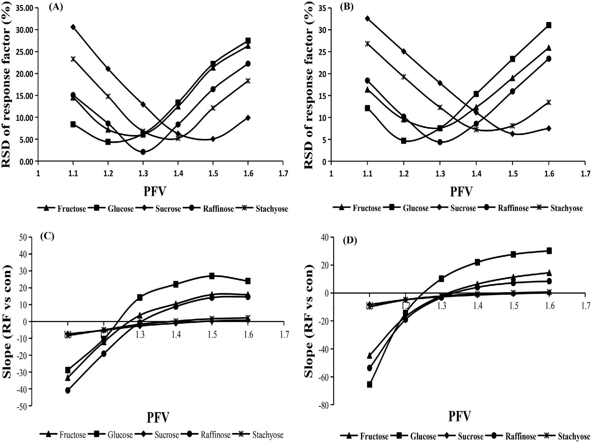
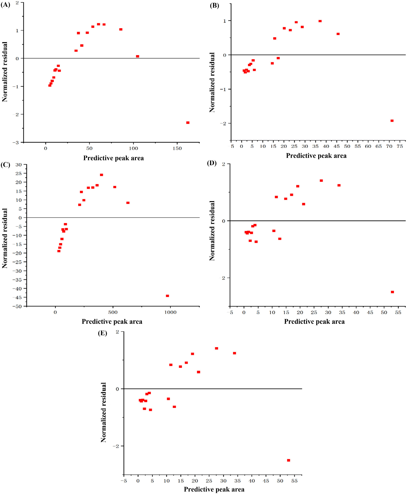
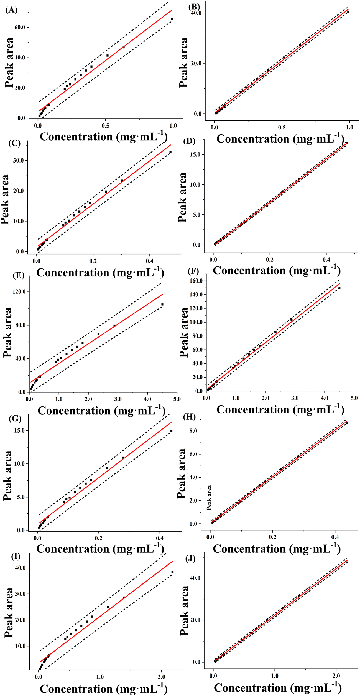
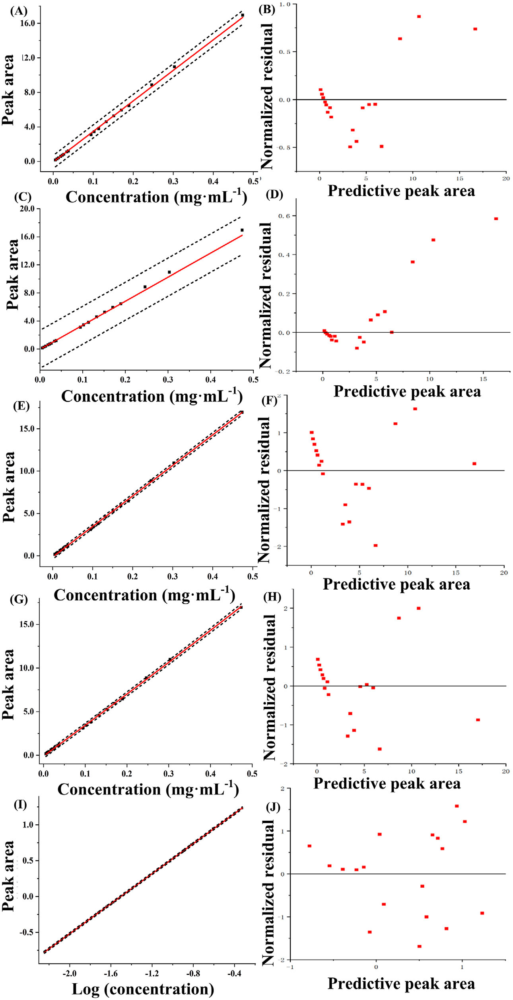

<!--
Wu et al., J. Sep. Sci. 2024;47:2300784 の全訳密度日本語版。
CAD検出器の線形化最適化の技術論文。researcher レベル（数式・回帰モデルが中心）。
表1（既定vs最適化）を保持。式1-4は本文の通り。図・補足表（S1-S10）は原文参照。
-->

## 書誌情報

- 標題（原題）: An optimization strategy for charged aerosol detection to linearize the detector response in the multicomponent quantitative analysis of Qishen Yiqi dripping pills
- 著者: Linlin Wu, Xingchu Gong, Haibin Qu（責任著者）
- 所属: 浙江大学 薬学院 製薬情報学研究所／浙江科技大学 生物化学工学院
- 掲載誌・巻号・DOI: Journal of Separation Science, 2024;47:2300784. DOI: 10.1002/jssc.202300784
- インパクトファクター: 2.9（Journal of Separation Science, JCR 2024 / Clarivate。Q2）
- 受理経過: 2023年10月23日受領／12月13日改訂／12月25日受理。© 2024 Wiley-VCH GmbH
- 資金: 国家中医薬管理局「成分中医薬・スマート薬学多分野革新チーム」（ZYYCXTD-D-2020002）

> 補足: 本論文は、UV発色団のない糖類を測れる「万能検出器」CAD（荷電化エアロゾル検出器）の弱点——**応答が濃度に対して本来非線形**——を、装置ソフト内蔵の2つのパラメータ（PFV＝べき関数値、power law＝パワー則）の**共最適化**で克服する技術論文。対象は中成薬「芪参益気滴丸（きさんえっきてきがん）」中の5種の糖（果糖・ブドウ糖・スクロース・ラフィノース・スタキオース）。前掲の補腎活血方・滋腎育胎丸のCAD論文が「CADで測れる」ことを示したのに対し、本論文は「CADの検量線をどう広い濃度域で線形にするか」という一段踏み込んだ実務課題を扱う。researcherレベル（数式・回帰統計が中心）。本文にツムラ（Tsumura And Co.）のダウンロード記録がある。

## 要旨（Abstract）

荷電化エアロゾル検出（CAD）は、弱いUV吸収の医薬品化合物の定量でますます認知される、HPLCの万能検出技術である。CADはアナライト濃度の増加とともに広い範囲で非線形応答を示し、様々な分析応用での汎用性を制限する。本研究では、べき関数値（power function value, PFV）とパワー則（power laws）の共最適化戦略を提案し、HPLC-CAD法で芪参益気滴丸（QSYQ）中の糖類の標準曲線の直線範囲を広げるために適用した。

全アナライトのPFVを経験モデルに基づいて最適化。続いて、好ましいPFVに基づいて最適パワー則を調査。加えて、結果の正確性・精度を確保するため様々な回帰式を評価。最適化したPFVとパワー則により、通常最小二乗モデル（OLSM）が満足な適合を示した。最適PFVとパワー則は標準曲線の直線範囲を既定設定と比べ2.7倍に拡張し、モデル不確かさを低減した。本論文は、提供ソフト外の外部データ変換なしに多成分定量HPLC-CADアプローチを開発する重要な方法を提示し、特に品質差の大きい伝統中医薬の分析応用に適する。

**キーワード**: 荷電化エアロゾル検出、最適化戦略、べき関数値、パワー則、芪参益気滴丸

## 1. 序論（Introduction）

芪参益気滴丸（QSYQ）は心血管疾患治療に使われる著名なTCM処方。調製中、三七（Panax notoginseng）・黄耆（Astragalus membranaceus）・丹参（Salvia miltiorrhiza）を併煎。水抽出・エタノール沈殿後、混合物を濃縮し、降香（Dalbergia odorifera）を濃縮抽出物に加える。薬局方基準により単糖・オリゴ糖を除外する[1]。多くの研究が黄耆・丹参・三七が糖類を含むことを示し[2–4]、NMR技術がQSYQ中に果糖・ブドウ糖・スクロース・ラフィノース・アラビノースなどの単糖・オリゴ糖を同定した。単糖・オリゴ糖は水溶性糖類で、免疫調節・抗腫瘍・抗炎症など重要な生物学的・薬理学的性質を持つ[5,6]。したがって、製剤内のこれら成分濃度・分布の包括的理解がQSYQの効能・安全性確保に重要。しかしQSYQ中の糖類の分析基準の欠如が、生産の品質管理・標準化に課題を提起する。

糖類分析にはいくつかの一般的方法が使われる: 誘導体化HPLC-UV、HPLC-RID（屈折率）、LC-MS、HPLC-CAD、HPLC-ELSD、IC-PAD（パルスアンペロメトリー検出付きイオンクロマト）[7–11]。糖類は本質的にUV吸収基がないため、HPLC-UVでは直接検出できず、労力を要する誘導体化が必要[7,12]。IC-PADは糖に高感度だが電極が汚染されやすく長期使用で再現性が低下[8,13]。RID・ELSDは小分子糖の検出に一般的[14,15]。CADも様々な研究で使われてきた。一部研究はELSD・RID・CADの結果に有意差なしと観測[16,17]。勾配溶出はRIDと非互換で多成分分析での使用を制限[7,17]。ELSDと比べCADは糖分析でより速い平衡化・より安定なベースライン・改善された再現性・より高い感度を提供[16,18]。ELSDのLOQはCADの約3〜4倍高い[16]。MSはCADより低いLOQ・LODを示すが、アナライトのイオン化が必要で検出コストが高い[19,20]。したがってCADは糖分析に適した選択。**ただしアナライト濃度へのCADの非線形応答が検出器の適用範囲を制限する[21]**。

TCMの品質は産地・保存条件・調製法で大きく変動しうる。したがってHPLC-CADで品質差の大きいTCMを定量分析するには、試料溶液の希釈・濃縮と広い適用範囲の標準曲線の確立が不可欠[22,23]。しかし試料溶液の希釈・濃縮は追加処理を要し労力がかかる。PFVやパワー則設定・適切な線形/非線形回帰の選択・ピーク面積と濃度の両対数変換・これらの組み合わせが、広い適用範囲の標準曲線構築を促進する[22,23]。この両対数変換はHPLC-CAD定量分析で使われてきた[24]。しかしGLP・GMP規制準拠のラボでは、データ変換や高次モデルを含むデータ処理は厳格な精査・検証の対象[25]。したがって両対数変換・非線形回帰は主に研究目的で使われる[26]。線形回帰は化学アッセイデータの校正に依然不可欠[27]。

加えてCADは重要なPFVパラメータを提供し、アナライト濃度と応答の非線形関係を数学的に補償して、線形化データ・改善されたS/N比・低減された応答変動性を提供する[28]。PFVベースの信号処理は、保持時間を変えずにリアルタイムクロマト信号をn乗に増幅する。これにより検出器の出力信号が変わり標準曲線の準線形範囲を拡張する[26]。しかし各アナライトの実験的PFV最適化は網羅的（＝手間）。したがってより合理化された最適化のため経験的PFVモデルが開発されてきた[25]。Chromeleonソフトはパワー則パラメータも提供し、既存クロマトデータに新しいデータチャンネルを作り、広範囲で応答とアナライト濃度の線形整合を確保する[29]。しかしTCM分析のHPLC-CADで直線範囲を広げるためPFVとパワー則を効率的に最適化するさらなる探索が不可欠。

本研究では、HPLC-CADでQSYQ中の糖類の定量分析で標準曲線の直線範囲を広げるため、PFVとパワー則の共最適化戦略を提案した。QSYQアナライトのPFVをPFV経験モデルで最適化。続いて好ましいPFVに基づいて最適パワー則を決定。HPLC-CADの正確性確保のため、通常最小二乗モデル（OLSM）・重み付き最小二乗モデル（WLSM）・二次多項式モデル（SOPM）・両対数線形モデル（LLM）を、適合度・予測力指標・予測区間・残差プロットに基づいて評価・比較。

## 2. 材料と方法（Materials and methods）

### 2.1 材料と化学薬品

QSYQ試料はTasly Pharmaceuticalから調達。標準品（果糖・ブドウ糖・スクロース・ラフィノース・スタキオース、純度98.0%）はShanghai Winherb Medical Technologyから供給。HPLCグレードのアセトニトリルはMerck、超高純度水はMilli-Q。

### 2.2 標準溶液の調製

標準品を精密秤量し60%アセトニトリル/水(v/v)にストック溶液として溶解。混合標準溶液を60%アセトニトリル/水で希釈・混合し、各々5標準物質を含む異なる濃度の溶液を調製。ストックは4℃保存。

### 2.3 試料溶液の調製

QSYQ試料0.40 gを正確に秤量し、60%アセトニトリル25 mLで超音波浴中30分抽出。室温平衡後0.22 μm膜濾過。HPLC注入前に4℃保存。

### 2.4 装置と分析条件

Dionex Ultimate 3000（HPG-3400RSポンプ・PDA・Corona Veo RS CAD）。Prevail Carbohydrate-ESカラム（250 mm×4.6 mm, 5 μm）。移動相A（水）・B（アセトニトリル）、勾配: 0〜13.0分 76.0%B；13.0〜24.0分 76.0→20.0%B；24.0〜25.0分 20.0%B。注入量10 μL、蒸発温度35.0℃、濾過定数5.0、カラム温度30.0℃。

### 2.5 データ解析

Ahmadらが提案したPFV最適化予測経験モデルを使用[25]。PFV=1のピーク面積からPFV≠1のピーク面積を予測。モデル化ピーク面積と実験値の応答係数（RF=ピーク面積/濃度）の差を平均（|ΔRF|/RF計算値×100）で計算。ソルバー関数で変数a・bを調整し濃度範囲全体で平均を最小化[25]。定数aとPFVはべき関数、定数bはPFVに線形依存。モデルの数学形式（式1〜3）:

$$A_{PFV} = a \times A_1^{(b)} \tag{1}$$

$$a = c_1 \times PFV^{c_2} \tag{2}$$

$$b = c_3 \times PFV + c_4 \tag{3}$$

（APFV: あるPFVでのピーク面積、A1: PFV=1でのピーク面積、a, b, c1-c4: 定数）

多成分定量では、参照アナライトの定数a・bと予測アナライトのPFV=1でのピーク面積を用いて特定PFVでのピーク面積を決定。最適PFVは、RFのRSDが最低、またはRF対濃度の傾きが最もゼロに近い値。CAD信号を濃度の関数とする回帰モデルの決定係数R²と予測相対標準誤差（RSEP）でモデルの予測精度・適合度を評価。RSEP（式4）:

$$RSEP = 100 \times \left(\frac{\sum_{i=1}^{n}(y_i - \hat{y}_i)^2}{\sum_{i=1}^{n}(y_i)^2}\right)^{1/2} \tag{4}$$

（n: 参照溶液の濃度水準数、ŷi: i番目の予測ピーク面積、yi: i番目の実験ピーク面積）

## 3. 結果と考察（Results and discussion）

### 3.1 経験的PFV最適化アプローチ

PFVの実験的最適化は資源・時間集約的。式1〜3から導いた方法で、PFV=1で得たピーク面積から任意PFVでの特定アナライトの応答を予測し、最適PFVを迅速・効率的に選択。PFV<1.0は半揮発性物質のLC-CAD定量に適し[29]、糖類のような不揮発性化合物にはPFV>1.0が好ましい。混合参照溶液の濃度をPFV 1.0〜1.6で注入・分析。様々なPFVでの回帰モデルのR²はすべて0.98超で近接——**R²のみで最適PFV同定は困難**。RFのRSDとRF対濃度の傾きで好ましいPFVを同定でき、両基準で一貫した最適結果。**果糖・ブドウ糖・スクロース・ラフィノース・スタキオースの最適PFVはそれぞれ1.3・1.2・1.5・1.3・1.4**。両指標が応答均一性評価・最適PFV決定に有効と確認。

経験的PFV最適化を実施。5アナライトの定数a・bを様々なPFVで決定。aとPFVはべき関数、bとPFVは線形関数でモデル化。全モデルが良好な適合（R²>0.9052）。予測ピーク面積は測定値と一致し、経験的PFV最適化法がRFのRSD・傾きとPFVの関係を効果的に予測し最適PFVを正確に同定[30]。

### 3.2 パワー則最適化アプローチ

広い濃度域でのCAD信号の非線形依存が線形検量線の適用を制限するが、PFVとパワー則の最適設定で信号を線形化できる[29]。PFV処理（リアルタイム応答信号の変換）はPFV増加でピーク面積がべき関数的に減少[25]。対照的にパワー則処理（既存クロマトグラムから導出）はパワー則増加に対応してピーク面積がべき関数的に増加。

パワー則単独でCAD信号を線形化。PFV 1.0を基準にパワー則1.0〜1.6のクロマトグラムを作成。RFのRSDと傾きで各アナライトの最適パワー則を決定: 果糖・ブドウ糖1.2、スクロース1.4、ラフィノース・スタキオース1.3。これに基づく線形モデルのR²は0.9971〜0.9994、RSEP 2.453〜5.221で良好な適合。しかし高濃度で標準化残差に有意な偏差、残差分布が非ランダムで予測ピーク面積とともに増加。**したがってパワー則の最適化だけでは全濃度域でのモデル適合改善効果が限定的**。

### 3.3 PFVとパワー則の共最適化

各アナライトが多成分定量で固有の好ましいPFVを持つが、PFV切替時にクロマトグラムのベースラインが大きく変動し、特にピークが近接する場合にピーク積分に影響。**したがって全アナライトに統一PFVを選びパワー則設定と組み合わせて最適化することを推奨**。3.1節の結果に基づき全アナライトに統一PFV 1.3を選択。続いてPFV 1.3を基準にパワー則1.0〜1.6のクロマトグラムを作成。RFのRSDと傾きで各アナライトの最適パワー則を決定: **果糖・ブドウ糖・ラフィノースは1.0、スクロース・スタキオースは1.1**（既定はPFV・パワー則とも1.0）。

**Table 1. 既定条件と最適化条件のPFV・パワー則の線形モデル性能比較**

| アナライト | R²（既定） | R²（最適化） | RSEP（既定） | RSEP（最適化） |
|---|---|---|---|---|
| 果糖 | 0.9777 | 0.9987 | 9.520 | 2.563 |
| ブドウ糖 | 0.9881 | 0.9994 | 7.186 | 1.758 |
| スクロース | 0.9640 | 0.9969 | 11.256 | 3.849 |
| ラフィノース | 0.9821 | 0.9992 | 8.549 | 2.039 |
| スタキオース | 0.9683 | 0.9991 | 10.827 | 2.184 |

最適化PFV・パワー則を適用したモデルは既定設定に比べR²の顕著な改善とRSEPの低減を示した。標準検量線と予測区間: 既定条件では全アナライトの低・高濃度のピーク面積が標準曲線から逸脱し、予測区間が広く（＝予測不確かさ大）なった。共最適化がモデル予測の精度を改善しモデル不確かさを低減。

加えて、既定条件で最適化条件と同等のモデル精度を得るにはアナライト濃度範囲を狭める必要があった。濃度範囲を狭めるとR²>0.9976・RSEP<3.418と最適化条件に近づいた。**研究した濃度範囲は狭めた範囲の2.7倍**——PFVとパワー則の共最適化が標準曲線の直線範囲拡張に有効なことを実証。

既定PFV 1.00で主成分に対し0.1%含量の不純物を定量すると回収率偏差が10%超という報告がある[29]。最適化法の正確性をさらに調べるため、直線性・再現性・精度・安定性・正確性・LOD・LOQのバリデーション実験を最適PFV・パワー則で実施。5成分の相関係数R>0.998で高い直線性。全RSD<3.04%で良好な精度と24時間内の試料安定性。3濃度での平均回収率>95.88%、RSD<4.68%——最適条件で頑健・信頼・正確。

他法（HPLC-ELSD・IC-PAD・HPLC-MS・誘導体化HPLC-UV・HPLC-RID）と比較。本法は約2桁の比較的広い直線範囲で、LOQ・LODはELSD・RIDより低くMS・IC-PAD・誘導体化HPLC-UVに近く、全糖類でほぼ100%回収率。広い適用範囲・満足な感度・高回収率に加え、費用効果・時間効率・装置操作の簡便さが特徴。

### 3.4 回帰式の影響

HPLC定量では未知アナライト濃度を検量線（ピーク面積-濃度）から決定。信号と標準濃度の関係の正確な特性化が未知濃度推定の正確性・精度に大きく影響。HPLC-CADでは線形回帰の切片・傾きを通常OLSMで決定[31,32]。OLSMは観測値と回帰推定値の二乗偏差の合計を最小化し、各濃度点の絶対誤差に等しい重み。しかしHPLC分析では絶対誤差がアナライト濃度増加で増える傾向[33]。OLSMを広い濃度域で当てはめると低濃度の相対誤差が有意になり未知濃度推定の正確性・精度に影響しうる[34]。WLSMは不均一分散の影響を最小化する好ましい回帰技術で[35]、変動性・不確かさの大きい濃度を強調し特に低濃度で信頼できる結果を確保[27]。WLSMの典型的重み付けは1/X・1/X²[35]。

広い濃度域でのHPLC-CAD定量の正確性確保のため、ブドウ糖をケーススタディにOLSM・WLS（1/X・1/X²）・SOPM・LLMを最適PFV・パワー則で評価。**OLSM・SOPM・LLMはWLSM（1/X・1/X²）より高R²・低RSEP**。OLSM・SOPMは優れたモデル適合・予測能を示し、LLMは優れた適合、WLSM（1/X・1/X²）は非効率。予測区間・残差: WLSM 1/X²が最も広い予測区間、次いでWLSM 1/X。OLSM・SOPMはより狭く、LLMが最狭。LLMの標準化残差は−2〜2でランダム・均一分布（最適適合）、他モデルは非ランダム分布（不均一分散・過小適合の可能性）。

したがって既定PFV・パワー則では、OLSMを広い濃度域で使うと高・低濃度双方の測定誤差が有意。PFV・パワー則の共最適化が測定値と予測値の相対偏差を均衡させ、広範囲で濃度-応答の線形依存を確保。したがって**OLSMを共最適化戦略と統合すると所望のモデリング精度を達成**。加えてLLMをこの戦略と組み合わせると優れたモデル適合性能を示し、研究志向の応用に有望。

## 4. 結論（Concluding Remarks）

本研究では、QSYQの5糖類のPFVを経験モデルで最適化。最適PFVはアナライト間で異なり、装置分析中に異なるアナライトでPFVを切り替えるとベースラインが大きく変動したため、PFVとパワー則の共最適化を促した。既定設定に比べ、最適PFV・パワー則は標準曲線の直線範囲を2.7倍に拡張しモデル不確かさを低減。HPLC-CADの正確性・精度向上の潜在力を探るため、OLSM・WLSM（1/X・1/X²）・SOPM・LLMの適合・予測力を評価・比較。PFV・パワー則の共最適化とOLSMの組み合わせが、TCMの多成分分析のHPLC-CAD標準曲線の直線範囲を広げ、モデル不確かさを減らし、正確性・適用性を高めた。LLMと統合するとこの共最適化戦略は優れたモデル適合を提供し、研究志向の分析応用に大きな潜在力を示した。本研究はHPLC-CAD標準曲線の直線範囲を広げる革新的方法を提示し、特に品質差の大きいTCM分析に有用である。

## 参考文献

1. Chinese Pharmacopeia Commission. Pharmacopoeia of People's Republic of China, Volume I. Beijing: Chemical Medical Science Press; 2020.

2. Chen L. Study on the preparation, structure analysis and leucocyte growth activity of oligosaccharide from Astragalus. 2016.

3. Niu T, Chen H, Xu B, Sun Q. Determination of five oligosaccharide in compound Danshen extract by SPE-HPLC-ELSD. Res Pract Mod Chin Med. 2015;29:59–65.

4. Gao Y, Niu T, Chen H, Xu B, Kong L. Determination of monosaccharide and disaccharide in Panax notoginseng by HPLC with SPE and ELSD. Res Pract Mod Chin Med. 2012;26:29–31.

5. Li Y, Pang S, Wang Y, Wang Y. Review on quantitative analysis for monosaccharides and oligosaccharides. Sci Technol Food Ind. 2016;37:363–67.

6. Li S, Wu D, Lv G, Zhao J. Carbohydrates analysis in herbal glycomics. Trends Anal Chem. 2013;52:155–69.

7. Li Y, Zhang L, Wang S, Wang J, Zhang Y, Xie G, et al. Determination of polysaccharide composition of oil-tea camellia seed cake by high performance liquid chromatography. China Oils Fats. 2020;45:126–36.

8. Xu N, Yao Z, Che J, Ye M, Chen M. Determination of arabinose, galactose, mannose, glucose, ribose and lactose in yellow rice wine by ion chromatography-integral pulsed amperometric detection. Sci Technol Food Ind. 2022;43:254–59.

9. Wu C, Wang J, Zhang C, Wang D, Zhang L, Cao M, et al. Determination of four sugars in infant formula milk powder and dairy products by ion chromatography-mass spectrometry. Food Sci Technol. 2020;45:264–68.

10. Peng L, Chen Q, Huang P, Xu W, Long Z, Huang S. Simultaneous determination of 9 sugars and sugar alcohols in foods by ion chromatography with pulsed amperometric detection. Sci Technol Food Ind. 2020;41:250–59.

11. Liu S, Zhao Z, Zhao S, Wang H. Determination of five sugars and mannitol in Daqu by UPLC-Q/Orbitrap HRMS. China Brew. 2020;39:197–200.

12. Zhang L, Yang Y. Determination of monosaccharide composition and content of Codonopsis pilosula polysaccharide by HPLC. China Food Additives. 2021;32:163–69.

13. Chen G. Simultaneous determination of twenty amino acids and six sugars in sports drinks by IC-IPAD. China Brew. 2020;39:167–71.

14. Chen Z, Gou W, Liu F, Zhang C, Zhao F, Li W, et al. Simultaneous determination of seven saccharides in the intermediates of Danshen Chuanxiongqin injection by HPLC-ELSD. Chin J Mod Appl Pharm. 2021;38:1349–53.

15. Ma J, Chen L, Xie Y, Wang Y, Liang Q, Gong Q, et al. HPLC-ELSD simultaneous determination of monosaccharide and sucrose in Delisheng injection. Chin J Pharm Anal. 2012;32:247–55.

16. Wang Y, Liu Y, Yue H, Xu W, Cao J, Jin H, et al. Comparison between charged aerosol detector and evaporative light scattering detector for analysis of sugar in Zhusheyong Yiqi Fumai and study on accuracy of methods. China J Chin Mater Med. 2020;45:5511–17.

17. Feng X, Cheng R, Wang P, Han S, Bie W. Comparison of determination of 5 carbohydrates in food by charged aerosol detector, evaporative light scattering detector and refractive index detector. J Food Saf Food Qual. 2021;12:1513–18.

18. Knol WC, Pirok BW, Peters RA. Detection challenges in quantitative polymer analysis by liquid chromatography. J Sep Sci. 2021;44:63–87.

19. Zhou Y, Xu K, Wang Q. Determination of contents of glucose, fructose, sucrose, and sorbitol in vegetables by UPLC-MS/MS. Chem Biol. 2019;36:66–68.

20. Zhang N, Li L, Huang X, Liu S. Determination of oligosaccharides in ginseng from different growth environments by ultra performance liquid chromatography triple quadrupole tandem mass spectrometry combined with solid phase methylation. Chinese J Chem. 2021;38:247–55.

21. Poplawska M, Blazewicz A, Bukowinska K, Fijalek Z. Application of high-performance liquid chromatography with charged aerosol detection for universal quantitation of undeclared phosphodiesterase-5 inhibitors in herbal dietary supplements. J Pharm Biomed Anal. 2013;84:232–43.

22. Li C, Lin D, Yang C, Han W. The key factors affecting the quality of Chinese medicinal materials on the construction of Chinese Medicinal Material Information Traceability System. Chin J New Drugs. 2021;30:105–9.

23. Tam J, Ahmad IAH, Blasko A. A four parameter optimization and troubleshooting of a RPLC–charged aerosol detection stability indicating method for determination of S-lysophosphatidylcholines in a phospholipid formulation. J Pharm Biomed Anal. 2018;155:288–97.

24. Haidar Ahmad IA, Blasko A, Wang H, Lu T, Mangion I, Regalado EL. Charged aerosol detection in early and late-stage pharmaceutical development: selection of regression models at optimum power function value. J Chromatogr A. 2021;1641:461997.

25. Ahmad IAH, Blasko A, Tam J, Variankaval N, Halsey HM, Hartman R, et al. Revealing the inner workings of the power function algorithm in Charged Aerosol Detection: a simple and effective approach to optimizing power function value for quantitative analysis. J Chromatogr A. 2019;1603:1–7.

26. Schilling K, Pawellek R, Lovejoy K, Muellner T, Holzgrabe U. Influence of Charged Aerosol Detector instrument settings on the ultra-high-performance liquid chromatography analysis of fatty acids in polysorbate 80. J Chromatogr A. 2018;1576:58–66.

27. Jain RB. Comparison of three weighting schemes in weighted regression analysis for use in a chemistry laboratory. Clin Chim Acta. 2010;411:270–79.

28. Shalliker RA, Stevenson PG, Shock D, Mnatsakanyan M, Dasgupta PK, Guiochon G. Application of power functions to chromatographic data for the enhancement of signal to noise ratios and separation resolution. J Chromatogr A. 2010;1217:5693–99.

29. Pawellek R, Muellner T, Gamache P, Holzgrabe U. Power function setting in charged aerosol detection for the linearization of detector response–optimization strategies and their application. J Chromatogr A. 2021;1637:461844.

30. Qiu X, Zuo L, Sun S, Zhao X, Xu S, Zhu Z, et al. Impurity profiling of Compound Amino Acid Injection (6AA) using ion-pair high performance liquid chromatography coupled with corona-charged aerosol detection and high resolution mass spectrometry. J Pharm Biomed Anal. 2021;201:114099.

31. Toussaint B, Immame Hassane Beck T, Surget E, Boudy V, Jaccoulet E. Exploration of the effects of chloride ions on the analysis of polar compounds at low concentrations by hydrophilic interaction liquid chromatography coupled to a charged aerosol detector: application to tromethamine. J Sep Sci. 2023;46:2200766.

32. Yang Y, Jin Y, Zhang Y, Wang Z. Differentiating root and rhizome of Panax notoginseng based on precursor ion scanning and multi heart-cutting two-dimensional liquid chromatography. J Sep Sci. 2023;46:2200542.

33. Sanchez JM. The inadequate use of the determination coefficient in analytical calibrations: how other parameters can assess the goodness-of-fit more adequately. J Sep Sci. 2021;44:4431–41.

34. Sanchez JM. Linear calibrations in chromatography: The incorrect use of ordinary least squares for determinations at low levels, and the need to redefine the limit of quantification with this regression model. J Sep Sci. 2020;43:2708–17.

35. Mitra A, Boris G, John KS, MacMannis S, Safavi A, Sailstad J, et al. Calibration curves in quantitative ligand binding assays: Recommendations and best practices for preparation, design, and editing of calibration curves. AAPS J. 2018;20:22–41.

## 訳者補足

- **CADの弱点と本論文の狙い**: CAD（荷電化エアロゾル検出器）は「発色団のない糖類でも測れる万能検出器」だが、応答が**濃度に対して本来非線形**（濃度が高いほど応答の伸びが鈍る）。品質のばらつきが大きいTCM（産地で糖含量が大きく変動）を測ると、検量線の直線範囲を外れてしまう。従来は「試料を希釈/濃縮して範囲に収める」しかなかったが手間。本論文は**装置ソフト内蔵の2パラメータ（PFV・パワー則）を数式で最適化して信号自体を線形化**し、外部データ変換なしで広い濃度域を1本の直線検量線でカバーする方法を確立した。

- **PFVとパワー則の違い**: どちらもCAD信号をn乗する処理だが——**PFV（べき関数値）** はリアルタイム信号を測定時に変換（PFVを上げるとピーク面積が減る）、**パワー則（power law）** は既に取得済みのクロマトグラムを後処理で変換（上げるとピーク面積が増える）。両者を組み合わせる（共最適化）ことで、単独では取り切れない全濃度域の線形性を達成した。結果、検量線の直線範囲が**2.7倍**に広がった。

- **なぜ統一PFVにするか**: 成分ごとに最適PFVは違う（果糖1.3・スクロース1.5など）が、分析中にPFVを切り替えるとベースラインが乱れてピーク積分に支障が出る。そこで全成分に共通のPFV（1.3）を固定し、成分ごとの微調整はパワー則で行う、という実務的な折衷にした。

- **規制対応（GLP/GMP）への配慮**: 両対数変換や高次多項式は「データ変換」とみなされ、GLP/GMP準拠ラボでは厳格な検証が要る。本論文は「PFV・パワー則で信号を線形化 → 通常最小二乗（OLSM＝一番素直な直線当てはめ）で検量線を引く」ことで、規制上受け入れられやすい形を保った。研究目的なら両対数（LLM）が最も適合が良いが、実務ではOLSMとの組み合わせを推奨、という使い分けを示している。

- **芪参益気滴丸（QSYQ）とは**: 黄耆・丹参・三七・降香から成る心血管疾患用の滴丸（ドロップピル）型中成薬。日本の一般的漢方ではないが、その中の糖類（果糖・ブドウ糖・スクロース・ラフィノース・スタキオース）を品質指標として測る手法として本研究が使われた。

- 図（Fig.1-4：PFV予測、残差、検量線・予測区間、各モデル比較）は原著PDFから抽出して本文に埋め込んだ。補足表（Table S1-S10：詳細データ）は原文参照。
