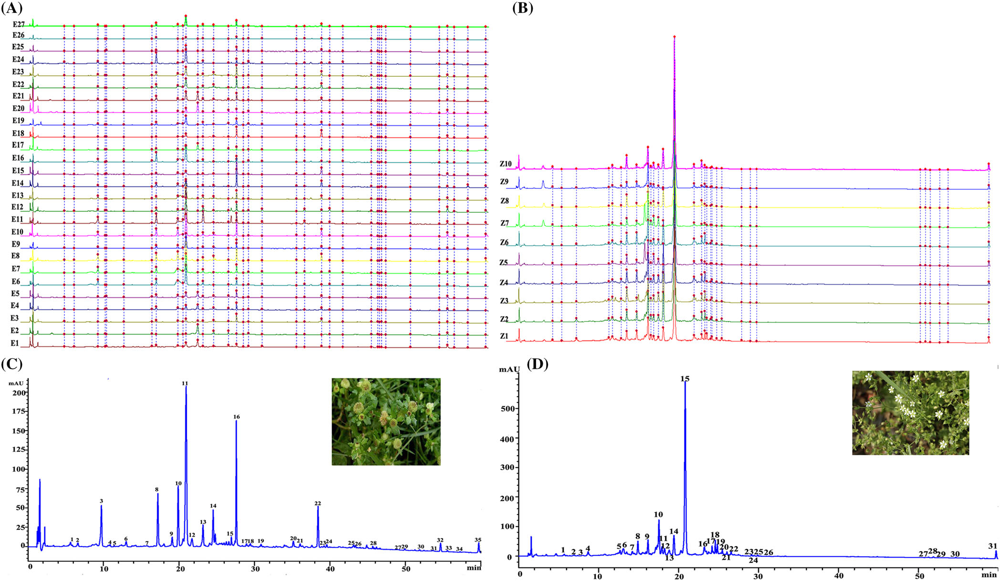
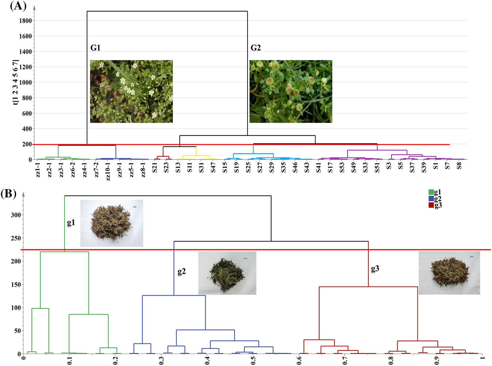
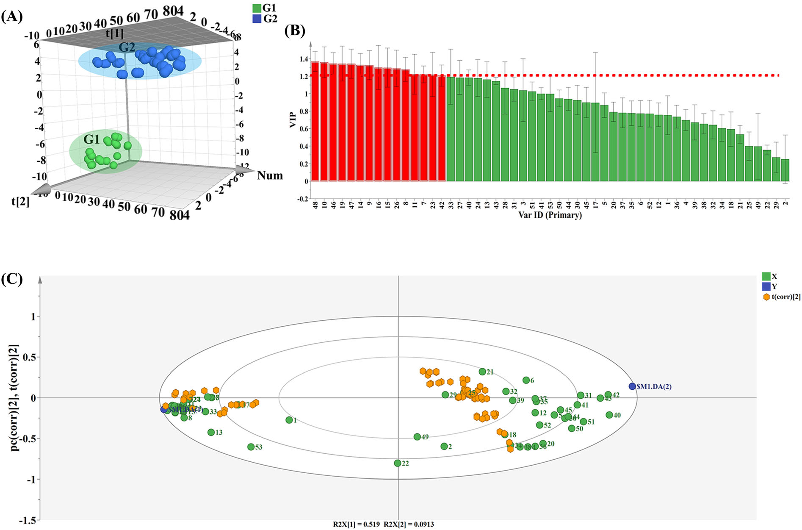
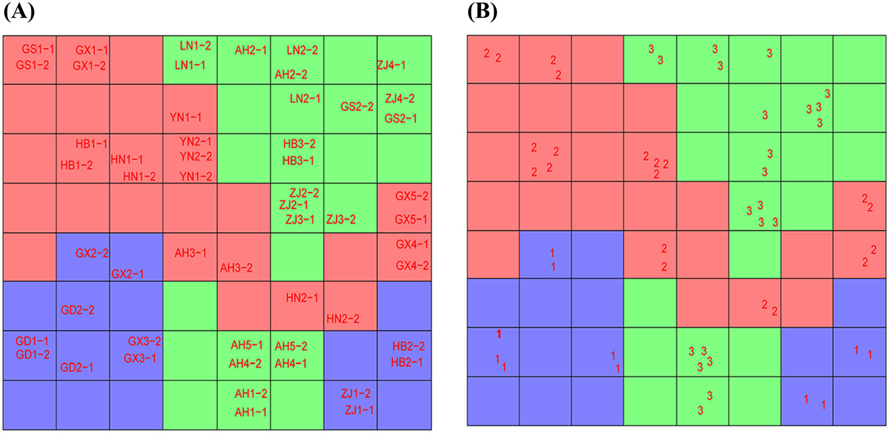
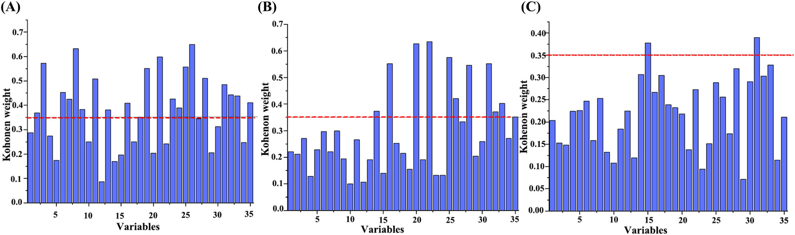
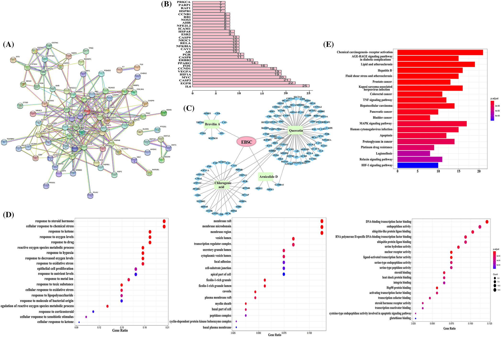
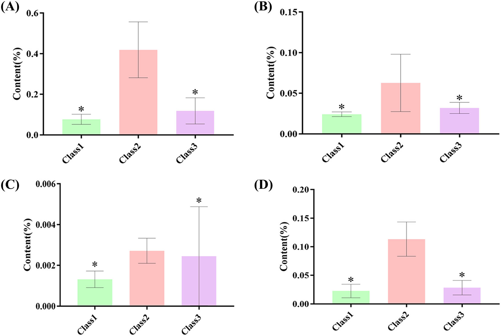

<!--
Liu M, Zhao X, Ma Z, Qiu Z, Sun L, Wang M, Ren X, Deng Y. Discovery of potential
Q-marker of traditional Chinese medicine based on chemical profiling, chemometrics,
network pharmacology, and molecular docking: Centipeda minima as an example.
Phytochemical Analysis 2022;33(8):1225-1234. doi:10.1002/pca.3173 の全訳密度日本語版。
-->

> **補足（本サイトでの位置づけ）:** 鵝不食草（がふしょくそう／ebushicao, EBSC＝*Centipeda minima*）は、鼻炎・感冒・喘息などに用いられるキク科の生薬で、抗腫瘍・抗炎症のセスキテルペンラクトン（ブレビリンA・アルニコリドD）を含む。本研究（天津中医薬大学、Phytochemical Analysis 2022）は、当サイトが扱う「Q-marker（品質マーカー）発見」の方法論の好例。中国薬局方はブレビリンAの含量下限（≥0.1%）1つしか規定しないが、本論文は **HPLC指紋＋4種のケモメトリクス（HCA・PCA・PLS-DA・CP-ANN）＋ネットワーク薬理＋分子ドッキング＋TCM理論** を段階的に統合して、真贋判別（偽品ザオズイ ZZ との区別）と品質差の要因成分を絞り込み、最終的に2つのセスキテルペンをQ-markerに選ぶ。Q-marker概念（劉昌孝が提唱：特異性・測定可能性・効能相関・生合成経路の固有性など）の実践例として、生薬品質規格づくりの考え方を学べる。**IF:** Phytochemical Analysis = 2.9（JCR2024・Q2）。

---

# 書誌情報

- **原題:** Discovery of potential Q-marker of traditional Chinese medicine based on chemical profiling, chemometrics, network pharmacology, and molecular docking: Centipeda minima as an example
- **著者:** Meiqi Liu, Xiaoran Zhao, Zicheng Ma, Ziying Qiu, Lili Sun（責任著者）, Meng Wang（責任著者）, Xiaoliang Ren, Yanru Deng
- **所属:** 天津中医薬大学 中薬学院／現代中薬天津市重点実験室
- **掲載誌:** Phytochemical Analysis 2022;33(8):1225–1234
- **DOI:** 10.1002/pca.3173（2022年6月7日受付／9月1日改訂受付／9月2日受理）
- **資金:** 天津市教育委員会科学研究計画重点項目（2021ZD009）
- **© 2022 John Wiley & Sons Ltd.**

> **略語:** EBSC=鵝不食草（Ebushicao, *Centipeda minima*）；ZZ=ザオズイ（Zaozhui, *Arenaria oreophila*・偽品）；HCA=階層的クラスター分析；PCA=主成分分析；PLS-DA=部分最小二乗判別分析；ANN=人工ニューラルネットワーク；CP-ANN=逆伝播型人工ニューラルネットワーク；VIP=投影変数重要度；PPI=タンパク質-タンパク質相互作用；GO=遺伝子オントロジー；KEGG=京都遺伝子・ゲノム百科事典。

---

# 要旨（Abstract）

**序論:** 漢方生薬（TCM）の化学成分（または成分群）の特性が臨床効能を決める。品質マーカー（Q-marker）はTCM品質管理系の標準化に大きな意義をもつ。

**目的:** ケモメトリクス・ネットワーク薬理・分子ドッキングを統合してTCMの潜在的Q-markerを発見する新戦略を、*Centipeda minima*（鵝不食草、EBSC）を例に開発する。

**材料と方法:** まず異なるバッチのEBSCとその偽品 *Arenaria oreophila*（ザオズイ、ZZ）の指紋を確立。次にケモメトリクス解析で真贋・バッチによる品質への影響を判定し化学マーカーをスクリーニング。第三にネットワーク薬理と分子ドッキングで活性成分-標的の関係を検証。最後にTCM理論に基づき潜在的Q-markerを選定。

**結果:** EBSCとZZの化学プロファイルを調査。異なるバッチのEBSCに化学組成の差があると判明。ケモメトリクス解析に基づき、クロロゲン酸・ルチン・イソクロロゲン酸A・ケルセチン・アルニコリドD・ブレビリンAを候補活性成分に選定。IL6・EGFR・CASP3・MYC・HIF1A・VEGFAが主要標的。分子ドッキングで結合能を検証。Q-marker概念に基づき、アルニコリドDとブレビリンAをEBSCの潜在的Q-markerと同定。

**結論:** 本戦略はTCMのQ-markerを発見して全体的化学恒常性を評価する実用的アプローチとして使える。

---

# 1. 序論

中国の医療産業の継続的発展に伴い、TCM産業は人の健康に大きな役割を果たす。しかしTCMの複雑さから、単一または数成分の検出では品質を保証できない [1]。多様な近代分析技術と科学的ツールでTCMの品質評価系を構築することがTCM標準化研究の焦点となっている。品質マーカー（Q-marker、劉昌孝院士が概念提唱）はTCM品質管理系の標準化に大きな意義をもつ [2]。

指紋法は国際的に広く認知された効率的で簡便な品質管理技術で、クロマト・スペクトル指紋分析が同定・品質管理に広く用いられる [3]。連用機器と関連ケモメトリクス法の急速な発展が、TCM指紋の確立・評価に強力な手段と広い展望を提供する。ケモメトリクスは数学・統計手法でデータを処理・解析し最良の実験手順を選ぶもので、多様なパターン認識法を含み、教師あり学習と教師なし学習に分けられる。後者にはHCA・PCA・PLS解析・ANNが含まれる [4]。ネットワーク薬理は生物情報学とシステム生物学に基づき、生物ネットワークのノードと相互作用を組み合わせる [5]。ネットワーク薬理により、単一成分とシステム制御の変換に基づく薬物の体への作用の多次元ネットワークモデルを効果的に確立でき、TCM理論の全体観に合致する [6]。分子ドッキングシミュレーションは分子の幾何配置と力に基づき分子間相互作用を予測し [7]、近年TCMの薬効成分スクリーニングに広く用いられ、有効性・安全性など品質問題の評価に新技術支援を提供する [8]。

*Centipeda minima*（L）A. Br. et Aschers（鵝不食草、EBSC）は中国・東南熱帯アジアに広く分布する一年草。全草が感冒・鼻アレルギー・下痢・マラリア・喘息などの治療に用いられる [9]。主要成分はセスキテルペンラクトン・精油・ステロール・トリテルペン・フラボノイド。近代研究でEBSCとその抽出成分は抗腫瘍・抗変異原・抗アレルギー・抗酸化・抗炎症・肝保護作用を示す [10–15]。しかし採取・乾燥法の違いで外観・性状が大きく異なり、組成・効能に影響しうる。市場の薬材には品質の顕著な差がある。EBSCと *Arenaria oreophila*（ザオズイ、ZZ）は別科の薬用植物だが、一部地域で類似とみなされ、ZZはEBSCの一般的な偽品の一つ。中国薬局方（2020年版）ではEBSCのブレビリンA含量は0.1%以上とされる。TCM理論の観点では、これはEBSCの品質を完全には制御しないため、より包括的で優れた方法が必要である。

本研究では、TCMの潜在的Q-markerを発見する戦略を提案し、*C. minima* を例とした。多様な近代機器分析技術と化学パターン認識法でEBSCの品質を包括的・系統的に評価し、産地・真贋を判定。ネットワーク薬理と分子ドッキングを組み合わせて潜在的Q-markerを予測した。

---

# 2. 材料と方法

## 2.1 試薬

クロロゲン酸・クリプトクロロゲン酸・カフェ酸・イソクロロゲン酸C・β-シトステロール・ケルセチン・ルチン・ケンフェロール（純度>98%）は上海源葉生物、イソクロロゲン酸A・アルニコリドD・ブレビリンAは北京中科質検生物、HPLCグレードギ酸は天津科密欧、精製水はWatson。**27バッチのEBSC（表1）と10バッチのZZ（表2）** を中国10省から収集。全植物材料は天津中医薬大学の林麻教授が薬局方（2020年版）に従い鑑定。

**表1・2（原文 TABLE 1, 2）：試料の記述（色・産地、抜粋）**

| EBSC | 色 | 産地 | | ZZ | 色 | 産地 |
|---|---|---|---|---|---|---|
| S1 | Kelly（黄緑） | 安徽(AH) | | Z1 | 濃緑 | 安徽(AH) |
| S6 | 淡緑 | 広東(GD) | | Z6 | 濃緑 | 四川(SC) |
| S8 | 濃緑 | 甘粛(GS) | | … | | |
| S10 | 濃緑 | 広西(GX) | | Z10 | 濃緑 | 四川 |
| S15 | 濃緑 | 河北(HB) | | | | |
| S18 | 濃緑 | 河南(HN) | | | | |
| S20 | Kelly | 遼寧(LN) | | | | |
| S22 | 濃緑 | 雲南(YN) | | | | |
| S24 | 淡緑 | 浙江(ZJ) | | | | |

（EBSCは10省27バッチで色は Kelly/濃緑/淡緑 が混在、ZZは10バッチすべて濃緑。全リストは原文表1・2参照。）

## 2.2 試料調製

HPLC分析用に粉末0.1 gを24メッシュ篩過し三角フラスコへ。100%メタノール2 mLを加え40分超音波（400 W、40 kHz）、均一化後8000 r/minで5分遠心し上清を得る。全溶液を0.22 µmナイロン膜濾過して注入。各標準を適量メタノールに溶解して標準液を調製。

## 2.3 機器と条件

Agilent 1260 HPLC。カラム Symmetry C18（4.6×250 mm、5.0 µm、Waters）、40℃。移動相A＝0.3%ギ酸水、B＝アセトニトリル、流量1 mL/min。直線グラジエント：0–5分(5–8%B)；5–12分(8–15%)；12–18分(15–18%)；18–25分(18–35%)；25–33分(35–45%)；33–43分(45–70%)；43–60分(70–100%)。注入10 µL、UV検出254 nm。

方法評価：同一EBSC・ZZ試料液を6連続注入、また0/2/4/8/16/24時間で分析、6試料調製。良好分離ピークの保持時間・面積を取得。**保持時間RSD<2%、面積RSD<5%**（良好な精度・再現性・安定性）。ブレビリンA・クロロゲン酸・ケルセチン・アルニコリドDの検量線を面積(y)対濃度(x)で構築し良好な直線性（表S1）。回収率は **102%・101%・98.8%・96.2%**（RSD 1.38/1.23/2.68/1.18%）。

## 2.4 データ解析

指紋類似度評価は「TCMクロマト指紋類似度評価システム2012（中国薬典委員会）」。ケモメトリクス（HCA・PCA）はSIMCA-P11.5、CP-ANNはMATLAB R2018b。標的ネットワーク解析：標的はTCMSP、疾患関連遺伝子はUniProt、PPIはString、R 4.0.4でノード自由度をスクリーニングして上位30標的を選定、GO/KEGG濃縮をR、ネットワーク構築はCytoscape 3.7.1。分子ドッキングはAutoDock 4.2（結晶構造はRCSB、PyMOLで前処理、Chem3Dでリガンド最適化、Lamarckian遺伝的アルゴリズム100 run）。

---

# 3. 結果

## 3.1 HPLC分析

EBSC(HN1)と混合標準のHPLCクロマトを図S1に示す。**54試料で計35共通ピーク**を取得。うち9成分を標準品で定性同定：クロロゲン酸(3)・クリプトクロロゲン酸(4)・ルチン(8)・イソクロロゲン酸A(11)・イソクロロゲン酸C(13)・ケルセチン(15)・ケンフェロール(18)・アルニコリドD(20)・ブレビリンA(22)。

異なる由来・生育地の試料のクロマト指紋類似度をEBSC/ZZ標準指紋と比較（図1）、類似度を算出（表S2・S3）。**EBSC試料（S1–27）の類似度は0.67〜0.98** でバッチ間差を示す。一方 **ZZ（Z1–10）の類似度は>0.90** で化学組成が類似（生育地が違っても品質が一貫・安定）。類似度評価は品質で試料を予備分類し顕著な差のバッチを同定できるが、高類似度試料の区別はできない。そこでケモメトリクス法と含量測定でEBSCの品質をさらに解析した。

## 3.2 ケモメトリクス解析

**3.2.1 HCAとPCA:** HCAは試料を収集・分類して系統樹を作る教師なしクラスタリング法 [16]、PCAは多因子を低次元空間へ移し因子情報を最大保持する線形次元削減法 [17,18]。液相ワークステーションで異バッチEBSC・ZZのピーク面積・保持時間を取得。データ行列をSIMCA-P14.1に取り込み、Ward法で系列クラスタリング。**図2A** のとおり距離スケール約1800で2群に分割：G1（異バッチのZZ）とG2（異バッチのEBSC）。**図2B** のとおり距離スケール約250でEBSC試料を3群に分割：G1（全体に黄緑、茎根が多く葉花が小さく稀）、G2（濃緑、根茎少なく葉が多く大きい、花が目立つ）、G3（淡緑または緑、葉が多く花が少ない）。

74（EBSC・ZZ試料）×53（変数）行列でZZ・EBSCのPCA。7主成分を抽出、第1・第2主成分が分散の52.0%・10.5%（図3A：EBSCとZZが別群に）。54（EBSC）×35（変数）行列でPCA（オートスケーリング前処理）。3群に分割（図3B）。7主成分で第1・第2が28.1%・15.4%。

**3.2.2 PLS-DA:** PLS-DAは試料の共線性の影響を避け、2種の副問題処理に独自の利点をもつ [19,20]。化学マーカー同定のためEBSC・ZZの教師ありPLS-DAモデル（74試料×53変数）を確立。**図4A** のとおりG1・G2の分類はPCA・HCAと一致し結果の信頼性を検証。モデルは良好な予測能（**R²=0.981、Q²=0.979**）。各変数の判別重要度をVIPプロット（図4B）、S-plot（図4C）で示した。**化学変数48・10・46・19・47・14・9・16・15・26・8・11・7・23・42がVIP>1.2** で判別に重要な役割。代表的化学マーカーを保持時間比較とLC-MSで同定（表S4）：変数7＝クロロゲン酸、11＝ルチン、15＝イソクロロゲン酸A、27＝アルニコリドD、28＝ブレビリンA。

**3.2.3 CP-ANN:** CP-ANNはKohonenネットワークに基づき教師なし・教師あり分類問題の両方を扱える [21]。教師ありモデルとして試料分類結果を解析・検証し、分類における変数の役割を調べた [22,23]。PCA・HCA結果に基づきEBSC試料をまずG1・G2・G3の3群に分け、新行列をKohonenネットワークとCP-ANNツールキットに入力。Kohonenマップの数字1・2・3がG1・G2・G3を表す。最適パラメータのCP-ANN結果を図4（Kohonen SOM）に示す。図4Aは試料のKohonenマップ上の分布、図4Bは異カテゴリ試料のKohonenマップ。反復試料が同一/隣接ニューロンに位置し実験の良好な再現性を示す。異カテゴリのニューロンの交差分布はなく、分類結果はPCA・HCAと一致。

35化学マーカーの各カテゴリでの寄与率をCP-ANNで解析。得られたKohonen重み値を評価指標とし、**臨界値0.35** を採用（図5）。G1の本質的変数＝2/3/6/7/8/11/12/16/19/21/23/24/25/26/28/31/32/33/35；G2の重要変数＝14/16/20/22/25/26/28/31/32/33/35；G3の本質的変数＝31/15。したがって **G3判別で最重要は変数15、G2判別で最重要は14・20・22、G1判別で最重要は2・3・6・7・8・11・12・19・21・23・24**。うち6化学マーカーを同定：クロロゲン酸(3)・ルチン(8)・イソクロロゲン酸A(11)・ケルセチン(15)・アルニコリドD(20)・ブレビリンA(22)。

## 3.3 標的ネットワーク解析

予測されたクロロゲン酸・ルチン・イソクロロゲン酸A・ケルセチン・アルニコリドD・ブレビリンAをQ-marker候補の活性成分に選定。TCMSPで経口バイオアベイラビリティ（OB≥30%）と薬物様性（DL≥0.18）を指定し、**アルニコリドD・ブレビリンA・ケルセチン・クロロゲン酸** を主要活性成分にさらに絞り込み、これらの標的を取得。UniProtでヒト関連タンパク質・遺伝子を検索、Perlで変換してEBSC遺伝子標的を得た（表S5）。これらでPPIネットワーク（図6A）を構築。**IL6・EGFR・CASP3・MYC・HIF1A・VEGFAが主要標的**（図6B）。

EBSCの活性成分・標的遺伝子をCytoscapeに入れ「EBSC-活性成分-標的-経路」ネットワークを構築（図6C）。**112ノード・115エッジ**（薬物ノード1（赤）・活性成分ノード4（緑）・残りは標的（青））。4活性成分が複数標的に作用し、単一標的が複数成分と関連する（多成分・多標的の統合作用）。標的-経路相互作用を解析、GO/KEGG（Benjamini-Hochberg補正P<0.05）で上位20経路を抽出。GO濃縮（図6D）ではEBSCの活性が主に酸化ストレス反応・細胞酸化ストレス反応に関連、薬効成分の機能は主に細胞膜（サイトカイン媒介シグナル経路に関連）。KEGG（図6E）では4薬効成分が多様な腫瘍に潜在効果をもち、治療効果は主に **TNF・アポトーシス・HIF1シグナル経路** で媒介。肺がんプロテオグリカン経路・非小細胞がん経路など選択経路がヒトの肺疾患に関連し、EBSCの主効能とTCMの性味帰経理論に合致。

## 3.4 分子ドッキング検証

スクリーニングされた6標的タンパク質を活性成分とのドッキングでスコア化。標的を前処理してリガンド構造を満たす低エネルギー配座を得た。親和性（kcal/mol）が結合能を表し、負の結合エネルギーは自由結合を示す。結合エネルギーが低いほど親和性が高く結合が安定で相互作用しやすい。ドッキング結果（表S6）をヒートマップで可視化（図7）。結合エネルギー最低の上位4つをPyMOLで解析（図S2）。**ケルセチン・クロロゲン酸と各標的の親和性が良好**。CASP3・HIF1Aが各成分と良好なドッキング結果を示し、EBSCの活性成分でより重要な役割を果たしうる。

## 3.5 TCM理論に基づく潜在的Q-markerの予測と含量測定

劉昌孝が提唱したQ-marker概念に基づき上記4化合物を解析 [24]。**ケルセチン・クロロゲン酸はフラボノイド類**で、その効果はシキミ酸経路で媒介され特殊性がない。**アルニコリドD・ブレビリンAはセスキテルペノイド**で、アカシアピロリン酸を一次原料に酸化的転位で合成され強い特異性をもつ。EBSCは辛味をもつ。セスキテルペノイドは植物に広く分布し、高沸点・豊かな風味・高い生物活性をもつ重要な精油化合物。植物化学・生物活性研究で、上咽頭がん細胞から単離されたテルペンラクトン化合物の約半分が増殖抑制・アポトーシス誘導を示す [25]。最後に異バッチEBSCの4マーカー含量を測定し（表S7）棒グラフを作成（図8）。これら4つのスクリーニング原則に基づき、**アルニコリドDとブレビリンAをEBSCの潜在的Q-markerと同定**。

---

# 訳者補足

- **Q-marker選定の「絞り込み」ロジック:** 本論文の面白さは、統計だけで決めず**4段階で候補を削る**点。①指紋類似度で真贋・大まかな品質差を見る→②HCA/PCA/PLS-DA/CP-ANNの4手法で「群を分ける変数（成分）」を6つに絞る→③ネットワーク薬理＋ドッキングで「効能に効くか」を検証（ケルセチン等が候補に残る）→④TCM理論（生合成経路の**特異性**）で最終判定。フラボノイド（シキミ酸経路＝多くの植物に共通で非特異的）を落とし、EBSCに固有なセスキテルペン（アルニコリドD・ブレビリンA）を選ぶ。この「特異性＝その生薬らしさ」を重視するのがQ-marker思想の核心。
- **薬局方規格との関係:** 薬局方はブレビリンA≥0.1%だけを規定。本研究はそれに**アルニコリドD**を加えるべきと示唆し、かつ偽品ZZとの判別（類似度＞0.90でまとまるZZに対しEBSCは0.67〜0.98とばらつく）という真贋管理の視点も与える。
- **CP-ANNとは:** 逆伝播型人工ニューラルネットワーク。KohonenのSOM（自己組織化マップ＝似た試料を近いニューロンに配置）に出力層を足し、教師あり分類もできる。図4・5がその出力で、「どの成分（変数）がどの群を決めるか」を重み値で可視化する。
- **数値の扱い:** 変数番号（VIP>1.2の48/10/46…、重み値0.35基準の変数群）は原文の変数インデックスをそのまま記載。補足表S1〜S7（検量線・類似度・LC-MS同定・遺伝子標的・ドッキングスコア・含量）と図S1・S2は原文参照。原文にない数値は加えていない。図の一部（ドッキングヒートマップ図8・含量棒グラフ図9）は削除済み重複版から復旧した図に統合されている。
