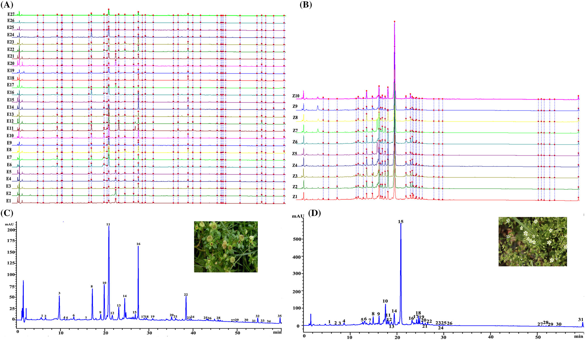
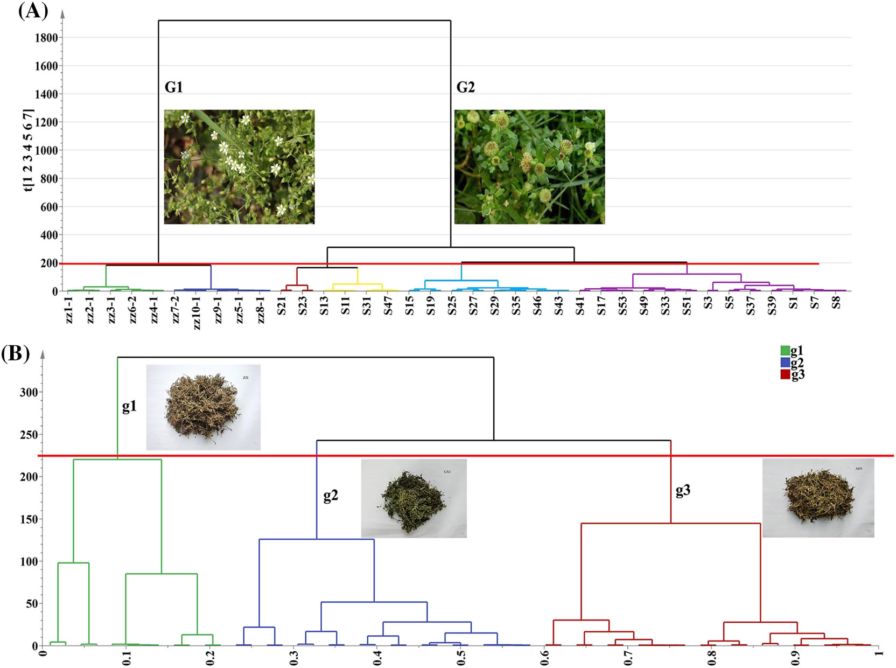
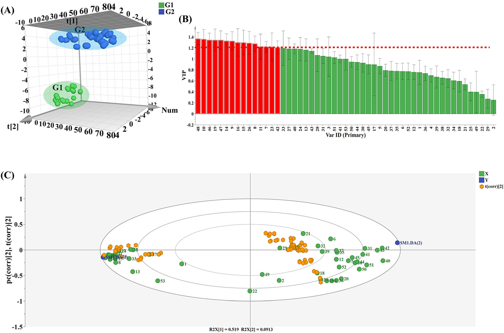
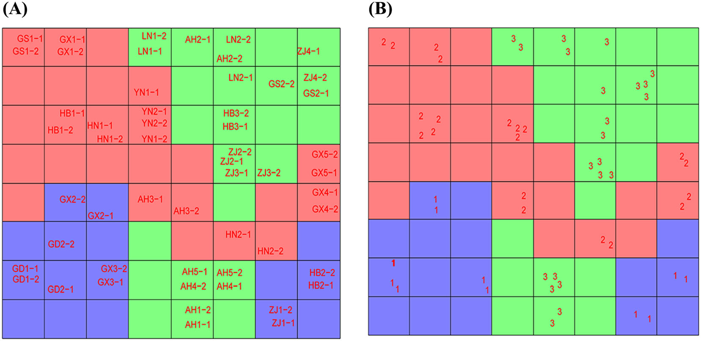
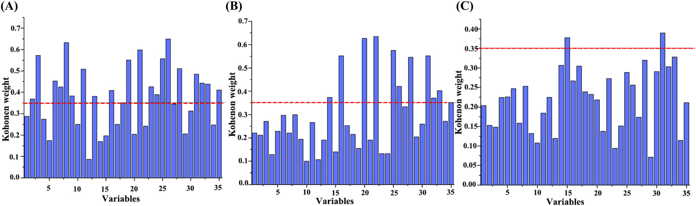
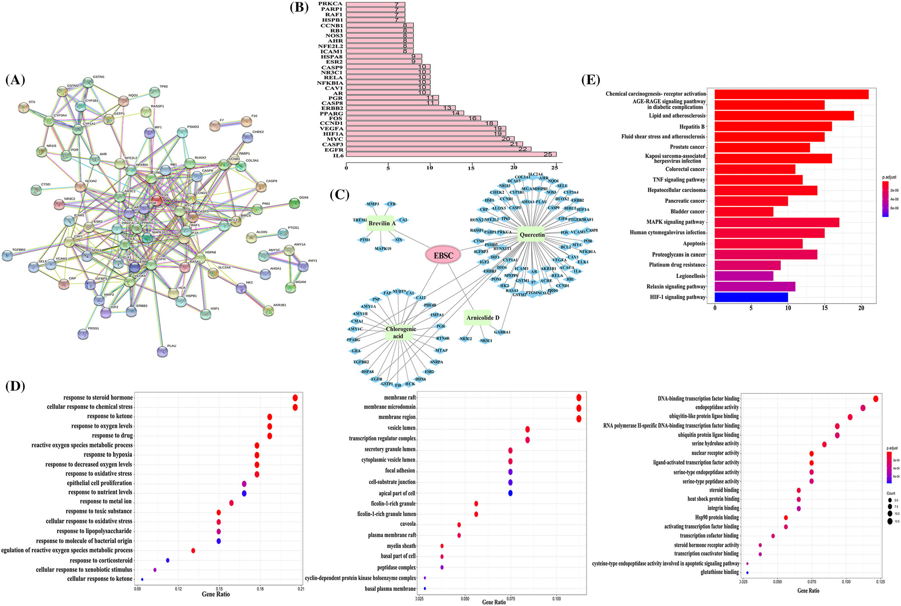
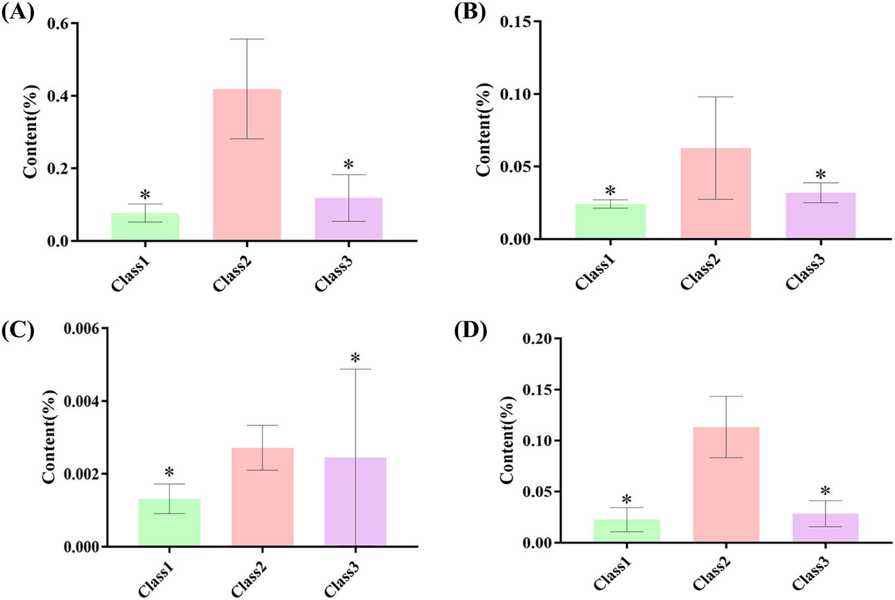

<!-- 方針: ほぼ全訳＋必要に応じた補足。原文構成に沿って訳出。「> 補足:」は訳者注。 -->

## 書誌情報

- 原題: Discovery of potential Q-marker of traditional Chinese medicine based on chemical profiling, chemometrics, network pharmacology, and molecular docking: Centipeda minima as an example
- 著者: Meiqi Liu, Xiaoran Zhao, Zicheng Ma, Ziying Qiu, Lili Sun, Meng Wang, Xiaoliang Ren, Yanru Deng（天津中医薬大学 中薬学院／天津現代中薬国家重点実験室, 中国）
- 掲載: *Phytochemical Analysis* 2022; 33(8): 1225–1234（Wiley）. https://doi.org/10.1002/pca.3173
- インパクトファクター: **2.9**（*Phytochemical Analysis*, JCR 2024 / Clarivate）

> 補足: EBSC = 鵝不食草（ebushicao、*Centipeda minima*。鼻炎・鼻づまり等に用いられる）。ZZ = 比較対象の類似/混同品(Zaozhui)。Q-marker = 品質マーカー。HCA=階層クラスタリング、PCA=主成分分析、PLS-DA=部分最小二乗判別分析、ANN=人工ニューラルネットワーク。本論文は分析法＋ケモメトリクス＋in silico解析の研究論文。

## 要旨（Abstract）

Q-markerは漢方の品質管理の標準化に重要である。本研究は、ケモメトリクス・ネットワーク薬理・分子ドッキングを統合してTCMの潜在的Q-markerを探索する新戦略を、鵝不食草(EBSC)を例に開発した。まず異なるバッチのEBSCとその対照品の指紋を構築。次にケモメトリクスで品質に影響する化学マーカーを抽出。第三にネットワーク薬理・分子ドッキングで活性成分と標的の関係を検証。最後に潜在的Q-markerを推定した。ケモメトリクス解析から **クロロゲン酸・ルチン・イソクロロゲン酸A・ケルセチン・アルニコリドD・ブレビリンA** が候補活性成分として選定された。主要標的は **IL6・EGFR・CASP3・MYC・HIF1A・VEGFA**。分子ドッキングで結合能を検証。Q-markerの概念に基づき、**アルニコリドDとブレビリンA** が潜在的Q-markerとして同定された。本戦略はTCMのQ-marker探索と全体的化学一貫性評価の実用的手法となる。

## 1. 序論（Introduction）

Q-markerはTCM標準化研究の焦点。*Centipeda minima*(鵝不食草)の主要化学成分はセスキテルペンラクトン・精油・ステロール・トリテルペン・フラボノイド。現代研究で抗炎症・抗腫瘍等の活性が報告される。本研究はHCA・PCA・PLS-DA・ANN等のケモメトリクスにネットワーク薬理・分子ドッキングを組み合わせてQ-markerを予測した。中国薬局方ではEBSCの **ブレビリンA含量は0.1%以上** と規定。

## 2. 材料と方法（Materials and Methods）

### 試料

EBSC **27バッチ**(Table 1)と類似品ZZ **10バッチ**(Table 2)を収集。標準品: クロロゲン酸・クリプトクロロゲン酸・カフェ酸・イソクロロゲン酸A・アルニコリドD・ブレビリン A 等。

### HPLC条件

- カラム: Symmetry C18（4.6 × 250 mm, 5.0 μm, Waters）、カラム温度 40 ℃
- 移動相: 水／(有機相)、流速 1 mL/min、リニアグラジエント
- UV検出波長 **254 nm**
- 検量線: ブレビリンA・クロロゲン酸・ケルセチン・アルニコリドD 等をピーク面積(y)対濃度で構築

### 解析

中薬クロマト指紋類似度評価システムで類似度を算出。HCA・PCAで分類し、品質差に寄与するマーカーを同定。ネットワーク薬理(Cytoscape 3.7.1)・分子ドッキングで活性成分−標的関係を検証。

## 3. 結果（Results）

### 指紋と類似度

54試料で **35の共通ピーク** を取得。標準品で同定: クロロゲン酸ほか、カエンフェロール(peak 18)・アルニコリドD(peak 20)・ブレビリンA(peak 22)等。類似度評価では、**EBSC 27バッチの類似度は0.67〜** と幅が大きく、バッチ間で化学組成に差があった。類似品ZZ 10バッチとは区別された。類似度評価のみでは高類似度試料を区別できないため、ケモメトリクスを併用した。

### ケモメトリクス・ネットワーク薬理・ドッキング

HCA・PCA・PLS-DA・ANNで、品質差に寄与する候補成分として **クロロゲン酸・ルチン・イソクロロゲン酸A・ケルセチン・アルニコリドD・ブレビリンA** を抽出。ネットワーク薬理で主要標的 **IL6・EGFR・CASP3・MYC・HIF1A・VEGFA** を特定。分子ドッキングで活性成分の標的への結合能を検証。

### Q-markerの選定

Q-markerの概念(妥当性・特異性・測定可能性・伝達性・薬効相関)に基づき、セスキテルペンラクトンの **アルニコリドDとブレビリンA** を潜在的Q-markerとして同定。これらはEBSCに特異的で薬効に関与し、薬局方規格(ブレビリンA ≥ 0.1%)とも整合する。

## 4. 結論（Conclusion）

ケモメトリクス・ネットワーク薬理・分子ドッキングを統合する戦略により、鵝不食草の潜在的Q-markerとしてアルニコリドDとブレビリンAを同定した。本戦略はTCMのQ-marker探索と全体的化学一貫性の評価に実用的なアプローチを提供する。

> 補足（実務的示唆）: フラボノイド/有機酸(クロロゲン酸・ルチン等)は広く分布し特異性に乏しいのに対し、**セスキテルペンラクトン(アルニコリドD・ブレビリンA)はC. minima に特異的かつ薬効関与**のため、Q-markerとして妥当という選定論理が要点。指紋だけでは高類似度ロットを判別しきれないため、ケモメトリクス(PCA/PLS-DA/ANN)で寄与成分を抽出し、ネットワーク薬理＋ドッキングで薬効と結びつける多段戦略が、特異的・薬効連動のQ-marker選定に有効。

## 図（原論文より）

> 以下は原論文から抽出した主要な図。キャプションは訳者による要約。

