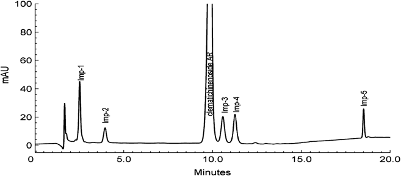

<!-- 方針: ほぼ全訳＋必要に応じた補足。原文（英語・Chemistry Central Journal 原著、オープンアクセスCC-BY）の節構成に沿って訳出。本文の[N]は原文の番号引用に対応し末尾の参考文献にリンクする。図1〜図3は原本PDFからPyMuPDFで抽出（図1は2つの埋め込み画像＋置換基表が1枚の図を構成するため該当領域をレンダリング）しReadで内容確認のうえ全訳キャプションで埋め込んだ。表1〜表6は全行・全数値を転記。「> 補足:」は訳者注。 -->

## 書誌情報

- 原題: Development and validation of a chromatographic method for determining Clematichinenoside AR and related impurities
- 著者: Yang Zhou（周洋）・Yue Guan・Ji Shi・Xiaolin Zhang・Lan Yao・**Lifang Liu（劉麗芳）\***（中国薬科大学 天然薬物国家重点実験室〈The State Key Laboratory of Natural Medicines, China Pharmaceutical University〉, 南京 210009, 中国）
- 掲載: *Chemistry Central Journal* 2012, **6**:150. DOI: 10.1186/1752-153X-6-150
- 受理: 2012年9月24日受付／11月27日受理／12月8日公開
- 種別: 原著論文（Research Article）／**オープンアクセス（CC-BY 2.0）**
- 助成: 「重大新薬創製」科技重大特定項目（第11次5カ年計画, No. 2009ZX09103-371）／国家自然科学基金（No. 30772770）／青藍工程（2010）
- 利益相反: 著者らは申告なし

> 補足: **クレマチクネノシドAR（clematichinenoside AR、以下AR）** は、生薬「**威霊仙（いれいせん、Wei-Ling-Xian）**」——キンポウゲ科センニンソウ属（*Clematis*）の根——に含まれるトリテルペンサポニンである。威霊仙は中医で古くから抗炎症・抗腫瘍・鎮痛に用いられてきた生薬で、ARはその中でも **関節リウマチ治療のリード化合物** として注目されている。
>
> 本論文が扱うのは、**その「原薬（bulk drug substance）」の品質管理** である。天然物を医薬品として開発する場合、主成分だけでなく **一緒に混ざってくる類縁化合物（不純物）の構造と量を全部特定せよ**、というのが規制当局（中国SFDA、およびICH Q3A）の要求になる。本論文はそれに応えて、①5つの不純物を単離して構造を決め（うち1つは新規化合物）、②それらを20分で分離するHPLC法を作り、③**標準品が高価で全種そろえられない** という現実的制約に対して「AR1つを標準に、補正係数で他を換算する」方法が使えるかを検証した——という3段構えの研究である。
>
> 本サイトには、この③の考え方を扱った論文群（RRF＝相対感度係数／補正係数）が複数収録されている。特に本論文が引用する文献[18]（Hou ら 2011, *J. Chromatogr. A*）は、「SSDMCにおける換算係数の頑健性・堅牢性」として本サイトに全訳がある。あわせて読むと、中国の「一標多測（SSDMC）」の系譜が見えて理解が深まる。

## 用語の整理（訳者による前置き）

- **原薬（bulk sample / bulk drug）**＝製剤化する前の医薬品有効成分そのもの。**類縁不純物（related impurities / related substances）**＝主成分と構造が近い副生成物・未反応原料・中間体など。
- **補正係数（correction factor, $f$）／換算係数（conversion factor）／相対感度係数（RRF）**＝標準品が入手できない不純物を、主成分1つの標準品で定量するための換算係数。本論文では $f$ を「内標準物質の応答（$A_s/C_s$）と 標準物質の応答（$A_R/C_R$）の比」と定義する。
- **安定性指示（stability-indicating）法**＝分解物が生じても主成分と分離でき、正しく定量できる分析法。**強制分解（forced degradation）試験**＝酸・塩基・酸化・光・熱で意図的に分解させ、この能力を確かめる試験。
- **系統適合性（system suitability）**＝分析システムが所期の性能を出しているかの確認。**Rs**＝分離度、**As**＝テーリング係数、**α**＝分離係数、**k'**＝容量因子、**NTP**＝理論段数、**RRT**＝相対保持時間。
- **アグリコン（aglycone）**＝サポニンから糖鎖を外した骨格部分。本論文では **オレアノール酸（oleanolic acid）** と **ヘデラゲニン（hederagenin、オレアノール酸のC-23がCH₂OH化したもの）** が登場する。
- **Ara**＝アラビノース、**Rha**＝ラムノース、**Rib**＝リボース、**Glc**＝グルコース。

## 要旨（Abstract）

**背景**：クレマチクネノシドARは関節リウマチ治療の有望なリード化合物である。AR原薬中の類縁不純物についての体系的研究はいまだ不足している。この天然物を将来の臨床実践で安全に使用するためには、主成分だけでなくAR原薬中の不純物についても、各構成成分の構造と含量を詳細に特性評価しなければならない。

**結果**：*Clematis manshurica* Rupr.（キンポウゲ科）の根由来の天然物で関節リウマチ治療の可能性をもつクレマチクネノシドAR（AR）の純度を測定するため、**簡便で安定性指示能をもつRP-HPLC法** を開発・バリデーションした。**5つの不純物を特性評価** し、**不純物2（clematomandshurica saponin F）は本製品から単離された新規トリテルペンサポニン** である。ARと5つの類縁不純物の最適分離は、Agilent オクタデシルシリル結合シリカゲルカラム（TC-C18、4.6 mm×150 mm、5 μm）でグラジエントHPLC法を用いて実施した。バリデーション結果は、良好な感度・特異性・**直線性（r²>0.9992）**・**精度（RSD<1.63%）**・**真度（回収率95.60〜104.76%）**・頑健性を示した。すべての不純物を含む3つのAR原薬を2つの方法で試験し、類縁不純物の定量における **補正係数の安定性** を論じた。提案する安定性指示法は、この天然物の品質管理に適していた。

**結論**：クレマチクネノシドARの5つの類縁不純物を特性評価し、そのなかにはAR原薬から初めて見出された新規トリテルペンサポニンが含まれる。原薬中のARとその類縁不純物を測定する簡便なクロマトグラフ法において、**補正係数は比較的安定な濃度域での品質管理により適していた**。

**キーワード**: クレマチクネノシドAR／類縁不純物／HPLC-UV／補正係数

## 背景（Background）

**威霊仙（Radix et Rhizoma Clematidis、Wei-Ling-Xian）** は、中医薬（TCM）において抗炎症・抗腫瘍・鎮痛薬として長い歴史をもって用いられてきた[1,2]。**トリテルペンサポニン** はセンニンソウ属（*Clematis*）植物の根抽出物における主要な生理活性成分と考えられており、近年の薬理学的研究により、一部のトリテルペンサポニンが有意な抗炎症・抗腫瘍・鎮痛活性をもつことが明らかにされている[3-7]。

クレマチクネノシドAR——**3-O-β-[(O-α-L-ラムノピラノシル-(1→6)-O-β-D-グルコピラノシル-(1→4)-O-β-D-グルコピラノシル-(1→4)-O-β-D-リボピラノシル-(1→3)-α-O-L-ラムノピラノシル-(1→2)-α-L-アラビノピラノシル)オキシ]オレアノール酸 28-O-α-L-ラムノピラノシル-(1→4)-β-D-グルコピラノシル-(1→6)-β-D-グルコピラノシルエステル**——は、*Clematis chinensis* Osbeck および *Clematis manshurica* Rupr.（キンポウゲ科）の根から単離される典型的なトリテルペンサポニンである。

これまでの薬理学的研究によれば、クレマチクネノシドARは関節炎ラットにおいて潜在的な抗炎症効果をもち、その機序には **NF-κB p65サブユニット・TNF-α・COX-2の発現抑制** が関与する可能性がある[8-11]。著者らは先行研究において、中国産センニンソウ属のトリテルペンサポニンを分析する **HPLC-ELSD法**[12] と、経口投与後のラットにおけるクレマチクネノシドARを検出する **LC-MS/MS法**[13] を確立している。著者らの先行研究は、クレマチクネノシドARが関節リウマチ治療の有望なリード化合物であることを明らかにした。

この天然物を将来の臨床実践で安全に使用するためには、**中国国家食品薬品監督管理局（SFDA）が要求するとおり**、主成分だけでなくAR原薬中の不純物についても、各構成成分の構造と含量を詳細に特性評価しなければならない。この目的のため、**工業スケールの製造手順を用いてAR原薬を調製**（HPLC定量でAR含量90%超）した。クロマトグラフィーで **5つの類縁不純物** が観測され、**0.1%を超える実在不純物の構造を特性評価** した[14]。さらに、新規化合物である **clematomandshurica saponin F** が初めて単離され、分光学的手法（MS、¹H NMR、¹³C NMR、COSY、DEPT、HMBC、HSQC、ROESY）により新規トリテルペンサポニンであることが確認された。

> 補足: 「0.1%を超える不純物の構造を特性評価」というのは ICH Q3A（新原薬中の不純物）の **構造決定閾値（identification threshold）** の考え方である。原薬に対して一定割合を超える不純物は、「何なのか分からないもの」のまま放置してはならず、構造を決めなければならない。本論文が5つ全部の構造を決めているのはこのためである。

## 実験（Experimental）

### 材料および試薬

クレマチクネノシドARおよび類縁物質を含むすべての化学標準物質は著者らの研究室で調製し、各化合物の純度はHPLCにより **98%超** であることを確認した。AR原薬の3ロットは正大天晴薬業（Chia Tai Tianqing Pharmaceutical Company）より供与された。HPLCグレードのアセトニトリルはMerck（ダルムシュタット, ドイツ）から、その他の分析グレード試薬は南京化学試剤有限公司（南京, 中国）から購入した。

### 装置およびクロマトグラフ条件

分析は主に **Agilent 1200 HPLCシステム**（Agilent Technologies, CA, USA）で、可変波長検出器（VWD）を装着して実施した。HPLC分離法は Agilent 逆相オクタデシルシリカカラム（**TC-C18、4.6 mm×150 mm、5 μm**）で開発した。

移動相は溶媒A（水）と溶媒B（アセトニトリル）からなり、グラジエントプログラムは次のとおり。

| 時間 | %B（アセトニトリル） |
|---|---|
| 0〜5 分 | 30% |
| 5〜12 分 | 30% → 35% |
| 12〜17 分 | 35% → 60% |
| 17〜20 分 | 60% |

流速 **1.0 mL/min**、カラム温度 **30℃**、UV検出 **203 nm**、注入量 **20 μL**。

### 類縁不純物の単離・精製

単離には、ODS材を充填したガラスカラムと、Agilent 1200 に Agilent Eclipse XDB-C18（9.4×250 mm、5 μm、USA）を装着した分取HPLC装置を用いて、不純物を濃縮・精製した。AR原薬（ロット: 20110610）を水に溶解し、ODSカラムクロマトグラフィーに供して **水–メタノールのグラジエント** で溶出した。回収した各フラクションをTLCとHPLCで分析した。同一化合物のフラクションをまとめ、HPLC装置で精製した。これらの不純物は、**TOF-MSとNMRによる構造解明** の後、以降の研究で標準物質として用いた。

### 標準溶液の調製

AR標準原液（2.0 mg/mL）および5つの不純物溶液（1.0 mg/mL）を、それぞれアセトニトリル–水混液（30:70, v/v）で調製し標準原液とした。各原液から適量を5 mLメスフラスコに移し、移動相で希釈して混合標準溶液を得た。これにより **AR 1.0 mg/mL と各不純物 0.05 mg/mL（ARに対して5.0%濃度）** を含む標準溶液とした。

## 結果と考察（Results and discussion）

### 類縁不純物の構造解明

#### 不純物2（Impurity 2）の構造解明

**不純物2（clematomandshurica saponin F）** は白色の非晶質粉末で、水とメタノールに易溶、**融点 231–232℃**。旋光度 $[\alpha]^{20}_{D}$ は **−38.1**（c 0.10、30%アセトニトリル）。IRスペクトルは **3425 cm⁻¹ に水酸基**、**1640 cm⁻¹ にカルボニル基** の存在を示した。

HR-ESI MSは **m/z 1821.8175** に強い分子イオンを与え、分子式は **C₈₂H₁₃₄O₄₄** と示唆された。NMRスペクトルは Bruker AV-500 NMR（¹H NMR 500 MHz、¹³C NMR 125 MHz）で **303 K**、ピリジン-d₅ 中で測定した。

表1に示す¹³C NMRスペクトルデータは文献[15]のものと一致した。構造の詳細は¹Hおよび¹³C NMRスペクトルの解析によりさらに解明した。**¹³C NMRスペクトルは82個の炭素シグナル** を示した。

- 高磁場側（δ 0–60）に **28シグナル**。うち25シグナルがアグリコン由来、3シグナルが3つのラムノースのC-6由来（δ 18.4, 18.5, 18.6）。
- δ 60〜90に **39シグナル**。うち δ 81.9 と δ 63.9 がアグリコン由来。
- δ 90〜100に **9シグナル**（δ 95.6, 101.4, 102.7, 102.7, 103.2, 104.6, 104.7, 104.8, 104.9）——糖のアノマー炭素のシグナル。
- δ 110〜150に **2シグナル**（アグリコン由来）。
- **δ 176.5** のシグナルはカルボニル基由来。

表1の¹³C NMRデータは文献[15]と一致し、アグリコンが **ヘデラゲニン（hederagenin）** であることを示唆した。

¹H NMRスペクトルは糖のアノマープロトンの9シグナルを示した——δ 5.04（1H, m, Ara の H-1）、6.25（1H, brs, Rha の H-1）、5.80（1H, brs, Rib の H-1）、4.91（1H, m, Glc の H-1）、5.07（1H, d, Glc' の H-1）、5.40（1H, brs, Rha' の H-1）、6.20（1H, d, Glc" の H-1）、4.97（1H, d, Glc"' の H-1）、5.81（1H, s, Rha" の H-1）。また3つのラムノースのメチルシグナルが δ 1.67（3H, d, J=6.1 Hz, Rha" の Me-6）、1.57（3H, d, J=6.0 Hz, Rha' の Me-6）、1.51（3H, d, J=6.0 Hz, Rha の Me-6）に現れた。さらにアグリコンの6つのメチルシグナルが δ 1.15（3H, s, Me-27）、1.10（3H, s, Me-24）、1.06（3H, s, Me-26）、0.94（3H, s, Me-25）、0.87（3H, s, Me-30）、0.85（3H, s, Me-29）に示された。

**C-3の低磁場シフトとC-28の高磁場シフト** は、C-3の水酸基とC-28のカルボニル基がいずれも配糖化されていることを示唆した。**C-23の化学シフトは水酸化のため δ 63.96 の低磁場に移動** した。酸加水分解により、アラビノース・グルコース・ラムノース・リボースの存在が示された。

文献[5]のデータと比較し、正確な糖配列とアグリコンへの結合位置を2D NMRスペクトルの詳細な解析により解決した。**HMBCスペクトル** は次の相関を示した——H-Rha'-1 → C-Glc'-6、H-Ara-1 → C-3、H-Ara-2 → C-Rha-1、H-Rha-1 → C-Ara-2、H-Rha-3 → C-Rib-1、H-Glc-1 → C-Rib-4、H-Glc'-1 → C-Glc-4、H-Glc"-1 → C-28、H-Glc"'-1 → C-Glc"-6、H-Rha"-1 → C-Glc"'-4。

これらの解析に基づき、本化合物の構造は **3-O-β-[(O-α-L-ラムノピラノシル-(1→6)-O-β-D-グルコピラノシル-(1→4)-O-β-D-グルコピラノシル-(1→4)-O-β-D-リボピラノシル-(1→3)-O-α-L-ラムノピラノシル-(1→2)-α-L-アラビノピラノシル)オキシ]ヘデラゲニン 28-O-α-L-ラムノピラノシル-(1→4)-O-β-D-グルコピラノシル-(1→6)-β-D-グルコピラノシルエステル** と解明された。スペクトルデータの帰属を表1に示す。

> 補足: ARとImp-2の違いは **アグリコンのC-23が CH₃（オレアノール酸）か CH₂OH（ヘデラゲニン）か** の一点だけである（図1の R2 が H か HO か）。分子式は $C_{82}H_{134}O_{44}$ で Imp-1 と同じだが、水酸基の付く位置が異なる位置異性体の関係にある。糖鎖は9個もつながっており、その連結順序を **HMBC の遠隔相関（糖のアノマープロトンから、結合先の炭素へ）** で1本ずつ確定していく——というのが上記の相関リストの意味である。

**表1　clematomandshurica saponin F の ¹H・¹³C NMR スペクトルデータ（ピリジン-d₅）**

*アグリコン部（ヘデラゲニン）*

| 位置 | δC/ppm | δH/ppm |
|---|---|---|
| 1 | 39.13 | 1.06, 1.51 |
| 2 | 26.39 | 1.99, 2.20 |
| 3 | 81.93 | 4.13 |
| 4 | 43.62 | — |
| 5 | 47.73 | 1.67 |
| 6 | 18.17 | 1.26, 1.28 |
| 7 | 32.78 | 1.51, 1.52 |
| 8 | 39.94 | — |
| 9 | 48.24 | 1.71 |
| 10 | 36.92 | — |
| 11 | 23.39 | 1.88 |
| 12 | 123.72 | 5.37 |
| 13 | 144.12 | — |
| 14 | 42.15 | — |
| 15 | 28.31 | 2.20 |
| 16 | 23.85 | 1.99 |
| 17 | 47.05 | — |
| 18 | 41.67 | 3.12, 3.15 |
| 19 | 46.22 | 1.19, 1.67 |
| 20 | 30.74 | — |
| 21 | 34.03 | 1.28 |
| 22 | 32.57 | 1.70, 1.85 |
| 23 | 63.96 | 4.24, 3.89（CH₂OH） |
| 24 | 14.09 | 1.10, s |
| 25 | 16.21 | 0.94, s |
| 26 | 17.56 | 1.06, s |
| 27 | 26.07 | 1.15, s |
| 28 | 176.51 | — |
| 29 | 33.11 | 0.85, s |
| 30 | 23.72 | 0.87, s |

*3-O-糖鎖*

| 糖・位置 | δC/ppm | δH/ppm |
|---|---|---|
| Ara 1 | 104.95 | 5.04 |
| Ara 2 | 75.18 | 4.52 |
| Ara 3 | 74.77 | 4.24 |
| Ara 4 | 69.28 | 4.28 |
| Ara 5 | 66.25 | 3.65, 4.22 |
| Rha 1 | 101.41 | 6.25, brs |
| Rha 2 | 71.95 | 4.82 |
| Rha 3 | 82.02 | 4.67 |
| Rha 4 | 72.77 | 4.37 |
| Rha 5 | 69.87 | 4.63 |
| Rha 6 | 18.45 | 1.51, d, 6.0 Hz |
| Rib 1 | 104.63 | 5.80, brs |
| Rib 2 | 72.64 | 4.38 |
| Rib 3 | 69.71 | 4.54 |
| Rib 4 | 76.55 | 3.85 |
| Rib 5 | 61.97 | 4.40 |
| Glc 1 | 103.22 | 4.91, m |
| Glc 2 | 74.14 | 4.28 |
| Glc 3 | 76.69 | 4.28 |
| Glc 4 | 81.05 | 4.63 |
| Glc 5 | 75.36 | 3.91 |
| Glc 6 | 61.75 | 4.20 |
| Glc' 1 | 104.85 | 5.07, d, 8.1 Hz |
| Glc' 2 | 74.24 | 3.83 |
| Glc' 3 | 78.37 | 4.16 |
| Glc' 4 | 71.95 | 4.70 |
| Glc' 5 | 76.80 | 4.02 |
| Glc' 6 | 68.57 | 3.92, 4.60 |
| Rha' 1 | 102.74 | 5.40, brs |
| Rha' 2 | 71.75 | 4.68 |
| Rha' 3 | 72.56 | 4.52 |
| Rha' 4 | 73.89 | 4.18 |
| Rha' 5 | 69.75 | 4.27 |
| Rha' 6 | 18.52 | 1.57, d, 6.0 Hz |

*28-O-糖鎖*

| 糖・位置 | δC/ppm | δH/ppm |
|---|---|---|
| Glc" 1 | 95.65 | 6.20, d, 8.0 Hz |
| Glc" 2 | 73.83 | 4.07 |
| Glc" 3 | 78.75 | 4.14 |
| Glc" 4 | 70.95 | 4.24 |
| Glc" 5 | 78.05 | 4.07 |
| Glc" 6 | 69.28 | 4.62 |
| Glc"' 1 | 104.71 | 4.97, d, 7.8 Hz |
| Glc"' 2 | 74.85 | 3.88 |
| Glc"' 3 | 76.40 | 3.85 |
| Glc"' 4 | 78.22 | 4.38 |
| Glc"' 5 | 77.16 | 3.63 |
| Glc"' 6 | 61.35 | 4.07 |
| Rha" 1 | 102.76 | 5.81 |
| Rha" 2 | 72.56 | 4.07 |
| Rha" 3 | 72.83 | 4.50 |
| Rha" 4 | 74.09 | 3.95 |
| Rha" 5 | 70.32 | 4.91 |
| Rha" 6 | 18.62 | 1.67, d, 6.1 Hz |

#### 不純物1・3・4・5の構造解明

不純物1・3・4・5は白色の非晶質粉末として得られた。TOF-MSにより、不純物1・3・4は **2価の分子イオン** を m/z **933.4001**、**852.3874**、**794.3646** に示し、不純物5は分子イオンを m/z **1335.6913** に与えた。これらはそれぞれ分子式 **C₈₂H₁₃₄O₄₄**、**C₇₆H₁₂₄O₃₉**、**C₆₉H₁₂₄O₃₄**、**C₆₄H₁₀₄O₂₉** に対応する。

これらの化学構造は、質量スペクトルデータを文献のものと比較することにより、それぞれ **clematichinenoside AR6**[3]、**clematomandshurica saponin C**[4]、**clematichinenoside C**[16]、**clematichinenoside AR2**[5] と示唆された。これら類縁物質の構造は、上に示した各標準物質とHPLCクロマトグラムで **同一の保持時間** を示すことによりさらに確認された。これら類縁物質の化学構造を図1に示す。

> 補足: 図1を読むと、5つの不純物が **ARの「どこか1か所だけ」違う近縁体** であることが一目で分かる。Imp-1は骨格に水酸基が1つ多い、Imp-2はC-23がCH₂OHになっている（ヘデラゲニン型）、Imp-3とImp-4は3-O側の糖鎖が短い（S3→S2、S3→S4）、Imp-5は **C-28の糖鎖エステル（S1）がまるごと外れている**。
>
> ここで面白いのは溶出順序で、**最も分子量が小さいImp-5が最も遅く（18.4分）溶出する**（表2）。糖が取れた分だけ親水性が下がり、逆相カラムに強く保持されるためで、「分子量が小さい＝早く出る」ではないことがよく分かる例である。

### HPLC法の開発とバリデーション

原薬中のARと5つの不純物を試験するため、簡便・効率的で信頼性のある方法を開発した。**ARとその類縁不純物はすべて203 nmに最大吸収** を示した。したがって検出波長を203 nmに設定し、簡便なクロマトグラフ条件で、近接して溶出する不純物について望ましい分離度とテーリング係数を達成するよう、流速とカラム温度を最適化した。この条件下ですべてのピークが明瞭に分離された。

提案法は、**系統適合性・特異性・頑健性・直線性・真度・精度・LOD・LOQ** についてバリデーションした。図2にARと5つの潜在的不純物の典型的クロマトグラムを示す。ARとすべての添加不純物成分について、**20分以内** に良好なピーク対称性と分離度が観測された。結果を表2にまとめる。

#### 3種のC18カラムの影響

最適化条件下での分離とテーリング係数に対するHPLCカラムの影響を調べるため、**3社のオクタデシルシリカゲルカラム** をARとその不純物の分析について評価した。用いたHPLCカラムは、(1) Thermo ODS Hypersil（4.6 mm×150 mm、5 μm、USA）、(2) Diamonsil C18（4.6 mm×150 mm、5 μm、China）、(3) Agilent TC-C18（4.6 mm×150 mm、5 μm、USA）である。

実験室のHPLCシステムでの結果に基づくと、**すべての分離度は1.50超** であったが、**Agilent TC-C18が最良の分離度** を与えた。Agilent TC-C18カラムで得られたARと不純物のテーリング係数は **0.8〜1.2** の間にあり、すべての化合物で良好なピーク形状を示した。

- **Diamonsil C18** では Imp-1・5 のテーリング係数が0.8未満であり、Imp-2・3・4 とAR の理論段数は Agilent TC-C18 で得られたものより少なかった。
- **Thermo ODS Hypersil** では Imp-1・5 のテーリング係数が1.5より大きく、テーリング係数の要求に適さなかった。

したがって、Agilent TC-C18カラムが望ましい性能を示し、以降の研究に選択された。結果を表3に示す。

**表2　クレマチクネノシドARとその類縁不純物の方法バリデーションデータ**

| パラメータ | Imp-1 | Imp-2 | AR | Imp-3 | Imp-4 | Imp-5 |
|---|---|---|---|---|---|---|
| **系統適合性** | | | | | | |
| RT（保持時間/分）ᵇ | 2.533±0.008 | 3.934±0.016 | 9.793±0.041 | 10.518±0.037 | 11.206±0.037 | 18.449±0.011 |
| RRT（相対保持時間）ᵇ·ᶜ | 0.259±0.0003 | 0.402±0.0002 | 1.000±0.0000 | 1.074±0.0008 | 1.144±0.0012 | 1.884±0.0071 |
| Rs（分離度）ᵇ·ᶜ | — | 6.79±0.050 | 18.33±0.175 | 1.99±0.008 | 2.06±0.008 | 26.91±0.381 |
| As（テーリング係数）ᵇ·ᶜ | 1.124±0.004 | 1.047±0.057 | 0.838±0.003 | 0.964±0.003 | 0.974±0.004 | 1.012±0.0091 |
| α（分離係数）ᵇ·ᶜ | — | 1.872±0.434 | 1.872±0.434 | 1.080±0.008 | 1.070±0.006 | 1.686±0.056 |
| k'（容量因子）ᵇ·ᶜ | 0.693±0.005 | 1.630±0.011 | 5.547±0.028 | 6.032±0.025 | 6.492±0.025 | 11.335±0.007 |
| NTP（理論段数）ᵇ·ᶜ | 4009±44 | 3889±107 | 10299±174 | 14992±321 | 19418±130 | 248207±2222 |
| **直線性** | | | | | | |
| r² | 0.9998 | 0.9994 | 0.9994 | 0.9998 | 0.9994 | 0.9992 |
| 傾き（Slope） | 2.9525 | 2.9072 | 2.9442 | 3.1068 | 3.5708 | 4.9601 |
| 切片（Intercept） | −0.0324 | −2.3100 | 0.2528 | −0.9281 | −2.0499 | 0.3703 |
| **精度**（RSD, n=6, %） | 0.76 | 1.04 | 0.22 | 0.76 | 0.45 | 1.63 |
| **LOD**（μg·mL⁻¹） | 0.55 | 1.87 | 0.49 | 0.57 | 0.53 | 1.04 |
| **LOQ**（μg·mL⁻¹） | 1.10 | 2.80 | 0.99 | 1.13 | 1.06 | 2.08 |
| **真度**（80%） | 99.88% | 99.54% | 98.73% | 100.29% | 95.60% | 104.76% |
| **真度**（100%） | 99.30% | 100.36% | 99.44% | 100.23% | 99.56% | 96.15% |
| **真度**（120%） | 101.23% | 96.50% | 103.56% | 102.67% | 98.08% | 98.08% |

RT＝保持時間/分、RRT＝相対保持時間、Rs＝分離度、As＝テーリング係数、α＝分離係数、k'＝容量因子、NTP＝理論段数。ᵇ 5回測定の平均。ᶜ 平均±SD（n=5）。

**表3　最適化条件下での3種カラムの比較**

| カラム | 化合物 | Rs | As | α | k' | NTP |
|---|---|---|---|---|---|---|
| **Thermo ODS Hypersil** (4.6 mm×150 mm, 5 μm) | Imp-1 | — | 1.681 | — | 0.279 | 8610 |
| | Imp-2 | 3.62 | 1.281 | 1.234 | 0.579 | 3280 |
| | AR | 9.49 | 0.879 | 2.583 | 2.178 | 3162 |
| | Imp-3 | 1.60 | 1.036 | 1.119 | 2.559 | 3255 |
| | Imp-4 | 1.63 | 0.934 | 1.116 | 2.979 | 3615 |
| | Imp-5 | 40.03 | 2.778 | 3.215 | 10.974 | 127412 |
| **Diamonsil C18** (4.6 mm×150 mm, 5 μm) | Imp-1 | — | 0.707 | — | 0.237 | 5722 |
| | Imp-2 | 3.37 | 1.135 | 1.283 | 0.586 | 2009 |
| | AR | 9.41 | 0.878 | 3.051 | 2.786 | 2167 |
| | Imp-3 | 1.52 | 0.977 | 1.135 | 3.297 | 2448 |
| | Imp-4 | 1.90 | 0.951 | 1.157 | 3.977 | 2948 |
| | Imp-5 | 27.88 | 0.691 | 2.341 | 10.740 | 159346 |
| **Agilent TC-C18** (4.6 mm×150 mm, 5 μm) | Imp-1 | — | 1.124 | — | 0.693 | 4009 |
| | Imp-2 | 6.79 | 1.047 | 1.872 | 1.630 | 3889 |
| | AR | 18.33 | 0.838 | 2.856 | 5.547 | 10299 |
| | Imp-3 | 1.99 | 0.964 | 1.080 | 6.032 | 14992 |
| | Imp-4 | 2.06 | 0.974 | 1.070 | 6.492 | 19418 |
| | Imp-5 | 26.91 | 1.012 | 1.686 | 11.335 | 248207 |

Rs＝分離度、As＝テーリング係数、α＝分離係数、k'＝容量因子、NTP＝理論段数。

#### 系統適合性（System suitability）

系統適合性試験は、AR（1.0 mg/mL）と5つの不純物（各0.05 mg/mL）を含む作業溶液を用い、最適化した方法で **5回の繰り返し注入** により実施した。**すべての化合物のテーリング係数は0.8〜1.2**、**分離度は1.50超** であることが観測された。これらの結果は、原薬中のARと類縁不純物の分離・定量に対するHPLC法の要求を満たした。

#### 特異性（Specificity）

類縁化合物とARの特異性は、文献[17]に記載の条件下での **強制分解試験** により評価した。

| 分解条件 | 条件 |
|---|---|
| 塩基分解 | 0.1 N NaOH、60℃、40分 |
| 酸分解 | 1 N HCl、60℃、30分 |
| 酸化分解 | 3% H₂O₂、60℃、1時間 |
| 光分解 | 120万 lux·hr の照射、10日間 |
| 熱分解 | 60℃、8時間 |

光分解・熱分解試験は、試料を溶液（1.0 mg/mL）と固体状態の両方で曝露して実施した。適切な時間に試料を採取し、pHを中性に調整して、適切に希釈（1.0 mg/mL）した後にHPLC分析に供し、ARを潜在的不純物から分離する提案法の能力を評価した。

原薬および分解試料は、**DAD検出器を用いたピーク純度試験** により調べた。ARピークから得られた **純度係数（purity factor）は閾値より高く**、スペクトルの均一性を実証した。

- **60℃での分解および120万 lux·hr の照射** は、新鮮な試料と比較してクロマトグラフ挙動に差を示さなかった。
- しかし **酸性・塩基性条件では、Imp-5の含量が有意に増加** した。
- さらに、**酸性条件でクレマチクネノシドARはImp-4に変換** された。

すべての結果は、ストレス試験中に生成した分解生成物がARから良好に分離されることを実証し、採用した方法が特異的であることを証明した（図3）。

> 補足: 強制分解の結果は化学的に筋が通っている。Imp-5は「**C-28の糖鎖エステルが外れた形**」なので、**酸・塩基でエステルが加水分解されればImp-5が増える** のは当然である。またARが酸性でImp-4（3-O側の糖鎖が短い＝Glc単糖のS4）に変わるのも、**グリコシド結合の酸加水分解** として理解できる。つまりこの原薬は「熱と光には比較的強いが、酸・塩基には弱い」——保存条件や製造工程のpH管理で注意すべき点が、この試験から直接読み取れる。

#### 精度（Precision）

方法の再現性は、各不純物を5.0%濃度（0.05 mg/mL）で添加したAR溶液（1.0 mg/mL）で精度を測定して評価した。表2に示すとおり、**すべての成分のピーク面積のRSD(%)は2.0%未満** であり、良好な方法再現性を示唆した。

#### LODとLOQ

ARと不純物の両方を含む標準溶液を注入し、各成分のピーク高さを記録した。ARと5つの不純物の **検出限界（LOD）と定量限界（LOQ）** は、S/N比を **LODは3、LOQは10** に規格化して算出した（表2）。**すべての化合物のLOQ濃度でのRSDは5.0%未満** であった。

#### 直線性（Linearity）

試験溶液の直線性は6濃度水準で調製した——**ARは0.01〜2.0 mg/mL**、**不純物2と1は6〜60 μg·mL⁻¹**、**不純物3・4・5は10〜100 μg·mL⁻¹**。採用した方法は、クレマチクネノシドAR（**r²>0.9994**）と5つの不純物成分（**r²>0.9992**）について良好な直線性を示した。

#### 真度（Accuracy）

方法の真度は、すべての化合物を含む試料に既知濃度を3水準（**80%・100%・120%**）添加して確認し、ピーク面積を記録した。各水準で得られた平均分析種回収率とその回収率は表2に詳述する。真度と回収率の結果は定量HPLC法に適していた。

#### 頑健性（Robustness）

分析法が頑健であるためには、典型的な試験室で起こりうる **実験パラメータの小さな変化にもかかわらず定量結果を出せる** 必要がある。方法の頑健性は実験計画を用いて研究し、**カラム温度（25℃〜35℃）** と **移動相の流速（0.8〜1.2 mL·min⁻¹）** を意図的に小さく変更した。温度・流速・およびその複合効果の3因子を、ARとその不純物のクロマトグラムの特性について研究した。**すべての化合物のテーリング係数は0.8〜1.2、分離度は1.50超** であった。

### 補正係数の適用（Application of correction factors）

#### 補正係数の算出

すべての類縁標準品を調製することは困難で高価であるため、外部標準法の適用は制限される。そこで類縁物質の定量に **補正係数** を用いた。**ICHの指導原則によれば、原薬と関連不純物の応答係数が近くない場合、補正係数を提供したうえで原薬を標準として不純物量を推定できる。** 補正係数の算出方法は換算係数（conversion factor）と同じである[18]。

補正係数 $f$ は、内標準物質の応答（$A_s/C_s$）と標準物質の応答（$A_R/C_R$）の比である。

$$f = \frac{A_s / C_s}{A_R / C_R}$$

$A_s$: 内標準物質のピーク面積、$C_s$: 内標準物質の濃度、$A_R$: 標準物質のピーク面積、$C_R$: 標準物質の濃度。

本研究では **ARを内標準として選択** し、各類縁不純物を標準とした。各物質の補正係数は、**5つの異なる濃度から算出した平均値** として得た。5段階濃度からの結果は次を示した。

- **Imp-1（F1）＝ 1.00 ± 0.04**
- **Imp-2（F2）＝ 1.13 ± 0.02**
- **Imp-3（F3）＝ 1.00 ± 0.02**
- **Imp-4（F4）＝ 0.90 ± 0.04**
- **Imp-5（F5）＝ 0.61 ± 0.02**

**すべての化合物の補正係数のRSDは5%未満** であった。

加えて、補正係数を算出する他の2つのアプローチも用いた。**第1は、ARと不純物の検量線の傾きの比** から算出するもので、F1＝1.00、F2＝1.01、F3＝0.95、F4＝0.82、F5＝0.59となった。上記の結果は、**F1とF5は類似していたが、その他は有意な差があった** ことを示す。直線性データは **不純物2と4の切片が1以上** であることを示しており、**切片の影響を無視できない** ことを示した。

**第2は、単一濃度溶液のみによる算出** である。しかし表4が明確に示すように、**F1の値は濃度の増加とともに増加し、F5の変化はまったく逆** であった。**F2は濃度が10 μg/mLを超えるとより安定** であった。この理由は、**サポニンの吸収値が極めて低い** ことに関係すると考えられる。分析種の濃度が10 μg/mL未満になると、RSDが増加する。

したがって著者らは、**補正係数は比較的安定な濃度範囲で適用すべき** であり、**原薬中の不純物2の濃度が低すぎる場合は外部標準法が望ましい** と提案する。

**表4　類縁不純物の補正係数**

| # | Imp-1 (μg/mL) | F1 | Imp-2 (μg/mL) | F2 | AR (μg/mL) | F0 | Imp-3 (μg/mL) | F3 | Imp-4 (μg/mL) | F4 | Imp-5 (μg/mL) | F5 |
|---|---|---|---|---|---|---|---|---|---|---|---|---|
| 1 | 6.41 | 0.96 | 6.26 | 1.15 | 9.52 | 1 | 9.83 | 1.01 | 6.50 | 0.94 | 5.98 | 0.60 |
| 2 | 12.82 | 0.97 | 12.53 | 1.13 | 19.05 | 1 | 19.66 | 1.02 | 13.01 | 0.91 | 11.95 | 0.60 |
| 3 | 26.70 | 1.00 | 26.10 | 1.13 | 39.68 | 1 | 40.96 | 0.99 | 27.10 | 0.89 | 24.90 | 0.63 |
| 4 | 40.05 | 1.02 | 39.15 | 1.11 | 59.52 | 1 | 61.44 | 1.00 | 40.65 | 0.89 | 37.35 | 0.61 |
| 5 | 53.40 | 1.03 | 52.20 | 1.12 | 79.36 | 1 | 81.92 | 0.99 | 54.20 | 0.89 | 49.80 | 0.60 |
| **RSD(%)** | | 3.06 | | 1.31 | | | | 1.30 | | 2.42 | | 2.14 |
| **平均** | | **1.00** | | **1.13** | | | | **1.00** | | **0.90** | | **0.61** |

> 補足: この表が本論文で最も実務的に重要な部分である。**補正係数は「定数」ではなく、濃度によって少しずつ動く** ——F1は0.96→1.03と上がり、F5は逆に動く。原因として著者らは「サポニンはUV吸収が極めて弱いため、低濃度ではSNが悪くRSDが増える」ことを挙げている。
>
> つまり補正係数法は「便利だが万能ではない」。**不純物の濃度が十分にある場合は補正係数で節約でき、低すぎる場合は素直に外部標準法を使う** ——という使い分けの指針を、実データで示したのが本論文の貢献である。

#### ラギッドネスと頑健性（Ruggedness and robustness）

この天然物の品質管理において、**補正係数の値は異なる試験室で実施すると大きく変わりうる**。したがって、補正係数の安定性を **ラギッドネス試験と頑健性試験** で調べた。

**ラギッドネス試験** では、**5本のカラム**（Agilent TC-18 の異なる3本、Thermo ODS Hypersil、Diamonsil C18）を調べた。これらのカラムはすべて、表3に示した系統適合性パラメータの要求を満たした。

**頑健性試験** では3つの関連因子を研究した——**カラム温度（25℃〜35℃）**、**移動相の流速（0.8〜1.2 mL·min⁻¹）**、**UV検出波長（200 nm〜206 nm）**。結果を表5に示す。

すべてのAgilent TC-C18カラムで、5つの不純物の平均補正係数はそれぞれ **1.00、1.12、1.00、0.90、0.62** であった。この結果は、**異なるAgilent TC-C18カラム間ですべての補正係数が安定** であることを明らかにした。

さらに、**F3とF4の値は、異なるブランドのクロマトカラムや変更した実験パラメータで実施しても安定** であった。この理由は、**Imp-3とImp-4の構造がARに非常に近い** ことによると考えられる。

流速とカラム温度に関する因子は **Imp-2にいくらか影響** を及ぼした。

- 流速を 1.2 → 0.8 mL/min に **減少** させると、Imp-2の補正係数は **1.10 → 1.16 に増加**。
- カラム温度を 25℃ → 35℃ に **上昇** させると、Imp-2の補正係数は **1.16 → 1.1 に減少**。

考えられる理由は **積分パラメータ** に関係する可能性がある——実験パラメータが小さく変化したとき、同じ積分パラメータのままではピーク面積が変わってしまう。

**表5　ラギッドネスおよび頑健性試験の結果**

| 条件 | Imp-1 | Imp-2 | Imp-3 | Imp-4 | Imp-5 |
|---|---|---|---|---|---|
| Diamonsil | 0.98 | 1.02 | 0.92 | 0.80 | 0.58 |
| Thermo | 1.08 | 1.12 | 1 | 0.9 | 0.77 |
| 206 nm | 1.03 | 1.11 | 0.99 | 0.89 | 0.66 |
| 200 nm | 1.02 | 1.07 | 0.99 | 0.89 | 0.72 |
| 35℃ | 1.04 | 1.1 | 0.99 | 0.89 | 0.68 |
| 25℃ | 1.02 | 1.16 | 0.99 | 0.89 | 0.71 |
| 1.2 mL/min | 0.99 | 1.10 | 0.98 | 0.88 | 0.68 |
| 0.8 mL/min | 1.03 | 1.16 | 0.99 | 0.90 | 0.67 |
| TC-C18 | 0.99 | 1.12 | 1.00 | 0.90 | 0.63 |
| TC-C18 | 1.02 | 1.12 | 0.99 | 0.90 | 0.62 |
| TC-C18 | 1.00 | 1.13 | 1.00 | 0.90 | 0.61 |

> 補足: 表5を縦に眺めると、**F5（Imp-5）だけがカラム間で大きく振れている**（Diamonsil 0.58／Thermo 0.77／TC-C18 0.61〜0.63）のが目につく。ARと構造が最も遠い（C-28の糖鎖がまるごと無い）不純物ほど、カラムの選択性の違いに敏感になる——というのは直感に合う。逆に **ARと構造が近いImp-3・Imp-4のF値はどの条件でもほぼ不動**（0.98〜1.00／0.88〜0.90）。
>
> ここから引ける実務的な教訓は明快で、**補正係数法は「主成分と構造が近い不純物」ほど安全に使える** ということ。構造が離れた不純物については、試験室間・カラム間の移管時に値を再確認すべきである。

### クレマチクネノシドAR原薬3ロットの分析

バリデーション済みの方法を、AR原薬3ロット中の不純物定量に、次の2つの方法で適用した。

- **方法I**：外部標準法（external standard method）
- **方法II**：**5つの補正係数による単一標準品法**（single reference standard by five correction factors）

試料溶液は 1 mg/mL で調製した。ARに対する不純物の含量を表6にまとめる。

**2つの方法で得た5化合物の合計含量のRSDは、各試料とも2%未満** であった。一方、**Imp-1・Imp-4・Imp-5のRSDは5%超** であった。その理由は、試料中の不純物濃度が低いことに関係すると考えられる。しかし、**合計含量のRSDが要求を満たすため、品質管理上この差は無視できる**。したがって、**補正係数による単一標準品法は類縁不純物の品質管理に使用できる**。

**国家食品薬品監督管理局（SFDA）の規定によれば、ARの含量は90.0%以上でなければならない。** したがって、すべての試料が限度に適合した。

**表6　3ロットの原薬中のクレマチクネノシドARとその類縁不純物の含量**

| 成分 | Bulk-1 方法I | Bulk-1 方法II | Bulk-1 RSD | Bulk-2 方法I | Bulk-2 方法II | Bulk-2 RSD | Bulk-3 方法I | Bulk-3 方法II | Bulk-3 RSD |
|---|---|---|---|---|---|---|---|---|---|
| Imp-1 (%) | 0.65 | 0.67 | 2.14 | 1.11 | 0.99 | 8.08 | — | — | — |
| Imp-2 (%) | — | — | — | — | — | — | 2.47 | 2.36 | 3.22 |
| **クレマチクネノシドAR (%)** | **93.01** | — | — | **92.22** | — | — | **95.03** | — | — |
| Imp-3 (%) | 4.38 | 4.57 | 3.00 | 4.17 | 4.34 | 2.83 | 2.08 | 2.12 | 1.35 |
| Imp-4 (%) | 1.24 | 1.35 | 6.01 | 1.22 | 1.39 | 9.21 | — | — | — |
| Imp-5 (%) | 1.02 | 0.89 | 9.63 | 1.03 | 0.94 | 6.46 | — | — | — |
| **合計 (%)** | **7.28** | **7.48** | **1.92** | **7.53** | **7.66** | **1.21** | **4.55** | **4.48** | **1.10** |

> 補足: 表6は「個々の不純物では方法IとIIの差が最大9.6%出るが、**合計にすると差は2%未満に収まる**」という、実務判断のうえで重要な事実を示している。個別値のずれは低濃度側で相対的に大きく出るが、品質管理で問われるのは主として **総不純物量** なので、そこが合っていれば補正係数法で足りる——という論法である。
>
> なおロット3だけ検出される不純物のパターンが違う（Imp-2が2.47%あり、Imp-1/4/5は不検出）。同じ工程でもロットにより不純物プロファイルが変わることを示す例で、だからこそ **不純物を1つずつ特定・定量する** 意義がある。

## 結論（Conclusions）

原薬の品質は、採用した製造手順のみならず、**副反応生成物・未反応原料・中間体** にも依存する。これらは望ましくない毒性影響をもたらしうるからである。したがって、**類縁不純物の徹底的な検討は、最終製品における原薬の品質管理においてきわめて重要な役割を果たす**[14,19]。

不純物はカラムクロマトグラフィーと分取HPLC法によりAR原薬から単離された。**5つの類縁不純物を特性評価** し、そのなかには新規化合物として確認された **3-O-β-[(O-α-L-ラムノピラノシル-(1→6)-O-β-D-グルコピラノシル-(1→4)-O-β-D-グルコピラノシル-(1→4)-O-β-D-リボピラノシル-(1→3)-O-α-L-ラムノピラノシル-(1→2)-α-L-アラビノピラノシル)オキシ]ヘデラゲニン 28-O-α-L-ラムノピラノシル-(1→4)-O-β-D-グルコピラノシル-(1→6)-β-D-グルコピラノシルエステル** が含まれる。

Imp-1・3・4・5は威霊仙（Rhizoma Clematidis）から単離された **4つの既知トリテルペンサポニン** であり、**Imp-2（clematomandshurica saponin F）はAR原薬から初めて見出された新規トリテルペンサポニン** で、**生薬原料に由来する可能性がある**。

本論文では、原薬中のARとその類縁不純物を同時定量する簡便なグラジエントRP-HPLC法を開発・バリデーションした。実験計画を用いることで最適な分離が達成され、**ARの5つの不純物を20分以内に、満足すべき分離度・直線性・感度で分離** できた。

さらに、外部標準法と補正係数による単一標準品法という2つの方法を、3ロットのAR原薬中の不純物定量に適用した。**測定の正確さを確保し、分析を高速化し、実験手順のコストを削減するためには、比較的安定な濃度範囲では補正係数が類縁物質の定量により適していた**。これは、AR原薬の品質管理と将来の安全な臨床使用にきわめて有用となりうる。

> 補足: 本論文を実務目線で3行にまとめると——①**天然物を医薬品にするなら、原薬に混ざる近縁体を1つずつ単離して構造まで決めろ**（ICH Q3A の要求。本論文では5種、うち1種は新規化合物だった）。②**そのうえで全部を分離できる安定性指示HPLC法を作れ**（本論文は20分・203 nm・TC-C18で達成し、酸/塩基に弱いという製剤設計上の知見も得た）。③**標準品を全種そろえられないなら補正係数で代用してよいが、濃度域と構造の近さで信頼性が変わる**（構造が近いImp-3/4は不動、遠いImp-5はカラムで振れる／10 μg/mL未満はRSDが増える）。
>
> 特に③は、中国薬局方が推進する「**一標多測（SSDMC、単一標準による多成分同時定量）**」の実践的な限界を具体的な数字で示したもので、本サイト収録の本サイト収録の「SSDMCにおける換算係数の頑健性・堅牢性」（Hou ら 2011＝本論文の文献[18]）——と直接つながる。あわせて読むことを勧めたい。

## 略語（Abbreviations）

HPLC: 高速液体クロマトグラフィー／ICH: 日米EU医薬品規制調和国際会議／UV: 紫外／LOD: 検出限界／LOQ: 定量限界／SD: 標準偏差／RSD: 相対標準偏差／ELSD: 蒸発光散乱検出器／RP-HPLC: 逆相高速液体クロマトグラフィー／LC-MS/MS: 液体クロマトグラフィー–タンデム質量分析／TOF-MS: 飛行時間型質量分析／HMBC: 異核多重結合相関／HR-ESI MS: 高分解能エレクトロスプレーイオン化質量分析／Rs: 分離度／As: テーリング係数／α: 分離係数／k': 容量因子／NTP: 理論段数／AR: クレマチクネノシドAR。

## 参考文献

原著の引用順に対応する。本文中の [N] は各項目にリンクする。

1. The State Pharmacopoeia Commission of The People's Republic of China: *Pharmacopoeia of the People's Republic of China*. China Medical Science, 2010, Volume 1: 234.
2. Shi S, Jiang D, Zhao M, et al. Preparative isolation and purification of triterpene saponins from *Clematis mandshurica* by high-speed counter-current chromatography coupled with evaporative light scattering detection. *J Chromatogr B* 2007, 852: 679–683.
3. Mimaki Y, Yokosuka A, Hamanaka M, et al. Triterpene saponins from the roots of *Clematis chinensis*. *J Nat Prod* 2004, 67: 1511–1516.
4. Shi S, Jiang D, Dong C, et al. Triterpene saponins from *Clematis mandshurica*. *J Nat Prod* 2006, 69: 1591–1595.
5. Liu L, Ma X, Wang YX, et al. Triterpenoid saponins from the roots of *Clematis chinensis* Osbeck. *J Asian Nat Prod Res* 2009, 11: 389–396.
6. Wu W, Xu X, Dai Y, et al. Therapeutic effect of the saponin fraction from *Clematis chinensis* Osbeck roots on osteoarthritis induced by monosodium iodoacetate through protecting articular cartilage. *Phytother Res* 2010, 24: 538–546.
7. Fu Q, Zan K, Zhao M, et al. Triterpene saponins from *Clematis chinensis* and their potential anti-inflammatory activity. *J Nat Prod* 2010, 73: 1234–1239.
8. Peng C, Perera PK, Li Y, et al. Anti-inflammatory effects of *Clematis chinensis* Osbeck extract (AR-6) may be associated with NF-κB, TNF-α, and COX-2 in collagen-induced arthritis in rat. *Rheumatol Int* 2012, 32: 3119–3125.
9. Lu X, Fang W, Li Y, et al. Analgesic and anti-inflammatory effect of clematichinenoside. *Chinese Journal of New Drugs* 2009, 18: 1535–1539.
10. Sun S, Li Y, Fang W, et al. Effect and mechanism of AR-6 in experimental rheumatoid arthritis. *Clin Exp Med* 2010, 10: 113–121.
11. Dong C, Liu L, Li M, et al. The preparation and preliminary pharmacodynamics of clematichinenoside microemulsion. *Chinese Traditional Patent Medicine* 2011, 33(7): 1159–1163.
12. Ma X, Xie L, Liu L, et al. Simultaneous quantification of seven main triterpenoid saponins in Radix et Rhizoma Clematidis by LC–ELSD. *Chromatographia* 2009, 69: 437–443.
13. Wang D, Li F, Li P, et al. Validated LC-MS/MS assay for the quantitative determination of clematichinenoside AR in rat plasma and its application to a pharmacokinetic study. *Biomed Chromatogr* 2012, 26(10): 1282–1285.
14. ICH: *Q3A Impurities in New Drug Substances*. Proceedings of the international conference on harmonization. 2006: 1–22.
15. Kizu H, Shimana H, Tommimori T. Studies on the constituents of *Clematis* Species IV. The Constituents of *Clematis stans* Sieb. et Zucc. *Chem Pharm Bull* 1995, 43(12): 2187–2194.
16. Shao B, Qin G, Xu R, et al. Triterpenoid saponins from *Clematis chinensis*. *Phytochemistry* 1995, 38(6): 1473–1479.
17. ICH: *Q1A Stability Testing of New Drug Substances and Products*. Proceedings of the international conference on harmonization. 2003: 1–15.
18. Hou J, Wu W, Da J, et al. Ruggedness and robustness of conversion factors in method of simultaneous determination of multi-components with single reference standard. *J Chromatogr A* 2011, 1218: 5618–5627.
19. ICH: *Q3B Impurities in New Drug Products*. Proceedings of the international conference on harmonization. 2006: 1–12.
