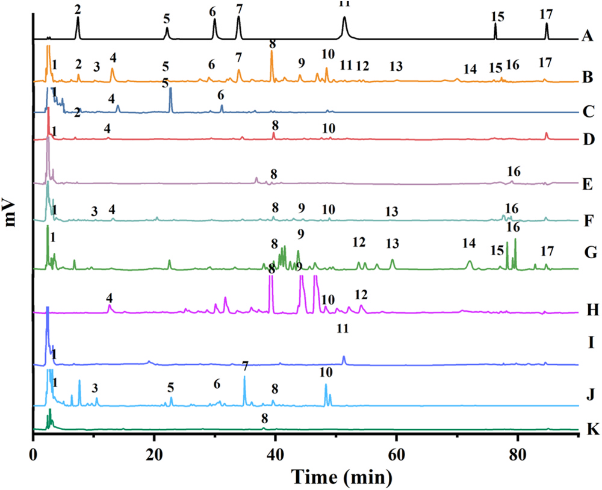
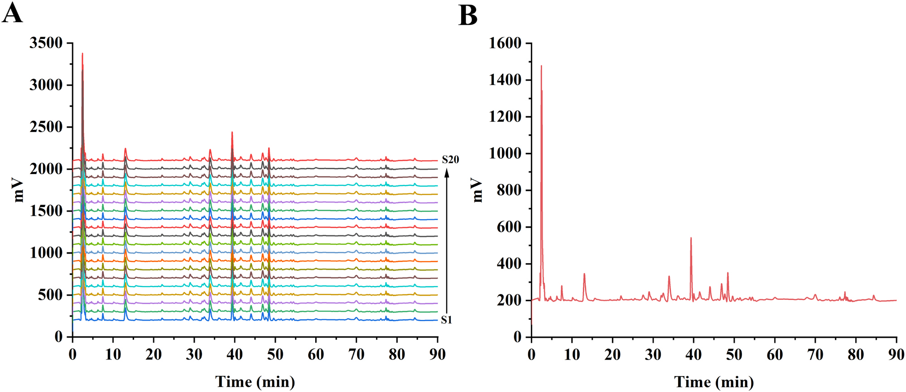
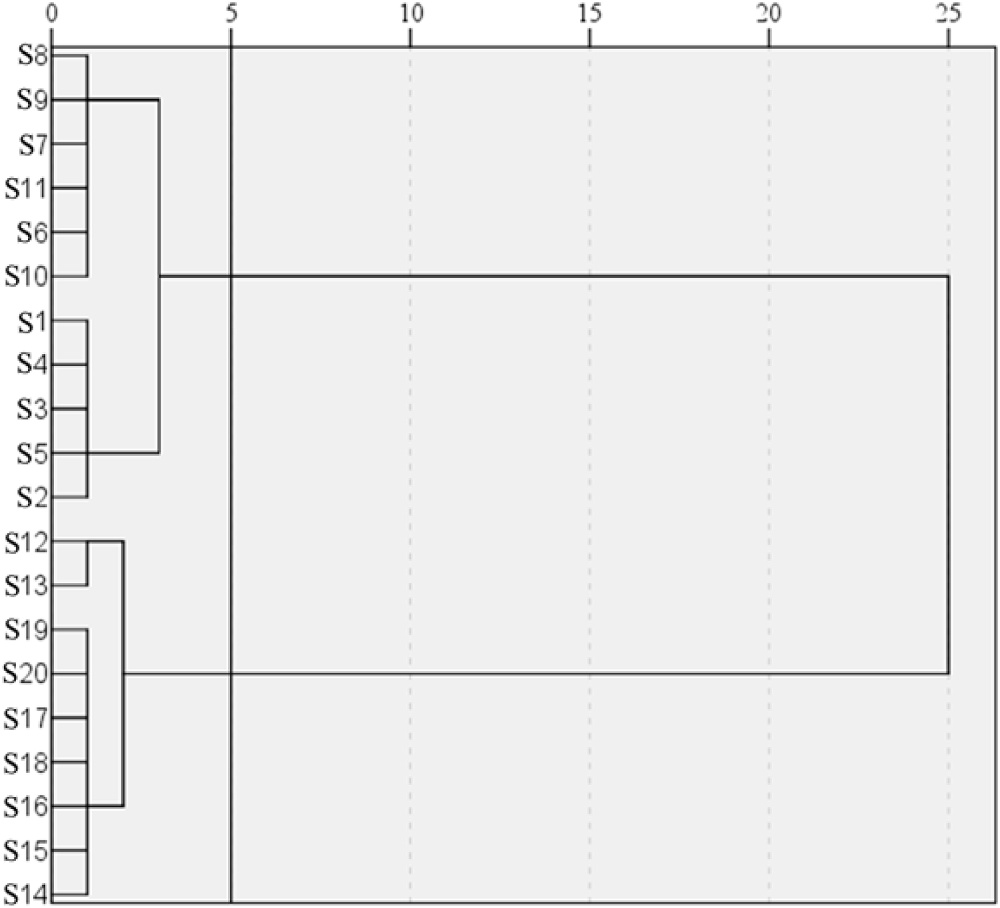
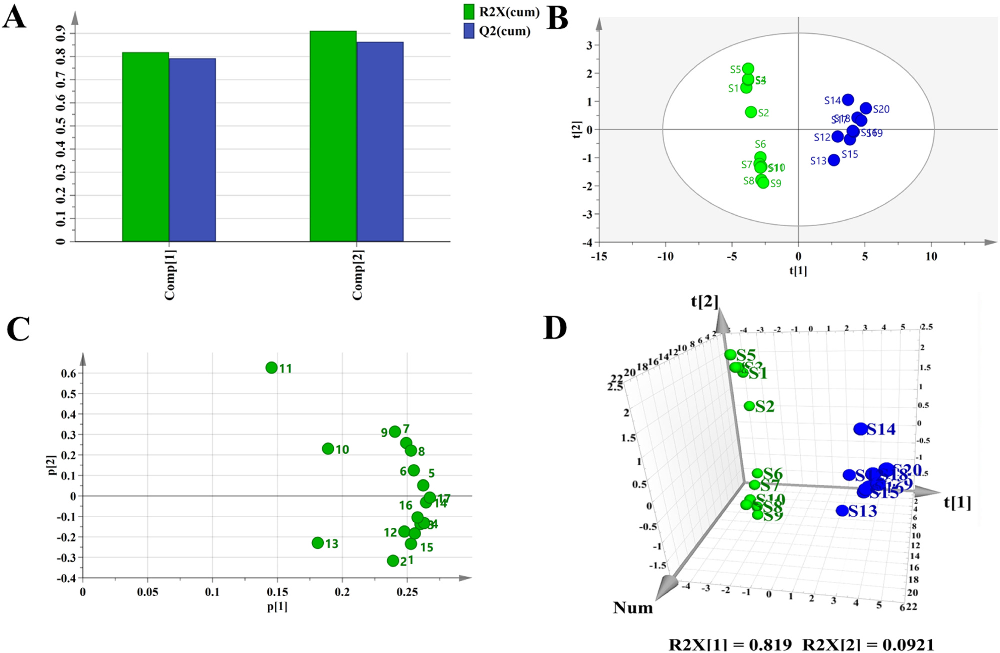
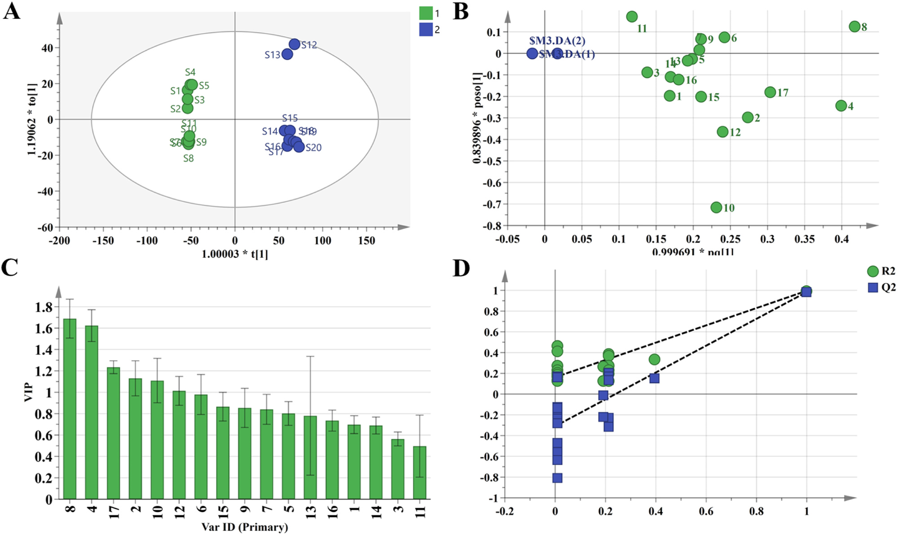

<!-- 方針: ほぼ全訳＋必要に応じた補足。原文構成に沿って訳出。「> 補足:」は訳者注。数式はKaTeXで表示。 -->

## 書誌情報

- 原題: Evaluation study of congelex laxative granules based on HPLC fingerprint, multi-component content determination, and chemometrics
- 著者: Chengjialu Qian, Shizhao Wang, Hongyan Chen（責任著者）（河北工業大学化工学院／河北省中医院, 中国）
- 掲載: *Journal of Pharmaceutical and Biomedical Analysis*. https://doi.org/10.1016/j.jpba.2024.116636
- インパクトファクター: **3.6**（*J. Pharm. Biomed. Anal.*, JCR 2024 / Clarivate）

> 補足: 通便顆粒（Congelex Laxative Granules, CLG）は河北省中医院の院内製剤で、**肉蓯蓉・女貞子・決明子・墨旱蓮・牛膝・アロエ・琥珀・玄明粉・青黛**の9生薬からなり、腎虚・胃熱・肝火による便秘に用いられる。

## 要旨（Abstract）
通便顆粒（Congelex Laxative Granules; CLG）は河北省中医院の院内製剤である。本研究は、通便顆粒のHPLC指紋を確立し、ケモメトリクス（化学計量学）的手法を用いてその品質を評価することを目的とする。Agilent Eclipse Plus C18カラムとメタノール-水グラジエント溶出系を採用し、224 nmで検出を行った。20バッチの試料の高速液体クロマトグラフィー（HPLC）分析により、17個の共通ピークを有し、類似度が0.95を超える指紋の確立に成功した。salidroside（サリドロシド）、echinacoside（エキナコシド）、acteoside（アクテオシド）、specnuezhenide（スペクヌエジェニド）、wedelolactone（ウェデロラクトン）、aurantio-obtusin（アウランチオオブツシン）、chrysophanol（クリソファノール）を含む7つの主要活性成分を定量分析した。階層的クラスター分析（HCA）、主成分分析（PCA）、および直交部分最小二乗判別分析（OPLS-DA）を用いて、試料品質を総合的に評価した。結果として、20バッチは2つのカテゴリーに分類され、PCAとHCAの結果は一致した。OPLS-DAモデルは安定かつ信頼性が高く、salidroside（サリドロシド）、acteoside（アクテオシド）、chrysophanol（クリソファノール）を主要な差異マーカーとして同定した。結論として、確立された指紋および含量測定法は、通便顆粒の品質管理および総合評価のための正確で信頼性の高いツールを提供する。

**キーワード:** 通便顆粒（Congelex Laxative Granules）、指紋（Fingerprint）、高速液体クロマトグラフィー（High performance liquid chromatography）、クラスター分析（Cluster analysis）、主成分分析（Principal component analysis）、直交部分最小二乗判別分析（Orthogonal partial least squares-discriminant analysis）、ケモメトリクス（Chemometrics）

---

## 1. 導入（Introduction）
河北省中医院によって開発された通便顆粒（Congelex Laxative Granules）は、現代の医薬化学、薬理学研究、および臨床経験を統合したものである。本製剤は、肉蓯蓉（Cistanches Herba）、女貞子（Ligustri Lucidi Fructus）、決明子（Cassiae Semen）、墨旱蓮（Ecliptae Herba）、牛膝（Achyranthes bidentata）、アロエ（Aloe vera）、琥珀（Ambrum）、玄明粉（Natrii Sulfas Exsiccatus）、青黛（Naturalis Indigo）の9種類の生薬から構成されている。この処方は、主に肉蓯蓉（Cistanches Herba）を用いて腎を補い[1]、肝を保護し[2]、腸を潤して通便を促す[3]。女貞子（Ligustri Lucidi Fructus）は肝の保護[4]、免疫調節[5]、血糖降下[6]に働く。墨旱蓮（Ecliptae Herba）は糖尿病への対抗[7]や肝の保護[8]に用いられる。これらの成分が処方において臣薬（ministerial agents）として共に働き、残りの成分が佐薬（adjuvant agents）および使薬（guiding agents）として働く。この処方は、腎を補い、胃（の熱）をクリアにし、肝（の火）を冷まし、腸を潤し、通便を促進するように設計されている。主な効能は、腎虚、胃熱、肝火によって引き起こされる便秘、およびめまい、頭痛、悪心、喉の痛み、腹部膨満、腹痛、食欲不振などの症状の治療である。通便顆粒の品質管理は、構成生薬の複雑さと煎じプロセスのため困難である。現在、品質管理と物質的基礎に関する研究が限られていることが、合理的な臨床応用を妨げている。品質評価のための科学的かつ精密な手法を確立することが、我々の本研究の目的の一つである。

配合製剤は2種類以上の生薬成分で構成されており、その品質は原料の起源や製造プロセスに影響を受ける[9]。近年の伝統中国医学（TCM）における柔軟な品質評価・管理技術には、TCM指紋（TCM fingerprinting）[10]、TCM品質マーカー（TCM quality markers）[11]、および多成分定量分析[12,13]が含まれる。TCMの化学組成の系統的研究に基づくTCM指紋は、総合的かつ定量可能な識別方法である。これは主に、TCMおよびその中間製品の真偽、品質、安定性を評価するために利用されており、TCMに固有の全体的かつあいまいな（fuzzy）特徴と一致している[14]。高速液体クロマトグラフィー（HPLC）は、その高い精度、感度、および再現性から、TCMの指紋識別に広く採用されている[15,16]。しかし、指紋が提示する膨大な情報は複雑で圧倒的なものになることがあり、現在の方法では指紋の類似度しか計算できないため、統計分析には適していない。近年、ケモメトリクス（化学計量学）の不可欠な一部であるパターン認識技術が、TCMの複雑な化学指紋から特徴を抽出するための重要な数学的ツールとして登場した。これは優れた予測精度と幅広い適用性を提供する[17,18]。これら2つのアプローチの統合により、主成分を迅速に特定し、TCM試料の全体的な品質評価を容易にすることができる。Yuら[19]は、超高速液体クロマトグラフィー指紋、化学パターン認識、およびネットワーク薬理学を統合した総合的な品質評価方法を確立した。Zhangら[20]は、ヨモギ（Artemisia argyi）の葉の指紋プロファイル研究を行った。Huangら[21]は、指紋プロファイリング、ケモメトリクス、および関連する分析を通じて、延胡索（Corydalis）の総合的な評価を実施した。

本研究では、HPLC指紋とケモメトリクス手法を初めて組み合わせて、異なるバッチの顆粒の差異を分析し、20バッチのHPLC指紋を確立するとともに、7つの主要活性成分を定量的に決定した。類似度分析、階層的クラスター分析（HCA）、主成分分析（PCA）、および直交部分最小二乗判別分析（OPLS-DA）を用いて、試料の全体的な品質を評価した。本研究は、他の配合製剤にとっても一定の参考価値を提供するものである。

## 2. 実験（Experimental）
### 2.1. 生薬および試薬（Crude drugs and reagents）
HPLCグレードのアセトニトリル、メタノール、ギ酸、およびリン酸は天津科密欧化学試薬有限公司（天津、中国）から購入した。salidroside（サリドロシド）（>98%）、echinacoside（エキナコシド）（>91%）、acteoside（アクテオシド）（>95%）、specnuezhenide（スペクヌエジェニド）（>98%）、wedelolactone（ウェデロラクトン）（>98%）、aurantio-obtusin（アウランチオオブツシン）（>98%）、chrysophanol（クリソファノール）（>98%）は江西赫本源生物科技有限公司（江西、中国）から購入した。肉蓯蓉（Cistanches Herba）、女貞子（Ligustri Lucidi Fructus）、墨旱蓮（Ecliptae Herba）、決明子（Cassiae Semen）、牛膝（Achyranthes bidentata）、青黛（Naturalis Indigo Fructus）、アロエ（Aloe vera）、琥珀（Ambrum）、玄明粉（Natrii Sulfas Exsiccatus）は河北亜星薬業有限公司（河北、中国）から購入した。
20バッチの通便顆粒（10 g/パック）は河北省中医院から提供され、その起源情報はTable S1に記載されている（詳細は原文の補足資料参照）。本研究には、サンプルサイズ、バッチ間のばらつき、またはサンプル選択における潜在的なバイアスなどのいくつかの制限がある。これらのバイアスを緩和するために、連続する20の生産バッチからサンプルを選択した。

### 2.2. 試料調製（Sample preparation）
各バッチについて、顆粒0.5 gを精密に量り、三角フラスコに入れ、60%エタノール溶液10 mLを精密に加えて重量を測定し、1時間超音波処理を行った後、冷却して減少した重量を補った。溶液をよく混合し、0.45 μmのメンブレンフィルターでろ過し、使用するまで4℃で保存した。

### 2.3. 標準溶液の調製（Standard solution preparation）
各標準物質を精密に量り、メタノールに溶解して、検量線を作成するための濃度勾配標準溶液、および混合対照物質ストック溶液を調製した。すべての溶液は4℃で保存した。

### 2.4. 装置および分析手順（Instrumentation and analytical procedures）
HPLC分析は、ダイオードアレイ検出器およびAgilent Eclipse Plus C18カラム（4.6 mm × 250 mm、粒子径5 μm）を備えたAgilent Technologies 1260システム（Agilent、米国）を使用して行い、試料から標的化合物を分離した。試料は電子天秤（OHAUS、米国）を用いて秤量した。超音波洗浄器は寧波新芝生物科技股份有限公司（寧波、中国）から購入した。送風機付きデシケーターは天津市莱玻特瑞儀器設備有限公司（天津、中国）から購入した。恒温水槽は杭州又寧儀器有限公司（杭州、中国）のものを使用した。

#### 2.4.1. HPLC条件（HPLC procedure）
HPLC分析には、Agilent Eclipse Plus C18カラム（5 μm; 4.6 × 250 mm）を使用した。移動相はメタノール（A）と超純水（B）で構成され、以下のグラジエントモードで溶出した：
- 0–15 min: 25–35% (A)
- 15–25 min: 35–40% (A)
- 25–35 min: 40–50% (A)
- 35–45 min: 50–55% (A)
- 45–70 min: 55–60% (A)
- 70–75 min: 60–85% (A)
- 75–90 min: 85–85% (A)

検出波長は224 nmに設定した。流速は1.0 mL/minであった。カラム温度は25℃であった。注入量は10.0 μLであった。

#### 2.4.2. 方法のバリデーション（Method validation）
最適化された条件に従って、方法のバリデーションを実施した。線形検量線は、7つの化合物の6つの異なる濃度を用いて構築され、それぞれ3回繰り返し分析された。精度は、混合標準溶液を6回繰り返し注入することにより確認した。再現性は、同一の試料（S1）を1日以内に5回繰り返し分析することにより評価した。回収率は、3つの異なる濃度レベル（マトリックス濃度の約0.5倍、1.0倍、および1.5倍）で標準添加法を用いて決定した。類似度評価は、さまざまな起源から入手した20バッチの通便顆粒で実施された。共存するピークの特徴的なピークを参照ピークとして選択し、20バッチの通便顆粒の指紋類似度を算出した。

### 2.5. データ分析（Data analysis）
データ分析は、中国国家食品薬品監督管理局（SFDA）により推奨されている、中薬クロマトグラフィー指紋類似度評価システム（中華人民共和国薬典委員会 2012A版）の専門ソフトウェアを使用して処理された。このソフトウェアは、20バッチの通便顆粒試料の類似度を評価するために使用された。試料の分類にはケモメトリクス手法が使用され、IBM SPSSソフトウェア（バージョン20.0）およびSimca 14.1ソフトウェアを利用して、階層的クラスター分析（HCA）、主成分分析（PCA）、および直交部分最小二乗判別分析（OPLS-DA）を行った。

### 2.6. ケモメトリクス手法（Chemometrics methods）
#### 2.6.1. 指紋の類似度評価（Similarity evaluation of fingerprints）
中薬クロマトグラフィー指紋類似度評価システム（中華人民共和国薬典委員会 2012A版）を使用し、指紋の主要な特徴（共通ピーク領域）を参照指紋と比較することによって、品質の一貫性評価を行った[22]。相関係数（$r_{cor}$）と一致係数（$r_{con}$）の2つのアルゴリズムが使用された。$r$値（$r_{cor}$または$r_{con}$）の範囲は以下の通りである：
$r_{cor}$ は $-1 \le r \le 1$、および $r_{con}$ は $0 < r \le 1$。
$r$値が高いほど、対象試料の品質が高いことを示す。

$$r_{cor} = \frac{\sum_{i=1}^{num} (x_i - \bar{x})(y_i - \bar{y})}{\sqrt{\left(\sum_{i=1}^{num} (x_i - \bar{x})^2\right)\left(\sum_{i=1}^{num} (y_i - \bar{y})^2\right)}} \tag{1}$$

$$r_{con} = \frac{\sum_{i=1}^{num} x_i y_i}{\sqrt{\sum_{i=1}^{num} x_i^2 \sum_{i=1}^{num} y_i^2}} \tag{2}$$

> 補足: 原文の数式表示において、分母のルートがうまく閉じられていない部分がありますが、標準的な相関係数および余弦類似度（一致係数）の定義に基づいて LaTeX で表記しました。

#### 2.6.2. 主成分分析（Principal component analysis）
PCAは、高い信頼性と柔軟性で認知されている、確立された教師なし多変量データ次元削減技術である[23,24]。これは、最大の分散を捉えるという原理に基づいて動作し、元のデータに存在する複数の独立変数に対して線形変換を行う[25,26]。ノイズや重要度の低い特徴を除去した後、主成分（PC）として知られる新しい低次元変数が、元の高次元変数に置き換わる。PCは互いに直交しており、元のデータからの情報損失を最小限に抑えることで、総合的なデータ分析の目的を達成する。各変数は各主成分に対してローディング値（負荷量）を持ち、これを利用して試料のクラスタリングの類似性や、ローディング変数と試料との相関関係を決定できる。

#### 2.6.3. 階層的クラスター分析（Hierarchical cluster analysis）
HCAは、事前に設定を行う必要なく、類似度に基づいて試料データを自動的にグループ化する教師なしパターン認識手法である[27]。これは、データ内の隠れたパターンやグループ化を明らかにするための探索的分析に利用され、グループ内の距離を最小化しつつ、グループ間の距離を最大化することを目的とする。

#### 2.6.4. 直交部分最小二乗判別分析（Orthogonal partial least square-discriminant analysis）
OPLS-DAは、予測変数と観測変数を新しい空間に投影することによって線形回帰モデルを確立する方法である[27]。変数重要度（VIP）は、モデルに対する個々の $X_i$ の影響を測定するために使用される、OPLS-DAによって生成されるパラメータである。本研究では、OPLS-DA分析から算出されたVIP値を用いて、差異に寄与するピークを検出した。VIP値は以下のように算出された：

$$\text{VIP} = \sqrt{K \times \frac{\sum_{a=1}^{A} w_{a}^2 \times \text{SSY}_{comp, a}}{\text{SSY}_{cum}}} \tag{3}$$

$\text{SSY}_{comp, a}$ は成分 $a$ によって説明される平方和であり、$A$ は成分の総数であり、$w_a^2$ は直交部分最小二乗の重みの2乗である。

---

## 3. 結果と考察（Results and discussion）
### 3.1. HPLC方法のバリデーション（Validation of the HPLC method）
通便顆粒のHPLC指紋評価の適用性は、装置精度、方法の再現性、および試料安定性を評価する実験によって検証された。指紋スペクトルの精度、再現性、および安定性は、224 nmにおける試料S1中の共通ピーク7（specnuezhenide; スペクヌエジェニド）の相対保持時間（RRT）および相対ピーク面積（RPA）のRSD値を用いて評価された。結果として、精度RSD値はRRTが3.0%未満、RPAが2.8%未満であり、再現性RSD値はそれぞれ3.0%未満および2.4%未満であった。同様に、安定性RSD値はそれぞれ2.8%未満および2.1%未満であった。これらの知見は、確立された方法が良好な再現性と精度を持ち、安定性時間は48時間であり、指紋スペクトルの再現性と安定性の要件を満たしていることを示している。したがって、このHPLC指紋分析法は信頼性が高く、通便顆粒の分析に適していると考えられる。さらに、Table 1に詳細を示すシステム適合性の研究により、標的濃度範囲内において、7つの成分（salidroside（サリドロシド）、echinacoside（エキナコシド）、acteoside（アクテオシド）、specnuezhenide（スペクヌエジェニド）、wedelolactone（ウェデロラクトン）、aurantio-obtusin（アウランチオオブツシン）、chrysophanol（クリソファノール））が優れた線形性（$R^2 \ge 0.9990$）を示すことが明らかになった。これら7つの分析物の正確度も満足のいくものであり、回収率は94.00%から99.00%の範囲にあり、RSDは3.00%以下であった。確立されたHPLC指紋スペクトルは、通便顆粒の指紋確立および7つの化合物の定量分析の要件に準拠している。

### 3.2. 指紋分析のための試料測定（Sample determination for fingerprints）
20バッチの通便顆粒を分析した。通便顆粒内の薬用物質の同定および帰属を図1（Fig. 1）に示す。分析により17個の共通ピークが明らかになり、そのうち7つのクロマトグラフィーピークが4つの生薬：肉蓯蓉（Cistanches Herba）、女貞子（Ligustri Lucidi Fructus）、墨旱蓮（Ecliptae Herba）、および決明子（Cassiae Semen）に帰属された（Table 2を参照）。これら7つのクロマトグラフィーピークは、図1（Fig. 1）に示すように、対照標準品を用いて同定された。同定されたピークは、salidroside（サリドロシド）（ピーク2）、echinacoside（エキナコシド）（ピーク5）、acteoside（アクテオシド）（ピーク6）、specnuezhenide（スペクヌエジェニド）（ピーク7）、wedelolactone（ウェデロラクトン）（ピーク11）、aurantio-obtusin（アウランチオオブツシン）（ピーク15）、およびchrysophanol（クリソファノール）（ピーク17）に対応する。

**Table 1 定量分析のための線形回帰方程式、$R^2$、線形範囲、LOD/LOQ、正確度/RSD**

| 化合物名 | 線形回帰方程式 (n = 3) | $R^2$ | 線形範囲 (mg/mL) | LOD/LOQ (mg/g) | 正確度/RSD (%) |
| :--- | :--- | :--- | :--- | :--- | :--- |
| Salidroside (サリドロシド) | $Y = (7057.572 \pm 0.02)X + (241.954 \pm 0.03)$ | 0.9999 | 0.0672–0.1640 | 0.003/0.009 | 95.56/1.35 |
| Echinacoside (エキナコシド) | $Y = (10812.912 \pm 0.01)X - (255.378 \pm 0.05)$ | 0.9992 | 0.0729–0.1780 | 0.003/0.009 | 94.15/2.13 |
| Acteoside (アクテオシド) | $Y = (14569.489 \pm 0.05)X - (450.659 \pm 0.06)$ | 0.9996 | 0.0733–0.1790 | 0.003/0.009 | 97.37/2.75 |
| Specnuezhenide (スペクヌエジェニド) | $Y = (5042.081 \pm 0.06)X + (1021.013 \pm 0.03)$ | 0.9993 | 0.0827–0.2020 | 0.008/0.024 | 95.65/1.90 |
| Wedelolactone (ウェデロラクトン) | $Y = (35220.700 \pm 0.05)X + (2516.935 \pm 0.02)$ | 0.9994 | 0.0688–0.1680 | 0.006/0.018 | 97.88/2.81 |
| Aurantio-obtusin (アウランチオオブツシン) | $Y = (15320.621 \pm 0.02)X - (225.110 \pm 0.03)$ | 0.9998 | 0.0256–0.0624 | 0.006/0.018 | 98.15/2.13 |
| Chrysophanol (クリソファノール) | $Y = (436237.424 \pm 0.05)X - (327.869 \pm 0.03)$ | 0.9997 | 0.0028–0.0068 | 0.001/0.003 | 96.37/2.78 |

> 補足: 原文のTable 1において、化合物名の一部（Echinacosid, Acteosid, Specneuzhenid）はスペルの揺れが見られますが、翻訳方針に従い日本語併記（例：Echinacoside(エキナコシド)）で統一して記載しています。

**Fig. 1. 指紋のクロマトグラフィーピーク帰属**

2-Salidroside（サリドロシド）; 5-Echinacoside（エキナコシド）; 6-Acteoside（アクテオシド）; 7-Specnuezhenide（スペクヌエジェニド）; 11-Wedelolactone（ウェデロラクトン）; 15-Aurantio-obtusin（アウランチオオブツシン）; 17-Chrysophanol（クリソファノール）。
a-混合対照物質; b-試料; c-肉蓯蓉（Cistanches Herba）対照生薬; d-玄明粉（Natrii Sulfas Exsiccatus）対照生薬; e-牛膝（Achyranthes bidentata）対照生薬; f-琥珀（Ambrum）対照生薬; g-決明子（Cassiae Semen）対照生薬; h-アロエ（Aloe vera）対照生薬; i-墨旱蓮（Ecliptae Herba）対照生薬; j-女貞子（Ligustri Lucidi Fructus）対照生薬; k-青黛（Naturalis Indigo Fructus）対照生薬。

### 3.3. 通便顆粒の類似度分析（Similarity analysis of congelex laxative granules）
17個の特徴的なピークのRRTおよびRPAは、中薬クロマトグラフィー指紋類似度評価システム（2012A版）を用いて算出された。結果はそれぞれTable S2およびTable S3に詳細に示されている（詳細は原文の補足資料参照）。20バッチの通便顆粒試料にわたる10個の共通ピークについても、RRTおよびRPAが算出された。RRTのRSDは3.92%未満であることが判明したが、RPAのRSDは比較的高い値を示した。これらの結果は、共通ピークの保持時間がバッチ間で一貫していることを示唆しており、方法の良好な再現性を示している。しかし、RPAのRSDの大きな変動は、各成分の含量が異なるバッチ間で大幅に変化していることを示唆しており、これはおそらくバッチ間の原料の違いに起因している。
20バッチの通便顆粒のクロマトグラフィー指紋を図2A（Fig. 2A）に示し、試料S1のクロマトグラムを参照スペクトルとして使用した。時間ウィンドウ幅を0.5分に設定し、全スペクトルピークマッチングのために中央値法（median method）を適用した。得られた通便顆粒のHPLC参照指紋クロマトグラムを図2B（Fig. 2B）に示す。合計17個の共通ピークが同定され、その中でピーク7（specnuezhenide; スペクヌエジェニド）は良好な分離、安定性、高いクロマトグラフィー応答、および穏やかな保持時間を示した。その結果、このピークを参照ピーク（S）として選択した。20バッチの通便顆粒（S1〜S20）の指紋クロマトグラムの類似度を算出した結果、0.960から0.991の範囲の値が得られ、これらはすべて0.950を上回っていた。これは、20バッチの通便顆粒におけるバッチ間の類似度が満足のいくものであることを示している。

**Fig. 2. (A) 20バッチの通便顆粒の指紋クロマトグラム。(B) 参照指紋クロマトグラム。**

### 3.4. 指紋データに基づく多変量統計解析（Multivariate statistical analysis on fingerprint data）
#### 3.4.1. 階層的クラスター分析（Hierarchical cluster analysis）
HCAとPCAは、天然物の分類研究において広く適用されている2つの主要なケモメトリクス技術である[28]。HCAはクラスタリング対象物間の類似性の測定に基づいており、最も高い類似性を示す試料が優先的にグループ化される[29]。本研究では、20バッチの通便顆粒から得られた共通ピーク面積の測定値を変数としてSPSSにインポートした。間隔の基準として二乗ユークリッド距離を採用し、Ward法（Ward’s linkage method）を利用して、20バッチの通便顆粒に対してHCAを実施した。図3（Fig. 3）に示すように、二乗ユークリッド距離の閾値を5に設定したとき、通便顆粒の試料は2つの明確なクラスターに明確に分類された。一方のクラスターには試料S1〜S11が含まれ、他方のクラスターには試料S12〜S20が含まれた。これらの結果の分析は、指紋スペクトルにおける高い類似性にもかかわらず、異なるバッチの試料間で品質の変動が存在し得ることを示唆している。これらの変動は、調製プロセスで使用された生薬原料バッチの品質の差異に起因する可能性がある。

**Fig. 3. 20バッチの通便顆粒の系統的クラスター分析。**

S1からS20の表記は、Table S1に記載されている対応するシリアル番号S1からS20である（詳細は原文の補足資料参照）。

#### 3.4.2. 主成分分析（Principal component analysis）
PCAは、変数の元のセットを主成分と呼ばれる無相関の変数の新しいセットに変換するデータ削減の統計的手法である[30]。異なるバッチの通便顆粒間の品質変動を解明するために、本研究では指紋スペクトルで同定された17個の共通ピークのピーク面積を変数として採用した。多変量統計ソフトウェアパッケージSPSS 20.0およびSIMCA 14.1を使用して、20バッチの通便顆粒の試料に対してPCAを実施した。共通ピークは、統計ソフトウェアSPSS 20.0内でKMOおよびBartlettの球面性検定にかけられた。KMO検定の統計量は0.766であり、Bartlettの検定の統計量は0.000であり、このデータセットに対する主成分分析の適合性が確認された。PCAを実施し、固有値閾値 $\lambda > 1$ を使用して結果をフィルタリングしたところ、2つの主成分を抽出することができた。これらの成分に対応する固有値は、それぞれ13.923および1.566であった。これら2つの主成分によって説明される累積寄与率（CPV）は91.111%であり、PCA分析における一般的な要件であるCPV > 70%〜85%を上回っていた。

Table 3に示すように、ピーク1、2（salidroside; サリドロシド）、3、4、5（echinacoside; エキナコシド）、6（acteoside; アクテオシド）、7（specnuezhenide; スペクヌエジェニド）、8、9、10、12、13、14、15（aurantio-obtusin; アウランチオオブツシン）、16、および17（chrysophanol; クリソファノール）は主に第1主成分に寄与しており、ピーク11（wedelolactone; ウェデロラクトン）は第2主成分への主要な寄与因子である。したがって、これらの成分は通便顆粒の品質に影響を与える重要な要因として特定された。SIMCA 14.1ソフトウェアを利用し、中心化（Mean Centering; CTR）処理を適用したところ、$R^2X [1]$ 値として0.819が得られ、堅牢なモデル適合が示された（図4Aを参照）。教師なしPCA分析を実施して、スコアプロット（Fig. 4B）、ローディングプロット（Fig. 4C）、および3次元分布プロット（Fig. 4D）を生成した。その結果、20バッチの試料は大きく2つのグループに分類できることが明らかになり、クラスター分析の結果と一致した。

**Table 2 帰属された生薬の共通ピークの指紋特性**

| ピーク番号 | 保持時間 ($t_R$/min) | 帰属生薬 | 化学化合物 |
| :--- | :--- | :--- | :--- |
| 1 | 4.21 | 琥珀（Ambrum）、決明子（Cassiae Semen）、墨旱蓮（Ecliptae Herba）、女貞子（Ligustri Lucidi Fructus）、玄明粉（Natrii Sulfas Exsiccatus）、肉蓯蓉（Cistanches Herba） | 未同定 (uncharted) |
| 2 | 7.52 | 女貞子（Ligustri Lucidi Fructus）、肉蓯蓉（Cistanches Herba） | Salidroside (サリドロシド) |
| 3 | 10.06 | 琥珀（Ambrum）、女貞子（Ligustri Lucidi Fructus） | 未同定 (uncharted) |
| 4 | 12.97 | 琥珀（Ambrum）、アロエ（Aloe vera）、肉蓯蓉（Cistanches Herba）、玄明粉（Natrii Sulfas Exsiccatus） | 未同定 (uncharted) |
| 5 | 22.05 | 女貞子（Ligustri Lucidi Fructus）、肉蓯蓉（Cistanches Herba） | Echinacoside (エキナコシド) |
| 6 | 29.08 | 女貞子（Ligustri Lucidi Fructus）、肉蓯蓉（Cistanches Herba） | Acteoside (アクテオシド) |
| 7 | 34.00 | 女貞子（Ligustri Lucidi Fructus） | Specnuezhenide (スペクヌエジェニド) |
| 8 | 39.45 | 琥珀（Ambrum）、決明子（Cassiae Semen）、アロエ（Aloe vera）、牛膝（Achyranthes bidentata）、女貞子（Ligustri Lucidi Fructus）、玄明粉（Natrii Sulfas Exsiccatus）、青黛（Naturalis Indigo Fructus） | 未同定 (uncharted) |
| 9 | 43.93 | 琥珀（Ambrum）、決明子（Cassiae Semen）、アロエ（Aloe vera） | 未同定 (uncharted) |
| 10 | 48.33 | 琥珀（Ambrum）、アロエ（Aloe vera）、女貞子（Ligustri Lucidi Fructus）、玄明粉（Natrii Sulfas Exsiccatus） | 未同定 (uncharted) |
| 11 | 51.38 | 墨旱蓮（Ecliptae Herba） | Wedelolactone (ウェデロラクトン) |
| 12 | 53.75 | 決明子（Cassiae Semen）、アロエ（Aloe vera） | 未同定 (uncharted) |
| 13 | 60.11 | 決明子（Cassiae Semen）、琥珀（Ambrum） | 未同定 (uncharted) |
| 14 | 72.12 | 決明子（Cassiae Semen） | 未同定 (uncharted) |
| 15 | 77.07 | 決明子（Cassiae Semen） | Aurantio-obtusin (アウランチオオブツシン) |
| 16 | 79.00 | 決明子（Cassiae Semen）、墨旱蓮（Ecliptae Herba）、牛膝（Achyranthes bidentata） | 未同定 (uncharted) |
| 17 | 84.42 | 決明子（Cassiae Semen） | Chrysophanol (クリソファノール) |

> 補足: 原文のTable 2で "Ambru", "Naturalis Indigo Fructus", "Cassiae Semen、Aloe vera" など一部表記の揺れや中国語の読点（、）が含まれていますが、翻訳時に整理し、日本語表記を併記しました。また "uncharted" は分析化学の文脈において「未同定のピーク」を意味するため、「未同定 (uncharted)」と訳しました。

**Table 3 20バッチの試料の主成分行列**

| 共通ピーク番号 | 主成分 1 | 主成分 2 |
| :---: | :---: | :---: |
| 1 | 0.943 | −0.293 |
| 2 | 0.893 | −0.399 |
| 3 | 0.971 | −0.170 |
| 4 | 0.981 | −0.164 |
| 5 | 0.979 | 0.062 |
| 6 | 0.951 | 0.153 |
| 7 | 0.930 | 0.325 |
| 8 | 0.943 | 0.277 |
| 9 | 0.898 | 0.395 |
| 10 | 0.704 | 0.290 |
| 11 | 0.544 | 0.782 |
| 12 | 0.925 | −0.220 |
| 13 | 0.676 | −0.289 |
| 14 | 0.986 | −0.040 |
| 15 | 0.954 | −0.231 |
| 16 | 0.963 | −0.129 |
| 17 | 0.997 | −0.012 |

**Fig. 4. HPLCのケモメトリクス分析結果：通便顆粒のPCAプロット。 (A) 平均中心化（Mean Centering）。 (B) スコアプロット。 (C) ローディングプロット。 (D) 3次元分布プロット。**

#### 3.4.3. 直交部分最小二乗判別分析（Orthogonal partial least-squares discriminate analysis）
20バッチの通便顆粒間における化学組成の差異をさらに解明し、これらのバッチ間の差異マーカーを特定するために、バッチから得られた17個の共通ピークのピーク面積を変数として用いて、教師ありOPLS-DAモデルを構築し分析した。OPLS-DAモデルにおいて、$R^2X$ 値が1に近いことは、モデルが $X$ 変数の分散を説明する強力な能力を持っていることを示す。同様に、$R^2Y$ 値が1に近づくことは、モデルが応答変数に対して強固な説明力を持っていることを示唆する。クロスバリデーション（交差検証）を通じて導出される $Q^2$ 値は、モデルの予測性能の尺度であり、1に近いほどモデルの予測能力はより強力である。一般に $Q^2$ 値が0.5より大きいことは、モデルの予測性能が満足のいくものであることを示すと認められている。OPLS-DAのモデル検証を図5D（Fig. 5D）に示し、$Q^2$ が0.9より大きいことは優れたモデルであることを示す。本OPLS-DAモデルにおいて、$R^2X$ は0.865、$R^2Y$ は0.996、そして $Q^2$ は0.985であり、確立されたモデルは安定かつ信頼性が高く、妥当な予測可能性を備えていることを示している。

結果はOPLS-DAスコアプロット（Fig. 5A）およびローディング散布図（Fig. 5B）の形式で描かれている。図5AおよびBは、20バッチの通便顆粒が2つのカテゴリーに明確に分類されていることを示しており、前述の2つの分析手法の結果と一致している。VIP（投影における変数重要度）を用いることにより、化学組成の主要な差異マーカーが特定された。これらを図5C（Fig. 5C）に示し、横軸は指紋ピーク番号を表している。VIP値が1を超える成分は、重要度の高い順に以下の7つであった：
ピーク 8 > ピーク 4 > ピーク 17 (Chrysophanol; クリソファノール) > ピーク 2 (Salidroside; サリドロシド) > ピーク 10 > ピーク 12。
これらの結果は、salidroside（サリドロシド）およびchrysophanol（クリソファノール）が、通便顆粒のバッチ間の品質差異に著しく影響を及ぼしている成分である可能性を示唆している。我々は、これらの成分の含量比を定性的識別基準として使用することを提案し、今後の研究方向としては、マーカー薬物が主成分に与える影響やその臨床的意義を探究することが考えられる。

> 補足: 原文の "effects of marker drugs on the main ingredients" は、文脈から「（品質管理上の指標となる）マーカー成分が製剤全体の品質評価に与える影響」または「マーカー成分となる生薬が処方全体に与える影響」を指していると考えられます。

本研究における品質評価方法を評価するために、関連するパラメータを他の研究者によって報告されたものと比較し、Table S4に示した（詳細は原文の補足資料参照）。データは、抽出成分、方法、および化学計量学の観点から、我々のアプローチが既存の報告された方法と同等またはそれ以上であることを明確に示している。単なる従来のクロマトグラム法だけでは、医薬品の評価に必要な精度を欠いており、ケモメトリクス技術と組み合わせることによって初めて医薬品の品質を正確に評価できることは注目に値する。本研究は、通便顆粒が直面している現在の課題に対処し、このような粒剤の今後の品質評価に貴重な知見を提供する、革新的で実用的な品質評価方法を提示している。

**Fig. 5. HPLC結果のケモメトリクス分析：通便顆粒のOPLS-DA分析プロット。 (A) スコアプロット。 (B) loading scatter plot（ローディング散布図）。 (C) VIP値。 (D) 平均中心化（Mean Centering）。**

## 4. 結言（Concluding remarks）
本研究は、簡便かつ効果的な分析方法を確立することにより、通便顆粒の品質管理課題に初めて取り組んだものである。指紋分析とケモメトリクス手法を統合することにより、通便顆粒とその潜在的な変動に関する詳細な分析が行われた。20バッチの通便顆粒試料の類似度スコアは0.960から0.991の範囲であった。バッチ間のわずかな変動はあるものの、通便顆粒の化学組成と品質特性は、全体として異なるバッチ間で良好な一貫性を維持していた。本研究では、通便顆粒の含有量を包括的に分析するために、HCA、PCA、およびOPLS-DAモデルをデータ分析に用いた。クラスター分析により、20バッチの試料は2つのカテゴリーに分類でき、S1〜S11が一方のグループ、S12〜S20が他方のグループを形成することが明らかになり、これは類似度の結果と一致していた。この分析は、良好な指紋類似度が得られた場合でも、バッチ間に若干の品質差異が存在し得ることを示しており、これはおそらく調製に使用された生薬原料のバッチ間の品質差異に関連している。PCAスコアプロットはクラスター分析の結果と一致しており、主成分分析を利用することにより、試料内の情報の大部分を代表できる2つの主成分が得られた。さらに、OPLS-DAは品質差異の3つのマーカー（※原文には "three markers of quality difference: Salidroside and Chrysophanol" とあり、文脈上またはVIP結果からはSalidroside、Chrysophanolの他、未同定ピーク等を含むマーカーと考えられる）として、salidroside（サリドロシド）およびchrysophanol（クリソファノール）を特定し、これら3つのクロマトグラフィーピークで表される成分が通便顆粒のバッチ間の区別に大きく寄与していることを示した。これらのマーカーは、異なるバッチ間の品質変動を区別するために使用できる。我々の知見に基づき、これらの成分の含量比を定性的識別基準として使用することを提案する一方、今後の研究方向としては、マーカー薬物（マーカー成分）が主成分に及ぼす影響やその臨床的意義を探索することが考えられる。このアプローチは、特に互いに混同されやすい生薬種や、複数の起源を持つ伝統医薬品を含む品質評価において好ましい選択肢となり得り、伝統医薬品の品質評価に一定の参考価値を提供する。

現代の伝統中国医学の品質評価方法は、簡便さ、費用対効果、および科学的妥当性において利点を示す一方で、限界、特異性の問題、ならびに再現性および安定性に関する懸念などの課題にも直面している。今後の研究は、ハイパースペクトルイメージング[31]、近赤外分光法[32]、およびレーザー誘起ブレークダウン分光法[33]などの現代の科学技術を、伝統中国医学の品質評価により効果的に統合する方法に焦点をおくことができる。これらの技術の開発と応用は、伝統中国医学の品質評価に新しいアイデアと方法を提供するだけでなく、より包括的な評価の達成に貢献するものである。

## 参考文献

> 原論文の参考文献。番号は本文の引用 [N] に対応（クリックで該当文献へジャンプ）。各文献はDOIまたはGoogle Scholar検索へのリンク。

1. N. Cheng, H. Wang, H. Hao, F.-U. Rahman, Y. Zhang, Research progress on polysaccharide components of Cistanche deserticola as potential pharmaceutical agents, Eur. J. Med. Chem. 245 (2023) 114892 — [DOI](https://doi.org/10.1016/j)
2. S. Zhou, D. Feng, Y. Zhou, H. Duan, Y. Jiang, W. Yan, Analysis of the active ingredients and health applications of cistanche, Front. Nutr. 10 (2023) 10 — [DOI](https://doi.org/10.3389/fnut.2023.1101182)
3. F. Wang, B. Zhuo, S. Wang, J. Lou, Y. Zhang, Q. Chen, Z. Shi, Y. Song, P. Tu, Atriplex canescens: a new host for Cistanche deserticola, Heliyon 7 (2021) e07368 — [DOI](https://doi.org/10.1016/j.heliyon.2021.e07368)
4. X. Zhao, J. Liu, Chemical constituents from the fruits of Ligustrum lucidum W.T. Aiton and their role on the medicinal treatment, Nat. Prod. Commun. 15 (2020) 1–12 — [DOI](https://doi.org/10.1177/1934578X20922338)
5. S. Liu, L. Wang, Q. Ren, J. Wang, Y. Li, G. Wang, H. Gao, R. Du, W. Qin, Immunomodulatory and antioxidant activities of a polysaccharide from Ligustrum vicaryi L. fruit, J. Evid. Based Complement. Altern. Med. 2020 (2020) 5431350 — [DOI](https://doi.org/10.1155/2020/5431350)
6. R. Luan, P. Zhao, X. Zhang, Q. Li, X. Chen, L. Wang, Pharmacodynamics, pharmacokinetics, and kidney distribution of raw and wine-steamed ligustri lucidi fructus extracts in diabetic nephropathy rats, Molecules 28 (2023), https://doi. org/ — [DOI](https://doi.org/10.3390/molecules28020791)
7. X. Li, W. Dong, Y. Yang, S. Ren, X. Wang, M. Zou, W. Lu, L. Liu, Y. Xue, Ecliptasaponin A attenuates renal fibrosis by regulating the extracellular matrix of renal tubular cells, Vitr. Cell. Dev. Biol. Anim. 59 (2023) 684–696, https://doi.org/ — [DOI](https://doi.org/10.1007/s11626-023-00803-0)
8. L.T. Giang, S. Park, N.T. Cuc, B.H. Tai, B.H. Tai, P.V. Kiem, N.T.M. Hang, N.K. Ban, P.V. Cuong, N.X. Nhiem, Bithiophene and coumestan derivatives from Eclipta prostrata (L.) L. and their hepatoprotective activity, J. Asian Nat. Prod. Res. 21 (2023) 1381–1387 — [DOI](https://doi.org/10.1080/10286020.2024.2364912)
9. D. Liu, J. Liu, X. Li, Y. Zhang, L. Bai, H. Gao, Establishment and application of characteristic degradation fingerprint for the quality control of Compound Banlangen Granules polysaccharides, J. Sep. Sci. 46 (2023) 2300314, https://doi. org/ — [DOI](https://doi.org/10.1002/jssc.202300314)
10. X. Liu, W. Jiang, M. Su, Y. Sun, H. Liu, L. Nie, H. Zang, Quality evaluation of traditional Chinese medicines based on fingerprinting, J. Sep. Sci. 43 (2019) 6–17 — [DOI](https://doi.org/10.1002/jssc.201900365)
11. H. Zhang, Y. Zhang, T. Zhang, C. Liu, Research progress on quality markers of traditional Chinese medicine, J. Pharm. Biomed. Anal. 211 (2022) 114588 — [DOI](https://doi.org/10.1016/j.jpba.2022.114588)
12. Y. Li, Y. Zhang, Z. Zhang, Y. Hu, X. Cui, Y. Xiong, Quality evaluation of gastrodia elata tubers based on HPLC fingerprint analyses and quantitative analysis of multi- components by single marker, Molecules 24 (2019) 1521, https://doi.org/ — [DOI](https://doi.org/10.3390/molecules24081521)
13. J. Xie, R.-Y. Wang, L. Yong, Y.-X.-Y. Gong, L.-S. Ding, Y. Xin, H.-L. Wang, Ying Xue, L.-S. Qing, Determination of nine nucleosides in Rhizoma Paridis by quantitative analysis of multi-components via a single marker method, J. Sep. Sci. 44 (2021) 1866–1874 — [DOI](https://doi.org/10.1002/jssc.202001086)
14. T. Yi, Q. Chen, X. He, S. So, Y. Lo, L. Fan, J. Xu, Y. Tang, J. Zhang, Z. Zhao, H. Chen, Cheicaml quantification and antioxidant assay of four active components in Ficus hirta root using UPLC-PAD-MS fingerprinting combined with cluster analysis, Chem. Cent. J. 7 (2019) 67 — [DOI](https://doi.org/10.1186/1752-153X-7-115)
15. Y. Xue, L. Zhu, T. Yi, Fingerprint analysis of Resina Draconis by ultra-performance liquid chromatography, Chem. Cent. J. (2017) 67 — [DOI](https://doi.org/10.1186/)
16. S. Yu, L. Zhu, Z. Xiao, J. Shen, J. Li, H. Lai, J. Li, H. Chen, Z. Zhao, T. Yi, Rapid fingerprint analysis of flos carthami by ultra-performance liquid chromatography and similarity evaluation, J. Chromatogr. Sci. 54 (2016) 1619–1624, https://doi. org/ — [DOI](https://doi.org/10.1093/chromsci/bmw115)
17. J.-Y. Fang, L. Zhu, T. Yi, J.-Y. Zhang, L. Yi, Z.-T. Liang, L. Xia, J.-F. Feng, J. Xu, Y.- N. Tang, Z.-Z. Zhao, H.-B. Chen, Fingerprint analysis of processed Rhizoma Chuanxiong by high-performance liquid chromatography coupled with diode array detection, Chin. Med. 10 (2015) 2 — [DOI](https://doi.org/10.1186/s13020-015-0031-3)
18. Y. Luo, H. Yang, G. Tao, Systematic review on fingerprinting development to determine adulteration of Chinese herbal medicines, Phytomedicine 129 (2024) 155667 — [DOI](https://doi.org/10.1016/j.phymed.2024.155667)
19. Y. Feng, J. Hu, F. Wang, B. Li, Q. Qian, X. Wang, L. Niu, Quality evaluation of the classical prescription, Danggui Jianzhong decoction, using ultra-high-performance liquid chromatography fingerprint, chemical pattern recognition, and network pharmacology, J. Sep. Sci. 45 (2022) 3838–3851 — [DOI](https://doi.org/10.1002/)
20. L. Zhang, Y. Wei, W. Wang, Y. Fan, F. Li, Z. Li, A. Lin, H. Gu, M. Song, T. Wang, G. Liu, X. Li, Quantitative fingerprint and antioxidative properties of Artemisia argyi leaves combined with chemometrics, J. Sep. Sci. 46 (2023) e2200624 — [DOI](https://doi.org/10.1002/jssc.202200624)
21. W. Huang, Y. Pan, H. Jiang, Y. Chen, L. Hu, H. Zhang, J. Yan, A comprehensive quality evaluation method of Corydalis yanhusuo by HPLC fingerprints, chemometrics, and correlation analysis, J. Sep. Sci. 44 (2021) 2054–2064, https:// doi.org/ — [DOI](https://doi.org/10.1002/jssc.202001250)
22. S. Xu, L. Lan, T. Dai, P. Guo, G. Sun, Y. Guo, Comprehensive quality evaluation of compound bismuth aluminate tablets by multiple fingerprint profiles combined with quantitative analysis and antioxidant activity, Microchem. J. 176 (2022) 107237 — [DOI](https://doi.org/10.1016/j.microc.2022.107237)
23. X.-L. Cheng, Q.-Q. Zhang, M.-H. Li, H. Yan, K.-Z. Yu, J.-L. Zhou, S.-P. Li, F. Wei, S.- C. Ma, Identification of four cornua by ultra-performance liquid chromatography with time-of-flight mass spectrometry coupled with principal component analysis, J. Sep. Sci. 40 (2017) 1667–1673 — [DOI](https://doi.org/10.1002/jssc.201600902)
24. T. Yang, X. Liu, L. Xue, X. Liu, L. Zhang, L. Lan, H. Zhang, G. Sum, Quality assessment of Red Yeast Rice by fingerprint and fingerprint-effect relationship combined with antioxidant activity, Food Chem. 438 (2024) 137744, https://doi. org/ — [DOI](https://doi.org/10.1016/j.foodchem.2023.137744)
25. Q. Huang, H. Qian, D. Feng, Y. Wang, N. Luo, S. Lu, Q. Shi, M. Zhang, Y. Lu, L. Tan, Quality consistency evaluation of commercial transfer factor injections by chromatographic fingerprint combined with multivariate statistical analysis, J. Sep. Sci. 43 (2020) 2042–2052 — [DOI](https://doi.org/10.1002/jssc.201901145)
26. J. Fan, X. Wang, Q. Chang, G. Sun, L. Lan, Evaluating the quality consistency of antiviral oral liquid by high-performance liquid chromatography five-wavelength matched average fusion fingerprint combined with electrochemical fingerprint and ultraviolet spectral quantum fingerprint, J. Chromatogr. 1702 (2023) 464098 — [DOI](https://doi.org/10.1016/j.chroma.2023.464098)
27. H. Parastar, A. Bazrafshan, Fuzzy C-means clustering for chromatographic fingerprints analysis: a gas chromatography–mass spectrometry case study, J. Chromatogr. 1438 (2016) 236–243 — [DOI](https://doi.org/10.1016/j)
28. P. Wang, X. Wang, Y. Li, R. He, J. Gao, C. Chen, H. Dai, Z. Cao, L. Lan, G. Sun, W. Sun, Thorough evaluation of the Chinese medicine preparations and intermediates using high performance liquid chromatography fingerprints and ultraviolet quantum fingerprints along with antioxidant activity: Shuanghuanglian oral solution as an example, J. Chromatogr. 1705 (2023) 464196, https://doi.org/ — [DOI](https://doi.org/10.1016/j.chroma.2023.464196)
29. Q.-L. Chena, L. Zhuc, Y.-N. Tangd, H.-Y. Kwana, Z.-Z. Zhaoa, H.-B. Chena, T. Yi, Comparative evaluation of chemical profiles of three representative “snow lotus” herbs by UPLC-DAD-QTOF-MS combined with principal component and hierarchical cluster analyses, Anal. Sci. 9 (2017) 8 — [DOI](https://doi.org/10.1002/)
30. T. Yi, L. Zhu, W.-L. Peng, X.-C. He, H.-L. Chen, J. Li, T. Yua, Z.-T. Liang, Z.-Z. Zhao, H.-B. Chen, Comparison of ten major constituents in seven types of processed tea using HPLC-DAD-MS followed by principal component and hierarchical cluster analysis, LWT-Food Sci. Technol. 62 (2015) 194–201 — [DOI](https://doi.org/10.1016/j)
31. Y. Shang, L. Bao, H. Bi, S. Guan, J. Xu, Y. Gu, C. Zhao, Authenticity discrimination and adulteration level detection of camellia seed oil via hyperspectral imaging technology, Food Anal. Methods 17 (2024) 450–463 — [DOI](https://doi.org/10.1007/)
32. M. Razu, A. Grafia, L. Gallo, M.V. Ramírez-Rigo, R.J. Romanach, Near-infrared spectroscopic applications in pharmaceutical particle technology, Drug Dev. Ind. Pharm. 45 (2019) 1565–1589 — [DOI](https://doi.org/10.1080/03639045.2019.1641510)
33. A. Matsumoto, T. Sakka, A review of underwater laser-induced breakdown spectroscopy of submerged solids, Anal. Sci. 37 (2021) 1061–1072, https://doi. org/ — [DOI](https://doi.org/10.2116/analsci.20R007)
