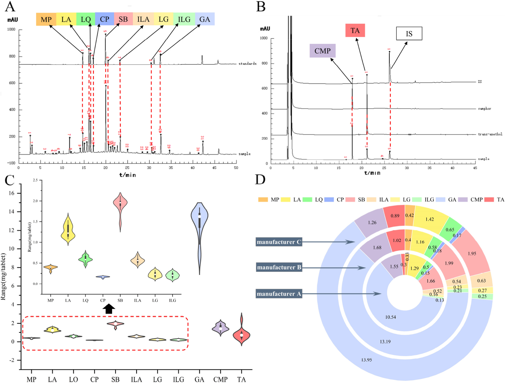
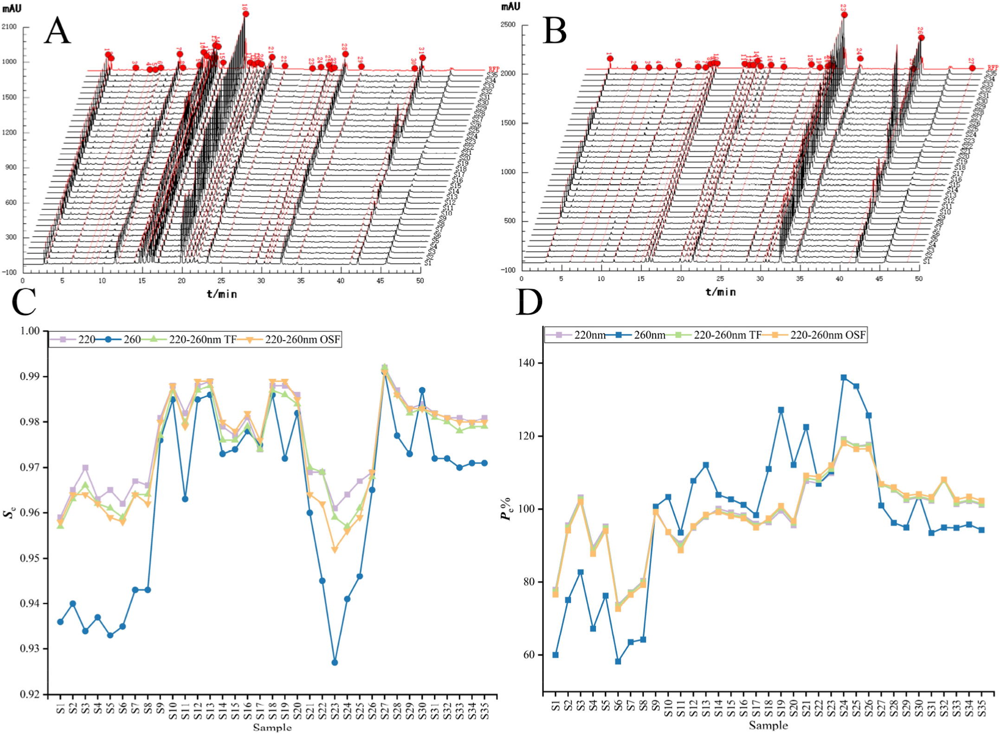
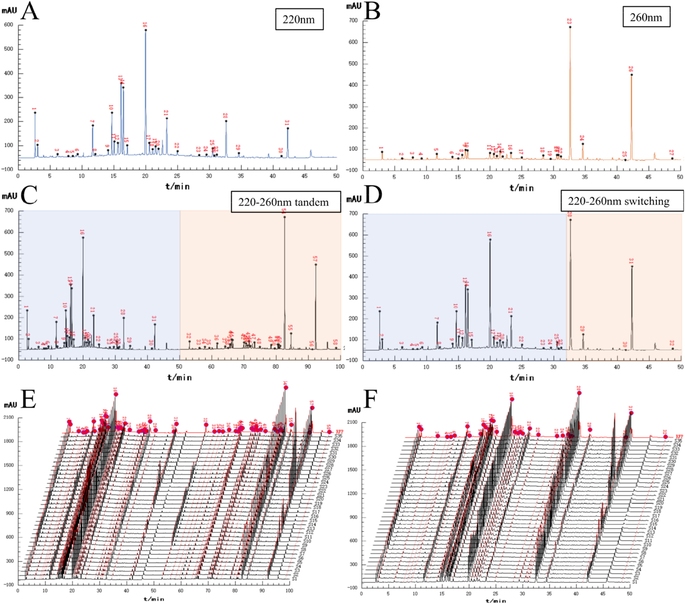
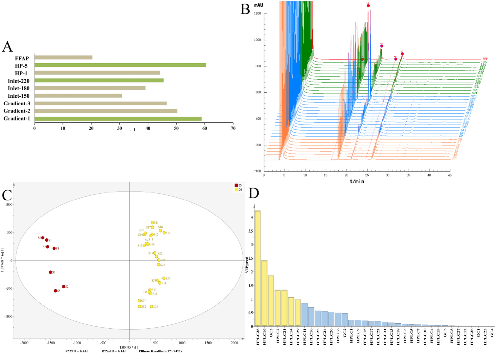
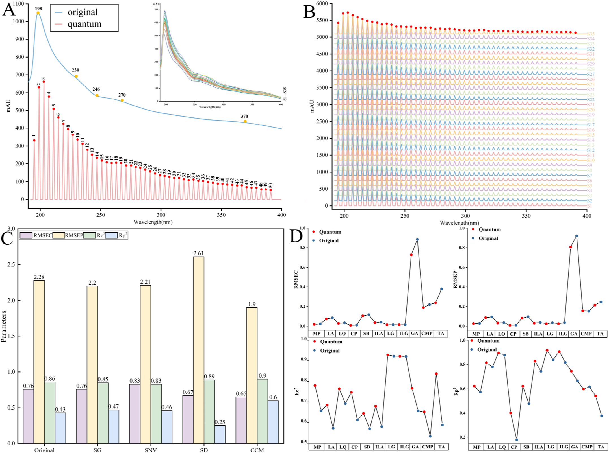

<!--
Cai M, Wang S, Jiang J, Gao K, Sun G. Comprehensive analysis strategy of quality
for traditional Chinese medicine compound based on fingerprint technology and
quantitative prediction of spectra. Talanta 287 (2025) 127661.
doi:10.1016/j.talanta.2025.127661 の全訳密度日本語版（ネイティブ抽出テキストを基に再構成）。
-->

> **補足（本サイトでの位置づけ）:** 複方甘草片（Compound Liquorice Tablets, CLT）は甘草・アヘン（モルヒネ・コデイン）・安息香酸ナトリウム・樟脳・アニス（trans-アネトール）等からなる鎮咳去痰の中成薬。本研究（瀋陽薬科大学・孫国祥グループ、Talanta 2025）は、当サイトが扱う「多手法融合による中成薬の品質管理」の代表例で、豨薟草のRSQFM論文と同系譜。核心は3つ：(1) 従来のピーク面積だけでなく**保持時間も併用**する **積分効率定量指紋法（IEQFM）**、(2) 揮発成分（樟脳・アネトール）を捉えるため**HPLCにGCを追加**し、さらにUVを量子化して統合、(3) 3手法の重みを主観でなく **CRITIC法**（指標のばらつき＋指標間相関）で客観的に決めて融合。薬局方がグリチルリチン酸とモルヒネの2成分しか規定しないCLTに対し、11成分の定量と3指紋融合で「片手落ちのない」品質評価を提示する。**IF:** Talanta = 6.7（JCR2024・Q1）。

---

# 書誌情報

- **原題:** Comprehensive analysis strategy of quality for traditional Chinese medicine compound based on fingerprint technology and quantitative prediction of spectra
- **著者:** Ming Cai（蔡明）, Siqi Wang, Jiayi Jiang, Kai Gao（責任著者・広州粤華製薬）, Guoxiang Sun（孫国祥・責任著者）
- **所属:** 瀋陽薬科大学 薬学院／中薬学院（遼寧省瀋陽）、広州粤華製薬（広東省広州）
- **掲載誌:** Talanta 287 (2025) 127661
- **DOI:** 10.1016/j.talanta.2025.127661（2024年9月6日受付／2025年1月18日改訂受付／1月26日受理／1月27日オンライン）
- **資金:** 国家大学生創新創業訓練計画（No. 2023101630）
- **© 2025 Elsevier B.V.**

> **略語:** CCM=特徴連結法（characteristic concatenation method）；CLTs=複方甘草片；CMP=樟脳（camphor）；CP=リン酸コデイン；CRITIC=指標間相関による重要度（criteria importance through intercriteria correlation）；GA=グリチルリチン酸；IEQFM=積分効率定量指紋法（quantified fingerprint method of integral efficiency）；ILA=イソリクイリチンアピオシド；ILG=イソリクイリチゲニン；LA=リクイリチンアピオシド；LG=リクイリチゲニン；LQ=リクイリチン；MP=モルヒネ；OPLS-DA=直交部分最小二乗判別分析；OSF=オフライン波長切替指紋；PLSR=部分最小二乗回帰；RFP=参照指紋；SAM=単一標準多マーカー法（single-linear assay multi-markers method）；SB=安息香酸ナトリウム；SCM=標準曲線法；TA=trans-アネトール；TCMC=漢方複方（traditional Chinese medicine compounds）。

---

# 要旨（Abstract）

漢方複方（TCMC）は原料の由来が幅広く、化学組成の複雑さが品質差につながる。品質評価基準の向上は、その開発・応用の焦点かつ難点である。従来の指紋分析法はTCMCの品質評価や優劣判定に一定の限界がある。本論文の焦点は、指紋の類似度評価法をどう最適化し、指紋を基に試料データをマイニングして品質の本質的差を十分に反映させるかである。本研究では、ピーク面積と保持時間を二重制御する **積分効率定量指紋法（IEQFM）** を提案して類似度評価法を最適化した。例として35バッチの複方甘草片（CLT）のHPLC・GC・UV指紋を評価。**オフライン波長切替法** を検討して多波長データ処理を簡略化。次にCLT中の11成分を **単一標準多マーカー法（SAM）** と標準曲線法で正確に定量。**OPLS-DA** で品質差に影響する特徴成分を探索。UVスペクトルは **特徴連結法（CCM）** で前処理して量子指紋を得、**PLSR** で定量予測（p>0.7）。最後に、異なる評価法に **CRITIC法** で重みを割り当てた後、3指紋を融合評価した。進化するTCMCに適応するため、品質評価基準を改善する手法最適化は大きな意義をもつ。本研究はTCMCの品質分析に探索的手法を提供する。

---

# 1. 序論

漢方複方（TCMC）は多様な薬物からなり、化学組成が複雑・多様である。その品質評価は安全で有効な臨床応用の前提である [1]。各成分間の相互作用はTCMCの品質評価にさらに高い要求を課す。品質管理分析法は単一化学評価から全体制御モードへ変化してきた [2]。指紋の構築は化学成分の同定と品質管理を実現する有効な方法である [3,4]。指紋法は国際的に認知された品質評価法となり、TCMCの品質評価に広く用いられる [5,6]。

指紋と多指標定量の組合せは品質管理で最も一般的な分析法である [7,8]。標準品は定性・定量の基準だが、コスト・入手性・不安定性から複数標準の使用は難しい [9]。**単一標準多マーカー法（SAM）** による多成分定量はこれらの問題によく対処する。標準と測定対象化合物の比例関係から、測定物質の含量を正確に算出できる [10,11]。本法は検出コストを大幅に減らし、TCM・食品で広く用いられる [12,13]。品質評価過程では、複雑な化学データをどう処理・解析するかが優先課題となる。類似度解析は指紋データ評価の有効な方法である [14,15]。現行の類似度理論の多くはクロマトピーク面積を主パラメータとし、保持時間の影響を無視する傾向がある [16,17]。本研究は、類似度解析にピーク面積と保持時間の両方を使う **積分効率定量指紋法（IEQFM）** を提案し、指紋評価をより正確にする。

液相分析では、先行研究はしばしば多波長を単純融合やタンデムで解析してきた [18–20]。これは有効情報を統合する一方で冗長情報変数を増幅する。**波長切替法** は有利な情報を効果的に集められ、TCMの定性・定量分析に広く応用され、TCM品質研究の重要な発展方向である [21,22]。本論文では、オフライン波長切替法で2波長の最大吸収を収集して評価用指紋を確立する。これは処理が簡単で重要でない情報の干渉を効果的に避ける。UVスペクトルでは、分析物質が類似すると吸収が重なりやすい。本論文では、連続スペクトル信号を量子ピークに変換する **特徴連結法（CCM）** の使用を提案する。これは単なる線形変換の過程ではなく、より重要なのは連続信号プロファイルを生む物質基盤が反映する物理情報の統合・簡略化である [23]。UV分光は迅速・低コストから複雑系分析に利点があり、ケモメトリクスの助けで、多成分含量とUV多変量スペクトルデータの関係を表現し、全波長スキャン下で複数物質含量の同時予測を可能にする [24,25]。

複数の試験技術を組み合わせた総合分析は品質評価の新しい発展傾向である。先行研究の多くは複数分析法間の相互影響・重要度を判断せず単純平均融合を直接行い、評価結果に干渉をもたらす [26]。本論文では、指標の変動性と指標間相関を考慮して異なる手法の重みを算出する **CRITIC法** を評価系に初めて導入する [27–29]。

咳と痰は呼吸器疾患の典型的臨床症状で、通常は咽頭・気道炎症など炎症を伴う [30]。複方甘草片（CLT）は典型的なTCMCで、様々な原因（特に気道感染）による咳・痰の臨床治療に主に用いられる [31]。中国薬局方 [32] ではCLTの品質基準はグリチルリチン酸とモルヒネのみが定められ、一部の報告は定量成分が少なく揮発成分を制御しない [33,34]。CLTの去痰作用は主に揮発成分に依存し、樟脳とtrans-アネトールが不可欠な役割を果たす [35]。明らかにHPLC指紋のみの評価は不完全で、現状のCLTの品質恒常性評価を不完全にしている。したがって、従来のHPLC研究に加えGC研究を補い、より多くの薬物成分の測定を達成して、CLTの品質恒常性評価をより完全かつ信頼できるものにすべきである。

本論文では「指紋-含量予測-データマイニング」の品質管理分析法を開発した。35バッチのCLTのHPLC・GC・UV指紋をIEQFMで評価。CLT中の11成分を標準曲線法（SCM）・SAM・UV予測法で定量。ケモメトリクスで複雑データから有効な化学情報を抽出。本法は既存のCLT品質管理の有用な補完で、単一法の限界を補い分析の正確性・信頼性を高める。

---

# 2. 材料と方法

## 2.1 試薬と材料

**3メーカーの35バッチのCLT**（S1〜S8＝メーカーAの期限切れ品、S9〜S23＝メーカーB、S24〜S35＝メーカーC。バッチ番号は表S3）。メタノール・アセトニトリル（LC-MSグレード、TEDIA）、リン酸（HPLCグレード、科密欧・天津）、純水（娃哈哈啟力・瀋陽）、1-ヘプタンスルホン酸ナトリウム（HPLCグレード、中美色譜・山東）、酢酸エチル（HPLCグレード、禹王河・山東）、フェンプロバメート（内標IS、Aladdin）。標準品：リクイリチンアピオシド（LA, 98%）・リクイリチン（LQ, 98%）・リクイリチゲニン（LG, 98%）・イソリクイリチゲニン（ILG, 98%）・グリチルリチン酸（GA, 98%）（Efa Biotechnology・四川）；モルヒネ（MP, 99.1%）・リン酸コデイン（CP, 97.3%）・安息香酸ナトリウム（SB, 99.7%）・樟脳（CMP）・trans-アネトール（TA, 99.7%）（中国食品薬品検定研究院）；イソリクイリチンアピオシド（ILA, 98%）（楽美天・四川）。

## 2.2 HPLC条件

Agilent 1100 HPLC。試料液調製・条件は先行法 [36] による。注入10 µL。検出波長 **220 nm・260 nm**。

## 2.3 GC条件

CLT 5錠を細かく粉砕し2錠を精秤、フラスコに入れ純水10 mLを加え超音波抽出10分。錠剤完溶後に酢酸エチル10 mLを加え5分振とう、遠心管に移し2000 rpmで5分遠心。上清3 mLとIS液1 mLをフラスコに移し均一化、0.45 µm膜濾過。

GC：Agilent 6890N（自動注入・無音オイルフリー空気圧縮機・QL型水素発生器）。カラムHP-5キャピラリー（30 m×0.32 mm×0.25 µm、(5%-フェニル)-メチルポリシロキサン）、窒素キャリア定流量1.03 mL/min。注入口・FID検出器温度220℃。空気/水素/窒素流量300.0/40.0/30.0 mL/min。プレカラム圧5.6 psi。昇温：80℃（5分保持）→2℃/minで90℃（5分保持）→20℃/minで200℃（2分保持）→30℃/minで220℃（22分保持）。注入2 µL、スプリットレス。

## 2.4 UV条件

Agilent 1200 HPLCでフローインジェクション分析（カラムの代わりに空PEEK管5000 mm×0.12 mm）。CLT粉末約0.013 gを、0.5%リン酸含有80%メタノール25 mLで超音波抽出10分。60%メタノールを溶出液に。注入5 µL、流量0.5 mL/min。190〜400 nmを1.2分以内で全波長スキャン。

## 2.5 理論

### 2.5.1 積分効率定量指紋法（IEQFM）

試料指紋ベクトルは **X**=(A₁/tS₁, A₂/tS₂, …, Aᵢ/tSᵢ)、標準指紋ベクトルは **Y**=(A₁/tR₁, …, Aᵢ/tRᵢ)。A は各指紋ピークの面積、t は保持時間。SF（式1）は **X** と **Y** のなす角の余弦で、試料と標準指紋の化学組成の分布比の類似度を示す。定性類似度（Se、式2）は化学指紋成分の量と分布の特性を反映。定量類似度（Pe、式3）は化学指紋成分の全体含量を測る。Se・Peで定性・定量評価する方法がIEQFMである。8等級に分ける：等級1（Se≥0.95, 95%≤Pe<105%）、2（Se≥0.90, 90〜110%）、3（Se≥0.85, 85〜115%）、4（Se≥0.80, 80〜120%）、5（Se≥0.70, 70〜130%）、6（Se≥0.60, 60〜140%）、7（Se≥0.50, 50〜150%）、8（Se<0.50, Pe<50%またはPe≥150%）。

$$SF = \frac{\sum_{i=1}^{n}(A_{Si}/t_{Si})(A_{Ri}/t_{Ri})}{\sqrt{\sum_{i=1}^{n}(A_{Si}/t_{Si})^2}\sqrt{\sum_{i=1}^{n}(A_{Ri}/t_{Ri})^2}} \tag{1}$$

$$Se = \frac{1}{2}\left[SF + \frac{\sum_{i=1}^{n}\frac{A_{Si}t_{Ri}}{A_{Ri}t_{Si}}}{\sqrt{n\sum_{i=1}^{n}\left(\frac{A_{Si}t_{Ri}}{A_{Ri}t_{Si}}\right)^2}}\right] \tag{2}$$

$$Pe = \frac{1}{2}\left[\frac{\sum_{i=1}^{n}(A_{Si}/t_{Si})(A_{Ri}/t_{Ri})}{\sum_{i=1}^{n}(A_{Ri}/t_{Ri})^2} + \frac{\sum_{i=1}^{n}(A_{Si}/t_{Si})}{\sum_{i=1}^{n}(A_{Ri}/t_{Ri})}SF\right]\frac{m_{RFP}}{m_i}\times100\% \tag{3}$$

### 2.5.2 単一標準多マーカー法（SAM）

安定・入手容易・安価な化合物を標準に選ぶ。標準(s)と残り化合物(i)の検量線を式(4)(5)で確立、絶対補正係数を式(6)(7)で算出。直線範囲内の平均濃度を計算の最適点とする。残り化合物の相対補正係数（fsi）を式(8)で、含量を式(9)で算出。さらに秤量誤差（RSDCs）・検量線誤差（bas(i)/bs(i)）・ピーク面積誤差（RSDA）をSAMで検討（式10）。**Re>95.5%** なら標準曲線法（SCM）の代替として正確な定量が可能 [10,37]。

$$A_s = b_s C_s + a_s \ (4)\qquad A_i = b_i C_i + a_i \ (5)$$

$$f_s = A_s/C_s = b_s + a_s/C_s = b_s + b_{as} \ (6)\qquad f_i = A_i/C_i = b_i + a_i/C_i = b_i + b_{ai} \ (7)$$

$$f_{si} = f_s/f_i = (b_s + b_{as})/(b_i + b_{ai}) \ (8)\qquad C'_i = f_{si}\times C_s\times \frac{A_i}{A_s} \ (9)$$

$$Re = 1 - RSD_{Ci} = 1 - \sqrt{RSD_{Cs}^2 + \left(\frac{b_{as}}{b_s}\right)^2 + \left(\frac{b_{ai}}{b_i}\right)^2 + RSD_{Ai}^2 + RSD_{As}^2} \ge 95.5\% \tag{10}$$

### 2.5.3 特徴連結法（CCM）

CCMは連続信号を処理しつつ元スペクトルの特徴をより多く保持でき、複数の量子ピークを得る良法。連続スペクトル信号をp点で1区間とし、m併合点（m=p/q）で区間内にq量子ピークを得る。量子ピークのピーク高(H)・面積(A)・半値幅(W1/2)を式(11)〜(13)で算出。bmaxは区間内最高点の吸光度、biは各点の吸収、iは併合点数。p=qのとき各点が量子指紋ピークとなり全情報スペクトルが得られる。本法で得られる最大ピーク数は元データ点数。

$$H = b_{max} \ (11)\qquad A = \sum_{i=1}^{n} b_i \ (12)\qquad W_{1/2} = i/200 \ (13)$$

## 2.6 データ解析

クロマト指紋の評価・確立は自作ソフト「TCMクロマト指紋超情報特性デジタル評価システム6.0（登録番号0407573）」。作図はOrigin 2021。UVデータ前処理はUnscrambler X 10.4と「TCMスペクトル定量指紋一貫性デジタル評価システム4.0（No.7037415）」、PLSRモデリングはUnscrambler X 10.4、OPLS-DAはSimca 14.1。

---

# 3. 結果と考察

## 3.1 定量分析

**3.1.1 11成分の測定:** 220 nmクロマト（図1A）の保持時間とUVスペクトル（図S1A）から9化合物を同定。GCではCMP・TAを保持時間で同定（図1B）。11化合物の構造は図S1B。11物質のピーク面積RSDで精度・再現性・安定性を評価しRSD<3.0%。混合標準液で直線式・直線範囲・LOD・LOQを算出（**表1**）。HPLCの9化合物は面積(y)対濃度(x)、CMP・TAは Ar(=Acontrol/Ais) 対濃度で検量線を構築。標準添加で回収率も評価し、11物質の平均回収率は要件を満たした。

**表1. 11成分の検量線・直線範囲・LOD・LOQ・回収率**

| 分析種 | 検量線 | r | 直線範囲(µg/mL) | LOD(ng) | LOQ(ng) | 回収率 |
|---|---|---|---|---|---|---|
| MP | y=31.79x+3.9603 | 0.9995 | 3.94–78.80 | 0.30 | 0.90 | 101.4% |
| LA | y=24.073x+5.4196 | 0.9997 | 10.64–212.80 | 1.04 | 3.16 | 102.8% |
| LQ | y=35.497x−0.7975 | 0.9989 | 4.52–90.40 | 0.37 | 1.12 | 102.0% |
| CP | y=27.088x+2.542 | 0.9995 | 2.68–53.60 | 0.19 | 0.57 | 100.3% |
| SB | y=26.967x+42.745 | 0.9994 | 16.38–327.60 | 3.18 | 9.64 | 100.1% |
| ILA | y=11.755x−0.2962 | 0.9998 | 4.92–98.40 | 0.62 | 1.88 | 103.1% |
| LG | y=52.839x+13.781 | 1.0000 | 2.64–26.40 | 0.14 | 0.43 | 94.9% |
| ILG | y=21.959x−0.3953 | 0.9997 | 1.16–23.20 | 0.25 | 0.77 | 102.0% |
| GA | y=1.4385x−5.7597 | 0.9995 | 110.56–2211.20 | 13.51 | 40.93 | 97.2% |
| CMP | Ar=0.014x−0.1204 | 0.9974 | 50.00–500.00 | 10.00 | 30.00 | 97.8% |
| TA | Ar=0.0122x−0.0905 | 0.9980 | 15.00–200.00 | 3.00 | 9.00 | 100.8% |

35バッチの11成分含量（mg/錠）をSCMで算出（**表2**）。含量順は **GA > SB > CMP > LA > TA > LQ > ILA > MP > LG > ILG > CP**。バイオリンプロット（図1C）でMP・SB・GA・TAに外れ値が多く、ILA・LG・ILGの分布は安定（メーカー差の影響を受けにくい）。CMP・TAは揮発性から含量変動が大きい。3メーカーの平均含量（図1D）ではメーカーAが全体的に低く、B・Cが比較的高い。GAは3メーカーとも薬局方規定を満たすが、MPはメーカーB・Cは満たしAは満たさず（0.33 mg/錠、期限切れ品のため）。GA含量の大きな変動は複合要因（原料の栽培源・成長年数・産地標高、保存条件・調製工程）による。

**表2. 35バッチの11成分含量（mg/錠、SCM・代表バッチ抜粋）**

| 試料 | LQ | MP | LA | CP | SB | ILA | LG | ILG | GA | CMP | TA |
|---|---|---|---|---|---|---|---|---|---|---|---|
| S1(A,期限切れ) | 0.45 | 0.28 | 1.14 | 0.13 | 1.46 | 0.45 | 0.14 | 0.12 | 9.02 | 1.40 | 0.25 |
| S9(B) | 0.58 | 0.40 | 1.20 | 0.18 | 1.97 | 0.59 | 0.20 | 0.18 | 13.25 | 1.87 | 0.78 |
| S23(B) | 0.57 | 0.42 | 1.25 | 0.19 | 2.12 | 0.57 | 0.21 | 0.19 | 13.84 | 1.96 | 2.57 |
| S28(C) | 0.67 | 0.41 | 1.53 | 0.17 | 1.97 | 0.71 | 0.30 | 0.28 | 14.46 | 1.34 | 1.06 |
| S35(C) | 0.65 | 0.41 | 1.34 | 0.17 | 1.98 | 0.60 | 0.33 | 0.31 | 13.76 | 1.17 | 0.87 |

（全35バッチは原文表2参照。SAM相対補正係数 fsi：LA=1.11、CP=1.47、SB=1.31、ILA=1.30、LG=3.02、ILG=0.66、GA=1.62、MP=24.75〔いずれもLQ基準〕。）

**3.1.2 SAM定量分析:** SAMは複数成分の同時定量に適する。GCでは2成分しか検出されないため、HPLCでのSAM適用に注目。HPLCで **LQを基準物質** に選び、含量CsをSCMで決定。他8成分の相対補正係数（fsi）と濃度を2.5.2節の式で算出。各成分のRe（計算信頼度）は **95.5%以上** で、SAMによる含量計算の正確性が満足。SCMとSAMの相関解析で全Pearson相関係数>0.9（図S2）。SAMはSCMの役割を果たし、LQを基準にすれば他8成分の含量を正確に得られる。複数成分の同時定量でコストを削減しSCMより高効率。

## 3.2 HPLC指紋分析

**3.2.1 指紋評価:** HPLC法を装置精度・再現性・安定性で検証、ピーク面積・保持時間のRSD<3.00%。220 nm（図2A）・260 nm（図2B）で指紋収集。両波長の情報を探るためIEQFMで別々に評価。S9〜S35（適格試料）の平均指紋を参照指紋（RFP）とし各バッチを評価（**表3**）。220 nm指紋のSeは0.935〜0.995、Peは72.8〜112.9%。260 nm指紋のSeは0.900〜0.993、Peは51.7〜126.2%。図2C,Dのとおり、Seの変動は小さく（各バッチに類似の化学組成が存在）、Peの変動は大きい（含量差が大きい）。260 nm指紋の大きな変動は、TA（ピーク26、揮発性で不安定）が260 nmで大きく応答するため。両波長の評価から、**メーカーAはPe値が低く等級が高い**（＝正常試料由来RFPより全体品質が低い）、B・Cは全体品質が良好。単一・複数成分の測定は指標成分の変動しか反映しないが、指紋による品質評価はメーカー間の全体差を定性・定量両面から解析でき、より包括的で信頼できる。

**3.2.2 オフライン波長切替指紋分析:** 2波長（図3A,B）の総合クロマト情報を得るため、低レベルデータ融合の原理で2波長指紋を単純連結（図3C）。35バッチのタンデム指紋（TF、図3E）の評価は表3。Peは69.0〜114.0%で260 nmより変動が減少。しかし直列クロマトは大きすぎ、冗長な小ピークが不要な干渉をもたらす。元指紋（図3A,B）を見ると、32分で2波長に明確な差があり、220 nmのピークは主に32分前に集中、260 nmのピークは32分後に大きな吸収・応答。そこで、他の微細な指紋ピークの影響を受けずに両波長のクロマト情報を最大抽出するため、**32分で2波長指紋をオフライン切替**した新指紋（図3D）を得た。得られたオフライン波長切替指紋（OSF、図3F）の評価は表3。Se・Peの変動は有意でなく、Se範囲0.930〜0.995、Pe範囲68.3〜112.9%。260 nm指紋の大きな差はよく補正された。タンデム指紋と比べPeに有意変化なし（Pearson=0.9982）で、切替波長法が両波長指紋の全体評価に影響しないことを示す。冗長データを減らしつつクロマトピークの最適化情報に集中する。

## 3.3 GC指紋分析

**3.3.1 クロマト条件の最適化:** クロマト指紋の情報指数 **I値**（式14）[39–41] を目的関数に、GCのカラム種・注入口温度・昇温プログラムを検討。I値は信号の大きさ・均一性・情報量を反映し、高いほど条件が良い（より一貫し情報豊富な信号）。Rは分解能、nは総指紋ピーク数、piは第iピークの面積百分率、Aiは第iピーク面積。単一変数制御で試料を分析。異なる条件のI値を図4Aに示し、実際のクロマト分離から2.3節の最適条件を決定。

$$I = -\sum_{i=1}^{n} p_i \ln p_i \ln A_i \tag{14}$$

**3.3.2 指紋評価:** 装置精度・再現性・24時間安定性を検討。IS基準で相対保持時間・相対面積を算出しRSD<3.0%。図4Bに35試料のGC指紋。5ピークを特徴ピークに選択。適格試料の平均ピークをRFPとしIEQFMで評価（表3）。全試料のSe>0.9（成分種と分布の高い類似性）。Peはメーカー別にA:72.6〜86.6%、B:66.1〜164.2%、C:62.6〜105.9%。Peの大きな変動で35試料が8等級に分かれた。保存環境・製造工程が揮発成分に強く影響。メーカーAは期限切れでPe低く、メーカーBは一部バッチでCMP・TAが高くPe大。Peはある程度含量変化を反映。

## 3.4 11成分含量とPeの相関

標識成分の百分率（Pc%）と試料Pe%の関係を探るため相関解析。SCMの含量に基づき、非揮発成分の全体含量（Pc1%、式16）・揮発成分の全体含量（Pc2%、式17）と、HPLC・GCで評価したPe%の相関を算出。ci は各試料の各化合物含量、平均は35試料の各化合物平均含量。**Pc1%とHPLC・GCの相関は0.7211・0.1492、Pc2%とHPLC・GCの相関は0.5448・0.9435**。HPLCでは非揮発成分が主寄与だが揮発成分もある程度特性化でき、GCでは揮発成分が支配的。Peは全体試料含量情報を表せ、Peを定量パラメータとするIEQFMはCLTの化合物含量測定に信頼できる選択でTCMC品質の補完評価に有効。

$$P_i = \frac{c_i}{\bar{c_i}}\times100\% \ (15)\quad Pc_1 = e^{\frac{1}{9}\sum_{i=1}^{9}\ln P_i}\times100\% \ (16)\quad Pc_2 = e^{\frac{1}{2}\sum_{i=1}^{2}\ln P_i}\times100\% \ (17)$$

**表3. CLTの指紋評価結果（Se／Pe%／等級、代表バッチ抜粋。融合列はSf／Pf%）**

| 試料 | 220nm | 260nm | 220–260 OSF | GC | UV | 融合 |
|---|---|---|---|---|---|---|
| S1(A) | 0.935/73.4/5 | 0.904/53.4/7 | 0.930/71.9/5 | 0.936/78.6/5 | 1.000/118.0/4 | 0.934/85.8/3 |
| S9(B) | 0.985/96.4/1 | 0.982/92.4/2 | 0.985/95.3/1 | 0.983/109.0/2 | 1.000/96.1/1 | 0.984/103.5/1 |
| S21(B) | 0.975/103.2/1 | 0.973/113.4/3 | 0.971/104.6/1 | 0.898/159.2/8 | 1.000/90.8/2 | 0.931/133.6/6 |
| S24(C) | 0.958/114.4/3 | 0.937/126.2/5 | 0.943/112.9/3 | 0.975/62.6/6 | 1.000/112.6/3 | 0.961/83.4/4 |
| 平均 | 0.972/94.7 | 0.958/89.4 | 0.970/94.4 | 0.969/95.3 | 1.000/100.4 | 0.970/96.2 |
| RSD% | 1.98/10.96 | 3.31/21.68 | 2.31/11.44 | 2.85/25.95 | 0.03/8.48 | 2.31/15.68 |

（全35バッチは原文表3参照。UVはSeがほぼ1.000で定性差が出にくく、GCはPeのRSDが25.95%と最大〔揮発成分の変動を鋭敏に反映〕。）

## 3.5 直交部分最小二乗判別分析（OPLS-DA）

適格試料（QS）と期限切れ試料（ES）を判別するため、35バッチの220–260 nm OSFの32ピーク面積とGCの5ピーク面積を2次元行列（35×37）に。信頼区間外のS21-23を除去後、**R²X=0.849、R²Y=0.975、Q²=0.966** で安定・信頼できるモデル（図4C）。VIP>1かつP<0.05で差に寄与する **7つの有意成分**（図4D）を抽出：HPLC28(GA)・HPLC16(SB)・GC3(TA)・HPLC2・HPLC21(LG)・HPLC14(LQ)・HPLC29。5つの定量成分を含み、これらの正確な定量の必要性を示す。**GAのVIP値が最高** で、試料品質変動に影響する因子としてのGAの重要性を実証。

## 3.6 UVスペクトル分析

**3.6.1 スペクトル特性信号:** 生UVスペクトル（図5A）は198 nmに最大吸収、230・270 nmに肩、246・370 nm付近に吸収。異バッチのCLTは類似の吸収ピーク・形状（主要物質が類似）だが吸収強度に差（主要化学成分の含量が異なる）。198 nm最大吸収は芳香環のπ-π*電子遷移、230・246 nmは非結合電子を含む飽和炭化水素誘導体のn-σ*遷移（モルヒネ・コデインの複雑な立体環構造に関連しうる）、270 nmは安息香酸ナトリウムの特性吸収、370 nmは共役基のn-π*遷移（トリテルペノイド・フラボノイドの芳香環やC=O）。

**3.6.2 スペクトルデータ前処理:** 35バッチは同じUV傾向を示しバッチ間差が見にくい。前処理で有効情報を強調し装置系統誤差を除く。Savitzky-Golay平滑化(SG)・標準正規変量変換(SNV)・二次微分(SD)・本論文のCCMを元スペクトルと比較。35バッチのUVデータ点を独立変数(X)、総含量を従属変数(Y)としてPLSRモデルを確立（校正セット25・検証セット10バッチにランダム分割）。RMSEC/RMSEPと相関係数(Rc²/Rp²)でモデル性能評価。図5Cのとおり4手法とも生スペクトルの予測性能を改善するが、**CCMが優れたR²と低いRMSEC/RMSEPでより良い利点**を示す。CCMは多次元データから有利な情報を抽出し生スペクトル情報の高い表現を達成。

**3.6.3 指紋評価:** 35バッチのUVスペクトルを2.6節のソフトで処理。CCMで30点を1区間、特徴ピーク数10とし、各バッチで最終的に **50量子ピーク** を取得（図5B）。IEQFMで評価（表3）。Seは全て>0.99（指紋が高類似・化学組成と比率が類似）。Peは79.4〜119.7%と大きく変動（含量差を直観的に示す）。等級1〜5に分散（S24-26は等級3、S1・S32・S34は等級4、S10は等級5、残りは等級1-2）。HPLC・GCと差があるのは、UV指紋が190〜400 nm全波長スキャンで主に共役構造成分の特性を反映するため。UVの一貫性評価はスペクトル特性の類似度のみを反映し実際の品質と直結しない（期限切れ品も安定保存なら分解が少なくUVが近くなりうる）。HPLCの数波長検出の情報不足とGCの非揮発成分欠如を補完。

**3.6.4 UVスペクトルの定量予測モデル:** スペクトルデータでモデル構築時、長いデータ点は精度に影響するため、干渉変数を除くと予測が有意に改善。CCMはスペクトル信号を指紋ピークに変換し元情報の特性を保持しつつ簡略化。CCM処理量子指紋を35バッチ11成分でPLSRモデリング。Kennard-Stone法で訓練(80%)・検証(20%)に分割。50量子ピークを独立変数、含量を従属変数に。**表4** に各化合物の4性能パラメータ。生スペクトル変数のPLSRと比較（図5D）、樟脳を除きRMSEが減少しR²が増加。CCM処理でモデル安定性と定量予測精度が向上。予測含量とSCM実測値の相関係数はすべて>0.8、11成分のt検定でp値すべて>0.7（両法に有意差なし）。CCM処理UV量子指紋のPLSRはCLTの11成分含量を予測できる。

本研究ではSCM・SAM・UV予測の3法で目的成分含量を測定。SCMは目的成分が明確で高純度標準が入手できる場面（製剤開発過程等）に適するが標準品が必要。SAMは多成分系（一部が標準品を欠く場合）に利点があり、TCM・天然物などの複雑系に適する。UV予測は迅速・非破壊で効率的スクリーニング・大規模分析に潜在応用があるが、現状は予測精度・信頼性が不十分（スペクトル背景干渉・試料マトリックス複雑性・訓練データ量の影響）で、SCM・SAMの水準に達せず、現状は予備スクリーニングツールとしてより適する。

**表4. PLSRモデルの予測パラメータ**

| 成分 | RMSEC | RMSEP | Rc² | Rp² | LV |
|---|---|---|---|---|---|
| MP | 0.0184 | 0.0262 | 0.7808 | 0.6234 | 6 |
| LA | 0.0727 | 0.0860 | 0.6849 | 0.8142 | 6 |
| LQ | 0.0287 | 0.0316 | 0.7653 | 0.8957 | 5 |
| CP | 0.0083 | 0.0088 | 0.7473 | 0.3998 | 4 |
| SB | 0.0919 | 0.0790 | 0.7267 | 0.6428 | 6 |
| ILA | 0.0354 | 0.0303 | 0.6794 | 0.8267 | 3 |
| LG | 0.0140 | 0.0238 | 0.9287 | 0.9180 | 9 |
| ILG | 0.0142 | 0.0247 | 0.9213 | 0.9066 | 9 |
| GA | 0.7273 | 0.8054 | 0.7675 | 0.7443 | 5 |
| CMP | 0.1879 | 0.1550 | 0.6527 | 0.5987 | 7 |
| TA | 0.2377 | 0.2131 | 0.8379 | 0.5394 | 5 |

## 3.7 3指紋の融合評価

**3.7.1 CRITIC法による重み計算:** HPLC・GC・UVの3法で35バッチの評価結果に差がある（例：S11はHPLCで等級3、GCで等級5、UVで等級1）。これは各技術の分析原理の違いによる：HPLCは主に非揮発・熱不安定成分、GCは揮発物質、UVは不飽和結合の構造特性を反映。したがって3化学特性を統合する合理的な融合法が必要。本論文では、指標のばらつきと衝突に基づき異なる評価結果の客観的重みを算出する **CRITIC法** を用いた。各法はSe・Peで評価される。CRITICの核心は、各指標の変動性と相関を解析して指標の重要度を客観的に決めること。元評価データ行列（式18）を正規化（式19）。標準偏差(Sj)と相関係数(Rj)から指標の情報量(式20)を算出、rijは指標i,j間の相関係数。最終的に各指標の客観重み(Wj)を式21で得る。**Se指標の重みはHPLC・GC・UVで43.81%・55.48%・0.91%**（HPLC・GCの高変動が多情報を反映、UVは他2法と衝突が少ない）。**Pe指標の重みは19.87%・58.48%・21.66%**（GCが高強度評価で全体品質評価への影響大）。

$$X'_{ij} = \frac{X_{ij} - X_{min}}{X_{max} - X_{min}} \tag{19}$$

$$C_j = S_j\times R_j = \sqrt{\frac{\sum_{i=1}^{n}\left(X'_{ij}-\frac{1}{n}\sum_{i=1}^{n}X'_{ij}\right)^2}{n-1}}\times\sum_{i=1}^{n}(1-r_{ij}) \tag{20}$$

$$W_j = \frac{C_j}{\sum_{j=1}^{n}C_j} \ (21)\qquad Sf = \sum_{j=1}^{n}W_j\times Se \ (22)\qquad Pf = \sum_{j=1}^{n}W'_j\times Pe \ (23)$$

**3.7.2 融合指紋評価:** 式(22)(23)で各バッチの融合定性類似度(Sf)・定量類似度(Pf)を算出（表3の融合列）。融合結果は個別法と差があり、Sfは0.931〜0.994、Pfは78.0〜139.4%、等級分布は6等級以内。3技術のデータ融合でより良い品質評価が達成でき単一技術の一面性を効果的に回避。CRITIC重み導入で統合がより正確・合理的に。例：S24を単純平均するとSf=0.973・Pf=96.0%で等級1（実態と合わず偽陽性）だが、CRITIC融合ではSf=0.961・Pf=83.4%で等級4（真の結果に近い）。CRITIC重みは同一技術内の結果変動と異なる分析法間の相互影響を反映。CRITICベースの3指紋融合でTCMCの多次元制御を達成。

---

# 4. 結論

本研究はHPLC・GC・UV指紋データを複数の数理モデル・処理戦略と組み合わせてCLTの品質を総合評価した。オフライン波長切替法で多波長指紋の有効情報を統合し、鍵波長情報を保持しつつ冗長情報の処理能力を大幅に向上、高次元複雑データ解析の新アイデアを提供。CRITIC法は多源データ重み計算で定性類似度(Se)・定量類似度(Pe)を合理的に統合し、複雑試料の総合評価に科学的解析を提供。CLTを研究対象に信頼性・適用性を検証したが、適用範囲はこれに限らず、より複雑な系（TCMC・植物抽出物・機能性食品）に拡張できる。ピーク面積と保持時間に基づくIEQFMはクロマトピークの差・変動に対し良好な安定性・適用性を保ち、CCM・PLSRのUVスペクトル処理も複雑試料の品質差の迅速スクリーニング・評価に一般化できる。異なる分析プラットフォームのデータ融合でのCRITIC法の性能は、TCMCの食品安全・品質監視に重要な応用参照を提供。将来は機械学習など高度データ処理技術との組合せを探れる。本研究はCLTの品質評価の参照であるとともに、多成分試料の総合評価の分析枠組みを確立し、品質管理の深化研究に方向性を与える。

---

# 訳者補足

- **IEQFMの新しさ:** 従来の指紋類似度（コサイン類似度）は各ピークを「面積」だけで見るが、IEQFMは各ピークを **面積/保持時間（A/t）** の比に変換してから評価する。保持時間のズレ（＝カラム劣化・条件変動）も類似度に反映され、クロマト系の安定性監視を兼ねる。孫グループのRSQFM（豨薟草論文）と同じ「比率化で精密化」の思想。
- **なぜGCを足すか:** CLTの去痰効果の主役は揮発成分（樟脳・アネトール）。HPLCでは揮発・熱不安定成分を捉えにくいので、GCを補って初めて「効能に効く成分」を品質評価に載せられる。表3でGCのPe変動（RSD 25.95%）が最大なのは、揮発成分がバッチ・保存で大きくばらつくことの反映。
- **CRITICの意義:** 3手法を単純平均すると、情報の少ない手法（UV：Seがほぼ1.000で差が出ない）に引っ張られて誤判定が起きる（例：S24が偽の等級1に）。CRITICは「ばらつきが大きく（=情報が多い）」「他指標と相関が低い（=独自情報）」指標に重みを与えるため、Seの重みはGC 55%・HPLC 44%・UV 0.9%と自動配分され、実態に近い等級（S24→等級4）になる。
- **数値の扱い:** 表2（35×11）・表3（35バッチ）は代表バッチのみ抜粋。全バッチ・図S1〜S3・表S1〜S3は原文/補足資料参照。原文にない数値は加えていない。式18（元データ行列X）は行列表記のため本文では省略し式19以降を掲載。
