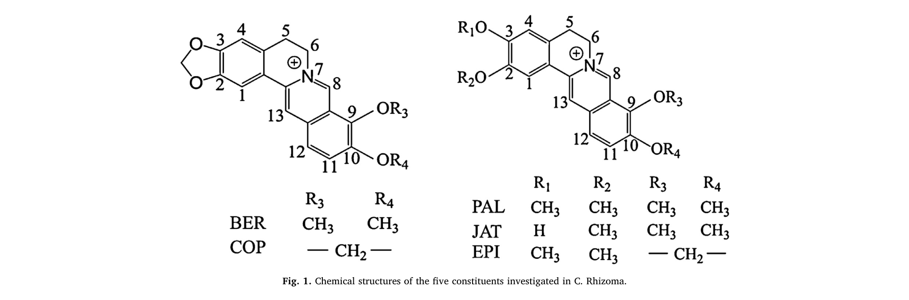
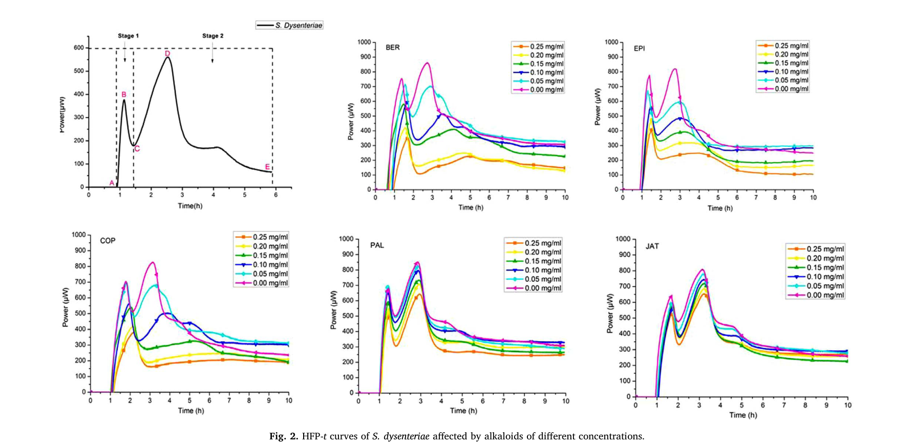
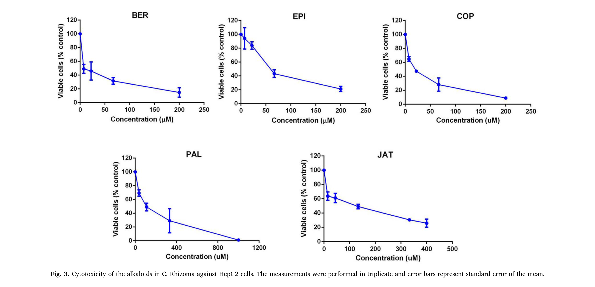
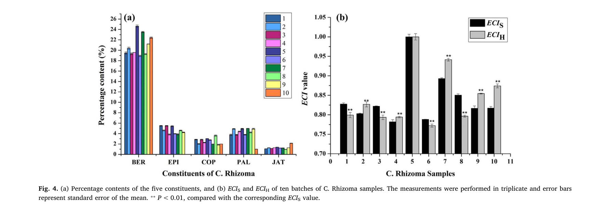
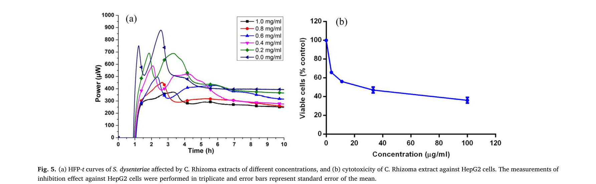
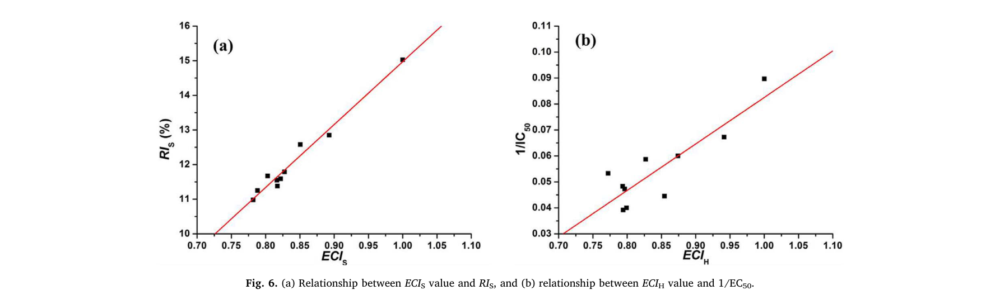
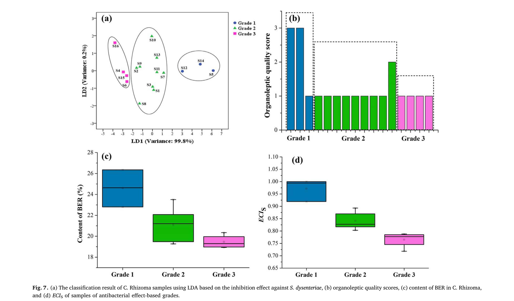
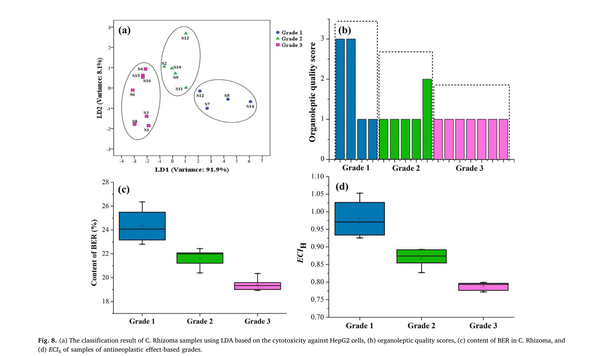
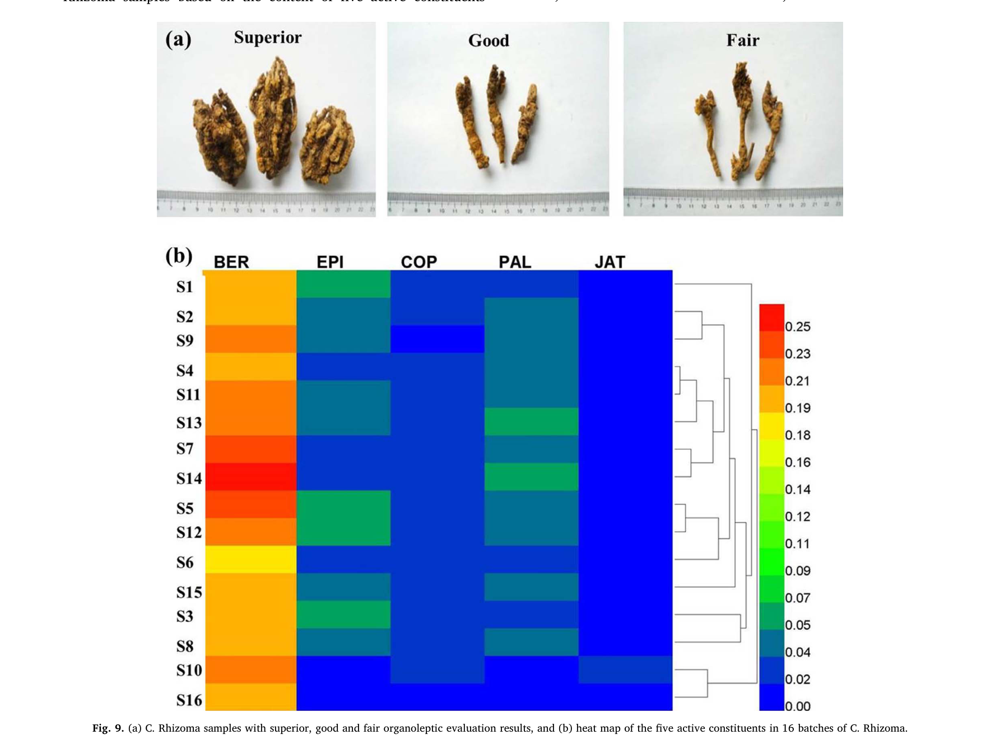

## 書誌情報

- 標題（原題）: Promotion of quality standard of Chinese herbal medicine by the integrated and efficacy-oriented quality marker of Effect-constituent Index
- 著者: Yin Xiong, Yupiao Hu, Fan Li, Lijuan Chen, Qin Dong, Jiabo Wang, Elizabeth A. Gullen, Yung-Chi Cheng, Xiaohe Xiao
- 所属: 昆明理工大学 生命科学技術学院、北京中医薬大学 中薬学院、中国人民解放軍第302医院（中国軍事医学科学院 中医薬研究所）、米国イェール大学医学部 薬理学科
- 掲載誌: Phytomedicine 45 (2018) 26–35
- DOI: 10.1016/j.phymed.2018.03.013
- インパクトファクター: 約7.9（*Phytomedicine*, JCR 2024 / Clarivate。出典により6.7〜8.8と幅があり要確認）
- 受理経過: 2017年7月23日受付、2018年1月10日改訂、2018年3月7日受理／© 2018 Elsevier GmbH. All rights reserved.

## 要旨（Abstract）

**背景**: 現在、漢方薬（CHM）の品質管理には複数の成分がマーカーとして用いられている。しかし、それらの成分は互いに切り離されて扱われており、CHMの薬効（bioeffect）への寄与の違いを示せていない。また、臨床用途の異なる同一のCHMが、しばしば同じ品質マーカー（Q-marker）で管理されており、効能ごとの違いを関連づけることができない。

**目的**: 本研究は、統合的かつ薬効指向型のQ-marker「Effect-constituent Index（ECI）」により、CHMの品質標準を向上させることを目的とする。

**方法**: 黄連（Coptidis Rhizoma、以下C. Rhizoma）を事例として、薬効と活性成分を統合したECIというQ-markerを開発した。C. Rhizomaの効能に応じて、微量熱測定（microcalorimetry）とMTTアッセイにより、それぞれ抗菌作用と抗腫瘍作用を検討した。高速液体クロマトグラフィー（HPLC）により、C. Rhizoma抽出物の活性成分を同時に定量した。赤痢菌（Shigella dysenteriae、以下S. dysenteriae）の増殖阻害に対するECIS、およびHepG2細胞の増殖阻害に対するECIHを、多指標総合評価法（multi-indicator synthetic evaluation; MSE）により確立した。C. Rhizoma試料の性状評価スコアはデルファイ法により付与した。

**結果**: 相関分析の結果、ECISおよびECIHは、それぞれC. Rhizoma抽出物によるS. dysenteriaeの増殖阻害効果（P<0.01）およびHepG2細胞の増殖阻害効果（P<0.01）と有意に相関した。さらに、ECIは薬効に基づく品質等級を判別・予測する良好な能力を示したのに対し、性状評価および化学分析はそれを達成できなかった。加えて、ECISが低い一部の試料はECIHが高く、その逆の例もみられた。

**結論**: ECIというQ-markerは、複数の活性成分を含むC. Rhizomaの異なる薬理効果を関連づけるのに有用であり、統合的・簡便かつ効能別にCHMの品質標準を向上させるうえで有益である。

**キーワード**: 黄連（Coptidis Rhizoma）；品質マーカー（Quality marker）；Effect-constituent Index；赤痢菌（Shigella dysenteriae）；HepG2細胞

## 1. 序論（Introduction）

漢方薬（CHM）は世界の研究コミュニティから大きな関心を集めており、その品質は薬効と安全性において重要な役割を果たす（Cheung, 2011）。臨床で用いられるCHMの治療効果は、一般にその品質を示す最良の指標とみなされている（Govindaraghavan and Sucher, 2015; Zhong et al., 2014）。数多くの品質管理（QC）・評価法のなかで、化学分析は実施のしやすさから、真正性の確認や品質評価・基原鑑別に現在広く用いられている（Zhang et al., 2014a, b）。しかし、CHMのQCのためのいくつかの成分の定量は、しばしば臨床効能と相関しない。例えば、アデノシンは自然界に広く存在するプリンヌクレオシドであり、中国薬局方（Chinese Pharmacopoeia Commission, 2015）では冬虫夏草のQCマーカーとされているが、当該CHMの機能（すなわち腎保護・止血・去痰）との相関に乏しい。

近年、Liuら（2017）は、CHMの品質評価・製造工程管理のための品質マーカー（Q-marker）という新概念を提唱し、Q-markerを「CHMの薬理効果に関連する化学成分」として明確に定義した。この目的を達成するため、活性成分が未知または定量不能なCHMについては、生物学的アッセイによりQ-markerを決定したり品質を評価したりすることができる（U.S. Food and Drug Administration, 2015）。

薬理学的な基原が比較的明確なCHMについては、単一の活性成分よりも、複数の活性成分をQ-markerとするほうがCHMの効能・効果をより包括的に反映しうる。しかし、CHMの薬理効果に対する複数成分の寄与の違いはこれまで考慮されてこなかった。どの活性成分が治療において主導的な役割を果たすのかは明確ではない。例えば中国薬局方（Chinese Pharmacopoeia Commission, 2015）では、黄連（C. Rhizoma）の品質を管理・評価するために、ベルベリン（BER）・エピベルベリン（EPI）・コプチシン（COP）・パルマチン（PAL）の含量が定量されている。もしあるC. Rhizoma試料が、別の試料と比べてEPIの含量は高いがCOPの含量は低い場合、これら両成分がともに当該CHMのQ-markerであるとき、2試料の品質差をどう評価すればよいだろうか。さらに、CHMは一般に複数の効能のために用いられるため、ある効能を持つCHMが他の効能でも同じ役割を果たすとは限らない。

多指標総合評価法（Multi-indicator synthetic evaluation; MSE）は、対象の特徴に関連する複数の因子・指標の統計解析に基づき対象を包括的に評価する手法であり、経済・生態・政治・医学など様々な分野で広く応用されている（Ma et al., 2014; Miao et al., 2015）。臨床効能を関連づけ、CHM中の活性成分の寄与の違いに対処するため、本研究ではMSEを適用し、化学分析と薬効検出結果の統合に基づく新しい品質評価法「Effect-constituent Index（ECI）」を確立した。これは、活性成分に対してその相対活性に応じた効果の重みを与えたうえで、活性成分の含量を定量することで決定できる。

C. Rhizoma（*Coptis chinensis* Franch.、*Coptis deltoidea* C. Y. Cheng et Hsiao、または *Coptis teeta* Wall.（キンポウゲ科）の乾燥根茎）は、細菌性下痢・便秘・嘔吐・癌腫その他の感染性・炎症性疾患の治療に何千年にもわたり広く用いられてきた漢方薬である（Qian et al., 2015; Ren et al., 2013）。これまで、形態学的・顕微鏡的特徴の検討（Yi et al., 2015）、化学成分やクロマトグラフィープロファイルの分析（Kong et al., 2009a）、生物学的アッセイ（Qin et al., 2012）など、単独あるいは組み合わせた様々な方法がC. Rhizomaの品質評価に用いられてきた。研究者らは、C. Rhizomaが多様な薬理学的性質を有することを示しており、その様々な成分のなかでもプロトベルベリンアルカロイド類は、良好な薬理効果を持つ主要な活性成分であることが示されている（Chen et al., 2012; Yi et al., 2013）。例えばBERはC. Rhizomaの重要かつ活性な成分であり、腸管感染症の治療に用いられてきたほか、近年では癌の治療にも応用が検討されている（Tang et al., 2009; Wang et al., 2015）。C. RhizomaのほかのEPI・COP・PAL・ヤトロリジン（jatrorrhizine; JAT）といった活性成分も、抗菌・抗腫瘍・弛緩作用などの薬理効果を示すことが報告されている（Tan et al., 2016）。したがって、生物活性物質の基盤と臨床効能に関連する特異的な薬効が比較的明確なCHMとして、C. Rhizomaを本手法の有効性・性能を示すためのモデルとして選び検討した。多様な需要に応えるため、C. Rhizomaの抗菌・抗腫瘍効果に基づき、S. dysenteriaeの増殖阻害に対する統合的・薬効指向型Q-marker（ECIS）、およびHepG2細胞に対する統合的・薬効指向型Q-marker（ECIH）を確立し、それをC. Rhizomaの異なるバッチにおける個別の品質評価に応用することを試みた。

## 2. 理論（Theory）

各成分の薬効と、CHM中の当該成分の含量をあらかじめ測定したと仮定する。CHMの予測薬効と活性成分データとの関係を記述するモデルは、以下の式で決定できる。

> ECIj = Σi=2n (Wi × Xi)sample / Σi=2n (Wi × Xi)reference ……式(1)

ここでECIjはCHMの予測薬効j、Wiは成分iの薬効に対する重み係数、XiはCHM中の成分iの含量である。一般に、相対的に強い活性と高い成分含量を持つCHM試料が基準試料として選ばれる。したがって式(1)はECIの形式的な表現であり、すなわち各活性成分の含量と効果を、CHMの対応する薬効に結びつける数理モデルである。ある成分の薬効に対する重み係数は相対値であるため、式(1)を解くにはWiを算出する必要がある。

> Wi = Ai / Σi=2n Ai ……式(2)

式(2)において、Aiは成分iの実測効果値である。ある成分の効果値が、全成分の効果値の合計に占める割合が、その成分の薬効に対する重み係数となる。Wiの値が高いことは、当該成分がCHMの薬効との（予測的な）強い相関を持つことを意味する。

薬効に対する重み係数と、CHM中の活性成分の含量とを掛け合わせることで、当該成分のCHMの対応する薬効への相対的な寄与が明らかになる。こうして、活性寄与が分配された活性成分の含量を定量することにより、CHMの予測薬効を得ることができる。

## 3. 材料と方法（Materials and Methods）

### 実験材料

C. Rhizoma試料は、中国の四川省・重慶市・湖北省・雲南省にある適正農業規範（GAP）基地から入手し、研究者（Xiaohe Xiao、中国人民解放軍第302医院 中国軍事医学科学院 中薬研究所、北京）により同定された。標本（番号20120023）は同研究所の標本庫に保管された。BERおよびPALの化学標準品は、中国食品薬品検定研究院（北京）から購入した。EPI・COP・JATは成都メスト・バイオテクノロジー社（成都）から購入した。いずれの標準品も純度98%以上であった。

### C. Rhizoma抽出物の調製

C. Rhizoma抽出物は、既報の方法（Yan et al., 2014）に従って調製した。

### 抗菌活性アッセイ

抗菌活性実験は既報の方法（Yan et al., 2014）に従って実施した。試料には、C. Rhizoma抽出物および異なる濃度のアルカロイド溶液を用いた。

### 細胞培養

HepG2細胞はイェール大学医学部（米国コネチカット州ニューヘイブン）より入手した。細胞は10%ウシ胎児血清および0.1 mg/mLカナマイシンを含むDulbecco改変Eagle培地（DMEM）中、5% CO2、37℃の飽和加湿雰囲気下で培養した。良好な増殖状態にある細胞は、リン酸緩衝生理食塩水に溶解した2 g/Lのパンクレアチンで消化・継代した。

### MTTアッセイ

コンフルエントに達した細胞を2 g/Lのパンクレアチン処理により懸濁し、一部をブランクとして残した96ウェル培養プレート（5000細胞/ウェル）に播種した。12時間後、培地を除去し、様々な抽出物またはアルカロイドを含む10%ウシ胎児血清添加DMEMを各ウェルに添加した。一方、ブランクウェルには同量のDMEMを添加した。72時間後、各ウェルに20 µLのMTT試薬（5 mg/mL）を添加した。4時間後、対応する上清を除去し、細胞を再度洗浄した。色素は150 µLのジメチルスルホキシドで抽出した。溶液はシェーカーに置いて溶解させた。15分後、マイクロプレートリーダーにより490 nmで吸光度を測定した。試験は3連で実施した。

### 高速液体クロマトグラフィー（HPLC）分析

クロマトグラフィー分析は、Kromasil 100-8 C18カラム（250 mm × 4.6 mm、5 µm）（AkzoNobel社、スウェーデン）を装着したAgilent 1100シリーズHPLCシステム（Agilent Technologies社、米国サンタクララ）で実施した。移動相は、ラウリル硫酸ナトリウム3 g/Lを含むアセトニトリル（A）と、リン酸二水素カリウム6.0 g/L（pH 6.0）の超純水（B）（66:34, v/v）から構成した。グラジエントモードは以下の通り：0分、38% B；55分、38% B；65分、15% B；70分、0% B。カラム温度は30℃に設定した。流速は1.0 mL/分に設定した。検出波長は345 nmとし、注入量は10 µLとした（Xiong, 2015）。

C. Rhizoma抽出物（50 mg）を塩酸-メタノール溶液（1:100, v/v）50 mLに溶解し、60℃の水浴中で15分間加熱した。20分間の超音波処理後、溶液を0.45 µmメンブランフィルターでろ過してからHPLC分析に供した。混合標準溶液は、塩酸-メタノール（1:100, v/v）中に（mg/mLで）BER 0.43、EPI 0.11、COP 0.06、PAL 0.12、JAT 0.07を含有した。5成分の化学構造をFig. 1に、C. Rhizoma抽出物のHPLC指紋をFig. S1（原文の補足資料。原文参照）に示す。

### デルファイ法に基づく性状評価

評価法は既報の研究（Wang et al., 2010a, b）に基づいて開発した。質問票は、「中国生薬76種の規格等級標準」（State Administration of Traditional Chinese Medicine of the People's Republic of China, 1984）を参照して作成した。性状評価の経験年数が平均31年の専門家13名を招き、2回にわたりC. Rhizomaの品質を評価してもらった。C. Rhizomaへの精通度と評価基準に関する質問票（原論文 Table S1）により、この13名の専門性を調査した。C. Rhizomaに十分精通し、評価基準が実務経験に基づいている専門家を、確かな権威を持つ者とみなした。専門家の2回の評価の一致度、および異なる専門家間での試料等級評価の一致度は、それぞれ式(S1)・式(S2)（原文の補足資料。原文参照）として算出した。経験年数が相対的に少なく権威が弱く、かつ2回の評価の一致度が70%以下であった専門家4名（原論文 Table S2）は最終結果から除外した。残る専門家9名のあいだで最も一致度の高かったスコアを、各バッチのC. Rhizomaの判定結果とした。性状評価スコア3・2・1は、それぞれC. Rhizomaの「優（superior）」「良（good）」「可（fair）」を表す。

### 統計解析

定量的な熱力学パラメータは、Origin 8.5ソフトウェア（OriginLab社、米国ノーサンプトン）を用いて解析し、HFP-t曲線の作図および熱力学パラメータの算出を行った。IC50値およびEC50値も、Origin 8.5ソフトウェアを用いたプロビット回帰によりフィッティングした。主成分分析（PCA）、線形判別分析（LDA）、およびECI値と実測薬効値との相関分析は、SPSS v20.0（IBM社、米国アーモンク）を用いて行った。結果は平均値±標準偏差で示し、すべての統計比較は一元配置分散分析（one-way ANOVA）およびDuncan検定により行った。P<0.05を有意とみなした。

## 4. 結果と考察（Results and Discussion）

### 抗菌活性

C. Rhizomaは、伝統的に臨床で長い歴史をもって赤痢性下痢の治療に用いられてきた（Fukutake et al., 1998; Li et al., 2013）。数多くの病原体のなかでも、S. dysenteriaeは、粘血便・腹部痙攣・しぶり腹を伴う急性赤痢性下痢を引き起こす主要な細菌として報告されている（Kamgang et al., 2005; Periska et al., 2003）。したがって、S. dysenteriaeに対する阻害は当該疾患の治療に有効な手段であり、C. Rhizomaの効能評価に適したモデルでもある。

生物の増殖・代謝の過程では熱・エネルギーの産生が生じ、様々な薬物によって誘起されるその変化を活性評価の指標として利用できる（Furustrand Tafin et al., 2012; Yan et al., 2009）。微量熱測定（microcalorimetry）は、様々な種類の試料における細菌活性・増殖をモニタリングする汎用的かつ定量的な分析技術であり、異なる微生物に対する薬物の薬理効果の解析に広く用いられている（Kong et al., 2009b; Wu et al., 2005）。そこで、C. Rhizomaおよびその成分の抗菌活性を微量熱測定により測定した。

37℃におけるS. dysenteriaeの正常な増殖発熱曲線をFig. 2に示す。「熱流束-時間（HFP-t）曲線は、S. dysenteriaeの代謝プロファイルが2つの主要な段階（段階1・2）と5つの相（誘導期[A-B]、第1指数増殖期[B-C]、移行期[C-D]、第2指数増殖期[D-E]、減衰期[E-F]）からなることを示した。S. dysenteriaeの増殖に対するHFP-t曲線の定量的な熱力学パラメータは、式(3)を用いて記述できる」（Yan et al., 2014）：

> ln Pt = ln P0 + kt ……式(3)

ここでP0とPtは、それぞれ時間0または時間t（分）における熱流束を表す。微量熱測定の信頼性を検証するため、無処理の細菌で実験を8回繰り返し、良好な再現性を得た。次に、異なる濃度の試料存在下でのHFP-t曲線から、以下の熱力学パラメータを定量した：第1・第2指数増殖期の増殖速度定数（k1・k2）、第1・第2ピークの熱流束（p1・p2）、第1・第2ピークの出現時刻（t1・t2）、および曲線下のピーク面積（S. dysenteriaeの総発熱量Qt）（原論文 Table S3）（Kong et al., 2010; Kong et al., 2011）。PCAの結果、t2とQtが最大の負荷量を持つ変数であることが明らかになった。対照群と比較して、t2値が高くQt値が低いほど、S. dysenteriaeに対する阻害が強いことを示す。Fig. 2に示すように、試料濃度の増加に伴いHFP-t曲線のt2は遅延しており、これが成分の抗菌活性を評価する指標となりうる。

次に、式(4)により阻害率ISを算出し、各成分の抗菌活性を定量するIC50値を求めた。

> IS = (t2 − t0)/t0 × 100% ……式(4)

ここでt0は培地単独でのS. dysenteriaeのHFP-t曲線における第2ピークの出現時刻、t2は試験試料に曝露したS. dysenteriaeのHFP-t曲線における第2ピークの出現時刻、ISは試料のS. dysenteriaeに対する阻害率である。

結果によると、BER・EPI・COP・PAL・JATのIC50値は（mg/mLで）それぞれ0.166、0.485、0.101、31.981、5.049であった。これは、阻害活性の順序がCOP＞BER＞EPI＞JAT＞PALであることを示しており、BERの支配的効果を過大評価し、他の成分の寄与を見落としてはならないことを我々に思い起こさせる。

### MTTアッセイ

中医学の理論によれば、熱の蓄積から生じる毒（toxin）は、腫瘍や癌を引き起こす主要な病因の一つである。したがって、清熱解毒の治療法は、腫瘍・癌を予防・治療する有効な療法である（He et al., 2012; Lee et al., 2014）。清熱解毒作用を持つ代表的な漢方薬として、C. Rhizomaおよびその化合物は、腫瘍の予防・治療、あるいは癌治療中の副作用軽減に用いられてきた（Iizuka et al., 2000; Tang et al., 2009）。この治療に関連する機序は、腫瘍細胞の増殖抑制、および癌を誘発する関連遺伝子・転写因子の発現に対する直接的な抑制と関係している（Kim et al., 2004）。C. Rhizomaおよびその成分は、肝癌・子宮頸癌・鼻咽頭癌・肺癌などに対して強い抗腫瘍効果を持つことが報告されており、なかでも肝癌治療に関する活性・機序についての報告が多数ある（Tang et al., 2009; Wang et al., 2010, b; Zhu et al., 2011）。そこで、C. Rhizomaの効能を検討するため、古典的な肝癌モデルであるHepG2細胞を選択した。

成分の生細胞率（%対照）は式(5)により算出した。

> 生細胞率（%対照）= (Asample − Ablank)/(Acontrol − Ablank) × 100% ……式(5)

ここでAは溶液の吸光度である。BER・EPI・COP・PAL・JATの異なる濃度によるHepG2細胞への細胞毒性をFig. 3に示す。C. Rhizoma中のアルカロイド濃度と生細胞数との間には負の相関がみられた。BER・EPI・COP・PAL・JATのEC50値は（μMで）それぞれ6.60、67.30、25.52、64.21、76.32であり、BERが最も強い細胞毒性を示し、JATが最も弱い効果を示した。S. dysenteriaeの増殖に対するC. Rhizomaアルカロイドの効果と比較すると、COPが最も強い細胞毒性を示し、PALが最も弱い効果を示した。

結果によれば、5成分は同一の薬効を発現するにあたり、大きく異なる程度で寄与していた。例えば、S. dysenteriaeに対する阻害のIC50値でみると、BERの抗菌活性はPALのおよそ200倍強かった。非マーカー成分であるJATも、PALより強い阻害効果を示した。これらの観察結果は、複数の成分がQ-markerとして決定される場合、CHMの品質評価においては各成分の相対活性の寄与を考慮すべきであることを想起させる。また、S. dysenteriaeへの阻害順序はCOP＞BER＞EPI＞JAT＞PALであった一方、MTTアッセイではBER・EPI・COP・PALの4成分がJATより相対的に強い効果を示した。これらの観察結果は、C. RhizomaのQ-markerが臨床で適用される効能ごとに指向されるべきであることを示唆する。比喩的に言えば、ものさしは長さを測るための道具であり、重さを量るためには使えない。

### ECISとECIHの確立

各成分への効果の重みは、IC50iまたはEC50iの逆数を式(6)または式(7)により正規化することで割り当てた。

> Wi = (1/IC50i) / Σi=2n (1/IC50i) ……式(6)
> Wi = (1/EC50i) / Σi=2n (1/EC50i) ……式(7)

ここでWiは各成分の薬効に対する重み係数を指す。IC50iおよびEC50iは、それぞれ成分iのIC50・EC50である。nは成分数であり、本研究ではBER・EPI・COP・PAL・JATを含む。相対的に強い活性と高い成分含量を持つC. Rhizomaが基準試料として選ばれる。本研究では試料5が基準試料と決定された。各成分のIC50・EC50値を上記の式に代入することにより、C. Rhizomaの抗菌活性・抗腫瘍活性のECIモデルがそれぞれ式(8)・式(9)として得られた。

> ECIS = 3.1676 × XBER + 1.0842 × XEPI + 5.2062 × XCOP + 0.0164 × XPAL + 0.1041 × XJAT ……式(8)
> ECIH = 3.7617 × XBER + 0.3689 × XEPI + 0.9729 × XCOP + 0.3867 × XPAL + 0.3253 × XJAT ……式(9)

上記の式において、ECISおよびECIHは、それぞれS. dysenteriaeに対する予測阻害効果、HepG2細胞に対する予測細胞毒性を表す。XBER・XEPI・XCOP・XPAL・XJATは、それぞれC. Rhizoma中のBER・EPI・COP・PAL・JATの含量である。重み係数からわかるように、COPは他の成分より最も強い阻害効果を示し、一方でBERの細胞毒性は他の成分より相対的に強かった。

### C. Rhizomaのアルカロイド含量、ECIS・ECIHの決定

Fig. 4aによると、10バッチのC. Rhizoma抽出物における5成分の含量はバッチごとにばらつきがあり、異なる試料の品質を評価することを難しくしている。例えば、試料1のEPI・COPの含量は試料2より高い一方、試料1のBER・PAL・JATの含量は試料2より低かった。5つの指標の含量を同時に検討することで、どちらの試料が品質として優れているかを判断するのは困難であった。

上記の問題を解決するため、各バッチのC. RhizomaにおけるBER・EPI・COP・PAL・JATの含量を式(8)・式(9)に代入し、異なる試料のECIS・ECIHを算出した。Fig. 4bに示す結果によると、C. Rhizomaの品質差はECIの個々の指標によりバッチごとに容易に判別できた。例えば、S. dysenteriaeによる赤痢の治療に用いる場合、試料4はECISで劣り、試料5はECISで優れていた。また、ECIの確立は、C. Rhizomaの個別評価と合理的な使い分けの指針にもなりうる。例えば試料7は、そのECI値によれば、S. dysenteriaeの阻害よりもHepG2細胞の阻害に適していた。

### 相関分析

ECIがC. Rhizomaの効果を代表しうるかを確認するため、微量熱測定・MTTアッセイにより、C. Rhizoma抽出物によるS. dysenteriaeの増殖阻害（Fig. 5a）およびHepG2細胞に対する細胞毒性（Fig. 5b）をそれぞれ検討した。C. Rhizoma抽出物の濃度が高いほど、阻害効果は強かった（Fig. 5）。S. dysenteriaeに対する相対阻害率（RI）を式(10)として、また異なるバッチのC. RhizomaのHepG2細胞に対するEC50値を求めた。

> RIS = IS / Icontrol × 100% ……式(10)

ここでRISはS. dysenteriaeに対するC. Rhizoma試料の相対阻害率、ISはC. Rhizoma試料の阻害率、Icontrolは陽性対照薬BERの阻害率である。実測の効果値とECIによる予測値を比較したところ、ECISとECIHがともに最も高い試料5が、S. dysenteriaeに対する阻害とHepG2細胞に対する細胞毒性においても最も強い効果を示した（それぞれRIS 15.03%、EC50 11.14 mg/mL）。さらに、ECIと阻害効果値との相関分析を行った。その結果（Fig. 6）、C. RhizomaのECISはRISと有意に相関し（RS=0.987、**P<0.01）（Fig. 6a）、C. RhizomaのECIHは1/EC50と有意に相関しており（RH=0.873、**P<0.01）（Fig. 6b）、ECISとECIHがそれぞれある程度、C. RhizomaのS. dysenteriaeおよびHepG2細胞に対する阻害効果を代表しうることが示唆された。

### ECIと従来の品質評価法との比較

性状評価と化学分析は、現在CHMの識別・品質評価に広く適用されている。経験を積んだ実務者は、色を観察し、匂いを嗅ぎ、味を確かめ、質感を触れることでCHMの品質を判別する。C. Rhizomaの品質評価におけるECIの実行可能性を検証するため、異なるバッチに由来する16の代表試料を分析した（原論文 Table S4）。マーカー成分の含量、デルファイ法による性状評価スコア（Table S4）、および上記のモデルにより算出したECIS・ECIH値をFig. 7・Fig. 8に示す。デルファイ法により、C. Rhizoma試料5・14は性状評価スコア3の「優」、試料2はスコア2の「良」と判定され、残る試料は「可」としてスコア1が与えられた。3ランクの代表的な試料をFig. 9aに示す。太い根茎で細根が少なく、断面が黄金色を呈するC. Rhizomaが、性状として最上級とみなされた。さらに、5活性成分の含量に基づき、C. Rhizoma試料をクラスター分析により分類した（Fig. 9b）。化学分析により、同一の基原（*Coptis teeta* Wall.）に由来する試料10・16は、*Coptis chinensis* Franch.を基原とする他の試料から区別することができた。しかし、これらの指標は互いに切り離されていたため、どの試料がより優れた効果や高い活性成分含量を持つかを判別することは困難であった。

C. Rhizoma試料の評価結果の精度をさらに検証するため、実測の薬効結果を基準として、これらの評価法の一致度を比較した。異なる基原・産地の試料を分類するためLDAを実施した。抗菌効果および HepG2細胞に対する細胞毒性に基づく散布図をそれぞれFig. 7a・Fig. 8aに示す。図中にクラスターの重なりはみられなかった。抗菌活性については、異なるバッチの試料は次の3等級に分類された：等級1（S5・S12・S14）、等級2（S1–4・S7–11・S13）、等級3（S4・S6・S15–16）（Fig. 7b）。HepG2細胞への阻害効果については、次の3等級に分類された：等級1（S5・S7・S12・S14）、等級2（S2・S9–11・S13）、等級3（S1・S3–4・S6・S8・S15–16）（Fig. 8b）。一部の試料では、一方の活性が低くても他方の効果が高い場合がみられた。結果によれば、性状評価スコアは薬効に基づく品質等級を完全には判別できず、C. Rhizomaの外観が劣っていても必ずしも薬効が弱いとは限らないことが示唆された。また、C. Rhizomaのマーカー成分であるBERの含量は、抗菌効果に基づく品質等級を判別できなかった（Fig. 7c・Fig. 8c）。それに対して、C. Rhizomaの3等級すべてが、ECIS（Fig. 7d）とECIH値（Fig. 8d）のいずれによっても有意に分離できた。

本研究は、形態的特徴のみ、あるいは単一のマーカー成分や互いに孤立したいくつかの成分の含量のみを考慮してC. Rhizomaの品質を判断することはできず、それらの効果を統合した部分として扱うべきであることを示している。生薬中の活性成分の含量定量と薬効試験の重み付け解析に基づく手法として、ECIというQ-markerは、C. Rhizomaの品質と潜在的な臨床効果とを関連づけるうえで有用である。本研究ではC. Rhizomaの2つの薬効のみを検討した。当該生薬のほかの効能に関するさらなる試験、および in vivo での薬理学的検証は、今後の研究で行う予定である。

## 5. 結論（Conclusion）

画一的な標準は、しばしば異なる臨床用途に応じたCHMの品質を反映しづらく、また複数のマーカーを個別に扱うことは、Q-markerが異なると評価結果が一致しないことがあるため、実務での活用を妨げる。臨床効能に関連する化学的・生物学的情報の統合に基づき、ECIというQ-markerは、その効果の異なる用途に応じてC. Rhizomaの個別の品質評価を可能にし、品質標準を双方向的な形で向上させることができる。ECIというQ-markerを用いることで、薬効指標を追加することなく、活性成分の含量を検出するだけでC. Rhizomaの効果を判定できる。したがって、ECIはC. Rhizomaに対する伝統的・現代的な評価法を補う有益な手段となりうる。本研究は、臨床効能に対応する比較的明確な効果と活性成分を持つ他のCHMの品質評価のための基盤を築くものである。

## 利益相反

著者らは、本研究が利益相反とみなされうる商業的・financial な関係のもとで行われていないことを宣言する。

## 謝辞

著者らは、中国国家自然科学基金（81660661、81274026）、昆明理工大学（KKSY201526065）、雲南省応用基礎研究重点プロジェクト（2016FD040）の支援に感謝する。Yin Xiongはまた、海外留学への財政支援に対し中国国家留学基金管理委員会（Chinese Scholarship Council）に謝意を表する。

> 補足（訳者・実務的示唆）: 本稿は、Liuら（2017）が提唱したQ-marker概念（本サイト収録の `qmarker-new-concept-liu2017` を参照）を、単一生薬・複数薬効の実証事例として具体化したものである。要点は次の3つ。①複数マーカー成分を「含量の合計」ではなく、各成分の実測薬効（IC50/EC50の逆数）で重み付けした線形結合（ECI）として統合する発想。②同じ黄連でも、抗菌用途の重み（COPが最大）と抗腫瘍用途の重み（BERが最大）が大きく異なり、単一の「代表マーカー」（例: 現行の中国薬局方が定めるBER含量）では効能ごとの品質差を捉えられないことを実測データで示した点。③性状評価（デルファイ法）・単一マーカー含量・ECIの3手法を、LDAによる薬効ベースの等級分けと突き合わせて精度を比較し、ECIのみが3等級すべてを分離できたという定量的な優位性を示した点。なお、Wiの算出式（式6・7）はΣをi=2からnとしており、n=5成分中の1成分（原文の表記上はBERに相当する添字1）が式の合計から除外されているように読めるが、原文に明示的な説明はなく、添字の割り当てが原論文の記法上の慣例（後述の式8・9の展開項数とは整合している）によるものか、誤植の可能性もある。数値を含む本質的な結論には影響しないため、原文表記のまま訳出した。原文参照。
