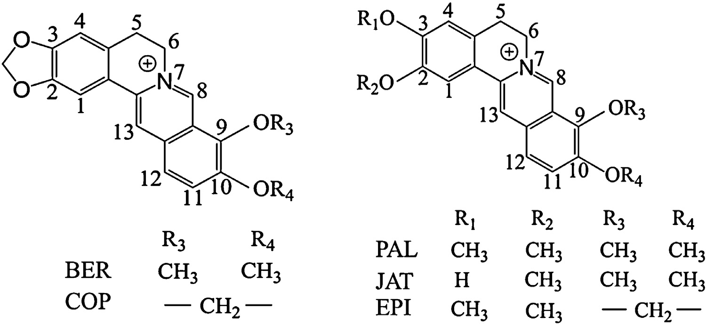
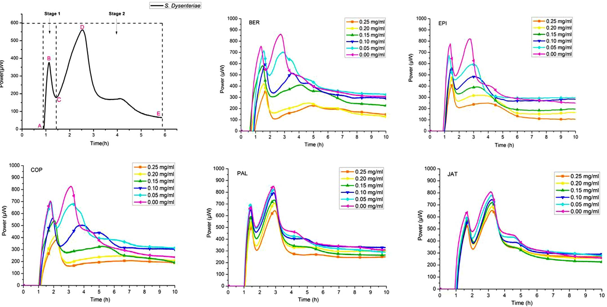
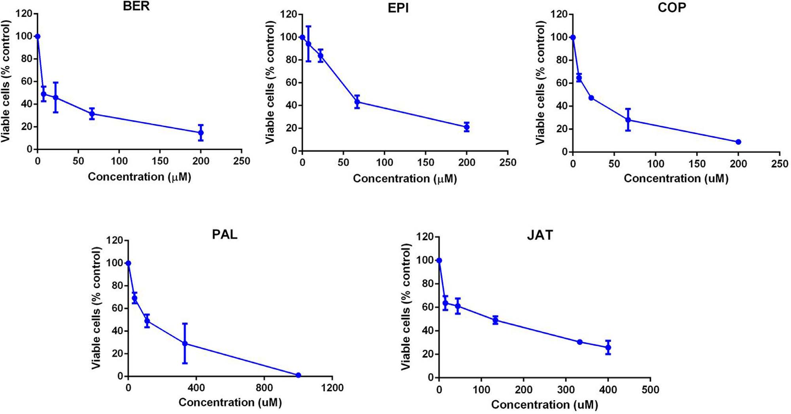
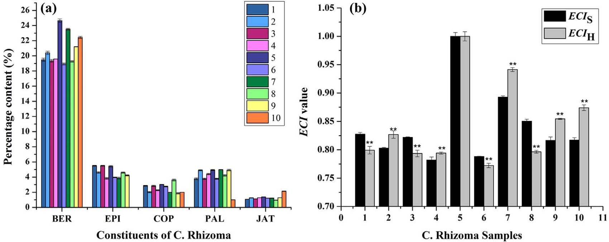
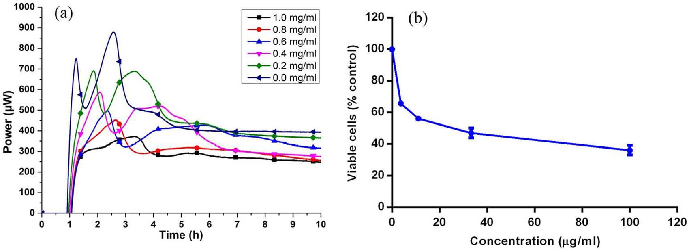
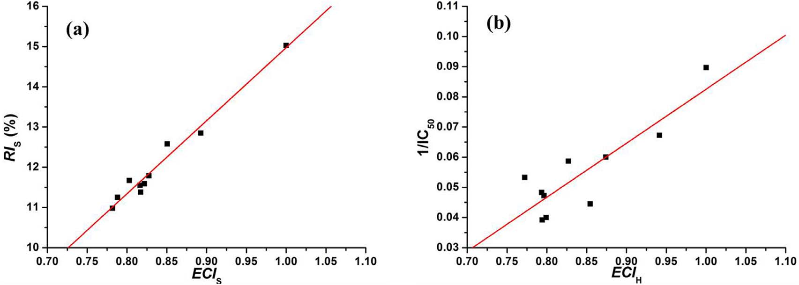
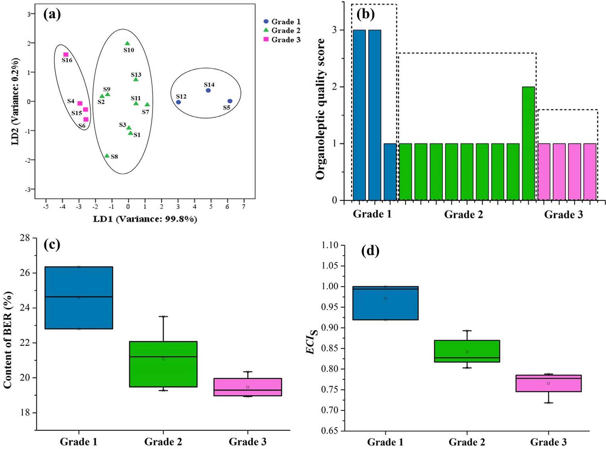
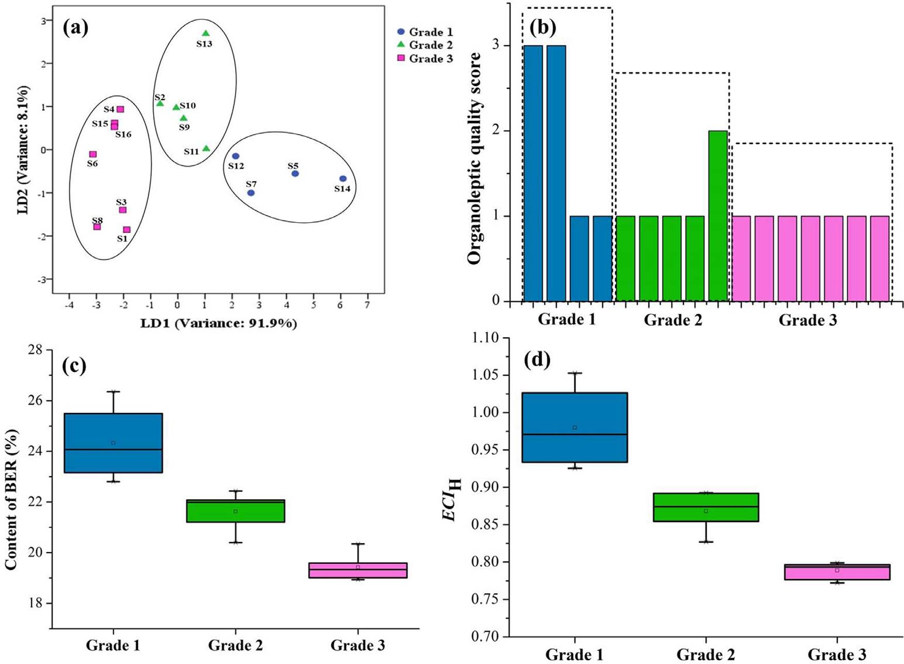
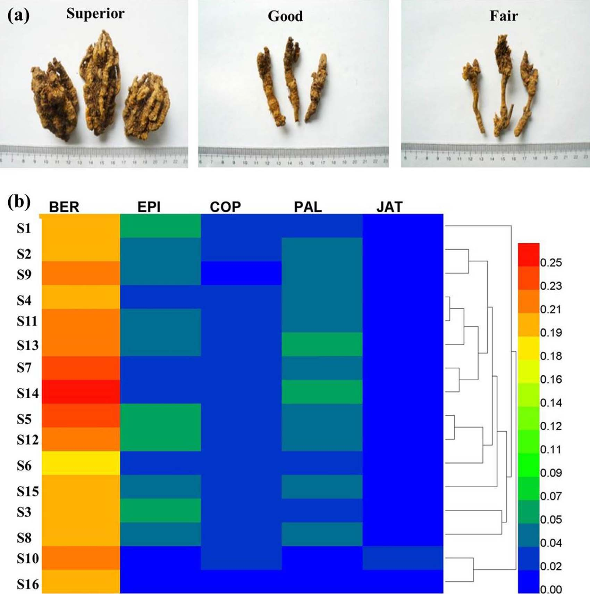

<!-- 方針: ほぼ全訳＋必要に応じた補足。原文構成に沿って訳出。「> 補足:」は訳者注。 -->

## 書誌情報

- 原題: Promotion of quality standard of Chinese herbal medicine by the integrated and efficacy-oriented quality marker of Effect-constituent Index
- 著者: Yin Xiong, Yupiao Hu, Fan Li, Lijuan Chen, Qin Dong, Jiabo Wang, Elizabeth A. Gullen, Yung-Chi Cheng, Xiaohe Xiao
- 所属: 昆明理工大学 生命科学技術学院（中国）／北京中医薬大学 中薬学院（中国）／中国人民解放軍中薬研究所（302軍医院、北京）（中国）／エール大学医学部 薬理学科（米国）
- 掲載誌・巻号・DOI: *Phytomedicine* 45 (2018) 26–35. https://doi.org/10.1016/j.phymed.2018.03.013
- インパクトファクター: **約7.9**（*Phytomedicine*, JCR 2024 / Clarivate。出典により6.7〜8.8と幅があり要確認）
- 受理経過: 受領 2017-07-23 ／ 改訂受領 2018-01-10 ／ 採録 2018-03-07
- ライセンス: © 2018 Elsevier GmbH. All rights reserved.（原文に詳細なライセンス表記なし）

> 補足: 本文中の略語（原文 Abbreviations 節より）— BER: berberine（ベルベリン）／CHMs: Chinese herbal medicines（中薬・生薬製剤）／COP: coptisine（コプチシン）／C. Rhizoma: Coptidis Rhizoma（黄連）／DMEM: Dulbecco Modified Eagle Medium／EPI: epiberberine（エピベルベリン）／HFP-t: heat flow power-time（熱流束-時間）／HPLC: high-performance liquid chromatography／JAT: jatrorrhizine（ヤトロリジン）／LDA: linear discriminant analysis（線形判別分析）／MSE: multi-indicator synthetic evaluation（多指標総合評価）／PAL: palmatine（パルマチン）／QC: quality control。

## 要旨（Abstract）

**背景:** 現在、生薬（CHM）の品質管理には複数の成分がマーカーとして用いられているが、それらの成分は互いに切り離されて扱われており、CHMの薬効に対するそれぞれの寄与の違いを提示できていない。また、臨床用途の異なる同一のCHMが同じ品質マーカー（Q-marker）で管理されることが多く、薬効を個別に相関させることができない。

**目的:** 本研究は、統合的・効能指向型Q-markerであるEffect-constituent Index（ECI）により、CHMの品質規格を向上させることを目的とする。

**方法:** 黄連（Coptidis Rhizoma; C. Rhizoma）を事例として、薬効と活性成分の統合に基づくQ-markerであるECIを開発した。C. Rhizomaの薬効に従い、微量熱量測定法とMTTアッセイにより、それぞれ抗菌作用と抗腫瘍作用を検討した。高速液体クロマトグラフィー（HPLC）により、C. Rhizomaエキス中の活性成分を同時に定量した。多指標総合評価法（MSE）により、赤痢菌（Shigella dysenteriae; S. dysenteriae）の増殖抑制に関するECIS、およびHepG2細胞の増殖抑制に関するECIHを確立した。C. Rhizoma試料の感覚評価スコアはデルファイ法により付与した。

**結果:** 相関解析の結果、ECISおよびECIHは、それぞれC. Rhizomaエキスの S. dysenteriae の増殖抑制効果（P<0.01）およびHepG2細胞の増殖抑制効果（P<0.01）と有意に相関した。さらに、ECIは薬効に基づく品質グレードを判別・予測する良好な能力を示したのに対し、感覚評価および化学分析ではそれを達成できなかった。加えて、ECISが低い試料の一部はECIHが高く、その逆のケースもみられた。

**結論:** Q-markerであるECIは、複数の活性成分を含むC. Rhizomaの異なる薬理効果を関連づけるのに有用であり、統合的・簡便・差別化された方法でCHMの品質規格を向上させるのに資する。

**キーワード:** Coptidis Rhizoma／Quality marker／Effect-constituent Index／Shigella dysenteriae／HepG2 cells

## 1. 序論（Introduction）

生薬（CHM）は世界の研究コミュニティから大きな関心を集めており、その品質は薬効と安全性の両面で重要な役割を果たす（Cheung, 2011）。臨床で用いられるCHMの治療効果は、一般にその品質を表す最良の指標とみなされている（Govindaraghavan and Sucher, 2015; Zhong et al., 2014）。数ある品質管理（QC）・評価法のなかでも、化学分析は実施のしやすさから、CHMの真正性確認や品質評価、基原鑑別に広く用いられてきた（Zhang et al., 2014a, b）。しかし、CHMのQCのためのいくつかの成分の含量測定は、しばしばその臨床効果と相関しない。例えば、天然に広く存在するプリンヌクレオシドであるアデノシンは、中国薬局方において冬虫夏草（Cordyceps）のQCマーカーとされているが（Chinese Pharmacopoeia Commission, 2015）、腎保護・止血・去痰といったこのCHMの機能との相関は乏しい。

近年、Liu et al.（2017）は、CHMの品質評価・工程管理のための新しいQ-marker概念を提唱し、Q-markerとはCHMの薬理効果に関連づけられる化学成分であると明確に定義した。この目的を達成するため、活性成分が未知あるいは定量不可能なCHMについては、生物学的アッセイを用いてQ-markerを決定したり品質を評価したりすることができる（U.S. Food and Drug Administration, 2015）。

薬理学的な実体が比較的明確なCHMについては、単一の活性成分よりも複数の活性成分をQ-markerとする方が、CHMの効能・効果をより包括的に反映できる。しかしながら、CHMの薬理効果に対する複数成分の異なる寄与は、これまで考慮されてこなかった。どの活性成分が治療において主導的な役割を果たしているのかは明らかでない。例えば、中国薬局方（Chinese Pharmacopoeia Commission, 2015）では、黄連（C. Rhizoma）の品質を管理・評価するために berberine（BER）、epiberberine（EPI）、coptisine（COP）、palmatine（PAL）の含量が定量されている。もしある黄連試料がEPIをより多く含み、COPをより少なく含む場合、これら双方がQ-markerであるとき、両試料の品質差をどのように評価すればよいだろうか。また、CHMは一般に複数の薬効のために用いられるため、ある効能について効果を持つCHMが他の効能についても同じ役割を果たすとは限らない。

多指標総合評価（MSE）は、対象の特徴に関連する複数の因子・指標の統計解析に基づき対象を総合的に評価する手法であり、経済、生態、政治、医学などさまざまな分野で広く応用されてきた（Ma et al., 2014; Miao et al., 2015）。臨床効果を相関づけ、CHM中の活性成分の寄与の違いを扱うために、本研究では化学分析と薬効検出の結果の統合に基づく新しい品質評価法「Effect-constituent Index（ECI）」を確立するためにMSEを適用した。ECIは、活性成分の相対活性に応じて付与された効果重みを用いて、活性成分の含量測定により決定できる。

黄連（Coptis chinensis Franch.、Coptis deltoidea C. Y. Cheng et Hsiao、またはCoptis teeta Wall.［キンポウゲ科］の乾燥根茎）は、細菌性下痢、便秘、嘔吐、がん、その他の感染性・炎症性疾患の治療に何千年も用いられてきた広く使われる生薬である（Qian et al., 2015; Ren et al., 2013）。これまで、形態学的・顕微鏡学的特徴の検討（Yi et al., 2015）、化学成分やクロマトグラフィープロファイルの分析（Kong et al., 2009a）、生物学的アッセイ（Qin et al., 2012）など、単独あるいは組み合わせたさまざまな手法が黄連の品質評価に用いられてきた。研究者らは黄連が多様な薬理作用をもつことを実証しており、その成分のなかでもプロトベルベリン型アルカロイドが良好な薬理効果を持つ主要な活性成分であることが示されている（Chen et al., 2012; Yi et al., 2013）。例えば、BERは黄連の重要かつ活性の高い成分であり、腸管感染症の治療に用いられるほか、近年ではがん治療への応用も認識されている（Tang et al., 2009; Wang et al., 2015）。黄連のその他の活性成分であるEPI、COP、PAL、jatrorrhizine（JAT）も、抗菌・抗腫瘍・弛緩作用など、いくつかの薬理効果を示すと報告されている（Tan et al., 2016）。

そこで本研究では、活性物質の基盤が比較的明確で、臨床効果に関連する特異的な薬効を持つCHMである黄連を対象に、この手法の機能と性能を検証することとした。異なるニーズに対応するため、黄連の抗菌・抗腫瘍作用に基づき、S. dysenteriaeの増殖抑制（ECIS）とHepG2細胞に対する抑制（ECIH）という統合的・効能指向型Q-markerを確立し、これを異なるバッチの黄連の個別品質評価に応用することを試みた。

## 2. 理論（Theory）

各活性成分の薬効をあらかじめ測定していると仮定する。CHMの予測薬効と活性成分データとの関係を記述するモデルは、以下の式で決定できる。

> 補足: 原文の数式（式(1)・式(2)）はPDFからのテキスト抽出時にレイアウトが崩れており、上付き・下付き文字や総和記号が判読困難であった。本文中の説明文と整合する形で、以下のとおり内容を再構成して示す（数値・変数の意味は原文の説明に基づく）。

- 式(1): `ECIj = Σ(Wi × Xi)sample / Σ(Wi × Xi)reference`（i = 1〜n の総和）
  ここで ECIj はCHMの予測薬効j、Wi は成分iの薬効に対する重み係数、Xi はCHM中の成分iの含量である。一般に、活性が相対的に強く、成分含量が高いCHM試料が参照試料として選ばれる。式(1)は、各活性成分の含量と薬効をCHMの対応する薬効に結びつける数学モデルの正式な表現である。成分の薬効に対する重み係数は相対値であり、式(1)を解くためには式(2)によって算出する必要がある。

- 式(2): `Wi = Ai / Σ Ai`（i = 1〜n の総和）
  ここで Ai は成分iの測定された効果値である。ある成分の効果値が全成分の効果値の合計に占める割合が、その成分の薬効に対する重み係数となる。Wi の値が高いほど、その成分がCHMの薬効に強い（予測的な）相関を持つことを意味する。

成分の含量にその薬効に対する重み係数を乗じることで、CHMの対応する薬効に対するその成分の相対的な寄与が明らかになる。したがって、活性の寄与が分配された活性成分の含量を決定することで、CHMの予測薬効を得ることができる。

## 3. 材料と方法（Materials and Methods）

### 3.1 実験材料

C. Rhizoma試料は、中国の四川省、重慶市、湖北省、雲南省のGAP（Good Agricultural Practices）基地から入手し、研究者（Xiaohe Xiao、中国人民解放軍中薬研究所、302軍医院、北京）により基原鑑定を行った。証拠標本（番号 20120023）は中薬研究所の研究室に保管された。BERおよびPALの化学標準品は中国食品薬品検定研究院（北京）から、EPI、COP、JATは成都Must Biotechnology（成都）から購入した。上記標準品の純度はいずれも98%以上であった。

### 3.2 黄連エキスの調製

C. Rhizomaエキスは既報の方法（Yan et al., 2014）に準拠して調製した（原文参照。詳細な調製条件は本論文中には再掲されていない）。

### 3.3 抗菌活性アッセイ

抗菌活性実験は既報の方法（Yan et al., 2014）に準拠して実施した。試料には、異なる濃度のC. Rhizomaエキスおよびアルカロイド溶液を用いた。

### 3.4 細胞培養

HepG2細胞はエール大学医学部（米国コネチカット州ニューヘイブン）より入手した。細胞は10%ウシ胎児血清および0.1 mg/mlカナマイシンを含むダルベッコ改変イーグル培地（DMEM）中で、5% CO2飽和加湿雰囲気下、37℃で培養した。良好な増殖状態にある細胞は、リン酸緩衝生理食塩水に溶解した2 g/lのパンクレアチンで消化・継代した。

### 3.5 MTTアッセイ

コンフルエントに達した細胞を2 g/lのパンクレアチンで処理して懸濁し、96ウェル培養プレート（5000細胞/ウェル）に播種した（一部ウェルはブランクとして残した）。12時間後、培地を除去し、異なる濃度のエキスまたはアルカロイドを含む10%ウシ胎児血清添加DMEMを各ウェルに加え、ブランクウェルには同容量のDMEMのみを加えた。72時間後、各ウェルに20 µlのMTT試薬（培地中5 mg/ml）を添加した。4時間後、上清を除去して細胞を再度洗浄した。色素は150 µlのジメチルスルホキシドで抽出し、溶解のためシェーカーにかけた。15分後、マイクロプレートリーダーにより490 nmで吸光度を測定した。アッセイは3連で実施した。

生存細胞率（%control）は次式(5)で算出した:

`Viable cells (% control) = (Asample − Ablank) / (Acontrol − Ablank) × 100%`

ここでAは溶液の吸光度である。

### 3.6 高速液体クロマトグラフィー（HPLC）分析

クロマトグラフィー分析は、Agilent 1100 series HPLCシステム（Agilent Technologies, Santa Clara, USA）にKromasil 100-8 C18カラム（250 mm×4.6 mm, 5 µm）（AkzoNobel, スウェーデン）を装着して実施した。移動相は、ラウリル硫酸ナトリウム3 g/lを含むアセトニトリル（A）と、リン酸二水素カリウム6.0 g/l（pH 6.0）の超純水（B）（66:34, v/v）から構成された。グラジエントモードは以下のとおり: 0 min, B 38%; 55 min, B 38%; 65 min, B 15%; 70 min, B 0%。カラム温度は30℃、流速は1.0 ml/min、検出波長は345 nm、試料注入量は10 µlとした（Xiong, 2015）。

> 補足: 原文中の「（66:34, v/v）」は移動相AとBの説明の直後に括弧書きで記載されているが、直後にグラジエント表（B濃度が時間とともに変化）が続いており、A・B比率と時間依存のグラジエントの関係が原文の記述だけでは判然としない箇所がある。数値・条件は原文の記載どおりに転記した。

C. Rhizomaエキス（50 mg）を50 mlの塩酸-メタノール溶液（1:100, v/v）に溶解し、60℃の水浴中で15分間加熱した。20分間の超音波処理後、溶液を0.45 µmメンブランフィルターでろ過してからHPLC分析に供した。混合標準溶液は、塩酸-メタノール（1:100, v/v）中にBER 0.43、EPI 0.11、COP 0.06、PAL 0.12、JAT 0.07（いずれもmg/ml）を含有させたものを用いた。5成分の化学構造をFig. 1に、C. RhizomaエキスのHPLCフィンガープリントを図S1（補足資料）に示した。

### 3.7 デルファイ法に基づく感覚評価

評価法は既報の研究（Wang et al., 2010a, b）に基づいて開発した。質問票は「中薬材76種の規格・等級基準」（中国国家中医薬管理局, 1984）を参照して作成した。感覚評価に平均31年の経験を持つ13名の専門家を招き、2回の機会にC. Rhizomaの品質を評価してもらった。これら13名の専門性を調べるため、C. Rhizomaへの精通度と評価基準に関する質問票（表S1）を作成した。C. Rhizomaに十分精通し、実務経験に基づく評価基準を持つ専門家を、強い権威を持つ者とみなした。2回の評価における専門家個人の一致度、および専門家間での試料等級評価の一致度は、それぞれ式(S1)・式(S2)により算出した。経験年数が相対的に少なく、権威が弱く、2回の評価一致度が70%以下であった4名の専門家（表S2）は最終結果から除外された。残る9名の専門家の間で最も高い合意を得たスコアを、各バッチのC. Rhizomaの判別結果として決定した。感覚評価スコア3、2、1はそれぞれ「優（superior）」「良（good）」「可（fair）」の品質を表す。

### 3.8 統計解析

定量的な熱力学パラメータはOrigin 8.5ソフトウェア（OriginLab Company, Northampton, USA）を用いて解析し、HFP-t曲線の作成および熱力学パラメータの算出を行った。IC50値およびEC50値は、同じくOrigin 8.5ソフトウェアを用いたプロビット回帰によりフィッティングした。主成分分析（PCA）、線形判別分析（LDA）、およびECI値と実測薬効値の相関解析は、SPSS v20.0（IBM, Armonk, NY, USA）を用いて実施した。結果は平均値±標準偏差で示し、すべての統計的比較は一元配置分散分析（ANOVA）とそれに続くDuncan検定により行った。P<0.05を統計的有意とみなした。

## 4. 結果と考察（Results and Discussion）

### 4.1 抗菌活性

C. Rhizomaは、臨床において赤痢性下痢の治療に長い歴史を通じて伝統的に用いられてきた（Fukutake et al., 1998; Li et al., 2013）。数ある病原体のなかでも、S. dysenteriaeは頻回の粘血便、腹部けいれん、しぶり腹を伴う急性赤痢性下痢を引き起こす主要な細菌性病原体として報告されている（Kamgang et al., 2005; Periska et al., 2003）。したがって、S. dysenteriaeに対する増殖抑制は、この疾患を治療する有効な手段であると同時に、C. Rhizomaの薬効評価に適したモデルでもある。

生物の増殖・代謝の過程で熱・エネルギー産生が生じ、その変化が異なる薬物により誘導される変化を活性評価の指標として利用できる（Furustrand Tafin et al., 2012; Yan et al., 2009）。微量熱量測定法（Microcalorimetry）は、さまざまな種類の試料における細菌活動・増殖をモニタリングする汎用的かつ定量的な分析技術であり、さまざまな微生物に対する薬物の薬理効果の解析に広く用いられてきた（Kong et al., 2009b; Wu et al., 2005）。そこで、C. Rhizomaおよび各成分の抗菌活性を微量熱量測定法により測定した。

37℃におけるS. dysenteriaeの正常な増殖発熱曲線をFig. 2に示す。熱流束-時間（HFP-t）曲線によれば、S. dysenteriaeの代謝プロファイルは2つの主要な段階（stage 1、stage 2）と5つのフェーズ（誘導期［A-B］、第1指数増殖期［B-C］、移行期［C-D］、第2指数増殖期［D-E］、減衰期［E-F］）からなる。S. dysenteriae増殖に関するHFP-t曲線の定量的な熱力学パラメータは、次式(3)で記述できる。

`ln Pt = ln P0 + kt`（式3）

ここでP0およびPtは、それぞれ時間0または時間t（分）における熱流束を表す。微量熱量測定法の信頼性を検証するため、未処理の細菌を用いて8回の反復実験を行い、良好な再現性を得た。続いて、異なる濃度の試料存在下でのHFP-t曲線から、以下の熱力学パラメータを定量した（Yan et al., 2014）: 第1・第2指数増殖期の増殖速度定数（k1, k2）、第1・第2最大ピークのHFP（p1, p2）、第1・第2最大ピークの出現時刻（t1, t2）、およびピーク下面積、すなわちS. dysenteriaeの総熱産生量（Qt）（表S3）。PCAの結果、t2とQtが最大の負荷変数であることが明らかになった。対照群と比較して、t2が大きく、Qtが小さいほど、S. dysenteriaeに対する抑制作用が強いことを意味する。Fig. 2に示されるように、試料濃度の増加に伴い、HFP-t曲線のt2は遅延しており、これが成分の抗菌活性を評価する指標となりうることが示された。

次に、式(4)により阻害率ISを算出し、IC50値を求めて各成分の静菌活性を定量した。その結果、BER、EPI、COP、PAL、JATのIC50値は（mg/ml単位で）それぞれ0.166、0.485、0.101、31.981、5.049であった。これは、抑制活性の順序がCOP＞BER＞EPI＞JAT＞PALであることを示しており、BERの支配的な効果を過大評価し、他の成分の寄与を見落とすべきではないことを想起させる結果であった。

`IS = (t2 − t0) / t0 × 100%`（式4）

ここでt0はS. dysenteriaeの培地単独でのHFP-t曲線における第2最大ピークの出現時刻、t2は試験試料に曝露したS. dysenteriaeのHFP-t曲線における第2最大ピークの出現時刻、ISは試料のS. dysenteriaeに対する阻害率である。

### 4.2 MTTアッセイ

中医学の理論によれば、蓄積した熱が変化した「毒」は、腫瘍やがんを誘発する主要な病因のひとつである。したがって、清熱解毒の治療法は、腫瘍・がんの予防・治療に有効な治療法である（He et al., 2012; Lee et al., 2014）。清熱解毒作用を持つ代表的な生薬として、C. Rhizomaおよびその成分はがんの予防・治療、あるいはがん治療中の副作用軽減に用いられてきた（Iizuka et al., 2000; Tang et al., 2009）。関連する作用機序は、腫瘍細胞の増殖に対する直接的な抑制作用、およびがんを誘発する関連遺伝子や転写因子の発現に関連している（Kim et al., 2004）。C. Rhizomaおよびその成分は、肝がん、子宮頸がん、鼻咽頭がん、肺がんなどに対して強い抗腫瘍効果を持つことが報告されており、なかでも肝がん治療に関するその活性・機序についての報告が多い（Tang et al., 2009; Wang et al., 2010b; Zhu et al., 2011）。そこで本研究では、古典的な肝がんモデルであるHepG2細胞を用いてC. Rhizomaの効果を検討した。

各成分の生存細胞率（%control）は式(5)により算出した（3.5節参照）。異なる濃度のBER、EPI、COP、PAL、JATにより誘導されたHepG2細胞に対する細胞毒性をFig. 3に示す。C. Rhizoma中のアルカロイドの濃度と生存細胞数の間には負の相関がみられた。BER、EPI、COP、PAL、JATのEC50値は（μM単位で）それぞれ6.60、67.30、25.52、64.21、76.32であった。BERが最も強い細胞毒性を示し、JATが最も弱い効果を示した。S. dysenteriaeの増殖に対するC. Rhizomaアルカロイドの効果と比較すると、COPが最も強い細胞毒性を示し、PALが最も弱い効果を示していた。

これらの結果から、5成分は同一の薬効を発現するにあたり、有意に異なる寄与度を持つことが示された。例えば、S. dysenteriaeの増殖抑制に関するIC50値でみると、BERの抗菌活性はPALの約200倍強かった。非マーカー成分であるJATも、PALより強い抑制効果を示した。これらの観察結果は、複数の成分がQ-markerとして定量される場合、CHMの品質評価においてそれら成分間の相対活性の寄与を考慮すべきであることを示唆している。また、S. dysenteriaeに対する抑制順序はCOP＞BER＞EPI＞JAT＞PALであった一方、MTTアッセイではBER、EPI、COP、PALの4成分がJATよりも相対的に強い効果を示した。これらの観察結果は、C. Rhizomaに対するQ-markerが、臨床で応用される異なる薬効ごとに使い分けられるべきであることを示唆している。喩えるなら、定規は長さの測定には使えるが、重さの計量には使えない、ということである。

### 4.3 ECISおよびECIHの確立

各成分の効果重みは、IC50iまたはEC50iの逆数を正規化することにより、式(6)または式(7)を用いて付与した。

`Wi = (1/IC50i) / Σ(1/IC50i)`（式6、i = 1〜nの総和）

`Wi = (1/EC50i) / Σ(1/EC50i)`（式7、i = 1〜nの総和）

ここでWiは各成分の薬効に対する重み係数を指す。IC50iおよびEC50iはそれぞれ成分iのIC50、EC50値である。nは成分数である。本研究における成分は、BER、EPI、COP、PAL、JATである。C. Rhizomaのうち、活性が相対的に強く成分含量の高い試料を参照試料として選定し、本研究ではサンプル5が参照試料として決定された。各成分のIC50値・EC50値を上記の式に代入することで、C. Rhizomaの抗菌活性・抗腫瘍活性に関するECIモデルがそれぞれ式(8)・式(9)のとおり得られた。

`ECIS = 3.1676×XBER + 1.0842×XEPI + 5.2062×XCOP + 0.0164×XPAL + 0.1041×XJAT`（式8）

`ECIH = 3.7617×XBER + 0.3689×XEPI + 0.9729×XCOP + 0.3867×XPAL + 0.3253×XJAT`（式9）

上記の式において、ECISおよびECIHは、それぞれS. dysenteriaeに対する予測抑制効果、HepG2細胞に対する予測細胞毒性を表す。XBER、XEPI、XCOP、XPAL、XJATは、それぞれC. Rhizoma中のBER、EPI、COP、PAL、JATの含量である。重み係数から、COPは他の成分よりも強い抑制効果を示す一方、BERの細胞毒性は他の成分よりも相対的に強いことがわかる。

### 4.4 C. Rhizomaのアルカロイド含量、ECIS、ECIHの決定

Fig. 4aによれば、10バッチのC. Rhizomaエキス中の5成分の含量はバッチ間で不均一であり、これが異なる試料の品質評価を困難にしている。例えば、サンプル1のEPIおよびCOP含量はサンプル2よりも高いのに対し、サンプル1のBER、PAL、JAT含量はサンプル2よりも低かった。5つの指標成分の含量を同時に検討しても、どちらの試料の品質が優れているかを判断するのは困難であった。

この問題を解決するため、各バッチのC. Rhizomaに含まれるBER、EPI、COP、PAL、JATの含量を式(8)・式(9)に代入し、異なる試料のECISおよびECIHを算出した。Fig. 4bに示す結果によれば、ECIという個別の指標により、バッチ間のC. Rhizomaの品質差を容易に判別できた。例えば、赤痢を誘発するS. dysenteriaeの治療に用いる場合、サンプル4はECISの点で劣り、サンプル5はECISの点で優れていた。また、ECIの確立は、C. Rhizomaの個別評価と合理的な使用の指針にもなりうる。例えば、サンプル7はそのECI値からみて、S. dysenteriaeの抑制よりもHepG2細胞の抑制に適していた。

### 4.5 相関解析

ECIがC. Rhizomaの効果を代表しうるかを確認するため、微量熱量測定法とMTTアッセイにより、それぞれC. RhizomaエキスによるS. dysenteriaeの増殖抑制（Fig. 5a）とHepG2細胞に対する細胞毒性（Fig. 5b）を検討した。C. Rhizomaエキスの濃度が高いほど、抑制効果は強かった（Fig. 5）。式(10)によりS. dysenteriaeに対する相対抑制率（RI）を算出し、異なるバッチのC. RhizomaのHepG2細胞に対するEC50値を求めた。

`RIS = IS / Icontrol × 100%`（式10）

ここでRISはC. Rhizoma試料のS. dysenteriaeに対する相対抑制率、ISはC. Rhizoma試料の阻害率、Icontrolは陽性対照薬BERの阻害率である。実測効果値とECIの予測値を比較したところ、ECISおよびECIHが最も高いサンプル5は、S. dysenteriaeの増殖抑制および HepG2細胞への細胞毒性についても最も強い効果を示した（それぞれRIS 15.03%、EC50 11.14 mg/ml）。さらに、ECIと薬効値の相関解析を行った。その結果（Fig. 6）、C. RhizomaのECISはRISと有意に相関し（RS = 0.987, **P<0.01）（Fig. 6a）、C. RhizomaのECIHは1/EC50と有意に相関しており（RH = 0.873, **P<0.01）（Fig. 6b）、ECISおよびECIHがそれぞれC. RhizomaのS. dysenteriaeおよびHepG2細胞に対する抑制効果をある程度代表しうることが示唆された。

### 4.6 ECIと従来の品質評価法との比較

感覚評価および化学分析は、現在CHMの鑑別・品質評価に用いられている手法である。経験を積んだ実務者は、色を観察し、香りをかぎ、味を確かめ、質感を感じることでCHMの品質を判別する。C. Rhizomaの品質評価におけるECIの実現可能性を検証するため、異なるバッチに由来する16の代表的な試料を分析した（表S4）。マーカー成分の含量、デルファイ法により決定した感覚評価スコア（表S4）、上記モデルにより算出したECISおよびECIH値をFig. 7・Fig. 8に示す。デルファイ法により、C. Rhizomaのサンプル5および14は感覚評価スコア3（形態的に優）、サンプル2はスコア2（形態的に良）、残る試料はいずれも「可」に相当するスコア1と判定された。3等級の典型的な試料をFig. 9aに示す。太い根茎、少ない細根、金黄色の破断面を持つC. Rhizomaは、形態学的に高品質とみなされた。さらに、5活性成分の含量に基づくクラスター解析を行った（Fig. 9b）。化学分析により、同一の基原（Coptis teeta Wall.）に由来するC. Rhizomaのサンプル10・16は、他の基原（Coptis chinensis Franch.）の試料と判別可能であったが、どの試料がより優れた効果や高い活性成分含量を持つかを判断するのは、これらの指標が互いに独立しているため困難であった。

C. Rhizoma試料の評価結果の精度をさらに検証するため、実測薬効の結果を基準として、各手法の一致度を比較した。LDAにより、異なる基原・産地に由来する試料を分類した。抗菌効果および HepG2細胞への細胞毒性に基づく散布図をそれぞれFig. 7a・Fig. 8aに示す。いずれの図でもクラスターの重複はみられなかった。抗菌活性については、異なるバッチの試料は以下の3グレードに分類された: グレード1（S5、S12、S14）、グレード2（S1–4、S7–11、S13）、グレード3（S4、S6、S15–16）（Fig. 7b）。HepG2細胞に対する抑制効果については、C. Rhizoma試料は以下の3グレードに分類された: グレード1（S5、S7、S12、S14）、グレード2（S2、S9–11、S13）、グレード3（S1、S3–4、S6、S8、S15–16）（Fig. 8b）。一部の試料では、一方の活性値が低くても他方の効果値が高いという結果がみられた。これらの結果から、感覚評価スコアは薬効に基づく品質グレードを完全には判別できず、C. Rhizomaの外観が劣っていても必ずしも薬効が弱いとは限らないことが示唆された。また、C. Rhizomaのマーカー成分であるBERの含量は、抗菌効果に基づく品質グレードを判別できなかった（Fig. 7c・Fig. 8c）。これに対し、ECIS（Fig. 7d）およびECIH値（Fig. 8d）のいずれによっても、3グレードすべてを有意に判別することができた。

> 補足（原文の記載について）: 抗菌活性のグレード分類（Fig. 7b原文本文）では「グレード2（S1–4、S7–11、S13）」「グレード3（S4、S6、S15–16）」とサンプルS4が両グレードに重複して記載されている。一方、対応するFig. 7aの散布図を確認すると、実際にはグレード2に属するのはS1・S2・S3・S7〜S11・S13の9試料、グレード3に属するのはS4・S6・S15・S16の4試料であり、S4はグレード3のみに属するように見える。この不一致は原文（またはPDFからのテキスト抽出）に起因する可能性があり、原文の記載を尊重してそのまま訳出した。正確な割り当てはFig. 7の図版を参照されたい。

> 補足（原文の記載について）: Fig. 8のキャプション原文は "(d) ECIS of samples of antineoplastic effect-based grades" と表記されているが、パネル(d)のグラフ本体の縦軸ラベルは「ECIH」であり、内容的にもHepG2抑制効果（抗腫瘍効果）のグレード判別を示している。原文キャプションの表記ゆれ（ECIS/ECIHの取り違え）とみられるが、本文はキャプション原文の文言をそのまま訳出しつつ、この注記で補足する。

本研究は、形態学的特徴のみ、あるいは単一のマーカー成分や複数の孤立した成分の含量のみを考慮してC. Rhizomaの品質を判断すべきではないことを示している。効果は統合された一部として扱われるべきである。生薬の含量測定と薬効試験の重み付け解析に基づく手法として、Q-markerであるECIは、C. Rhizomaの品質と潜在的な臨床効果を関連づけるのに有用である。本研究では、C. Rhizomaの2つの薬効のみを検討した。この生薬のその他の効能に関連する追加試験、およびin vivoでの薬理学的検証については、今後の研究で実施する予定である。

## 5. 結論（Conclusion）

画一的な規格は、臨床用途の異なるCHMの品質を反映することをしばしば困難にし、マーカーの孤立利用は、Q-markerが異なると評価結果が矛盾することがあるため、実務での活用を妨げる。臨床効能に関連する化学的・生物学的情報の統合に基づき、Q-markerであるECIは、その効能に応じたC. Rhizomaの個別品質評価を可能にし、両面から品質規格を向上させる。Q-markerであるECIを用いることで、生物学的な効果指標を追加することなく、活性成分の含量を検出するだけでC. Rhizomaの効果を判定できる。したがって、ECIはC. Rhizomaに対する従来法・現代的評価法を補完する有益な手法となりうる。本研究は、臨床効能に対応する活性成分および効能が比較的明確な他のCHMの品質評価の基盤を築くものである。

## 訳者補足

- **ECIの位置づけ**: ECIは単一マーカー（例: BER含量のみ）や複数マーカーの並列表示に代わり、①各成分の薬効試験（IC50・EC50）から効果重みWiを算出し、②含量Xiとの積を薬効ごとに合算・参照試料比で正規化する、という2段階の手続きで「薬効に対応した単一の指標値」を作る点が特徴。1つの生薬に対して薬効の数だけECIモデル（本研究ではECIS・ECIH）を作れるため、同じ生薬でも「どの適応に向いたロットか」を区別できる可能性を示した点が実務的には新しい。
- **実務への示唆**: 現行の中国薬局方の黄連規格（BER・EPI・COP・PALの含量規定）は、本研究のFig. 7c/8cが示すとおり、実測の薬効グレードとは必ずしも一致しなかった。含量規格だけで品質を担保する運用の限界を示すデータであり、含量測定に加えて生物活性試験（バイオアッセイ）を組み合わせた品質管理の必要性を裏付ける一例といえる。
- **限界**: 本研究で検証された薬効はS. dysenteriae抑制とHepG2細胞毒性の2種のみであり、著者ら自身も「今後さらに他の薬効やin vivo検証が必要」と述べている。また、ECIモデルの係数（式8・式9）は本研究で用いた参照試料（サンプル5）や測定条件に依存する相対値であり、他施設・他ロットへ係数をそのまま外挿できるかは原文からは判断できない。
- **表記上の留意点**: 上記のとおり、Fig. 7の抗菌活性グレード分類（S4の重複記載）およびFig. 8(d)のキャプション表記（ECIS/ECIH）には原文自体に表記のゆれ・不整合とみられる箇所があった。数値を改変せず原文どおり訳出したうえで、該当箇所に補足注を付した。