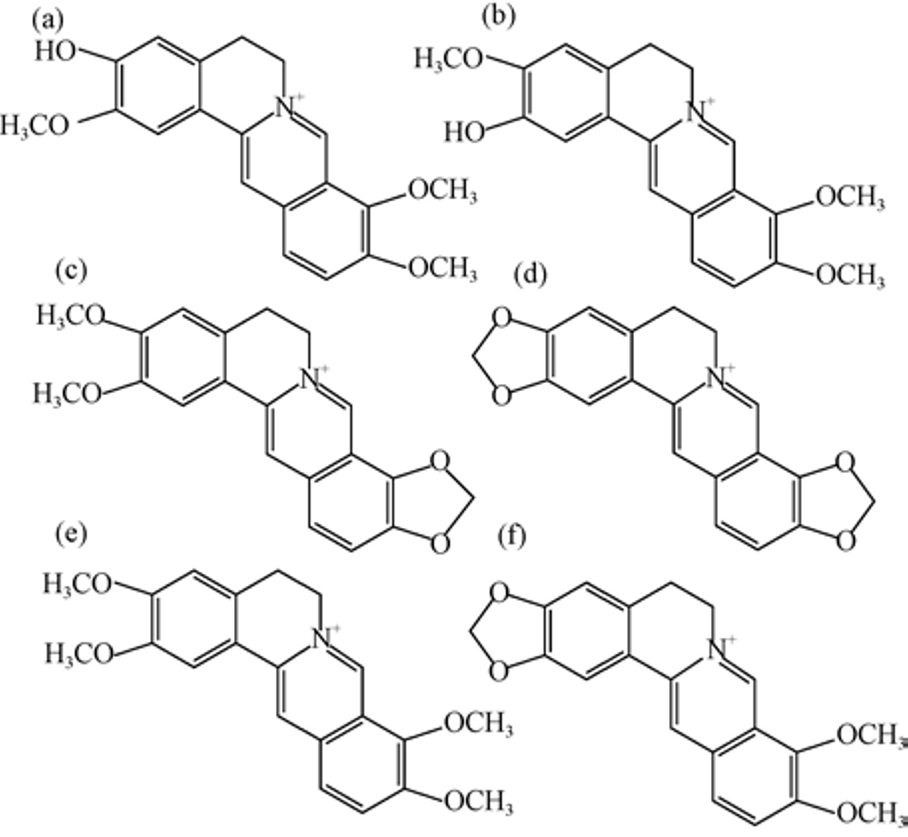
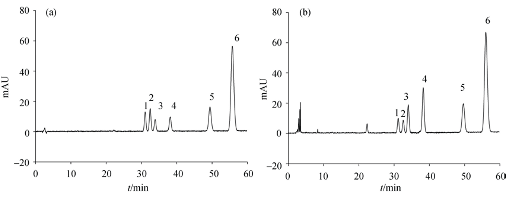
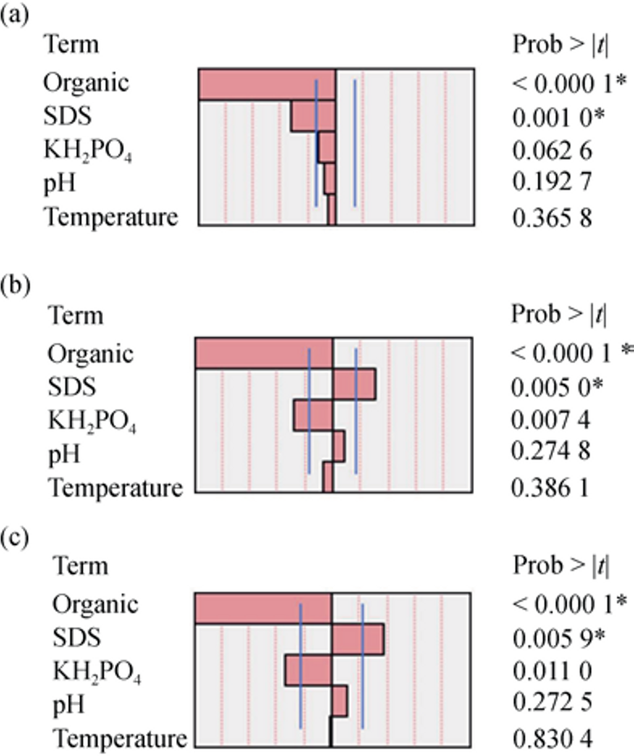
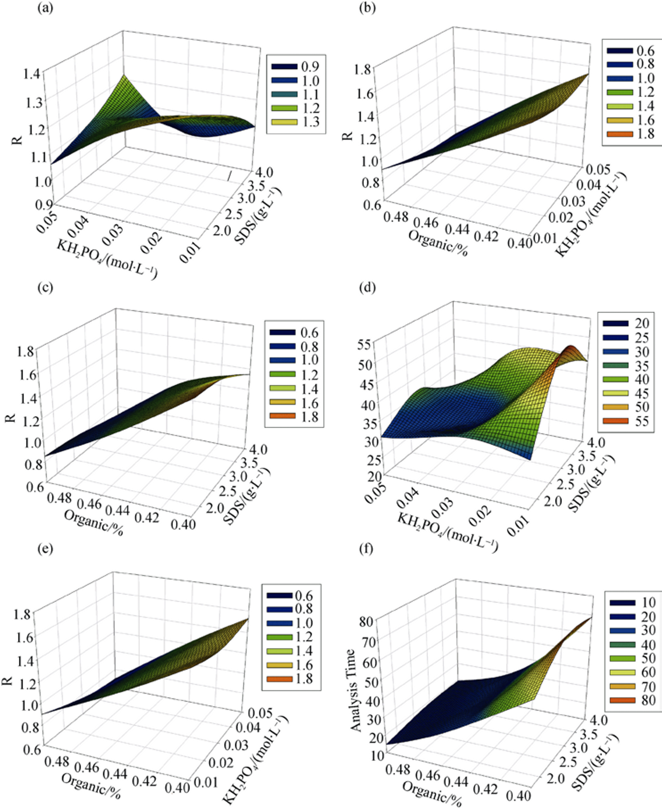
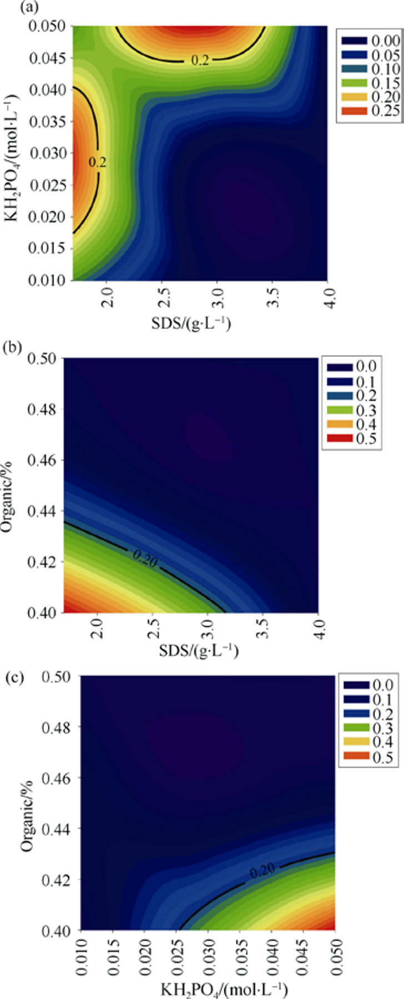
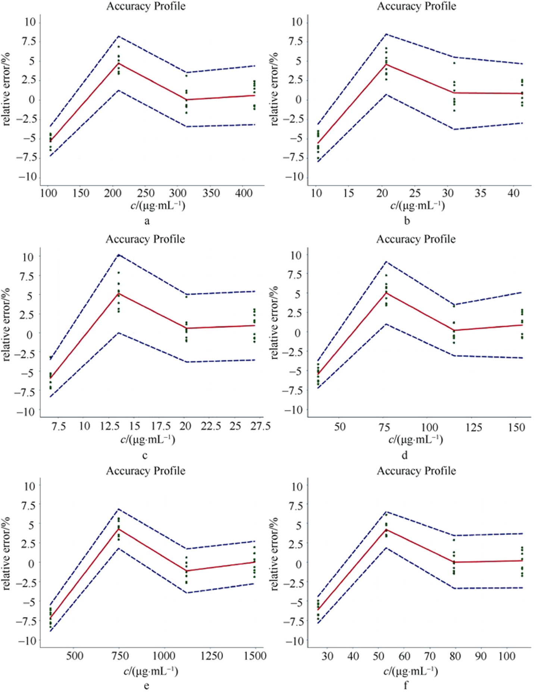

<!-- 方針: 12ページのQbD/ベイズ設計空間 研究論文の全訳密度版。原文構成(序論→材料と方法→結果と考察→結論)に忠実。数値・表(Table1-7)・式(1)-(4)を保持。数式は元PDFのOCRが崩れていたため意味に基づき標準形で再掲。abstractの単位誤記(g·mL⁻¹→g·L⁻¹, mol·mL⁻¹→mol·L⁻¹)はMethodsの正しい単位に統一。「> 補足:」は訳者注。 -->

## 書誌情報

- 標題（原題）: Establishment and reliability evaluation of the design space for HPLC analysis of six alkaloids in Coptis chinensis (Huanglian) using Bayesian approach
- 著者・所属: DAI Sheng-Yun, XU Bing*, ZHANG Yi, LI Jian-Yu, SUN Fei, SHI Xin-Yuan, QIAO Yan-Jiang*（北京中医薬大学 中医薬情報工学研究センター／教育部 中薬製造プロセス制御・新薬開発工学研究センター）
- 掲載誌・巻号・DOI: Chin J Nat Med, 2016, 14(9): 697–708. https://doi.org/10.1016/S1875-5364(16)30083-8
- インパクトファクター: 7.5（Chinese Journal of Natural Medicines, Q1・最新JCR。2016年当時は約2だが、本欄は誌の最新値を記載）
- 受理経過 / ライセンス: Received 2015-04-17 / Available online 2016-09-20。© China Pharmaceutical University, Elsevier
- **原本PDF**: 技術的制約でDriveへ自動アップロードできず、ユーザーに返却済み（`1s2.0S1875536416300838main.pdf`）

> 補足（この論文の位置づけ）: 生薬（黄連）の**HPLC分析法そのものを QbD で設計し、さらにその「設計空間」がどれだけ信頼できるかをベイズ確率で定量する**という、AQbD（分析的QbD）の教科書的実践例。本サイトの DoE/満足度（`doe-desirability-multiresponse-optimization`）・AQbD総説（`medicinal-plants-aqbd-review`）・ベイズ最適化（`bayesian-optimization-chemical-reactions-review`）と直結し、「Plackett–Burman で因子を絞る→Box–Behnken で応答曲面→設計空間→ベイズで信頼性評価→正確性プロファイルで検証」という一連の流れを、生薬の実データで最初から最後まで示している。分離困難なコルンバミンとジャトロリジンの分離という具体的な難所も扱う。

## 要旨（Abstract）

黄連（Coptis chinensis, Huanglian）は常用の漢方生薬で、アルカロイドが最も重要な化学成分である。本研究では、黄連中の6アルカロイドを分離するイソクラティック逆相HPLC（RP-HPLC）法を、QbD（Quality by Design）原則の下で初めて開発した。まず5つのクロマトパラメータで Plackett–Burman 実験計画を組み、臨界分離度・分析時間・ピーク幅を応答として多変量線形回帰でモデル化。結果として、アセトニトリル比率・ドデシル硫酸ナトリウム（SDS）濃度・リン酸二水素カリウム（KH₂PO₄）濃度が統計的に有意（P<0.05）と分かった。次に Box–Behnken 実験計画でこの3因子の交互作用を評価し、全二次モデルを構築して分析設計空間を作成した。さらに設計空間の信頼性を**ベイズ事後予測分布**で推定した。最適分離は アセトニトリル40%・SDS 1.7 g·L⁻¹・KH₂PO₄ 0.03 mol·L⁻¹ で予測された。最後に正確性プロファイル法で本HPLC法を検証した。結果は、QbD概念が黄連の頑健な RP-HPLC 法開発に効率的に使えることを示した。

**キーワード**: 黄連（Coptis chinensis）；Quality by Design（QbD）；ベイズ法；分析設計空間；正確性プロファイル

## 序論（Introduction）

黄連は最も広く使われる漢方生薬の一つで、*Coptis chinensis* Franch.（味連）・*Coptis deltoidea*（雅連）・*Coptis teeta*（雲連）の乾燥根茎に由来する。黄連はアルカロイドに富み、多くは第四級アルカロイドである。主要アルカロイドは **ベルベリン・エピベルベリン・コプチシン・パルマチン・コルンバミン・ジャトロリジン**（Fig. 1）で、同じ基本骨格で置換基位置が異なる。ベルベリン（黄連中に約10%含有）は赤痢菌・ブドウ球菌・連鎖球菌に強い抗菌活性を持つ。コプチシン・パルマチン・エピベルベリンは細胞ペルオキシナイトライト生成の抑制を介した酸化ストレス保護に寄与しうる。コルンバミンとジャトロリジンは異性体対である。よってベルベリン・パルマチン・エピベルベリン・コプチシンが常に主要活性成分・品質管理標的とされる。

既報のHPLC/HPLC-MS/MS法には、移動相中のアルカロイドの形態（酸性溶液ではイオン形、中性/塩基性では分子形）に応じた酸系・塩基系の2つの分離系がある。中国薬局方（2015年版）はイオン交換体を用いる酸系分離を採用するが、黄連の4アルカロイド（ベルベリン・エピベルベリン・コプチシン・パルマチン）のみを定量し、コルンバミンとジャトロリジンは無視している。Kuang らの5アルカロイド同時分析法もコルンバミンとジャトロリジンを分離できない。よって本研究は6アルカロイドをHPLCで分離し、黄連のより良い品質管理法を提供することを目的とする。

従来のクロマト法開発は一度に1因子を変える「OFAT（one factor at a time）」で、多数の実験を要し、因子間相互作用を無視し、固定パラメータの変更が予測不能な影響を与える。これは米国FDAが推奨する **QbD** 概念で解決できる。QbDは当初は製剤開発向けだったが、近年は分析法開発に適用されている（HPLC等の分析法は医薬品の品質管理に使われ、患者安全のため性能を良く設計・理解すべきだから）。

分析的QbDは、分析目標プロファイル（ATP）・重要方法特性（CMA）・重要方法パラメータ（CMP）・**設計空間（DS）**・管理戦略から成る。設計空間は ICH Q8 で「品質を保証すると実証された入力変数・プロセスパラメータの多次元的な組合せと相互作用」と定義され、QbDの鍵となる段階である。ICH Q8 は「設計空間内での操作は変更とみなさない」とも述べる。よってQbDの下では、実行可能な条件は固定パラメータの集合でなく、頑健性を許す多数の適切な操作で満たされた設計空間となる。ただし設計空間の端の一部の解は当初の目標を満たせないことがあり（Edge of Failure）、モデルパラメータの不確実性など設計空間の信頼性に影響する不確実性が存在する。設計空間の信頼性/不確実性の評価に関する規制文書はまだ無く、文献も少数（Benjamin らは Bayesian 法で確率設計空間を構築、Joseph らは DoE＋モンテカルロで頑健性指標を導出）。本研究はベイズ法で黄連HPLC分析の設計空間の信頼性を評価し、多目的設計空間を同時確率分布で構築した。

手順: (1) Plackett–Burman で重要方法パラメータを選抜、(2) Box–Behnken（17実験）で交互作用を検討、(3) 全二次モデルで設計空間を構築しベイズ法で信頼性評価、(4) 全誤差概念に基づく正確性プロファイルで完全バリデーション。

## 材料と方法（Materials and Methods）

**試薬**: ジャトロリジン塩酸塩（純度90.3%）・パルマチン塩酸塩（86.6%）・ベルベリン塩酸塩（86.7%）は中国食品薬品検定研究院、コルンバミン塩酸塩（98%）・エピベルベリン塩酸塩（98%）は四川維克奇、コプチシン塩酸塩（98%）は上海源葉。メタノール・アセトニトリル・リン酸（HPLC級）は Fisher、SDS は Amresco、KH₂PO₄ は北京化工廠。

**生薬**: 黄連根茎（北京同仁堂、lot 201310）を *Coptis chinensis* Franch.（味連）と同定。粉砕し 850±29 μm 篩過。頑健性試験用に雲南・貴州・湖北産の3ロットを使用。

**装置**: Agilent 1100（脱気装置・四元ポンプ・恒温オートサンプラー・恒温カラム室・DAD）。カラムは CAPCELL PAK MGⅡ C18（250 mm × 4.6 mm, 5 μm、資生堂）＋同ガードカラム。

**試料調製**: 黄連粉末 0.2 g をメタノール–塩酸（100:1, V/V）50 mL で 25 ℃・30 分超音波抽出、0.45 μm ろ過、5 μL 注入。

**クロマト条件**: 移動相はアセトニトリル・SDS・KH₂PO₄ 緩衝液（リン酸で pH 調整）のイソクラティック。流速 1 mL·min⁻¹、検出 345 nm。

**カラム選択**: 7カラム（ZORBAX Eclipse XDB-C18／SB-C18／Extend-C18、Spursil C18-EP、CAPCELL PAK MGⅡ C18、Chromegabond WR C18、X-Bridge C18）を、40% ACN＋60% 0.03 mol·L⁻¹ KH₂PO₄＋SDS 1.70 g·L⁻¹、pH 3.0、40 ℃、345 nm で比較。臨界分離度・分析時間・ピーク幅で最適カラムを選定。

**Plackett–Burman 計画**（Table 1）: 5因子（有機相%・pH・カラム温度・SDS濃度・KH₂PO₄濃度）が臨界分離度・分析時間・ピーク幅に与える効果を評価。水準: 有機相 40–50%、pH 3–4、温度 30–40 ℃、SDS 1.7–4.0 g·L⁻¹、KH₂PO₄ 0.01–0.05 mol·L⁻¹。応答目標: 臨界分離度=最大化、分析時間=最小化、ピーク幅=最小化。

**Box–Behnken 計画**（Table 2）: 3水準・中心点5の BBD（17run）で、有機相%・SDS濃度・KH₂PO₄濃度の交互作用と二次効果を、臨界ピークの分離度と分析時間に対し評価（pH 3.0・温度 40 ℃ 固定）。

**設計空間の構築と信頼性評価**: 設計空間は予測応答曲面に基づく。Peterson の指摘する2つの欠陥——(i) モデルパラメータの不確実性を考慮しない、(ii) 多変量回帰の誤差ベクトルの相関構造を考慮しない——を両方扱うためベイズ法を採用。ベイズ事後確率は式(1) Pr(**y**∈A | **x**, data)（**x**=プロセス制御パラメータ、**y**=応答、A=規定境界の許容領域、data=全実験データ）。設計空間は 式(2) {**x** : Pr(**y**∈A | **x**, data) ≥ π}（π=設計空間が保つべき品質保証の信頼度）。応答の不確実性はモンテカルロで推定。

**バリデーション**: 設計空間内の最適法を**正確性プロファイル（AP）**で検証。ICH Q2(R1) が要求する直線性・範囲・正確性・精度・LOD・LOQ を AP から取得。3日×4濃度×3反復＝36試行の全因子計画。黄連抽出液の4濃度を 2・4・6・8 mg·mL⁻¹ に設定（6成分濃度は生薬中含量比から算出）。精度・真度を同時に扱う正確性プロファイルを、分散分析と β期待許容区間で構築（e-noval V3.0）。

## 結果と考察（Results and Discussion）

### カラム選択

CAPCELL PAK MGⅡ C18 が最初の3ピーク（ジャトロリジン・コルンバミン・エピベルベリン）を良好に分離（R₁,₂・R₂,₃ ともに >1.5、理論段数が最大）。X-Bridge C18 と Spursil C18-EP はジャトロリジンとコルンバミンを分離できず、Agilent 3種は同ペアの分離度が 1.5 未満、Chromegabond WR が最も悪かった。よって CAPCELL PAK MGⅡ C18 を採用。

**Table 3. カラム比較（臨界分離度・ピーク幅・理論段数）**

| カラム | R₁,₂ | R₂,₃ | ピーク幅(W2) | 理論段数(N) |
|---|---|---|---|---|
| ZORBAX Eclipse XDB-C18 | 1.45 | 1.96 | 0.47 | 18 276 |
| ZORBAX SB-C18 | 1.46 | 1.78 | 0.54 | 15 603 |
| ZORBAX Extend-C18 | 1.39 | 1.71 | 0.38 | 17 514 |
| Spursil C18-EP | − | 2.47 | − | − |
| Chromegabond WR C18 | 1.28 | 1.18 | 0.40 | 15 722 |
| X-Bridge C18 | − | − | − | − |
| **CAPCELL PAK MGⅡ C18** | **1.62** | **1.67** | 0.50 | **22 887** |

### Plackett–Burman（因子選抜）

Pareto チャート（Fig. 3）で重要因子を判定。有機相%の低下は臨界分離度（R₁,₂）・分析時間・第1ピーク幅を増加させた。SDS濃度は分離度と逆相関（1.7→4.0 g·L⁻¹ で分離度 1.71→0.65 に低下、P<0.05で有意）。分析時間は SDS増で増加、有機相%増・KH₂PO₄増で短縮。6ピークの幅も分析時間と同傾向。結論として **有機相%・SDS濃度・KH₂PO₄濃度が全応答で有意**。温度40℃・pH 3.0 を固定し、この3因子で設計空間を構築。

### Box–Behnken（応答曲面）

多変量回帰で臨界分離度（Y1）・分析時間（Y2）の全二次モデル（式3: Y = β₀ + β₁X₁ + β₂X₂ + β₃X₃ + β₄X₁X₂ + β₅X₁X₃ + β₆X₂X₃ + β₇X₁² + β₈X₂² + β₉X₃²、X₁=SDS濃度・X₂=KH₂PO₄濃度・X₃=有機相%）を構築。

**Table 4. 2応答の決定係数**（原表の R²pred/R²adj ラベルは原文表記のまま転記）

| 指標 | 臨界分離度(R₁,₂) | 分析時間 |
|---|---|---|
| R² | 0.984 1 | 0.988 3 |
| R²pred | 0.963 7 | 0.973 3 |
| R²adj | 0.768 4 | 0.813 6 |

両モデルとも Prob>F <0.05 で有意。不適合(lack of fit) の P値は Y1=0.0177・Y2<0.0001 で、より高次項が必要な可能性を示す。

**Table 5. 回帰係数とP値**（X₁=SDS濃度、X₂=KH₂PO₄濃度、X₃=有機相%。\*P<0.05）

| 項 | 臨界分離度 係数 (P) | 分析時間 係数 (P) |
|---|---|---|
| 定数 | 1.19 (<0.0001\*) | 32.48 (<0.0001\*) |
| X₁ | −0.068 (0.0085\*) | 2.53 (0.0572) |
| X₂ | −0.049 (0.0346\*) | −7.11 (0.0004\*) |
| X₃ | −0.37 (<0.0001\*) | −24.30 (<0.0001\*) |
| X₁X₂ | 0.10 (0.0060\*) | −4.80 (0.0186\*) |
| X₁X₃ | 0.023 (0.4215) | −2.39 (0.1722) |
| X₂X₃ | −0.040 (0.1728) | 5.89 (0.0072\*) |
| X₁² | −0.030 (0.2738) | −2.64 (0.1283) |
| X₂² | 0.022 (0.4201) | 2.46 (0.1533) |
| X₃² | −0.033 (0.2397) | 9.59 (0.0004\*) |
| 不適合 | (0.0177\*) | (<0.0001\*) |

3因子すべてが臨界分離度に有意に影響し、SDS濃度とKH₂PO₄濃度の交互作用が有意（P=0.006）。応答曲面（Fig. 4）から、低SDS・低KH₂PO₄で高分離度、低SDS・高KH₂PO₄で短分析時間、高有機相%で短分析時間・低分離度と推定。

### 設計空間の構築

分析目標は2つ——(1) 6アルカロイド（特にコルンバミンとジャトロリジン）のベースライン分離、(2) 分析時間短縮による効率向上。臨界分離度（Rcrit）と分析時間（t）を CQA とし、多目的設計空間を 式(4) DS = {**x₀**∈χ : Pr(Rcrit>λ₁, t<λ₂ | θ) ≥ π} で定義（λ₁・λ₂=各基準の許容限界、π=品質水準、θ=モデル推定パラメータ）。R₁,₂ >1.5、λ₂=60 min。グリッド探索で全実験領域のベイズ同時事後予測確率を、各格子点で**モンテカルロ1万回**により算出。

確率閾値の標準が無いため π=20% を基本とした（Fig. 5、設計空間を黒線で囲む）。低い確率と小さな設計空間は、黄連のジャトロリジンとコルンバミンの分離が難しいことを示し、既報の多くが両者を分離できず1ピークとして扱った理由を説明する。

ただし低確率は分離不可能を意味せず、一定の制約下で分離できることを示す。**最適分離は SDS 1.7 g·L⁻¹・KH₂PO₄ 0.03 mol·L⁻¹・有機相40% で予測され、この点でのベイズ同時事後予測確率は 51%** であった。

### バリデーション（正確性プロファイル）

正確性プロファイルは全誤差理論に基づき、真度・精度・正確性を扱う。

- **真度**（相対バイアス%）: 4濃度×3日×3反復。6成分の相対バイアスは最低濃度を除き 5% 未満。ベルベリン（Table 6）の最低濃度の相対バイアス絶対値は 5.3% で 5% 超。エピベルベリンは最初の2濃度で 5–6%（濃度範囲がやや狭い）。
- **精度**（RSD%）: 6成分・全濃度で併行精度・室内再現精度とも 2% 未満。
- **正確性**（全誤差、許容限界±10%、生薬は複雑なため）: 90% β期待許容区間の上下限が全濃度範囲で ±10% 内に収まる（コルンバミンの第2濃度がわずかに逸脱）。正確と見なせる範囲: ベルベリン 104.6–418.3、ジャトロリジン 10.33–41.33、コルンバミン 13.80–26.98、エピベルベリン 38.38–153.5 μg·mL⁻¹、コプチシン 0.3735–1.494 mg·mL⁻¹、パルマチン 73.66–105.9 μg·mL⁻¹。
- **LOQ**（正確性限界と β期待許容限界の交点、μg·mL⁻¹）: ベルベリン 104.6・ジャトロリジン 10.33・コルンバミン 13.80・エピベルベリン 38.38・コプチシン 373.5・パルマチン 73.66。
- **LOD**（μg·mL⁻¹）: ベルベリン 60.12・ジャトロリジン 6.135・コルンバミン 4.291・エピベルベリン 23.50・コプチシン 225.4・パルマチン 14.15。
- **直線性**: 6成分の検量式（例 ベルベリン Y=−1.861+1.014X）、r はすべて >0.9980。

**Table 6. ベルベリンのバリデーション結果（抜粋、3系列×3反復）**

| 濃度(μg·mL⁻¹) | 相対バイアス(%) | 併行RSD(%) | 室内再現RSD(%) | 90%β期待許容区間(%) |
|---|---|---|---|---|
| 104.6 | −5.3 | 0.72 | 0.87 | [−7.2, −3.4] |
| 209.1 | 4.8 | 0.70 | 1.3 | [1.3, 8.2] |
| 313.8 | 0.077 | 1.2 | 1.6 | [−3.4, 3.6] |
| 418.3 | 0.63 | 1.0 | 1.6 | [−3.2, 4.4] |

（範囲 104.6–418.3 μg·mL⁻¹、傾き 1.014、切片 −1.861、r=0.9985、LOQ 104.6、LOD 60.12 μg·mL⁻¹）

### 頑健性（試料分析）

雲南・貴州・湖北産の3試料（試験濃度 2 mg·mL⁻¹）で頑健性を評価。5パラメータ（pH 3.00±0.1、温度 40±2 ℃、有機相 40.5%±0.5%、SDS 1.75±0.05 g·L⁻¹、KH₂PO₄ 0.03±0.002 mol·L⁻¹）を3水準（+1/0/−1）で変動させ、3³×… 全因子計画から7条件を無作為選択して分析時間・臨界分離度を比較（Table 7）。3試料の6成分すべてが分離度 >1.5・分析時間 <60 min で分離され、小さなパラメータ変動に対し頑健と確認。

## 結論（Conclusions）

QbD概念に基づき、黄連の6アルカロイドを分離する頑健な RP-HPLC 法を開発した。Plackett–Burman で重要3因子を選抜、Box–Behnken で全二次モデルを構築し設計空間を作成、**ベイズ事後予測分布でモデル不確実性と応答間相関を同時に考慮して設計空間の信頼性を定量**した。最適点（ACN40%・SDS1.7g/L・KH₂PO₄0.03mol/L）で両目標同時達成確率51%、正確性プロファイルで全6成分を検証。QbDが黄連の頑健な分析法開発に効率的に使えることを示した。

## 参考文献

1. China Pharmacopoeia Committee. Pharmacopoeia of the People’s Republic of China [M]. China Medical Science Press, Beijing, 2010.

2. Prieto JM, Recio MC, Giner RM, et al. Influence of traditional Chinese anti-inflammatory medicinal plants on leukocyte andplatelet functions [J]. J Pharm Pharmacol, 2003, 55(9): 1275-1282.

3. Wang H, Zhang F, Ye F, et al. The effect of Coptis chinensis on the signaling network in the squamous carcinoma cells [J]. Front Biosci, 2011, 3: 326-340.

4. Chin LW, Cheng YW, Lin SS, et al. Anti-herpes simplex virus effects of berberine from Coptidis rhizoma, a major component of a Chinese herbal medicine, Ching-Wei-San [J]. Arch Virol, 2010, 155(12): 1933-1941.

5. Sun J, Ma JS, Jin J, et al. Qualitative and quantitative determination of the main components of huanglianjiedu decoction by HPLC-UV/MS [J]. Acta Pharm Sin, 2006, 41(4): 380-384.

6. Yokozawa T, Satoh A, Cho EJ, et al. Protective role of Coptidis Rhizoma alkaloids against peroxynitrite-induced damage to renal tubular epithelial cells [J]. J Pharm Pharmacol, 2005, 57(3): 367-374.

7. Zhang Y, Wu W, Han F, et al. LC/MS/MS for identification of in vivo and in vitro metabolites of jatrorrhizine [J]. Biomed Chromatog, 2008, 22(12): 1360-1367. YUAN Si-Yuan, et al. / Chin J Nat Med, 2016, 14(9): 697−708 – 708 –

8. Ma HD, Wang YJ, Guo T, et al. Simultaneous determination of tetrahydropalmatine, protopine, and palmatine in rat plasma by LC-ESI-MS and its application to a pharmacokinetic study [J]. J Pharm Biomed Anal, 2009, 49(2): 440-446.

9. Deng YT, Liao QF, Li SH, et al. Simultaneous determination of berberine, palmatine and jatrorrhizine by liquid chromatography-tandem mass spectrometry in rat plasma and its application in a pharmacokinetic study after oral administration of coptis-evodia herb couple [J]. J Chromatogr B, 2008, 863(2): 195-205.

10. Zhu YH, Tong L, Zhou SP, et al. Simultaneous determination of active flavonoids and alkaloids of Tang-Min-Ling-Pill in rat plasma by liquid chromatography tandem mass spectrometry [J]. J Chromatogr B Analyt Technol Biomed Life Sci, 2012, 904: 51-58.

11. Zeng Y, Huo P, Xu Y. Simultaneous determination of berberine, palmatine, matrine, catechin and baicalin in Funing Shuan by micellar electrokinetic capillary chromatography-electrospray ionization mass spectrometry [J]. Chin J Chrom, 2010, 28(7): 677-681.

12. Sun CL, Li J, Wang X, et al. Preparative separation of quaternary ammonium alkaloids from Coptis chinensis Franch. by pH-zone-refining counter-current chromatography [J]. J Chromatogr A, 2014, 1370: 156-161.

13. Kuang YH, Zhu JJ, Wang ZM, et al. Simultaneous quantitative analysis of five alkaloids in rhizoma of Coptis chinensis by multi-components assay by single marker [J]. Chin Pharm J, 2009, 44(5): 390-394.

14. International conference on harmonization of technical requirements for registration of pharmaceuticals for human use. ICH harmonized tripartite guideline, Pharmaceutical Development Q8 (R1) [C]. ICH, Geneva, Switzerland, 2008.

15. Lawrence XY. Pharmaceutical quality by design: product and process development, understanding and control [J]. Pharm Res, 2008, 25(4): 781-791.

16. Lee SL, Raw AS, Yu L. Significance of drug substance physicochemical properties in regulatory quality by design [J]. Drugs Pharm Sci, 2008, 178: 571.

17. Mhatre R, Rathore AS. Quality by design: an overview of the basic concepts. In quality by design for biopharmaceuticals [M]. Wiley, New York, 2009: 1-8.

18. Gavin PF, Olsen BA. A quality by design approach to impurity method development for atomoxetine hydrochloride (LY139603) [J]. J Pharm Biomed Anal, 2008, 46(3): 431-441.

19. Pohl M, Schweitzer M, Hansen G, et al. Implications and opportunities of applying the principles of QbD to analytical measurements [J]. Pharm Technol Eur, 2010, 22(2): 29-36.

20. Vogt FG, Kord AS. Development of quality by design analytical methods [J]. J Pharm Sci, 2011, 100(3): 797-811.

21. Borman P, Roberts J, Jones C, et al. The development phase of an LC method using QbD principles [J]. Sep Sci, 2010, 2: 2-8.

22. Hanna-Brown M, Borman P, Bale S, et al. Development of chromatographic methods using QbD principles [J]. Sep Sci, 2010, 2: 12-20.

23. International conference on harmonization (ICH) of Technical Requirements for registration of pharmaceuticals for human use. Topic Q8 (R2): Pharmaceutical Development [C]. ICH, Geneva, Switzerland, 2009.

24. Little TA. Evaluating design margin, edge of failure, and process capability [J]. Bio Pharm International, 2014, 27(9): 46-49.

25. Debrus B, Lebrun P, Ceccato A, et al. Application of new methodologies based on design of experiments, independent component analysis and design space for robust optimization in liquid chromatography [J]. Anal Chim Acta, 2011, 691(1): 33-42.

26. Joseph T, Patrick HL, Richard V. A qality-by-dsign methodology for rapid LC method development, Part III [J]. Lc Gc N Am, 2009, 27: 328-339.

27. Hubert P, Nguyen-Huu JJ, Boulanger B, et al. Harmonization of strategies for the validation of quantitative analytical procedures a SFSTP proposal. Part IV, examples of application [J]. J Pharm Biomed Anal, 2008, 48(3): 760-771.

28. Rozet E, Wascotte V, Lecouturier N, et al. Improvement of the decision efficiency of the accuracy profile by means of a desirability function for analytical methods validation: application to a diacetyl-monoxime colorimetric assay used for the determination of urea in transdermal iontophoretic extracts [J]. Anal Chim Acta, 2007, 591(2): 239-247.

29. Wrisley L, Pfizer. Column selectivity database aplication to HPLC method development: a QbD perspective [C]. Pittsburgh Conference, Orlando, USA, 2010.

30. Li W, Rasmussen HT. Strategy for developing and optimizing liquid chromatography methods in pharmaceutical development using computerassisted screening and Plackett-Burman experimental design [J]. J Chromatogr A, 2003, 1016(2): 165-180.

31. Peterson JJ. A Bayesian approach to the ICH Q8 definition of design space [J]. J Biopharm Stat, 2008, 18(5): 959-975.

32. Peterson JJ. A posterior predictive approach to multiple response surface optimization [J]. J Qual Technol, 2004, 36(2): 139-153.

33. Chen MH, Shao QM, Ibrahim JG. Monte Carlo methods in bayesian computation [M]. Springer-Verlag, New York, 2000: 15.

34. Awotwe-Otoo D, Agarabi C, Faustino PJ, et al. Application of quality by design elements for the development and optimization of an analytical method for protamine sulfate [J]. J Pharmaceut Biomed Anal, 2012, 62: 61-67.

35. Lebrun P, Govaerts B, Debrus B, et al. Development of a new predictive modelling technique to find with confidence equivalence zone and design space of chromatographic analytical methods [J]. Chemom Intell Lab Sys, 2008, 91(1): 4-16.

36. Debrus B, Lebrun P, Ceccato A, et al. A new statistical method for the automated detection of peaks in UV-DAD chromatograms of a sample mixture [J]. Talanta, 2009, 79(1): 77-85.

37. Center for Biologics Evaluation and Research (CBER), US department of health and human services, Food and Drug Administration, Center for Drug Evaluation and Research (CDER). Guidance for industry: bioanalytical method validation [M]. Rockville, 2001.

38. Hubert P, Nguyen-Huu JJ, Boulanger B, et al. Harmonization of strategies for the validation of quantitative analytical procedures-a SFSTP proposal Part II [J]. J Pharm Biomed Anal, 2007, 45(1): 82-96.

39. Feinberg M, Boulanger B, Dewe W, et al. New advances in method validation and measurement uncertainty aimed at improving the quality of chemical data [J]. Anal Bioana Chem, 2004, 380(3): 502-514.

40. Alejandro CO. Practical guidelines for reporting results in singleand multi-component analytical calibration: a tutorial [J]. Anal Chim Acta, 2015, 868: 10-12. Cite this article as: DAI Sheng-Yun, XU Bing, ZHANG Yi, LI Jian-Yu, SUN Fei, SHI Xin-Yuan, QIAO Yan-Jiang. Establishment and reliability evaluation of the design space for HPLC analysis of six alkaloids in Coptis chinensis (Huanglian) using Bayesian approach[J]. Chin J Nat Med, 2016, 14(9): 697-708.

## 訳者補足（実務者向けの読みどころ）

> 以下は原文に無い、実務観点の補足である（本文の訳と混ぜない）。

- **AQbDの“フルコース”実装**: 「PB でスクリーニング（5因子→重要3因子）→ BBD で応答曲面 → 設計空間 → ベイズで信頼性評価 → 正確性プロファイルで検証 → 産地違いで頑健性確認」という一連を、生薬の実データで通しで見せている。生薬HPLC法を QbD で組む際のテンプレートとしてそのまま使える。
- **「設計空間の信頼性」をベイズで測る意味**: 応答曲面で「良さそうな領域」を描くだけでは、モデルの不確実性や複数応答の相関を見落とす（Edge of Failure）。ベイズ事後予測＋モンテカルロで「その条件で目標を同時に満たす確率」を数値化する発想は、規格の頑健性を確率で語る現代的QC（本サイトの `alectinib-hplc-bbd-uncertainty-greenness` の測定不確かさ、`bayesian-optimization-chemical-reactions-review` の事後確率と同根）。
- **難所を正直に**: コルンバミン/ジャトロリジンの分離は本質的に難しく、最適点でも同時達成確率51%・設計空間は小さい——「QbDで無理が消える」のではなく「どこがどれだけ難しいかを定量できる」のがQbDの価値、という誠実な結論。
- **正確性プロファイル（AP）**: 真度（バイアス）と精度（RSD）を1枚の図に統合し、β期待許容区間が許容限界（±10%）内に収まるかで合否を判定。生薬のように濃度範囲が広い成分の妥当性評価に向く。
- **用語**: QbD=Quality by Design、ATP=分析目標プロファイル、CMA/CMP=重要方法特性/パラメータ、設計空間=品質保証が実証された操作条件の多次元領域、PB=Plackett–Burman（スクリーニング）、BBD=Box–Behnken（応答曲面）、ベイズ事後予測分布=観測データからパラメータ不確実性込みで将来応答を予測する分布、β期待許容区間=測定値が許容範囲に入る期待割合の区間、SDS=ドデシル硫酸ナトリウム（イオンペア試薬）。
