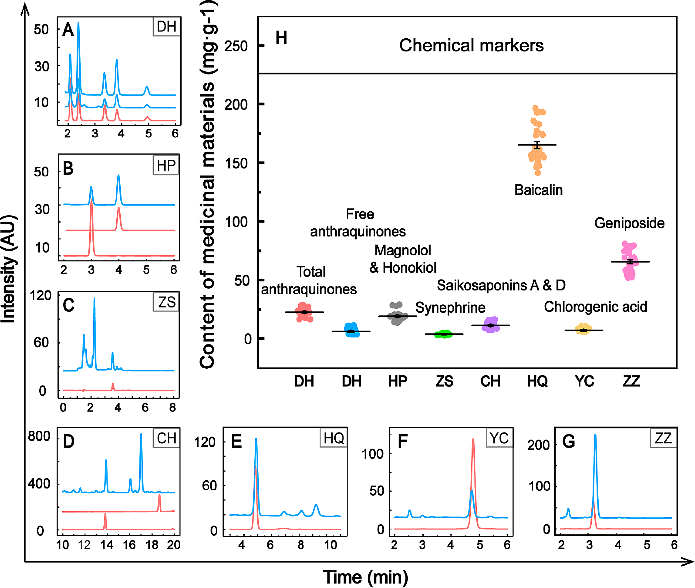
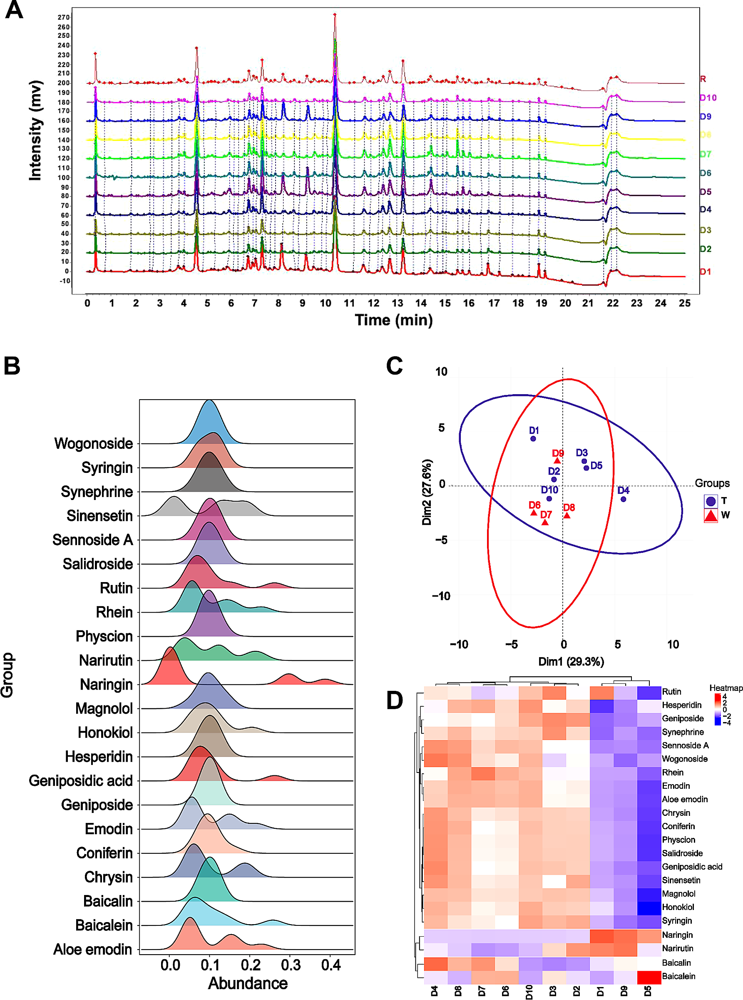
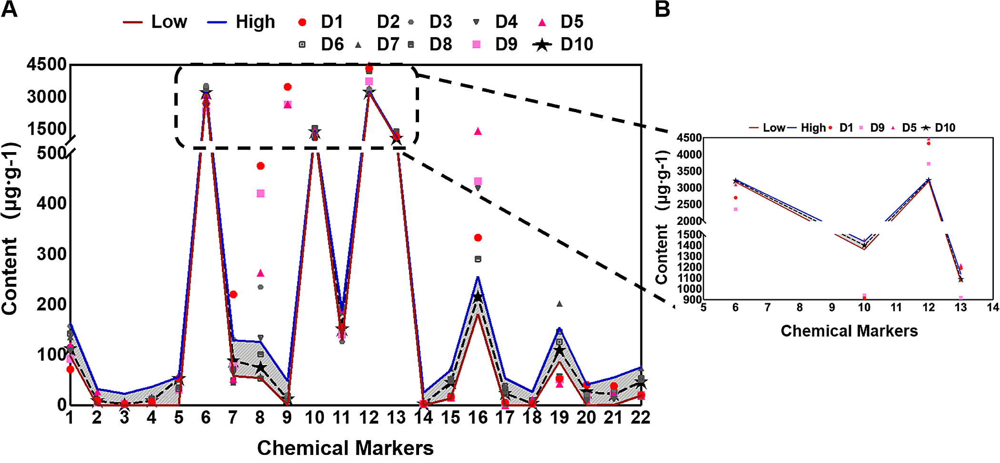
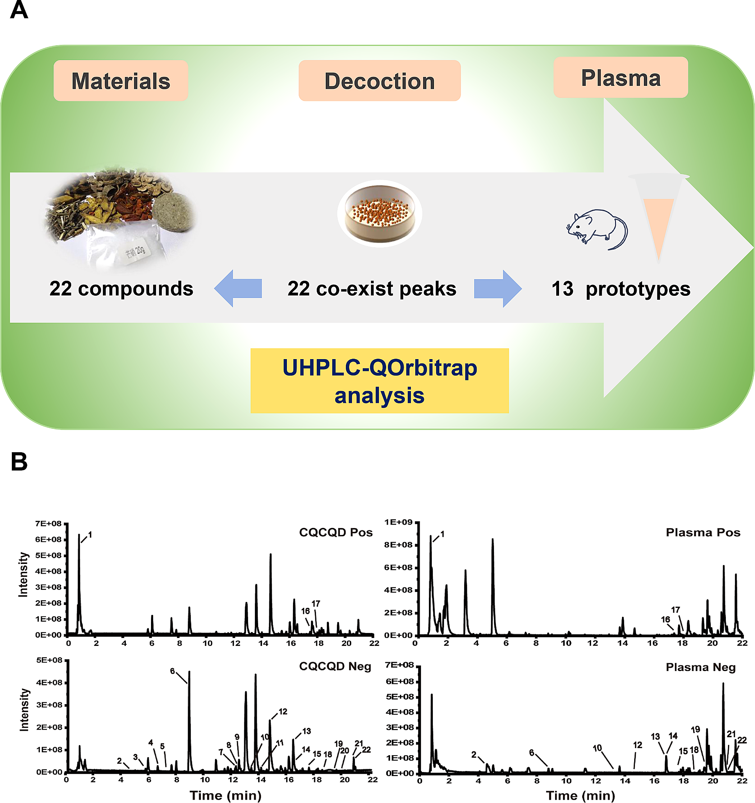
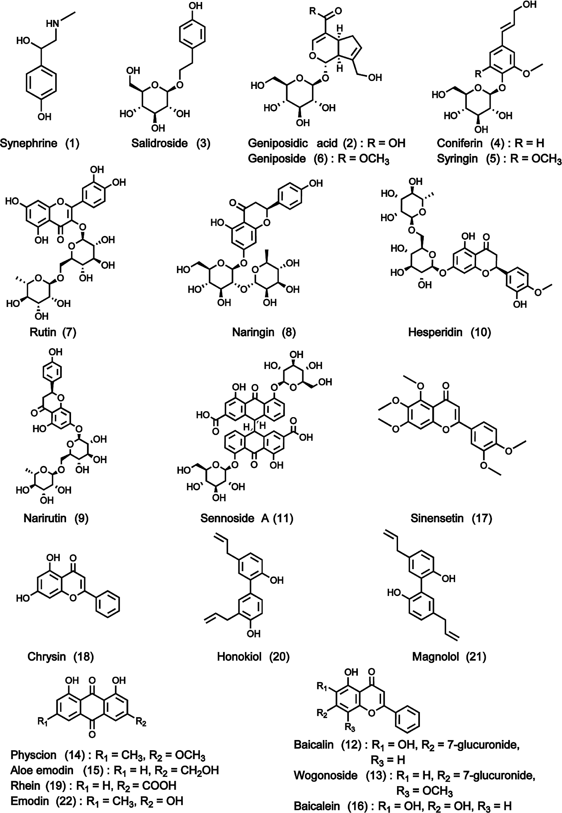
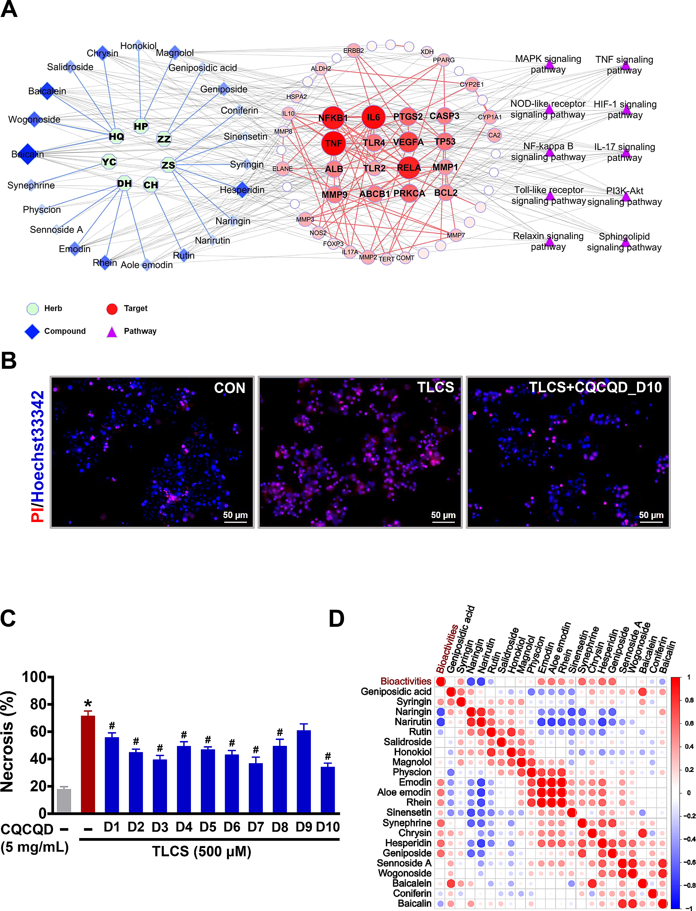
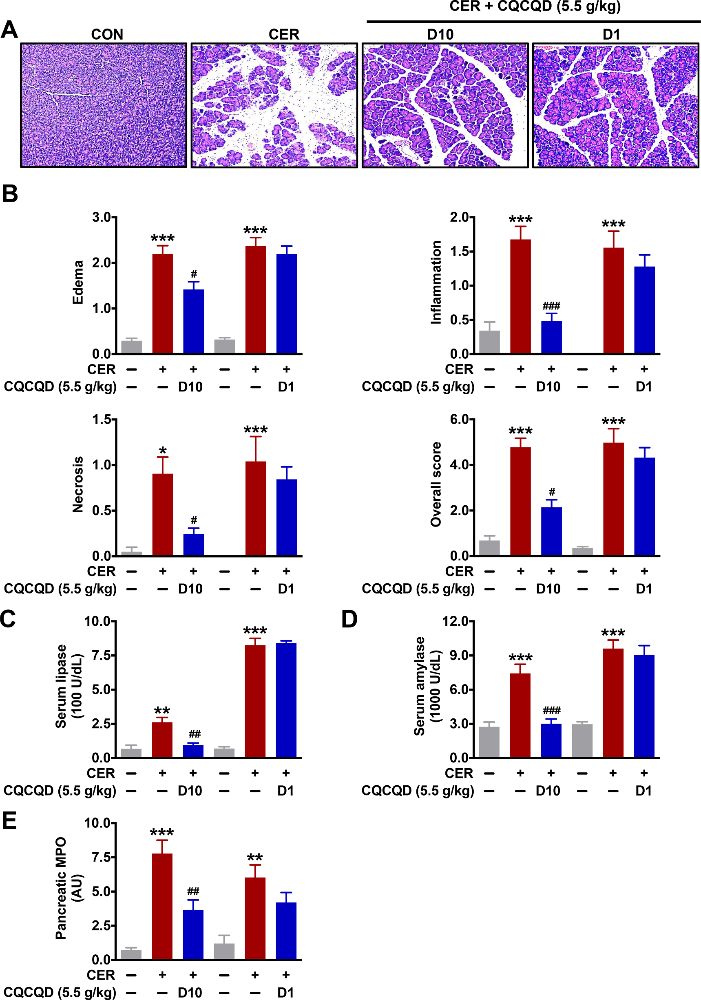

<!-- 方針: ほぼ全訳＋必要に応じた補足。原文構成に沿って訳出。「> 補足:」は訳者注。 -->

## 書誌情報

- 原題: A multi-strategy platform for quality control and Q-markers screen of Chaiqin chengqi decoction
- 著者: Ge Liang, Jingyu Yang, Tingting Liu, Shisheng Wang ほか（四川大学華西医院 中西医結合科／四川省膵炎センター ほか, 中国。Lihui Deng・Dan Du・Qing Xia が責任著者）
- 掲載: *Phytomedicine* 85 (2021) 153525. https://doi.org/10.1016/j.phymed.2021.153525
- インパクトファクター: **約7.9**（*Phytomedicine*, JCR 2024 / Clarivate。出典により6.7〜8.8と幅があり要確認）
- 受理経過: オンライン公開 2021-02-20

> 補足: CQCQD = 柴芩承気湯（Chaiqin chengqi decoction。大承気湯 DCQD を基礎に発展した方剤）。AP = 急性膵炎、SAP = 重症急性膵炎、CER = セルレイン。Q-marker = 品質マーカー。本論文は分析化学＋ケモメトリクス＋in vivo薬効を統合した研究論文。

## 要旨（Abstract）

**背景:** 急性膵炎(AP)は罹患・死亡率の高い膵の炎症性疾患。CQCQDは華西医院で数十年AP治療に有効と実証されてきたが、多数の植物化学成分を含むため頑健な品質評価が課題。

**目的:** 多戦略分析法でCQCQDの品質一貫性を評価し、薬物特性・薬効特性に基づいて潜在的Q-markerを同定し、世界的に受容される医薬として確立を目指す。

**方法:** 構成生薬を中国薬局方に従い分析。抽出工程を **直交配列 L9(3⁴)** で最適化(液固比・浸漬時間・抽出時間・抽出回数の3水準)。UHPLC指紋と多成分絶対定量＋類似度・階層クラスタリング(HCA)・主成分分析(PCA)で **10バッチ** を評価。AP治療の基本特性の系統解析から、化学マーカーの品質伝達と薬効を通じて潜在的Q-markerを提案。UHPLC-Q-Orbitrap MSと **セルレイン誘発APマウスモデル**(臨床等価用量)で品質評価バッチを検証。検証バッチと他バッチの定量情報から線形回帰で有効含量を予測。

**結果:** 原料の化学マーカー・理化学指標は薬局方規格に適合。**22の共存指紋ピーク** を選定、類似度 **0.946〜0.990**(D10が最高)。HCAは10バッチを2群(D10型7バッチ・D1型3バッチ)に分類。全10バッチで壊死は60%未満に低減、最良はD10(約40%)。スペクトル−薬効(Pearson)相関で **エモジン・レイン・アロエエモジン・ゲニポシド・ヘスペリジン・クリシン・シリンギン・シネフリン・ゲニポシド酸・マグノロール・フィスシオン・シネンセチン** 等が抗膵炎活性と相関。D1は臨床等価用量で無効。ナリンギン・ナリルチン・バイカリンはD1・D5・D9で予測上限を超過。

**結論:** 原料が適格でも臨床効果は **Q-markerの適正含量域** に依存する。一次スクリーニングでエモジン・レイン・アロエエモジン・マグノロール・ヘスペリジン・シネフリン・バイカレイン・ゲニポシドが重要Q-markerと判断された。CQCQDの高一貫性バッチ生産に向けた実行可能なプラットフォームを提案する。

## 1. 序論（Introduction）

APは膵の炎症性疾患で、重症化(SAP)すると多臓器不全を伴い死亡率が高い。CQCQDは大承気湯(DCQD)を基礎に発展し、SAPで腸管運動の改善・全身炎症の軽減が示されている。化学指紋と多成分マーカー解析は生薬・製剤のQCに有力で、Q-markerは薬物特性・薬効に基づく品質指標として規格化の鍵となる。

## 2. 材料と方法（Materials and Methods）

- **抽出最適化**: 直交配列 L9(3⁴)で 液固比・浸漬時間・抽出時間・抽出回数 を最適化。
- **UHPLC**: Waters BEH C18（2.1 × 100 mm, 1.7 μm）。MS用注入量 1 μL。UHPLC-Q-Orbitrap MS で成分同定・定量。
- **化学計量**: 類似度評価・HCA・PCA で10バッチを解析。Pearson相関でスペクトル−薬効関係を解析。
- **薬効モデル**: セルレイン誘発APマウスモデル(臨床等価用量)で品質評価バッチを検証。膵壊死等を評価。
- **含量予測**: 検証バッチと他バッチの定量情報から線形回帰で有効含量を予測。

## 3. 結果（Results）

### 原料・指紋・化学計量

7種の構成生薬(柴胡 CH・大黄 DH・厚朴 HP・黄芩 HQ・茵陳 YC・梔子 ZZ ほか)中の化学マーカー・理化学指標は薬局方規格に適合(例: 茵陳のクロロゲン酸、梔子のゲニポシド)。**22の化学マーカー** を定量し、UHPLC指紋で **22共存ピーク**、類似度 **0.946〜0.990**(D10最高)。HCAは10バッチを2主群に分類(D10代表の7バッチ・D1代表の3バッチ)。バッチ間で含量変動が大きい成分が存在。

### 薬効と Q-marker 選定

セルレイン誘発APマウスで全10バッチが膵壊死を60%未満に低減、最良はD10(約40%)。スペクトル−薬効相関(Pearson)で エモジン・レイン・アロエエモジン・ゲニポシド・ヘスペリジン・クリシン・シリンギン・シネフリン・ゲニポシド酸・マグノロール・フィスシオン・シネンセチン等が抗膵炎活性と相関。一方 **D1は臨床等価用量で無効**。ナリンギン・ナリルチン・バイカリンはD1・D5・D9で予測上限を超過。これらの含量域の逸脱が品質差を生んだ。

## 4. 考察・結論（Discussion / Conclusion）

原料が薬局方適合でも、臨床効果はQ-markerの **適正含量域** に依存する——これが本研究の核心的知見。一次スクリーニングで **エモジン・レイン・アロエエモジン・マグノロール・ヘスペリジン・シネフリン・バイカレイン・ゲニポシド** が重要Q-markerと判断された。品質伝達(原料→製剤)と成分−機能相関に基づくQ-marker選定により、CQCQDの高一貫性バッチ生産への実行可能なプラットフォームを提示した。

> 補足（実務的示唆）: 「原料が規格適合＝最終製剤が有効」とは限らず、**有効性は指標成分が“適正な含量範囲”に収まっているかで決まる**、という点が実務上重要。単なる下限規格(○○以上)だけでなく、上限・範囲管理(naringin等の過剰も品質差要因)や、薬効モデルで紐づいたQ-marker(エモジン・レイン・マグノロール等)の含量域設定が、ロット間一貫性の確保に有効と示唆される。

## 参考文献

- Arceusz, A., Wesolowski, M., 2013. Quality consistency evaluation of Melissa officinalis L. commercial herbs by HPLC fingerprint and quantitation of selected phenolic acids. J. Pharm. Biomed. Anal. 83, 215–220.

- Bai, G., Zhang, T., Hou, Y., Ding, G., Jiang, M., Luo, G., 2018. From quality markers to data mining and intelligence assessment: a smart quality-evaluation strategy for traditional Chinese medicine based on quality markers. Phytomedicine 44, 109–116.

- Bao, H., Yang, H., Wang, F., Zhou, K., Yang, Y., Xu, Y., Li, L., 2020. HPLC fingerprint combined with multicomponent quantification as an efficient method for quality evaluation of pharbitidis semen. Nat. Prod. Commun. 15 https://doi.org/10.1177/ 1934578X20931642.

- Baron, T.H., DiMaio, C.J., Wang, A.Y., Morgan, K.A., 2020. American gastroenterological association clinical practice update: management of pancreatic necrosis. Gastroenterology 158, 67–75. .e61.

- Carvalho, K.M., Morais, T.C., de Melo, T.S., de Castro Brito, G.A., de Andrade, G.M., Rao, V.S., Santos, F.A., 2010. The natural flavonoid quercetin ameliorates cerulein- induced acute pancreatitis in mice. Biol. Pharm. Bull. 33, 1534–1539.

- Chatila, A.T., Bilal, M., Guturu, P., 2019. Evaluation and management of acute pancreatitis. World J. Clin. Cases 7, 1006–1020.

- Crockett, S.D., Wani, S., Gardner, T.B., Falck-Ytter, Y., Barkun, A.N., American Gastroenterological Association Institute Clinical Guidelines, C., 2018. American Gastroenterological Association Institute guideline on initial management of acute pancreatitis. Gastroenterology 154, 1096–1101.

- Cui, W., Li, X., Zhou, S., Weng, J., 2006. Investigation on process parameters of electrospinning system through orthogonal experimental design. J. Appl. Polym. Sci. 103, 3105–3112.

- Du, D., Yao, L., Zhang, R., Shi, N., Shen, Y., Yang, X., Zhang, X., Jin, T., Liu, T., Hu, L., Xing, Z., Criddle, D.N., Xia, Q., Huang, W., Sutton, R., 2018. Protective effects of flavonoids from Coreopsis tinctoria Nutt. on experimental acute pancreatitis via Nrf- 2/ARE-mediated antioxidant pathways. J Ethnopharmacol 224, 261–272.

- Fan, Z., Li, L., Bai, X., Zhang, H., Liu, Q., Zhang, H., Fu, Y., Moyo, R., 2019. Extraction optimization, antioxidant activity, and tyrosinase inhibitory capacity of polyphenols from Lonicera japonica. Food Sci. Nutr. 7, 1786–1794.

- Forsmark, C.E., Vege, S.S., Wilcox, C.M., 2016. Acute pancreatitis. N. Engl. J. Med. 375, 1972–1981.

- Garber, A., Frakes, C., Arora, Z., Chahal, P., 2018. Mechanisms and management of acute pancreatitis. Gastroenterol. Res. Pract. 2018, 6218798.

- Granato, D., Santos, J., Escher, G., Ferreira, B., Maggio, R., 2018. Use of principal component analysis (PCA) and hierarchical cluster analysis (HCA) for multivariate association between bioactive compounds and functional properties in foods: a critical perspective. Trends Food Sci. Techlol. 72, 83–90.

- Guo, D., Wu, W., Ye, M., Liu, X., Gordell, G.A., 2015. A holistic approach to the quality control of traditional Chinese medicines. Science 347, S29–S31.

- Han, Y., Sun, H., Zhang, A., Yan, G., Wang, X.J., 2020. Chinmedomics, a new strategy for evaluating the therapeutic efficacy of herbal medicines. Pharmacol. Ther. 216, 107680.

- Hao, M., Lu, T.L., Mao, C.Q., Ji, Li, L., Su, L.L., Gu, L.Y., Li, P., Qin, S.R., 2018. UPLC fingerprint and multi-components determination of three processed products of rhizome of Curcuma wenyujin. Zhongguo Zhong Yao Za Zhi 43, 2288–2294.

- Hu, P., Liang, Q.L., Luo, G.A., Zhao, Z.Z., Jiang, Z.H., 2005. Multi-component HPLC fingerprinting of Radix Salviae Miltiorrhizae and its LC-MS-MS identification. Chem. Pharm. Bull. 53, 677–683.

- Huang, W., Booth, D.M., Cane, M.C., Chvanov, M., Javed, M.A., Elliott, V.L., Armstrong, J.A., Dingsdale, H., Cash, N., Li, Y., Greenhalf, W., Mukherjee, R., G. Liang et al. Phytomedicine 85 (2021) 153525

- Kaphalia, B.S., Jaffar, M., Petersen, O.H., Tepikin, A.V., Sutton, R., Criddle, D.N., 2014. Fatty acid ethyl ester synthase inhibition ameliorates ethanol-induced Ca2+- dependent mitochondrial dysfunction and acute pancreatitis. Gut 63 (8), 1313–1324.

- Jing, W.G., Zhang, J., Zhang, L.Y., Wang, D.Z., Wang, Y.S., Liu, A., 2013. Application of a rapid and efficient quantitative analysis method for traditional Chinese medicines: the case study of quality assessment of Salvia miltiorrhiza Bunge. Molecules 18, 6919–6935.

- Kacker, R.N., Lagergren, E.S., Filliben, J.J., 1991. Taguchi’s orthogonal arrays are classical designs of experiments. J. Res. Natl. Inst. Stand. Technol. 96, 577–591.

- Law, W., Liu, S., Jiang, Z., Cheng, Y., 2015. Lessons from the development of the traditional Chinese medicine formula PHY906. Science 347, S43–S44.

- Lee, P.J., Papachristou, G.I., 2019. New insights into acute pancreatitis. Nat. Rev. Gastroenterol. Hepatol. 16, 479–496.

- Leppaniemi, A., Tolonen, M., Tarasconi, A., Segovia-Lohse, H., Gamberini, E., Kirkpatrick, A.W., Ball, C.G., Parry, N., Sartelli, M., Wolbrink, D., van Goor, H., Baiocchi, G., Ansaloni, L., Biffl, W., Coccolini, F., Di Saverio, S., Kluger, Y., Moore, E., Catena, F., 2019. 2019 WSES guidelines for the management of severe acute pancreatitis. World J. Emerg. Surg. 14, 27.

- Lerch, M.M., Gorelick, F.S., 2013. Models of acute and chronic pancreatitis. Gastroenterology 144, 1180–1193.

- Li, J., Chen, L., Jiang, H., Zhang, Q., Zhang, Y., 2014. Degradation behavior of saikosaponin a in aqueous solution. Lishizhen Med. Mater. Med. Res. 25, 2062–2064.

- Li, J., He, X., Li, M., Zhao, W., Liu, L., Kong, X., 2015. Chemical fingerprint and quantitative analysis for quality control of polyphenols extracted from pomegranate peel by HPLC. Food Chem. 176, 7–11.

- Li, J., Zhang, S., Zhou, R., Zhang, J., Li, Z.F., 2017. Perspectives of traditional Chinese medicine in pancreas protection for acute pancreatitis. World J. Gastroenterol. 23, 3615–3623.

- Liang, Y., Xie, P., Chau, F., 2010. Chromatographic fingerprinting and related chemometric techniques for quality control of traditional Chinese medicines. J. Sep. Sci. 33, 410–421.

- Liu, C., Cheng, Y., Guo, D., Zhang, T., Li, Y., Hou, W., Huang, L., Xu, H., 2017a. A new concept on quality marker for quality assessment and process control of Chinese medicines. Chin. Herb. Med. 9, 3–13.

- Liu, M.W., Wei, R., Su, M.X., Li, H., Fang, T.W., Zhang, W., 2018. Effects of Panax notoginseng saponins on severe acute pancreatitis through the regulation of mTOR/ Akt and caspase-3 signaling pathway by upregulating miR-181b expression in rats. BMC Complement Altern. Med. 18, 51.

- Liu, R., Runyon, R.S., Wang, Y., Oliver, S.G., Fan, T., Zhang, W., 2015. Deciphering ancient combinatorial formulas: the Shexiang Baoxin pill. Science 347, S40–S42.

- Liu, W., Zhang, B., Xin, Z., Ren, D., Yi, L., 2017b. GC-MS fingerprinting combined with chemometric methods reveals key bioactive components in Acori Tatarinowii Rhizoma. Int. J. Mol. Sci. 18.

- Liu, X.B., Jiang, J.M., Huang, Z.W., Tian, B.L., Hu, W.M., Xia, Q., Chen, G.Y., Li, Q.S., Yuan, C.X., Luo, C.X., Yan, L.N., Zhang, Z.D., 2004. Clinical study on the treatment of severe acute pancreatitis by integrated traditional Chinese medicine and Western medicine. Sichuan Da Xue Xue Bao Yi Xue Ban 35, 204–208.

- Lu, Y., Ma, Q., Fu, C., Chen, C., Zhang, D., 2020. Quality evaluation of corydalis yanhusuo by high-performance liquid chromatography fingerprinting coupled with multicomponent quantitative analysis. Sci. Rep. 10, 4996.

- Ma, X., Jin, T., Han, C., Shi, N., Liang, G., Wen, Y., Yang, J., Fu, X., Lan, T., Jiang, K., Nunes, Q.M., Chvanov, M., Criddle, D.N., Philips, A.R., Deng, L., Liu, T., Windsor, J. A., Sutton, R., Du, D., Huang, W., Xia, Q., 2020. Aqueous extraction from dachengqi formula granules reduces the severity of mouse acute pancreatitis via inhibition of pancreatic pro-inflammatory signalling pathways. J. Ethnopharmacol. 257, 112861.

- Mueller, S.O., Stopper, H., Dekant, W., 1998. Biotransformation of the anthraquinones emodin and chrysophanol by cytochrome P450 enzymes. Bioactivation to genotoxic metabolites. Drug Metab. Dispos. 26, 540–546.

- Petrov, M.S., Yadav, D., 2019. Global epidemiology and holistic prevention of pancreatitis. Nat. Rev. Gastroenterol. Hepatol. 16, 175–184.

- Qian, Y., Chen, Y., Wang, L., Tou, J., 2018. Effects of baicalin on inflammatory reaction, oxidative stress and PKDl and NF-kB protein expressions in rats with severe acute pancreatitis1. Acta Cir. Bras. 33, 556–564.

- Song, X.Y., Li, Y.D., Shi, Y.P., Jin, L., Chen, J., 2013. Quality control of traditional Chinese medicines: a review. Chin. J. Nat. Med. 11, 596–607.

- Tang, X., Yan, L., Gao, J., Ge, H., Yang, H., Lin, N., 2011. Optimization of extraction process and investigation of antioxidant effect of polysaccharides from the root of Limonium sinense Kuntze. Pharmacogn. Mag. 7, 186–192.

- Tullis, T., Alber, B., 2013. Hierarchical Cluster analysis. Measuring the User Experience, second ed., p. 221 van Amsterdam, P., Companjen, A., Brudny-Kloeppel, M., Golob, M., Luedtke, S., Timmerman, P., 2013. The European Bioanalysis Forum community’s evaluation, interpretation and implementation of the European Medicines Agency guideline on bioanalytical method validation. Bioanalysis 5, 645–659.

- Wan, B., Fu, H., Yin, J., Xu, F., 2014. Efficacy of rhubarb combined with early enteral nutrition for the treatment of severe acute pancreatitis: a randomized controlled trial. Scand. J. Gastroenterol. 49, 1375–1384.

- Wan, M.H., Li, J., Huang, W., Mukherjee, R., Gong, H.L., Xia, Q., Zhu, L., Cheng, G.L., Tang, W.F., 2012. Modified Da-Cheng-Qi decoction reduces intra-abdominal hypertension in severe acute pancreatitis: a pilot study. Chin. Med. J. 125, 1941–1944.

- Wang, G.J., Gao, C.F., Wei, D., Wang, C., Ding, S.Q., 2009a. Acute pancreatitis: etiology and common pathogenesis. World J. Gastroenterol. 15, 1427–1430.

- Wang, H.J., Pan, M.C., Chang, C.K., Chang, S.W., Hsieh, C.W., 2014. Optimization of ultrasonic-assisted extraction of cordycepin from Cordyceps militaris using orthogonal experimental design. Molecules 19, 20808–20820.

- Wang, J., Zhao, Y.M., Guo, C.Y., Zhang, S.M., Liu, C.L., Zhang, D.S., Bai, X.M., 2012. Ultrasound-assisted extraction of total flavonoids from Inula helenium. Pharmacogn. Mag. 8, 166–170.

- Wang, L., Li, Y., Ma, Q., Liu, Y., Rui, Y.Y., Xue, P., Zhou, Z.G., 2011. Chaiqin chengqi decoction decreases IL-6 levels in patients with acute pancreatitis. J. Zhejiang Univ. Sci. B 12, 1034–1040.

- Wang, L., Ren, H., Lv, L., Yin, J., 2009b. Experimental research of influences on acute toxicity and saponins substances caused by different original of Bupleurum chinese. Chin. J. Pharmacol. 6 (12), 705–708.

- Wei, Y., Jiang, N., Liu, T., Liu, C., Xiao, W., Liang, L., Li, T., Yu, Y., 2020. The comparison of extraction methods of Ganjiang decoction based on fingerprint, quantitative analysis and pharmacodynamics. Chin. Med. 15, 81.

- Wen, Y., Han, C., Liu, T., Wang, R., Cai, W., Yang, J., Liang, G., Yao, L., Shi, N., Fu, X., Deng, L., Sutton, R., Windsor, J.A., Hong, J., Phillips, A.R., Du, D., Huang, W., Xia, Q., 2020. Chaiqin chengqi decoction alleviates severity of acute pancreatitis via inhibition of TLR4 and NLRP3 inflammasome: identification of bioactive ingredients via pharmacological sub-network analysis and experimental validation. Phytomedicine 79, 153328.

- Xiang, H., Xu, H., Zhan, L., Zhang, L., 2016. Fingerprint analysis and multi-component determination of Zibu Piyin recipe by HPLC with DAD and Q-TOF/MS method. Nat. Prod. Res. 30, 1081–1084.

- Xiao, A.Y., Tan, M.L., Wu, L.M., Asrani, V.M., Windsor, J.A., Yadav, D., Petrov, M.S., 2016. Global incidence and mortality of pancreatic diseases: a systematic review, meta-analysis, and meta-regression of population-based cohort studies. Lancet Gastroenterol. Hepatol. 1, 45–55.

- Xiong, Y., Chen, L., Fan, L., Wang, L., Zhou, Y., Qin, D., Sun, Q., Wu, J., Cao, S., 2018. Free total rhubarb anthraquinones protect intestinal injury via regulation of the intestinal immune response in a rat model of severe acute pancreatitis. Front. Pharmacol. 9, 75.

- Xu, G.L., Xie, M., Yang, X.Y., Song, Y., Yan, C., Yang, Y., Zhang, X., Liu, Z.Z., Tian, Y.X., Wang, Y., Jiang, R., Liu, W.R., Wang, X.H., She, G.M., 2014. Spectrum-effect relationships as a systematic approach to traditional Chinese medicine research: current status and future perspectives. Molecules 19, 17897–17925.

- Yang, W., Zhang, Y., Wu, W., Huang, L., Guo, D., Liu, C., 2017. Approaches to establish Q-markers for the quality standards of traditional Chinese medicines. Acta Pharm. Sin. B 7, 439–446. G. Liang et al. Phytomedicine 85 (2021) 153525

- Yang, Y.Y., Tang, Y.Z., Fan, C.L., Luo, H.T., Guo, P.R., Chen, J.X., 2010. Identification and determination of the saikosaponins in Radix Bupleuri by accelerated solvent extraction combined with rapid-resolution LC-MS. J. Sep. Sci. 33, 1933–1945.

- Zhang, C.L., Lin, Z.Q., Luo, R.J., Zhang, X.X., Guo, J., Wu, W., Shi, N., Deng, L.H., Chen, W.W., Zhang, X.Y., Bharucha, S., Huang, W., Sutton, R., Windsor, J.A., Xue, P., Xia, Q., 2017. Chai-Qin-Cheng-Qi decoction and carbachol improve intestinal motility by regulating protein kinase C-mediated Ca(2+) release in colonic smooth muscle cells in rats with acute necrotising pancreatitis. Evid. Based Complement Altern. Med. 2017, 5864945.

- Zhang, J.W., Zhang, G.X., Chen, H.L., Liu, G.L., Owusu, L., Wang, Y.X., Wang, G.Y., Xu, C.M., 2015. Therapeutic effect of Qingyi decoction in severe acute pancreatitis- induced intestinal barrier injury. World J. Gastroenterol. 21, 3537–3546.

- Zhang, M.J., Zhang, G.L., Yuan, W.B., Ni, J., Huang, L.F., 2008. Treatment of abdominal compartment syndrome in severe acute pancreatitis patients with traditional Chinese medicine. World J. Gastroenterol. 14, 3574–3578.

- Zhang, T., Bai, G., Han, Y., Xu, J., Gong, S., Li, Y., Zhang, H., Liu, C., 2018. The method of quality marker research and quality evaluation of traditional Chinese medicine based on drug properties and effect characteristics. Phytomedicine 44, 204–211.

- Zhang, X.M., Ma, P.A., Sun, J.W., Duan, C.N., Hou, X.H., Zhang, Y.C., 2014. Effect of Qingyi chengqi decoction on severe acute pancreatitis patients: a clinical study. Zhongguo Zhong Xi Yi Jie He Za Zhi 34, 31–34.

- Zhao, J., Zhong, C., He, Z., Chen, G., Tang, W., 2015. Effect of Da-Cheng-Qi decoction on pancreatitis-associated intestinal dysmotility in patients and in rat models. Evid. Based Complement Altern. Med. 2015, 895717.

- Zhong, L., Lian, Y., Wu, F., Zhang, X., 2014. Investigation of a novel method for quality control of Chinese herbal compound prescription: HPLC fingerprint and multi-index components combining blending technology control for quality stability of Zhou’s prescription extract. Anal. Methods 6, 4158–4170.

- Zhou, Y., Wang, L., Huang, X., Li, H., Xiong, Y., 2016. Add-on effect of crude rhubarb to somatostatin for acute pancreatitis: a meta-analysis of randomized controlled trials. J. Ethnopharmacol. 194, 495–505.

- Zhu, C., Li, X., Zhang, B., Lin, Z., 2017. Quantitative analysis of multi-components by single marker-a rational method for the internal quality of Chinese herbal medicine. Integr. Med. Res. 6, 1–11.

- Zhu, L., Fang, L., Li, Z., Xie, X., Zhang, L., 2019. A HPLC fingerprint study on Chaenomelis Fructus. BMC Chem. 13, 7.

- Zhu, M., Chen, B., Shi, S., 2016. Application of fingerprint technology on traditional Chinese medicine in Chinese pharmacopoeia (2015 edition) volume. Chin. J. Mod. Appl. Pharm. 33 (5), 611–614. [\#1](#1) [\#1](#1) [\#1](#1) [\#1](#1) [\#1](#1) [\#1](#1) [\#1](#1) [\#1](#1) [\#1](#1) [\#1](#1) [\#1](#1) [\#1](#1) [\#1](#1) [\#1](#1) [\#1](#1) [\#1](#1) [\#1](#1) [\#1](#1) [\#1](#1) [\#1](#1) [\#1](#1) [\#1](#1) [\#1](#1) [mailto:denglihui@scu.edu.cn](mailto:denglihui@scu.edu.cn) [mailto:dudan@wchscu.cn](mailto:dudan@wchscu.cn) [mailto:xiaqing@medmail.com.cn](mailto:xiaqing@medmail.com.cn)

