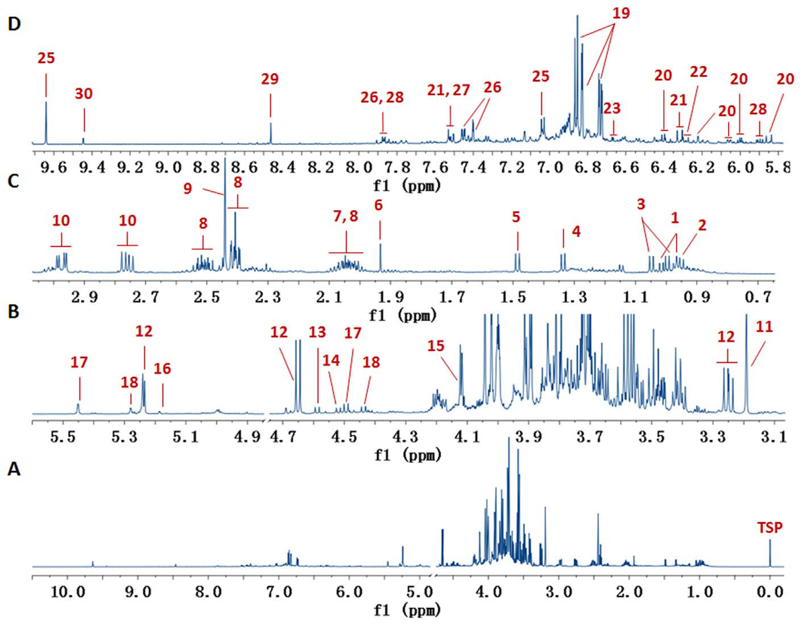
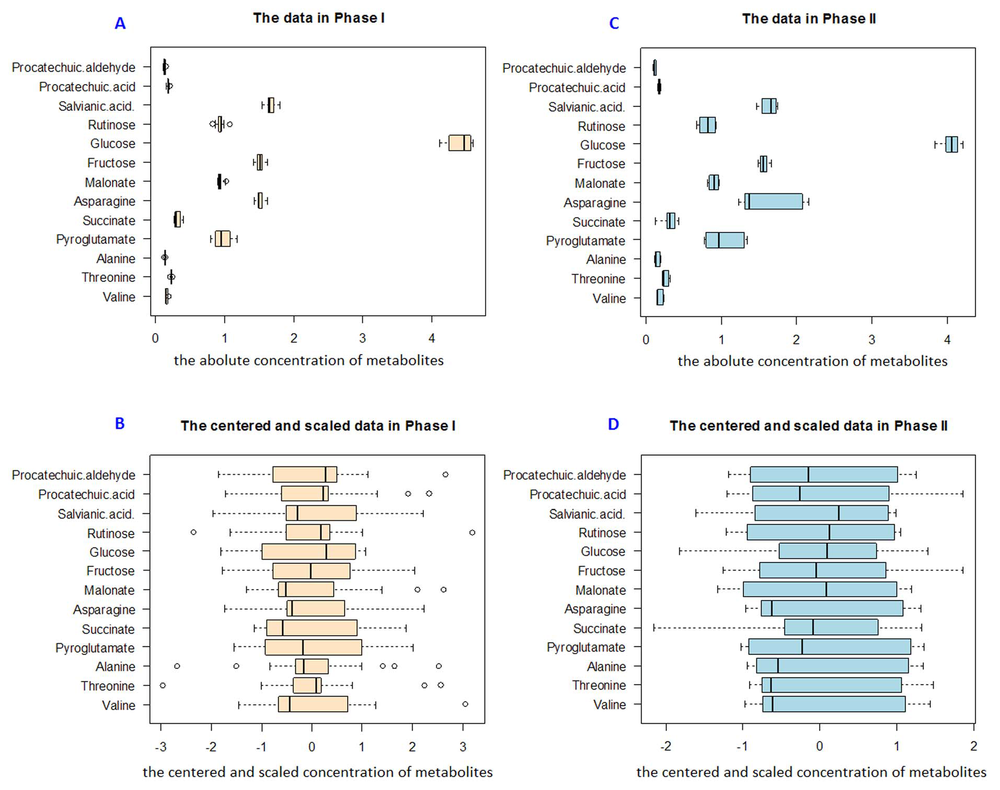
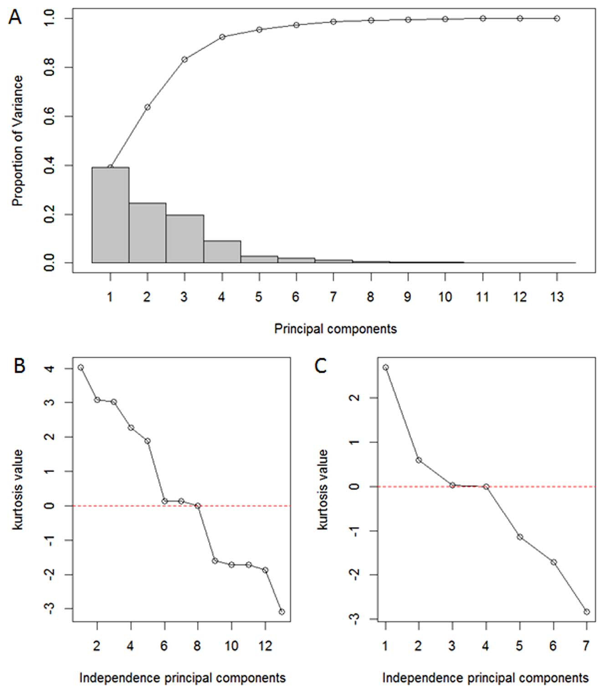
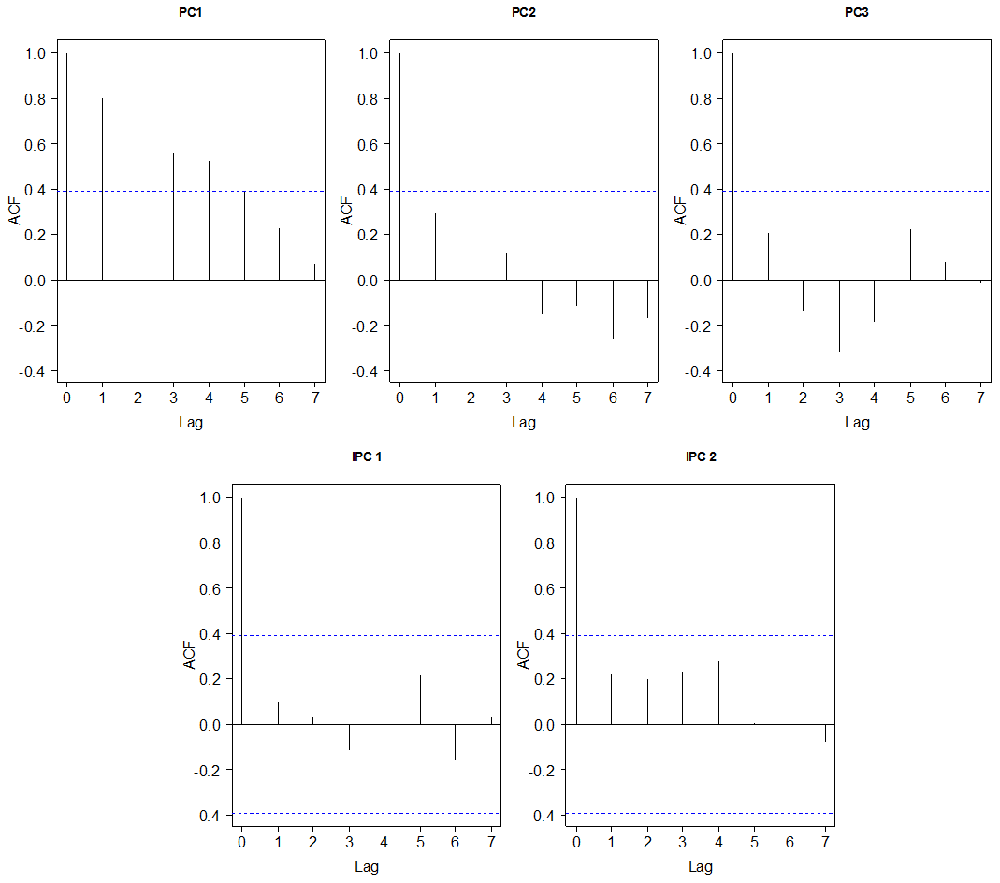
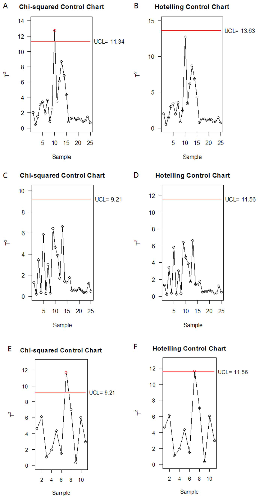
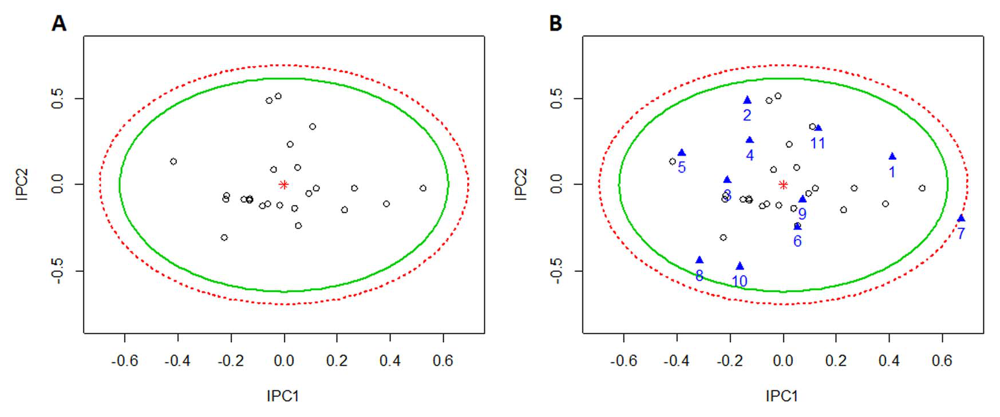
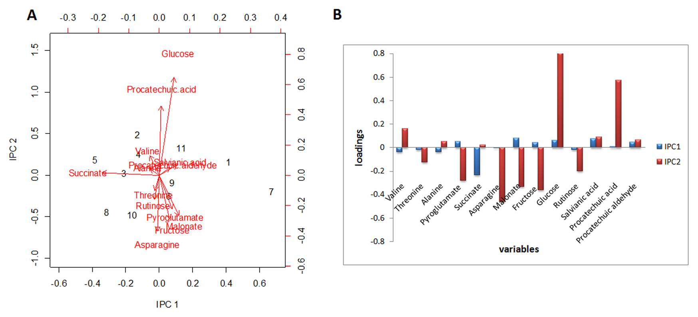

<!-- 方針: 全訳。原本は PLOS ONE のオープンアクセス論文（CC BY）。図7点はすべて PyMuPDF で xref 抽出し、Read で内容を目視確認したうえでキャプションを付けて該当箇所に埋め込んだ。表1（30代謝物の化学シフト）・表2（T1値とバリデーション）・表3（T²分解）は全転記した。原本のプライム記号（′ ″ ‴）とギリシャ文字はテキスト層で壊れていたため、該当箇所を画像としてレンダリングして目視で復元した。補足資料 File S1（表S1・表S2の実測濃度）は本文PDFに含まれないため取得できていない。原文内部の不整合は訳注で明示する。「> 補足:」は訳者注。 -->

## 書誌情報

- 原題: **Quantitative Profiling of Polar Metabolites in Herbal Medicine Injections for Multivariate Statistical Evaluation Based on Independence Principal Component Analysis**
- 著者: Miaomiao Jiang¹²*、Yujiao Jiao¹²*、Yuefei Wang¹²、Lei Xu¹²、Meng Wang¹²、Buchang Zhao³、Lifu Jia³、Hao Pan³、**Yan Zhu**¹²†、**Xiumei Gao**¹†
  - 1: 天津市 現代中薬国家重点実験室、天津中医薬大学（中国・天津）
  - 2: 天津国際生物医薬連合研究院 中薬研究開発センター（中国・天津）
  - 3: 中国歩長心脳血管病医院（中国・西安）
  - \*: 両名は本研究に等しく貢献　†: 責任著者
- 掲載: *PLoS ONE* **9**(8): e105412（2014年）全11ページ
- DOI: 10.1371/journal.pone.0105412
- 編集担当: Hua Zhou（マカオ科技大学）
- 受理経過: 2014年3月19日受付／7月23日受理／**8月26日公開**
- ライセンス: **Creative Commons Attribution License**（オープンアクセス）
- 資金: 中国国家自然科学基金（81303181）、国家科技支撑計画「第12次五カ年計画」（2013ZX09201020、2014ZX09201-023）
- 利益相反: 著者らは無しと申告

> 補足: **丹紅注射液（Danhong injection, DHI）** は、**丹参（たんじん、*Salvia miltiorrhiza* の根）** と **紅花（こうか、*Carthamus tinctorius* の花）** の抽出物からつくられる中国の注射剤で、心血管・脳血管疾患の予防と治療に広く使われている。日本では注射剤としての漢方製剤は流通していないが、中国では「中薬注射剤」として大きな市場を持ち、その品質のばらつきが長く課題となってきた。本研究の背景には、**注射剤という剤形ゆえに品質の一貫性が直接安全性に響く**という事情がある。
>
> 責任著者の一人 **Yan Zhu** の連絡先が `yanzhu.harvard@gmail.com` である点からも窺えるように、本研究グループは天津中医薬大学を拠点に、中薬の品質評価に欧米流のケモメトリクスを持ち込むことを進めてきた。

## 要旨（Abstract）

**植物由来の一次代謝物（primary metabolites）は漢方注射剤（herbal medicine injections, HMIs）に広く存在するが、管理の対象から外されることが多かった。** 親水性物質に対する不得手という限界があるため、**糖類・アミノ酸・有機酸のような強い極性をもつ一次代謝物は、日常的に用いられる逆相クロマトグラフィー指紋技術では通常検出が難しい。**

本研究では、HMIs 中の小さな極性分子——その大半は一次代謝物である——を効率的に同定・定量するために、**プロトン核磁気共鳴（¹H NMR）プロファイリング法**を開発した。汎用される医薬品である**丹紅注射液（DHI）をモデルとして採用**した。

開発した方法により、**23の一次代謝物と7のポリフェノール酸が同時に同定され**、そのうち**プロトンシグナルが完全に分離した13代謝物が定量**され、さらなる多変量品質管理アッセイに供された。定量 ¹H NMR 法は、**直線性・精度・併行精度・安定性・真度において良好**であることが検証された。

**独立主成分分析（independence principal component analysis, IPCA）** に基づき、13代謝物の含量が特徴づけられ、**第1・第2の独立主成分（IPCs）へと次元圧縮**された。IPC1 と IPC2 は次いで、**χ² 管理図と Hotelling T² 管理図の上方管理限界（99%信頼楕円体）** を計算するために用いられた。

構築された上方管理限界を通じて、提案法は **36ロットの DHI に適用**され、**コハク酸・マロン酸・グルコース・フルクトース・ダンシェン酸（salvianic acid）・プロトカテク酸アルデヒドの水準が乱れた管理外試料**を検出することに成功した。

この統合戦略は、**1枚の指紋スペクトル中で DHI の複数の極性代謝物を同定・定量する信頼できるアプローチ**を提供し、また **HMIs の多変量統計評価のための IPCA モデルの構築を助ける**ものである。

> 補足: 要旨の数字に注意したい。**「23の一次代謝物と7のポリフェノール酸」で計30成分**である。本文の内訳（糖7・アミノ酸8・有機酸6・ヌクレオシド1・5-HMF 1 = 23、ポリフェノール酸7）と整合する。

## 緒言（Introduction）

**代謝プロファイリングは、漢方薬製品の品質・一貫性・安全性・有効性を確保するために不可欠である。とりわけ注射剤という剤形についてはそうである。**

**水抽出あるいは煎出（decoction）が、漢方注射剤（HMIs）の調製法として最も好まれる方法である。** 糖類、アミノ酸、有機酸、その他の一次代謝物は、HMIs の製造工程で目的とする二次代謝物とともに**不可避的に抽出される**。清開霊注射液 [1]、丹参注射液 [2]、冠心寧注射液 [3]、疏血通注射液 [4] などがその例である。

一般に、**アミノ酸は滋養活性（tonic activities）を与え、栄養代謝の鍵となる調節因子として働く**と考えられており、**多糖はいくつかの生薬材料において薬理活性に最も重要な構成成分の一つ**であると信じられている。**一部の単糖には細胞性免疫反応に対する抑制効果がある** [5]。

**しかしながら、HMIs 中のこれら一次代謝物は、中国薬典および国家標準において、検出も対応する品質基準の設定も、しばしば無視されている。**

強い極性と親水性のため、従来の逆相高速液体クロマトグラフィー（HPLC）指紋 [6, 7] やその他の分析手法——**陰イオン交換クロマトグラフィー** [8]、**ガスクロマトグラフィー** [9, 10]、**キャピラリー電気泳動** [11, 12]——は、**煩雑な前処理・誘導体化試薬・手間のかかる調製手順を用いない限り、一次代謝物を分離・検出することに限界がある。**

HMIs 中の様々なクラスの代謝物を描き出すには、**全体論的な品質評価のために異なる種類の指紋が必要**になるが、これは**実際の工業的処理の場面では実現が難しい**。

**したがって、糖類・アミノ酸・有機酸を、主要な生理活性二次代謝物とともに、1枚の指紋スペクトル中で同時に検出できる、単純で高速なアプローチが求められる。**

### なぜ ¹H NMR なのか

**プロトン核磁気共鳴（¹H NMR）分光法は、化合物のクラスをほとんど問わず、プロトンを持つすべての化合物を検出する手段を提供する。**

**シグナル強度が、特定の共鳴に寄与する核の数に直接比例する** [13] ため、**¹H NMR 法は代謝物の同定と定量を一度の測定（one-step acquisition）で達成する。**

単純な試料調製で済むため、¹H NMR は代謝研究や、各種の食品 [14–17]・生薬材料 [18–20] の品質管理のための**ハイスループット分析**を容易にする。**実装が単純かつ迅速な汎用技術**として、¹H NMR は HMIs の極性代謝物プロファイリングへの応用に広い展望を持つ。

### なぜ IPCA なのか

**化学組成が複雑であるため、HMIs は限られた数の特定の生理活性化合物によって完全に代表させることはできない** [21]。特徴変数を抽出するために、**主成分分析（PCA）** [22] と**独立成分分析（ICA）** [23] は、多変量の次元を削減する古典的な道具である。

- **PCA における成分（PCs）は互いに直交する**
- **ICA における成分は統計的に独立である** [24]

**ICA は、成分間の重複情報を除去する点で PCA の有力な代替であることが見出されてきた** [25]。しかし ICA は、**ある種の不安定性** [26]、**抽出する成分数の選択**、**高次元性** [27] のために、いくつかの限界に直面する。

その結果として、**独立主成分分析（IPCA）** が 2012年に Yao らによって提案された [28]。これは、**PCA を前処理ステップとしてデータの次元を削減し、次いで ICA を PCA のノイズ除去プロセスとして用いて関連する情報を分離する**ものである。シミュレーション研究および実データセットにおいて、**IPCA は ICA より優れたデータの可視化を、PCA より少ない成分数で提供した。**

**ノイズ除去されたローディングベクトルを生成できるという利点**から、著者らは **IPCA 法を用いて χ² 管理図と Hotelling T² 管理図** [29] を構築し、多変量統計解析を行うことを試みた。

### モデルとしての丹紅注射液

**丹紅注射液（DHI）は、丹参（Radix Salviae Miltiorrhizae）と紅花（Flos Carthami）の抽出物から製造される特許注射剤である** [30]。**臨床において心血管疾患・脳血管疾患の予防と治療に広く用いられてきた** [31–33]。

著者らの以前の研究では、**超高速液体クロマトグラフィー（UPLC）にUV検出を組み合わせて DHI 中の11種のポリフェノール酸を同定**した [34]。**しかし、同定された構成成分の総重量は、DHI の固形分のごく低い割合（約10%）を占めるにすぎなかった。**

**本研究では、定量 ¹H NMR 分光法に基づいて DHI 中のより親水性の高い一次代謝物を検出する戦略を記述する。** 同定された代謝物の絶対濃度は**内標準法**によって算出した。**直線性・精度・併行精度・安定性・真度**を実施して方法を検証した。極性代謝物の含量はさらに**多変量解析ツール IPCA によって評価**され、**χ² 管理図と Hotelling T² 管理図**を確立した。

> 補足: 緒言の論理は明快で、3段に分かれている。
>
> 1. **問題**——注射剤の固形分の大半を占める糖・アミノ酸・有機酸が、極性が強すぎて逆相HPLCで見えず、薬局方にも規格が無い。しかも複数の分析法を並べるのは工場では現実的でない。
> 2. **道具1（測定）**——¹H NMR なら、プロトンを持つものはクラスを問わず1枚のスペクトルに出る。しかも面積がプロトン数に比例するので、そのまま定量できる。
> 3. **道具2（統計）**——13成分の数字を1つずつ規格に照らすのではなく、多変量管理図で「まとめて1つの点」として管理する。ただし管理図はデータの独立性を前提とするので、直交するだけの PCA では足りず、独立性を保証する IPCA が要る。
>
> この 2→3 のつながり、すなわち **「測ったあとどう判定するか」まで含めて設計している**ところが本研究の眼目である。

## 材料と方法（Materials and Methods）

### 材料と試薬

**2011年・2012年・2013年に製造された36ロットの DHI** が、**菏沢歩長製薬有限公司**（中国・菏沢）から提供された。

標準品の入手先は以下のとおり。

| 標準品 | 入手先 |
|---|---|
| バリン、トレオニン、アラニン、ピログルタミン酸、プロトカテク酸アルデヒド、アスパラギン | 中国食品薬品検定研究院（北京） |
| ダンシェン酸（salvianic acid）、プロトカテク酸 | 中新科炎（Zhongxin Innova Laboratories、天津） |
| コハク酸、マロン酸 | Dr. Ehrenstorfer GmbH（ドイツ・アウクスブルク） |
| フルクトース、グルコース | Sigma（Aldrich、米国） |
| ルチノース | Hazard Communication（日本・東京） |

**化合物の純度は、NMR 分析により、すべて98%以上であった。**

**重水（D₂O、99.9%）** と **3-トリメチルシリル[2,2,3,3-d₄]プロピオン酸ナトリウム（TSP）** は Cambridge Isotope Laboratories（米国フロリダ州マイアミ）から購入した。**D₂O は内部ロックとして、TSP は化学シフト較正と定量のための内標準として用いた。**

### 倫理（Ethics）

**記述されたフィールド調査について、特別な許可は不要であった。** 調査地は私有地でも保護地でもなく、絶滅危惧種も保護種も関与していない。

### 試料調製（Sample preparation）

**すべての注射剤試料を凍結乾燥に付した。** 乾燥粉末（**18 mg**）を正確に秤量し、**0.58 mM の TSP を含む D₂O 600 μL** に溶解した。**正確に 500 μL** の試料溶液を標準的な **5 mm NMR チューブ**（米国ニュージャージー州ヴァインランド）に移した。**注射剤の pH が安定しているため、緩衝液は使用しなかった。**

### NMR 測定（NMR measurements）

¹H NMR スペクトルは、**298 K**、**Bruker AV III 600 MHz NMR 分光計**（**プロトン周波数 600.23 MHz**）、**5 mm ブロードバンド BBFO プローブヘッド**で取得した。すべてのパルスシーケンスは Bruker のパルスプログラムライブラリのものである。

- 残留水シグナルの抑制: **標準的な1次元コンポジットパルスシーケンス（zgcppr）**
- **90° パルス幅**: 各試料について約 **13 μm** に調整（下記訳注参照）
- **積算回数**: **64スキャン**
- **データポイント**: 32k
- **スペクトル幅**: **12335 Hz**
- **緩和遅延（relaxation delay）**: **1.0 秒**
- **取込時間（acquisition time）**: **2.66 秒**
- **窓関数**: 0.3 Hz の線幅拡大関数をすべてのスペクトルに適用してからフーリエ変換（FT）、続いて位相補正とベースライン補正

> 補足（原文の単位について）: **原本には「about 13 μm」と印字されている**（該当ページを画像としてレンダリングして確認した）。しかし **90° パルス幅は時間の量**であり、単位は **μs（マイクロ秒）** でなければならない。**原文の誤記と考えられる**が、本ページでは原文どおり転記したうえでこの注を付す。600 MHz 装置のプロトン90°パルス幅として 13 μs は妥当な値である。

**プロトンシグナル帰属の目的で、2次元（2D）スペクトル一式**——**¹H-¹H COSY**（相関分光法）、**¹H-¹H TOCSY**（全相関分光法）、**¹H J分解（J-res）**、**¹H-¹³C HSQC**（異核単量子コヒーレンス）——を選択した試料について取得し、以前に記述したのと同様のパラメータで処理した [35]。

**個々の成分および TSP の、定量に用いるプロトンのスピン格子緩和時間（T₁）値**は、**0.01〜20 秒の10点の緩和遅延（τ）を用いた古典的な反転回復（inversion recovery）パルスシーケンス**により測定した。

### 代謝物の定量（Quantification of the metabolites）

**与えられた ¹H NMR シグナルの強度は、それに寄与するプロトン数に直接比例する**ため、DHI 中の代謝物の量は、**当該代謝物のシグナル面積と、既知濃度の内部基準のシグナル面積**によって測定できる。**DHI 中の13代謝物を定量の対象として選択した。**

**¹H NMR スペクトルのデータ取得と処理に関わる重要なパラメータは、正確かつ精確な測定を得るために適切に設定されなければならない** [36]。**何よりも、緩和遅延 τ は、関心のあるすべてのシグナルについて完全な緩和を保証するのに十分長くなければならない。**

**¹H NMR 測定は、$\tau \geq 5 \times$（最長の T₁）を選ぶことで、より長い取込時間で行われる。** 取込時間を短縮するために、**¹H NMR スペクトルは不完全緩和条件で取得することができ、その場合は絶対濃度を T₁ 値を考慮に入れて算出しなければならない** [37]。

**90° の有効磁化読み出しパルスを用いて、本研究における化学成分の定量は次式によって行うことができる。**

$$
P_X = \frac{A_X}{A_{TSP}} \cdot \frac{1 - \exp\left(-\tau / T_1^{TSP}\right)}{1 - \exp\left(-\tau / T_1^{X}\right)} \cdot \frac{N_{TSP}}{N_X} \cdot \frac{M_X}{M_{TSP}} \cdot P_{TSP}
$$

ここで各記号は以下を表す。

| 記号 | 意味 |
|---|---|
| $P_X$、$P_{TSP}$ | 代謝物および TSP の**質量濃度** |
| $A_X$、$A_{TSP}$ | 代謝物の対象シグナル、および TSP のメチル基の**積分面積** |
| $N_X$、$N_{TSP}$ | 代謝物および TSP のメチル基の**プロトン数** |
| $M_X$、$M_{TSP}$ | 代謝物および TSP の**モル質量** |
| $T_1^{X}$、$T_1^{TSP}$ | プロトン X および TSP のメチルプロトンの**スピン格子緩和時間** |
| $\tau$ | **全緩和時間**（緩和遅延＋取込時間） |

> 補足: この式の構造を分解しておく。
>
> - **$A_X/A_{TSP}$** —— 面積の比。NMR 定量の出発点。
> - **$N_{TSP}/N_X$** —— プロトン数で割って「分子1個あたり」に直す補正。
> - **$M_X/M_{TSP}$** —— モル質量を掛けてモル濃度から質量濃度に直す補正。
> - **$P_{TSP}$** —— 既知の内標準濃度を掛けて絶対値にする。
>
> ここまでは教科書どおりの qNMR の式である。**本研究に固有なのが中央の緩和補正項**である。緩和遅延を τ = 1.0 + 2.66 = 3.66 秒と短くとっているため、T₁ が長い核（例えばプロトカテク酸の 3.542 秒、フルクトースの 3.303 秒）は次のパルスまでに完全には戻りきらない。すると面積が過小に出る。そこで **$1-\exp(-\tau/T_1)$ という「どこまで回復したか」の因子で、TSP 側と分析対象側の両方を割り戻す**。完全緩和条件（τ が十分長い）ならこの項は 1/1 = 1 になって消える。
>
> 逆に言えば、**この補正を使う代償として、13成分すべてについて T₁ を実測しなければならない**。表2の T₁ 列がそれである。測定時間を約5分に抑えるための工夫と、そのために払ったコストが対になっている。

**定量 ¹H NMR 法は、直線性・精度・併行精度・安定性・真度について確認した。** 精度・併行精度・安定性は**相対標準偏差（RSD）** として算出した。**真度の決定には回収試験を用い**、4つの代表的化合物——**アラニン・グルコース・ダンシェン酸・プロトカテク酸アルデヒド**——を選んで**平均回収率**を評価した。

### 多変量品質管理のためのアッセイ

**36ロットの DHI 試料を2つのフェーズに分割した。**

| フェーズ | 位置づけ | 内容 |
|---|---|---|
| **Phase I** | **訓練集合（training set）** | **2012年・2013年に連続して製造された適合品 25ロット** |
| **Phase II** | **検証集合（testing set）** | **2012年・2013年の適合品 6ロット** ＋ **2011年製の期限切れ品 5ロット** = 計11ロット |

13代謝物の定量結果データを、多変量統計解析のために **R 3.0.2**（パッケージ **MVA**、**MSQC**、**mixOmics** を読み込み。www.r-project.org）に取り込んだ。

**多変量問題を単純化するために、主成分分析（PCA）と独立主成分分析（IPCA）を実施してデータの次元を削減した。** データ全体を特徴づける主成分のスコアを次いで **χ² 管理図と Hotelling T² 管理図**に取り込み、**上方管理限界（99%信頼楕円体つき）** を算出した。

さらに、**管理図の必須要件の一つがデータの独立性である**ことから、**PCA モデルおよび IPCA モデルにおいて選択された成分の独立性を、自己相関関数（ACF）によって検証した。** Phase II の管理外試料は、**Phase I から得られた上方管理限界によって検査**した。

> 補足: Phase I / Phase II という分け方は、**統計的工程管理（SPC）の標準的な二段構え**である。
>
> - **Phase I**——「工程が安定しているとき、データはどこまで散らばるのか」を、良品だけを使って学習し、**管理限界線を決める**段階。
> - **Phase II**——決めた管理限界線を新しいロットに当てて、**外れるかどうかを判定する**段階。
>
> 本研究の Phase II には **2011年製の期限切れ品5ロットが意図的に混ぜてある**。つまり「本当に外れるべきものを外れると言えるか」という**陽性対照**を仕込んだ設計になっている。この作り込みがあるので、後で第7試料が外れたという結果に意味が出る。

## 結果と考察（Result and Discussion）

### プロトンシグナルの帰属と化学的同定

**DHI の代表的な ¹H NMR スペクトルを図1に示す。**

**共鳴シグナルは、広範な2D NMR 実験（¹H-¹H COSY、¹H-¹H TOCSY、¹H J分解、HSQC）による解析、著者らの以前の研究の文献データ [35]、および自家データベースに基づいて、30の代謝物に帰属された。**

領域別の内訳は以下のとおり。

| 領域 | 化学シフト | 検出された成分 |
|---|---|---|
| **糖領域** | δ 3.2–5.8 | **単糖5種と二糖2種**が支配的——グルコース、ガラクトース、アラビノース、フルクトース、ラムノース、ルチノース、ルチヌロース |
| **高磁場領域** | δ 0.5–3.2 | **アミノ酸8種**（イソロイシン、ロイシン、バリン、トレオニン、アラニン、プロリン、ピログルタミン酸、アスパラギン）と**有機酸3種**（酢酸、コハク酸、マロン酸） |
| **低磁場領域** | δ 5.8–10.0 | **ポリフェノール酸7種**（ダンシェン酸、サルビアノール酸B、サルビアノール酸A、ロスマリン酸、リトスペルミン酸、プロトカテク酸、プロトカテク酸アルデヒド）＋**ウリジン**＋**5-(ヒドロキシメチル)-2-フルアルデヒド（5-HMF）**、さらに**有機酸3種**（4-ヒドロキシ安息香酸、4-ヒドロキシケイ皮酸、ギ酸） |

**著者らの知る限り、7種の糖と6種の有機酸は DHI において初めて報告されたものである。**

**試料の前処理も、プレカラム誘導体化も必要とせずに、確立された ¹H NMR 法は DHI 中の 7糖・6有機酸・8アミノ酸・1ヌクレオシド・1炭水化物誘導体（5-HMF）・7ポリフェノール酸を同時に決定するアプローチを提供した。**

> 補足: 数を足すと 7＋6＋8＋1＋1＋7 = **30** で表1と合う。要旨の「23の一次代謝物＋7のポリフェノール酸」とも整合する（7＋6＋8＋1＋1 = 23）。
>
> ここで **5-HMF（5-ヒドロキシメチルフルフラール）** が検出されている点は品質管理上とくに重要である。5-HMF は**糖の加熱分解によって生じる**物質で、注射剤の製造工程における加熱履歴や保存中の劣化を反映する。**糖を測ることが、そのまま工程の履歴を測ることにつながる**という関係がここに現れている。
>
> **ギ酸（formate）** も同様で、糖の分解生成物として現れうる。逆相HPLCではどちらも捉えにくい。

#### 表1: 丹紅注射液の ¹H NMR スペクトルで同定された30代謝物の化学シフト

多重度の略号: singlet (s)、doublet (d)、triplet (t)、doublet of doublets (dd)、quintet (q)、multiplet (m)。

| ピーク | 代謝物 | 帰属 | δ¹H（多重度） | 帰属に用いた手法 |
|---|---|---|---|---|
| 1 | イソロイシン | δ-CH₃, γ′-CH₃, γ-CH₂, β-CH, α-CH | 0.96 (t, 6.1 Hz), 1.01 (d, 6.8 Hz), 1.26 (m), 1.47 (m), 1.96 (m), 3.66 (m) | COSY, TOCSY, J-res, HSQC |
| 2 | ロイシン | δ, δ′-CH₃, β-CH₂, γ-CH | 0.95 (m), 1.67 (m), 3.72 (m) | COSY, TOCSY, J-res, HSQC |
| 3 | バリン | γ′-CH₃, γ-CH₃, β-CH, α-CH | 1.00 (d, 7.0 Hz), 1.05 (d, 7.0 Hz), 2.26 (m), 3.60 (d, 4.2 Hz) | COSY, TOCSY, J-res, HSQC |
| 4 | トレオニン | γ-CH₃, β-CH, α-CH | 1.36 (d, 6.5 Hz), 4.25 (m), 3.58 (d, 6.4 Hz) | COSY, TOCSY, J-res, HSQC |
| 5 | アラニン | β-CH₃, α-CH | 1.48 (d, 7.5 Hz), 3.78 (m) | COSY, TOCSY, J-res, HSQC |
| 6 | 酢酸 | CH₃ | 1.93 (s) | J-res, HSQC |
| 7 | プロリン | γ-CH₂, δ-CH₂, β-CH₂, α-CH | 2.00 (m), 3.34 (m), 3.42 (m), 2.35 (m), 4.14 (m) | COSY, TOCSY, J-res, HSQC |
| 8 | ピログルタミン酸 | γ-CH₂, β-CH₂, α-CH | 2.04 (m), 2.51 (m), 2.41 (m), 4.18 (m) | COSY, TOCSY, J-res, HSQC |
| 9 | コハク酸 | CH₂ | 2.44 (s) | J-res, HSQC |
| 10 | アスパラギン | β-CH₂, α-CH | 2.76 (dd, 14.0, 8.2 Hz), 2.97 (dd, 14.0, 4.3 Hz), 4.00 (m) | COSY, TOCSY, J-res, HSQC |
| 11 | マロン酸 | CH₂ | 3.19 (s) | J-res, HSQC |
| 12 | グルコース | αC₁H, αC₂H, αC₃H, αC₄H, αC₅H, βC₁H, βC₂H, βC₃H | 5.24 (d, 3.6 Hz), 3.55 (m), 3.72 (m), 3.42 (m), 3.85 (m), 4.65 (d, 7.8 Hz), 3.25 (dd, 7.8, 9.2 Hz), 3.48 (m) | COSY, TOCSY, J-res, HSQC |
| 13 | ガラクトース | αC₁H, αC₂H, αC₃H, βC₁H, βC₂H, βC₃H, βC₄H | 5.27 (d, 3.8 Hz), 3.83 (m), 4.02 (m), 4.59 (d, 7.8 Hz), 3.50 (m), 3.65 (m), 3.93 (m) | COSY, TOCSY, J-res, HSQC |
| 14 | アラビノース | αC₁H, αC₂H, αC₃H, βC₁H, βC₂H, βC₃H | 5.25 (d, 3.6 Hz), 3.82 (m), 4.02 (m), 4.52 (d, 7.8 Hz), 3.51 (m), 3.68 (m) | COSY, TOCSY, J-res, HSQC |
| 15 | フルクトース | C₁H, C₃H, C₄H, C₅H, C₆H | 3.58 (m), 3.69 (m), 3.82 (m), 4.11 (m), 3.90 (m), 4.11 (m), 3.82 (m), 4.00 (m), 3.69 (m), 3.82 (m), 4.02 (m) | COSY, TOCSY, J-res, HSQC |
| 16 | ラムノース | αC₁H, αC₂H, αC₃H, αC₄H, αC₅H, βC₂H, βC₃H, βC₄H, βC₅H | 5.18 (d, 1.7 Hz), 3.91 (m), 3.79 (m), 3.43 (m), 3.85 (m), 3.92 (m), 3.59 (m), 3.37 (m), 3.43 (m) | COSY, TOCSY, J-res, HSQC |
| 17 | ルチノース | Rha-C₁H, Glc-C₁H | 5.42 (d, 1.7 Hz), 4.50 (d, 7.4 Hz) | COSY, TOCSY, J-res, HSQC |
| 18 | ルチヌロース | Rha-C₁H, Fru-C₁H | 5.25 (d, 1.7 Hz), 4.45 (d, 7.4 Hz) | COSY, TOCSY, J-res, HSQC |
| 19 | ダンシェン酸 | H-2, H-5, H-6, H₂-7, H-8 | 6.81 (d, 1.5 Hz), 6.86 (d, 8.0 Hz), 6.74 (dd, 8.0, 1.5 Hz), 2.85 (m), 3.04 (m), 5.42 (m) | COSY, TOCSY, J-res, HSQC |
| 20 | サルビアノール酸B | H-2, H-3, H-5, H-6, H-β, H-α, H-5″, H-6″, H₂-7″, H-8″, H-2‴, H-5‴, H-6‴, H-7‴, H-8‴ | 6.01 (d, 5.6 Hz), 4.33 (d, 5.6 Hz), 7.06, 6.92, 6.99 (d, 16.0 Hz), 5.85 (d, 16.0 Hz), 6.93, 6.76, 2.90 (m), 3.10 (m), 5.00 (m), 6.24 (d, 2.6), 6.42 (d, 8.0), 6.12 (dd, 8.0, 2.6 Hz), 2.98 (m), 2.56 (m), 4.90 (m) | COSY, TOCSY, J-res, HSQC |
| 21 | ロスマリン酸 | H-2, H-5, H-6, H-β, H-α, H-2′, H-5′, H-6′, H₂-7′ | 6.98 (d, 1.5 Hz), 6.72 (d, 8.0 Hz), 6.89 (dd, 8.0, 1.5 Hz), 7.49 (d, 16.0 Hz), 6.32 (d, 16.0 Hz), 6.90 (d, 1.5 Hz), 6.64 (d, 8.0 Hz), 6.55 (dd, 8.0, 1.5 Hz), 2.91 (m), 3.13 (m) | COSY, TOCSY, J-res, HSQC |
| 22 | リトスペルミン酸 | H-5, H-6, H-β, H-α, H-2′, H-5′, H-6′, H₂-7′, H-8′, H-2″, H-5″, H-6″ | 6.52 (d, 8.5 Hz), 6.57 (d, 8.5 Hz), 7.22 (d, 16.0 Hz), 6.32 (d, 16.0 Hz), 6.74 (d, 1.5 Hz), 6.65 (d, 8.0 Hz), 6.52 (dd, 8.0, 1.5 Hz), 2.81 (m), 2.87 (m), 4.85 (m), 6.66 (d, 1.5 Hz), 6.55 (d, 8.0 Hz), 6.46 (dd, 8.0, 1.5 Hz) | COSY, TOCSY, J-res, HSQC |
| 23 | サルビアノール酸A | H-5, H-6, H-β, H-α, H-2′, H-5′, H-6′, H₂-7′, H-8′, H-2″, H-5″, H-6″, H-7″, H-8″ | 6.71 (d, 8.0 Hz), 7.05 (d, 8.0 Hz), 7.86 (d, 16.0 Hz), 6.20 (d, 16.0 Hz), 6.66 (d, 1.5 Hz), 6.59 (d, 8.0 Hz), 6.48 (dd, 8.0, 1.5 Hz), 2.90 (m), 3.01 (m), 5.11 (dd, 8.5, 3.5 Hz), 7.00 (d, 1.0 Hz), 6.69 (d, 8.0 Hz), 6.82 (dd, 8.0, 1.5 Hz), 6.60 (d, 16.0 Hz), 7.08 (d, 16.0 Hz) | COSY, TOCSY, J-res, HSQC |
| 24 | プロトカテク酸 | H-2, H-5, H-6 | 7.41 (d, 2.0 Hz), 6.80 (d, 8.0 Hz), 7.45 (dd, 8.0, 2.0 Hz) | COSY, TOCSY, J-res, HSQC |
| 25 | プロトカテク酸アルデヒド | H-2, H-5, H-6, CHO | 7.10 (d, 2.0 Hz), 6.80 (d, 8.0 Hz), 7.08 (dd, 8.0, 2.0 Hz), 9.63 (s) | COSY, TOCSY, J-res, HSQC |
| 26 | 4-ヒドロキシ安息香酸 | H-3, 5, H-2, 6 | 7.83 (d, 8.8 Hz), 6.91 (d, 8.8 Hz) | COSY, TOCSY, J-res, HSQC |
| 27 | 4-ヒドロキシケイ皮酸 | H-3, 5, H-2, 6, H-β, H-α | 7.54 (d, 9.0 Hz), 6.89 (d, 9.0 Hz), 7.60 (d, 16.0 Hz), 6.37 (d, 16.0 Hz) | COSY, TOCSY, J-res, HSQC |
| 28 | ウリジン | H-5, H-6, Xyl-C₁H | 5.88 (d, 8.1 Hz), 7.88 (d, 8.1 Hz), 5.91 (d, 4.2 Hz) | COSY, TOCSY, J-res, HSQC |
| 29 | ギ酸 | CHO | 8.46 (s) | J-res, HSQC |
| 30 | 5-(ヒドロキシメチル)-2-フルアルデヒド | H-3, H-4, CHO | 7.23 (d, 3.5 Hz), 6.51 (d, 3.5 Hz), 9.45 (s) | COSY, TOCSY, J-res, HSQC |

> 補足（原文の表記ゆれ）: 原本は化合物名を要旨で **protocatechuic aldehyde**、表1・表2・図では **procatechuic aldehyde / procatechuic acid** と書き分けている。**正しい化学名は protocatechuic（プロトカテク）** である。本ページでは統一して「プロトカテク酸／プロトカテク酸アルデヒド」と訳した。
>
> 同様に、原文は **salvianic acid**（ダンシェン酸、丹参素）と **salvianolic acid A / B**（サルビアノール酸A/B）を使い分けている。**別の化合物なので混同しないこと**——ダンシェン酸は炭素数9の小さなフェニル乳酸誘導体、サルビアノール酸Bはその4量体に近い大きな分子である。
>
> **プライム記号について**——原本PDFのテキスト層ではプライム（′ ″ ‴）が数字の 0 や 9 に化けていた（例: `H-209` `H-509`）。該当箇所を画像としてレンダリングして目視で確認し、上表では正しい記号に復元した。

### 定量 ¹H NMR 分析と方法バリデーション

**¹H NMR の化学シフト範囲は狭く、シグナルの重なりが頻繁に起こるため、混合物中のすべての成分を定量することは困難である。** 本研究では、**シグナルが完全に分離した13代謝物を定量の対象として選択した。**

**¹H NMR 法の効率を上げるために、スペクトルは不完全緩和状態で取得した。** その結果として、**スピン格子緩和時間（T₁）値を正確に測定し、定量分析において考慮に入れなければならない。** T₁ 値は反転回復実験によって決定した（表2）。これに従い、**13代謝物の絶対濃度を各ロットの3並行試料から算出した**（File S1 中の表S1）。

#### 直線性（Linearity）

**¹H NMR は方法自体が線形であり、混合物のモル比の決定に較正は不要である。** したがって、**5つの異なるモル比における13代謝物が、NMR 分光法の直線性を確認した。** **良好な直線性が達成され**、これは回帰式と満足すべき相関係数（r²）によって示される。

#### 精度（Precision）

**日内精度と日間精度**は、それぞれ**同日6反復**および**連続3日**の分析によって決定した。

- **日内精度（intraday）**: 13代謝物の含量について **0.20%〜0.89%**
- **日間精度（interday）**: **0.29%〜1.49%**

**RSD 値は適切であり、方法の適合性を示した。**

#### 併行精度（Repeatability）

**同一ロットから調製した6試料**は、**1.46%〜2.75%** の RSD 値を示し、**高い併行精度**を示した。

#### 安定性（Stability）

**1試料を連続3日間分析**して安定性を決定した。分析対象成分の **RSD 値は 0.37%〜2.21%** の範囲であった。

#### 真度（Accuracy）

**NMR チューブの容量の制限と、試料を連続的に希釈するための重水素試薬のコスト**を考慮し、**異なるタイプの4代謝物**——**アラニン・グルコース・ダンシェン酸・プロトカテク酸アルデヒド**——を用いた。

**回収率は、添加した DHI 試料における選択4化合物の応答の、同一水準の標準品に対する比として算出した。**

| 化合物 | 平均回収率 ± SD |
|---|---|
| アラニン | **106.6% (±1.2)** |
| グルコース | **106.6% (±2.5)** |
| ダンシェン酸 | **98.3% (±2.1)** |
| プロトカテク酸アルデヒド | **91.3% (±4.0)** |

**許容できる回収率を示している。**

なお回収率の定義は **回収率(%) = [(実測値 − 元の値) / 添加量] × 100** である。

#### 表2: 13代謝物のプロトンスピン格子緩和時間（T₁）値と ¹H NMR 法のバリデーションパラメータ

| 代謝物 | δ (ppm) | T₁ (s) (n=3) | 回帰式 (n=3) | r² | 日内精度 (n=6) RSD% | 日間精度 (n=3) RSD% | 併行精度 (n=6) RSD% | 安定性 (n=6) RSD% | 平均回収率 (%) ± SD (n=3) |
|---|---|---|---|---|---|---|---|---|---|
| バリン | 1.03 (3H) | 0.944±0.049 | y = 7.9917x − 0.1254 | 0.9996 | 0.79 | 0.84 | 1.83 | 1.67 | — |
| トレオニン | 1.31 (3H) | 1.323±0.102 | y = 7.9895x − 0.1288 | 0.9995 | 0.49 | 0.98 | 1.94 | 0.99 | — |
| アラニン | 1.47 (3H) | 1.451±0.120 | y = 11.536x − 0.0821 | 0.9997 | 0.61 | 0.35 | 1.46 | 0.58 | **106.6±1.2** |
| ピログルタミン酸 | 2.41 (2H) | 2.249±0.044 | y = 3.9348x − 0.0387 | 0.9980 | 0.20 | 0.29 | 1.48 | 0.37 | — |
| コハク酸 | 2.42 (4H) | 1.844±0.268 | y = 9.7223x − 0.2087 | 0.9993 | 0.89 | 0.93 | 1.85 | 2.21 | — |
| アスパラギン | 2.76 (1H) | 0.562±0.019 | y = 1.8370x − 0.1871 | 0.9979 | 0.60 | 1.49 | 2.75 | 1.78 | — |
| マロン酸 | 3.19 (2H) | 2.116±0.136 | y = 0.7533x − 0.0317 | 0.9972 | 0.20 | 0.56 | 1.66 | 1.43 | — |
| フルクトース | 4.10 (3H) | 3.303±0.210 | y = 1.2045x − 0.2608 | 0.9998 | 0.45 | 0.34 | 1.69 | 2.06 | — |
| グルコース | 5.24 (1H) | 1.684±0.206 | y = 0.5486x − 0.0912 | 0.9997 | 0.32 | 0.68 | 2.59 | 1.32 | **106.6±2.5** |
| ルチノース | 5.44 (1H) | 1.447±0.164 | y = 2.4419x − 0.1850 | 0.9992 | 0.59 | 0.76 | 2.49 | 1.78 | — |
| ダンシェン酸 | 6.74 (1H) | 1.843±0.139 | y = 1.2845x − 0.1858 | 0.9994 | 0.23 | 0.34 | 2.01 | 1.23 | **98.3±2.1** |
| プロトカテク酸 | 7.41 (1H) | 3.542±0.326 | y = 0.5172x − 0.0083 | 0.9983 | 0.67 | 0.93 | 1.93 | 1.99 | — |
| プロトカテク酸アルデヒド | 9.63 (1H) | 2.932±0.436 | y = 1.2468x − 0.0013 | 0.9992 | 0.78 | 0.85 | 1.72 | 1.82 | **91.3±4.0** |

> 補足（表1と表2の化学シフトのずれについて）: 定量に使ったシグナル（表2の δ 列）と、帰属表（表1）の値がいくつか一致しない。
>
> | 代謝物 | 表1 | 表2 | 差 |
> |---|---|---|---|
> | バリン | 1.00 / 1.05 | **1.03** | 2本のドブレットの中間値 |
> | トレオニン | 1.36 | **1.31** | 0.05 |
> | アラニン | 1.48 | **1.47** | 0.01 |
> | コハク酸 | 2.44 | **2.42** | 0.02 |
> | ルチノース | 5.42 | **5.44** | 0.02 |
>
> **0.01〜0.02 のずれは、積分範囲の中心をとったか実測ピーク頂点をとったかの違いとして説明できる範囲**である。しかし**トレオニンの 1.36 → 1.31 は 0.05 と大きく**、また**バリンの 1.03 は表1に存在しない値**である（表1では 1.00 と 1.05 の2本）。**原文はこれらのずれについて説明していない。** 本ページでは両表を原文どおり転記し、この不一致を指摘するにとどめる（どちらが正しいかを推定して書き換えることはしない）。
>
> なお **コハク酸 2.42 (4H) とピログルタミン酸 2.41 (2H) は 0.01 しか離れていない**。原文は「シグナルが完全に分離した13代謝物を選んだ」と述べているが、この2本については 600 MHz でも分離は容易でないはずである。図1パネルCを見ると δ2.4 付近は確かに込み合っており、コハク酸の単一線（9番）とピログルタミン酸（8番）が隣接して標識されている。

**結果によれば、図2A・2B に示されるとおり DHI 中のグルコース濃度は極めて高く、糖・アミノ酸・有機酸の量は DHI の全固形分の約60%を占めた**（File S1 中の表S1）。

> 補足: これが本論文の最も実務的な発見である。**既報のUPLC-UVで測れていたポリフェノール酸11種は固形分の約10%**（緒言）、**本法で測れる糖・アミノ酸・有機酸が約60%**。つまり従来の指紋は、注射剤に入っているものの**大半を見ていなかった**ことになる。
>
> 「見ていない60%」の中身がグルコースをはじめとする糖であることは、単に「不活性な夾雑物」で済む話ではない。糖は加熱で 5-HMF に変わり、保存中にも変化する。**製造・保存の履歴が最も濃く刻まれる部分を、規格が素通りしていた**という指摘になっている。
>
> なお **File S1（表S1・表S2）は本文PDFとは別ファイルの補足資料**であり、本ページの作成にあたって取得できていない。**個々のロットの実測濃度値は原文の補足資料を参照されたい。**

### PCA と IPCA に基づく管理図

**DHI の品質管理を強化するにあたっては、解析は多変量アプローチによって行われるべきである。すなわち、上記13代謝物は個別にではなく、まとめて解析されなければならない。**

**13代謝物の濃度は、PCA と IPCA によって解析される前に、平均中心化（mean centered）および単位分散スケーリング（unit-variance scaled）された**（図2C・2D）。

#### PCA は自己相関の検定に落第する

**重要な情報の損失を避けるため、PCA モデルにおいて主成分（PCs）の累積寄与率は通常80%に固定される** [29]。したがって、**Phase I における第1〜第3主成分**（図3A）を選択して **χ² 管理図**（図4A）と **Hotelling T² 管理図**（図4B）を構築した。

**データの独立性は管理図の必須要件の一つである**ため、**モデルの妥当性を示すために各必要主成分の周辺独立性を評価した** [38]。

**コレログラム（図5 の PC1–PC3）は、PC1 が信頼帯の外側に出ることを示した。これは PC1 に自己相関あるいは従属性が存在する証拠であり、Phase I データを用いた PCA モデルは達成されなかった。**

> 補足: ここが本論文で最も面白い部分である。**PCA は「使えなかった」と正直に書いてある。**
>
> 管理図（control chart）は、**各観測が互いに独立であること**を前提に管理限界を計算する。連続製造されたロットの主成分スコアが**時系列として自己相関している**と、限界線が狭すぎたり広すぎたりして誤判定を生む。
>
> PCA の主成分は**互いに直交（無相関）**ではあるが、それは**成分どうしの関係**の話であって、**同じ成分の時間方向の自己相関**は別問題である。図5の PC1 を見ると、ラグ1で約0.80、ラグ2で約0.65、ラグ3で約0.55、ラグ4で約0.53 と、信頼帯（±0.4 付近）を大きく超えて減衰している。**製造ロットが時間的に近いほど似ている**という、工程としてはむしろ自然な構造が、管理図の前提を壊している。
>
> 対して IPCA の IPC1・IPC2 は、ラグ1以降がすべて ±0.4 の内側に収まっている。**ICA によるノイズ除去が、この時間方向の構造を落としてくれた**、というのが著者らの主張である。

#### IPCA に切り替える

**PCA の自己相関の影響を除くために、ノイズ除去され独立なローディングベクトルを生成する IPCA を採用した** [28]。**ローディングベクトルの尖度（kurtosis）測度**を用いて独立主成分（IPCs）の数を決定した。

**抽出されたすべての IPCs の尖度を図3B にプロットしたところ、IPC7 の尖度がゼロに近かった。IPCA の第1〜7成分を用いることで、IPCs の正確な選択数が得られた**（図3C）。**IPC3 の尖度がゼロに近かったため、IPCA では第1・第2の2成分で十分であった。**

> 補足（原文内部の不一致）: **本文は「the kurtosis of IPC7 was close to zero」と書いているが、図3のキャプションは「The kurtosis of IPC8 was close to zero, so the first 7 components of IPCA were used」と書いている。** 図3Bを実際に見ると、尖度が0付近に来る点は **IPC6・IPC7・IPC8 の3点**にわたっており、**ちょうど0に載っているのは IPC8** である。
>
> つまり **本文の「IPC7」と図キャプションの「IPC8」が食い違っている**。「7成分を使う」という結論自体は両者で共通しているため、後段の議論には影響しない。**どちらが正しいかは原文からは決められないため、両方を併記するにとどめる。**
>
> **尖度（kurtosis）で成分数を決める理屈**についても補っておく。ICA は「非ガウス性が高い方向ほど情報を持つ」という原理で成分を探す。尖度はその非ガウス性の指標で、**尖度がゼロ = ガウス分布 = 情報を持たないノイズ**とみなせる。だから**尖度がゼロに落ちる手前まで**を意味のある成分として採る、というのがここでの手続きである。図3Bで13成分中7つまで、図3Cでその7つをさらに絞って2つまで、と二段階で落としている。

**自己相関の有無を評価した結果**（図5 の IPC1・IPC2）、**隣接する観測値の間に関係がある証拠は無いことが示された。したがって、元の13次元のデータは2次元の問題へと削減された。**

#### 管理限界の決定と管理外試料の検出

**次いで、第1・第2 IPCs を用いて管理状態（in-control state, Phase I）を確立した。**

**99%信頼領域をもつ χ² 管理図（図4C）と Hotelling T² 管理図（図4D）に従い、上方管理限界（UCL）はそれぞれ 9.21 および 11.56 と決定された。**

> 補足（図から読み取れる追加情報）: 図4の各パネルには UCL の数値が図中に印字されている。**PCA ベースの Phase I（パネルA・B）では UCL がそれぞれ 11.34 と 13.63** であり、**IPCA ベース（パネルC・D）の 9.21 と 11.56 より大きい**。また**パネルA（PCAのχ²管理図）では第10試料が UCL=11.34 を超えて赤くマークされている**——**PCA を使うと、Phase I の適合品の中に管理外が1点出てしまう**。これは本文では言及されていないが、「PCA モデルは達成されなかった」という結論と方向としては整合する図である。
>
> **χ² 管理図と Hotelling T² 管理図の違い**についても補っておく。どちらも「多変量の点が中心からどれだけ離れているか」を1つの統計量にまとめる図だが、
>
> - **χ² 管理図** —— 母集団の平均・分散が**既知**として扱う。限界が狭い（9.21）。本論文では**プロセス領域（process region）** として使う。
> - **Hotelling T² 管理図** —— 平均・分散を**標本から推定**したことを織り込む。そのぶん限界が広い（11.56）。本論文では**より制約の緩い許容領域（tolerance region）** として使う。
>
> 2本引くことで「工程として想定内か」と「製品として許容できるか」を段階的に判定できる設計になっている。

**第1・第2 IPCs は、その結果として2次元楕円体を通じて管理された**（図6）。**χ² 管理楕円（UCL = 9.21）はプロセス領域として、より制約の緩い T² 管理楕円（UCL = 11.56）は許容領域として使用できる。**

**いずれの場合も、Phase I のすべての点は信頼楕円体の内側に収まった**（図6A）。

**Phase II の試料**（File S1 中の表S2）は、**Phase I から得られた χ² 図と T² 図の両方の UCL を用いて監視され**（図4E・4F）、Phase II の点が2次元楕円体に追加された（図6B）。

**第7試料が、プロセス領域と許容領域の両方について99%信頼楕円体の外側に落ちた。これは管理外試料（ロット110402）の存在を示す。**

**T² 値の分解は、p 値が 0.0032 に等しかったことから、管理外の変動が IPC1 に関連していることを示した**（表3）。

#### 表3: Phase II の第7試料の分解

| 成分 | T² | UCL | p値 |
|---|---|---|---|
| [1,]（IPC1） | **10.7286** | 7.5731 | **0.0032** |
| [2,]（IPC2） | 0.9184 | 7.5731 | 0.3475 |
| [3,]（全体） | **11.6469** | 11.5641 | **0.0000** |

> 補足: 表の読み方。**行[1]と行[2]がそれぞれ IPC1・IPC2 の単独寄与、行[3]が2成分をまとめた全体の T² 値**である。
>
> - **IPC1: T² = 10.7286 に対して UCL = 7.5731** —— 限界を超えている（p = 0.0032）。
> - **IPC2: T² = 0.9184 に対して UCL = 7.5731** —— 十分内側（p = 0.3475）。
> - **全体: T² = 11.6469 に対して UCL = 11.5641** —— **わずかに超えている**（超過幅は約0.08）。
>
> つまりこのロットは、**IPC2 方向には正常だが IPC1 方向に大きく外れており、その結果として全体もぎりぎり限界を割った**、という構造になっている。全体の超過が僅差である一方、**IPC1 単独では限界の1.4倍**に達している点が、分解して見ることの価値を示している。
>
> なお全体の p 値が「0.0000」と表示されているのは、**表示桁の丸め**であって厳密なゼロではない。

**同じ結果が IPCA のローディングプロットからも得られた**（図7）。**ローディングプロットはどの代謝物が変動の原因かを正確に決定することはできないが、コハク酸・マロン酸・グルコース・フルクトース・ダンシェン酸・プロトカテク酸アルデヒドの含量が IPC1 の独立ローディングベクトルにより多く寄与していることを示した。**

> 補足（図7Bの読み方）: 棒グラフを見ると、**赤（IPC2）の棒が全体に大きく、青（IPC1）の棒は小さい**。IPC2 ではグルコースが約 +0.80、プロトカテク酸が約 +0.58 と突出し、フルクトース・マロン酸・アスパラギン・ピログルタミン酸が −0.3 前後の負値をとる。
>
> 一方、**問題となった IPC1（青）では、コハク酸が明確に最大の負値**（約 −0.24）で、他の成分は ±0.1 以内に収まっている。本文が挙げる6成分（コハク酸・マロン酸・グルコース・フルクトース・ダンシェン酸・プロトカテク酸アルデヒド）のうち、**図から明瞭に読み取れるのはコハク酸の突出**であり、残り5成分は「ゼロではない」程度の寄与である。
>
> 著者ら自身が **「ローディングプロットはどの代謝物が変動の原因かを正確に決定できない」** と明記しているとおり、ここは**原因物質の特定ではなく、当たりをつける段階**と理解するのが正しい。管理外と判定されたロットについて、次にどの成分を実測で追いかけるか、その優先順位を与えるための図である。

## 結論（Conclusion）

**定量 ¹H NMR 分析に基づき、丹紅注射液をモデルとして、HMIs のアミノ酸・有機酸・糖類・植物由来二次代謝物を1枚の指紋スペクトル中で同時決定する信頼できるアプローチが開発され、検証された。**

**本法は、特徴代謝物の含量を算出する際に T₁ 値を考慮に入れており**、これにより**良好な直線性・精度・併行精度・安定性・真度をもつアッセイ**が可能になった。

**HPLC 指紋法と異なり、¹H NMR アプローチは、クロマトグラフィー分離を要さず分析時間が短い（約5分）こと、および定量分析に用いる標準物質を必要としないこと、という顕著な利点を持つ。**

**IPCA と組み合わせて、2種類の多変量管理図（χ² と Hotelling T²）も、独立主成分を用いることで、規格外の HMI 試料を検出するために首尾よく実行された。**

**T² 値の分解と IPCA ローディングベクトルは、代謝物プロファイリング全体の有意な変動を反映しうるが、変異した代謝物を正確に決定することはできない。**

**確立された多変量モデルは、HMIs におけるより多くの特徴代謝物を監視するのに十分な特徴づけを抽出する展望を持つ。**

## 訳者による補足

### この論文の位置づけ——「測る対象」と「判定の仕方」を同時に変える

本研究の主張は2つあり、それぞれ独立して価値がある。

| 主張 | 従来 | 本研究 |
|---|---|---|
| **何を測るか** | 逆相HPLCでポリフェノール酸11種（固形分の約10%） | ¹H NMR で30成分。糖・アミノ酸・有機酸だけで**約60%** |
| **どう判定するか** | 成分ごとに規格値と照合（一変量） | IPCA で2次元に落として**楕円の内か外か**（多変量） |

前者だけでも「見えていなかったものが見えるようになった」という価値があるが、**成分が13個に増えると、一変量の判定はかえって使いにくくなる**。13個の規格をそれぞれ 99% の確率で通る製品でも、13個すべてを同時に通す確率は 0.99¹³ ≈ 0.878 まで落ちる。つまり**測る項目を増やすほど、まともなロットを不合格にしやすくなる**。多変量管理図は、この問題への標準的な答えである。

### なぜ「独立性」にこだわるのか

管理図の上方管理限界は「工程が安定なら、統計量がこの値を超える確率は1%」という約束で引かれる。この計算は**各ロットが互いに独立**であることを前提にしている。

連続製造されたロットは、原料ロット・季節・設備の状態を共有するため、**時間的に近いものほど似る**。これが自己相関である。自己相関があるまま管理限界を引くと、

- **限界が狭すぎれば** 正常なロットを頻繁に管理外と誤判定する（偽陽性）
- **限界が広すぎれば** 本当に外れたロットを見逃す（偽陰性）

本研究が PCA を捨てて IPCA を採った理由はここにある。**「分散をよく説明する成分」ではなく「独立な成分」が必要**だったのである。図5はその判定を可視化したもので、**採否を統計的な検定に委ねている**点が、方法論として誠実である。

### 本法の限界（本文と図から読み取れる範囲で）

1. **感度**——NMR は質量分析やUV検出に比べて感度が低い。本論文が定量できたのは、18 mg/600 μL という高濃度に調製できる**注射剤の凍結乾燥粉末**だったからである。微量成分には届かない。
2. **シグナルの重なり**——同定は30成分できたが、**定量できたのは13成分**にとどまる。残りは他のシグナルと重なって面積が取れない。
3. **原因物質の特定ができない**——著者ら自身が明記しているとおり、管理外と判定した後に「どの成分が原因か」を確定する力は無い。
4. **ロット数**——Phase I が25ロット、Phase II が11ロット。管理限界を推定する母数としては多いとは言えない。
5. **陽性対照の性質**——検出された管理外ロットは**2011年製の期限切れ品**であり、意図的に混入された。**製造中の逸脱を検出できるか**は本研究では検証されていない。

### 本サイト収録の関連ページ

グラジエント溶出やバリデーションの観点から本ページと接続する内容として、本サイトには以下を収録している。

- **精度と真度を1つの指標にまとめる考え方**は、トータルエラーと許容区間による分析法バリデーションの一連のページと共通する発想である（本研究の管理図も、複数の変動を1つの統計量に集約している）。
- **指紋分析による中薬の品質評価**については、双黄連・注射剤・顆粒剤に関する収録ページが、逆相HPLC側からの同じ問題への取り組みを示している。

## 参考文献

原本に掲載された38件の引用文献を、原文の書誌表記のまま転記する。

1. Zhang L, Wang X, Su J, Liu H, Zhang Z, et al. (2014) One single amino Acid for estimation the content of total free amino acids in qingkailing injection using high-performance liquid chromatography-diode array detection. *J Anal Methods Chem* 2014: 951075.
2. Zeng S, Wang L, Chen T, Wang Y, Mo H, Qu H (2012) Direct analysis in real time mass spectrometry and multivariate data analysis: a novel approach to rapid identification of analytical markers for quality control of traditional Chinese medicine preparation. *Anal Chim Acta* 733: 38–47.
3. Chen X, Lou Z, Zhang H, Tan G, Liu Z, et al. (2011) Identification of multiple components in Guanxinning injection using hydrophilic interaction liquid chromatography/time-of-flight mass spectrometry and reversed-phase liquid chromatography/time-of-flight mass spectrometry. *Rapid Commun Mass Spectrom* 25: 1661–1674.
4. Jin Y, Zhang J, Jia Z, Chen Y, Wu C (2013) Determination of saccharide in Shuxuetong injection, hirudo and pheretima by HPLC with pre-column derivatization method. *Chin New Drugs J* 22: 111–115.
5. Baba T, Yoshida T, Yoshida T, Cohen S (1979) Suppression of cell-mediated immune reactions by monosaccharides. *J Immunol* 122: 838–841.
6. Inglis AS, Bartone NA, Finlayson JR (1988) Amino acids analysis using phenylisothiocyanate prederivatization: Elimination of the drying steps. *J Biochem Biophys Methods* 15: 249–254.
7. Mopper K, Johnson L (1983) Reversed-phase liquid chromatographic analysis of dns-sugars: Optimization of derivatization and chromatographic procedures and applications to natural samples. *J Chromatogr A* 256: 27–38.
8. Lee YC (1990) High-performance anion-exchange chromatography for carbohydrate analysis. *Anal Biochem* 189: 151–162.
9. Ruiz-Matute AI, Hernandez-Hernandez O, Rodriguez-Sanchez S, Sanz ML, Martinez-Castro I (2011) Derivatization of carbohydrates for GC and GC-MS analyses. *J Chromatogr B Analyt Technol Biomed Life Sci* 879: 1226–1240.
10. Hušek P (1991) Rapid derivatization and gas chromatographic determination of amino acids. *J Chromatogr A* 552: 289–299.
11. Soga T, Imaizumi M (2001) Capillary electrophoresis method for the analysis of inorganic anions, organic acids, amino acids, nucleotides, carbohydrates and other anionic compounds. *Electrophoresis* 22: 3418–3425.
12. Harvey DJ (2011) Derivatization of carbohydrates for analysis by chromatography; electrophoresis and mass spectrometry. *J Chromatogr B Analyt Technol Biomed Life Sci* 879: 1196–1225.
13. Simmler C, Napolitano JG, McAlpine JB, Chen S-N, Pauli GF (2014) Universal quantitative NMR analysis of complex natural samples. *Curr Opin Biotech* 25: 51–59.
14. Marcone MF, Wang S, Albabish W, Nie S, Somnarain D, et al. (2013) Diverse food-based applications of nuclear magnetic resonance (NMR) technology. *Food Res Int* 51: 729–747.
15. Bouteille R, Gaudet M, Lecanu B, This H (2013) Monitoring lactic acid production during milk fermentation by in situ quantitative proton nuclear magnetic resonance spectroscopy. *J Dairy Sci* 96: 2071–2080.
16. Lopez-Rituerto E, Cabredo S, Lopez M, Avenoza A, Busto JH, et al. (2009) A thorough study on the use of quantitative ¹H NMR in Rioja red wine fermentation processes. *J Agric Food Chem* 57: 2112–2118.
17. Ohtsuki T, Sato K, Sugimoto N, Akiyama H, Kawamura Y (2012) Absolute quantification for benzoic acid in processed foods using quantitative proton nuclear magnetic resonance spectroscopy. *Talanta* 99: 342–348.
18. Fan G, Zhang MY, Zhou XD, Lai XR, Yue QH, et al. (2012) Quality evaluation and species differentiation of Rhizoma coptidis by using proton nuclear magnetic resonance spectroscopy. *Anal Chim Acta* 747: 76–83.
19. Bohni N, Cordero-Maldonado ML, Maes J, Siverio-Mota D, Marcourt L, et al. (2013) Integration of Microfractionation, qNMR and zebrafish screening for the in vivo bioassay-guided isolation and quantitative bioactivity analysis of natural products. *PLoS ONE* 8: e64006.
20. Chauthe SK, Sharma RJ, Aqil F, Gupta RC, Singh IP (2012) Quantitative NMR: an applicable method for quantitative analysis of medicinal plant extracts and herbal products. *Phytochem Anal* 23: 689–696.
21. Jiang Y, David B, Tu P, Barbin Y (2010) Recent analytical approaches in quality control of traditional Chinese medicines—a review. *Anal Chim Acta* 657: 9–18.
22. Jolliffe I (2002) *Principal Component Analysis*. second edition. Springer, New York.
23. Comon P (1994) Independent component analysis, a new concept? *Signal Process* 36: 287–314.
24. Kong W, Vanderburg C, Gunshin H, Rogers J, Huang X (2008) A review of independent component analysis application to microarray gene expression data. *Biotechniques* 45: 501.
25. Hyvärinen A, Karhunen J, Oja E (2001) *Independent Component Analysis*. first edition. John Wiley & Sons, New York.
26. Engreitz J, Daigle B Jr, Marshall J, Altman R (2010) Independent component analysis: Mining microarray data for fundamental human gene expression modules. *J Biomed Inform* 43: 932–944.
27. Lee S, Batzoglou S (2003) Application of independent component analysis to microarrays. *Genome Biol* 4: R76.
28. Yao F, Coquery J, Le Cao KA (2012) Independent Principal Component Analysis for biologically meaningful dimension reduction of large biological data sets. *BMC Bioinformatics* 13: 24.
29. Santos-Fernández E (2013) *Multivariate Statistical Quality Control Using R*. Springer, New York.
30. Sun M, Zhang JJ, Shan JZ, Zhang H, Jin CY, et al. (2009) Clinical observation of Danhong Injection (herbal TCM product from Radix Salviae miltiorrhizae and Flos Carthami tinctorii) in the treatment of traumatic intracranial hematoma. *Phytomedicine* 16: 683–689.
31. Chen Q, Yi D, Xie Y, Yang W, Yang W, et al. (2011) Analysis of clinical use of Danhong injection based on hospital information system. *Chin J Chin Mater Med* 36: 2817–2820.
32. Li X, Tang J, Meng F, Li C, Xie Y (2011) Study on 10 409 cases of post-marketing safety Danhong injection centralized monitoring of hospital. *Chin J Chin Mater Med* 36: 2783–2785.
33. Zhao ZW, Cheng CS, Ma WL, Shan HM, Cheng ZZ, et al. (2013) Danhong injection, ligustrazine injection, combined adsorbable biomembranes prevented adhesion of tendons after the repair operation: a clinical research. *Chin J Integr Med* 33: 1212–1215.
34. Liu HT, Wang YF, Olaleye O, Zhu Y, Gao XM, et al. (2013) Characterization of in vivo antioxidant constituents and dual-standard quality assessment of Danhong injection. *Biomed Chromatogr* 27: 655–663.
35. Jiang M, Wang C, Zhang Y, Feng Y, Wang Y, et al. (2014) Sparse partial-least-squares discriminant analysis for different geographical origins of Salvia miltiorrhiza by ¹H-NMR-based metabolomics. *Phytochem Anal* 25: 50–58.
36. Pauli GF, Godecke T, Jaki BU, Lankin DC (2012) Quantitative ¹H NMR. Development and potential of an analytical method: an update. *J Nat Prod* 75: 834–851.
37. Dai H, Xiao C, Liu H, Tang H (2010) Combined NMR and LC-MS analysis reveals the metabonomic changes in Salvia miltiorrhiza Bunge induced by water depletion. *J Proteome Res* 9: 1460–1475.
38. (2001) *Multivariate Statistical Process Control with Industrial Application*. Society for Industrial and Applied Mathematics, Philadelphia.

## 補足資料（Supporting Information）

**File S1**: 丹紅注射液試料の ¹H NMR スペクトルにおいて選択された13化学マーカーの定量——Phase I（表S1）および Phase II（表S2）。(DOC)

> 補足: **File S1 は本文PDFとは別ファイルであり、本ページの作成にあたって取得できていない。** 各ロットの実測濃度値、および Phase II の試料番号とロット番号の対応（第7試料 = ロット110402 以外）については、**原文の補足資料を参照されたい。** 本ページでは、本文および図表から確認できる数値のみを記載している。

## 著者の貢献

- 実験の着想と設計: MJ, YW, BZ, LJ, YZ, XG
- 実験の実施: MJ, YJ, LX
- データ解析: MJ, YJ, YW
- 試薬・材料・解析ツールの提供: BZ, LJ, YZ, XG, HP
- 論文執筆: MJ, YJ, YW, YZ, XG, MW
