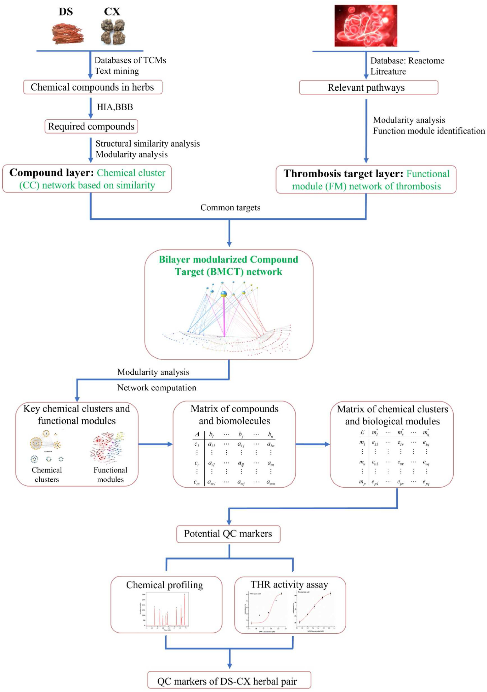
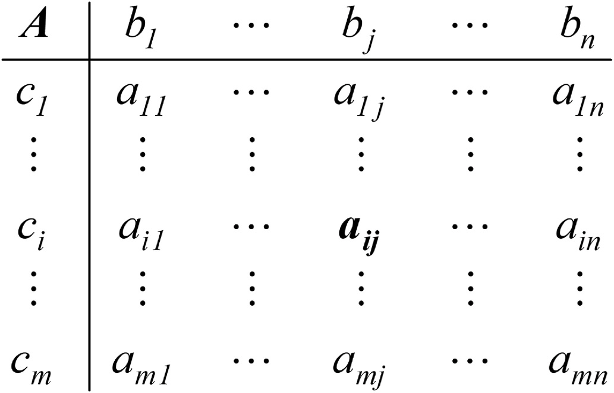
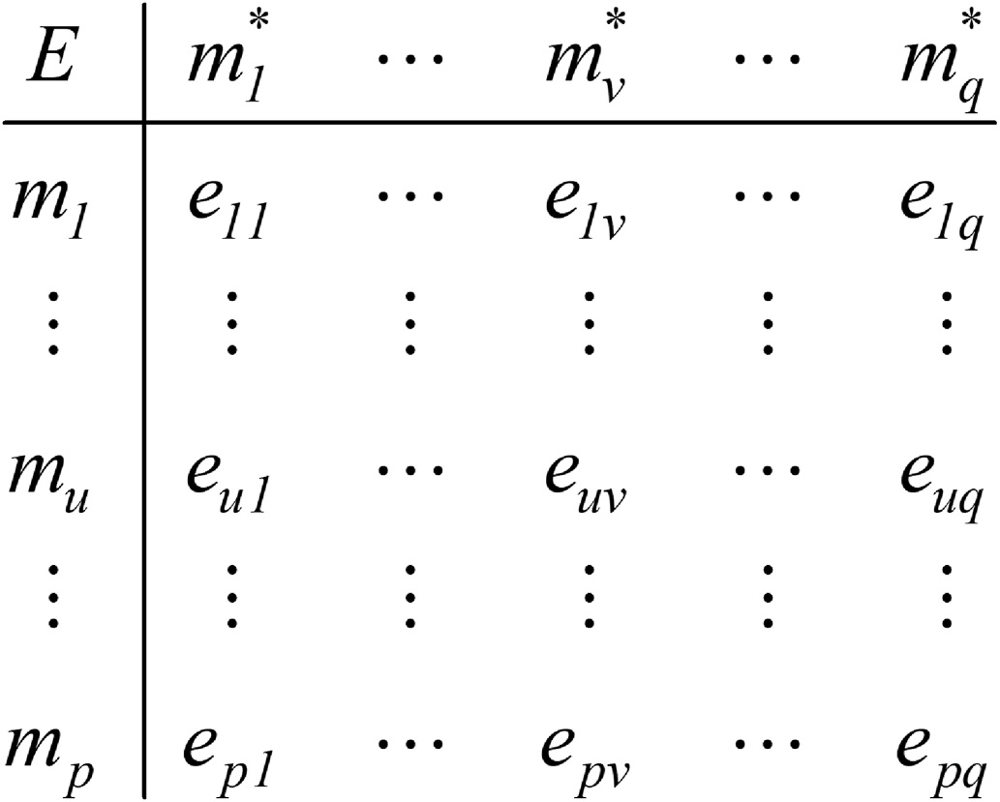
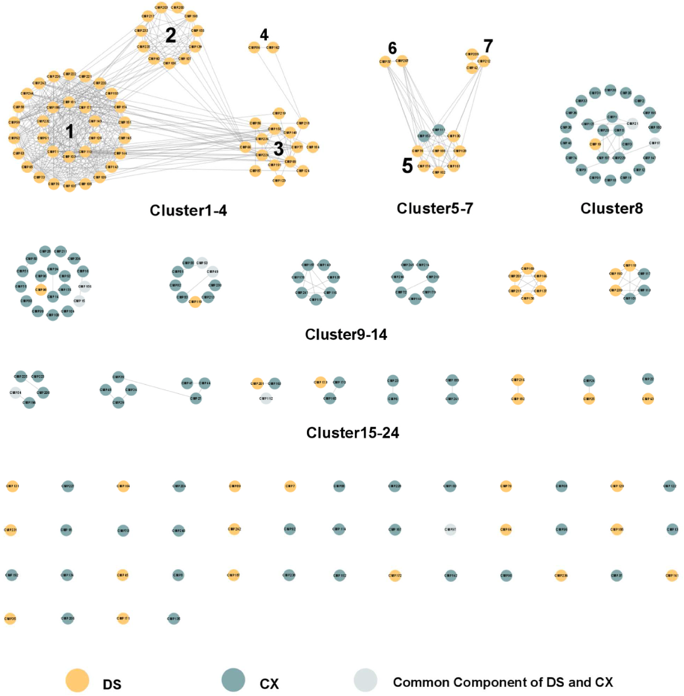
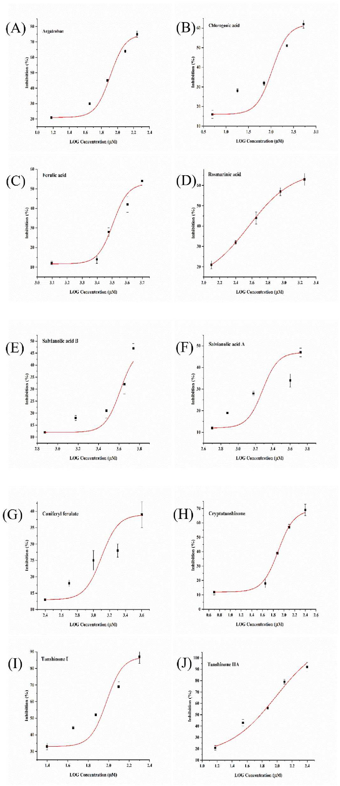
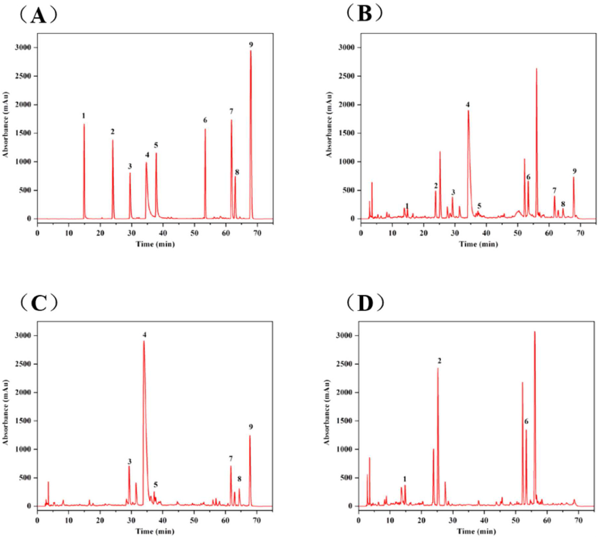

<!-- 方針: ほぼ全訳＋必要に応じた補足。原文構成に沿って訳出。「> 補足:」は訳者注。 -->

## 書誌情報

- 原題: A network pharmacology-based study on the quality control markers of antithrombotic herbs: Using Salvia miltiorrhiza - Ligusticum chuanxiong as an example
- 著者: Dai-Yan Zhang, Ruo-Qian Peng（同等貢献）, Xu Wang, Hua-Li Zuo, Li-Yang Lyu, Feng-Qing Yang（責任著者）, Yuan-Jia Hu（責任著者）（マカオ大学 中医薬品質研究国家重点実験室／同大学健康科学部薬剤学系、香港中文大学(深圳)生命健康科学学院／Warshel計算生物学研究所、重慶大学化学化工学院）
- 掲載: *Journal of Ethnopharmacology* 292 (2022) 115197. https://doi.org/10.1016/j.jep.2022.115197
- インパクトファクター: **5.4**（*Journal of Ethnopharmacology*, JCR 2024 / Clarivate）
- 受理経過: 受領 2022-01-16 / 改訂 2022-02-20 / 採録 2022-03-11 / オンライン公開 2022-03-21。オープンアクセス（CC BY-NC-ND 4.0）

> 補足: DS = 丹参（Danshen、Salvia miltiorrhiza Bungeの乾燥根茎）。CX = 川芎（Chuanxiong、Ligusticum striatum DC.の乾燥根茎）。CC = compound cluster（化合物クラスター）。FM = functional module（機能モジュール）。BMCT network = bilayer modularized compound target network（二層モジュール化化合物標的ネットワーク）。THR = thrombin（トロンビン）。QC = quality control（品質管理）。本論文はネットワーク薬理予測＋HPLC定量＋酵素阻害試験を組み合わせた研究論文。

## 要旨（Abstract）

**民族薬理学的関連性:** 丹参（DS、Salvia miltiorrhiza Bungeの乾燥根茎）と川芎（CX、Ligusticum striatum DC.の乾燥根茎）は、血行を促し瘀血を除く効能をもち、心血管疾患（CVD）と密接に関連する。

**研究目的:** 活性に基づく化学マーカーの同定は非常に重要だが、中医薬（TCM）に内在する「多成分・多標的・多効果」という複雑な機構がこの作業に大きな課題を課している。本研究では、複雑な全体システムと単一成分との「中間層（モジュール／クラスター）」を明確化することにより抗血栓生薬の品質管理（QC）マーカーを発見する有効な手法を探るため、DSとCXについてネットワーク薬理学的予測と実験的検証を組み合わせた。

**材料と方法:** 化合物の構造類似性解析と既発表の血栓症ネットワークに基づき、まず化合物クラスター（CC）ネットワークと機能モジュール（FM）ネットワークという2つの層をそれぞれモジュール化し、これらを連結して一つの二層モジュール化化合物標的（BMCT）ネットワークとした。CCから潜在的QCマーカーとなる重要な化合物を同定するために「二段階」計算を適用した。選定されたQCマーカー化合物のトロンビンに対するin vitro阻害活性を評価し、薬理活性を部分的に検証した。含量測定にはHPLCを用いた。

**結果:** ネットワークに基づく解析により、BMCTネットワークにおいて重要性の高い9化合物——タンシノンI、タンシノンIIA、クリプトタンシノン、サルビアノール酸B、フェルラ酸、サルビアノール酸A、ロスマリン酸、クロロゲン酸、コニフェリルフェルラート——がDS-CXのQCマーカーとして同定された。酵素阻害試験によりタンシノンIとタンシノンIIAの活性が部分的に確認された。化学プロファイリングにより、これら9つのマーカー化合物が当該薬対の主要成分であることが示された。

**結論:** 本研究はDS-CX薬対の活性指向QCマーカーを同定し、他の生薬・薬対・方剤のQCにも応用可能な新しい方法論を提供した。

## 1. 序論（Introduction）

中医薬（TCM）の品質管理（QC）には、安全性と有効性を確保するための厳格で明確な規則が求められる（Wu et al., 2018）。活性に基づく化学マーカーの同定は非常に重要だが、TCMに内在する「多成分・多標的・多効果」という複雑な機構がこの作業に大きな課題を課している（Zhang et al., 2016）。具体的には、QCマーカーの発見と同定は主として系統的な化学分離に依存し、続いて相当数の薬理活性アッセイの開発とバイオアッセイ誘導型の化学分離が行われる（Zhang, X. et al., 2017）。しかしながら、成分の多様性、分離・スクリーニング過程の困難さ、機構の複雑さから、有効成分の同定は常にTCM研究のボトルネックであり続けてきた（Yu et al., 2010）。TCMの複雑な性質と煩雑な実験は、QC指標を見出すための新しい方法の登場を要請している。

このTCMのQCマーカーをめぐるジレンマに直面し、全体の複雑システムと単一成分の間にある中間層「モジュール／クラスター」を明確化することが問題解決の一助となりうる。「モジュール／クラスター」とは全体の下位集団であるが、類似の性質をもつ化合物または標的を統合するものである。TCMにおいては、「モジュール／クラスター」によってTCMの全体的性格を反映しようとするいくつかの概念——「軍団（army group）」効果（Shaoqing et al., 2015）、生物活性等価配合成分（bioactive equivalent combinatorial components）（Liu et al., 2014）、缶詰理論（Canister theory）（Meng et al., 2000）——が提唱されてきた。TCMのQCに対応させると、疾患モジュールに寄与する化合物のクラスターを同定することは、活性に基づく化合物を探索しQCマーカーの範囲を絞り込むうえで大いに有用となりうる。しかし、「モジュール／クラスター」概念を含む複雑なTCM生物学的データは、データ解析・統合にとって課題である。ネットワーク薬理学はこの状況に対処する有効なツールであり、特殊な可視化解析能力と多次元データ統合能力を通じて、中医薬のQCマーカーを探索する新しいアプローチを提供する。

薬対は最小の構成単位として方剤の薬効を反映しつつ、構成の単純さゆえに研究がしやすい（Wang et al., 2012）。本研究では、抗血栓効果と広範な普及をもちながら既存のQCマーカーに改善の余地がある薬対、丹参（DS、Salvia miltiorrhiza Bungeの乾燥根茎）と川芎（CX、Ligusticum striatum DC.の乾燥根茎）を例に上記の手法を検討した。DSとCXは血行を促し瘀血を除く作用によって心血管疾患（CVD）関連疾患の治療に広く用いられている（Chen et al., 2018b; Cheng, 2007）。中国中医薬協会が2019年に発表した中成薬ブロックバスター製品に関する公式報告によれば、DSとCXは最も売れている漢方方剤で最も頻繁に併用される薬対を構成している（Geng et al., 2020）。DSとCXはまた、米国・日本・オーストラリア・韓国・オランダなどでも広く使用されている（Chen et al., 2018b; Cheng, 2006, 2007; McEwen, 2015）。しかし、両者の既存の品質マーカーはその複雑な性質を十分に反映していない可能性がある。中国薬局方（2020年版）では、DSのQC規格はタンシノンIIA・クリプトタンシノン・タンシノンIの総含量（HPLCで測定）が0.25%以上、サルビアノール酸Bの含量が3.0%以上であることとされ、CXのQC規格はフェルラ酸の含量が0.10%以上であることとされている。一方でDS-CXは多くの方剤に用いられている。中国薬局方に記載の通り、サルビアノール酸Bは精製冠心口服液/顆粒、脈楽丸/片/胶囊、保心片のQCマーカーとして用いられ、サルビアノール酸Bとタンシノンリアは精製冠心片/軟胶囊のQCマーカーとして、丹参素は心寧片のQCマーカーとして用いられている。生薬・関連製品のQCマーカーとして使われている化学成分はごく僅かに過ぎない。QCマーカーの不備、CVDに対する顕著な有効性、臨床での広範な応用という点から、DS-CXはネットワーク薬理学に基づく手法をQCマーカーへ応用する研究対象として好適である。

このような背景のもと、本研究はネットワーク薬理学的手法と実験を組み合わせることにより、DS-CX薬対の潜在的QCマーカーを探索することを目的とする。化合物の構造類似性解析と既発表の血栓症ネットワーク（Kong et al., 2015）に基づき、まず化合物クラスター（CC）ネットワークと血栓症の機能モジュール（FM）ネットワークという2つの層をそれぞれモジュール化し、これらを連結して一つの二層モジュール化化合物標的（BMCT）ネットワークとした。化学物質と標的の相互作用とモジュール／クラスターの区分を組み合わせ、異なるCCとFMの累積スコアを算出し、どのCCが特定の機能を担っているかを比較した。スコアの高いCCに絞り込み、特定の化合物をさらに同定した。選定されたQCマーカーのトロンビンに対するin vitro阻害活性を評価し、薬理活性を部分的に検証した。本研究の研究フレームワークをFig. 1に示す。

## 2. 材料と方法（Materials and methods）

### 2.1 データマイニングと処理

#### 2.1.1 化合物の収集と処理

DSとCXの化合物情報は、文献ならびに3つの化学データベース——Traditional Chinese Medicine System Pharmacology Database（TCMSP; http://tcmspw.com/tcmsp.php）、Traditional Chinese Medicines Integrated Database（TCMID; http://www.megabionet.org/tcmid/）、中国科学院上海有機化学研究所化学データベース（http://www.organchem.csdb.cn）——から収集した。トレオニンや果糖などの一般的なアミノ酸・単糖類は本研究から除外した。PubChem（http://pubchem.ncbi.nlm.nih.gov）を用いて化合物を標準化し、PubChem CIDや標準化SMILES（simplified molecular-input line-entry system）情報などの関連化学データを補完した。さらに、初期スクリーニングのため、ヒト腸管吸収（HIA）と血液脳関門（BBB）透過性の情報をadmetSAR（http://lmmd.ecust.edu.cn/admetsar2）から収集した。HIAまたはBBBが陰性の化合物は除外した。ただし、文献と照合したところ、顕著な薬理活性をもつ一部の化合物が除外されてしまうことが判明し、予測プラットフォームの偽陰性の可能性を考慮して、これらの化合物を再び研究対象に含めた。

#### 2.1.2 標的の収集と処理

DSとCX薬対の標的は、TCMSP、PubChem、similarity ensemble analysis（SEA; http://sea.bkslab.org/）の3つの情報源から取得した。TCMSPについては「関連標的」情報を収集した。PubChemについては「バイオアッセイ結果」で「active」と表示された情報を採用した。また、実験的研究の限界を補うため、SEAによる仮想予測を追加データとして用いた。SEAから得た標的のうち、偽発見率（false discovery rate）<0.05かつmaxTc≥0.57を満たすものをデータセットに残した。データベースUniProt（https://www.uniprot.org/）を用いて標的の遺伝子名を標準化した。

### 2.2 ネットワーク構築

#### 2.2.1 CCネットワーク構築

本研究では、化合物は構造類似性に基づいてCCネットワークを形成した。ChemmineR（Rstudio上で動作）ツールキットを用い、Tanimoto係数≥0.6（Delaney, 1996）によるアトムペア指紋に基づく化合物類似性探索を化合物間で実施した。化合物類似性クロスマトリクスを得た後、Cytoscape 3.8.0（Shannon et al., 2003）で化合物構造類似性ネットワークを構築・可視化した。さらにトポロジーパラメータを抽出した。異なる母骨格をもつモジュール化ネットワークを得るため、MCODE 1.6.1プラグイン（Bader and Hogue, 2003）を用いてネットワークを異なるクラスターに分割した。分類結果は各クラスターが同一の母骨格をもつことを確認するため手作業で検証した。

#### 2.2.2 FMネットワーク構築

標的を抗血栓効果に焦点を当てるため、本研究ではKong et al.(2015)の血栓症ネットワークを参照し、これを本研究のFMネットワークとした。先行研究において、血栓症ネットワークの標的情報はReactomeデータベースと文献に由来し、経路・反応情報は3つの異なるFM——凝固カスケード（FM1）、フィブリン血栓の溶解（FM2）、血小板の活性化・シグナル伝達・凝集（FM3）——に分けられている。このネットワークにおいて、ノードはタンパク質またはタンパク質複合体を表し、血栓形成過程に関与する。一部のタンパク質複合体は複数の遺伝子によりコードされている場合がある。化合物の標的と対応させるため、血栓症ネットワークのタンパク質／タンパク質複合体を単一標的に分割し、さらなる比較に用いた。

#### 2.2.3 BMCTネットワーク構築

BMCTネットワークは、生薬化合物のCCネットワークと血栓症関連のFMネットワークからなる二層ネットワークである。化合物とその標的間の相互作用ならびに血栓症ネットワーク中のタンパク質を組み合わせることにより、2つのモジュール化ネットワークが連結されBMCTネットワークが形成された。

### 2.3 ネットワーク解析

文献および我々の先行研究から、生薬または生物学的ネットワークは通常、スモールワールドの特徴をもつ非ランダムなスケールフリーネットワークであることが知られている（Zhang, Q. et al., 2017; Zhang et al., 2019; Zuo et al., 2018）。すなわち、化学ネットワーク中の化合物や生物学的ネットワーク中の生体分子は均一に扱うべきではない。そこで、化合物と標的の重みは標準化されたネットワークパラメータに基づいて設定した。化学層では、クラスター化されたノードの次数中心性、媒介中心性、近接中心性をまず標準化した。式(1)は、xを標準化した値x\*を示す（xはネットワークパラメータを表す）。3つの標準化データの平均をw(ci)と定義した。個々のノードは1つのクラスターとみなし、その重みは「1」とした。血栓症ネットワークのノードは単一タンパク質またはタンパク質複合体を表し、その重みw(bj)はw(ci)と同じ方法で算出した。

x\* = log10(x + 1) / log10(xmax + 1) ……(1)

重み計算の後、化合物と標的の間、ならびにCCとFMの間の連結強度を明確化するアルゴリズムを提案した。次の2種類の行列を用いて明確に表現した。第一に、化合物と標的の重み付き関係の測定をFig. 2に示す。ここでaij∈{0,1}であり、aij = 1は化合物ciが標的bjに関連することを示し、0は連結なしを意味する。式(2)は、化合物ciと標的bj間の連結強度dijの算出方法を示す。式(2)ではw(ci)とw(bj)を式(1)によりさらに標準化し次元の影響を排除する。

dij = w(ci)・aij + w(bj)・aij ……(2)

ここでw(ci)は化学ネットワークにおける化合物ciの重み、w(bj)は生物学的ネットワークにおける標的bjの重みを表す。

さらに、TCMの本質的な性質と全体的特性を反映するため、TCMの化学的・生物学的クラスタリング特性を考慮した。グラフ表現の観点からは、構造類似性をもつ化合物と類似機能をもつ生体分子をそれぞれ統合することにより、化学ネットワークと生物学的ネットワークをモジュール／クラスターに基づくネットワークへ縮約できる。行列表現の観点からは、同質な行および列を統合できる。行列Am×nはFig. 3に示すように行列Ep×qへと変換される。式(3)に算出方法を示す。

euv = Σdij = Σ（ci∈mu, bj∈m\*v）〔w(ci)・aij + w(bj)・aij〕 ……(3)

ここでeuvはmuとm\*vの関連度を測定するのに用いられ、euvはdijの総和に等しい。

行列Ep×qで表される化学モジュールと生物学的モジュールの関係について、式(4)に示す「二段階」解法をマーカー同定に用いた。argmaxは関連する関数域における点であって、その関数値が最大となる点を表す。第一段階では、{P(m\*v), v=1,…,q}の集合、すなわちm\*vを制御するCCの組み合わせのうち、最も強い連結（すなわちeuvの最高値）をもつものを同定した。有意なCCをスクリーニングした後、第二段階では、関連する制約条件を満たす複数のciであるQ(m\*v)（m\*vに対応する潜在的QCマーカー）を絞り込んだ。{Q(m\*v), v=1,…,q}の集合は、それぞれ異なる関連生体分子を制御するQCマーカーの組み合わせであった。最終的にw(ci)の最も高い値をもつ潜在的QCマーカーを得た。血栓症の複雑さと生物学的ネットワークにおけるスモールワールドの特性を踏まえると、このような生体分子モジュールに基づく戦略はQCマーカーの同定に妥当であるといえる。

> 補足: 上記の「二段階法」は本研究の中核アルゴリズムで、①血栓症に関わる機能モジュール（FM）を最も強く連結する化合物クラスター（CC）を絞り込み、②そのCC内から個々の化合物を重みでランキングして代表的な化合物をQCマーカー候補として抽出する、という二段構えの選定手順である。

### 2.4 試薬・材料

標準品のクロロゲン酸、フェルラ酸、ロスマリン酸、サルビアノール酸B、サルビアノール酸A、コニフェリルフェルラート、クリプトタンシノン、タンシノンI、タンシノンIIA（いずれもHPLCによる純度≥98%）は成都Purechem-standard社から購入した。トロンビンはSigma-Aldrich（米国セントルイス）から購入した。基質S-2238（HPLC純度≥99%）は北京Adhoc International Technology社から入手した。アルガトロバンは北京華中海威基因技術社から購入した。HPLCグレードのアセトニトリルとメタノールは、それぞれ上海泰坦科技社（上海）と北京因諾凱科技社（北京）から購入した。エタノールは成都川試化学社から入手した。実験用の水はすべて水精製システム（ATSelem, 1820A、重慶市安特生環境保護設備）で精製した。

DSとCXの生薬は2020年5月に康美薬業社から購入した。原産地はそれぞれ山東省・四川省である。丹参（標本番号SM2020050101）と川芎（標本番号CF2020050101）の証拠標本は重慶大学化学化工学院薬学工程実験室に保管されている。

### 2.5 試料溶液の調製

標準品を精密に秤量しメタノールに溶解して、サルビアノール酸B 1600.0 μg/mL、タンシノンIIA 600.0 μg/mL、コニフェリルフェルラート・クロロゲン酸・フェルラ酸・ロスマリン酸・サルビアノール酸A・クリプトタンシノン・タンシノンI 400.0 μg/mLの標準溶液を調製し、使用前は4℃で保存した。

DSとCXの生薬は粉砕し、50メッシュ篩（約0.29 mm）でふるった後、乾燥箱に保存した。丹参:川芎（DC）を11種類の異なる比率（1:0、1:1、2:1、3:1、2:3、3:4、4:3、3:2、1:3、1:2、0:1）で調製し、超音波抽出を行った。まず、DSとCXの混合粉末2.0 gを250 mLの丸底フラスコ中で70%エタノール20 mLに分散させた。次いで約25℃の超音波洗浄器中で30分間抽出した。上記操作を2回繰り返した。抽出液をろ過して合わせ、（4℃、2504×g）で10分間遠心分離した。上清を回収し、0.22 μmメンブレンフィルター（上海泰坦科技社）でさらにろ過してから分析に供した。

### 2.6 HPLC分析

HPLC分析はAgilent 1260シリーズ液体クロマトグラフ（Agilent Technologies、米国パロアルト）で行い、フォトダイオードアレイ検出器（DAD）を装備し、Agilent ChemStationソフトウェアで制御した。クロマトグラフィー分離はAgilent ZORBAX SB-Aqカラム（250 mm × 4.6 mm、5 μm）に、ガードカラム（12.5 mm × 4.6 mm、5 μm）を前置し、カラム温度35℃で行った。移動相は0.1%酢酸水溶液（A）とアセトニトリル（B）からなり、流速1 mL/minとした。グラジエントプログラムは以下の通り：0–2 min、5% B；2–10 min、5–15% B；10–24 min、15–22% B；24–35 min、22–29% B；35–42 min、29–37% B；42–60 min、37–60% B；60–62 min、60–5% B；62–70 min、5% B。全試料の注入量は10 μLとした。

### 2.7 THR（トロンビン）阻害活性アッセイ

PBS（リン酸緩衝生理食塩水）緩衝液は、Na2HPO4 1.44 gとKH2PO4 0.24 gを水800 mLに溶解して調製した（1.0 M NaOHでpHを8.0に調整）。THR原液（125 U/mL）はTHR 4.16 mgをPBS 1.0 mLに溶解して調製した。S-2238（2.0 mg/mL）、アルガトロバン（0.8 mM）、標準品（5.0 mM）の各原液はPBS緩衝液中で調製した。アルガトロバンおよび標準品溶液は、使用前にPBSで所望の濃度に希釈した。THR阻害活性アッセイはiMark™マイクロプレート吸光度リーダー（Bio-Rad Laboratories, Inc.、米国）で実施した。アルガトロバンまたは標準品溶液50 μLとTHR溶液50 μLを混合し、37℃で10分間インキュベートした。続いて発色基質としてS-2238（2.0 mg/mL）100 μLを添加し、マイクロプレートリーダーで反応を開始した。吸光度は405 nmで10分間、30秒ごとにモニタリングし、各群は3回測定した。対照群では標準品溶液をPBS緩衝液に置き換えた。THRの阻害率（%）は以下の式(5)により算出した。

I(%) = [(dA/dt)blank − (dA/dt)sample] / (dA/dt)blank ……(5)

I(%)は阻害率、(dA/dt)blankと(dA/dt)sampleはそれぞれ対照群と実験群の反応速度を表す。結果は3回の実験の平均値±標準偏差で示した。

## 3. 結果（Results）

### 3.1 CCネットワーク

DS-CXのCCネットワークは**227ノード・471エッジ**からなり（Fig. 4）、構造活性相関の理論に従えば、類似構造をもつ化合物は類似の生物活性を示す傾向があり、異なるCCは異なる生物学的機能を生じうる（Ma et al., 2015）。MCODEによるモジュール処理と手作業による検証の後、**24のCC**が同定された。化合物情報はTable S1（補足資料）を参照。

### 3.2 FMネットワーク

FMネットワークでは、ノードは血栓症に関連する単一タンパク質／タンパク質複合体を表す。DS-CXの抗血栓標的を同定するため、血栓症ネットワークの149のタンパク質／タンパク質複合体を**137標的**に分割した（Table S2）。例えば、プロトロンビナーゼはF5とF10に分割され、プロトロンビンはF2に対応する。さらに、血栓症ネットワークは3つの独立FMと2つの交差FMに分割された。

DS-CXの405標的と血栓症ネットワークの137標的を重ね合わせたところ、DS-CXの抗血栓標的として**18標的**（AKT1、F2、F3、F7、F10、FYN、GNAI1、ITGA2B、ITGB3、LCK、MAPK1、MAPK11、MAPK14、MAPK3、PIK3CG、PLAU、PTPN1、SRC）が同定された。これら18標的は27のタンパク質／タンパク質複合体にわたって分布していた。

### 3.3 BMCTネットワーク

BMCTネットワークは、構造類似性でクラスタリングされた化学ネットワークと機能に基づく生物学的ネットワークからなる。CCネットワークは450エッジ・155ノードからなった。第一段階の計算結果（最適なCCの選択）を明確に可視化するため、全化合物を10の非クラスター化合物と、生物学的層を直接制御する12のCC（CC1、CC2、CC3、CC5、CC7、CC8、CC9、CC10、CC13、CC14、CC23、CC24）に分けた。

標的層は149のタンパク質と414の関係からなり、異なる色分けで**5つのFM**に分割された。DS-CX薬対によって直接影響を受ける27のタンパク質／タンパク質複合体のうち、FM1に8、FM2に2、FM3に16、FM1&3に1が属した。化合物-標的の連結に基づき176の連結が同定され、そのうちFM1に83、FM2に8、FM3に53、FM1&3に32が属した。

BMCTネットワークの全体像はFig. S1（補足資料）に示す。ネットワークが化合物・標的とそれぞれのモジュール特性を含む多くの要素を網羅しているため、全体としてかなり煩雑に見え、「モジュール／クラスター」特性の表現にも適さない。特に、CCは10以上のグループが存在する。そこで、クラスター特性に基づき化合物層のネットワークを統合した。Fig. 5に示すように、化学層では1ノードが1化合物クラスターを表し、ネットワークが簡潔になると同時に、DS-CXの異なる化合物クラスターが担う主要な生物学的機能を明確に示している。

### 3.4 ネットワーク解析

方法の項で述べた「二段階」解法に従い、まず抗血栓標的を直接制御する12の化学モジュールと血栓症ネットワークFMの間の連結強度を算出した（Table 1）。FM1&2はDS-CXによって制御されないため、ここには示していない。Table 1に示すように、**CC1、CC2、CC13**は他のCCよりも生物学的FMの制御において高い連結強度を示した。

「二段階」法の第二段階に従い、より高い連結強度をもつCCを選定した。第1のCCの化合物が尽きた場合、第2のCCの化合物が補完として機能する。以下同様である。候補化合物が特定のTCMに偏らないよう、候補化合物はDSとCXそれぞれについてスクリーニングした。計算により、化合物と標的の連結強度を決定し、同一FMに属する標的の連結を組み合わせることで、異なる生物学的モジュールを反映する**88の連結**を最終的に確定した（Table S3）。さらに、重要な化合物を特定するため、88の連結に基づき33のDS化合物と20のCX化合物の総連結強度を最終的に算出し、化合物を統合・順位付けした（Table S4）。

**Table 1. CCとFM間の連結強度**

| CC | FM1 | FM2 | FM3 | FM1&3 | 合計(SUM)a |
|---|---|---|---|---|---|
| CC1 | 14.96 | – | 7.60 | 21.61 | 44.17 |
| CC2 | 10.39 | – | 13.22 | 7.22 | 30.83 |
| CC3 | 5.13 | – | 5.43 | 2.50 | 13.06 |
| CC5 | 1.13 | 2.25 | – | 1.61 | 4.99 |
| CC7 | 4.06 | 1.86 | 3.07 | – | 8.99 |
| CC8 | 8.10 | 1.14 | – | 1.91 | 11.15 |
| CC9 | 5.05 | – | – | 1.44 | 6.49 |
| CC10 | 3.51 | – | – | – | 3.51 |
| CC13 | 7.46 | – | 16.59 | 1.58 | 25.63 |
| CC14 | 2.46 | 2.10 | 3.35 | – | 7.91 |
| CC23 | 5.68 | – | 2.23 | – | 7.91 |
| CC24 | 2.52 | – | 0.61 | 0.95 | 4.08 |

a 4つのFMに対するCCの総連結強度。

過去に報告された定量結果（Li et al., 2003, 2008; Yan et al., 2005; Zhong et al., 2009）を考慮し、DS-CXの潜在的化学マーカー8種を選定した。詳細情報をTable 2に示す。加えて、中国薬局方でDSのQCマーカー・化学マーカーの一つとされているサルビアノール酸Bも実験的検証のために含めた。

**Table 2. DS-CXの潜在的品質マーカー**

| モジュール | 生薬 | 化合物 | 化合物クラスター | 生体分子 | 遺伝子名 | スコア |
|---|---|---|---|---|---|---|
| FM1 | DS | タンシノンIIA | CC1 | プロトロンビン | F2 | 1.19 |
| FM1 | DS | タンシノンI | CC2 | プロトロンビン | F2 | 1.00 |
| FM1 | CX | コニフェリルフェルラート | 非クラスター化合物 | TF、隔離TF | F3 | 3.31 |
| FM1 | CX | フェルラ酸 | CC14 | TF、隔離TF | F3 | 2.46 |
| FM2 | DS | – | – | – | – | – |
| FM2 | CX | – | – | – | – | – |
| FM3 | DS | ロスマリン酸 | CC13 | p-Y419-Src、Src、Fyn、p-Y530-Src、focal complex、G-protein Gi、LCK、GNAI | SRC, FYN, ITGA2B, ITGB3, GNAI1, LCK | 8.75 |
| FM3 | DS | サルビアノール酸A | CC13 | 同上 | 同上 | 7.84 |
| FM3 | DS | タンシノンIIA | CC1 | integrin alpha IIb beta3、focal complex、integrin alpha IIb p(T779)-beta3 | ITGA2B, ITGB3, SRC | 3.97 |
| FM3 | DS | クリプトタンシノン | CC1 | PTPN1 | PTPN1 | 1.16 |
| FM3 | DS | タンシノンI | CC2 | PI3K gamma | PIK3CG | 1.14 |
| FM3 | CX | クロロゲン酸 | 非クラスター化合物 | PTPN1 | PTPN1 | 1.56 |
| FM3 | CX | フェルラ酸 | CC14 | PTPN1 | PTPN1 | 1.13 |
| FM1&3 | DS | タンシノンIIA | CC1 | トロンビン | F2 | 1.66 |
| FM1&3 | DS | タンシノンI | CC2 | トロンビン | F2 | 1.47 |
| FM1&3 | CX | – | – | – | – | – |

### 3.5 選定化合物のTHR阻害活性

これら9化合物のin vitro THR阻害活性を評価した。既知のTHR阻害剤であるアルガトロバンを陽性対照薬として用いた。結果をFig. 6に示す。アルガトロバンはIC50値81.62 μMで強い阻害効果を示した。クロロゲン酸（IC50 194.25 μM）、クリプトタンシノン（IC50 114.92 μM）、タンシノンI（IC50 148.05 μM）、タンシノンIIA（IC50 129.60 μM）は良好な阻害活性を示した。一方、フェルラ酸（IC50 3574.92 μM）、ロスマリン酸（IC50 472.89 μM）、サルビアノール酸B（IC50 4328.79 μM）、サルビアノール酸A（IC50 2456.68 μM）、コニフェリルフェルラート（IC50 1450.60 μM）は明確な阻害活性を示さなかった。Table 2に示す通り、タンシノンIとタンシノンIIAはトロンビンおよびプロトロンビンを標的としている。したがって、これらの結果は選定されたQCマーカーが生物活性化合物であることを部分的に示している。

### 3.6 HPLCによるDS-CX薬対中のマーカー化合物の含量測定

HPLC法のバリデーションについては補足資料を参照のこと。開発したHPLC法に基づき、超音波抽出法によるDS-CX薬対抽出物中の9種のマーカー化合物の含量を測定した。結果をTable 3に示す。標準品混合物、DS:CX=1:1、DS、CX(D)のHPLCクロマトグラムをFig. 7およびFig. S2に示す。結果は、9種のマーカー化合物がこの薬対の主要成分であることを示し、サルビアノール酸Aを除いて、配合比によらずDSまたはCXの生薬中の含量は類似していた。サルビアノール酸Aの変動は、その構造中のエステル結合が分解されやすいためと考えられる。

**Table 3. 配合比の異なる生薬（超音波抽出）中の9成分の含量変化（mg/g）**

| 試料 | クロロゲン酸a | フェルラ酸 | ロスマリン酸 | サルビアノール酸B | サルビアノール酸A | コニフェリルフェルラート | クリプトタンシノン | タンシノンI | タンシノンIIA |
|---|---|---|---|---|---|---|---|---|---|
| DC 1:0 | –b | – | 1.55 ± 0.05c | 7.15 ± 0.12 | 0.49 ± 0.03 | – | 0.62 ± 0.02 | 0.94 ± 0.03 | 0.51 ± 0.04 |
| DC 3:1 | 0.62 ± 0.02 | 1.46 ± 0.00 | 1.94 ± 0.01 | 9.64 ± 0.02 | 0.54 ± 0.01 | 2.24 ± 0.04 | 0.71 ± 0.00 | 1.16 ± 0.00 | 0.70 ± 0.00 |
| DC 2:1 | 0.49 ± 0.01 | 1.44 ± 0.03 | 2.10 ± 0.00 | 10.41 ± 0.03 | 0.55 ± 0.03 | 1.84 ± 0.03 | 0.86 ± 0.01 | 1.30 ± 0.01 | 0.80 ± 0.01 |
| DC 3:2 | 0.58 ± 0.00 | 1.56 ± 0.02 | 2.15 ± 0.00 | 11.16 ± 0.01 | 0.55 ± 0.00 | 1.80 ± 0.02 | 0.75 ± 0.00 | 1.25 ± 0.00 | 0.79 ± 0.02 |
| DC 4:3 | 0.54 ± 0.01 | 1.50 ± 0.01 | 2.07 ± 0.01 | 10.46 ± 0.09 | 0.43 ± 0.03 | 1.80 ± 0.01 | 0.74 ± 0.04 | 1.24 ± 0.00 | 0.75 ± 0.00 |
| DC 1:1 | 0.50 ± 0.00 | 1.39 ± 0.02 | 2.07 ± 0.01 | 8.26 ± 0.02 | 0.17 ± 0.01 | 2.18 ± 0.02 | 0.67 ± 0.06 | 1.12 ± 0.01 | 0.61 ± 0.04 |
| DC 3:4 | 0.55 ± 0.04 | 1.55 ± 0.01 | 2.07 ± 0.01 | 9.76 ± 0.01 | 0.12 ± 0.01 | 1.77 ± 0.03 | 0.77 ± 0.00 | 1.33 ± 0.00 | 0.79 ± 0.00 |
| DC 2:3 | 0.54 ± 0.00 | 1.51 ± 0.02 | 2.00 ± 0.01 | 9.75 ± 0.00 | 0.13 ± 0.02 | 1.64 ± 0.04 | 0.73 ± 0.02 | 1.24 ± 0.03 | 0.72 ± 0.01 |
| DC 1:2 | 0.56 ± 0.01 | 1.52 ± 0.09 | 1.78 ± 0.05 | 9.08 ± 0.02 | 0.19 ± 0.00 | 1.66 ± 0.07 | 0.60 ± 0.00 | 1.38 ± 0.02 | 0.50 ± 0.00 |
| DC 1:3 | 0.56 ± 0.00 | 1.44 ± 0.06 | 2.06 ± 0.02 | 9.37 ± 0.01 | 0.25 ± 0.00 | 1.65 ± 0.02 | 0.71 ± 0.03 | 1.38 ± 0.00 | 0.75 ± 0.01 |
| DC 0:1 | 0.43 ± 0.02 | 1.32 ± 0.07 | – | – | – | 1.73 ± 0.04 | – | – | – |

a クロロゲン酸・フェルラ酸・コニフェリルフェルラートの含量はCXの生薬量に基づき算出、ロスマリン酸・サルビアノール酸B・サルビアノール酸A・クリプトタンシノン・タンシノンI・タンシノンIIAの含量はDSの生薬量に基づき算出。 b 検出不可。 c 平均値 ± 標準偏差。

## 4. 考察（Discussion）

TCMは「多成分・多標的・多効果」によって効果を発揮する複雑なシステムであり、これが安全性・有効性の担保の難しさ（Chan et al., 2015; Chen et al., 2018a）と臨床効果の非保証性（Xu et al., 2013）につながっている。同時に、この特性はTCMの品質を同定することを困難にしている。さらに、産地要因・加工工程・採取時期・抽出精製過程・保存条件など様々な要因がTCMの品質に影響する（Ren et al., 2020）。このような状況を踏まえ、Liu教授によりQ-markerの概念が提唱され（Liu et al., 2016a）、生薬・加工品・エキス・製剤・中間製品を含む長い生産チェーンの様々なタイプのTCMをカバーする概念となった（Li and Le, 2021; Liu et al., 2016b）。「物質-機能」を核として、Q-markerは有効性-物質的基盤-品質管理マーカーを緊密に結び付け、原材料から様々な製品に至る全過程を貫く（Ren et al., 2020）。問題の複雑さゆえに、具体的な研究においてはQ-markerの指導のもとで重要な問題を段階的に解決していく必要がある。本研究では、生産チェーンの前段に位置する薬対のQCマーカーの同定を主眼とした。QCマーカーの調査においては、ガスクロマトグラフィー（GC）、HPLC、質量分析（MS）などの分析技術が一般的な手法である。GC-MS、LC-MS、近赤外分光法（NIRS）、核磁気共鳴（NMR）といった様々なクロマトグラフィー-MSも広く用いられている。しかし、これらの技術にはそれぞれ欠点がある。GC-MSは化合物ライブラリや標準品への依存度が高く（Ren et al., 2018; Sun et al., 2019）、LC-MSは異なるシステム間で保持時間の再現性に乏しく（Dunn et al., 2011）、NMRは様々な用途に使えるが感度が低く検出可能な物質が限られる（Leenders et al., 2015）。従来の分析技術は新しい手法を必要としている。バイオインフォマティクス、ビッグデータサイエンス、計算生物学といった学際的分野の発展に伴い、研究者は特にTCM分野で、孤立したモードから系統的な研究モードへと目を向けている。「ネットワーク薬理学」の概念はLi教授によって提唱され（LI Shao et al., 2002）、作用機序の研究（Zhang et al., 2021）や、方剤・生薬の伝統的特性、生薬有効成分（Ma et al., 2020）、増効減毒（effect-enhancing and toxicity-reducing）（Lai et al., 2020）の研究に広く用いられている。TCMのQCという大きな研究課題に直面し、ネットワーク薬理学的手法は全体的な視点からTCMの全情報を統合し、異なる部分の生物学的機能に基づいて潜在的QCマーカーを決定し、異なる部分活性が相乗的に働くことを明らかにする。DS-CXの研究においては、2つの異種ネットワークがCCとFMにモジュール化され、化合物と標的間の相互作用によりBMCTネットワークへと連結された。これにより、単一化合物と標的の間の対応関係がクラスターとモジュールとして統合された。定量計算はさらにクラスターとモジュールの関連強度を同定し、異なるFMに対して責任を負うCCを見出す一助となり、「二段階」法による最終的なQCマーカーの選定を可能にした。このモジュールに基づく手法は、化合物群と疾患の関連を明確に示すため、活性に基づく化合物を同定する上で非常に有用であり、活性に基づく化合物と密接に関連している。実験手法と組み合わせることで、この新しい手法は有望な可能性を示している。

生薬・方剤と比較して、薬対は理想的な研究対象である。TCM配合理論（Wu et al., 2018）によれば、生薬は単独で用いると効果が限定的な場合があるが、特定の組み合わせで併用すると増強または相乗的な結果を示す。方剤は臨床で応用される主たる形態であり、配合理論の規則に従って複数の中薬を含むが、その多くはあまりに多くの成分を含み理解を妨げる。薬対はTCMの相乗効果を反映するのみならず、複雑な方剤——特に方剤の中で主要な効果を担う部分——を単純化するものであり、機序の理解を深めQCマーカーを同定する上で生薬や方剤よりも優れている。したがって、薬対は良好な研究対象であり、特にHXHY（活血化瘀）方剤で広く応用されている薬対はそうであると考える。

TCMは多成分・多標的・多効果という特徴をもつ典型的な複雑システムである。構造類似性によりクラスタリングされた化合物と機能的経路によりクラスタリングされた生体分子は、このシステムにおいて重要な役割を果たす。ある生薬または方剤について、「軍団（army group）」または「缶詰（canister）」効果が提唱されている（Shaoqing et al., 2015）。すなわち、単一の化合物／成分は低い親和性の作用しか及ぼせなくとも、類似構造をもつ多くの化合物／成分が協働することで、測定可能な薬理効果を生み出しうる（Li, 2015）。一方で、このクラスタリングはTCMの多標的生体調節にも存在する。これは、複数の標的を調節することでより効果的な薬剤／化合物の組み合わせを開発できること、そして疾患が単一遺伝子の異常によって引き起こされることは稀であることを示唆している（Barabási et al., 2011）。複雑疾患（例：癌、免疫系疾患）は特定の生物学的ネットワーククラスターの摂動によって引き起こされうることが一般的に受け入れられている（Spirin and Mirny, 2003）。

「二段階」解法は本研究のもう一つの重要な焦点である。モジュールの特徴はTCMの本質的な問いと、異なる生薬問題への転用可能性に関連している。「二段階」解法はQCマーカーの同定のために特別に設計されたものであり、TCMのQCマーカーのための最適化アルゴリズムであるとも言える。QCマーカーの同定には、数百の生薬化合物から最終的なマーカーとなる少数の化合物を同定する必要があり、それをどのようにスクリーニングするかが検討すべき課題である。本研究では、まず化学クラスターと機能モジュールが連結しているという前提のもとで化学クラスターの重要性を順位付けし、これによりまず一部の化合物を除外した。次に、これらのクラスターの中から、さらに代表的な化合物をQCマーカーとして選別した。

ネットワークレベルで抽象概念を可視化・定量化することは、現在のネットワークに基づくアプローチの一つの進歩となりうる。「軍団」「生物活性等価配合成分」「缶詰理論」のように、これらの理論はTCMの複雑な生物学的効果をその複雑な物質的基盤から考察することで、TCM開発のボトルネックに対処するために提唱された。中でも「缶詰理論」と「軍団」は、生薬に含まれる成分・代謝物の含量は低いが、その小さな生物学的効果が積み重なってより大きな効果を生み出すという事実を指す。「生物活性等価配合成分」とは、複雑な混合物から抽出された、元の生薬の効果全体を説明する成分の組み合わせの正確な組成を指す。これらの理論はまず、主要な役割を果たす生薬の活性成分を同定するために提唱され、次に、生薬の複雑な成分の重畳効果を説明するものである。本研究では、まずデータスクリーニングを通じて血栓症に関連する化合物を同定し、次に、モジュール化された化合物と血栓性生体分子との関係をBMCTネットワークの構築により定量的に解析することで、TCM中の異なるタイプの化合物とその重畳効果を明確に説明し、ネットワークレベルでこれらの理論の定量的な意義を明らかにした。ネットワーク解析については、分析プラットフォームに関連する研究上の限界もある。化合物データの収集・スクリーニングの過程で、化合物のHIAおよびBBBパラメータはadmetSARに由来し、パラメータ値と閾値を「+」「-」の記号に置き換えることで直感的に結果を示している。しかし、何らかの理由で一時的な運用停止があり、研究後段における原データの追跡可能性にある程度影響した。

最終的に、クロロゲン酸、フェルラ酸、ロスマリン酸、サルビアノール酸B、サルビアノール酸A、コニフェリルフェルラート、クリプトタンシノン、タンシノンI、タンシノンIIAの9つの化学化合物がDS-CXのQCマーカーとして選定された。ネットワーク研究により9化合物を得た後、これらが一般的な活性化合物であることを確認したが、この9化合物すべてが揃って登場したのは今回が初めてである。中国薬局方が定める5化合物と比較して、ネットワーク研究はさらに4化合物を追加提供し、重要なことに、ネットワーク解析は「モジュール／クラスター」概念と「二段階」解法を通じて、これら9化合物の出現に対する根拠を提供した。さらに、in vitro試験に基づき、タンシノンIとタンシノンIIAは良好なTHR阻害活性を示し、ネットワーク薬理学的解析によって選定されたQCマーカーが生物活性化合物であることを部分的に検証した。加えて、得られた結果は過去の研究によっても部分的に検証されている。単一凝固アッセイ法により、フェルラ酸はTF阻害活性において重要な役割を果たすことが証明されている（Lee et al., 2004）。ロスマリン酸はSrcファミリータンパク質チロシンキナーゼのSH2ドメインに対して特異的な阻害効果をもち（Won et al., 2003）、Fynキナーゼ阻害剤として発見された（Jelic et al., 2007; Liu et al., 2021）。また、Lckに作用し、Lck依存的にミトコンドリア経路を介したアポトーシスを誘導した（Hur et al., 2004）。さらに、サルビアノール酸AはLckとSrcのSH2ドメインとそれらのホスホチロシン含有結合モチーフとの結合を阻害することが示されている（Sperl et al., 2009）。さらに、破骨前駆細胞培養においてタンシノンIIAを添加するとc-Srcレベルが有意に低下した（Kim et al., 2004）。分子ドッキングシミュレーション研究に基づき、クリプトタンシノンは強力なPTPN1阻害活性を示した（Kim et al., 2017）。

本研究は複数の生薬や方剤にも拡張可能である。薬対と方剤の主な違いは、方剤がより多くの生薬を含み、それらの間の配合理論によって統制されている点にある。したがって、本研究とは対照的に、品質管理マーカーが主として君薬（sovereign drugs）に由来しつつ他の生薬も考慮するように、方剤における配合を考慮する必要がある。これは他の生薬の品質管理マーカーの研究にも転用可能である。本研究では血栓症関連疾患の治療のためにDSとCXを用いた新しいアプローチが提案された。このアプローチを他の生薬とその適応症の研究に転用する際には、良好な科学的データの裏付けを確保することが特に必要である。生薬化合物とその生物活性データについて十分なデータが存在することを確認することが重要である。次に、その適応症について、選定される疾患は明確な機序とより明確な生物学的基盤をもつ機能モジュールを備えている必要がある。

## 5. 結論（Conclusion）

本研究では、CCとFMを含む革新的なBMCTネットワークを構築した。モジュール化の概念と計算を適用することにより、DS-CXが凝固カスケードおよび血小板の活性化・シグナル伝達・凝集効果によって抗血栓作用を発揮することを同定した。「二段階」アルゴリズムは、まずCC1、CC2、CC13という重要なCCの同定を助け、さらに重要な化合物を潜在的QCマーカーとして同定した。in vitro THR阻害活性試験により、潜在的QCマーカーが生物活性化合物であることが部分的に証明された。最終的に、中国薬局方でDSの化学マーカーの一つとして掲載されているサルビアノール酸Bを含む9化合物が、DS-CXのQCマーカーとして選定された。要約すると、ネットワークの構築・解析、新規アルゴリズムの適用、実験的手法によって、本研究は二層モジュール化ネットワークモデルがDS-CX薬対のQCマーカーの同定に有効であることを確認した。本研究は新しい研究フローを提供し、品質管理の新たな手法を広げるものである。さらに、単一生薬・薬対、さらには方剤を含むTCMの潜在的機序の解明にも役立つ可能性がある。

## 訳者補足（実務的示唆・限界）

> 補足: 本研究の手法は、①化合物の構造類似性クラスター（CC）と疾患関連の機能モジュール（FM）という2つの「中間層」を定義し、②両者を連結した二層ネットワーク（BMCT）上で連結強度を定量することで、③網羅的スクリーニングでは埋もれがちな「活性寄与の高い化合物クラスター」を絞り込む、という三段構えになっている。実務的には、中国薬局方の既存規格（DS: タンシノンIIA・クリプトタンシノン・タンシノンI総量≥0.25%、サルビアノール酸B≥3.0%／CX: フェルラ酸≥0.10%）に対し、本研究はネットワーク解析により新たに4成分（クロロゲン酸・ロスマリン酸・サルビアノール酸A・コニフェリルフェルラート）を追加候補として提示しており、DS-CX薬対を含む方剤のQC規格を見直す際の参考になりうる。ただし、以下の限界に留意する必要がある。
>
> - **活性検証は部分的**: in vitroトロンビン阻害試験で活性を示したのは9成分中4成分（クロロゲン酸・クリプトタンシノン・タンシノンI・タンシノンIIA）のみで、他の5成分（フェルラ酸・ロスマリン酸・サルビアノール酸B・サルビアノール酸A・コニフェリルフェルラート）はトロンビン単独の酵素アッセイでは明確な活性を示さなかった（ただし著者らは文献レビューにより、これらもSrc/Fyn/Lck/PTPN1など他標的への作用が過去に報告されていると補足している）。つまり「QCマーカー＝薬効の主因」という単純な図式ではなく、多標的作用の一部のみを単一アッセイで検証した点に注意が必要。
> - **予測データベース依存**: 標的・ADMET情報の多くはTCMSP・PubChem・SEA・admetSAR等の予測／文献データベースに依存しており、著者ら自身がadmetSARの一時停止による原データ追跡可能性の低下を限界として挙げている。実務でこの枠組みを別の生薬・薬対に転用する際は、対象化合物・活性データの十分な裏付けの有無を確認する必要がある（原文考察部分に明記）。
> - **含量測定は配合比による相対評価**: Table 3のデータは、あくまで丹参と川芎の配合比を変えた抽出物中の含量比較であり、市販製品やロット間変動の網羅的な品質評価ではない。サルビアノール酸Aのみエステル結合の分解により配合比間で顕著な含量変動（0.12〜0.55 mg/g）を示しており、これは製剤の保存条件・加工工程管理における留意点として実務上参考になる。
> - **方法論としての射程**: 著者ら自身も述べている通り、本手法は薬対（2生薬の組み合わせ）を対象に設計されており、より多くの生薬を含む方剤へ適用する場合は君薬（主薬）を中心とした配合理論をどう組み込むかが今後の課題として残る。
