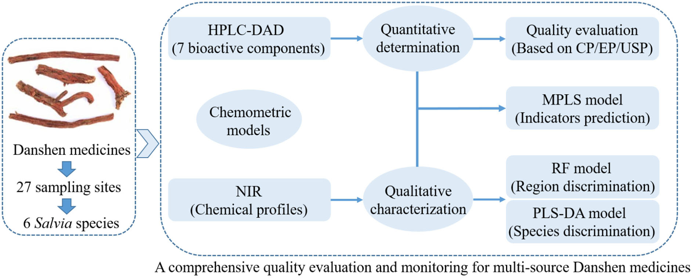
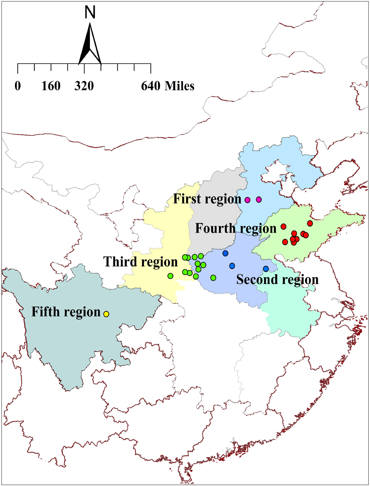
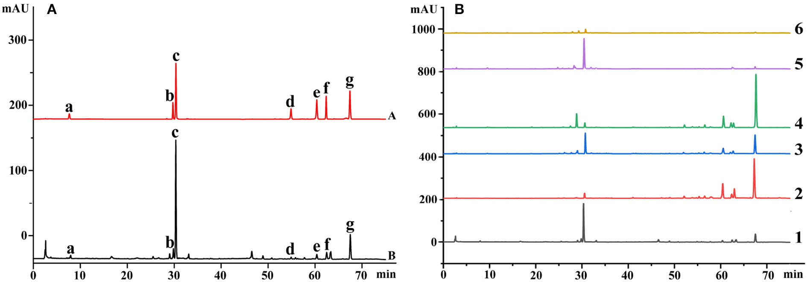
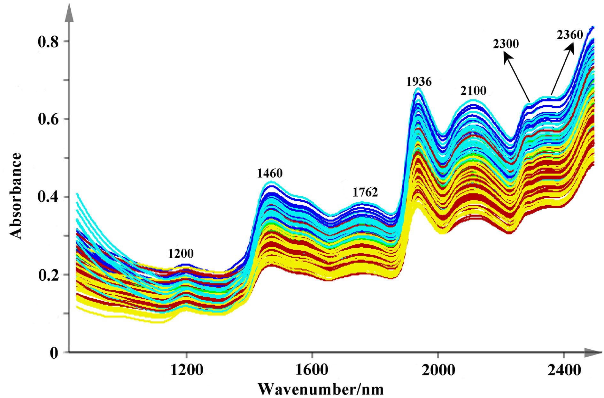
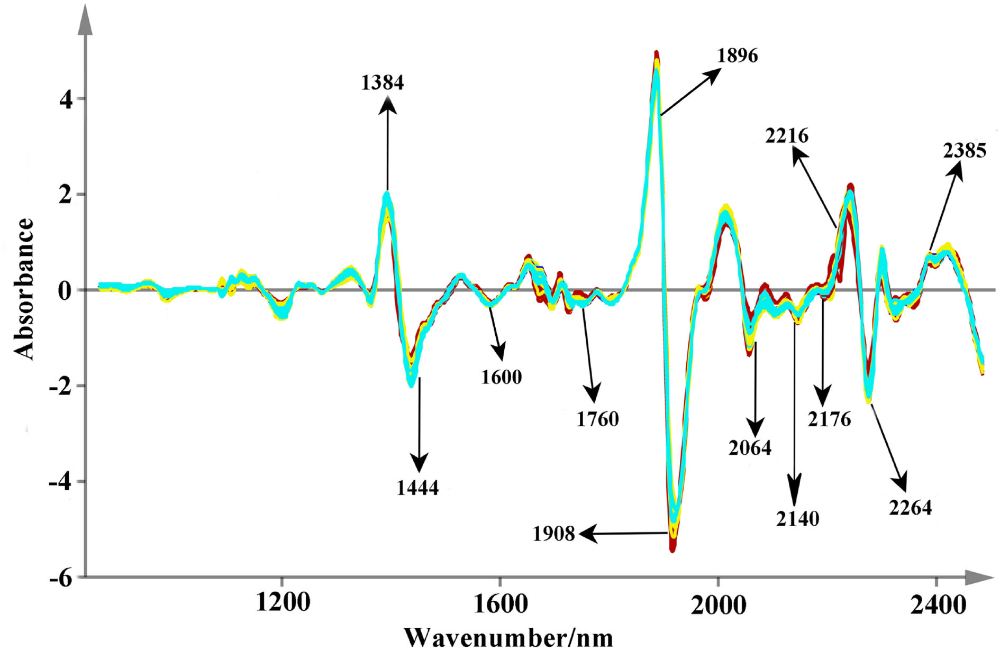
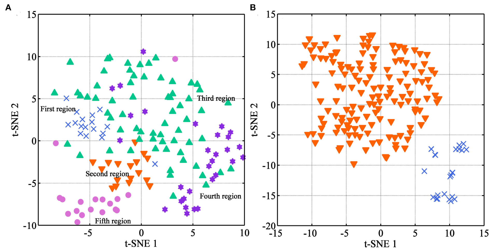
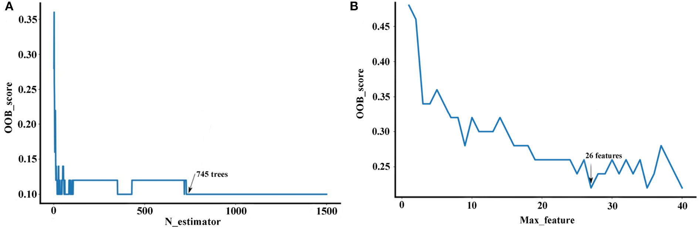
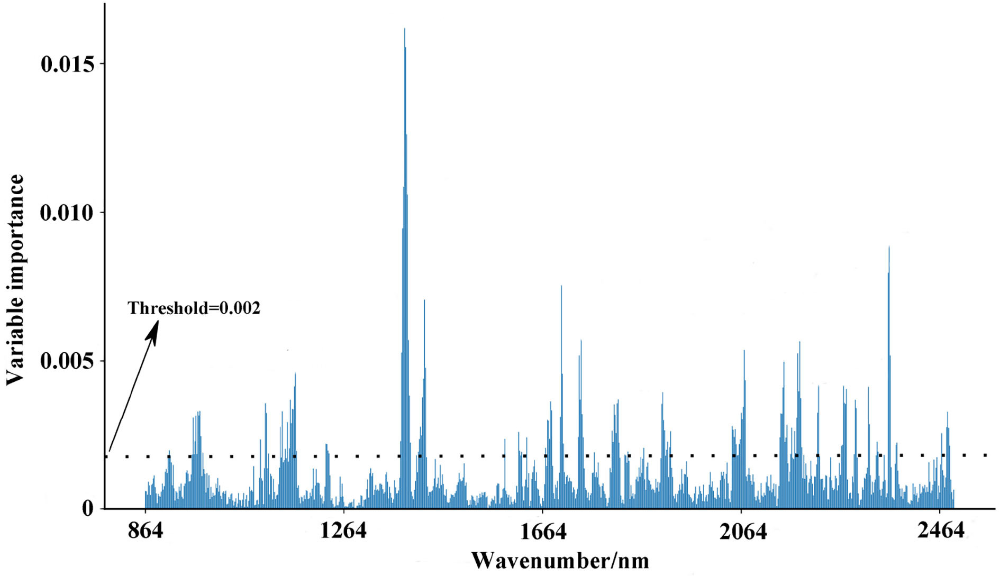
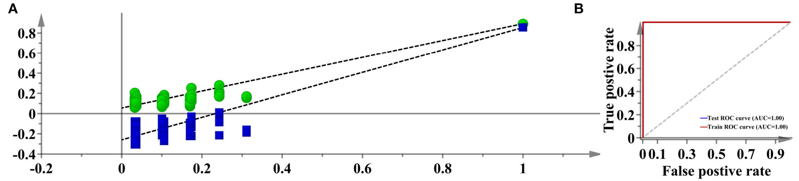
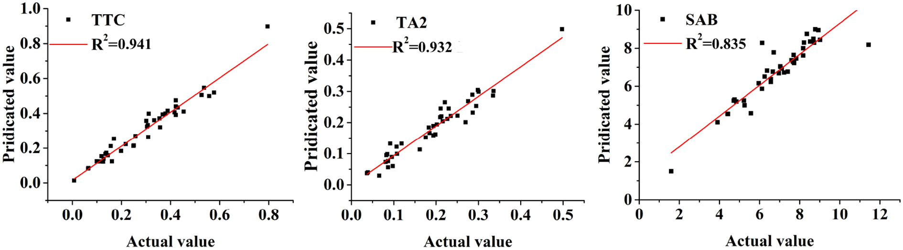

<!-- 方針: ほぼ全訳＋必要に応じた補足。「> 補足:」は訳者注。数式はKaTeXで表示。 -->

## 書誌情報

- 原題: Integrative quantitative and qualitative analysis for the quality evaluation and monitoring of Danshen medicines from different sources using HPLC-DAD and NIR combined with chemometrics
- 著者: Qing Li, Luming Qi（責任著者）, Kai Zhao, Wei Ke, Tao Li, Lina Xia（責任著者）（成都中医薬大学ほか, 中国）
- 掲載: *Frontiers in Plant Science* 2022, 13:932855. https://doi.org/10.3389/fpls.2022.932855（オープンアクセス）
- インパクトファクター: **約5.0**（*Front. Plant Sci.*, JCR近年）

> 補足: 丹参(タンジン, Salvia miltiorrhiza)は活血・心血管系に用いる代表的生薬。本稿はHPLC-DAD(精密定量)とNIR(非破壊・迅速)を組み合わせ、ケモメトリクス/機械学習で産地判別・成分予測を行う「迅速QC・産地モニタリング」の実例。

## 概要（Abstract）
Salvia miltiorrhizaの根および根茎（略して丹参）は、世界中で心血管疾患の治療に用いられている有名な生薬である。中国では、いくつかの他のSalvia属植物の根および根茎（略して非丹参（Non-Danshen））も、地元のハーブ医らによって伝統的な民間薬としてこの生薬と同様に使用されている。異なる起源に由来するこれらの生薬において差異が報告されており、効果的な臨床応用のために、それらの品質変動を明確に調査する必要がある。本研究では、高速液体クロマトグラフィー-ダイオードアレイ検出器（HPLC-DAD）および近赤外（NIR）スペクトルに基づき、ケモメトリクスモデルを組み合わせることで、27箇所のサンプリングサイトから得られた丹参および他の5種のSalvia属植物から得られた非丹参の包括的な品質評価およびモニタリングを提示した。その結果、クリプトタンシノン, タンシノンIIA, タンシノンI, サルビアノール酸B, サルビアン酸Aナトリウム, ジヒドロタンシノンI, およびロスマリン酸は、異なる起源の生薬において大きな変動を示した。中国薬典（CP）、欧州薬局方（EP）、および米国薬局方（USP）の規格を参照すると、S. brachyloma、S. castanea、S. trijuga、S. bowleyana、およびS. przewalskii由来の非丹参は不合格と評価され、山東省の丹参は合格率が高かったため最も優れた品質であった。ランダムフォレスト（RF）および部分最小二乗判別分析（PLS-DA）に基づくと、NIR技術は種および地域をそれぞれ100.00%および99.60%の精度で判別することにより、これらの生薬の品質を良好にモニタリングすることができた。さらに、生薬の品質指標を予測するためのNIRフィンガープリントの実現可能性を調査するために、修正部分最小二乗回帰（MPLSR）モデルの構築に成功した。最適化されたモデルは、タンシノンIIA、タンシノンI、およびクリプトタンシノンの総量（TTC）、タンシノンIIA、およびサルビアノール酸Bに対して最良の結果をもたらし、相対予測偏差（RPD）はそれぞれ4.08、3.92、および2.46であった。要約すると、本研究はHPLC-DADおよびNIR技術が互いに補完し合い、丹参生薬の品質評価およびモニタリングに同時に適用できることを示した。

**キーワード**
Salvia生薬、HPLC-DAD、NIR、ケモメトリクスモデル、品質評価とモニタリング

---

## 1. はじめに（Introduction）
Salvia miltiorrhizaの根および根茎（略して丹参）は、心血管疾患の治療に用いられる有名な伝統中国医学（生薬）である（Li et al., 2018; Orgah et al., 2020）。アジア、アメリカ、ヨーロッパの国々で、機能性食品やサプリメントとして常に使用されている（Raposo et al., 2021）。その優れた薬効とヘルスケア機能のため、この生薬に対する需要は非常に高く、栽培エリアがますます拡大している。『名医別録』（中国の東漢時代の古代薬物学書）によると、丹参は河南省の桐柏谷と山東省の泰山（泰山）が原産地であり、そこから徐々に広がっていった（Deng et al., 2016）。現在の栽培地域は、山東省、河南省、河北省、四川省、陝西省、安徽省、山西省など、中国の広範囲に及んでいる。異なる地域に由来する生薬について差異が報告されており、一部の地域では他の地域よりも優れた品質が生産されている（Shahrajabian et al., 2019）。さらに、野外調査では、他のいくつかのSalvia属植物の根および根茎（略して非丹参（Non-Danshen））が同様の品質パラメータを持ち、中国で心血管疾患を治療するための丹参生薬として使用されていることも示されている（Mervić et al., 2022）。このような状況において、異なる地域や種は、生薬の医療およびヘルスケアの品質を左右する活性成分の蓄積に影響を与える最も重要な要因とみなされてきた。異なる地域および種に関する包括的な品質評価およびモニタリング研究は、丹参生薬の合理的な開発と利用において極めて重要である。

生薬の品質をモニタリングする従来の手段（性状識別、顕微鏡識別、薄層クロマトグラフィー（TLC）識別など）では、外観や化学成分が類似しているため、異なる起源の生薬の品質を容易に評価することはできない（Pharmacopeia, 2015; Pharmacopoeia, 2015; Pharmacopoeia Japanese, 2017）。対照的に、一般的な定量技術である高速液体クロマトグラフィー-ダイオードアレイ検出器（HPLC-DAD）は、サンプル中の特定の化学化合物の変動を正確かつ特異的に特徴づけることができる（Liang et al., 2017; Dimcheva et al., 2019）。一方、近赤外（NIR）分光法は、サンプルの定性的に多くの記述的代謝プロファイルを収集するための、迅速で信頼性が高く、環境に優しい方法を提供できる（Zhu et al., 2018; Jiao et al., 2020; Sun et al., 2020）。これらの方法は互いに補完し合うことができ、生薬の品質の定量的な評価および定性的なモニタリングのための一般的な戦略として広く適用されている（Qi et al., 2018; Ni et al., 2019）。

しかし、HPLC-DADおよびNIR機器から収集されるデータは常に膨大であり、単純な数学的統計手法を使用して直接分析することは困難である。近年、ケモメトリクス（化学計量学）モデルは大量 of 記述データを解釈するための効果的な技術であり、従来の方法と比較して明らかな利点を示している。特に、これらのモデルは、複雑な代謝プロファイルを持つマルチソースの天然物の分析において、ますます重要な役割を果たしている（Deng et al., 2021）。ケモメトリクスモデルを適用することで、クロマトグラフィーおよび分光機器からのデータセットの教師なし可視化または教師あり予測分析が可能になり、異なる起源に由来する生薬の品質評価およびモニタリングをより効果的に達成できる。例えば、クロマトグラフィーデータと分光データの相関関係を分析するために、部分最小二乗回帰（PLSR）のケモメトリクスモデルの構築に成功し、異なる種に由来する黄連（Coptis）生薬の包括的な品質評価およびモニタリングが提供された（Qi et al., 2018）。要約すると、ケモメトリクスモデルは生薬の複雑な化学システムの定量的および定性的分析に使用でき、異なる起源の生薬の品質分析に関する化学センサーの応用可能性をさらに促進することができる。

したがって、本研究は、HPLC-DADおよびNIR技術に基づき、ケモメトリクスモデルを組み合わせることで、27箇所のサンプリングサイトから得られた丹参生薬と他の5種のSalvia属植物から得られた非丹参生薬の包括的な品質評価およびモニタリングを行うことを目的とした。主要な生理活性化合物であるクリプトタンシノン、タンシノンIIA、タンシノンI、サルビアノール酸B、サルビアン酸Aナトリウム、ジヒドロタンシノンI、およびロスマリン酸をHPLC-DAD技術によってそれぞれ定量し、品質を評価した。その後、NIR技術を用いて定性的データを収集し、生薬全体の代謝変動を提示した。これらの生薬の地域および種を判別するために、t分布型確率的近傍埋め込み法（t-SNE）、部分最小二乗判別分析（PLS-DA）、およびランダムフォレスト（RF）のいくつかのケモメトリクスモデルをそれぞれ構築した。最後に、HPLC-DADおよびNIR技術から得られた記述データの相関関係を分析するために、修正部分最小二乗回帰（MPLSR）をさらに確立した。中国薬典（CP）、欧州薬局方（EP）、および米国薬局方（USP）に基づき、異なる起源の生薬の品質をモニタリングするために、タンシノンIIA、タンシノンI、およびクリプトタンシノンの総量（TTC）、ならびにタンシノンIIA、およびサルビアノール酸Bの3つの品質指標を予測した。要約すると、本研究は、異なる起源の丹参生薬の包括的な品質評価およびモニタリングを提供し、マルチソース生薬の品質分析における化学センサーおよびケモメトリクスモデルの応用をさらに促進することができる。

---

## 2. 材料および方法（Materials and methods）

### 2.1. 試薬（Reagents）
クリプトタンシノン、タンシノンIIA、タンシノンI、サルビアノール酸B、サルビアン酸Aナトリウム、ジヒドロタンシノンI、およびロスマリン酸の標準化学成分は、それぞれ中国薬品生物製品検定所（北京、中国）から購入した。すべての標準化合物の純度は97%以上であった。HPLCグレードのメタノールおよびギ酸は、Thermo Fisher Scientific（上海、中国）から購入した。脱イオン水は、Milli-Q水システム（Millipore、米国）によって調製した。その他の分析グレードの試薬は、Chron Chemicals Co., Ltd.（成都、中国）から供給された。

### 2.2. サンプル調製（Samples preparation）
収穫期に7つの省の27のサンプリングサイトから、合計150サンプルのS. miltiorrhizaを収集した。予備調査に基づき、互いに近い地域はより類似した環境特性を持つことがわかった。したがって、我々は省の行政区画ではなく、物理的な距離に基づいてこれらのサンプリングサイトを人為的にグループ化した（図1）（原文参照）。さらに、他のSalvia属植物の根および根茎も民間用途で丹参生薬として常に使用されている。S. miltiorrhiza種由来の丹参生薬と品質を比較するために、S. brachyloma、S. castanea、S. trijuga、S. bowleyana、およびS. przewalskiiの他の5つのSalvia属植物も収集した。これらの種は、中国の成都中医薬大学の夏麗娜（Lina Xia）教授によって鑑定され、残りのサンプルは我々の研究室に保管された。すべてのサンプルの不均一性を確保するため、隣接する生産エリア間の最小距離は少なくとも1 kmとした。これらの材料の詳細情報は、補足表S1〜S3（原文参照）に示されている。

各個体の根と根茎を分離し、きれいな水で洗浄した。洗浄および風乾後、すべてのサンプルを乾燥オーブンにて60℃で恒量になるまで乾燥させた。その後、これらの材料を粉砕し、80メッシュの篩を通過させた。最後に、その後の分析のために、これらの材料はすべて乾燥した状態で保管された。

### 2.3. HPLC-DAD分析（HPLC-DAD analysis）
最初にHPLC-DADを用いて、主要な生理活性化合物をターゲット定量することにより生薬の品質を評価した。この技術は、ダイオードアレイ検出器、4液グラジエント溶媒送液システム、およびカラム温度コントローラーを備えたAgilent 1260シリーズHPLCシステムで実行された。すべてのサンプルは、Waters C18カラム（150 mm × 3.9 mm、5 µm）を用い、カラム温度30℃で分析された。移動相は、メタノール（A）およびギ酸/水 0.3:100 (v/v)（B）であった。グラジエント溶出プログラムは以下の通りであった：0–40 min, 90–40% B; 40–50 min, 40–30% B; 50–70 min, 30–17% B; 70–75 min, 17–90% B。流速は1.0 ml/minであった。注入量は10 µlであった。検出波長は、ロスマリン酸が330 nm、サルビアノール酸B、ジヒドロタンシノンI、およびサルビアン酸Aナトリウムが280 nm、タンシノンI、クリプトタンシノン、およびタンシノンIIAが270 nmにそれぞれ設定された。

各サンプルの粉末（各0.3 g）を精密に秤量してきれいな三角フラスコに入れ、メタノール/水 85:100 (v/v) の含水メタノール溶液25 mlを用いて30分間超音波抽出を行った。冷却後、抽出液の重量を抽出溶媒で元の重量に調整した。フェノール酸類化合物（サルビアノール酸B、142.59 µg/ml；ロスマリン酸、106.41 µg/ml；およびサルビアン酸Aナトリウム、11.84 µg/ml）と、タンシノン類化合物（ジヒドロタンシノンI、29.87 µg/ml；クリプトタンシノン、39.42 µg/ml；タンシノンI、13.44 µg/ml；およびタンシノンIIA、55.81 µg/ml）の混合標準溶液を85% (v/v) メタノール水溶液で調製した。混合物は、HPLC-DAD分析のために0.45 µm PVDFメンブレンフィルターでろ過された。この方法のバリデーション結果は補足表S4（原文参照）に示されている。

### 2.4. NIR分光法（NIR spectroscopy）
近赤外（NIR）分光法は、地域や種を判別して不合格サンプルをモニタリングすること、およびこれらの生薬の品質マーカー化合物を予測することに使用された。
サンプルの反射スペクトルは、シリコン検出器（850–1,100 nm）および硫化鉛検出器（1,100–2,500 nm）を備えたFOSSNIRS DS-2500分光計（Foss NIR Systems、米国メリーランド州シルバースプリング）で収集された。サンプルは、円筒形の石英リングカップ（直径118 mm、高さ38 mm）を用いて、850から2,500 nmまで2 nm間隔で反射モードにて走査された。各サンプルは3回（トリプリケート）走査された。NIR分析には平均スペクトルが使用された。スペクトルデータはISI scan Nova（Infra Soft International、米国ペンシルベニア州ポートマティルダ）に保存された。
ピークの重なりや背景干渉によるスペクトルのノイズ信号に対処するため、WinISI III Project Manager（Version: 1.50, Infrasoft International, 米国ペンシルベニア州ポートマティルダ）を用いて、いくつかの前処理方法を適用した。平滑化（Smoothing）により、その後の分析に不要な微小信号を除去することができた。標準正規変量（SNV）およびデトレンド（DT）は、それぞれ不均一な粒子分布の影響を排除するために使用された（Samadi and Agus Arip, 2020）。1次微分（FD）および2次微分（SD）を含む微分アルゴリズムは、スペクトル分解能を向上させ、元のNIRスペクトルにおけるベースラインドリフトを排除するために使用された（Roy, 2015）。

### 2.5. 定性的ケモメトリクスモデルの構築（Construction of the qualitative chemometric model）
異なる起源に由来する生薬の可視化分析を行うために、t-SNEアルゴリズムを採用した。これは、多数の相関する変数を、元の変数の主要な情報を依然として含むいくつかの重要な無相関の成分に変換することができる。このアルゴリズムは、データ点間の類似性を確率として変換する、確率的近傍埋め込み法に基づく非線形技術である（Anowar et al., 2021）。モデル構築の前に、可視化分析によってNIRスペクトルデータの構造を探索し、次の分析の準備を行うことができる。t-SNEはRソフトウェア（Version: 4.10, R Foundation for Statistical Computing, ウィーン, オーストリア）を用いて実行された。

マルチソース生薬の地域および種を判別するために、部分最小二乗判別分析（PLS-DA）およびRFケモメトリクスモデルを比較構築した。PLS-DAアルゴリズムは、サンプルカテゴリに応じてダミー変数を処理し、独立変数とダミー変数の間のモデルを構築できる。このアルゴリズムは、各サンプルの予測値を比較することによってサンプルのクラスを決定する。サンプルが正しく分類されたとみなされる基準を評価するために、カットオフ基準がしばしば使用される（Suhandy and Yulia, 2017）。予測値が0.5より高い場合、サンプルは正しい地域として定義される。

ランダムフォレスト（RF）は、本研究における定性的目的のためのもう1つのアルゴリズムであり、優れたアンチノイズ能力を持ち、過学習を効果的に回避できる（Schonlau and Zou, 2020）。これは複数の決定木の集約に基づいており、出力カテゴリは個々の決定木の出力カテゴリの最頻値によって決定された。これはブートストラップサンプルを用いて生成され、そのうちの3分の2はトレーニングサンプルであり、残りは分類誤差の偏りのない推定値を得るために内部で使用されるアウトオブバッグ（OOB）サンプルと呼ばれるテストサンプルであった。RFモデルを構築するには、決定木の数（n-estimators）と特徴の数（max_feature）の2つの重要なパラメータをOOB誤差推定に基づいて慎重に最適化する必要がある（Qi et al., 2020）。RFの運用上の属性は、Gini不純度インデックスに基づいて変数の重要度を計算する内部能力であり、これを利用して最良の性能を持つRFモデルを構築するための重要な変数を選択した（Menze et al., 2009）。これらのアルゴリズムは、Rソフトウェア（Version: 4.10, R Foundation for Statistical Computing, ウィーン, オーストリア）およびSIMCAソフトウェア（Version: 13.0, Umetrics, スウェーデン）をそれぞれ用いて実行された。

マルチクラスの分類モデルを評価するために混同行列が用いられた。真陽性（TP）、偽陽性（FP）、真陰性（TN）、および偽陰性（FN）の指標が計算され、定性的モデルの性能を評価するために感度（Sensitivity）、特異性（Specificity）、および精度（Accuracy）のパラメータがそれぞれ示された。式は以下の通りである：

$$\text{Sensitivity} = \frac{\text{TP}}{\text{TP} + \text{FN}} \quad (1)$$

$$\text{Specificity} = \frac{\text{TN}}{\text{FP} + \text{TN}} \quad (2)$$

$$\text{Accuracy} = \frac{\text{TN} + \text{TP}}{\text{FP} + \text{TN} + \text{TP} + \text{FN}} \quad (3)$$

### 2.6. 定量的ケモメトリクスモデルの構築（Construction of the quantitative chemometric model）
PLSRに基づいて修正された修正部分最小二乗回帰（MPLSR）アルゴリズムをさらに適用して、異なる起源に由来する生薬の品質指標に対する定量的な予測モデルを構築した。このアルゴリズムを適用して、生薬のスペクトルデータから活性成分に関連する情報を抽出することができる。先行論文によると、この方法は高次元データ、小サンプルサイズ、および多重共線性の問題を処理するのに適したPLSRアルゴリズムよりも、常に優れた安定性と精度を提供する（Yin et al., 2014; Hernandez-Jimenez et al., 2020）。このアルゴリズムでは、過学習を回避するために、回帰モデルにおける潜在変数（LV）の最適数を選択するためにデフォルトの7分割クロスバリデーション法が使用された。MPLSRモデルは、WinISI III Project Manager（Version: 1.50, Infrasoft International, 米国ペンシルベニア州ポートマティルダ）を用いて構築された。

キャリブレーションモデルの有効性を評価するために、キャリブレーション決定係数（$R_c^2$）、キャリブレーション標準誤差（SEC）、およびクロスバリデーション標準誤差（SECV）のパラメータが使用された。これらの定量モデルの予測能力を評価するために、予測決定係数（$R_p^2$）、予測標準誤差（SEP）、および残差予測偏差（RPD）の比率が適用された。

$$R^2 = \frac{\sum_{i=1}^{n}(O_i - P_i)^2}{\sum_{i=1}^{n}(O_i - \bar{O})^2} \quad (4)$$

> 補足: 原文の式(4)は決定係数 $R^2$ の定義として表現が一部不完全（分子と分母の比率のみ）ですが、原文の表記 `Pn i=1(Oi - Pi)2 / Pn i=1(Oi - O)2` に従ってそのまま記載しています。一般的には $1 - \frac{\text{RSS}}{\text{TSS}}$ に相当します。

$$\text{SEC} = \sqrt{\frac{\sum_{i=1}^{n_c}(P_i - O_i)^2}{n_c - 1}} \quad (5)$$

$$\text{SECV} = \sqrt{\frac{\sum_{i=1}^{n_c}(P_i - O_i)^2}{n_c}} \quad (6)$$

$$\text{SEP} = \sqrt{\frac{\sum_{i=1}^{n_p}(P_i - O_i)^2}{n_p}} \quad (7)$$

ここで、$P_i$ はキャリブレーションセットまたは予測セットにおける目的化合物の予測値であり、$O_i$ は目的化合物のキャリブレーションセットまたは予測セットにおける測定値である。$n_c$ はキャリブレーションセットにおける観察数であり、$n_p$ は予測セットにおける観察数である。最良のキャリブレーションは、高い $R_c^2$、$R_p^2$ および低い SECV、SEC、SEP に基づいて選択された。

さらに、RPDは以下のように計算された。

$$\text{RPD} = \frac{\text{SD}}{\text{RMSEP}} \quad (8)$$

ここで、$\text{SD}$ は標準偏差である。$\text{RPD}$ 値は、予測性能および定量的ケモメトリクスモデルの一般化能力を評価するために使用される一般的な統計パラメータである。$\text{RPD}$ 値が高いモデルほど、優れた予測性能を意味する。

過学習を回避し、これらのモデルの堅牢性を保証するために、サンプルセットは古典的なKennard-Stone選択アルゴリズムを用いて2つのグループに分割された（Kennard and Stone, 1969）。サンプルの3分の2は、校正モデルのトレーニング用としてトレーニングサンプルとして選択され、3分の1は、校正モデルの有効性を検証するためのテストセットとして使用された。上記のステップの簡単なデータフロー図を図2に示す（原文参照）。

---

## 3. 結果と考察（Results and discussion）

### 3.1. 活性成分の定量決定（Quantitative determination of active components）
生薬は常に幅広い生物活性を含んでおり、化学成分の蓄積はそれらの品質を評価するための重要なターゲットである（Abate et al., 2021; Mastinu et al., 2021）。異なる起源に由来する生薬の品質変動を包括的に理解するために、丹参生薬の品質を表す7つの化学成分（ロスマリン酸、サルビアノール酸B、ジヒドロタンシノンI、サルビアン酸Aナトリウム、タンシノンI、クリプトタンシノン、およびタンシノンIIA）をHPLC-DAD技術を用いてそれぞれ定量した。代表的なクロマトグラムを図3に示し、開発した方法の主なパラメータを表1に示す。図3に見られるように、すべての成分はベースライン分離されており、正確に定量することができる。定量結果を表2に示す。

主要な化学化合物は、異なる起源のこれらの生薬において大きな変動を示した。サルビアノール酸Bは、S. miltiorrhiza、S. trijuga、S. bowleyana、およびS. przewalskii由来の生薬において最も豊富な化合物として同定された。その最高レベル（9.22 ± 0.58）は、S. bowleyanaの根および根茎で観察された。ロスマリン酸は、S. brachyloma（1.05 ± 0.92）およびS. castanea（0.99 ± 0.82）由来の生薬において最も豊富な化合物として同定された。さらに、S. trijugaの根および根茎は、クリプトタンシノン、タンシノンIIA、タンシノンI、およびジヒドロタンシノンIの蓄積が最も高かった。サルビアン酸Aナトリウムは、S. bowleyanaの根および根茎で最も高かった。これらの構成成分は、これらの生薬のヘルスケアおよび薬用機能を大きく決定する。この結果は、異なる種に由来するこれらの生薬が明らかな品質変動を持つ可能性があることを示唆した。

現在の品質評価規格によると、サルビアノール酸B、クリプトタンシノン、タンシノンI、およびタンシノンIIAが丹参生薬の品質指標である（Pharmacopeia, 2015; Pharmacopoeia, 2015; Pharmacopoeia Japanese, 2017）。CP（TTC $\ge$ 0.25%、サルビアノール酸B $\ge$ 3.0%）、EP（タンシノンIIA $\ge$ 0.12%、サルビアノール酸B $\ge$ 3.0%）、およびUSP（タンシノンIIA $\ge$ 0.1%、TTC $\ge$ 0.2%、およびサルビアノール酸B $\ge$ 3.0%）の含有量制限に基づき、異なる起源のサンプルにおけるこれらの品質指標の含有量と合格率を表3にまとめる。

まず、5つの地域に関する丹参生薬を観察した。サルビアノール酸Bの平均含有量はすべて3.0%を超えており、これらの地域から得られたほとんどのサンプルにおけるこの成分が合格であり、薬局方規格に準拠していることを意味している（Pharmacopeia, 2015; Pharmacopoeia, 2015; Pharmacopoeia Japanese, 2017）。しかし、タンシノンIIAおよびTTCデータ分析の観点からは、第4地域および第3地域のサンプルの全体的な含有量がそれぞれ最高レベルおよび次点レベルであった。これらの地域における丹参生薬の合格率は80%を超えている。この結果は、山東省の丹参生薬が最も優れた品質であることを示した。陝西省、山西省、および河南省からのサンプルはそれに次ぐ品質であった。四川省、安徽省、および河北省からの丹参生薬は、合格率が50%未満であるため低いレベルであった。これらの差異は、主に異なる地域の異なる生育環境に関連している可能性がある。

さらに、他の5種に由来する非丹参生薬は、現行の薬局方規格によれば不合格である。比較的言えば、タンシノンIIAおよびTTCの化合物は高く、薬局方規格に準拠しているが、サルビアノール酸Bの蓄積量は平均含有量で2.66%であった。したがって、これらの種に由来する根および根茎は、臨床応用のための品質指標が不十分であるため、市場で丹参生薬として使用することはできない。

**表1：開発されたHPLC-DAD法の主なパラメータ**
| 化合物 (Compounds) | キャリブレーション方程式 (Calibration curve) | 相関係数 (Correlation coefficient) | 線形範囲 (Linear range (µg)) |
| :--- | :--- | :--- | :--- |
| サルビアン酸Aナトリウム (Salvianic acid A sodium) | y = 0.0496x–0.2441 | 0.9998 | 0.01–0.23 |
| ロスマリン酸 (Rosmarinic acid) | y = 0.0145x–0.2812 | 0.9993 | 0.29–14.26 |
| サルビアノール酸B (Salvianolic acid B) | y = 0.0057x+0.0112 | 0.9996 | 0.21–10.64 |
| ジヒドロタンシノンI (Dihydrotanshinone I) | y = 0.0083x+0.0764 | 0.9998 | 0.06–2.99 |
| クリプトタンシノン (Cryptotanshinone) | y = 0.0066x–0.9554 | 0.9990 | 0.08–3.94 |
| タンシノンI (Tanshinone I) | y = 0.0037x+0.7490 | 0.9992 | 0.03–1.34 |
| タンシノンIIA (Tanshinone IIA) | y = 0.0033x–0.0003 | 0.9999 | 0.11–5.58 |

**表2：6種のSalvia属における7つの活性成分の含有量（%）**
| 化合物 (Compounds) | S. miltiorrhiza | S. brachyloma | S. castanea | S. trijuga | S. bowleyana | S. przewalskii |
| :--- | :--- | :--- | :--- | :--- | :--- | :--- |
| サルビアン酸Aナトリウム (Salvianic acid A sodium) | 0.093 ± 0.079 | 0.067 ± 0.026 | 0.018 ± 0.019 | 0.057 ± 0.028 | 0.383 ± 0.095 | 0.022 ± 0.010 |
| ロスマリン酸 (Rosmarinic acid) | 0.407 ± 0.204 | 1.048 ± 0.922 | 0.988 ± 0.821 | 0.365 ± 0.096 | 0.704 ± 0.153 | 0.227 ± 0.079 |
| サルビアノール酸B (Salvianolic acid B) | 6.912 ± 1.798 | 0.517 ± 0.316 | 0.708 ± 0.654 | 2.012 ± 0.387 | 9.223 ± 0.577 | 1.779 ± 0.208 |
| ジヒドロタンシノンI (Dihydrotanshinone I) | 0.032 ± 0.027 | 0.006 ± 0.003 | 0.031 ± 0.020 | 0.142 ± 0.074 | 0.015 ± 0.005 | 0.098 ± 0.010 |
| クリプトタンシノン (Cryptotanshinone) | 0.105 ± 0.088 | 0.012 ± 0.006 | 0.104 ± 0.111 | 0.455 ± 0.264 | 0.033 ± 0.006 | 0.246 ± 0.102 |
| タンシノンI (Tanshinone I) | 0.033 ± 0.027 | 0.013 ± 0.005 | 0.047 ± 0.016 | 0.266 ± 0.134 | 0.047 ± 0.004 | 0.233 ± 0.083 |
| タンシノンIIA (Tanshinone IIA) | 0.195 ± 0.118 | 0.039 ± 0.016 | 0.332 ± 0.129 | 1.235 ± 0.485 | 0.048 ± 0.021 | 1.269 ± 0.081 |

**表3：現行規格に基づく異なるソースからのサンプルの合格率**
| カテゴリ (Category) | 含有量範囲 (%) - TA2 | 含有量範囲 (%) - SAB | 含有量範囲 (%) - TTC | 平均含有量 (%) - TA2 | 平均含有量 (%) - SAB | 平均含有量 (%) - TTC | 合格率 (%) - CP | 合格率 (%) - USP | 合格率 (%) - EP |
| :--- | :--- | :--- | :--- | :--- | :--- | :--- | :--- | :--- | :--- |
| 第1地域 (First region) | 0.01–0.07 | 3.31–8.22 | 0.02–0.11 | 0.05 | 6.10 | 0.07 | 0 | 0 | 0 |
| 第2地域 (Second region) | 0.04–0.13 | 4.91–10.11 | 0.06–0.19 | 0.07 | 7.31 | 0.11 | 0 | 0 | 0 |
| 第3地域 (Third region) | 0.04–0.59 | 4.92–11.13 | 0.06–1.09 | 0.23 | 7.50 | 0.40 | 84 | 91 | 88 |
| 第4地域 (Fourth region) | 0.12–0.74 | 4.14–11.23 | 0.20–1.16 | 0.28 | 6.71 | 0.51 | 100 | 100 | 100 |
| 第5地域 (Fifth region) | 0.08–0.28 | 1.32–11.02 | 0.10–0.48 | 0.16 | 5.24 | 0.22 | 21 | 37 | 47 |
| 他の丹参 (Other danshen) | 0.02–1.67 | 0.26–9.56 | 0.05–2.91 | 0.59 | 2.66 | 0.89 | 0 | 0 | 0 |

> 補足: TA2、SAB、およびTTCはそれぞれタンシノンIIA、サルビアノール酸B、およびタンシノンIIA、タンシノンI、クリプトタンシノンの総量の略称である。CP、USP、およびEPはそれぞれ中国薬典、米国薬局方、欧州薬局方の略称である。他の丹参（Other Danshen）は、S. brachyloma、S. castanea、S. trijuga、S. bowleyana、およびS. przewalskiiに由来する医薬品を意味する。

### 3.2. 可視化分析（Visualization analysis）
地域および種は、Salvia属生薬の品質に影響を与える重要な要因である。次に、これらのサンプルの品質をモニタリングするために、NIRスペクトルのフィンガープリントを収集した。HPLC-DAD分析の結論に基づき、ケモメトリクスモデルを用いて以下の2つの目的を達成することに焦点を当てた：S. miltiorrhiza種における丹参サンプルの異なる地域の判別、およびS. miltiorrhiza種由来の丹参生薬と他のSalvia属植物由来の非丹参生薬の判別である。

オリジナルのスペクトルを図4に示す。使用されたすべてのNIRスキャンは合格であり、主成分分析に基づく99%信頼楕円内に位置していた（補足図S1、原文参照）。比較的言えば、有用なスペクトルピークは主に1,150〜2,500 nmの範囲に分布している。これらは主に、フェノール酸類の重要な官能基であるC-H、O-H、およびN-H基の伸縮または変形振動を含んでいる（Li and Qu, 2010）。1,200、1,460、1,762、1,936、2,100、2,300、および2,360 nmのピークは、NIRスペクトルにおける共通の吸収である。その中で、1,200 nmのなだらかなピークは、メチルおよびメチレンのC-H吸収帯の2次倍音に対応している可能性がある（Sun et al., 2020）。1,460 nmおよび1,936 nm付近の強い吸光度ピークは、主にO-H伸縮振動の結合によって引き起こされる（Zhu et al., 2018; Gao et al., 2021）。C-Hの結合バンドは2,300 nm付近で生じる可能性がある（Zhu et al., 2018; Gao et al., 2021）。しかし、吸収ピークの重なりが多いため、平滑化、SNV、およびSDのいくつかの前処理を使用して、重なった信号を分解し、干渉情報を除去した（図5）（原文参照）。1,460 nmから分解された1,384および1,444 nm付近のピークは、O-H伸縮1次倍音およびO-H変角2次倍音に関連している（Toledo-Martín et al., 2018）。1,600〜1,760 nmの範囲のバンドは、C-H伸縮、$CH_2$倍音、$CH_3$倍音などと相関している可能性がある（Wittkop et al., 2012; Panigrahi et al., 2016）。1,896 nmにおける吸収は、フェノール性O-HおよびC=O伸縮2次倍音（COOH）に起因する可能性がある（Xiong et al., 2015）。1,908 nm付近のピークは結合O-H伸縮倍音に対応する可能性があり（Cheng et al., 2019）、ポリフェノール化合物と相関している可能性がある（Panigrahi et al., 2016）。N-H伸縮振動およびC=Oの結合バンドは2,064〜2,176 nm付近のピークで発生し、2,264から2,385 nmの範囲はC-Hの結合バンドによって支配されている可能性がある（Zhu et al., 2018; Sun et al., 2020）。これらの特徴的なピークは、マルチソースのSalvia生薬を判別するための基礎となる。

これらのNIRデータの内部特徴をより良く視覚化するために、それぞれ異なる地域および種から得られた生薬を可視化するためにt-SNEの探索的分析が使用された。2次元プロットを図6に示す。地域判別に関して、t-SNEアルゴリズムは5つの地域から得られた丹参サンプルの大まかな分離傾向のみを表示している（図6A）（原文参照）。全体として、第4地域からのサンプルは第3地域からのサンプルの近くにあり、プロットの右半分に位置している。HPLC-DAD分析に基づくと、これらの地域から得られた生薬はそれぞれ最高およびそれに次ぐ品質を持っている。しかし、教師ありアルゴリズムを使用したさらなる分析が必要であった。

丹参生薬と非丹参生薬の間のサンプルの場合、t-SNEアルゴリズムの結果は満足のいくものである。S. brachyloma、S. castanea、S. trijuga、S. bowleyana、およびS. przewalskii由来の生薬は、S. miltiorrhiza種由来のものから一括して分離されていることがわかる。我々の結果は、全体的な定性的観点から、S. miltiorrhiza種由来の丹参生薬が、他のSalvia属植物由来の非丹参生薬と明らかな変動を持っていることを実証した。HPLC-DADの結論に基づき、S. brachyloma、S. castanea、S. trijuga、S. bowleyana、およびS. przewalskii由来の非丹参生薬は、薬局方規格によれば不合格である。t-SNEアルゴリズムは、S. miltiorrhiza由来の丹参を他のSalvia属植物由来の非丹参から良好に分離することができる。

### 3.3. 産地および種を判別するための定性的モデル（Qualitative models for discriminating the region and species）
HPLC-DAD分析によると、生薬の品質および合格率は地域や種によって大きく異なっていた。ある程度まで、教師なし可視化モデルは無力であった。異なる起源の生薬をモニタリングするために、地域および種を判別するための定性的モデルとして、PLS-DAおよびRFアルゴリズムがさらに比較適用された。

地域判別について、these modelsの結果を表4に示す。PLS-DAモデルに関して、モデルの過学習を回避するために、81%の累積解釈能力を表す最初の5つのLVが選択され、定性的モデルが構築された。混同行列によると、開発されたテストセットモデルの平均感度、特異性、および精度は、それぞれ85.82%、97.60%、および96.00%である。比較的言えば、第1地域および第4地域の感度は不満足であり、80%未満である。これらの地域の4つのサンプルが第3地域に誤認された。他のより高度なアルゴリズムを使用することで、判別性能をさらに向上させることができる。したがって、丹参生薬の地域判別の精度を向上させるために、RFアルゴリズムの適用に焦点を当てた。

ランダムフォレスト（RF）法は、互いに関連性のない一定数の決定木分類器を組み合わせるアンサンブル学習技術である。決定木分類器の数は $n\_estimators$ として定義され、特徴部分集合の数は $max\_feature$ として定義される。これら2つのパラメータは、開発されたRFモデルの予測性能と実用性のバランスをとるために重要である。丹参生薬のNIRデータに基づき、$n\_estimators$ および $max\_features$ の範囲は、最初にそれぞれ0〜1,500および0〜40に設定された。その後、これらのパラメータはOOB誤差の最小化に基づいて評価された（図7）（原文参照）。$n\_estimators$ および $max\_feature$ をそれぞれ745および26に最適化することで、NIRデータセットに基づく地域判別に対して、短いトレーニング時間と安定した性能を備えた最良 of RFモデルを達成できる。表4に見られるように、RFモデルはPLS-DAモデルよりも優れた性能を獲得し、テストセットに対する平均感度、特異性、および精度はそれぞれ93.39%、97.80%、および96.80%であった。特に、PLS-DAモデルに基づいて誤同定された第1地域および第4地域のサンプルについて、これらの地域の感度は100.00%に向上した。

さらに、Gini不純度インデックスを用いてNIR変数の重要度を計算し、重要度の高い変数を特徴変数として用いて、丹参生薬の最適な地域判別モデルを構築した。結果を図8に示す。各変数はそれぞれ異なる重要度を持ち、値は0.00001から0.01596の間に分布しており、各変数がRFモデルにおける地域予測にそれぞれ異なる貢献をしていることを示している。重要でない変数をモデルから排除するためにしきい値を0.001ずつ徐々に増加させ、モデルの最高精度に対応する最適なしきい値を見つけた。しきい値が0.002に設定されたとき、無効な変数を最大限に排除し、より効果的なRFモデルを再構築することができた。表4に見られるように、再構築されたモデルは、テストセットに対する平均感度、特異性、および精度がそれぞれ99.13%、100.00%、および99.60%であり、最良の判別性能を獲得した。前述のように、第1地域および第2地域から得られた丹参生薬は比較的品質が劣るため、それらの地域を正確に追跡することは非常に重要である。再構築されたRFモデルは、これらの地域から得られたサンプルを100.00%の精度で追跡できる。混同行列によると、第3地域に属する1つのサンプルのみが第2地域に誤分類された。変数選択に基づいてRFアルゴリズムの性能がさらに向上し、NIR分光法が異なる地域に由来する丹参生薬の判別のための迅速かつ簡便なツールを提供できることが実証された。

種の判別に関しては、t-SNEアルゴリズムが優れた分離を達成した。未知のサンプルが正確に分類されるかどうかを予測するために、教師ありのPLS-DAをさらに使用した。7分割クロスバリデーションに基づき、元のデータセットの89.20%の累積変動を表す最初の3つのLVがPLS-DAモデルの構築に使用された。AUCプロットおよびパーミュテーションプロットを図9（原文参照）に示し、開発されたモデルの信頼性が極めて高いことを示した。未知サンプルの平均感度、特異性、および精度はそれぞれ100.00%であった。この結果は、PLS-DAが丹参と非丹参の間の判別において十分に機能し得ることを示し、したがってRFモデルはこれ以上使用されなかった。

**表4：NIRスペクトルに基づく産地判別のためのケモメトリクスモデルの性能**
| 産地 (Regions) | モデル (Models) | パラメータ (Parameters) | 感度 (Sensitivity) | 特異性 (Specificity) | 精度 (Accuracy) |
| :--- | :--- | :--- | :--- | :--- | :--- |
| Region 1 | PLS-DA | LV=5 | 0.60 | 1.00 | 0.96 |
| Region 2 | PLS-DA | | 1.00 | 0.98 | 0.98 |
| Region 3 | PLS-DA | | 0.91 | 0.93 | 0.92 |
| Region 4 | PLS-DA | | 0.78 | 0.98 | 0.94 |
| Region 5 | PLS-DA | | 1.00 | 1.00 | 1.00 |
| Region 1 | RF | N_estimators=745, Max_feature as=26 | 1.00 | 1.00 | 1.00 |
| Region 2 | RF | | 0.80 | 1.00 | 0.98 |
| Region 3 | RF | | 0.87 | 0.96 | 0.92 |
| Region 4 | RF | | 1.00 | 0.93 | 0.94 |
| Region 5 | RF | | 1.00 | 1.00 | 1.00 |
| Region 1 | RF (重要変数) | N_estimators=745, Max_feature as=27 | 1.00 | 1.00 | 1.00 |
| Region 2 | RF (重要変数) | | 1.00 | 1.00 | 1.00 |
| Region 3 | RF (重要変数) | | 0.96 | 1.00 | 0.98 |
| Region 4 | RF (重要変数) | | 1.00 | 1.00 | 1.00 |
| Region 5 | RF (重要変数) | | 1.00 | 1.00 | 1.00 |

### 3.4. 品質指標を予測するための定量的モデル（Quantitative models for the predicting quality indicators）
クロマトグラフィー法を用いて常に達成される品質指標の決定は、伝統中国医学の品質評価における主要な戦略の1つである。しかし、クロマトグラフィー法は、溶媒の消費を伴う複雑で時間のかかる前処理プロセスを伴う。近年、ケモメトリクスモデルの開発に伴い、NIR分光法は、生薬の品質指標に関する定量分析において、より迅速で環境に優しいアプローチであることが実証されている。したがって、マルチソース生薬の品質指標を決定するための定量モデルを構築するためにMPLSRモデルが適用された。

定量モデルにおいて、校正モデルの構築にはNIRデータセットが使用され、開発されたモデルの精度および一般化能力の検証にはHPLC-DADデータが使用された。850〜1,100 nmの範囲のスペクトル走査は比較的弱いため、これらの信号はケモメトリクスモデルには不要である可能性がある。したがって、CP、EP、およびUSPにおける主要な品質指標であるタンシノンIIA、サルビアノール酸B、およびTTCの予測のための最良のMPLS定量モデルを提案するために、850〜1,100 nm、1,100–2,500 nm、および850–2,500 nm of 3つの波長範囲と、FD、SD、SNV、およびDTの4つの前処理を比較適用した。

MPLS定量モデルに関する結果を表5および補足表S5（原文参照）に示す。NIRスペクトルの1,100〜2,500 nmの範囲は、3つの品質指標の予測モデルで最良の性能を得ることができる。比較の結果、SD、SNV、およびDT前処理の組み合わせの適用は、タンシノンIIAおよびTTCの定量に対して最良のMPLSR定量モデルを示した。タンシノンIIAの定量のための定量モデルの構築には12のLVが選択され、それぞれ最高値の $R_c^2$ および $R_p^2$ （0.933および0.932）、および最低値の SEC、SECV、および SEP （0.023、0.029、および0.025）を示した。TTCの定量モデルに関しては、14のLVが選択され、評価パラメータの $R_c^2$、$R_p^2$、SEC、SECV、およびSEPはそれぞれ0.944、0.941、0.043、0.045、および0.040であった。さらに、FD、SNV、およびDTは、サルビアノール酸Bの含有量を予測するための定量モデル構築における最良の前処理であった。モデル構築には14のLVが適用され、最高の $R_c^2$ および $R_p^2$ はそれぞれ0.906および0.835、最低の SEC、SECV、および SEP はそれぞれ0.513、0.556、および0.723であった。

相対予測偏差（RPD）は、モデルの一般化能力の有効性を包括的に評価するために一般的に使用されるパラメータである（Qi et al., 2017）。一般に、$\text{RPD}$ 値が2より高い定量モデルは信頼できるとみなされ、$\text{RPD}$ 値が3を超えるモデルは、未知のサンプルに対して優れた予測性能を持つと信じられている（Feng et al., 2019）。本研究では、TTCの定量が最高の $\text{RPD}$ 値である4.08で最良の予測精度を獲得した。タンシノンIIA定量用モデルの $\text{RPD}$ 値は3.92であり、このモデルの一般化有効性も優れていることを示した。比較的言えば、サルビアノール酸Bの定量モデルは比較的弱く、$\text{RPD}$ 値は2.46であったが、この結果はこの品質指標を決定する上で許容できる。

開発された定量モデルの有効性をさらに確認するために、これらのMPLSRモデルを用いて予測された3つの品質指標の含有量を、相関図においてHPLC-DAD法に基づく実際濃度と比較した。プロットを図10（原文参照）に示す。これらのプロットに見られるように、予測値は標準濃度と非常に高い相関を示しており、これらの定量モデルがこれら3つの品質指標の測定において信頼でき、かつ堅牢であることを示している。

**表5：3つの品質指標の定量決定のためのMPLSモデル**
| モデル (Model) | 波長範囲 (Wavelength) (nm) | 前処理 (Pretreatments) | LV | $R_c^2$ | SEC | SECV | $R_p^2$ | SEP (%) | RPD |
| :--- | :--- | :--- | :--- | :--- | :--- | :--- | :--- | :--- | :--- |
| TA2 | 1,100–2,500 | SD; SNV; DT | 12 | 0.933 | 0.023 | 0.029 | 0.932 | 0.025 | 3.92 |
| SAB | 1,100–2,500 | FD; SNV; DT | 14 | 0.906 | 0.513 | 0.556 | 0.835 | 0.723 | 2.46 |
| TTC | 1,100–2,500 | SD; SNV; DT | 14 | 0.944 | 0.043 | 0.045 | 0.941 | 0.040 | 4.08 |

> 補足: TA2、SAB、およびTTCはそれぞれタンシノンIIA、サルビアノール酸B、およびタンシノンIIA、タンシノンI、クリプトタンシノンの総量の略称である。

---

## 4. 結論（Conclusion）
生薬の薬効品質は、産地や種などの多くの要因に起因するマルチソースであるため、制御が困難である。さらに、それらは常に多様な化学組成を持つ複雑な混合物であり、単一の技術のみに基づいて包括的に特徴づけることは困難である。

本研究では、HPLC-DADおよびNIR技術を用い、ケモメトリクスモデルを組み合わせることで、27箇所のサンプリングサイトから得られた丹参生薬と他の5種のSalvia属植物から得られた非丹参生薬の包括的な品質評価およびモニタリングを報告した。医薬品およびヘルスケアの特性を表す主要な活性成分をそれぞれ定量し、第4地域（山東省のサンプリングサイト）からの丹参生薬は合格率が高いため最も優れた品質であり、第1地域（河北省のサンプリングサイト）および第2地域（安徽省中西部のサンプリングサイト）のものは低いレベルであることを実証した。S. brachyloma、S. castanea、S. trijuga、S. bowleyana、およびS. przewalskii由来の非丹参生薬は、CP、EP、およびUSPの規格によれば、丹参生薬を代替することはできない。マルチソース生薬の品質変動をモニタリングするために、テストセットにおいて99.60%の精度で丹参サンプルの地域を判別するためのRFモデルの構築に成功し、PLS-DAモデルはテストセットにおいてそれぞれ100.00%の精度で丹参と非丹参の間の判別を効果的に達成した。さらに、タンシノンIIA、サルビアノール酸B、およびTTCの3つの品質指標に関して、MPLSR定量モデルがそれぞれ3.92、2.46、および4.08のRPDで正常に最適化および開発された。

要約すると、我々はHPLC-DADおよびNIRとケモメトリクスを組み合わせて、異なる地域および種に由来するマルチソースのSalvia生薬の品質評価およびモニタリングのための統合的な定量的および定性的分析を提示した。これらのマルチソース生薬の品質変動は、定量的および定性的レベルで効果的に特徴付けられており、これは中国における丹参生薬の合理的な開発と利用に有益である。HPLC-DADおよびNIRとケモメトリクスモデルを組み合わせた化学センサーは、他のマルチソース生薬の品質評価への一般化に値するものである。

---

## データ利用可能性に関する声明（Data availability statement）
本研究で提示されたオリジナルの寄稿は、論文/補足資料に含まれており、詳細な問い合わせは対応著者に送ることができる。

## 著者の貢献度（Author contributions）
QLとLQは研究を構想および設計し、原稿を執筆した。KZ、WK、およびTLは実験を実行した。LXは原稿を校訂した。すべての著者が本論文に貢献し、提出されたバージョンを承認した。

## 資金提供（Funding）
この仕事は、中国国家自然科学基金（81774387）によって資金援助された。

## 参考文献

> 原論文の参考文献(本文は著者-年形式で引用)。各文献はDOIまたはGoogle Scholar検索へのリンク。

1. Abate, G., Zhang, L., Pucci, M., Morbini, G., Mac Sweeney, E., Maccarinelli, G., et al. (2021). Phytochemical analysis and anti-inflammatory activity of different ethanolic phyto-extracts of Artemisia annua L. Biomolecules 11, 975 — [DOI](https://doi.org/10.3390/biom11070975)
2. Anowar, F., Sadaoui, S., and Selim, B. (2021). Conceptual and empirical comparison of dimensionality reduction algorithms (PCA, KPCA, LDA, MDS, SVD, LLE, ISOMAP, LE, ICA, t-SNE). Comput. Sci. Rev. 40, 100378 — [DOI](https://doi.org/10.1016/j.cosrev.2021.100378)
3. Cheng, W., Sørensen, K. M., Mongi, R. J., Ndabikunze, B. K., Chove, B. E., Sun, D.-W., et al. (2019). A comparative study of mango solar drying methods by visible and near-infrared spectroscopy coupled with ANOVA-simultaneous component analysis (ASCA). Lwt 112, 108214 — [DOI](https://doi.org/10.1016/j.lwt.2019.05.112)
4. Deng, H., He, R., Long, M., Li, Y., Zheng, Y., Lin, L., et al. (2021). Comparison of the fruit volatile profiles of five muscadine grape cultivars (vitis rotundifolia michx.) using HS-SPME-GC/MS combined with multivariate statistical analysis. Front. Plant Sci. 12, 728891 — [DOI](https://doi.org/10.3389/fpls.2021.728891)
5. Deng, A., Guo, L., Zhan, Z., and Huang, L. (2016). Decipherment of ancient literature about Danshen. China J. Chin. Materia Medica 41, 4274–4279 — [DOI](https://doi.org/10.5897/JMPR2019.6731)
6. Dimcheva, V., Kaloyanov, N., Karsheva, M., Funeva-Peycheva, M., and — [Google Scholarで探す](https://scholar.google.com/scholar?q=Dimcheva%2C%20V.%2C%20Kaloyanov%2C%20N.%2C%20Karsheva%2C%20M.%2C%20Funeva-Peycheva%2C%20M.%2C%20and)
7. Stoilova, N. (2019). HPLC-DAD method for simultaneous determination of natural polyphenols. Open J. Anal. Bioanal. Chem. 3, 039–043. 000009 — [DOI](https://doi.org/10.17352/ojabc)
8. Feng, L., Zhang, M., Adhikari, B., and Guo, Z. (2019). Nondestructive detection of postharvest quality of cherry tomatoes using a portable NIR spectrometer and chemometric algorithms. Food Anal. Methods 12, 914–925 — [DOI](https://doi.org/10.1007/s12161-018-01429-9)
9. Gao, L., Zhong, L., Zhang, J., Zhang, M., Zeng, Y., Li, L., et al. (2021). Water as a probe to understand the traditional chinese medicine extraction process with near infrared spectroscopy: a case of danshen (Salvia miltiorrhiza bge) extraction process. Spectrochim. Acta A Mol. Biomol. Spectrosc. 244, 118854 — [DOI](https://doi.org/10.1016/j.saa.2020.118854)
10. Hernandez-Jimenez, M., Hernandez-Ramos, P., Martínez-Martín, I., Vivar- — [Google Scholarで探す](https://scholar.google.com/scholar?q=Hernandez-Jimenez%2C%20M.%2C%20Hernandez-Ramos%2C%20P.%2C%20Mart%C3%ADnez-Mart%C3%ADn%2C%20I.%2C%20Vivar-)
11. Quintana, A. M., González-Martín, I., and Revilla, I. (2020). Comparison of artificial neural networks and multiple regression tools applied to near infrared spectroscopy for predicting sensory properties of products from quality labels. Microchem. J. 159, 105459. 105459 Frontiers in Plant Science 15 frontiersin.org Li et al. 10.3389/fpls.2022.932855 — [DOI](https://doi.org/10.1016/j.microc.2020)
12. Jiao, W., Yichun, S., Zhan, L., Wei, L., Yuanyuan, P., Jiayu, L., et al. (2020). Discrimination of Salvia miltiorrhiza Bunge from different geographical locations employing high-performance liquid chromatography, near-infrared fingerprinting combined with chemometrics. J. Anal. Methods Chem. 2020, 8367619 — [DOI](https://doi.org/10.1155/2020/8367619)
13. Kennard, R. W., and Stone, L. A. (1969). Computer aided design of experiments. Technometrics 11, 137–148 — [DOI](https://doi.org/10.1080/00401706.1969.10490666)
14. Li, W., and Qu, H. (2010). Rapid quantification of phenolic acids in radix Salvia miltrorrhiza extract solutions by FT-NIR spectroscopy in transflective mode. J. Pharm. Biomed. Anal. 52, 425–431 — [DOI](https://doi.org/10.1016/j.jpba.2010.01.009)
15. Li, Z., Xu, S., and Liu, P. (2018). Salvia miltiorrhiza Burge (danshen): a golden herbal medicine in cardiovascular therapeutics. Acta Pharmacol. Sin. 39, 802–824 — [DOI](https://doi.org/10.1038/aps.2017.193)
16. Liang, W., Chen, W., Wu, L., Li, S., Qi, Q., Cui, Y., et al. (2017). Quality evaluation and chemical markers screening of Salvia miltiorrhiza bge. (Danshen) based on HPLC fingerprints and HPLC-MSn coupled with chemometrics. Molecules 22, 478 — [DOI](https://doi.org/10.3390/molecules22030478)
17. Mastinu, A., Bonini, S. A., Premoli, M., Maccarinelli, G., Mac Sweeney, E., — [Google Scholarで探す](https://scholar.google.com/scholar?q=Mastinu%2C%20A.%2C%20Bonini%2C%20S.%20A.%2C%20Premoli%2C%20M.%2C%20Maccarinelli%2C%20G.%2C%20Mac%20Sweeney%2C%20E.%2C)
18. Zhang, L., et al. (2021). Protective effects of Gynostemma pentaphyllum (var. Ginpent) against lipopolysaccharide-induced inflammation and motor alteration in mice. Molecules 26, 570 — [DOI](https://doi.org/10.3390/molecules26030570)
19. Menze, B. H., Kelm, B. M., Masuch, R., Himmelreich, U., Bachert, P., Petrich, W., et al. (2009). A comparison of random forest and its Gini importance with standard chemometric methods for the feature selection and classification of spectral data. BMC Bioinform. 10, 1–16. Mervi´c, M., Bival Štefan, M., Kindl, M., Blažekovi´c, B., Marijan, M., and Vladimir-Kneževi´c, S. (2022). Comparative antioxidant, anti-acetylcholinesterase and anti-α-glucosidase activities of mediterranean Salvia species. Plants 11, 625. doi: 10.3390/plants11050625 — [DOI](https://doi.org/10.1186/1471-2105-10-213)
20. Ni, L., Zhang, F., Han, M., Zhang, L., Luan, S., Li, W., et al. (2019). Qualitative analysis of the roots of Salvia miltiorrhiza and Salvia yunnanensis based on NIR, UHPLC and LC-MS-MS. J. Pharm. Biomed. Anal. 170, 295–304 — [DOI](https://doi.org/10.1016/j.jpba.2019.01.010)
21. Orgah, J. O., He, S., Wang, Y., Jiang, M., Wang, Y., Orgah, E. A., et al. (2020). Pharmacological potential of the combination of Salvia miltiorrhiza (Danshen) and Carthamus tinctorius (Honghua) for diabetes mellitus and its cardiovascular complications. Pharmacol. Res. 153, 104654 — [DOI](https://doi.org/10.1016/j.phrs.2020.104654)
22. Panigrahi, N., Bhol, C. S., and Das, B. S. (2016). Rapid assessment of black tea quality using diffuse reflectance spectroscopy. J. Food Eng. 190, 101–108 — [DOI](https://doi.org/10.1016/j.jfoodeng.2016.06.020)
23. Pharmacopeia, U. (2015). “38-nf 33, 2015,” in The United States Pharmacopoeia (Rockville, MD: United States Pharmacopoeial Convention Inc.). Pharmacopoeia Japanese (2017). European pharmacopoeia. Strasbourg: Council of Europe. — [Google Scholarで探す](https://scholar.google.com/scholar?q=Pharmacopeia%2C%20U.%20%282015%29.%20%E2%80%9C38-nf%2033%2C%202015%2C%E2%80%9D%20in%20The%20United%20States%20Pharmacopoeia%20%28Rockville%2C%20MD%3A%20United%20States%20Pharmacopoeial%20Convention%20Inc.%29.%20Pharmacopoeia%20Japan)
24. Pharmacopoeia, C. (2015). Commission. Beijing: Pharmacopoeia of the China. — [Google Scholarで探す](https://scholar.google.com/scholar?q=Pharmacopoeia%2C%20C.%20%282015%29.%20Commission.%20Beijing%3A%20Pharmacopoeia%20of%20the%20China.)
25. Qi, L., Ma, Y., Zhong, F., and Shen, C. (2018). Comprehensive quality assessment for Rhizoma Coptidis based on quantitative and qualitative metabolic profiles using high performance liquid chromatography, Fourier transform near-infrared and Fourier transform mid-infrared combined with multivariate statistical analysis. J. Pharm. Biomed. Anal. 161, 436–443 — [DOI](https://doi.org/10.1016/j.jpba.2018.09.012)
26. Qi, L., Zhang, J., Zuo, Z., Zhao, Y., Wang, Y., and Huang, J. (2017). Determination of iridoids in Gentiana rigescens by infrared spectroscopy and multivariate analysis. Anal. Lett. 50, 389–401 — [DOI](https://doi.org/10.1080/00032719.2016.1178757)
27. Qi, L., Zhong, F., Chen, Y., Mao, S., Yan, Z., and Ma, Y. (2020). An integrated spectroscopic strategy to trace the geographical origins of emblic medicines: application for the quality assessment of natural medicines. J. Pharm. Anal. 10, 356–364 — [DOI](https://doi.org/10.1016/j.jpha.2019.12.004)
28. Raposo, A., Saraiva, A., Ramos, F., Carrascosa, C., Raheem, D., Bárbara, R., et al. (2021). The role of food supplementation in microcirculation–A comprehensive review. Biology 10, 616 — [DOI](https://doi.org/10.3390/biology10070616)
29. Roy, I. G. (2015). On computing first and second order derivative spectra. J. Comput. Phys. 295, 307–321. Samadi, Sitti, W., and Agus Arip, M. (2020). Near infrared spectroscopy (NIRS) data analysis for a rapid and simultaneous prediction of feed nutritive parameters. Data Brief 29, 105211. doi: 10.1016/j.dib.2020.105211 — [DOI](https://doi.org/10.1016/j.jcp.2015.04.015)
30. Schonlau, M., and Zou, R. Y. (2020). The random forest algorithm for statistical learning. Stata J. 20, 3–29 — [DOI](https://doi.org/10.1177/1536867X20909688)
31. Shahrajabian, M. H., Sun, W., and Cheng, Q. (2019). A review of ginseng species in different regions as a multipurpose herb in traditional chinese medicine, modern herbology and pharmacological science. J. Med. Plants Res. 13, 213–226. — [Google Scholarで探す](https://scholar.google.com/scholar?q=Shahrajabian%2C%20M.%20H.%2C%20Sun%2C%20W.%2C%20and%20Cheng%2C%20Q.%20%282019%29.%20A%20review%20of%20ginseng%20species%20in%20di%EF%AC%80erent%20regions%20as%20a%20multipurpose%20herb%20in%20traditional%20chinese%20medicine%2C%20mode)
32. Suhandy, D., and Yulia, M. (2017). Peaberry coffee discrimination using UV- visible spectroscopy combined with SIMCA and PLS-DA. Int. J. Food Propert. 20(Sup. 1), S331-S339 — [DOI](https://doi.org/10.1080/10942912.2017.1296861)
33. Sun, Y., Yuan, M., Liu, X., Su, M., Wang, L., Zeng, Y., et al. (2020). Comparative analysis of rapid quality evaluation of Salvia miltiorrhiza (danshen) with fourier transform near-infrared spectrometer and portable near-infrared spectrometer. Microch. J. 159, 105492 — [DOI](https://doi.org/10.1016/j.microc.2020.105492)
34. Toledo-Martín, E. M., García-García, M. d. C., Font, R., Moreno-Rojas, J. M., Salinas-Navarro, M., Gómez, P., et al. (2018). Quantification of total phenolic and carotenoid content in blackberries (Rubus Fructicosus L.) using near infrared spectroscopy (NIRS) and multivariate analysis. Molecules 23, 3191 — [DOI](https://doi.org/10.3390/molecules23123191)
35. Wittkop, B., Snowdon, R. J., and Friedt, W. (2012). New NIRS calibrations for fiber fractions reveal broad genetic variation in Brassica napus seed quality. J. Agric. Food Chem. 60, 2248–2256 — [DOI](https://doi.org/10.1021/jf204936f)
36. Xiong, C., Liu, C., Pan, W., Ma, F., Xiong, C., Qi, L., et al. (2015). Non-destructive determination of total polyphenols content and classification of storage periods of iron buddha tea using multispectral imaging system. Food Chem. 176, 130–136 — [DOI](https://doi.org/10.1016/j.foodchem.2014.12.057)
37. Yin, S., Liu, L., Gao, X., and Karimi, H. R. (2014). “Multivariate methods based soft measurement for wine quality evaluation,” in Abstract and Applied Analysis, Vol. 2014 (Hindawi). — [Google Scholarで探す](https://scholar.google.com/scholar?q=Yin%2C%20S.%2C%20Liu%2C%20L.%2C%20Gao%2C%20X.%2C%20and%20Karimi%2C%20H.%20R.%20%282014%29.%20%E2%80%9CMultivariate%20methods%20based%20soft%20measurement%20for%20wine%20quality%20evaluation%2C%E2%80%9D%20in%20Abstract%20and%20Applied%20Analysis)
38. Zhu, L., Chang, H., Zhou, Q., and Wang, Z. (2018). Improving the classification accuracy for near-infrared spectroscopy of Chinese Salvia miltiorrhiza using local variable selection. J. Anal. Methods Chem. 2018, 5237308. Frontiers in Plant Science 16 frontiersin.org — [DOI](https://doi.org/10.1155/2018/5237308)

