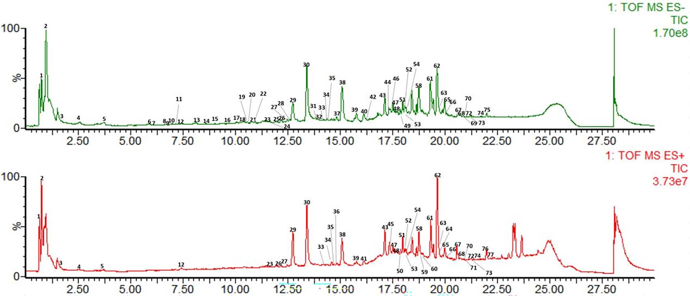
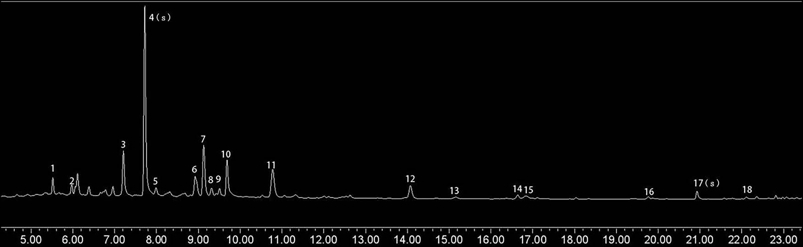

<!-- 方針: ほぼ全訳＋必要に応じた補足。原文構成に沿って訳出。「> 補足:」は訳者注。 -->

## 書誌情報

- 原題: Comprehensive Quality Evaluation of Danggui–Jianzhong Decoction by Fingerprint Analysis, Multi-Component Quantitation and UPLC-Q-TOF-MS
- 著者: Lanyi Huang, Qing Liu, Wenfang Zhang, Bishan Lin, Yongjian Gao, Hong Deng, Shu Zhang（広東薬科大学／Sinopharm Group Medi-World Pharmaceutical, 中国）
- 掲載: *Journal of Chromatographic Science* 2024, 62(7), 635–648. https://doi.org/10.1093/chromsci/bmae034（2024-05-31 オンライン公開）
- インパクトファクター: **1.3**（*J. Chromatogr. Sci.*, JCR 2024 / Clarivate）
- 受領 2022-12-04 / 改訂 2024-03-16 / 採録決定 2024-05-15

> 補足: Danggui–Jianzhong decoction（当帰建中湯, DGJZ）は唐代『千金翼方』（孫思邈）由来の古典処方。構成生薬の略号は本文を通じて
> **A=当帰（Angelicae sinensis radix）, J=大棗（Jujubae fructus）, P=白芍（Paeoniae radix alba）, G=甘草（Glycyrrhizae radix et rhizoma）, C=桂皮（Cinnamomi cortex）, Z=生姜（Zingiberis rhizoma recens）**。

## 要旨（Abstract）

当帰建中湯（DGJZ）は有名な古典中医処方だが、成分が複雑で品質管理が難しい。本研究は、超高速液体クロマトグラフィー‐四重極飛行時間型質量分析（UPLC-Q-TOF-MS）と UPLC により、DGJZ の全体的な化学プロファイルを定性的に明らかにすることを目的とした。テルペノイド・フラボノイド・フェノール酸・ジンゲロール類などを含む **計77成分**を UPLC-Q-TOF-MS で初めて検出・同定し、UPLC 指紋分析の後に **18本のピーク**をマーカーとした。最終的に **パエオニフロリン・リクイリチン・フェルラ酸・桂皮酸・グリチルリチン酸・6-ジンゲロール**を定量し、直線性・精度・正確さ・再現性・回収率について検証した。総じて、DGJZ の化学的構成を体系的に同定し、指紋分析と組み合わせた信頼性の高い定量法を全体的品質評価に適用でき、DGJZ の品質管理の堅固な基盤を提供する。

## 序論（Introduction）

DGJZ は、国家中医薬管理局が公表した最初の「古代有名古典処方100選」の一つで、唐代の孫思邈『千金翼方』に初出。当帰（A）・大棗（J）・白芍（P）・甘草（G）・桂皮（C）・生姜（Z）からなり、主に産後の虚弱・疲労に用いられ、止血・鎮痛の効能をもつ。近代薬理・臨床研究では、多成分・多標的のDGJZが月経困難症・産後回復・慢性高血圧・胃潰瘍に有意な効果を示すとされる。

生薬の品質は産地・加工条件・気候など多くの要因に左右され、ロット間で煎じ液の品質が不均一になる。DGJZ は『中国薬典（2020年版）』に未収載で、品質管理のための体系的な評価法もほとんどない。既存手法では DGJZ の品質評価には不十分である。

TCM の品質管理法には、単一成分分析・スペクトル効果相関分析・多成分分析・臨床応用などがある。単一成分分析は TCM の全体特性を反映できず廃れてきた。化学指紋分析は TCM の品質管理に有効と広く認められた手法の一つで、多成分定量分析と組み合わせると異なるロットの鍵となる品質を識別でき、生薬→飲片→煎じ液の調製全体での品質移行の理解にも役立つ。

本研究は、DGJZ の全体的品質を定性・定量的に明らかにする統合的・信頼性のある手法の確立を目指した。UPLC-Q-TOF-MS で計77化合物を同定し、UPLC 指紋法で15バッチを解析して18ピークをマーカーとし、多成分分析で6成分を定量した。DGJZ の品質研究はこれまで報告がなく、本研究はその後続研究（製剤化など）の参照となる。

## 実験（Experimental）

### 試薬・標準品

標準品（パエオニフロリン、リクイリチン、グリチルリチン酸、6-ジンゲロール、桂皮酸、1,2,3,4,6-O-ペンタガロイルグルコース、没食子酸、cAMP、トリプトファン、カテキン、リグスチリド、クロロゲン酸、シンナムアルデヒド、カフェ酸、フェルラ酸、オレアノール酸、ベツリン酸、ルチン）は中国食品薬品検定研究院（北京）から、アルビフロリン・リクイリチンアピオシド・リクイリチゲニン・イソリクイリチンは上海標準技術社から購入。すべて純度98.0%超。HPLCグレードのアセトニトリル・メタノールは BCR（米国）、ギ酸・リン酸は Aladdin（上海）。精製水（25℃で18.2 MΩ·cm）は Millipore Synergy UV で調製。

6生薬（A, J, P, G, C, Z）は Sinopharm Group Medi-World Pharmaceutical（広東省仏山）から提供。各生薬の産地・ロットは原文 Table I 参照（A/G は甘粛省定西ほか、P は浙江省金華ほか、C は広東省肇慶ほか、Z は四川省江油ほか、各15ロット）。

### 標準溶液・試料溶液の調製

多成分定量用に、6標準品（パエオニフロリン、リクイリチン、フェルラ酸、桂皮酸、6-ジンゲロール、グリチルリチン酸）を 4 µg·mL⁻¹〜3 mg·mL⁻¹ でメタノールに正確に溶解。混合標準溶液をメタノールで段階希釈して検量線に用いた。UPLC-Q-TOF-MS・指紋分析用の残りの標準溶液は 0.5–2 mg·mL⁻¹。全標準溶液は4℃で保存。

**DGJZ 煎じ液の調製**: 当帰14.9 g、大棗9.7 g、白芍22.4 g、甘草7.5 g、桂皮11.2 g、生姜11.2 g を秤量し、水2,000 mL中で600 mLになるまで煮詰め、350メッシュ篩で濾過。真空凍結乾燥機（−50℃）で凍結乾燥粉末とした。

15バッチの DGJZ について、指紋分析用に 0.0667 g、定量用に 0.15 g を精秤し、50%メタノール水溶液10 mLで20分間超音波抽出、0.22 µmメンブレンフィルター濾過後に注入。UPLC-Q-TOF-MS 用には DGJZ粉末50 mgを脱イオン水10 mLで10分超音波抽出、50%メタノール水で希釈し0.22 µm濾過。

### UPLC-Q-TOF-MS 条件

- 装置: Waters ACQUITY UPLC I-Class / Waters Xevo G2 XS QTOF。カラム: Waters HSS T3（2.1 mm × 100 mm, 1.8 µm）。
- 移動相: 0.01%ギ酸水(A)–アセトニトリル(B)、流速 0.3 mL/min、30℃。
- グラジエント: 0–3分 99%A；3–15分 99→80%A；15–25分 80→1%A；25–27分 1%A。
- MS条件: イオンスプレー電圧 3.0–2.3 kV、コーン電圧 40 V、抽出コーン電圧 3 V、イオン源温度 100℃、脱溶媒ガス温度・流量 400℃(+)/350℃(−)・600 L/h(+)/1,600 L/h(−)、リバースコーン気流 50 L/h、衝突ガス流量 0.5 mL·min⁻¹、スキャン時間 0.5 s（間隔0.02 s）、スキャン範囲 m/z 50–12,000。解析は MassLynx 4.1。

### UPLC 指紋法

- 装置: Waters ACQUITY UPLC（PDA検出）。カラム: HSS T3 C18（2.1 mm × 100 mm, 1.8 µm）、35℃、流速 0.25 mL·min⁻¹。
- 移動相: A（0.01%リン酸水）–B（アセトニトリル）。グラジエント: 0–1分 5→7%B；1–3分 7→15%B；3–8分 15→24%B；8–15分 24→34%B；15–19分 34→43%B；19–25分 43→100%B。注入量 1 µL。
- 検出波長: パエオニフロリン 230、リクイリチン 254、フェルラ酸 316、桂皮酸 275、6-ジンゲロール 210、グリチルリチン酸 254 nm。

### バリデーション法

定量法は『中国薬典（2020年版）』に従い、特異性・直線性・精度・安定性・再現性・回収率で検証。検量線は各濃度2連（n=2）、ピーク面積(y)対濃度(x)。日内・日間精度は同日6連・3日連続。安定性は室温（25℃）24時間。回収率は3水準（50, 100, 150%）各3連の標準添加。RSDで評価。指紋法は定量法バリデーションのデータを用い、特異性・安定性・精度・再現性を評価。相対保持時間（RRT）と類似度で評価。

## 結果（Results）

### DGJZの化学成分の同定（77成分）

UPLC-Q-TOF-MS で DGJZ 中の **77化合物**を予備同定し、うち22成分を標準品と比較して確認。由来別では P 23成分、G 34成分、J 5成分、A 10成分、C 7成分、Z 1成分。正負イオンモードの全イオンクロマトグラム（TIC）を Figure 1 に示す。

> 補足: テルペノイド（Figure 2）・フラボノイド（Figure 3）の開裂スキーム、標準品由来成分の構造（Figure 4）、6-ジンゲロールの開裂過程（Figure 5）は構造式・開裂機構の図のため **原文参照**。

**Table II. UPLC-Q-TOF-MSによるDGJZ中77化合物の同定**（代表イオンを抜粋。詳細なMS/MSフラグメント・ppm誤差は原文 Table II 参照。由来: P=白芍, G=甘草, J=大棗, A=当帰, C=桂皮, Z=生姜）

| No | Rt(min) | 同定成分 | 分子式 | 代表イオン m/z | 由来 |
| --- | --- | --- | --- | --- | --- |
| 1 | 0.75 | Arginine（アルギニン） | C6H14N4O2 | 173.1081[M-H]⁻ / 175.1214[M+H]⁺ | P/G/J/A |
| 2 | 0.95 | Sucrose（スクロース） | C12H22O11 | 341.1181[M-H]⁻ | 全 |
| 3 | 1.54 | Citric acid（クエン酸） | C6H8O7 | 191.0236[M-H]⁻ | P |
| 4 | 2.56 | Desbenzoylalbiflorin | C16H24O10 | 375.1391[M-H]⁻ | P |
| 5 | 3.73 | Gallic acid（没食子酸） | C7H6O5 | 169.0165[M-H]⁻ / 171.0297[M+H]⁺ | P |
| 6 | 5.88 | 1-O-β-D-Glucopyranosylpaeonisuffron | C16H24O9 | 359.1418[M-H]⁻ | P |
| 7 | 6.08 | cAMP | C10H12N5O6P | 328.0521[M-H]⁻ / 330.0599[M+H]⁺ | J |
| 8 | 6.67 | Galloylsucrose（異性体） | C19H26O15 | 493.1261[M-H]⁻ | P |
| 9 | 6.77 | Protocatechuic acid（プロトカテク酸） | C7H6O4 | 153.0230[M-H]⁻ | C |
| 10 | 6.97 | Galloylsucrose（異性体） | C19H26O15 | 493.1307[M-H]⁻ | P |
| 11 | 7.12 | Galloylsucrose（異性体） | C19H26O15 | 493.1307[M-H]⁻ | P |
| 12 | 7.42 | Tryptophan（トリプトファン） | C11H12N2O2 | 203.0847[M-H]⁻ | A |
| 13 | 8.11 | DL-3-Phenyllactic acid | C9H10O3 | 165.058[M-H]⁻ | G |
| 14 | 8.69 | 3,4-Dihydroxybenzaldehyde | C7H6O3 | 137.0274[M-H]⁻ | C |
| 15 | 9.01 | Loganin（ロガニン） | C17H26O10 | 389.155[M-H]⁻ | P |
| 16 | 9.76 | Vanillic acid（バニリン酸） | C8H8O4 | 167.0367[M-H]⁻ | A |
| 17 | 10.18 | Chlorogenic acid（クロロゲン酸） | C16H18O9 | 353.0873[M-H]⁻ | A |
| 18 | 10.36 | Catechin（カテキン） | C15H14O6 | 289.0782[M-H]⁻ | P |
| 19 | 10.56 | Oxypaeoniflorin | C23H28O12 | 495.1605[M-H]⁻ | P |
| 20 | 10.60 | Cryptochlorogenic acid | C16H18O9 | 353.0952[M-H]⁻ | A |
| 21 | 10.80 | Zizybeoside I | C19H28O11 | 431.1621[M-H]⁻ | J |
| 22 | 10.96 | Caffeic acid（カフェ酸） | C9H8O4 | 179.0386[M-H]⁻ | G |
| 23 | 11.47 | Procyanidin B1/B2 | C30H26O12 | 577.1497[M-H]⁻ | P |
| 24 | 11.62 | Liquiritigenin 7,4-diglucoside | C27H32O14 | 579.1829[M-H]⁻ | G |
| 25 | 12.01 | Glucoliquiritin apioside | C32H40O18 | 711.2251[M-H]⁻ | G |
| 26 | 12.19 | Epicatechin（エピカテキン） | C15H14O6 | 289.0782[M-H]⁻ | P |
| 27 | 12.48 | 6'-O-β-D-Glucopyranosylalbiflorin | C29H38O16 | 641.2197[M-H]⁻ | P |
| 28 | 12.60 | Vicenin-2 | C27H30O15 | 593.1664[M-H]⁻ | G |
| 29 | 12.72 | Albiflorin R1 | C23H28O11 | 479.1637[M-H]⁻ | P |
| 30 | 13.40 | Paeoniflorin（パエオニフロリン） | C23H28O11 | 479.1637[M-H]⁻ / 525.1749[M+HCOO]⁻ | P |
| 31 | 13.79 | Schaftoside | C26H28O14 | 563.1485[M-H]⁻ | G |
| 32 | 14.19 | Perseanol | C20H32O7 | 383.2163[M-H]⁻ | C |
| 33 | 14.36 | Tetragalloylglucose | C34H28O22 | 787.1125[M-H]⁻ | P |
| 34 | 14.42 | Daidzin（ダイジン） | C21H20O9 | 415.1123[M-H]⁻ / 417.1190[M+H]⁺ | G |
| 35 | 14.58 | Ferulic acid（フェルラ酸） | C10H10O4 | 193.0551[M-H]⁻ / 195.0630[M+H]⁺ | A |
| 36 | 14.58 | 7-Methoxycoumarin | C10H8O3 | 177.0546[M+H]⁺ | A |
| 37 | 14.83 | Neoliquiritin apioside | C26H30O13 | 549.1752[M-H]⁻ | G |
| 38 | 15.08 | Liquiritin apioside | C26H30O13 | 549.1752[M-H]⁻ | G |
| 39 | 15.67 | Galloylpaeoniflorin（異性体含む） | C30H32O15 | 631.1804[M-H]⁻ / 633.1829[M+H]⁺ | P |
| 40 | 16.11 | 1,2,3,4,6-O-Pentagalloylglucose | C41H32O26 | 939.1295[M-H]⁻ | P |
| 41 | 16.86 | Naringenin（ナリンゲニン） | C15H12O5 | 273.0744[M+H]⁺ | G |
| 42 | 16.86 | Naringenin-7-O-glucoside | C21H22O10 | 433.1241[M+H]⁺ | G |
| 43 | 17.12 | Albiflorin（アルビフロリン） | C23H28O11 | 479.1637[M-H]⁻ / 481.2172[M+H]⁺ | P |
| 44 | 17.32 | Isoliquiritin apioside | C26H30O13 | 549.1705[M-H]⁻ | G |
| 45 | 17.33 | Senkyunolide I（センキュノリドI） | C12H16O4 | 225.1360[M+H]⁺ | A |
| 46 | 17.43 | Licuraside | C26H30O13 | 549.1752[M-H]⁻ | G |
| 47 | 17.50 | Liquiritin（リクイリチン） | C21H22O9 | 417.1296[M-H]⁻ / 419.1358[M+H]⁺ | G |
| 48 | 17.56 | Ononin（オノニン） | C22H22O9 | 429.1281[M-H]⁻ | G |
| 49 | 17.63 | Isoliquiritin（イソリクイリチン） | C21H22O9 | 417.1296[M-H]⁻ | G |
| 50 | 17.70 | Senkyunolide H（センキュノリドH） | C12H16O4 | 225.1127[M+H]⁺ | A |
| 51 | 17.97 | Liquiritigenin（リクイリチゲニン） | C15H12O4 | 255.0733[M-H]⁻ / 257.0818[M+H]⁺ | G |
| 52 | 18.07 | Licoricesaponin J2 | C42H64O16 | 823.4288[M-H]⁻ / 825.4294[M+H]⁺ | G |
| 53 | 18.14 | 24-Hydroxyl-licoricesaponin A3 or isomer | C48H72O22 | 999.4622[M-H]⁻ / 1001.4592[M+H]⁺ | G |
| 54 | 18.24 | 24-Hydroxyl-licoricesaponin A3 or isomer | C48H72O22 | 999.4686[M-H]⁻ | G |
| 55 | 18.31 | Cinnamic acid（桂皮酸） | C9H8O2 | 147.0471[M-H]⁻ / 149.0601[M+H]⁺ | C |
| 56 | 18.43 | Licoricesaponin A3 | C48H72O21 | 983.4677[M-H]⁻ / 985.4644[M+H]⁺ | G |
| 57 | 18.63 | Benzoylpaeoniflorin（異性体含む） | C30H32O12 | 583.1958[M-H]⁻ | P |
| 58 | 18.74 | Benzoylpaeoniflorin（異性体含む） | C30H32O12 | 583.1958[M-H]⁻ | P |
| 59 | 18.88 | E-/Z-Butylidenephthalide | C12H12O2 | 189.0909[M+H]⁺ | A |
| 60 | 18.95 | Cinnamaldehyde（シンナムアルデヒド） | C9H8O | 133.0634[M+H]⁺ | C |
| 61 | 19.30 | Licoricesaponin G2 | C42H62O17 | 837.4119[M-H]⁻ / 839.4033[M+H]⁺ | G |
| 62 | 19.60 | Glycyrrhizic acid（グリチルリチン酸） | C42H62O16 | 821.4149[M-H]⁻ / 823.4142[M+H]⁺ | G |
| 63 | 19.69 | Formononetin（ホルモノネチン） | C16H12O4 | 267.0712[M-H]⁻ | G |
| 64 | 19.70 | E-/Z-Butylidenephthalide | C12H12O2 | 189.0909[M+H]⁺ | A |
| 65 | 19.97 | Uralsaponin A | C42H62O16 | 821.4149[M-H]⁻ | G |
| 66 | 20.08 | Licoricesaponin H2 | C42H62O16 | 821.4091[M-H]⁻ | G |
| 67 | 20.55 | 6-Gingerol（6-ジンゲロール） | C17H26O4 | 293.1794[M-H]⁻ / 294.1813[M+H]⁺ | Z |
| 68 | 20.61 | Glycycoumarin | C21H20O6 | 367.1244[M-H]⁻ / 369.1338[M+H]⁺ | G |
| 69 | 20.73 | Glyasperins C | C21H25O5 | 355.1642[M-H]⁻ / 357.1671[M+H]⁺ | G |
| 70 | 20.85 | Licoisoflavone B | C20H16O6 | 351.0936[M-H]⁻ / 353.1028[M+H]⁺ | G |
| 71 | 20.92 | Paeonol（パエオノール） | C9H10O3 | 167.071[M+H]⁺ | C |
| 72 | 21.18 | Licoisoflavone A | C20H18O6 | 353.1106[M-H]⁻ / 355.1166[M+H]⁺ | G |
| 73 | 21.25 | Licoricone | C22H22O6 | 381.143[M-H]⁻ / 383.1499[M+H]⁺ | G |
| 74 | 21.40 | Glycyrol | C21H18O6 | 365.1107[M-H]⁻ / 367.1158[M+H]⁺ | G |
| 75 | 21.96 | Cytosamine | C18H30N4O6 | 397.2096[M-H]⁻ | J |
| 76 | 21.96 | Ligustilide（リグスチリド） | C12H14O2 | 191.1081[M+H]⁺ | A |
| 77 | 22.02 | Glycyrin | C22H22O6 | 383.1499[M+H]⁺ | G |

分類別の要点（原文の記述）:
- **テルペノイド**: C 由来の perseanol 1種のみ同定。P で8種、G で8サポニンを推定。パエオニフロリン（peak 30, tR 13.40）とアルビフロリン（peak 43, tR 17.12）は同じフラグメントのため標準品で区別。三萜サポニンはすべて甘草由来。
- **フラボノイド**: 主に G・J 由来で計18種。フラボン・カルコン・フラバノン・配糖体に分類。peak 47/49/51/38 をそれぞれ liquiritin / isoliquiritin / liquiritigenin / liquiritin apioside と同定。
- **フェノール酸**: 主に A・C・P 由来で12成分を暫定同定。フェルラ酸（A由来、強い抗酸化活性）など。
- **その他**: 6-ジンゲロール（peak 67, Z由来）、トリプトファン・アルギニン・スクロース・cAMP など。

### 指紋分析（Fingerprint analysis）

指紋法は良好な分離・対称係数・理論段数を示した。RRT の精度 RSD は 0.2–0.5%、再現性 RSD は 0.1–0.4%、溶液安定性の RRT の RSD は 0.7%以下で、良好な精度・再現性・安定性を確認。

UPLC により **18本の共通ピーク**を認識し、12本を標準品比較で同定: tryptophan(1,A)・albiflorin(3,P)・paeoniflorin(4,P)・liquiritin apioside(6,G)・liquiritin(7,G)・ferulic acid(8,A)・1,2,3,4,6-O-pentagalloylglucose(11,P)・cinnamic acid(13,C)・benzoylpaeoniflorin(14,P)・cinnamaldehyde(15,C)・glycyrrhizic acid(17,G)・6-gingerol(18,Z)。パエオニフロリン(peak 4)とグリチルリチン酸(peak 17)を基準ピークとし、他ピークの RRT と RSD を算出（原文 Table III/IV、RRTのRSDは概ね0.01–0.06%）。

専門ソフト「中薬色譜指紋類似度評価システム（2012A版）」で15バッチの類似度を算出: **0.986, 0.996, 0.988, 0.993, 0.992, 0.995, 0.992, 0.991, 0.965, 0.992, 0.995, 0.992, 0.985, 0.992, 0.993**（すべて >0.9）。

### 定量分析（Quantitative analysis）

6成分の検量線はいずれも **r² > 0.999** と良好な直線性。再現性・精度・回収率はすべて要件を満たした。室温24時間の溶液安定性 RSD はすべて2%未満。回収率は **89.83–104.30%（RSD < 3%）**。

**Table V. 定量分析のバリデーション結果**

| No | 成分 | 検量線 | r² | 範囲(µg/ml) | 再現性RSD% | 精度RSD% | 安定性RSD% | 回収率%(±SD) | 中間精度RSD% |
| --- | --- | --- | --- | --- | --- | --- | --- | --- | --- |
| 1 | Paeoniflorin | y=3,627,317.60x−417.81 | 1.000 | 31.6–1011.27 | 0.69 | 0.29 | 0.93 | 89.83 ± 2.04 | 0.61 |
| 2 | Liquiritin | y=6,343,523.75x+11,020.63 | 1.000 | 6.11–195.51 | 0.86 | 0.38 | 0.59 | 101.50 ± 1.60 | 0.65 |
| 3 | Ferulic acid | y=12,669,371.87x+1,483.40 | 1.000 | 0.72–22.90 | 0.45 | 1.50 | 1.15 | 101.68 ± 2.64 | 0.85 |
| 4 | Cinnamic acid | y=27,259,796.39x−545.13 | 1.000 | 0.47–14.91 | 1.25 | 0.45 | 0.70 | 100.54 ± 1.75 | 0.50 |
| 5 | Glycyrrhizic acid | y=1,952,495.11x−2,713.33 | 1.000 | 7.15–228.76 | 1.39 | 0.88 | 0.83 | 104.30 ± 2.52 | 1.34 |
| 6 | 6-Gingerol | y=8,528,014.25x+178.66 | 1.000 | 1.39–44.49 | 1.74 | 0.58 | 0.37 | 99.48 ± 1.03 | 1.61 |

**15バッチでの含量範囲（Table VI）**:

| 成分 | 含量範囲(mg·g⁻¹) |
| --- | --- |
| Paeoniflorin | 16.1–26.1 |
| Liquiritin | 0.8–4.6 |
| Ferulic acid | 0.31–0.62 |
| Cinnamic acid | 0.05–0.52 |
| Glycyrrhizic acid | 2.8–7.4 |
| 6-Gingerol | 0.16–0.53 |

パエオニフロリン・リクイリチン・グリチルリチン酸の濃度が相対的に高い。

## 考察（Discussion）

既報では DGJZ の UPLC 指紋・化学パターン認識・ネットワーク薬理（20共通ピーク・13同定）があるが含量決定は未完で、用量と効力の関係も不明確だった。本研究は77成分を予備同定し、後続の総合品質研究（指紋確立・含量決定法）の参照を提供する。別の既報は PD ラットモデルのメタボロミクスで Q-marker を確立したが、本研究は品質分析法の確立により DGJZ の活性成分をより包括的に確認した。

パエオニフロリンとグリチルリチン酸は月経困難症モデルマウスで併用鎮痛効果（メロキシカム対照と同等、48時間持続）が報告される。フェルラ酸は糖尿病ラットで創傷治癒促進（16日でほぼ完治、96%収縮）が示され、これらは品質管理指標として適切である。

## 結論（Conclusion）

本研究は、TCM 指紋と多成分定量分析を組み合わせた手法を DGJZ の品質評価に初めて確立した。18本の特徴ピークで15バッチの類似度を評価し、6成分を同時定量、77化合物を同定（一部予備同定）。15バッチの類似度は >0.9 で良好な品質一貫性と本法の適用性を示した。収集した生薬・香辛料の品質特性を十分に反映し、鍵となる品質属性の移行を担保することで、DGJZ の各生薬を定性・定量的に評価できる。本法は TCM の後続の品質管理と関連製剤開発の参照となる。

---

## 訳者補足（実務向けメモ）

> 以下は原文には無い、QC実務向けの整理（訳者注）。

- **構成は「定性（網羅同定）＋定性指紋＋定量」の3層**。多成分処方の同等性評価の組み立て方として参考になる。**指紋（18ピーク）で全体像、6成分定量で主要マーカーの量**を押さえる二段構え。
- **量的に効くマーカー**: パエオニフロリン（16.1–26.1 mg/g）・グリチルリチン酸（2.8–7.4）・リクイリチン（0.8–4.6）が高め。**リクイリチンと桂皮酸はバッチ間変動が大きい**（0.8→4.6、0.05→0.52）ので、規格化の際はばらつき要因（産地・加工）の確認が要る。
- **移植時のポイント**: UPLC（HSS T3, 1.8 µm）前提。HPLC機しか無い場合は分離・保持の再現に条件最適化が要る。検出波長は成分ごとに異なる（210–316 nm）ので**マルチ波長 or PDA必須**。
- **限界**: 77成分の多くは標準品未確認の「予備同定」（22成分のみ標準品確認）。本処方は『中国薬典』未収載で、規格値は本研究の実測レンジが出発点。日本の漢方（当帰建中湯）と構成・分量は必ずしも一致しない点に注意。
- テルペノイド/フラボノイドの開裂スキーム等（Figure 2–5）は構造解析の図で、QC運用上は Figure 1（TIC）と Figure 6（指紋）が中心。詳細MS/MSは原文 Table II 参照。
