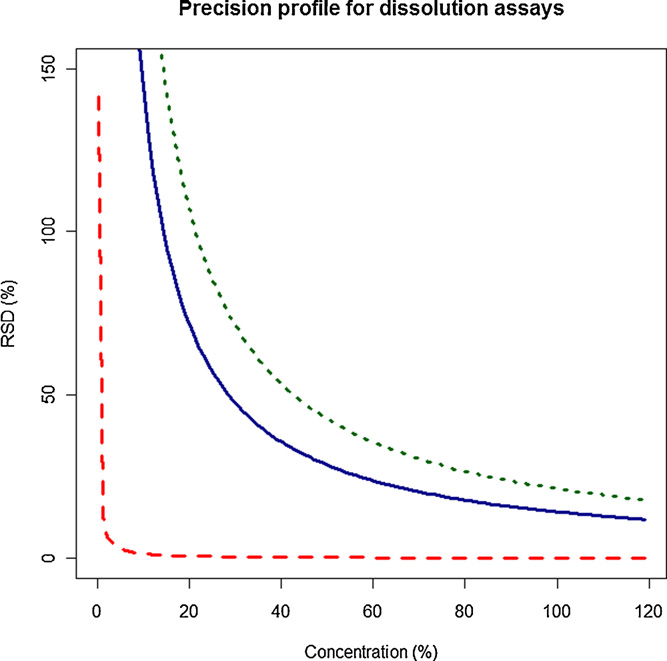
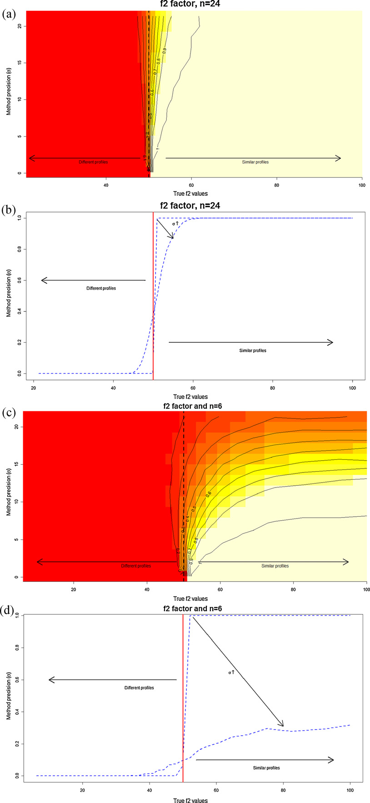
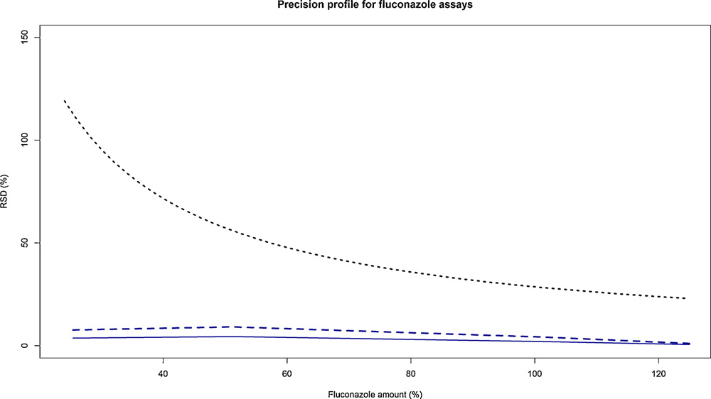
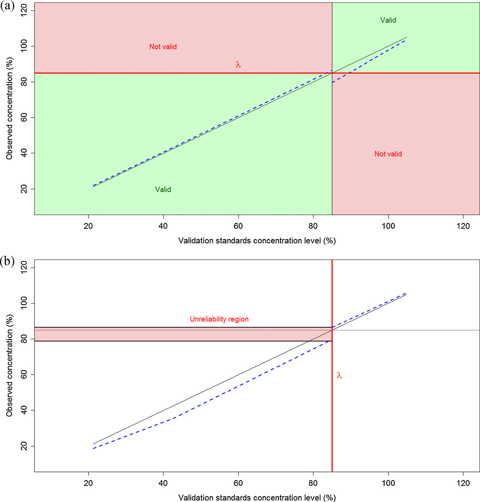

<!-- 方針: ほぼ全訳＋必要に応じた補足。原文（英語・Anal. Chim. Acta 原著）構成に沿って訳出。本文の[N]は原文の番号引用に対応し末尾の参考文献にリンクする。図1〜図5は原本PDFの埋め込み画像をPyMuPDFで抽出しReadで確認のうえ全訳キャプションで埋め込んだ。数式(f1/f2・ANOVA・二項)はKaTeXで再構成(1ブロック1式)。「> 補足:」は訳者注。同著者の姉妹論文「分析法バリデーションとQbD」も本サイトに掲載。 -->

## 書誌情報

- 原題: Validation of analytical methods involved in dissolution assays: Acceptance limits and decision methodologies
- 著者: E. Rozet ᵃ\*・E. Ziemons ᵃ・R.D. Marini ᵃ・B. Boulanger ᵇ・Ph. Hubert ᵃ（ᵃ 分析化学研究室 CIRM 薬学研究所 リエージュ大学, ベルギー／ᵇ Arlenda SA, リエージュ, ベルギー）
- 掲載: *Analytica Chimica Acta* 751 (2012) 44–51. DOI: 10.1016/j.aca.2012.09.017
- 種別: 原著論文（Original article）
- インパクトファクター: **該当**（分析化学の主要誌）
- 助成: ベルギー国立科学研究基金（FRS-FNRS。E. Rozet はポスドク研究員）

> 補足: 本稿は、別掲の同著者論文「[分析法バリデーションとQuality by Design](/papers/analytical-procedure-validation-qbd-paradigm.html)」の姉妹編で、その QbD/許容区間の考え方を **溶出試験（dissolution test）** の分析法に具体的に適用したものである。溶出試験は、錠剤・カプセルが規定時間内にどれだけ有効成分を放出するかを測る、製剤QCの中核試験。本稿の問いはシンプルで、「**その溶出試験用の分析法は、“2つの溶出プロファイルが似ている”や“製品が規格に適合している”を正しく判定できるのか？ そして、それをどう検証（バリデート）するのか？**」。ICH Q2 は分析法バリデーションの項目（真度・精度など）を並べるが、「**では、その方法が“合格”か“不合格”かをどう決めるのか**」は書いていない——この空白を QbD で埋めるのが本稿である。日本の読者には、**溶出試験の分析法バリデーションを「チェックリスト消化」から「目的適合性の統計的証明」へ変える実務方法論**、と考えると位置づけが分かりやすい。用語を下に整理する。

## 用語の整理（訳者による前置き）

- **溶出試験（dissolution test）**＝製剤（錠剤等）を溶出媒体に入れ、経時的に溶け出す有効成分（API）量を測る試験。通常12個の製品単位を使う（FDA/USP推奨）。
- **f1（差異係数）／f2（類似性係数）**＝2つの溶出プロファイル（参照R・被験T）の類似度を測るモデル非依存の指標。**f2 ≥ 50** なら類似とみなす。
- **ATP（Analytical Target Profile、分析目標プロファイル）**＝分析法が「何を・どの性能で」測るべきかを定義。本稿では **最大許容 室内再現精度SD** を含める。
- **室内再現精度（intermediate precision, IP）**＝日・オペレータ・機器などを変えたときの総合的なばらつき（SD またはRSD%）。バイアス（系統誤差）とは別。
- **精度プロファイル（precision profile）／判定プロファイル（decision profile）**＝濃度に対し精度や許容区間をプロットして合否を判断する図。
- **β期待許容区間（β-expectation tolerance interval）**＝「将来の1回の結果」が確率 β で入る区間（＝予測区間）。
- **Q＋5%**＝薬局方の即放性製剤の適合基準（各単位の溶出率が Q＋5% 以上）。**Q**＝規定時間での最低溶出率（%表示）。**信頼できない領域（unreliability region）／ガードバンド**＝受入限界の周りで誤判定リスクが許容超になる幅。

## 要旨（Abstract）

溶出試験は、製品品質・性能を継続的に保証する鍵となる要素である。その究極の目的は、定義された規格基準の中で一貫した製品品質を保証することである。製品の溶出プロファイルを評価し、又は薬局方適合を検証することを目的とする分析法のバリデーションは、この分析法が **2つの溶出プロファイルを正しく「類似」と宣言でき、又は製品を規格に「適合」と正しく宣言できる** ことを実証すべきである。これらの分析法が目的に適合（fit for purpose）であることを保証することが不可欠であり、方法バリデーションはこの保証を提供することを目指す。しかし、ICH Q2 ガイドラインでさえ、バリデーション対象の方法が最終目的に照らして有効か否かをどう判断するかの情報がない。溶出試験用の品質管理（QC）分析法が有効であることを保証するのに、バリデーション基準の全項目が必要なのか？ これらの基準にどの受入限界を設定すべきか？ 方法の有効性をどう判断するか？——これらが本稿の答えようとする問いである。焦点は、製薬産業における QbD（Quality by Design）原則の現行実装に準拠して、溶出試験に関わる分析法のATP（分析目標プロファイル）を正しく定義できるようにすることに置かれる。そうすれば、分析法バリデーションは、開発した方法が意図した目的に適合することの自然な実証となり、製品の販売承認取得に必要な申請を完成させるために今なお一般に行われている「軽率なチェックリスト式バリデーション」ではなくなる。

- **キーワード**: Quality by Design／許容区間／方法バリデーション／分析目標プロファイル（ATP）／受入限界／溶出試験法

## 1. 序論

溶出試験は、製剤の性能を特性評価し、バッチ間品質を評価し、処方や製造工程の変更などの後に製品品質・性能が継続していることを保証するために必要である[1]。溶出試験の手順は次のとおり。製品単位（錠剤やカプセル）を、専用の溶出装置に入れた既知容量の適切な溶出媒体に置く。溶出につれ、生じた溶液を経時的にサンプリングする。これらのサンプルを通常HPLCや分光光度法でAPI（有効成分）量について分析する[2]。溶出は、複数の時点での溶出API平均量として測定される。使用する製品単位数は、FDAやUSPの推奨で一般に12に設定される[1,3]。

これらの試験の究極の目的は、定義された規格基準の中で一貫した製品品質を保証することである。溶出試験は一般に、溶出プロファイル比較——製剤の類似性の確立——に用いられる[1-9]。2つのモデル非依存法によるプロファイル比較には、**差異係数 f1** と **類似性係数 f2** が実務で高頻度に用いられる[1,3]。加えて、溶出試験は、経口投与の即放性製剤の溶出要件への適合判定にも薬局方[10,11] で要求される。

製品の溶出プロファイルを評価し、又は即放性製剤の薬局方適合を検証する分析法のバリデーションは、その方法が科学的に健全で、正確・精密・再現性ある結果を保証し、何より許容できる製品品質を保証することを実証すべきである。最終的に、この分析法は、**2つの溶出プロファイルを正しく「類似」と宣言する能力、又は即放性製品を薬局方規格に「適合」と正しく宣言する能力** を実証すべきである。異なる時点の溶出媒体を分析しAPI放出量を定量する分析法が目的に適合であることが不可欠である。

方法バリデーションはこの保証を提供することを目指す。しかし、ICH Q2 ガイドライン[12] でさえ、バリデーション対象の方法が最終目的に有効か否かをどう判断するかの情報がない。溶出試験用のQC分析法が有効であることを保証するのにバリデーション基準の全項目が必要か？ どの受入限界を設定すべきか？ 有効性をどう判断するか？——これらが本稿の問いである。

## 2. 計算

すべての計算・シミュレーションは R v2.11.1（CRAN）と RStudio v0.92.44 で行った。

## 3. 溶出プロファイルの比較

差異係数 f1 と類似性係数 f2 は溶出プロファイル比較に高頻度に用いられる。式は次のとおり（式1・式2）：

$$f_1 = \frac{\sum_{t=1}^{n}|R_t - T_t|}{\sum_{t=1}^{n}R_t} \times 100 \tag{1}$$

$$f_2 = 50 \times \log\left\{\left[1 + \frac{1}{n}\sum_{t=1}^{n}(R_t - T_t)^2\right]^{-0.5} \times 100\right\} \tag{2}$$

ここで $R_t$・$T_t$ は選択した $n$ 時点における参照製品・被験製品の溶出率（%）。これらは参照製品（R）と被験製品（T）の測定値の **差** に基づく。各製品 R・T の測定結果は次のように書ける（式3・式4）：

$$x_{ij,R} = R + \delta + B + \varepsilon_W \tag{3}$$

$$x_{ij,T} = T + \delta + B + \varepsilon_W \tag{4}$$

ここで $x_{ij,k}$ は系列 $i$ の $j$ 番目の測定結果、$R$・$T$ は参照・被験製品の真値、$\delta$ は方法のバイアス（系統誤差）、$B$ は測定方法による系列間ランダム効果（$N(0,\sigma_B^2)$）、$\varepsilon_W$ は系列内（併行精度）ランダム誤差（$N(0,\sigma_W^2)$）。R・T を同じ方法で分析するので、バイアス・系列間・系列内のランダム効果は同一と仮定される。

f1・f2 はいずれも、同一分析法で異なる製品（R・T）に得た結果の **差** に依存するため、この差は方法の **精度のみ** に依存し、バイアスにはもはや依存しない。これは、**溶出プロファイル比較を目的とする分析法の目的適合性は、方法の室内再現精度標準偏差の大きさだけで測るべき** であることを意味する。したがって、最大許容 室内再現精度標準偏差 $\sigma$ を方法のATP[13,14] に規定し、方法の有効性は、その室内再現精度がこの最大SD値を満たすか否かで判断すべきである。ATPは、方法開発を方向づけるすべての方法性能基準の組み合わせで[13]、方法が何を測り、どの性能水準が要求されるか（精度・真度・作業範囲・定量限界）を定義する[15]。薬局方は f2 での比較を推奨する[3] ため、本稿の残りは f2 に焦点を絞る。

### 3.1 シミュレーション

溶出プロファイル比較を目的とする分析法の有効性を評価するシミュレーションを行った。f2 による溶出プロファイル類似性比較は FDA/USP 推奨[1,3] に従う。溶出の5・20・50・75・90・100%を表す6時点を定義。各時点で12検体（各々が1製品単位＝錠剤/カプセル）を、被験（T＝変更後）・参照（R＝変更前）製品の両方についてシミュレート[1]。議論のため単位数を24に増やす・6に減らす場合も検討。各製品で各時点の平均を計算し f2 を式2で計算。類似の規則は f2 ≥ 50[1,3]。被験製品の真の溶出値は真の f2 が15〜100を覆うようシミュレートした。

各製品 R・T の分析法の結果は、次の一元配置分散分析（ANOVA）ランダムモデルで生成（式5）：

$$x_{ij} = \mu + B + \varepsilon_W \tag{5}$$

$\mu$ は各選択時点（5・20・50・75・90・100%）の真の溶出率、$B \sim N(0,\sigma_B^2)$、$\varepsilon_W \sim N(0,\sigma_W^2)$。室内再現精度SDを0〜15で変え、系列間分散/系列内分散の比は $\rho=1$ に固定。各状況で2000回シミュレート。各シミュレーションで6時点の結果を R・T について生成し f2 を計算して閾値50と比較。2000回中 f2 ≥ 50 の件数を数え、総数で割って「T・R プロファイルを類似と宣言する確率」を得て、対応する **オペレーティング特性曲線（OC曲線）** を得る。

### 3.2 シミュレーション結果

QC法として製品溶出プロファイルの検証・比較に使う分析法のバリデーションの目的は、**真に類似のとき高確率で類似と宣言し、真に異なるとき異なると宣言する** ことを保証することである。シミュレーションから、方法の有効性判断で確認すべき核心基準は **精度、より正確には室内再現精度標準偏差の値** であることが分かる。

図1a は FDA推奨の12検体の場合の確率マップで、真の f2 と真の方法精度（IP）の関数として2プロファイルを類似と宣言する確率を与える。図1b は同じ挙動をOC曲線で示す。両図から、室内再現精度SDが増すと、溶出プロファイルを適切に類似と宣言する確率が下がることが分かる。例：真の f2 = 60（真に類似）のとき、方法の室内再現精度SD（縦軸）が増すと類似と宣言する確率が下がる。逆に、真に異なる（f2 = 45）のに類似と宣言する確率は、室内再現精度SDが増すと上がる。

### 3.3 判定方法論

これら2つのリスクを制御する方法論が必要である。**2つの f2 値とそれぞれの確率** を定義することで行える。第1の対は「高確率で正しく類似と宣言すべき最大の真の f2 値」（例：$f_2^+ = 60$、$\pi_{f_2}^+ = 0.95$）。第2の対は「真に異なるのに類似と宣言する確率が小さくあるべき最小の真の f2 値」（例：$f_2^- = 45$、$\pi_{f_2}^- = 0.05$）。この2対から、分析法に許容できる **最大 室内再現精度SD $\sigma$** を見つけられ、これをバリデーションの受入限界とする。$\sigma$ を得る式はないので、3.1のシミュレーション枠組みで求める。

方法の有効性判断は **精度プロファイル**[16] で行う。x軸にバリデーション標準の濃度、y軸に方法の室内再現相対標準偏差（RSD%）。受入限界は、先に得た最大 室内再現精度SD $\sigma$ をRSD値で表したもの。

図2は3つの受入限界をもつ精度プロファイルの例。厳しい方（長破線）はSD=0.1、緩い方（短破線）はSD=20、中間（実線）は先の2臨界対に対応し **σ = 14.3**。受入限界 $\sigma$ を定めた後の判定方法論は次のとおり：

- バリデーション中に調べた各濃度水準で、室内再現精度SDをバリデーションデータから推定する[12,17,18]。
- 各室内再現精度SDの **片側95%信頼区間の上限** を計算する（詳細式は[19,20]）。
- これらの上限を、先に定めた受入限界 $\sigma$ と比較する（図4）。95%上限がすべて受入限界 $\sigma$ より小さければ方法は有効、そうでなければ無効。

精度が受入限界内に収まらない場合の解決策：①方法開発に戻って精度を改善、②製品比較に使うサンプル数を変える。FDAは12検体を推奨[1] するが、これを増やす手もある。図3a・bはサンプル数24でのf2の確率マップとOC曲線。サンプル数が増えると、分析法に許容される室内再現精度SDが大きくなる（24で最大SDが20を超える。12では14.3だった）。つまり **精度の低い方法でも有効と宣言できるが、溶出試験のコスト増と引き換え** になる。逆に精度が受入限界に十分収まるなら、サンプル数を減らせる（図3c・d、各製品6単位）。

### 3.4 適用例

上記方法論を、ある製剤中の **フルコナゾール** の溶出値を定量する **HPLC-UV法** のバリデーションに適用する（方法・バリデーションプロトコル・古典的バリデーション結果は[21]）。受入限界を、$f_2^+ = 60$ かつ確率0.95・$f_2^- = 45$ かつ確率0.05 を満たすSD、すなわち **$\sigma = 14.3$** とし、比較のサンプル数はFDA推奨の12単位に設定。

図4のとおり、フルコナゾール溶出試験のHPLC-UV法は完全に有効：室内再現精度SDの片側95%信頼上限（破線）がすべて精度受入限界 $\sigma = 14.3$（点線）より小さい。さらにこの優れた性能に基づけば、溶出プロファイル比較のサンプル数を減らせ、分析スループット向上・コスト削減を製品品質を保ちつつ実現できる。

## 4. 即放性製剤

即放性製剤の被験単位から溶出したAPI量が薬局方規格[10,11] に適合するかを検証する分析法は、製品の適合について正しい判断を実際に下せることを実証してバリデートすべきである。USP/EPのサンプリング計画の **第1段階** への適合は、被験6単位の各溶出API率が **Q＋5%以上** なら実証される。Q は規定溶出時間での最低API溶出量（表示含量に対する%）で、薬局方の個別各条又は製薬企業自身の規格で規定される。

これは、方法の有効性判断に使う受入限界が、この段階では **$\lambda = Q + 5\%$** であることを意味する。方法が目的に有効と示すには、真に非適合の検体（濃度が Q＋5%未満）を非適合と実際に宣言し、真に適合の検体（Q＋5%以上）を適合と分類することを示す必要がある（図5a）。

偽適合リスク・偽非適合リスクを各5%とする。適合検体では、真に適合のとき6つの溶出率すべてが規格限界以上である確率が95%（式6）：

$$P\left[(Q_1 \cap \dots \cap Q_i \cap \dots \cap Q_6) \ge Q+5\%\right] = 0.95 \tag{6}$$

方法バリデーションでは、将来の各結果が確率 β で入る区間を推定できる[22-24]（**β期待許容区間**＝予測区間、[L; U]、[25,26]）。判定規則は Rozet ら[14] の **判定プロファイル** に従う。式6を満たすには、単一結果が $Q_i \ge Q+5\%$ を満たす確率 $\beta_L$ を、二項分布 $\text{Bi}(6, \beta_L)$ から求める：

$$\beta_L^6 = 0.95 \iff \beta_L = \sqrt[6]{0.95} = 0.9914876 \approx 0.992$$

したがって、$\beta_L = 0.992$ で計算した片側 β期待許容区間の **下限** を、バリデーション受入限界 $\lambda = Q+5\%$ と比較する（図5a）。Q＋5%以上の濃度のバリデーション標準で下限が規格限界を跨がなければ、方法は有効。

非適合検体でも同様に、真に非適合のとき6つのうち少なくとも1つが規格限界未満である確率が95%（式7）：

$$1 - P\left[(Q_1 \cap \dots \cap Q_6) \ge Q+5\%\right] = 0.95 \iff P\left[(Q_1 \cap \dots \cap Q_6) \ge Q+5\%\right] = 0.05 \tag{7}$$

単一結果が $Q_i \ge Q+5\%$ を満たす確率 $\beta_U$：

$$\beta_U^6 = 0.05 \iff \beta_U = \sqrt[6]{0.05} = 0.6069622 \approx 0.61$$

有効と定義するには、$\beta_U = 0.61$ で計算した片側 β期待許容区間の **上限** が、Q＋5%未満のバリデーション標準で受入限界 $\lambda = Q+5\%$ を跨がないこと（図5a）。

### 4.1 適用例

3.4と同じ例で、即放性製剤単位から溶出したAPIの定量法バリデーションを示す。製薬企業が規定する溶出API率を **Q = 80%** とし、HPLC-UV法の受入限界を **$\lambda = 85\%$**（＝Q＋5%）とする。偽適合・偽非適合リスクを各5%とすると、下側・上側 β期待許容限界の確率は $\beta_L = 0.992$、$\beta_U = 0.61$。

図5aは得られた判定プロファイル[14]。この方法は有効。ただし受入限界 $\lambda$ に達すると、方法は期待より保証が下がる。図5bはHPLC-UV法の **信頼できない領域（unreliability region）**[15]——受入限界周りで、先に定めた偽適合・偽非適合の最大リスク5%を超える不確実な判定が下される幅——を示す。これにより、ルーチン使用向けに受入限界の周りに **ガードバンド** を提案でき、最大許容 信頼できない領域と比較できる。ルーチン分析で、溶出API率の結果が **78.8〜86.4%**（HPLC-UV法）に入るときは、誤判定リスクが過大なため信頼できない。

## 5. 結論

溶出試験に関わる分析法の有効性を評価する本提案の方法論は、QbD概念に完全に準拠する。方法の有効性評価はその **最終用途** に照らして行われ、適合性の測定は、方法が意図した目的を実際に果たせるかを検証して行う。

**f2 類似性係数による溶出プロファイル比較** では、第1ステップは2対の（f2値・確率）を定義すること。第1対は「高確率で正しく類似と宣言すべき最大の真 f2」、第2対は「真に異なるのに類似と宣言する確率が小さくあるべき最小の真 f2」。これらから、分析法がもちうる **最大 室内再現精度SD** をシミュレーションで求め、精度プロファイルの受入限界に使う。ゆえに最大 室内再現精度SD値を、溶出プロファイル比較用の方法のATP[13,14] に含めるべきである。

**即放性製剤の溶出評価** の分析法のATPには、偽適合・偽非適合リスクと信頼できない領域の最大サイズを制御するため、**個別結果が受入限界内に入る確率** を含めるべきである。

本方法論に従ってバリデートすれば、製品適合について下す判断の信頼性が高まり、分析法の鍵的役割の理解が進む。方法バリデーションは、今なお一般に行われる機械的で軽率なチェックリスト式ではなく、**分析法ライフサイクルの有用で報われるステップ** として位置づけられる。

> 補足: 本稿の核心を一言でまとめると——「**溶出試験の分析法が“使える”かどうかは、室内再現精度（ばらつき）ひとつで決まる。だから“どこまでのばらつきなら許容できるか（受入限界σ）”をシミュレーションで求めてATPに書き、精度プロファイルの95%上限がそれを下回るかで合否を判断せよ**」ということ。ポイントは3つ——①f2比較ではバイアスは相殺されるので**精度だけ**を見ればよい（σ=14.3の例）。②サンプル数（12/24/6）を変えると許容精度が変わり、**コストと厳しさがトレードオフ**になる。③薬局方適合（Q+5%）の判定は、6単位すべてが基準を満たす確率から**二項分布で単一結果の必要確率（βL=0.992／βU=0.61）**を逆算し、β期待許容区間で判定する。加えて受入限界の周りには必ず“**信頼できない領域（ガードバンド）**”があり、そこに落ちた結果は信じてはいけない。姉妹論文（分析法バリデーションとQbD）の一般論を、溶出試験という具体例で“数字で”示した実務の教科書である。

## 参考文献

原著の引用順に対応する。本文中の [N] は各項目にリンクする。

1. Food and Drug Administration (FDA). Guidance for Industry, Dissolution Testing for Immediate Release Solid Oral Dosage Forms. CDER, FDA, Rockville, 1997, pp. 1–17.
2. B. Vaghela, R. Kayastha, N. Bhatt, N. Pathak, D. Rathod. J. Appl. Pharm. Sci. 1 (2011) 50–56.
3. The United States Pharmacopoeia (USP) 33 NF 28 S1, 2007. USP–NF General Chapter <1090>, Section 178.
4. V.P. Shah. Dissol. Technol. (2001) 1–2.
5. P. Costa, J.M. Sousa Lobo. Eur. J. Pharm. Sci. 13 (2001) 123–133.
6. J. Menegola, M. Steppe, E.E.S. Schapoval. Eur. J. Pharm. Biopharm. 67 (2007) 524–530.
7. M. Siewert, L. Weinandy, D. Whiteman, C. Judkins. Eur. J. Pharm. Biopharm. 53 (2002) 9–14.
8. T. Tay, A. Allahham, D.A.V. Morton, P.J. Stewart. Eur. J. Pharm. Biopharm. 79 (2011) 674–682.
9. P.J. Salústio, H.M. Cabral-Marques, P.C. Costa, J.F. Pinto. Eur. J. Pharm. Biopharm. 78 (2011) 58–66.
10. The United States Pharmacopoeia (USP) 33 NF 28 S1, 2007. USP–NF General Chapter <711>.
11. The European Pharmacopoeia 7.0, Chapter 2.9.3.
12. ICH. Topic Q2(R1): Validation of Analytical Procedures: Text and Methodology. Geneva, 2005.
13. M. Schweitzer, M. Pohl, M. Hanna-Brown, P. Nethercote, P. Borman, G. Hansen, K. Smith, J. Larew. Pharm. Technol. 34 (2010) 52–59.
14. E. Rozet, E. Ziemons, R.D. Marini, B. Boulanger, Ph. Hubert. Anal. Chem. 84 (2012) 106–112.
15. J. Ermer. Eur. Pharm. Rev. 16 (2011) 16–24.
16. J.W.A. Findlay, W.C. Smith, J.W. Lee, G.D. Nordblom, I. Das, B.S. DeSilva, M.N. Khan, R.R. Bowsher. J. Pharm. Biomed. Anal. 21 (2000) 1249–1273.
17. A. Bouabidi, E. Rozet, M. Fillet, E. Ziemons, E. Chapuzet, B. Mertens, R. Klinkenberg, A. Ceccato, M. Talbi, B. Streel, A. Bouklouze, B. Boulanger, Ph. Hubert. J. Chromatogr. A 1217 (2010) 3180–3192.
18. E. Rozet, R.D. Marini, E. Ziemons, B. Boulanger, Ph. Hubert. J. Pharm. Biomed. Anal. 55 (2011) 848–858.
19. R. Burdick, F. Graybill. Confidence Interval on Variance Components. Marcel Dekker, New York, 1992.
20. E. Rozet, W. Dewé, E. Ziemons, A. Bouklouze, B. Boulanger, Ph. Hubert. J. Chromatogr. B 877 (2009) 2214–2223.
21. A. Bouabidi, E. Ziemons, R. Marini, C. Hubert, M. Talbi, A. Bouklouze, H. Bourichi, M. El Karbane, B. Boulanger, Ph. Hubert, E. Rozet. Anal. Chim. Acta 714 (2012) 47–56.
22. B. Boulanger, E. Rozet, F. Moonen, S. Rudaz, Ph. Hubert. J. Chromatogr. B 877 (2009) 2235–2243.
23. W. Dewé, B. Govaerts, B. Boulanger, E. Rozet, P. Chiap, Ph. Hubert. Chemom. Intell. Lab. Syst. 85 (2007) 262–268.
24. E. Rozet, B. Govaerts, P. Lebrun, K. Michail, E. Ziemons, R. Wintersteiger, S. Rudaz, B. Boulanger, Ph. Hubert. Anal. Chim. Acta 705 (2011) 193–206.
25. G.J. Hahn, W.Q. Meeker. Statistical Intervals, A Guide for Practitioners. Wiley, New York, 1991.
26. R.W. Mee. Technometrics 26 (1984) 251.
