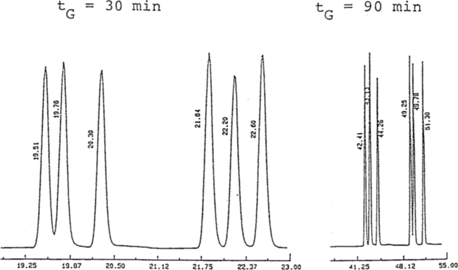
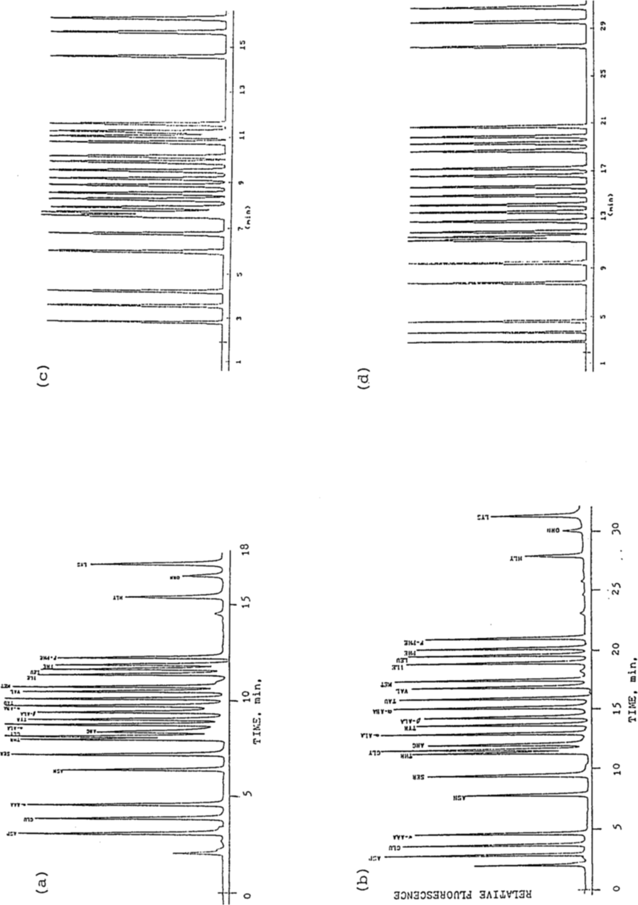
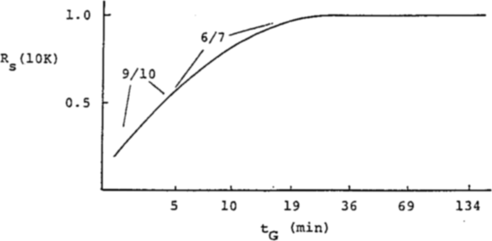
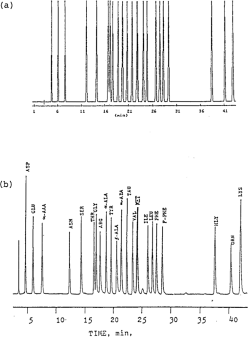
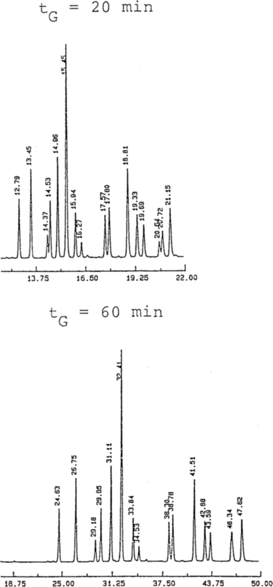
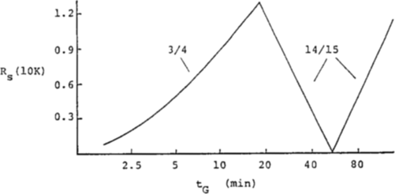
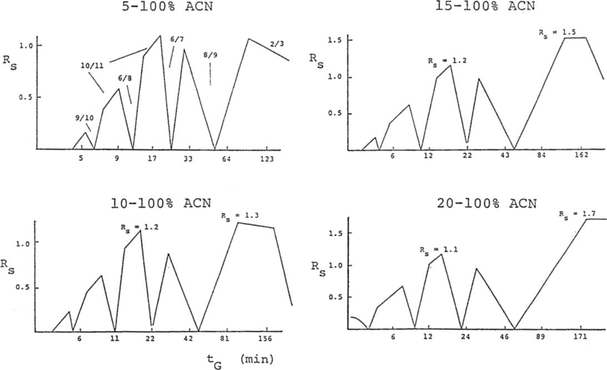

<!--
Dolan JW, Snyder LR, Quarry MA. Computer Simulation as a Means of Developing an
Optimized Reversed-Phase Gradient-Elution Separation. Chromatographia 24 (1987) 261-276.
doi:10.1007/BF02688488 の全訳密度日本語版。
-->

> **補足（本サイトでの位置づけ）:** 本論文は生薬研究ではなく、**逆相 HPLC のグラジエント溶出を「2本の予備実験＋計算機シミュレーション」で最適化する DryLab 法の起源論文（1987年）** である。当サイトが扱う漢方・生薬 QC 論文の多くは、多成分をグラジエント溶出で分離する HPLC/UPLC 指紋分析やメソッド開発を土台にしており、その分離条件（グラジエント時間・組成・温度）をどう合理的に決めるかは共通課題である。本論文が確立した「log k' = log kw − Sφ という保持モデルと、勾配の異なる2ランから各溶質の kw・S を求め、以後の分離をコンピュータで予測する」という枠組みは、当サイトで既に扱った「in silico HPLC の機械学習保持予測」「実験計画法・望ましさ関数」「クロマトグラフィー応答関数（CRF）」といった現代のメソッド開発自動化の直接の源流である。実際、当サイトで扱った複数の生薬論文（イマチニブ不純物・ダビガトラン等の例を挙げた JPBA 2018 総説など）が DryLab モデリングを用いており、本論文はその原理を理解する基礎文献。40年近く前の論文だが、生薬分離法の合理的設計の考え方はここに始まる。

---

# 書誌情報

- **原題:** Computer Simulation as a Means of Developing an Optimized Reversed-Phase Gradient-Elution Separation
- **和題（本稿）:** 逆相グラジエント溶出分離の最適化開発の手段としてのコンピュータシミュレーション
- **著者:** J. W. Dolan, L. R. Snyder（責任著者）（LC Resources Inc., Lafayette, CA, 米国）／M. A. Quarry（E. I. Du Pont de Nemours & Co. 医療製品部, Wilmington, DE, 米国）
- **掲載誌:** Chromatographia, Vol. 24 (1987) 261–276
- **DOI:** 10.1007/BF02688488
- **© 1987 Friedr. Vieweg & Sohn Verlagsgesellschaft mbH**
- **キーワード:** グラジエント溶出／逆相／メソッド開発／コンピュータシミュレーション／保持予測
- **雑誌インパクトファクター:** 1.3（Chromatographia・JCR2024。ただし本論文は1987年の古典的原著であり、当時のIF概念とは無関係。現在のジャーナルIFを参考値として記載）

> **歴史的意義:** 本論文は、Lloyd Snyder らが開発した **DryLab**（後に商用ソフトとして広く普及したクロマトグラフィー・メソッド開発支援ソフト）の起源となった論文の一つである。「2本の予備ランから保持を予測して最適化する」という DryLab の中核思想がここに定式化されている。

---

# 要旨（Summary）

逆相グラジエント溶出分離のシミュレーションのためのパソコンプログラム（**DryLab G**）を記述する。最初に2本の実験グラジエントランを行った後、このプログラムはユーザーが **グラジエント条件（グラジエント時間、移動相中の初期・最終有機溶媒%、グラジエント形状）、カラム寸法、流速、粒子径** を変えて最終分離を開発することを可能にする。このアプローチは、等溶媒分離について最近報告された「**溶媒強度セレクティビティ（solvent-strength selectivity）**」[28]を活用する。この手順を用いたメソッド開発は、はるかに少ない労力でより良い分離をもたらしうる。その検証と応用の例を提示する。

---

# 序論（Introduction）

グラジエント溶出は多くの試料の HPLC 分析に有用である。広い保持範囲をもつ混合物は等溶媒分離では効果的に扱えないが、グラジエント溶出はそうした場合に限られない。保持範囲が限られた試料は等溶媒条件で溶出できることもあるが、それでもグラジエント溶出でより良く分離される。過去には様々な理由でグラジエント溶出法の採用に消極的な研究者が多かったが、この状況は変わりつつあり、将来はほとんどの実験室でルーチンに用いられると期待される。

グラジエント溶出法の開発・最適化に必要な一般原理は既によく知られている[1–4]。しかし、実際にグラジエント溶出の潜在能力が十分に発揮されることは疑わしい。この技術は本質的に複雑で、多くの分離変数が関与する。結果として、分離条件の変更がしばしば驚くべき結果と追加実験の必要をもたらす。グラジエント溶出を要する試料は多数の成分を含むことが多く、これも体系的なメソッド開発の困難を増す。最後に、グラジエント溶出の効果的使用は、グラジエント条件の変更から生じうる **バンド間隔（α の変化）** の変化を活用すべきである[4–8]。

分離条件の関数としてのグラジエント溶出保持の厳密な数学的記述は以前から利用可能で[2–4]、グラジエント溶出のバンド幅も様々な HPLC 法（逆相・イオン交換など）で予測できる[2–4, 9–11]。原理的には、グラジエント時間・初期/最終移動相組成・流速・カラム寸法などの変数の関数として、与えられた分離で得られる分離度を予測できる。ただし、与えられた HPLC 系では、試料中の各溶質について、移動相組成に対する等溶媒保持の依存をまず測定する必要がある。

後者のアプローチは、条件を変えた各シミュレーションランの計算にコンピュータの使用を前提とする。この種の例がいくつか報告されている[12–15]が、これらは特定問題へのコンピュータシミュレーションの適用に留まり、グラジエント溶出法を開発する主要道具としてコンピュータシミュレーションを中心に据えた包括的戦略の開発努力はなされていない。また、従来のグラジエント溶出における分離予測は、メソッド開発に必要な精度を欠くことが多かった。

商用ソフト（**DryLab G**）が最近、グラジエントモードの逆相 HPLC で実験条件の関数として分離を予測するために利用可能になった。本稿では、最終グラジエント溶出法の開発・最適化にこのアプローチがもつ潜在能力を示す予備的例と、多成分を含む未知試料の場合にコンピュータシミュレーション中に生じうる問題を探る。

---

# 理論（Theory）

等溶媒・グラジエント溶出の両方で分離度は次式で与えられる：

$$
R_s = \frac{2(t_2 - t_1)}{W_1 + W_2} \tag{1}
$$

t1・t2＝隣接バンド1・2の保持時間 tg（秒）、W1・W2＝それらのベースラインバンド幅（秒）。分離度予測には試料の各バンドの tg と W が必要。

## 保持時間 tg の予測

グラジエント溶出の保持時間は式(2)で与えられる：

$$
\int_0^{t_g} \frac{F\,dt}{V_m(1 + k')} = 1 \tag{2}
$$

F＝移動相流速、Vm＝カラム死体積（=F·t0）、k'＝グラジエント中の時間 t における溶質の容量因子。複数セグメントからなる複雑なグラジエントでは、各セグメントに式(2)の別形を適用して結果を結合する。

容量因子 k' と移動相組成の間に明示的関係を仮定すると手順は大幅に簡略化される。多数の研究[16, 17]により、逆相 HPLC の k' は移動相中の有機溶媒の体積分率 φ に近似的に関係することが確認されている：

$$
\log k' = \log k_w - S\varphi \tag{3}
$$

S＝与えられた溶質の定数、kw＝φ=0（純水）での k' の値。この関係を一次近似として仮定するが、予測 tg は log k' vs φ プロットの小さな曲率について補正できる[18]。

### kw と S の推定

従来、グラジエント溶出の tg 予測に式(1)を使う試みは、通常 k' vs φ を等溶媒測定から実験的に決定したと仮定した。しかしこれは実験的に不便である（グラジエント溶出を要する試料は等溶媒溶出で研究しにくいため）。より良いアプローチは、**2本の初期グラジエントランを行い、これらから kw と S を求める**[19]ことである。

溶質の pre-elution・post-elution が無視できるとき、kw と S は2つの連立方程式の数値解から得られる[19]：

$$
(t_g)_i = \frac{t_0}{b_i}\log(2.3 k_0 b_i + 1) + t_0 + t_D \tag{4a}
$$
$$
(t_g)_j = \frac{t_0}{b_j}\log(2.3 k_0 b_j + 1) + t_0 + t_D \tag{4b}
$$

(tg)i・(tg)j＝勾配の異なる（b=bi・bj）2ラン i・j で得た所与溶質の実験保持時間、tD＝HPLC グラジエント装置の遅延時間（dwell-time、グラジエントがミキサーからカラム入口へ移動する時間）。**グラジエント勾配パラメータ b** は：

$$
b = \frac{V_m \Delta\varphi\, S}{t_G F} \tag{5}
$$

Δφ＝グラジエント中の φ の変化、tG＝グラジエント時間。k0＝グラジエント開始時の k' の元値：

$$
\log k_0 = \log k_w - S\varphi_0 \tag{6}
$$

φ0＝グラジエント開始時の φ 値。dwell time tD が大きく k0 が小さいと初期ランが試料の pre-elution の影響を受け、手順は複雑になる。本研究では、式(4a, b)から得た S 値が pre-elution に比較的鈍感である事実に基づく反復解でこれを扱い、この手順を DryLab G ソフトに組み込んだ。

## バンド幅 W の予測

グラジエント溶出のバンド幅は[4]：

$$
W = t_0(1 + k_f)\frac{J\,G}{N^{1/2}} \tag{7}
$$

kf＝バンドがカラムを離れる時の k' 値、N＝カラム段数、G＝グラジエント「圧縮係数」、J＝グラジエントが急峻な時のバンドの異常な広がりを補正する係数[9]。J の実験値に G の計算値を掛けると、b の全範囲で積 JG ≈ 1.1 ± 0.1〔式(8)〕となり、式(7)は近似的に：

$$
W = \frac{1.1\, t_0(1 + k_f)}{N^{1/2}} \tag{9}
$$

グラジエント溶出中にバンドがカラムを離れる時の k' は[2]：

$$
k_f = \frac{1}{2.3 b + (1/k_0)} \tag{10}
$$

**グラジエント溶出の N 値** は「対応する（corresponding）」等溶媒系で測定した段数（グラジエント溶出の有効 k'＝バンドがカラム中点にある時の k' が、同じカラム・類似条件の等溶媒 k' に等しい）。条件が指定され各溶質の分子量が推定できれば N を予測できる[4, 22, 23]。

## グラジエント溶出における分離度の制御

グラジエント溶出の分離度は、等溶媒分離の分離度制御と同じ因子——容量因子 k'、段数 N、分離係数 α——の関数で表せる：

$$
R_s = \frac{1}{4}(\alpha - 1)N^{1/2}\left[\frac{k}{1+k}\right] \tag{11}
$$

従来の議論[1, 2, 4, 24, 25]は段数 N と有効容量因子 k の重要性を強調した。N と k に影響するグラジエント条件の系統的変更でグラジエント分離のピーク容量を増やし全体分離度を最大化できる。

**著者らは、バンド間隔（α の値）の変化も同等に重要** と考える。等溶媒溶出で α を制御する全分離変数（有機溶媒・pH・温度・固定相の変更など）はグラジエント溶出でも同様に使える[14, 15, 26]。メソッド開発の初期段階では、α の変化は k を変えるようグラジエント条件を変えることで便利に達成できる[5, 8]：

$$
k = \frac{1}{1.15\, b} \tag{12}
$$

対応するバンド間隔の変化は、k' や φ を変える等溶媒溶出でも観察される[27, 28, 29]。流速やグラジエント時間を変えることでグラジエント溶出のバンド間隔を系統的に変えられ、φ の変更や複雑なグラジエント（勾配の異なる直線セグメント）でも同様のバンド間隔変化が生じる。これがグラジエント溶出のバンド間隔をかなり制御する基盤となる。

> **訳者補足（この論文の核心アイデア）:** 従来は「各成分の k' を移動相組成ごとに何点も等溶媒で実測」する必要があり手間だった。本論文の革新は、**グラジエント時間だけ変えた2本のラン**（例：20分と80分）を行い、式(4a)(4b)を各溶質について連立で解いて kw・S を逆算する点にある。これができれば、以後どんなグラジエント条件でも各成分の保持時間・バンド幅・分離度を式(1)〜(12)で計算予測でき、実機を回さずにパソコン上で最適条件を探せる。まさに「乾いた（dry）実験室」＝DryLab の名の由来である。

---

# 実験（Experimental）

HPLC 系は DuPont 8800 液体クロマトグラフ（Model 860 固定波長254 nm 検出器・カラムオーブン付き）。手順・溶媒は[20]に記載。試料：多環芳香族炭化水素（PAH）混合物（Supelco 社）、除草剤混合物（DuPont 農薬部、一部は組成非開示の専有品）[29]。全シミュレーションは IBM XT パソコンで DryLab G ソフト（LC Resources 社）を用いて実施。

---

# 結果と考察（Results and Discussion）

グラジエント溶出分離のコンピュータシミュレーションのやや複雑な方式の適用には、まず全体手順の検証が必要。次に最適化グラジエント溶出法の開発のためのシミュレーションに基づく体系的アプローチを設計する（従来の試行錯誤とは異なる）。次にシミュレーションで生じうる問題とその対策を検討し、最後に実試料への適用で実用的価値を示す。本稿はこれら各領域を扱う。

## グラジエント溶出の保持予測の精度

従来[2–4, 30, 31]は、対応する等溶媒ランから得た kw・S の関数としてのグラジエント保持 tg 予測の精度を報告した。本稿では、**初期グラジエントランから導いた kw・S から予測した tg の精度** に関心がある。これらは主に分離度予測（式1）に使われるため、個別 tg 値の精度より **相対保持（t2−t1）の精度** の方が重要。DryLab G は pre-elution 効果も補正するよう設計されている。検証データは文献または著者らの実測から得た。

### フタル酸エステル試料

5種の C1–C5 ジアルキルフタル酸エステルのグラジエント保持データ[31]を用いた。異なる tG（20分・80分）の2ランを DryLab G への入力とし（最大精度のため2つの tG は3倍以上異なるべき[19]）、他のグラジエント時間についてシミュレーション（原著 Table I）。ほぼ理想的条件（全バンドがグラジエント中に溶出、pre-elution の寄与が無視できる）での検証。**内挿条件（20 < tG < 80分、Table I の tG=40分）では保持時間・分離度とも約 ±1%（1SD）で予測**。他の tG（5, 10, 160, 320分）では保持時間 平均誤差 ±6%（1SD）、分離度 ±5%。メソッド開発でシミュレーションを実機ランの代わりに使うのに十分な精度。

同じ実験グラジエントデータから予測した対応等溶媒値[19]よりも、Table I の一致は優れる。すなわち、実験グラジエントデータは、φ の関数としての等溶媒保持予測より、グラジエント溶出の tg 予測に適する。最高精度が必要なら、シミュレーションで想定する技術に合わせた実験ラン（等溶媒/等溶媒、グラジエント/グラジエント）を使うべき。

### 原著 Table I：ジアルキルフタル酸エステル5成分のグラジエント分離（実測 vs DryLab G シミュレーション、抜粋）

25 cm Zorbax ODS カラム、10–100% アセトニトリル/水グラジエント、35℃、dwell 体積 5.5 mL、tG=20・80分を入力。

| 溶質 | tG=40分 実測 tg | 計算 tg | tG=320分 実測 tg | 計算 tg |
|---|---|---|---|---|
| C1 | 16.20 | 16.41 | 43.8 | 39.7 |
| C2 | 21.72 | 21.94 | 79.8 | 72.7 |
| C3 | 24.45 | 24.65 | 102.1 | 94.5 |
| C4 | 31.76 | 31.92 | 153.5 | 144.3 |
| C5 | 35.80 | 35.86 | 183.6 | 177.5 |
| 平均誤差(1SD) tg | −3±3% | | 0±3% | |
| 平均誤差(1SD) (t2−t1) | −7±3% | | +0±8% | |

（tG=40分＝内挿で最高精度。外挿の320分では誤差が増す。）

### ステロイド試料

6成分ステロイド試料でグラジエント時間・範囲を変えて分離（原著 Fig. 1：5–100% メタノール/水、tG=30・90分）。溶出順（バンド1–6）：プレドニゾン・コルチゾン・ヒドロコルチゾン・デキサメタゾン・コルチコステロン・コルテキソロン。

初期・最終 φ も変え、溶質の substantial pre-elution が起きる場合の検証（原著 Table II）。**保持時間 tg は平均誤差 ±3%（1SD）、分離度（t2−t1）は ±7%（1SD）** で予測——メソッド開発に十分。

一般に、シミュレーション入力に使う実験ランは **より大きな tG（k）** を使うのが有利。Table II の15分・45分ランを入力に使うと、予測分離度の誤差は ±11%（1SD）と有意に大きくなる（Table II の50%増）。tg 自体の誤差は ±2% と小さいが、これは誤解を招く——分離度予測の精度を決めるのは (t2−t1) の精度だからである。

## コンピュータシミュレーションに基づくグラジエント溶出 HPLC の体系的メソッド開発

コンピュータシミュレーションは実機ランの数%の時間しか要さないため、はるかに多くの可能性を探れる。DryLab G プログラムの経験から進化した体系的手順を原著 Table III に示す。

### 原著 Table III：DryLab G を用いたグラジエント溶出 HPLC メソッド開発の推奨手順（6ステップ）

1. **2本の実験ランを実施**（5–100% 有機/水グラジエント、tG=30・90分*）→ 条件変化の関数として分離を予測するための保持データを入力。
2. **相対分離マップ（RRM）を tG の関数として要求** → 現行 HPLC 系での試料分離の実現可能性**を判定、最適 tG（予備）を決定。
3. **分離度を初期実験ランの1つに合わせる（任意）** → 元のカラム・流速でのシミュレーションの正確な分離度値を得る。
4. **最適グラジエント範囲を決定** → 分析時間を最小化。
5. **バンド間隔・分離度を微調整**（(a) グラジエント初期%有機を変える、(b) セグメント〔非線形〕グラジエントを使う）→ 分離度と分析時間で最終グラジエントを最適化。
6. **カラム条件を変える**（最適バンド間隔を保ちつつ段数 N を最適化）→ 十分な分離度・許容圧力・最小分析時間で最終メソッドを確定。

（*tG 値の選択は任意。2値は3〜4倍異なるべき。大きな N のカラム〔例：25 cm, 5 µm〕が好ましく、流速は 1–2 mL/min。**RRM である tG で Rs>1 を示すことが最終グラジエント法の成功に必要。）

### 原著 Table IV：重なった2バンドの谷からの分離度の推定（ガウスバンド）

谷の深さ（小さいバンドの高さに対するベースラインからの谷の高さの割合）とバンドサイズ比から Rs を推定。

| 谷* | 1/1 | 2/1 | 4/1 | 8/1 | 16/1 |
|---|---|---|---|---|---|
| 5% | 1.35 | 1.42 | 1.48 | 1.52 | – |
| 10% | 1.22 | 1.29 | 1.35 | 1.41 | 1.47 |
| 20% | 1.07 | 1.15 | 1.21 | 1.27 | 1.33 |
| 30% | 0.97 | 1.06 | 1.12 | 1.19 | 1.24 |
| 50% | 0.83 | 0.92 | 1.00 | 1.07 | 1.12 |
| 80% | 0.68 | 0.78 | 0.86 | 0.93 | 0.99 |

## 応用例1：OPA-アミノ酸混合物（22成分）

Eslami ら[32]の o-フタルアルデヒド（OPA）アミノ酸22成分の逆相 HPLC 分離データ（17–55% アセトニトリル/水直線グラジエント、異なる tG・5種のカラム長の32ラン）を DryLab G で評価。Table III の6ステップに従う：

- **Step 1:** tG=15分・35分の2グラジエント（原著 Fig. 2a, b）。各クロマトグラムに22の明瞭なバンド（未分離対なし）。2ラン目のバンドは1ラン目のバンド順に対応させて番号付け（バンド逆転があっても同一化合物を同番号に）。この例では逆転なし。

- **Step 2:** 保持データを入力し **相対分離マップ（RRM）** を要求（Fig. 3）。RRM は10,000段カラム仮定で最悪分離バンド対の分離度を tG に対してプロット。最適 tG を素早く判断できる。最悪対は tG<5分でバンド#9/10、tG>5分で#6/7。この試料の最大分離度は約 Rs=1（10,000段）で、かなり難しい分離。tG を変えてもバンド逆転なし（=セレクティビティ変化が小さい、やや異例）。

- **Step 3:** バンド#6/7 の分離度（Fig. 2a の谷から約0.94）。段数 N（この例で11,600）を DryLab G が保持時間・分離度から推定し、全分離度計算を実カラムの N に自動調整。RRM から tG=25–30分で分離度最大 → 最短の tG=27.5分を選定。
- **Step 4:** グラジエント範囲を調整。コンピュータは約最適範囲（15–59% アセトニトリル/水）を推奨したが、他範囲の実験データがないため元の範囲（17–55%）を維持。
- **Step 5:** セレクティビティ変化が小さいため φ・グラジエント形状の変更は有用でないと確認。
- **Step 6:** カラム条件を変える。より長い25 cm カラムを試行。カラム寸法・流速を変えると有効勾配 b も変わる（式5）ため、DryLab G は b と相対保持を一定に保つよう tG を自動調整（25/15 の比で tG を増やし、最終46分）。シミュレーション（Fig. 4a）でバンド#6/7 が最悪で予測 Rs=1.36、実機（Fig. 4b）で Rs=1.5——異なるカラム（15 cm でシミュレーション生成）を考えれば妥当な一致。

シミュレーション vs 実機の保持時間誤差 −2±1%（1SD）、(t2−t1) 誤差 3±9%（1SD）。25 cm カラムの実験データ（14・46分グラジエント）を入力に使うと、他のグラジエント時間の tg 予測誤差は tG=8分で2±4%、10分で2±2%、18–34分で−1±1% と、DryLab G シミュレーションの精度が確認された。

## 応用例2：多環芳香族炭化水素（PAH）混合物（16成分）

16の優先汚染物質 PAH の逆相グラジエント分析。従来は試行錯誤で開発され、最良分離は最終バンド溶出まで17分・最悪対 Rs=0.94、開発に最低6ラン・実験室で3〜5日を要した。DryLab G は各試行を実機の2〜5%の時間で行えるため、オペレーター技量への依存を減らす。

溶出順（バンド1–16）：ナフタレン・アセナフチレン・アセナフテン・フルオレン・フェナントレン・アントラセン・フルオランテン・ピレン・ベンズ(a)アントラセン・クリセン・ベンゾ(b)フルオランテン・ベンゾ(k)フルオランテン・ベンゾ(a)ピレン・ジベンズ(a,h)アントラセン・ベンゾ(g,h,i)ペリレン・インデノ(1,2,3-cd)ピレン。

- **Step 1・2:** 2グラジエント（原著 Fig. 5）。20分ランで16バンド、60分ランで15バンド（#14/15 が60分ランで融合）。保持データを入力し RRM（Fig. 6）を作成。

（以降、RRM に基づく最適 tG 選定とカラム条件最適化により、従来の試行錯誤より短時間で同等以上の分離を達成することが示される。下図はグラジエント開始・終了%アセトニトリルの範囲を4通り〔5–100%・10–100%・15–100%・20–100%〕に変えた場合のRRM比較で、グラジエント範囲の選択が最終分離度に与える影響を示す。）

---

# 結論（要点）

- **2本の予備グラジエントラン**（勾配を3〜4倍変える）から各溶質の kw・S を求め、以後の分離をグラジエント時間・範囲・形状・カラム寸法・流速・粒子径の関数としてコンピュータで予測できる。
- 予測精度は内挿で保持時間・分離度とも約 ±1%、外挿でも保持時間 ±3〜6%・分離度 ±5〜7% と、実機ランの代替としてメソッド開発に十分。
- **相対分離マップ（RRM）** で最適グラジエント時間を素早く把握し、6ステップの体系的手順（Table III）で分離度・分析時間・カラム条件を順に最適化する。
- グラジエント条件を変えるとバンド間隔（α）が系統的に変わる「溶媒強度セレクティビティ」を活用でき、従来3〜5日を要したメソッド開発をシミュレーションで大幅に短縮できる。

---

# 主要記号

- **k'**＝容量因子、**kw**＝φ=0（純水）での k'、**S**＝溶媒強度パラメータ（log k' = log kw − Sφ）
- **φ**＝移動相中有機溶媒の体積分率、**Δφ**＝グラジエント中の φ 変化、**φ0**＝グラジエント開始時 φ
- **tg**＝グラジエント保持時間、**t0**＝カラム死時間、**tD**＝装置 dwell time、**tG**＝グラジエント時間
- **b**＝グラジエント勾配パラメータ（=Vm·Δφ·S/(tG·F)）、**k**＝有効容量因子（=1/1.15b）、**kf**＝溶出時 k'、**k0**＝グラジエント開始時 k'
- **N**＝段数、**α**＝分離係数、**Rs**＝分離度、**G**＝グラジエント圧縮係数、**J**＝バンド広がり補正係数（JG≈1.1）
- **RRM**＝相対分離マップ（relative-resolution map）

---

# 参考文献（抜粋）

- [3] Snyder LR, Kirkland JJ. Introduction to Modern Liquid Chromatography（グラジエント溶出理論の基礎）。
- [4] グラジエント溶出のバンド幅・分離度予測。
- [19] 2グラジエントランからの kw・S 決定法。
- [27, 28] 溶媒強度セレクティビティ（等溶媒でのバンド間隔制御）。
- [31] ジアルキルフタル酸エステルのグラジエント保持データ（Table I の元データ）。
- [32] Eslami et al. OPA アミノ酸22成分の逆相 HPLC 分離データ。

（全31文献。詳細は原著参照。DryLab G＝LC Resources Inc., Lafayette, CA。）
