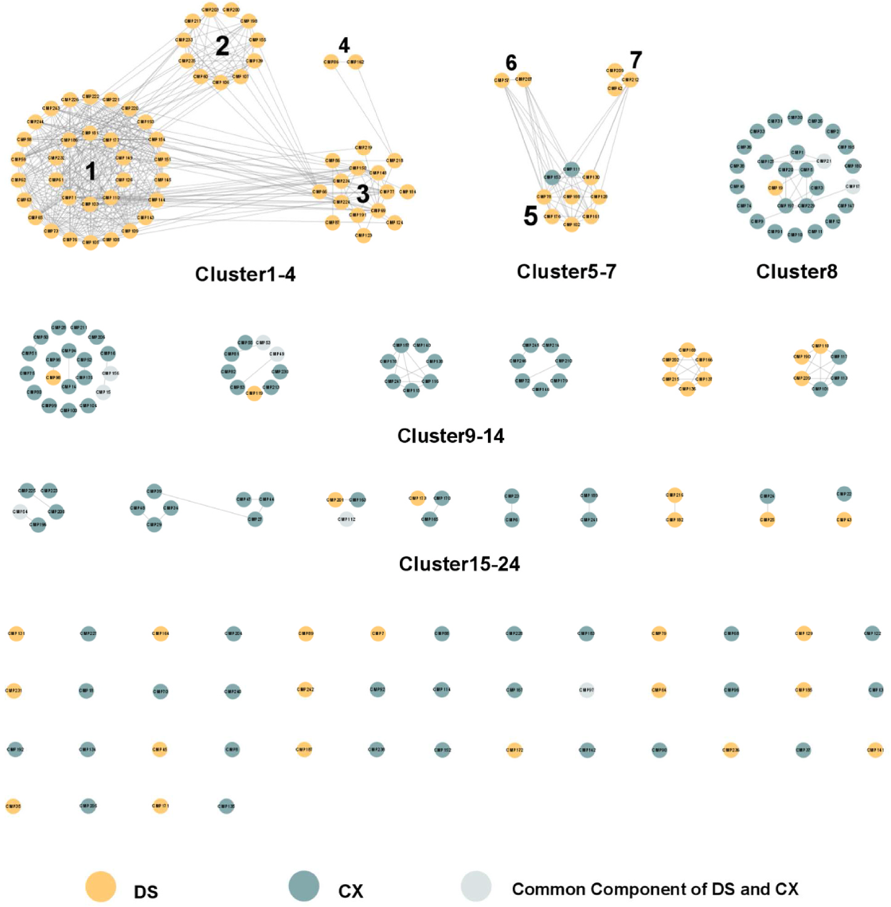
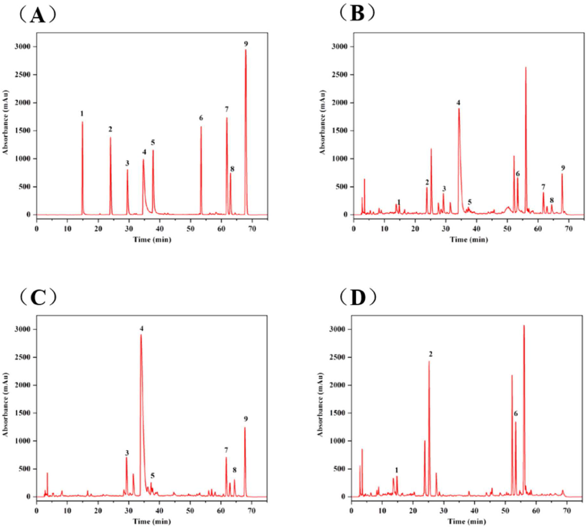

## 書誌情報

- 標題（原題）: A network pharmacology-based study on the quality control markers of antithrombotic herbs: Using Salvia miltiorrhiza - Ligusticum chuanxiong as an example
- 著者: Dai-Yan Zhang（張黛燕）・Ruo-Qian Peng（彭若倩）※共同筆頭著者・Xu Wang（王旭）・Hua-Li Zuo（左華麗）・Li-Yang Lyu（呂麗陽）・Feng-Qing Yang（楊豊庆）※責任著者・Yuan-Jia Hu（胡元佳）※責任著者
- 所属: マカオ大学 中医薬品質研究国家重点実験室／中華医薬研究所（a）、マカオ大学 健康科学部 薬理学科（b）、香港中文大学（深圳）生命健康科学学院（c）、同 Warshel計算生物学研究所（d）、重慶大学 化学化工学院（e）
- 掲載誌・巻号・DOI: Journal of Ethnopharmacology 292 (2022) 115197、DOI: 10.1016/j.jep.2022.115197
- インパクトファクター: **5.4**（*Journal of Ethnopharmacology*, JCR 2024 / Clarivate）
- 受理経過: 受領 2022-01-16 / 改訂 2022-02-20 / 採録 2022-03-11 / オンライン公開 2022-03-21
- ライセンス: オープンアクセス（CC BY-NC-ND 4.0）
- 助成: マカオ大学（grant number MYRG2019-00011-ICMS）

## 要旨（Abstract）

**民族薬理学的背景**: 丹参（Salvia miltiorrhiza Bunge の乾燥根・根茎、Danshen、DS）と川芎（Ligusticum striatum DC の乾燥根茎、Chuanxiong、CX）は、血行促進・瘀血除去に有効であり、心血管疾患（CVD）と深く関連する。

**研究目的**: 活性に基づく化学マーカーの同定は非常に重要であるが、伝統中薬（TCM）の「多成分・多標的・多効果」という複雑な機構がこの作業に大きな課題を突きつける。本研究では、複雑な全体システムと単一成分の間にある中間層「モジュール／クラスター」を明確化することで、抗血栓生薬の品質管理（QC）マーカーを発見する有効な方法を探るため、ネットワーク薬理学的予測とDS・CXの実験的検証を組み合わせた。

**材料と方法**: 化合物の構造類似性解析と既発表の血栓症ネットワークに基づき、まず化合物クラスター(CC)網と機能モジュール(FM)網という2つの層をそれぞれモジュール化し、これらを結合して1つの二層モジュール化化合物-標的（bilayer modularized compound target; BMCT）網とした。「2段階」計算をCCから潜在的QCマーカーとなり得る重要化合物の同定に適用した。選定したQCマーカー化合物のトロンビンに対するin vitro阻害活性を評価し、その薬理活性を部分的に検証した。HPLCにより含量を定量した。

**結果**: ネットワークに基づく解析の結果、BMCT網において重要性の高い9化合物——タンシノンI、タンシノンIIA、クリプトタンシノン、サルビアノール酸B、フェルラ酸、サルビアノール酸A、ロズマリン酸、クロロゲン酸、コニフェリルフェルラート——がDS-CXのQCマーカーとして同定された。酵素阻害試験によりタンシノンIとタンシノンIIAの活性が部分的に検証された。化学プロファイリングにより、これら9マーカー化合物が当該生薬対の主要成分であることが示された。

**結論**: 本研究はDS-CX生薬対の活性に基づくQCマーカーを同定し、他の生薬・生薬対・方剤のQCにも応用可能な新しい方法論を提供した。

**PubChemキーワード**: tanshinone I (PubChem CID: 114917)、tanshinone IIA (PubChem CID: 164676)、cryptotanshinone (PubChem CID: 160254)、salvianolic acid B (PubChem CID: 11629084)、ferulic acid (PubChem CID: 445858)、salvianolic acid A (PubChem CID: 5281793)、rosmarinic acid (PubChem CID: 5281792)、chlorogenic acid (PubChem CID: 1794427)、coniferyl ferulate (PubChem CID: 6441913)

**キーワード**: Salvia miltiorrhiza；Ligusticum chuanxiong；ネットワーク薬理学（network pharmacology）；二層ネットワーク（bilayer network）；品質管理マーカー（quality control markers）

**略語**: BBB, 血液脳関門; CC, 化合物クラスター (compound cluster); CVD, 心血管疾患; BMCT network, 二層モジュール化化合物-標的ネットワーク; CX, 川芎; DS, 丹参; FM, 機能モジュール; HIA, ヒト腸管吸収; PBS, リン酸緩衝生理食塩水; QC, 品質管理; TCM, 伝統中薬; THR, トロンビン。

## 1. 序論（Introduction）

伝統中薬（TCM）の品質管理（QC）には、安全性・有効性を担保するための厳格かつ明確な規則が求められる（Wu et al., 2018）。活性に基づく化学マーカーの同定は非常に重要であるが、TCMにおける「多成分・多標的・多効果」という複雑な機構がこの作業に大きな課題を突きつける（Zhang et al., 2016）。具体的には、QCマーカーの発見・同定は主に系統的な化学分離に依存し、その後に多数の薬理活性アッセイの開発とバイオアッセイ誘導型の化学分離が続く（Zhang, X. et al., 2017）。しかし、成分の多様性、分離・スクリーニング工程の難しさ、機構の複雑さゆえに、有効成分の同定はTCM研究における長年のボトルネックであり続けている（Yu et al., 2010）。TCMの複雑な性質と、煩雑で負担の大きい実験の必要性は、QC指標を見出す新たな手法の登場を求めている。

TCMのQCマーカーが直面するこのジレンマに対し、全体系と単一成分の間にある中間層「モジュール／クラスター」を明確化することが問題解決の助けになると考えられる。「モジュール／クラスター」とは全体の下位集団であるが、類似した性質を持つ化合物や標的を統合したものである。TCMでは、この「モジュール／クラスター」によりTCMの全体論的な性格を反映しようとするいくつかの概念——「軍団（army group）」効果（Shaoqing et al., 2015）、生物活性等価な組み合わせ成分（bioactive equivalent combinatorial components）（Liu et al., 2014）、「缶（Canister）」理論（Meng et al., 2000）——が提唱されてきた。TCMのQCに対応させると、疾病モジュールに寄与する化合物のクラスターを同定することは、活性に基づく化合物の探索とQCマーカーの範囲の絞り込みに大きな助けとなり得る。しかし、「モジュール／クラスター」概念を含む複雑なTCM生物学的データは、データ解析・統合にとって課題である。ネットワーク薬理学はこの状況に対応する有効なツールであり、特殊な可視化解析能力と多次元データ統合能力を通じて、漢方薬の品質管理マーカーを探索する新しいアプローチを提供する。

最小の構成単位として、生薬対（herbal pair）は方剤の薬効を反映しつつ、構成の単純さが研究を容易にする（Wang et al., 2012）。本研究では、上記の手法を、抗血栓作用が明確で汎用性が高いにもかかわらず既存のQCマーカーに改善の余地がある生薬対、丹参（Salvia miltiorrhiza Bunge の乾燥根・根茎、Danshen、DS）と川芎（Ligusticum striatum DC の乾燥根茎、Chuanxiong、CX）を例として検討した。DSとCXは血行促進・瘀血除去により、心血管疾患（CVD）関連疾患の治療に広く用いられている（Chen et al., 2018b; Cheng, 2007）。両者は、中華中医薬学会が2019年に発表した中成薬ベストセラー製品に関する公式報告によれば、ベストセラー漢方処方の中で最も頻用される生薬対を構成する（Geng et al., 2020）。DS・CXはいずれも米国・日本・オーストラリア・韓国・オランダなどでも広く利用されている（Chen et al., 2018b; Cheng, 2006, 2007; McEwen, 2015）。しかし、既存の品質マーカーはその複雑な性質を完全には反映していない可能性がある。中国薬局方（2020年版）では、DSのQC規格はタンシノンIIA・クリプトタンシノン・タンシノンIの合計含量（HPLCによる測定）が0.25%以上であること、およびサルビアノール酸Bの含量が3.0%以上であることとされ、CXのQC規格はフェルラ酸の含量が0.10%以上であることとされている。一方、DS-CXは多くの漢方処方に用いられる。中国薬局方の記載によれば、サルビアノール酸Bは京制冠心口服液／顆粒、楽脈丸／片／膠嚢、保心片のQCマーカーとして、サルビアノール酸Bとタンシノン IIAは京制冠心片／軟膠嚢のQCマーカーとして、丹参素は심寧片のQCマーカーとして、それぞれ使用されている。生薬とその関連製品のQCマーカーとして用いられている化学成分はごくわずかである。QCマーカーの不備、CVDに対する著しい有効性、臨床応用の広さから、DS-CXはネットワーク薬理学に基づく手法をQCマーカーへ応用する研究対象として好適である。

このような背景のもと、本研究はネットワーク薬理学的手法と実験を組み合わせることで、DS-CX生薬対の潜在的QCマーカーを探索することを目的とする。化合物の構造類似性解析と既発表の血栓症ネットワーク（Kong et al., 2015）に基づき、まず血栓症の化合物クラスター(CC)網と機能モジュール(FM)網という2つの層をそれぞれモジュール化し、これらを結合して1つの二層モジュール化化合物-標的（BMCT）網とした。化学物質-標的の相互作用とモジュール／クラスター分割を組み合わせ、異なるCCとFMの累積スコアを計算して、どのCCが特定の機能を担うかを比較した。有意なスコアを持つCCに絞り込み、特定の化学物質をさらに同定した。選定したQCマーカーのトロンビンに対するin vitro阻害活性を評価し、その薬理活性を部分的に検証した。研究のフレームワークを図1に示す。

## 2. 材料と方法（Materials and Methods）

### 2.1. データマイニングと処理

#### 2.1.1. 化合物の収集と処理

DSとCXの化合物情報は、文献および3つの化学データベース——Traditional Chinese Medicine System Pharmacology Database (TCMSP) (Ru et al., 2014)（http://tcmspw.com/tcmsp.php）、Traditional Chinese Medicines Integrated Database (Huang et al., 2018) (TCMID)（http://www.megabionet.org/tcmid/）、中国科学院上海有機化学研究所化学データベース（http://www.organchem.csdb.cn）——から収集した。トレオニンや果糖などの一般的なアミノ酸・単糖類は本研究から除外した。PubChem (Kim et al., 2019)（http://pubchem.ncbi.nlm.nih.gov）を用いて化合物を標準化し、PubChem CIDや標準化簡略化分子入力線形表記法（canonical SMILES）情報などの関連化学データを補完した。さらに、初期スクリーニングのため、ヒト腸管吸収（HIA）と血液脳関門（BBB）透過性の情報をadmetSAR (Yang et al., 2019)（http://lmmd.ecust.edu.cn/admetsar2）から収集した。HIAまたはBBBが陰性の化合物は除外した。ただし、文献と併せて検討したところ、顕著な薬理活性を持つ一部の化合物が除外されていたこと、また予測プラットフォームの偽陰性の可能性を考慮し、これらの化合物を研究対象に再び含めた。

#### 2.1.2. 標的の収集と処理

DS・CX生薬対の標的は、TCMSP、PubChem、similarity ensemble analysis (SEA) (Keiser et al., 2007)（http://sea.bkslab.org/）の3つの情報源から取得した。TCMSPについては「related targets」の情報を収集した。PubChemについては、「bioassay results」で「active」と表示された情報を採用した。また、実験的研究の限界を補うため、SEAによる仮想予測を追加データとして利用した。SEAから得られた標的のうち、偽発見率（false discovery rate）<0.05かつmaxTc≥0.57を満たすものをデータセットに採用した。標的の遺伝子名の標準化にはデータベースUniProt (Consortium, 2018)（https://www.uniprot.org/）を用いた。

### 2.2. ネットワーク構築

#### 2.2.1. CC網の構築

本研究では、化合物は構造類似性に基づきCC網を形成した。RStudio上で動作するChemmineR (Yiqun et al., 2008) ツールキットを用い、タニモト係数（Tanimoto coefficient）≥0.6（Delaney, 1996）でのアトムペア指紋（atom pair fingerprint）に基づく化合物類似性検索を化合物間で実施した。化合物類似性の交差行列を得た後、化合物構造類似性ネットワークを構築し、Cytoscape 3.8.0 (Shannon et al., 2003) で可視化した。さらに、トポロジー的パラメータを抽出した。異なる母骨格を持つモジュール化ネットワークを得るため、MCODE 1.6.1プラグイン (Bader and Hogue, 2003) を用いてネットワークを異なるクラスターに分割した。分類結果は各クラスターが同一の母骨格を持つことを確認するため、手作業で検証した。

#### 2.2.2. FM網の構築

抗血栓作用に標的を絞り込むため、本研究ではKong et al. (2015) の血栓症ネットワークを参照し、これを本研究のFM網とした。先行研究では、血栓症ネットワークの標的情報はReactomeデータベースおよび文献に由来し、経路・反応情報は3つの異なるFM——凝固カスケード（clotting cascade、FM1）、フィブリン血栓の溶解（dissolution of fibrin clots、FM2）、血小板活性化・シグナル伝達・凝集（platelet activation, signaling, and aggregation、FM3）——に分けられている。このネットワークにおいて、ノードは血栓形成過程に関与するタンパク質またはタンパク質複合体を表す。一部のタンパク質複合体は複数の遺伝子によりコードされ得る。化合物の標的と対応させるため、血栓症ネットワークのタンパク質／タンパク質複合体をさらなる比較のために単一の標的へ分割した。

#### 2.2.3. BMCT網の構築

BMCT網は、漢方薬化学物質のCC網と血栓症関連のFM網から構成される二層ネットワークである。化合物とその標的、および血栓症ネットワーク内のタンパク質との相互作用を組み合わせることで、2つのモジュール化ネットワークを連結してBMCT網を形成した。

### 2.3. ネットワーク解析

文献および我々の先行研究によれば、漢方薬または生物学的ネットワークは通常、スモールワールドの特徴を持つ非ランダムなスケールフリーネットワークである（Zhang, Q. et al., 2017; Zhang et al., 2019; Zuo et al., 2018）。すなわち、化学ネットワーク中の化合物は同一視すべきではなく、生物学的ネットワーク中の生体分子も同様である。そのため、化合物と標的の重みは、標準化されたネットワークパラメータに基づき設定した。化学層においては、クラスター化されたノードの次数中心性（degree centrality）・媒介中心性（betweenness centrality）・近接中心性（closeness centrality）をまず標準化した。式(1)は、ネットワークパラメータを表すxの標準化値であるx\*を示す。次に3つの標準化データの平均値をw(ci)と定義した。個々のノードは1つのクラスターとみなされ、その重みは「1」とされた。血栓症ネットワークのノードは単一タンパク質またはタンパク質複合体を表し、その重みw(bj)はw(ci)と同じ方法で計算した。

**式(1)**: x\* = log₁₀(x + 1) / log₁₀(xmax + 1)

重み計算の後、化合物と標的、およびCCとFMの間の連結強度を明らかにするアルゴリズムを提案した。以下の2種類の行列を用いて明確に表現した。第一に、化合物と標的の間の重み付き関係の測定を示す（図2）。ここでaij ∈ {0,1}であり、aij = 1は化合物ciが標的bjに関連することを、0は関連がないことを意味する。式(2)は化合物ciと標的bjの間の連結強度dijの算出方法を示す。式(2)においてw(ci)とw(bj)は、式(1)によりさらに標準化され次元の影響を排除している。

**式(2)**: dij = w(ci)・aij + w(bj)・aij

ここでw(ci)は化学ネットワークにおける化合物ciの重みを、w(bj)は生物学的ネットワークにおける標的bjの重みを表す。

さらに、TCMの内在的な質と全体論的性質を反映するため、TCMの化学的・生物学的クラスタリング特性を考慮した。グラフ表現の観点からは、構造類似性を持つ化合物と類似機能を持つ生体分子をそれぞれ統合することで、化学ネットワークと生物学的ネットワークをモジュール／クラスターに基づくネットワークへと縮約できる。行列表現の観点からは、同質な行および列を統合できる。行列Am×nは、図3に概説する通り行列Ep×qへと変換される。式(3)は算出式を示す。

**式(3)**: euv = Σ dij = Σ [w(ci)・aij + w(bj)・aij]（ci∈mu, bj∈m\*v）

ここでeuvはmuとm\*vの間の関連性を測定するために用いられ、euvはdijの総和に等しい。

行列Ep×qで表される化学モジュールと生物学的モジュールの関係については、式(4)に示す2段階法をマーカーの同定に用いた。argmaxは、関連する関数の定義域のうち関数値が最大となる点を表す。第一段階では、{P(m\*v), v=1,…,q}の集合、すなわちm\*vを調節するCCの組み合わせを、最も強い連結（最も高いeuv値）を持つものとして同定した。有意なCCを絞り込んだ後、第二段階により潜在的QCマーカーを特定した。m\*vに関与する潜在的QCマーカーをQ(m\*v)とする。Q(m\*v)は、本研究における関連する制約条件を満たす複数のciである。{Q(m\*v), v=1,…,q}の集合は、それぞれ異なる関連生体分子を調節するQCマーカーの組み合わせである。最終的に、w(ci)が最も高い値を示す潜在的QCマーカーを得た。血栓症の複雑さと生物学的ネットワークにおけるスモールワールドの特徴を踏まえると、この種の生体分子モジュールに基づく戦略はQCマーカーの同定において妥当であった。

### 2.4. 試薬と材料

標準品であるクロロゲン酸、フェルラ酸、ロズマリン酸、サルビアノール酸B、サルビアノール酸A、コニフェリルフェルラート、クリプトタンシノン、タンシノンI、タンシノンIIA（いずれもHPLCによる純度≥98%）はPurechem-standard社（中国・成都）から購入した。トロンビンはSigma-Aldrich社（米国・セントルイス）から購入した。基質S-2238（HPLCによる純度≥99%）はAdhoc International Technology社（中国・北京）から入手した。アルガトロバンは華中海威基因科技社（中国・北京）から購入した。HPLGグレードのアセトニトリルとメタノールはそれぞれ上海泰坦科技社（中国・上海）とInnochem Science & Technology社（中国・北京）から購入した。エタノールは川渝化学試剤社（Chron Chemicals、中国・成都）から入手した。全ての実験に用いた水は水精製システム（ATSelem, 1820A、安特生環境保護設備、中国・重慶）で精製した。

DSとCXの生薬原料は康美薬業社（中国）から2020年5月に購入した。産地はそれぞれ山東省・四川省である。丹参（標本番号SM2020050101）と川芎（標本番号CF2020050101）の証拠標本は、重慶大学化学化工学院薬学工程実験室に保管されている。

### 2.5. 試料溶液の調製

標準品を精密に秤量してメタノールに溶解し、標準品溶液を調製した：サルビアノール酸B 1600.0 μg/mL、タンシノンIIA 600.0 μg/mL、コニフェリルフェルラート・クロロゲン酸・フェルラ酸・ロズマリン酸・サルビアノール酸A・クリプトタンシノン・タンシノンI 400.0 μg/mLとし、使用前は4℃で保存した。

DSとCXの生薬原料を粉砕し、50メッシュふるい（約0.29 mm）でろ過した後、乾燥箱で保管した。超音波抽出により、DS:CX比の異なる11種の生薬対試料（1:0、1:1、2:1、3:1、2:3、3:4、4:3、3:2、1:3、1:2、0:1）をそれぞれ調製した。まず、DSとCXの混合粉末2.0 gを250 mL丸底フラスコ内で70%エタノール20 mLに分散させた。次に、超音波洗浄機で約25℃、30分間抽出した。上記操作をさらに1回繰り返した（計2回）。抽出液をろ過・合わせた後、遠心分離（4℃、2504×g）を10分間行った。上清を回収し、0.22 μmメンブレンフィルター（上海泰坦科技社、中国・上海）でさらにろ過してから分析に供した。

### 2.6. HPLC分析

HPLC分析は、フォトダイオードアレイ検出器（DAD）を備えたAgilent 1260シリーズ液体クロマトグラフシステム（Agilent Technologies、米国・パロアルト）を用い、Agilent ChemStationソフトウェアで制御して行った。クロマトグラフィー分離はAgilent ZOBAX SB-Aqカラム（250 mm×4.6 mm、5 μm）にガードカラム（12.5 mm×4.6 mm、5 μm）を前置し、カラム温度35℃で行った。移動相は0.1%酢酸水溶液（A）とアセトニトリル（B）から構成され、流速1 mL/minとした。グラジエントプログラムは以下の通り：0–2分、5%B；2–10分、5%→15%B；10–24分、15%→22%B；24–35分、22%→29%B；35–42分、29%→37%B；42–60分、37%→60%B；60–62分、60%→5%B；62–70分、5%B。全試料の注入量は10 μLとした。

### 2.7. THR（トロンビン）阻害活性アッセイ

PBS（リン酸緩衝生理食塩水）緩衝液は、Na₂HPO₄ 1.44 gとKH₂PO₄ 0.24 gを水800 mLに溶解して調製し（1.0 M NaOHでpH 8.0に調整）、使用直前に用いた。THRのストック溶液（125 U/mL）は、THR 4.16 mgをPBS 1.0 mLに溶解して調製した。S-2238（2.0 mg/mL）、アルガトロバン（0.8 mM）、標準品（5.0 mM）のストック溶液はそれぞれPBS緩衝液中で調製した。アルガトロバンおよび標準品溶液は使用前にそれぞれPBSで希望濃度に希釈した。THR阻害活性アッセイはiMark™マイクロプレート吸光度リーダー（Bio-Rad Laboratories社、米国）で実施した。アルガトロバンまたは標準品溶液50 μLとTHR溶液50 μLを混合し、37℃で10分間インキュベートした。続いて、発色基質としてS-2238（2.0 mg/mL）100 μLを添加し、マイクロプレートリーダー内で反応を開始した。吸光度は405 nmで30秒ごとに10分間モニタリングし、各群を3回測定した。対照群では標準品溶液の代わりにPBS緩衝液を用いた。THRの阻害率（%）は以下の式(5)により算出した。

**式(5)**: I(%) = [(dA/dt)blank − (dA/dt)sample] / (dA/dt)blank

ここでI(%)は阻害率（%）を、(dA/dt)blankと(dA/dt)sampleはそれぞれ対照群と実験群の反応速度を表す。結果は3回の実験の平均値±標準偏差として表した。

## 3. 結果（Results）

### 3.1. CC網

DS-CXのCC網は227ノード・471エッジから構成された（図4）。構造活性相関の理論によれば、類似の構造を持つ化合物は類似の生物活性を発揮する傾向があり、異なるCCは異なる生物学的機能を生み出しうる（Ma et al., 2015）。MCODEによるモジュール処理と手作業による検証の後、24のCCが同定された。化合物情報の詳細は補足資料Table S1を参照のこと。

### 3.2. FM網

FM網において、ノードは血栓症に関連する単一タンパク質／タンパク質複合体を表す。DS-CXの抗血栓標的を同定するため、血栓症ネットワークの149タンパク質／タンパク質複合体を137標的に分割した（補足資料Table S2）。例えば、プロトロンビナーゼはF5とF10に分割され、プロトロンビンはF2に対応した。さらに、血栓症ネットワークは3つの独立FMと2つの交差FMに分割された。

137の抗血栓標的とDS-CXの405標的を重ね合わせたところ、DS-CXの18標的——AKT1、F2、F3、F7、F10、FYN、GNAI1、ITGA2B、ITGB3、LCK、MAPK1、MAPK11、MAPK14、MAPK3、PIK3CG、PLAU、PTPN1、SRC——が血栓症ネットワークにおけるDS-CXの抗血栓標的として見出された。これら18標的は27のタンパク質／タンパク質複合体に分布していた。

### 3.3. BMCT網

BMCT網は、構造類似性でクラスター化された化学ネットワークと機能に基づく生物学的ネットワークから構成される。CC網は450エッジ・155ノードから構成された。第一段階の計算（最良のCCを選ぶ計算）の結果を明確に可視化するため、全化合物は10の非クラスター化化合物と、生物学的層を直接調節する12のCC——CC1、CC2、CC3、CC5、CC7、CC8、CC9、CC10、CC13、CC14、CC23、CC24——に分けられた。

> 補足: 3.1節では最初にCC網が227ノード・471エッジ・24CCと報告されているが、3.3節のBMCT網構築の段階では450エッジ・155ノードのCC網（12の直接調節CC＋10の非クラスター化化合物）として記述されている。数値の差異は原文のまま。おそらく後段はDS-CXの標的と直接関連する化合物のみに絞った部分ネットワークを指すと考えられるが、原文に明示的な説明はないため「原文参照」とする。

標的層は149タンパク質・414関係から構成され、異なる色の5つのFMに分割された。27のタンパク質／タンパク質複合体がDS-CX生薬対によって直接影響を受け、その内訳はFM1が8、FM2が2、FM3が16、FM1&3が1であった。化合物-標的の結合関係に基づき176のリンクが同定され、そのうちFM1に属するものが83、FM2が8、FM3が53、FM1&3が32であった。

BMCT網の全体像は補足資料図S1に示す。ネットワークがあまりに多くの要素（化合物・標的・それぞれのモジュール特性）を含むため、ネットワーク全体は非常に複雑に見え、「モジュール／クラスター」特性の表現にも適さない。特に10を超えるCCのグループが存在する。そこで、クラスター特性に基づき化合物層のネットワークを統合した。図5に示すように、化学層では1つのノードが1つの化合物クラスターを表すことで、ネットワークが簡潔になり、同時にDS-CXの異なる化合物クラスターが担う主要な生物学的機能が明確に示された。

### 3.4. ネットワーク解析

方法の節で述べた「2段階」法に従い、まず抗血栓標的を直接調節する12の化学モジュールと血栓症ネットワークFMとの連結強度を計算した（表1）。FM1&2はDS-CXにより調節されないため、ここには示していない。表1に示す通り、CC1・CC2・CC13は他のCCよりも生物学的FMの調節において高い連結強度を示した。

**表1. CCとFMの間の連結強度**

| CC | FM1 | FM2 | FM3 | FM1&3 | 合計a |
| :--- | :-: | :-: | :-: | :-: | :-: |
| CC1 | 14.96 | – | 7.60 | 21.61 | 44.17 |
| CC2 | 10.39 | – | 13.22 | 7.22 | 30.83 |
| CC3 | 5.13 | – | 5.43 | 2.50 | 13.06 |
| CC5 | 1.13 | 2.25 | – | 1.61 | 4.99 |
| CC7 | 4.06 | 1.86 | 3.07 | – | 8.99 |
| CC8 | 8.10 | 1.14 | – | 1.91 | 11.15 |
| CC9 | 5.05 | – | – | 1.44 | 6.49 |
| CC10 | 3.51 | – | – | – | 3.51 |
| CC13 | 7.46 | – | 16.59 | 1.58 | 25.63 |
| CC14 | 2.46 | 2.10 | 3.35 | – | 7.91 |
| CC23 | 5.68 | – | 2.23 | – | 7.91 |
| CC24 | 2.52 | – | 0.61 | 0.95 | 4.08 |

a 4つのFMに対するCCの総連結強度。

「2段階」法の第二段階に従い、より高い連結強度を持つCCを選択した。第一のCC中の化合物が尽きた場合は、第二のCC中の化合物が補完として機能した。以下同様の方法で処理した。候補化合物が特定の種類のTCMに偏らないようにするため、候補化合物はDSとCXそれぞれについてスクリーニングした。計算の結果、化合物と標的の連結強度を決定し、同一FMに属する標的の連結を組み合わせることで、異なる生物学的モジュールを反映する88のリンクを最終的に得た（補足資料Table S3）。さらに、重要な化合物をさらに同定するため、この88リンクに基づきDSの33化合物・CXの20化合物の総連結強度を最終的に算出し、それに応じて化合物を組み合わせ・順位付けした（補足資料Table S4）。

先行の定量報告（Li et al., 2003, 2008; Yan et al., 2005; Zhong et al., 2009）を考慮し、DS-CXの8つの潜在的化学マーカーが選定された。詳細情報を表2に示す。加えて、DSの品質管理に関する中国薬局方の主要化合物・化学マーカーの1つであるサルビアノール酸Bも、実験的検証のために含めた。

**表2. DS-CXの潜在的品質マーカー**

| モジュール | 生薬 | 化合物 | 化合物クラスター | 生体分子 | 遺伝子名 | スコア |
| :--- | :--- | :--- | :--- | :--- | :--- | :-: |
| FM1 | DS | タンシノンIIA | CC1 | プロトロンビン | F2 | 1.19 |
| FM1 | DS | タンシノンI | CC2 | プロトロンビン | F2 | 1.00 |
| FM1 | CX | コニフェリルフェルラート | 非クラスター化化合物 | TF, sequestered TF | F3 | 3.31 |
| FM1 | CX | フェルラ酸 | CC14 | TF, sequestered TF | F3 | 2.46 |
| FM2 | DS | – | – | – | – | – |
| FM2 | CX | – | – | – | – | – |
| FM3 | DS | ロズマリン酸 | CC13 | p-Y419-Src, Src, Fyn, p-Y530-Src, focal complex, G-protein Gi, LCK, GNAI | SRC, FYN, ITGA2B, ITGB3, GNAI1, LCK | 8.75 |
| FM3 | DS | サルビアノール酸A | CC13 | （同上） | （同上） | 7.84 |
| FM3 | DS | タンシノンIIA | CC1 | integrin alpha IIb beta3, focal complex, integrin alpha IIb p(T779)-beta3 | ITGA2B, ITGB3, SRC | 3.97 |
| FM3 | DS | クリプトタンシノン | CC1 | PTPN1 | PTPN1 | 1.16 |
| FM3 | DS | タンシノンI | CC2 | PI3K gamma | PIK3CG | 1.14 |
| FM3 | CX | クロロゲン酸 | 非クラスター化化合物 | PTPN1 | PTPN1 | 1.56 |
| FM3 | CX | フェルラ酸 | CC14 | PTPN1 | PTPN1 | 1.13 |
| FM1&3 | DS | タンシノンIIA | CC1 | トロンビン | F2 | 1.66 |
| FM1&3 | DS | タンシノンI | CC2 | トロンビン | F2 | 1.47 |
| FM1&3 | CX | – | – | – | – | – |

### 3.5. 選定化合物のTHR阻害活性

上記9化合物のin vitro THR阻害活性を評価した。既知のTHR阻害剤であるアルガトロバンを陽性対照薬として用いた。結果を図6に示す。アルガトロバンはIC50値81.62 μMで強い阻害効果を示した。クロロゲン酸（IC50 194.25 μM）、クリプトタンシノン（IC50 114.92 μM）、タンシノンI（IC50 148.05 μM）、タンシノンIIA（IC50 129.60 μM）は良好な阻害活性を示した。一方、フェルラ酸（IC50 3574.92 μM）、ロズマリン酸（IC50 472.89 μM）、サルビアノール酸B（IC50 4328.79 μM）、サルビアノール酸A（IC50 2456.68 μM）、コニフェリルフェルラート（IC50 1450.60 μM）は明らかな阻害活性を示さなかった。表2に示す通り、タンシノンIとタンシノンIIAはトロンビンおよびプロトロンビンを標的としている。したがって、これらの結果は選定した品質管理マーカーが部分的にDS-CX中の生物活性化合物であることを示している。

![Fig. 6（原論文図6）. アルガトロバン(A)、クロロゲン酸(B)、フェルラ酸(C)、ロズマリン酸(D)、サルビアノール酸B(E)、サルビアノール酸A(F)、コニフェリルフェルラート(G)、クリプトタンシノン(H)、タンシノンI(I)、タンシノンIIA(J)のトロンビン阻害活性（横軸はLOG濃度[μM]、縦軸は阻害率[%]）。](assets/ds-cx-network-pharmacology-qmarker/fig6-thr-inhibition.png)

### 3.6. HPLCによるDS-CX中のマーカー化合物の含量測定

HPLC法のバリデーションについては補足資料を参照のこと。確立したHPLC法に基づき、超音波抽出法で得たDS-CX抽出物中の9マーカー化合物の含量を測定した。結果を表3に示す。標準品混合液、DS:CX=1:1、DSおよびCX(D)のHPLCクロマトグラムを図7・補足資料図S2に示す。結果が示す通り、9つのマーカー化合物は生薬対中の主要成分であり、配合比が異なってもDSまたはCXの生薬中の含量はサルビアノール酸Aを除いて類似していた。サルビアノール酸Aの変化は、その構造中のエステル結合が分解されやすいことに起因すると考えられる。

**表3. 生薬原料の配合比を変えた場合の9化学成分の含量変化（mg/g、超音波抽出）**

| 試料 | クロロゲン酸a | フェルラ酸 | ロズマリン酸 | サルビアノール酸B | サルビアノール酸A | コニフェリルフェルラート | クリプトタンシノン | タンシノンI | タンシノンIIA |
| :--- | :-: | :-: | :-: | :-: | :-: | :-: | :-: | :-: | :-: |
| DC 1:0 | –b | – | 1.55±0.05c | 7.15±0.12 | 0.49±0.03 | – | 0.62±0.02 | 0.94±0.03 | 0.51±0.04 |
| DC 3:1 | 0.62±0.02 | 1.46±0.00 | 1.94±0.01 | 9.64±0.02 | 0.54±0.01 | 2.24±0.04 | 0.71±0.00 | 1.16±0.00 | 0.70±0.00 |
| DC 2:1 | 0.49±0.01 | 1.44±0.03 | 2.10±0.00 | 10.41±0.03 | 0.55±0.03 | 1.84±0.03 | 0.86±0.01 | 1.30±0.01 | 0.80±0.01 |
| DC 3:2 | 0.58±0.00 | 1.56±0.02 | 2.15±0.00 | 11.16±0.01 | 0.55±0.00 | 1.80±0.02 | 0.75±0.00 | 1.25±0.00 | 0.79±0.02 |
| DC 4:3 | 0.54±0.01 | 1.50±0.01 | 2.07±0.01 | 10.46±0.09 | 0.43±0.03 | 1.80±0.01 | 0.74±0.04 | 1.24±0.00 | 0.75±0.00 |
| DC 1:1 | 0.50±0.00 | 1.39±0.02 | 2.07±0.01 | 8.26±0.02 | 0.17±0.01 | 2.18±0.02 | 0.67±0.06 | 1.12±0.01 | 0.61±0.04 |
| DC 3:4 | 0.55±0.04 | 1.55±0.01 | 2.07±0.01 | 9.76±0.01 | 0.12±0.01 | 1.77±0.03 | 0.77±0.00 | 1.33±0.00 | 0.79±0.00 |
| DC 2:3 | 0.54±0.00 | 1.51±0.02 | 2.00±0.01 | 9.75±0.00 | 0.13±0.02 | 1.64±0.04 | 0.73±0.02 | 1.24±0.03 | 0.72±0.01 |
| DC 1:2 | 0.56±0.01 | 1.52±0.09 | 1.78±0.05 | 9.08±0.02 | 0.19±0.00 | 1.66±0.07 | 0.60±0.00 | 1.38±0.02 | 0.50±0.00 |
| DC 1:3 | 0.56±0.00 | 1.44±0.06 | 2.06±0.02 | 9.37±0.01 | 0.25±0.00 | 1.65±0.02 | 0.71±0.03 | 1.38±0.00 | 0.75±0.01 |
| DC 0:1 | 0.43±0.02 | 1.32±0.07 | – | – | – | 1.73±0.04 | – | – | – |

a クロロゲン酸・フェルラ酸・コニフェリルフェルラートの含量はCX生薬量を基準に、ロズマリン酸・サルビアノール酸B・サルビアノール酸A・クリプトタンシノン・タンシノンI・タンシノンIIAの含量はDS生薬量を基準に算出した。 
b 検出限界未満（未検出）。 
c 平均値±標準偏差。

## 4. 考察（Discussion）

TCMは「多化合物・多標的・多効果」で作用する複雑なものであり、これが安全性・有効性の欠如（Chan et al., 2015; Chen et al., 2018a）や臨床有効性を保証しないこと（Xu et al., 2013）につながっている。同時に、この特性がTCMの品質の同定を困難にしている。また、産地要因・加工工程・収穫時期・抽出精製工程・保存条件など様々な要因がTCMの品質に影響する（Ren et al., 2020）。このような状況に直面し、Liu教授によりQ-marker（品質マーカー）という概念が提唱された（Liu et al., 2016a）。この概念は、生薬・炮製品・エキス・製剤・中間製品など、長い生産チェーンにおける様々な種類のTCMを網羅する（Li and Le, 2021; Liu et al., 2016b）。「物質-機能」を核として、Q-markerは有効性-物質的基盤-品質管理マーカーを緊密に結びつけ、原料から様々な製品に至る全工程を貫く（Ren et al., 2020）。問題の複雑さゆえに、具体的な研究においては、Q-markerの指導のもとで重要な問題を段階的に解決すべきである。本研究では主に、生産チェーンの最前線にある生薬対のQCマーカーを同定した。QCマーカーの研究では、クロマトグラフィー（GC）、HPLC、質量分析（MS）などの分析技術が一般的な手法である。また、GC-MS、LC-MS、近赤外分光法（NIRS）、核磁気共鳴（NMR）など、様々な種類のクロマトグラフィー-MSが広く用いられている。しかし、これらの技術にはそれぞれ欠点がある。GC-MSは化合物ライブラリーや標準品への依存度が高く（Ren et al., 2018; Sun et al., 2019）、LC-MSは異なるシステム間で保持時間の再現性がなく（Dunn et al., 2011）、NMRは様々な用途に使えるものの感度が低く検出可能な物質が限られる（Leenders et al., 2015）。従来の分析技術は新しい手法を必要としている。バイオインフォマティクス・ビッグデータサイエンス・計算生物学といった学際的分野の発展に伴い、研究者は特にTCM分野において、孤立したモードから系統的な研究モードへと目を向けている。「ネットワーク薬理学」の概念はLi教授により提唱され（LI Shao et al., 2002）、作用機序の研究（Zhang et al., 2021）や、方剤・生薬の伝統的性質・生薬有効成分の研究（Ma et al., 2020）、増効減毒（Lai et al., 2020）などに広く用いられている。TCMの品質管理という大きな研究課題に直面し、ネットワーク薬理学的手法は全体論的視点からTCMの情報全体を統合し、異なる部分の生物学的機能に基づき潜在的QCマーカーを協調的に決定する。DS-CXの研究では、2つの異種ネットワークをCCとFMにモジュール化し、化合物と標的の間の相互作用によりBMCT網へ統合した。したがって、単一の化合物と標的の対応関係はクラスターとモジュールとして統合された。定量的計算により、クラスターとモジュールの関係の強度をさらに同定し、異なるFMに責任を持つCCを見出すことを助け、「2段階」法によって最終的なQCマーカーの選定を助けた。モジュールに基づく手法は、化合物群と、活性に基づく化合物と密接に関連する疾病との結びつきを明確に示すため、活性に基づく化合物の同定に非常に有用である。実験的手法と組み合わせることで、この新しい手法は有望な可能性を示している。

生薬や方剤と比較して、生薬対は理想的な研究対象である。TCMの配合理論（Wu et al., 2018）によれば、生薬は単独で用いた場合には限定的な効果しか持たないことがあるが、特定の組み合わせでは増強された、あるいは相乗的な結果を示す。方剤は臨床で応用される主要な形態であり、配合理論の規則に従って複数の漢方薬を含むが、その大部分は理解を妨げるほど多くの成分を含む。生薬対はTCMの相乗効果を反映するだけでなく、複雑な方剤、特に方剤中で主効果を担うものを単純化するため、生薬・方剤よりも機構の理解とQCマーカーの同定に役立つ。したがって、生薬対は良い研究対象であると考えられ、特に血府逐瘀方（HXHY方剤）でよく用いられる生薬対はなおさらである。

TCMは多成分・多標的・多効果という特徴を持つ典型的な複雑系である。構造類似性でクラスター化された化合物と機能経路でクラスター化された生体分子は、この系において重要な役割を担う。ある生薬・漢方処方については「軍団（army group）」または「缶（canister）」効果が提唱されている（Shaoqing et al., 2015）。すなわち、単一の化合物／成分は低い親和性の作用しか及ぼせないが、構造の類似した多くの化合物／成分が共に働くことで、測定可能な薬理効果を生み出しうる（Li, 2015）。他方、このクラスタリングはTCMの多標的生体制御にも存在する。これは、複数の標的を調節することでより効果的な薬物／化合物の組み合わせを開発できること、また疾病が単一遺伝子の異常によって引き起こされることは稀であることを示唆する（Barabási et al., 2011）。複雑な疾患（例えばがん・免疫系疾患）は、特定の生物学的ネットワーククラスターの摂動によって引き起こされうることが広く受け入れられている（Spirin and Mirny, 2003）。

「2段階」法は本研究のもう1つの重要な焦点である。モジュール特性はTCMの本質的な問題、および様々な生薬の問題への転用可能性と関連する。「2段階」法はQCマーカーの同定のために特別に設計されており、TCMのQCマーカーに対する最適化アルゴリズムであるとも言える。QCマーカーの同定には、数百の生薬化合物の中から最終的なマーカーとなる少数の化合物を特定することが求められ、それをどのようにスクリーニングするかが我々が注意すべき課題である。本研究では、化学クラスターと機能モジュールが連結しているという前提のもとで化学クラスターの重要性を順位付けし、まず一部の化合物を除外することを可能にした。次に、これらのクラスターの中から、QCマーカーとしてより代表的な化合物をさらに絞り込んだ。

ネットワークレベルで抽象的な概念を可視化・定量化することは、現行のネットワークに基づく手法の進歩となりうる。「軍団」・「生物活性等価な組み合わせ成分」・「缶理論」といったこれらの理論は、複雑な物質的基盤から見たTCMの複雑な生物学的効果を考慮することで、TCM発展におけるボトルネックに対処するために提唱された。中でも「缶理論」と「軍団」は、生薬に含まれる成分・代謝物の含量は低いが、その小さな生物学的効果が重なり合うことでより大きな効果を生み出すという事実を指す。「生物活性等価な組み合わせ成分」は、複雑な混合物から抽出された、元の生薬の全効果を担う成分の組み合わせの正確な組成である。これらの理論はまず、主要な役割を果たす生薬有効成分を同定するために提唱され、次に、生薬の複雑な成分の重畳効果を説明する。本研究では、まずデータスクリーニングにより血栓症に関連する化合物を同定し、次にモジュール化された化合物と血栓性生体分子との関係を、BMCT網の構築を通じて定量的に解析することで、TCM中の異なる種類の化合物とその重畳効果を明確に解明し、これらの理論のネットワークレベルでの定量的な意義を明らかにした。ネットワーク解析については、分析プラットフォームに関連する研究上の限界もここに存在する。化合物データの収集・スクリーニングの過程で、化合物のHIAとBBBパラメータはadmetSARから得られたが、これはパラメータ値と閾値を「+」「-」の記号に置き換えることで、直感的に結果を示すものであった。しかし、admetSARには何らかの理由による一時的な停止もあり、研究の後段における原データの遡及可能性にある程度影響した。

最終的に、クロロゲン酸、フェルラ酸、ロズマリン酸、サルビアノール酸B、サルビアノール酸A、コニフェリルフェルラート、クリプトタンシノン、タンシノンI、タンシノンIIAを含む9つの化学化合物が、DS-CXのQCマーカーとして選定された。ネットワーク研究により9化合物を得た後、これらが一般的な活性化合物であることが分かったが、これら9化合物全てが揃って登場するのはこれが初めてである。中国薬局方が定める5化合物と比較すると、ネットワーク研究により4つの追加化合物が提供され、さらに重要なことに、ネットワーク解析は「モジュール／クラスター」概念と「2段階」法を通じて、これら9化合物が出現する根拠を提供した。さらに、タンシノンIとタンシノンIIAはin vitro試験に基づき良好なTHR阻害活性を持ち、ネットワーク薬理学的解析により選定されたQCマーカーが生物活性化合物であることを部分的に検証した。加えて、得られた結果は過去の研究によっても部分的に検証されている。単一凝固アッセイ法を用いて、フェルラ酸はTF阻害活性において重要な役割を果たすことが証明されている（Lee et al., 2004）。ロズマリン酸はSrcファミリータンパク質チロシンキナーゼのSH2ドメインに対して特異的な阻害効果を持ち（Won et al., 2003）、Fynキナーゼ阻害剤として発見されている（Jelic et al., 2007; Liu et al., 2021）。また、Lckに影響を与え、Lck依存的な様式でミトコンドリア経路を介したアポトーシスを誘導することも示されている（Hur et al., 2004）。さらに、サルビアノール酸AはLckとSrcのSH2ドメインとそのホスホチロシン含有結合モチーフとの結合を阻害することが実証されている（Sperl et al., 2009）。また、破骨細胞前駆細胞培養では、タンシノンIIAの添加によりc-Srcレベルが有意に低下した（Kim et al., 2004）。分子ドッキングシミュレーション研究に基づき、クリプトタンシノンはPTPN1に対して強力な阻害活性を示した（Kim et al., 2017）。

本研究は複数の生薬、さらには方剤にも拡張可能である。生薬対と方剤の違いは、主に方剤がより多くの生薬を含み、それらの間の配合理論によって統制されている点にある。したがって、本研究とは対照的に、品質管理マーカーが主に君薬に由来しつつ他の生薬も考慮に入れることを担保するため、方剤における配合を考慮する必要がある。また、他の漢方薬のQCマーカー研究にも転用できる。本研究では、血栓症関連疾患の治療のためのDSとCXを用いて新しいアプローチを提案した。この手法を他の漢方薬とその適応症の研究に転用する際には、十分な科学的データの裏付けを確保することが特に必要である。生薬成分とその生物活性データについて十分なデータがあることを確認することが重要である。次に、その適応症について、選定された疾患は機構が明確であり、生物学的機能モジュールについてより明確な生物学的基盤を持つべきである。

## 5. 結論（Conclusion）

本研究では、CCとFMを含む革新的なBMCT網を構築した。モジュール化の概念と計算を適用することで、DS-CXが凝固カスケードおよび血小板活性化・シグナル伝達・凝集効果によって抗血栓効果を示すことを同定した。「2段階」アルゴリズムはまず重要なCCとしてCC1・CC2・CC13を同定するのに役立ち、さらに重要な化合物が潜在的QCマーカーとして同定された。in vitro THR阻害活性試験は、潜在的QCマーカーが生物活性化合物であることを部分的に証明した。最終的に、中国薬局方でDSの化学マーカーの1つに挙げられているサルビアノール酸Bを含む9化合物が、DS-CXのQCマーカーとして選定された。要約すると、ネットワーク構築・解析、新しいアルゴリズムの適用、実験的手法を組み合わせることで、本研究は二層モジュール化ネットワークモデルがDS-CX生薬対のQCマーカー同定に適用可能であることを確認した。本研究は新しい研究の流れを提供し、品質管理の新たな手法を広げるものである。加えて、単一生薬・生薬対、さらには方剤を含む伝統中薬の潜在的機構の解明にも役立つと考えられる。

## 利益相反・謝辞

著者らは利益相反がないことを宣言している。本研究はマカオ大学（grant number MYRG2019-00011-ICMS）の助成を受けた。

## 訳者補足（実務的示唆）

- 本研究は「Q-marker」概念（Liu et al., 2016a, 2016b；本サイトの qmarker-new-concept-liu2017 参照）を、生産チェーンの最上流にある生薬対（herbal pair）に適用した事例である。中国薬局方の既存規格（DS: タンシノンIIA＋クリプトタンシノン＋タンシノンI合計0.25%以上／サルビアノール酸B 3.0%以上、CX: フェルラ酸0.10%以上）はいずれも単剤ベースの規格だが、本研究は生薬対としての抗血栓ネットワークから4成分（クロロゲン酸・ロズマリン酸・サルビアノール酸A・コニフェリルフェルラート）を追加提案している点が実務上の示唆になる。
- ただし、9成分のうちin vitroトロンビン阻害試験で明確な活性を示したのはタンシノンI・タンシノンIIA・クリプトタンシノン・クロロゲン酸の4成分のみであり、ロズマリン酸・サルビアノール酸A/B・コニフェリルフェルラート・フェルラ酸はトロンビン単独のアッセイでは明確な活性を示さなかった（別標的[Src/Fyn/Lck/PTPN1/TF系]を介する可能性が示唆されている）。実務でQC規格に追加する際は、この標的の違いを踏まえる必要がある。
- 表3のデータから、DS:CX配合比を変えてもクロロゲン酸・フェルラ酸・ロズマリン酸・タンシノンI/IIA・クリプトタンシノンの含量（各生薬基準）は比較的安定している一方、サルビアノール酸Aは配合比によって0.12〜0.55 mg/gと大きく変動しており、原文はこれをエステル結合の分解しやすさに帰している。サルビアノール酸Aを指標成分として用いる場合は、抽出・配合条件による変動に留意が必要である。
