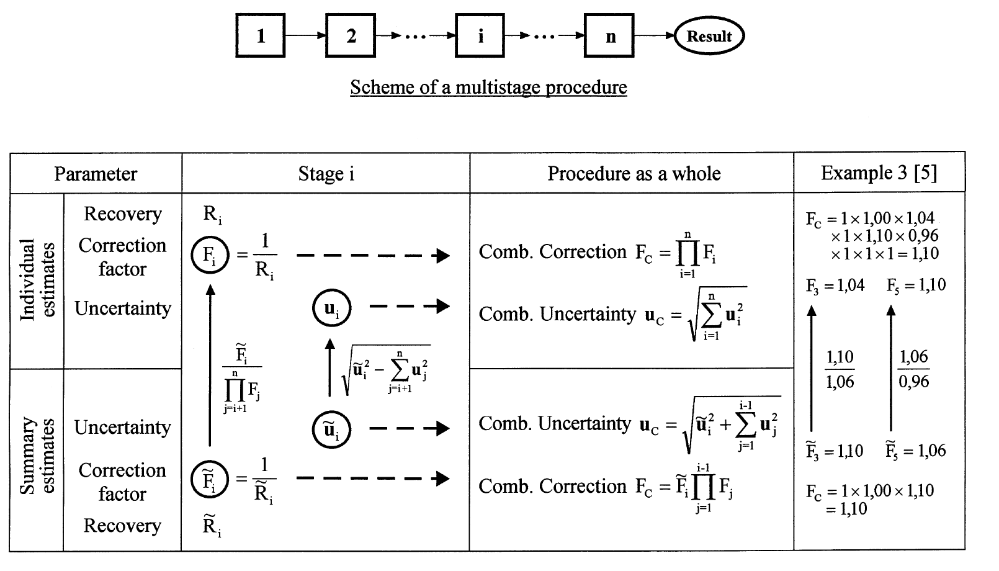

<!-- 方針: ほぼ全訳＋必要に応じた補足。原文（英語・Accred Qual Assur 原著 Practitioner's Report・全5ページ）の節構成に沿って訳出。図1〜3は原本PDFをpoppler（pdftoppm）で300 dpi描画・図領域を切り出し、各図をReadで目視確認のうえ全訳キャプションで埋め込んだ。図3は原文では表形式の図であるため、画像に加えてパイプ表としても全項目を転記した。式は原文の記述順に(1)〜(12)の番号を訳者が付し、記号定義とともに全て収載（原文には式番号は付されていない）。「> 補足:」は訳者注。 -->

## 書誌情報

- 原題: Evaluating uncertainty in analytical measurements: the pursuit of correctness
- 著者: **Rouvim L. Kadis**
  - D. I. メンデレーエフ計量研究所（D. I. Mendeleyev Institute for Metrology, VNIIM）, 19 Moskovsky pr., 198005 サンクトペテルブルク, ロシア
  - Fax: +7-812 327-97-76 / e-mail: hal6onti.vniim.spb.su（原文表記のまま）
- 掲載: *Accreditation and Quality Assurance* **3** (1998) 237–241, © Springer-Verlag 1998
- 種別: **PRACTITIONER'S REPORT**（品質保証・バリデーション・認定に関する経験の報告とノート）
- DOI: https://doi.org/10.1007/s007690050233
- 受領 1998-01-29 / 受理 1998-02-10
- 発表: **第2回EURACHEM 化学分析における測定不確かさワークショップ**（ベルリン, 1997年9月29–30日）
- キーワード: 化学分析（Chemical analysis）／測定不確かさ（Measurement uncertainty）／推定プロセス（Estimation process）
- 被引用数: **9件**（OpenAlex, 2026年8月時点）

> 補足: 本論文は原著研究ではなく、EURACHEMガイド（1995年 第1版）の**計算例に対する技術的批評**です。したがって実験データや検量線は登場せず、代わりに「ガイドのこの数値はこう計算すべきだった」という議論が中心になります。本サイトの全訳密度基準のうち、実験条件・検量線の項目は原文に存在しないため該当しません。原文で言及される数値・除数・自由度・検定結果はすべて漏らさず収載しています。

## 要旨

不確かさの評価は、原理は単純であるにもかかわらず、とりわけ化学分析においては定型作業ではなく、正しく行うには細心の注意を要する。このことは特に、この主題に関する最も重要な文書である EURACHEMガイド『Quantifying Uncertainty in Analytical Measurement』(1995) を検討することで見て取れる。著者の見るところ、この検討は、ガイドの計算例（worked examples）に示された不確かさ推定プロセスのいくつかの主要な細部において**正しさが不足している**ことを明らかにする。そこで著者は、不確かさを推定するための「正しさを追う（in pursuit of correctness）」規則をいくつか定式化した。規則とそれぞれのコメントは次の項目に関わる。

1. type B評価における**適切な分布関数の選択**
2. 合成不確かさへの**個別寄与を分けて考える必要性**
3. 不確かさ推定プロセスで**実際の影響因子を考慮すること**

さらに、結果の内部整合性のみが要求される比較試験に関連して、**条件付き（conditional）不確かさ対全体（overall）不確かさ**の推定という問題にも触れる。

## 序論

「測定不確かさ」という用語は、物理測定の特性を表すものとして一般に用いられてきたが、化学分析の要求に適合させるのはこれまでいささか困難であった。しかし、この（物質量の・分析的な・化学的な）測定の分野へこの概念を導入することは、きわめて自然なことである。この主題については多くの論文［1–4］が発表され、分析データ品質の文脈における不確かさの使用と評価という重要な問題を論じてきた。しかし本論文が焦点を当てるのは、**不確かさの推定値そのものの品質**を決めるものである。

分析実務における測定不確かさ概念の実装の現状は、鍵となる論点については合意に達しているが、なお細部のいくつかは確定したとは見なせず、さらなる修正を要する——そんな段階にある特異な建築物の設計になぞらえられよう。EURACHEMガイド［5］に示された不確かさ評価の手順についても同じことが言える。この文書は、分析化学の問題に適用される概念の発展にとって間違いなく最も重要な貢献である。しかしながら、計算例［5, Appendix A］に示された不確かさ推定プロセスにおける実務上の指示のいくつかは、完全に正しいとは思われず、コメントを要する。これは、主題に対するいくらか単純化されすぎた、あるいは誤った見方に由来しており、非現実的な推定をもたらしうる。

不確かさの推定値における「誤差」がどれほどのものであろうと、これらの問題は**ガイドの教育的意義**に鑑みて根本的に重要である。したがって、これらの「些事（trifles）」は、不確かさの推定値ができるだけ正しくなるように、いくつかの（十分に自明な）規則を定式化するために注意を向けるに値する。以下に、ガイドのそれぞれの計算例を参照しながら、この「正しさを追う」規則を示す。

> 補足: 著者が批判するのは1995年の第1版です。EURACHEM/CITAC Guide CG4 はその後改訂され、現行は第3版（QUAM:2012.P1, 2012年）です。本稿の指摘のうちどれが後版で採り入れられたかは、実際に使う版のAppendixを直接確認してください。**引用や実務で参照する際は必ず現行版を見ること。**

## 不確かさ推定における「正しさを追う」3つの規則

### 規則1: type B評価における適切な分布関数の選択は、当該量について入手できるすべての情報に基づいてなされねばならない

標準不確かさの推定はしばしば、当該量 $X$ の値が存在すると期待される限界 $a_-$ および $a_+$ から行われる。範囲 $a_-$ から $a_+$ は通常 $X$ の最良推定値に関して対称であり、半値幅は次で与えられる。

$$a = (a_+ - a_-)/2 \tag{1}$$

これは測定データ評価の実務ではかなり頻度の高い作業である。というのも、（客観的知識または個人の判断に基づく）最大限界の割り当てが、しばしばできることのすべてだからである。上の $a$ の値を、仮定される確率分布の種類に応じた適切な**変換係数（conversion factor）**で単純に割ればよい。ここで肝要なのは、**入手できる関連情報のすべてを使う**ことである。何が分かっているかについての典型的な3つの場合は次のとおりである（図1参照）。

1. 信頼水準が明記された（統計的に）推定された信頼区間
2. 期待値と、その周りに割り当てられた最大限界
3. 割り当てられた最大限界のみ

別段の記述がない限り、**ケース1**では区間の計算に正規（ガウス）分布が用いられたと仮定し、その分布の適切な分位点を用いて標準不確かさを回復するのがきわめて自然である（分位点は信頼水準95%に対して2.0とする）。

$$u(X) = a/2{,}0 \quad (P = 0{,}95) \tag{2}$$

対照的に、**ケース3**では当該量についての情報がきわめて乏しく、できることは対称一様（矩形）分布でモデル化することだけである。このとき当該量の期待値は範囲の中点であり、変換係数は $\sqrt{3}$ に等しい。

$$u(X) = a/\sqrt{3} \tag{3}$$

**ケース2**は、期待値のような追加情報により、当該量の値がこの値の近くにあるほうが限界の近くにあるよりも起こりやすいと見なせる場合に生じる。この状況はケース3のそれとは異なる。まさにこのゆえに、ISO『測定における不確かさの表現のガイド（GUM）』［6］の項目 **F.2.3.3** は、そうした場合には正規分布と矩形分布という2つの極端の**妥協**として三角分布を採用することを推奨している。この場合の変換係数は $\sqrt{6}$ に等しく、

$$u(X) = a/\sqrt{6} \tag{4}$$

得られる標準不確かさは矩形分布モデルを用いて得られるものより**約30%小さい**ことが分かる。ケース2からケース3へ移るにつれて不確かさが増大するのは、ある意味で、限界の間における当該量のとりうる値の分布についての**我々の無知に対する「支払い」**であると言える。

> 補足: 「約30%小さい」は検算できます。$\sqrt{6}/\sqrt{3} = \sqrt{2} \approx 1{,}414$ なので、三角分布での標準不確かさは矩形分布での $1/\sqrt{2} \approx 0{,}707$ 倍、すなわち約29%小さくなります。原文の記述と一致します。

EURACHEMガイドの計算例における**矩形分布使用のすべての事例は、実際にはケース3ではなくケース2に該当する**ことを認識すべきである。とりわけそうであるのが、容量器具（volumetric glassware）に関わる不確かさの評価である——公称容量とは、単に期待値にほかならない。したがって、変換係数 $\sqrt{3}$ を適用して計算されたすべての標準不確かさは**過大評価**であると考えられる。

ベイズ流の「等無知の原理（principle of equal ignorance）」に基づくこのアプローチは、計量学における不確かさ推定の一般的な実務ではあるものの、測定誤差を最大限界の形で規定するすべての場合において正しいと見なすことはできない。単純かつ普遍的ではあるが、この図式は常識と衝突する。**矩形分布は、当該量のとりうる値についての限界以外に何も分かっていない場合にのみ仮定されるべきである。** たとえば、材料の純度に関連する不確かさが「p (%) 以上」と表される場合は、ここでは純度の期待値（あるいは公称値）が未知であるから、そうしたケースの一つでありうる。モデル分布の適用のその他の例は図1に示す。

> 補足: この規則は、漢方・生薬QCの日常作業に直接効きます。標準品の秤量に使うメスフラスコの許容差（JIS/ISOのクラスA・B）は「公称容量に対する許容差」なので、期待値が既知であるケース2です。**除数 $\sqrt{3}$ ではなく $\sqrt{6}$ を使えば、容量器具由来の標準不確かさは約30%小さくなります。** 一方、標準品の純度が「≥98.0%」としか表示されていない場合は、期待値が不明なのでケース3、すなわち矩形分布 $u(p) = (100-p)/(2\sqrt{3})$ が正しい扱いです。同じ「限界値だけ与えられた量」でも、公称値の有無で扱いが変わる点がポイントです。

### 規則2: 不確かさ成分は、可能な限り合成不確かさに独立な寄与をなすものとして考える必要がある

しかし計算例には、合成される成分の一つが実際には別の成分を包含してしまい、その結果「**二重計上（double counting）**」となって不確かさ推定に冗長性が生じている状況がある。容量測定における不確かさの評価がその特徴的な例である。

さて、ここでは3つの寄与が本質的であると考えられている。

- **A.** 所与の型のガラス器具に対する規格限界（specification limits）
- **B.** 標線まで充填することの繰返し性（repeatability of filling the article to the mark）
- **C.** 周囲温度の影響（ambient temperature effects）

規定された容量許容差をもつ標準的な容量器具はどこでも使われている。しかし重要なのは、**許容差、すなわち容量誤差の限界は、標準条件下での各使用について、所与の型の容量器具1個に対する単一かつ十分な誤差特性である**ということである（ISO規格［7, 8］参照）。言い換えれば、実際の容量と公称容量の差は、器具（たとえば全量フラスコ）を標線まで充填する各回において、その限界内に収まるべきものである。したがって、**許容差を用いる場合、充填のばらつきを別個の不確かさ成分として考えるのは余計である。**

もちろん、水での充填の繰返し性に関するデータが入手可能ならば、それを考慮に入れてもよい。しかしその場合、繰返し性実験の結果として、実際にはその器具を**個別校正した**ことになり、公称容量を推定された容量値で置き換えることができ、規定許容差を適用する必要は直ちに消滅する。**そうした場合、不確かさへの寄与は2つだけ残り、最終的な分析では実質的に低減された不確かさの値が得られる。** 考察したケースを模式的に描いたのが図2である。

［ここで注意すべきは、測定される液体の性質（粘度、表面張力など）と、たとえば非水溶液の場合における水の性質との間に相当な差がある場合、不確かさへの追加的寄与が生じうることである。これらの効果は、適切な校正用液体を用いた個別校正によって考慮される。］

別の状況、「**パン中の有機リン系農薬の定量**」（ガイドの例3）を検討しよう。これは均質化に始まりGC定量に終わる、いくつかの逐次的ステップからなる多段階手順である。手順全体に対する**合成補正 $F_c$** と**合成不確かさ $u_c$** は、段階 $i$ にそれぞれ関係する補正係数の個別値 $F_i$ と不確かさ $u_i$ から次のように導かれる。

$$F_c = \prod_{i=1}^{n} F_i \tag{5}$$

$$u_c = \sqrt{\sum_{i=1}^{n} u_i^2} \tag{6}$$

（これらの値は回収率実験から分かることがある。$R_i$ を回収率とすれば $F_j = 1/R_i$ となる。）プロトコルはこれらすべての計算を示している。しかし、これが正しいのは**上式の成分が強く独立である場合に限られる**。実際にはそうではない。たとえば、抽出段階で実験的に得られた補正係数 $F_3$ は、後続するすべての段階の系統的効果を含んでおり、不確かさ $u_3$ が後続するすべての不確かさを取り込んでいるのと同様である。同じことが、洗浄済み抽出液の濃縮段階の値 $F_5$ と $u_5$ にも当てはまる。つまり我々は実際には、個別推定値（individual estimates）ではなく**まとめ推定値（summary estimates）**を手にしているのである。

> 補足: 原文は「$R_i$ を回収率とすれば $F_j = 1/R_i$」と印刷されていますが、添字が $j$ と $i$ で食い違っています。図3の表では明確に $F_i = 1/R_i$（および $\tilde{F}_i = 1/\tilde{R}_i$）と書かれているので、本文側の $j$ は誤植と考えられます。原文どおりに転記したうえで注記します。

そうした段階について個別補正係数 $F_i$ を得るには、まとめ値 $\tilde{F}_i$ を、後続するすべての段階に関係する補正係数で割らねばならない（例3で入手できるデータはこれを可能にする）。

$$F_i = \frac{\tilde{F}_i}{\prod_{j=i+1}^{n} F_j} \tag{7}$$

不確かさについても同様に、まとめ推定値から個別推定値を得る。

$$u_i = \sqrt{\tilde{u}_i^2 - \sum_{j=i+1}^{n} u_j^2} \tag{8}$$

そのうえで手順全体の合成係数を計算できる。

**個別補正係数を求めずに**、合成補正の計算でこれを行うことも可能である。因子の積において**最初のまとめ係数 $\tilde{F}_i$（例3における $F_3$ のような）で止めれば十分**である。これにより多段階手順は、合成値に独立な寄与をなす要素へと分解される。

$$u_c = \sqrt{\tilde{u}_i^2 + \sum_{j=1}^{i-1} u_j^2} \tag{9}$$

$$F_c = \tilde{F}_i \prod_{j=1}^{i-1} F_j \tag{10}$$

図3は2通りの計算法を示している。**まとめ推定値から個別推定値を得る**のは縦向きの矢印で、**合成補正を積として得る**のは横向きの矢印で描かれている。（合成不確かさの計算における適切な手順も表に含めてある。）表の右端の列は、例3に関連する具体的な計算を示す。

**図3の表（全項目の転記）**

| 区分 | パラメータ | 段階 $i$ | 手順全体 | 例3［5］ |
|---|---|---|---|---|
| 個別推定値 | 回収率 | $R_i$ | — | $F_C = 1 \times 1{,}00 \times 1{,}04 \times 1 \times 1{,}10 \times 0{,}96 \times 1 \times 1 \times 1 = 1{,}10$ |
| 個別推定値 | 補正係数 | $F_i = \dfrac{1}{R_i}$ | 合成補正 $F_C = \prod_{i=1}^{n} F_i$ | $F_3 = 1{,}04$ ／ $F_5 = 1{,}10$ |
| 個別推定値 | 不確かさ | $u_i$ | 合成不確かさ $u_C = \sqrt{\sum_{i=1}^{n} u_i^2}$ | — |
| （変換） | まとめ→個別 | $F_i = \dfrac{\tilde{F}_i}{\prod_{j=i+1}^{n} F_j}$ ／ $u_i = \sqrt{\tilde{u}_i^2 - \sum_{j=i+1}^{n} u_j^2}$ | — | $\dfrac{1{,}10}{1{,}06}$ ／ $\dfrac{1{,}06}{0{,}96}$ |
| まとめ推定値 | 不確かさ | $\tilde{u}_i$ | 合成不確かさ $u_C = \sqrt{\tilde{u}_i^2 + \sum_{j=1}^{i-1} u_j^2}$ | — |
| まとめ推定値 | 補正係数 | $\tilde{F}_i = \dfrac{1}{\tilde{R}_i}$ | 合成補正 $F_C = \tilde{F}_i \prod_{j=1}^{i-1} F_j$ | $\tilde{F}_3 = 1{,}10$ ／ $\tilde{F}_5 = 1{,}06$ |
| まとめ推定値 | 回収率 | $\tilde{R}_i$ | — | $F_C = 1 \times 1{,}00 \times 1{,}10 = 1{,}10$ |

> 補足: 右端の列が言いたいのは「**どちらの道を通っても $F_C = 1{,}10$ で一致する**」ということです。上段は9段階すべての個別補正係数を掛け合わせる道（$1 \times 1{,}00 \times 1{,}04 \times 1 \times 1{,}10 \times 0{,}96 \times 1 \times 1 \times 1 = 1{,}10$）、下段は最初のまとめ係数 $\tilde{F}_3 = 1{,}10$ で止めてそれ以前だけを掛ける道（$1 \times 1{,}00 \times 1{,}10 = 1{,}10$）です。個別値 $F_3 = 1{,}04$ は $\tilde{F}_3 = 1{,}10$ を後続の $1{,}06$ で割って得られ、$F_5 = 1{,}10$ は $\tilde{F}_5 = 1{,}06$ を後続の $0{,}96$ で割って得られます。**下段のほうが計算が短く、しかも成分の独立性が保証される**——これが著者の推奨です。

### 規則3: 不確かさを推定する際は、その手順の文脈で測定結果に実際に影響する影響因子のみを考慮すべきである

再びガイドの例3を参照しよう。GC測定に関連する不確かさの評価は、ここでは（［5］のTable A3.6）**異なる装置・異なる分析者・（および異なる時期）にまたがるGC変動の広範な研究**に基づいている。しかし、因子の変動範囲が広いにもかかわらず、そうして得られた不確かさ推定値の有用性は疑わしい。実際、GC定量の条件は通常、**試料と標準の両方の応答が、同一装置で、同一分析者により、短期間のうちに記録される**ようなものである。このゆえに、これらの影響因子は分析結果において大きく相殺される。したがって、これらの因子を（GC定量段階と校正段階について別々にばらつきを推定して）勘定に入れるのは、その手順の文脈では**誤解に基づく**ものと思われる。

同じ例における**秤量**に関連する不確かさの評価にも触れておくべきだろう。この場合に考慮された不確かさへの2つの寄与は、「繰返し性実験」の標準偏差（**0.03 g**）と、長期データの平均値の標準偏差（**0.008 g**）である。この2成分が合成されて **0.031 g** の値が与えられている。

まず何より、求める不確かさの推定において、**長期変動の尺度として平均値の標準偏差を用いるのは正しくない**ことに注意されたい。もし入手できるデータが例のように11か月ではなく、たとえば22か月をカバーしていたとすれば、この考え方に従えば長期寄与は $\sqrt{2}$ 倍だけ小さくなってしまう。入手できる月次チェックウェイトのデータ（［5］のTable A3.1(3)）は標準偏差 **0.026 g** を与えるのであり、**この値だけが単一秤量の長期変動を特徴づける**。

同時に、［5］のTable A3.1(1) は、**繰返し秤量／繰返し読み取り（repeat weighings / replicate readings）**の結果を示しており、これは秤量の精度を詳細に検討するのに非常に有用でありうる。標準的な図式［9］に従って**一元配置分散分析**を適用すれば、秤量の全変動の個別成分を推定できる。上述の 0.03 g という標準偏差は、明らかに分離を行わずデータを1つの大標本として扱って得られたものだからである。

こうして、**繰返し読み取りの標準偏差は 0.020 g**（自由度 $f = 36$）と求められる。$F$ 検定によって、**長期標準偏差 0.026 g**（$f = 10$）がこの推定値と、**10%水準においてさえ有意に異ならない**ことを容易に証明できる。これは、ここでは**時期がまったく因子ではない**こと、したがって長期変動に由来する寄与を考慮する必要がないことを意味する。

さらに解析を進めると、単一秤量に対する**繰返し秤量の標準偏差は概ね 0.05 g**（$f = 11$）となる。この推定値は、繰返し読み取りの標準偏差 0.020 g より（$F$ 検定で）**有意に大きい**。したがって、この試験室の秤量には何らかの**追加的な変動源**が存在する。その源が何であれ、**求める合成標準不確かさへの秤量の実際の寄与として採るべきは 0.05 g という値である。**

> 補足: 規則3の結論は一見すると逆説的です。規則1・2は「ガイドは不確かさを過大評価している」でしたが、規則3の秤量の例だけは逆に「ガイドの 0.031 g は**過小評価**で、正しくは 0.05 g」となります。著者の主張は「小さくしろ」でも「大きくしろ」でもなく、**その手順で実際に効いている変動源を分散分析でちゃんと分離しろ**、という一点です。
>
> 数値の関係を整理すると——繰返し読み取り（同一試料を置いたまま表示を読み直す）0.020 g < 繰返し秤量（載せ直して量る）0.05 g、そして長期（月次チェックウェイト）0.026 g は 0.020 g と有意差なし。つまり**月をまたぐ時間は効いておらず、効いているのは「載せ直し」の操作**だということです。ガイドが使った 0.03 g は載せ直しと読み直しを混ぜた1つの標本の標準偏差であり、成分に分けていなかった、というのが批判の中身です。

## もう一つの所見

不確かさの評価に関する最も重要な点の一つは、**関連するすべての誤差源が考慮に入れられ、対応する寄与が合成されるべきである**ということである。こうして得られた推定値は、当該分析手順に内在する**全体の（overall）不確かさ**を定量する。分析結果の意味のある報告と解釈は別として、全体の不確かさは、たとえば標準物質を用いる品質管理の目的に適用可能である。

しかしながら分析実務には、全体の不確かさの推定値が扱うのに不適切であり、したがって不要と思われる場合が多くある。たとえば、**BS 6478 に従ってセラミック製品2個をカドミウム溶出に関して比較**しなければならないとしよう（ガイドの例2参照）。実験は、同じ浸出液を満たした被検容器を、同じ期間、同じ温度で（いずれも妥当な精度で測定される）静置するように実施され、得られた2つの抽出液は**同じブラケッティング参照溶液を用いてAAS（原子吸光）で分析される**。問題は、2つの試料が当該試験に関して互いに異なるか否か——統計学の言葉で言えば、**2つの測定結果の差が、それぞれのばらつきを背景として有意であるか**である。

ベイズ理論に基づく適合性判定基準も、通常の統計学に基づくものも、2つの測定結果をそれらの不確かさを考慮して比較する問題に適用できる［10］。**しかし、例2で計算されたような全体の不確かさは、この比較実験に関して問題を正しく解くには不適切である。それらはこの目的には「過大」なのである。** 明らかに、とりわけ実際の実験条件が公称条件から偏ることによって生じる誤差成分の多くは、比較される2つの結果について同一であり、対応する寄与は**差の不確かさバジェットにおいて消える**。

したがって、**絶対的な真度ではなく、結果の内部整合性のみが問題である場合には、そうした比較試験の範囲内で変動しない影響量は無視してよく、全体の不確かさは特定の条件に適した値へと縮減される。これを「条件付き不確かさ（conditional uncertainty）」と呼ぶ。**

このようなアプローチの可能性は、不確かさを扱う「トップダウン」法に関してではあるが、［1］において指摘されていた。「条件付き不確かさ」あるいはそれに類する用語は、分析データ処理において通用するようになりそうである。というのも、分析試験室の日常業務のかなりの部分は、そうした結果の内部整合性のみを要求するからである。**これは、さもなくば大きすぎるかもしれない不確かさを小さくするための「抜け穴」と見なされてはならない。** むしろ、**fitness-for-purpose（目的適合性）の原則を適用する一例**と考えるべきである。目的適合性という概念は、測定プロセス自体が生み出すデータに対してと同様に、不確かさの推定値に対しても明らかに十分適用可能である。

結びとして、ISOガイド［6］の項目 3.4.6 の——EURACHEM文書の項目 5.4.16 にそっくり引き継がれた——きわめて的確で深い一節を引くのが適切であろう。その趣旨は次のとおりである。**不確かさの評価は定型作業でも純粋に数学的な作業でもなく、測定量の性質と測定方法・手順についての詳細な知識に依存する。したがって、測定結果に付される不確かさの品質と有用性は、究極的にはその値の割り当てに関与する人々の理解・批判的分析・誠実さに依存する。**

> 補足: 最後の一節は原文では英語の直接引用ですが、本サイトの方針に従い日本語で趣旨を訳出しました。原文の正確な文言はGUM 3.4.6／EURACHEMガイド 5.4.16 を直接参照してください。

## 参考文献

1. Analytical Methods Committee, RSC (1995) *Analyst* **120**: 2303–2308
2. Cortez L (1995) *Microchim Acta* **119**: 323–328
3. Williams A (1996) *Accred Qual Assur* **1**: 14–17
4. Wegscheider W, Zeiler H-J, Heindl R, Mosser J (1997) *Annal Chim* **87**: 273–283
5. EURACHEM (1995) *Quantifying Uncertainty in Analytical Measurement*
6. ISO, IEC, OIML, BIPM (1992) *Guide to the Expression of Uncertainty in Measurement*, 1st edn. ISO（IFCC・IUPAC・IUPAPを含む7団体名義の1993年版も入手可能）
7. ISO 384 (1979) *Laboratory glassware. Principles of design and construction of volumetric glassware*
8. ISO 4787 (1984) *Laboratory glassware. Volumetric glassware. Methods for use and testing of capacity*
9. Doerffel K (1990) *Statistik in der analytischen Chemie*, 5th edn, chap 8. Deutscher Verlag für Grundstoffindustrie, Leipzig
10. Weise K, Wöger W (1994) *Meas Sci Technol* **5**: 879–882

## 訳者補足

### この論文の位置づけ

1998年の5ページの実務者レポートで、被引用は9件と多くありません。しかし内容は**測定不確かさを実務で計算するときに誰もが踏む3つの落とし穴**を、当時の教科書的存在だったEURACHEMガイドの計算例を名指しで検証する形で挙げたもので、四半世紀たった今もそのまま通用します。GUM／EURACHEMガイドを「手順書として読む」のではなく「批判的に読む」ための一次資料として価値があります。

なお本稿の批判対象はEURACHEMガイド**第1版（1995）**です。同ガイドはその後改訂され、現行は EURACHEM/CITAC Guide CG4 **第3版（QUAM:2012.P1, 2012年）**です。本稿の指摘のうち何が後版に反映されたかは、実際に使う版のAppendixを直接確認してください。

### 原文で気づいた表記上の不整合

| 箇所 | 原文の印刷 | 備考 |
|---|---|---|
| 規則2・本文 | 「$R_i$ が回収率なら $F_j = 1/R_i$」 | 添字が $j$ と $i$ で食い違う。図3の表では $F_i = 1/R_i$ と明記されており、本文側が誤植と思われる |
| 図3 キャプション | 「まとめ推定値 $\tilde{F}_i$, $u_i$」 | 表中では $\tilde{u}_i$（チルダ付き）。キャプションでチルダが落ちている |
| 数値表記 | $0{,}95$ / $1{,}10$ など | 小数点にコンマを用いる大陸式表記。本文は原文どおり転記した |

いずれも原文の印刷どおりに転記し、訳者が黙って「直す」ことはしていません。

### 漢方・生薬QCの実務への読み替え

**① 容量器具の除数（規則1）** — 標準品調製で 25 mL や 100 mL のメスフラスコを使うとき、その許容差（クラスAなら 100 mL で ±0.10 mL など）に矩形分布の $\sqrt{3}$ を当てているなら、それは過大評価です。公称容量という期待値が分かっている以上、三角分布の $\sqrt{6}$ が本来の扱いで、**寄与は約30%小さくなります**。一方、標準品の純度表示が「≥98.0%」のように下限しかない場合は期待値が不明なので、矩形分布 $u(p) = (100-p)/(2\sqrt{3})$ が正しい——同じ「限界値だけ」でも扱いが割れる点が要注意です。

**② 多段階前処理の回収率補正（規則2）** — 生薬の一斉分析は「粉砕→抽出→ろ過→濃縮→定容→HPLC」という多段階手順で、まさにガイドの例3と同じ構造です。ここで**添加回収試験の回収率は、その段階だけでなく後続の全段階を通した「まとめ値」**です。段階ごとの回収率を掛け合わせて全体の補正係数にすると、後続段階を何重にも数えることになります。式(10)が示すとおり、**最初のまとめ係数で止めて、それ以前の段階だけを掛ける**のが正しい扱いです。

**③ 同一条件で相殺される要因（規則3）** — 検量線用標準溶液と試料溶液を**同一のHPLC・同一カラム・同日・同一分析者**で測るなら、装置間差・カラムロット差・日間差は分子分母で相殺されます。バリデーション報告書の中間精度（装置・分析者・日を振ったデータ）から得た RSD をそのまま日常のバッチ判定の不確かさに持ち込むと、**その手順では効いていない変動を数えている**ことになります。逆に、天秤の寄与を「繰返し読み取り」で代表させると過小評価になります——載せ直しを含む繰返し秤量で評価すべき、というのが本稿の 0.020 g 対 0.05 g の教訓です。

**④ 条件付き不確かさ（もう一つの所見）** — 「このロットは規格に適合するか」という**絶対判定**には全体の不確かさが要りますが、「参照ロットと今回のロットで指標成分パターンが違うか」という**相対比較**には条件付き不確かさで足ります。同一日・同一装置・同一標準溶液で並べて測る限り、共通する誤差源は差の不確かさから消えるからです。指紋分析の類似度評価やバッチ間一貫性の評価は、まさにこの内部整合性だけが問われる場面です。ただし著者が釘を刺すとおり、これは**不確かさを小さく見せるための抜け穴ではなく、目的適合性の原則の適用**として説明できなければなりません。

### 関連する当サイトの解説

- [分光分析における測定の不確かさ——試料前処理と「化学量→物理量」変換が結果を支配する](spectrophotometric-uncertainty-sample-preparation-iron.html) — 本稿が「規則」として述べた話を、水中鉄の吸光光度定量で実験的に裏づけた論文。補正係数を掛ける測定モデル（本稿の式(5)と同じ構造）を実データで組み上げている
