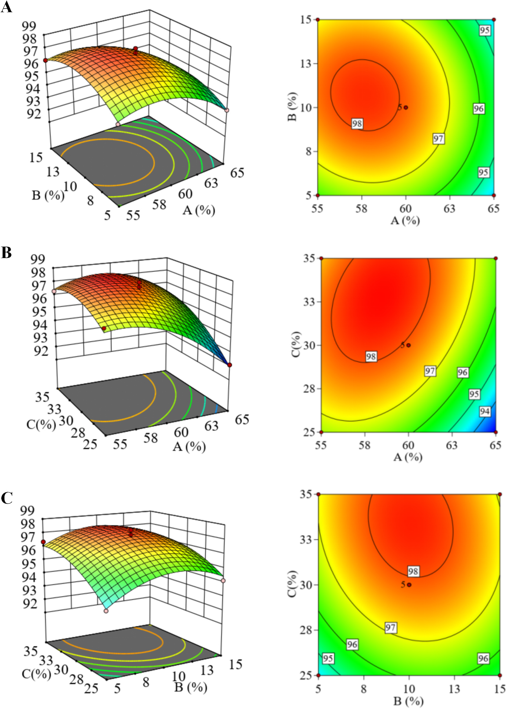
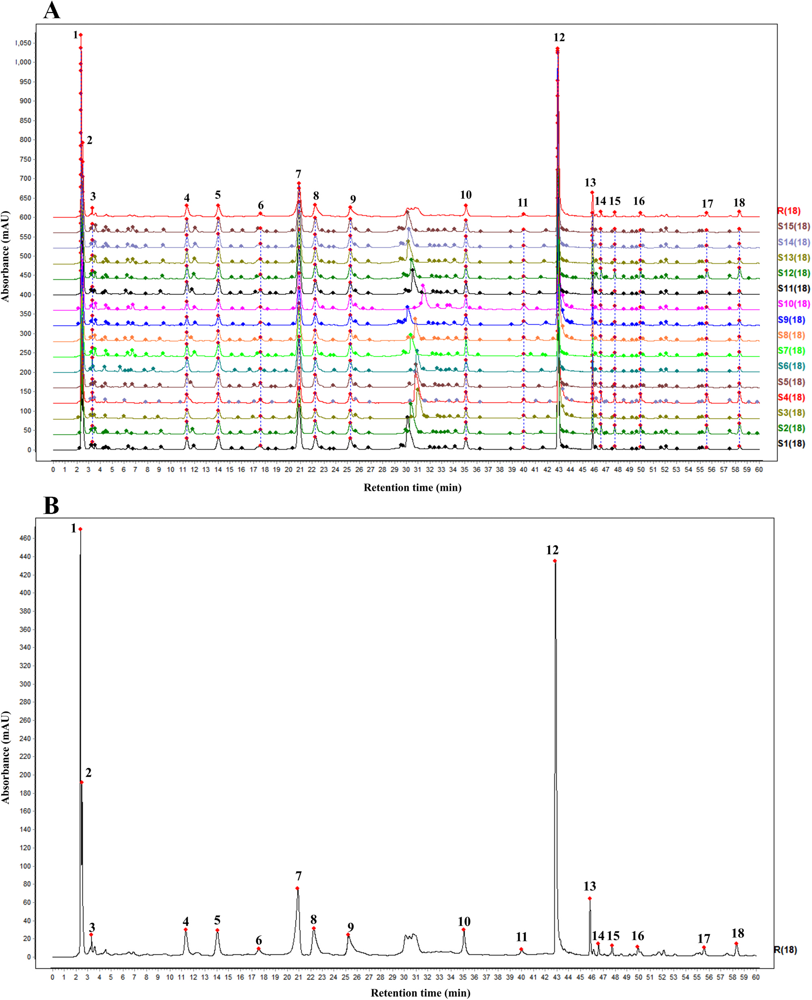
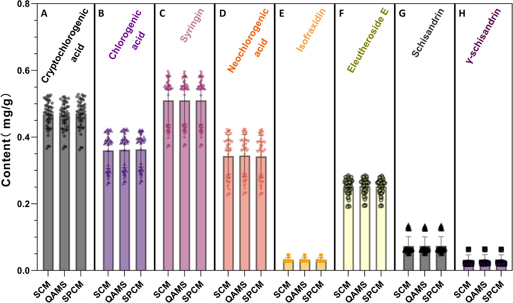
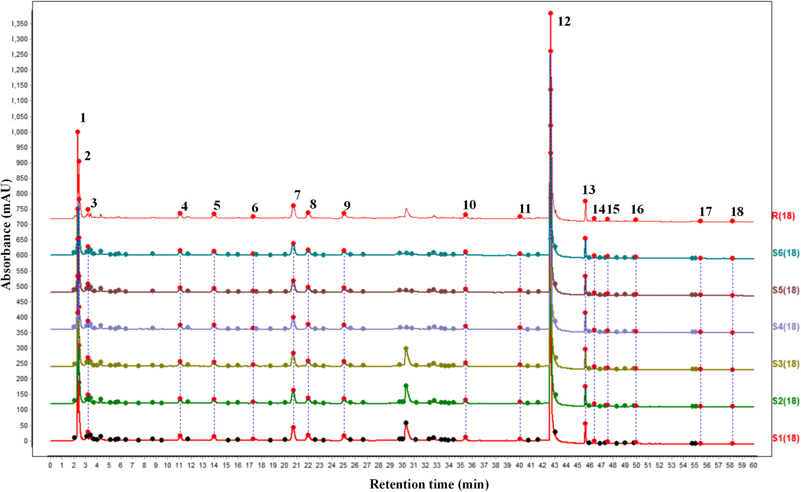
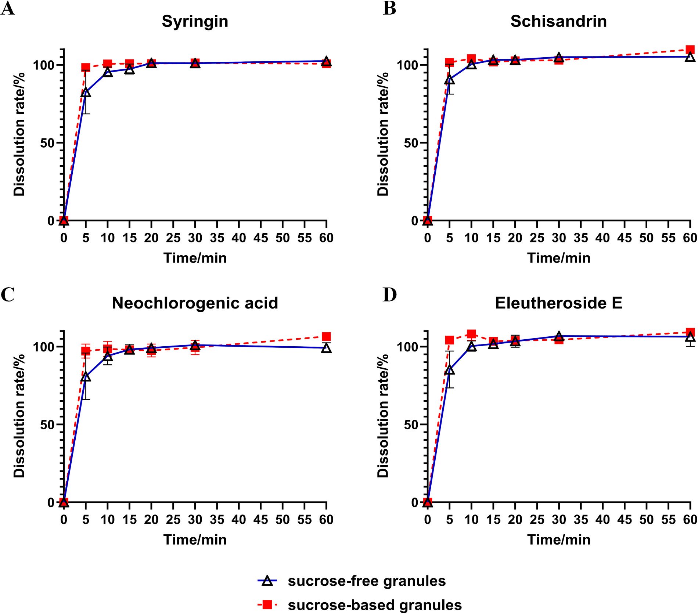

<!-- 方針: ほぼ全訳＋必要に応じた補足。原文構成に沿って訳出。「> 補足:」は訳者注。 -->

## 書誌情報

- 原題: A holistic strategy for the preparation and quality control of sugar-free Fufang Ciwujia granules: Comprehensive quality evaluation through fingerprint and QAMS
- 著者: Zhiyu Zhan, Zexuan Chen, Xueyee Lim, Zihan Ding, Zhongli Li, Mingsong Fan, Tong Zhang, Ling Li（上海中医薬大学薬学院 ほか, 中国。Zhan・Chenは共同筆頭）
- 掲載: *Journal of Pharmaceutical and Biomedical Analysis* 277 (2026) 117491. https://doi.org/10.1016/j.jpba.2026.117491
- インパクトファクター: **3.6**（*J. Pharm. Biomed. Anal.*, JCR 2024 / Clarivate）
- 受理経過: 2026年オンライン公開（*J. Pharm. Biomed. Anal.* 277巻）

> 補足: FCG = 復方刺五加顆粒（Fufang Ciwujia granule）。構成生薬は刺五加(Acanthopanax/Eleutherococcus senticosus, AS)と五味子(Schisandra chinensis, SC)。QAMS = 一標準多成分定量法。AHP = 階層分析法、RSM = 応答曲面法。本論文は製剤設計＋品質評価の研究論文。

## 要旨（Abstract）

復方刺五加顆粒(FCG)は不眠・多夢に有効な生薬エキス製剤だが、ショ糖含量が高く糖質制限者には使いにくい。さらに単一マーカー成分に依存する品質管理(QC)は多成分性を十分反映できない。本研究は糖質制御が必要な集団向けの **無糖FCG製剤** を開発し、原製剤との品質同等性を担保する包括的QC戦略を確立した。**AHP-エントロピー重み法＋Box-Behnken応答曲面法(RSM)** で造粒工程を最適化し、最適な複合賦形剤系(可溶性デンプン・デキストリン・マルトデキストリン)と湿潤剤として10%エタノールを特定。パイロットスケールで優れた成形性(**>96%**)を実証。HPLC指紋法とQAMSを確立し、無糖品と原(ショ糖)製剤の比較で **指紋類似度>0.98、8マーカー成分の含量差RSD<4%、溶出プロファイル同等(f2>50)** を確認。製剤から総合品質評価までの枠組みを提供する。

## 1. 序論（Introduction）

FCGは不眠・多夢に用いられるが、高ショ糖含量が糖尿病・体重管理・ケトジェニック食の集団に不向き。現行QC規格は **イソフラキシジン単一成分の定量のみ** で多成分性を反映できない。AS由来のエレウテロシドE・シリンギン・イソフラキシジン等、SC由来のシザンドリン・γ-シザンドリン等が薬効に関与する。QAMSは入手容易で低コストのマーカーを対照に他成分を定量する迅速・環境配慮型手法。本研究は無糖化と多成分QC(指紋＋QAMS)を統合した。

## 2. 材料と方法（Materials and Methods）

### HPLC条件

- カラム: Agilent Eclipse XDB-C18（250 × 4.6 mm, 5 μm）、カラム温度 25 ℃
- 移動相: A=0.1%リン酸水、B=アセトニトリル。グラジエント: 0–25 min 95%A / 25–26 min 95–89%A / 26–35 min 89–85%A / 35–39 min 85–83%A / 39–40 min 83–35%A / 40–60 min 35–18%A
- 流速 1.0 mL/min、検出波長 **220 nm**、注入量 20 μL

### 造粒最適化（AHP-エントロピー＋Box-Behnken RSM）

重要品質特性(CQA)として成形性率・溶出率・吸湿性・安息角を測定。AHP(1–9尺度)で主観重みW₁を、エントロピー重み法で客観重みW₂を求め、統合してW₃を導出。重要度順は **成形性率 > 安息角 > 溶出率 > 吸湿性**。Box-Behnken計画でデキストリン量(A)・エタノール濃度(B)・エタノール量(C)を因子に最適化。

### 標準品・バリデーション

8指標成分の標準液(50%メタノール等): クリプトクロロゲン酸 1.44、クロロゲン酸 0.84、シリンギン 1.12、ネオクロロゲン酸 1.35、イソフラキシジン 1.27、エレウテロシドE 1.23、シザンドリン 0.85 mg/mL、γ-シザンドリン 0.97 mg/mL(メタノール)。AS/SCを欠く陰性対照を調製。50/100/150%添加の回収率試験。ICHガイドラインに準拠して精度・再現性・安定性・直線性・回収率を検証。

## 3. 結果（Results）

### 造粒の最適化とパイロット検証

RSMの予測最適: **デキストリン58.37%・エタノール濃度10.32%・エタノール量32.64%**(予測総合スコア98.38)。実生産適応のため最終処方は **可溶性デンプン25%・デキストリン60%・マルトデキストリン10%** ＋10%エタノール溶液 30%量。3バッチ検証: 成形性率93.45%・溶出率94.62%・安息角38.91°・吸湿性10.42%(予測とよく一致)。

可溶性デンプンが液状エキスを固化し、マルトデキストリン・デキストリンが固有の結合能を与え、追加の結合剤なしに高成形性・良好な流動性を実現(「エキスの固形分が低く賦形剤比が高い」無糖造粒の核心課題を解決)。**パイロット3バッチ**: 成形性率 96.30/97.00/96.66%、溶出率 92.23/92.53/91.40%、吸湿性 8.59/8.76/8.42%、安息角 41.52/40.96/41.17°(規格適合・実験室結果と一致)。

### 指紋・QAMSによる品質同等性

8指標成分——**クリプトクロロゲン酸・クロロゲン酸・ネオクロロゲン酸・シリンギン・イソフラキシジン・エレウテロシドE・シザンドリン・γ-シザンドリン**。S1を参照指紋とし共通ピークをマッチング。**シリンギンを内部標準(IS)** として他7成分の相対補正係数(RCF)をQAMS式で算出。

無糖品と原(ショ糖)製剤の比較で——**指紋類似度 > 0.98**、8マーカー成分の含量変動 **RSD < 4%**、溶出プロファイル **f2 > 50**(同等)。QAMSとESM(外部標準法)も一致し、無糖品が原製剤と物質的基盤・溶出挙動で同等であることを確認した。

## 4. 結論（Conclusion）

無糖FCGを開発し、AHP-エントロピー重み＋Box-Behnken RSMで造粒を最適化(複合賦形剤＋10%エタノール、成形性>96%)、HPLC指紋＋QAMSで原製剤との品質同等性(指紋類似度>0.98・8成分RSD<4%・溶出f2>50)を実証した。複合賦形剤設計からモデルベース最適化までの体系的戦略は、高品質な無糖漢方顆粒開発の移転可能な枠組みを提供する。

> 補足（実務的示唆）: 本研究は「①無糖化(製剤学的課題＝賦形剤設計をRSMで最適化) × ②多成分QC(単一イソフラキシジン規格→8成分の指紋＋QAMS)」を一気通貫で示した点が特徴。実務的には、処方変更(無糖化)の同等性評価に **指紋類似度・主要成分含量(QAMS)・溶出f2** の3点セットを使う設計が参考になる。シリンギンを内部標準とするQAMSで標準品コストを抑えつつ8成分を同時把握でき、現行の単一マーカー規格より頑健。

## 参考文献

1. Y.H. Zhao, X. Luo, Research progress on epidemiology and pathogenesis of insomnia, Chin. J. Clin. 51 (2023) 1397–1401.

2. C.´A. Rosales-G´omez, B.E. Martínez-Carrillo, A.L. Guadarrama-L´opez, A. A. Res´endiz-Albor, I.M. Arciniega-Martínez, E. Aguilar-Rodríguez, Impact of sucrose consumption on the metabolic, immune, and redox profile of mice with gestational diabetes mellitus, Life (Basel) 15 (2025).

3. Y. Yan, X.H. Li, X. Wang, C. Fang, X.H. Wu, Analysis of main chemical components of Ciwujia Injection based on UPLC-MS and study on its anti-depression effect, Drug Eval. Res. 45 (2022) 1332–1342.

4. X. Cui, W. Wang, L. Yang, B. Nie, Q. Liu, X. Li, D. Duan, Acanthopanax senticosus saponins prevent cognitive decline in rats with alzheimer's disease, Int. J. Mol. Sci. 26 (2025).

5. M.B. Majnooni, S. Fakhri, Y. Shokoohinia, M. Mojarrab, S. Kazemi-Afrakoti, M. H. Farzaei, Isofraxidin: synthesis, biosynthesis, isolation, pharmacokinetic and pharmacological properties, Molecules 25 (2020).

6. Y.C. Zhang, M.Y. Wang, H.Q. Lin, X.Y. Zhang, C.M. Wang, J.H. Sun, H. Li, J. G. Chen, J.L. Liu, Hypnotic effect of schisandra lignans on chlorophenylalanineinduced insomnia in rats, Chin. J. Gerontol. 40 (2020) 861–863.

7. J.W. Wang, F.Y. Liang, X.S. Ouyang, P.B. Li, Z. Pei, W.W. Su, Evaluation of neuroactive effects of ethanol extract of Schisandra chinensis, Schisandrin, and Schisandrin B and determination of underlying mechanisms by zebrafish behavioral profiling, Chin. J. Nat. Med. 16 (2018) 916–925.

8. W. Zhang, Z. Sun, F. Meng, Schisandrin B ameliorates myocardial ischemia/ reperfusion injury through attenuation of endoplasmic reticulum stress-induced apoptosis, Inflammation 40 (2017) 1903–1911.

9. G.Z. Jiang, Z.Y. Ma, H.D. Hou, J. Zhou, F. Long, J.D. Xu, S.S. Zhou, H. Shen, Q. Mao, S.L. Li, C.Y. Wu, Gastrointestinal motility modulation efficacy-related chemical marker findings and QAMS-based quality control of Agastache rugosa, J. Pharm. Biomed. Anal. 256 (2025) 116680.

10. L. Zhao, X. Sun, H. Yan, G. Sun, Comprehensive quality assessment of Xiaoer Chiqiao Qingre granules by fingerprinting technology combined with multicomponent quantitative methods, J. Chromatogr. A 1757 (2025) 466140.

11. B. Zhu, D. Hu, J. Zhao, S. Li, Rapid identification and quantification of Pseudostellaria heterophylla with its adulterants by HPLC-CAD fingerprint combined with improved quantitative analysis of multi-components by single marker (QAMS), J. Pharm. Biomed. Anal. 247 (2024) 116205.

12. Q. You, Y. Ren, J. Li, G. Zeng, X. Luo, C. Zheng, Z. Tang, Ultrasound-Assisted enzymatic extraction of the active components from Acanthopanax sessiliflorus stem and bioactivity comparison with Acanthopanax senticosus, Molecules 30 (2025) 397.

13. K. Lau, G.G. Yue, Y. Chan, H. Kwok, S. Gao, C. Wong, C.B. Lau, A review on the immunomodulatory activity of acanthopanax senticosus and its active components, Chin. Med. 14 (2019) 25.

14. D. Ehambarampillai, M.L.Y. Wan, A comprehensive review of Schisandra chinensis lignans: pharmacokinetics, pharmacological mechanisms, and future prospects in disease prevention and treatment, Chin. Med. 20 (2025) 47.

15. L.J. Cui, H. Yi, Z. Wu, C. Li, H.M. Gao, X.Q. Liu, Z.M. Wang, Comparison on the in vitro dissolution between generic and original drugs of Ginkgo Folium tablets, Mod. Chin. Med. 27 (2025) 1347–1353.

16. W.J. Moore, H.H. Flanner, Mathematical comparison of dissolution profiles, Pharm. Technol. 20 (1996) 64–74.

17. L. Chen, Z. Zhang, M. Cai, G. Sun, Comprehensive quality assessment of huricha liuwei pill using five-wavelength fusion fingerprints and spectral quantum fingerprints combined with antioxidant analysis, Spectrochim. Acta Part A. 341 (2025) 126418.

18. F. Wu, L.F. An, J.W. Huang, S.H. Ge, X.H. Su, S.S. Dai, Q.W. Li, Research progress on the chemical compositions and pharmacological effects of Ciwujia (Acanthopanacis Senticosi Radix Et Rhizoma Seu Caulis), guiding, J. Tradit. Chin. Med. Pharm. 31 (2025) 107–111.

19. Y. Gao, Evaluation of the anti-fatigue efficacy of chlorogenic acid and its mechanism of action, China Food Addit. 34 (2023) 154–161.

20. S.B. Sun, B.Y. Zhou, Z.J. Sui, L. Sun, J.Y. Zhang, L.Y. Meng, F. Gao, Research review on improving sleep function of Schisandrae Chinensis Fructus, Acanthopanax Senticosus and Semen Ziziphi Spinosae, Med. Diet. Health 19 (2021) 196–198.

21. M. Zhang, F. Wang, H.J. Liu, Y. Shi, W.B. Zhang, Application of quantitative analysis of multi-components by single-marker (QAMS) in quality control of traditional Chinese medicine, Chin. J. Ethnomed. Ethnopharm 30 (2021) 51–55.

22. G.X. Sun, W.Y. Sun, H. Yan, J. Zhang, Z.F. Hou, L.L. Lan, Q.N. Gao, D.J. Pu, Z. H. Chen, L.L. Mu, Constructing traditional Chinese medicine standard system for overall quality control and quality consistency evaluation of Chinese medicine, Cent. South Pharm. 17 (2019) 321–331.

23. J. Shi, Z.Y. Xu, Common problems analyses in the quality control and in vitro evaluation on consistency evaluation of oral solid dosage forms, Chin. N. Drugs J. 28 (2019) 2473–2477.

24. Y. Hu, D. Zhao, L. Zhong, J.G. Zheng, D. Zhang, E. Wu, Q. Shi, L. Qiao, L. Lin, Integrated multi-omics analysis reveals metabolic reprogramming as a key driver of angiotensin II-induced vascular remodeling, View 7 (2025) 20250146.

25. W. Liu, X. Hu, Z. Bao, Y. Li, J. Zhang, S. Yang, Y. Huang, R. Wang, J. Wu, X. Xu, Q. Sang, W. Di, H. Lu, X. Yin, K. Qian, Serum metabolic fingerprints encode functional biomarkers for ovarian cancer diagnosis: a large-scale cohort study, EBioMedicine 115 (2025) 105706.

26. B. Li, J. Liu, Z. Chen, Z. Sun, J. Ye, F. Liu, Surface-enhanced Raman scattering spatial fingerprinting decodes the digestion behavior of lysosomes in live single cells, View 5 (2024) 20240004.

27. F. Teng, J. Zhang, Y. Huang, W. Xu, W. Liu, L. Sun, M. Yan, J. Wu, R. Wang, S. Yang, L. Huang, Z. Gu, H. Su, X. Xu, D. Liang, N. Ren, C. Ding, Y. Li, Q. Dong, L. Guo, S. Liu, X. Wang, K. Qian, Metabolic fingerprinting enables rapid, label-free histopathology in gastric cancer diagnosis and prognostic prediction, Cell Rep. Med. 6 (2025) 102238.

28. T. Aree, Atomic-level understanding on conformational flexibility of neochlorogenic and chlorogenic acids and their inclusion complexation with β-cyclodextrin, Food Hydrocoll. 141 (2023) 108742.

29. W. Liu, L.X. Tu, S.L. Yang, Y. Jin, Research progress of in vitro and in vivo correlation evaluation method for generic oral solid preparations, Drug Eval. Res. 43 (2020) 2565–2570. Z. Zhan et al. Journal of Pharmaceutical and Biomedical Analysis 277 (2026) 117491 12

