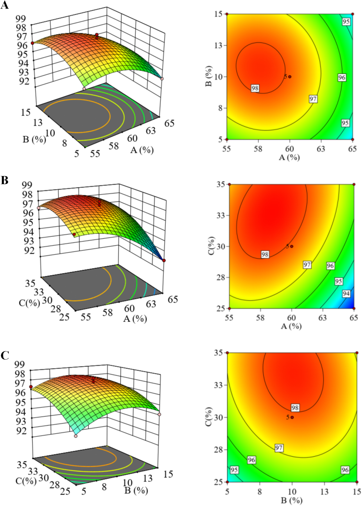
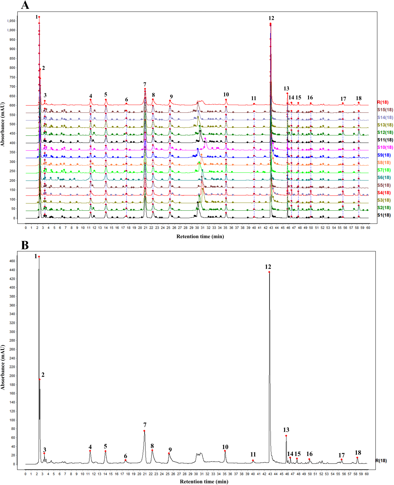
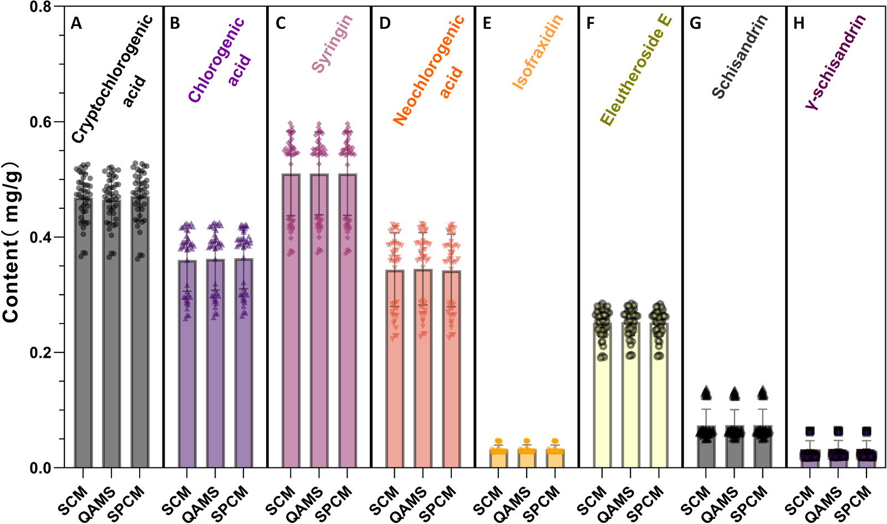
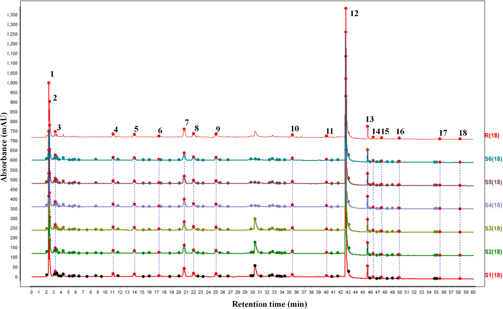
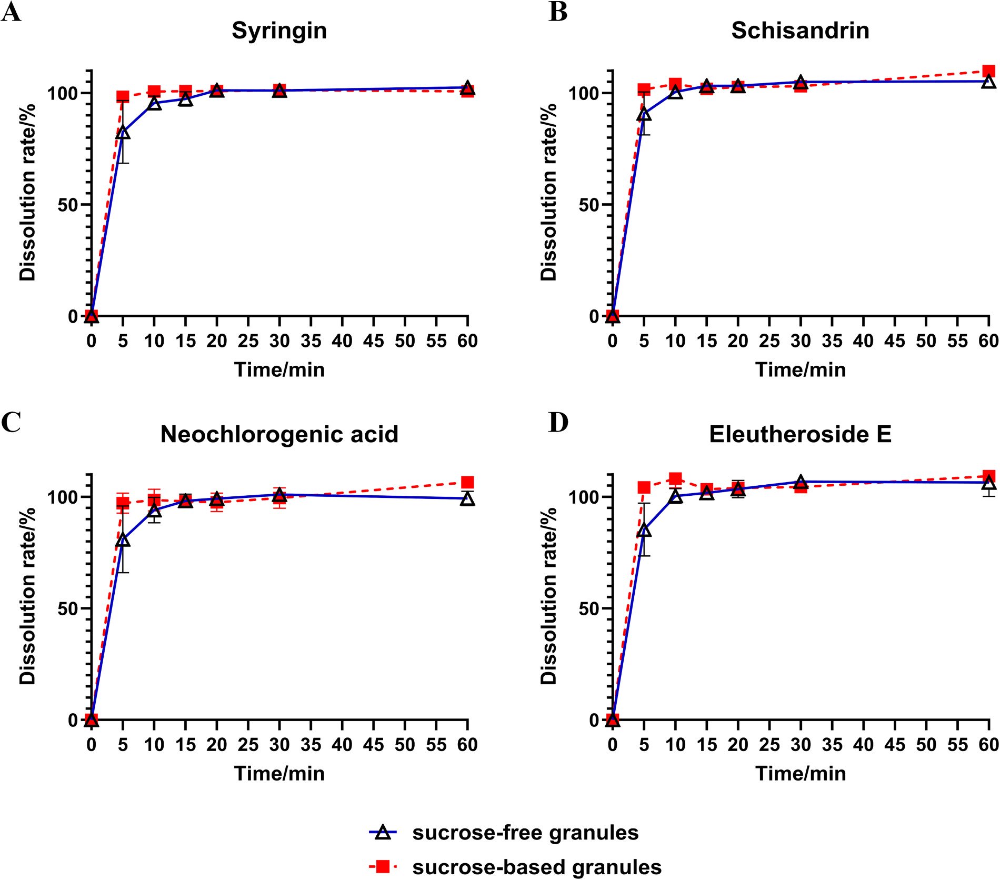

<!-- 方針: ほぼ全訳＋必要に応じた補足。原文構成に沿って訳出。「> 補足:」は訳者注。 -->

## 書誌情報

- 原題: A holistic strategy for the preparation and quality control of sugar-free Fufang Ciwujia granules: Comprehensive quality evaluation through fingerprint and QAMS
- 著者: Zhiyu Zhan, Zexuan Chen, Xueyee Lim, Zihan Ding, Zhongli Li, Mingsong Fan, Tong Zhang, Ling Li（上海中医薬大学薬学院 ほか, 中国。Zhan・Chenは共同筆頭）
- 掲載: *Journal of Pharmaceutical and Biomedical Analysis* 277 (2026) 117491. https://doi.org/10.1016/j.jpba.2026.117491
- インパクトファクター: **3.6**（*J. Pharm. Biomed. Anal.*, JCR 2024 / Clarivate）
- 受理経過: 2026年オンライン公開（*J. Pharm. Biomed. Anal.* 277巻）

> 補足: FCG = 復方刺五加顆粒（Fufang Ciwujia granule）。構成生薬は刺五加(Acanthopanax/Eleutherococcus senticosus, AS)と五味子(Schisandra chinensis, SC)。QAMS = 一標準多成分定量法。AHP = 階層分析法、RSM = 応答曲面法。本論文は製剤設計＋品質評価の研究論文。

## 要旨（Abstract）

復方刺五加顆粒(FCG)は不眠・多夢に有効な生薬エキス製剤だが、ショ糖含量が高く糖質制限者には使いにくい。さらに単一マーカー成分に依存する品質管理(QC)は多成分性を十分反映できない。本研究は糖質制御が必要な集団向けの **無糖FCG製剤** を開発し、原製剤との品質同等性を担保する包括的QC戦略を確立した。**AHP-エントロピー重み法＋Box-Behnken応答曲面法(RSM)** で造粒工程を最適化し、最適な複合賦形剤系(可溶性デンプン・デキストリン・マルトデキストリン)と湿潤剤として10%エタノールを特定。パイロットスケールで優れた成形性(**>96%**)を実証。HPLC指紋法とQAMSを確立し、無糖品と原(ショ糖)製剤の比較で **指紋類似度>0.98、8マーカー成分の含量差RSD<4%、溶出プロファイル同等(f2>50)** を確認。製剤から総合品質評価までの枠組みを提供する。

## 1. 序論（Introduction）

不眠症は世界的に広く見られる健康問題で、中国では有病率29.2%とされる[1]。複方刺五加顆粒（FCG）は抗疲労作用と睡眠改善作用を併せ持つ点で治療上の利点を持つ。FCG中、刺五加（*Acanthopanax senticosus*, AS）が君薬として補気・健脾・強腎壮骨に働き、五味子（*Schisandra chinensis*, SC）が臣薬として主に収斂・安神・鎮静に働く。催眠薬や単一成分の鎮静製剤とは対照的に、FCGは抗疲労と睡眠改善の複合的効果を提供し、慢性疲労関連の不眠に明確な臨床的価値と市場性を持つ。

しかし現在市販されているFCGは、ASとSCのエキスをショ糖のみを賦形剤として湿式造粒で固化しており、3つの大きな欠点がある。第一に、ショ糖は血糖の顕著な変動を招くため、糖尿病（妊娠糖尿病を含む）・体重管理を要する者・ケトジェニック食の個人には不適である[2]。第二に、イソフラキシジンの定量のみに依存する現行のQC規格は、この生薬複方の多成分性を反映するには不十分である。

TCM顆粒の成形品質の多指標評価には、AHP-エントロピー重み法が主観的経験と客観的データパターンを統合する。AHP（階層分析法）は各指標の重要性に対する専門家判断を定量化し、エントロピー重み法は測定データの分散に基づいて重みを割り当て、品質評価における各指標の識別能を客観的に反映する。この組み合わせは専門的方向性を保ちつつ、スクリーニング結果の科学的妥当性と信頼性を高め、顆粒処方の多次元的最適化に適する。

ASの睡眠改善・抗疲労・抗炎症・抗ストレス・免疫増強活性は、エレウテロシドE・シリンギン・イソフラキシジン・クロロゲン酸・クリプトクロロゲン酸などの特定成分と関連づけられている[3–5]。同時にSCは中枢神経系の調節や心血管機能の改善など様々な薬理作用を持ち、シザンドリン（schisandrin）とγ-シザンドリンが有意な睡眠改善効果を示す[6–8]。この多成分プロファイルを踏まえると、単一成分のみを定量するQC法は不十分である。このギャップを埋めるため、HPLC指紋と一標準多成分定量法（QAMS）を組み合わせ、8つの主要成分を同時定量する堅牢なQC戦略を確立した。QAMSは生薬中の成分含量間の相関を利用する迅速で環境配慮型の手法で、入手容易・低コストのマーカー化合物を選んで他成分を定量する[9]。QAMSと指紋分析の統合は高い実用的価値と操作性を持つ[10,11]。この方法論は製剤間の品質一貫性を体系的に評価し、より高く関連性の高い品質規格を確立して、活性物質基盤の一貫した信頼性を最終的に保証する。

本研究は、成形性・安定性・嗜好性・化学プロファイルなどの主要属性で原製剤に匹敵する無糖版FCGの開発を目的とした。HPLC指紋とQAMSを組み合わせた堅牢なQC戦略により、2つの製剤間で物質基盤と溶出性能の一貫性を確認した。本研究は生薬エキスの無糖造粒に伴う製造上の課題を解決し、処方設計からQCまでを貫く統合的解決策を確立して、類似製剤の開発に革新的で堅牢な技術的道筋を提供する。

## 2. 材料と方法（Materials and Methods）

### 2.1 化学品・材料

刺五加エキスと五味子流エキスは黒竜江泉楽製薬から購入。可溶性デンプンは西安天正、マルトデキストリン・デキストリンは西安金翔（いずれも医薬品グレード）。クリプトクロロゲン酸・クロロゲン酸・シリンギン・ネオクロロゲン酸・イソピンピネリン・アカントシドE（エレウテロシドE）・シザンドロールA・シザンドリンB・シザンテリンA・シザンドロールB・シザンドリンAは上海源葉、プロトカテク酸アルデヒド・プロトカテク酸は上海宏勇から購入。AR級エタノール・リン酸・メタノールは国薬集団。標準品純度はすべて>98%。アスパルテーム・ステビオール配糖体は湖南爾康、サイクラミン酸ナトリウムは湖南華日、食用エタノールは河南漢永、HPLC級アセトニトリルはMerck KGaA。

### 2.2 機器・条件

分離はAgilent 1200 SeriesにAgilent Eclipse XDB-C18カラム（250 × 4.6 mm, 5 μm）で実施。移動相はA＝0.1%リン酸水、B＝アセトニトリルの勾配：0–25 min（95%A）／25–26 min（95→89%A）／26–35 min（89→85%A）／35–39 min（85→83%A）／39–40 min（83→35%A）／40–60 min（35→18%A）。流速1.0 mL/min、カラム温度25℃、検出波長 **220 nm**、注入量20 µL。

### 2.3 AHP-エントロピー重み法による総合スコアリング

顆粒の成形性率・溶出率・吸湿性・安息角を中国薬局方（2020年版）の方法で測定。専門家判断に基づきこれら4つの重要指標をAHP（1–9尺度法）で優先順位付けし、重要度順は **成形性率 > 安息角 > 溶出率 > 吸湿性** となった。SPSSPROソフトで対比較判定行列を構築して各指標の主観重み（W₁）を導出（表1）。Box-Behnken応答曲面実験で得た4指標の結果からエントロピー重み法で客観重み（W₂）を算出し、統合重み付け式（式1）でW₁とW₂を統合して総合重み（W₃）を導いた：W₃ = W₁W₂ / Σ(W₁W₂)。

**表1. 評価指標の対比較判定行列**

| 指標 | 成形性率 | 溶出率 | 吸湿性 | 安息角 |
|---|---|---|---|---|
| 成形性率 | 1 | 2 | 10 | 2 |
| 溶出率 | 0.5 | 1 | 5 | 1 |
| 吸湿性 | 0.1 | 0.2 | 1 | 0.5 |
| 安息角 | 0.5 | 1 | 2 | 1 |

### 2.4 Box-Behnken応答曲面法（RSM）による造粒工程の最適化

造粒工程をBox-Behnken計画で最適化。デキストリン量（A）・エタノール濃度（B）・エタノール量（C）を因子、総合スコアを応答とした。Design-Expert 13でデータ解析・モデル構築を行い、残差の正規確率プロットや残差対予測値・予測値対実測値プロットなどでモデル妥当性を評価した。次に最適パラメータを適用して15バッチの無糖顆粒（異なるバッチのAPIを使用）を調製し、参照クロマト指紋を含むQC基準を確立。工程をスケールアップして3パイロットバッチを製造した。加えて、比較品質研究のため従来法で3バッチのショ糖顆粒を調製した。

### 2.5 試料溶液の調製

**試験溶液**: FCG約1.0 gを正確に秤量し、50%メタノール25 mLを正確に加えて密封・秤量後、30分超音波抽出。室温冷却後に再秤量し、重量損失を50%メタノールで補償、振とう・濾過して試験溶液とした。**標準溶液**: 各標準品を精秤して適切な溶媒に溶解——クリプトクロロゲン酸1.44・クロロゲン酸0.84・シリンギン1.12・ネオクロロゲン酸1.35・イソフラキシジン1.27・エレウテロシドE1.23・シザンドリン0.85 mg/mL（50%メタノール）、γ-シザンドリン0.97 mg/mL（メタノール）。これら8つのストックを適量混合・希釈して6濃度の混合標準溶液を調製（各濃度は表S1）。シザンテリンA・シザンドロールB・デオキシシザンドリン・プロトカテク酸アルデヒド・プロトカテク酸は別途メタノールに溶解した。**陰性対照**: FCG処方に従いASまたはSCを欠く顆粒を別々に調製し、試験溶液と同法で処理。**添加回収溶液**: 含量既知の顆粒約0.5 gを9分割（各添加水準3分割）し、クリプトクロロゲン酸・クロロゲン酸・ネオクロロゲン酸・シザンドリン・γ-シザンドリン・シリンギン・イソフラキシジン・エレウテロシドEの既知含量の50/100/150%相当の混合標準を添加後、試験溶液と同法で処理した。

### 2.6 方法バリデーション

ICHガイドラインに従い精度・再現性・安定性・直線性・回収率を評価した。**精度**: 日内精度はLLOQ・低・中・高濃度の試料・混合標準を6連続注入、日間精度は3日連続で混合標準を分析。標準液中の定量成分ピーク面積のRSD、試験液中の共通ピークの相対保持時間（RRT）・相対ピーク面積（RPA）を算出。**正確性**: 低・中・高濃度のQC試料を6反復で日内、3日連続で日間評価。正確性は測定濃度と公称濃度の相対誤差（RE）で算出（式2）：RE(%) = (C_測定 − C_理論)/C_理論 × 100%。**再現性**: 6つの独立試験溶液を調製・分析。**安定性**: 単一調製を0/4/8/12/16/24時間に注入。**直線性**: 6濃度の混合標準を注入し検量線を作成。**回収率**: 3水準（50/100/150%）の添加試料を各3反復で分析、式3で算出：回収率(%) = (検出量 − 原量)/添加量 × 100%。

### 2.7 参照指紋の確立と類似度解析

15バッチのFCG試験溶液を調製・注入し60分間クロマトグラムを記録。中薬クロマト指紋類似度評価システム（2012年版）でデータを処理し、試料S1を参照指紋として時間窓0.3分の多点補正でピークをマッチング、中央値法で参照指紋（R）を生成。安定性・ピーク形状の良好な共通ピークを指定し標準品との比較で同定、15バッチをRに対して類似度評価した。

### 2.8 QAMSによるマーカー成分の定量

指紋結果と文献[7,13,14]に基づき、8化合物——クリプトクロロゲン酸・クロロゲン酸・シリンギン・ネオクロロゲン酸・イソフラキシジン・エレウテロシドE・シザンドリン・γ-シザンドリン——を定量マーカーに選定。**シリンギンを内部標準（IS）** とし、他7成分のRCFを、検量線相対傾き法（原点強制・非強制の両回帰）と多点濃度法の2法で算出。後者は混合標準の各成分とISの濃度（C）・ピーク面積（A）を標準QAMS式（式4）に代入：fs/i = fs/fi = (As × Ci)/(Ai × Cs)。ここでCiは分析対象濃度、Aiは分析対象ピーク面積、Csはシリンギン濃度、Asはシリンギンピーク面積。QAMS検証のため15バッチを分析し、8マーカー含量をQAMS法と外部標準法（検量線法・単点校正法）の両方で測定、結果のRSD%で一致を評価した。

### 2.9 溶出試験

中国薬局方のパドル法で実施。溶出媒体は水500 mL、パドル回転75 rpm、37℃。所定時間（5/10/15/20/30/60分）に10 mLを採取し、採取ごとに等量の恒温済み新鮮媒体を補充。0.45 µmメンブレンで濾過して試料ストック溶液を得た。ストック5 mLを精確に採取しメタノールで10 mLに希釈・10分超音波、室温冷却・重量補償後0.45 µm濾過し、確立したクロマト条件で分析、QAMSでマーカー成分を定量。累積溶出率は式5で算出：Xn = [Cn × 500 + (C1 + … + Cn−1) × 10]/(m × M) × 100%。溶出プロファイルはGraphPad Prism 10で作図、類似度因子（f2）・差異因子（f1）はDDSolver 1.0で計算した。

## 3. 結果と考察（Results and Discussion）

### 3.1 無糖顆粒処方工程の最適化

**3.1.1 AHP-エントロピー重み法による総合重み算出**: 顆粒を4つの重要品質特性（CQA）——成形性率・溶出率・吸湿性・安息角——で評価。AHP（1–9尺度）で優先順位付けし、主観優先順位は **成形性率 > 安息角 > 溶出率 > 吸湿性**。SPSSPROで対比較行列を構築して主観重み（W₁）を導出。次にBox-Behnken実験データからエントロピー重み法で客観重み（W₂）を算出（異なる実験条件間で変動が大きい指標により高い重みを付与）。W₁とW₂を乗法合成・正規化して総合重み（W₃）を得た（表S2）。総合スコアの算出式は：総合スコア = (40.55/最大成形性率)×成形性率 + (37.14/最大溶出率)×溶出率 + (3.63×最小吸湿性)/吸湿性 + (18.68×最小安息角)/安息角。

**3.1.2 Box-Behnken RSMによる工程最適化**: 評価指標の重み付け体系を確立後、単因子実験で主要賦形剤・工程パラメータを予備スクリーニング。原則は(1)患者の血糖・インスリンに悪影響なし、(2)固有の薬理活性なし、(3)安全・無毒、(4)良好な服薬コンプライアンス。液状エキスであるため、賦形剤にはエキスを効果的に固化し造粒に適した粘度を確保する能力が求められた。単因子実験から、「握れば固まり、押せば崩れる」性状の湿潤塊を得るには複合充填剤が必要と判明。最適系は液状エキスを吸収する可溶性デンプン25%に、希釈剤としてデキストリンとマルトデキストリンを補ったもの。乾燥条件は60℃・強制対流で1–2時間、志願者の官能評価に基づき甘味料としてアスパルテーム0.2%を配合した。

これを基にBox-Behnken RSMで重要工程パラメータを精密最適化。因子はデキストリン量（A）・エタノール濃度（B）・エタノール量（C）、応答は総合スコア（因子水準は表S3、実験計画と結果は表2、分散分析は表3）。Design-Expert 13で解析し、二次多項式回帰式：Y = 97.908 − 1.19A + 0.2413B + 1.04C − 0.2175AB + 0.645AC − 0.295BC − 1.32A² − 1.22B² − 0.7677C²。分散分析（表3）はモデルが高度に有意（p<0.0001）で、工程パラメータ（A・B・C）が顆粒品質を系統的に左右することを確認。誤差項（Lack of Fit）は非有意（p>0.05）で良好な適合。因子A・C・A²・B²・C²は高度有意（p<0.01）、AC交互作用は有意（p<0.05）。因子影響順は **A > C > B**。AとC（デキストリン量とエタノール量）の交互作用が造粒工程に最大の影響、次いでBとC、A-B交互作用は最小であった（図1）。

**表2. Box-Behnken応答曲面計画と結果（抜粋）**

| No. | A(%) | B(%) | C(%) | 成形性率(%) | 溶出率(%) | 吸湿性(%) | 安息角(°) | 総合スコア |
|---|---|---|---|---|---|---|---|---|
| 2 | 60 | 5 | 35 | 93.21 | 93.94 | 9.17 | 38.505 | 97.32 |
| 8 | 60 | 10 | 30 | 94.49 | 93.88 | 9.95 | 37.424 | 98.08 |
| 9 | 60 | 10 | 30 | 94.29 | 94.19 | 9.15 | 37.383 | 98.42 |
| 5 | 65 | 10 | 25 | 81.87 | 94.49 | 9.62 | 37.331 | 93.09 |
| 16 | 55 | 10 | 35 | 94.33 | 94.73 | 10.50 | 39.414 | 97.27 |

**表3. 分散分析（ANOVA）**

| 変動要因 | 平方和 | df | 平均平方 | F値 | p値 | 有意性 |
|---|---|---|---|---|---|---|
| モデル | 40.38 | 9 | 4.49 | 32.58 | <0.0001 | 有意 |
| A-デキストリン量 | 11.26 | 1 | 11.26 | 81.75 | <0.0001 | |
| B-エタノール濃度 | 0.4656 | 1 | 0.4656 | 3.38 | 0.1085 | |
| C-エタノール量 | 8.65 | 1 | 8.65 | 62.84 | <0.0001 | |
| AC | 1.66 | 1 | 1.66 | 12.08 | 0.0103 | |
| A² | 7.28 | 1 | 7.28 | 52.90 | 0.0002 | |
| B² | 6.27 | 1 | 6.27 | 45.53 | 0.0003 | |
| C² | 2.48 | 1 | 2.48 | 18.02 | 0.0038 | |
| Lack of Fit | 0.4704 | 3 | 0.1568 | 1.27 | 0.3972 | 非有意 |

これらは、主充填剤・マトリックス形成剤であるデキストリンに明確な最適水準があることを示す。デキストリン不足はマルトデキストリンの粘着性を相殺できず凝集を招き、過剰は結合能を希釈し溶出率を損なう。第2の重要因子であるエタノール量は湿潤塊特性と造粒結果に直接影響し、不足は湿潤不足で緩い顆粒、過剰は過湿塊で凝集・篩過困難を招く。エタノール濃度は主効果が非有意で、主に湿潤剤の浸透・分布均一性に影響し、最適パラメータ枠内では個別効果が緩和された。有意なA-C交互作用は正の相関を示し、デキストリン量が多いほど吸液能が大きく、最適含水率に必要なエタノール量も比例して増える——生産時にこれらパラメータの協調制御が必要なことを裏づける。

モデルは最適パラメータをデキストリン58.37%・エタノール濃度10.32%・エタノール量32.64%（予測総合スコア98.38）と予測。実生産に適応した最終処方は **可溶性デンプン25%・デキストリン60%・マルトデキストリン10%** を充填剤とし、10%エタノール溶液を30%量。3バッチ検証（表S4）で成形性率93.45%・溶出率94.62%・安息角38.91°・吸湿性10.42%と予測とよく一致し、優れた工程再現性を確認した。本研究は「エキスの固形分が低く賦形剤比が高い」という無糖造粒の核心課題を、吸収と成形の機能を兼ねる新規複合充填剤系（可溶性デンプンがエキスを固化、マルトデキストリン・デキストリンが固有の結合能を付与）で追加結合剤なしに高成形性・良好な流動性を実現して解決した。

**3.1.3 パイロットスケール検証と処方評価**: RSMの最適結果に基づき3パイロットバッチの無糖FCGを調製。成形性率96.30/97.00/96.66%、溶出率92.23/92.53/91.40%、吸湿性8.59/8.76/8.42%、安息角41.52/40.96/41.17°で、すべて規格適合かつ実験室スケールと一致し、大規模生産の実現可能性を示した。パイロット装置は実験室装置より高い剪断力・混合強度・乾燥効率を生じ、成形性向上・吸湿性低下をもたらす。賦形剤比・湿潤剤の選択が顆粒性能を決定づける一方、装置種類・操作条件も相当の影響を及ぼす。比較のため従来法で3バッチのショ糖顆粒も調製し、無糖版と原ショ糖版の一貫性を評価するためHPLC指紋＋QAMS＋溶出比較の包括的品質評価を実施した。

### 3.2 HPLC指紋法と参照指紋の確立

多成分製剤の全体的化学プロファイルを特性化することで、製剤の安定性・一貫性を系統評価した[17]。方法バリデーションで指紋の信頼性を確認：精度試験では全共通ピーク（参照ピークのシリンギンを除く）のRRT・RPAのRSDがそれぞれ0.09–0.39%・0.06–2.73%、安定性試験（0–24時間）では0.10–0.60%・0.75–4.90%、再現性試験では0.09–0.53%・0.17–2.63%と、いずれも5.0%未満で高い精度・安定性を示した（表S5）。15バッチのFCGの解析から、安定で分離良好な **18の共通ピーク** を指定（図2）。標準品比較で13ピークを同定：ピーク4（プロトカテク酸）・5（ネオクロロゲン酸）・6（プロトカテク酸アルデヒド）・7（シリンギン）・8（クロロゲン酸）・9（クリプトクロロゲン酸）・10（エレウテロシドE）・11（イソフラキシジン）・13（シザンドリン）・14（シザンドロールB）・16（シザンテリンA）・17（デオキシシザンドリン）・18（γ-シザンドリン）。ピーク4–11はAS由来、13–18はSC由来。ピーク面積が大きく保持時間が適切なピーク7（シリンギン）を参照ピーク（S）に選定。15バッチの類似度はいずれも0.96超（0.965–0.988、表S6）で高いバッチ間一貫性を示し、製造工程の安定性・再現性を確認した。平均保持時間30.544分のピークは甘味料アスパルテームに帰属し、活性成分でないため共通ピークから除外した。

### 3.3 QAMS定量法の確立

指紋からプロトカテク酸・ネオクロロゲン酸など13成分を同定。うちAS由来の配糖体（シリンギン・エレウテロシドE）とフェニルプロパノイド（クロロゲン酸・ネオクロロゲン酸）は抗疲労活性に[18,19]、SC由来のリグナン（シザンドロールB・シザンドリン）は睡眠改善・鎮静催眠効果に寄与する[20]。これらの存在と薬理的関連性から、8成分（クリプトクロロゲン酸・クロロゲン酸・シリンギン・ネオクロロゲン酸・イソフラキシジン・エレウテロシドE・シザンドリン・γ-シザンドリン）を定量に選定した。

**3.3.1 方法バリデーション**: 直線性・精度・正確性・再現性・安定性・回収率を検証（表S7-S8）。8分析種すべてが各濃度範囲で優れた直線性（相関係数r>0.9997）。再現性はRSD<1.68%、安定性は24時間内でRSD<2.86%、精度は高・中・低濃度標準液でRSD<0.60%、回収率は許容範囲内でRSD<2.6%と、高い正確性を確認。

**3.3.2 RCFの決定**: RCFはQAMSの基本パラメータで、単一標準品で複数分析種を定量可能にする。同一クロマト条件下で3フェノール酸・2配糖体・2リグナン・1クマリンを同時定量するQAMS法を確立。含量が高く品質マーカーとして常用されるシリンギンをISに選定し、他7成分のRCFを検量線相対傾き法（原点強制・非強制）と多点濃度法で算出。異なる算出法によるRCFの変動は小さく（RSD<1%、表4）、RCFが安定・信頼できる定数であることを確認。この高い一致は、これら成分が指定検出条件下で類似の吸収特性（共通の核構造モチーフに起因する予測可能なUV応答）を持つことを示唆する。さらに堅牢性・移転可能性を評価するため、3種のC18カラム（Agilent Eclipse XDB・Dikma Diamonsil Plus・Pntulips RSZG、いずれも4.6 × 250 mm, 5 μm）と2台のHPLC（Agilent 1200・1260 Infinity II）を組み合わせた6条件でRCFを測定（表S9）。QAMS法が異なるカラム化学・機器プラットフォーム間で堅牢・移転可能で、様々な実験室での日常QCに適することを示した。RCFの大きさは成分とIS（シリンギン）の検出器応答効率の差を直接反映し、RCF>1は220 nmでのモル吸光係数がシリンギンより低く同等ピーク面積に高濃度を要することを意味する。確立したRCFは方法移管時の系統的偏差検出のベンチマークにもなり、参照値からの系統的偏移は不適合を示し新ベンチマークの確立を要する[21]。

**表4. 各成分のRCF**

| 成分 | RCF(非強制回帰) | RCF(原点強制) | RCF(多点濃度法) | 平均RCF | RSD(%) |
|---|---|---|---|---|---|
| クリプトクロロゲン酸 | 2.452 | 2.446 | 2.423 | 2.441 | 0.62 |
| クロロゲン酸 | 2.329 | 2.332 | 2.350 | 2.337 | 0.48 |
| シリンギン | 1.000 | 1.000 | 1.000 | 1.000 | 0.00 |
| ネオクロロゲン酸 | 2.299 | 2.295 | 2.293 | 2.295 | 0.13 |
| イソフラキシジン | 0.961 | 0.960 | 0.950 | 0.957 | 0.63 |
| エレウテロシドE | 2.474 | 2.471 | 2.456 | 2.467 | 0.39 |
| シザンドリン | 0.761 | 0.760 | 0.753 | 0.758 | 0.59 |
| γ-シザンドリン | 0.749 | 0.750 | 0.750 | 0.749 | 0.05 |

**3.3.3 多バッチ検証と応用**: 異なる原料バッチの顆粒へのQAMSの適用性を検証するため15バッチの無糖顆粒を分析。8成分の定量含量はQAMS法と外部標準法（検量線法SCM・単点校正法SPCM）で有意差なく、各成分のRSD<3%（表S10）。相対補正係数を用いた含量計算が、特定標準品が入手困難な場合でも正確・信頼でき費用対効果が高いことを確認。無糖FCGはフェノール酸（クリプトクロロゲン酸・クロロゲン酸・ネオクロロゲン酸）と配糖体（エレウテロシドE・シリンギン）の含量が高く、AS由来成分の総含量がSC由来より有意に高かった（図3）——ASを君薬とする処方原則と合致。AS由来ではシリンギン、SC由来ではシザンドリンが最も豊富。15バッチ間で原料品質の差により絶対含量は変動したが、核心成分の階層的順序はバッチ間で高度に一貫し、顆粒の全体的化学組成枠組みが比較的安定であることを示した。

### 3.4 無糖顆粒と含糖顆粒の品質一貫性評価

無糖顆粒が原ショ糖製剤の臨床的に等価な代替となりうるかを保証するため、化学プロファイル・主要成分含量・溶出挙動の3つの重要次元で包括的一貫性評価を実施した[22]。

**3.4.1 無糖・含糖顆粒の指紋比較解析**: 3.2の指紋法に従い、3パイロットバッチの無糖顆粒と従来法の3バッチのショ糖顆粒を分析（60分クロマトグラム、図4）。類似度評価で全指紋が0.98超の高い類似度（表S11）を示し、両製剤の主要化学成分が本質的に一致——製造工程の変更が主要成分の種類・相対比を有意に変えないことを確認。したがって薬効を担う化学物質基盤が不変で、化学的観点から無糖顆粒が原製剤と等価な治療効果を持つはずと推論できる。

**3.4.2 主要成分含量の比較**: 検証済みQAMS法で両顆粒の3パイロットバッチを定量（表5）。まずイソフラキシジン含量は両製剤とも規格（≥0.2 mg/袋）を満たし、無糖0.242・含糖0.231 mg/袋。次に無糖処方の主要成分含量の階層順（クリプトクロロゲン酸≈クロロゲン酸 > シリンギン > ネオクロロゲン酸 > エレウテロシドE > シザンドリン > イソフラキシジン > γ-シザンドリン）は3.3.3の実験室スケールと高度に一致。AS由来フェノール酸・配糖体が優勢でSC由来はシザンドリンが主という順序は、パイロットバッチ内の優れた均質性を示し、スケールアップ後の核心化学プロファイルの再現が工程の安定性・工業生産の実現可能性を裏づけた。同一APIから製造した各製剤3バッチの比較で、全6バッチの8成分含量のRSDは2.47–3.86%（すべて5%未満）——無糖・含糖間で主要成分含量に有意差なく、賦形剤・工程変更が主要活性成分含量に顕著な影響を与えないことを示した。

**表5. パイロット無糖顆粒の1袋あたり主要成分含量（mg/袋）**

| 成分 | クリプトクロロゲン酸 | クロロゲン酸 | シリンギン | ネオクロロゲン酸 | イソフラキシジン | エレウテロシドE | シザンドリン | γ-シザンドリン |
|---|---|---|---|---|---|---|---|---|
| 無糖 | 1.544 | 1.647 | 1.485 | 1.282 | 0.242 | 0.981 | 0.623 | 0.024 |
| 含糖 | 1.465 | 1.615 | 1.388 | 1.227 | 0.231 | 0.924 | 0.598 | 0.023 |
| RSD(%) | 3.81 | 2.69 | 3.86 | 3.47 | 2.83 | 3.59 | 2.47 | 2.66 |

**3.4.3 溶出プロファイルの比較**: 溶出試験の希釈効果によりイソフラキシジンとγ-シザンドリンは検出限界未満、クロロゲン酸・ネオクロロゲン酸は位置異性体で熱・光に不安定なため37℃の長時間試験で分解・変換しうる[28]。そこで濃度が高く代表的な4成分——シリンギン・ネオクロロゲン酸・エレウテロシドE・シザンドリン——をマーカーに選定。無糖・含糖顆粒の溶出プロファイルのf1・f2は：シリンギン（f1=4.50・f2=99.96）・ネオクロロゲン酸（f1=5.49・f2=99.95）・エレウテロシドE（f1=5.64・f2=99.93）・シザンドリン（f1=3.74・f2=99.98）で、いずれもf1<15・f2>50。両顆粒の溶出挙動が等価で、処方変更後もFCGの溶出挙動に有意な変化がないことを示した（図5）。標的成分はすべて強親水性化合物で、生理的pH範囲で溶解度にpH依存性がなく水中でより安定な検出結果が得られた。中国薬局方でも水は水溶性薬物を含む固形製剤の推奨溶出媒体の一つで、処方スクリーニング・品質一貫性評価に特に適する。原処方ではショ糖が甘味料と可溶性マトリックス形成剤を兼ね迅速な崩壊・溶出を可能にしていたが、本研究の複合充填剤系（可溶性デンプン・デキストリン・マルトデキストリン）が即時湿潤・迅速崩壊を確保してこの機能を再現し、ショ糖製剤の溶出挙動を模倣した。この複雑な溶出媒体でのQAMSの成功はQC解析への信頼性を裏づける。高い類似度因子は等価な溶出プロファイルを強く示唆し、賦形剤変更がin vitro放出挙動を変えないことを実証[29]——無糖製剤の生物学的等価性の可能性を支持する重要な証拠となる。

## 4. 結論（Conclusion）

本研究は無糖代替品の開発と包括的品質管理戦略の確立により、従来のFCGの臨床的・品質的限界を解決した。AHP-エントロピー重み法とBox-Behnken RSMの統合で安定・実現可能な造粒工程を最適化し、ショ糖なしで生薬エキスを固化する課題を効果的に解決。HPLC指紋（定性プロファイリング）とQAMS（多成分定量）を組み合わせた包括的QC体系を構築し、指紋法は18共通ピークを同定（うち13を化学的に特性化）して製剤の物質基盤を包括的に反映する参照プロファイルを確立、QAMS法は8マーカー成分の同時定量を可能にして原規格の単一成分管理の限界を克服した。これら戦略による系統的評価で、賦形剤・工程変更が化学プロファイル・主要成分含量・in vitro溶出挙動を含む重要品質特性を有意に変えないことを実証。本研究は処方設計から包括的品質評価までの完全な技術的枠組み（工程最適化・スケールアップ検証・多次元品質一貫性評価）を提示し、固形分の低いエキスから無糖TCM顆粒を開発する一貫した方法論を示した。全体的化学指紋から主要成分の定量分析へ進む多層QC戦略により、無糖FCGの生産の科学的基盤を提供するとともに、類似TCM製剤の開発・品質向上に革新的で移転可能な道筋を提供する。

> 補足（実務的示唆）: 本研究は「①無糖化(製剤学的課題＝賦形剤設計をRSMで最適化) × ②多成分QC(単一イソフラキシジン規格→8成分の指紋＋QAMS)」を一気通貫で示した点が特徴。実務的には、処方変更(無糖化)の同等性評価に **指紋類似度・主要成分含量(QAMS)・溶出f2** の3点セットを使う設計が参考になる。シリンギンを内部標準とするQAMSで標準品コストを抑えつつ8成分を同時把握でき、現行の単一マーカー規格より頑健。前掲の滋腎育胎丸・脈絡疏通丸のQAMS論文と同じ「単一マーカー規格→多成分QC」の流れを、製剤の無糖化（処方変更の同等性評価）にまで広げた例。

## 参考文献

1. Y.H. Zhao, X. Luo, Research progress on epidemiology and pathogenesis of insomnia, Chin. J. Clin. 51 (2023) 1397–1401.

2. C.´A. Rosales-G´omez, B.E. Martínez-Carrillo, A.L. Guadarrama-L´opez, A. A. Res´endiz-Albor, I.M. Arciniega-Martínez, E. Aguilar-Rodríguez, Impact of sucrose consumption on the metabolic, immune, and redox profile of mice with gestational diabetes mellitus, Life (Basel) 15 (2025).

3. Y. Yan, X.H. Li, X. Wang, C. Fang, X.H. Wu, Analysis of main chemical components of Ciwujia Injection based on UPLC-MS and study on its anti-depression effect, Drug Eval. Res. 45 (2022) 1332–1342.

4. X. Cui, W. Wang, L. Yang, B. Nie, Q. Liu, X. Li, D. Duan, Acanthopanax senticosus saponins prevent cognitive decline in rats with alzheimer's disease, Int. J. Mol. Sci. 26 (2025).

5. M.B. Majnooni, S. Fakhri, Y. Shokoohinia, M. Mojarrab, S. Kazemi-Afrakoti, M. H. Farzaei, Isofraxidin: synthesis, biosynthesis, isolation, pharmacokinetic and pharmacological properties, Molecules 25 (2020).

6. Y.C. Zhang, M.Y. Wang, H.Q. Lin, X.Y. Zhang, C.M. Wang, J.H. Sun, H. Li, J. G. Chen, J.L. Liu, Hypnotic effect of schisandra lignans on chlorophenylalanineinduced insomnia in rats, Chin. J. Gerontol. 40 (2020) 861–863.

7. J.W. Wang, F.Y. Liang, X.S. Ouyang, P.B. Li, Z. Pei, W.W. Su, Evaluation of neuroactive effects of ethanol extract of Schisandra chinensis, Schisandrin, and Schisandrin B and determination of underlying mechanisms by zebrafish behavioral profiling, Chin. J. Nat. Med. 16 (2018) 916–925.

8. W. Zhang, Z. Sun, F. Meng, Schisandrin B ameliorates myocardial ischemia/ reperfusion injury through attenuation of endoplasmic reticulum stress-induced apoptosis, Inflammation 40 (2017) 1903–1911.

9. G.Z. Jiang, Z.Y. Ma, H.D. Hou, J. Zhou, F. Long, J.D. Xu, S.S. Zhou, H. Shen, Q. Mao, S.L. Li, C.Y. Wu, Gastrointestinal motility modulation efficacy-related chemical marker findings and QAMS-based quality control of Agastache rugosa, J. Pharm. Biomed. Anal. 256 (2025) 116680.

10. L. Zhao, X. Sun, H. Yan, G. Sun, Comprehensive quality assessment of Xiaoer Chiqiao Qingre granules by fingerprinting technology combined with multicomponent quantitative methods, J. Chromatogr. A 1757 (2025) 466140.

11. B. Zhu, D. Hu, J. Zhao, S. Li, Rapid identification and quantification of Pseudostellaria heterophylla with its adulterants by HPLC-CAD fingerprint combined with improved quantitative analysis of multi-components by single marker (QAMS), J. Pharm. Biomed. Anal. 247 (2024) 116205.

12. Q. You, Y. Ren, J. Li, G. Zeng, X. Luo, C. Zheng, Z. Tang, Ultrasound-Assisted enzymatic extraction of the active components from Acanthopanax sessiliflorus stem and bioactivity comparison with Acanthopanax senticosus, Molecules 30 (2025) 397.

13. K. Lau, G.G. Yue, Y. Chan, H. Kwok, S. Gao, C. Wong, C.B. Lau, A review on the immunomodulatory activity of acanthopanax senticosus and its active components, Chin. Med. 14 (2019) 25.

14. D. Ehambarampillai, M.L.Y. Wan, A comprehensive review of Schisandra chinensis lignans: pharmacokinetics, pharmacological mechanisms, and future prospects in disease prevention and treatment, Chin. Med. 20 (2025) 47.

15. L.J. Cui, H. Yi, Z. Wu, C. Li, H.M. Gao, X.Q. Liu, Z.M. Wang, Comparison on the in vitro dissolution between generic and original drugs of Ginkgo Folium tablets, Mod. Chin. Med. 27 (2025) 1347–1353.

16. W.J. Moore, H.H. Flanner, Mathematical comparison of dissolution profiles, Pharm. Technol. 20 (1996) 64–74.

17. L. Chen, Z. Zhang, M. Cai, G. Sun, Comprehensive quality assessment of huricha liuwei pill using five-wavelength fusion fingerprints and spectral quantum fingerprints combined with antioxidant analysis, Spectrochim. Acta Part A. 341 (2025) 126418.

18. F. Wu, L.F. An, J.W. Huang, S.H. Ge, X.H. Su, S.S. Dai, Q.W. Li, Research progress on the chemical compositions and pharmacological effects of Ciwujia (Acanthopanacis Senticosi Radix Et Rhizoma Seu Caulis), guiding, J. Tradit. Chin. Med. Pharm. 31 (2025) 107–111.

19. Y. Gao, Evaluation of the anti-fatigue efficacy of chlorogenic acid and its mechanism of action, China Food Addit. 34 (2023) 154–161.

20. S.B. Sun, B.Y. Zhou, Z.J. Sui, L. Sun, J.Y. Zhang, L.Y. Meng, F. Gao, Research review on improving sleep function of Schisandrae Chinensis Fructus, Acanthopanax Senticosus and Semen Ziziphi Spinosae, Med. Diet. Health 19 (2021) 196–198.

21. M. Zhang, F. Wang, H.J. Liu, Y. Shi, W.B. Zhang, Application of quantitative analysis of multi-components by single-marker (QAMS) in quality control of traditional Chinese medicine, Chin. J. Ethnomed. Ethnopharm 30 (2021) 51–55.

22. G.X. Sun, W.Y. Sun, H. Yan, J. Zhang, Z.F. Hou, L.L. Lan, Q.N. Gao, D.J. Pu, Z. H. Chen, L.L. Mu, Constructing traditional Chinese medicine standard system for overall quality control and quality consistency evaluation of Chinese medicine, Cent. South Pharm. 17 (2019) 321–331.

23. J. Shi, Z.Y. Xu, Common problems analyses in the quality control and in vitro evaluation on consistency evaluation of oral solid dosage forms, Chin. N. Drugs J. 28 (2019) 2473–2477.

24. Y. Hu, D. Zhao, L. Zhong, J.G. Zheng, D. Zhang, E. Wu, Q. Shi, L. Qiao, L. Lin, Integrated multi-omics analysis reveals metabolic reprogramming as a key driver of angiotensin II-induced vascular remodeling, View 7 (2025) 20250146.

25. W. Liu, X. Hu, Z. Bao, Y. Li, J. Zhang, S. Yang, Y. Huang, R. Wang, J. Wu, X. Xu, Q. Sang, W. Di, H. Lu, X. Yin, K. Qian, Serum metabolic fingerprints encode functional biomarkers for ovarian cancer diagnosis: a large-scale cohort study, EBioMedicine 115 (2025) 105706.

26. B. Li, J. Liu, Z. Chen, Z. Sun, J. Ye, F. Liu, Surface-enhanced Raman scattering spatial fingerprinting decodes the digestion behavior of lysosomes in live single cells, View 5 (2024) 20240004.

27. F. Teng, J. Zhang, Y. Huang, W. Xu, W. Liu, L. Sun, M. Yan, J. Wu, R. Wang, S. Yang, L. Huang, Z. Gu, H. Su, X. Xu, D. Liang, N. Ren, C. Ding, Y. Li, Q. Dong, L. Guo, S. Liu, X. Wang, K. Qian, Metabolic fingerprinting enables rapid, label-free histopathology in gastric cancer diagnosis and prognostic prediction, Cell Rep. Med. 6 (2025) 102238.

28. T. Aree, Atomic-level understanding on conformational flexibility of neochlorogenic and chlorogenic acids and their inclusion complexation with β-cyclodextrin, Food Hydrocoll. 141 (2023) 108742.

29. W. Liu, L.X. Tu, S.L. Yang, Y. Jin, Research progress of in vitro and in vivo correlation evaluation method for generic oral solid preparations, Drug Eval. Res. 43 (2020) 2565–2570. Z. Zhan et al. Journal of Pharmaceutical and Biomedical Analysis 277 (2026) 117491 12

