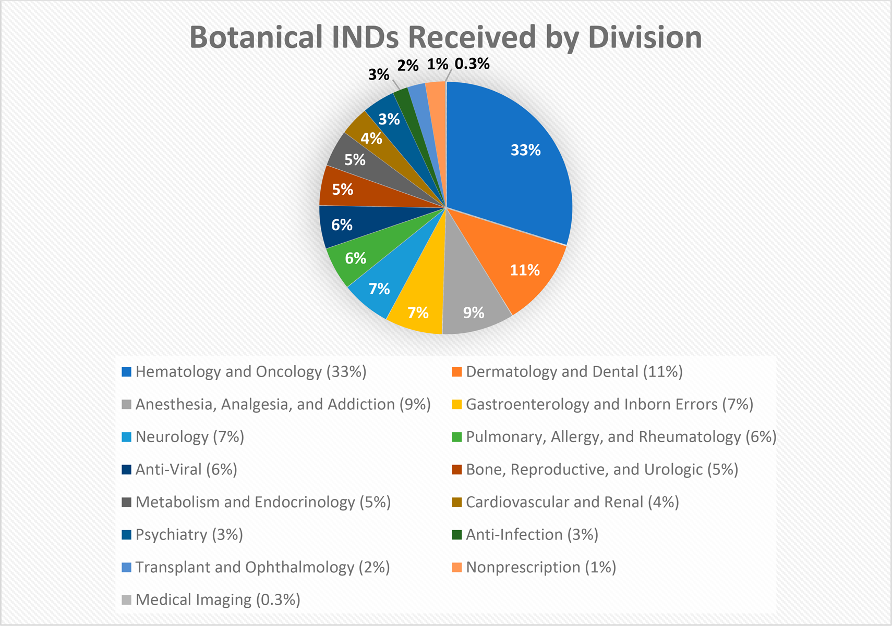
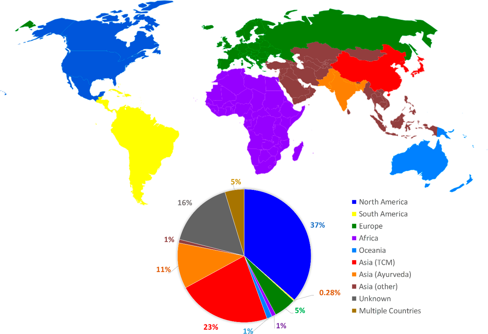

<!--
方針: 「ほぼ全訳＋必要に応じた補足」。原文の構成・節立てに沿って忠実に訳す。
原文PDFは2段組みレイアウトで、テキスト抽出時に段組みが乱れ、文が入れ替わって
抽出される箇所が多数あった。訳文では原文の意味が通るよう文を並べ直しているが、
数値・条件・結果はすべて原文から採取し、削除・創作は行っていない。
節見出しの一部（特に大見出し）はPDF抽出時の乱れが激しく、正確な原文の語順を
完全には復元できなかった箇所がある。その場合は内容に忠実な見出しを付し、
「> 補足:」で断っている。
-->

## 書誌情報

- 標題（原題）: Scientific and Regulatory Approach to Botanical Drug Development: A U.S. FDA Perspective
- 著者・所属: Charles Wu*, Su-Lin Lee, Cassandra Taylor, Jing Li, Yen-Ming Chan（以上、Botanical Review Team／Science Staff, Immediate Office, Office of Pharmaceutical Quality, Center for Drug Evaluation and Research, FDA）、Rajiv Agarwal（New Drug Products Branch II, Division of New Drug Products I, Office of New Drug Products, Office of Pharmaceutical Quality, CDER, FDA）、Robert Temple, Douglas Throckmorton（Office of the Center Director, CDER, FDA）、Katherine Tyner（Science Staff, Immediate Office, Office of Pharmaceutical Quality, CDER, FDA）。全員 米国食品医薬品局（FDA）、Silver Spring, Maryland。
- 掲載誌・巻号・DOI: *Journal of Natural Products* 2020, 83, 552–562（Review）. https://doi.org/10.1021/acs.jnatprod.9b00949
- インパクトファクター: **3.68**（*Journal of Natural Products*, JCR 2024 / Clarivate。ウェブ検索により確認。なお同誌のIFは2022年5.18、2023年5.1と近年高水準だったが2024年に3.68へ低下している）
- 受理経過 / ライセンス: 受領 2019-10-01 / 公開 2020-01-24。著者は米国政府（FDA）職員であり、本論文は米国著作権の対象外（"This article not subject to U.S. Copyright"）として2020年にAmerican Chemical Societyから公表された。

> 補足: 本稿は分析化学的なQC手法論文ではなく、**FDAのボタニカル医薬品審査チーム（Botanical Review Team, BRT）自身**が、自らの審査経験・統計データをもとに執筆した規制レビュー。「ボタニカル医薬品（botanical drug）」とは、生薬（植物由来物質）またはその加工物（刻み・粉末・エキス等）を有効成分とする医薬品を指すFDA上の分類であり、漢方・アーユルヴェーダ・西洋ハーブなど文化圏を問わず該当しうる。当サイトの他の規制レビュー（EU・米・加・日比較、5薬局方比較、桑枝アルカロイドの規制対応事例）とは異なり、本稿は**米国のIND（治験薬）／NDA（新薬承認申請）という単一の規制経路そのもの**を、実際の申請統計とともに詳述する点に特色がある。

## 要旨（Abstract）

米国FDAは、2018年以前の年月において、800件を超えるボタニカル治験薬申請（IND）および治験前相談（pre-IND、PIND）を受理してきた。現在のデータでは、提出されたINDの適応症はFDAのほぼすべての審査部門（review division）にまたがっている。ボタニカル混合物を医薬品として研究する世界的な関心が高まっているにもかかわらず、米国で承認されたボタニカル新薬承認申請（NDA）はこれまでに2件——2006年のVeregenと2012年のFulyzaq（別名Mytesi）——のみである。ボタニカルはその化学的・生物学的複雑性ゆえに、薬理作用の特性評価、治療有効性の実証、品質の一貫性の確保が科学的・規制的な課題であり続けている。FDAは2016年12月に改訂版「Botanical Drug Development Guidance for Industry」を公表し、後期相試験における開発上の考慮事項に対応するとともに、ボタニカル医薬品の開発を促進するための勧告を提供した。本稿では、ボタニカルINDの分析——原料植物の多様性（産地地域の違い、単一生薬由来か複数生薬由来かなど）、これまでのヒトでの使用経験の水準の違い、治療領域——を提示するとともに、ボタニカル医薬品の審査における経験と課題の概観を提供する。

## 1. 序論（Introduction）

ボタニカル（植物由来物質）その他の天然物は、数千年にわたり、ヒトのさまざまな疾患の治療のために伝統的な生薬（herbal medicine）として用いられてきた。医学の歴史は、古代中国・エジプト・ギリシャ・インド・中東にまで遡る。世界保健機関（WHO）によれば、世界人口の80%は依然としてプライマリヘルスケアを植物由来の伝統医薬に頼っており、122種の植物由来医薬品のうち80%はその元来の民族薬理学的用途と関連している可能性がある。

近代医学は古代以来、数世紀にわたる科学研究とイノベーションの成果として、あらゆる治療領域で著しい進歩を遂げてきた。しかし新薬開発は、その多くがボタニカルを基盤とする伝統医薬と今なお結びついている。多くのボタニカル（および動物由来薬・鉱物）の薬理学的特性は、多くの早期創薬・開発プログラムの出発点として利用されてきた。伝統医薬の知見と実用は新規医薬品候補としての薬用植物のさらなる研究につながり、その結果、ジゴキシン・パクリタキセル・アルテミシニン系薬剤など、よく知られた医薬品となった天然由来分子やその誘導体の単離に至っている。

ボタニカルは本質的に不均一な混合物であり、明確な単一の活性成分を欠くことが多いため、複数の構成成分が全体の治療効果に寄与しうる。ボタニカル混合物に内在する化学的複雑性のため、ボタニカル医薬品の開発者は、治験薬（IND）による臨床試験を開始する際に、製品品質の一貫性の確保など、さまざまな課題に直面することが多い。複数の植物部位および／または複数の植物種に由来するボタニカル製品は、この課題をさらに複雑にする。もっとも、多くのボタニカル製品には数千年にわたる使用の歴史があり、これは早期相のヒト試験の安全性を裏付けるために通常必要とされる新規の動物毒性試験の必要性を軽減または延期するために、これまでのヒトでの使用経験を活用できる機会を提供する。この状況に対応し、またボタニカル医薬品開発を奨励・促進するため、米国FDAは2016年12月に「Botanical Drug Development Guidance for Industry」を改訂・最終化した。本ガイダンスは、ボタニカルINDおよび新薬承認申請（NDA）の提出に関心をもつスポンサーに対し、申請プロセスと、化学的に複雑なボタニカル製品がFDAの厳格な医薬品審査プロセスをどのように満たしうるかの両方について助言するものである。本稿では、当局（Agency）の最新の規制上の期待を提示するとともに、ボタニカル医薬品製品開発の審査における我々の経験を共有し、ボタニカル医薬品製品開発の全体像（ランドスケープ）を提供する。

## 2. 規制の現状：ボタニカル医薬品申請のランドスケープ

> 補足: この節（および続く2つの節）の見出しは、原文PDFの2段組みレイアウトの抽出時に語順が大きく乱れており、正確な原文の見出し文言を完全には復元できなかった。断片から判読できる限りでは「Our Regulatory Landscape: Botanical Drug Application Status to Date」に相当する見出しと推測される。内容自体（数値・区分）は原文本文から忠実に訳出している。

米国内では、企業または研究者は、IND（治験薬）を提出することで臨床試験を開始する許可を得る。FDAは、企業に対しINDを提出する前に当局とコミュニケーションを取ることを推奨している。これは、FDAスタッフとの早期のやり取りが、クリニカルホールド（試験の実施をFDAが認めない措置）に関わる問題の発生を防ぐ助けとなりうるためである。そうしたコミュニケーションの一形態が、治験前相談（pre-IND meeting, PIND）であり、これはスポンサーが完全なINDを提出する準備を整える上で有用な情報を提供しうる。

市販後の新薬の規制・管理はNDA（新薬承認申請）プロセスを通じて行われる。NDA申請は、医薬品スポンサーが新医薬品の米国内での販売・上市についてFDAに正式に承認を求めるための手段である。通常IND下で実施される動物試験・ヒト臨床試験で収集されたデータは、NDAの一部となる。ボタニカル医薬品製品は、低分子医薬品と同じ規制上の経路の対象となり、その経路を経て進む。2003年、FDAはBotanical Review Team（BRT）を設置した。BRTは、すべての原本IND・NDA申請について、原料植物の分析・これまでのヒトでの使用経験・phytochemical（植物化学）成分プロファイルの分析を含む、すべてのボタニカル申請の生薬学的審査（pharmacognosy review）を担う。FDAのBRTは、1984年（ボタニカルINDの受理が始まった年）から現在までの期間にわたる、ボタニカルpre-IND・IND・NDA申請の内部データベースを維持している。以下に示すデータは1984年から2018年までに受理された申請に適用され、投与経路・治療領域・申請の状況と性質（例：商業用か研究用か）・原料植物の産地地域に基づいて分析されている。

### 2.1 年次ボタニカルPIND／IND提出件数（1984〜2018年）

FDAは1984年、限られた数の適応症についてボタニカルINDの受理・審査を開始した。より多くの、より複雑なボタニカル医薬品が受理されるにつれ、FDAはボタニカル由来製品が通常の化学医薬品・生物学的製剤と重要な点で異なることを認識した。そこでFDAは2004年に最初のBotanical Guidanceを公表し（2016年に改訂）、ボタニカル医薬品開発の経路と審査プロセスに関する情報を提供した。それ以降、ボタニカル医薬品開発への関心は高まり続け、スポンサーは完全なINDの提出準備を支援し、ボタニカル（例：これまでのヒトでの使用経験、原料植物の産地・同一性）、化学・製造・管理（CMC）、非臨床または臨床安全性データに関する情報不足に起因するクリニカルホールドの問題を回避するために、治験前相談の依頼を提出するようになった。

過去34年間で、800件を超えるボタニカルPIND／INDがFDAに受理・審査され、図1に示すとおりINDについては時間の経過とともに増加傾向にある。年間IND提出件数は2件（1984年）から56件（2018年）の間で推移した。2000年から2018年のデータでは、年間PIND／IND提出件数に3回の顕著な急増——すなわち2007年、2013年、2018年——が見られた。最初の急増は2007年の47件で、これは最初のボタニカルNDA（Veregen）の承認の翌年に生じた。もう一つの急増は2013年の51件で、2件目のボタニカルNDA（Fulyzaq、別名Mytesi）の承認の翌年に生じた。最後の急増は2018年の56件で、これは当局が改訂・最終版のBotanical Drug Development Guidance for Industryを2016年12月に公表してから1年余り後のことであり、BRTはこの間、さまざまな学会・セミナー・ワークショップを通じて外部の関係者と積極的にコミュニケーションを図り、当局の最新の考え方についての認知を高め、ボタニカル医薬品開発を促進する取り組みを行っていた。

過去15年間では、学術研究機関および製薬企業から年間およそ40件のPIND／INDが提出されており、これは1984〜1998年の年平均10件未満、1999〜2002年の年平均22件と比較して、全体として増加傾向にあることを示す。これらのデータは、米国内での上市を目指したボタニカル医薬品開発への関心の高まりを示している。

2000年以降、ボタニカルIND申請者のおよそ4分の1が、ボタニカル医薬品製品の開発の早い段階で当局から助言を得て、将来のIND提出におけるクリニカルホールドの問題の可能性を回避するために、PIND相談を要請した。これらのPIND要請の大部分は商業用IND（後述）の申請者からのものであった。

### 2.2 投与経路別の分類

医薬品一般の場合と同様に、ボタニカルINDの大多数は経口投与を目的としたものであり（**77%**、図2）、これはスポンサーが選択した多様な経口製剤（錠剤・丸剤・カプセル剤・懸濁剤・チンキ剤など）を含む。2番目に多い投与経路は外用（局所投与、**14%**）で、次いで注射（筋肉内［im］・静脈内［iv］の両方、**5%**）であった。残りの**4%**のINDは、吸入・膣内・舌下・直腸内など、その他の投与経路であった。非経口投与経路は生薬においては一般的でなく、これは品質管理・無菌性の課題・この投与経路に伴う安全性上の懸念に関連する開発上の障壁により、非経口投与が敬遠されているためと推測される。

### 2.3 試験目的別の分類

2018年までにFDAへ提出されたIND申請のうち、約3分の2は、学術・研究機関に所属する個々の研究者（主に医師）によって実施される研究用IND（research IND）であった。これらは主に小規模な概念実証（proof-of-concept）試験であり、多くの場合、1994年のDietary Supplement Health and Education Act（DSHEA、食品栄養補助食品健康教育法）の下で、全般的な健康増進や栄養欠乏疾患に関連する効能を標榜する栄養補助食品として市販されている製品が用いられていた。これに対し、疾病の診断・治療・緩和のために用いることを意図したボタニカル製品は、FD&C Act第201(g)(1)(B)条の医薬品の定義を満たし、医薬品として規制されることになる。こうした研究用INDが提案する適応症は、主に腫瘍学・皮膚科学・循環器疾患・ウイルス性疾患など、アンメット・メディカル・ニーズの領域に集中していた。申請の傾向は、これまでに公表されている先行調査と概ね同様であった。これらの申請は、製造業者から供給された製品または市販の栄養補助食品を用いた個々の研究者からのものであった。

これに対し、FDAへ提出されたIND申請の残り3分の1、すなわち商業用IND（commercial IND）は、明確な医薬品開発の意図をもつ製薬企業がスポンサーとなっていた。これらの申請は、原料植物やその他のCMC情報、製品のこれまでのヒトでの使用経験について、より詳細な情報を提供していることが多かった。また、これらの申請では通常、（既に市販されている製品ではなく）新たに製造された製品が使用されていた。こうした詳細な情報の提供は、FDAが安全性・品質の評価を行い、試験を早期相臨床試験へ進めることを可能にする助けとなる。これら商業用ボタニカルINDのうち、フェーズ3試験まで進んだ医薬品製品は**5%未満**であった（データ非掲載）が、これはNDA提出に至る可能性を強く予測する指標である。この全体的な進行率は、全INDに対するおよそ**14%**という成功率よりも低い。この成功率の低さの理由として考えられるのは、複数のボタニカル成分の混合物であることが多い有効成分（API）の特性評価が難しく、大規模なフェーズ3試験に入る前に品質の保証を提供することが困難であるという課題である。ボタニカル医薬品の研究者・開発者はまた、公開の会合の場で、ボタニカル栄養補助食品としての既存の市販が行われており、したがって意味のある独占権（exclusivity）が得られないことが、ボタニカル製品について厳格な医薬品開発に着手する上での大きな財務的阻害要因であると指摘している。伝統医薬における逸話的な経験を、in vitro・in vivoの薬理学的データの裏付けなしに検証可能な仮説へと転換することもまた、後期相の臨床開発において問題を生じさせうる。

### 2.4 治療領域別の分類

申請がFDAに提出されると、その治療領域に基づき、Center for Drug Evaluation and Research（CDER）内の特定の臨床審査部門（review division）に割り当てられる。Office of New Drugs（OND）内のすべての新薬審査部門が、少なくとも1件のボタニカル医薬品IND申請を受理しており（図3）、ボタニカル申請の大部分は3つの審査部門・オフィスに集中している。Office of Hematology and Oncology Products（OHOP、血液腫瘍学製品部）は、さまざまながん研究を対象として、全ボタニカルIND申請のおよそ**3分の1（33%）**を受理した。その適応症には、がん予防、がん症状の改善、がんの治療（すなわち腫瘍縮小効果や進行までの期間、腫瘍バイオマーカーへの影響）が含まれる。がん研究を目的とした33%のINDのうち、**27%は固形がん**、**6%は造血器悪性腫瘍**を対象としたものであった。Division of Dermatological & Dental Products（DDDP、皮膚科・歯科製品部）は、ボタニカルIND申請の**11%**を受理し、承認されたNDA1件（Veregen）を有する。DDDPへの申請は、乾癬・疣贅（いぼ）・創傷・足潰瘍など、さまざまな皮膚疾患を対象とするボタニカル製品を扱っていた。**9%**のINDは、Division of Anesthesia, Analgesia & Addiction Products（DAAAP、麻酔・鎮痛・依存症製品部）が受理しており、関節痛・筋肉痛の鎮痛・炎症軽減を目的とした外用・経口の両製剤（例：さまざまな大麻／大麻由来製品の製剤）が含まれていた。図3は、他の13の臨床審査部門（神経学・消化器病学・抗ウイルスなど）が受理した残りのIND申請の分布を示している。

全体として、ボタニカルINDの治療領域は広範な適応症に及んでいる。FDAがIND下で審査した疾患適応症は、腫瘍学製品を除いて、EMAに提出されている生薬医薬品申請について公表されている報告書とある程度類似性を示した。ボタニカルINDにおける腫瘍学領域の割合は、がん領域における医薬品開発全体の関心の高さと一致しているように見える。この結果は我々の予想と一致しており、特にがん患者の間で、従来の臨床ケアを補完するためにボタニカル栄養補助食品や「生薬」を利用することへの一般の関心が高まっている。植物抽出物の一部ががんその他の疾患に対して活性を持つことは知られているものの、従来の医薬品開発のアプローチは、単一の化学化合物を単離・特性評価し、その精製分子または合成類縁体を医薬品候補として用いること（例：パクリタキセル）であった。多くの植物由来治療薬ががん治療のために開発されてきた。現在市場にある植物由来低分子抗がん剤には4つの主要なクラス——ビンカアルカロイド類（例：ビンブラスチン、ビンクリスチン、ビンデシン）、エピポドフィロトキシン類（例：エトポシド、テニポシド）、タキサン類（例：パクリタキセル、ドセタキセル）、カンプトテシン誘導体類（例：カンプトテシン、イリノテカン）——がある。さらに近年では、2014年に5番目のクラスとしてオマセタキシン メペスクシナート（Synribo）が市場に加わった。しかしボタニカル医薬品製品は、単一分子の単離物ではなく複雑な混合物である。これらの複雑な混合物には、ボタニカル製品中の異なる成分同士による相乗的な活性の可能性がある。また、ボタニカル抽出物中に複数の化合物が存在することで、活性成分の毒性が低減される可能性もある。

### 2.5 原料植物の地理的分布と生薬体系の起源

FDAがボタニカル種を審査する上で、国際的な命名規則に従ったラテン二名法による原料植物種の正確な同定は、すべてのボタニカル製品のIND申請において重要であり、必須とされる。原料植物の産地地域も同様に、当局がIND下で試験されるボタニカル医薬品製品を審査する際、真正性・品質・安全性を保証する上で重要である。原料植物・医薬品製品のバッチ間の一貫性を確保するため、特に後期相のボタニカル医薬品開発においては、Good Agricultural and Collection Practices（GACP、栽培・採取に関する適正規範。WHOのGACPガイドラインまたはEMAの「生薬起源出発原料のGACPに関するガイドライン」を参照）をIND申請者が策定し、各地理的地域における原料植物の生産を導くために栽培者・農場レベルで実施することが求められる。

2018年までに、北米で栽培・採取された原料植物に由来するボタニカル製品はINDの**37%**を占めた（図4）。これらのボタニカル製品は通常、米国では栄養補助食品として、または消費者からは「相補・代替医療（complementary and alternative medicines）」として、カナダでは「天然健康製品（natural health products）」として販売・認識されている。これらの製品は、アメリカニンジン（*Panax quinquefolius*）、ブロッコリースプラウト、ブルーベリー、クランベリー、エキナセア、ブラックコホシュ、ノコギリヤシなどの植物に由来する。北米で栽培される特に注目すべきボタニカルとしては、大麻（cannabis。スケジュールI規制物質として使用される場合はmarijuanaと呼ばれる）もある。大麻（*Cannabis sativa* L.）はアジア原産であるが、医療用・嗜好用として世界中で栽培されている。米国では、国立衛生研究所（NIH）のNational Institute on Drug Abuse（NIDA）Drug Supply Programが、ミシシッピ大学との連邦契約を通じて、IND下の臨床研究者に大麻原料・製品を供給してきた。

IND下で研究されているボタニカル製品のうち2番目に大きな割合（およそ**34%**）は、アジアの生薬体系、主に中医学（Traditional Chinese Medicine, TCM。**23%**）に由来するもので、アジアニンジン（*Panax ginseng*の根）、黄耆（オウギ、Huang Qi）由来製品、丹参（タンジン、Dan Shen）由来製品などが含まれる。インドの伝統的な生薬（アーユルヴェーダを含む）は、ボタニカルINDのさらに**11%**を占め、最も一般的に研究されるボタニカル製品の一つである*Curcuma longa*（ターメリック、ウコン）由来製品などが含まれる。韓国・日本で一般的に用いられる生薬（例：漢方薬）に由来するボタニカルINDはごくわずか（**1%**）であった。この原料植物の地理的分布パターンは、ボタニカル製品が伝統的に使用され、生薬・栄養補助食品として今なお人気を保っている地域——世界で最も人口の多い国々である中国・インド・米国・日本を含む——における科学研究への一般的関心の水準を反映している可能性がある。

欧州諸国で用いられる生薬に由来するボタニカルINDはおよそ**5%**であり、シリマリン、ラベンダー、大麻などが含まれる。*Cannabis sativa* L.から開発されたボタニカル製品であるSativexは、多発性硬化症に伴う痙縮の治療薬として、欧州・カナダその他（あわせて25か国超）でボタニカル医薬品として販売されている。アフリカ・南米・（オーストラリアなどの）太平洋地域を原産とする原料に由来するボタニカル製品もわずかながら存在する。興味深いことに、INDの**5%**は、異なる地理的地域に由来する原料植物を含む複数のボタニカルから構成されている。これらは通常、中国・インド・欧州・米国に由来する複数のボタニカルから構成される合法的に市販されている栄養補助食品である。

IND下で研究されているボタニカル製品の一部は、混合または不明な地理的起源に由来する（**16%**）。これには、市販の栄養補助食品を用いて早期相臨床試験を実施することを目的とした複数の研究用INDが含まれる。これらの栄養補助食品にはしばしば複数のビタミン・ミネラル・ボタニカルが含まれ、原料植物の地理的起源に関する情報は限られている。

### 2.6 原料植物に関する品質上の考慮事項

早期相の試験では、スポンサーが適切な医薬品製品CMCデータと、これまでのヒトでの使用経験（例：販売実績情報）に関する情報を、提案する試験の安全性を裏付ける有害事象情報とあわせて提供する限り、市販されているボタニカル製品を用いることは通常受け入れられる。しかし、そのようなボタニカル製品をNDAを裏付けるための臨床安全性・有効性データを生成する後期相試験（例：フェーズ3）で研究しようとする場合には、品質と治療学的一貫性を確保するために、原料植物の特性評価・品質管理（例：産地地域や収穫時のGACP基準）を含む、より詳細なCMC情報が必要となる。

米国の栽培者が買い手に提供する重要な品質・安全性上の特徴として、Certificate of Authenticity（真正性証明書）またはハーブ規格書（herb specification sheet）の形で、他の情報とともに、原産地情報・産地のトレーサビリティ（これらはGood Agricultural Practices＝GAPの基準のうちの2項目である）が提供される。提供される情報は実施される試験によって異なるが、最低限、これらの文書には通常、属・種、原産地、収穫日と収穫部位、ロット番号が記載され、さらに試験日、生薬材料の部位と形態、官能・微生物学的試験結果、農薬および重金属分析結果などの情報が含まれる。同定・定量・定性データが提供される場合もある。

GACPは原料植物の特性評価から始まり、品質を確保し不正使用を防止する上で重要である。GACPは、小規模・大規模の栽培者・採取者・加工業者がベストプラクティスを実施・文書化するための指針を提供するだけでなく、製造業者が医薬品製品に用いる原料植物が正確に同定され、公衆衛生上のリスクをもたらしうる汚染物質による混入がなく、表示されているすべての品質基準に完全に適合していることを確保する助けともなる。麻黄（Ephedra）やエキナセアなど、多くの生薬は、野生で一般的に採取される、または大規模に栽培される複数の種に由来する。

栽培においては、自然環境で見られる条件を模倣し、肥料・農薬の使用を制限することが望ましいとされることが多い。栽培者は、WHOによるGACP、EMAの「生薬起源出発原料に関するGACPガイドライン」、あるいは国際連合食糧農業機関（FAO）のGood Agricultural Practices（GAP）基準に基づく認証を取得した有機栽培などを利用しうる。FAOはGAPを「安全で健康的な食品・非食品農産物をもたらす、農場での生産および収穫後工程における環境的・経済的・社会的持続可能性に対応するもの」と説明している。

**原料植物の約70%は栽培品**であり（ボタニカルIND申請の大半が対象とする）、例えばアメリカニンジンやブロッコリースプラウトは主に北米で、アジアニンジン（*Panax ginseng*の根）やターメリックは主にアジアで栽培されている。ボタニカルIND申請のうちおよそ**4%**は野生採取された原料植物に由来する製品を対象としている。ボタニカル製品のおよそ**11%**は、複数の原料植物（すなわち栽培品・野生採取品の両方）を混合した原料から製造されている。ボタニカルIND申請の最大**15%**は、原料植物の由来に関する詳細情報が限られていた——特に、輸入された原料植物（例：緑茶エキス）を用いて米国内で栄養補助食品として販売されている製品においてこの傾向が見られた。

中医学（TCM）など、アジアの伝統的な生薬体系で用いられる生薬のかなりの部分は、依然として野生から採取されている。多くのハーバリスト（生薬専門家）は、野生採取された生薬や特定地域で採取された種の方が優れており、栽培品よりも品質が高いと考えているが、成長の遅い一部の生薬の野生採取は、その種および環境に大きなストレスをもたらしうる。野生採取された原料植物について品質管理を実証することは依然として困難な課題である。例えば、GACP（害虫防除・重金属管理を含む）の遵守やバッチ間の一貫性の確保は、野生採取ボタニカルにとって重要な課題である。研究によれば、植食動物の存在が植物に化学的応答を誘発し、それが多様な生物活性分子を産生しうることが示されている。さらに、長期にわたる野生採取の慣行は、一部の生薬の存続そのものを脅かしうる。特定の生薬をボタニカル医薬品としてさらに開発するためには、一貫した品質基準による原料の持続可能な採取慣行の維持、および／または世界の適切かつ多様な地域での原料の栽培が検討されうる。例えばFulyzaq（Mytesi）の原料植物である*Croton lechleri*の樹液は、GACPの手続きの一環として策定・実施された持続可能な採取方法により、成熟した野生木から採取されている。後期相の開発のためには、それぞれの種または変種についてGACPを策定する必要がある。

また、生薬の使用に関連する一般名（通称）は、場合によって混乱を招きうる。例えば「ニンジン（ジンセン、genus *Panax*、Araliaceae科）」には、北米および東アジアの冷涼な気候で自生する、いくつかの異なる種・変種が存在する。生薬においては、異なる属、あるいは異なる科にまたがる複数の種が「同一の生薬」を産するために利用される場合もあり、その例として青黛（indigo naturalis）が挙げられる。

植物種・変種の特性評価、および標準的なラテン二名法命名法の使用は、ボタニカルの起源を確認する上で不可欠である。これは「ジンセン」のような事例に特に当てはまる。前述のとおり、「ジンセン」という通称は実際には複数の種・変種を表す。これらの手続きに従わない場合、臨床有効性が異なる、あるいは全く得られないボタニカル医薬品製品や、異なる安全性プロファイルを有する製品が製造されるリスク、さらには同一植物の複数種による混入（アドルテレーション）のリスクが生じる。ジンセンの場合、薬局方に収載された既存の分析法により、特定のジンセノシドの相対的な存在比や有無など、ジンセノシドプロファイルに基づいて異なる種を識別するバリデーション済みの分析法が提供されている。ゲノム的手法（DNAベースの手法）も種の識別に利用可能であるが、これはクロマトグラフィー的手法に対する**直交的（orthogonal）な補完手段**としてのみ用いられうる。

## 3. FDAによる改訂ガイダンス：ボタニカル医薬品開発の課題と成功事例

> 補足: この大見出しも原文の抽出乱れが著しく、正確な原文表現は完全には復元できていない。断片から「FDA Guidance Revised for Botanical Drug Development: Challenges and Success Stories」に相当する見出しと推測される。

2016年、FDAは改訂版のBotanical Drug Development Guidance for Industryを公表した。本ガイダンスは、早期相臨床試験に対する追加的な柔軟性を提供するとともに、ボタニカルは他の新薬と同様に扱われる——すなわちNDA承認を裏付けるためには、適切かつ十分に対照された試験からの臨床データや、その他の全体的な品質基準について、他の新薬と同水準の確信が求められる——ことを明記している。ボタニカル医薬品のスポンサーは、IND向けの既存情報の妥当性、十分に対照された検証的フェーズ3試験の開始、NDA提出を裏付けるデータについて評価を受けるため、pre-IND相談・フェーズ2終了後（EOP2）相談・pre-NDA相談に参加することが奨励されている。これらの会合その他の当局とのコミュニケーションを通じて、スポンサーは追加試験の必要性、臨床プロトコルの設計上の論点、当初または全体の医薬品開発計画に関する助言を得ることができる。

FDAが承認するすべての新薬に求められる製品品質の基準、および有効性・安全性のエビデンスは、米国内で新薬として販売されることを意図するボタニカル製品にも同様に適用される。高度に精製された単一分子医薬品については品質基準が比較的単純明快でありうる一方、後期相の医薬品開発に入るボタニカル製品の品質保証は依然として大きな課題である。これは、大半のボタニカルが、主要な活性化合物が判明していない、あるいは完全には特性評価されていない複雑な混合物であるためである。生薬製剤の化学組成は、植物の産地、栽培地域・慣行、気候条件、加工プロトコルなどの要因の違いにより、大きく変動しうる。当局はスポンサーに対し、ボタニカル医薬品製品の品質・安全性・治療学的一貫性を確保するための一般的な指針を提供し、当局との早期のコミュニケーションを通じて助言やより具体的な推奨事項を得ることを強く奨励している。

### 3.1 ボタニカル医薬品を研究することの課題と潜在的な利点

ボタニカル医薬品の品質管理は独自の課題をもたらす。例えば、植物の遺伝的性質や栽培条件（土壌・光・温度・湿度・収穫時期など）の違いは、潜在的な活性成分・毒性成分の濃度に大きな差異をもたらしうる。ボタニカル製品はしばしば不均一な混合物を含み、特に複数の生薬・複数の活性成分を含む製品では、それらが完全には同定されていないことも多い。産地地域・季節・加工の違いにより、原料植物の化学組成・生物薬剤学的活性にはかなりのばらつきが予想される。そのため、低分子医薬品の品質管理（QC）に用いられる従来のCMCアプローチでは不十分な場合がある。

大きな課題の一部は、大半のボタニカルが、主要な活性化合物が判明していない、あるいは完全には特性評価されていない複雑な混合物であることに起因する。ボタニカル医薬品に関しては、多くの技術的課題が残るものの、FDA・スポンサーの双方が、現行の医薬品基準をボタニカル医薬品製品に適用する上での主要な規制・科学的課題に対応し始めている。当局は、ボタニカル医薬品開発を促進するための規制方針を策定してきた。一般に、ボタニカルIND申請の大多数は、提案された当初のフェーズ1またはフェーズ2臨床試験を進めることに関して「Safe To Proceed（STP、進行して差し支えない）」と判定されており、これはしばしばプロトコルの修正、および／または品質・安全性に関する情報要求（IR）への対応——これまでのヒトでの使用経験を、伝統医薬（例：TCMやアーユルヴェーダ）としての実績、あるいは市販実績（例：販売量や報告された有害事象を伴う栄養補助食品としての実績）として提供すること——を経た上でのことである。この柔軟な規制アプローチは、ボタニカル業界に対し、医薬品物質のさらなる精製や活性成分の同定を行わずに、既存のヒトでのデータを用いて動物毒性試験を代替または延期しつつボタニカル製品の早期相試験に着手するインセンティブを提供し、これによりボタニカル医薬品開発のタイムラインを短縮しうる。実際、Table S1（Supporting Information）に示されるとおり、2018年に審査されたINDのうちクリニカルホールドとなったのはわずか**10.71%**、スポンサーにより取り下げられたのは**7.14%**にとどまった。ホールド・取り下げの理由には、これまでのヒトでの使用経験の不十分さ、提案用量の安全性を評価するための製品情報の不足、当該ボタニカル製品に関連する重篤な有害事象などが含まれる。

初期のボタニカル研究では、複雑な混合物であること、未知または不完全にしか同定されていない主要活性成分の存在など、ボタニカル特有の性質と開発上の実際的な課題が考慮される。十分なこれまでのヒトでの使用実績があれば、これらの課題は緩和されうる。活性成分・生物活性・これまでの臨床使用実績が不明である場合、申請ではその旨を明確に記載すべきである。特定の医薬品についてINDで提出される情報量は、これまでのヒトでの使用経験・過去の臨床試験の程度、当該医薬品の既知または疑われるリスク、開発フェーズなど、複数の要因に依存する。例えば、1994年のDietary Supplement Health and Education Act（DSHEA）の下で栄養補助食品として販売されているボタニカル、あるいは既知の安全性上の問題のない伝統的医療体系で使用されているボタニカルは、そうでない——DSHEAの下でも伝統的医療体系でも市販されておらず、あるいは既知の安全性上の問題がある——新規に発見されたボタニカル製品と比較して、早期相試験の開始に必要なCMC・毒性データが少なくて済むことが多い。一般に、ヒトでの豊富な市販実績を有する製品の早期相ボタニカル医薬品開発（フェーズ1・フェーズ2臨床試験）は、分子レベルでの活性成分の特性評価などの詳細なCMC情報がなくても進められることが多い。

後期相開発における最も重要な課題の一部により良く対応するため、当局はフェーズ3試験・NDA提出に関する追加の推奨事項とともにBotanical Drug Development ガイダンス文書を改訂した。当局は通常、ボタニカル医薬品のスポンサーに対し、早期相の試験結果を後期相臨床試験の設計に活用しつつ、原料植物の管理を改善し、ボタニカルの医薬品物質・医薬品製品のさらなる特性評価に継続的に取り組む、段階的（stepwise）な臨床開発アプローチを推奨している。フェーズ3試験は複数バッチ・複数用量の試験となることが多く、それが成功すれば、当該医薬品が特定の疾患適応症について安全かつ有効であることを実証するだけでなく、提案された医薬品が一貫した品質を伴う製造が可能であることも示すことになる。フェーズ3・NDAという後期相に進むボタニカル医薬品はおよそ**5%**に過ぎないが、当局はこれらについてBotanical Drug Development Guidance for Industry、特に「INDs for Phase 3 Clinical Studies」と題されたセクションVIに従い、ボタニカル医薬品製品を用いたフェーズ3臨床試験に関する追加の指針を提供している。ボタニカル医薬品の複雑性と、実際の「活性成分」が不確実であることを踏まえ、FDAは、将来のすべての市販バッチについて治療学的一貫性が確保されるよう、NDAにおけるボタニカルの品質を確保するために異なる規制アプローチを用いている。従来型の化学的特性評価は依然として重要な品質保証手段であるが、治療学的一貫性は、原料植物の品質・工程管理、CMC、臨床的に関連性のある生物学的アッセイ、臨床データを含む「totality-of-the-evidence（エビデンス総体）」アプローチによって裏付ける必要が生じる場合がある。これらのうちGACP（原料植物に関するもの）は、フェーズ3試験で製品が試験されている間に策定され、NDA申請の提出前に完全に実施されている必要がある。フェーズ3試験後に栽培地を変更または新規追加すると、NDA提出がより困難になる。FDAはスポンサーに対し、NDA提出前にできる限り多くの栽培地について適格性を確認しておくことを検討するよう推奨している。

FDAによる厳格な審査の結果、あるボタニカル製品がその提案用途について安全かつ有効であることが示され、当該医薬品の便益がリスクを上回ることが明らかであり、提案されている表示（添付文書）が適切であり、医薬品の製造に用いられる方法および品質維持のための管理が、医薬品の一貫した同一性・力価・品質・純度を保つのに十分であると判断されれば、NDAは承認され、当該医薬品は処方薬またはOTC（一般用医薬品）として、独占権（exclusivity。従来単独でも組み合わせでもFDAに未承認の化学物質を含む医薬品製品に付与される）とともに一般に販売されることになる。これは医薬品開発者にとって励みとなるはずである。このプロセスは、栄養補助食品としての販売とは異なり、当該ボタニカルが実際に有益な効果を有することを示すエビデンスを生み出し、その価値を処方医・患者・支払者が評価できるようにするものである。

### 3.2 2件のボタニカルNDA承認からの経験

開発上の課題にもかかわらず、FDAはこれまでに2件のボタニカルNDAを承認することができた。最初のボタニカル処方薬であるVeregen（シネカテキンス）軟膏は、2006年に承認された。Veregenは、緑茶（*Camellia sinensis*）の葉由来の部分精製混合物をボタニカル原薬として含み、ヒトパピローマウイルス（HPV）による外陰部・肛門周囲疣贅（external genital and perianal warts, EGW）の治療薬として承認された。この承認は、天然の複雑混合物由来の新規治療薬が、FDAの現行の品質管理・臨床試験の基準を満たす形で開発しうることを示した。

2012年に承認されたFulyzaq（別名Mytesi）は、2件目のボタニカルNDAであった。Fulyzaqは*Croton lechleri*の樹皮樹液に由来するクロフェレマー（crofelemer）をボタニカル原薬として含み、HIV/AIDSに伴う下痢の治療薬として承認された。当該ボタニカル医薬品製品の安全性・有効性は、3つの投与量を用いた対照臨床試験を通じて確立された。加えて、Fulyzaqの製造業者は、原料の厳格な品質管理およびGACP（適正農業・採取規範）の遵守に加え、複雑混合物の分析試験および臨床的に関連性のある生物学的アッセイを実施し、バッチ間の一貫性を達成する必要があった。

### 3.3 信頼性ある一貫性のための「totality-of-the-evidence」アプローチ

ボタニカル医薬品製品の不均一な性質を踏まえると、ボタニカル医薬品の同一性を完全に決定し、分子レベルでその一貫性を確保することは技術的に困難な場合がある。改訂版のガイダンス（draft guidance）は、市販バッチが、市販前の臨床開発で使用されたバッチと治療学的に一貫していることを示すために、「totality-of-the-evidence」アプローチを推奨している。このような品質管理は、原料植物の管理（例：適正農業・採取規範）、化学試験による品質管理、製造管理を組み合わせたものからなる。適切な化学的・生物学的アッセイは、NDA提出前に、正確性・精度・特異性・直線性・範囲について バリデーションされる。加えて、必要に応じて、治療学的一貫性を裏付けるために、生物学的アッセイや複数バッチ・複数用量の臨床データなど、追加のエビデンスが提供されうる。

**生物学的アッセイ:** 化学分析の限界を克服するため、生物学的アッセイがボタニカル製品の品質管理に組み込まれることがある。特に、粗ボタニカル混合物や複数の抽出物の組み合わせからなる医薬品では、化学試験のみでは品質・治療学的一貫性の確保に不十分な場合があるため、これが重要となる。理想的には、品質管理のための生物学的アッセイは、当該ボタニカル医薬品の既知または意図された作用機序を反映する、および／または提案適応症の薬力学的・代替バイオマーカーに関連するものである。原料植物の管理その他のCMC措置は、ボタニカル医薬品製品の同一性を確立し品質を確保する助けとなるが、原料植物・医薬品物質のばらつきが製品の治療学的一貫性に影響しないことを確保するため、品質パラメータと薬理活性・臨床効果との相関に関する情報を確立することがしばしば推奨される。生物学的アッセイの結果は本質的に大半の化学的アッセイよりもばらつきが大きい可能性があることを踏まえ、バッチの力価・活性は、適切な参照標準または参照物質に対して相対的に測定され、結果は当該参照標準・参照物質に対して較正された活性単位で表されることが多い。

**臨床データ:** 更新されたガイダンスは、ボタニカル医薬品に対する臨床反応がバッチ間の変動によって影響されないことを示すために、主要有効性解析を超える臨床データを求めている。当局はこれに関し、スポンサーに2つの選択肢を推奨している。第一のアプローチは、複数バッチ解析を実施し、臨床エンドポイントに対するバッチの影響を検討するものである。これにより、試験内で異なるバッチを投与された被験者間の臨床アウトカムの潜在的な不均一性を定量化できる。これは原理的には他の種類のサブグループ解析と同様である。第二のアプローチは、臨床反応が用量に対して鈍感である（用量依存性が乏しい）ことを示しつつ、同時に、試験された用量がプラセボ・対照よりも有効である、あるいは実薬対照に対して非劣性であることを示すものである。これらのアプローチは、承認された2件のボタニカルNDAの主要臨床試験において実際に示されている。すなわち、各種の投与量群における治療反応は、プラセボ対照群のそれとは有意に異なっていたが、投与量群間では互いにほぼ同等であった。これは、化学成分の内在するばらつき（heterogeneity）が、バッチが規格の範囲内で管理されている限り、最終的な臨床アウトカムに影響を及ぼさなかったことを示している。

VeregenとFulyzaqの承認は、FDAの科学に基づく「totality-of-the-evidence」規制アプローチが、製品品質の一貫性、ひいてはボタニカル医薬品の治療効果を確保しうることを示す成功例のパラダイムとなった。要するに、原料植物の管理・臨床的に関連性のある生物学的アッセイ・臨床データ（従来型のCMCに加えて）から得られるエビデンスは、現在利用可能な分析技術ではボタニカル混合物全体またはその活性成分を特性評価する能力に限界があることを克服しうる。この2件の承認は、業界に対し、FDAの厳格な基準を維持しつつ（伝統医薬を含む）ボタニカルを開発するための実践的な枠組みを提供するものである。

## 4. 今後の検討課題と機会

> 補足: この節見出しも原文抽出の乱れにより正確な語順の復元はできていないが、断片から「Future Considerations in Botanical Drug Development and Opportunities」に相当する見出しと推測される。内容は固定用量配合薬規制・ジェネリック医薬品への該当性という、今後ボタニカル医薬品開発が直面しうる論点を扱っている。

### 4.1 固定用量配合薬（Combination Drug Product）規制の適用可能性

1984年から2018年までにINDで審査されたボタニカル医薬品製品の大半（約**70%**）は単一の原料植物を含むものであり、残りの**30%**は2種類以上の原料植物（すなわち単一植物種の複数部位、または複数植物種）を含むものであった。ボタニカル医薬品製品は、複数のボタニカル原薬（BDS）の組み合わせ、および／または複数の原料植物（BRM）から一括抽出されたボタニカル調製物の組み合わせでありうる。多くの場合、BDSは別個に調製される（例：BRMからの抽出・部分精製の後、固定比率で混合して最終的なボタニカル医薬品製品とする）。しかし場合によっては、BRMが固定比率で混合された後に特定の溶媒で抽出されることもある。実務上は、複数生薬の調剤（例：神麹〔しんきく〕、別名Medicated Leaven）、動物由来部位（例：ミミズ）、鉱物——特にTCMやアーユルヴェーダなどの伝統的な生薬に用いられるもの——が、ボタニカル配合薬の一部となる場合もある。

現在、複数の原料植物に由来するボタニカル医薬品製品は、固定用量配合薬（fixed-combination drug）とみなされる。しかしFDAは、複数の原料植物を含む製品において、各原料植物の有効性・安全性への寄与を実証することが常に実現可能とは限らないことを認識している。要因計画（factorial）試験で検討するボタニカルの数が増えるにつれ、β誤差（誤って陰性と判定するエラー）も増大する。提案された改訂配合薬規則（21 CFR 300.53）で示された例では、5成分からなる製品（ABCDE）について、少なくとも4つの比較——すなわちプラセボ群を含めば6群からなる5群試験——（ABCDE対ABCD、ABCE、ABDE、BCDE）が必要とされる。各比較が90%の検出力（各比較でP<0.05として90%の成功率）で設計されていたとしても、すべての比較が成功する確率はわずか**60%**にとどまる。成分数が増えればさらに悪化する。歴史的に使用されてきた一部のボタニカル配合薬では、こうした要因計画試験の実施自体が不可能になる。提案された配合薬規則の下では、すべての構成成分の組み合わせを検討することが実現可能でない場合、当局はウェーバー（免除）を認めることができる。単一の原料に由来するボタニカル医薬品製品（例：アメリカニンジンの根）は、たとえ複数の活性物質を含んでいたとしても、意図的な活性成分の組み合わせが行われていない限り、提案されたFixed-Combination規則の下で通常は固定用量配合薬とはみなされない。ウェーバーは、天然物由来医薬品に含まれる成分の一部のみを含む製品や、改訂版21 CFR 300.60に基づき既にウェーバーを取得している製品についても認められうる。複数の原料植物からなるボタニカル医薬品候補についてのウェーバーの適用可能性については、該当するOND審査部門とスポンサーが協議することが奨励される。

複数生薬製品が増加するにつれ、「totality-of-the-evidence」アプローチはますます重要になる。バッチ間の治療学的一貫性を確保・実証するためには、複数の生薬に見られる「自然に生じるばらつき」が安全かつ有効であり、一貫した品質管理のもとにあることを示す上で、生物学的アッセイおよび複数用量・複数バッチの臨床データが重要となる。

### 4.2 ジェネリック（後発）ボタニカル医薬品に関する検討事項

ジェネリック医薬品製品は、以下の一般的な基準を満たす必要がある：安全かつ有効であること、薬学的に同等であること、生物学的に同等であること、適切に表示されていること、そしてCGMP（現行適正製造規範）規則を遵守して製造されていること。

ANDA（Abbreviated New Drug Application、簡略新薬承認申請）申請者は、ジェネリック医薬品製品と参照医薬品製品との間の同等性を実証するための十分な科学的エビデンスを提供する責任を負う。参照医薬品製品の場合と同様、ボタニカル医薬品製品についても、「totality-of-the-evidence」アプローチによる医薬品製品の特性評価が、同等性の実証において重要となる。当局は、医薬品開発計画および適切な科学的正当化について当局と早期に協議することが、ボタニカル製品のジェネリック開発を促進すると見込んでいる。

## 5. 結論（Conclusions）

FDAは、34年間にわたり800件を超えるボタニカル申請を審査することで、貴重な経験を蓄積してきた。医薬品開発がフェーズ3やNDAといった後期相へと進むにつれ、当局は、市販バッチが市販前の臨床開発で用いられたバッチと治療学的に一貫していることを示すために、「totality-of-the-evidence」アプローチを推奨している。したがって品質管理は原料植物の段階から始まる。産地・土壌・気候・収穫時期などの要因はいずれも、重要な成分の濃度に大きな差異をもたらし、最終的に治療学的・品質的な一貫性に影響を及ぼしうるためである。後期相のボタニカル医薬品開発には広範なGACPの実施が求められる。ボタニカル医薬品製品の不均一な性質を踏まえると、同一製品の異なるバッチ間で治療学的・品質的一貫性を実証することは、医薬品開発者にとってだけでなく、FDAの規制・科学審査担当者にとっても依然として課題である。多くのボタニカル医薬品については、詳細なCMC情報（例：医薬品物質の包括的な特性評価データ）は早期相開発（フェーズ1・フェーズ2臨床試験）の段階では必ずしも要求されず、当局はボタニカル医薬品製品の品質管理および固定用量配合薬規則について、一定の柔軟性をもった実践的なアプローチを取りうる。

結論として、2件の承認NDAと、800件を超えるボタニカル申請の審査を通じて蓄積された経験・知見をもって、2016年に改訂されたBotanical Guidanceは、後期相の医薬品開発に関する推奨事項とともに、最も重要な課題のいくつかによりよく対応している。我々は、米国内でより多くのボタニカル製品がボタニカル医薬品として承認を得るべく開発が進み、それによって患者のアンメット・メディカル・ニーズに応えることになると見込んでいる。

## 訳者補足

> 補足（実務的示唆）: 本稿の最大の要点は、「ボタニカル医薬品には低分子医薬品と同一の規制上の要求水準（有効性・安全性のエビデンス、品質の一貫性）が適用される」という原則を維持しつつ、単一の活性成分に還元できない複雑混合物という性質に対応するため、①原料植物管理（GACP）、②CMC（化学分析・製造管理）、③臨床的に関連性のある生物学的アッセイ、④複数バッチ・複数用量の臨床データ、という4種類のエビデンスを組み合わせる「totality-of-the-evidence」という枠組みを採用している点にある。これは、単一の分析法・単一のマーカー成分だけで品質を保証しようとする発想（Q-marker的アプローチ）とは異なり、「化学分析で説明しきれない部分を生物学的・臨床学的エビデンスで補う」という思想であり、漢方・生薬のQCを考える上でも参考になる視点である。
>
> 補足（日本の漢方・生薬規制との対比）: 本稿はFDAの視点からの記述であり、日本の漢方製剤の規制枠組みには直接言及していない（原文中で「Korea and Japan（e.g., Kampo medicine）」由来のボタニカルINDはわずか1%と紹介されているのみ）。日本では医療用漢方製剤・一般用漢方製剤は医薬品医療機器等法の下で、日本薬局方や製造販売承認基準に基づき個別の生薬・エキス製剤として品質が管理されており、米国のように単一の「ボタニカル医薬品」IND/NDA経路を経て新規に承認される事例は現時点でごく少数（原文が言及する「Korea and Japan」由来1%の中にも、必ずしも漢方薬そのものの新規承認申請が多く含まれるわけではない点に留意）。同じ「複雑な生薬混合物の品質の一貫性をどう担保するか」という課題に対し、米国はIND/NDAという個別医薬品承認の枠組みの中で「totality-of-the-evidence」という一貫性重視の柔軟なエビデンス設計で対応しようとしているのに対し、日本は薬局方・製造販売承認基準という体系だった基準の枠組みで対応している、という制度設計の違いとして捉えると理解しやすい。
>
> 補足（本稿の性質について）: 本稿はFDA職員自身による審査経験の総括であり、独立した学術的な分析論文ではない点に留意されたい。統計値（申請件数の内訳等）はいずれもFDA内部データベースに基づく一次情報として原文どおり訳出したが、原文自体、個々の分析の元データ（Table S1等）はSupporting Informationとして別ファイルに収録されており、本稿は入手・参照していない。
