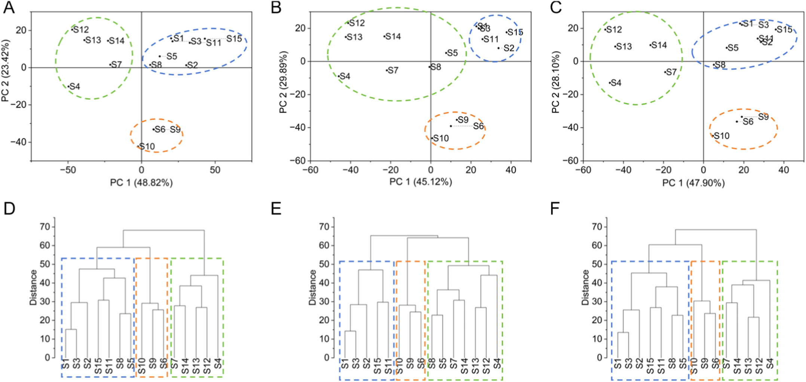
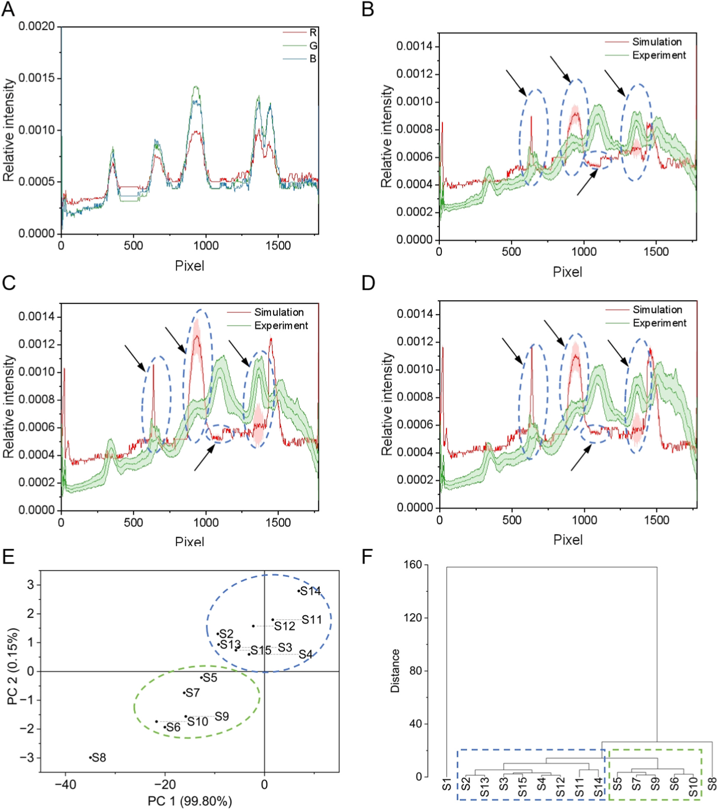
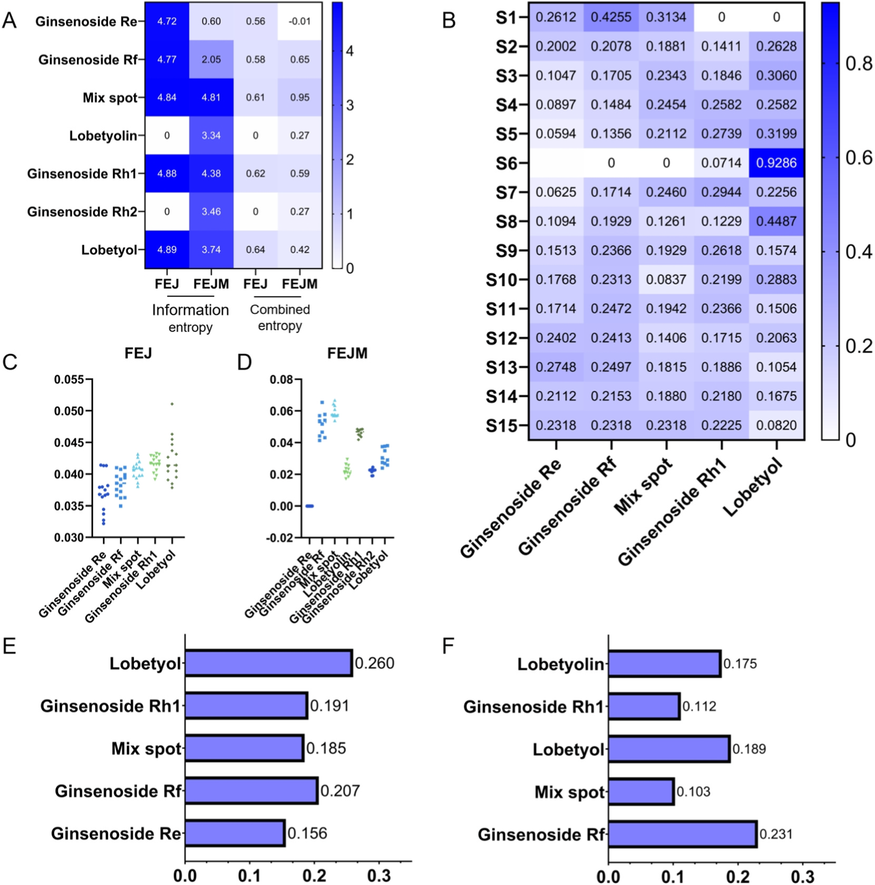

<!-- 原文の構成（Introduction → Materials and methods → Results and discussion → Conclusion）に沿って全訳。数値・条件・結果は省略せず記載。 -->

## 書誌情報

- 標題（原題）: Multidimensional chromatographic fingerprint fusion with machine learning: Entropy-based feature evaluation for TCM quality marker discovery
- 著者: Jiamu Ma, Fang Lv, Letian Ying, Yongqi Yang, Yuqing Yang, Xiaodan Qi, Jianling Yao, Yu Cao, Lingzi Wu, Wanzhu Wang, Jiaqian Xing, Xinru Wu, Juan Qin, Yan Zhang（責任著者）, Gaimei She（責任著者）
- 所属: a 北京中医薬大学 中薬学院（School of Chinese Materia Medica, Beijing University of Chinese Medicine、房山区、100029、北京）／ b 東阿阿膠股份有限公司（Dong'e Ejiao Co., Ltd.、山東省ゼラチン系医薬品研究開発重点実験室、252200、聊城）
- 掲載誌・巻号・DOI: *Talanta* 303 (2026) 129500、DOI: 10.1016/j.talanta.2026.129500
- インパクトファクター: **6.1**（*Talanta*, JCR 2024 / Clarivate、Q1。分析化学分野の代表的国際誌）
- 受理経過 / ライセンス: 受理 2025年12月5日投稿→2026年1月19日改訂稿受理→2026年2月1日受理、2026年2月2日オンライン公開。0039-9140/© 2026 Elsevier B.V. All rights are reserved, including those for text and data mining, AI training, and similar technologies.（テキスト・データマイニング／AI学習利用を含め権利留保）

## 要旨（Abstract）

クロマトグラフィーは、伝統中医薬（TCM）の品質評価に用いられる基幹的な方法論である。しかし、複数化合物由来の信号が重なり合い干渉し合うクロマトグラフィーデータの複雑さは、化学的に意味のある特徴量の正確な同定をしばしば妨げる。本研究では、多次元クロマトグラフィー指紋（フィンガープリント）と機械学習を組み合わせた統合的アプローチを提案し、代表的なTCM方剤である複方阿膠漿（Fufang E'jiao Jiang; FEJ）における特徴的化合物の分子的起源を追跡した。網羅的な化学プロファイリングに続いて、TLCおよびLC-HRMSを含むクロマトグラフィー指紋から多次元データセットを構築した。各データセットは、保持時間・m/z・RGB値に由来する1700を超える特徴量を含む。ランダムフォレストなどの機械学習アルゴリズムを用いて識別性の高い特徴量を選択した結果、FEJにおいて5パターン、その中間体において7パターンが同定され、その多くはジンセノシド（ginsenosides）であった。シミュレーションモデルにより、これらの特徴量の重要性をさらに検証したところ、単一化合物のクロマトグラフィースポットが試料の特性を効果的に代表しうることが示された。また、修正エントロピー値と障害因子（obstacle factors）を導入して選択された特徴量を評価・重み付けした。その結果、ロベツオール（lobetyolin）とジンセノシドRfが、それぞれFEJおよびその中間体における主要な品質関連マーカーとして認識された。実験的検証の結果、本手法は重なり合うクロマトグラフィー信号を効果的に分離（デコンボリューション）し、重要な品質関連特徴量を同定できることが示され、複雑系における品質管理のための効率的かつスケーラブルな計算フレームワークを提供する。要するに、本戦略は汎用的なデータ構造とモジュール式アルゴリズム設計に基づいており、特定のドメイン知識に依存することなく、複雑なクロマトグラフィー指紋を持つあらゆる試料系（医薬品・環境・食品試料など）への応用が期待される。

**キーワード**: 多次元データ融合クロマトグラフィー（Multidimensional data fusion chromatography）；エントロピーに基づく特徴選択（Entropy-based feature selection）；品質評価（Quality evaluation）；複方阿膠漿（Fufang E'jiao Jiang）

## 1. 序論（Introduction）

クロマトグラフィーは、伝統中医薬（TCM）方剤の品質評価に最も広く用いられる手法の一つであり、薄層クロマトグラフィー（TLC）と液体クロマトグラフィー（LC）の組み合わせが最もよく用いられる[1]。TLCは、複雑な化合物混合物の日常的な化学分析に一般的に用いられ、特に低コストで迅速な定性・定量分析が必要とされる場合に有用である。TLCは、迅速な分離と簡便な操作性ゆえに、様々な化合物を含む混合物の分離において代替の効かない重要性を保ち続けている[2–5]。TLCは広く用いられるクロマトグラフィー手法の中でも化合物とその代謝物の分析における最も簡便な方法であると評する研究者もいる[6,7]。TLCは、移動相の選択肢の広さ、試料識別における柔軟性、高い負荷容量といった特徴を示すため、複雑な化学物質の化学組成プロファイルを得ることが可能である[8]。TLCが色によって豊富な化学物質のより明確な情報を提供するのに対し、質量分析と組み合わせたLC（LC-MS）は、ほぼあらゆる種類の二次代謝産物についての詳細な情報を提供する。液体クロマトグラフィー−高分解能質量分析（LC-HRMS）は高感度であり、試料への幅広い適用性を有するため、化学的特性を包括的かつ効率的に研究し、試料間の動的変化をモニタリングすることを可能にする。しかし、TLCおよびLC-HRMSの生データの解析は、化学プロファイルのさらなる徹底的な理解を制限している。

TCMの複雑性を探るための全体的かつ定量可能なアプローチであるクロマトグラフィー指紋は、化学化合物の比較的完全な包括的プロファイルを構築するために本研究に導入された[9,10]。これまでの研究では、天然物の構造[11]、生薬原料の植物学的起源[12,13]などを分類するモデルが確立されてきた。これらの研究はコンピュータ処理によるTLC指紋の評価を試みているが、分類を決定づける特徴量や選択されたマーカー化合物の性能は依然として不明確なままである。化合物のプロファイリングは、TLC画像を通じて正確に達成できる。TLC画像は、全く同一の条件下で同時に可視化された大量の試料を含みうるためである[13]。各バンドの化合物組成プロファイリング特徴情報の集合は、バンドの色とパターンのグレースケールを調べることで作成できる。しかし、TLC画像特徴であれLC-HRMSスペクトルデータであれ、鍵となる課題は、単なるノイズや無関係な変動ではなく真に品質を示す数百〜数千の変数の中から、最も情報量の多い特徴量をいかに効果的に選択するかである。

TLC指紋から意味のある特徴量あるいは対応する化合物を特定することは、クロマトグラム中の微妙な変化を定義することが通常困難であるため、複雑な作業である。ケミインフォマティクスは指紋の解析において重要な役割を果たす[9,10]。ケミインフォマティクス解析の活用により、複雑な分析手順の簡略化が可能となる[14]。しかし、より単純な機器や最小限の手順に切り替える際には、分析精度の低下が生じうる。機械学習やエントロピーモデルなどの他の評価手法を援用することで、この損失を十分に補う可能性が得られる[15–17]。したがって、TLC指紋解析とケミインフォマティクス、機械学習に基づく特徴選択、エントロピーに基づく評価を統合することは、TLCデータを評価し重要な品質マーカーを同定するための強力なアプローチを構成しうる。これが本研究の焦点である。

複方阿膠漿（Fufang E'jiao Jiang; FEJ）は、阿膠（Colla corii Asini）、熟地黄（Radix Rehmanniae Preparata）、紅参（red ginseng）、党参（Radix Codonopsis Pilosulae）、山査子（Fructus Crataegi）から構成される、よく知られたTCM方剤である。TCM臨床において広く用いられ、気血両虚に対して処方される[18]。我々の先行研究に続き、「スペクトルー効果」関係とネットワーク薬理学を通じて品質マーカーがスクリーニングされ、FEJの品質規格も改善されてきた[2,18]。しかし、FEJの製造工程における主要化合物の伝達性（transitivity）と追跡性（traceability）は依然として不明である。n-ブタノール層はサポニンおよびトリテルペノイドに富み、中国薬局方[19]によりFEJの品質評価における主要画分として認識されている。したがって、本研究は化学物質全体ではなくこの特定の画分に焦点を当てた。

我々は、低コストでTCM方剤中の化学物質を評価することの重要性に対処するため、TLCとLC-MSのクロマトグラフィー指紋を組み合わせた統合的アプローチを提案した。機械学習支援の特徴選択と計算による評価手法を用いることで、最終FEJ製品だけでなくその中間製品（FEJM）においてもマーカー化合物を識別することを目指した。本アプローチにより、FEJにおけるロベツオール、FEJMにおけるジンセノシドRfが重要化合物として首尾よく同定され、複雑なTCM方剤の製造工程全体を通じた品質モニタリングと追跡性のための新しい戦略を提供した。さらに、本アプローチは「特徴融合−機械学習スクリーニング−エントロピー重み付け選択」として実施されるモジュール式の計算パイプラインとして設計され、ドメイン特有の知識を必要とすることなく、医薬品・環境試料など多様な複雑系に適応可能である。

## 2. 材料と方法（Materials and Methods）

### 2.1. 化学物質・材料・試薬

複方阿膠漿（FEJ）15バッチ、FEJの7つの製造工程に由来する中間体21バッチ、および単一生薬を欠く陰性対照試料（N1〜N4）は、いずれも東阿阿膠股份有限公司（Dong'e Ejiao Co., Ltd.）より提供された。これらはS1〜S15（FEJ試料）、I1〜I21（FEJ中間体）、N1〜N4（陰性対照）として番号付けされ、対応するロット番号はTable S1に示されている。

紅参（121045–200604）および党参根（Codonopsis radix、121057–202107）の対照生薬、ならびにジンセノシドRg2（111779–200801）、ジンセノシドRb1（110704–202230）、ジンセノシドRb2（111715–202104）、ジンセノシドRd（111818–202104）、ジンセノシドRe（LENA-CAAA）、ジンセノシドRg1（110703–202235）、ジンセノシドRg3（110804–201504）、ジンセノシドRh2（111748–202102）、ジンセノシドRo（111903–202106）の対照標準品は、中国食品薬品検定研究院（Chinese Academy of Food and Drug Control）より入手した。ジンセノシドRc（DST180120-013）、ジンセノシドRb3（DST180913-008）は成都徳思特生物技術有限公司（Chengdu DeSiTe Biological Technology Co. Ltd.、中国）より入手した。ジンセノシドRh1（AF20050408）、ジンセノシドRg5（AF21051605）、ロベツオール（lobetyol、136171-87-4）は成都愛発生物技術有限公司（Chengdu Aifa Biotechnology Co. Ltd.、中国）より入手した。ジンセノシドRf（PRF9061942）およびロベツオリン（lobetyolin、PRF9121002）はBiopurify Phytochemicals Ltd.（中国）より入手した。すべての対照標準品は純度98%超であった。上記以外の試薬はすべて市販品を用いた。

### 2.2. 試料調製と標準溶液調製

FEJおよびFEJM（中間体）のいずれについても、各試料20 mLを、水飽和n-ブタノール等量（20 mL）で単段階抽出した。n-ブタノール層を分離し、アンモニア試液20 mLで1回洗浄した後、さらに水飽和n-ブタノール20 mLで3回抽出した。合わせた有機相を蒸発乾固した。得られた乾燥残渣をメタノール1 mLに再溶解し、この最終溶液を分析用試験試料とした。

生薬試料1.0 gを水50 mLで45分間超音波抽出に供した。定性ろ紙でろ過後、抽出液を対照溶液とした。この対照溶液は試料と同一の手順で処理した。対照標準品（ジンセノシドRo、Re、Rf、Rh1、Rh2）をメタノールに溶解し1 mg/mLの濃度とし、標準溶液として使用した。

### 2.3. TLCクロマトグラフィー条件

分離は10 cm×10 cmのシリカゲルG薄層プレート（青島社、中国）を用いて行った。FEJ試料（8 μL）、対照標準溶液（1 μL）、紅参対照生薬（2 μL）、党参根対照生薬（8 μL）を、定量キャピラリーを用いてプレート底部から10 mmの位置にスポットした。次にプレートを、クロロホルム：メタノール：1%ギ酸水溶液（6.5：2.5：0.5、v/v）からなる移動相であらかじめ飽和させた二槽式展開槽に入れ、室温で約30分間、展開剤がプレート底部から80 mmの位置に達するまで展開した。展開後のプレートを槽から取り出し、乾燥させたプレートを10%硫酸エタノール溶液に浸し、105℃で加熱してパターンが明瞭な発色を示すまで加熱した。すべてのプレート画像は可視光下で記録した。

### 2.4. UPLC-QE-MS/MS分析

UPLC分析はVanquish UPLC装置（Thermo Fisher Scientific、Waltham、MA、USA）を用いて行った。クロマトグラフィー条件は以下の通り。分析はHSS T3カラム（2.1 mm×100 mm、1.8 μm、Waters社、Milford、MA、USA）を用い、流速0.3 mL/min、カラム温度35℃で行った。移動相AおよびBはそれぞれ0.1%ギ酸水溶液（v/v）およびアセトニトリルとした。溶媒プログラムは以下の通り設定した：0–5 min、95%–75% A；5–15 min、75%–50% A；15–20 min、50%–30% A；20–25 min、30%–5% A；25–28 min、5%–95% A；28–30 min、95% A。試料は15℃で維持し、注入量は5.0 μLとした。

質量分析はQ Exactive Orbitrap高分解能質量分析計（Waltham, MA, USA）を用い、ESIポジティブ・ネガティブイオン化モードで行った。取得条件は以下の通り：スプレー電圧3.8 kVまたは−3.2 kV；キャピラリー温度350℃；補助ガスヒーター350℃；シースガス40 Arb；補助ガス15 Arb；質量範囲100–1500 Da。フルMS分解能：70000、MS/MS分解能：17500、衝突エネルギー：NCEモードで15/30/45。

### 2.5. データセットのプロファイリングとTLC・LC-HRMS指紋の構築

#### 2.5.1. TLC指紋の構築

TLC画像はスマートフォンカメラを用いて取得した。スマートフォンは固定スタンドに設置し、TLCプレートは水平な台の上に置いた。一貫性を確保するため、すべての画像はカメラのフラッシュを使用せず、一定の室内環境光下で撮影した。前処理を標準化するため、元のTLCプレート画像をAdobe Photoshopに読み込んだ。要約すると、各試料チャンネルの脱彩・ノイズ除去のためにメディアンフィルタを適用し、同一サイズの単一画像を得た。ImageJを導入し、画像ピクセルのRGB（赤・緑・青）チャンネルからのデータを「Plot Profile」機能により抽出した。RGBチャンネルの強度値は反転させ、各チャンネルの強度値を差し引くことで「ピクセル強度」行列（最大強度値255）を作成した。ImageJの「Measure」機能をパターンのグレー値の決定に用い、同時にRf値も算出した。生のTLCプレート画像はまずグレースケールに変換した。各ピクセル位置における相対グレースケール強度は、絶対強度をレーン全体（またはプレート全体）のグレースケール強度の合計に対して正規化することで算出した。この処理は式(1)として表され、各ピクセルの強度が化学プロファイル全体への相対的寄与を表す正規化二次元データセットを生成する。すなわち「グレー値−Rf値」行列が得られた。

> 式(1): Irel = Ipixel / Itotal　（Irelは個々のピクセルの相対グレースケール強度、Ipixelは計算対象ピクセルの絶対グレースケール強度、Itotalは全ピクセルの絶対グレースケール強度の合計）

TLC条件の検証後、FEJおよびFEJM試料についてのTLCプレート解析を行った。ピクセル補正・ピーク照合のため、試料S1のRGB強度マップを参照パターンとして用いた。データ幅は1ピクセルに設定した。対照マップは平均強度値を算出することで作成した。解析は10 cm×10 cmのTLCプレートで実施し、元画像の解像度はFEJで2300×2250ピクセル、FEJMで2800×2250ピクセルであった。ピーク補正・照合の後、FEJのTLC指紋が構築された。

類似度評価はコサイン類似度法により、対照マップを標準として実施した。算出式(2)は以下の通り：

> 式(2): S = Σ(xi・yi) / (√Σxi² × √Σyi²)　（xiはピクセル値、yiは対応ピクセルの強度）

#### 2.5.2. LC-HRMS指紋の構築

すべての生ファイルは.mzML形式に変換し、MSDIAL（v5.4.24）を用いてMS/MSレベルのすべてのスペクトルを抽出した。スペクトルの強度、プリカーサーイオンm/z、保持時間も併せて保存した。保持時間が0.5分未満、またはMS/MSスペクトルを欠くスペクトルは除外した。スペクトルは、自社データ、対照標準品、およびMSFinder（v3.61）による計算に基づいてアノテーションを行い、優勢なフラグメントを記録した。保持時間は、絶対保持時間をそれぞれの最大保持時間で除することで正規化した。フラグメント強度は、各スペクトルの各ピークについて、当該ピークの強度をスペクトル全体の強度で除することで正規化した。

LC-HRMS指紋は、解析のために2種類の相補的なデータセットを生成するよう処理した。第一に、各試料について「保持時間−全イオン強度」行列を構築した。これらの行列のコサイン類似度を算出し、全体のプロファイル類似度を評価するとともに、試料間で有意なばらつきを示す保持時間領域を特定した（TLC画像行列解析に類似した方法論）。第二に、特定された差異領域について、変動に寄与する特定化合物のアノテーションを容易にするため「相対保持時間−プリカーサーイオンm/z」リストを抽出した。

### 2.6. 有意な特徴量を選択するための計算モデル

#### 2.6.1. ケミインフォマティクス解析

7つの異なる製造工程に由来するFEJ 15バッチおよびFEJM 7バッチを検証に用いた。TLCおよびLC-HRMS指紋の両方をケミインフォマティクス解析により評価し、これらバッチ間の類似性と相違点を明らかにした。主成分分析（PCA）と階層的クラスタリング解析（HCA）を併用してFEJおよびその中間体を評価した。解析はOrigin 2024bで実施した。

#### 2.6.2. 特徴選択

TLCおよびLC-HRMS指紋から識別性の高い特徴量を選択するため、ランダムフォレスト（RF）分類器を実装した。解析はPython（バージョン3.9）とscikit-learn機械学習ライブラリ（バージョン1.2）を用いて実施した。RFモデルは以下のハイパーパラメータで構成した：決定木の本数は1000本、各木の最大深さはNone（すべての葉が純粋になるまでノードを展開）、各ノードで最適な分割を検討する特徴量数は「sqrt」（全特徴量数の平方根）とした。分割の質の評価にはジニ不純度基準を用いた。scikit-learn 1.2のその他のパラメータはすべてデフォルト設定を用いた。頑健な識別特徴量を特定するため、2段階の基準を適用した。第一に、PLS-DAモデルからVIP（variable importance in projection）スコアが1.0を超える特徴量を選択した[20,21]。続いて、これら候補特徴量の重要度を、RFモデルにおけるジニ係数平均減少度によって検証し、両独立アルゴリズムで一貫して上位に位置づけられることを確認した。

#### 2.6.3. 選択された特徴量によるTLC指紋シミュレーションのための適合モデル

選択された特徴量が全体のTLC指紋プロファイルに与える寄与を定量的に評価するため、線形適合モデルを構築した。本モデルは、ある位置におけるクロマトグラフィー信号の強度が、対応する化合物の濃度に比例するという原理に基づく。累積指紋F(p)は、任意の点において、全構成成分の寄与の総和としてモデル化できる。式は以下の通りである：

> 式(3): F(p) = Σi Ci × Ii(p)　（pはTLC指紋内の空間座標（例：相対保持係数、Rf）、Ciは化合物iの濃度、Ii(p)は単位濃度における化合物iの純標準品の標準化された強度プロファイルを表す。このプロファイルは、化合物の化学的性質および固定相との相互作用によって支配される、TLCプレート上の特徴的な空間位置とバンド形状を規定する）

### 2.7. 修正エントロピー値と障害因子による特徴的特徴量の評価

FEJまたはFEJMの化学プロファイリング全体に対するクロマトグラフィー指紋から選択された特徴量の相対的寄与を定量的に評価するため、修正型の複合エントロピーモデルを導入した。本モデルは各特徴量についてエントロピー重みを算出することで動作し、これは情報学的重要性の客観的な指標として機能する。エントロピーが低い（すなわち試料間での信号分布がより一貫し、ランダム性が低い）特徴量ほど、より安定的であるとみなされ、より高い重みが割り当てられ、品質マーカーとしてのポテンシャルがより大きいことを示す。処理は、各特徴量のグレースケール強度を抽出・正規化するデータ前処理から始まる。第i番目の特徴量について、全試料にわたるその強度値を式(4)により確率様の値に変換し、相対存在量を表現した。続いて、各特徴量の情報エントロピー（Ei）を式(5)により算出し、試料集合全体にわたるその強度分布の無秩序性・ランダム性を定量化した（Ei値が大きいほど変動性が大きく安定性が低いことを示す）。最後に、式(6)によりエントロピーを重み係数に変換したエントロピー重み（Wi）を導出した：

> 式(4): pi = xi / Σxi
> 式(5): Ei = −(1/ln n) × Σ pi・ln(pi)
> 式(6): Wi = (1 − Ei) / Σ(1 − Ei)

（iはi番目の特徴量、xiは絶対強度を表す。この計算により、より安定的な特徴量（エントロピーEiが低い）ほど高い重みWiが割り当てられることが保証される。これは最大エントロピー状態からの乖離度を表すためである。式(6)分母の総和はすべての特徴量にわたるものであり、重みの総和が1になるよう正規化する。この枠組みにおいては、エントロピー重みの高い特徴量ほど品質マーカー候補として優先される。信号が安定していることは、より信頼性の高い品質指標であることを意味するためである[22]。）

指紋プロファイル中の有価パターンの情報エントロピーを包括的に評価するため、以下の計算を導入した：

> 式(7): gi = 1 − Wi　（giは情報効用値）
> 式(8): Ri = Wi / ΣWi　（Riは相関TLCパターンの重みを示す）
> 式(9): Ci = Σ Ri・Xi　（Ciは有意な特徴量の複合効用値を示す）

障害因子診断モデルは、FEJ試料およびFEJ中間体の品質に対する各有価化合物の障害の程度を算出するために用いられた。障害因子診断モデルの式は以下の通りである：

> 式(10): Oij = (Coij・Deij) / ΣiΣj(Coij・Deij)

（Oijはj番目のバッチにおけるi番目の化合物の障害度である。Coijは因子寄与度であり、本研究では等しい重みを割り当てた。Deijは偏差の程度を表し、各化合物の目標値（望ましい値）と実際値との差として算出される。本研究では、各化合物の目標値は最大正規化値（すなわち1）と定義されるため、Deijは各指標の正規化値の補数として表される。）

## 3. 結果と考察（Results and Discussion）

### 3.1. TLCおよびLC-HRMS指紋のプロファイリング

#### 3.1.1. TLCプロファイリング解析

確立されたFEJのTLC条件は、中国薬局方収載法と比較して改変されたものである。本法は、同一の試料調製法とTLC条件を用いて単一プレート上で2種の生薬（紅参と党参根の飲片）を同時に識別するという目標を達成し、識別効率を大幅に改善した。既報と比較して、本法は2種の生薬由来のより多くの対照化合物を参照しており、価値ある化合物を同定できる可能性を高めている[2]。FEJおよびFEJM試料のために確立されたTLC法は、特異性・再現性・耐久性の評価によりバリデーションされた（Fig. S1）。方法バリデーションに続き、FEJの異なるバッチのTLCプレート解析により、標準溶液との比較によって6化合物が同定された（Fig. S2A）。紅参と党参根（CR）の主要化合物も、対照生薬試料に照らしてFEJ試料中に同様に確認された。FEJ試料に関しては、大部分のバンドは本質的に同一であったが、色の濃淡にわずかな変動がみられ、ジンセノシドRo、ジンセノシドRe、ジンセノシドRfなどの化合物含量が大きくばらついていることが示唆された。「生薬原料−飲片−中間体−製剤」のTLCプレートにおいても、バンドは同様の傾向を示した（Fig. S2B）。FEJ製造工程の間にバンドが大きく変化することは明らかであり、これは化学プロファイルが著しい変化を受けたことを示している。対照標準品および陰性対照試料と比較すると、ジンセノシド（例：ジンセノシドRg1、Rg5）が顕著に濃縮されていた。対照的に、地黄（Rehmanniae Radix Praeparata）または山査子（Crataegi Fructus）に由来すると推定される特定の化合物の含量は減少していた。一方で、経験則と標準対照品の種類が従来のTLC分析手法の厳しい制約であることは依然として課題であった。このことは試料中の重要な分子を精密に同定することを困難にし、試料の品質を評価・管理することを難しくしていた。

#### 3.1.2. LC-HRMSプロファイリング解析

FEJおよびFEJMの化合物プロファイリングは、UPLC-HRMSのフルスキャンモードにより調査した。トータルイオンクロマトグラム（TIC、Fig. 1D・E）に示す通り、良好に分離されたピークが観察された。合計826化合物（18種のジンセノシド、ステロイド、脂肪酸、フラボノイド、その他の化学物質群を含む）が本研究で同定された。対照標準品との保持時間・分子量・タンデムMSの比較により、15種のトリテルペノイドサポニンが同定された（化合物リストはTable S2に示す）。

ここでは、FEJの典型的な主要化学物質群であるプロトパナキサトリオール（PPT）型ジンセノシドとプロトパナキサジオール（PPD）型ジンセノシドを例として、化合物同定プロセスを示す。ジンセノシドは主に2つの大きな群に分類される：PPD型（C-3位に糖鎖が結合し、C-20位には結合の有無がある）と、PPT型（C-6位に糖鎖が結合し、C-20位には結合の有無がある）である。

化合物#341（保持時間10.74分）と化合物#571（保持時間18.36分）は、同一のプリカーサー質量m/z 799.48を示した。両化合物はm/z 637.4335にフラグメントイオンを生じ、これはグルコース1分子の脱離（[M-H-Glu]-）に相当する。続くフラグメントイオンはm/z 475.3732に観察され、これは2分子目のグルコースの脱離（[M-H-2Glu]-）に相当する。これらイオン間の約162 Daの質量差は、2つのヘキソース残基の連続的な脱離を確実に裏付けており、ジグリコシド構造であることを示している。提案されたフラグメンテーション経路に従い、自社ライブラリ中の候補構造をスクリーニングした結果、化合物#341はジンセノシドRg1またはジンセノシドRfのいずれかであると同定された。両者のClogP値を比較すると、ジンセノシドRg1が2.292、ジンセノシドRfが3.097であり、ジンセノシドRfの方がより長い保持時間を示すことを意味する。したがって、化合物#341はジンセノシドRg1、化合物#571はジンセノシドRfと同定された。

化合物#366は保持時間11.39分に溶出し、プリカーサー質量はm/z 1107.5958であった。生成イオンm/z 375.2913は、C-20位のオレフィン鎖の解離により形成される特徴的なフラグメントイオンであり、本化合物がPPD型ジンセノシドに属する可能性を示していた。さらに、m/z 945.6276、783.4916、621.4384のフラグメントは、プリカーサーイオンからグルコース置換基が順次解離することで形成された。したがって化合物#366はジンセノシドRb1と同定された。

総じて、FEJとFEJMの化合物組成にはわずかな差異が見られ、これは製造工程中の化合物変換に起因する可能性がある。UPLC-HRMS解析は二次代謝産物の同定のために十分な情報を提供できた。

### 3.2. 複数指紋データセットの構築と評価

生のTLC画像は伝統的な解析対象であるが、デジタル解析なしにはぼやけたパターンを識別することは難しい。さらに、パターンの色の濃淡の差異によりもたらされるTLCの定量的性質も、TLC画像から価値ある化合物を同定する難しさを増している。本研究では、既報の手法[12]に準拠して改変したRGBチャンネルの信号を個別に抽出することで、TLC画像を信号スペクトルへと変換した。ピクセル強度行列とグレー値−Rf値行列は、それぞれ異なる解析目的を果たした。前者はクロマトグラム画像全体の完全かつ高解像度なRGB情報を捉える。その3次元（FEJでは3×15×2180、FEJMでは3×14×2180）は、それぞれRGBカラーチャンネル、試料数、展開方向の総ピクセル数を表す。この行列は大域的なパターン認識および類似性解析に用いられた。対照的に、グレー値−Rf値行列は、特定の化学的バンドの定量的評価のために設計された凝縮特徴行列である。これは画像をグレースケールに変換した後、あらかじめ定めたRf位置における平均グレー値を抽出することで生成された。したがって、その次元（FEJでは1×15×12、FEJMでは1×14×12）は、それぞれ単一のデータチャンネル（グレー値）、試料数、追跡されたバンド数（Rfポイント）に対応する。

> 補足: 本節後段では「FEJ試料のピクセル強度行列は1781×19の特徴量から構成され、グレー値−Rf値行列は同時に2181×22の特徴量を有した」との記述があるが、これは本節冒頭で示された次元（ピクセル強度行列3×15×2180、グレー値−Rf値行列1×15×12）と数値が一致しない。原文の記載をそのまま訳出したが、この不整合は原文自体に起因するものであり、原文参照とする。

TLC画像はピクセル・強度・グレー値という3つの要素から構成される。これらの要素は連動して、元のTLC画像を検討可能なデータセットへと変換する。複雑な化合物混合物の分子的起源を解明するため、フィンガープリント構築の開始とともに、TLCプレート中の価値ある化合物を同定する方法が提案された。Fig. 1Aに示すワークフローの通り、TLC指紋が構築され、FEJおよびFEJMのTLC指紋はFig. 1B・C・Fに示す通りとなった。さらに、LC-HRMS指紋はTLC指紋と同様のワークフローに若干の調整を加えて構築され、大きな化学空間の観点から並行する参照となるよう試みた。予想通り、LC-HRMS指紋によってより多くの化合物が検出された（Fig. 1D・E・G）。

前処理（各チャンネルの脱彩・ノイズ除去、行列への変換など）の後、TLC指紋データセット（「ピクセル強度」行列および「グレー値−Rf値」行列）を構築した。異なるバッチのFEJの主要な特徴は目視上ほぼ同一であったものの、一部のピーク（TLCパターン）は試料間でわずかな差異を示すことは明らかであった（Fig. S3A-C）。化合物の組成だけでなく、主要化合物の相対含量も指紋プロファイリングに影響した。この結果は、製品の安定的かつ高品質を保証するため、FEJ中の価値ある化合物を管理する必要性を示していた。FEJMのTLC指紋については、FEJ試料と比較して、製造工程中により多くの化合物が大きく変化した（Fig. S3D-F）。このことは、製造工程が化学組成と化合物の含量を変化させたことを示していた。これは、FEJを適切に評価するためには紅参により重点を置くべきであることを示唆した。

FEJ試料の多様性と共通性、およびその伝達過程を理解するため、PCA解析とHCA解析を適用した。

Fig. 2に示す通り、FEJ試料はR・G・Bチャンネルにおいて3群に分類された。RチャンネルのPCA解析では、試料はPC1（説明分散48.82%）とPC2（説明分散23.42%）に沿った傾向を示し、これは含量と相対ピクセルにも関連し、対応する化学組成の含量を反映した。GチャンネルおよびBチャンネルの結果については、PC1がそれぞれ45.12%と47.90%、PC2が29.89%と28.10%であった。HCA解析でも同様の分類結果が観察された（Fig. 2D–F）。RGBチャンネル間で異なる分類結果が観察され、RチャンネルとBチャンネルは同一の分類結果を示したことから、化合物組成がRチャンネルとBチャンネルで同一の色特徴を有することが示された。ほとんどのFEJ試料は、S6・S9・S10を除いて、色特徴と強度による区別が困難であった。FEJ試料における不安定な分類とは異なり、FEJM試料のRGBチャンネルでは一貫した分類結果が観察され（Fig. S4）、製造工程の試料への影響が大きいことを示していた。LC-HRMS指紋のPCA・HCA解析の結果はTLC指紋の結果と類似していたが、化合物組成に関するより詳細な情報が分類結果にわずかに影響した（Fig. S5）。TLC指紋の結果と一致して、陰性イオンモードの分類結果は化学組成の変化により敏感であった。また、FEJM試料は陽イオンモードと陰イオンモードで同一の分類結果を示すという有意な差異を有するという同じ結果に達した。

まとめると、FEJ試料および伝達過程のTLC指紋とLC-HRMS指紋のケミインフォマティクス解析は、化合物の含量が製品の品質と製造効率に影響を与えうることを示すパターンの変動を実証した。この場合、鍵となるパターンあるいは化合物を同定することは、FEJの品質管理・評価にとって極めて重要であった。

ケミインフォマティクス解析はクロマトグラフィー指紋の評価に適した方法として認識されている。これは、分析物分離に必要な簡略化された試料調製手順からしばしば生じる非理想的な分析信号を効果的に処理する[14]。したがって、TLC指紋の構築に続き、複雑な物理的操作への依存を評価・低減するためPCAとHCAを用いた。「ピクセル強度」行列を入力として用い、少数の主成分に分解した。文献で報告されている通り、異なる生薬バッチ、煎じ工程、その他の製造要因が化合物の組成プロファイルに集合的に影響を与える[25,26]。本研究では、FEJおよびその中間体のTLC指紋のPCAとHCAにより、特に製造バッチ間、および最終製品（FEJ）と中間体（FEJM）との間の化学組成における顕著な差異が明らかになった。TLC指紋において紅参よりもむしろ党参根の飲片とFEJMがより類似していたことは注目に値する。これはトリテルペノイドサポニンの製造工程中の動的変化の一因となりうる[26]。これは、FEJを適切に評価するためにはより紅参に注目することを示唆した。

TLC指紋のプロファイリングから得られたピクセル強度データセットに基づき、試料間の差異を評価するため類似度評価を行った。結果は、FEJのTLC指紋のR・G・Bチャンネルにおける試料クロマトグラムと対照クロマトグラムとの類似度が0.9551–0.9981（Table S2-S4）の範囲内であることを示し、異なるバッチのFEJが高い類似性と安定した工程を有することを示した。「生薬原料−飲片−中間体−製剤」のTLC指紋では、R・G・Bチャンネルと対照スペクトルとの類似度は0.8383–0.9962（Table S5-S7）の範囲であった。RGBチャンネル間で同様の傾向を示す通り、RチャンネルとGチャンネルはより高い類似度を示し、これはFEJおよびその中間体の試料に青色染色をもたらす化合物の影響が異なることを示していた（天然物の染色は赤色または青色になる傾向があると報告されている[11]）。LC-HRMS指紋の結果では、FEJ試料の陽イオン・陰イオンモードにおける類似度は0.9733–0.9990（Table S8-S9）の範囲であり、FEJ中間体における類似度は0.8627–0.9975（Table S10-S11）の範囲であった。陰イオンモードは陽イオンモードと比較して類似度の値が低く、バッチ間の差異の原因は主に陰イオンモードで検出された。トリテルペノイドサポニンは、紅参と党参の当該化合物がn-ブタノール画分に濃縮されているため、FEJおよびその中間体の主要な化学物質群であった。このことから、この化学物質群への注目が促された。結論として、これらの結果はTLC指紋のプロファイリング結果と一致し、試料間の化学組成と相対含量の差異を裏付けるものであった。TLC指紋とLC-HRMS指紋の類似度を比較すると、LC-HRMS指紋の結果はより高い類似度を示したが、TLC指紋の結果との間に有意な差異はなかった。これは、試料をプロファイリングするためのTLC指紋の利用が実行可能であることを示していた。

### 3.3. TLC指紋およびLC-HRMS指紋プロファイリングの特徴選択

ケミインフォマティクスによるTLC指紋の基本評価の後、特徴的化合物を見出すことを目的として、ランダムフォレストによるTLC指紋信号の特徴選択を進めた。ランダムフォレストは高い安定性と強い汎化能力を持つ分類法として広く用いられている。ランダムフォレストは、予測因子と結果の関係を解釈する内部検定も実施できる[27,28]。これらの性質は信頼性の高い特徴選択結果を提供する。

> 補足: 原文では「5 feature patterns from FEJ and 7 feature patterns from FEJM samples were selected in our precious study」と記されており、この "precious（＝previousの誤記と思われる）study" が本論文内の記述を指すのか、著者らの別の既報を指すのかは原文中で明示されていない。原文参照。

その後、標準溶液との比較により、FEJでは合計7化合物（ジンセノシドRg1・Rg2・Rg3の混合パターンを含む）、FEJMでは合計9化合物（同じ混合パターンを含む）が同定された。ランダムフォレストは、RGBチャンネルの「ピクセル強度」行列、およびフラグメント強度・相対保持時間に基づき、TLCプロファイルおよびLC-HRMSの特徴に顕著な影響を与える特徴量を選択するために適用された。Fig. 3に示す通り、FEJ試料のTLC指紋から5本のピクセルバンド、LC-HRMS指紋の陰イオンモードから6本のバンド、陽イオンモードから4本のバンドが選択された。Fig. 3Aでは、No.1〜No.5のバンドが標準溶液との比較によりそれぞれジンセノシドRe、ジンセノシドRf、混合スポット、ジンセノシドRh1、ロベツオールと同定された。このうち、混合スポットは対照標準品との共泳動により、少なくともジンセノシドRg1、Rg2、Rg3を含むことが同定された。しかし、TLC指紋の選択は依然として明確な形態と最適な分離特性を持つ主要スポットを優先しており、含量が低いか顕著なバンドテーリングを示す微量成分はしばしば識別不能なまま解析から除外された。TLC指紋と比較して、LC-HRMS指紋はバッチ間の差異をもたらす価値ある化合物についてより多くの詳細情報を有していた。Fig. 3B・Cに示す結果の通り、LC-HRMS指紋から選択された特徴量は、陽イオンモードで相対保持時間0.45–0.71付近、陰イオンモードで相対保持時間0.15–0.38付近に高いRF重要度値を示すより詳細な情報を有していた。ジンセノシドRb1、ノトジンセノシドR2、ロベツオリンなどの化合物が、この保持時間区間における主要な化合物種であった。LC-HRMS指紋の選択結果は、FEJおよびFEJMの主要な化学物質群に関するこれまでの知見と正確に対応していた。これは、主要な化学物質群への着目が化合物混合物の品質を評価する優れた方法であることを示している。しかし、FEJの品質に顕著な寄与を持つ特定の化合物は依然として不明であり、さらなる解析が必要であった。

FEJM試料における特徴選択（Fig. S6）についても、ほぼ同様の結果が得られた。わずかな違いとして、FEJMではTLC指紋において7本の特徴バンドが選択され、それぞれジンセノシドRe、ジンセノシドRf、混合化合物、ロベツオリン、ジンセノシドRh1、ジンセノシドRh2、ロベツオールと同定された。より多くの化合物が選択されたことは、伝達過程が試料間でより多くの差異に関する情報を有し、試料差異がFEJ試料と比較してより大きいことも示している。FEJMのLC-HRMS指紋の選択においては、同様の範囲が得られた。さらに、RF重要度値は、FEJ試料において有意に高い値を示していたのとは異なる値を示した。これはFEJMの組成と含量の変動に起因する可能性がある。総じて、伝達過程におけるロベツオリンとジンセノシドRh2は、FEJ試料とは異なる特徴的化合物であった。

### 3.4. 選択された特徴量に基づくTLC指紋のシミュレーション

選択された特徴量の試料全体への特性および重要性を把握するため、特徴量のみが存在する場合のTLC指紋プロファイリングの変化を記述するシミュレーションモデルを導入した[29]。このシミュレーションモデルは、スペクトル指紋を鍵となる化合物からのスペクトル寄与の線形結合として定式化するもので、異なる試料間の化学組成の変化を首尾よく明らかにし、スペクトル差異を特定の化合物濃度変化に直接結びつける。FEJ試料の類似度評価は、TLC指紋あるいはLC-HRMS指紋の構築と同様のコサイン類似度法に基づき、R・G・Bチャンネルそれぞれについて算出した（Table S12-S17）。シミュレーションTLC指紋と実験TLC指紋との類似度は、R・G・Bチャンネルでそれぞれ0.9440–0.9950、0.8836–0.9827、0.8590–0.9856の範囲であった。これらシミュレーションTLC指紋自体の間での類似度は、R・G・Bチャンネルでそれぞれ0.9931–0.9999、0.9738–0.9999、0.9746–0.9999の範囲であった。一方FEJM試料では、実験試料と比較した類似度はR・G・Bチャンネルでそれぞれ0.9106–0.9997、0.8850–0.9994、0.8778–0.9956であった。またこれら自体の間での類似度は、R・G・Bチャンネルでそれぞれ0.9733–0.9999、0.9393–0.9999、0.9616–0.9999であった。これらの結果は、Rチャンネルにおいてより良好なシミュレーションが得られることを示す一方、高含量かつ良好な点形成特性を持つスポットにおいて優れたシミュレーション性能が観察された。これは、区別可能なスポットのみが識別可能というTLC自体の特性によるものと考えられる。これは一方で、化学物質を完全に特性評価するためにはより多くの相条件が必要であることを示していた。本研究の場合、トリテルペノイドがFEJのn-ブタノール相物質の主要な化学物質群であるため、研究はこの化学物質群に焦点を当てて実施した。

TLC指紋（強度−ピクセル）の単純なシミュレーションモデルを得たことで、選択された特徴量の性能を容易に得ることができた。Fig. 4に示す結果の通り、FEJM試料の方がより良好なシミュレーション性能を示した。予想通り、混合スポットは不良なシミュレーション性能を示し、これは混合スポットがジンセノシドRg1・Rg2・Rg3だけでなく、リグストロシド（ligustroside）やノトジンセノシドR2など類似の極性を持つより多くの化合物からも構成されていたことを示していた。PCAおよびHCA解析における分類は実験結果とほぼ同一の結果を示し、特徴選択法とシミュレーション法の信頼性と精度を示している。

結論として、確立されたシミュレーション手法における結果は、特徴量がTLC指紋全体を代替できるという方法の実行可能性を証明した。

### 3.5. 修正エントロピー法に基づく有価化合物の評価

特徴的化合物を評価し、FEJおよび伝達過程への寄与を理解するため、複合エントロピーモデルおよび閾値が確立された。TLC指紋の「グレー値−Rf値」行列を、情報エントロピーと複合エントロピーの算出に用いた。

情報エントロピーは不確実性の尺度である。不確実性が大きいほど、より無秩序である。TLC指紋の解析は、試料間のかなりの異質性を明らかにした。プロファイルは化学的特徴の数と強度の両方において明確な差異を示し、試料間variabilityの高さを示していた。FEJ試料の平均情報エントロピー値は1.6072、伝達過程の値は1.5983であった。FEJ試料および伝達過程の平均情報エントロピー値は、両システムの複雑さが同程度であることを示した。情報エントロピーはまた、FEJ試料における5つの主要化合物の重要性がほぼ同一であることを示した。一方、伝達過程における7つの主要化合物は多様な情報エントロピー値を示した。総じて、ロベツオール、ジンセノシドRh1、ならびにジンセノシドRg1・Rg2・Rg3から構成される混合パターンが、FEJ試料と伝達過程の両方において上位にランクされる最も価値ある化合物であった（Fig. 5A）。しかし、主要化合物の情報エントロピー値が近接しているため、価値ある化合物を区別することは依然として困難であった。そこで、主要化合物を正確にランク付けするための評価法として複合エントロピーが導入された。化合物の全体複合エントロピー値の算出結果（Fig. 5B）が示す通り、ジンセノシドRfは、情報エントロピー値で同定された主要化合物とは別に、FEJ試料と伝達過程の両方にとってもう一つの価値ある化合物と考えられた。さらに、FEJおよび伝達過程における各試料の複合エントロピーは、試料間の詳細な差異を示した（Fig. 5C～D）。伝達過程と比較して、FEJ試料はより分散した複合エントロピーを有していた。これは、FEJ試料のTLCプロファイルが伝達過程よりも複雑であるという同じ結論に達するものであった。

障害度（obstacle degree）は、修正エントロピー値から得られるもう一つの値であり、システム全体に対するこれら化合物の寄与度に関する情報を提供する。具体的には、閾値が1に近いほどシステムにとってより重要な役割を意味し、0に近いほどファジィシステムへの寄与が小さいことを意味する。Fig. 5B及びE-Fに示す結果の通り、ロベツオールはFEJ試料において最も高い障害度0.260を示し、ジンセノシドRfはFEJM試料において障害度0.231を示した。これは、それぞれFEJおよびFEJM試料において大きな寄与を持つ特徴的化合物であることを示していた。また、この結果は修正エントロピー評価と同一の結果であった。TLCプロファイル全体、試料の複合エントロピー値の分布・分散をまとめると、ロベツオール、ジンセノシドRh1、ジンセノシドRg1・Rg2・Rg3（混合パターン）が、FEJに顕著な影響を与えるFEJ試料のマーカー化合物として同定された。一方、ジンセノシドRg1・Rg2・Rg3（混合スポット）、ジンセノシドRf、ジンセノシドRh1が伝達過程のマーカーであった。これらの結果は、党参由来の化合物が製品の伝達過程において安定であることを示しており、HCA解析の結果とも一致していた。

マーカー化合物を同定するにあたり、これら差異化合物の寄与は依然として解決すべき鍵となる課題であった。エントロピーは動的複雑性を測定する典型的な概念であり、ファジィシステムの評価に導入されてきた[30]。本研究では、情報エントロピーと複合エントロピーの両方を主要化合物の評価に用いた。情報エントロピーは、信号処理における重要な方法の一つとして認識されている微視的な無秩序の直接的な測定法である[31]。その目的は、確率変数の情報量あるいは内在的不確実性を定量化することであり[16]、時系列や画像データにも適用されてきた[32,33]。情報エントロピーと信号強度の関連性は近年の展望において考慮されており[16,34]、化合物の情報エントロピーが小さいほど一貫した信号強度分布を示す可能性が高いことに関連する。言い換えれば、製造工程による影響を大きく受けるマーカー化合物ほど、情報エントロピーは大きい。したがって、マーカー化合物を重み付けするために複合エントロピーが提案された。その結果、ジンセノシドRh1、およびジンセノシドRg1・Rg2・Rg3が混合した顕著なパターンが、FEJ試料と伝達過程の両方における品質マーカーとして同定された。一方、ロベツオールはFEJ試料に特有のマーカーであり、ジンセノシドRfは伝達過程に特有のマーカーであった。ジンセノシドは、人参および人参含有TCM方剤の主要な品質管理指標として用いられている[35]。これらの化合物は製造工程中に変換されやすいため、ジンセノシドの変化を重視することは製品のより良い利用を可能にしうる[36,37]。伝達過程におけるマーカー化合物の同定は、紅参が調製過程においてより影響を受けやすいというHCA解析のクラスタリング結果も裏付けた。さらに、FEJ試料および伝達過程のマーカー化合物は、例えばHPLC指紋のような高コストな検出法と相互補完的なものであった[2,18]。

## 4. 結論（Conclusions）

クロマトグラフィーは、伝統中医薬（TCM）のような複雑系の品質評価における基幹的技術としての役割を果たす。本研究は、主に目視比較と参照Rf値に依存する古典的なTLC法を超えて、多チャンネル指紋をケミインフォマティクスおよびエントロピー計算と組み合わせる統合的な分析アプローチを確立した。本戦略により、重なり合う信号に対する分解能とデコンボリューション能力を強化しつつ、TLCおよびLC-HRMSの両データから差異のある品質関連マーカー化合物を正確に同定することが可能となる。

FEJに適用した結果、本手法は、最終製品とその製造工程の両方に共通するマーカーとして、ジンセノシド（Rh1、Rg1、Rg2、Rg3を含む）を首尾よく認識した。さらに、ロベツオリンはFEJ試料に特有のマーカーとして同定され、ジンセノシドRfは中間製造段階に特有であった。現行研究は、分離上の課題により一部の重要な共溶出化合物を徹底的に調査することができなかったが、この限界は今後の方法論的改良の方向性を示すものである。

結論として、多次元指紋解析とデータ駆動型モデリング、エントロピー評価を統合することにより、本研究は複雑なTCMマトリックスに特に適したマーカー探索のための迅速かつ効果的な戦略を提供する。本アプローチは、近赤外分光法のような多次元処理を必要とする他の分析データソースにも適応可能であると期待される。したがって本研究は、TCM製剤のための品質評価システムを構築するための実用的な方法論を提供するだけでなく、医薬品・環境分析をはじめとする他の複雑系にも応用可能な、新規のケモメトリクス強化型フレームワークを提供するものである。

## 利益相反

Gaimei Sheは中国国家知識産権局（China National Intellectual Property Administration）に特許出願中（出願番号#202410240182.3）である。その他の著者については、本論文で報告された研究に影響を与えたとみなされうる既知の金銭的利益相反や個人的関係はないことを宣言する。

データの利用可能性: 使用されたデータは非公開（confidential）である旨、原文中に記載されている。

## 訳者補足（任意）

> 補足: 本論文は、複方阿膠漿（FEJ）という単一のTCM方剤を対象に、①TLCとLC-HRMSという2種類のクロマトグラフィー指紋を「ピクセル強度」「グレー値」「保持時間-m/z」といった多次元の特徴量（各1700超）に変換し、②ランダムフォレストで識別性の高い特徴量を機械学習的に絞り込み、③線形シミュレーションモデルでその特徴量が試料全体を代表しうるかを検証し、④修正エントロピー値・障害度モデルで最終的な「品質マーカー」をランク付けする、という4段階のモジュール式パイプラインを提示した点に新規性がある。実務的には、経験や標準品の有無に依存しがちな従来のTLC指紋鑑別に対し、機械学習とエントロピー評価を組み合わせることで、より客観的にマーカー化合物を選定できる可能性を示す事例といえる。ただし、著者らも述べる通り、共溶出化合物の分離精度には限界があり、また本文中には次元表記の不整合や「our precious study」という原文の記述の曖昧さなど、原文自体に起因すると考えられる不明瞭な箇所が一部存在する（該当箇所に個別に「補足」を付した）。
