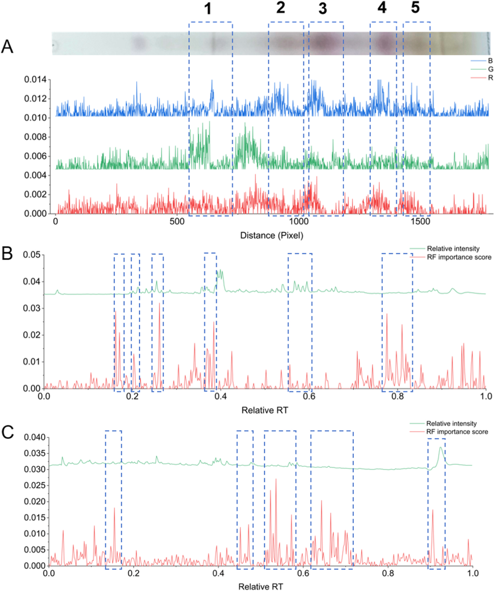
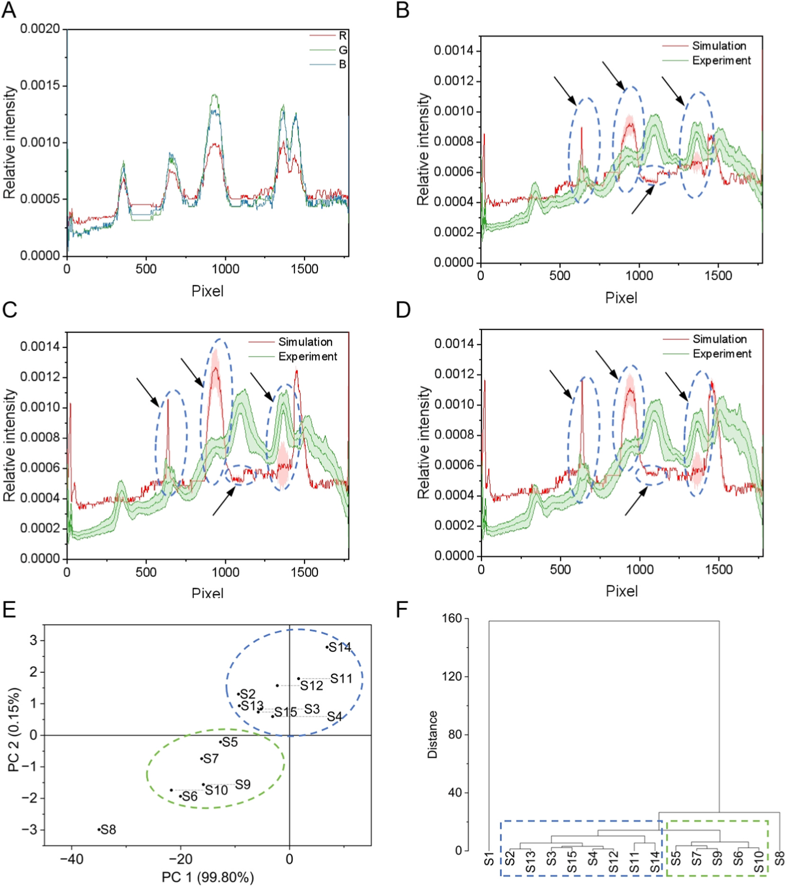
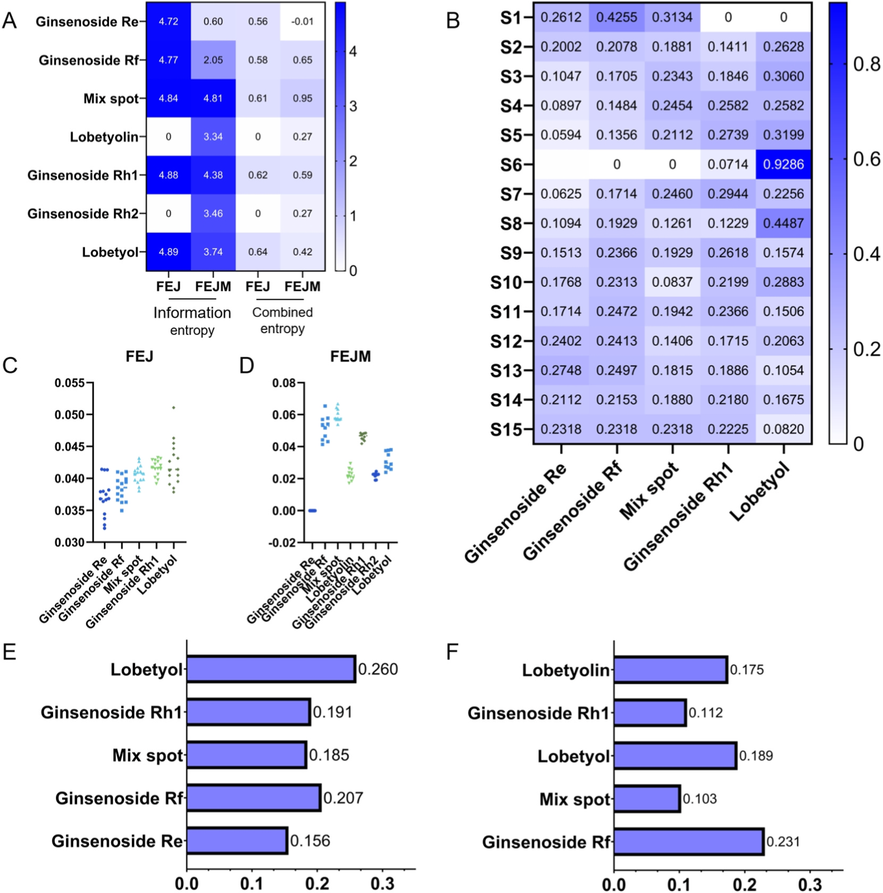

<!-- 方針: ほぼ全訳＋必要に応じた補足。原文構成に沿って訳出。「> 補足:」は訳者注。 -->

## 書誌情報

- 原題: Multidimensional chromatographic fingerprint fusion with machine learning: Entropy-based feature evaluation for TCM quality marker discovery
- 著者・所属: Jiamu Ma, Fang Lv, Letian Ying, Yongqi Yang, Yuqing Yang, Xiaodan Qi, Jianling Yao, Yu Cao, Lingzi Wu, Wanzhu Wang, Jiaqian Xing, Xinru Wu, Juan Qin, Yan Zhang（責任著者）, Gaimei She（責任著者）／北京中医薬大学 中薬学院（中国・北京市房山区）、東阿阿膠股份有限公司（山東省膠原薬物研究開発重点実験室、中国・聊城市）
- 掲載誌・巻号・DOI: *Talanta* 303 (2026) 129500. https://doi.org/10.1016/j.talanta.2026.129500
- インパクトファクター: **6.71**（*Talanta*, JCR 2024 / Clarivate。前年2023比+約8.6%、分野Q1）
- 受理経過 / ライセンス: 受領 2025-12-05 / 改訂 2026-01-19 / 採録 2026-02-01 / オンライン公開 2026-02-02。© 2026 Elsevier B.V.（テキスト・データマイニング、AI学習等を含め全権利留保）

> 補足: FEJ = 複方阿膠漿（Fufang E'jiao Jiang）、阿膠(ロバ皮膠)・熟地黄・紅参・党参・山査子からなる中薬複方製剤で、気血両虚に用いられる。FEJM = FEJの製造工程における中間体（intermediates）。TLC = 薄層クロマトグラフィー、LC-HRMS = 液体クロマトグラフィー高分解能質量分析、RF = ランダムフォレスト、VIP = PLS-DAにおける変数重要度、PCA/HCA = 主成分分析／階層的クラスタリング分析。

## 要旨（Abstract）

クロマトグラフィーは中薬(TCM)の品質評価に用いられる基幹的手法である。しかし、複数化合物のシグナルが重なり干渉し合うクロマトグラフィーデータの複雑さは、化学的に重要な特徴の正確な同定を妨げることが多い。本研究は、代表的な中薬複方である複方阿膠漿(FEJ)における特徴的化合物の分子起源を追跡するため、多次元クロマトグラフィー指紋と機械学習を組み合わせた統合的アプローチを提案した。網羅的な化学プロファイリングに続き、TLCおよびLC-HRMSを含むクロマトグラフィー指紋から多次元データセットを構築した。各データセットは保持時間・m/z・RGB値に由来する1700を超える特徴量を含む。ランダムフォレストなどの機械学習アルゴリズムを識別特徴の選定に用い、FEJに5パターン、その中間体に7パターンを同定し、主にジンセノシド類であることを明らかにした。シミュレーションモデルによりこれらの特徴の重要性をさらに検証し、単一化合物のクロマトグラフィースポットが試料特性を効果的に代表しうることを示した。また、修正エントロピー値と障害因子を導入し、選定された特徴を評価・重み付けした。その結果、lobetyolinとジンセノシドRfが、それぞれFEJおよびその中間体における主要な品質関連マーカーとして認識された。実験的検証により、本手法が重なり合うクロマトグラフィーシグナルを効果的にデコンボリューションし、品質に関わる主要な特徴を同定できることが示され、複雑系の品質管理のための効率的・拡張可能な計算フレームワークを提供する。要するに、この戦略は汎用的なデータ構造とモジュール化されたアルゴリズム設計に基づいており、特定の専門知識に依存することなく、複雑なクロマトグラフィー指紋を持つあらゆる試料系（医薬品、環境、食品試料など）に応用されることが期待される。

> 補足: Abstractでは主要品質マーカーが「lobetyolin」と表記されているが、後述の本文3.5節・図5では同じ化合物が「lobetyol」と表記されている（結論部でも「lobetyolin」表記に戻る）。lobetyol（ロベチオール）とlobetyolin（ロベチオリン）は党参(Codonopsis radix)に含まれる構造的に近縁だが異なる化合物であり、原文中でこの2つの表記が混在している。本翻訳では各section内の原文表記をそのまま訳出し、独自の統一・訂正は行っていない。実務上どちらの化合物を指すか判断が必要な場合は原文参照。

## 1. 序論（Introduction）

クロマトグラフィーは中薬(TCM)複方の品質評価に最も広く用いられる手法の一つであり、中でも薄層クロマトグラフィー(TLC)と液体クロマトグラフィー(LC)の組み合わせが最も一般的である[1]。TLCは複雑な化合物混合物の日常的な化学分析、特に低コストでの迅速な定性・定量分析が急務な場合によく用いられる。TLCは分離の速さと操作の容易さから、様々な化合物を含む混合物の分離において今なお欠くことのできない地位を占めている[2–5]。広く用いられるクロマトグラフィー手法の中でも、TLCは化合物とその代謝物の分析において最も単純な方法であると評価する研究者もいる[6,7]。TLCは移動相の選択の幅が広く、試料識別の柔軟性、高い負荷容量という特性を持つため、複雑な化学物質の化学組成プロファイルを取得することができる[8]。TLCが色によって豊富な化学物質のより明瞭な情報を提供するのに対し、質量分析と結合したLCは、ほぼすべての種類の二次代謝物について詳細な情報を提供する。液体クロマトグラフィー高分解能質量分析(LC-HRMS)は高感度かつ広い試料適応性を持ち、化学的特性の包括的・効率的な研究と試料間の動的変化のモニタリングを可能にする。しかし、TLCおよびLC-HRMSの生データの解析は、化学プロファイルのさらなる徹底的な理解を制限している。

TCMの複雑性を探るための全体論的かつ定量化可能なアプローチであるクロマトグラフィー指紋は、化合物の比較的完全な包括的プロファイルを構築するために本研究に導入された[9,10]。これまでの研究では、天然物の構造[11]や生薬原料の植物起源[12,13]などを分類するモデルが確立されてきた。これらの研究はコンピュータ処理によるTLC指紋の評価を試みてきたものの、特徴量の決め方によって分類結果やマーカー化合物選定の性能が異なり、依然として不明確である。化合物プロファイリングは、同一条件下で多数の試料を同時に可視化できるTLC画像によって精度良く達成しうる[13]。各バンドについて、バンドの色とパターンのグレースケールを調べることで、化合物組成プロファイリング特徴情報のセットを作成できる。しかし、TLC画像特徴であれLC-HRMSスペクトルデータであれ、鍵となる課題は、数百から数千に及ぶ変数の中から、単なるノイズや無関係な変動ではなく真に品質を示す、最も有益な特徴をいかに効果的に選択するかである。

TLC指紋から意味のある特徴や対応する化合物を特徴づけることは複雑な作業であり、クロマトグラム中の微妙な変化を定義することは通常困難である。ケミインフォマティクスは指紋の解析において重要な役割を果たす[9,10]。ケミインフォマティクス解析を用いることで、複雑な分析手順を省略できる[14]。一方で、より単純な機器や最小限の手順に切り替える際に、分析精度の低下が生じる可能性がある。機械学習やエントロピーモデルなどの他の評価手法を援用することで、この損失を十分に補う可能性が生まれる[15–17]。したがって、TLC指紋解析とケミインフォマティクス、機械学習に基づく特徴選択、エントロピーに基づく評価を統合することは、TLCデータを評価し重要な品質マーカーを同定するための強力なアプローチを構成しうる。これが本研究の焦点である。

複方阿膠漿(FEJ)は、阿膠(Colla corii Asini)、熟地黄(Radix Rehmanniae Preparata)、紅参、党参(Radix Codonopsis Pilosulae)、山査子(Fructus Crataegi)から構成される著名な中薬複方であり、中医臨床で広く用いられ、気血両虚に処方される[18]。これまでの我々の研究に続き、「スペクトルー薬効」関係とネットワーク薬理学を通じて品質マーカーがスクリーニングされ、FEJの品質規格も改良されてきた[2,18]。しかし、FEJの製造工程における主要化合物の伝達性・トレーサビリティは依然として不明である。サポニンおよびトリテルペノイドに富むn-ブタノール層は、中国薬局方[19]によりFEJの品質評価における重要画分として認識されている。したがって本研究では、化学物質全体ではなくこの特定の画分に焦点を当てた。

我々は、低コストで中薬複方の化学物質を評価することの重要性に対応するため、TLCとLC-MSクロマトグラフィー指紋を組み合わせた統合的アプローチを提案した。機械学習支援による特徴選択と計算による評価手法を用いることで、最終FEJ製品のみならずその中間製品(FEJM)においてもマーカー化合物を識別することを目指した。このアプローチにより、FEJにおけるlobetyolinと、FEJMにおけるジンセノシドRfを重要化合物として同定し、複雑な中薬複方の製造工程全体にわたる品質モニタリングとトレーサビリティのための新たな戦略を提供した。さらにこのアプローチは、「特徴融合―機械学習スクリーニング―エントロピー重み付け選択」というモジュール化された計算パイプラインとして設計されており、医薬品や環境試料など、専門分野固有の知識を必要とせず多様な複雑系に適応可能である。

## 2. 材料と方法（Materials and Methods）

### 2.1 試薬・材料・試薬類

複方阿膠漿(FEJ)15バッチ、FEJの7つの製造工程に由来する中間体21バッチ、および単一生薬を欠く陰性対照試料(N1〜N4)は、いずれも東阿阿膠股份有限公司より提供された。それぞれS1〜S15（FEJ試料）、I1〜I21（FEJ中間体）、N1〜N4（陰性試料）と番号付けされ、対応するロット番号は表S1に示された（原文参照）。

紅参（121045–200604）および党参（121057–202107）の基原生薬、ならびにジンセノシドRg2（111779–200801）、ジンセノシドRb1（110704–202230）、ジンセノシドRb2（111715–202104）、ジンセノシドRd（111818–202104）、ジンセノシドRe（LENA-CAAA）、ジンセノシドRg1（110703–202235）、ジンセノシドRg3（110804–201504）、ジンセノシドRh2（111748–202102）、ジンセノシドRo（111903–202106）の標準品は中国食品薬品検定研究院より入手した。ジンセノシドRc（DST180120-013）、ジンセノシドRb3（DST180913-008）は成都德思特生物技術有限公司（中国）より入手。ジンセノシドRh1（AF20050408）、ジンセノシドRg5（AF21051605）、lobetyol（136171-87-4）は成都埃法生物技術有限公司（中国）より入手。ジンセノシドRf（PRF9061942）とlobetyolin（PRF9121002）はBiopurify Phytochemicals社（中国）より入手した。すべての標準品の純度は98%を超える。上記以外の試薬はすべて市販品を使用した。

### 2.2 試料調製および標準溶液の調製

FEJおよびFEJMそれぞれについて、試料20 mLを水飽和n-ブタノール20 mLで1回抽出した。n-ブタノール層を分離し、アンモニア水溶液20 mLで1回洗浄した後、水飽和n-ブタノール20 mLでさらに3回抽出した。合わせた有機相を蒸発乾固し、残渣をメタノール1 mLに再溶解して、これを試験試料溶液とした。

生薬試料1.0 gを水50 mLで45分間超音波抽出した。定性濾紙で濾過後、この抽出液を対照溶液とした。この対照溶液は試料と同一の手順で処理した。標準溶液（ジンセノシドRo、ジンセノシドRe、ジンセノシドRf、ジンセノシドRh1、ジンセノシドRh2）はメタノールに溶解し1 mg/mLとして標準溶液とした。

### 2.3 TLCクロマトグラフィー条件

分離は10 cm×10 cmのシリカG薄層プレート（青島社製、中国）で行った。FEJ試料溶液（8 μL）、標準溶液（1 μL）、紅参基原生薬溶液（2 μL）、党参基原生薬溶液（8 μL）を定量毛細管で、プレート下端から10 mmの位置にスポットした。プレートは、クロロホルム：メタノール：1%ギ酸水溶液（6.5：2.5：0.5, v/v）からなる移動相で室温下約30分間あらかじめ飽和させた二槽式展開槽に入れた。展開剤がプレート下端から80 mmに達するまで展開した。展開後のプレートを槽から取り出し、乾燥後、10%硫酸エタノール溶液に浸漬し、パターンが明瞭な発色を示すまで105 ℃で加熱した。すべてのプレート画像は可視光下で記録した。

### 2.4 UPLC-QE-MS/MS分析

UPLC分析はVanquish UPLC装置（Thermo Fisher Scientific社、Waltham, MA, USA）で実施した。クロマトグラフィー条件は以下の通り。HSS T3カラム（2.1 mm×100 mm、1.8 μm、Waters社、Milford, MA, USA）を用い、流速0.3 mL/min、カラム温度35 ℃で分析した。移動相AおよびBはそれぞれ0.1%ギ酸水（v/v）、アセトニトリルとした。グラジエントプログラムは以下の通り: 0–5 min、95%–75% A；5–15 min、75%–50% A；15–20 min、50%–30% A；20–25 min、30%–5% A；25–28 min、5%–95% A；28–30 min、95% A。試料は15 ℃に維持し、注入量は5.0 μLとした。

質量分析はQ Exactive Orbitrap高分解能質量分析計（Waltham, MA, USA）を用い、ESI正・負イオン化モードで実施した。取得条件は以下の通り: スプレー電圧 3.8 kV（正）または −3.2 kV（負）；キャピラリー温度 350 ℃；補助ガスヒーター 350 ℃；シースガス 40 Arb；補助ガス 15 Arb；質量範囲 m/z 100–1500。フルMS分解能: 70000、MS/MS分解能: 17500、衝突エネルギー: 15/30/45（NCEモード）。

### 2.5 データセットのプロファイリングおよびTLC・LC-HRMS指紋の構築

#### 2.5.1 TLC指紋の構築

TLC画像はスマートフォンカメラを用いて取得した。スマートフォンは固定スタンドに設置し、TLCプレートは水平面に置いた。一貫性を保つため、すべての画像はカメラフラッシュを使用せず一定の室内照明下で撮影した。前処理を標準化するため、元のTLCプレート画像をAdobe Photoshopに読み込んだ。簡潔に言えば、メディアンフィルタを用いて各試料のチャネルを脱彩・ノイズ除去し、同一サイズの単一画像とした。ImageJを用いて「Plot Profile」機能により画像画素のRGB（赤・緑・青）チャネルからデータを抽出した。RGBチャネルの強度値を反転し、各チャネルの強度値を差し引くことで、最大強度値255の「画素強度」行列を作成した。ImageJの「Measure」機能はパターンのグレー値を決定するのに用いられ、同時にRf値を算出した。元のTLCプレート画像はまずグレースケールに変換した。各画素位置における相対グレースケール強度は、その絶対強度をレーン（またはプレート）全体のグレースケール強度の総和に対して正規化することで算出した。この過程は式(1)として以下のように表され、各画素の強度が全体の化学プロファイルへの相対的寄与を表す正規化二次元データセットを生成する。したがって、「グレー値―Rf値」行列が得られた。

> 式(1): Irel = Ipixel / ΣItotal（Irelは個々の画素の相対グレースケール強度、Ipixelは計算対象画素の絶対グレースケール強度、Itotalはレーン全体のすべての画素の絶対グレースケール強度の総和）
>
> 補足: 原文PDFの数式部分はOCR変換時に文字順序が崩れており（例: 「Irel = ∑Ipixel Itotal (1)」）、上記は前後の説明文（「絶対強度をレーン全体の強度の総和に対して正規化する」）に基づき本来の意味に復元したもの。正確な数式表記は原文PDF参照。

FEJおよびその中間体のTLC指紋は、画素強度行列を用いて解析した。画素補正およびピークマッチングのため、試料S1のRGB強度マップを基準パターンとして用いた。データ幅は1画素に設定した。強度値の平均を算出することで対照マップを作成した。解析は10 cm×10 cmのTLCプレートで行い、元画像の解像度はFEJで2300×2250画素、FEJMで2800×2250画素であった。ピーク補正・マッチング後、FEJのTLC指紋を構築した。

類似性評価はコサイン類似度法に従って実施し、対照マップを標準として用いた。算出式は式(2)として以下の通り示された。

> 式(2)（コサイン類似度）: S = Σxᵢyᵢ / (√Σxᵢ² × √Σyᵢ²)（xᵢは画素値、yᵢは対応画素の強度を表す）
>
> 補足: この式もOCR上で分子・分母の記号が入れ替わって抽出されていたため、標準的なコサイン類似度の定義式（本文の「コサイン類似度法」という記述および直後の変数説明と整合する形）として復元した。

#### 2.5.2 LC-HRMS指紋の構築

すべての生データファイルは.mzML形式に変換し、MSDIAL（v 5.4.24）を用いてMS/MSレベルのすべてのスペクトルを抽出した。スペクトルの強度、プリカーサーイオンm/z、保持時間も記録した。次に、保持時間が0.5分未満、またはMS/MSスペクトルを欠くスペクトルは除外した。スペクトルは、社内データ、参照標準品、およびMSFinder（v 3.61）による計算に基づいてアノテーションされ、主要フラグメントを記録した。保持時間は、絶対保持時間をそれぞれの最大保持時間で除することで正規化した。フラグメント強度は、各スペクトルのピークごとに、そのピークの強度をスペクトル全体の強度で除することで正規化した。

LC-HRMS指紋は、解析用に2つの相補的なデータセットを生成するよう処理された。第一に、各試料について「保持時間―全イオン強度」行列を構築した。これらの行列のコサイン類似度を算出して全体プロファイルの類似性を評価し、試料間で顕著な分散を示す保持時間領域を特定した（TLC画像行列解析に用いたものと同様の手法）。第二に、特定された差異領域について、「相対保持時間―プリカーサーイオンm/z」リストを抽出し、分散に寄与する特定の化合物のアノテーションを容易にした。

### 2.6 意味のある特徴を選定するための計算モデル

#### 2.6.1 ケミインフォマティクス解析

7つの異なる製造工程に由来するFEJ 15バッチおよびFEJM 7バッチを検証に用いた。ケミインフォマティクス解析を用いてTLCおよびLC-HRMS指紋の両方を評価し、これらバッチ間の類似性・差異を明らかにした。主成分分析(PCA)と階層的クラスタリング分析(HCA)を併用してFEJおよびその中間体を評価した。解析はOrigin 2024bで実施した。

#### 2.6.2 特徴選択

TLCおよびLC-HRMS指紋から識別特徴を選択するため、ランダムフォレスト(RF)分類器を実装した。解析はPython（バージョン3.9）およびscikit-learn機械学習ライブラリ（バージョン1.2）を用いて実施した。RFモデルは以下のハイパーパラメータで設定した: 決定木の数は1000本、各木の最大深度はNone（すべての葉が純粋になるまでノードを展開）、各ノードでの最良分割に考慮される特徴数は「sqrt」（全特徴数の平方根）とした。分割の質の評価にはGini不純度基準を用いた。それ以外のパラメータはscikit-learn 1.2のデフォルト設定を用いた。頑健な識別特徴を同定するため、二段階の基準を適用した。第一に、PLS-DAモデルから変数重要度(VIP)スコアが1.0を超える特徴を選定した[20,21]。次に、これら候補特徴の重要度をRFモデルにおけるGini係数平均減少量によって検証し、両アルゴリズムで一貫して上位の寄与因子としてランクされることを確認した。

#### 2.6.3 選定特徴によるTLC指紋のシミュレーションのためのフィッティングモデル

選定された特徴のTLC指紋プロファイル全体への寄与を定量的に評価するため、線形フィッティングモデルを構築した。このモデルは、ある位置におけるクロマトグラフィーシグナルの強度が対応化合物の濃度に比例するという原理に基づく。累積指紋F(p̃)は任意の点において、すべての個別成分からの寄与の総和としてモデル化できる。式は式(3)として以下の通り示された。

> 式(3): F(p̃) = Σᵢ Cᵢ × Iᵢ(p̃)（p̃はTLC指紋内の空間座標（例: 相対保持係数Rf）、Cᵢは化合物iの濃度、Iᵢ(p̃)は化合物iの強度で、単位濃度における純標準品の標準化強度プロファイルを表す。このプロファイルは化合物の化学的性質と固定相との相互作用によって規定される、TLCプレート上での特徴的な空間位置とバンド形状を定義する。）

### 2.7 修正エントロピー値と障害因子による特徴評価

クロマトグラフィー指紋から選定された特徴を定量的に評価し、FEJまたはFEJMの化学プロファイリング全体への相対的寄与を評価するため、修正結合エントロピーモデルを用いた。このモデルは各特徴のエントロピー重みを算出することで機能し、これは情報的重要性の客観的な指標として機能する。エントロピーが低い（すなわち試料間でシグナル分布がより一貫し、ランダム性が低い）特徴は、より安定的であり、品質マーカーとしての潜在性がより高いとみなされ、より高い重みが割り当てられる。プロセスは、各特徴のグレースケール強度を抽出・正規化するデータ前処理から始まった。第i番目の特徴について、全試料にわたる強度値は式(4)によって確率様の値に変換され、その相対的存在量を表す。続いて、情報エントロピー(Eᵢ)を式(5)により算出し、試料集合全体にわたるその強度分布の無秩序性・ランダム性を定量化した（Eᵢが大きいほど変動が大きく安定性が低いことを示す）。最後に、エントロピー重み(Wᵢ)を式(6)により導出し、これはエントロピーを重み係数に変換するものである。

> 式(4): pᵢ = xᵢ / Σxᵢ
> 式(5): Eᵢ = −Σⁿᵢ₌₁ pᵢ ln(pᵢ) / ln(n)
> 式(6): Wᵢ = (1 − Eᵢ) / Σ(1 − Eᵢ)
>
> （iは第i番目の特徴、xᵢは絶対強度を表す。この計算により、より安定な特徴（エントロピーEᵢが低い特徴）ほど高い重み(Wᵢ)が与えられるようにした。これは最大エントロピー状態からの乖離の度合いを表す。式(6)の分母の総和はすべての特徴にわたって取られ、重みの合計が1になるよう正規化する。）

このフレームワークでは、より高いエントロピー重みを持つ特徴が潜在的な品質マーカーとして優先された。これは、その一貫したシグナルがより信頼性の高い製品品質の指標となるためである[22]。

指紋プロファイル中の価値あるパターンの情報エントロピーを包括的に評価するため、以下の計算を導入した。

> 式(7): gᵢ = 1 − Wᵢ（gᵢは情報効用値）
> 式(8): Rᵢ = Wᵢ / Σⁿᵢ₌₁ Wᵢ（Rᵢは相関TLCパターンの重みを示す）
> 式(9): Cᵢ = Σⁿᵢ₌₁ Rᵢ Xᵢ（Cᵢは意味のある特徴の結合効用値を示す）

障害因子診断モデルは、FEJ試料およびFEJ中間体の品質に対する各価値ある化合物の障害度を算出するために用いた。障害因子診断モデルの式は以下の通り示された。

> 式(10): Oᵢⱼ = Σⁿⱼ₌₁ Coᵢⱼ Deᵢⱼ / Σᵐᵢ₌₁ Coᵢⱼ Deᵢⱼ（Oᵢⱼは第jバッチにおける第i化合物の障害度。Coᵢⱼは因子寄与度で本研究では等しい重みを割り当てた。Deᵢⱼは目標値と実際値との差として算出される偏差度を表す。本研究では各化合物の目標値を正規化最大値（すなわち1）と定義したため、Deᵢⱼは各指標の正規化値の補数として表される。）

## 3. 結果と考察（Results and Discussion）

### 3.1 TLCおよびLC-HRMS指紋のプロファイリング

#### 3.1.1 TLCプロファイリング解析

確立されたFEJのTLC条件は、中国薬局方収載法と比較して改変されたものである。この方法は、同一の試料調製法・TLC条件を用いて紅参と党参片という2種の生薬を1枚のプレート上で同時に識別することを可能にし、識別効率を大幅に改善した。従来の研究と比較して、本法は2生薬由来のより多くの標準品を参照しており、価値ある化合物を同定できる可能性を高めた[2]。FEJおよびFEJM試料に確立されたTLC法は、特異性・再現性・耐久性の評価によって検証された（図S1、原文参照）。方法検証に続き、FEJの異なるバッチのTLCプレート解析により、標準溶液との比較で6化合物が同定された（図S2A、原文参照）。紅参およびCR（党参）の主要化合物も、基原生薬の参照試料に従いFEJ試料中に同様に確認された。FEJ試料に関しては、大部分のバンドは本質的に同一であったが、色の濃淡にわずかな差異が依然として認められ、ジンセノシドRo、ジンセノシドRe、ジンセノシドRfなどの化合物含量が大きく変動していることが示唆された。「基原生薬－生薬飲片－中間体－製剤」のTLCプレートでも、バンドは同様の傾向を示した（図S2B、原文参照）。標準品および陰性対照試料と比較して、ジンセノシド（例: ジンセノシドRg1、Rg5）が顕著に富化していることが明らかであった。対照的に、熟地黄または山査子に由来すると推定される特定の化合物の含量は減少していた。一方で、経験や標準参照品の種類が従来のTLC分析法の厳しい制約であることは依然として弱点であった。このため、試料中の重要な分子を精密に同定することが困難であり、試料の品質評価・管理を難しくしていた。

#### 3.1.2 LC-HRMSプロファイリング解析

FEJおよびFEJMの化合物プロファイリングは、フルスキャンモードのUPLC-HRMSにより調査した。図1D・Eのトータルイオンクロマトグラム(TIC)に示すように、良好に分離されたピークが観察された。本研究では、18種のジンセノシド、ステロイド、脂肪酸、フラボノイドおよびその他の化学物質種を含む計**826化合物**が同定された。標準品との保持時間、分子量、タンデム質量スペクトルの比較により、**15種のトリテルペノイドサポニン**を同定した。化合物リストは表S2に示された（原文参照）。

ここでは、FEJの代表的な主要化学タイプであるプロトパナキサトリオール(PPT)型ジンセノシドとプロトパナキサジオール(PPD)型ジンセノシドを例に、化合物同定プロセスを示す。ジンセノシドは主に、C-3位に（C-20位の有無にかかわらず）糖鎖を持つPPD型と、C-6位に（C-20位の有無にかかわらず）糖鎖を持つPPT型の2つの主要グループに大別された。

化合物#341（保持時間10.74分）と化合物#571（保持時間18.36分）は、いずれも同一のプリカーサー質量 m/z 799.48 を示した。両化合物は、単一のグルコース単位の脱離（[M-H-Glu]−）に対応する m/z 637.4335 のフラグメントイオンを生成した。続いて、2つ目のグルコース単位の脱離（[M-H-2Glu]−）に対応する m/z 475.3732 のフラグメントイオンが観察された。これらイオン間の約162 Daの質量差は、2つのヘキソース残基の逐次脱離を確実に裏付け、ジグリコシド構造を示す。提唱されたフラグメンテーション経路に従い、社内ライブラリにおける潜在的構造をスクリーニングした結果、化合物#341はジンセノシドRg1またはジンセノシドRfのいずれかと同定された。両者のClogP値を比較すると、ジンセノシドRg1は2.292、ジンセノシドRfは3.097であり、ジンセノシドRfの方がより長い保持時間を示すことが示唆された。したがって、化合物#341はジンセノシドRg1、化合物#571はジンセノシドRfと同定された。

化合物#366は保持時間11.39分に溶出し、プリカーサー質量は m/z 1107.5958 であった。C-20位のオレフィン鎖の解離により生じる特徴的フラグメントイオンである m/z 375.2913 のプロダクトイオンは、この化合物がPPD型ジンセノシドに属する可能性を示した。さらに、プリカーサーイオンからの1つのグルコース置換基の逐次的解離により、m/z 945.6276、m/z 783.4916、m/z 621.4384 のフラグメントが形成された。したがって化合物#366はジンセノシドRb1と同定された。

総じて、FEJとFEJMの化合物組成にはわずかな差異が認められ、これは製造工程中の化合物変換に起因すると考えられる。UPLC-HRMS解析は二次代謝物の同定に十分な情報を提供しうるものであった。

### 3.2 多次元指紋データセットの構築と評価

生のTLC画像は従来の解析対象であるが、デジタル解析なしにはぼやけたパターンを判別することは困難である。さらに、パターンの色の濃淡の差異によってもたらされるTLCの定量的性質も、価値ある化合物の同定の難しさを増大させる。本研究では、TLC画像をRGBチャネルの信号を個別に抽出することで信号スペクトルに変換した。これは確立された手法[12]に従い修正を加えたものである。画素強度行列とグレー値-Rf値行列は、それぞれ異なる解析目的を果たした。前者はクロマトグラム画像全体の完全かつ高解像度のRGB情報を捉えるものであり、その3つの次元（FEJで3×15×2180、FEJMで3×14×2180）は、それぞれRGBカラーチャネル、試料数、展開方向に沿った総画素数を表す。この行列は全体的なパターン認識と類似性解析に用いられた。対照的に、グレー値-Rf値行列は、特定の化学的バンドの定量的評価のために設計された凝縮特徴行列であった。これは画像をグレースケールに変換し、あらかじめ定めたRf位置における平均グレー値を抽出することで生成された。したがって、その次元（FEJで1×15×12、FEJMで1×14×12）は、単一データチャネル（グレー値）、試料数、追跡バンド数（Rfポイント）に対応する。TLC画像は画素・強度・グレー値という3つの要素から構成される。これらの要素が相互に作用することで、元のTLC画像を容易に検討可能なデータセットへと変換する。複雑な化合物混合物の分子起源を明らかにするため、TLCプレート中の価値ある化合物を同定する手法として、指紋の構築から着手する方法が提案された。図1Aに示すワークフローに従い、TLC指紋を構築し、FEJおよびFEJMのTLC指紋を図1B・C・Fに示した。さらに、LC-HRMS指紋もTLC指紋のワークフローに若干の調整を加えて構築し、広大な化学空間の視点から並行する参照となることを目指した。予想通り、より多くの化合物がLC-HRMS指紋によって検出された（図1D・E・G）。しかし、これらの化合物の寄与度、および特徴的化合物が混合物全体を代表しうるかどうかは不明であった。

TLC指紋データセット（「画素強度」行列および「グレー値-Rf値」行列を含む）は、前処理（各チャネルの脱彩・ノイズ除去、行列変換など）を経て構築された。FEJ試料の「画素強度」行列では、データセットは1781×19の特徴量から形成された。「グレー値-Rf値」行列では同時に2181×22の特徴量があった。異なるバッチのFEJの主要な特性は目視検査ではほぼ同一であったが、一部のピーク（TLCパターン）に試料間でわずかな差異があることが明らかであった（図S3 A-C、原文参照）。化学物質の組成のみならず、主要化合物の相対含量も指紋プロファイリングに影響を与えた。この結果は、FEJの安定した高品質を保証するために価値ある化合物を管理することの必要性を示した。FEJMのTLC指紋については、FEJ試料と比較して、製造工程中により多くの化合物が大きく変化した（図S3 D-F、原文参照）。これは製造工程が化学組成と化合物含量を変化させたことを示す。報告によれば、ジンセノシドの化学的変換は通常、抽出工程やpHの変化の間に生じる[23,24]。サポニンおよびトリテルペン含量は、抽出方法によっても増加または減少しうる。ここで、特徴的代謝物を同定・アノテーションすることは、試料の変動に関する重要な情報を提供し、品質評価のための根拠を与えるものであった。LC-HRMS指紋については（図1D・E）、ピークの差異はより均等に分布しており、TLC指紋における比較的集中したピーク差異の分布とは対照的であった。LC-HRMSが分離能を発揮し、極性が類似する化合物もTLC指紋とは異なり容易に区別できることは理解しやすい。TLC指紋は既知化合物を直感的に同定する点で代替不可能な利点を持ち、これにより品質評価を達成するための労力と時間が削減される。言い換えれば、TLC指紋は、特徴的化合物が明確になれば、化合物混合物の品質を評価するための最も簡便な解析法の一つである。

これらの試料間の差異を評価するため、FEJおよびFEJMのTLC指紋プロファイリングの「画素強度」データセットについて類似性評価を実施した。結果は、FEJのTLC指紋のR・G・Bチャネルにおける試料クロマトグラムと対照クロマトグラムとの類似度が0.9551〜0.9981の範囲であることを示し（表S2-S4、原文参照）、異なるバッチのFEJが高い類似性と安定した工程を持つことを示した。「基原生薬－生薬飲片－中間体－製剤」のTLC指紋では、R・G・Bチャネルと対照スペクトルとの類似度は0.8383〜0.9962の範囲であった（表S5-S7、原文参照）。RGBチャネル間の傾向と同様に、R・Gチャネルの方が類似度が高く、これはFEJおよびその中間体の試料が青色の染色を持つことに影響を与えた化合物が異なることを示した。天然物の染色は赤または青の傾向を持つと報告されている[11]。LC-HRMS指紋の結果では、FEJ試料の正・負イオンモードにおける類似度は0.9733〜0.9990の範囲であり（表S8-S9、原文参照）、FEJ中間体では0.8627〜0.9975の範囲であった（表S10-S11、原文参照）。負イオンモードは正イオンモードと比較してより低い類似度を示し、バッチ間の差異は主に負イオンモードで検出された。トリテルペノイドサポニンは、これらの化合物が紅参・党参のn-ブタノール画分に富化されていることから、FEJおよびその中間体の主要な化学タイプであった。このことから我々はこの化学タイプに着目した。結論として、これらの結果はTLC指紋プロファイリングの結果と一致しており、試料間の化学組成と相対含量の差異を確認するものであった。TLC指紋とLC-HRMS指紋の類似性を比較すると、LC-HRMS指紋の結果はより高い類似性を示したが、TLC指紋の結果と有意な差はなかった。これは試料をプロファイリングするためのTLC指紋の利用が実行可能であることを示した。

ケミインフォマティクス解析はクロマトグラフィー指紋の評価に適した手法として認識されている。これは、分析物分離に必要な簡略化された試料調製工程によって生じることの多い非理想的な分析シグナルを効果的に処理する[14]。したがって、TLC指紋の構築に続き、PCAとHCAを用いて複雑な物理的操作への依存を評価・軽減した。「画素強度」行列を入力として用い、いくつかの主成分に分解した。文献で報告されているように、生薬の異なるバッチ、煎じ方の工程、その他の製造要因が化合物の組成プロファイルに集合的に影響を与える[25,26]。本研究では、FEJおよびその中間体のTLC指紋のPCAとHCAにより、特に製造バッチ間、および最終製品(FEJ)とその中間体(FEJM)間で、試料間の化学組成に顕著な差異が明らかになった。TLC指紋において、党参片とFEJMの方が紅参よりも類似性が高いことは注目に値する。これはトリテルペノイドサポニンの製造工程中の動的変化に起因する可能性があり[26]、FEJを適切に評価するためにはより紅参に着目すべきことを示唆した。FEJ試料の多様性・共通性、および伝達過程を理解するため、PCA解析とHCA解析を適用した。図2に示すように、FEJ試料はR・G・Bチャネルにおいて3群に分類された。Rチャネルの PCA解析では、試料はPC1（説明分散48.82%）とPC2（説明分散23.42%）に沿った傾向を示し、これは対応する化学構成成分の含量にも関連する強度と相対画素を反映した。G・Bチャネルの結果では、PC1はそれぞれ45.12%と47.90%、PC2は29.89%と28.10%であった。HCA解析でも同様の分類結果が観察された（図2D-F）。RGBチャネルで異なる分類結果が観察され、RチャネルとBチャネルは同一の分類結果を示し、化合物組成がR・Bチャネルで同一の色特徴を持つことを示した。さらに、S6・S9・S10を除き、大部分のFEJ試料は異なる色特徴と強度に基づいて区別することが困難であった。FEJ試料における不安定な分類とは異なり、FEJM試料のRGBチャネルでは一貫した分類結果が観察され（図S4、原文参照）、製造工程が試料に与える影響が有意であることを示した。LC-HRMS指紋のPCAおよびHCA解析の結果はTLC指紋の結果と類似していたが、化合物組成に関するより詳細な情報が分類結果にわずかに影響を与える可能性があった（図S5、原文参照）。TLC指紋解析の結果と一致して、負イオンモードの分類結果は化学組成の変化により影響を受けやすかった。さらに、FEJM試料は正イオンモードと負イオンモードで同一の分類結果を示し、有意な差異があるという同様の結果に達した。総じて、FEJ試料および伝達過程のTLC指紋とLC-HRMS指紋のケミインフォマティクス解析は、パターンが変動することを示し、化合物含量がFEJ製品の品質および製造効率に影響を与えうることを示した。このため、鍵となるパターンまたは化合物を同定することが、FEJの品質管理・評価にとって不可欠であった。

### 3.3 TLC指紋・LC-HRMS指紋プロファイリングの特徴選択

ケミインフォマティクスによるTLC指紋の基礎的評価に続き、特徴的化合物を見出すことを目的として、ランダムフォレストによるTLC指紋シグナルの特徴選択を実施した。ランダムフォレストは高い安定性と強い汎化性能を持つことから分類に広く用いられている。ランダムフォレストは、予測変数と結果の関係を解釈する内部テストも達成できる[27,28]。これらの特性は信頼性の高い特徴選択結果をもたらす。我々の先行研究では、FEJから5つの特徴パターン、FEJM試料から7つの特徴パターンが選定された。次いで、標準溶液との比較により、FEJでは計7化合物（ジンセノシドRg1・ジンセノシドRg2・ジンセノシドRg3の混合パターンを含む）、FEJMでは計9化合物（同じ混合パターンを含む）が同定された。ランダムフォレストは、RGBチャネルの「画素強度」行列ならびにフラグメント強度・相対保持時間に基づいて、TLCプロファイルおよびLC-HRMSの特性に顕著な影響を持つ特徴を選定するために適用された。図3に示すように、FEJ試料のTLC指紋から5つの画素バンド、LC-HRMS指紋の負イオンモードから6つのバンド、正イオンモードから4つのバンドが選定された。図3Aでは、No.1〜No.5のバンドは標準溶液との比較により、それぞれジンセノシドRe、ジンセノシドRf、混合スポット、ジンセノシドRh1、lobetyolと同定された。このうち、混合スポットは標準品との共泳動により、少なくともジンセノシドRg1・ジンセノシドRg2・ジンセノシドRg3を含むことが同定された。ただし、TLC指紋の選択は依然として明瞭な形状と最適な分離特性を持つ主要スポットを優先しており、低存在量またはテーリングが顕著な微量成分は判別困難なままであり、結果として解析から除外された。TLC指紋と比較して、LC-HRMS指紋はバッチ間の差異をもたらす価値ある化合物についてより詳細な情報を持っていた。図3B・Cに示す結果の通り、選定されたLC-HRMS指紋の特徴は、相対RT約0.45〜0.71（正イオンモード）および約0.15〜0.38（負イオンモード）付近で高いRF重要度値を持つより詳細な情報を持っていた。ジンセノシドRb1、ノトジンセノシドR2、lobetyolinなどの化合物が、この保持時間帯における主要な化合物タイプであった。LC-HRMS指紋の選定結果は、FEJおよびFEJMの主要化学タイプに関する既存知見と正確に対応していた。これは、主要化学タイプへの着目が化合物混合物の品質評価に優れた方法であることを示す。しかし、FEJの品質に顕著な寄与を持つ特定の化合物については依然として不明であり、さらなる解析が必要であった。

FEJM試料における特徴選択（図S6、原文参照）についても、ほぼ同様の結果が観察された。わずかな差異として、FEJMではTLC指紋で7つの特徴バンドが選定され、それぞれジンセノシドRe、ジンセノシドRf、混合化合物、lobetyolin、ジンセノシドRh1、ジンセノシドRh2、lobetyolと同定された。より多くの化合物が選定されたことは、伝達過程が試料間でより多くの差異情報を持ち、試料間の差異がFEJ試料と比較してより大きいことを示した。FEJMのLC-HRMS指紋の選定では、同様の範囲が得られた。ただし、RF重要度値はFEJ試料ほど顕著に高い値を示さなかった。これはFEJMの組成・含量が多様であることに起因する可能性がある。総じて、lobetyolinとジンセノシドRh2が、伝達過程においてFEJ試料とは異なる特徴的化合物であった。

### 3.4 選定特徴に基づくTLC指紋のシミュレーション

選定された特徴が試料全体に対して持つ特性とその重要性を把握するため、特徴のみが存在する場合のTLC指紋プロファイリングの変化を記述するシミュレーションモデルを導入した[29]。このシミュレーションモデルは、スペクトル指紋を主要化合物からのスペクトル寄与の線形結合として定式化するもので、異なる試料間の化学組成の変化を明らかにするとともに、スペクトルの差異を特定の化合物濃度の変化に直接結びつける。FEJ試料の類似性評価は、TLCまたはLC-HRMS指紋の構築に用いたのと同じコサイン類似度法に基づき、R・G・Bチャネルからそれぞれ算出された（表S12-S17、原文参照）。シミュレーションTLC指紋と実験TLC指紋との間の類似度は、R・G・Bチャネルでそれぞれ0.9440〜0.9950、0.8836〜0.9827、0.8590〜0.9856の範囲であった。また、これらシミュレーションTLC指紋自体の間の類似度は、Rチャネルで0.9931〜0.9999、Gチャネルで0.9738〜0.9999、Bチャネルで0.9746〜0.9999の範囲であった。一方、FEJM試料では、実験試料との比較でRチャネル0.9106〜0.9997、Gチャネル0.8850〜0.9994、Bチャネル0.8778〜0.9956の類似度が得られた。それらの自己間の類似度評価もRチャネル0.9733〜0.9999、Gチャネル0.9393〜0.9999、Bチャネル0.9616〜0.9999であった。これらの結果は、Rチャネルでより良好なシミュレーションを示す一方、含量が高く優れたスポット形成特性を持つバンドで優れたシミュレーション性能が観察されたことを示した。これはTLC自体の特性として、判別可能なスポットのみが同定可能であることに起因する可能性がある。一方でこれは、化学物質を完全に特徴づけるためにはより多くの相条件が必要であることを示した。本研究の場合、FEJのn-ブタノール相の物質における主要化学タイプはトリテルペノイドであったため、本研究はこの化学タイプに焦点を当てて実施された。

TLC指紋（強度-画素）の単純なシミュレーションモデルを得た上で、選定された特徴の性能を容易に把握することができた。図4に示す結果の通り、FEJM試料はより優れたシミュレーション性能を示した。予想通り、混合スポットは不良なシミュレーション性能を示し、混合スポットがジンセノシドRg1・ジンセノシドRg2・ジンセノシドRg3のみならず、ligustroside、ノトジンセノシドR2など極性の類似する化合物をさらに含んでいたことを示した。さらに、PCAおよびHCA解析における分類は実験結果とほぼ同一の結果を示し、正確な特徴選択法とシミュレーション法の信頼性を示した。

結論として、確立されたシミュレーション法における結果は、特徴がTLC指紋全体を代替しうるという方法が実行可能であることを証明した。

### 3.5 修正エントロピー法に基づく価値ある化合物の評価

特徴的化合物を評価し、FEJおよび伝達過程へのその寄与を理解するため、結合エントロピーモデルおよび閾値を確立した。TLC指紋の「グレー値-Rf値」行列を用いて情報エントロピーおよび結合エントロピーを算出した。

情報エントロピーは不確実性の尺度である。不確実性が大きいほど、より無秩序である。TLC指紋の解析により、試料間にかなりの不均一性があることが明らかになった。プロファイルは化学的特徴の数・強度の両方において明確な差異を示し、試料間変動が高いことを示した。FEJ試料の平均情報エントロピー値は**1.6072**、伝達過程の値は**1.5983**であった。FEJ試料および伝達過程の平均情報エントロピー値は両システムの複雑さがほぼ同等であることを示した。情報エントロピーはまた、FEJ試料における5つの鍵化合物の重要性がほぼ同等であることを示した。一方、伝達過程における7つの鍵化合物は多様な情報エントロピー値を示した。全体として、lobetyol、ジンセノシドRh1、ならびにジンセノシドRg1・ジンセノシドRg2・ジンセノシドRg3からなる混合パターンが、FEJ試料と伝達過程の両方において上位の最も価値ある化合物であった（図5A）。しかし、鍵化合物の情報エントロピー値が近接しているため、価値ある化合物を区別することは依然として困難であった。そこで、鍵化合物を正確にランク付けする評価手法として結合エントロピーが導入された。化合物の総合結合エントロピー値の算出結果（図5B）から、ジンセノシドRfも、情報エントロピー値において同定された鍵化合物とは別に、FEJ試料と伝達過程の両方における価値ある化合物と考えられた。さらに、FEJおよび伝達過程における各試料の結合エントロピーは、試料間の差異を詳細に示した（図5C〜D）。伝達過程と比較して、FEJ試料はより分散した結合エントロピーを持っていた。これは、FEJ試料のTLCプロファイルが伝達過程よりも複雑であるという同じ結論に達するものであった。

障害度は、システム全体へのそれらの寄与度に関する情報を提供する修正エントロピー値から得られるもう一つの値である。具体的には、より高い閾値（1に近い）はシステムにおけるより重要な役割を意味し、より低い閾値（0に近い）はファジーシステムへのより小さな寄与を意味する。図5B・E-Fに示す結果の通り、lobetyolはFEJ試料において**最高の障害度0.260**を得て、ジンセノシドRfはFEJM試料において**障害度0.231**であった。これは、それぞれFEJおよびFEJM試料において大きな寄与を持つ特徴的化合物であることを示した。また、この結果は修正エントロピー評価と同じ結果を示した。全体のTLCプロファイル、試料の結合エントロピー値の分布・分散をまとめると、lobetyol、ジンセノシドRh1、ジンセノシドRg1、ジンセノシドRg2、ジンセノシドRg3（混合パターン）が、FEJ試料において有意な影響を持つマーカー化合物として同定された。一方、ジンセノシドRg1・ジンセノシドRg2・ジンセノシドRg3（混合スポット）、ジンセノシドRf、ジンセノシドRh1が伝達過程のマーカーであった。この結果は、党参由来の化合物が製品の伝達過程において安定であることを示し、HCA解析結果と一致していた。

マーカー化合物を同定するにあたり、これら差異化合物の寄与度を解明することが依然として鍵となる課題であった。エントロピーは動的複雑性を測定する典型的な概念であり、ファジーシステムの評価に導入されてきた[30]。本研究では、情報エントロピーと結合エントロピーの両方を用いて鍵化合物を評価した。情報エントロピーは微視的な無秩序に対する直接的な尺度であり、信号処理における重要な手法の一つとして認識されている[31]。その目的は、確率変数の情報量または固有の不確実性を定量化することであり[16]、時系列データや画像データにも応用されてきた[32,33]。情報エントロピーとシグナル強度との関連性は最近の研究でも考察されており[16,34]、化合物の情報エントロピーが小さいほど、一貫したシグナル強度分布を持つ可能性が高いとされる。言い換えれば、マーカー化合物、すなわち製造工程による影響が大きい化合物ほど、より大きな情報エントロピーを持つ。したがって、マーカー化合物を重み付けするために結合エントロピーが提案された。結果として、ジンセノシドRh1、およびジンセノシドRg1・ジンセノシドRg2・ジンセノシドRg3からなる顕著な混合パターンが、FEJ試料と伝達過程の両方における品質マーカーとして同定された。一方、lobetyolはFEJ試料に特有のマーカー、ジンセノシドRfは伝達過程に特有のマーカーであった。ジンセノシドは、人参および人参含有中薬複方の主要な品質管理指標として用いられている[35]。これらの化合物は製造過程で変換されやすいため、ジンセノシドの変化を強調することで製品のより良い利用が可能になるかもしれない[36,37]。伝達過程におけるマーカー化合物の同定は、紅参が調製過程の影響をより受けやすいというHCA解析のクラスタリング結果も裏付けた。さらに、FEJ試料および伝達過程のマーカー化合物は、HPLC指紋などの高コストな検出法を相互補完するものであった[2,18]。

> 補足（原文の情報エントロピーに関する記述について）: 本節冒頭では「エントロピーが低い特徴はより安定的であり、より高い重みが割り当てられる（マーカーとしての潜在性が高い）」と説明されている一方、後半の考察では「マーカー化合物、すなわち製造工程による影響が大きい化合物ほど、より大きな情報エントロピーを持つ」と記述されており、一見すると論理の方向性が逆転しているように読める。原文の記述をそのまま訳出したが、この点は原文自体の記述の整合性に関わる可能性があるため、正確な解釈は原文および著者への照会が必要（原文参照）。

> 補足: 図5Aの数値（原文図版より判読）は、情報エントロピー（FEJ／FEJM）・結合エントロピー（FEJ／FEJM）の順に、ジンセノシドRe: 4.72／0.60／0.56／−0.01、ジンセノシドRf: 4.77／2.05／0.58／0.65、Mix spot: 4.84／4.81／0.61／0.95、lobetyolin: 0／3.34／0／0.27、ジンセノシドRh1: 4.88／4.38／0.62／0.59、ジンセノシドRh2: 0／3.46／0／0.27、lobetyol: 4.89／3.74／0.64／0.42（本文中の数値記載はなく図版からの読み取りのため、詳細確認は原文図版参照）。また図5E（FEJの平均障害度）はlobetyol 0.260、ジンセノシドRh1 0.191、Mix spot 0.185、ジンセノシドRf 0.207、ジンセノシドRe 0.156、図5F（FEJMの平均障害度）はlobetyolin 0.175、ジンセノシドRh1 0.112、lobetyol 0.189、Mix spot 0.103、ジンセノシドRf 0.231であった。

## 4. 結論（Conclusion）

クロマトグラフィーは、中薬(TCM)のような複雑系の品質評価にとって基幹的技術である。本研究は、視覚的比較と参照Rf値に主に依拠する古典的TLC法を超え、マルチチャネル指紋をケミインフォマティクスおよびエントロピー計算と組み合わせた統合的分析アプローチを確立した。この戦略により、TLCおよびLC-HRMSの両データから、重なり合うシグナルに対する高い分解能とデコンボリューション能力を持つ、差異的で品質に関連するマーカー化合物の正確な同定が可能となった。

FEJに適用した結果、本手法はジンセノシド（Rh1、Rg1、Rg2、Rg3を含む）を最終製品とその製造工程の両方に共通するマーカーとして正しく認識した。さらに、lobetyolinはFEJ試料に特有のマーカーとして同定され、一方でジンセノシドRfは中間製造段階に特有のマーカーであった。本研究では分離上の課題により特定の共溶出化合物を徹底的に調査することができなかったが、この限界は今後の方法論的改良の方向性を示すものである。

結論として、多次元指紋解析とデータ駆動型モデリング、エントロピー評価を統合することにより、本研究は複雑なTCMマトリクスに特に適したマーカー発見のための迅速かつ効果的な戦略を提供する。このアプローチは、近赤外分光法など、多次元処理を必要とする他の分析データソースにも適応可能であると期待される。したがって本研究は、TCM製剤の品質評価システム構築のための実践的方法論を提供するだけでなく、医薬品・環境分析などの他の複雑系にも応用可能な、新規かつケモメトリクスに基づく強化されたフレームワークを提供するものである。

> 補足: 結論部では「lobetyolinはFEJ試料に特有のマーカー」と記述されているが、3.5節本文および図5では同じ位置づけの化合物が「lobetyol」と表記されている（Abstractも「lobetyolin」表記）。本翻訳では前述の通りこの表記の不一致を訂正せず原文のまま訳出した。実務での指標成分選定に用いる際は、著者への照会や原文中の化合物同定記述（3.3節: 図3Aで「lobetyol」と標準品比較同定）を踏まえ、原文の一次資料（特に補足資料の化合物リスト）で確認することを推奨する。

## 訳者補足（実務的示唆・限界）

- **本研究のアプローチの要点**: 「TLC(RGB画素強度)とLC-HRMS(保持時間・m/z)の多次元指紋データ構築 → ランダムフォレスト(VIP＋Gini重要度の二段階基準)による特徴選択 → 線形フィッティングによるシミュレーション検証 → 修正エントロピー値・障害因子による重み付け」という一連のパイプラインは、汎用性の高いモジュール構造として設計されている。実務的には、HPLCなど高コストな確定分析の指標成分選定に先立ち、既存のTLC・LC-MSデータから機械学習的に候補マーカーを絞り込む「データ駆動型の指標成分探索」の枠組みとして応用しうる。
- **TLCという低コスト手法の再評価**: 本研究はTLC(視覚的な生薬鑑別に用いられる伝統的手法)をデジタル画像解析・機械学習と組み合わせることで定量的な品質評価ツールへと再構築している点が実務上の意義として大きい。安価な機器で実施できるTLCの限界（経験依存・標準品依存）を、RGB画素強度の数値化とランダムフォレストによる客観的特徴選択で補っている。
- **限界**: (1) 混合スポット（Rg1/Rg2/Rg3等の共溶出）はTLCでは分離できず、シミュレーション適合度も低かった。分離が困難な共溶出成分の扱いは著者らも今後の課題としている。(2) 前述の通り、lobetyol／lobetyolinの表記が原文内で一貫していない点は、実際にどちらの化合物が最終的にFEJの品質マーカーとして推奨されているかを実務適用する際に確認が必要な留意点である。(3) 本研究で使用したデータ（試料含量など）は「機密情報のため非公開（confidential）」とされており、原文にも詳細な定量値（各バッチの厳密な含量測定値等）は開示されていない。表S1〜S17として言及される付属資料（バッチ情報、類似度の詳細数値、化合物リスト等）は原文PDFには含まれておらず、本翻訳では「原文参照」として扱った。
- **FEJ以外への応用可能性**: 著者らは、本フレームワークがドメイン知識に依存しない汎用データ構造・モジュール化アルゴリズムに基づくため、医薬品・環境試料・食品試料など他の複雑なクロマトグラフィー指紋を持つ系にも応用可能だとしている。近赤外分光(NIR)データへの拡張にも言及されており、携帯型分析機器と組み合わせた工程内モニタリングへの展開が今後期待される。
