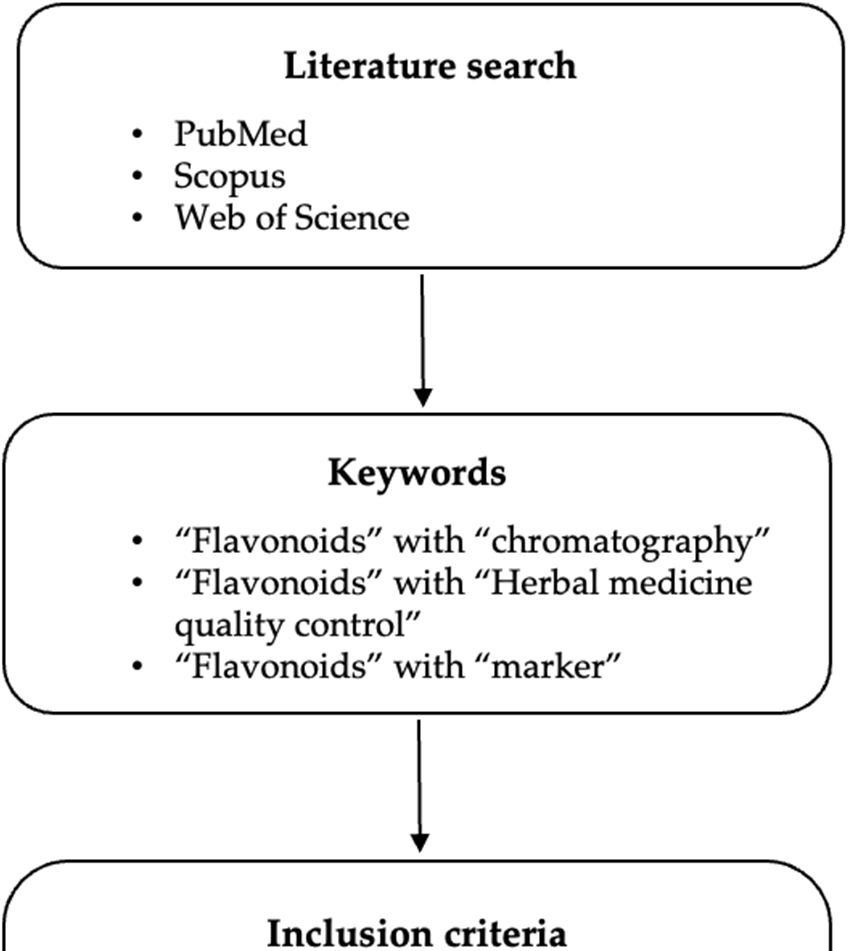
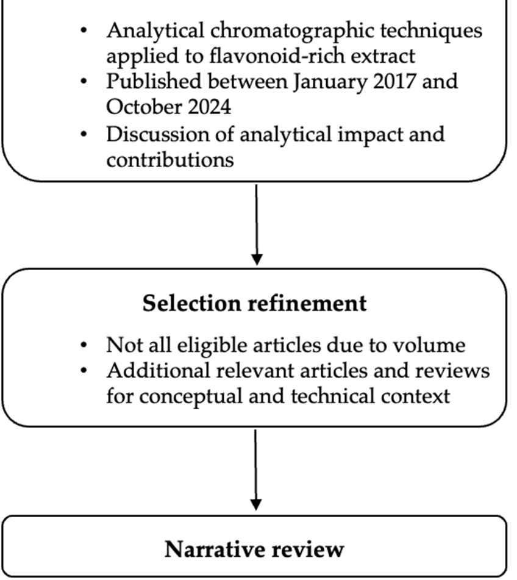

<!-- 方針: ほぼ全訳＋必要に応じた補足。原文構成に沿って訳出。「> 補足:」は訳者注。 -->

## 書誌情報

- 原題: Flavonoids as Markers in Herbal Medicine Quality Control: Current Trends and Analytical Perspective
- 著者: Julia Morais Fernandes, Charlotte Silvestre, Silvana M. Zucolotto, Julien Antih, Fabrice Vaillant, Aude Echallier, Patrick Poucheret（Qualisud, モンペリエ大学ほか, フランス／リオグランデ・ド・ノルテ連邦大学, ブラジル）
- 掲載: *Separations* 2025, 12, 289. https://doi.org/10.3390/separations12110289（総説, オープンアクセス CC BY 4.0）
- インパクトファクター: **2.7**（*Separations*, JCR 2024 / Clarivate）
- 受領 2025-08-18 / 改訂 2025-10-19 / 採録 2025-10-20 / 公開 2025-10-23

> 補足: 本論文は **総説（レビュー）**。HM = Herbal Medicine（生薬・ハーブ医薬品）、TCM = 伝統中国医学、Q-marker = 品質マーカー（quality marker）。対象期間は2017–2024年の研究。

## 要旨（Abstract）

植物二次代謝産物の普遍的な一群であるフラボノイドは、生薬・ハーブ医薬品（HM）の品質・安全性・有効性を担保する化学マーカーとしてますます重要になっている。広い分布・生物活性・検出容易性が、その役割に理想的である。本総説は、HM の品質管理におけるフラボノイドの現在のトレンドと分析的展望を批判的に検討する。まず単一成分定量を超える先進的な品質管理戦略——化学指紋・メタボロミクス・ネットワーク薬理・革新的概念である Q-marker——を概観する。次に、ルーチンの HPTLC・HPLC-UV から UHPLC-QTOF-MS のような先進的ハイフネーテッド系まで、フラボノイド分析の中心的分析技術を、真正性確認・標準化・混入検出への応用とともに詳述する。さらに、複雑なデータセットの解釈と頑健で生物活性に関連したマーカー同定のための、ケモメトリクスと分子ネットワークの統合を中心とする現代的データ解析ワークフローの重要性を強調する。近年の研究（2017–2024）を統合し、本研究は全体的・多マーカー的アプローチとデータ駆動型方法論へのパラダイムシフトを明らかにする。先進的分析技術と高度なデータモデリングの相乗的適用が HM 品質管理の将来に不可欠であると結論する。

## 1. 序論（Introduction）

伝統的な生薬は数千年にわたり疾病の予防・治療に用いられ、多くの開発途上国で第一選択の医療であり続ける。先進国でも植物由来健康製品の販売が増加している。HM（生薬・素材・調製品・最終製品を含む）は世界の医療システムでますます重要になっているが、多くの原料は未試験・未監視で、安全性・有効性データが規制当局の基準に照らして不十分とされ、一部の国では完全には受容されていない。

HM の品質は栽培条件・収穫時期・収穫後処理（乾燥・抽出法・溶媒選択・保存条件）に左右され、化学組成と安定性の変動、ロット間差、治療効果の変動を生む。品質管理は安全性・有効性確保に不可欠な工程である。

既存の規制・薬局方では、定量的品質評価は通常少数の固有マーカー化合物の測定に基づく。フラボノイドは植物に広く分布する重要な生物活性物質群で、多くの HM の品質管理マーカーに広く用いられる。例:
- イチョウ（*Ginkgo biloba*）標準化抽出物 **EGb 761** は、マーカーとして **24% のフラボン配糖体**（主にケルセチン・ケンペロール・イソラムネチン）と **6% のテルペンラクトン**（ギンコライド A/B/C 2.8–3.4%、ビロバライド 2.6–3.2%）を含む。
- **トケイソウ（*Passiflora incarnata*）**の葉は **1.5% のフラボノイド**（ビテキシン換算）を含む。

フラボノイドはアグリコンまたは配糖体として存在し、メチル化・プレニル化などの置換パターンが構造の複雑性・多様性を生む。UV 系で容易に検出できマーカーに適し、炎症関連慢性疾患などへの治療的有用性も示されている。本総説は HM の品質管理における関心分子としてのフラボノイドの役割に焦点を当てる。

文献検索（Figure 1）は PubMed・ScienceDirect・Web of Science で「flavonoids」を「chromatography」「herbal medicine quality control」「marker」と組み合わせて実施。選択基準は (i) フラボノイド濃縮抽出物・画分の分析/定量にクロマト分析を用いる、(ii) 2017年1月–2024年10月の最近の研究論文、(iii) 得られた結果の影響・貢献の提示と考察。本総説は (i) 品質管理戦略のトレンド、(ii) 分析技術と HM 品質管理での重要性、(iii) 多変量解析の貢献に焦点を当てたデータ解析のトレンド、の3副題に分かれる。

## 2. 品質管理戦略のトレンド

フラボノイドに焦点を当てた HM 品質管理の代表的な4戦略を以下に述べ、Table 1 にまとめる: (a) 指紋（fingerprints）、(b) メタボロミクス、(c) ネットワーク薬理、(d) Q-marker。

**Table 1. 生薬・ハーブ医薬品の品質管理戦略**

| 戦略 | 原理 | 限界 |
| --- | --- | --- |
| 指紋（Fingerprints） | 複数の化学マーカー | 特異性 |
| メタボロミクス | ターゲット／ノンターゲット | 明確な同定・再現性・データ処理 |
| ネットワーク薬理 | 計算＋実験的手法、複数化合物の相互作用 | データベース依存（正確性・完全性） |
| Q-markers | 計算＋実験的手法。spider-web（迅速スクリーニング）/ radar chart（詳細スクリーニングと構造解析） | 測定可能性と移植性（transferability） |

### 2.1 指紋（Fingerprint）

通常、定量的品質評価はマーカー化合物の測定に基づくが、多成分の相乗効果を無視する。薬局方では同定（定性）と定量の2試験が求められ、定性には TLC/HPLC で1–3マーカーのクロマトプロファイル、定量には最低1マーカーの定量が推奨される。単一マーカーで抽出物の化学的複雑性を考慮せず治療効果を保証できるかが課題。

ノンターゲット手法による全体的品質評価＝**化学指紋（chemical fingerprint）**が提案された。これは試料中の複数マーカーの存在を示す固有パターンで、HM 品質管理の強力な手法。**WHO** と各国規制当局（中国 SFDA、米 FDA、欧 EMA、韓国 MFDS）が指紋の概念を受容している。ただしクロマト指紋で化学的類似度が高くても効力が同等とは限らない。

類似度解析で試料間の類似/相違度を判定する。例: *Scutellaria baicalensis*（黄芩）の49バッチ、*Sophora japonica*（槐花）の57バッチを「中薬色譜指紋類似度評価システム」で自動マッチング。FTIR・UV・DSC 指紋（Keteling カプセル）、三次元量子指紋（QFP）等の手法もある。指紋‐効果相関解析（fingerprint-efficacy relationship）は、化学組成・生物活性の微差を示す試料で健康関連バイオマーカーを同定する有用な戦略。

限界として、この手法では HM 抽出物の全体像を網羅的に特徴づけるには特異性が制約となる。例: *Apocynum venetum*（羅布麻）葉ではフラボノイド含量が2倍差・RSD 最大75%。指紋は代表性を高めるが、標準化された予測的 QC ツールになるにはさらなる精緻化が必要。

### 2.2 メタボロミクス

メタボロミクスは生物学・分析化学・統計・生化学を統合する学際分野で、代謝産物量の質的・量的変化を理解する。**ターゲット**（少数の代謝物）と**ノンターゲット**（全メタボローム）の2アプローチがある。HM 品質管理では、産地・収穫期・生育期による化学組成の特徴づけ、生／加工品の判別マーカー同定、混入調査に応用。

例: UPLC-QTOF-MS で *Citrus reticulata*「陳皮（Chachi）」と保存年数の判別、*Eucommia ulmoides*（杜仲）関連製品の真正性確認、*Gleditsia sinensis*（皀莢）由来3生薬の完全判別。*Sophora flavescens*（苦参）では統合ワークフローで6主要フラボノイド（kurarinone, norkurarinone, kuraridin, kushenol N, trifolirhizin, genistein）を品質マーカーとして同定。課題は代謝物の明確な同定・データ再現性・データ処理。複雑なマトリックス・高価な装置・標準化パイプラインの欠如がルーチン適用を制限。

### 2.3 ネットワーク薬理（Network Pharmacology）

化学と薬理を結び、(i) 公開データベース等に基づく薬物標的予測モデルの構築、(ii) ハイスループットスクリーニングとバイオインフォマティクスによる「薬物‐標的‐疾患」ネットワーク予測モデルの再構築、を可能にし、HM 品質管理のバイオマーカー同定を支援する。例: *Murraya exotica*/*paniculata* の判別マーカー（7-メトキシクマリン vs ポリメトキシフラボノイド）が共通標的・経路を介し類似薬理を示唆。*Lonicera rupicola* のフラボノイドと潰瘍性大腸炎の標的予測。Shenxian-Shengmai 製剤で26抗不整脈候補、Tangshen 方剤で糖尿病性腎症関連13フラボノイド（naringin, daidzein, genistein 等）。限界は計算予測・不均質なDB依存、実験的検証不足、標準化ワークフロー欠如、生物学的利用能・薬物動態考慮の不足で、ルーチン/規制 QC には不向き。

### 2.4 Q-marker（品質マーカー）

Q-marker は Changxiao Liu が初めて明確化した新概念。**5要件**——追跡可能性・移行性（traceability/transitivity）、測定可能性、有効性、特異性、処方適合性（prescription compatibility）——を満たす化学成分と定義され、有効性・安全性に関連する。製薬工程の化学変化を特徴づけ、対応する Q-marker の測定で全製造工程を監視できる。メタボロミクス＋システム薬理で生／加工 TCM の判別に有用。

多次元「radar chart」モード（処方適合性寄与・含量・生物活性・予測生物学的利用能・ネットワーク薬理度に基づく）や、「Spider-web」モード（「含量‐安定性‐薬物動態‐薬理」を統合）が提案され、例: Mailuoshutong 丸（9生薬）で「含量‐薬物動態‐薬理」多次元戦略によりフラボノイドを Q-marker として同定。フラボノイドは分布の広さと薬理的関連性から最も研究された Q-marker の一つ（イチョウ、淫羊藿 *Herba epimedii* 等）。ただし抽出法・保存条件・マトリックス効果に敏感で再現性・標準化を損ねやすく、単一マーカーでは多成分・多標的性を反映しにくい。指紋やバイオアッセイ、調和されたバリデーションとの併用が必要。

## 3. 分析技術とHM品質管理での重要性

分析装置（特に分光・クロマト法）は HM の品質管理・標準化に重要。頑健・高精度・低コストで規制適合のクロマトプロトコル開発が求められる。TLC（高性能版 HPTLC）と HPLC（超高速版 UPLC/UHPLC）が、UV 等の分光法と組み合わせて、マーカー探索や薬局方モノグラフで広く用いられる。Table 2/3 にブラジル薬局方第6版・欧州薬局方第11版のフラボノイドマーカー収載例を示す。

**Table 2. ブラジル薬局方 第6版（Ph. Br.）でのフラボノイドマーカー収載例**

| 植物種 | 部位 | TLC | UV | HPLC |
| --- | --- | --- | --- | --- |
| Calendula officinalis（キンセンカ） | 花 | rutin | 総フラボノイド0.4%（hyperoside換算） | - |
| Matricaria chamomilla（カモミール） | 頭花 | - | - | apigenin-7-O-glucoside 0.025% |
| Echinodorus grandiflorus | 葉 | isoorientin, swertiajaponin | - | - |
| Crataegus monogyna / rhipidophylla（サンザシ）他 | 開花枝 | hyperoside | 総フラボノイド1.5%（hyperoside換算） | - |
| Achyrocline satureioides | 花序 | quercetin, luteolin, 3-O-methylquercetin | 総フラボノイド3.0%（quercetin換算） | 3-O-methylquercetin 0.6% |
| Passiflora edulis | — | isovitexin と isoorientin による定性プロファイル | | |
| Citrus aurantium subsp. aurantium（ダイダイ） | 葉 | isoorientin, isovitexin | 総フラボノイド1.0%（apigenin換算） | - |
| 〃 | 果皮（外果皮） | naringin | - | naringin 0.25% |
| Hypericum perforatum（セイヨウオトギリソウ） | 開花頂部 | Ph. Br. に未収載 | | |
| Ginkgo biloba（イチョウ） | 葉 | Ph. Br. に未収載 | | |
| Sambucus nigra（セイヨウニワトコ） | 花 | hyperoside, rutin | 総フラボノイド≥1.5%（quercetin換算） | rutin ≥1.0% |
| Styphnolobium japonicum（= Sophora japonica, エンジュ） | 開花 | Ph. Br. に未収載 | | |

**Table 3. 欧州薬局方 第11版（Ph. Eur.）でのフラボノイドマーカー収載例**（\* は HPTLC による同定）

| 植物種 | 部位 | TLC | UV/HPLC |
| --- | --- | --- | --- |
| Calendula officinalis | 花 | isorhamnetin-3-O-rutinoside, hyperoside\* | 総フラボノイド0.4%（hyperoside換算） |
| Matricaria chamomilla | 頭花 | - | apigenin-7-O-glucoside 0.025%（HPLC） |
| Crataegus monogyna 他 | — | — | vitexin-2′′-O-rhamnoside 誘導体 最低0.2%（vitexin-2′′-O-rhamnoside換算） |
| Passiflora incarnata | 開花枝 | hyperoside, vitexin-2′′-O-rhamnoside\* | 総フラボノイド1.0%（isovitexin換算。isovitexin/orientin/homoorientin を参照） |
| Citrus aurantium subsp. aurantium | 葉 | vitexin, isovitexin, orientin, homoorientin\* | - |
| 〃 | 果皮 | naringenin | - |
| Hypericum perforatum | 開花頂部 | hyperoside, rutin\* | - |
| Ginkgo biloba | 葉 | rutin（quercetin を参照） | フラボノイド0.5%（フラボン配糖体換算, HPLC） |
| Sambucus nigra | 花 | hyperoside, rutin | フラボノイド最低0.80%（isoquercitrin換算） |
| Styphnolobium japonicum（= Sophora japonica） | 開花 | rutin 最低6.0%（apigenin 7-glucoside を参照）。総フラボノイド最低8.0%（rutin換算）も | |

### 3.1 高性能薄層クロマトグラフィー（HPTLC）

TLC は植物化学成分分離に最も広く用いられ、低コスト・簡便で全薬局方試験に必須。HPTLC は感度・分解能・再現性・スループットで TLC に優り、混入検出に頑健。原料取得・製品開発・中間工程管理・規制適合の情報を提供。低い理論段数・短い展開距離という限界はあるが、簡便さで価値が高い。

例: *Terminalia bellirica*/*chebula* のマーカー同定で HPTLC が国際ガイドラインに適合し、HPLC・LC-MS・GC-MS の代替に。12種の *Passiflora* で C-配糖体（isoorientin, orientin, vitexin, isovitexin）を参照し種特異プロファイルを確立。クルクミンとガランギン（フラボノイド）の同時定量、インド産プロポリスの複数マーカー、St. John's wort 製品の真正/非真正の混入識別、*Setaria italica* のケンペロール・ケルセチン定量など。バイオオートグラフィー（DPPH 抗酸化、アセチルコリンエステラーゼ阻害）にも応用。定量精度は試料アプリケーション・溶媒組成・デンシトメトリ較正に依存し、絶対定量には LC/MS に劣るが、アクセス性・スループットで優れる。

### 3.2 液体クロマトグラフィー（LC）

LC（UPLC・UHPLC・HPLC）は各種検出器（UV・DAD・PDA・MS）と組み合わせ、フラボノイド定量に必須。規制ガイドラインでバリデーション可能なため薬局方モノグラフに頻用。DAD は多波長同時検出、MS は低存在量・弱スペクトルのフラボノイド検出に有利で、LC-DAD/LC-MS/LC-DAD-MS は未知フラボノイドの同定・サブクラス特徴づけに有用。

例: HPLC-DAD で *Lippia alba* の季節変動（tricin-7-O-diglucuronide が夏に高い）、11種 *Hypericum* で5フラボノイドの分類学的価値、*Agastache rugosa* の生育段階別マーカー（tilianin 群）、2種 *Jatropha* の C-配糖体による判別。真正/混入識別では *Verbena officinalis* と混入種 *Aloysia citriodora* の判別など。LC-MS/MS（特に MRM モード）は弱UV吸収・低濃度・夾雑物に隠れる成分の品質評価に好適。OLE（オンライン抽出）-HPLC-DAD-QTOF-MS/MS、分取 HPLC＋「knock-out」戦略（紅花のフラボノイド配糖体 C7-OH をマーカーに）など新技術も。例: Gungha-tang（韓国伝統湯液）の9マーカー法で liquiritin apioside・naringin・hesperidin を ng レベル・回収率89–118%で検出。LC は広範な前処理・条件最適化・マトリックス別バリデーションを要し、ルーチン使用には簡便な補完的スクリーニングとの併用が有用。

> 補足: 本節では NMR・IR（NIR/FT-IR）・電気化学指紋・「プール QC 試料」なども言及。例: ¹H-NMR で *Hibiscus sabdariffa* の抽出法比較（冷浸がアントシアニン保持に最適）、¹³C-NMR メタボリックフィンガープリント、HPTLC＋NMR による *Glycyrrhiza*（甘草）種の判別。

## 4. データ解析のトレンド: 多変量解析の貢献

分析法が生むデータは適切な処理を要する。過去5年で多変量解析（情報マイニング）と分子ネットワーク（データ可視化）が大きく進展。HM 産業のルーチン QC ではまだ一般的でないが、複雑なデータセット解析と、より適切なマーカーの同定・検証に重要。

### 4.1 ケモメトリクスと分子ネットワークの貢献

収集・前処理後、分子ネットワーク（MN）で特徴抽出・構造解明・パターン認識を行い、並行/後続で多変量解析（SVM・GRA・PLSR・ANN・PCA・HCA・MCR-ALS 等）を適用。MN は構造類似性で分子を整理し、ケモメトリクスで(1) 複雑性低減（PCA・クラスタリング）、(2) クラス予測（混入試料の同定: SVM・ANN・PLS）、(3) 類似/外れ値の同定（GRA）、(4) MN との統合（化合物クラスタ‐生物活性の関係定量）を実現。例: *Epimedium koreanum*（4地域）の判別、*Chrysanthemum* で1万超の特徴から21品質マーカー、*Cudrania tricuspidata* のケルセチン/ケンペロール抱合体マッピング。計算負荷・スペクトルライブラリ・標準化ワークフローへの依存が課題で、従来法を置換せず補完する。

### 4.2 分子ネットワーク（Molecular Networking）

LC-MS の大規模データから、MN は MS/MS データ処理の強力ツール。「類似構造の化合物は類似のフラグメントを生む」前提で **GNPS プラットフォーム**上で自動クラスタリングし、多変量統計で偽陽性を回避。例: *Cassia angustifolia*/*acutifolia* の色違い品種、*Cuscuta chinensis*（菟絲子）種子の2D-LC/IM-QTOF-MS 統合、*Glycyrrhiza uralensis*（甘草）の根・茎・葉・種子の網羅的特徴づけ、*Crescentia cujete* 果肉で15フラボノイド同定。Feature-based MN は近縁異性体の分解能を高める。*Paris polyphylla* で222化合物（新規4フラボノイド含む）、10生薬 TCM 方剤の判別など。曲線化されたスペクトルライブラリ・高品質フラグメントデータと専門家の監督に依存。

### 4.3 ケモメトリクス手法

定性には類似度解析・探索学習・分類アルゴリズム、定量には多変量較正。手法は PCA・PLS・OPLS-DA・SVM・GRA・SA・HCA・ヒートマップ等。例: Senna の品質等級（緑/黄/病害）でフラボノイド濃度が品質低下とともに増加、甘草の年数・収穫期・産地別の7フラボノイド指標、*Lantana camara* の luteolin-7,4′-O-diglucoside、硫黄燻蒸 *Smilax glabra*（土茯苓）の astilbin と新生含硫化合物の判別。指紋‐生物活性の関係構築にも有用。過適合防止のため統計的管理・前処理が必要で、クロマト/分光解析との併用が最も効果的。

## 5. 結論（Conclusions）

本総説は HM 品質管理におけるフラボノイドの多用途で信頼できるマーカーとしての中心的役割を強調する。古典的薬局方技術（HPTLC・HPLC-DAD）は頑健性・アクセス性・再現性・規制受容性からルーチン分析の基盤であり続けるが、多成分相互作用への洞察は限定的。品質評価のパラダイムは、全植物化学マトリックスと生物学的関連性を捉える全体的・システムレベルのアプローチ（化学指紋・メタボロミクス・ネットワーク薬理・Q-marker）へ決定的に移行している。

UHPLC-HRMS は広範なフラボノイド代謝物を高感度に同定し、ハイフネーテッド技術（HPLC-DAD-MS, HPLC-NMR）は多次元的洞察を与える。ケモメトリクスと分子ネットワークは大規模データの隠れた関係を可視化し、真正性確認・混入検出・化学指紋と生物活性の連結・新規マーカー発見に有用。

一方、ルーチン産業 QC への普及には課題が残る: 適切なマーカー選択の文脈依存性、高価な高分解能装置・専門的バイオインフォマティクス、標準参照物質・曲線化スペクトルライブラリの欠如、非標準化データ処理による再現性問題、規制枠組みがアルゴリズム駆動解析を未だ十分認知していないこと。将来は、(1) 簡素・小型・グリーン・低コストなワークフロー、(2) AI/機械学習によるデータ処理・バイオマーカー発見の自動化、(3) マルチオミクス統合、(4) 検証・適用の国際的合意（オープンアクセススペクトルDB・標準化プロトコル・規制受容のガイドライン）に注力すべき。古典的化学分析の信頼性と計算・メタボロミクス的アプローチの解釈深度を、生物学的関連性に基づいて統合することが最も有望な道である。

---

## 参考文献

1. van Wyk, A.S.; Prinsloo, G. Health, Safety and Quality Concerns of Plant-Based Traditional Medicines and Herbal Remedies. S. Afr. J. Bot. 2020, 133, 54–62. [CrossRef]

2. Li, Y.; Shen, Y.; Yao, C.; Guo, D. Quality Assessment of Herbal Medicines Based on Chemical Fingerprints Combined with Chemometrics Approach: A Review. J. Pharm. Biomed. Anal. 2020, 185,

3. Kagawad, P.; Gharge, S.; Jivaje, K.; Hiremath, S.I.; Suryawanshi, S.S. Quality Control and Standardization of Quercetin in Herbal Medicines by Spectroscopic and Chromatographic Techniques. Future J. Pharm. Sci. 2021, 7,

4. WHO. General Guidelines for Methodologies on Research and Evaluation of Traditional Medicine; World Health Organization: Geneva, Switzerland, 2000; 71p.

5. Yang, B.; Liu, H.; Yang, J.; Gupta, V.K.; Jiang, Y. New Insights on Bioactivities and Biosynthesis of Flavonoid Glycosides. Trends Food Sci. Technol. 2018, 79, 116–124. [CrossRef]

6. Adis R&D Profile. EGb 761: Ginkgo Biloba Extract, Ginkor. Drugs RD 2003, 4, 188–193. [CrossRef]

7. Blumenthal, M.; Busse, W.R.; Goldberg, A.; Gruenwald, J.; Hall, T.; Riggins, C.W.; Rister, R.S. The Complete German Commission E Monographs: Therapeutic Guide to Herbal Medicines; American Botanical Council: Austin, TX, USA,

8. Sammani, M.S.; Clavijo, S.; Cerdà, V. Recent, Advanced Sample Pretreatments and Analytical Methods for Flavonoids Determination in Different Samples. Trends Anal. Chem. 2021, 138,

9. Turatbekova, A.; Babamuradova, L.; Tasheva, U.; Saparbaeva, N.; Saibnazarova, G.; Turayeva, M.; Yakubov, Y. A Brief Review on Biological and Chemical Activities of Flavonoids in Plants. E3S Web Conf. 2023, 434,

10. Shen, N.; Wang, T.; Gan, Q.; Liu, S.; Wang, L.; Jin, B. Plant Flavonoids: Classification, Distribution, Biosynthesis, and Antioxidant Activity. Food Chem. 2022, 383,

11. Perez-Vizcaino, F.; Fraga, C.G. Research Trends in Flavonoids and Health. Arch. Biochem. Biophys. 2018, 646, 107–112. [CrossRef] [PubMed]

12. Li, S.; Han, Q.; Qiao, C.; Song, J.; Cheng, C.L.; Xu, H. Chemical Markers for the Quality Control of Herbal Medicines: An Overview. Chin. Med. 2008, 3,

13. Dong, R.; Su, J.; Nian, H.; Shen, H.; Zhai, X.; Xin, H.; Qin, L.; Han, T. Chemical Fingerprint and Quantitative Analysis of Flavonoids for Quality Control of Sea Buckthorn Leaves by HPLC and UHPLC-ESI-QTOF-MS. J. Funct. Foods 2017, 37, 513–522. [CrossRef]

14. Ma, C.; Oketch-Rabah, H.; Kim, N.-C.; Monagas, M.; Bzhelyansky, A.; Sarma, N.; Giancaspro, G. Quality Specifications for Articles of Botanical Origin from the United States Pharmacopeia. Phytomedicine 2018, 45, 105–119. [CrossRef] [PubMed]

15. Wang, F.; Xiong, Z.-Y.; Li, P.; Yang, H.; Gao, W.; Li, H.-J. From Chemical Consistency to Effective Consistency in Precise Quality Discrimination of Sophora Flower-Bud and Sophora Flower: Discovering Efficacy-Associated Markers by Fingerprint-Activity Relationship Modeling. J. Pharm. Biomed. Anal. 2017, 132, 7–16. [CrossRef] [PubMed]

16. Kharat, S.; Namdeo, A.; Mehta, P. Development and Validation of HPTLC Method for Simultaneous Estimation of Curcumin and Galangin in Polyherbal Capsule Dosage Form. J. Taibah Univ. Sci. 2017, 11, 775–781. [CrossRef]

17. Zhao, J.; Wang, M.; Adams, S.J.; Lee, J.; Chittiboyina, A.G.; Avula, B.; Ali, Z.; Raman, V.; Li, J.; Wu, C.; et al. Metabolite Variation and Discrimination of Five Licorice (Glycyrrhiza) Species: HPTLC and NMR Explorations. J. Pharm. Biomed. Anal. 2022, 220,

18. Tao, H.-X.; Xiong, W.; Zhao, G.-D.; Peng, Y.; Zhong, Z.-F.; Xu, L.; Duan, R.; Tsim, K.W.K.; Yu, H.; Wang, Y.-T. Discrimination of Three Siegesbeckiae Herba Species Using UPLC-QTOF/MS-Based Metabolomics Approach. Food Chem. Toxicol. 2018, 119, 400–406. [CrossRef]

19. Liao, F.; Yu, A.; Yu, J.; Wang, D.; Wu, Y.; Zheng, H.; Meng, Y.; He, D.; Shen, X.; Wang, L. Identification of Active Ingredients Mediating Anti-Platelet Aggregation Effects of BuyangHuanwu Decoction Using a Platelet Binding Assay, Solid Phase Extraction, and HPLC-MS/MS. J. Chromatogr. B 2018, 1092, 320–327. [CrossRef]

20. Jiang, Z.; Zhao, C.; Gong, X.; Sun, X.; Li, H.; Zhao, Y.; Zhou, X. Quantification and Efficient Discovery of Quality Control Markers for Emilia Prenanthoidea DC. by Fingerprint-Efficacy Relationship Modelling. J. Pharm. Biomed. Anal. 2018, 156, 36–44. [CrossRef]

21. Yu, Y.; Gong, D.; Zhu, Y.; Wei, W.; Sun, G. Quality Consistency Evaluation of Isatidis Folium Combined with Equal Weight Quantified Ratio Fingerprint Method and Determination of Antioxidant Activity. J. Chromatogr. B 2018, 1095, 149–156. [CrossRef]

22. Qi, J.; Zhang, Q.; Li, L.; Huang, Q.; Yao, M.; Wang, N.; Peng, D. Spectrum-Effect Relationship between UPLC-Q-TOF-MS Fingerprint and Anti-AUB Effect of Clinopodium chinense (Benth.) O. Kuntze. J. Pharm. Biomed. Anal. 2022, 217,

23. Yuan, H.; Luo, J.; Lyu, M.; Jiang, S.; Qiu, Y.; Tian, X.; Liu, L.; Liu, S.; Ouyang, Y.; Wang, W. An Integrated Approach to QMarker Discovery and Quality Assessment of Edible Chrysanthemum Flowers Based on Chromatogram–Effect Relationship and Bioinformatics Analyses. Ind. Crops Prod. 2022, 188,

24. Fang, W.; Song, Q.; Luo, H.; Wang, R.; Fang, C. Quality Evaluation of the Traditional Chinese Medicine Moutan Cortex Based on UPLC Fingerprinting and Chemometrics Analysis. Metabolites 2025, 15,

25. Li, Y.; Yu, B.; Zhao, W.; Pu, X.; Zhong, X.; Tao, X.; Wang, Y.; Cao, W.; Zhang, D. UPLC Fingerprinting Combined with Quantitative Analysis of Multicomponents by a Single Marker for Quality Evaluation of YiQing Granules. Front. Chem. 2025, 13,

26. Wang, F.; Wang, B.; Wang, L.; Xiong, Z.-Y.Y.; Gao, W.; Li, P.; Li, H.-J.J. Discovery of Discriminatory Quality Control Markers for Chinese Herbal Medicines and Related Processed Products by Combination of Chromatographic Analysis and Chemometrics Methods: Radix Scutellariae as a Case Study. J. Pharm. Biomed. Anal. 2017, 138, 70–79. [CrossRef] [PubMed]

27. Ghosh, D.; Mondal, S.; Ramakrishna, K. Pharmacobotanical, Physicochemical and Phytochemical Characterisation of a Rare Salt-Secreting Mangrove Aegialitis rotundifolia Roxb., (Plumbaginaceae) Leaves: A Comprehensive Pharmacognostical Study. S. Afr. J. Bot. 2017, 113, 212–229. [CrossRef]

28. WANG, Y.; Sun, G.-X.; Jin, Y.; Xie, X.-M.; Liu, Y.-C.; Ma, D.-D.; Zhang, J.; GAO, J.-Y.; Li, Y.-F. Holistic Evaluation of San-Huang Tablets Using a Combination of Multi-Wavelength Quantitative Fingerprinting and Radical-Scavenging Assays. Chin. J. Nat. Med. 2017, 15, 310–320. [CrossRef]

29. Ding, P.-L.; He, C.-M.; Cheng, Z.-H.; Chen, D.-F. Flavonoids Rather than Alkaloids as the Diagnostic Constituents to Distinguish Sophorae Flavescentis Radix from Sophorae Tonkinensis Radix et Rhizoma: An HPLC Fingerprint Study. Chin. J. Nat. Med. 2018, 16, 951–960. [CrossRef]

30. Li, Y.; Kong, D.; Wu, H. Comprehensive Chemical Analysis of the Flower Buds of Five Lonicera Species by ATR-FTIR, HPLC-DAD, and Chemometric Methods. Rev. Bras. Farmacogn. 2018, 28, 533–541. [CrossRef]

31. Liang, D.; Yin, Y.-H.H.; Miao, L.-Y.Y.; Zheng, X.; Gao, W.; Chen, X.-D.D.; Wei, M.; Chen, S.-J.J.; Li, S.; Xin, G.-Z.Z.; et al. Integrating Chemical Similarity and Bioequivalence: A Pilot Study on Quality Consistency Evaluation of Dispensing Granule and Traditional Decoction of Scutellariae Radix by a Totality-of-the-Evidence Approach. J. Pharm. Biomed. Anal. 2019, 169, 1–10. [CrossRef]

32. Zhao, M.; Linghu, K.-G.; Xiao, L.; Hua, T.; Zhao, G.; Chen, Q.; Xiong, S.; Shen, L.; Yu, J.; Hou, X.; et al. Anti-Inflammatory/AntiOxidant Properties and the UPLC-QTOF/MS-Based Metabolomics Discrimination of Three Yellow Camellia Species. Food Res. Int. 2022, 160,

33. Shi, Y.; Xu, C.L.; Zhu, Y.J.; Tian, Y.W.; Liu, X.; Gao, X.; Qin, K.M.; Li, W.D. Quality Evaluation of Crude and Salt-Processed Cuscutae Semen through Qualitative and Quantitative Analysis of Multiple Components Using HPLC Combined with Chemometrics. Separations 2022, 9,

34. Gong, D.; Chen, J.; Sun, Y.; Liu, X.; Sun, G. Multiple Wavelengths Maximization Fusion Fingerprint Profiling for Quality Evaluation of Compound Liquorice Tablets and Related Antioxidant Activity Analysis. Microchem. J. 2021, 160,

35. Yang, T.; Yang, H.; Ling, G.; Sun, G. Evaluating the Quality Consistency of Keteling Capsules by Three-Dimensional Quantum Fingerprints and HPLC Fingerprint. Spectrochim. Acta Part A Mol. Biomol. Spectrosc. 2022, 270,

36. Shawky, E.; Ibrahim, R.S. Bioprofiling for the Quality Control of Egyptian Propolis Using an Integrated NIR-HPTLC-Image Analysis Strategy. J. Chromatogr. B 2018, 1095, 75–86. [CrossRef]

37. Ji, P.; Yang, X.; Zhao, X. Application of Metabolomics in Quality Control of Traditional Chinese Medicines: A Review. Front. Plant Sci. 2024, 15,

38. Zou, L.; Li, H.; Ding, X.; Liu, Z.; He, D.; Kowah, J.A.H.; Wang, L.; Yuan, M.; Liu, X. A Review of The Application of Spectroscopy to Flavonoids from Medicine and Food Homology Materials. Molecules 2022, 27,

39. Chen, L.; Huang, X.; Wang, H.; Shao, J.; Luo, Y.; Zhao, K.; Liu, Y.; Wang, S. Integrated metabolomics and network pharmacology strategy for ascertaining the quality marker of flavonoids for Sophora flavescens. J. Pharm. Biomed. Anal. 2020, 186,

40. Han, J.; Xu, K.; Yan, Q.; Sui, W.; Zhang, H.; Wang, S.; Zhang, Z.; Wei, Z.; Han, F. Qualitative and quantitative evaluation of Flos Puerariae by using chemical fingerprint in combination with chemometrics method. J. Pharm. Anal. 2021, 12, 489–499. [CrossRef]

41. Cheng, W.; Li, S.; Han, J.; Su, J.; Cai, W. Supermolecules as a quality markers of herbal medicinal products. Heliyon 2022, 8, e12497. [CrossRef]

42. Shi, X.; Long, F.; Wu, C.Y.; Zhou, J.; Shen, H.; Zhou, S.S.; Xu, J.D.; Zhang, W.; Li, S.L. Integrating Serum Pharmacochemistry and Network Pharmacology to Identify Chemical Markers for Quality Control of Apocyni Veneti Folium. Phytochem. Anal. 2023, 34, 56–66. [CrossRef] [PubMed]

43. Klein-Junior, L.C.; de Souza, M.R.; Viaene, J.; Bresolin, T.M.B.; de Gasper, A.L.; Henriques, A.T.; Heyden, Y.V. Quality Control of Herbal Medicines: From Traditional Techniques to State-of-the-art Approaches. Planta Medica 2021, 87, 964–988. [CrossRef]

44. Waris, M.; Koçak, E.; Gonulalan, E.M.; Demirezer, L.O.; Kır, S.; Nemutlu, E. Metabolomics Analysis Insight into Medicinal Plant Science. Trends Anal. Chem. 2022, 157,

45. Wang, Z.; Chen, X.; Guo, Z.; Feng, X.; Huang, P.; Du, M.; Zalán, Z.; Kan, J. Distribution and Natural Variation of Free, Esterified, Glycosylated, and Insoluble-Bound Phenolic Compounds in Brocade Orange (Citrus sinensis L. Osbeck) Peel. Food Res. Int. 2022, 153,

46. Luo, Y.; Zeng, W.; Huang, K.-E.E.; Li, D.-X.X.; Chen, W.; Yu, X.-Q.Q.; Ke, X.-H.H. Discrimination of Citrus reticulata Blanco and Citrus reticulata ‘Chachi’ as Well as the Citrus reticulata ‘Chachi’ within Different Storage Years Using Ultra High Performance Liquid Chromatography Quadrupole/Time-of-Flight Mass Spectrometry Based Metabol. J. Pharm. Biomed. Anal. 2019, 171, 218–231. [CrossRef]

47. Liu, X.; Zhang, J.; Li, Y.; Yao, C.; An, Y.; Wei, W.; Yao, S.; Yang, L.; Huang, Y.; Qu, H.; et al. In-Depth Profiling, Nontargeted Metabolomic and Selective Ion Monitoring of Eight Chemical Markers for Simultaneous Identification of Different Part of Eucommia Ulmoides in 12 Commercial Products by UPLC/QDa. Food Chem. 2022, 393,

48. Xie, H.; Wang, H.H.; Chen, B.; Lou, J.; Wang, H.H.; Xiong, Y.; Hu, Y.; Xu, X.; Jing, Q.; Jiang, M.; et al. Untargeted Metabolomics Analysis to Unveil the Chemical Markers for the Differentiation among Three Gleditsia Sinensis-Derived Herbal Medicines by Ultra-High Performance Liquid Chromatography/Quadrupole Time-of-Flight Mass Spectrometry. Arab. J. Chem. 2022, 15,

49. Anokwuru, C.P.; Tankeu, S.; van Vuuren, S.; Viljoen, A.; Ramaite, I.D.I.; Taglialatela-Scafati, O.; Combrinck, S. Unravelling the Antibacterial Activity of Terminalia sericea Root Bark through a Metabolomic Approach. Molecules 2020, 25,

50. Caesar, L.K.; Kellogg, J.J.; Kvalheim, O.M.; Cech, N.B. Opportunities and Limitations for Untargeted Mass Spectrometry Metabolomics to Identify Biologically Active Constituents in Complex Natural Product Mixtures. J. Nat. Prod. 2019, 82, 469–484. [CrossRef] [PubMed]

51. Petrick, L.M.; Shomron, N. AI/ML-Driven Advances in Untargeted Metabolomics and Exposomics for Biomedical Applications. Cell Rep. Phys. Sci. 2022, 3,

52. Rawat, P.; Singh, M.; Punetha, S.; Pradhan, S. Recent Advancement in Metabolomic Research: Applications and Limitations. In Ethnopharmacology and OMICS Advances in Medicinal Plants Volume 2; Nandave, M., Joshi, R., Upadhyay, J., Eds.; Springer: Singapore,

53. Li, X.; Chen, H.; Jia, W.; Xie, G. A Metabolomics-Based Strategy for the Quality Control of Traditional Chinese Medicine: Shengmai Injection as a Case Study. Evid.-Based Complement. Altern. Med. 2013, 2013,

54. Hopkins, A.L. Network Pharmacology: The next Paradigm in Drug Discovery. Nat. Chem. Biol. 2008, 4, 682–690. [CrossRef]

55. Zhang, G.B.; Li, Q.Y.; Chen, Q.L.; Su, S.B. Network Pharmacology: A New Approach for Chinese Herbal Medicine Research. Evid.-Based Complement. Altern. Med. 2013, 2013,

56. Liang, H.-Z.; Du, Z.-Y.; Yuan, S.; Lu, M.-Q.; Xing, J.-Y.; Ma, Q.; Han, Z.-Z.; Tu, P.-F.; Jiang, Y. Comparison of Murraya exotica and Murraya paniculata by Fingerprint Analysis Coupled with Chemometrics and Network Pharmacology Methods. Chin. J. Nat. Med. 2021, 19, 713–720. [CrossRef] [PubMed]

57. Li, C.; Wang, L.; Zhao, J.; Wei, Y.; Zhai, S.; Tan, M.; Guan, K.; Huang, Z.; Chen, C. Lonicera Rupicola Hook.f.et Thoms Flavonoids Ameliorated Dysregulated Inflammatory Responses, Intestinal Barrier, and Gut Microbiome in Ulcerative Colitis via PI3K/AKT Pathway. Phytomedicine 2022, 104,

58. Xiang, W.; Suo, T.-C.; Yu, H.; Li, A.-P.; Zhang, S.-Q.; Wang, C.-H.; Zhu, Y.; Li, Z. A New Strategy for Choosing “Q-Markers” via Network Pharmacology, Application to the Quality Control of a Chinese Medical Preparation. J. Food Drug Anal. 2018, 26, 858–868. [CrossRef] [PubMed] Separations 2025, 12, 289 24 of 29

59. Ahmed, A.M.A.; Rahman, A.; Hossen, A.; Reza, A.S.M.A.; Islam, S.; Rashid, M.; Rafi, K.J.; Siddiqui, T.A.; Al-Noman, A.; Uddin, N. Epiphytic Acampe ochracea Orchid Relieves Paracetamol-Induced Hepatotoxicity by Inhibiting Oxidative Stress and Upregulating Antioxidant Genes in in Vivo and Virtual Screening. Biomed. Pharmacother. 2021, 143,

60. Gao, W.-Y.; Si, N.; Li, M.; Gu, X.; Zhang, Y.; Zhou, Y.; Wang, H.-J.; Wei, X.-L.; Bian, B.-L.; Zhao, H.-Y. The Integrated Study on the Chemical Profiling and in Vivo Course to Explore the Bioactive Constituents and Potential Targets of Chinese Classical Formula Qingxin Lianzi Yin Decoction by UHPLC-MS and Network Pharmacology Approaches. J. Ethnopharmacol. 2021, 272,

61. Li, Z.; Qu, B.; Zhou, L.; Chen, H.W.; Wang, J.; Zhang, W.; Chen, C.F. A New Strategy to Investigate the Efficacy Markers Underlying the Medicinal Potentials of Orthosiphon Stamineus Benth. Front. Pharmacol. 2021, 12,

62. Sun, S.; Xun, G.; Zhang, J.; Gao, Y.; Ge, J.; Liu, F.; Qian, Q.; Liu, X.; Tian, Y.; Sun, Q.; et al. An Integrated Approach for Investigating Pharmacodynamic Material Basis of Lingguizhugan Decoction in the Treatment of Heart Failure. J. Ethnopharmacol. 2022, 295,

63. Wang, Y.; Cui, T.; Li, Y.; Liao, M.; Zhang, H.; Hou, W.; Zhang, T.; Liu, L.; Huang, H.; Liu, C. Prediction of quality markers of traditional Chinese medicines based on network pharmacology. Chin. Herb. Med. 2019, 11, 349–356. [CrossRef]

64. Wang, X.; Zhou, W.; Wang, Q.; Zhang, Y.; Ling, Y.; Zhao, T.; Zhang, H.; Li, P. A novel and comprehensive strategy for quality control in complex Chinese medicine formula using UHPLC-Q-Orbitrap HRMS and UHPLC-MS/MS combined with network pharmacology analysis: Take Tangshen formula as an example. J. Chromatogr. B Anal. Technol. Biomed. Life Sci. 2021, 1183,

65. Duan, S.; Niu, L.; Yin, T.; Li, L.; Gao, S.; Yuan, D.; Hu, M. A novel strategy for screening bioavailable quality markers of traditional Chinese medicine by integrating intestinal absorption and network pharmacology: Application to Wu Ji Bai Feng Pill. Phytomedicine Int. J. Phytother. Phytopharm. 2020, 76,

66. Liu, C.; Cheng, Y.; Guo, D.; Zhang, T.; Li, Y.; Hou, W.; Huang, L.; Xu, H. A New Concept on Quality Marker for Quality Assessment and Process Control of Chinese Medicines. Chin. Herb. Med. 2017, 9, 3–13. [CrossRef]

67. Feng, G.; Chen, Y.; Li, W.; Li, L.; Wu, Z.; Wu, Z.; Hai, Y.; Zhang, S.; Zheng, C.; Liu, C.; et al. Exploring the Q-Marker of “Sweat Soaking Method” Processed Radix Wikstroemia Indica: Based on the “Effect-Toxicity-Chemicals” Study. Phytomedicine 2018, 45, 49–58. [CrossRef]

68. Zhang, T.; Bai, G.; Han, Y.; Xu, J.; Gong, S.; Li, Y.; Zhang, H.; Liu, C. The Method of Quality Marker Research and Quality Evaluation of Traditional Chinese Medicine Based on Drug Properties and Effect Characteristics. Phytomedicine 2018, 44, 204–211. [CrossRef] [PubMed]

69. Guo, R.; Zhang, X.; Su, J.; Xu, H.; Zhang, Y.; Zhang, F.; Li, D.; Zhang, Y.; Xiao, X.; Ma, S.; et al. Identifying Potential Quality Markers of Xin-Su-Ning Capsules Acting on Arrhythmia by Integrating UHPLC-LTQ-Orbitrap, ADME Prediction and Network Target Analysis. Phytomedicine 2018, 44, 117–128. [CrossRef]

70. Liu, C.; Guo, D.-a.; Liu, L. Quality Transitivity and Traceability System of Herbal Medicine Products Based on Quality Markers. Phytomedicine 2018, 44, 247–257. [CrossRef] [PubMed]

71. Gao, M.; Lan, J.; Zhang, Y.; Yu, S.; Bao, B.; Yao, W.; Cao, Y.; Shan, M.; Cheng, F.; Zhang, L.; et al. Discovery of Processing-Associated Q-Marker of Carbonized Traditional Chinese Medicine: An Integrated Strategy of Metabolomics, Systems Pharmacology and in Vivo High-Throughput Screening Model. Phytomedicine 2022, 102,

72. Yu, Y.; Zhu, Z.; Xie, M.; Deng, L.; Xie, X.; Zhang, M. Investigation on the Q-Markers of Bushen Huoxue Prescriptions for DR Treatment Based on Chemometric Methods and Spectrum-Effect Relationship. J. Ethnopharmacol. 2022, 285,

73. Bai, J.; Su, H.; Liang, Y.; Shi, X.; Huang, J.; Xu, W.; Zhang, J.; Gong, L.; Huang, Z.; Qiu, X. Screening of Quality Markers During the Processing of Reynoutria Multiflora Based on the UHPLC-Q-Exactive Plus Orbitrap MS/MS Metabolomic Method. Front. Pharmacol. 2021, 12,

74. He, L.; Liu, Y.; Yang, K.; Zou, Z.; Fan, C.; Yao, Z.; Dai, Y.; Li, K.; Chen, J.; Yao, X. The Discovery of Q-Markers of Qiliqiangxin Capsule, a Traditional Chinese Medicine Prescription in the Treatment of Chronic Heart Failure, Based on a Novel Strategy of Multi-Dimensional “Radar Chart” Mode Evaluation. Phytomedicine 2021, 82,

75. Liu, X.-Y.; Li, L.; Li, X.-Q.; Yu, B.-Y.; Liu, J.-H. Identification of Active Compound Combination Contributing to Anti-Inflammatory Activity of Xiao-Cheng-Qi Decoction via Human Intestinal Bacterial Metabolism. Chin. J. Nat. Med. 2018, 16, 513–524. [CrossRef] [PubMed]

76. Jiang, Z.; Yang, J.; Wang, Y. Discrimination and Identification of Q-Markers Based on ‘Spider-Web’ Mode for Quality Control of Traditional Chinese Medicine. Phytomedicine 2018, 44, 98–102. [CrossRef]

77. Wang, M.; Zhang, X.; Chu, Y.; Li, Z.; Zuo, L.; Kang, J.; Cheng, G.; Sun, Z.; Zhang, X.; Du, S. Discovery of Quality Markers for Mailuoshutong Pill Based on “Spider Web” Mode of “Content-Pharmacokinetics-Pharmacology” Network. Arab. J. Chem. 2022, 15,

78. Zeng, Z.; Chau, F.T.; Chan, H.Y.; Cheung, C.Y.; Lau, T.Y.; Wei, S.; Mok, D.K.; Chan, C.O.; Liang, Y. Recent advances in the compound-oriented and pattern-oriented approaches to the quality control of herbal medicines. Chin. Med. 2008, 3,

79. Yang, W.; Zhang, Y.; Wu, W.; Huang, L.; Guo, D.; Liu, C. Approaches to establish Q-markers for the quality standards of traditional Chinese medicines. Acta Pharm. Sinica B 2017, 7, 439–446. [CrossRef] [PubMed]

80. Bidikar, C.M.; Hurkadale, P.J.; Nandanwadkar, S.M.; Hegde, H.V. A Validated Spectro Densitometric Regulatory Compliant USP-HP-TLC Protocol for Quantification of Polyphenols and Antioxidants from Polyherbal Formulations Containing Terminalia Species. J. Chromatogr. B 2022, 1207,

81. Karthika, K.; Paulsamy, S. TLC and HPTLC Fingerprints of Various Secondary Metabolites in the Stem of the Traditional Medicinal Climber, Solena Amplexicaulis. Indian J. Pharm. Sci. 2015, 77, 111–116. [CrossRef]

82. Gunjal, S.B.; Dighe, P.R. Analysis of Herbal Drugs by HPTLC: A Review. Asian J. Pharm. Res. Dev. 2022, 10, 125–128. [CrossRef]

83. Bezerra, I.C.F.; Ramos, R.T.d.M.; Ferreira, M.R.A.; Soares, L.A.L. Chromatographic Profiles of Extractives from Leaves of Eugenia uniflora. Rev. Bras. Farmacogn. 2018, 28, 92–101. [CrossRef]

84. Blainski, A.; Antonelli-Ushirobira, T.M.; Godoy, G.; Leite-Mello, E.V.S.; Mello, J.C.P. Pharmacognostic Evaluation, and Development and Validation of a HPLC-DAD Technique for Gallocatechin and Epigallocatechin in Rhizomes from Limonium Brasiliense. Rev. Bras. Farmacogn. 2017, 27, 162–169. [CrossRef]

85. Wojtanowski, K.K.; Mroczek, T. Study of a Complex Secondary Metabolites with Potent Anti-Radical Activity by Two Dimensional TLC/HPLC Coupled to Electrospray Ionization Time-of-Flight Mass Spectrometry and Bioautography. Anal. Chim. Acta 2018, 1029, 104–115. [CrossRef]

86. Rasheed, D.M.; Porzel, A.; Frolov, A.; El Seedi, H.R.; Wessjohann, L.A.; Farag, M.A. Comparative Analysis of Hibiscus Sabdariffa (Roselle) Hot and Cold Extracts in Respect to Their Potential for α-Glucosidase Inhibition. Food Chem. 2018, 250, 236–244. [CrossRef] [PubMed]

87. Ontiveros-Rodríguez, J.C.; Serrano-Contreras, J.I.; Villagómez-Ibarra, J.R.; García-Gutiérrez, H.A.; Gerardo Zepeda-Vallejo, L. A Semi-Targeted NMR-Based Chemical Profiling of Retail Samples of Mexican Gordolobo. J. Pharm. Biomed. Anal. 2022, 212,

88. Tsujimoto, T.; Yoshitomi, T.; Maruyama, T.; Yamamoto, Y.; Hakamatsuka, T.; Uchiyama, N. 13C-NMR-Based Metabolic Fingerprinting of Citrus-Type Crude Drugs. J. Pharm. Biomed. Anal. 2018, 161, 305–312. [CrossRef]

89. Shafaei, A.; Saeed, M.A.A.; Hamil, M.S.R.; Ismail, Z. Application of High Performance Liquid Chromatography and FourierTransform Infrared Spectroscopy Techniques for Evaluating the Stability of Orthosiphon Aristatus Ethanolic Extract and Its Nano Liposomes. Rev. Bras. Farmacogn. 2018, 28, 658–668. [CrossRef]

90. Wang, X.H.; Wu, Q.W.; Li, L.L.; Wang, P.; Wang, Y.; Wei, W.F.; Ma, X.J.; Shu, J.; Zhang, K.; Ma, D.M. Determination of Quality Markers for Quality Control of Zanthoxylum Nitidum Using Ultra-Performance Liquid Chromatography Coupled with near Infrared Spectroscopy. PLoS ONE 2022, 17, e0270315. [CrossRef] [PubMed]

91. Gong, D.; Li, X.; Liu, X.; Sun, G.; Guo, P. Electrochemical-Based Quantitative Fingerprint Evaluation Strategy Combined with Multi-Markers Assay by Monolinear Method for Quality Control of Herbal Medicine. Phytomedicine 2022, 104,

92. An, Q.; Wang, L.; Ding, X.-Y.; Shen, Y.-J.; Hao, S.-H.; Li, W.-J.; Li, H.-Y.; Wang, T.; Zhan, Z.-L.; Zheng, Y.-G.; et al. Validation of Sennae Folium Specification Grade Classification Based on UPLC-Q-TOF/MS Spectrum-Effect Relationship. Arab. J. Chem. 2022, 15,

93. Chen, J.; Wang, W.; Kong, J.; Yue, Y.; Dong, Y.; Zhang, J.; Liu, L. Application of UHPLC-Q-TOF MS Based Untargeted Metabolomics Reveals Variation and Correlation amongst Different Tissues of Eucommia Ulmoides Oliver. Microchem. J. 2022, 172,

94. Cheng, S.-C.; Bhat, S.M.; Lee, C.-W.; Shiea, J. Thin Layer Chromatography Combined with Electrospray Ionization Mass Spectrometry for Characterizing Herbal Compounds. Int. J. Mass Spectrom. 2018, 434, 264–271. [CrossRef]

95. Booker, A.; Agapouda, A.; Frommenwiler, D.A.; Scotti, F.; Reich, E.; Heinrich, M. St John’s Wort (Hypericum Perforatum) Products—An Assessment of Their Authenticity and Quality. Phytomedicine 2018, 40, 158–164. [CrossRef] [PubMed]

96. Frommenwiler, D.A.; Booker, A.; Vila, R.; Heinrich, M.; Reich, E.; Cañigueral, S. Comprehensive HPTLC Fingerprinting as a Tool for a Simplified Analysis of Purity of Ginkgo Products. J. Ethnopharmacol. 2019, 243,

97. Wosch, L.; Santos, K.C.d.; Imig, D.C.; Santos, C.A.M. Comparative Study of Passiflora Taxa Leaves: II. A Chromatographic Profile. Rev. Bras. Farmacogn. 2017, 27, 40–49. [CrossRef]

98. Sadhana, N.; Lohidasan, S.; Mahadik, K.R. Marker-Based Standardization and Investigation of Nutraceutical Potential of Indian Propolis. J. Integr. Med. 2017, 15, 483–494. [CrossRef]

99. Siddiqui, N.A.; Mothana, R.A.; Al-Rehaily, A.J.; Alam, P.; Yousaf, M.; Ahmed, S.; Alatar, A. High-Performance Thin-Layer Chromatography Based Concurrent Estimation of Biomarkers Ent-Phyllanthidine and Rutin in the Dried Aerial Parts of Flueggea Virosa. Saudi Pharm. J. 2017, 25, 696–702. [CrossRef]

100. Singh, D.; Lawrence, K.; Singh, S.; Ercisli, S.; Choudhary, R. In-Vivo Hyperglycemic, Antioxidant, Histopathological Changes, and Simultaneous Measurement of Kaempferol Verified by High-Performance Thin Layer Chromatography of Setaria italica in Streptozotocin -Induced Diabetic Rats. Saudi J. Biol. Sci. 2022, 29, 3772–3790. [CrossRef] Separations 2025, 12, 289 26 of 29

101. Chen, Y.L.; Li, L.N.; Xu, R.; Li, F.; Gu, L.H.; Liu, H.W.; Wang, Z.T.; Yang, L. Characterization of Natural Herbal Medicines by Thin-Layer Chromatography Combined with Laser Ablation-Assisted Direct Analysis in Real-Time Mass Spectrometry. J. Chromatogr. A 2021, 1654,

102. Pudumo, J.; Chaudhary, S.K.; Chen, W.; Viljoen, A.; Vermaak, I.; Veale, C.G.L. HPTLC Fingerprinting of Croton Gratissimus Leaf Extract with Preparative HPLC-MS-Isolated Marker Compounds. S. Afr. J. Bot. 2018, 114, 32–36. [CrossRef]

103. Dash, U.C.; Sahoo, A.K. In Vitro Antioxidant Assessment and a Rapid HPTLC Bioautographic Method for the Detection of Anticholinesterase Inhibitory Activity of Geophila Repens. J. Integr. Med. 2017, 15, 231–241. [CrossRef] [PubMed]

104. Ramu, B.; Chittela, K.B. High Performance Thin Layer Chromatography and Its Role Pharmaceutical Industry: Review. Open Sci. J. Biosci. Bioeng. 2018, 5, 29–34.

105. Frommenwiler, D.A.; Kim, J.; Yook, C.S.; Tran, T.T.T.; Cañigueral, S.; Reich, E. Comprehensive HPTLC Fingerprinting for Quality Control of an Herbal Drug—The Case of Angelica gigas Root. Planta Medica 2018, 84, 465–474. [CrossRef]

106. Kobakhidze, T.; Agatonovic-Kustrin, S.; Gegechkori, V.I.; Chugaev, D.; Ramenskaya, G.V. Quantitative analysis of rutin in flavonoid-rich plant raw material by HPTLC. Farmaciya 2024, 73, 13–17. [CrossRef]

107. Figueredo, K.C.; Guex, C.G.; Reginato, F.Z.; Haas da Silva, A.R.; Cassanego, G.B.; Lhamas, C.L.; Boligon, A.A.; Lopes, G.H.H.; de Freitas Bauermann, L. Safety Assessment of Morus nigra L. Leaves: Acute and Subacute Oral Toxicity Studies in Wistar Rats. J. Ethnopharmacol. 2018, 224, 290–296. [CrossRef] [PubMed]

108. Sun, J.; Song, Y.; Sun, H.; Liu, W.; Zhang, Y.; Zheng, J.; Zhang, Q.; Zhao, Y.; Xiao, W.; Tu, P.; et al. Characterization and Quantitative Analysis of Phenolic Derivatives in Longxuetongluo Capsule by HPLC-DAD-IT-TOF-MS. J. Pharm. Biomed. Anal. 2017, 145, 462–472. [CrossRef]

109. Morais Fernandes, J.; Ortiz, S.; Padilha, M.; Tavares, R.; Mandova, T.; Araújo, E.R.D.; Andrade, A.W.L.; Michel, S.; Grougnet, R.; Zucolotto, S.M. Bryophyllum Pinnatum Markers: CPC Isolation, Simultaneous Quantification by a Validated UPLC-DAD Method and Biological Evaluations. J. Pharm. Biomed. Anal. 2021, 193,

110. Garayev, E.; Di Giorgio, C.; Herbette, G.; Mabrouki, F.; Chiffolleau, P.; Roux, D.; Sallanon, H.; Ollivier, E.; Elias, R.; Baghdikian, B. Bioassay-Guided Isolation and UHPLC-DAD-ESI-MS/MS Quantification of Potential Anti-Inflammatory Phenolic Compounds from Flowers of Inula montana L. J. Ethnopharmacol. 2018, 226, 176–184. [CrossRef]

111. Gibitz-Eisath, N.; Eichberger, M.; Gruber, R.; Sturm, S.; Stuppner, H. Development and Validation of a Rapid Ultra-High Performance Liquid Chromatography Diode Array Detector Method for Verbena officinalis L. J. Pharm. Biomed. Anal. 2018, 160, 160–167. [CrossRef] [PubMed]

112. Kang, S.W.; Kim, K.-A.; Lee, C.H.; Yang, S.J.; Kang, T.K.; Jung, J.H.; Kim, T.-J.; Oh, S.-R.; Jung, S.H. A Standardized Extract of Rhynchosia Volubilis Lour. Exerts a Protective Effect on Benzalkonium Chloride-Induced Mouse Dry Eye Model. J. Ethnopharmacol. 2018, 215, 91–100. [CrossRef] [PubMed]

113. Kuppusamy, P.; Lee, K.D.; Song, C.E.; Ilavenil, S.; Srigopalram, S.; Arasu, M.V.; Choi, K.C. Quantification of Major Phenolic and Flavonoid Markers in Forage Crop Lolium Multiflorum Using HPLC-DAD. Rev. Bras. Farmacogn. 2018, 28, 282–288. [CrossRef]

114. Bardakci, H.; Acar, E.T.; Kırmızıbekmez, H. Simultaneous Quantification of Six Flavonoids in Four Scutellaria Taxa by HPLC-DAD Method. Rev. Bras. Farmacogn. 2019, 29, 17–23. [CrossRef]

115. Fernandes, F.; Barroso, M.F.; De Simone, A.; Emriková, E.; Dias-Teixeira, M.; Pereira, J.P.; Chlebek, J.; Fernandes, V.C.; Rodrigues, F.; Andrisano, V.; et al. Multi-Target Neuroprotective Effects of Herbal Medicines for Alzheimer’s Disease. J. Ethnopharmacol. 2022, 290,

116. Pereira, A.B.D.; Gomes, J.H.d.S.; Pereira, A.C.; Pádua, R.M.d.; Côrtes, S.F.; Sena, M.M.; Braga, F.C. Definition of Chemical Markers for Hancornia Speciosa Gomes by Chemometric Analysis Based on the Chemical Composition of Extracts, Their Vasorelaxant Effect and α-Glucosidase Inhibition. J. Ethnopharmacol. 2022, 299,

117. Li, Z.; Liu, J.; Zhang, D.; Du, X.; Han, L.; Lv, C.; Li, Y.; Wang, R.; Wang, B.; Huang, Y. Nuciferine and Paeoniflorin Can Be Quality Markers of Tangzhiqing Tablet, a Chinese Traditional Patent Medicine, Based on the Qualitative, Quantitative and Dose-Exposure-Response Analysis. Phytomedicine 2018, 44, 155–163. [CrossRef]

118. Verma, A.; Chattopadhaya, A.; Gupta, P.; Tiwari, H.; Singh, S.; Kumar, L.; Gautam, V. Integration of Hyphenated Techniques for Characterizing and Chemical Profiling of Natural Products. Chem. Biodivers. 2025, 22, e202500234. [CrossRef]

119. Gomes, A.F.; Almeida, M.P.; Leite, M.F.; Schwaiger, S.; Stuppner, H.; Halabalaki, M.; Amaral, J.G.; David, J.M. Seasonal Variation in the Chemical Composition of Two Chemotypes of Lippia Alba. Food Chem. 2019, 273, 186–193. [CrossRef]

120. Napoli, E.; Siracusa, L.; Ruberto, G.; Carrubba, A.; Lazzara, S.; Speciale, A.; Cimino, F.; Saija, A.; Cristani, M. Phytochemical Profiles, Phototoxic and Antioxidant Properties of Eleven Hypericum Species—A Comparative Study. Phytochemistry 2018, 152, 162–173. [CrossRef]

121. An, J.H.; Yuk, H.J.; Kim, D.-Y.; Nho, C.W.; Lee, D.; Ryu, H.W.; Oh, S.-R. Evaluation of Phytochemicals in Agastache rugosa (Fisch. & C.A.Mey.) Kuntze at Different Growth Stages by UPLC-QTof-MS. Ind. Crops Prod. 2018, 112, 608–616. [CrossRef] Separations 2025, 12, 289 27 of 29

122. Félix-Silva, J.; Gomes, J.A.S.S.; Fernandes, J.M.; Moura, A.K.C.C.; Menezes, Y.A.S.S.; Santos, E.C.G.G.; Tambourgi, D.V.; SilvaJunior, A.A.; Zucolotto, S.M.; Fernandes-Pedrosa, M.F. Comparison of Two Jatropha Species (Euphorbiaceae) Used Popularly to Treat Snakebites in Northeastern Brazil: Chemical Profile, Inhibitory Activity against Bothrops Erythromelas Venom and Antibacterial Activity. J. Ethnopharmacol. 2018, 213, 12–20. [CrossRef] [PubMed]

123. Tewari, R.; Gupta, M.; Ahmad, F.; Rout, P.K.; Misra, L.; Patwardhan, A.; Vasudeva, R. Extraction, Quantification and Antioxidant Activities of Flavonoids, Polyphenols and Pinitol from Wild and Cultivated Saraca Asoca Bark Using RP-HPLC-PDA-RI Method. Ind. Crops Prod. 2017, 103, 73–80. [CrossRef]

124. Zanatta, A.C.; Borges, M.S.; Mannochio-Russo, H.; Heredia-Vieira, S.C.; Campaner dos Santos, L.; Rinaldo, D.; Vilegas, W. Green Chromatography as a Novel Alternative for the Quality Control of Serjania marginata Casar. Leaves. Microchem. J. 2022, 181,

125. Pilepi´c, K.H.; Yang, Z.; Chen, J.; Chen, X.; Wang, Y.; Zhao, J.; Mihaljevi´c, S.; Li, S.P. Flavonoids in Natural and Tissue Cultured Materials of Epimedium Alpinum Identified by Using UHPLC-Q-TOF-MS/MS. Int. J. Mass Spectrom. 2018, 434, 222–232. [CrossRef]

126. Li, Y.; Guo, S.; Zhu, Y.; Yan, H.; Qian, D.-W.; Wang, H.-Q.; Yu, J.-Q.; Duan, J.-A. Comparative Analysis of Twenty-Five Compounds in Different Parts of Astragalus membranaceus Var. mongholicus and Astragalus membranaceus by UPLC-MS/MS. J. Pharm. Anal. 2019, 9, 392–399. [CrossRef]

127. Guo, S.; Hu, S.; Jiang, L.; Chen, X.; Zhang, W.; Jiang, Y.; Liu, B. Quantitative Determination of Multi-Class Bioactive Constituents for Quality Control of Yiqi Jiangzhi Granules. Chin. Herb. Med. 2022, 14, 324–331. [CrossRef]

128. Wu, C.-Y.; Guo, Y.-Y.; Zhou, J.; Long, F.; Zhang, W.; Shen, H.; Xu, J.-D.; Zhou, S.-S.; Li, S.-L. Holistic Quality Evaluation of Hibisci Mutabilis Folium by Integrating UPLC–QTOF–MS/MS Chemical Profiling and UPLC–TQ–MS/MS Quantification Approaches. J. Pharm. Biomed. Anal. 2022, 218,

129. Seo, C.S.; Shin, H.K. Simultaneous Analysis for Quality Control of Traditional Herbal Medicine, Gungha-Tang, Using Liquid Chromatography-Tandem Mass Spectrometry. Molecules 2022, 27,

130. Santoro, V.; Parisi, V.; D’Ambola, M.; Sinisgalli, C.; Monne, M.; Milella, L.; Russo, R.; Severino, L.; Braca, A.; De Tommasi, N. Chemical Profiling of Astragalus membranaceus Roots (Fish.) Bunge Herbal Preparation and Evaluation of Its Bioactivity. Nat. Prod. Commun. 2020, 15, 1–11. [CrossRef]

131. Li, Z.; Zhang, X.; Liao, J.; Fan, X.; Cheng, Y. An Ultra-Robust Fingerprinting Method for Quality Assessment of Traditional Chinese Medicine Using Multiple Reaction Monitoring Mass Spectrometry. J. Pharm. Anal. 2021, 11, 88–95. [CrossRef]

132. Ferreira, V.G.; Leme, G.M.; Cavalheiro, A.J.; Funari, C.S. Online Extraction Coupled to Liquid Chromatography Analysis (OLELC): Eliminating Traditional Sample Preparation Steps in the Investigation of Solid Complex Matrices. Anal. Chem. 2016, 88, 8421–8427. [CrossRef]

133. Tong, C.; Tong, X.; Shi, S.; Guo, K. Rapid Discrimination and Quantification of Isomeric Flavonoid-O-Diglycosides in Citrus paradisi Cv. Changshanhuyou by Online Extraction–Quadrupole Time-of Flight Tandem Mass Spectrometry. J. Pharm. Biomed. Anal. 2019, 165, 24–30. [CrossRef] [PubMed]

134. Qu, C.; Wang, L.-Y.; Lin, H.; Shang, E.-X.; Tang, Y.-P.; Yue, S.-J.; Jin, Y.; Tao, W.-W.; Li, S.-P.; Hua, Y.-Q.; et al. Hierarchical Identification of Bioactive Components in a Medicinal Herb by Preparative High-Performance Liquid Chromatography and Selective Knock-out Strategy. J. Pharm. Biomed. Anal. 2017, 135, 206–216. [CrossRef]

135. Indrayanto, G. Recent Development of Quality Control Methods for Herbal Derived Drug Preparations. Nat. Prod. Commun. 2018, 13, 1599–1606. [CrossRef]

136. Juszczak, A.M.; Zovko-Konˇci´c, M.; Tomczyk, M. Recent Trends in the Application of Chromatographic Techniques in the Analysis of Luteolin and Its Derivatives. Biomolecules 2019, 9,

137. Banerjee, D.; Parekh, N.; Kaur, G.; Sharma, S.; Buttar, H.S.; Chauhan, R.; Kaur, D.; Tuli, H.S.; Jairoun, A.A.; Shahwan, M. Chemometric Perspective on Herbal Medicine Evaluation: Tools, Techniques, and Trends. J. Appl. Pharm. Sci. 2025, 15, 85–93. [CrossRef]

138. Lindenmaier, M.P.; Bernart, M.W.; Brinckmann, J.A. Advanced Methodologies for the Quality Control of Herbal Supplements and Regulatory Considerations. Phytochem. Anal. 2025, 1–17. [CrossRef] [PubMed]

139. Arbianto, A.D.; Kim, M.; Oh, S.M.; Jang, H.-J.; Ryu, H.W.; Paik, J.-H.; Oh, S.-R.; Ahn, J. Regional comparison study of Epimedium koreanum using UHPLC-QTOF/MS-based metabolomics approach. Appl. Biol. Chem. 2024, 67,

140. Yuan, H.; Xie, Q.; Liang, L.; Luo, J.; Jiang, S.; Peng, C.; Wang, W. An Efficient Workflow for Quality Control Marker Screening and Metabolite Discovery in Dietary Herbs by LC-Orbitrap-MS/MS and Chemometric Methods: A Case Study of Chrysanthemum Flowers. Foods 2024, 13,

141. David, P.A.; Norazhar, A.I.; Che Zain, M.S. Integrating LC-MS/MS and Molecular Networking for Advance Analysis and Comprehensive Flavonoids Annotation. J. Sep. Sci. 2025, 48, e70230. [CrossRef]

142. He, M.; Zhou, Y. How to identify “Material basis-Quality markers” more accurately in Chinese herbal medicines from modern chromatography-mass spectrometry data-sets: Opportunities and challenges of chemometric tools. Chin. Herb. Med. 2020, 13, 2–16. [CrossRef]

143. Stavrianidi, A. A Classification of Liquid Chromatography Mass Spectrometry Techniques for Evaluation of Chemical Composition and Quality Control of Traditional Medicines. J. Chromatogr. A 2020, 1609,

144. Wang, M.; Carver, J.J.; Phelan, V.V.; Sanchez, L.M.; Garg, N.; Peng, Y.; Nguyen, D.D.; Watrous, J.; Kapono, C.A.; Luzzatto-Knaan, T.; et al. Sharing and Community Curation of Mass Spectrometry Data with Global Natural Products Social Molecular Networking. Nat. Biotechnol. 2016, 34, 828–837. [CrossRef]

145. Li, C.-R.; Li, M.-N.; Yang, H.; Li, P.; Gao, W. Rapid Characterization of Chemical Markers for Discrimination of Moutan Cortex and Its Processed Products by Direct Injection-Based Mass Spectrometry Profiling and Metabolomic Method. Phytomedicine 2018, 45, 76–83. [CrossRef]

146. Wang, M.; Xu, X.; Wang, H.; Wang, H.; Liu, M.; Hu, W.; Chen, B.; Jiang, M.; Qi, J.; Li, X.; et al. A Multi-Dimensional Liquid Chromatography/High-Resolution Mass Spectrometry Approach Combined with Computational Data Processing for the Comprehensive Characterization of the Multicomponents from Cuscuta Chinensis. J. Chromatogr. A 2022, 1675,

147. Shang, Z.; Tian, Y.; Yi, Y.; Li, K.; Qiao, X.; Ye, M. Comparative Bioactivity Evaluation and Chemical Profiling of Different Parts of the Medicinal Plant Glycyrrhiza uralensis. J. Pharm. Biomed. Anal. 2022, 215,

148. Rivera-Mondragón, A.; Tuenter, E.; Ortiz, O.; Sakavitsi, M.E.; Nikou, T.; Halabalaki, M.; Caballero-George, C.; Apers, S.; Pieters, L.; Foubert, K. UPLC-MS/MS-Based Molecular Networking and NMR Structural Determination for the Untargeted Phytochemical Characterization of the Fruit of Crescentia Cujete (Bignoniaceae). Phytochemistry 2020, 177,

149. Li, Y.; Cui, Z.; Li, Y.; Gao, J.; Tao, R.; Li, J.; Li, Y.; Luo, J. Integrated molecular networking strategy enhance the accuracy and visualization of components identification: A case study of Ginkgo biloba leaf extract. J. Pharm. Biomed. Anal. 2022, 209,

150. Wang, Y.; Fan, Q.; Xiang, J.; Huang, H.; Chen, S.; Liu, B.; Wu, A.; Zhang, C.; Rong, L. Structural characterization and discrimination of Paris polyphylla var. yunnanensis by a molecular networking strategy coupled with ultra-high-performance liquid chromatography with quadrupole time-of-flight mass spectrometry. Rapid Commun. Mass Spectrom. RCM 2020, 34, e8760. [CrossRef]

151. Houriet, J.; Allard, P.M.; Queiroz, E.F.; Marcourt, L.; Gaudry, A.; Vallin, L.; Li, S.; Lin, Y.; Wang, R.; Kuchta, K.; et al. A Mass Spectrometry Based Metabolite Profiling Workflow for Selecting Abundant Specific Markers and Their Structurally Related MultiComponent Signatures in Traditional Chinese Medicine Multi-Herb Formulae. Front. Pharmacol. 2020, 11,

152. Chen, J.; Cheng, X.-L.; Li, L.-F.; Dai, S.-Y.; Wang, Y.-D.; Li, M.-H.; Guo, X.-H.; Wei, F.; Ma, S.-C. A General Procedure for Establishing Composite Quality Evaluation Indices Based on Key Quality Attributes of Traditional Chinese Medicine. J. Pharm. Biomed. Anal. 2022, 207,

153. Darwish, R.S.; El-Banna, A.A.; Ghareeb, D.A.; El-Hosseny, M.F.; Seadawy, M.G.; Dawood, H.M. Chemical Profiling and Unraveling of Anti-COVID-19 Biomarkers of Red Sage (Lantana camara L.) Cultivars Using UPLC-MS/MS Coupled to Chemometric Analysis, in Vitro Study and Molecular Docking. J. Ethnopharmacol. 2022, 291,

154. He, L.; Zhang, Z.; Liu, Y.; Chen, D.; Yuan, M.; Dong, G.; Luo, P.; Yan, Z. Rapid Discrimination of Raw and Sulfur-Fumigated Smilax Glabra Based on Chemical Profiles by UHPLC-QTOF-MS/MS Coupled with Multivariate Statistical Analysis. Food Res. Int. 2018, 108, 226–236. [CrossRef] [PubMed]

155. Leite, P.M.; Miranda, A.P.N.; Amorim, J.M.; Santos, L.B.; Duarte, R.C.F.; Maltarollo, V.G.; Viccini, L.F.; Faraco, A.A.G.; Graças Carvalho, M.d.; Castilho, R.O. Correlation of Chemical Composition and Anticoagulant Activity in Different Accessions of Brazilian Lippia Alba (Verbenaceae). J. Herb. Med. 2022, 34,

156. Chen, M.-L.; Chang, W.-Q.; Zhou, J.-L.; Yin, Y.-H.; Xia, W.-R.; Liu, J.-Q.; Liu, L.-F.; Xin, G.-Z. Comparison of Three Officinal Species of Callicarpa Based on a Biochemome Profiling Strategy with UHPLC-IT-MS and Chemometrics Analysis. J. Pharm. Biomed. Anal. 2017, 145, 666–674. [CrossRef]

157. Gaião Calixto, M.; Alves Ramos, H.; Veríssimo, L.S.; Dantas Alves, V.; Medeiros, A.C.D.; Alencar Fernandes, F.H.; Veras, G. Trends and Application of Chemometric Pattern Recognition Techniques in Medicinal Plants Analysis. Crit. Rev. Anal. Chem. 2023, 53, 326–338. [CrossRef] Separations 2025, 12, 289 29 of 29

158. Rohman, A.; Rawar, E.A.; Sudevi, S.; Nurrulhidayah, A.F.; Windarsih, A. The use of chemometrics in combination with molecular spectroscopic and chromatographic methods for authentication of Curcuma species: A Review. Food Res. 2020, 4, 1850–1858. [CrossRef]

159. Rebiai, A.; Hemmami, H.; Zeghoud, S.; Ben Seghir, B.; Kouadri, I.; Eddine, L.S.; Elboughdiri, N.; Ghareba, S.; Ghernaout, D.; Abbas, N. Current Application of Chemometrics Analysis in Authentication of Natural Products: A Review. Comb. Chem. High Throughput Screen 2022, 25, 945–972. [CrossRef] [PubMed] Disclaimer/Publisher’s Note: The statements, opinions and data contained in all publications are solely those of the individual author(s) and contributor(s) and not of MDPI and/or the editor(s). MDPI and/or the editor(s) disclaim responsibility for any injury to people or property resulting from any ideas, methods, instructions or products referred to in the content.

## 訳者補足（実務向けメモ）

> 以下は原文には無い、QC実務向けの整理（訳者注）。

- **全体像のマップとして有用**。フラボノイドQCの「戦略（指紋/メタボロミクス/ネットワーク薬理/Q-marker）×技術（HPTLC/LC-DAD/LC-MS）×データ解析（ケモメトリクス/分子ネットワーク）」の三層を俯瞰でき、自社のQC設計の位置づけ確認に使える。
- **ルーチンの現実解は HPTLC＋HPLC-DAD**。規制受容・低コスト・再現性で依然ベースライン。先進手法（UHPLC-HRMS, 分子ネットワーク, ケモメトリクス）は**マーカー探索・混入検出・真正性確認の強化**として併用する位置づけ。
- **薬局方の具体例（Table 2/3）が実務に直結**。例: イチョウ葉=フラボン配糖体0.5%（Ph.Eur.）、エンジュ（槐花）=rutin 6.0%以上、カモミール=apigenin-7-O-glucoside 0.025% など、換算基準成分と規格値の決め方の前例として参照価値が高い。
- **限界の共通項＝「化学的類似≠効力同等」**。指紋の類似度が高くても薬効が同じとは限らない。フラボノイドは抽出・保存・マトリックスに敏感で、単一マーカー依存は避け、複数マーカー＋（可能なら）生物活性アッセイで裏取りするのが安全。
- 本論文は**総説**なので、引用された個別手法・事例は一次文献（原文の参考文献）にあたって詳細条件を確認するのが望ましい。Figure 1 は文献選定フロー、Table 1 は戦略比較の早見表。
