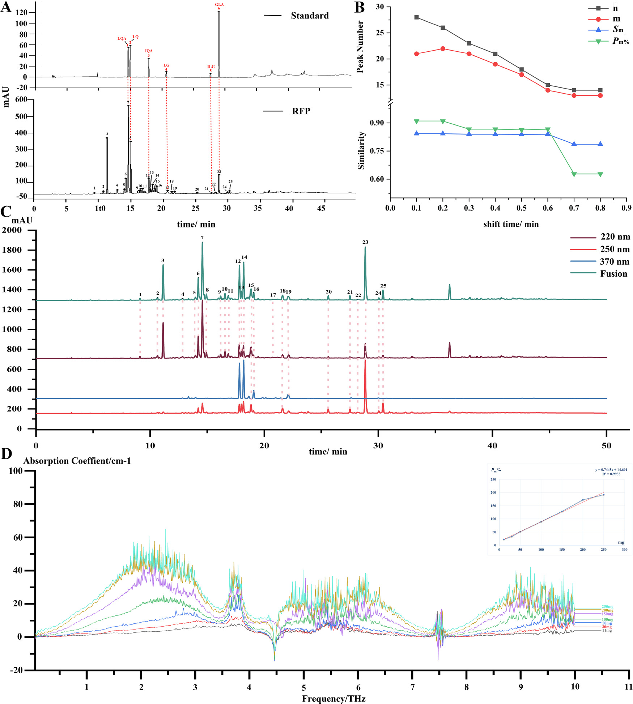
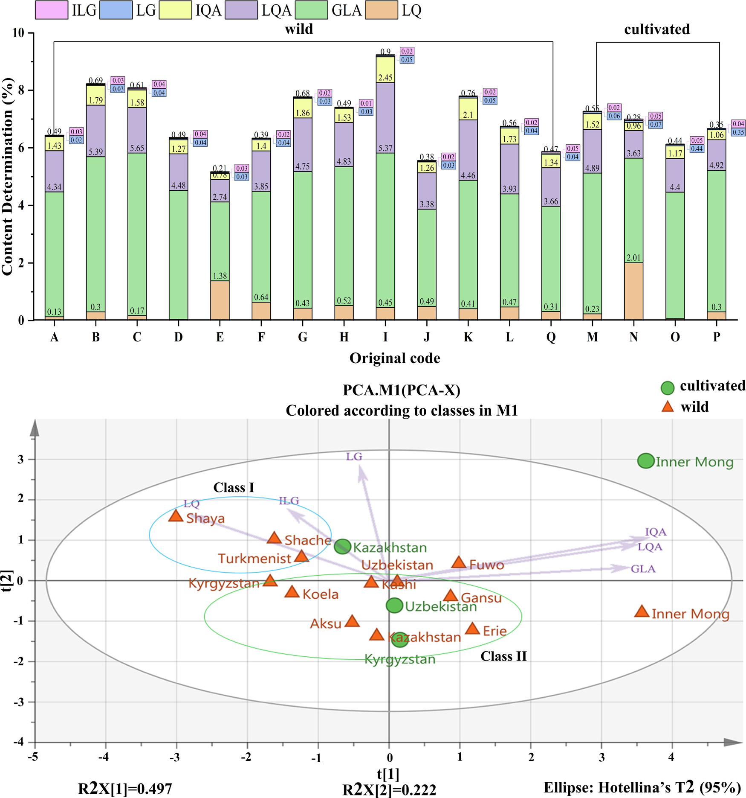
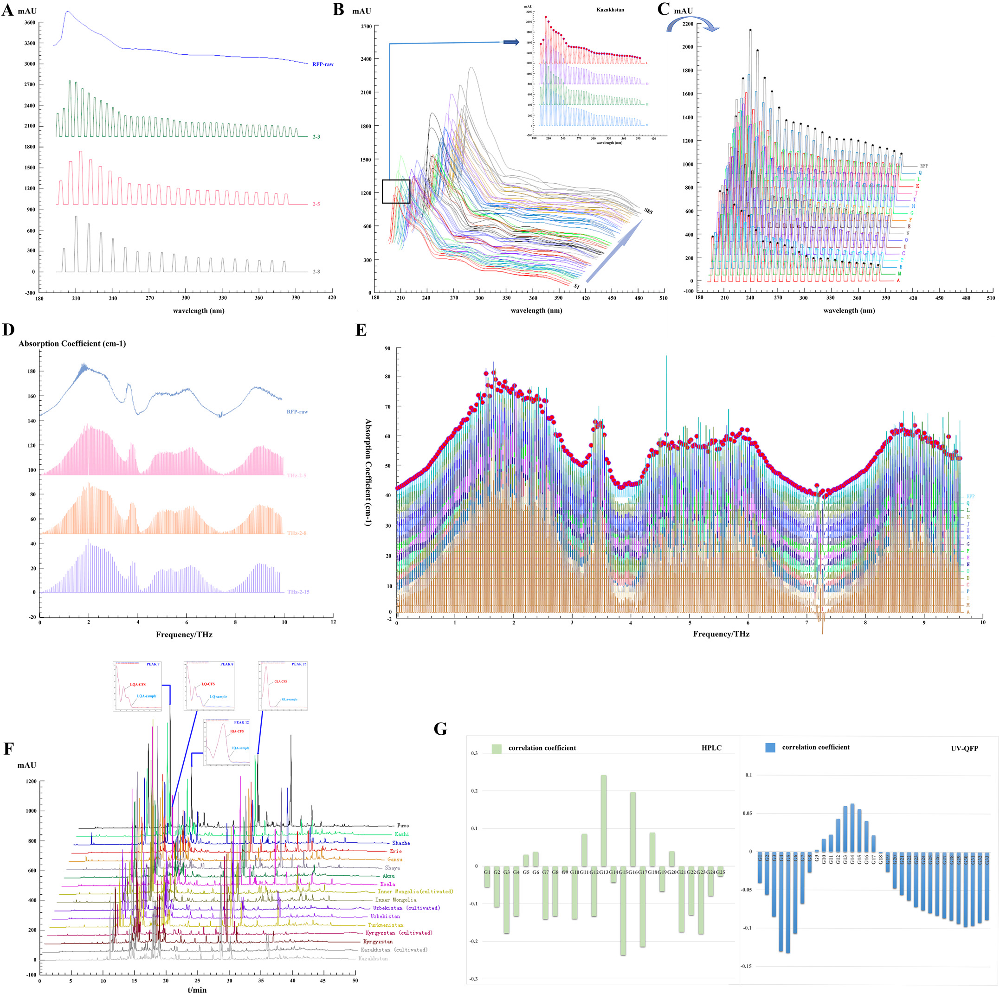

<!-- 方針: ほぼ全訳＋必要に応じた補足。原文構成に沿って訳出。「> 補足:」は訳者注。 -->

## 書誌情報

- 標題（原題）: A trinity fingerprint evaluation system of traditional Chinese medicine
- 著者・所属: Huizhi Yang, Ting Yang, Dandan Gong, Xiaohui Li, Guoxiang Sun*, Ping Guo*（瀋陽薬科大学薬学院, 中国／Xiaohui Liのみ中国通信技術(江門)有限公司）
- 掲載誌・巻号・DOI: *Journal of Chromatography A*, 1673 (2022) 463118. https://doi.org/10.1016/j.chroma.2022.463118
- インパクトファクター: **約3.8**（*Journal of Chromatography A*, JCR 2024 / Clarivate。報告により3.8〜4.2）
- 受理経過: 受領 2022-02-26 / 改訂 2022-04-29 / 採録 2022-05-02 / オンライン公開 2022-05-10
- ライセンス: © 2022 Elsevier B.V. All rights reserved.

> 補足: 略語一覧（原文Abbreviationsより）。BCA=二変量相関分析、ESM=外部標準法、GLA=甘草酸(glycyrrhizic acid)、IEM=区間消去法(interval erasure method)、ILG=イソリクイリチゲニン(isoliquiritigenin)、IQA=イソリクイリチンアピオシド(isoliquiritin apioside)、LG=リクイリチゲニン(liquiritigenin)、LQ=リクイリチン(liquiritin)、LQA=リクイリチンアピオシド(liquiritin apioside)、MAML=単線式多成分定量法(multi-markers assay by monolinear method)、MEMA=測定マーカー(measurement marker)、QAMS=単一標準物質による多成分定量分析法、QFP=量子指紋(quantum fingerprint)、RFP=参照指紋(reference fingerprint)、SQFM=系統定量指紋法(systematically quantified fingerprint method)、TCM=中医薬、PCA=主成分分析、FIA=フローインジェクション分析。

## 要旨（Abstract）

本研究は、中医薬（TCM）の多層性・多特性を反映しうる一連の品質評価方法の開発に焦点を当てた。甘草（*Glycyrrhiza glabra* L.）を方法開発用サンプルとして、活性成分間の標準曲線関係を通じて、単線式多成分定量法（multi-markers assay by monolinear method; MAML）の実現可能性を初めて検討した。甘草酸（GLA）を測定マーカー（MEMA）として用いることで、MAMLは甘草の5成分（イソリクイリチゲニン、イソリクイリチンアピオシド、リクイリチゲニン、リクイリチン、リクイリチンアピオシド）を同時に定量できる。MAMLと単一標準物質による多成分定量分析法（QAMS）をそれぞれ外部標準法（ESM）と比較したところ、MAMLとESMで算出した成分含量に有意差はなかった（相対誤差（RE）は概ね2.00%未満）。一方、QAMSで算出した成分含量のREは変動が大きく、MAMLがQAMSより正確であることが示された。さらに、区間消去法によりUVおよびTHzの量子指紋を確立した。系統定量指紋法（SQFM）を核として、HPLC・UV・THzに基づく「Trinity（三位一体）」指紋品質評価システムを構築した。本システムは、13の産地および2つの栽培様式（野生／栽培）に由来する甘草サンプルの品質差を、総合評価結果によって良好に識別した。同時に、異なる加工技術水準における甘草の品質情報も明らかにされた。最後に、二変量相関分析（BCA）を用いてUV/HPLCと抗酸化スペクトル効能との関連を検討し、甘草の二次元活性スペクトルを提示した。本手法は、化学指紋特性・化学結合振動特性・生物活性情報の観点から、甘草さらには他のTCMに対して、より徹底的かつ客観的な分析技術を提供しうるものである。

**キーワード**: 単線式多成分定量法（Multi-markers assay by monolinear method）；量子指紋（Quantum fingerprint）；系統定量指紋法（Systematically quantified fingerprint method）；三波長最大融合指紋（Three-wavelength maximum fusion fingerprint）；中医薬（Traditional Chinese medicine）

## 1. 序論（Introduction）

2019年の新型コロナウイルス（2019-nCoV）の流行以来、中医薬（TCM）は中国における予防・治療戦略の重要な柱となっている[1]。一方、薬の安全性はTCMの内部品質と密接に関連している[2,3]。産地の違いや栽培方法の違いなど、さまざまな事情によりTCMの内部品質は大きく変動しうる[4]。TCMの複雑な混合機構は、その品質管理をより困難にしている[5]。そこで本研究では、13の産地に由来する甘草（*Glycyrrhiza glabra* L.）85バッチを方法開発用サンプルとして用い、TCMのための統合的な品質管理法の構築に取り組んだ。

現在、クロマトグラフィー指紋、とりわけHPLC指紋は、TCMの品質管理に広く利用されている[6,7]。しかし、HPLC-DAD指紋分析は一般に固有の波長で決定されるため、後続のデータ処理において一部の物質の応答が単一波長では低すぎたり、あるいは検出されないことすらある[8]。単一波長では全化合物の最大紫外（UV）吸収特性を特徴づけることはできない。そこで、他の波長における指紋情報を考慮し、有用情報を掘り起こすための基盤を提供するために、三波長最大融合指紋が確立された[9,10]。残念ながら、この方法もUV吸収を持つ一般的な化合物の指紋特性のみを考慮したものであった[11,12]。このような状況下で、複数の検出技術を組み合わせてTCMの品質を管理することが不可欠となった。紫外可視分光法は主に共役系・芳香族系成分の不飽和帯情報を明らかにする。フローインジェクション分析（FIA）法と組み合わせることで、低消費量・高精度でサンプルの迅速な分析が可能となり、主観的な波長選択の一面性も回避できる[13–15]。テラヘルツ（THz）応答は分子集団挙動と組み合わさることで、TCM中の高分子（アミノ酸・炭水化物等）の全体構造や関連する環境情報の振動モードを反映しうる[16–19]。この3手法の原理は相補的であるだけでなく、TCM分析の分類・類似性評価にも広く用いられている。しかし、スペクトルデータは一般に連続信号・冗長情報・複雑な図形という特徴を持ち、包括的な定性・定量分析への利用が難しい。以上の問題を踏まえ、孫国祥（Guoxiang Sun）教授[20,21]は、連続スペクトル信号を区間消去法（IEM）によって定量化する「量子指紋（quantum fingerprint; QFP）」を提唱した。デジタル情報処理による統合・縮約結果は量子指紋ピークとして表現される。確立されたQFPは対象の情報特徴を網羅するだけでなく、スペクトル特性をより簡潔かつ直感的にする。TCMの品質は、クロマトグラフィー（HPLC-FP）とスペクトル（UV-QFPおよびTHz-QFP）を用いた系統定量指紋法（SQFM）[22]によって評価された。

さらに、TCMは体系的な標準化を未だ達成しておらず、一部の標準物質は高価であるため、一部成分の定量が困難である[23]。そこで、単線式多成分定量法（MAML）[24]が提唱され、甘草において初めて検証された。MAMLは、単一標準物質による多成分定量分析法（QAMS）[25,26]からのさらなる革新である。線形範囲および系統的方法論、さらには誤差解析・信頼性解析理論に焦点を当て、操作誤差を最小化し分析技術の精度を高めることを目的とする。本研究では、甘草の定量指紋を用い、甘草酸を測定マーカー（MEMA）として、定量成分の標準曲線のもとで絶対補正係数を算出し、続いて対応成分の相対補正係数を求めた。活性化合物の定量的な管理に加え、1,1-ジフェニル-2-ピクリルヒドラジル（DPPH）ラジカル消去アッセイ[27–29]により甘草サンプルのin vitro抗酸化活性を検討した。二変量相関分析（BCA）[30]を通じて、UVとHPLCの間の抗酸化活性のスペクトル-効能関係を論じ、サンプルの二次元活性プロファイルを示した。要するに、本論文は、機能特性・多成分性・多層性などを反映しうる、科学的かつ厳密で標準化されたTCM品質評価法の確立を目指すものである。

## 2. 理論（Theory）

### 2.1. 系統定量指紋法（Systematically quantified fingerprint method）

SQFM[22]は、実用性と適応性を兼ね備えた、TCM系のためのマクロ的な定量評価法である。定性比類似度（*S*F'）は、大きなピークが小さなピークを覆い隠してしまうという定性類似度（*S*F）の問題を克服できる。*S*F'はすべての指紋ピークに等しい重みを与える。TCMの化学指紋の量と分布比率を監視して曖昧性を解消するマクロ定性類似度因子（*S*m）は、この両者の平均である。同様に、定量類似度（*P*）も、投影含量類似度（*C*）における大きなピークが小さなピークを隠してしまう一面性を克服できる。*P*と*C*の平均値はマクロ定量類似度（*P*m）と呼ばれ、化学指紋の全体含量を総体として監視するために用いられる。すべての式は式(1)–(2)に示すとおりであり、*xi*・*yi*はそれぞれサンプル指紋（SFP）と参照指紋（RFP）のピーク面積を表す。RFPは全サンプルの指紋を平均して得られる。

したがって、*S*mと*P*mの両方を用いてTCMの品質を評価する方法をSQFMと呼び、両者のうち低い方の値が品質等級を決定する。これによりTCMは以下の8つのカテゴリーに分類される。

- Grade1 = [*S*m≥0.95, 95%≤*P*m≤105%]、Grade2 = [*S*m≥0.90, 90%≤*P*m≤110%]
- Grade3 = [*S*m≥0.85, 85%≤*P*m≤115%]、Grade4 = [*S*m≥0.80, 80%≤*P*m≤120%]
- Grade5 = [*S*m≥0.70, 70%≤*P*m≤130%]、Grade6 = [*S*m≥0.60, 60%≤*P*m≤140%]
- Grade7 = [*S*m≥0.50, 50%≤*P*m≤150%]、Grade8 = [*S*m<0.50, 50%<*P*m>150%]

> 補足: 式(1)（*S*m算出式）・式(2)（*P*m算出式）は分数・総和記号を含む数式であり、PDFのレイアウト上の制約により本文中での正確な再現が難しいため、記号の定義と等級区分（上記）のみを記載する。数式の正確な形は原文参照。

### 2.2. 単線式多成分定量法（Multi-markers assay by monolinear method）

MAML[24]は、QAMS[23]の原理とTCM定量指紋の理論を組み合わせた新規手法である。複数の活性化合物の標準曲線は、指紋検出と同一のクロマトグラフィー条件下で確立された。測定マーカー（MEMA）の標準曲線を用いて、他の化合物の標準曲線パラメータについて相対補正係数・誤差・信頼性を算出した。許容誤差範囲内で、標準曲線法を可能な限り簡略化し、標準物質の使用を節約するという目的が達成される。MEMA（s）と他の化合物（i）の標準曲線に基づき、絶対補正係数（*fi*）を式(3)–(6)に示すように算出する。*bas* = *as*/*Cs*、*bai* = *ai*/*Ci*の式は、*bas*と*bai*が濃度に大きく影響することを示す。濃度が大きいほど切片・傾き比は小さくなり、測定誤差は小さくなる。線形平均濃度*C0* = 0.5(*C1* + *C2*)は、最良の試験サンプル濃度として一般に受け入れられている。式(7)に示すように、相対補正係数（*fsi*）を算出する。*ba* = |*a*/*C*|≤1%*b*のとき（誤差1.0%未満）、式(8)の傾き公式を用いて直接得ることができる。この比は簡易相対補正係数（*f'si*）と呼ばれる。さらに、相対補正係数の誤差（方法信頼性*R*と呼ぶ）も式(9)で検討され、これには秤量誤差（*RSDCs*）、標準曲線誤差（*bas*/*bs*）、MEMAの相対ピーク面積誤差（*RSDAs*）および他の化合物のそれ（*RSDAi*）が含まれる。したがって、MAMLはQAMSにおける線形範囲検査・系統的技術検証の不足を補い、試験技術者に誤りを排除する方法を助言することもできる。

式(3)–(10)（原文の数式番号）:
- *As* = *bsCs* + *as* (3)
- *Ai* = *biCi* + *ai* (4)
- *fs* = *As*/*Cs* = *bs* + *as*/*Cs* = *bs* + *bas* (5)
- *fi* = *Ai*/*Ci* = *bi* + *ai*/*Ci* = *bi* + *bai* (6)
- *fsi* = *fs*/*fi* = (*bs*+*bas*)/(*bi*+*bai*) (7)
- *f'si* = *fs*/*fi* ≈ *bs*/*bi* (8)
- *R* = 1−*RSDCi* = 1−√(*RSDCs*² + (*bas*/*bs*)² + (*bai*/*bi*)² + *RSDAi*² + *RSDAs*²) ≥95.5% (9)
- *Cm* = *fsi*×*Cms*×*Am*/*Ams* (10)

> 補足: 数式は原文の構造（分数・平方根・添字）をできる限り保ったが、PDFのレイアウト抽出の制約上、完全な組版の再現ではない。正確な数式は原文参照。

### 2.3. TCMのTHz量子指紋の一致性評価システム

一般に、テラヘルツ透過スペクトルは、THz-TDSシステムにおいて光学パラメータを抽出するために最も広く用いられる方法である。主な抽出の考え方は、光路下でサンプルの実信号（*Esam*(*t*)）と、サンプルなしで得られる参照信号（*Eref*(*t*)）を測定することである。次に、フーリエ変換操作法を用いて、直接受信した時間領域信号を周波数領域信号（*Eref*(ω)および*Esam*(ω)）に変換する。サンプルの屈折率と吸収係数は、dorney[32]およびduvillaret[33]により提案された方法でデータ処理して得られた。式(11)–(13)に示すとおり：*n*(ω)はサンプルの屈折率；ωは周波数；ϕ(ω)はサンプル信号と参照信号の位相差；α(ω)はサンプルの吸収係数を表す；*A*(ω)は周波数領域信号におけるサンプルと参照の振幅比；*d*はサンプルの厚さを表す。

- ϕ(ω) = ϕsample(ω) − ϕref(ω) (11)
- *n*(ω) = ϕ(ω)*c*/(ω*d*) + 1 (12)
- α(ω) = (2/*d*)ln{4*n*(ω)/[*A*(ω)(*n*(ω)+1)²]} (13)

これに基づき、量子指紋は3.7節で述べるソフトウェアにおいて区間消去法（IEM）によって確立された。これは本質的にスペクトルをクロマトグラフィー的な量子ピークに変換するプロセスである。以下の式(14)–(16)に従う：*H*・*A*・*W*はそれぞれピーク高さ・ピーク面積・ピーク幅を表す。*bi*は消去開始点の吸光度である；*W*はピーク幅を表す；*i*は消去点の数を示す。

- *H* = *A*/*bi* (14)
- *A* = *WH* (15)
- *W* = *i*/200 (16)

スペクトル量子指紋の使用は、ソフトウェアによってスペクトル吸収係数の周波数を定量化し、クロマトグラフィー指紋ピークのようにピークをマッチングできるようにすることを目的とする。これはTCMのスペクトル図の定性・定量分析の可能性を提供する。

## 3. 材料と方法（Materials and methods）

### 3.1. 試薬と化学物質

新疆伏沃薬業有限公司（Xinjiang Fuwo Pharmaceutical Co., Ltd.）から提供された、13の異なる産地（国内9産地・国外4産地。補足表S1）に由来する野生・栽培の甘草（*Glycyrrhiza glabra* L.）サンプル85バッチを収集した。

甘草酸（GLA、98.5%）、リクイリチゲニン（LG、98.5%）、イソリクイリチゲニン（ILG、99.0%）、リクイリチンアピオシド（LQA、99.0%）、イソリクイリチンアピオシド（IQA、99.0%）、リクイリチン（LQ、93.1%）の標準物質は、中国食品薬品検定研究院（北京）より購入した。HPLCグレードのメタノール・アセトニトリル・リン酸は玉皇工業有限公司（山東省）より入手した。ヘプタンスルホン酸ナトリウムは中美化学有限公司（山東省）より供給された。ポリエチレン粉末（AR級）は上海管部机电科技有限公司（上海）より入手した。実験過程を通じて脱イオン水を使用した。

### 3.2. サンプル調製

甘草サンプル85バッチを均一な粒度に粉砕し、40メッシュのふるいを通過させ、自封式袋に入れ、使用前は遮光下で保管した。

#### 3.2.1. THzサンプル調製

甘草粉末を電熱送風乾燥オーブン（DHG-9070A、上海一恒科学儀器有限公司）で60℃、2時間あらかじめ乾燥し、取り出してデシケーター内で冷却した。甘草粉末サンプル約0.2gを秤量し、打錠成形型（HY-12、天津天光新光学儀器有限公司）に載せ、24MPaで1分間圧縮して直径13mmの円形シートを形成した。

#### 3.2.2. HPLCサンプルおよび標準溶液の調製

サンプル粉末1gを、超音波浴（120W、40kHz、JP-020、深圳市스카이멘清洗設備有限公司、中国）中で溶媒（80%メタノール-水）45 mLで20分間抽出した。室温まで放冷後、溶媒で50 mLに定容した。その後、抽出サンプル溶液を0.45 μmミクロポアフィルターでろ過して分析に供した。6化合物を精密に秤量し、メタノールに溶解して、100 μg/mL LQA、60 μg/mL LQ、100 μg/mL IQA、10 μg/mL LG、20 μg/mL ILG、800 μg/mL GLAの標準溶液を調製した。分析前、すべてのサンプル・標準溶液は4℃遮光下で保存した。

### 3.3. HPLC分析条件

HPLC分析は、Quat Pump VLポンプ・オートサンプラー・フォトダイオードアレイ検出器（DAD）を備えたAgilent 1260シリーズ液体クロマトグラフ（Agilent Technologies, Santa Clara, CA, USA）を用いて行った。甘草のクロマトグラフィー分離はCOSMOSILカラム（250 mm×4.6 mm、5 μm）で行った。

移動相は2相からなる：(A) 5 mMヘプタンスルホン酸ナトリウム溶液-リン酸（499:1, v/v）、(B) アセトニトリルとメタノール（9:1, v/v）、流速1.0 mL/min。グラジエント溶出は以下の通り：0–13 min, 96%→70% A；13–15 min, 70%→67% A；15–18 min, 67%→66% A；18–40 min, 66%→18% A；40–45 min, 18%→15% A；45–50 min, 15%→96% A。注入量は5 μL、総分析時間は50分、カラム温度は35℃。DAD検出波長は220 nm、250 nm、370 nmとした。

### 3.4. UV分光条件

FIAを分析原理として、DADを備えたAgilent 1100 HPLCシステム（Agilent, USA）でPEEKチューブ（5000 mm×0.12）を用いてUVスペクトルを記録した。波長範囲190–400 nmにわたり、波長間隔1 nm・スリット幅1 nmで検出した。3.2.2節で調製したサンプル溶液を10倍希釈後、80%メタノール-水（80:20, v/v）をキャリアとして5 μLをPEEKチューブに注入し、流速1 mL/min、35℃で分析した。

### 3.5. THz分光条件

THzスペクトルデータは、CCT-1800テラヘルツ時間領域分光計（中国通信技術有限公司、深圳、中国）で測定した。装置を20分間予熱後、窒素を導入してサンプル室内の水蒸気を除去し、窒素参照スペクトルを取得した。各サンプルのスペクトルは100回スキャンして測定した。

### 3.6. 抗酸化活性分析

甘草の抗酸化能を確認するため、Jinyu Chenの方法[34]を若干改変したDPPHアッセイを85サンプルに用いた。実験前、DPPH溶液（0.064 mg/mL）を80%メタノールで調製し、遮光保存した。3.2.2節で調製した甘草サンプル抽出液を10倍希釈し、その2 mLを一定量（0, 0.3, 0.5, 1, 1.5, 1.8, 2 mL）のDPPH溶液と混合し、80%メタノールで5 mLに定容した。混合物を暗室で40分間反応させた後、Shimadzu 160A UV分光光度計を用いて、80%メタノールをブランクとして517 nmで吸光度を測定した。各サンプルは3連で測定した。

DPPHラジカル消去活性の割合（*RS*%）は次式で示される。

*RS*% = [*A0* − (*As* − *Ab*)] / *A0* × 100% (17)

*A0*は陰性対照溶液（DPPH＋80%メタノール）の吸光度、*As*はサンプル溶液（DPPH＋サンプル＋80%メタノール）の吸光度、*Ab*はブランク溶液（サンプル＋80%メタノール）の吸光度を表す。*RS*%値をサンプル濃度に対してプロットし、甘草の抗酸化能を表す50%阻害濃度（IC50）を算出した。

> 補足: 原文にはIC50算出に用いた「サンプル濃度」軸の具体的な単位（例: mg/mL等）が明記されていない。表3のIC50値の単位は原文参照とする。

### 3.7. データ解析

THz指紋およびUV指紋のデータは、自社開発ソフトウェア「TCM Spectrum Quantum Profiling Consistency Digitized Evaluation System 4.0」（ソフトウェア認証番号 7,037,415、中国）で解析した。HPLC指紋は「Digitized Evaluation System for consistency of TCM spectral Fingerprints 4.0」（ソフトウェア認証番号 0,407,573、中国）で解析した。主成分分析（PCA）にはOrigin 2019bを用いた。

## 4. 結果と考察（Results and discussion）

### 4.1. 方法論的検証

標準物質とサンプルの指紋ピークの保持時間・UVスペクトルを比較することにより、220 nmにおいてピーク7・8・12・17・21・23がそれぞれLQA・LQ・IQA・LG・ILG・GLAであると同定した（Fig. 1）。3.3節で確立したHPLC法の頑健性をさらに検討するため、S1を用いて方法論的検証を行った。6化学物質の対象濃度範囲において、関連する標準曲線の相関係数（R）はすべて0.999を超え、良好な線形関係が示された（Table 1）。検出限界（LOD）・定量限界（LOQ）はそれぞれ1.5–32.3 ng、4.84–107.66 ngであった。6化合物の回収率はそれぞれ97.6%、101.9%、98.6%、97.6%、100.3%、98.5%であり、方法の正確性が要件を満たすことが示された。6つの定量ピークの保持時間（RT）・ピーク面積（PA）の相対標準偏差（RSD）を用いて、含量測定法の精度・再現性・安定性を検証した。精度はS1を6回注入して、再現性は6個の個別サンプル（S1）を分析して検証し、安定性は同一サンプル（S1）を25℃で32時間（0, 2, 4, 6, 8, 12, 24, 32時間）にわたり安定であることを確認した。RTおよびPAのRSDはそれぞれ1.0%未満、2.0%未満であった。精度・再現性・安定性は、HPLC指紋の適用性を評価するために利用された。GLA（ピーク23）を参照ピークとして、25本の共通ピークの相対RT・相対PAのRSDを算出したところ、それぞれ0.23%未満、3.84%未満であった。

UV方法論の検討は3.4節の条件に従って実施した。方法の精度を評価するため、同一サンプル（S1）を6回連続注入した。6個の個別サンプル（S1）を連続注入して方法の再現性を分析した。サンプルの安定性は25℃で0, 2, 4, 6, 8, 12時間にわたりモニタリングされた。220 nmにおける非分離クロマトグラムのRT・PAのRSDを用いて精度・再現性・安定性を評価したところ、それぞれ0.52%未満、2.07%未満であった。

さらに、THz-QFP法の実現可能性についても検証し、SQFMのパラメータ*P*mに基づき線形性・精度・再現性・特異性を検討した。サンプル0, 11, 30, 50, 100, 150, 200, 250 mgを精密に秤量し、200 mg未満のサンプルにはポリエチレン粉末（PE）を加えて200 mgとした。3.2.1節の方法を用いてTHzで曲線を記録した（Fig. 1D）。

サンプル質量と*P*mをそれぞれ横軸・縦軸として線形回帰式を得た。式は*P*m = 0.7445*m* + 14.691；*r* = 0.9935であった。結果は、11–250 mgの範囲でサンプル質量と*P*mの間に良好な線形関係があることを示した。3.5節で確立した方法に従い、S1サンプルを6回連続測定して精度を評価したところ、*P*mのRSDは1.34%であった。6個のS1サンプルを分析して再現性を検討したところ、*P*mのRSDは1.28%であった。特異性については、サンプル室に水蒸気ピークやPE粉末が存在せず、THz検出を妨害しないことが要求される。以上の試験結果は、確立された方法が規定要件を満たすことを示した。

#### 表1. 6分析対象物の検量線・LOD・LOQ・回収率

| 分析対象 | 回帰式（*y*=ピーク面積、*x*=標準品濃度 μg/mL） | R² | 直線範囲(μg/mL) | LOD(ng) | LOQ(ng) | 回収率(%) | 回収率RSD(%) |
| :--- | :--- | :-: | :-: | :-: | :-: | :-: | :-: |
| LQ | y = 17.388x + 1.6534 | 0.9999 | 14.5–870.5 | 2.2 | 7.3 | 97.6 | 1.09 |
| LG | y = 28.829x − 3.1188 | 0.9998 | 4.8–58.1 | 1.5 | 4.8 | 101.9 | 1.25 |
| ILG | y = 12.072x − 1.0910 | 0.9998 | 1.7–51.2 | 2.6 | 8.5 | 98.6 | 2.50 |
| LQA | y = 11.902x + 1.9934 | 0.9999 | 15.5–930.6 | 2.3 | 7.8 | 97.6 | 1.48 |
| IQA | y = 5.8756x + 0.0158 | 0.9998 | 34.9–418.3 | 5.2 | 17.4 | 100.3 | 3.80 |
| GLA | y = 1.0623x + 0.2017 | 0.9995 | 64.6–1938.0 | 32.3 | 107.7 | 98.5 | 2.10 |

> 略語: LQ=リクイリチン、LG=リクイリチゲニン、ILG=イソリクイリチゲニン、LQA=リクイリチンアピオシド、IQA=イソリクイリチンアピオシド、GLA=甘草酸。

### 4.2. 6成分の定量分析

#### 4.2.1. MAML定量分析

MAMLがQAMSに代わって甘草の活性成分をより正確に定量できるかを検討するため、外部標準法（ESM）・QAMS・MAMLの3法を用いて6物質の濃度を決定した（補足表S3）。ESM[35]では、Table 1に示した線形回帰式によって定量成分含量を容易に算出できる。GLAをMEMAとして用い、残り5化合物の含量はZhimin Wang[36]らによるQAMSに従って算出した。2.2節のMAML原理に基づき、GLAを同様にMEMAとして用いた。まず、*R*は95.5%を超えた（Table 2）。次に、ILG・LG・IQA・LQ・LQAの相対補正係数を算出した。最後に、ESMで算出したGLA濃度とピーク面積を用い、式(10)により5物質の含量を得た。QAMSとMAMLの差異を比較するため、それぞれESMとの相対誤差（RE）を算出した（補足表S4）。結果は、MAMLのREがQAMSより有意に低いことを示し、特に甘草中で含量の高いLQA・LQ・IQAで顕著であった。MAMLのREは概ね0.50%以下であり、ほとんどが0.10%を超えることすらなかった。これは、MAMLとESMの結果に有意差がないことを示した。ただし、一部のILGとLGのREは2.0%を超えたが、これはその含量が4 μg/mL未満であることに起因した。以上をまとめると、MAMLはより信頼性の高い精度を持つ革新的な方法であることが強く証明された。MAMLはQAMSの検出コスト・分析時間を削減する利点を継承するだけでなく、TCMの一致性評価のための定量指紋管理法をも提供する。

#### 表2. MAMLで得られた甘草の各パラメータ値

| 分析対象 | C0（線形平均濃度） | b_ai（切片比） | b（標準曲線の傾き） | f_i（絶対補正係数） | f_si（相対補正係数） | f'_si（簡易相対補正係数） | R(i)（方法信頼性, %） |
| :--- | :-: | :-: | :-: | :-: | :-: | :-: | :-: |
| GLA | 1001.30 | −0.0002 | 1.0621 | 1.0000 | 0.0106 | 1.0000 | — |
| ILG | 26.45 | −0.0412 | 12.0308 | 0.0883 | 0.1207 | 0.0880 | 97.53 |
| LG | 31.45 | −0.0992 | 28.7298 | 0.0370 | 0.2883 | 0.0368 | 97.97 |
| IQA | 226.60 | 0.0001 | 5.8757 | 0.1808 | 0.0588 | 0.1808 | 98.17 |
| LQ | 442.50 | 0.0037 | 17.4017 | 0.0610 | 0.1740 | 0.0611 | 98.34 |
| LQA | 473.05 | 0.0042 | 11.9042 | 0.0892 | 0.1190 | 0.0893 | 98.25 |

> 補足: 原文Table 2の列見出しには「1%bi」という断片も含まれるが、これは本文2.2節で述べた許容誤差基準（*ba*=|*a*/*C*|≤1%*b*、誤差1.0%未満）を指す注記であり、独立した数値列ではないと判断し、各行7個の実測値を列（C0・b_ai・b・f_i・f_si・f'_si・R(i)%）として整理した。GLA行は測定マーカー自身（自己参照）にあたるため、方法信頼性R(i)は「—」（該当なし）。列の定義はいずれも原文脚注(a–f)に基づく：a C0=線形平均濃度、b bai=切片比、c fi=絶対補正係数、d fsi=相対補正係数、e f'si=簡易相対補正係数、f R(i)%=方法信頼性。

#### 4.2.2. サンプル分析

6活性成分の百分率含量を用いて、13産地に由来する栽培・野生の甘草サンプルの品質を識別した（Table 3）。85甘草サンプルにおけるLQの平均百分率含量は0.43%であり、2020年版中国薬局方が定める含量（LQ≥0.50%）に達したのはわずか23バッチであった。GLAの平均百分率は4.14%であり、S71（1.00%）とS79（1.95%）を除いて適格であった（GLA≥2.0%、2020年版中国薬局方）[37]。サンプル中のIQAは0.10%–1.11%であり、LGとILGの含量はほぼ0.10%程度と低かった。全体として、6活性成分の含量は著しく多様であり、85サンプルにおける平均百分率含量はGLA＞LQA＞IQA＞LQ＞LG＞ILGの順であった。

#### 表3. 甘草サンプル85バッチにおける6マーカーの百分率含量とIC50値

<!-- 産地・野生/栽培の内訳はSupplementary Table S1に記載されており本文からは判読できないため、バッチ番号(S1-S85)のみを列挙する。原文参照。含量単位は% -->

| バッチ | LQ | GLA | LQA | IQA | LG | ILG | IC50 |
| :--- | :-: | :-: | :-: | :-: | :-: | :-: | :-: |
| S1 | 0.07 | 4.32 | 1.53 | 0.56 | 0.01 | 0.04 | 0.5531 |
| S2 | 0.13 | 4.01 | 1.43 | 0.52 | 0.03 | 0.04 | 0.3145 |
| S3 | 0.19 | 4.7 | 1.34 | 0.39 | 0.01 | 0.02 | 0.3215 |
| S4 | 0.12 | 6.65 | 2.09 | 0.89 | 0.03 | 0.06 | 0.4544 |
| S5 | 0.19 | 4.95 | 1.72 | 0.66 | 0.05 | 0.02 | 0.1056 |
| S6 | 0.59 | 4.57 | 1.57 | 0.53 | 0.02 | 0.01 | 0.1010 |
| S7 | 0.14 | 6.53 | 2 | 0.82 | 0.06 | 0.03 | 0.1411 |
| S8 | 0.26 | 5.47 | 1.68 | 0.56 | 0.02 | 0.05 | 0.1143 |
| S9 | 0.1 | 4.96 | 1.05 | 0.45 | 0.04 | 0.04 | 0.3007 |
| S10 | 0.01 | 4.08 | 1.67 | 0.64 | 0.07 | 0.05 | 0.1411 |
| S11 | 0.07 | 4.22 | 0.99 | 0.38 | 0.03 | 0.04 | 0.1143 |
| S12 | 0.05 | 5.13 | 1.15 | 0.46 | 0.03 | 0.04 | 0.3301 |
| S13 | 0.54 | 3.26 | 0.89 | 0.27 | 0.03 | 0.03 | 0.3918 |
| S14 | 1.45 | 2.14 | 0.59 | 0.14 | 0.03 | 0.03 | 0.1411 |
| S15 | 2.09 | 2.83 | 0.86 | 0.21 | 0.04 | 0.03 | 0.1143 |
| S16 | 0.75 | 4.27 | 1.61 | 0.46 | 0.07 | 0.03 | 0.2316 |
| S17 | 0.39 | 3.43 | 1.46 | 0.41 | 0.01 | 0.02 | 0.6318 |
| S18 | 0.79 | 3.84 | 1.12 | 0.29 | 0.03 | 0.01 | 0.5279 |
| S19 | 0.45 | 3.34 | 0.86 | 0.24 | 0.01 | 0.03 | 0.5334 |
| S20 | 0.31 | 4.92 | 2.17 | 0.85 | 0.03 | 0.02 | 0.2633 |
| S21 | 0.52 | 6 | 2.54 | 0.94 | 0.05 | 0.02 | 0.2676 |
| S22 | 0.44 | 3.18 | 1.38 | 0.4 | 0.02 | 0.02 | 0.3921 |
| S23 | 0.57 | 6.51 | 1.32 | 0.41 | 0.06 | 0.01 | 0.3241 |
| S24 | 0.56 | 4.81 | 1.9 | 0.65 | 0.02 | 0.01 | 0.2457 |
| S25 | 0.53 | 6.36 | 2.94 | 1.11 | 0.04 | 0.02 | 0.3033 |
| S26 | 0.69 | 5.63 | 2.04 | 0.78 | 0.07 | 0.03 | 0.2669 |
| S27 | 0.13 | 4.13 | 2.37 | 0.8 | 0.03 | 0.01 | 0.1184 |
| S28 | 0.59 | 3.52 | 1.49 | 0.41 | 0.03 | 0.03 | 0.1318 |
| S29 | 0.35 | 3.87 | 1.27 | 0.45 | 0.03 | 0.02 | 0.4121 |
| S30 | 0.54 | 2.75 | 1.02 | 0.27 | 0.03 | 0.02 | 0.3006 |
| S31 | 0.26 | 4.98 | 2.46 | 0.91 | 0.04 | 0.02 | 0.1184 |
| S32 | 0.52 | 5.74 | 2.84 | 1.04 | 0.07 | 0.02 | 0.1318 |
| S33 | 0.2 | 2.65 | 1.01 | 0.34 | 0.04 | 0.03 | 0.4348 |
| S34 | 0.66 | 4.34 | 1.85 | 0.6 | 0.04 | 0.03 | 0.3395 |
| S35 | 0.25 | 3.07 | 1.47 | 0.47 | 0.02 | 0.01 | 0.3541 |
| S36 | 0.51 | 4.37 | 1.86 | 0.6 | 0.07 | 0.01 | 0.2184 |
| S37 | 0.14 | 5.72 | 1.67 | 0.64 | 0.04 | 0.03 | 0.1318 |
| S38 | 0.41 | 5.01 | 1.44 | 0.5 | 0.04 | 0.01 | 0.1688 |
| S39 | 0.16 | 4.2 | 1.55 | 0.57 | 0.06 | 0.01 | 0.5155 |
| S40 | 0.2 | 4.61 | 1.41 | 0.5 | 0.09 | 0.01 | 0.1958 |
| S41 | 2.72 | 3.2 | 0.58 | 0.17 | 0.03 | 0.05 | 0.1935 |
| S42 | 2.28 | 5.64 | 1.2 | 0.37 | 0.04 | 0.09 | 0.1935 |
| S43 | 1.77 | 2.63 | 0.85 | 0.21 | 0.02 | 0.02 | 0.3413 |
| S44 | 1.28 | 3.06 | 1.19 | 0.36 | 0.17 | 0.02 | 0.3664 |
| S45 | 0.04 | 4.9 | 1.06 | 0.45 | 0.03 | 0.02 | 0.4276 |
| S46 | 0.03 | 3.71 | 0.79 | 0.29 | 0.04 | 0.01 | 0.4275 |
| S47 | 0.09 | 3.78 | 1.28 | 0.49 | 0.06 | 0.01 | 0.4358 |
| S48 | 0.09 | 5.19 | 1.54 | 0.53 | 0.05 | 0.01 | 0.3326 |
| S49 | 0.41 | 4.97 | 1.16 | 0.33 | 0.02 | 0 | 0.1822 |
| S50 | 0.27 | 5.24 | 0.87 | 0.26 | 0.07 | 0 | 0.1834 |
| S51 | 0.4 | 5.02 | 1.15 | 0.38 | 0.04 | 0 | 0.1535 |
| S52 | 0.12 | 4.43 | 1.04 | 0.44 | 0.03 | 0 | 0.2064 |
| S53 | 0.27 | 2.78 | 1.08 | 0.37 | 0.11 | 0.04 | 0.2246 |
| S54 | 0.71 | 4.6 | 1.88 | 0.6 | 0.05 | 0.07 | 0.3149 |
| S55 | 0.5 | 4.94 | 2.56 | 0.9 | 0.04 | 0.04 | 0.1184 |
| S56 | 0.3 | 4.42 | 1.98 | 0.7 | 0.04 | 0.1 | 0.1318 |
| S57 | 0.14 | 3.55 | 1.92 | 0.7 | 0.07 | 0.08 | 0.1638 |
| S58 | 0.31 | 3.99 | 1.46 | 0.47 | 0.21 | 0.07 | 0.2029 |
| S59 | 0.18 | 3.62 | 1.98 | 0.58 | 0.04 | 0.02 | 0.1650 |
| S60 | 0.36 | 4.15 | 1.52 | 0.54 | 0.02 | 0.05 | 0.2967 |
| S61 | 0.45 | 2.9 | 1.28 | 0.44 | 0.04 | 0.04 | 0.2073 |
| S62 | 0.31 | 4.13 | 1.38 | 0.43 | 0.03 | 0.05 | 0.1784 |
| S63 | 0.4 | 4.05 | 1.39 | 0.53 | 0.03 | 0.03 | 0.1411 |
| S64 | 0.1 | 2.3 | 0.76 | 0.25 | 0.04 | 0.04 | 0.3921 |
| S65 | 0.41 | 4.49 | 1.75 | 0.62 | 0.02 | 0.03 | 0.3241 |
| S66 | 0.4 | 3.93 | 1.19 | 0.44 | 0.02 | 0.06 | 0.1141 |
| S67 | 0.17 | 2.89 | 0.63 | 0.23 | 0.03 | 0.04 | 0.2083 |
| S68 | 0.19 | 2.78 | 1.27 | 0.42 | 0.01 | 0.02 | 0.2397 |
| S69 | 0.32 | 4.45 | 1.21 | 0.41 | 0.03 | 0.04 | 0.1919 |
| S70 | 0.25 | 3.64 | 1.07 | 0.39 | 0.02 | 0.04 | 0.1609 |
| S71 | 0.05 | 1 | 0.26 | 0.1 | 0.01 | 0.03 | 0.2804 |
| S72 | 0.18 | 2.96 | 0.9 | 0.29 | 0.02 | 0.03 | 0.2043 |
| S73 | 0.41 | 2.98 | 0.98 | 0.36 | 0.03 | 0.04 | 0.2025 |
| S74 | 0.2 | 4.18 | 1.85 | 0.73 | 0.06 | 0.05 | 0.3921 |
| S75 | 0.15 | 2.48 | 1.23 | 0.32 | 0.06 | 0.08 | 0.3241 |
| S76 | 0.37 | 4.29 | 2.35 | 0.81 | 0.03 | 0.06 | 0.3184 |
| S77 | 0.14 | 2.06 | 0.61 | 0.22 | 0.03 | 0.04 | 0.3500 |
| S78 | 0.35 | 4.85 | 1.43 | 0.51 | 0.03 | 0.03 | 0.3921 |
| S79 | 0.08 | 1.95 | 0.41 | 0.13 | 0.06 | 0.04 | 0.3241 |
| S80 | 0.49 | 4 | 1.51 | 0.55 | 0.07 | 0.04 | 0.3380 |
| S81 | 0.35 | 4.1 | 2.02 | 0.74 | 0.05 | 0.03 | 0.4525 |
| S82 | 0.23 | 4.58 | 1.12 | 0.38 | 0.02 | 0.05 | 0.1678 |
| S83 | 0.17 | 3.78 | 0.92 | 0.37 | 0.07 | 0.05 | 0.3334 |
| S84 | 0.2 | 5.74 | 1.65 | 0.61 | 0.03 | 0.08 | 0.1390 |
| S85 | 1.22 | 4.11 | 0.59 | 0.21 | 0.03 | 0.09 | 0.1801 |
| **平均** | **0.43** | **4.14** | **1.42** | **0.49** | **0.04** | **0.03** | **0.2684** |

> 略語・単位: LQ・LG・ILG・LQA・IQA・GLAは百分率含量(%)。IC50はDPPHラジカル消去活性の50%阻害濃度（原文に単位の明記なし、原文参照）。

6成分の含量は産地によって多様であった（Fig. 2）。シャヤ（Shaya、9.24%）が最も高く、次いでキルギスタン（Kyrgyzstan、8.23%）、トルクメニスタン（Turkmenistan、8.09%）であった。対照的に、内モンゴルにおける6化合物の合計百分率含量は最も低く（5.17%）、次いでアリエ（Erie、5.56%）、フウォ（Fuwo、5.87%）であった。6成分の含量は栽培環境によっても異なり、カザフスタンおよび内モンゴルの野生甘草サンプルにおける6分析化学物質の合計百分率含量は、栽培サンプルよりも著しく低かった。一方、キルギスタンでは逆の特徴を示し、キルギスタンの栽培サンプルではILG含量がほぼ無視できる水準であった（S49–S52、Table 3）。Fig. 2Aから、内モンゴルにおけるLQの含量は他の12産地より一般に高いこともわかった。ウズベキスタンおよびキルギスタンの栽培サンプルは、他の産地に比べLG含量がはるかに多かった。

明らかに、6マーカーは大きく変動した。したがって、マーカー化合物の定量分析による甘草の品質評価には限界があり、さらなる化学量論的検討が必要であった。

#### 4.2.3. 主成分分析

上記6指標の識別能力を詳細に検討するため、サンプル産地を区分基準とし、産地に基づく平均データの次元削減にPCA[38]を用いた。PCAモデルの二次元行列は17観測値・6変数（17×6）で構成され、全分散71.9%（PC1=49.7%、PC2=22.2%）を示した。さらに、LG・ILG・LQの3変数はPC1と負の関連を示した。IQA・LQA・GLAはPC1と正の関連を示した。すべての変数はPC2と正の相関を示した（Fig. 2B）。

Fig. 2Bに示すように、17観測値は主に4カテゴリーに分けられた：シャヤ・シャチェ・トルクメニスタンの野生サンプル、およびカザフスタンの栽培サンプルは1クラス（Class I）にまとめられた；コエラ・アクス・カシ・カザフスタン・甘粛・アリエの野生サンプル、およびキルギスタン・ウズベキスタンの2つの栽培様式のサンプルは別のクラス（Class II）に配置された。これらのうち、LG・ILG・LQはClass Iの識別に大きく寄与した；フウォのサンプル（Class III）はIQA・LQA・GLAの含量の影響を受け、PC1・PC2の両方と正の相関を示した。さらに、内モンゴルのサンプル（Class IV）は産地間で顕著な差異を示し、栽培様式下での観測値は95%信頼区間の外側に位置し、外れ値とみなしうる。この現象の理由は、内モンゴルにおけるLQ含量が他地域より著しく高い一方、6マーカーの全体含量（Fig. 2B, E）は低かったためと考えられる。

しかしながら、Class IIの座標位置は、PCAにおける6化合物の負荷量の重みが大きくないことを示しており、これは6化合物だけでは甘草の内部品質全体を代表できず、指紋によるさらなる評価・管理が必要であることを示唆する。

### 4.3. 指紋分析

#### 4.3.1. HPLCの融合指紋分析

GLA（ピーク23）とLQ（ピーク8）は甘草の主要な化学成分であり、220 nmおよび250 nmで強いUV吸収を示した。加えて、異なる波長における甘草サンプルのUV吸収は明らかな違いを示した（Fig. 1C）。9–17分のピークは220 nmで最大応答を示し、17–25分・25–35分のピークはそれぞれ370 nm・250 nmで最大吸収を示した。そこで、物質のUV吸収を最大化するため、3波長最大融合指紋を確立した。

各波長における全指紋ピーク数は、220 nmで25本、250 nmで13本、370 nmで10本と決定された。85バッチのサンプルのクロマトグラフィー信号は3.7節のソフトウェアに取り込まれた。最大吸収ピークを融合基準として、25本の共通ピークを持つ3波長融合指紋を生成した。異なる融合時間窓間で*S*m・*P*m・*n*（全指紋ピーク数）・*m*（分離度*R*≥1.5でベースライン分離された指紋ピーク数）を比較した（Fig. 1B）。全体の化学指紋量と全体含量をできるだけ正確に検出するため、*S*mおよび*P*mはそれぞれ0.70超、70%–130%の範囲で選択すべきである。さらに、*m*値が大きいという前提のもとで、より大きい*m*/*n*比を選択すべきであり、これは有効ピークの情報を保持しつつ、不純物ピークの影響を除去できる。

結果は、融合時間窓の幅を0.2分に設定したとき、良好な類似度と適切なピーク数が得られることを示した。したがって、3検出波長のクロマトグラムは0.2分の融合時間窓で融合された。

#### 4.3.2. HPLC指紋類似度の定性・定量分析

85サンプルの*.CDFファイルは、4.3.1節に述べた融合法により統合され、合計25ピークを持つ85本のクロマトグラフィー統合指紋（CSF）が得られた。産地に従い、全サンプルは個別に平均法で算出された。野生・栽培の両産地を含む17の対応地域の参照指紋（RFP）が取得された。UV/THzの産地別指紋も同様の方法で得られた（Fig. 3C）。SQFMに基づき、*S*mおよび*P*m値により各産地の甘草の内部品質を評価した。Table 4に示すように、内モンゴルを除き、他地域の*S*m-HPLC値は0.800–0.900の間であり、ほとんどの地域でサンプルの化学組成または分布比率の類似度が低いことを意味した。しかし、異なる産地間の化学組成含量には有意な差があり、*P*m-HPLC値は大きく変動した（68.0%–130.0%）。内モンゴルのサンプルの内部品質は他地域と有意に異なり、これはPCAスコア散布図（Fig. 2B）における内モンゴルサンプルの異常な分布を説明するものであった。まとめると、SQFMは定性・定量の両観点から甘草サンプルの指紋を評価でき、適切な品質管理のための方法を提供する。

#### 4.3.3. UVおよびTHzスペクトル量子指紋の開発と確立

連続信号を簡略化し評価を容易にするため、量子分光法を用いて元のスペクトル計算に代わりデータを簡略化できるかを検討した。85甘草サンプルのUV・THz指紋は、米国分析化学会が定めるクロマトグラム統合ファイル形式に合わせて*.CDFファイルに変換された。2.3節のIEMの原理に従い、ピーク幅2・区間点5、8、15によるTHz指紋ピークの処理モードを検討した（Fig. 3B）。THz指紋の元のプロファイルとデータ情報を維持するため、最終的にピーク幅2・区間点5の条件をTHz-QFPの形成に選択した。生のTHz指紋とTHz-QFPパラメータ（*S*mおよび*P*m）についてそれぞれt検定を行った。t検定のP値は0.05（両側）より大きく、両者に有意差がないことを示した。UV-QFPも同様に処理された（Fig. 3A）。85のUV-QFP/THz-QFPは産地別に分類され、各産地のRFPは算術平均法で得られ、甘草の二スペクトル量子指紋の類似度を評価した（Fig. 3C、D、E）。

UV-QFPの評価結果では、内モンゴルを除き、他地域サンプルの*S*m-UVはすべて0.990を超えた（Table 4）。これも、内モンゴル産甘草の成分分布比率が他地域と比較して有意に異なることを裏付けた。190 nm–400 nmの範囲で、サンプルは*S*m-UVと大きく変動する*P*m-UVによって4つの異なる等級に分けられた。他の2種類の指紋特性情報とは異なり、*S*m-THzは大きく変動し（0.732–0.947）、*P*m-THzは比較的安定していた。サンプルは4つの異なる等級に分けられた（Table 4）。さらに、結果は栽培サンプルの品質等級が野生サンプルより有意に高いことを示した。これは、人為的な管理の後、栽培サンプルの成分の量と含量が野生サンプルと比較して相対的により安定していることを示唆する。

最も注目すべきは、3つの検出技術で得られた指紋の品質等級が大きく異なっていたことであり、これはHPLC指紋で共通成分とみなされない余分なピークに起因する可能性がある。不飽和結合や助色団は、クロマトグラフィーよりもUVスペクトルに対してより大きく寄与しうる。補足すると、THz技術は主に甘草サンプル中のアミノ酸・多糖などの生体分子の解析に用いられる[39,40]。同時に、低周波結合振動や結晶フォノン振動を含む多くの分子振動がそのスペクトルに反映される[41]。これはさらに、単一の検出技術が一面的であり、TCMの包括的な品質管理を制約する多次元的な化学成分のモードと特徴を提供できないことを示している。

#### 4.3.4. HPLC-FP・UV-QFP・THz-QFPの総合評価

甘草サンプルの品質を多次元的に評価しその品質等級を統一するため、HPLC・UV・THz指紋に基づく総合評価法を提案した。式(18)–(19)により平均アルゴリズムを用いて2つのパラメータ（*S*m-HPLC+UV+THzおよび*P*m-HPLC+UV+THz）を評価した。

- *S*m-HPLC+UV+THz = (1/3)(*S*m-HPLC + *S*m-UV + *S*m-THz) (18)
- *P*m-HPLC+UV+THz = (1/3)(*P*m-HPLC + *P*m-UV + *P*m-THz) (19)

Table 4に、異なる産地に由来する甘草サンプルの総合品質評価結果を示す。13の産地のうち、内モンゴル・アリエ・コエラはGrade 4、トルクメニスタン・甘粛・シャヤ・シャチェ・キルギスタンはGrade 3、残りの地域はGrade 2と評価された。総合評価パラメータは、内モンゴルを除き、残り3地域の栽培サンプルの*S*m-HPLC+UV+THzが野生サンプルより大きく、対応する*P*m-HPLC+UV+THzの変動が小さいことを示した。これは、人為的に管理された甘草サンプルが内部品質の類似性が高いことを示している。結論として、本研究はサンプルの化学組成の類似性と分子化学結合の全体的な振動スペクトルの類似性を組み合わせたものであり、これにより単一の指紋法が検出原理・検出範囲の違いによって評価結果に偏りをもたらす可能性を回避した。したがって、本研究で提案した総合評価は優れた品質管理法である。

#### 表4. SQFMによる、2つの栽培様式を含む17産地の評価結果

| 産地（原文表記） | Sm-HPLC | Pm-HPLC(%) | 等級 | Sm-THz | Pm-THz(%) | 等級 | Sm-UV | Pm-UV(%) | 等級 | Sm(統合) | Pm(統合)(%) | 等級 |
| :--- | :-: | :-: | :-: | :-: | :-: | :-: | :-: | :-: | :-: | :-: | :-: | :-: |
| Turkmenistan | 0.886 | 121.4 | 3 | 0.801 | 100.5 | 4 | 0.995 | 69.4 | 6 | 0.894 | 97.1 | 3 |
| Fuwo | 0.828 | 83.3 | 4 | 0.891 | 99.9 | 3 | 0.995 | 110.1 | 3 | 0.904 | 97.8 | 2 |
| Gansu | 0.835 | 86.7 | 4 | 0.853 | 95.6 | 3 | 0.993 | 74.5 | 5 | 0.894 | 85.6 | 3 |
| Koela | 0.647 | 93.7 | 3 | 0.883 | 95.7 | 3 | 0.999 | 103.7 | 2 | 0.843 | 97.7 | 4 |
| Aksu | 0.883 | 93.8 | 3 | 0.833 | 95.1 | 4 | 0.996 | 100.5 | 2 | 0.904 | 96.5 | 2 |
| Shaya | 0.848 | 129.0 | 5 | 0.866 | 97.9 | 3 | 0.999 | 111.3 | 3 | 0.904 | 112.7 | 3 |
| Erie | 0.832 | 74.4 | 5 | 0.813 | 97.9 | 4 | 0.992 | 72.6 | 5 | 0.879 | 81.6 | 4 |
| Shache | 0.800 | 105.9 | 4 | 0.879 | 97.8 | 3 | 0.997 | 89.8 | 3 | 0.892 | 97.8 | 3 |
| Kashi | 0.874 | 97.4 | 3 | 0.902 | 99.6 | 3 | 0.996 | 100.7 | 3 | 0.924 | 99.2 | 2 |
| Inner Mongolia (野生) | 0.726 | 68.7 | 6 | 0.827 | 96.6 | 4 | 0.981 | 93.1 | 2 | 0.845 | 86.1 | 4 |
| Inner Mongolia (栽培) | 0.590 | 77.6 | 7 | 0.930 | 95.4 | 2 | 0.987 | 111.4 | 3 | 0.836 | 94.8 | 4 |
| Kyrgyzstan (野生) | 0.892 | 120.1 | 4 | 0.732 | 96.6 | 5 | 0.995 | 69.4 | 6 | 0.873 | 95.4 | 3 |
| Kyrgyzstan (栽培) | 0.876 | 91.4 | 3 | 0.947 | 104.1 | 2 | 0.995 | 89.9 | 3 | 0.939 | 95.1 | 2 |
| Uzbekistan (野生) | 0.883 | 101.7 | 3 | 0.820 | 95.1 | 4 | 0.998 | 90.4 | 2 | 0.900 | 95.7 | 2 |
| Uzbekistan (栽培) | 0.855 | 96.3 | 3 | 0.893 | 103.8 | 3 | 0.998 | 101.0 | 2 | 0.915 | 100.4 | 2 |
| Kazakhstan (野生) | 0.914 | 104.8 | 2 | 0.812 | 95.6 | 4 | 0.997 | 103.1 | 2 | 0.908 | 101.2 | 2 |
| Kazakhstan (栽培) | 0.884 | 106.3 | 3 | 0.916 | 95.4 | 2 | 0.998 | 99.9 | 2 | 0.933 | 100.5 | 2 |
| **平均** | 0.827 | 97.2 | 4 | 0.859 | 97.8 | 3 | 0.995 | 93.6 | 2 | 0.893 | 96.2 | 3 |

## 5. スペクトル-効能関係分析（Spectrum-effect relationship analysis）

DPPHを用いて85サンプルのin vitro抗酸化活性をIC50として決定した。サンプル間で抗酸化能に有意な差があり、これは単一成分によるものではない可能性がある（Table 3）。その内的関係を検討するため、220 nmにおけるHPLC指紋の25本の共通ピーク面積とそのIC50値をBCA法で解析した。結果はPearsonの相関係数（*r*P）で示され、Fig. 3Gに示す。負の相関を示すピークが抗酸化活性に重要な役割を果たしており、*r*Pの値が小さいほど抗酸化への寄与が大きいことを意味する。HPLCのスペクトル-効能関係分析において、ピーク5・6・9・11・13・16・18・20を除き、残りのピークは甘草の抗酸化活性と高い負の相関を示した。それらのうち、LQA（ピーク7）・LQ（ピーク8）・IQA（ピーク12）・LG（ピーク17）・ILG（ピーク21）などのフラボノイド類は顕著な抗酸化能を有していた。トリテルペノイドであるGLA（ピーク23）も抗酸化活性を有していた。一般的なスペクトル処理方式ではUVスペクトル-効能関係分析を解析することは困難であるが、QFPはこの目的を達成しうる。ピーク群1–8（190 nm–231 nm）とピーク群19–33（277 nm–400 nm）はFig. 3Gにおいて負の相関を示した。甘草中の多くのフラボノイドがこれら2つの波長帯域で高い吸収強度を示すことは難しくなく見出せた。結果は、これらの帯域でπ-π*またはn-π*電子遷移を生じる甘草中の物質が、抗酸化に有意な影響を与えることを示した。TCMの成分は複雑であり、抗酸化機構はさらに複雑である。原理の違いによるスペクトル-効能関係の相違はあるものの、これらは互いに補完し合い、TCMのさらなるin vitro解析のための二次元抗酸化プロファイルを形成しうる。

## 6. 結論（Conclusions）

SQFMを核とし、MAMLを基盤として、本研究はHPLC定量指紋の管理法を創造的に構築し、「Trinity」指紋評価システムと二次元活性スペクトルを用いて甘草の品質を評価した。SQFMにより、甘草の指紋化学特性と分子化学結合の振動スペクトルとの間の類似性を検討した。異なる産地・2つの栽培様式に由来する甘草サンプルは異なる等級に分けられた。加えて、MAMLは甘草の品質評価システムに初めて適用され、その結果はMAMLがTCMの多指標品質管理のための新たな方法を提供する革新的な手法であることを疑いなく証明した。MAMLはQAMSより優れている。本論文で提案した「Trinity」指紋評価システムには、HPLC指紋だけでなく、UV-QFPおよびTHz-QFPという2つの新興の量子指紋も含まれる。抗酸化とUV-QFP/HPLC-FPとの関係をさらに検討し、甘草の補足的な生物活性情報を証明した。これらの評価方法は互いに補完し合い、TCMのより包括的かつ客観的な品質管理のための多次元的インテリジェント戦略を提供する。

## 利益相反

著者らは、本論文で報告された研究に影響を及ぼしうる既知の競合する金銭的利害関係や個人的関係がないことを宣言する。

## 著者貢献（CRediT）・謝辞

Huizhi Yang: 構想、データキュレーション、原稿執筆、形式解析、方法論、ソフトウェア。Ting Yang: 形式解析、ソフトウェア。Dandan Gong: 原稿の校閲・編集。Xiaohui Li: 形式解析。Guoxiang Sun: 資源、研究資金の獲得、監修。Ping Guo: 資源、監修。

本研究は中国国家自然科学基金（No. 81573586）の支援を受けた。実験中の助力および言語面での支援について、Lili Lan・Yichao Wang・Xiang Liに感謝する。

> 補足: 原文には補足資料（Supplementary materials、doi: 10.1016/j.chroma.2022.463118のオンライン版で入手可能）として、産地の内訳（Supplementary Table S1）、ESM/QAMS/MAML比較の詳細（Supplementary Table S3・S4）が含まれるが、本PDFには本文のみが含まれており、これらの補足表自体の数値は確認できない。産地とバッチ番号(S1–S85)の対応関係が必要な場合は原文の補足資料を参照。

## 訳者補足（任意）

- 本研究は、瀋陽薬科大学の孫国祥（Guoxiang Sun）研究室が展開してきた「量子指紋（QFP）」「系統定量指紋法（SQFM）」の枠組みを甘草に適用し、そこにHPLC指紋（分子構造ベース）・UV量子指紋（電子遷移ベース）・THz量子指紋（分子振動・集団運動ベース）という原理の異なる3種の指紋を統合した「Trinity（三位一体）」評価システムとして提示した点が新規性の核心である。単一の指紋法では見えない品質の側面（例: 内モンゴル産のサンプルがHPLC・THzでは低評価だがUVでは相対的に高評価、など）を、複数原理の指紋を並べることで補完的に捉えようとする発想は、実務的な規格設計（例: HPLCのみに頼らない複合的な同等性評価）にも応用しうる視点である。
- MAML（単線式多成分定量法）はQAMSの発展形であり、実務的には「高価な標準物質を全成分分そろえずに、比較的安価かつ入手容易なGLA（甘草酸）を基準として複数成分を精度よく定量できる」という点で、QC現場のコスト削減に直結しうる。ただし、本論文の結果でも、含量が非常に低い成分（LG・ILGなど、4 μg/mL未満）ではREが2%を超える例があり、微量成分への適用には注意が必要である。
- 産地間比較では、内モンゴル産サンプルが野生・栽培いずれにおいてもHPLC指紋・THz指紋の類似度（Sm）が他産地より低く、PCAでも外れ値的な挙動を示した。これは、6マーカー成分の含量パターン（特にLQ含量が高い一方で6成分合計含量が最も低い）や、指紋全体の分布比率が他産地と系統的に異なることを反映しており、原料調達地域による内部品質の違いをどう規格に落とし込むかという実務的な論点を提供する。
- Supplementary Table S1（産地とバッチ番号S1–S85の対応表）、Table S3・S4（ESM/QAMS/MAMLの詳細な定量値・RE比較）は本PDFに含まれておらず、本解説では確認できなかった。より詳細な検証が必要な場合は、DOI（10.1016/j.chroma.2022.463118）のオンライン版で補足資料を参照されたい。
