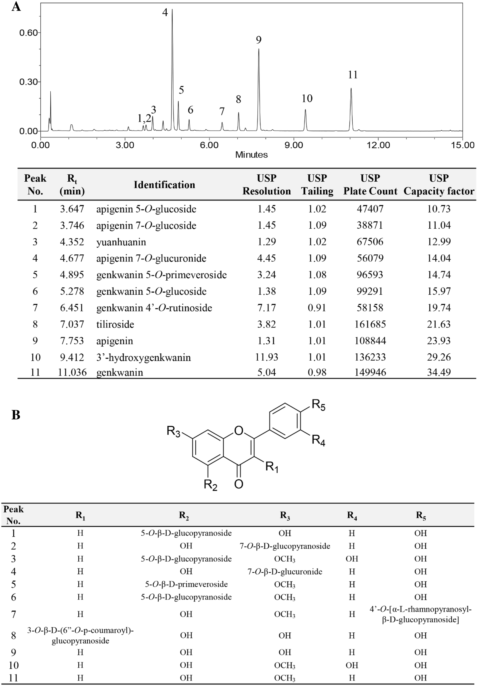
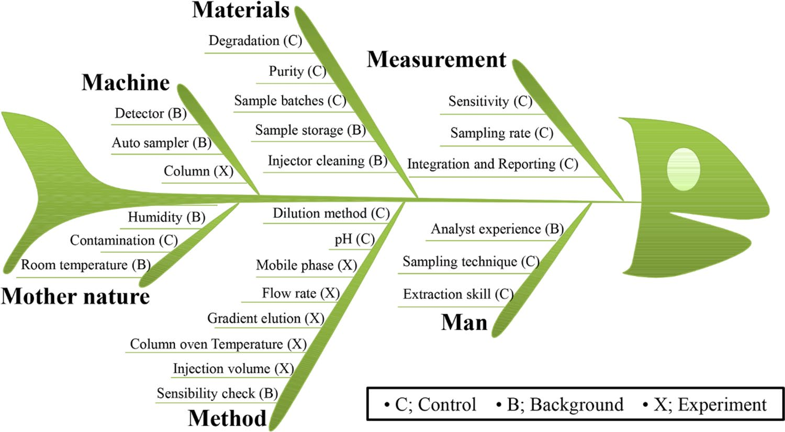
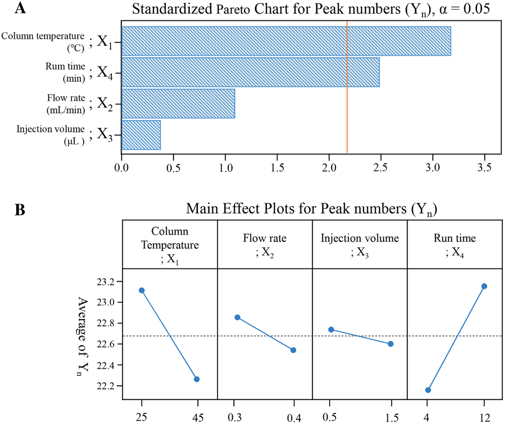
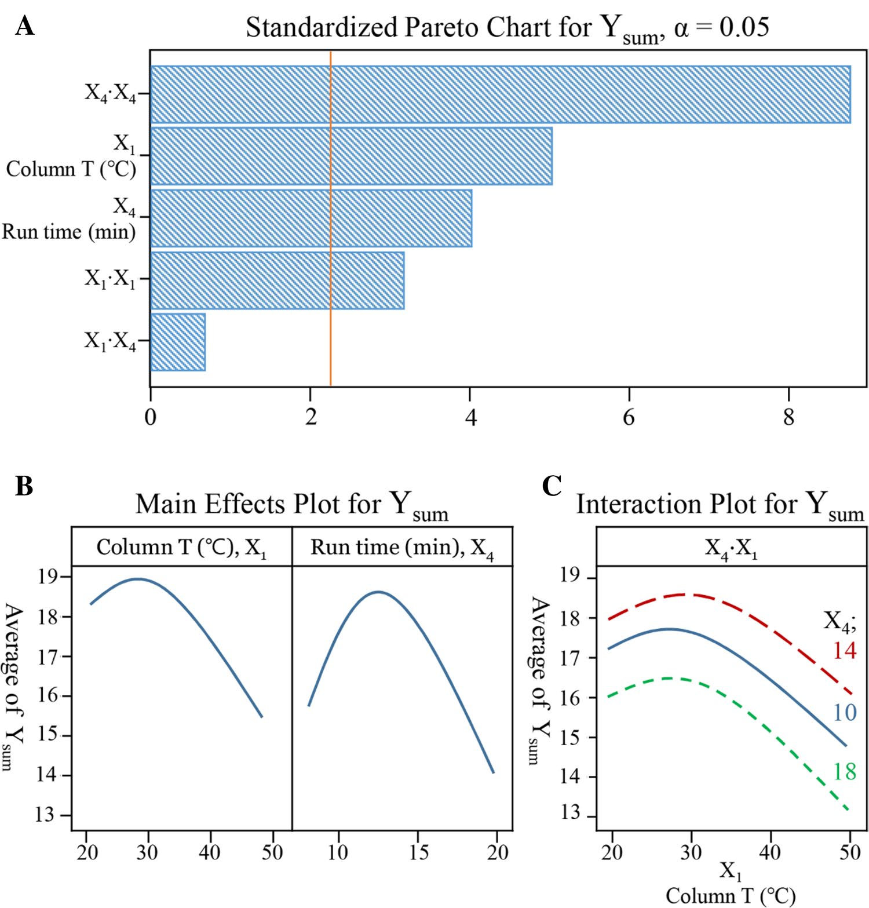
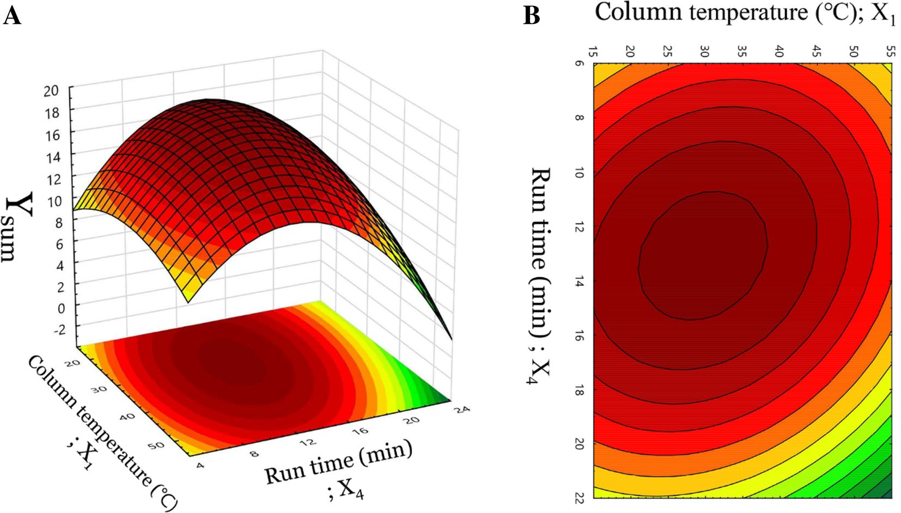
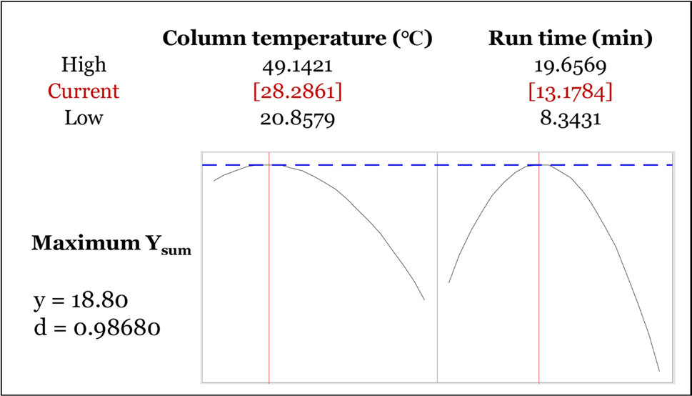

<!-- 方針: ほぼ全訳＋必要に応じた補足。原文構成に沿って訳出。「> 補足:」は訳者注。数式はKaTeXで表示。 -->

## 書誌情報

- 原題: Analytical quality by design methodology for botanical raw material analysis: a case study of flavonoids in Genkwa Flos
- 著者: Min Kyoung Kim, Sang Cheol Park, Geonha Park, Eunjung Choi, Yura Ji, Young Pyo Jang（責任著者）（慶熙大学校ほか, 韓国）
- 掲載: *Scientific Reports* 2021, 11:11936. https://doi.org/10.1038/s41598-021-91341-w（オープンアクセス）
- インパクトファクター: **3.8**（*Scientific Reports*, JCR 2024 / Clarivate）

> 補足: 芫花（Genkwa Flos, Daphne genkwa の花蕾）は瀉下・利水などに用いる生薬。本稿は**AQbD（Analytical Quality by Design、分析的QbD）**——分析法を「作り込み」で開発するICH Q8/Q14系の考え方——を生薬のLC分析法開発に適用した実例で、当サイトの他論文（指紋・定量）の「分析法をどう頑健に設計するか」という上流の方法論にあたる。

## 抄録 (Abstract)
本研究は、植物起源の固有の複雑な成分のために生薬製剤において課題となる、適格な液体クロマトグラフィー分析法の開発に向けた、分析的クオリティ・バイ・デザイン（AQbD）手法を用いた体系的なアプローチを紹介する。芫花（Genkwa Flos）中の11種類のフラボノイドに対する超高速液体クロマトグラフィー-フォトダイオードアレイ-質量分析（UHPLC-PDA-MS）技術を、リスクアセスメントスタディから因子スクリーニング試験、そして最終的に中心複合計画（CCD）を用いた分析法最適化に至る分析プロセス全体を通じて利用した。このアプローチにおいて、カラム温度と移動相溶媒勾配（solvent slope）が重要方法パラメータ（CMP）であることが明らかになり、11種類のフラボノイドピークの各分離度（resolution）値が、データマイニング変換式を介して重要方法特性（CMA）として使用された。デザインスペース（design space）における最適なクロマトグラフィー条件は、数理的および応答曲面法（RSM）によって算出された。確立されたクロマトグラフィー条件は以下の通りである：C18（50 × 2.1 mm, 1.7 µm）カラムを用い、アセトニトリルと0.1%ギ酸水溶液のグラジエント溶出（0–13分: 10–45%; 13–13.5分: 45–100%; 13.5–14分: 100–10%; 14–15分: 10% アセトニトリル）、カラム温度28℃、検出波長335 nm、流速0.35 mL/min。apigenin 7-O-glucuronide、apigenin、およびgenkwaninに対するバリデーションスタディも成功裏に実施された。いくつかの重要なバリデーション結果は以下の通りであった：相関係数0.999以上の直線性、検出限界 2.87–22.41 µg/mL、定量限界 8.70–67.92 µg/mL、精度の相対標準偏差（RSD）0.22%未満、およびapigenin、genkwanin、およびapigenin 7-O-glucuronideに対する回収率（正確さ）100.13%〜102.49%。結論として、本デザインベースのアプローチは、複雑な天然物ベースの生薬から医薬品として適格な分析データを得ることを効果的に保証するために適用できる体系的なプラットフォームを提供する。

## イントロダクション (Introduction)
植物抽出物のような複雑な医薬品成分に対する高度な分析システムへの関心は、天然抽出物を用いた医薬品開発が世界的に増加しているという現実の中で高まっている。2016年に改訂された米国食品医薬品局（USFDA）の生薬（Botanical Drug）ガイドラインでは、生薬原材料の複雑さを特性評価し、原薬の品質の恒常性を確保するために、フィンガープリント分析、化学的同定、および活性成分または化学成分の定量を総合的に活用する「Totality-of-the-Evidence（証拠の総和）」アプローチを推奨している [1, 2]。

品質管理の分析法を高い基準で達成するために、様々な製剤実務の分析法開発においてクオリティ・バイ・デザイン（QbD）アプローチが採用されてきた [3–6]。QbDは、多様な製剤プロセスにおける健全な科学と品質リスクマネジメントに基づき、新たな医薬品を理解し管理するための規律あるアプローチである [7, 8]。分析法は、製品ライフサイクルを通じた恒常的な品質システムのモニタリングという管理スキームにおいて、医薬品開発で重要な役割を果たしている [9]。日米EU医薬品規制調和国際会議（ICH）は、分析法の開発に関する新しいICH品質ガイドライン（ICH Q14）の策定を進めており、これには分析的クオリティ・バイ・デザイン（AQbD）と呼ばれる、分析法へのQbDコンセプトの導入が含まれる予定である [10]。AQbDアプローチは、分析法開発プロセスの将来的な目標であり、意図する目標基準に基づく性能要素を関連付ける「分析ターゲットプロファイル（ATP）」の決定から始まる [11]。また、意図する目標基準（求められる分析品質における選択性、精度、または正確さなど）と直接的に強く結びつく、重要方法特性（CMA）の選択も行われる。第二に、分析結果に影響を与える可能性のあるパラメータが、リスクアセスメントアプローチを通じて特定される [10]。これらの高度に選択されたリスク因子は重要方法パラメータ（CMP）として知られており、実験計画法（DoE）の手法と統計的スクリーニングを用いてテストされるべきである。第三に、代表的な出力変数に影響を与える入力変数を統計的に設計して特定し、詳細な因果関係を理解するために、CMAとCMPの間の多項式関係が研究される [12]。一方で、DoEは通常、因子のスクリーニングと、その後の分析法最適化のための応答曲面法の2回にわたって実施される。スクリーニング研究の目的は、より少ない実験で高リスク因子を見出すことであり、通常は2レベルで設計されたモデル（フル階乗計画（FFD）、部分階乗計画（FrFD）、プラケット・バーマン計画（PBD）など）で実行される [8, 12]。さらに、設計時に選択された高リスク因子を考慮することにより、分析法において適切な品質が確実に得られるように最適化プロセスが実施される。結果は、設計された応答を解釈するための数理モデリングの強力な統計手法である応答曲面法（RSM）によって解釈される。最適化のための戦略的に設計された応答には、ボックス・ベンケン計画（BBD）、中心複合計画（CCD）、田口計画（TD）、混合計画（Mixture design）、およびデラート計画（Doehlert design）がある [8, 12]。最後に、RSMから最も適切な設計点または分析法操作許容領域（MODR：method operable design region）が算出され、分析法バリデーションプロセスによって確認される [13]。

AQbDアプローチに基づく品質管理システムは医薬品の分野で広く適用されているが、生薬抽出物への適用研究はほとんど行われていない [14–16]。生薬抽出物は活性成分として複雑かつ多様な植物化学物質を含んでいるため、最適な分析条件の選択は単純ではない。また、DoE技術によって最適化しなければならない分析パラメータ（すなわち、緩衝液のpH、有機溶媒の種類、グラジエント勾配、カラム温度など）をスクリーニングすることは極めて困難である。

本論文では、生薬原材料との統合的なケーススタディにおいて、CMAをどのように考慮し、CMPをどのように特定するかについての分析プラットフォームを提案するために、芫花の主要成分に対する液体クロマトグラフィー分析法を最適化するための体系的なデザインベースのアプローチを調査した。1つの変数を試して1つの応答を収集する通常の「One-Factor-At-a-Time（OFAT）」アプローチと比較して、本トータル品質アプローチは、科学的設計モデルと統計的専門知識を活用し、最終的により少ない実験時間で、ロバストかつ精密で、バリデーションが容易な分析法を得るものである [9]。

ジンチョウゲ科のDaphne genkwaの蕾（芫花 Genkwa Flos）は、東アジア、中国、韓国において伝統的な東洋医学として広く使用されており、その多様な薬理効果から引き続き大きな注目を集めている [17–19]。D. genkwaに関するこれまでの植物化学的研究により、ジテルペノイド、フラボノイド、リグナン、およびクマリンを含む多様な化学成分が明らかになっている [20–22]。近年、芫花の主要な活性成分である芫花フラボノイドは、抗炎症作用 [23]、免疫調節作用 [24]、大腸がんにおける抗腫瘍活性 [25]、および抗関節リウマチ活性 [26] などの顕著な薬理活性を示すことが報告されている。生薬の主要原料として芫花を活用するためには、製剤製品 of 薬理効果の一貫性を保証するために、生薬抽出物中の複数の成分を同定および定量できる、頑健（ロバスト）で信頼性の高い品質管理用分析法を開発する必要がある。

CMPは、リスクアセスメントとそれに続く因子スクリーニングの実験データによって順次決定された。CMAは、複数のピークの分離度を収集して単一の数値として表現できる式によって確立された。中心複合計画（CCD）により最適化された分析法を開発した後、分析法の妥当性を評価するために分析法バリデーションを実施した。

## 結果と考察 (Results and discussion)
### UHPLC-PDA-MS分析を用いたフラボノイドのキャラクタリゼーション (Characterization of flavonoids using UHPLC‑PDA‑MS analysis.)
芫花中のフラボノイドの同定には、UHPLC-PDA-MSシステムを利用した。飛行時間型（TOF）質量分析計からの高分解能質量データとUV-Vis吸収スペクトルパターンを組み合わせることで、これまでの研究 [22, 23] および/または参照標準溶液との直接比較により、芫花抽出物から既知のフラボノイドを同定することが可能となった。同定された計11種類のフラボノイドを表1に示し、それぞれの保持時間、$\lambda_{\max}$、疑似分子イオン、観測質量、質量誤差、および分子式を記載した。これらは、335 nmで得られたUHPLCクロマトグラム（図1A）においてピーク1からピーク11としてタグ付けされており、溶出順に以下の通りである：apigenin 5-O-glucoside、apigenin 7-O-glucoside、yuanhuanin、apigenin 7-O-glucuronide、genkwanin 5-O-primeveroside、genkwanin 5-O-glucoside、genkwanin 4′-O-rutinoside、tiliroside、apigenin、3′-hydroxygenkwanin、およびgenkwanin。

#### 表1. UHPLC-PDA-ESI/MS分析による11個のピークの保持時間、$\lambda_{\max}$、疑似分子イオン、観測質量、質量誤差、および分子式
> 補足: *Ref. std.: UHPLC分析による参照標準溶液との比較。ピーク番号および保持時間の情報は、図1の代表的なクロマトグラムにタグ付けされている。

| ピーク番号 (Peak no.) | 保持時間 $R_t$ (min) | $\lambda_{\max}$ (nm) | 疑似分子イオン (Quasi-molecular ion) | 観測質量 Observed mass (m/z) | 質量誤差 Mass diff. (mmu) | 分子式 (Molecular formula) | 同定成分 (Identification) | 参考文献 (References) |
| :---: | :---: | :---: | :---: | :---: | :---: | :---: | :--- | :--- |
| 1 | 3.647 | 260.6, 335.3 | [M+H]+ | 433.1143 | 0.9 | C21H20O10 | Apigenin 5-O-glucoside | Du et al.[23] |
| 2 | 3.746 | 255.1, 348.4 | [M+H]+ | 433.1141 | 0.7 | C21H20O10 | Apigenin 7-O-glucoside | Du et al.[23] |
| 3 | 4.352 | 241.0, 340.9 | [M+H]+ | 463.1239 | 0.1 | C22H22O11 | Yuanhuanin | Wang et al.[22] |
| 4 | 4.677 | 266.2, 337.7 | [M+H]+ | 447.0926 | 0.1 | C21H18O11 | Apigenin 7-O-glucuronide | *Ref. std. |
| 5 | 4.895 | 261.3, 332.8 | [M+H]+ | 579.1755 | 4.1 | C27H30O14 | Genkwanin 5-O-primeveroside | Wang et al.[22] |
| 6 | 5.278 | 261.3, 332.2 | [M+H]+ | 447.1275 | -1.6 | C22H22O10 | Genkwanin 5-O-glucoside | Du et al.[23] |
| 7 | 6.451 | 253.3, 348.4 | [M+H]+ | 593.1877 | 0.7 | C28H32O14 | Genkwanin 4′-O-rutinoside | Wang et al.[22] |
| 8 | 7.037 | 266.2, 314.8 | [M+H]+ | 595.1426 | -2.5 | C30H26O13 | Tiliroside | Du et al.[23] |
| 9 | 7.753 | 266.8, 338.4 | [M+H]+ | 271.0620 | 1.4 | C15H10O5 | Apigenin | *Ref. std. |
| 10 | 9.412 | 253.3, 348.4 | [M+H]+ | 301.0715 | 0.3 | C16H12O6 | 3′-Hydroxygenkwanin | Du et al.[23] |
| 11 | 11.036 | 267.4, 337.7 | [M+H]+ | 285.0752 | -1.1 | C16H12O5 | Genkwanin | *Ref. std. |

### 分析ターゲットプロファイル（ATP）および重要方法特性（CMA） (Analytical target profile (ATP) and critical method attributes (CMAs).)
AQbDに基づく方法開発の第一歩は、段階的かつ科学的な手順のためにATPを定義することである [7]。芫花中の指定された11種類のフラボノイドを定量的に決定できる分析手順が、本研究の目標である。分析技術や装置要件などのATPの様々な要素は、意図する目標基準としてまとめられた（原文の補足資料 Table S1 参照）。ATPの設定後、予備検討および文献のレビューに基づいて潜在的なCMAが検討された [8, 9]。一般的な主要CMAは重要ピークの分離度（$Rs$）であり [4, 15, 27]、これは液体クロマトグラフィーにおいて選択的な同定のためのピーク重複を避けるための重要な特性となり得る。最終的に、ATPに対応するCMAは、実験研究のモデリングに基づく実質的な検討を経て、カウント可能なピーク数（$Y_n$）および分離度（$Y_{1–11}$ および $Y_{\text{sum}}$）として確立された。

### 予備検討 (Preliminary studies.)
デザインベースの分析法開発研究を実施するために、異なるカラム（長さ、粒子径、メーカー）、様々な溶媒（アセトニトリル、メタノール）、および酸性化された水（酸無添加、0.1%酢酸、0.1%ギ酸）を用いて、いくつかの予備テストを実施した。また、最も高い特異的検出を得るために、分析物の検出波長をテストした。これらの試みの目的は、これら3つのパラメータを固定して変数を減らしつつ、最小限の測定時間で最高のピーク対称性を保証することである。得られた結果は（原文の補足資料 Table S2 参照）に整理されており、最終的な決定として、それぞれ C18（50 × 2.1 mm, 1.7 µm）カラム、アセトニトリルおよび0.1%ギ酸水溶液の溶媒系、および335 nmの検出波長が選択された。

### リスクアセスメント検討 (Risk assessment studies.)
品質リスクマネジメント（QRM）により、プロセス全体を制御し、分析法の最終的な品質に影響を与える高リスクパラメータを認識することができる [28]。図2に示す石川のフィッシュボーン因果関係図（シックスシグマ）を含むリスクアセスメント研究を通じて、QRMの確立に努めた。因果関係図から、液体クロマトグラフィーの実行における潜在的な因子を特定することができ、その後のステップとして、高リスク因子を分類するために、潜在因子のそれぞれにおける発生した故障の影響をリスク優先度数（RPN）で算出した [29]。ICH Q11のガイドライン [30] に従い、各故障モードのリスクを割り当てるために、式「重大度（Severity） × 発生頻度（Probability） × 検出性（Detectability）」を用いてRPN値を算出した。リスクアセスメントと管理戦略は表2にまとめられている。カラム温度（$X_1$）、流速（$X_2$）、注入量（$X_3$）、およびグラジエント勾配のパラメータは、10を超える高いRPNが算出され、影響の大きい因子であることを示している。実務上、モデルを設計する際、アセトニトリル溶媒の初期および最終パーセンテージは10%から45%に固定されていたため、グラジエント勾配は分析時間（$X_4$）に変換された（表3）。したがって、これら4つのパラメータがその後の因子スクリーニング研究のために選択された。RPNが10未満と算出されたパラメータは、定数として制御された。

#### 表2. 芫花に対するAQbD支援型UHPLC-PDA開発分析法のリスクアセスメントおよび管理戦略
> 補足: S/N: シグナル/ノイズ比、DoE: 実験計画法、P: 発生頻度、S: 重大度、D: 検出性。リスク優先度数 (RPN) = 重大度 × 発生頻度 × 検出性。*10以上のRPNによって選択された高リスク因子。

| 潜在的な故障原因 | 故障の影響 | リスク軽減策 | P | S | D | RPN |
| :--- | :--- | :--- | :---: | :---: | :---: | :---: |
| 注入量 (Injection volume)* | ピーク分離度およびS/Nの変動 | DoEによる最適化および制御 | 3 | 2 | 3 | 18 |
| サンプルの安定性 (Sample stability) | ピーク分離度およびS/Nの変動 | 調製したサンプル溶液の安定性を確認 | 1 | 1 | 2 | 2 |
| 移動相 (Mobile phase) | ピーク対称性およびクロマトグラフィーの変動 | 少なくとも4つの移動相をテスト | 2 | 2 | 2 | 8 |
| カラム (Columns) | ロット変動による変化の可能性 | 少なくとも3つのカラムをテスト | 2 | 2 | 2 | 8 |
| バイアル (Vials) | 光曝露による不純物の増加 | 茶色バイアルを使用 | 1 | 2 | 1 | 2 |
| 湿度 (Humidity) | 秤量値の変動 | サンプル乾燥のための標準操作手順に従う | 1 | 2 | 2 | 4 |
| カラム温度 (Column temperature)* | ピーク分離度、溶出時間、およびS/Nの変動 | DoEによる最適化および制御 | 3 | 2 | 2 | 12 |
| サンプル温度 (Sample temperature) | ピーク分離度が変動する可能性 | オートサンプラー温度を20℃に制御 | 2 | 1 | 2 | 4 |
| ピークの誤同定 (Misidentification of peaks) | 誤った数値の報告 | トレーニング、クロマトグラム例の提示 | 3 | 2 | 1 | 6 |
| グラジエント勾配 (Gradient slope)* | クロマトグラフィー全体の変動 | DoEによる最適化および制御 | 4 | 2 | 3 | 24 |
| 流速 (Flow rate)* | ピーク分離度および溶出時間の変動 | DoEによる最適化および制御 | 2 | 2 | 3 | 12 |
| 装置モデル (Instrument model) | クロマトグラフィー全体の変動 | UHPLCシステムを選択 | 2 | 2 | 2 | 8 |

### 因子スクリーニング検討 (Factor screening studies.)
選択されたCMAであるピーク数（$Y_n$）に影響を与える可能性のある高リスクのリストから、相対的に重要度の高い少数のパラメータを見出すために、4因子2レベルの $(4^2)$ フル階乗計画（FFD）を実施した。$Y_n$ は一般にクロマトグラフィー分離の総合的な品質を反映するため、2レベル（LowおよびHigh）のみで大まかに実行されるFFDの応答として選択された。リスクアセスメント研究中に選択された高リスク因子は、カラム温度（$X_1$）、流速（$X_2$）、注入量（$X_3$）、および分析時間（$X_4$）として特定された。主効果は、式(1)に従って描出された一次多項式モデルを選択することによって推定された。

$$Y_n = 14.58 - 0.0438 X_1 - 3.75 X_2 - 0.125 X_3 + 0.1406 X_4$$  --- (1)

この式において、$Y_n$ は検討されたCMAであり、表3に示すように、ランダムに構築された19回の各実験ランで調べられたカウント可能なフラボノイドピークの数である。パレート図および主効果プロット（図3）は、カラム温度（$X_1$）および分析時間（$X_4$）が検討されたCMAに対して有意な影響を与えることを示している。これらのパラメータ周波数は、対応する$\alpha$値の基準線を超えていることが判明したためである。図3Bに観察されるように、カウント可能なピーク数（$Y_n$）はカラム温度（$X_1$）に対して負の相関を示したが、分析時間（$X_4$）に対して正の効果を示した。統計結果（表4）によると、適合されたモデルは、p値が0.05未満で、適合度欠如（Lack-of-fit）が0.05より大きく、実験データに非常によく適合していた。したがって、カラム温度（$X_1$）および分析時間（$X_4$）などの因子がさらなる最適化研究のためのCMPとして選択され、その他の影響の小さい因子は一定値に維持された。流速（$X_2$）は0.35 mL/minに調整され、注入量（$X_3$）は1.0 µLに固定された。

#### 表3. 因子スクリーニングのための $4^2$ フル階乗計画（FFD）マトリクスおよび調査された応答
> 補足: $Y_n$: ピーク数。

| ラン (Runs) | カラム温度 $X_1$ (℃) | 流速 $X_2$ (mL/min) | 注入量 $X_3$ (µL) | 分析時間 $X_4$ (min) | ピーク数 $Y_n$ |
| :---: | :---: | :---: | :---: | :---: | :---: |
| 1 | 45 | 0.3 | 1.5 | 12 | 23 |
| 2 | 25 | 0.3 | 0.5 | 12 | 24 |
| 3 | 35 | 0.35 | 1.0 | 8 | 23 |
| 4 | 25 | 0.4 | 0.5 | 4 | 23 |
| 5 | 45 | 0.3 | 1.5 | 4 | 21 |
| 6 | 25 | 0.4 | 0.5 | 12 | 23 |
| 7 | 35 | 0.35 | 1.0 | 8 | 23 |
| 8 | 45 | 0.3 | 0.5 | 4 | 21 |
| 9 | 25 | 0.3 | 0.5 | 4 | 23 |
| 10 | 25 | 0.4 | 1.5 | 12 | 22 |
| 11 | 25 | 0.4 | 1.5 | 4 | 23 |
| 12 | 45 | 0.4 | 1.5 | 4 | 22 |
| 13 | 25 | 0.3 | 1.5 | 4 | 23 |
| 14 | 25 | 0.3 | 1.5 | 12 | 24 |
| 15 | 35 | 0.35 | 1.0 | 8 | 23 |
| 16 | 45 | 0.4 | 0.5 | 4 | 21 |
| 17 | 45 | 0.4 | 0.5 | 12 | 23 |
| 18 | 45 | 0.3 | 0.5 | 12 | 24 |
| 19 | 45 | 0.4 | 1.5 | 12 | 23 |

**調査された因子の水準 (Levels of the factors studied)**
| 因子 (Factors) | コード (Code) | 低水準 Low (-1) | 中心水準 Central (0) | 高水準 High (+1) |
| :--- | :---: | :---: | :---: | :---: |
| カラム温度 Column temperature (℃) | $X_1$ | 25 | 35 | 45 |
| 流速 Flow rate (mL/min) | $X_2$ | 0.30 | 0.35 | 0.40 |
| 注入量 Injection volume (μL) | $X_3$ | 0.5 | 1.0 | 1.5 |
| 分析時間 Run time (min) | $X_4$ | 4 | 8 | 12 |

**$X_4$ に対するグラジエントシステム (Gradient system for $X_4$)**
| 時間 Time (min) | アセトニトリル % Acetonitrile | 水（0.1%ギ酸） % Water (0.1% formic acid) |
| :---: | :---: | :---: |
| 0 | 10 | 90 |
| $X_4$ | 45 | 55 |
| $X_4$ + 0.5 | 100 | 0 |
| $X_4$ + 1.0 | 10 | 90 |
| $X_4$ + 2.0 | 10 | 90 |

#### 表4. FFD因子スクリーニングから得られた応答 $Y_n$ (ピーク数) および CCD応答曲面実験計画スペースから得られた応答 $Y_{\text{sum}}$ (11種類の分離度の総和) に対する分散分析（ANOVA）結果
> 補足: *有意（Significant）。

| 変動要因 (Source of variations) | 自由度 (Degree of freedom) | 平方和 (Sum of squares) | 平均平方 (Mean squares) | F値 (F-value) | P値 (P-value) |
| :--- | :---: | :---: | :---: | :---: | :---: |
| **FFDから得られた応答 $Y_n$ に対するANOVA結果** | | | | | |
| 二次モデル (Quadratic model)* | 4 | 8.7500 | 2.1875 | 4.42 | 0.016 |
| 　カラム温度 Column temperature; ℃ ($X_1$)* | 1 | 3.0625 | 3.0625 | 6.18 | 0.026 |
| 　流速 Flow rate; mL/min ($X_2$) | 1 | 0.5625 | 0.5625 | 1.14 | 0.305 |
| 　注入量 Injection volume; μL ($X_3$) | 1 | 0.0625 | 0.0625 | 0.13 | 0.728 |
| 　分析時間 Run time; min ($X_4$)* | 1 | 5.0625 | 5.0625 | 10.22 | 0.006 |
| 適合度欠如 (Lack of fit) | 11 | 6.6875 | 0.6080 | | |
| 総修正和 (Total Adjusted) | 18 | 15.6842 | | | |
| **CCDから得られた応答 $Y_{\text{sum}}$ に対するANOVA結果** | | | | | |
| 二次モデル (Quadratic model)* | 6 | 34.5115 | 5.7519 | 22.61 | 0.001 |
| 　カラム温度 Column temperature; ℃ ($X_1$)* | 1 | 6.4929 | 6.4929 | 25.52 | 0.001 |
| 　分析時間 Run time; min ($X_4$)* | 1 | 4.4237 | 4.4237 | 17.39 | 0.004 |
| 　$X_1 \cdot X_1$* | 1 | 3.0154 | 3.0154 | 11.85 | 0.011 |
| 　$X_4 \cdot X_4$* | 1 | 20.3112 | 20.3112 | 79.83 | 0.001 |
| 　$X_1 \cdot X_4$ | 1 | 0.0606 | 0.0606 | 0.24 | 0.640 |
| 適合度欠如 (Lack of fit) | 3 | 1.4415 | 0.4805 | 5.66 | 0.064 |
| 純誤差 (Pure error) | 4 | 0.3395 | 0.0849 | | |
| 総修正和 (Total adjusted) | 13 | 36.2926 | | | |

### 応答曲面解析 (Response surface analysis.)
その後のクロマトグラフィー条件の最適化は、二次二次多項式モデル（二次多項式モデル）を選択することによって実行され、$\alpha = 1.41421$ のレベルで設計された中心複合計画（CCD）モデルが14回の実験ラン（表5）で実施された。分析されたCMPはカラム温度（$X_1$）と分析時間（$X_4$）であり、5つの異なる等距離レベル、すなわち、低軸点（$-1.41421$）、低因子点（$-1$）、中心点（$0$）、高因子点（$+1$）、および高軸点（$+1.41421$）で検討された。一方、潜在的なCMAは、表1に記載された同定された11種類のフラボノイドピークのそれぞれの分離度（$Rs$）である $Y_{1–11}$ として新たに選択された。生薬抽出物には多数の植物化学物質が含まれているため、11種類の各ピークの分離度は、最も近くに溶出するピークとの間で定義された。詳細には、図1Aに示すピーク8に対する $Y_8$ を計算する場合、最も近いピークは7.326分に溶出するピークの直後にあるものである。さらに、いくつかの実験ラン（表5）において、最初のピークの分離度（$Y_1$）と2番目のピークの分離度（$Y_2$）は等しい値であった。これは、これらのピークがUHPLCシステムによって完全に分離または完全に解像されておらず、最も近くに溶出する潜在的な妨害ピークが互いに隣接していたためである。さらに、いくつかの実験ラン（表5）において、$Y_1$ および $Y_2$ は $Rs = 0$ であり、これら2つのピークが完全に重複しているか共溶出していることを示していた。50%の高さでのピークに対する接線によって描かれるベースラインのピーク幅を使用するUSP分離度の式は、完全に分割されたピークに対して適用されたが、半値幅に定数を乗じたピーク幅を使用するUSP分離度（HH）は、重複するピークの計算に利用された [31]。

各実験ランから得られたクロマトグラフィーフィンガープリインにおける分離の総合的な品質を効果的に評価するために、各ピークの $Y_i$（分離度）値の総和として1つの仮想的なスコアが導入された。デザインスペースにおいて、$Y_1$ から $Y_{11}$ のピークは、式(3)によって $Y_{\text{sum}}$ という1つの値に統合された。これは、選択された2つのCMPとの実験的相関に対する推定応答を表している。また、少数のピークの値が全体的な結果を支配するのを防ぐために、各変数の最大値を決定する必要があった。1.5を超える分離度は通常、優れた分離を示し、2より大きい場合、ピークは完全に分離されていると見なされる [32]。したがって、統合する前に、式(2)に示すように、2を超える分離度値は2に設定された。

$$Yi(i, Rs) = \begin{cases} Rs & (Rs < 2) \\ 2 & (Rs \ge 2) \end{cases}$$ --- (2)

ここで、$Y_i$ は式(2)によって正規化された後の $i$ 番目のピークの分離度を表し、式(3)に従う最小から最大の応答はそれぞれ0から22である。

$$Y_{\text{sum}} = \sum_{i=1}^{11} Y_i$$ --- (3)

選択されたCMAに対してランダムに実験された14回のランは、検討されたCMPのレベルおよび設計された実験スケジュールとともに表5にまとめられている。CCDの結果を明確にするために、Minitabソフトウェア（ver. 18）を利用して、ANOVA解析および統計的最適化を導き出した。式(4)は、実験データを、一次の主効果と二次の相互作用および二乗項の両方を網羅する数理モデル（二次多項式モデルを反映）に代入することによって得られた。

$$Y_{\text{sum}} = -5.480 + 0.400 X_1 + 2.824 X_4 - 0.0064 X_1^2 - 0.0031 X_1 X_4 - 0.1037 X_4^2$$ --- (4)
> 補足: 原文の式は $-0.0064 X_1 X_1 - 0.0031 X_1 X_4 - 0.1037 X_4 X_4$ と表現されており、これは $X_1^2$ や $X_4^2$ と同義です。

モデルを統計的に検証するためにANOVA解析が実施され、統計的に極めて有意なモデル（$p < 0.05$）と、妥当な決定係数 $R^2$（決定係数 95.09%、調整済み決定係数 90.89%）が示された。結果は表4に示されており、一次項（$X_1, X_4$）および二次項（$X_1 \cdot X_1, X_4 \cdot X_4$）における2つのCMPが有意であったのに対し、相互作用の相関（$X_1 \cdot X_4$）は有意ではなかったことが明らかである。これらの統計結果は、図4に示すパレート図、主効果プロット、および相互作用プロットを観察することによっても確認される。

#### 表5. 応答曲面のための中心複合計画（CCD）マトリクスおよび調査された応答
> 補足: $Y_{\text{sum}}$ は11種類の分離度の総和を表す。各分離度（$Rs$）値：$Y_1$ から $Y_{11}$。

| ラン (Runs) | カラム温度 $X_1$ (℃) | 分析時間 $X_4$ (min) | 分離度総和 $Y_{\text{sum}}$ | $Y_1$ | $Y_2$ | $Y_3$ | $Y_4$ | $Y_5$ | $Y_6$ | $Y_7$ | $Y_8$ | $Y_9$ | $Y_{10}$ | $Y_{11}$ |
| :---: | :---: | :---: | :---: | :---: | :---: | :---: | :---: | :---: | :---: | :---: | :---: | :---: | :---: | :---: |
| 1 | 20.86 | 14.00 | 18.79 | 1.59 | 1.59 | 1.15 | 1.19 | 2.00 | 2.00 | 1.29 | 2.00 | 2.00 | 2.00 | 1.98 |
| 2 | 35.00 | 14.00 | 18.18 | 0.85 | 0.85 | 2.00 | 0.85 | 2.00 | 2.00 | 2.00 | 2.00 | 1.64 | 2.00 | 2.00 |
| 3 | 35.00 | 14.00 | 18.38 | 0.95 | 0.95 | 2.00 | 0.84 | 2.00 | 2.00 | 2.00 | 2.00 | 1.66 | 2.00 | 2.00 |
| 4 | 35.00 | 14.00 | 18.87 | 0.99 | 0.99 | 2.00 | 1.04 | 2.00 | 2.00 | 2.00 | 2.00 | 1.83 | 2.00 | 2.00 |
| 5 | 49.14 | 14.00 | 16.49 | 0.00 | 0.00 | 2.00 | 2.00 | 1.80 | 2.00 | 2.00 | 1.98 | 0.71 | 2.00 | 2.00 |
| 6 | 35.00 | 19.66 | 14.14 | 0.00 | 0.00 | 1.06 | 0.62 | 2.00 | 1.31 | 2.00 | 2.00 | 1.15 | 2.00 | 2.00 |
| 7 | 35.00 | 8.34 | 17.94 | 1.45 | 1.45 | 1.06 | 1.54 | 2.00 | 1.79 | 1.84 | 1.29 | 1.50 | 2.00 | 2.00 |
| 8 | 35.00 | 14.00 | 18.55 | 0.88 | 0.88 | 2.00 | 0.95 | 2.00 | 2.00 | 2.00 | 2.00 | 1.84 | 2.00 | 2.00 |
| 9 | 45.00 | 18.00 | 14.06 | 0.00 | 0.00 | 2.00 | 0.93 | 0.93 | 2.00 | 2.00 | 1.11 | 1.09 | 2.00 | 2.00 |
| 10 | 45.00 | 10.00 | 15.21 | 0.41 | 0.41 | 2.00 | 0.00 | 1.76 | 2.00 | 2.00 | 1.57 | 1.06 | 2.00 | 2.00 |
| 11 | 35.00 | 14.00 | 18.36 | 0.94 | 0.94 | 2.00 | 0.84 | 2.00 | 2.00 | 2.00 | 2.00 | 1.64 | 2.00 | 2.00 |
| 12 | 25.00 | 10.00 | 16.95 | 0.00 | 0.00 | 2.00 | 2.00 | 1.58 | 1.65 | 2.00 | 2.00 | 1.87 | 2.00 | 1.85 |
| 13 | 35.00 | 14.00 | 18.38 | 0.95 | 0.95 | 2.00 | 0.84 | 2.00 | 2.00 | 2.00 | 2.00 | 1.64 | 2.00 | 2.00 |
| 14 | 25.00 | 18.00 | 16.28 | 1.08 | 1.08 | 1.29 | 1.14 | 1.07 | 2.00 | 2.00 | 1.00 | 1.62 | 2.00 | 2.00 |

**調査された因子の水準 (Levels of the factors studied)**
| 因子 (Factors) | コード (Code) | 低軸点 Low axial (-α, -1.41421) | 低因子点 Low factorial (-1) | 中心点 Central (0) | 高因子点 High factorial (+1) | 高軸点 High axial (+α, +1.41421) |
| :--- | :---: | :---: | :---: | :---: | :---: | :---: |
| カラム温度 Column temperature (℃) | $X_1$ | 20.86 | 25 | 35 | 45 | 49.14 |
| 分析時間 Run time (min) | $X_4$ | 8.34 | 10 | 14 | 18 | 19.66 |

### 最適なクロマトグラフィー条件の選択 (Selection of optimum chromatographic solution.)
最適化されたクロマトグラフィー条件を得るために、特定のCMAである $Y_{\text{sum}}$ について、Statisticaソフトウェア（ver. 13.3.0）を使用して応答曲面解析によりCCDデザインスペースをさらに研究した。3D応答曲面（図5A）および2D等高線プロット（図5B）は、因子と応答における個別の、そしてもっともらしい相互作用を明らかにした。カラム温度（$X_1$）と分析時間（$X_4$）はどちらも同様に湾曲したプロットを示し、中心レベル（0）の付近で徐々に増加および減少している。具体的には、カラム温度（$X_1$）の中心レベルは35℃、分析時間（$X_4$）は14分であった。式(4)から観察されるように、これらのパターンは放物線曲線であると推測され、これは数理計算作業によって最大値を持つ応答を算出できることを意味している。最終的に、最大応答 $Y_{\text{sum}} = 18.80$ を示す最適なUHPLC-PDA性能条件は、図6の図に示すように、数理的にカラム温度 28.2861 ℃ および分析時間 13.1784 分に調整された。モデルの適合性を評価するために検証ステップが研究され、再現性の結果は、非常に許容可能な %RSD および %RE（相対誤差）とともに、$Y_{\text{sum}}$ の予測値に近い値を示した（表6）。

#### 表6. 最適条件における予測応答および実験応答
> 補足: $Y_{\text{sum}}$ は11種類の分離度の総和を表す。SD: 標準偏差、RSD: 相対標準偏差、RE: 相対誤差。

| 注入回数 (Injection number) | 予測値 Predicted $Y_{\text{sum}}$ | 実験値 Experimental $Y_{\text{sum}}$ |
| :---: | :---: | :---: |
| 1 | 18.80 | 18.87 |
| 2 | | 18.88 |
| 3 | | 18.77 |
| 4 | | 18.82 |
| 5 | | 18.80 |
| 6 | | 18.86 |
| 平均値 (Mean) | | 18.83 |
| 標準偏差 (SD) | | 0.44 |
| 相対標準偏差 (%RSD) | | 0.23 |
| 相対誤差 (%RE) | | +0.16 |

### 分析法バリデーション検討 (Analytical method validation studies.)
分析法バリデーションの目的は、提案された方法がATPの期待を満たすことにより、その意図された用途に適していることを示すことである。まず、精度と安定性を決定するためにUHPLCフィンガープリントの分析法バリデーションを実施した。芫花の同一試験溶液（30 mg/mL）を精度テストのために1日に6回注入した。次に、試験溶液の調製から0時間および24時間後に同一試験溶液を分析し、安定性テストを行った。結果は、選択されたマーカーピークである apigenin 7-O-glucuronide（ピーク4）に対して計算された、各ピークの相対保持時間（RRT）および相対ピーク面積（RPA）の %RSD 値として（原文の補足資料 Table S3 参照）にまとめられている。11種類のピークのRRTおよびRPAのすべての %RSD 値は1%未満であり、フィンガープリント法の優れた精度と安定性を示した。

次に、クロマトグラフィーによって主要成分として同定された3つの標準化合物、apigenin 7-O-glucuronide、apigenin、およびgenkwaninを用いて定量法のバリデーションを研究した（図1）。割り当てられた11種類のフラボノイドはすべて2-phenylchromen-4-one骨格を持つフラボンであったため、図1において最高の面積%を示すこれら3つのピークが、最適化された分析法の検証のための代表として選択された。直線性のための3化合物の標準検量線は、それぞれ高い相関係数（0.999）で、31.25–2000.00 µg/mL または 0.9765–500.00 µg/mL の範囲で得られた（表7）。対応する残差プロットを伴う線形検量線プロットは（原文の補足資料 Fig. S1 参照）に示されており、検討された各濃度の範囲において外れ値として観察された点はなかった。検出限界（DL）および定量限界（QL）も直線性テストから導き出され、これらのフラボノイドの定量のための感度の高い方法であることを示した。繰り返しの尺度である精度は、日内および日差変動によって評価された。表7に示すように、日内および日差変動テストにおける含有量の %RSD 値は、それぞれ0.22%未満という妥当な値であることが判明した。分析法の正確さは、既知の標準濃度をサンプル溶液に添加（スパイク）して3回注入することにより確認された。研究された3つの化合物のテスト濃度に対する回収率は 100.13% から 102.49% の範囲であり（表7）、その %RSD 値は0.85未満であった。

#### 表7. 芫花中の apigenin 7-O-glucuronide、apigenin、および genkwanin 定量のための分析法バリデーション結果
> 補足: AG: apigenin 7-O-glucuronide、A: apigenin、G: genkwanin、SD: 標準偏差、RSD: 相対標準偏差、$s_{y/x}$: 回帰直線の残差標準偏差。

**1. 定量分析における検量線データ (Calibration curve data in quantitative assay)**
| 分析物 (Analytes) | 回帰式 (Regression equation) | 決定係数 ($R^2$) | 直線範囲 Linear range (μg/mL) | 傾き (Slope) | 残差標準偏差 ($s_{y/x}$) |
| :--- | :--- | :---: | :---: | :---: | :---: |
| AG | $y = 3783.8x + 483480$ | 0.999 | 31.25–2000.00 | 3783.8 | 25,697.51 |
| A | $y = 7261.6x - 776.69$ | 0.999 | 0.9765–500.00 | 7261.6 | 6316.49 |
| G | $y = 6741.3x - 4223.1$ | 0.999 | 0.9765–500.00 | 6741.3 | 6002.82 |

**2. 検出限界 (DL) および定量限界 (QL)**
| 分析物 (Analytes) | 検出限界 DL (μg/mL) | 定量限界 QL (μg/mL) |
| :--- | :---: | :---: |
| AG | 22.41 | 67.92 |
| A | 2.87 | 8.70 |
| G | 2.94 | 8.90 |

**3. 精度および再現性試験 (Precision and repeatability test)**
| 分析物 (Analytes) | 日内精度 (Intra-day precision) - Day 1 (Mean ± SD [RSD %]) | 日内精度 (Intra-day precision) - Day 2 (Mean ± SD [RSD %]) | 日差精度 (Inter-day precision) (Mean ± SD [RSD %]) |
| :--- | :---: | :---: | :---: |
| AG | 932.48 ± 0.08 [0.01%] | 932.48 ± 0.08 [0.01%] | 931.20 ± 1.37 [0.15%] |
| A | 129.20 ± 0.28 [0.22%] | 129.20 ± 0.28 [0.22%] | 129.28 ± 0.26 [0.20%] |
| G | 187.89 ± 0.29 [0.15%] | 187.97 ± 0.37 [0.19%] | 187.97 ± 0.37 [0.19%] |

**4. 正確さにおける回収率試験 (Recovery test in accuracy)**
| 分析物 (Analytes) | 初期量 Original (μg/mL) | 添加量 Spiked (μg/mL) | 検出量 Found (μg/mL) | 回収率 Recovery (%) | RSD (%) |
| :--- | :---: | :---: | :---: | :---: | :---: |
| AG | 466.24 | 125 | 593.19 | 100.33 | 0.19 |
| | | 250 | 728.91 | 101.77 | 0.11 |
| | | 500 | 977.85 | 101.20 | 0.85 |
| A | 64.60 | 15.625 | 80.64 | 100.51 | 0.45 |
| | | 31.25 | 95.98 | 100.14 | 0.15 |
| | | 62.5 | 127.27 | 100.13 | 0.11 |
| G | 93.95 | 31.25 | 127.21 | 101.61 | 0.39 |
| | | 62.5 | 159.59 | 102.01 | 0.11 |
| | | 125 | 224.39 | 102.49 | 0.21 |

## 考察 (Discussion)
システム適合性は、体系的に最適化されたクロマトグラフィー法で確認され、図1に示すように、分離度を除いてICH基準 [11] 内によく収まっていることが判明した。11種類のフラボノイドピークのうち、ピーク1、2、3、6、および9の分離度は1.5未満であり、これはアイソクラティックとグラジエントの混合溶媒系の詳細な試行や、他の因子の考慮に対する今後の課題として残されている。一方、正確で精密なクロマトグラフィー法は、注入再現性の精度に対する %RSD 値、テーリングファクター [9]、理論段数 [13]、および容量因子の分布 [11] にも依存するため、これらの基準もCMAとして考慮されなければならない。しかし、%RSD とテーリングファクターは実験全体を通じて優れた精度と対称性を示すと評価されたため、分離度の基準のみがCMAとして選択された。また、これらのパラメータのCCD研究を実施した際、理論段数（> 2000）および容量因子（> 1）は、実験計画作業の全14ランにおいて適切であると評価された（原文の補足資料 Table S4 参照）。

AQbDアプローチを適用するには、分析物の特性に関する徹底的な研究を達成しなければならない。他のすべての検出された妨害物質から多様なフラボノイドを、実質的に許容可能な分離度、選択性、および良好な効率で定量できる最適化された分析法を達成するために、リスクアセスメント研究が慎重に実施された。したがって、選択されたCMPであるカラム温度（$X_1$）および分析時間（$X_4$）を最適化することにより、同定された11種類のフラボノイドピークの分離度は、言及され、図1に示されているように良好に分離された。

## 結論 (Conclusion)
本研究では、芫花抽出物中のフラボノイドの同定および定量のための、感度が高く、頑健（ロバスト）で、正確なUHPLC-PDA-MS方法を開発するために、新しいAQbDアプローチを採用した。このアプローチでは、予備テスト、リスクアセスメント、フル階乗計画、および中心複合計画（CCD）の一連の実験を通じて、CMPおよびCMAを特定するための体系的なデータ収集プロセスが実施された。さらに、すべての分析ピークデータを統合することにより、標的となる複数のピーク分離度を単一の数値として表現する新しい試みが提案され、多様な成分を含む生薬抽出物の分析法を開発する際のリスク管理およびCMAの取り扱い方法の方向性を提供する。2つの潜在的パラメータであるカラム温度（$X_1$）と分析時間（$X_4$）の間の関係を示す2D等高線プロットを伴う3D曲面プロットによって描かれた定量モデルが成功裏に構築され、クロマトグラフィー分析に最も適した条件を見出すことを容易にした。結論として、AQbDに基づく定量的な複数成分分析法が成功裏に開発され、他の生薬製剤の事例におけるテンプレートとして機能し得る。

## 材料および方法 (Material and methods)
### 標準品および試薬 (Standards and reagents.)
Apigenin (CAS no. 520-36-5, > 98.6%)、apigenin 7-O-glucuronide (CAS no. 29741-09-1, > 98.8%)、および genkwanin (CAS no. 437-64-9, > 98.0%) は Chem Faces（中国、武漢）から購入した。他のすべての試薬は、Duksan Pure Chemicals Co., Ltd.（韓国、一山）から供給された。分析研究のために、HPLCグレードの水、メタノール、およびアセトニトリルは Fisher Scientific（米国マサチューセッツ州ウォルサム）から購入し、高純度窒素ガスは Shinyang Oxygen Co., Ltd.（韓国、ソウル）から提供された。

### 植物材料および抽出物の調製 (Plant material and preparation of extracts.)
韓国食品医薬品安全処（MFDS）認定の生薬である芫花（Daphne genkwaの蕾）は、韓国ソウルの京東（キョンドン）市場で購入された。植物の起源は、慶熙（キョンヒ）大学薬学部附属薬用植物園の園長であるYoung Pyo Jang教授によって同定された。証拠標本（Voucher specimen, KHUP-2103）は、韓国の慶熙大学薬学部の生薬標本館に保管されている。すべての植物サンプルの入手および抽出物の製造は、絶滅の危機に瀕している種の調査に関するIUCNのポリシー声明（https://portals.iucn.org/library/efiles/documents/PP-003-En.pdf）および絶滅のおそれのある野生動植物の種の国際取引に関する条約（https://cites.org）を遵守して実施された。サンプルは粉砕された後、850 µmのメッシュふるいで粉末化された。抽出溶媒として56%アセトン水溶液を用い、振とう抽出手順によってすべてのフラボノイド成分を抽出した。抽出パラメータの詳細なリストは以下の通りである：攪拌速度 150 rpm、振とう時間 12時間、および抽出温度 65℃。サンプル溶液の濃度は、すべての実験部門で 30 mg/mL に固定された。

### 装置およびUHPLC-PDA-ESI/MS条件 (Instrumentation and UHPLC‑PDA‑ESI/MS conditions.)
UHPLC分析には、Waters ACQUITY™ H-class UPLCシステム（Waters Corp., 米国マサチューセッツ州ミルフォード）を使用した。このシステムは、フォトダイオードアレイ（PDA）検出器、4液混合溶媒およびサンプルマネージャー、冷却オートサンプラー、およびカラムオーブンで構成された。操作ソフトウェアはEmpower-3ソフトウェア（Waters Corp.）であった。すべてのクロマトグラフィー分析には、Kinetex-C18カラム（2.1 mm × 50 mm i.d.、粒子径 1.7 µm、Phenomenex、米国カリフォルニア州トーランス）を使用した。サンプルは25℃に維持され、UV/Vis detector波長はすべての実験で335 nmに固定された。移動相は、アセトニトリルと0.1%ギ酸を添加した酸性化水で構成された。カラムオーブン、流速、注入量、および溶媒グラジエントシステムは、実験計画法によってスクリーニングされた。

フラボノイドを同定および割り当てるために、ESIプローブを備えたAccuTOF®シングルリフレクションTOF質量分析計（日本電子, 東京, 日本）を用いて質量分析研究を実施した。質量分析のいくつかの重要なパラメータは以下の通りであった：ポジティブイオンモード、質量範囲 m/z 100—1500、ニードル電圧 -2000 V、オリフィス-1電圧 80 V、リングレンズ電圧 10 V、オリフィス-2電圧 5 V。ネブライザーおよび脱溶媒ガスは窒素であった。脱溶媒温度は250℃、オリフィス-1温度は80℃に設定された。操作ソフトウェアはMass Center System（バージョン 1.3.7b、日本電子、東京、日本）であり、質量校正はYOKUDELNAキット（日本電子、東京、日本）を使用して実施された。
> 補足: 原文の needle voltage は「-2000 V」と記載されていますが、正イオンモード（positive ion mode）であることを考慮すると、実際には「2000 V」（または印加極性の方向により表現が異なる）を指す場合があります。

### 統計解析 (Statistical analysis.)
本研究では、Minitabソフトウェア（ver. 18, Minitab Inc., 米国ペンシルベニア州ステートカレッジ）を用いて、フル階乗計画（FFD）と中心複合計画（CCD）の2つの実験計画を構築し、統計的解析を行った。分散分析（ANOVA）による統計的に有意な係数（$p < 0.05$）を用いて多項式方程式を組み立て、続いて2つのモデルの適合度を評価した。相関係数（$R^2$）、適合度欠如（lack of fit）、F値、およびP値を含む、モデルの適切な適合性のために評価されたパラメータがそれぞれ記載されている。そのうち、CCDの結果については、Statisticaソフトウェア（ver. 13.3.0, TIBCO Software Inc., 米国カリフォルニア州パロアルト）を利用した応答曲面解析においても研究された。

### クロマトグラフィー分析法のバリデーション解析 (Chromatographic method validation analysis.)
設計モデルを定義した後、分析操作点は国際調和会議（ICH）ガイドラインQ2(R1)に従ってバリデーションされ、パラメータは以下に記載されている [33]。同定された11種類のフラボノイドのうち、apigenin 7-O-glucuronide、apigenin、およびgenkwaninの3つの主要な溶出物がこのバリデーションプロセスの研究対象として選択された。

### 直線性および範囲 (Linearity and range.)
直線性を確認するために、シリアル希釈プロセスによって、31.25–2000.00 µg/mL の範囲の apigenin 7-O-glucuronide、および 0.9765–500.00 µg/mL の範囲の apigenin と genkwanin の実用標準溶液を調製し、分析した。回帰分析から、それぞれの標準化合物について、回帰方程式と最小二乗法を伴う3つの回帰直線が導き出された。

### 検出限界および定量限界 (Detection limit and quantitation limit.)
ガイドラインQ2(R1)に従い、検出限界（DL）および定量限界（QL）を計算するためのいくつかのアプローチがあるが、本研究では「応答の標準偏差（$s$）および傾き（$\alpha$）に基づく方法 [33]」を選択した。式(5)および(6)において、傾き（$\alpha$）は3つの分析曲線のそれぞれの傾きから導き出された。応答の標準偏差（$s$）は、各回帰直線の残差標準偏差に基づいて決定された。

$$DL = \frac{3.3 \times s}{\alpha}$$ --- (5)
$$QL = \frac{10 \times s}{\alpha}$$ --- (6)

### 精度 (Precision.)
精度を調査するために、既知の濃度の分析物（30 mg/mL）を用いて併行精度（Repeatability）および室内再現精度（Intermediate Precision）を実施した。同日に、併行精度テストのためにテスト濃度の100%の2つのサンプルについて各6回の測定を行った。翌日に室内再現精度をテストするために、6回の測定によって1つのサンプルをクロマトグラフィー分析用に調製した。すべての結果は、変換された参照含量による相対標準偏差（%RSD）または相対誤差（%RE）として評価された。
> 補足: 原文の "percentage relative error" は精度評価の文脈では通常、%RSD（相対標準偏差）が使用されますが、元のテキストに忠実に「相対標準偏差（%RSD）または相対誤差（%RE）」として評価されたと訳出しています。

### 回収率（正確さ） (Accuracy.)
正確さのテストには、分析されたスパイクサンプルの回収率（%）の計算を使用した。apigenin 7-O-glucuronide 125, 250, および 500 µg/mL、apigenin 15.625, 31.25, および 62.5 µg/mL、genkwanin 31.25, 62.5, および 125 µg/mL の3つの既知量の各標準溶液を、分析物溶液（30 mg/mL）に対して添加（スパイク）した。回収率研究は3回実施され、回収率（%）および相対標準偏差（%RSD）が算出された。

## 図（原論文より）

## 参考文献

> 原論文の参考文献。番号は本文の引用 [N] に対応。各文献はDOIまたはGoogle Scholar検索へのリンク。

1. Lee, S. L. A Totality-of-evidence approach to ensuring therapeutic consistency of naturally derived complex mixtures. In The Sci- ence and Regulations of Naturally Derived Complex Drugs Vol. 32 (eds Sasisekharan, R. et al.) 265–270 (Springer, 2019). — [Google Scholarで探す](https://scholar.google.com/scholar?q=Lee%2C%20S.%20L.%20A%20Totality-of-evidence%20approach%20to%20ensuring%20therapeutic%20consistency%20of%20naturally%20derived%20complex%20mixtures.%20In%20The%20Sci-%20ence%20and%20Regulations%20of%20Naturally%20Derive)
2. Wu, C. et al. Scientific and regulatory approach to botanical drug development: A US FDA perspective. J. Nat. Prod. 83, 552–562 (2020). — [Google Scholarで探す](https://scholar.google.com/scholar?q=Wu%2C%20C.%20et%20al.%20Scientific%20and%20regulatory%20approach%20to%20botanical%20drug%20development%3A%20A%20US%20FDA%20perspective.%20J.%20Nat.%20Prod.%2083%2C%20552%E2%80%93562%20%282020%29.)
3. Bandopadhyay, S., Beg, S., Katare, O., Sharma, T. & Singh, B. Integrated analytical quality by design (AQbD) approach for the development and validation of bioanalytical liquid chromatography method for estimation of valsartan. J. Chromatogr. Sci. 58, 606–621 (2020). — [Google Scholarで探す](https://scholar.google.com/scholar?q=Bandopadhyay%2C%20S.%2C%20Beg%2C%20S.%2C%20Katare%2C%20O.%2C%20Sharma%2C%20T.%20%26%20Singh%2C%20B.%20Integrated%20analytical%20quality%20by%20design%20%28AQbD%29%20approach%20for%20the%20development%20and%20validation%20of%20bioanalytical%20)
4. Bommi, S., Jayanty, S., Tirumalaraju, S. R. & Bandaru, S. Quality by design approach to develop stability indicating method to quantify related substances and degradation products of sacubitril by high performance liquid chromatography. J. Chromatogr. Sci. 58, 844–858 (2020). — [Google Scholarで探す](https://scholar.google.com/scholar?q=Bommi%2C%20S.%2C%20Jayanty%2C%20S.%2C%20Tirumalaraju%2C%20S.%20R.%20%26%20Bandaru%2C%20S.%20Quality%20by%20design%20approach%20to%20develop%20stability%20indicating%20method%20to%20quantify%20related%20substances%20and%20degradation)
5. Sharma, T., Khurana, R. K., Jain, A., Katare, O. & Singh, B. Development of a validated liquid chromatographic method for quanti- fication of sorafenib tosylate in the presence of stress-induced degradation products and in biological matrix employing analytical quality by design approach. Biomed. Chromatogr. 32, e4169. https://​doi.​org/​10.​1002/​bmc.​4169 (2018). — [Google Scholarで探す](https://scholar.google.com/scholar?q=Sharma%2C%20T.%2C%20Khurana%2C%20R.%20K.%2C%20Jain%2C%20A.%2C%20Katare%2C%20O.%20%26%20Singh%2C%20B.%20Development%20of%20a%20validated%20liquid%20chromatographic%20method%20for%20quanti-%20fication%20of%20sorafenib%20tosylate%20in%20the%20pr)
6. Kumar, D. D., Ancheria, R., Shrivastava, S., Soni, S. L. & Sharma, M. Review on pharmaceutical quality by design (QbD). Asian J. Pharm. Res. Dev. 7, 78–82 (2019). — [Google Scholarで探す](https://scholar.google.com/scholar?q=Kumar%2C%20D.%20D.%2C%20Ancheria%2C%20R.%2C%20Shrivastava%2C%20S.%2C%20Soni%2C%20S.%20L.%20%26%20Sharma%2C%20M.%20Review%20on%20pharmaceutical%20quality%20by%20design%20%28QbD%29.%20Asian%20J.%20Pharm.%20Res.%20Dev.%207%2C%2078%E2%80%9382%20%282019%29.)
7. Panda, S., Beg, S., Bera, R. & Rath, J. Implementation of quality by design approach for developing chromatographic methods with enhanced performance: A mini review. J. Anal. Pharm. Res. 2, 1–4 (2016). — [Google Scholarで探す](https://scholar.google.com/scholar?q=Panda%2C%20S.%2C%20Beg%2C%20S.%2C%20Bera%2C%20R.%20%26%20Rath%2C%20J.%20Implementation%20of%20quality%20by%20design%20approach%20for%20developing%20chromatographic%20methods%20with%20enhanced%20performance%3A%20A%20mini%20review.%20J.%20A)
8. Sahu, P. K. et al. An overview of experimental designs in HPLC method development and validation. J. Pharm. Biomed. Anal. 147, 590–611 (2018). — [Google Scholarで探す](https://scholar.google.com/scholar?q=Sahu%2C%20P.%20K.%20et%20al.%20An%20overview%20of%20experimental%20designs%20in%20HPLC%20method%20development%20and%20validation.%20J.%20Pharm.%20Biomed.%20Anal.%20147%2C%20590%E2%80%93611%20%282018%29.)
9. Tome, T., Žigart, N., Časar, Z. & Obreza, A. Development and optimization of liquid chromatography analytical methods by using AQbD principles: Overview and recent advances. Org. Process Res. Dev. 23, 1784–1802 (2019). — [Google Scholarで探す](https://scholar.google.com/scholar?q=Tome%2C%20T.%2C%20Z%CC%8Cigart%2C%20N.%2C%20C%CC%8Casar%2C%20Z.%20%26%20Obreza%2C%20A.%20Development%20and%20optimization%20of%20liquid%20chromatography%20analytical%20methods%20by%20using%20AQbD%20principles%3A%20Overview%20and%20recent%20adva)
10. International Conference on Harmonization (ICH); Tripartite Guidelines. ICH Q2 (R1) Q14 (2018). https://​datab​ase.​ich.​org/​sites/​ defau​lt/​files/​Q2R2-​Q14_​EWG_​Conce​pt_​Paper.​pdf. Accessed 15 Jan 2021. — [Google Scholarで探す](https://scholar.google.com/scholar?q=International%20Conference%20on%20Harmonization%20%28ICH%29%3B%20Tripartite%20Guidelines.%20ICH%20Q2%20%28R1%29%20Q14%20%282018%29.%20https%3A//%E2%80%8Bdatab%E2%80%8Base.%E2%80%8Bich.%E2%80%8Borg/%E2%80%8Bsites/%E2%80%8B%20defau%E2%80%8Blt/%E2%80%8Bfiles/%E2%80%8BQ2R2-%E2%80%8BQ14_%E2%80%8BEWG_%E2%80%8BCon)
11. Sharma, G., Thakur, K., Raza, K. & Katare, O. Stability kinetics of fusidic acid: Development and validation of stability indicating analytical method by employing analytical quality by design approach in medicinal product(s). J. Chromatogr. B 1120, 113–124 (2019). — [Google Scholarで探す](https://scholar.google.com/scholar?q=Sharma%2C%20G.%2C%20Thakur%2C%20K.%2C%20Raza%2C%20K.%20%26%20Katare%2C%20O.%20Stability%20kinetics%20of%20fusidic%20acid%3A%20Development%20and%20validation%20of%20stability%20indicating%20analytical%20method%20by%20employing%20analyt)
12. Dejaegher, B. & Van Heyden, Y. The use of experimental design in separation science. Acta Chromatogr. 21, 161–201 (2009). — [Google Scholarで探す](https://scholar.google.com/scholar?q=Dejaegher%2C%20B.%20%26%20Van%20Heyden%2C%20Y.%20The%20use%20of%20experimental%20design%20in%20separation%20science.%20Acta%20Chromatogr.%2021%2C%20161%E2%80%93201%20%282009%29.)
13. Gupta, K. Analytical quality by design: A mini review. Biomed. J. Sci. Tech. Res. 1, 1–5 (2017). — [Google Scholarで探す](https://scholar.google.com/scholar?q=Gupta%2C%20K.%20Analytical%20quality%20by%20design%3A%20A%20mini%20review.%20Biomed.%20J.%20Sci.%20Tech.%20Res.%201%2C%201%E2%80%935%20%282017%29.)
14. Dai, S. et al. Robust design space development for HPLC analysis of five chemical components in Panax notoginseng saponins. J. Liq. Chromatogr. Relat. Technol. 39, 504–512 (2016). — [Google Scholarで探す](https://scholar.google.com/scholar?q=Dai%2C%20S.%20et%20al.%20Robust%20design%20space%20development%20for%20HPLC%20analysis%20of%20five%20chemical%20components%20in%20Panax%20notoginseng%20saponins.%20J.%20Liq.%20Chromatogr.%20Relat.%20Technol.%2039%2C%20504%E2%80%9351)
15. Gong, X. et al. Development of an analytical method by defining a design space: A case study of saponin determination for Panax notoginseng extracts. Anal. Methods 8, 2282–2289 (2016). — [Google Scholarで探す](https://scholar.google.com/scholar?q=Gong%2C%20X.%20et%20al.%20Development%20of%20an%20analytical%20method%20by%20defining%20a%20design%20space%3A%20A%20case%20study%20of%20saponin%20determination%20for%20Panax%20notoginseng%20extracts.%20Anal.%20Methods%208%2C%20228)
16. Zhang, H. et al. Establishing the chromatographic fingerprint of traditional Chinese medicine standard decoction based on quality by design approach: A case study of Licorice. J. Sep. Sci. 42, 1144–1154 (2019). — [Google Scholarで探す](https://scholar.google.com/scholar?q=Zhang%2C%20H.%20et%20al.%20Establishing%20the%20chromatographic%20fingerprint%20of%20traditional%20Chinese%20medicine%20standard%20decoction%20based%20on%20quality%20by%20design%20approach%3A%20A%20case%20study%20of%20Lico)
17. Li, F. et al. Daphnane-type diterpenes with inhibitory activities against human cancer cell lines from Daphne genkwa. Bioorg. Med. Chem. Lett. 23, 2500–2504 (2013). — [Google Scholarで探す](https://scholar.google.com/scholar?q=Li%2C%20F.%20et%20al.%20Daphnane-type%20diterpenes%20with%20inhibitory%20activities%20against%20human%20cancer%20cell%20lines%20from%20Daphne%20genkwa.%20Bioorg.%20Med.%20Chem.%20Lett.%2023%2C%202500%E2%80%932504%20%282013%29.)
18. Zhou, D. C. et al. Comprehensive evaluation on anti-inflammatory and anti-angiogenic activities in vitro of fourteen flavonoids from Daphne Genkwa based on the combination of efficacy coefficient method and principal component analysis. J. Ethnophar- macol. 268, 113683. https://​doi.​org/​10.​1016/j.​jep.​2020.​113683 (2021). — [Google Scholarで探す](https://scholar.google.com/scholar?q=Zhou%2C%20D.%20C.%20et%20al.%20Comprehensive%20evaluation%20on%20anti-inflammatory%20and%20anti-angiogenic%20activities%20in%20vitro%20of%20fourteen%20flavonoids%20from%20Daphne%20Genkwa%20based%20on%20the%20combinatio)
19. Zhang, Y. et al. Simultaneous determination of eight active components in chloroform extracts from raw and vinegar-processed Genkwa flos using HPLC-MS and identification of the hepatotoxic ingredients with an HL-7702 cell. Anal. Methods 6, 7022–7029 (2014). — [Google Scholarで探す](https://scholar.google.com/scholar?q=Zhang%2C%20Y.%20et%20al.%20Simultaneous%20determination%20of%20eight%20active%20components%20in%20chloroform%20extracts%20from%20raw%20and%20vinegar-processed%20Genkwa%20flos%20using%20HPLC-MS%20and%20identification%20)
20. Xu, W. C., Shen, J. G. & Jiang, J. Q. Phytochemical and biological studies of the plants from the genus Daphne. Chem. Biodivers. 8, 1215–1233 (2011). — [Google Scholarで探す](https://scholar.google.com/scholar?q=Xu%2C%20W.%20C.%2C%20Shen%2C%20J.%20G.%20%26%20Jiang%2C%20J.%20Q.%20Phytochemical%20and%20biological%20studies%20of%20the%20plants%20from%20the%20genus%20Daphne.%20Chem.%20Biodivers.%208%2C%201215%E2%80%931233%20%282011%29.)
21. Hou, X., Hou, X. & Li, L. Chemical constituents from the flower buds of Daphne genkwa (Thymelaeaceae). Biochem. Syst. Ecol. 91, 104055 (2020). — [Google Scholarで探す](https://scholar.google.com/scholar?q=Hou%2C%20X.%2C%20Hou%2C%20X.%20%26%20Li%2C%20L.%20Chemical%20constituents%20from%20the%20flower%20buds%20of%20Daphne%20genkwa%20%28Thymelaeaceae%29.%20Biochem.%20Syst.%20Ecol.%2091%2C%20104055%20%282020%29.)
22. Wang, Z. P. et al. Investigation of potential toxic components based on the identification of Genkwa Flos chemical constituents and their metabolites by high-performance liquid chromatography coupled with a q exactive high-resolution benchtop quadrupole orbitrap mass spectrometer. J. Sep. Sci. 41, 3328–3338 (2018). — [Google Scholarで探す](https://scholar.google.com/scholar?q=Wang%2C%20Z.%20P.%20et%20al.%20Investigation%20of%20potential%20toxic%20components%20based%20on%20the%20identification%20of%20Genkwa%20Flos%20chemical%20constituents%20and%20their%20metabolites%20by%20high-performance%20)
23. Du, W. J. et al. Relationship between the UPLC-Q-TOF-MS fingerprinted constituents from Daphne genkwa and their anti- inflammatory, anti-oxidant activities. Biomed. Chromatogr. 31, e4012. https://​doi.​org/​10.​1002/​bmc.​4012 (2017). — [Google Scholarで探す](https://scholar.google.com/scholar?q=Du%2C%20W.%20J.%20et%20al.%20Relationship%20between%20the%20UPLC-Q-TOF-MS%20fingerprinted%20constituents%20from%20Daphne%20genkwa%20and%20their%20anti-%20inflammatory%2C%20anti-oxidant%20activities.%20Biomed.%20Chrom)
24. Gao, X. W., Zheng, W. F. & Peng, Y. C. Effect of serum containing total flavonoids from roots of Daphne genkwa on cell immunity in mice. Chin. Tradit. Herbal Drugs. 37, 721–725 (2006). — [Google Scholarで探す](https://scholar.google.com/scholar?q=Gao%2C%20X.%20W.%2C%20Zheng%2C%20W.%20F.%20%26%20Peng%2C%20Y.%20C.%20Effect%20of%20serum%20containing%20total%20flavonoids%20from%20roots%20of%20Daphne%20genkwa%20on%20cell%20immunity%20in%20mice.%20Chin.%20Tradit.%20Herbal%20Drugs.%2037%2C%207)
25. Du, W. J. et al. Antitumor activity of total flavonoids from Daphne genkwa in colorectal cancer. Phytother. Res. 30, 323–330 (2016). — [Google Scholarで探す](https://scholar.google.com/scholar?q=Du%2C%20W.%20J.%20et%20al.%20Antitumor%20activity%20of%20total%20flavonoids%20from%20Daphne%20genkwa%20in%20colorectal%20cancer.%20Phytother.%20Res.%2030%2C%20323%E2%80%93330%20%282016%29.)
26. Sun, Y. W. et al. Anti-rheumatoid arthritis effects of flavonoids from Daphne genkwa. Int. Immunopharmacol. 83, 106384. https://​ doi.​org/​10.​1016/j.​intimp.​2020.​106384 (2020). — [Google Scholarで探す](https://scholar.google.com/scholar?q=Sun%2C%20Y.%20W.%20et%20al.%20Anti-rheumatoid%20arthritis%20effects%20of%20flavonoids%20from%20Daphne%20genkwa.%20Int.%20Immunopharmacol.%2083%2C%20106384.%20https%3A//%E2%80%8B%20doi.%E2%80%8Borg/%E2%80%8B10.%E2%80%8B1016/j.%E2%80%8Bintimp.%E2%80%8B2020.%E2%80%8B1063)
27. Tome, T., Časar, Z. & Obreza, A. Development of a unified reversed-phase HPLC method for efficient determination of EP and USP process-related impurities in celecoxib using analytical quality by design principles. Molecules 25, 809 (2020). — [Google Scholarで探す](https://scholar.google.com/scholar?q=Tome%2C%20T.%2C%20%C4%8Casar%2C%20Z.%20%26%20Obreza%2C%20A.%20Development%20of%20a%20unified%20reversed-phase%20HPLC%20method%20for%20efficient%20determination%20of%20EP%20and%20USP%20process-related%20impurities%20in%20celecoxib%20usi)
28. Charoo, N. A. & Ali, A. A. Quality risk management in pharmaceutical development. Drug Dev. Ind. Pharm. 39, 947–960 (2013). — [Google Scholarで探す](https://scholar.google.com/scholar?q=Charoo%2C%20N.%20A.%20%26%20Ali%2C%20A.%20A.%20Quality%20risk%20management%20in%20pharmaceutical%20development.%20Drug%20Dev.%20Ind.%20Pharm.%2039%2C%20947%E2%80%93960%20%282013%29.)
29. Lotllikar, M. Quality risk management (QRM): A review. J. Drug Deliv. Ther. https://​doi.​org/​10.​22270/​jddt.​v3i2.​447 (2013). — [Google Scholarで探す](https://scholar.google.com/scholar?q=Lotllikar%2C%20M.%20Quality%20risk%20management%20%28QRM%29%3A%20A%20review.%20J.%20Drug%20Deliv.%20Ther.%20https%3A//%E2%80%8Bdoi.%E2%80%8Borg/%E2%80%8B10.%E2%80%8B22270/%E2%80%8Bjddt.%E2%80%8Bv3i2.%E2%80%8B447%20%282013%29.)
30. International Conference on Harmonization (ICH); Tripartite Guidelines. ICH Q11 (2020). https://​datab​ase.​ich.​org/​sites/​defau​ lt/​files/​Q11%​20Gui​deline.​pdf. Accessed 15 Jan 2021. — [Google Scholarで探す](https://scholar.google.com/scholar?q=International%20Conference%20on%20Harmonization%20%28ICH%29%3B%20Tripartite%20Guidelines.%20ICH%20Q11%20%282020%29.%20https%3A//%E2%80%8Bdatab%E2%80%8Base.%E2%80%8Bich.%E2%80%8Borg/%E2%80%8Bsites/%E2%80%8Bdefau%E2%80%8B%20lt/%E2%80%8Bfiles/%E2%80%8BQ11%25%E2%80%8B20Gui%E2%80%8Bdeline.%E2%80%8Bpdf.%20Acc)
31. Shabir, G. A. Validation of high-performance liquid chromatography methods for pharmaceutical analysis: Understanding the differences and similarities between validation requirements of the US Food and Drug Administration, the US Pharmacopeia and the International Conference on Harmonization. J. Chromatogr. A 987, 57–66 (2003). — [Google Scholarで探す](https://scholar.google.com/scholar?q=Shabir%2C%20G.%20A.%20Validation%20of%20high-performance%20liquid%20chromatography%20methods%20for%20pharmaceutical%20analysis%3A%20Understanding%20the%20differences%20and%20similarities%20between%20validation%20)
32. Jeong, L. N., Sajulga, R., Forte, S. G., Stoll, D. R. & Rutan, S. C. Simulation of elution profiles in liquid chromatography I: Gradient elution conditions, and with mismatched injection and mobile phase solvents. J. Chromatogr. A 1457, 41–49 (2016). Vol:.(1234567890) — [Google Scholarで探す](https://scholar.google.com/scholar?q=Jeong%2C%20L.%20N.%2C%20Sajulga%2C%20R.%2C%20Forte%2C%20S.%20G.%2C%20Stoll%2C%20D.%20R.%20%26%20Rutan%2C%20S.%20C.%20Simulation%20of%20elution%20profiles%20in%20liquid%20chromatography%20I%3A%20Gradient%20elution%20conditions%2C%20and%20with%20mism)
33. International Conference on Harmonization (ICH); Tripartite Guidelines. ICH Q2A (R2) (2006). https://​datab​ase.​ich.​org/​sites/​ defau​lt/​files/​Q2%​28R1%​29%​20Gui​deline.​pdf. Accessed 15 Jan 2021. Acknowledgements This research was supported by Basic Science Research Program through the National Research Foundation of Korea (NRF) funded by the Ministry of Education (Grant Number: 2018M3A9F3081538). Author contributions M.K.K. contributed conception, design of the study, and performed the experiments; S.C.P. conducted statistical analysis; G.P., E.C. and Y.J. performed the experiments and data; M.K.K. wrote the original draft of the manu- script; Y.P.J. administrated project and acquired funding. All authors contributed to manuscript revision and approved the submitted version. Competing interests The authors declare no competing interests. Additional information Supplementary Information The online version contains supplementary material available at https://​doi.​org/​ 10.​1038/​s41598-​021-​91341-w. Correspondence and requests for materials should be addressed to Y.P.J. Reprints and permissions information is available at www.nature.com/reprints. Publisher’s note Springer Nature remains neutral with regard to jurisdictional claims in published maps and institutional affiliations. Open Access This article is licensed under a Creative Commons Attribution 4.0 International License, which permits use, sharing, adaptation, distribution and reproduction in any medium or format, as long as you give appropriate credit to the original author(s) and the source, provide a link to the Creative Commons licence, and indicate if changes were made. The images or other third party material in this article are included in the article’s Creative Commons licence, unless indicated otherwise in a credit line to the material. If material is not included in the article’s Creative Commons licence and your intended use is not permitted by statutory regulation or exceeds the permitted use, you will need to obtain permission directly from the copyright holder. To view a copy of this licence, visit http://​creat​iveco​mmons.​org/​licen​ses/​by/4.​0/. © The Author(s) 2021 — [Google Scholarで探す](https://scholar.google.com/scholar?q=International%20Conference%20on%20Harmonization%20%28ICH%29%3B%20Tripartite%20Guidelines.%20ICH%20Q2A%20%28R2%29%20%282006%29.%20https%3A//%E2%80%8Bdatab%E2%80%8Base.%E2%80%8Bich.%E2%80%8Borg/%E2%80%8Bsites/%E2%80%8B%20defau%E2%80%8Blt/%E2%80%8Bfiles/%E2%80%8BQ2%25%E2%80%8B28R1%25%E2%80%8B29%25%E2%80%8B20Gui%E2%80%8Bde)
