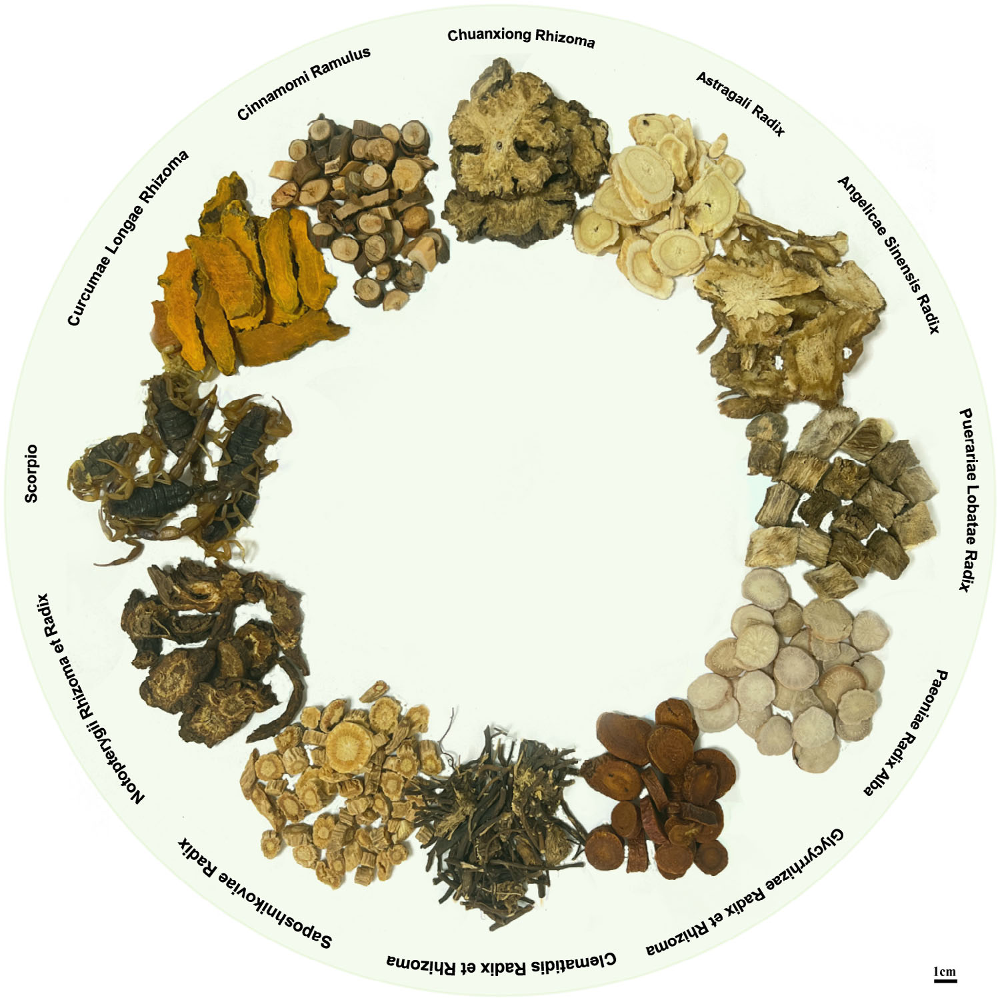
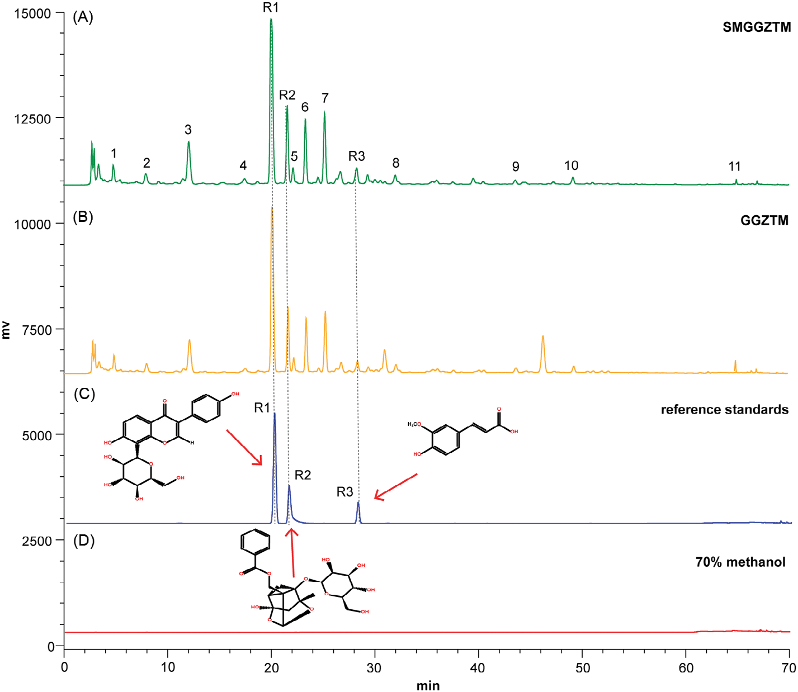
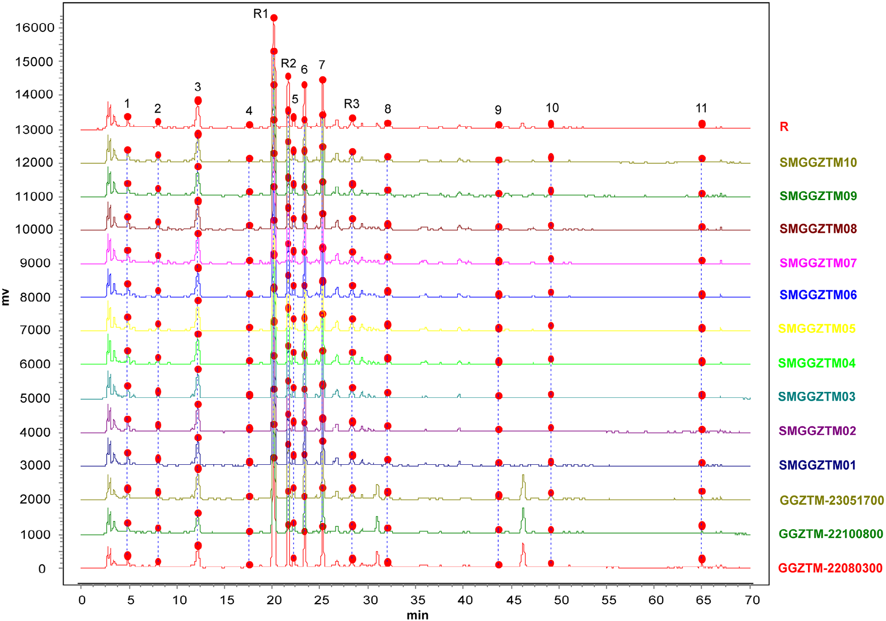
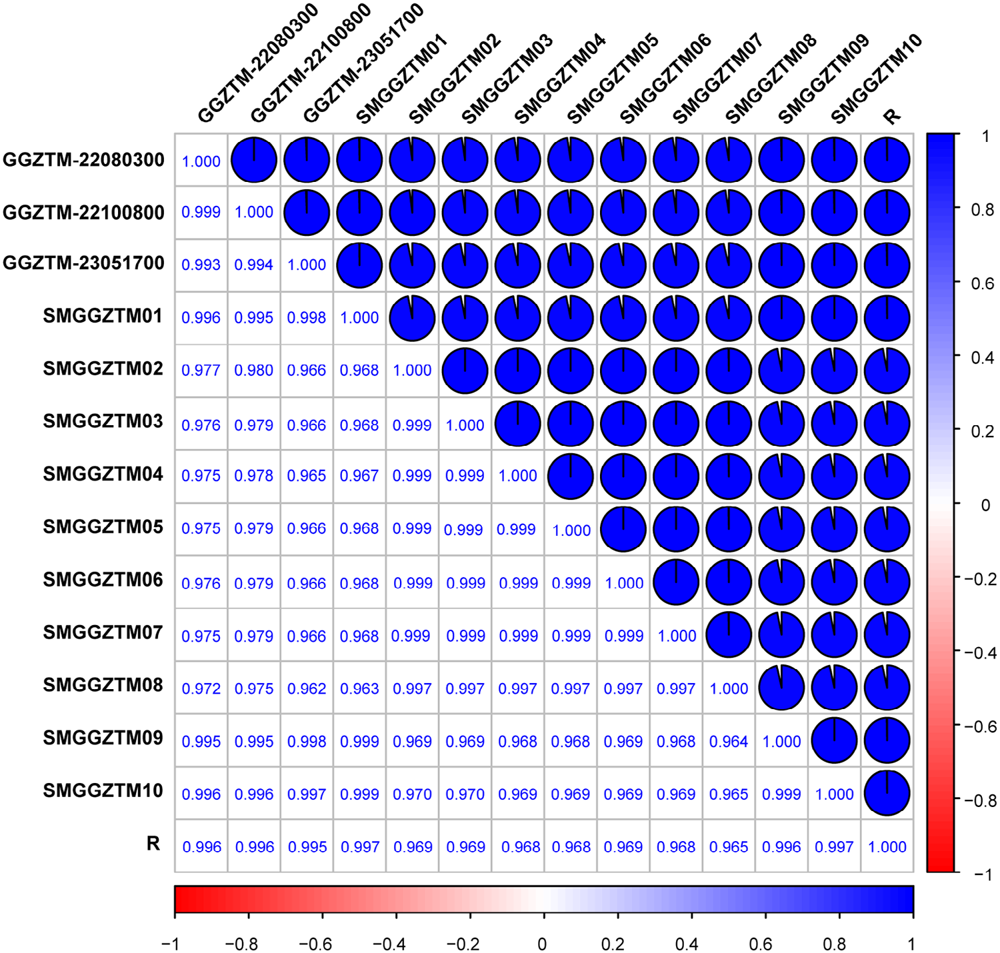
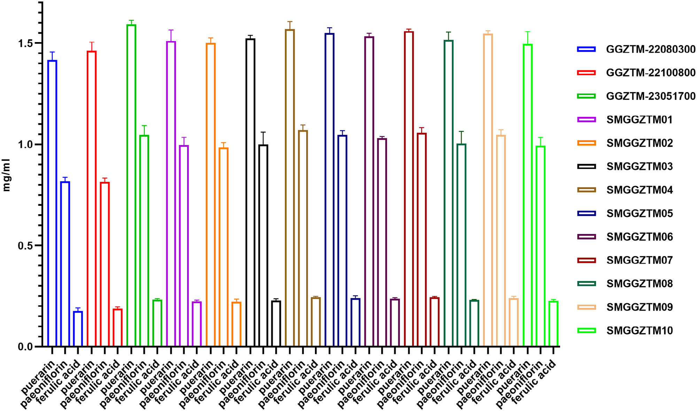
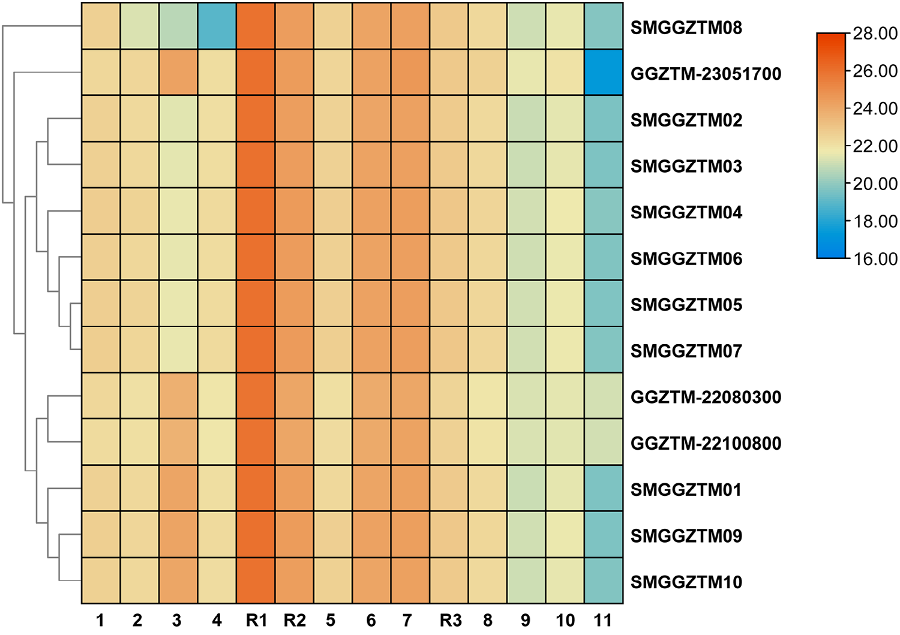

<!-- 方針: ほぼ全訳＋必要に応じた補足。原文構成に沿って訳出。「> 補足:」は訳者注。数値・条件は原文どおり。詳細数表(Table S1〜S12)・補足図(Figure S1〜S3)は補足資料にあり本文には無いため「原文参照」とする。 -->

## 書誌情報

- 原題: Quality Assessment of Gegen Zhitong Mixture Based on Chemical Fingerprints Combined with Quantitative Analysis of Multi-Components with a Single-Marker
- 著者: Hu Xin, Hu Zhiqiang, Cheng Lu, Xu Hongfeng（武漢市第一医院 薬学部 製剤センター／湖北中医薬大学 薬学部, 中国・武漢）
- 掲載: *Separation Science Plus* 2025; 8(1): e202400184（Wiley-VCH）. 受理 2024-11-30. https://doi.org/10.1002/sscp.202400184
- インパクトファクター: **約1.6**（*Separation Science Plus*, Resurchify 等の第三者集計 2024 値）。**Clarivate JCR の公式IFは本稿では未確認**（捏造を避け「要確認」とする）。
- キーワード: クロマトグラフ指紋 / HPLC / 品質評価 / QASM / 類似度

> 補足: GGZTM = 葛根止痛合剤（Gegen Zhitong mixture、武漢市第一医院の院内製剤）。CMP = 中薬製剤。QASM = 一マーカー多成分定量（quantitative analysis of multi-components with a single-marker。1つの標準品＝内部参照で複数成分を定量する手法。QAMS とも）。ESM = 外標準法。RCF = 相対補正因子。RRT/RPA = 相対保持時間／相対ピーク面積。MI = マトリックス干渉。本論文は分析法開発・バリデーション＋指紋／ケモメトリクスの研究論文。

## 要旨（Abstract）

中薬（TCM）処方は中薬における最も重要な宝物の一つである。葛根止痛合剤（GGZTM）は、武漢市第一医院がTCM処方に基づいて開発した中薬製剤（CMP）である。医療目的での安全かつ効果的な使用を確保するには、CMPの包括的な品質評価が必要である。しかし従来のGGZTMの品質評価は単一指標成分の含量測定に限定されており、その全体的な品質を完全に監視することは困難であった。そこで本研究では、高速液体クロマトグラフィー（HPLC）に基づきGGZTMの包括的な化学的プロファイルを記述する手法を初めて開発し、GGZTMの特徴的な共通ピークを同定した。第二に、一マーカー多成分定量（QASM）法を開発し、GGZTM中の3成分の含量を同時に測定するために用いた。最後に、当研究室で処方組成に従って自家製GGZTM（SMGGZTM）を調製し、化学指紋および固有の指標成分の含量に基づく類似度解析および階層的クラスター解析を通じてGGZTMと系統的に比較した。結論として、開発した方法は正確かつ安定であり、GGZTMの製造プロセスの品質管理に適用できる。

## 1. 序論（Introduction）

中薬（TCM）は、さまざまな疾患の予防・治療のため中国で何世紀にもわたって利用されてきた。近年は世界中の患者・医師から注目を集めている。西暦25〜220年に書かれた『神農本草経』は、中国の薬用植物・処方・効能・理論に関する最も古い体系的モノグラフである [1, 2]。TCM処方の大部分は2種以上の生薬で構成され、臨床で有効性が実証されてきた。現在、薬局方や規制基準におけるTCMの品質評価は、主に外観・顕微鏡検査、および特定の指標化合物の定量分析に依存する [3]。しかし個人の経験による感覚検査への依存は、定性評価に主観差を生じうる [4]。さらに単一指標化合物の測定は、多成分系に存在する多数の未知成分を無視することになり、TCMの分析・品質管理に大きな課題をもたらす [5, 6]。加えて安全性・有効性の評価データは現代の規制基準を裏付けるには不十分で、これがTCMの広範な応用を強く制限している [7, 8]。

葛根止痛合剤（GGZTM）は武漢市第一医院が研究開発したTCM製剤で、Puerariae Lobatae Radix（葛根）、Paeoniae Radix Alba（白芍）、Glycyrrhizae Radix et Rhizoma（甘草）など12種類の中薬で構成される（図1）。GGZTMは臨床で「痺証（ひしょう）」の治療に用いられる。TCMにおいて「痺証」は風・寒・湿の複合的侵襲によって生じ、閉塞をきたすものとされ [9]、この概念は古典『黄帝内経』に初めて登場する。さらに近年、160名の臨床患者を対象としたランダム化比較試験が実施され、GGZTMが神経根型頸椎症の治療に有効であることが示された [10]。ただしGGZTMは複数の生薬からなり、その治療効果は複数成分の相乗効果に基づく。例えば葛根から単離されるイソフラボンのプエラリンは心筋虚血再灌流傷害を防ぎ [11]、抗神経炎症作用を示す [12]。白芍については、ペオニフロリンが抗炎症活性 [13, 14] と肝細胞癌抑制効果 [15] を発揮することが報告されている。したがって、品質・有効性に影響する多くの要因があるため、GGZTMの品質評価を包括的に理解することが重要である。しかしこれまで製造工程でのGGZTMの品質管理法としては、HPLCによるプエラリン定量のみが唯一の方法として開発されていた。TCMの観点では、葛根と白芍はGGZTMの中核的な薬対（君薬と臣薬）であり、プエラリン [16] とペオニフロリン [17] はそれぞれの主要有効成分である。またフェルラ酸は本処方中の多くの生薬（Angelicae Sinensis Radix＝当帰、Clematidis Radix et Rhizoma＝威霊仙、Chuanxiong Rhizoma＝川芎）の有効成分である [18–20]。そこで本研究は、これら3成分のGGZTM品質管理への応用に焦点を当てる。GGZTMの品質を監視するには、実用的・効率的・包括的な品質評価システムの確立が不可欠である。

> 補足（生薬名対照）: Puerariae Lobatae Radix＝葛根 / Paeoniae Radix Alba＝白芍 / Glycyrrhizae Radix et Rhizoma＝甘草 / Angelicae Sinensis Radix＝当帰 / Clematidis Radix et Rhizoma＝威霊仙 / Chuanxiong Rhizoma＝川芎。puerarin＝プエラリン、paeoniflorin＝ペオニフロリン、ferulic acid＝フェルラ酸。君薬＝主薬、臣薬＝補助薬。残る生薬の詳細は原文の補足資料 Table S1 参照。

化学指紋法（ケミカルフィンガープリント）は、TCMの包括的な化学的記述を描くために設計された非標的的手法に基づく全体的品質評価技術として受け入れられている。異なるバッチのクロマトグラフプロファイルの類似性を通じて製品の比較可能性に焦点を当てる手法である [21]。現在、TCMの品質管理に用いる化学指紋法は、CFDA・（米国）FDA・欧州医薬品庁（EMA）を含め公式に認められている [22, 23]。近年、HPLCに基づく指紋同定技術は、複雑なマトリックスの全体的化学的特徴付けを達成する効率的ツールとして、TCMおよび中薬製剤（CMP）の品質管理で受け入れられている [24–27]。さらに複数成分に基づく正確な定量分析は、CMPの全体的品質評価により有益である。ただしTCMの化学標準物質の分離・供給の困難さや高価格などの要因は、実験コストを増加させる。Wangら [28] は、一マーカー多成分定量（QASM）を用いたTCMの品質評価法を提案した。この手法は安定・信頼性が高く、複数の研究で報告・確認されている [29–32]。

本研究では、最適化したHPLC分析法でGGZTMの化学指紋を構築し、14個の共通クロマトグラフィーピークを確認した。また指標成分の含量測定において、QASMと外標準法（ESM）に有意差がないことを示した。試料中の3つの主要薬効成分はUPLC-MSおよび標準物質に基づいて同定し、プエラリンを用いてGGZTM中の3成分を同時定量する可能性も検討した。最後に本法で複数のGGZTMおよび自家製GGZTM（SMGGZTM）試料を分析し、各試料の化学組成の類似性を比較した。本研究が提案する分析法はGGZTMの品質管理において高い選択性・特異性・感度を有し、その結果はGGZTMの臨床応用の基盤を提供する。

## 2. 実験（Experimental）

### 2.1 材料と試薬

GGZTM 3バッチは武漢市第一医院製剤センターより提供された。SMGGZTM用の12種類の原料生薬は湖北天済中薬飲片有限公司より提供され（図1）、詳細情報は Table S1 に示される（原文の補足資料 Table S1 参照）。すべての生薬原料は薬剤師 Hu Zhiqiang により同定・鑑定され、証拠標本は武漢市第一医院薬学部（中国・湖北省・武漢）に保管された。

標準物質は、プエラリン（バッチ番号 110752–201514）、ペオニフロリン（バッチ番号 110736–202246）、フェルラ酸（バッチ番号 110773–200611）を中国食品薬品検定研究院（北京）から入手した。クロマトグラフィーグレードのメタノールは国薬集団化学試薬有限公司（上海）から購入し、脱イオン水は ULUPURE UPT 純水製造装置（成都）で調製した。その他の有機試薬は分析グレードであった。

### 2.2 装置およびクロマトグラフィー条件

HPLC分析は島津製作所 Essentia LC-16 システムで、Elite SinoChrom ODS-BP（C18）カラム（250 × 4.6 mm, 5 µm）を用いて実施した。システムには SPD-16 UV-可視二波長検出器、SIL-16 オートサンプラー、CTO-16L 温度制御システム、LabSolution データワークステーションを備える。流速 1.0 mL/min、注入量 20 µL、カラム温度 35 ℃、検出波長 270 nm。二液グラジエントは 0.2%(v/v) リン酸水溶液（A）とメタノール（B）から構成し、線形グラジエントプログラムは以下のとおり:

| ステップ | 時間(min) | B濃度(v/v) |
|---|---|---|
| I | 0–10 | 25% |
| II | 10–15 | 25%→32% |
| III | 15–25 | 32%→39% |
| IV | 25–28 | 39% |
| V | 28–33 | 39%→42% |
| VI | 33–40 | 42%→46% |
| VII | 40–46 | 46%→54% |
| VIII | 46–56 | 54%→62% |
| IX | 56–63 | 62%→95% |
| X | 63–70 | 95% |

各注入の終了時にカラムを純メタノールで15分間洗浄し、初期移動相で10分間再平衡化した。

### 2.3 標準液の調製

3つの標準物質を精密に秤量し、70%(v/v) メタノール水溶液に5分間の超音波処理で溶解させ、プエラリン 1.0220 mg/mL、ペオニフロリン 0.1141 mg/mL、フェルラ酸 0.5400 mg/mL を含む混合原液を得た。HPLC分析の前に、原液を70%メタノールで2〜32倍に希釈し、異なる濃度の実用標準液5点を調製した。

### 2.4 試料溶液の調製

SMGGZTM試料は GGZTM の処方量に従って調製した。全材料をその重量の8倍量の精製水で30分間浸漬し、1時間ずつ3回煮沸し、3抽出液を合わせて真空濃縮して1000 mLとした。GGZTMおよびSMGGZTM試料 20 mL に70%メタノールを加えて 50 mL とし、30分間超音波抽出した。その後 3000 × g で5分間遠心分離（Centrifuge 5424 R; Eppendorf, ドイツ）し、上清を 0.45 µm フィルター膜でろ過して指紋分析に供した。同一手順で、定量分析用には GGZTM・SMGGZTM 試料を70%メタノールで10倍希釈した。

### 2.5 分析物の同定（UPLC-QTOF-MS）

GGZTM試料および実用標準液中のプエラリン・ペオニフロリン・フェルラ酸の同定は、エレクトロスプレーイオン化（ESI）インターフェースを備えた四重極飛行時間型タンデム質量分析計（X500R QTOF）に接続した島津 LC-20A で行った。分離は Waters ACQUITY UPLC BEH C18（1.7 µm, 2.1 × 100 mm）で、0.1%(v/v) 酢酸水溶液（A）と 0.1%(v/v) ギ酸アセトニトリル（B）のグラジエント移動相を用いた:

| ステップ | 時間(min) | B濃度(v/v) |
|---|---|---|
| I | 0–3 | 20% |
| II | 3–6 | 20%→25% |
| III | 6–9 | 25%→40% |
| IV | 9–15 | 40%→95% |
| V | 15–18 | 95% |
| VI | 18–18.1 | 95%→20% |
| VII | 20–22 | 20% |

流速 0.2 mL/min、注入量 5 µL、カラム温度 40 ℃。MS分析は陰イオン化モード（ESI−）で、イオンスプレー電圧 −5500 V、ターボスプレー温度 550 ℃、ネブライザーガス・ヒーターガス 55 psi、カーテンガス 35 psi。QTOF/MS と QTOF/MS-MS はともに m/z 50〜1000 でスキャンし、デクラスタリングポテンシャル 80 V、蓄積時間はそれぞれ 150 ms・50 ms、衝突エネルギーはそれぞれ 10 V・30 V とした。プリカーサーイオンおよびフラグメントイオンの正確な質量・組成は Analyst TF ソフトウェア（ver. 1.6）で解析した。

### 2.6 HPLC法のバリデーション

- **特異性・精度・再現性・安定性**: 特異性は混合標準液・試料溶液・ブランク溶液（70%メタノール）のクロマトグラム比較で検証。装置精度は同一試料溶液の6回連続分析で判定。再現性は同一バッチから抽出した6つの独立試料溶液の分析で評価。安定性は調製後 0・2・4・8・12・24 時間で同一バッチ試料溶液を注入して推定。試料は GGZTM（バッチ番号 23051700）を用いた。
- **検量線**: 原液および 2.3 の実用標準液5点を含む異なる濃度の溶液で、ピーク面積を濃度に対してプロットし、最小二乗法で評価した。
- **LOD・LOQ**: 3成分を含む原液を段階希釈し、S/N比 3 および 10 に相当する濃度をそれぞれ LOD・LOQ とした。
- **回収率試験・マトリックス干渉(MI)評価**: 回収率試験は6つの独立した GGZTM 試料（バッチ番号 23051700）に標準物質を添加し、抽出前に70%メタノールで 50 mL とした。全分析成分の RSD% を算出。MI評価では、2.4 の手順で調製した GGZTM 抽出液に等体積の標準液を加えた混合マトリックス溶液を分析し、混合溶液中の各成分のUV応答シグナルの、抽出液と標準液の応答シグナル和の半値に対する割合を計算した。

### 2.7 標準指紋クロマトグラムの生成

HPLC分析の前に、2.4 に従い SMGGZTM 10バッチと GGZTM 3バッチを調製した。13バッチに基づく標準指紋クロマトグラムの生成には、専門ソフト「中薬クロマト指紋類似度評価システム（Similarity Evaluation System for Chromatographic Fingerprint of TCM）」（2012版）を用い、各バッチのHPLCクロマトグラムと標準指紋クロマトグラムの類似度を評価した。

### 2.8 一マーカー多成分定量（QASM）

QASMでは、混合原液を 2.5・5.0・10.0・15.0・20.0 µL でそれぞれHPLCに注入した（代表クロマトグラムは図2C）。プエラリン（図2C の R1）に対するペオニフロリン（R2）・フェルラ酸（R3）の相対補正因子（RCF）を、実用標準液5点の各成分のピーク面積と濃度から算出した。GGZTM試料中のペオニフロリン・フェルラ酸の含量は RCF を介して間接的に計算した。あわせて各試料の3化合物の含量を ESM（外標準法）でも計算し、2法の結果に有意差があるかを t検定で評価した。

### 2.9 統計解析

相関分析マップは R ソフト（ver. 4.2.1）の corrplot・ggplot2 パッケージで描画し、ピアソン相関係数を各試料の共通ピーク面積から計算した。t検定は GraphPad Prism（ver. 8.0.2）で計算し、p < 0.05 を統計的に有意とした。階層的クラスター解析は TBtools（ver. 2.026）で実施した。

## 3. 結果と考察（Results and Discussion）

### 3.1 クロマトグラフィー条件の最適化

カラム温度（30・35・40 ℃）のピーク分離への影響を調べた。各温度でのクロマトグラムは非常に類似したが、35 ℃で全体の分離度がより良好であったため 35 ℃ を採用した。同様に検出波長（230・250・270 nm）を検討し、270 nm でピーク数が多く各ピーク高が比較的調和していたため 270 nm を選択した。最適化条件下での混合標準物質・GGZTM抽出液・SMGGZTM・ブランク溶液のHPLCクロマトグラムを図2に示す。

### 3.2 方法のバリデーション

#### 3.2.1 定性分析

プエラリン・ペオニフロリン・フェルラ酸は GGZTM の品質管理成分となる3つの分析対象である。GGZTM中の存在を確認するため、混合標準物質および GGZTM 試料の QTOF-MS・QTOF-MS/MS スペクトルを取得して同定した（関連結果は Table S2・Figures S1–S3。原文の補足資料参照）。プエラリンと GGZTM 試料の両QTOF-MSスペクトル（保持時間 RT = 1.742 分）で m/z 415.1 の [M−H]⁻ が観測され、MS/MSスペクトルも極めて類似し、ともに m/z 325・295・267 にフラグメントイオンを有した（原文の補足資料 Figure S1 参照）。よって GGZTM 中の成分（RT = 1.742 分）をプエラリンと同定した。分析成分（RT = 2.668 分）は m/z 479.1 にプリカーサーイオン、m/z 525.1 に [M+HCOOH−H]⁻ を示し、MS/MSスペクトルがペオニフロリンと一致したため、この化合物をペオニフロリンと同定した（原文の補足資料 Figure S2 参照）。同様に RT・MS/MS の比較により化合物（RT = 3.841 分）をフェルラ酸と同定した（原文の補足資料 Figure S3 参照）。

#### 3.2.2 特異性・精度・再現性・安定性

共通ピークの相対保持時間（RRT）・相対ピーク面積（RPA）の RSD が、精度・再現性・安定性を特徴づける重要パラメータである。特異性評価にはブランク試料のクロマトグラフ挙動を用い、RT = 20.04 分のピーク R1（プエラリン）を参照ピークとした（図2A）。精度・再現性・安定性の結果はそれぞれ Table S3〜S5 にある（原文の補足資料参照）。

- **精度**: 6試料の14共通ピークの RRT・RPA の RSD は、それぞれ **0.06%未満・0.83%未満**（Table S3）。
- **再現性**: RRT・RPA の RSD はそれぞれ **0.05%未満・3.71%未満**（Table S4）。
- **安定性**: RRT・RPA の RSD はそれぞれ **0.08%未満・3.88%未満**（Table S5）。

これらより、最適化法は精密・正確・安定で、指紋構築と特徴成分の含量測定に適することが示された。ブランク試料のクロマトグラム（図2D）では、全共通ピークに対応する時間帯に妨害ピークが現れず、良好な特異性が示された。

#### 3.2.3 直線性・LOD・LOQ

検量線は一連の濃度の標準液を分析してプロットした。回帰式は y = ax + b の形式で、x・y はそれぞれ標準液濃度・対応ピーク面積である。プエラリン・ペオニフロリン・フェルラ酸は、それぞれ **31.93–1021.85・3.57–114.11・16.87–540 µg/mL** の範囲で、相関係数 **0.9994 以上**の良好な線形回帰を示した（Table S6）。3成分の LOD・LOQ はそれぞれ **12.06–14.55 ng/mL・40.19–105.02 ng/mL** の範囲であった（Table S6）。以上より本法は GGZTM 中3化合物の同時定量に対し正確かつ高感度である。

#### 3.2.4 回収率試験・MI評価

3対象成分の平均回収率は **101.13%〜110.05%**、RSD は **1.0%未満**であった（Table S7）。3成分の平均マトリックス干渉（MI）値は **102.11%〜106.12%**（Table S8）で、GGZTM試料の複雑な中薬マトリックスが3化合物の含量検出にほとんど干渉しないことが示された。

### 3.3 共通ピークの同定と類似度解析

GGZTM 3バッチと SMGGZTM 10バッチのHPLC指紋を適合させ、「中薬クロマト指紋類似度評価システム」で標準指紋クロマトグラム R を生成し、**14個の共通ピーク**を見出した（図3）。うち3ピーク（R1・R2・R3）は、確立したHPLC法で RT を標準物質と比較し、それぞれプエラリン・ペオニフロリン・フェルラ酸と同定した（図3）。

これら14共存ピークの RRT・RPA を取得した（結果は Table S9）。RRT の RSD は **0.2%未満**、RPA の RSD は **4.76%〜61.24%**であった。各バッチで共通ピークの RT は一貫していたが、成分含量には差があった。13試料の指紋の類似度解析（Table S10）では類似度 **0.996〜1**。あわせて R ソフト（corrplot・ggplot2）で相関分析マップを描き（図4）、14共存ピーク面積からピアソン相関係数を算出した。図4左下の数値が相関係数、右上の円グラフがその図示（青＝正相関、赤＝負相関）。研究試料間の相関係数はすべて **0.962 を超え**、HPLC指紋の類似度法が製造における GGZTM の品質管理指標として使えることが示された。

### 3.4 QASMによる定量測定と解析

最適化HPLC法を13種の試料の3成分同時定量に適用した。HPLCプロファイル中の化合物はオンラインUVスペクトルと RT を標準物質と比較して同定した（クロマトグラムは図2、13試料の3化合物含量は図5）。各分析成分の含量は試料ごとに変動し、**プエラリンが全試料で最も高く、次いでペオニフロリン、フェルラ酸が最も低かった**。GGZTM 3バッチのうち **GGZTM-23051700** が3標準物質すべての含量で最も高かった。これは各バッチの生薬原料の産地・生育年数・栽培法の違いに起因しうる。含量変化は臨床的有効性・安全性の変化につながるため、栽培・製造・試験を含む全工程を標準化することが望ましい。

QASMは1成分を内部参照として複数指標成分を同時測定できる。本研究ではプエラリンを内部参照化合物とし、5段階の注入量の原液からペオニフロリン・フェルラ酸の RCF を算出した（Table S11）。13試料の3化合物の検出結果を比較すると（Table S12）、**ESM（外標準法）と QASM に有意差はなかった（p > 0.5）**。よってプエラリンを基準成分として複数化合物の含量を測定することは実行可能で、本法は実験コストを削減し分析効率も向上させた。

### 3.5 階層的クラスター解析

13試料（GGZTM・SMGGZTM）のクラスター解析を図6に示す。14共通ピーク面積の log2 で構築し、変換後のピーク面積は **14〜28** に分布した。成分含量の観点では、GGZTM-22080300 と GGZTM-22100800 が、他より SMGGZTM01・SMGGZTM09・SMGGZTM10 と高い類似性を示した。SMGGZTM08 は共通成分のピーク面積が他より大きく、別枝に分離した。この差は生薬原料の品質のばらつきに起因する可能性が高い。これらの結果は、CMPの製造工程でバッチ間の品質差を最小化するため、各生薬原料の供給元の安定性を確保することの重要性を一層強調する。

## 4. 結論（Conclusion）

本研究では、HPLC指紋と QASM を組み合わせた、GGZTM の類似度評価・品質評価のための2段階アプローチを確立した。最適化HPLC法は良好な安定性・精度・再現性を示し、GGZTMの指紋図譜構築に用いた。14共存指紋ピークが GGZTM の化学組成情報を正確に特徴づけ、類似度評価の重要な基盤となることが示された。さらに3主要成分を同時測定できる QASM 法は信頼できることが証明され、検出の正確性を確保しつつ効率も向上させた。総じて本研究は GGZTM の製造工程の品質管理に強固な基盤を築き、医薬品使用の安全に資する。

## 訳者補足（実務的示唆）

> 以下は原文の主張ではなく、実務者向けの整理（訳者注）。

- **単一指標→総合評価への移行例**: 従来「プエラリン1成分のHPLC定量」だけだった院内製剤の規格を、①14共通ピークの指紋（プロファイル一致性の担保）と②QASMによる3成分同時定量、の二本立てに拡張した実例。院内製剤・自家製剤の品質規格を高度化する際の設計テンプレートとして参照しやすい。
- **QASM(QAMS)の利点**: 高価・入手困難な標準品を減らせるのが実務上の要点。プエラリン1点を内部参照にペオニフロリン・フェルラ酸を RCF 換算で定量し、外標準法と有意差なし（p>0.5）を確認しているため、日常試験のコスト・工数削減の裏付けになる。ただし RCF はカラム・装置間で変動しうるため、装置移管時は RCF の再検証が望ましい（原文は単一条件での検証）。
- **数値の所在**: 検量線の回帰式・RCF実測値・各バッチの実含量(mg/mL 等)・類似度／相関の個票は本文になく補足資料（Table S1〜S12・Figure S1〜S3）にある。規格化の根拠数値が要る場合は原文の Supporting Information を参照のこと。
- **IFの扱い**: 掲載誌 *Separation Science Plus* の IF は第三者集計で約1.6（2024）。Clarivate JCR の公式収載・公式IFは本稿では未確認。引用時は一次情報での確認を推奨。
