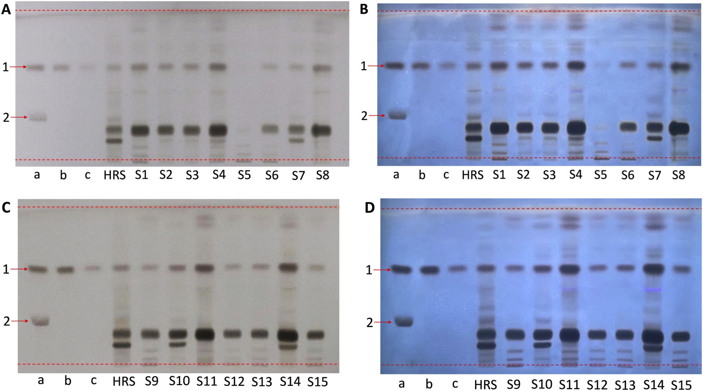
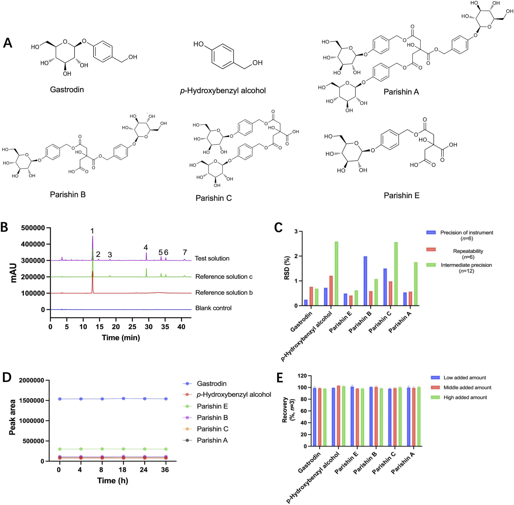
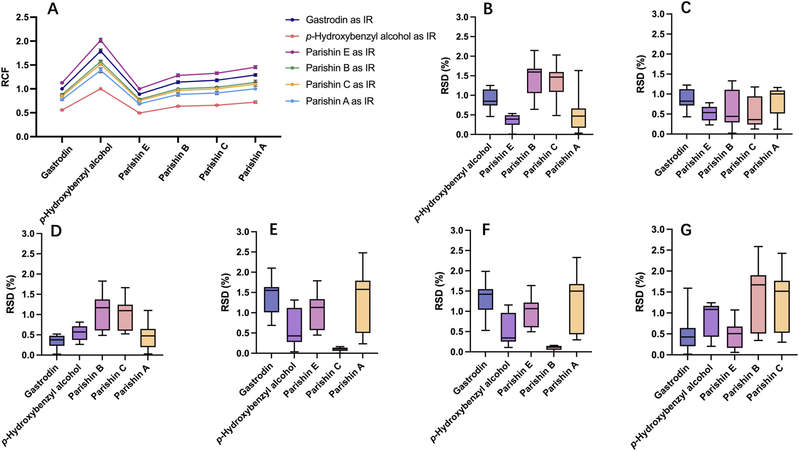
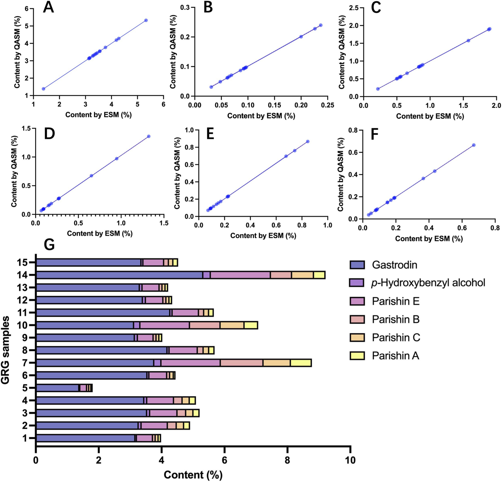
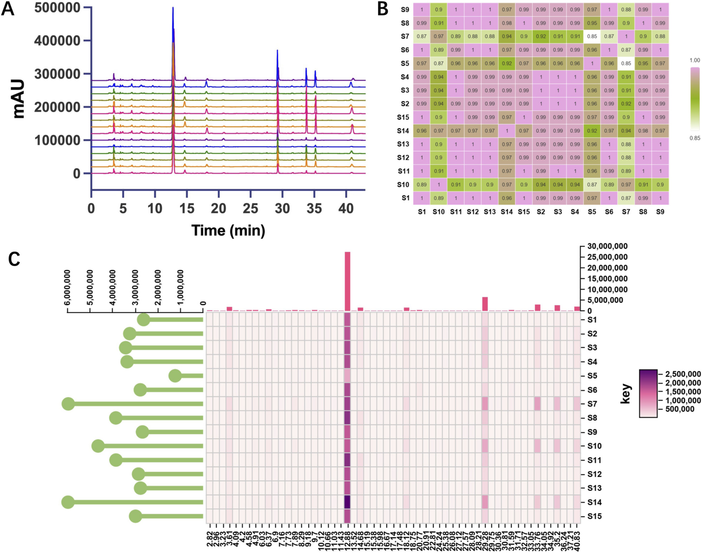
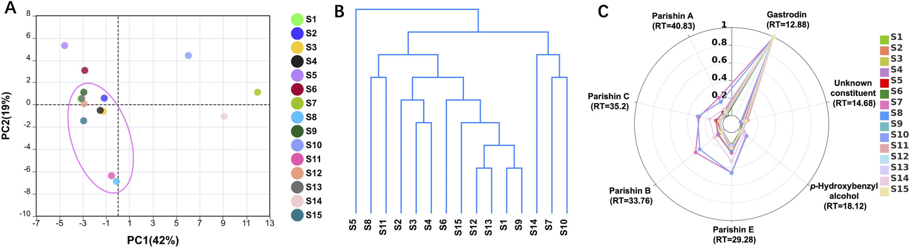

<!-- 方針: ほぼ全訳＋必要に応じた補足。原文構成に沿って訳出。「> 補足:」は訳者注。 -->

## 書誌情報

- 原題: Deutscher Arzneimittel-Codex-aligned multi-dimensional quality assessment of Gastrodiae Rhizoma granules
- 著者: Yin Xiong（責任著者）, Yiwei Wu（Xiongと同等貢献）, Xiaoyan Che, Xiuming Cui, Ryan Gene Hornbeck, Yuefei Geng, Ruoying Wu, Jin Tan（責任著者）, Yindi Zhu（責任著者）
- 所属: 温州医科大学 中医学院／ライデン大学-欧州中医薬天然化合物センター（オランダ）／昆明理工大学／温州肯恩大学／好医生薬業集団（中国・成都）
- 掲載: *Frontiers in Pharmacology* 17:1843493 (2026). https://doi.org/10.3389/fphar.2026.1843493
- インパクトファクター: **要確認**。第三者集計サイトの値にばらつきが大きく（Resurchify: 4.65／Exaly: 4.048／Journalmetrics.org: 5.4〈2026年6月公表・2025年引用データに基づく〉／wos-journal.info: 5年IF 5.8 など）、Clarivate公式JCRの値そのものは本稿執筆時点でオンライン確認できなかった。捏造を避けるため具体値は記載せず、正式な引用時は一次情報（Clarivate Journal Citation Reports）での確認を推奨する。
- 受理経過: 受領 2026-03-31 / 改訂 2026-04-20 / 採録 2026-04-27 / 公開 2026-05-15
- ライセンス: オープンアクセス（CC BY）。生成AI（ChatGPT）を文章の推敲に使用したと著者が申告。図の代替テキスト（alt text）はFrontiers誌がAI支援で生成。
- 利益相反: 著者のうち2名（Yuefei Geng, Jin Tan）は好医生薬業集団（Good Doctor Pharmaceutical Group Co., Ltd.）に所属。その他の著者に開示すべき利益相反なし。

> 補足: 天麻（Gastrodia elata Blume、ラン科）の乾燥塊茎である天麻（Gastrodiae Rhizoma, GR）は、中国医学で頭痛・めまい・痙攣性疾患などに古くから用いられてきた生薬。主要活性成分はゲアストロジン(gastrodin)・p-ヒドロキシベンジルアルコール・パリシン類(parishins)で、いずれも品質評価の指標成分とされる。本論文の天麻顆粒（GRG）は、GRの飲片（decoction pieces）を煎じ・濃縮・乾燥・造粒した「配方顆粒」であり、伝統的な煎じ薬の代替として中国国家標準（CNS, YBZ-PFKL-2021122）に収載されている。本論文の主眼は、GRGの品質評価に**ドイツ薬局方（Deutscher Arzneimittel-Codex, DAC）**準拠の分析要素（システム適合性試験〈SST〉の明示、対照品の設定、多成分・多ロット特性評価）を導入し、中国国家標準(CNS)と比較することで、国際的な規格調和・相互比較の実務的な参考を提供する点にある。DACはドイツにおける医薬品・生薬原料の品質評価に用いられる公定書で、欧州薬局方(EP)に準拠したクロマト適合性要求を特徴とする。

## 要旨（Abstract）

**背景:** 再現性のある品質評価は、生薬顆粒製剤の標準化と国際的な比較可能性にとって不可欠である。天麻顆粒（GRG）は広く使用されている生薬製剤であるが、異なる公定書要求に整合した分析戦略は依然として限られている。本研究は、GRGの品質評価のためのドイツ薬局方（Deutscher Arzneimittel-Codex, DAC）準拠の分析戦略を確立・評価し、中国国家標準（CNS）と比較することを目的とした。

**方法:** 薄層クロマトグラフィー（TLC）、一点校正多成分定量（QAMS）、高速液体クロマトグラフィー（HPLC）指紋分析を統合した多次元分析アプローチをGRGに対して開発した。TLCはDACのシステム適合性要求（SST）に基づいて評価した。ゲアストロジンを内部標準として、p-ヒドロキシベンジルアルコールおよびパリシンE・B・C・AをQAMSにより同時定量した。HPLC指紋は15ロットのGRGについて確立し、コサイン類似度分析・主成分分析（PCA）・階層的クラスター分析（HCA）・レーダープロット可視化により評価した。

**結果:** TLC法はゲアストロジンとパリシンBの明瞭な分離を達成し、DACの適合性要求を満たした。QAMSの結果は外部標準法（ESM）と比較して有意差がなく（P > 0.05）、良好な正確性と信頼性を示した。HPLC指紋分析は、検討したロット間でおおむね一貫した化学プロファイルを示す一方、一部の試料でロット間変動も同定した。ケモメトリクス解析は、検討したロットの全体的な類似性と局所的な不均一性の両方をさらに裏付けた。中国国家標準と比較して、DAC準拠戦略はクロマト適合性と多成分特性評価により重点を置いていた。

**結論:** 本研究は、GRGの多次元品質評価のためのDAC準拠分析戦略の実行可能性を示し、生薬顆粒製剤の規格間比較および品質評価アプローチの調和のための有用な参考を提供する。

**キーワード:** ドイツ薬局方（Deutscher Arzneimittel-Codex）／天麻顆粒（Gastrodiae Rhizoma granules）／品質評価／一点校正多成分定量（QAMS）／システム適合性試験

## 1. 序論（Introduction）

伝統中薬（TCM）顆粒は、抽出・濃縮・分離・乾燥・造粒・包装といった標準化された製造工程を経て、飲片（decoction pieces）から作られる現代的な生薬製剤である（Cui et al., 2022; Gu et al., 2025）。従来の煎じ薬と比較して、これらの顆粒は保存・輸送のしやすさ、より正確な投与量、患者コンプライアンスの向上、より一貫した品質管理といった利点を持つ（Zhao et al., 2024）。その結果、TCM顆粒は臨床現場での使用が増加し、国際市場でも注目を集めている。

こうした発展にもかかわらず、TCM顆粒の品質評価は、国・地域間での規制枠組みや技術要求の違いによって依然として困難を抱えている。特に、品質指標・クロマト要求・バリデーション基準のばらつきは、生薬医薬品の国際登録やより広範な受容にとって実務上の障害となっている。ドイツにおける重要な公定書・技術参照文献である**ドイツ薬局方（Deutscher Arzneimittel-Codex, DAC）**は、医薬品・生薬原料の品質評価に用いられる。生薬分析の文脈において、DAC志向の要求は欧州薬局方（EP）様式の品質期待とおおむね整合しており、特にクロマト適合性・規定された対照物質・ロット間一貫性評価を重視する（Hempen, 2014; Manns et al., 2019）。したがって、これらの要求は、国際使用を意図した中国産生薬顆粒製剤の特性評価・品質評価により厳格な要求を課しうる。

天麻（Gastrodiae Rhizoma, GR、中国語で「天麻」）は、*Gastrodia elata* Blumeの乾燥塊茎であり、頭痛・めまい・痙攣性疾患などの症状に長く用いられてきた、よく知られた生薬である（Chinese Pharmacopoeia Commission, 2025; Hsu et al., 2021）。植物化学的・薬理学的研究により、その主要な生物活性成分であるゲアストロジン・p-ヒドロキシベンジルアルコール・パリシン類は、品質評価の重要な指標成分として広く認識されている（Ma et al., 2024; Su et al., 2023）。現代の臨床ニーズに応えるため、GRはTCM顆粒剤形として開発され、伝統的な飲片の代替として使用される剤形として中国国家標準（CNS、YBZ-PFKL-2021122）に収載されている（National Medical Products Administration, 2021）。現行のCNSは品質管理の基本的な枠組みを提供するものの、システム適合性基準・対照物質の使用・クロマト特性評価の深さといった点で、CNSとDAC志向の要求との間には差異が残る。これらの差異は、特に国際的な品質評価の文脈において、天麻顆粒（GRG）の規格間評価を複雑にしている。

このような背景から、本研究はGRGの品質評価のためのDAC準拠分析枠組みの開発・評価を目的とする。ここでの「DAC準拠（DAC-aligned）」とは、GRGに対する法的拘束力のある登録標準を直接実装することではなく、DAC/EP様式の期待と整合的な分析要素を採用することを指す。本戦略は、特徴的成分同定のための薄層クロマトグラフィー（TLC）、マーカー成分の同時定量のための一点校正多成分定量（QAMS）、化学的一貫性評価のための高速液体クロマトグラフィー（HPLC）指紋分析を統合した。提案したアプローチは、分析要求・品質指標・方法論的特徴の観点から、現行のCNSとの比較においてさらに検討した。本研究は、生薬顆粒製剤の規格間比較・品質評価アプローチの調和のための実務的な参考を提供する。

## 2. 材料と方法（Materials and Methods）

### 2.1 GRG試料

中国国内の異なるメーカーによる**15ロット**の市販GRGを分析対象として収集した。GRGは天麻（Tianma；ラン科*G. elata* Blumeの乾燥塊茎）由来の顆粒製剤である。分析した全試料は、識別可能なロット番号・メーカー情報を有する市販品であった。CNSによれば、GRGはGR飲片を煎出・濃縮・乾燥・造粒し、必要に応じて賦形剤を添加して調製される。報告されている乾燥エキス収率14%〜25%に基づくと、生薬-エキス比（DER native）はおよそ4.0〜7.1:1である。メーカー提供情報によれば、賦形剤を用いる場合はマルトデキストリンが一般的に使用される。試料の詳細情報をTable 1に示す。

**Table 1. 分析したGRG試料の情報。**

| 試料No. | ロット番号 | メーカー |
|---|---|---|
| S1 | 1039192 | Guangdong Yifang Pharmaceutical Co., Ltd. |
| S2 | 1042132 | Guangdong Yifang Pharmaceutical Co., Ltd. |
| S3 | 1052223 | Guangdong Yifang Pharmaceutical Co., Ltd. |
| S4 | 1024412 | Guangdong Yifang Pharmaceutical Co., Ltd. |
| S5 | 2101001W | China Resources Sanjiu Medical & Pharmaceutical Co., Ltd. |
| S6 | 19045512 | Beijing Tcmages Pharmaceutical Co., Ltd. |
| S7 | 21060781 | Tianjiang Pharmaceutical Co., Ltd. |
| S8 | 0129181 | Guangdong Yifang Pharmaceutical Co., Ltd. |
| S9 | 0079081 | Guangdong Yifang Pharmaceutical Co., Ltd. |
| S10 | 1052221 | Guangdong Yifang Pharmaceutical Co., Ltd. |
| S11 | 0129171 | Guangdong Yifang Pharmaceutical Co., Ltd. |
| S12 | 0079101 | Guangdong Yifang Pharmaceutical Co., Ltd. |
| S13 | 0079091 | Guangdong Yifang Pharmaceutical Co., Ltd. |
| S14 | 20041371 | Tianjiang Pharmaceutical Co., Ltd. |
| S15 | 0049231 | Guangdong Yifang Pharmaceutical Co., Ltd. |

> 補足: 15ロット中9ロット（S1〜S4、S8〜S13、S15）がGuangdong Yifang Pharmaceutical社製で、残りはChina Resources Sanjiu社（S5）、Beijing Tcmages社（S6）、Tianjiang Pharmaceutical社（S7・S14）と、メーカー分布に偏りがある。原文の考察（4.4節）でもこの偏りが結果解釈の限界として明記されている。

### 2.2 試薬

対照品として、ゲアストロジン（No. 110807-202010、HPLC純度≥95.5%）とp-ヒドロキシベンジルアルコール（No. 11970-201702、HPLC純度≥99.4%）、GRの生薬対照品（HRS、No. 120944-202112）を中国食品薬品検定研究院（北京）から購入した。パリシンA（No. PRF20091710、HPLC純度≥98%）、パリシンB（No. PRF21030901、HPLC純度≥98%）、パリシンE（No. PRF20092841、HPLC純度≥98%）は成都Biopurify Phytochemicals社から、パリシンC（No. D06N11S130122、HPLC純度≥98%）は上海源葉生物科技から購入した。アセトニトリルはHPLCグレード。その他の試薬はすべて分析用グレードを使用した。

### 2.3 TLC同定

**2.3.1 試験溶液の調製:** GRG 0.1 gを精秤し、メタノール10 mLで200 W・53 kHzの超音波抽出を30分間行った。ろ過後、ろ液を蒸発乾固し、残渣をメタノール0.5 mLに再溶解して試験溶液とした。

**2.3.2 HRS溶液の調製:** GR生薬対照品（HRS）0.3 gを水8.0 mLで還流下2時間抽出した。抽出液をろ過し、ろ液を蒸発乾固した。残渣をメタノール10.0 mLに溶解し、30分間超音波抽出した。ろ過後、ろ液を再度蒸発乾固し、最終残渣をメタノール0.5 mLに溶解してHRS溶液とした。

**2.3.3 対照溶液の調製:** SST用の対照溶液aは、ゲアストロジン2.0 mgとパリシンB 2.0 mgをメタノール1.0 mLに溶解した混合対照溶液として調製した。対照溶液bは、ゲアストロジン2.0 mgをメタノール1.0 mLに溶解して調製した。対照溶液cは、対照溶液b 0.25 mLをメタノールで1.0 mLに希釈し、濃度0.5 mg/mLとして得た。

**2.3.4 クロマト条件:** シリカゲルプレート（Macherey-Nagel社、5×10 cm、粒子径5〜17 μm）を使用した。移動相はジクロロメタン・酢酸エチル・メタノール・水を2:4:2.5:1（V/V/V/V）の比率とした。各溶液4 μLを同一TLCプレート上に8 mm幅のバンドとして塗布した。展開は非飽和チャンバー内で展開距離8 cmまで行った。展開後のプレートを風乾し、10%（V/V）硫酸エタノール溶液を噴霧して105 ℃で15分間加熱した。クロマトプロファイルは日光下および310 nmの紫外線下で観察した。310 nmでの観察は、本条件下で特徴的なバンドの視認性が最も明瞭であったために選択した。試験溶液のクロマトグラムでは、HRSおよび対照溶液のスポットと位置・色が一致するスポットが観察された。TLCシステムのSSTは対照溶液aを用いて評価した。

### 2.4 HPLC分析

**2.4.1 試験溶液の調製:** GRG試料0.2 gを精秤し、メタノール-水混合溶媒（30:70, V/V）25.0 mLで抽出した。混合物を200 W・53 kHzで30分間超音波処理し、室温まで冷却した。溶液を再秤量し、減量分を同溶媒混合物で補った。混合物を十分に振とうし、静置後、0.22 μmメンブレンフィルターでろ過した。得られたろ液を試験溶液とした。

**2.4.2 対照溶液の調製:** SST用の対照溶液aは、パリシンBとパリシンCをそれぞれ0.1 mg、同溶媒混合物10.0 mLに溶解して調製した。対照溶液bは、ゲアストロジン2.0 mgをメタノール-水（30:70, V/V）溶媒混合物10.0 mLに溶解して調製した。対照溶液cは、ゲアストロジン2.0 mg、p-ヒドロキシベンジルアルコール0.06 mg、パリシンE 0.45 mg、パリシンB 0.13 mg、パリシンC 0.1 mg、パリシンA 0.1 mgを同溶媒混合物10 mLに溶解して調製した。

**2.4.3 クロマト条件:** 逆相C18-AQカラム（250 mm×4.6 mm、粒子径5 μm）を用いたHPLCシステムで分析した。移動相は移動相A（0.1%リン酸水溶液、V/V）と移動相B（アセトニトリル）。グラジエントモードは以下のとおり: 0〜16分でB 2%→6%、16〜22分で6%→12%、22〜35分で12%→18%、35〜42分で18%→24%、42〜43分で24%→95%。流速1.0 mL/min。検出波長220 nm。注入量5 µL。

**2.4.4 方法論的検証**

*2.4.4.1 特異性:* 空試験溶媒・試験溶液・対照溶液a・対照溶液cのクロマトグラムを比較して評価した。クロマト条件は2.4.3節と同一とした。試験溶液中のピークは対照物質の保持時間との比較により同定し、空試験溶液からの妨害は観察されなかった。

*2.4.4.2 精度*
- **機器精度:** 対照溶液cを6回連続注入して評価した。各分析対象物のピーク面積の相対標準偏差（RSD）を算出し、クロマトシステムの再現性を評価した。
- **併行精度（再現性）:** 同一ロット（S9）から独立して調製した6つの試験溶液で検討した。ピーク面積のRSDを算出し、ロット内一貫性を評価した。
- **室内再現精度（中間精度）:** 同一ロット（S9）から調製した12の試験溶液で評価した。分析は異なる日・異なる分析者・異なるクロマト機器で実施した。ピーク面積のRSD値を算出し、可変な実験室条件下での方法の頑健性を評価した。

*2.4.4.3 安定性:* ロットS9から調製した試験溶液の安定性を、0時間・4時間・8時間・18時間・24時間・36時間の各時点で分析して評価した。この結果を用いて、実験室条件下での短期安定性を評価した。

*2.4.4.4 正確性（回収率）:* ロットS9のGRGを用いた回収実験により正確性を決定した。各群3反復として3群のスパイク試料を調製した。各試料についてGRG粉末0.125 gを精秤し、既知量の6種対照品（ゲアストロジン・p-ヒドロキシベンジルアルコール・パリシンE・パリシンB・パリシンC・パリシンA）を添加した。回収率を算出し、方法の正確性を評価した。

*2.4.4.5 直線性・範囲・検出限界（LOD）・定量限界（LOQ）:* ゲアストロジン・p-ヒドロキシベンジルアルコール・パリシンE・パリシンB・パリシンC・パリシンAを含む混合対照溶液の6濃度を調製・分析して直線性を評価した。各化合物について検量線を作成し、相関係数（R²）を算出して検討濃度範囲内の直線性を評価した。感度はLODとLOQで評価した。

### 2.5 QAMSの開発

**2.5.1 RCFの決定:** QAMS法は既報の方法論に軽微な改変を加えて開発した（Li et al., 2019）。ゲアストロジン・p-ヒドロキシベンジルアルコール・パリシン類化合物は、天麻の特徴的構成成分であり、そのクロマト特性評価・品質評価・臨床効果に関連することから、標的分析対象物として選定した。異なる化合物を内部標準（IR）候補として評価した。最終的なIRおよび対応する相対補正係数（RCF）は、低いRSD値・安定したクロマト挙動・適切な物理化学的性質に基づいて選択した。

RCFは検量線を用いて式(1)により算出した:

F(i/s) = F(i)/F(s) = (A(i)/C(i)) / (A(s)/C(s)) = (A(i)×C(s)) / (A(s)×C(i)) ……(1)

ここでF(i/s)はRCF、C(i)・C(s)はそれぞれ分析対象物・内部標準の濃度、A(i)・A(s)は対応するピーク面積である。

外部標準法（ESM）とQAMSを用いて各試料中の6成分を定量し、誤差指標としてのRSDを用いて結果を比較し、QAMS法の実行可能性を検証した。

F(i/s)を用いて、個々の成分の濃度（C(i)）を式(2)により決定した:

C(i) = (A(i)×C(s)) / (A(s)×F(i/s)) ……(2)

**2.5.2 GRG中6成分の定量:** ゲアストロジンの含量百分率（Wi）は式(3)により算出した:

W(i) = (C(i)×V) / M(s) × 100% ……(3)

ここでVはエキス容量（mL）、M(s)は試料の質量（mg）である。

### 2.6 HPLC指紋分析

**2.6.1 HPLC指紋の確立と類似度評価:** 市販GRG試料の全体的な化学プロファイルとロット間一貫性を評価するため、HPLC指紋分析を実施した。クロマトピークの整列（アラインメント）には、ロット間の微小な変動を補正するため、保持時間（RT）許容誤差±0.2分を用いた。指紋類似度分析のため、0〜43分の保持時間範囲で計**58本**の整列ピークを同定し、そのうち選択された特徴的ピークのサブセットを可視化・ケモメトリクス解釈に用いた。

整列後のピーク面積に基づき、各ロットについて指紋プロファイルを確立した。個々のロット間の類似度は、コサイン類似度係数を用いて定量的に評価し、1.00に近い値ほど類似性が高いことを示す。ロット間の相関を可視化するため類似度ヒートマップを作成した。さらに、全ロットにわたる各化合物の相対存在量を表示するピーク面積分布のヒートマップを作成し、ロット間変動の直感的評価と外れ値の同定を容易にした。

**2.6.2 ケモメトリクス解析:** 化学的一貫性の評価とロット分類を支援するため、整列済み指紋データ行列に多変量ケモメトリクス手法を適用した。
- **主成分分析（PCA）:** 次元削減とサンプルクラスタリングの可視化のために実施した（Greenacre et al., 2022）。第1・第2主成分（PC1・PC2）をプロットし、15ロット間の群化・逸脱を示した。
- **階層的クラスター分析（HCA）:** ユークリッド距離とWard法を用いてデンドログラムを構築し、化学プロファイルの類似性に基づいてロットを分類した（Essary et al., 2022）。
- **レーダープロット:** 選択した特徴的構成成分の正規化されたピーク分布を可視化するために使用した（Seide et al., 2021）。レーダーチャートは、7つの特徴的ピーク（RT = 12.88、14.68、18.12、29.28、33.76、35.20、40.83分）を用いて構築した。全レーダープロットは各ロット内の最大ピーク面積で正規化し、総含量に依存しない相対的化合物分布の指紋パターン比較を可能にした。

### 2.7 統計解析

データ処理・可視化にはGraphPad Prism 9.3.1（GraphPad Software, San Diego, CA, 米国）、IBM SPSS Statistics 26（IBM North America, New York, NY, 米国）、Python 3.11（Python Software Foundation）を使用した。方法論的検証・ケモメトリクス評価のため、RSD・ピアソン相関・コサイン類似度・分離度（resolution）の値を算出した。多変量データ解析は標準化ピーク面積行列を用いて実施し、原稿掲載用の図を作成した。

## 3. 結果（Results）

### 3.1 TLC同定

**3.1.1 TLCのSST:** ゲアストロジンとパリシンBの両方を含む混合対照溶液を用いてSSTを実施した（Figure 1）。両化合物のRf値はそれぞれ約**0.60**・**0.27**であり、確立したクロマト条件下で2つのバンドは明瞭に分離した。

**3.1.2 GRG試料の同定:** ゲアストロジンをTLC同定の主要マーカーとし、2濃度のゲアストロジン対照溶液を調製した。Figure 1に示すとおり、対照溶液とその1/4希釈液は明瞭に異なるバンド強度を示し、GR HRSは良好に分離した特徴的バンドを示した。検討した全試料は、ゲアストロジン対照バンドに対応する位置にバンドを示し、大半の試料の主要バンドパターンはGR HRSと一致していた。

ロット間・メーカー間の差異もいくつか観察された。Guangdong Yifang Pharmaceutical社製の大半の試料は概して類似のバンドパターンを示した一方、他メーカーの試料（例: S5〜S7、S14）は副次的バンドの強度・分布にわずかな変動を示した。**バッチS5は他の大半の試料よりも顕著に弱いTLC応答を示した。**

### 3.2 HPLC分析

**3.2.1 HPLCのSST:** 確立したクロマト条件下で、パリシンBとパリシンCの間の分離度は**4.5を超え**、EP/DACガイドラインで規定された最低要求値**1.5**を大幅に上回った。

**3.2.2 方法論的検証**

*3.2.2.1 特異性:* 6種の対照化合物を含む対照溶液（Figure 2A）を特異性試験用に調製した。Figure 2Bの結果は、空試験対照溶液のクロマトグラムに妨害ピークが観察されないことを示した。対照溶液c中の6種のマーカー化合物はすべて、それぞれの保持時間で明瞭かつ明確なピークを示した。試験溶液でも同じ位置に対応するピークが検出され、満足のいくピーク形状を示し、異常な不純物シグナルは観察されなかった。

*3.2.2.2 精度*

**Table 2. 6成分の精度・安定性・正確性（RSD、%）。**

| 成分 | 機器精度（n=6） | 併行精度（n=6、S9） | 室内再現精度（n=12、S9） | 安定性（0〜36 h、n=6） |
|---|---|---|---|---|
| ゲアストロジン | 0.24 | 0.76 | 0.69 | 0.27 |
| p-ヒドロキシベンジルアルコール | 0.73 | 1.21 | 2.59 | 0.80 |
| パリシンE | 0.50 | 0.42 | 0.62 | 0.54 |
| パリシンB | 2.00 | 0.59 | 1.08 | 2.19 |
| パリシンC | 1.50 | 0.98 | 2.57 | 1.65 |
| パリシンA | 0.54 | 0.58 | 1.76 | 0.59 |

> 補足: 原文は機器精度・併行精度（再現性）・室内再現精度（中間精度）・安定性の各RSD値を3.2.2.2〜3.2.2.3節の本文中に数値として明記しており、Figure 2C・2Dに図示されている。上表はその本文記載値をまとめたもの。

*3.2.2.4 正確性（回収率）:* ロットS9を用いた回収実験で正確性を評価した。各群3反復として3群のスパイク試料を調製した。ゲアストロジン・p-ヒドロキシベンジルアルコール・パリシンE・パリシンB・パリシンC・パリシンAの既知量を分析前に試料に添加した。Figure 2Eに示すとおり、6分析対象物の回収率は許容範囲内であった。

> 補足: 原文本文には回収率の具体的な数値（%）の記載がなく、「許容範囲内（within an acceptable range）」という定性的な記述と、Figure 2Eの棒グラフ（低・中・高添加量の3群、いずれもおおむね95〜105%程度に見える）のみが根拠として示されている。正確な回収率(%)の数値は原文参照。

*3.2.2.5 直線性・範囲・LOD・LOQ:* ゲアストロジン・p-ヒドロキシベンジルアルコール・パリシンE・パリシンB・パリシンC・パリシンAの混合対照溶液の6濃度を調製・分析した。6化合物の回帰式・直線範囲・LOD・LOQをTable 3に示す。結果は、各化合物の直線性が対応する範囲内で良好であることを示した。

**Table 3. 6種対照化合物の検量線・直線範囲・LOD・LOQ（n=6）。**

| 化合物 | 回帰式 | R² | 直線範囲（mg/mL） | LOD（mg/mL） | LOQ（mg/mL） |
|---|---|---|---|---|---|
| ゲアストロジン | y = 6744078x + 24495 | 0.9995 | 0.02～0.6 | 0.0163 | 0.0494 |
| p-ヒドロキシベンジルアルコール | y = 12307694x + 679.5 | 0.9997 | 0.0006～0.018 | 0.0004 | 0.0012 |
| パリシンE | y = 6060054x + 2441 | 0.9996 | 0.0045～0.135 | 0.0033 | 0.0099 |
| パリシンB | y = 8001789x − 672.8 | 0.9998 | 0.0013～0.039 | 0.0006 | 0.0019 |
| パリシンC | y = 8268232x − 554.8 | 0.9995 | 0.001～0.03 | 0.0008 | 0.0026 |
| パリシンA | y = 8728848x + 1209 | 0.9998 | 0.001～0.03 | 0.0006 | 0.0017 |

**3.2.3 QAMSの開発**

*3.2.3.1 RCFの決定:* 異なるIR候補についてRCFを式(1)に従って算出するため、7濃度の成分を調製した。Figure 3Aに示すとおり、ゲアストロジン・p-ヒドロキシベンジルアルコール・パリシンE・パリシンB・パリシンC・パリシンAをそれぞれIRとした場合のRCFのRSDは、順に**1.30%〜2.92%、1.51%〜3.66%、1.30%〜2.50%、1.05%〜4.09%、1.04%〜3.92%、2.24%〜4.22%**であった。

異なる成分をIRとした場合のESMとQAMSの比較結果（Figures 3B〜G）と合わせて考えると、両手法の差は有意でないことが観察された。最終的なQAMS分析には**ゲアストロジン**がIRとして選ばれた。ゲアストロジンをIRとして、p-ヒドロキシベンジルアルコール・パリシンE・パリシンB・パリシンC・パリシンAの平均RCFは、それぞれ**0.5581・1.1259・0.8781・0.8481・0.7739**であった。これら5成分について、RCF偏差はすべて**3%未満**であった。

*3.2.3.2 GRG中6成分の定量:* 15ロットの試料中のゲアストロジン・p-ヒドロキシベンジルアルコール・パリシンE・パリシンB・パリシンC・パリシンAの含量を、ESMとQAMS（式2・3）の両方で決定した。相関散布図（Figures 4A〜F）によれば、各点は回帰直線に密接に沿っており、**R² = 0.999または1.000**であった。

確立したQAMS法に基づき、検討したGRGロットにおいて6種の標的成分を定量した（Figure 4G）。**ゲアストロジンが最も主要な成分**であり、含量は**1.381%〜5.312%**の範囲であった。残りの成分は平均含量の降順で、**パリシンE（0.504%〜1.902%）、パリシンB（0.066%〜1.348%）、パリシンC（0.071%〜0.859%）、パリシンA（0.037%〜0.660%）**と続いた。p-ヒドロキシベンジルアルコールの含量は比較的低く、大半の試料で**0.1%未満**であった。6成分を合算すると、検討した15ロット中**14ロット**が**3.5%を超える**総含量を示した。

> 補足: Figure 4Gは15ロット分の積み上げ棒グラフとして各成分の含量を図示しているが、原文本文にはロットごとの個別数値（表形式）は記載されていない。原文で確認できる定量値は、上記の各成分の**含量範囲（最小〜最大）**と、**14/15ロットで総含量3.5%超**という記述のみであり、ロット別の正確な数値は「原文（本文中には未掲載）参照」とする。

**3.2.4 HPLC指紋分析**

*3.2.4.1 HPLC指紋の確立と類似度評価:* 最適化したグラジエント溶出条件下で、15ロットのGRGのHPLC指紋を確立した（Figure 5A）。保持時間（RT）許容誤差±0.2分でピークの整列を行った。RT範囲0〜43分内で計**58本**の整列ピークを同定した。これらのピークは、検討したロットの全体的な化学プロファイルの比較評価の基盤となった。そのうち、比較的安定した保持挙動・良好なピーク形状・ロット間で一貫した出現を示す**7本の主要ピーク**を、GRG指紋の特徴的ピークとして選択した（RT = 12.88、14.68、18.12、29.28、33.76、35.20、40.83分）。混合対照標準溶液（Figure 2B）との比較により、主要ピークに対応する6成分を、ゲアストロジン（RT = 12.88分）、p-ヒドロキシベンジルアルコール（RT = 18.12分）、パリシンE（RT = 29.28分）、パリシンB（RT = 33.76分）、パリシンC（RT = 35.20分）、パリシンA（RT = 40.83分）として同定し、1本のピーク（RT = 14.68分）は未同定のままであった。

指紋類似度を評価するため、15ロット間の全ペアワイズ比較についてコサイン類似度係数を算出した（Figure 5B）。大半のロットは**0.95を超える**類似度を示した。特筆すべきは、**S7とS10**が他のロットと比較して低い類似度値を示し、他の複数ロットに対して0.95を下回る値を示した点である。**S5はS7に対して最も低い類似度**を示した。

さらに、全ロットにわたる検出ピークの存在量分布を示すため、整列済みピーク面積のヒートマップを作成した（Figure 5C）。大半の試料は、大部分のピークについて概して類似の強度分布を示した。**S7・S10・S14**は一部の後溶出ピークで相対的に強い応答を示した一方、**S5**は指紋の広範囲にわたって概して弱いシグナルを示した。

*3.2.4.2 ケモメトリクス解析:* ロット間変動と試料クラスタリングをさらに検討するため、整列済みピーク面積行列に対してPCAとHCAを実施した。PCAスコアプロット（Figure 6A）に示すとおり、第1・第2主成分はそれぞれ全分散の**42%・19%**を占めた。大半のロットは密接にクラスターした一方、**S5・S7・S10・S14**は主クラスターから分離した。

HCAデンドログラムは、PCA結果とおおむね一致するクラスタリングパターンを示した（Figure 6B）。**S5**は明確に異なる分枝に位置し、その低い類似度係数・概して低下したピーク強度と一致していた。Figure 5Cで複数のピークについて高い信号強度を示した**S7・S8・S10**は、密接に関連するサブクラスターにまとめられた。

選択した特徴的構成成分の相対分布を可視化するため、7本の特徴的ピーク（RT = 12.88、14.68、18.12、29.28、33.76、35.20、40.83分：それぞれゲアストロジン・未同定成分・p-ヒドロキシベンジルアルコール・パリシンE・B・C・Aに対応）を用いてレーダープロットを作成した（Figure 6C）。全データは各ロットごとに正規化し、成分の相対的分布を反映した。**ゲアストロジンは全ロットを通じてプロット中の優勢成分**として際立った一方、残りの構成成分については顕著なロット間変動が観察された。**S5と他数試料は圧縮され狭いレーダー形状**を示した。対照的に、**S7とS14**は後溶出領域で良好に広がった、拡張的なパターンを示した。

## 4. 考察（Discussion）

### 4.1 GRGのDAC準拠TLC-SSTと同定

本研究における「DAC準拠」とは、TLC・HPLCにおけるシステム適合性試験の明示、段階的なTLC対照溶液、多成分・多ロット統合特性評価を含む、DAC/EP様式の期待と整合的な分析要素の導入を指す。TLC同定法の設計において、EP（European Pharmacopoeia Commission, 2022）とDACの要求は、中国薬典（ChP）（Chinese Pharmacopoeia Commission, 2025）の要求とは異なる点を示す。EP/DACの枠組みでは、SSTは、試験試料中に存在するか否かにかかわらず、類似の保持係数（Rf）値を持つ2物質をSSTマーカーとして含めることを重視し、クロマト条件下での分離を評価する。対照的に、ChPのアプローチはこのようなペアマーカーSSTをあまり重視せず、主に規定Rf範囲内でのスポット・バンドの許容分布に焦点を当てる。本研究では、SST結果はゲアストロジンとパリシンBが確立したクロマト条件下で明瞭に分離することを示し、関連するEP/DAC適合性期待を満たし、TLCシステムがGRG試料の後続の定性同定に適切であることを示した。

SSTに加え、対照溶液設計における中国式・欧州式アプローチの違いも観察された。現行のChP・CNSのGRGに関する規定は主に単一濃度の対照溶液によるスポット比較に依存する一方、EP/DAC志向のアプローチは、濃度レベル間の信号強度・クロマト性能の両方を評価するため、段階的な対照溶液の使用をより重視する。生薬顆粒製剤にとって、原生薬のエキスまたは生薬対照品との比較も、顆粒の特徴的なクロマト特徴が表示された原料生薬と一致するかを評価するうえで重要である（European Pharmacopoeia Commission, 2022）。本研究では、ゲアストロジン対照溶液の2濃度の明瞭に異なるバンド強度は、最適化したTLC条件がGRGの定性評価に適していたことを示した（Figure 1）。検討した試料のバンドパターンがGR HRSと類似していたことも、分析した顆粒が表示された生薬由来と概して一致していたことを示す。ロット間・メーカー間の一部の変動は、原材料の品質・抽出工程・製造条件の違いを反映しうるが、TLC分析のみからは具体的な原因を特定できない。

総じて、TLC結果は、確立した方法がGRGの迅速な定性同定と生薬対照品との基本的な一貫性評価に適していることを示した。しかし、TLCは主に定性的情報を提供し、化学的分解能が限られるため、ロット間の組成変動の詳細評価には不十分である。したがって、GRGの化学組成をより包括的に特性評価するため、HPLCに基づく定量分析と指紋プロファイリングをさらに実施した。

### 4.2 GRGのDAC準拠HPLC-SSTとクロマト条件

現行のCNSがGRGに採用する超高速液体クロマトグラフィーシステムとは対照的に、本研究では従来型のHPLCシステムを用いて指紋分析・定量分析を確立した。この選択は、従来型HPLCシステムが公定書・品質管理研究室で依然として広く使用されているため、方法の実用性・移転可能性を高めることを意図したものである。規格間適用の観点から、このようなアプローチはより広範な実装・実験室間再現性を促進しうる。

EP/DACの枠組みでは、SSTは一般に、標的分析対象物と構造的に関連する隣接化合物を含む対照溶液の使用を要求する。隣接ピークの対照物質が入手できない場合、SSTは試験溶液中の標的化合物とその隣接ピークとの分離度を用いて評価される。重要な点として、SST評価に用いる隣接ピークは既知の化学構造を有する必要があり、標的化合物と未知ピークとの分離度は許容されない（European Pharmacopoeia Commission, 2022）。この要求は、複雑なマトリックスがクロマト解釈の信頼性を損ないうる生薬製剤に特に関連する。本研究では、確立したクロマト条件下でのパリシンBとパリシンCの間の高い分離度は、システムが後続分析に十分な分離を提供したことを示した。

Figure 2の方法バリデーション結果も、確立したHPLC法が、GRGのさらなる多成分定量・指紋分析に十分な特異性・精度・安定性・正確性・直線性・感度を有することを示した。

### 4.3 GRGの多成分評価に対するQAMSの適用可能性

QAMSアプローチの核心は、IRと他の分析対象物との間の安定したRCFの確立にある。選択原理はRSDに基づいた（一般に、RSDが5%未満であれば誤差がRCFに与える影響は小さいと考えられる）（Chen et al., 2022）。Figure 3Aの結果によれば、IRとして選択する化合物によらず、算出したRCFはおおむね安定していた。同時に、Figures 3B〜Gの結果は、6成分がいずれも原理的にIRとして適用可能であることを示唆した。その中で、ゲアストロジンはGRの主要な特徴的構成成分であり、構造的に安定し、対照標準品として入手しやすく、比較的経済的であることから、最も適したIRと考えられた（Luo et al., 2023; Xiao et al., 2023）。このような適合性は、指紋プロファイリング結果によってさらに裏付けられた。ゲアストロジンは検討した全ロットで一貫して検出され、ゲアストロジンに対する特徴的ピークの相対保持時間は、ロット間で極めて低い変動性（**RSD < 1%**）を示し、確立した方法条件下で安定したクロマト挙動を示した。特異性クロマトグラムも、ゲアストロジンピークが空試験・隣接ピークから良好に分離していることを示した。さらに、ゲアストロジンは、GRに関する既報のQAMS研究や現行のCNSにおいても、内部標準または主要な参照基準として採用されている（Li et al., 2019; National Medical Products Administration, 2025）。したがって、ゲアストロジンが後続のQAMS分析の最終的なIRとして選ばれた。ゲアストロジンをIRとして、RCF偏差はいずれも3%未満であり、良好な再現性を示し、GRG中の複数構成成分の同時決定へのQAMS法の適用可能性を裏付けた（Chen et al., 2022; Zhang et al., 2019）。ESMとQAMSの結果の後続比較も、GRGに対する確立したQAMSの実行可能性を検証した（Figures 4A〜F）。

GRG中6種標的成分の同時定量結果（Figure 4G）によれば、GRGの主要な特徴的構成成分は一貫して検出可能であったものの、その相対存在量はロット間で変動した。このような差異は、原材料の品質・加工・製造条件の変動と関連しうる。これはさらに、単一マーカーのみへの依存ではロット間の組成変動を適切に反映できないため、GRGには多成分定量が必要であることを示した。

### 4.4 指紋分析とケモメトリクスにより明らかになった化学的一貫性とロット間変動

単一または限定的マーカーによる定量と比較して、指紋分析は、未同定だが潜在的に関連する構成成分の違いを含め、ロット間のより広範な組成変動を捉えた。Figure 5の指紋分析結果は、検討した大半のGRGロットが概して類似の化学プロファイルを共有する一方、複数のロット、特に**S5・S7・S10・S14**が測定可能な組成偏差を示すことを示した。Guangdong Yifang Pharmaceutical社製のロットは、**S10**を除いて概して高い相互類似度を示し、このメーカーのサンプル製品間で比較的一貫した化学プロファイルであることを示唆した。ただし、代表されるメーカー数が限られ、試料の分布も不均一であることを踏まえると、これらの知見は市場全体の分布やメーカー固有の品質特性に関する広範な結論を裏付けるものではない。今後の研究では、より幅広いメーカーと各由来あたりより多くのロットを含めることで、方法の一般化可能性とメーカー間比較の頑健性をさらに評価すべきである。

検討した試料の中で、**バッチS5**はTLC応答・定量マーカー含量・指紋ピーク強度の全体的な低下が最も顕著であった。このパターンは、他のロットと比較した顕著な組成偏差を示唆し、原料生薬の品質低下や抽出・製造工程の違いを反映しうる。ただし、分析対象が完成した顆粒製品であり、DER nativeや賦形剤使用といった詳細な製品情報が全ロットで一様に得られたわけではないため、現在のデータは原生薬の公定書適合性に関する決定的な結論を許さない。したがって、S5に関する所見は、製品の受容可能性に関する正式な規制上の判断としてではなく、検討した市販試料セット内での顕著な化学的偏差の証拠として解釈すべきである。総じて、このパターンは、HPLC指紋分析が、既知・未知の両方の構成成分にわたるより広範な変動を捉えることで、標的定量を超えた情報を付加することを示唆する。

ロット間変動と試料クラスタリングをさらに探るため、ケモメトリクス解析を実施した。Figure 6の結果によれば、大半のロットは概して類似の化学組成を示した一方、**S5・S7・S10・S14**は相対的に大きな化学的変動を示した。複数ロットのこうした異なる挙動は、原材料の品質・抽出効率・製造条件の違いを反映しうるが、現在のデータではこれらの要因を区別することはできない。TLC・定量分析・ヒートマップ可視化・PCA・HCA・レーダープロット間の全体的な一貫性は、GRG品質評価における複数分析次元の統合の価値を裏付ける。

### 4.5 DAC準拠アプローチとCNSの比較

現行のCNSは、GRGの品質評価に確立された基盤を提供する。しかし、Table 4にまとめたとおり、CNSと本研究で採用したDAC準拠分析アプローチとの間には、TLC強度評価・SSTの表現と重視度・クロマトプラットフォーム・含量表現・ロット一貫性評価の深さに関して顕著な差異が存在する。これらの差異は、根本的に異なる品質目標ではなく、異なる分析上の重点と規制上の慣行を反映する（Table 4）。

主要な差異の一つはTLC同定戦略にある。DAC/EP志向のアプローチでは、主対照溶液と希釈した副対照溶液の両方のゲアストロジンを使用した。この設計により、バンド位置だけでなく、濃度レベル間のクロマト感度・応答強度・システム性能の評価も可能になる。加えて、本研究のTLC-SSTは、化学的に規定された2つのマーカー（ゲアストロジンとパリシンB）の分離に基づいており、クロマト適合性の直接評価を提供した。比較すると、CNS手順はこのようなペアマーカーによるシステム適合性評価をあまり重視していない。規格間評価の観点から、DAC志向のアプローチは、定性同定に対してより明示的なクロマト適合性要求を導入していると言える。

クロマトプラットフォームとSSTの表現にも差異が見られる。CNSは超高速液体クロマトグラフィー（UHPLC）を採用し、ゲアストロジンで算出した理論段数が**5,000以上**であることを明示的に要求している。対照的に、本研究で確立したDAC準拠アプローチは、標準的なC18-AQカラムを用いた従来型HPLCシステムを採用し、SSTにおけるパリシンBとCの分離度**4.5超**という十分なクロマト分離を達成した。この結果は、DAC準拠の多成分分析戦略が、厳格なクロマト適合性期待を満たしつつ、より広くアクセス可能な機器を用いて実装できることを示す。

定量的評価の表現にもさらなる差異が見られる。本研究では、6種の特徴的構成成分をQAMSにより同時定量し、検討した大半のロットは**3.5%を超える**総含量を示した。この値は、本試料セットから導出された記述的な観察として本論文で報告されている。比較すると、CNSは6成分合算の含量範囲を**43.0〜80.0 mg/g**と規定している。これらの結果は、異なる標準体系がGRGの類似の品質属性を記述するために異なる形式・解釈枠組みを用いうることを示している。

総じて、本比較は、CNSとDAC志向アプローチがGRG品質の評価において補完的であることを示唆する。CNSは日常的な国家品質管理のための確立された実践的枠組みを提供する一方、DAC準拠戦略はクロマト適合性と多次元特性評価により重点を置く。より広範な国際使用を意図した生薬顆粒製剤にとって、こうした比較評価は、公定書の文脈間で分析上の期待がどのように異なるかを理解するうえで特に価値がありうる。

**Table 4. 現行CNSと本研究で採用したDAC準拠分析アプローチの比較（GRG）。**

| 分析側面 | 現行CNS（GRG） | 本研究のDAC準拠分析アプローチ |
|---|---|---|
| TLC対照体系 | HRSと対照品の両方を同定に使用 | HRSと対照品を使用し、加えてDAC/EP志向の段階的対照溶液を重視 |
| TLC強度評価 | 主にCNS条件下の規定比較に基づく | 主対照溶液と希釈対照溶液の両方を用い、濃度レベル間のバンド強度・クロマト応答を評価 |
| TLCのSST | 同定条件は規定されるが、ペアマーカーSSTはあまり明示されない | 化学的に規定された2マーカー（ゲアストロジン・パリシンB）を用いてSSTを実施し、十分なクロマト分離を検証 |
| HPLCプラットフォーム | CNS規定条件によるUHPLC | より広い適用性・移転可能性のため従来型HPLCを選択 |
| HPLCのSST | ゲアストロジンで算出した理論段数≥5,000を明示的に要求 | 構造的に規定された隣接化合物（パリシンBとC）間の分離度に基づくクロマト適合性を重視 |
| 定量戦略 | CNSにQAMSに基づく多成分定量を含む | QAMSも使用するが、明示的SSTと指紋評価を組み合わせた統合DAC準拠戦略の一部として位置づけ |
| 含量表現 | 6成分合算含量を規定範囲（43.0〜80.0 mg/g）として表現 | 定量6成分の総含量を百分率形式（検討した大半のロットで3.5%超）で、記述的な比較観察として表現 |
| ロット一貫性評価 | 主に規格に基づく同定・定量 | 追加的にHPLC指紋分析とケモメトリクス解析による多ロット化学的一貫性評価を実施 |

## 5. 結論（Conclusion）

本研究は、TLC同定・QAMSに基づく多成分定量・HPLC指紋分析に基づく、GRGの品質評価のためのDAC準拠分析戦略を確立・評価した。TLC法は特徴的構成成分の定性同定に適しており、QAMS法はゲアストロジンを内部標準として用いた6種マーカー化合物の信頼できる同時決定を可能にし、HPLC指紋はロット間一貫性評価のための再現性ある化学プロファイリングを提供した。これらの統合結果は、この統合アプローチがGRGの多次元品質評価に実行可能であることを示す。

現行のCNSと比較して、DAC準拠戦略はクロマト適合性と包括的な成分特性評価により重点を置いていた。したがって本研究は、異なる規制環境における生薬顆粒製剤の規格間比較・品質評価アプローチの調和のための実務的な参考を提供する。

## 訳者補足

> 補足（本稿の位置づけ）: 本論文は、これまで本サイトで扱ってきた「指紋＋QAMS＋ケモメトリクス」型のQC論文群（例: YQG・FCGなど）と手法構成は共通するが、狙いが異なる。多くの類似論文が「中国国内の単一標準（CNSやChP）の枠内でどう品質を上げるか」を論じるのに対し、本論文は**中国国内標準(CNS)とドイツ薬局方(DAC)/欧州薬局方(EP)という異なる公定書体系の間の「翻訳」**を主題にしている。具体的には、（1）TLCで「ペアマーカー（ゲアストロジン・パリシンB）による分離度評価」というDAC/EP流のSSTの考え方を導入し、CNSにはあまり明示されないこの観点を補った、（2）HPLCでもUHPLC（CNS）ではなく従来型HPLCでの適合性（パリシンB/C分離度）を示すことで「より入手しやすい機器でも国際的な適合性要求を満たせる」ことを実証した、（3）含量の表現形式そのものが違う（CNSは「43.0〜80.0 mg/g」という絶対量の規定範囲、本研究は「3.5%超」という百分率の記述的観察）という、規格間の"言語の違い"を可視化した点が特徴的である。中国産の生薬顆粒製剤を欧州など海外に輸出・登録する際、指標成分の量そのものだけでなく「クロマトシステムがどういう基準で適合とみなされるか」という手続き的な要求の差が実務上の障壁になりうる、という問題意識を読み取ることができる。

> 補足（実務的示唆）: 本論文の実データが示すS5ロットの顕著な低含量・低指紋強度（TLC応答・定量マーカー含量・指紋ピーク強度のいずれも他ロットより明確に低い）は、原料の産地・収穫時期・加工条件のばらつきが、たとえ最終的に顆粒として製品化された後でも化学プロファイルに強く反映されることを具体的に示す事例として参考になる。また、QAMSの内部標準としてゲアストロジンが選ばれた理由（含量が高く安定・入手容易・比較的安価・既存のCNSでも参照基準として採用実績がある）は、新規にQAMSを設計する際の内部標準選定基準の一般的なチェックリストとしても有用である。ただし、本研究のメーカー構成は15ロット中9ロットが単一メーカー（Guangdong Yifang社）に偏っており、著者ら自身も「メーカー数が限られ試料分布が不均一なため、市場全体やメーカー固有の品質傾向について広範な結論は導けない」と明記している点は、結果を読む際に留意すべき限界である。
