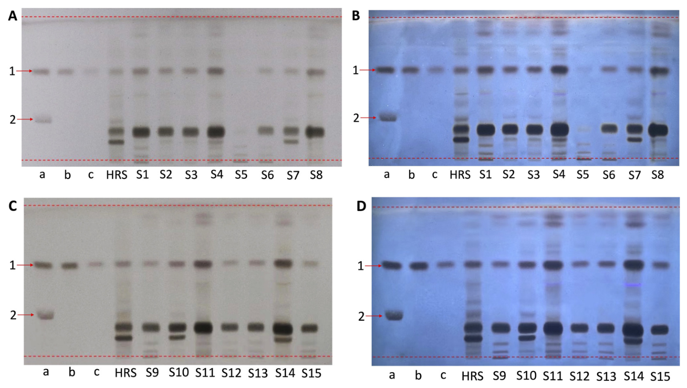
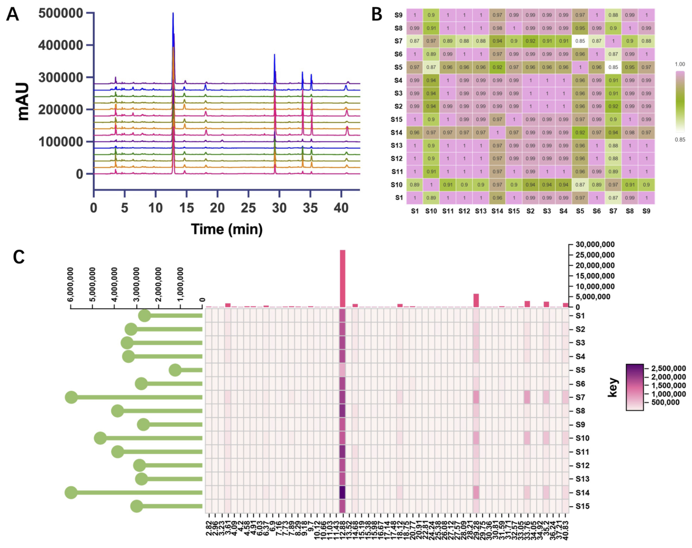
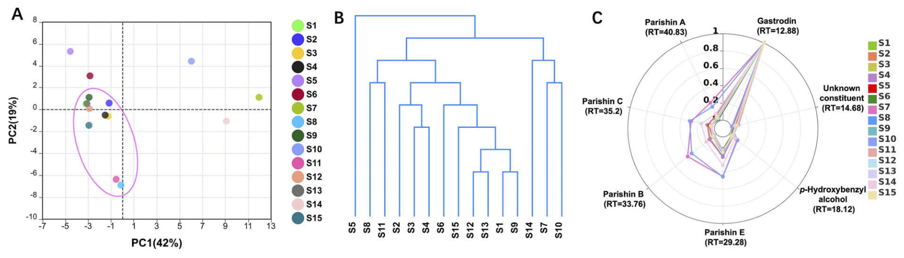

<!-- 方針: ほぼ全訳＋必要に応じた補足。原文構成に沿って訳出。「> 補足:」は訳者注。 -->

## 書誌情報

- 原題: Deutscher Arzneimittel-Codex-aligned multi-dimensional quality assessment of Gastrodiae Rhizoma granules
- 著者: Yin Xiong（責任著者）, Yiwei Wu, Xiaoyan Che, Xiuming Cui, Ryan Gene Hornbeck, Yuefei Geng, Ruoying Wu, Jin Tan（責任著者）, Yindi Zhu（責任著者）（温州医科大学 中医学院／ライデン大学・欧州中医薬天然化合物センター／昆明理工大学／温州肯恩大学／好医生薬業集団）
- 掲載: *Frontiers in Pharmacology* 17 (2026) 1843493（Original Research, オープンアクセス CC BY）. https://doi.org/10.3389/fphar.2026.1843493
- インパクトファクター: **約5.6**（*Frontiers in Pharmacology*／JCR目安。薬理学分野）
- 受理経過: 受領 2026-03-31 / 改訂 2026-04-20 / 受理 2026-04-27 / 公開 2026-05-15
- 資金: 温州医科大学人材研究基金（QTJ24025）ほか
- 生成AIの利用: 著者は文章の推敲にChatGPTを使用し、内容は著者が確認・責任を負うと明記

> 補足（この解説の位置づけ）: この論文の主題は新しい成分の発見ではなく、**「同じ生薬製剤を、国によって異なる薬局方（＝品質のものさし）でどう評価するか」**という規制・薬事寄りのテーマです。中国産の天麻顆粒を、ドイツ薬局方（DAC）／欧州薬局方（EP）の流儀で測り直し、中国国家基準（CNS）との違いを浮き彫りにします。分析技術としては、当サイトで繰り返し登場する **QAMS（単一標準による多成分定量）** と **HPLC指紋＋ケモメトリクス** の実装例です。

> 補足（用語）:
> - **天麻（テンマ, Gastrodiae Rhizoma, GR）** … ラン科オニノヤガラ属 *Gastrodia elata* Blume の乾燥塊茎。頭痛・めまい・けいれんなどに用いられてきた生薬。日本でも漢方処方（半夏白朮天麻湯など）に配合される。
> - **顆粒剤（TCM granules）** … 生薬を煎じ・濃縮・乾燥・造粒した現代的な剤形。煎じ薬より保存・携帯・用量管理がしやすく品質も一定させやすい。「天麻顆粒（GRG）」はその一つ。
> - **DAC（Deutscher Arzneimittel-Codex, ドイツ医薬品法典）** … ドイツの医薬品・医薬品原料の品質評価に使われる規範。生薬分析では欧州薬局方（EP）と整合的で、クロマトの適合性・定義された標準物質・ロット間一貫性を重視する。
> - **CNS（中国国家基準）** … 天麻顆粒については YBZ-PFKL-2021122。

## この論文が解く問題

漢方・中医薬（TCM）の顆粒剤は国際市場でも使われ始めていますが、**国や地域ごとに品質のものさし（規制の枠組み・技術要件・検証基準）が違う**ため、国際登録や受け入れの実務的な障害になっています。とくに次の点で差が出ます。

- 品質指標（どの成分をどう測るか）
- クロマトグラフィーの要件（分離のよさをどう担保するか）
- バリデーション基準（方法をどう検証するか）

ドイツのDACは、生薬分析では欧州薬局方（EP）と整合的で、**クロマトの適合性（system suitability）・定義された標準物質・ロット間一貫性の評価**を特に重んじます。これは、国際流通を意図する中国生薬顆粒の品質評価に、より厳しい要求を課すことになります。

天麻顆粒（GRG）は中国国家基準（CNS）に収載されていますが、CNSとDAC流の要求のあいだには、システム適合性の基準・標準物質の使い方・クロマト特性評価の深さといった点で違いが残ります。

そこで本研究は、**DAC準拠の分析フレームワークを天麻顆粒に対して構築・評価し、CNSと比較する**ことを目的としました。ここでの「DAC準拠（DAC-aligned）」は、法的拘束力のある登録基準をそのまま実装するという意味ではなく、**DAC／EP流の分析上の考え方を取り入れる**という意味です。具体的には次の3つを統合しました。

- **TLC（薄層クロマトグラフィー）** … 特徴成分の同定（本物かの確認）
- **QAMS（単一標準による多成分定量）** … 指標成分の同時定量
- **HPLC指紋** … 化学的な一貫性（ロット間の均質性）評価

> 補足（QAMSとは）: **Quantitative Analysis of Multi-components by a single Marker**。高価な標準品を成分の数だけ揃える代わりに、安価で入手しやすい**1つの標準品（内部標準, IR）**を基準にし、あらかじめ求めておいた**相対補正係数（Relative Correction Factor, RCF）**を掛けて他成分の量に換算する定量法。標準品コストと入手性の問題を回避できるのが利点で、当サイトでは七制香附丸や烏薬などの解説でも登場する。

## 材料と方法

### 試料

中国の複数メーカーの市販天麻顆粒 **15ロット（S1〜S15）** を収集。いずれもロット番号・製造元が特定できる市販品。CNSによれば、天麻顆粒は天麻の飲片を煎じ・濃縮・乾燥・造粒し、必要に応じ賦形剤（多くはマルトデキストリン）を加えて製する。報告されている乾燥エキス収率14〜25%から、生薬-エキス比（DER native）はおよそ4.0〜7.1:1。ロット情報は原論文のTable 1参照（S1〜S4・S8〜S13・S15は広東一方製薬、S5は華潤三九、S6は北京康仁堂、S7・S14は天江薬業）。

### 標準物質・試薬

ガストロジン・p-ヒドロキシベンジルアルコールの標準品と天麻の生薬対照（HRS）は中国食品薬品検定研究院より、パリシンA／B／E・パリシンCは各社より購入（いずれもHPLC純度≥98%）。アセトニトリルはHPLCグレード。

### TLC同定

- **試料液**: GRG 0.1 g をメタノール10 mLで超音波抽出（200 W, 53 kHz, 30分）→ 濾過・蒸発乾固 → メタノール0.5 mLに再溶解。
- **生薬対照液（HRS）**: 天麻HRS 0.3 g を水8 mLで2時間還流抽出 → 濾過・乾固 → メタノール処理を経て0.5 mLに。
- **標準液**: (a) SST用にガストロジン2 mg＋パリシンB 2 mgをメタノール1 mLに、(b) ガストロジン2 mg/1 mL、(c) bを1/4希釈（0.5 mg/mL）。
- **展開条件**: シリカゲル板（Macherey-Nagel, 5×10 cm）。移動相は塩化メチレン／酢酸エチル／メタノール／水＝2:4:2.5:1。8 cm展開後、エタノール中10%硫酸を噴霧し105℃15分加熱。日光下および310 nm紫外光下で観察。

### HPLC分析

- **試料液**: GRG 0.2 g をメタノール-水（30:70）25 mLで超音波抽出（30分）→ 0.22 µm膜濾過。
- **カラム**: 逆相C18-AQ（250 mm×4.6 mm, 5 µm）。移動相A＝0.1%リン酸水、B＝アセトニトリル。グラジエント: 0–16分でB 2→6%、16–22分で6→12%、22–35分で12→18%、35–42分で18→24%、42–43分で24→95%。流速1.0 mL/min、検出220 nm、注入量5 µL。
- **バリデーション**: 特異性・精度（装置精度／併行精度／中間精度）・安定性（0〜36 h）・真度（回収試験, S9に6標準を添加）・直線性／範囲／LOD／LOQを評価。

### QAMSの構築

内部標準（IR）候補として6成分を評価し、RSDが低く・クロマト挙動が安定し・物性が適する成分をIRに選定。RCFは検量線から次式で算出。

> `F(i/s) = (A(i)/C(i)) / (A(s)/C(s)) = (A(i)·C(s)) / (A(s)·C(i))`

ここで F(i/s) はRCF、C(i)・C(s) は分析対象成分と内部標準の濃度、A(i)・A(s) はそれぞれのピーク面積。求めたRCFで各成分濃度 C(i) を換算し、外部標準法（ESM）との差をRSDで比較して妥当性を検証した。

### HPLC指紋とケモメトリクス

- 保持時間（RT）許容±0.2分でピーク整列し、0〜43分に**58ピーク**を同定。うち安定・良好・全ロットで一貫して現れる**7ピーク**（RT=12.88, 14.68, 18.12, 29.28, 33.76, 35.20, 40.83分）を特徴ピークに選定。標準品との対比で、ガストロジン（12.88）・p-ヒドロキシベンジルアルコール（18.12）・パリシンE（29.28）・B（33.76）・C（35.20）・A（40.83）と同定（14.68は未同定）。
- ロット間類似度は**コサイン類似度係数**で評価（1.00に近いほど類似）。ピーク面積のヒートマップも作成。
- ケモメトリクス: **PCA**（次元圧縮とクラスタリング可視化）、**HCA**（ユークリッド距離・Ward法でデンドログラム）、**レーダー図**（特徴7ピークの正規化分布）。

## 結果

### TLC同定

システム適合性試験（SST）はガストロジンとパリシンBの混合標準液で実施。両者のRf値はおよそ0.60と0.27で、確立した条件下で明瞭に分離した。ガストロジンを主指標に用い、標準液とその1/4希釈で明確に異なるバンド強度が得られ、天麻HRSも良好に分離した特徴バンドを示した。全ロットがガストロジン標準バンドと一致する位置にバンドを示し、大半のロットの主要バンドパターンは天麻HRSと一致した。

一部にロット間・メーカー間の差も見られた。広東一方製薬のロットはおおむね似たパターンだったが、他メーカー（S5〜S7・S14など）は副次バンドの強度・分布に軽微な差を示し、**S5は他ロットよりTLC応答が明らかに弱かった**。

### HPLC分析

- **SST**: 確立した条件下でパリシンBとパリシンCの分離度は4.5超で、EP/DACガイドラインの最低要件（1.5）を大きく上回った。
- **バリデーション**（原論文Figure 2）: 特異性は良好（ブランクに妨害ピークなし、6標準が明瞭に分離）。装置精度・併行精度・中間精度のRSD、安定性（36 hまで）、真度（回収）はいずれも許容範囲。直線性は6成分すべて良好（下のTable 2）。

**Table 2. 6標準物質の検量線・直線範囲・LOD・LOQ（n=6）**

| 成分 | 回帰式 | R² | 直線範囲 (mg/mL) | LOD (mg/mL) | LOQ (mg/mL) |
|---|---|---|---|---|---|
| ガストロジン | y = 6744078x + 24495 | 0.9995 | 0.02〜0.6 | 0.0163 | 0.0494 |
| p-ヒドロキシベンジルアルコール | y = 12307694x + 679.5 | 0.9997 | 0.0006〜0.018 | 0.0004 | 0.0012 |
| パリシンE | y = 6060054x + 2441 | 0.9996 | 0.0045〜0.135 | 0.0033 | 0.0099 |
| パリシンB | y = 8001789x − 672.8 | 0.9998 | 0.0013〜0.039 | 0.0006 | 0.0019 |
| パリシンC | y = 8268232x − 554.8 | 0.9995 | 0.001〜0.03 | 0.0008 | 0.0026 |
| パリシンA | y = 8728848x + 1209 | 0.9998 | 0.001〜0.03 | 0.0006 | 0.0017 |

### QAMSの構築

7濃度でRCFを算出。各成分を内部標準にしたときのRCFのRSDは、ガストロジン1.30〜2.92%、p-ヒドロキシベンジルアルコール1.51〜3.66%、パリシンE 1.30〜2.50%、B 1.05〜4.09%、C 1.04〜3.92%、A 2.24〜4.22%で、どれをIRにしてもRCFはおおむね安定していた。ESMとQAMSの差は有意でなく、6成分いずれも原理的にIRとして使えることが確認された。

その中で**ガストロジンを最終的な内部標準に選定**。理由は、天麻の主要特徴成分であり、構造が安定・標準品が入手しやすく安価で、既報のQAMS研究やCNSでも内部標準に採用されてきたため。ガストロジンをIRとしたときの平均RCFは、p-ヒドロキシベンジルアルコール0.5581、パリシンE 1.1259、B 0.8781、C 0.8481、A 0.7739で、5成分ともRCF偏差は3%未満だった。

15ロットをESMとQAMSの両方で定量したところ、相関散布図（原論文Figure 4A–F）の点は回帰直線とよく一致し、R²＝0.999〜1.000。QAMSによる定量では、**ガストロジンが最も多く（1.381〜5.312%）**、以下パリシンE（0.504〜1.902%）、B（0.066〜1.348%）、C（0.071〜0.859%）、A（0.037〜0.660%）の順。p-ヒドロキシベンジルアルコールは低く、大半のロットで0.1%未満だった。6成分合計では、15ロット中14ロットが3.5%超だった。

### HPLC指紋とケモメトリクス

コサイン類似度では大半のロットが0.95超を示した。ただし**S7・S10は他ロットに対し0.95未満に落ちる組合せがあり、S5はS7との類似度が最も低かった**。ピーク面積ヒートマップでは、S7・S10・S14が後半溶出ピークで比較的強い応答を、S5は広い範囲で弱い信号を示した。

PCAでは第1・第2主成分が全分散の42%・19%を説明。大半のロットは密に集まり、**S5・S7・S10・S14が主集団から分離**した。HCAデンドログラムもPCAと整合的で、S5は独立した枝に位置し（類似度が低く信号も弱いことと一致）、S7・S8・S10は近縁のサブクラスタにまとまった。レーダー図では全ロットでガストロジンが支配的だが、残り成分では顕著なロット間差が見られ、S5などは狭く縮んだ形、S7・S14は後半溶出領域で広く張った形を示した。

## 考察の要点

### DAC準拠のTLC（SSTと同定）

「DAC準拠」とは、TLC・HPLC双方での明示的なSST・段階希釈したTLC標準液・複数成分×複数ロットの統合的評価といった、DAC/EP流の分析要素を取り入れることを指す。

- **SSTの考え方の違い**: EP/DAC枠組みでは、**似たRf値をもつ2物質**を（試料に含まれるか否かに関わらず）SSTマーカーとして入れ、その条件での分離能を評価することを重視する。一方、中国薬局方（ChP）流はこうしたペアマーカーSSTをあまり重視せず、規定Rf範囲内のスポット分布の妥当性に主眼を置く。本研究ではガストロジンとパリシンBが明瞭に分離し、EP/DACの適合性期待を満たした。
- **標準液設計の違い**: ChP/CNSは単一濃度の標準液でスポット比較するのに対し、EP/DAC流は**段階希釈標準液**で強度とクロマト性能を濃度域にわたり評価する。加えて生薬顆粒では、原料生薬のエキスまたは生薬対照（HRS）との比較が、顆粒の特徴が宣言された生薬材料と一致するかの評価に重要。本研究の2濃度ガストロジン標準液は明確に異なるバンド強度を示し、HRSとの一致から、顆粒が宣言された生薬起源とおおむね整合することが確認された。

ただしTLCは定性情報が主で化学的分解能に限りがあるため、ロット間の組成差の詳細評価にはHPLC定量と指紋が必要、と位置づけられる。

### DAC準拠のHPLC条件

CNSが超高速液体クロマト（UHPLC）を採るのに対し、本研究は**汎用HPLC**を用いた。これは、薬局方・品質管理の実験室で広く普及するHPLCの方が、方法の実用性・移管性（他施設での再現性）に優れるという判断による。EP/DAC枠組みのSSTは、対象成分と**構造が既知の隣接ピーク**との分離度で評価するのが原則で、隣接ピークが未知構造では適合性評価に使えない（複雑な生薬マトリクスでの信頼性確保に重要）。本研究ではパリシンBとCの高い分離度がこれを満たした。

### QAMSの適用可能性

QAMSの核心はIRと各成分の間に安定なRCFを確立すること。判定はRSDに基づき（一般にRSD<5%ならRCFへの誤差影響が小さい）、本研究のRCFはどの成分をIRにしても安定していた。ガストロジンをIRとしたRCF偏差はすべて3%未満で、GRGの多成分同時定量へのQAMSの適用可能性を支持した。ロットごとに主要成分は一貫して検出されるが相対量は変動し、**単一指標だけではロット間の組成差を十分に反映できない**ため、多成分定量が必要と示された。

### 指紋とケモメトリクスが明かすロット差

指紋分析は、単一・少数指標の定量より広い組成変動（未同定だが関連しうる成分の差を含む）を捉えた。大半のロットは似た化学プロファイルを共有したが、**S5・S7・S10・S14**は測定可能な組成のずれを示した。とくに**S5はTLC応答・定量含量・指紋ピーク強度のすべてで最も顕著に低下**しており、原料生薬の質の低さや抽出・製造工程の差を示唆する。ただし分析対象は完成顆粒で、DER nativeや賦形剤情報が全ロットで一様には得られないため、原料生薬の薬局方適合性についての確定的結論は出せない。S5の観察は「調べた市販ロット群の中での顕著な化学的逸脱」を示す証拠であって、製品の規制上の合否判定ではない、と慎重に位置づけられている。

> 補足（サンプリングの限界）: 広東一方製薬のロットは相互に高い類似度を示したが（S10を除く）、メーカー数が限られ試料分布も偏るため、市場全体やメーカー別の品質特性についての広い結論は導けない、と著者自身が明言している。より多くのメーカー・ロットでの追試が今後の課題。

### DAC準拠アプローチとCNSの比較

**Table 3. 現行CNSと本研究のDAC準拠アプローチの比較（天麻顆粒）**

| 分析項目 | 現行CNS | 本研究のDAC準拠アプローチ |
|---|---|---|
| TLC標準系 | HRSと標準物質で同定 | HRSと標準物質に加え、DAC/EP流に段階希釈標準液を重視 |
| TLC強度評価 | 主にCNS条件下の規定比較 | 主・希釈標準液で濃度域にわたるバンド強度・応答を評価 |
| TLC SST | 同定条件は規定するがペアマーカーSSTの明示は弱い | 化学的に定義された2マーカー（ガストロジン・パリシンB）で分離を検証 |
| HPLCプラットフォーム | UHPLC（CNS規定条件） | 汎用HPLC（適用範囲・移管性を優先） |
| HPLC SST | ガストロジンで理論段数≥5,000を明示要求 | 構造が定義された隣接成分（パリシンB・C）間の分離度を重視 |
| 定量戦略 | CNSにQAMSベースの多成分定量を含む | 同じくQAMS、ただし明示的SST＋指紋評価と統合したDAC準拠戦略の一部 |
| 含量表現 | 6成分合計を43.0〜80.0 mg/gの範囲で規定 | 6成分合計を%で記述（大半のロットで>3.5%、比較のための記述的観察） |
| ロット一貫性評価 | 主に基準ベースの同定・定量 | HPLC指紋＋ケモメトリクスで多ロットの化学的一貫性を追加評価 |

これらの違いは、品質目標が根本的に異なるのではなく、**分析の重点と規制実務の差**を反映する。CNSは日常の国内品質管理に実用的な枠組みを提供し、DAC準拠戦略はクロマトの適合性と多次元特性評価をより重視する。両者は相補的であり、国際流通を意図する生薬顆粒では、こうした基準間の比較が「薬局方ごとに分析上の期待がどう違うか」を理解するうえで特に有用、と結論づけている。

## 結論

本研究は、TLC同定・QAMSベースの多成分定量・HPLC指紋を基礎に、天麻顆粒（GRG）のDAC準拠分析戦略を構築・評価した。TLCは特徴成分の定性同定に適し、QAMSはガストロジンを内部標準に6成分の信頼できる同時定量を可能にし、HPLC指紋はロット間一貫性評価に再現性ある化学プロファイルを与えた。統合アプローチは天麻顆粒の多次元品質評価に有効である。CNSと比べ、DAC準拠戦略はクロマトの適合性と包括的な成分特性評価をより重視する。本研究は、基準間の比較と、異なる規制環境下での生薬顆粒の品質評価アプローチの調和（ハーモナイゼーション）に向けた実用的な参照を提供する。

## 訳者補足

- **なぜ「DAC準拠」がQC研究として面白いか**: 同じ天麻顆粒でも、中国基準（CNS）は「理論段数≥5,000」「合計含量43〜80 mg/g」のように**数値スペックを規定**するのに対し、DAC/EP流は「似たRf値の2物質で分離を実証せよ」「隣接ピークは既知構造でなければSSTに使えない」のように**クロマトが妥当に働いていることの証明手続き**を重視します。ものさしの思想差を、実データで対比して見せたのが本研究の眼目です。
- **QAMSの実務的うまみ**: パリシンA/B/C/Eの標準品を毎回そろえるのは高価で入手も不安定。ガストロジン1本さえあれば、RCF（0.5581〜1.1259）を掛けるだけで5成分を換算できる——本研究はその換算が外部標準法と有意差なく（RCF偏差<3%）成立することを示しました。当サイトの[QAMS総説](qams-single-marker-review)や他のQAMS適用例と併せて読むと、手法の一般性が見えます。
- **多次元評価が単一指標に勝る場面**: S5は「ガストロジン含量」だけ見ても低めですが、TLCの弱いバンド・指紋全体の低信号・PCA/HCAでの分離まで揃って初めて「このロットは全体的に薄い（原料か製造の問題）」と確信できます。単一マーカー依存の限界を具体例で示した点が、Q-marker・指紋の思想（[Q-marker確立アプローチ](qmarker-establishment-approach-review) など）と地続きです。
- 図はいずれも原論文（Xiong et al., 2026, Front. Pharmacol., CC BY）より。数値・含量・回帰式・比較表はすべて原文どおりで、訳者による加工はありません。
