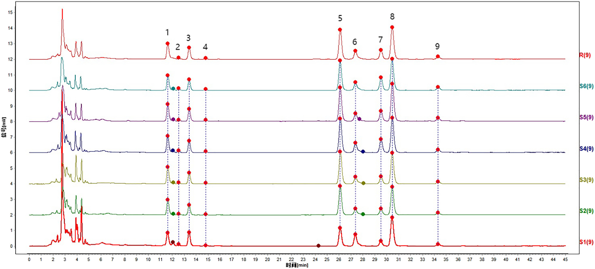
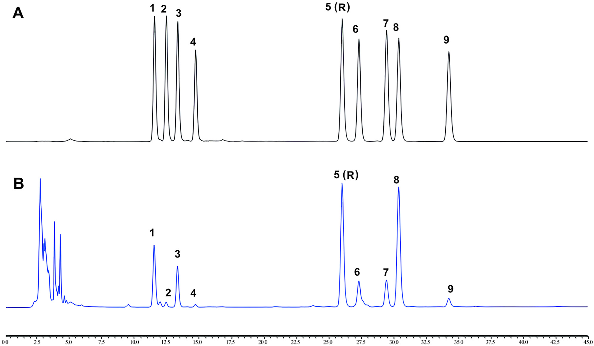
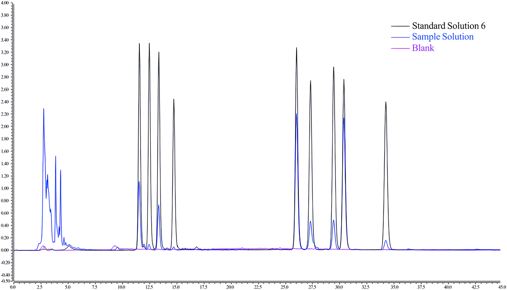
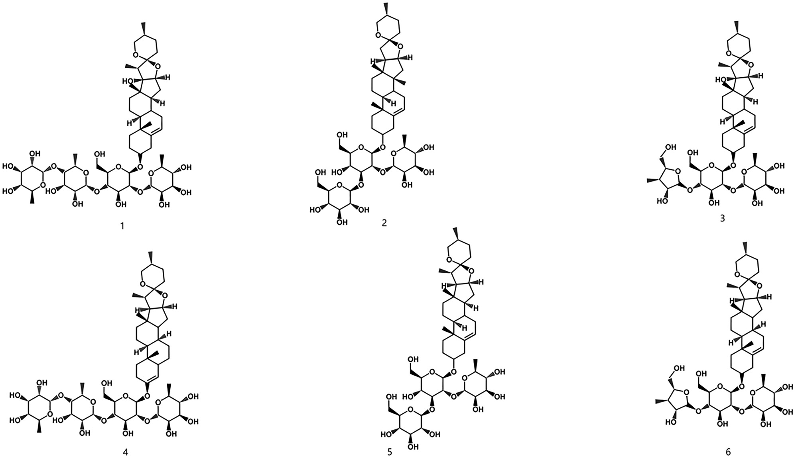
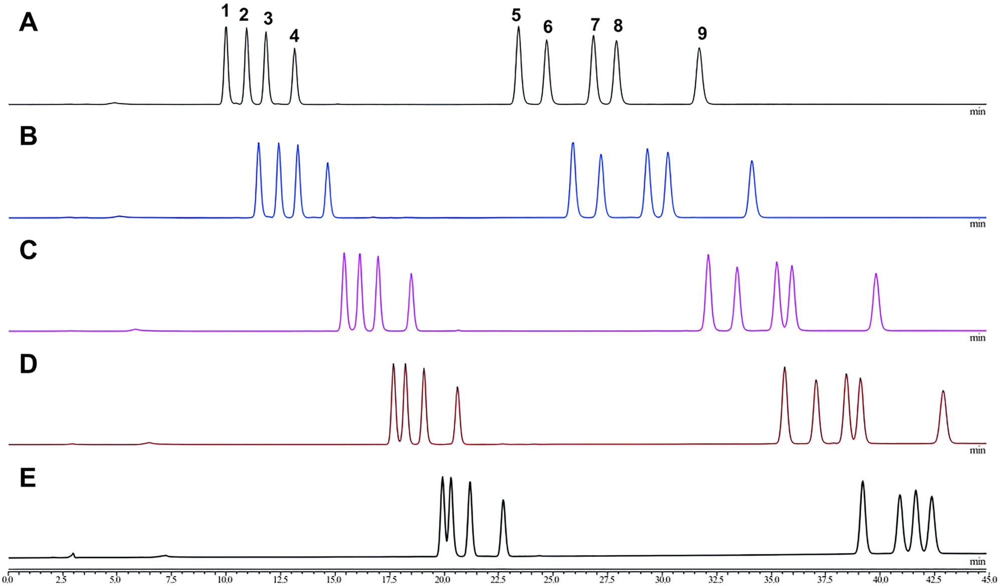
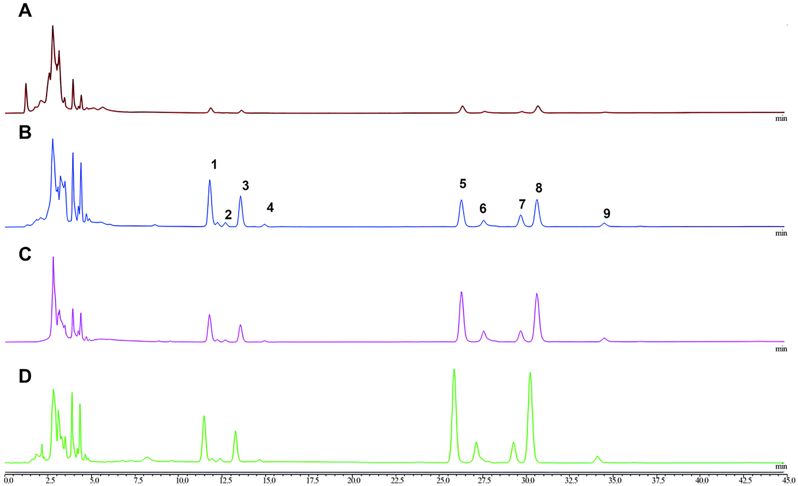

<!-- 方針: ほぼ全訳＋必要に応じた補足。原文の構成に沿って訳出。「> 補足:」は訳者注。 -->

## 書誌情報

- 原題: Simultaneous chemical fingerprint and quantitative analysis of saponins in Gongxuening capsule by HPLC-CAD
- 著者: Yang Lou†, Yutian Wang†, Mengting Lai, Shuyang Li, Mingran Dong, Hongwei Xue, Xi Chen*, Juan Lu*, Ruiping Chai*（†同等貢献、*責任著者）。所属: 中国医学科学院・北京協和医学院 薬用植物研究所（Institute of Medicinal Plant Development, Chinese Academy of Medical Sciences, Peking Union Medical College, 北京, 中国）、Thermo Fisher Scientific (China) Co., Ltd（北京, 中国）
- 掲載: *Acta Chromatographica*, DOI: https://doi.org/10.1556/1326.2025.01389（オープンアクセス, CC BY-NC 4.0）
- インパクトファクター: **要確認**（*Acta Chromatographica*。複数の二次情報源(BioxBio, wos-journal.info等)で直近のJCR値として1.55〜1.7の異なる数値が示され、Clarivate公式ページにも到達できなかったため、本稿執筆時点では正確な値を確定できず「要確認」とする。参考までに近年の推移として2021年 2.011、2022年 1.94程度との報告あり）
- 受理経過: 受領 2025-07-03 / 受理 2025-12-30
- 資金: CAMS Innovation Fund for Medical Science（CIFMS, grant no. 2022-I2M-1-018）、雲南省 Innovation Guidance and Technology-oriented Enterprise Cultivation Plan（202404BI090001）
- 利益相反: 著者らは開示すべき利益相反はないと申告
- 謝辞: 原料の提供について雲南白薬集団（Yunnan Baiyao Group Co., Ltd）に謝意

> 補足: GXN = 功血寧（Gongxuening）カプセル。婦人科疾患（月経過多、産後・流産後の出血、機能性子宮出血など、血熱を伴う症候）に用いられる中国の中成薬。主原料は中国薬局方2020年版に規定される「重楼（Rhizoma Paridis）」——*Paris polyphylla* Smith var. *yunnanensis* (Franch.) Hand.-Mazz.（ユリ科）の乾燥根茎——を70%エタノールで抽出したもの。RPS = Rhizoma Paridis Saponins（重楼サポニン類）。CAD = Charged Aerosol Detector（荷電化エアロゾル検出器）。PPI〜PPVII等は各ポリフィリン(polyphyllin)類の略号（本文参照）。

## 要旨（Abstract）

**背景**: 功血寧(GXN)カプセルは中国で婦人科疾患の治療に広く用いられる中成薬である。現行の検出法は、本剤の複雑な化学組成のため制約があり不十分である。サポニン成分は極性の範囲が広く、低波長紫外吸収での応答が弱いうえ、多数の妨害ピークが存在するため、有効成分の正確な定量が困難である。

**目的**: 本研究は、高速液体クロマトグラフィーと荷電化エアロゾル検出器(HPLC-CAD)を組み合わせてGXNのクロマトグラフィー指紋を確立し、主要成分を定量分析することを目的とする。

**方法**: Acclaim C30カラム（3 mm×250 mm, 3 μm）を用い、アセトニトリル(A)と水(B)の混合液を移動相としたグラジエント溶出（0–5 min, 40% A; 5–20 min, 40–45% A; 20–35 min, 45–50% A; 35–45 min, 50% A）でクロマトグラフィー分離を行った。流速は0.4 mL/minに維持し、カラム温度は10℃とした。注入量1 μL、サンプリング周波数5 Hz、フィルタ定数3.6 s、噴霧化温度50℃とした。6ロットのGXNについてクロマトグラフィー指紋を作成しその類似性を確立した。さらに主要成分の定量を行い含量を決定した。

**結果**: GXNのHPLCクロマトグラフィー指紋を確立し、9個の共通ピークを同定した。6ロットの試料は0.960を超える高い類似性を共有した。ポリフィリンI(PPI)、ポリフィリンII(PPII)、ポリフィリンVII(PPVII)、ポリフィリンD(PPD)、ポリフィリンH(PPH)、グラシリン(gracillin)は、対応する濃度範囲でピーク面積との間に良好な直線性を示した。相関係数は0.999を超え、本法の回収率は98.56〜101.50%の範囲、RSD値は2.0%未満であった。

**結論**: 開発した分析法は広い適用性・高感度・優れた再現性・高い信頼性を示し、GXN中の複雑な重楼サポニン(RPS)の検出・品質管理に適する。

**キーワード**: Gongxuening capsule; high performance liquid chromatography; charged aerosol detector; fingerprints; *Rhizoma Paridis* Saponins

## 1. 緒言（Introduction）

功血寧(GXN)カプセルは広く用いられる中国の中成薬であり、婦人科領域で様々な病態の治療に頻用される。その薬効は、止血作用による出血の軽減、炎症性メディエーターの抑制による抗炎症作用、鎮痛作用を含む。GXNは主に、出血性疾患、月経過多、産後・流産後の不調、血熱を伴う機能性子宮出血を呈する患者に投与される。また、湿熱の停滞により増悪する下腹部痛・腰仙部痛・骨盤内炎症にも用いられる。GXNの主成分は、中国薬局方2020年版において、*Paris polyphylla* Smith var. *yunnanensis* (Franch.) Hand.-Mazz.（ユリ科）の乾燥根茎を70%エタノールで抽出したものと規定されている。

本植物はステロイドサポニンをはじめとする多様な活性化合物を含み、72種の特異的なステロイドサポニン成分が単離されている。主要な活性成分には、ポリフィリンI(PPI)、ポリフィリンII(PPII)、ジオスシン(dioscin)、ポリフィリンV(PPV)、ポリフィリンVI(PPVI)、ポリフィリンVII(PPVII)、ポリフィリンH(PPH)、ポリフィリンD(PPD)、グラシリン(gracillin)が含まれる。中国薬局方2020年版では、PPI・PPII・PPVIIが重楼生薬（*Rhizoma Paridis*）の化学マーカーとして、PPVII・PPD・PPHがGXNの化学マーカーとして規定されている。しかし現時点で、重楼生薬とGXNの両方でこれらの化学マーカーを同時に定量できる検出法は存在しない。

GXNの需要はその臨床的有効性の実証に支えられている。しかし経済的制約、人工栽培の困難さ、生育に長期間を要することから、野生の*P. polyphylla* var. *yunnanensis*の大規模な採取が行われてきた。その結果、GXNの原料供給は不足し、*Paris L.*属の他種による混同・代用という問題が生じている。これらの植物間には顕著な差異があるため、GXNの薬効物質基盤研究に立脚した迅速かつ包括的な化学組成分析が不可欠である。

UV検出器は、末端吸収波長での吸光度への感度の高さゆえに、精度・安定性の問題に直面することが多い。これに対応する形で、半揮発性・不揮発性analyte（フラクトオリゴ糖やサポニンなど）に対する高感度・安定性から、荷電化エアロゾル検出器(CAD)が有望な代替法として台頭している。CADは蒸発光散乱検出(ELSD)と同様に質量ベースの検出に依拠するが、より高い感度と優れた再現性を提供する。これらの利点から、CADは中薬の品質管理での使用が増加している。GXN・重楼はよく知られた中国の医薬品であり、その分析検出法の開発に関する研究は多い。従来のUPLC-MS/MS・HPLC-PDA・LC-MSといった方法には、コスト・末端吸収・クロマトグラフィーピーク情報の欠落といった限界があった。そこで、本研究材料に対する正確かつ包括的な分析を提供する新規HPLC-CAD法を提案する。

中薬の分析は、全体的な品質を正確に評価するための多様な化学成分の包括的な検討を伴う。これに対応するため、我々はHPLC-CAD技術を用いてGXNのクロマトグラフィー指紋を確立し、PPVII・PPD・PPH・PPII・グラシリン・PPIを定量分析した。信頼性の高い医薬品品質評価法の開発には、結果の正確性と再現性を保証する方法論的検討が不可欠である。本研究では、規制基準を満たし、安全性と一貫性を確保するため、体系的な分析法バリデーションのアプローチを採用した。このアプローチは、GXN中の複数成分の品質管理を確実にする有効な手段を提供する。

## 2. 材料と方法（Materials and Methods）

### 2.1 クロマトグラフィーシステム

四元ポンプ・オートサンプラー・カラム恒温槽・荷電化エアロゾル検出器を備えたVanquish Flex超高速液体クロマトグラフィーシステム（Thermo Fisher Technology Co., Ltd, 北京, 中国）を使用した。Acclaim C30カラム（3 mm×250 mm, 3 μm）はThermo Fisher Technology Co., Ltd（北京, 中国）から購入した。電子分析天秤（MS105DU1A）とは超音波洗浄機（SB25-12DT）は、それぞれMettler Toledo Technology Co., Ltd（上海, 中国）とNingbo Xinzhi Biotechnology Co., Ltd.（寧波, 中国）から入手した。

### 2.2 試薬

PPI（バッチNo. 230226; CAS No. 50773-41-6; カタログNo. TZT035）、PPII（バッチNo. 230516; CAS No. 50773-42-7; カタログNo. TZT036）、PPV（バッチNo. 230520; CAS No. 19057-67-1; カタログNo. TZT041）、PPVI（バッチNo. 230420; CAS No. 55916-51-3; カタログNo. TZT038）、PPVII（バッチNo. 230427; CAS No. 68124-04-9; カタログNo. TZT039）、PPD（バッチNo. 230903; CAS No. 90308-85-3; カタログNo. TZT327）、PPH（バッチNo. 230903; CAS No. 81917-50-2; カタログNo. TZT040）、グラシリン（バッチNo. 230106; CAS No. 19083-00-2; カタログNo. TZT046）、ジオスシン（バッチNo. 230317; CAS No. 19057-60-4; カタログNo. TZT037）の対照品（純度≥98%）はShanghai Ronghe Pharmaceutical Technology Development Co., Ltd（上海, 中国）から購入した。

GXN（バッチNo. ZHC2301, ZCC2101, ZDC2302, ZKC2301, ZJC2301, ZJC2302）は雲南白薬集団（Yunnan Baiyao Group Co., Ltd, 雲南, 中国）から、HPLCグレードのメタノール（バッチNo. F24O1O201; CAS No. 67-56-1）とアセトニトリル（バッチNo. F23NCE202; CAS No. 75-05-8）はThermo Fisher Technology Co., Ltd（北京, 中国）から、水（バッチNo. 20230625）はTianjin Wahaha Hongzhen Beverage Co., Ltd（天津, 中国）から、それぞれ入手した。

### 2.3 標準ストック溶液と試料溶液の調製

**2.3.1 試料溶液**: GXNの内容物を十分に混合・粉砕し、約0.1 gを精密に秤取した。栓付き三角フラスコに入れ、メタノール10 mLを加えた。フラスコを密栓し重量を記録した。超音波処理（250 W, 25 kHz）を15分間行い、放冷後に再秤量した。減少した重量をメタノールで補い、よく振り混ぜた。ろ過後、ろ液を10倍希釈した。最終的に0.22 μmの有機膜でろ過して試料溶液とした。

**2.3.2 対照品溶液**: PPVII・PPD・PPH・PPVI・PPII・ジオスシン・グラシリン・PPI・PPVを精密に量り、メタノールに溶解して以下の濃度のストック溶液を調製した: PPVII 573.75 μg/mL、PPD 640.00 μg/mL、PPH 558.75 μg/mL、PPVI 499.00 μg/mL、PPII 671.25 μg/mL、ジオスシン 500.00 μg/mL、グラシリン 583.75 μg/mL、PPI 697.50 μg/mL、PPV 505.00 μg/mL。

指紋分析用の標準作業溶液: PPVII 57.37 μg/mL、PPD 64.00 μg/mL、PPH 55.88 μg/mL、PPVI 49.90 μg/mL、PPII 67.13 μg/mL、ジオスシン 50.00 μg/mL、グラシリン 58.38 μg/mL、PPI 69.75 μg/mL、PPV 50.50 μg/mL。

定量分析用には、混合溶液を適宜希釈して以下の濃度とした: PPVII 91.80 μg/mL、PPD 102.40 μg/mL、PPH 89.40 μg/mL、PPII 93.40 μg/mL、グラシリン 111.60 μg/mL、PPI 107.40 μg/mL。この混合標準溶液をメタノールで段階希釈し、標準作業溶液のシリーズを作成した。

### 2.4 HPLC-CAD分析

HPLC-CAD分析はAcclaim C30カラム（3 mm×250 mm, 3 μm）で実施した。分離は移動相アセトニトリル(A)・水(B)によるグラジエント溶出で行い、比率は次のとおり変化させた: 0–5 min, 40% A; 5–20 min, 40–45% A; 20–35 min, 45–50% A; 35–45 min, 50% A。流速0.4 mL/min、カラム温度10℃、注入量1 μL、噴霧化温度モード50℃、フィルタ定数3.6 s、収集周波数5 Hzとした。

### 2.5 クロマトグラフィー指紋の確立と類似性評価

6ロットの試料を収集し、2.3.1節の方法に従って6ロット分のGXN試料溶液を調製した。上記のクロマトグラフィー条件下で試料を注入・分析し、クロマトグラムを記録した。類似性解析は、国家薬局方委員会（National Pharmacopoeia Committee）が開発した専門ソフトウェア「中薬クロマトグラフィー指紋類似性評価システム（Similarity Evaluation System of Traditional Chinese Medicine (TCM) Chromatographic Fingerprint、2012年版）」により実施した。本システムは各試料の指紋と対照指紋クロマトグラムとの類似性を算出する。

### 2.6 指紋の分析法バリデーション

**2.6.1 精度試験**: GXN（バッチNo. ZDC2302）を2.3.1節の方法で調製した。2.4節のクロマトグラフィー条件で6回連続注入した。各クロマトグラムのピークの保持時間とピーク面積を記録し、各共通ピークと内部基準ピークとの相対保持時間(RRT)・相対ピーク面積(RPA)を算出した。

**2.6.2 再現性試験**: 同一ロットのGXN（バッチNo. ZDC2302）を用い、2.3.1節の方法で6個の試料溶液を調製した。2.4節のクロマトグラフィー条件で分析し、各ピークの保持時間・ピーク面積を記録した。各共通ピークと内部基準ピークとのRRT・RPAを算出した。

**2.6.3 安定性試験**: 同一ロットのGXN（バッチNo. ZDC2302）を用い、2.3.1節の方法で試料溶液を調製した。2.4節のクロマトグラフィー条件下で、0, 2, 4, 6, 8, 12, 24時間の7つの異なる時点で注入し、各ピークの保持時間・ピーク面積を記録した。各共通ピークと内部基準ピークとのRRT・RPAを算出した。

### 2.7 定量分析のバリデーション

**2.7.1 システム適合性**: 2.4節のクロマトグラフィー条件で試料を注入し、標準作業溶液（PPVII 55.08 μg/mL、PPD 61.44 μg/mL、PPH 53.64 μg/mL、PPII 56.04 μg/mL、グラシリン 66.96 μg/mL、PPI 64.44 μg/mL）とバッチNo. ZDC2302の試験品溶液のクロマトグラムを記録した。6成分（PPVII・PPD・PPH・PPII・グラシリン・PPI）の分離度、理論段数、テーリング係数、シグナルノイズ比を算出した。

**2.7.2 直線性**: 一連の標準作業溶液を2.4節のクロマトグラフィー条件で分析した。試料の質量濃度を横軸(X)、ピーク面積を縦軸(Y)として検量線を作成し、回帰式を導出して直線性を解析した。

**2.7.3 感度**: 1種類の標準作業溶液（PPVII 1.54 μg/mL、PPD 1.72 μg/mL、PPH 1.50 μg/mL、PPII 1.57 μg/mL、グラシリン 1.87 μg/mL、PPI 1.80 μg/mL）を2.3.2節に従い希釈し、2.4節のクロマトグラフィー条件下で注入して定量限界(LOQ)・検出限界(LOD)を決定した。本製品のLOD・LOQは、それぞれシグナルノイズ比3および10の条件で確立した。

**2.7.4 精度試験**: 作業溶液（PPVII 2.57 μg/mL、PPD 2.87 μg/mL、PPH 2.50 μg/mL、PPII 2.61 μg/mL、グラシリン 3.12 μg/mL、PPI 3.01 μg/mL）を2.4節のクロマトグラフィー条件で6回連続注入した。6成分の含量を測定し、相対標準偏差(RSD)値を算出した。

**2.7.5 再現性試験**: 同一ロットのGXN（バッチNo. ZDC2302）を用い、2.3.1節と同様の手順で6個の試料溶液を同時に調製した。2.4節のクロマトグラフィー条件で注入・分析し、測定対象6成分の含量を決定してRSD値を算出した。

**2.7.6 安定性試験**: 同一ロットのGXN（バッチNo. ZDC2302）を用いて試験した。試料溶液を2.3.1節の手順で調製し、2.4節のクロマトグラフィー条件で0, 2, 4, 6, 8, 12, 24時間に注入・分析した。分析中、測定対象6成分の含量を決定しRSD値を算出した。

**2.7.7 試料回収率試験**: 各成分の既知量（各約0.05 g）を含む6個の試料（バッチNo. ZDC2302）をエルレンマイヤーフラスコに秤取した。6種の標準品の適量を試料に正確に添加した。2.3.1節の増量手順に従い、試験品溶液濃度の100%となるよう試料回収を行った。2.4節のクロマトグラフィー条件で含量を決定し、6種RPSの回収率とRSD値を算出した。

### 2.8 試料の同定

規定のクロマトグラフィー条件に従い、6ロットのGXN溶液を注入・分析した。ピーク面積に基づく外部標準法により、GXN 6成分の含量を決定した。

## 3. 結果（Results）

### 3.1 指紋の確立と類似性評価

**3.1.1 HPLC-CAD指紋分析**: HPLC-CAD法を用いて6ロットのGXNの指紋を作成した。2.4節の規定クロマトグラフィー条件に基づき試料を注入し、203 nmでのクロマトグラムを記録した。指紋解析は、ソフトウェア「TCM Chromatographic Fingerprint Similarity Evaluation System（2012.130723版）」で行った。実施にあたり、異なる試料のクロマトグラムを標準化する必要があった。標準化プロセスには、クロマトグラム中の「共通ピーク」の選択と、全共通ピークの保持時間の正規化が含まれる。類似性評価では、時間窓幅0.1 minの中央値法(median method)を用い、S1を対照クロマトグラムとした。多点補正のため9個の共通ピークを選定し、Mark peak matchingによりピークマッチングを行った。GXNの指紋と対照指紋(R)を作成した（下図参照）。

標準作業溶液と試料溶液の両方について、2.4節のクロマトグラフィー条件下で検討した。指紋には合計9個の共通ピークが記された。これらのピークは次のとおりラベル付けされた: PPVII（ピーク1）、PPD（ピーク2）、PPH（ピーク3）、PPVI（ピーク4）、PPII（ピーク5）、ジオスシン（ピーク6）、グラシリン（ピーク7）、PPI（ピーク8）、PPV（ピーク9）。

6ロットのGXNの含量を検討した結果、PPII（ピーク5）に対応するクロマトグラフィーピークは、ピーク面積が大きく、中間位置に一貫して存在し、6ロット全ての試料で良好な分離を示したことから、基準ピークとして選定された。以降、他の共通ピークの相対保持時間・相対ピーク面積は、この基準ピーク(PPII)を基準として算出し、比較解析・定量に用いた。

**3.1.2 類似性解析**: 6ロットのGXNの内容物の指紋の類似性を、中央値法と多点補正法により評価した（Table 1）。結果は0.960を超える類似性指数を示した。これは、異なるロット間でのGXN指紋のばらつきが最小限であることを示唆し、分析対象試料全体で組成・品質が一貫していることを裏付ける。

**Table 1. GXN異なるロット由来6試料の指紋類似度**

| ロットNo. | ZCC2102 | ZDC2302 | ZHC2301 | ZJC2301 | ZJC2302 | ZKC2301 | 対照指紋 |
| --- | --- | --- | --- | --- | --- | --- | --- |
| ZCC2102 | 1.000 | 0.960 | 0.960 | 0.963 | 0.964 | 0.964 | 0.973 |
| ZDC2302 | 0.960 | 1.000 | 1.000 | 0.993 | 0.997 | 0.990 | 0.997 |
| ZHC2301 | 0.960 | 1.000 | 1.000 | 0.994 | 0.996 | 0.991 | 0.997 |
| ZJC2301 | 0.963 | 0.993 | 0.994 | 1.000 | 0.995 | 1.000 | 0.998 |
| ZJC2302 | 0.964 | 0.997 | 0.996 | 0.995 | 1.000 | 0.995 | 0.998 |
| ZKC2301 | 0.964 | 0.990 | 0.991 | 1.000 | 0.995 | 1.000 | 0.997 |
| 対照指紋 | 0.973 | 0.997 | 0.997 | 0.998 | 0.998 | 0.997 | 1.000 |

> 補足: ロットNo.表記は原文どおり（Table1見出しは「ZCC2102」だが、他所ではGXNロットは「ZCC2101」と表記されており、原文内で表記揺れがある。原文参照。）

### 3.2 指紋分析法のバリデーション

指紋解析は前述のクロマトグラフィー条件で行った。9個の特徴的ピークが検出され、各ピーク間で良好な分離が得られた。Figure 2に標準作業溶液と試験品溶液のHPLCクロマトグラムを示す。

Table 2に示すとおり、指紋分析法の精度は、RRT・RPAの両方でのばらつきの小ささにより確認された。9個の共通ピークについて、相対標準偏差(RSD)はRRTで0.36%未満、RPAで4.15%を超えず、良好な精度を示した。再現性については、9個の共通ピークのRRT・RPAのRSD値はそれぞれ0.16%・4.82%未満であり、一貫した性能を示した。試料溶液の安定性はさらに24時間にわたり評価され、RRT・RPAの変動はそれぞれ0.22%・5.67%以内にとどまり、試験期間を通じて試料の完全性が維持されたことが確認された。

**Table 2. 指紋の分析法バリデーションにおける精度・安定性・再現性データ**

| 成分 | 精度(n=6) RRT RSD(%) | 精度(n=6) RPA RSD(%) | 安定性 RRT RSD(%) | 安定性 RPA RSD(%) | 再現性(n=6) RRT RSD(%) | 再現性(n=6) RPA RSD(%) |
| --- | --- | --- | --- | --- | --- | --- |
| PPVII | 0.36 | 0.93 | 0.22 | 3.25 | 0.16 | 1.28 |
| PPD | 0.22 | 4.15 | 0.22 | 5.67 | 0.12 | 2.11 |
| PPH | 0.21 | 1.20 | 0.13 | 5.06 | 0.07 | 0.85 |
| PPVI | 0.18 | 1.91 | 0.10 | 5.25 | 0.10 | 4.42 |
| PPII(基準) | 0.00 | 0.00 | 0.00 | 0.00 | 0.00 | 0.00 |
| ジオスシン | 0.11 | 1.23 | 0.02 | 3.21 | 0.04 | 4.82 |
| グラシリン | 0.08 | 2.00 | 0.06 | 3.59 | 0.06 | 0.56 |
| PPI | 0.03 | 0.45 | 0.05 | 0.98 | 0.07 | 0.48 |
| PPV | 0.10 | 1.37 | 0.07 | 1.85 | 0.05 | 0.88 |

### 3.3 定量分析のバリデーション

本法における各RPSピークの分離度・ピーク面積その他のクロマトグラフィー特性、および中国薬局方(2020年版)に掲載された品質管理指標に基づき、同定された9個の共通ピークのうち6個を定量分析の対象として選定した。

標準作業溶液と試験品溶液を注入して分析し、各試料のクロマトグラムを記録した（Figure 3）。定量対象6化合物とその隣接クロマトグラフィーピークはすべて、分離度>1.5、理論段数>15,000、テーリング係数<2.0のベースライン分離を示し、本法がシステム適合性の要件を満たすことが示された。

試験した濃度範囲、それぞれの検出波長において、PPVII・PPD・PPH・PPII・グラシリン・PPIについて、ピーク面積(Y)と濃度(X)の間に良好な相関(R²>0.999)が認められた（Table 3）。各対照品の検出限界は0.3125〜0.6275 μg、定量限界は0.6250〜1.2550 μgの範囲であった。

**Table 3. 6化合物の直線性・LOD・LOQ**

| 成分 | 回帰式 | R²（直線性回帰） | 直線範囲(μg/mL) | LOD(μg) | LOQ(μg) |
| --- | --- | --- | --- | --- | --- |
| PPVII | Y = 0.0131X + 0.0159 | 0.99995 | 1.5〜91.8 | 0.3297 | 0.6594 |
| PPD | Y = 0.0115X + 0.0167 | 0.99990 | 1.7〜102.4 | 0.3488 | 0.6975 |
| PPH | Y = 0.0131X + 0.014 | 0.99993 | 1.5〜89.4 | 0.3125 | 0.6250 |
| PPII | Y = 0.012X + 0.0036 | 0.99991 | 1.8〜107.4 | 0.6275 | 1.2550 |
| グラシリン | Y = 0.0133X + 0.0071 | 0.99999 | 1.6〜93.4 | 0.3250 | 0.6500 |
| PPI | Y = 0.0105X + 0.0002 | 0.99992 | 1.9〜111.6 | 0.6250 | 1.2500 |

精度は6種のサポニン成分の含量測定により評価し、RSD1.92%未満であった（Table 4）。同一条件で実施した再現性評価では、全RSD値が1.67%未満であった。安定性については、0, 2, 4, 6, 8, 12, 24時間における6サポニンの含量測定を行い、RSD4.66%未満との結果が得られ（Table 4）、試料溶液が24時間を通じて安定であることを示した。回収率試験では、6化合物の平均回収率は98.56〜101.50%の範囲であり、関連するRSDは1.30〜3.07%であった（Table 4）。これらは本法の信頼性と正確性を裏付けるものである。

**Table 4. 6化合物の精度・回収率・安定性・再現性データ**

| 成分 | 精度(n=6) RSD(%) | 回収率(n=6) 平均(%) | 回収率(n=6) RSD(%) | 安定性 RSD(%) | 再現性(n=6) RSD(%) |
| --- | --- | --- | --- | --- | --- |
| PPVII | 0.91 | 98.87 | 1.83 | 1.15 | 0.54 |
| PPD | 0.32 | 99.36 | 3.07 | 1.70 | 1.07 |
| PPH | 0.78 | 100.53 | 1.89 | 1.42 | 0.99 |
| PPII | 1.56 | 101.50 | 1.43 | 4.66 | 0.74 |
| グラシリン | 0.93 | 99.17 | 1.45 | 4.27 | 1.67 |
| PPI | 1.92 | 98.56 | 1.30 | 4.03 | 0.80 |

### 3.4 試料の定量

市販の6ロットGXN試料中の6化合物（PPVII・PPD・PPH・PPII・グラシリン・PPI）の含量を分析するため、3.1.1節に記載の方法に従って試料溶液を調製した。続いて、これらの溶液を3.2節に規定するクロマトグラフィー条件下で測定した。定量した6化合物の分子構造をFigure 6に、含量決定の結果をTable 5に示す。6ロットのGXN中でこれら化合物の含量のばらつきは最小限であり、薬局方規格の要求を満たすことが確認された。この顕著な一貫性は、分析されたGXNの均一性と品質適合性を裏付ける。

**Table 5. 6ロットのGXN由来6種サポニン成分の含量（%, n.d.=規定なし）**

| ロットNo. | PPVII(%) | PPD(%) | PPH(%) | PPII(%) | グラシリン(%) | PPI(%) |
| --- | --- | --- | --- | --- | --- | --- |
| ZHC2301 | 1.43 | 0.22 | 1.00 | 3.68 | 0.78 | 4.32 |
| ZCC2101 | 1.07 | 0.23 | 1.24 | 2.10 | 0.57 | 3.98 |
| ZDC2302 | 1.46 | 0.23 | 1.02 | 3.79 | 0.78 | 4.45 |
| ZKC2301 | 1.29 | 0.27 | 1.02 | 3.61 | 1.44 | 4.65 |
| ZJC2301 | 1.52 | 0.30 | 1.15 | 4.30 | 1.54 | 5.28 |
| ZJC2302 | 1.46 | 0.23 | 1.10 | 3.98 | 1.09 | 5.36 |

## 4. 考察（Discussion）

複雑な生薬製剤であるGXNのような品質管理には、特異性・感度に優れるだけでなく、包括的な化学プロファイルを提供できる分析法が必要である。本研究は、GXN中の複数のステロイドサポニンの同時指紋分析・定量のための新規HPLC-CAD法を確立・バリデーションし、従来法に関連するいくつかの重大な限界に対応した。

### 4.1 分析法開発・最適化の根拠

我々の分析法開発戦略は主に、低UV波長で弱い吸収を示す、極性が高く構造的に類似したサポニン類（LogP：−1〜1.7）を分析する必要性によって駆動された。これらの要因を考慮し、GXN分析のHPLC-CAD法確立のため、従来型C18カラム（Hypersil BDS C18など）、極性埋め込み型/親水性相互作用カラム（Acclaim PA2, Hypersil Gold aQなど）、より長鎖のアルキル相を含む各種クロマトグラフィーカラムで一連の検討を行った。検討したカラムのうち、Acclaim™ C30カラム（3 μm, 250 mm長）が優れた性能を示した。本カラムは多孔質シリカゲル表面に修飾されたC30アルキルシラン表面を特徴とし、化合物に対する形状選択性が向上している。最終的な分析法開発の過程で、PPDとPPH、およびグラシリンとPPIの分離が改善されることが観察された。

9個のサポニン成分の予備分離の後、分離度と信号応答の向上を目指し、クロマトグラフィー条件をさらに最適化した。CADとの適合性を維持するため、単純なアセトニトリル-水移動相を採用した。酸や修飾剤の添加はベースラインノイズや検出器の不安定性を増大させうるためである。加熱モードに関するさらなる検討では、カラム恒温槽内の強制通風と静止空気の切り替えが分離効率に及ぼす影響は最小限であることが判明した。入念な検討の結果、噴霧化温度50℃・サンプリング周波数5 HzがGXN試料に対して最高のシグナルノイズ比を生み出し、蒸発温度35℃または75℃、サンプリング周波数2 Hzまたは10 Hzで得られた結果を上回ることが確認された。さらに、カラム温度を5〜50℃の範囲で評価し、10℃において6種のRPS成分すべてが最適なピーク形状と分離効率を示し、定量要件を効果的に満たすことが確認された（Figure 7）。

クロマトグラフィー条件に加え、試料抽出条件についても予備的検討を行った。例えば、GXN試料調製における各種抽出溶媒——純水、50%メタノール-水、0.1%ギ酸-メタノール、純メタノール——の抽出効率を比較した。純メタノールで抽出した場合に複数のサポニンで最も強い応答が得られることを観察した（Figure 8）。

### 4.2 HPLC-CAD法の分析的優位性

新たに開発した分析法は、*P. polyphylla*および功血寧カプセルの品質管理における既存の分析アプローチと比較して、大きな進歩を示す。Table 6にまとめたとおり、確立したHPLC-CAD法は、既報のHPLC-ELSD法と比較して精度・安定性・正確性(ピーク回収率)の向上をもたらす。HPLC-UV法と対照的に、本法はサポニン類に内在する限界——強いUV発色団の欠如、末端UV吸収の弱さ、共溶出する妨害ピーク——を克服し、安定・一貫した応答を提供する。さらに、LC-MS/MSと比較して、CADベースの本法はより費用対効果が高く、日常的な品質管理における経済的障壁を大幅に低減し、より広範な応用を促進する。

**Table 6. *Paris polyphylla*・功血寧カプセル中成分含量の各種分析法による決定の比較**

| 文献 | 対象成分 | 検出器 | 再現性 | 精度 | 安定性 | 回収率 | 直線性(概要) |
| --- | --- | --- | --- | --- | --- | --- | --- |
| 本研究 | 共通ピーク: PPI,PPII,PPV,PPVI,PPVII,PPD,PPH,グラシリン,ジオスシン／定量ピーク: PPVII,PPD,PPH,PPI,PPII,グラシリン | CAD | 0.54–1.67% | 0.32–1.56% | 1.15–4.66% | 1.30–3.07% | 各成分r=0.999超（Table3参照） |
| Liu et al., 2009a | 定量ピーク: PPVII,PPD,PPH,PPV,PPII,グラシリン,ジオスシン,PPVI | ELSD | 1.98–4.39% | 日内0.68–1.84% / 日間1.21–4.53% | ／ | 2.33–4.56% | 各成分r=0.999程度 |
| Liu et al., 2009b | 定量ピーク: PPIV | MS | ／ | 日内4.31–5.53% / 日間4.03–5.66% | 1.30–3.80% | 3.50–5.10% | r=0.999 |
| Wu et al., 2012 | 定量ピーク: PPD,PPH | MS | ／ | 日内4.83–10.20% / 日間3.40–12.20% | 0.50–10.00% | 4.41–7.93% | r=0.995–0.998 |
| Yin et al., 2014 | 定量ピーク: PPH | MS | ／ | 日内1.00–3.39% / 日間1.73–1.77% | 93.89–100.33% | 1.09–2.68% | r=0.996 |
| Wu et al., 2017 | 定量ピーク: PPI,PPII,PPVI,PPVII | MS | <5% | 日内3.80–5.63% / 日間0.75–3.37% | ／ | <5.00% | ／ |
| Ju et al., 2020 | 定量ピーク: PPI,PPII,PPH,PPVII | UV | 0.59–2.30% | 0.28–0.39% | 1.00–2.00% | <3.50% | r=0.999 |
| Yang et al., 2016 | 定量ピーク: PPI,PPII | UV | ／ | 日内2.48–2.81% / 日間1.36–2.98% | 2.78–3.46% | 1.57–2.21% | r=0.999 |

> 補足: 各文献の回帰式（数値係数）は原文Table 6に詳細記載があるが、対応内容が煩雑なため本訳では要旨（精度・再現性・安定性・回収率の範囲、直線性の相関係数）のみ抜粋。詳細な回帰式は原文参照。

### 4.3 総合的品質評価：指紋分析と多成分同時定量

本研究の重要な革新性は、単一の分析における化学指紋分析と多成分同時定量の統合にある。6生産ロットにわたる指紋類似性(0.960超)は、注目すべきロット間の一貫性を裏付ける（Figure 1, Table 1）。さらに重要な点として、6種の薬理活性マーカー（PPVII・PPD・PPH・PPII・グラシリン・PPI）を定量することは、一部の薬局方が規定する単一または二成分アッセイの枠を超え、より包括的な品質評価の基盤を提供する。バリデーションされた本法は、優れた直線性(R²>0.999)、精度(RSD<2%)、正確性(回収率98.56–101.50%)を示し、分析手順に関する全ての規制要件を満たしている。

### 4.4 限界と今後の展望

本研究の限界を認識することが重要である。第一に、CAD検出器の応答は広い濃度範囲にわたって非線形であることが知られているが、これは本研究の較正範囲内では十分に管理された。第二に、本法は真正なGXN試料に対して非常に有効である一方、掺假（不純物混和）の検出や、多数の近縁*Paris*属種間の識別における有用性については、より広範な試料セットでのさらなるバリデーションが必要である。現在の指紋は、GXNに使用される*P. polyphylla* var. *yunnanensis*のサポニンプロファイルに特異的なものである。

これらの限界にもかかわらず、提案するHPLC-CAD法は大きな前進を示すものである。本法は、GXNの品質の一貫性を確保するための強力・信頼性が高く実用的なツールを製造者・規制当局に提供する。さらに本アプローチは、*P. polyphylla*資源の持続可能な栽培・利用のための技術基盤として機能しうるとともに、異なる*Paris*種の化学プロファイルの特性評価・比較を助け、実行可能な代替資源の探索に寄与しうる。

## 5. 結論（Conclusions）

本研究では、単一波長での指紋分析と多成分定量の同時分析のための新規分析法を開発した。本分析はGXN 6ロットを対象とし、9個の主要成分の同定と、そのうち6成分の定量に成功した。特に、6ロットすべてのGXNにわたって各成分の含量が一貫して安定していることが観察された。要約すると、本研究はHPLC-CAD技術を用いて、定性的・定量的両面からGXNを評価する包括的な品質分析アプローチを確立した。本法は高い特異性、高感度、簡便な操作性を有し、GXNの品質管理システムの改善とその全体的な品質の均一性確保に資する貴重な参考手法となる。

> 補足: 結論の「単一の波長で（at a single wavelength）」という表現は原文どおりだが、CAD(荷電化エアロゾル検出器)は本来UV波長に依存しない質量ベースの検出器であり、指紋解析ソフトウェアが記録に用いた203 nmという値は、Section 3.1.1にのみ言及されている。原文の記述に矛盾・簡略化がある可能性があるが、忠実性を優先し原文の表現のまま訳出した。

## 訳者補足（実務向けメモ）

> 以下は原文には無い、QC実務向けの整理（訳者注）。

- **CADの利点が活きる典型例**: サポニン類はUV発色団が乏しく末端吸収も弱いため、従来のUV/PDA検出では感度・安定性が課題になりやすい。CADは質量ベースの検出でこの弱点を克服し、ELSDより高感度・高再現性という報告（Table 6の既報比較）とも整合する。
- **方法移植時に確認すべき条件**: ①カラムはAcclaim C30（3 μm, 250 mm）が鍵——通常のC18やHILIC/極性埋め込み型カラムでは同等の分離が得られない可能性、②カラム温度は10℃が最適（5〜50℃で検討し、他の温度では分離・ピーク形状が劣化）、③移動相はアセトニトリル-水のみで酸修飾剤を加えない（CAD特有のベースラインノイズ対策）、④噴霧化温度50℃・サンプリング周波数5 Hzが最良のS/N比を与える、⑤抽出溶媒は純メタノールが最も応答が高い。
- **規格設定の切り口**: 6ロット中、PPI（4.32〜5.36%）とPPII（2.10〜4.30%）が含量的に主力マーカー候補。PPDは0.22〜0.30%と微量であり、規格化時にはLOQ（0.6250〜1.2550 μg換算値）との余裕を確認したい。
- **限界の再確認**: 本法はGXN（*P. polyphylla* var. *yunnanensis*由来）の指紋に特化しており、他の*Paris*属種や偽和対応への転用にはさらなるバリデーションが要る。CAD応答の非線形性は広濃度域では既知の課題であり、較正範囲を超えた定量には注意。
- Figure 4（精度試験, n=6のクロマトグラム重ね描き）・Figure 5（再現性試験, n=6のクロマトグラム重ね描き）は、対応する数値がTable 2・Table 4に網羅されているため、本解説では図としては割愛した。詳細は原文Figure参照。
