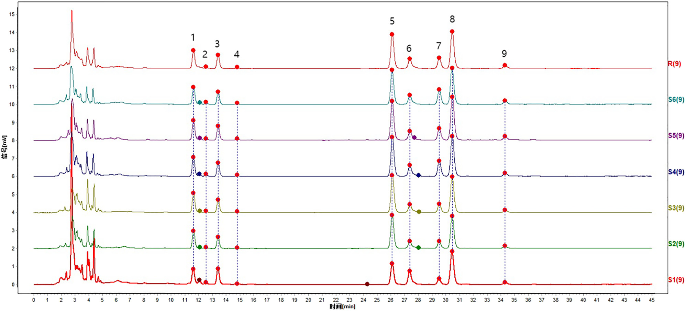
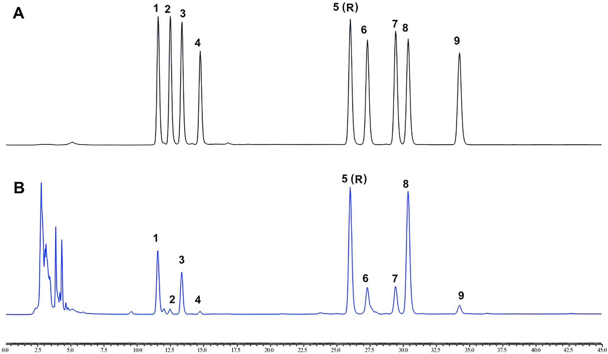
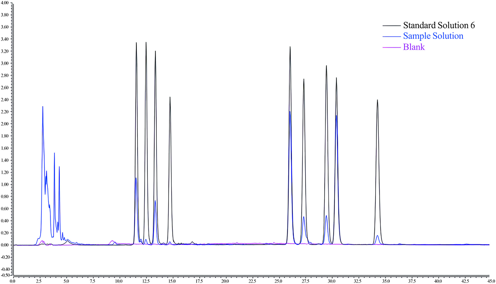
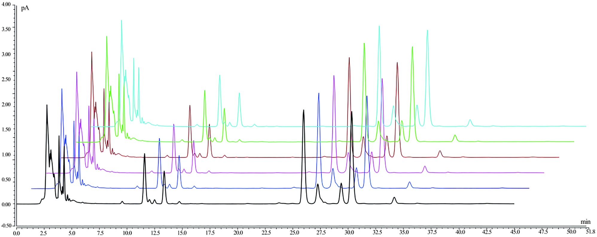
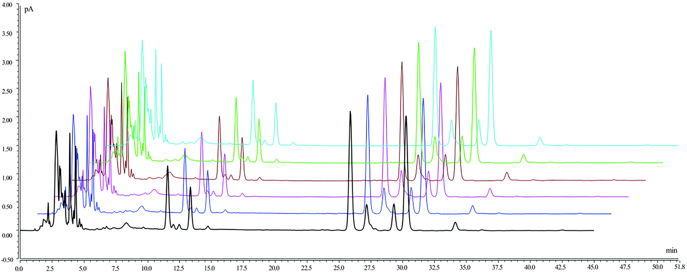
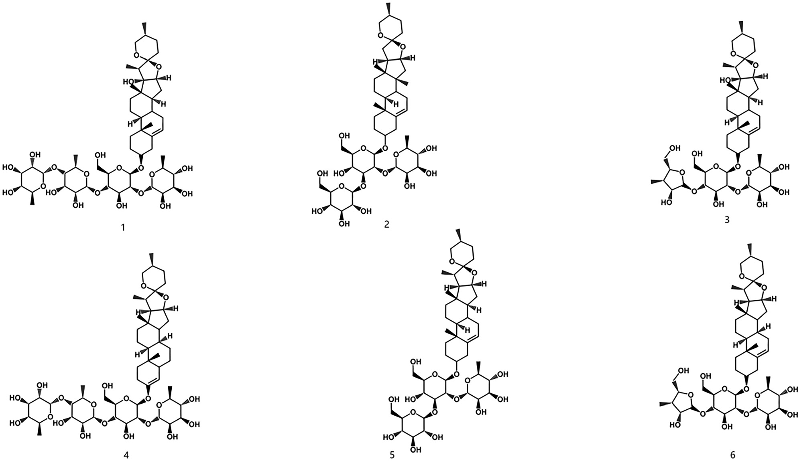
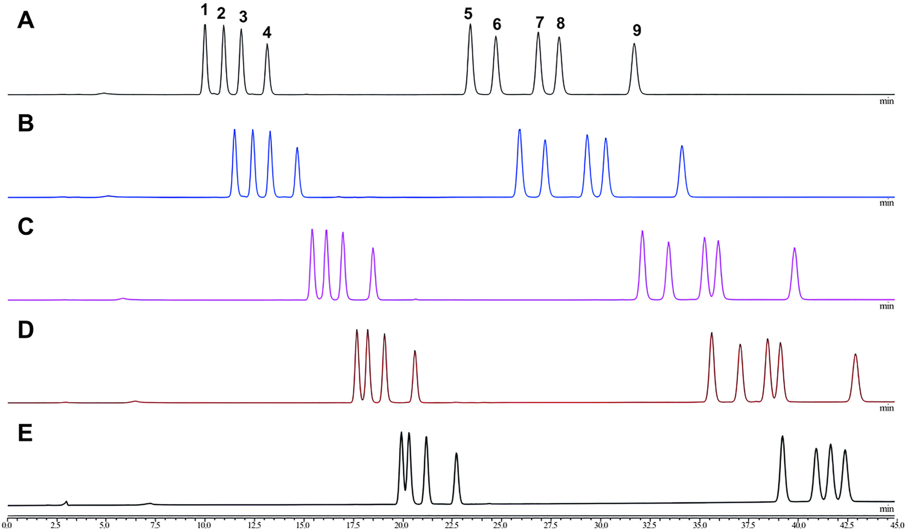
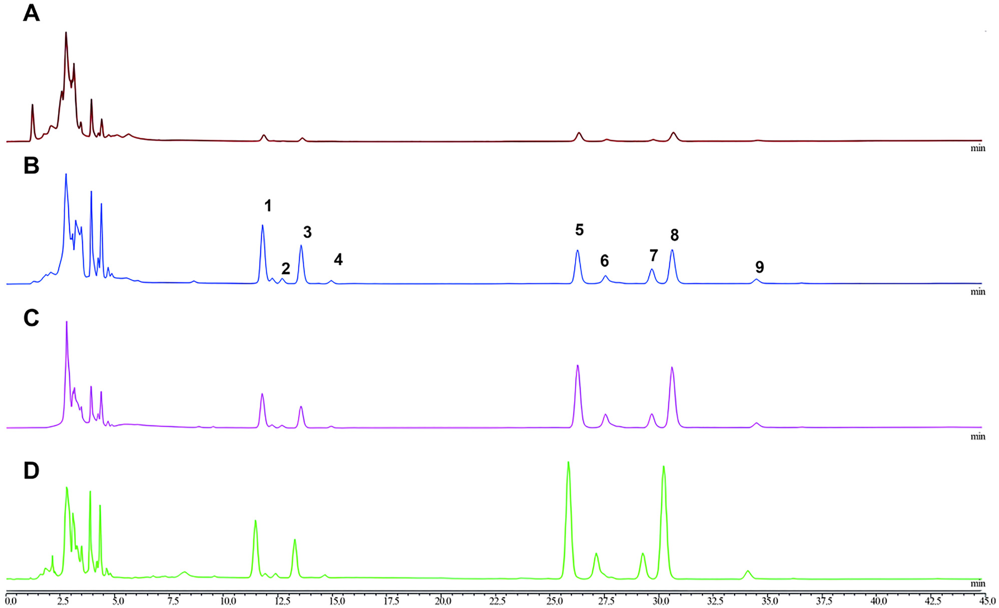

<!-- 方針: ほぼ全訳＋必要に応じた補足。原文構成に忠実。「> 補足:」は訳者注。原文は[数字]方式の引用。 -->

## 書誌情報

- 原題: Simultaneous chemical fingerprint and quantitative analysis of saponins in Gongxuening capsule by HPLC-CAD
- 著者: Yang Lou, Yutian Wang, Mengting Lai, Shuyang Li, Mingran Dong, Hongwei Xue, Xi Chen*, Juan Lu*, Ruiping Chai*（中国医学科学院薬用植物研究所・北京協和医学院／Thermo Fisher Scientific China, 中国。Lou・Wangは同等貢献の共同筆頭）
- 掲載: *Acta Chromatographica* (2025). DOI: 10.1556/1326.2025.01389. © 2025 The Author(s)。オープンアクセス（CC BY-NC 4.0）
- 受理経過: 受領 2025-07-03 / 採録 2025-12-30

> 補足: GXN = 宮血寧カプセル（Gongxuening capsule。婦人科の出血性疾患等に用いる中成薬）。主原料は**重楼（Paris polyphylla Smith var. yunnanensis、雲南重楼）**の根から70%エタノールで抽出したステロイドサポニン群（**重楼サポニン RPS = Rhizoma Paridis Saponins**）。PPI〜PPVII＝ポリフィリン(polyphyllin) I〜VII、PPD＝ポリフィリンD、PPH＝ポリフィリンH。CAD = 荷電化エアロゾル検出器（発色団のない/UV吸収の弱い半揮発性・不揮発性成分を質量ベースで検出）。本論文は[数字]方式の引用で、本稿では該当箇所に[N]を残し末尾に**参考文献**一覧を付す（[N]クリックで文献へジャンプ）。

## 要旨（Abstract）

**背景:** 宮血寧カプセル(GXN)は中国で婦人科疾患の治療に広く用いられる中成薬である。しかしカプセルの化学組成が複雑なため、現行の検出法は制約が多く不十分である。サポニン成分は極性の幅が広く、低波長域の紫外(UV)検出では応答が弱く、多数の干渉ピークも相まって、活性成分の正確な定量が難しい。

**目的:** 荷電化エアロゾル検出器付き高速液体クロマトグラフィー(HPLC-CAD)を用いてGXNのクロマトグラフ指紋を構築し、主要成分を定量分析することを目的とした。

**方法:** クロマト分離は Acclaim C30 カラム(3 mm × 250 mm, 3 μm)で、移動相にアセトニトリル(A)−水(B)を用いたグラジエント溶出（0–5 min 40%A／5–20 min 40–45%A／20–35 min 45–50%A／35–45 min 50%A）で行った。流速 0.4 mL/min、カラム温度 10 ℃、注入量 1 μL、サンプリング周波数 5 Hz、濾過定数 3.6 s、噴霧温度 50 ℃。6バッチのGXNで指紋を作成し類似度を確認、主要成分を定量した。

**結果:** GXNのHPLC指紋を確立し、**9つの共通ピーク**を同定、6バッチが **0.960 超**の高い類似度を示した。ポリフィリンI(PPI)・II(PPII)・VII(PPVII)・D(PPD)・H(PPH)・グラシリン(gracillin)は対応濃度域でピーク面積と良好な直線性を示し、相関係数 **>0.999**、回収率 **98.56–101.50%**、RSD **2.0%未満**であった。

**結論:** 開発した方法は広い適用性・高感度・優れた再現性・強い信頼性を示し、GXN中の複雑な重楼サポニン(RPS)の検出・品質管理に適する。

**キーワード:** 宮血寧カプセル、高速液体クロマトグラフィー、荷電化エアロゾル検出器、指紋、重楼サポニン(RPS)

## 1. 序論（Introduction）

宮血寧カプセル(GXN)は広く用いられる中成薬であり[1]、婦人科で各種病態の治療に頻用される[2]。その治療特性は、止血を促して出血を減らす作用[3]、炎症メディエーターを抑えて炎症を抑制する作用[4]、鎮痛作用[5]に及ぶ。GXNは主に、出血性疾患・過多月経・産後や流産後の不快感、血熱症状を伴う機能性子宮出血の患者に投与される[6]。下腹部痛・腰仙部痛、湿熱瘀滞で増悪する骨盤内炎症などの症状にも対処する。2020年版中国薬局方に規定されるGXNの主成分は、**雲南重楼（Paris polyphylla Smith var. yunnanensis (Franch.) Hand.-Mazz）** の乾燥根を70%エタノールで抽出して得られる[7]。本植物はユリ科(Liliaceae)に分類される。この植物はステロイドサポニンを含む各種活性成分を含有し[8]、**72種の特定のステロイドサポニン成分**が単離されている[9]。主要な活性成分には、ポリフィリンI(PPI)[10]・ポリフィリンII(PPII)[11,12]・ジオスシン(dioscin)[13,14]・ポリフィリンV(PPV)・ポリフィリンVI(PPVI)[15]・ポリフィリンVII(PPVII)・ポリフィリンH(PPH)[16,17]・ポリフィリンD(PPD)[18,19]・グラシリン(gracillin)[20,21]がある。2020年版中国薬局方では、PPI・PPII・PPVIIが重楼(Rhizoma Paridis)生薬の化学マーカーとされ、PPVII・PPD・PPHがGXNの化学マーカーとされている。現状、重楼生薬とGXNの双方でこれらの化学マーカーを同時に定量できる検出法は存在しない。

GXNの需要はその十分に文書化された臨床的有効性に支えられている[22]。しかし経済的制約・人工栽培の難しさ・長い生育サイクル[23]のため、野生の雲南重楼が大規模に採取されてきた[24,25]。その結果、GXNの原料供給は不足し、他の重楼属(Paris L.)植物との誤用・代用が一般化する問題が生じている[26]。これら植物間の差が大きいことを踏まえると、薬効物質の基礎研究に基づくGXNの迅速・包括的な化学組成分析が不可欠である。

UV検出器は吸光度への感度ゆえ、末端吸収波長で正確性・安定性の問題にしばしば直面する[27,28]。これに対し、荷電化エアロゾル検出器(CAD)は、フルクトオリゴ糖やサポニンのような半揮発性・不揮発性分析物に高い感度と安定性を示すため、有望な代替として台頭してきた[29,30]。蒸発光散乱検出(ELSD)と同じく質量ベースの検出に依拠するが、CADはより高い感度[31,32]と優れた再現性[33,34]を提供する。これらの利点により、漢方の品質管理でCADの利用が増えている。よく知られた中成薬として[35]、GXNや重楼の分析検出法の開発には多くの研究がある。UPLC-MS/MS・HPLC-PDA・LC-MSといった従来法は、コスト・末端吸収・クロマトピーク情報の損失に限界がある[36–38]。そこで、この生薬に正確・包括的な分析を提供する新しいHPLC-CAD法を提案する。

漢方の分析は、全体の品質を正確に評価するため各種化学成分を包括的に調べることを含む[39,40]。これに対し、本研究はHPLC-CAD技術を用いてGXNのクロマトグラフ指紋を構築し、PPVII・PPD・PPH・PPII・グラシリン・PPIを定量分析した。信頼できる薬品質評価法の開発には方法論的検討が不可欠で、結果の正確性・再現性を確保する[41,42]。本研究では規制基準を満たし安全性・一貫性を確保するため、系統的な方法バリデーションを採用した。本アプローチはGXNの多成分の品質管理を確保する効果的な方法を提供する。

## 2. 材料と方法（Materials and Methods）

### 2.1 クロマトグラフィーシステム

四元ポンプ・オートサンプラー・カラム恒温槽・荷電化エアロゾル検出器を備えた Vanquish Flex 超高速液相システム（Thermo Fisher, 北京）を用いた。Acclaim C30 カラム(3 mm × 250 mm, 3 μm)も Thermo Fisher（北京）より購入。電子分析天秤(MS105DU1A, Mettler Toledo, 上海)・超音波洗浄機(SB25-12DT, 寧波新芝生物, 寧波)を使用した。

### 2.2 化学品・試薬

標準品——PPI(Batch 230226; CAS 50773-41-6)、PPII(230516; 50773-42-7)、PPV(230520; 19057-67-1)、PPVI(230420; 55916-51-3)、PPVII(230427; 68124-04-9)、PPD(230903; 90308-85-3)、PPH(230903; 81917-50-2)、グラシリン(230106; 19083-00-2)、ジオスシン(230317; 19057-60-4)——は上海栄和医薬科技より購入（純度スコア ≥98%）。GXN(Batch ZHC2301・ZCC2101・ZDC2302・ZKC2301・ZJC2301・ZJC2302)は雲南白薬集団、HPLCグレードのメタノール・アセトニトリルは Thermo Fisher、水は天津ワハハ宏振飲料より入手。

### 2.3 標準ストック溶液・試料溶液の調製

**2.3.1 試料溶液:** GXNの内容物をよく混合・微粉砕し、約0.1 gを精秤して共栓三角フラスコに入れ、メタノール10 mLを加えて密栓・秤量した。**250 W・25 kHz で15分**超音波抽出し、冷却後に再秤量、減量分をメタノールで補ってよく振り混ぜた。濾過後、濾液を10倍希釈し、0.22 μm有機膜で濾過して試料とした。

**2.3.2 標準品溶液:** PPVII・PPD・PPH・PPVI・PPII・ジオスシン・グラシリン・PPI・PPVを精秤しメタノールに溶解、ストック溶液を調製（PPVII 573.75・PPD 640.00・PPH 558.75・PPVI 499.00・PPII 671.25・ジオスシン 500.00・グラシリン 583.75・PPI 697.50・PPV 505.00 μg/mL）。指紋分析用の作業標準溶液は各10分の1濃度（PPVII 57.37・PPD 64.00・PPH 55.88・PPVI 49.90・PPII 67.13・ジオスシン 50.00・グラシリン 58.38・PPI 69.75・PPV 50.50 μg/mL）。定量分析用には混合液を適宜希釈（PPVII 91.80・PPD 102.40・PPH 89.40・PPII 93.40・グラシリン 111.60・PPI 107.40 μg/mL）し、メタノールで段階希釈して一連の作業標準溶液とした。

### 2.4 HPLC-CAD分析

Acclaim C30 カラム(3 mm × 250 mm, 3 μm)で、移動相アセトニトリル(A)−水(B)のグラジエント（0–5 min 40%A／5–20 min 40–45%A／20–35 min 45–50%A／35–45 min 50%A）で分離した。流速 0.4 mL/min、カラム温度 10 ℃、注入量 1 μL、噴霧温度モード 50 ℃、濾過定数 3.6 s、収集周波数 5 Hz。

### 2.5 クロマトグラフ指紋の確立と類似度評価

6バッチの試料を収集し、2.3.1の方法で6バッチのGXN試料溶液を調製、上記条件で分析してクロマトグラムを記録した。類似度解析は、国家薬典委員会が開発した専門ソフト「中薬クロマトグラフ指紋類似度評価システム(2012年版)」で行い、各試料の指紋と参照指紋クロマトグラムの類似度を算出した。

### 2.6 指紋の方法バリデーション

**2.6.1 精度試験:** GXN(ZDC2302)を2.3.1で調製し、2.4の条件で6回連続注入。各ピークの保持時間・ピーク面積を記録し、各共通ピークと内部参照ピークの相対保持時間(RRT)・相対ピーク面積(RPA)を算出。**2.6.2 再現性試験:** 同一バッチ(ZDC2302)から6試料溶液を調製し同様に解析。**2.6.3 安定性試験:** 同一バッチの試料溶液を7時点(0・2・4・6・8・12・24 h)で注入し、RRT・RPAを算出。

### 2.7 定量分析のバリデーション

**2.7.1 システム適合性:** 標準作業溶液(PPVII 55.08・PPD 61.44・PPH 53.64・PPII 56.04・グラシリン 66.96・PPI 64.44 μg/mL)と試料(ZDC2302)で、6成分の分離度・理論段数・テーリング係数・S/N比を算出。**2.7.2 直線性:** 段階希釈の標準作業溶液を解析し、質量濃度(X)対ピーク面積(Y)で検量線・回帰式を導出。**2.7.3 感度:** 1つの標準作業溶液(PPVII 1.54・PPD 1.72・PPH 1.50・PPII 1.57・グラシリン 1.87・PPI 1.80 μg/mL)を希釈注入し、S/N=3・10 の条件でLOD・LOQを決定。**2.7.4 精度:** 作業溶液(PPVII 2.57・PPD 2.87・PPH 2.50・PPII 2.61・グラシリン 3.12・PPI 3.01 μg/mL)を6回連続注入し6成分含量のRSDを算出。**2.7.5 再現性:** 同一バッチから6試料を同時調製・解析。**2.7.6 安定性:** 0・2・4・6・8・12・24 h で解析。**2.7.7 試料回収試験:** 既知量の各成分(各約0.05 g)を含む6試料に標準品を精確に添加し、2.3.1に従い100%濃度に増幅、6種RPSの回収率・RSDを算出。

### 2.8 試料の同定

指定条件で6バッチのGXN溶液を注入・解析し、ピーク面積に基づく外部標準法で6成分の含量を決定した。

## 3. 結果（Results）

### 3.1 指紋の確立と類似度評価

**3.1.1 HPLC-CAD指紋分析:** HPLC-CAD法で6バッチのGXN指紋を作成し、2.4の条件で注入、**203 nm**のクロマトグラムを記録した。指紋分析は「中薬クロマトグラフ指紋類似度評価システム(2012.130723版)」で行い、共通ピークの選択と保持時間の正規化で標準化した。類似度評価では、S1を参照クロマトグラムとし、中央値法・時間窓幅0.1 minで実施。**9つの共通ピーク**を多点補正に選び、Markピークマッチングでピークマッチングした（Fig. 1）。標準作業溶液・試料溶液の解析で、指紋に9共通ピークをマークした——PPVII(ピーク1)・PPD(2)・PPH(3)・PPVI(4)・PPII(5)・ジオスシン(6)・グラシリン(7)・PPI(8)・PPV(9)（Fig. 2）。6バッチの含量試験後、ピーク面積が大きく中央に一貫して位置し全6バッチで良好に分離される**PPII(ピーク5)を参照ピーク**とした。他の共通ピークのRRT・RPAをPPIIに対して算出し比較・定量に供した。

**3.1.2 類似度解析:** 6バッチのGXN指紋の類似度を中央値法・多点補正法で評価した（Fig. 1、Table 1）。類似度指数は **0.960超**で、バッチ間の指紋変動が小さく、組成・品質が試料間で一貫していることを確認した。

**Table 1. 異なるバッチのGXN 6試料の類似度**

| Lot No | ZCC2102 | ZDC2302 | ZHC2301 | ZJC2301 | ZJC2302 | ZKC2301 | 参照指紋 |
|---|---|---|---|---|---|---|---|
| ZCC2102 | 1.000 | 0.960 | 0.960 | 0.963 | 0.964 | 0.964 | 0.973 |
| ZDC2302 | 0.960 | 1.000 | 1.000 | 0.993 | 0.997 | 0.990 | 0.997 |
| ZHC2301 | 0.960 | 1.000 | 1.000 | 0.994 | 0.996 | 0.991 | 0.997 |
| ZJC2301 | 0.963 | 0.993 | 0.994 | 1.000 | 0.995 | 1.000 | 0.998 |
| ZJC2302 | 0.964 | 0.997 | 0.996 | 0.995 | 1.000 | 0.995 | 0.998 |
| ZKC2301 | 0.964 | 0.990 | 0.991 | 1.000 | 0.995 | 1.000 | 0.997 |
| 参照指紋 | 0.973 | 0.997 | 0.997 | 0.998 | 0.998 | 0.997 | 1.000 |

### 3.2 指紋法のバリデーション

前述の条件で指紋分析を行い、9特性ピークを検出、各ピーク間で良好な分離を得た（Fig. 2）。Table 2 のとおり、指紋法の精度はRRT・RPAの低変動で確認された——9共通ピークで、RRTのRSDは **0.36%未満**、RPAのRSDは **4.15%を超えず**、良好な精度。再現性ではRRT・RPAのRSDがそれぞれ **0.16%・4.82%未満**。安定性は24時間で評価し、RRT・RPA変動はそれぞれ **0.22%・5.67%以内**で試料の完全性が維持された。

**Table 2. 指紋法バリデーションの精度・安定性・再現性データ**

| 分析物 | 精度 RRT(%) | 精度 RPA(%) | 安定性 RRT(%) | 安定性 RPA(%) | 再現性 RRT(%) | 再現性 RPA(%) |
|---|---|---|---|---|---|---|
| PPVII | 0.36 | 0.93 | 0.22 | 3.25 | 0.16 | 1.28 |
| PPD | 0.22 | 4.15 | 0.22 | 5.67 | 0.12 | 2.11 |
| PPH | 0.21 | 1.20 | 0.13 | 5.06 | 0.07 | 0.85 |
| PPVI | 0.18 | 1.91 | 0.10 | 5.25 | 0.10 | 4.42 |
| PPII | 0.00 | 0.00 | 0.00 | 0.00 | 0.00 | 0.00 |
| ジオスシン | 0.11 | 1.23 | 0.02 | 3.21 | 0.04 | 4.82 |
| グラシリン | 0.08 | 2.00 | 0.06 | 3.59 | 0.06 | 0.56 |
| PPI | 0.03 | 0.45 | 0.05 | 0.98 | 0.07 | 0.48 |
| PPV | 0.10 | 1.37 | 0.07 | 1.85 | 0.05 | 0.88 |

### 3.3 定量分析のバリデーション

各RPSピークの分離度・ピーク面積などのクロマト特性と、2020年版中国薬局方の品質管理指標に基づき、9共通ピークのうち**6ピークを定量分析に選定**した。標準作業溶液と試料溶液を注入し（Fig. 3）、6化合物とその隣接ピークはいずれもベースライン分離（分離度 >1.5・理論段数 >15,000・テーリング係数 <2.0）を示し、システム適合性の要件を満たした。ピーク面積(Y)と濃度(X)は良好な相関(R² >0.999)を示した（Table 3）。各標準品のLODは **0.3125〜0.6275 μg**、LOQは **0.6250〜1.2550 μg**。精度は6サポニン成分の含量測定でRSD **<1.92%**（Fig. 4、Table 4）、再現性は同条件で全RSD **<1.67%**（Fig. 5、Table 4）。安定性は7時点測定でRSD **<4.66%**、24時間安定。回収試験では6化合物の平均回収率 **98.56〜101.50%**、RSD **1.30〜3.07%**で信頼性・正確性を確認した。

**Table 3. 6化合物の直線性・LOD・LOQ**

| 分析物 | 回帰式 | R² | 直線範囲(μg/mL) | LOD(μg) | LOQ(μg) |
|---|---|---|---|---|---|
| PPVII | Y=0.0131X−0.0159 | 0.99995 | 1.5〜91.8 | 0.3297 | 0.6594 |
| PPD | Y=0.0115X−0.0167 | 0.99990 | 1.7〜102.4 | 0.3488 | 0.6975 |
| PPH | Y=0.0131X−0.014 | 0.99993 | 1.5〜89.4 | 0.3125 | 0.6250 |
| PPII | Y=0.012X−0.0036 | 0.99991 | 1.8〜107.4 | 0.6275 | 1.2550 |
| グラシリン | Y=0.0133X−0.0071 | 0.99999 | 1.6〜93.4 | 0.3250 | 0.6500 |
| PPI | Y=0.0105X−0.0002 | 0.99992 | 1.9〜111.6 | 0.6250 | 1.2500 |

**Table 4. 6化合物の精度・安定性・再現性・回収率データ**

| 分析物 | 精度 RSD(%) | 回収率 平均(%) | 回収率 RSD(%) | 安定性 RSD(%) | 再現性 RSD(%) |
|---|---|---|---|---|---|
| PPVII | 0.91 | 98.87 | 1.83 | 1.15 | 0.54 |
| PPD | 0.32 | 99.36 | 3.07 | 1.70 | 1.07 |
| PPH | 0.78 | 100.53 | 1.89 | 1.42 | 0.99 |
| PPII | 1.56 | 101.50 | 1.43 | 4.66 | 0.74 |
| グラシリン | 0.93 | 99.17 | 1.45 | 4.27 | 1.67 |
| PPI | 1.92 | 98.56 | 1.30 | 4.03 | 0.80 |

### 3.4 試料の測定

市販6バッチのGXN中の6化合物(PPVII・PPD・PPH・PPII・グラシリン・PPI)を、3.1.1の方法で調製し3.2の条件で測定した。6化合物の分子構造を Fig. 6 に、含量結果を Table 5 に示す。これら化合物の含量は6バッチ間で変動が小さく、薬局方基準の要件を満たし、解析したGXNの均一性・品質適合性を裏づけた。

**Table 5. 6バッチGXNの6サポニン成分含量**

| Lot No | PPVII(%) | PPD(%) | PPH(%) | PPII(%) | グラシリン(%) | PPI(%) |
|---|---|---|---|---|---|---|
| ZHC2301 | 1.43 | 0.22 | 1.00 | 3.68 | 0.78 | 4.32 |
| ZCC2101 | 1.07 | 0.23 | 1.24 | 2.10 | 0.57 | 3.98 |
| ZDC2302 | 1.46 | 0.23 | 1.02 | 3.79 | 0.78 | 4.45 |
| ZKC2301 | 1.29 | 0.27 | 1.02 | 3.61 | 1.44 | 4.65 |
| ZJC2301 | 1.52 | 0.30 | 1.15 | 4.30 | 1.54 | 5.28 |
| ZJC2302 | 1.46 | 0.23 | 1.10 | 3.98 | 1.09 | 5.36 |

## 4. 考察（Discussion）

GXNのような複雑な生薬の品質管理には、特異的・高感度なだけでなく包括的な化学プロファイルを提供できる分析法が必要である。本研究は、GXN中の複数のステロイドサポニンの同時指紋・定量のための新規HPLC-CAD法を開発・検証し、従来技術のいくつかの重大な限界に対処した。

### 4.1 方法開発・最適化の根拠

方法開発戦略は、低UV波長で吸収が弱く、極性が高く構造が類似したサポニン(LogP: −1〜1.7)を分析する必要性に主に駆動された。これを踏まえ、各種カラム——従来のC18(例: Hypersil BDS C18)、極性埋め込み/親水性相互作用カラム(例: Acclaim PA2、Hypersil Gold aQ)、長鎖アルキル相——で一連の試験を行った。評価したなかで **Acclaim™ C30 カラム(3 μm・250 mm)** が優れた性能を示した。多孔質シリカゲル上に修飾C30アルキルシラン表面をもち、化合物への形状選択性が高い。最終的な方法開発で、PPD/PPHおよびグラシリン/PPIの分離が改善した。9サポニン成分の予備分離後、分離度・信号応答の改善を目指してさらに条件を最適化した。酸や修飾剤の添加はベースラインノイズと検出器の不安定性を増すため[43]、CAD適合性を保つ**単純なアセトニトリル−水移動相**を採用した。加熱モード（カラム恒温槽の強制空冷 vs 静止空気）は分離効率にほとんど影響しなかった。**噴霧温度 50 ℃・サンプリング周波数 5 Hz**でGXN試料のS/Nが最高となり、35/75 ℃や 2/10 Hz を上回った。カラム温度は 5〜50 ℃を評価し、**10 ℃**で6RPS成分が最適なピーク形状・分離効率を示した（Fig. 7）。クロマト条件に加え試料抽出条件も予備検討し、各種抽出溶媒[44]（純水・50%メタノール水・0.1%ギ酸メタノール・純メタノール）を比較、いくつかのサポニンは**純メタノール**抽出で最も強い応答を示した（Fig. 8）。

### 4.2 HPLC-CADアプローチの分析上の優位性

新規開発法は、重楼・GXNの品質管理の既存法に対し顕著な進歩を示す。Table 6 のとおり、確立したHPLC-CAD法は、報告されたHPLC-ELSD法[45]より精度・安定性・正確性(ピーク回収率)が改善した。HPLC-UV技術に対しては、強いUV発色団の欠如・弱い末端UV吸収・共溶出する干渉ピークといったサポニン固有の限界を克服し、安定で一貫した応答を与える[46,47]。さらにLC-MS/MSと比べCADベース法は費用効果が高く[48]、ルーチンQCの経済的障壁を大幅に下げ、より広い応用を促す。

**Table 6. 各種分析法による重楼・宮血寧カプセルの成分含量測定の比較（抜粋）**

| 文献 | 検出器 | 再現性 | 精度 | 回収率 |
|---|---|---|---|---|
| 本研究（PPVII/PPD/PPH/PPII/グラシリン/PPIを定量） | CAD | 0.54–1.67% | 0.32–1.56% | 1.30–3.07%（安定性1.15–4.66%） |
| Liu et al., 2009a（8成分） | ELSD | 1.98–4.39% | 日内0.68–1.84%/日間1.21–4.53% | 2.33–4.56% |
| Liu et al., 2009b（PPIV） | MS | / | 日内4.31–5.53%/日間4.03–5.66% | 3.50–5.10% |
| Wu et al., 2012（PPD/PPH） | MS | / | 日内4.83–10.20%/日間3.40–12.20% | 4.41–7.93% |
| Yin et al., 2014（PPH） | MS | / | 日内1.00–3.39%/日間1.73–1.77% | 1.09–2.68% |
| Wu et al., 2017（PPI/II/VI/VII） | MS | <5% | 日内3.80–5.63%/日間0.75–3.37% | <5.00% |
| Ju et al., 2020（PPI/II/H/VII） | UV | 0.59–2.30% | 0.28–0.39% | <3.50% |
| Yang et al., 2016（PPI/II） | UV | / | 日内2.48–2.81%/日間1.36–2.98% | 1.57–2.21% |

> 補足: Table 6 は各法の直線回帰式も原文に併記されるが、ここでは検出器・再現性・精度・回収率の比較を抜粋した。本研究のCAD法は、ELSD/MS/UVの各既報に対し、再現性・回収率のばらつきが小さく、単一波長で複数成分を安定に定量できる点が優位。

### 4.3 包括的品質評価: 指紋＋多成分定量

本研究の鍵となる革新は、化学指紋と多成分同時定量を単一分析に統合した点である。6生産バッチにわたる指紋類似度(>0.960)はバッチ間の顕著な一貫性を確認した（Fig. 1、Table 1）。より重要なのは、薬理活性をもつ6マーカー(PPVII・PPD・PPH・PPII・グラシリン・PPI)を定量することで、一部薬局方が規定する単一/二重マーカーのアッセイを超え、より全体的な品質評価基盤を提供する点である。検証済み法は優れた直線性(R² >0.999)・精度(RSD <2%)・正確性(回収率 98.56–101.50%)を示し、分析法の全規制要件を満たした。

### 4.4 限界と今後の展望

本研究の限界も認識すべきである。第一に、CAD検出器の応答は広い濃度域で非線形であることが知られる[49]が、本研究の較正範囲内ではよく管理されていた。第二に、本法は真正なGXN試料には高効果だが、混入検出や多数の同属Paris種の判別への有用性は、より広い試料セットでのさらなる検証が必要である。現行の指紋はGXNに用いる雲南重楼のサポニンプロファイルに特異的である。これらの限界にもかかわらず、提案するHPLC-CAD法は大きな前進であり、GXNの品質一貫性を確保する強力・信頼・実用的なツールを製造者・規制当局に提供する。さらに本アプローチは重楼資源の持続的栽培・利用の技術的基盤となり、代替可能な資源を探すため異なるParis種の化学プロファイリング・比較を助けうる[50]。

## 5. 結論（Conclusion）

本研究では、単一波長で指紋の同時解析と多成分定量を行う新規法を開発した。6バッチのGXNを解析し、9主要成分を同定して6成分の定量に成功、各成分の含量が全6バッチで一貫・安定していた。要するに、HPLC-CAD技術を用いてGXNを定性・定量の両面から評価する包括的品質分析手法を確立した。本法は強い特異性・高感度・簡便な操作をもち、GXNの品質管理体系の改善と全体品質の均一性確保に有用な参照となる。

## 参考文献

1. Ma, M.; Lv, F.; Tian, L.; Guo, J. Clinical effect analysis of Gongxuening capsule on bleeding after family planning operation. Panminerva Med. 2024, 66. https://doi.org/10.23736/s0031-0808.20.04248-2

2. Niu, B.; Zhang, M.; Zhang, T.; Cai, H.; Li, K.; W, H. Systematic review and meta-analysis on efficacy and safety of Gongxuening capsules in treatment of abnormal vaginal bleeding after medical abortion. China J. Chin. Materia Med. 2021, 46 (15), 3990–7. https://doi.org/10.19540/j.cnki.cjcmm.20210201.502

3. Kshetrimayum, V.; Chanu, K. D.; Biona, T.; Kar, A.; Haldar, P. K.; Mukherjee, P. K.; Sharma, N. Paris polyphylla sm. Characterized extract infused ointment accelerates diabetic wound healing in In-Vivo model. J. Ethnopharmacol. 2024, 331, 118296. https://doi.org/10.1016/j.jep.2024.118296

4. Man, S.; Wang, Y.; Li, Y.; Gao, W.; Huang, X.; Ma, C. Phytochemistry, pharmacology, toxicology, and structure-cytotoxicity relationship of Paridis Rhizome Saponin. Chin. Herb. Med. 2013, 5 (1), 33–46. https://doi.org/10.7501/j.issn.1674-6384.2013.01.004

5. Man, S.; Zhang, X.; Xie, L.; Zhou, Y.; Wang, G.; Hao, R.; Gao, W. A new insight into material basis of Rhizoma Paridis Saponins in alleviating pain. J. Ethnopharmacol. 2024, 323, 117642. https://doi.org/10.1016/j.jep.2023.117642

6. Wen, Y.; Wu, Q.; Zhang, L.; He, J.; Chen, Y.; Yang, X.; Zhang, K.; Niu, X.; Li, S. Association of intrauterine microbes with endometrial factors in intrauterine adhesion formation and after medicine treatment. Pathogens 2022, 11 (7), 784. https://doi.org/10.3390/pathogens11070784

7. Chinese Pharmacopoeia Commission, Pharmacopoeia of the People's Republic of China, 2020 ed.; China Medical Science Press: Beijing, 2020.

8. Yu, Z.; Guo, L.; Wang, B.; Kang, L.; Zhao, Z.; Shan, Y.; Xiao, H.; Chen, J.; Ma, B.; Cong, Y. Structural requirement of spirostanol glycosides for rat uterine contractility and mode of their synergism. J. Pharm. Pharmacol. 2010, 62 (4), 521–9. https://doi.org/10.1211/jpp.62.04.0016

9. Guan, L.; Zheng, Z.; Guo, Z.; Xiao, S.; Liu, T.; Chen, L.; Gao, H.; Wang, Z. Steroidal saponins from rhizome of Paris polyphylla Var. Chinensis and their anti-inflammatory, cytotoxic effects. Phytochemistry 2024, 219, 113994. https://doi.org/10.1016/j.phytochem.2024.113994

10. Shi, Y.; Xu, L.; Wang, X.; Zhang, K.; Zhang, C.; Liu, H.; Ding, P.; Shi, W.; Liu, Z. Paris polyphylla ethanol extract and polyphyllin I ameliorate adenomyosis by inhibiting epithelial–mesenchymal transition. Phytomedicine 2024, 127, 155461. https://doi.org/10.1016/j.phymed.2024.155461

11. Heng, G.; Ye, G.; Ma, Y.; Wang, Y. Polyphyllin II inhibits NLPR3 inflammasome activation and inflammatory response of mycobacterium tuberculosis–infected human bronchial epithelial cells. Allergologia et Immunopathologia 2024, 52 (1), 16–23. https://doi.org/10.15586/aei.v52i1.998

12. Yang, Q.; Li, H.; Gui, M.; Li, Z.; Sun, H. Development and validation of a rapid and sensitive LC–MS/MS method for the determination of polyphyllin II in rat plasma and its application in a pharmacokinetic study. Biomed. Chromatogr. 2020, 34 (3). https://doi.org/10.1002/bmc.4780

13. Liu, Y.; Song, J.; Liu, S.; Nan, Y.; Zheng, W.; Pang, X.; Chen, X.; Liang, H.; Zhang, J.; Ma, B. A universal method for profiling and characterization of oligosaccharides in traditional Chinese medicines. J. Pharm. Biomed. Anal. 2024, 244, 116129. https://doi.org/10.1016/j.jpba.2024.116129

14. Fan, L.; Ni, R.; Wang, H.; Zhang, L.; Wang, A.; Liu, B. Dioscin alleviates aplastic anemia through regulatory T cells promotion. Hematology 2024, 29 (1). https://doi.org/10.1080/16078454.2024.2326389

15. Yuan, Y.; Jiang, N.; Li, Z.; Song, Z.; Yang, Z.; Xue, W.; Zhang, X.; Du, Y. Polyphyllin VI induces apoptosis and autophagy in human osteosarcoma cells by modulation of ROS/JNK activation. Drug Des. Develop. Ther. 2019, 13, 3091–103. https://doi.org/10.2147/dddt.s194961

16. Yin, X.; Lin, L.; Shen, M.; Zhai, Y.; Cao, S.; Fu, J.; Li, X.; Yang, C.; Xia, Z.; Zhao, Y.; Li, S.; Bai, Y.; Xue, D.; Ni, J. Analysis and pharmacokinetic study of polyphyllin H in beagle dog plasma after oral administration of Rhizoma paridis extracts by LC-MS/MS. Biomed. Chromatogr. 2014, 28 (12), 1869–73. https://doi.org/10.1002/bmc.3236

17. Yin, X.; Lin, L.; Shen, M.; Zhai, Y.; Cao, S.; Fu, J.; Li, X.; Yang, C.; Xia, Z.; Zhao, Y.; Li, S.; Bai, Y.; Xue, D.; Ni, J. Analysis and pharmacokinetic study of polyphyllin H in beagle dog plasma after oral administration of rhizoma paridis extracts by LC‐MS/MS. Biomed. Chromatogr. 2014, 28 (12), 1869–73. https://doi.org/10.1002/bmc.3236

18. Dong, R.; Qin, C.; Yin, Y.; Han, L.; Xiao, C.; Wang, K.; Wei, R.; Xia, Y.; Kong, L. Discovery of a potent inhibitor of chaperone‐mediated autophagy that targets the HSC70–LAMP2A interaction in non‐small cell lung cancer cells. Br. J. Pharmacol. 2023, 182 (10), 2287–309. https://doi.org/10.1111/bph.16165

19. Watanabe, S.; Inoue, M.; Suzuki, T.; Kondo, Y.; Murayama, M. Polyphyllin D induces necroptosis in neuroblastoma cells (IMR-32 and LA-N-2) in mice. Pediatr. Surg. Int. 2023, 39. https://doi.org/10.1007/s00383-023-05425-x

20. Zhang, Y.; Jin, L.; Wu, Y.; Li, R.; Wang, K.; Li, H. Chemical constituents of steroidal saponins in rhizome of Paris polyphylla Var. yunnanensis cultured in vitro. Chin. J. Chin. Mater. Med. 2021, 46 (19), 4936–44. https://doi.org/10.19540/j.cnki.cjcmm.20210722.101

21. Bhuia, M. S.; Chowdhury, R.; Sonia, F. A.; Kamli, H.; Shaikh, A.; El‐Nashar, H. A. S.; El‐Shazly, M.; Islam, M. T. Anticancer potential of the plant‐derived saponin gracillin: a comprehensive review of mechanistic approaches. Chem. & Biodivers. 2023, 20 (9). https://doi.org/10.1002/cbdv.202300847

22. Liu, Q.; Shi, Y.; Zhang, Y.; Song, Z.; Su, Q.; Zhang, Y.; Luo, G. A simple and rapid method for the determination of pennogenin diglycoside in rat plasma by HPLC-MS: application to the pharmacokinetics of the extract in Gongxuening capsules. J. Chromatogr. Sci. 2009, 47 (8), 728–32. https://doi.org/10.1093/chromsci/47.8.728

23. Wu, Z.; Zhang, J.; Xu, F.; Wang, Y.; Zhang, J. Rapid and simple determination of polyphyllin I, II, VI, and VII in different harvest times of cultivated Paris polyphylla Smith var. yunnanensis (Franch.) Hand.-Mazz by UPLC-MS/MS and FT-IR. J. Nat. Med. 2016, 71, 139–47. https://doi.org/10.1007/s11418-016-1043-8

24. Li, Y.; Wang, L.; Yang, W.; Xie, Q.; Xu, H.; Wen, R.; Sun, H.; Zhang, H.; Xia, C. Promotion of a quality standard for Paris polyphylla var. yunnanensis based on the efficacy-oriented effect-constituent index. J. Pharm. Biomed. Anal. 2024, 238, 115843. https://doi.org/10.1016/j.jpba.2023.115843

25. Zhang, T.; Liu, H.; Liu, X.; Xu, D.; Chen, X.; Wang, Q. Qualitative and quantitative analysis of steroidal saponins in crude extracts from Paris polyphylla var. yunnanensis and P. polyphylla var. chinensis by high performance liquid chromatography coupled with mass spectrometry. J. Pharm. Biomed. Anal. 2010, 51, 114–24. https://doi.org/10.1016/j.jpba.2009.08.020

26. Qin, X.; Ni, W.; Chen, C.; Liu, H. Untiring researches for alternative resources of Rhizoma Paridis. Nat. Prod. Bioprospecting 2018, 8 (4), 265–78. https://doi.org/10.1007/s13659-018-0179-5

27. Filip, K.; Grynkiewicz, G.; Gruza, M.; Jatczak, K.; Zagrodzki, B. Comparison of ultraviolet detection and charged aerosol detection methods for liquid-chromatographic determination of protoescigenin. Acta Pol. Pharm. 2014, 71 (6), 933–40.

28. Xie, M.; Yu, Y.; Zhu, Z.; Deng, L.; Ren, B.; Zhang, M. Simultaneous determination of six main components in bushen huoxue prescription by HPLC-CAD. J. Pharm. Biomed. Anal. 2021, 201, 114087. https://doi.org/10.1016/j.jpba.2021.114087

29. Jia, S.; Li, J.; Yunusova, N.; Park, J. H.; Kwon, S. W.; Lee, J. A new application of charged aerosol detection in liquid chromatography for the simultaneous determination of polar and less polar ginsenosides in ginseng products. Phytochem. Anal. 2013, 24 (4), 374–80. https://doi.org/10.1002/pca.2419

30. Fung, H.; Lang, Y.; Ho, H.; Wong, T.; Ma, D.; Leung, C.; Han, Q. Comprehensive quantitative analysis of 32 chemical ingredients of a Chinese patented drug Sanhuang tablet. Molecules 2017, 22 (1), 111. https://doi.org/10.3390/molecules22010111

31. Li, W.; Zhang, X.; Chen, X.; Zhong, Z.; Zhu, W.; Li, S.; Pan, X.; Tian, J. Optimization of an alkaline hydrolysis preparation of Capilliposide-A from Lysimachia capillipes hemsl. Using response surface methodology coupled with HPLC-ELSD analysis. Chromatographia 2022, 85, 167–75. https://doi.org/10.1007/s10337-021-04124-w

32. Eom, H. Y.; Park, S.-Y.; Kim, M. K.; Suh, J. H.; Yeom, H.; Min, J. W.; Kim, U.; Lee, J.; Youm, J.-R.; Han, S. B. Comparison between evaporative light scattering detection and charged aerosol detection for the analysis of saikosaponins. J. Chromatogr. A 2010, 1217 (26), 4347–54. https://doi.org/10.1016/j.chroma.2010.04.047

33. Wang, Y.; Liu, Y.; Yue, H.; Xu, W.; Cao, J.; Jin, H.; Ma, S. Comparison between the charged aerosol detector and evaporative light scattering detector for the analysis of sugar in Zhusheyong Yiqifumai and the study on the accuracy of methods. Chin. J. Chin. Mater. Med. 2020, 45, 5511–7. https://doi.org/10.19540/j.cnki.cjcmm.20200221.306

34. Vervoort, N.; Daemen, D.; Török, G. Performance evaluation of evaporative light scattering detection and charged aerosol detection in reversed phase liquid chromatography. J. Chromatogr. A 2008, 1189 (1–2), 92–100. https://doi.org/10.1016/j.chroma.2007.10.111

35. Jia, T.; Zhang, X.; Su, T.; Yang, X.; Wang, H.; Xin, J.; Liu, M.; Wang, J.; Li, X. A study on quality of Paridis Rhizoma and consideration on standards of Paridis Rhizoma in Chinese pharmacopoeia. Chin. J. Chin. Mater. Med. 2020, 45 (10), 2425–30. https://doi.org/10.19540/j.cnki.cjcmm.20200110.201

36. Wu, S.; Gao, W.; Qiu, F.; Man, S.; Fu, S.; Liu, C. Simultaneous quantification of polyphyllin D and Paris H, two potential antitumor active components in Paris polyphylla by liquid chromatography-tandem mass spectrometry and the application to pharmacokinetics in rats. J. Chromatogr. B 2012, 905, 54–60. https://doi.org/10.1016/j.jchromb.2012.08.002

37. Yang, Y.; Zhang, J.; Zhao, Y.; Zhang, J.; Wang, Y. Quantitative determination and evaluation of Paris polyphylla var. yunnanensis with different harvesting times using UPLC‐UV‐MS and FT‐IR spectroscopy in combination with partial least squares discriminant analysis. Biomed. Chromatogr. 2017, 31 (7). https://doi.org/10.1002/bmc.3913

38. Ju, B.; Zhu, H.; Li, Y.; Wang, R.; Chen, L.; Gao, H.; Wang, Z. Determination of five steroidal saponins in Paridis Rhizoma and its adulterants as well as consideration on its quantitative method described in Chinese pharmacopoeia (2015 edition). Chin. J. Chin. Mater. Med. 2020, 45 (8), 1745–55. https://doi.org/10.19540/j.cnki.cjcmm.20200330.201

39. Tian, J. Advances in research methods of pharmacodynamic substances in traditional Chinese medicines and their application in the teaching of traditional Chinese medicine analysis. J. Contemp. Educ. Res. 2024, 8 (5), 97–102.

40. Li, Y.; Wang, L.; Yang, W.; Xie, Q.; Xu, H.; Wen, R.; Sun, H.; Zhang, H.; Xia, C. Promotion of a quality standard for Paris polyphylla var. yunnanensis based on the efficacy-oriented effect-constituent index. J. Pharm. Biomed. Anal. 2024, 238, 115843. https://doi.org/10.1016/j.jpba.2023.115843

41. Panthi, V. K.; Nepal, U. Formulation and development of a water-in-oil emulsion-based luliconazole cream: in vitro characterization and analytical method validation by RP-HPLC. Int. J. Anal. Chem. 2022, 2022, 1–12. https://doi.org/10.1155/2022/7273840

42. Aghaei, M.; Talari, F. S.; Mollahosseini, A.; Keramati, M. Validation of a high‐performance liquid chromatography method for determining lysophosphatidylcholine content in bovine pulmonary surfactant medication. Biomed. Chromatogr. 2024, 38 (8). https://doi.org/10.1002/bmc.5926

43. Vervoort, N.; Daemen, D.; Török, G. Performance evaluation of evaporative light scattering detection and charged aerosol detection in reversed phase liquid chromatography. J. Chromatogr. A 2008, 1189 (1–2), 92–100. https://doi.org/10.1016/j.chroma.2007.10.111

44. Mejía-Valdez, D.; Antunes-Ricardo, M.; Martínez-Ávila, M.; Guajardo-Flores, D. Enhancement of oleanolic acid concentration through acid hydrolysis of saponin-rich extracts from Chenopodium Berlandieri. Food Chem. 2024, 449, 139254. https://doi.org/10.1016/j.foodchem.2024.139254

45. Liu, X.; Wang, L.; Yang, J.; Zhang, T.; Deng, X.; Wang, Q. Simultaneous analysis of eight bioactive steroidal saponins in Gongxuening capsules by HPLC-ELSD and HPLC-MSn. Acta Chromatographica 2009, 21 (2), 327–39.

46. Yang, Y.; Zhang, J.; Jin, H.; Zhang, J.; Wang, Y. Quantitative analysis in combination with fingerprint technology and chemometric analysis applied for evaluating six species of wild Paris using UHPLC-UV-MS. J. Anal. Methods Chem. 2016, 2016, 3182796. https://doi.org/10.1155/2016/3182796

47. Ju, B.; Zhu, H.; Li, Y.; Wang, R.; Chen, L.; Gao, H.; Wang, Z. Determination of five steroidal saponins in Paridis Rhizoma and its adulterants as well as consideration on its quantitative method described in Chinese pharmacopoeia (2015 edition). Chin. J. Chin. Mater. Med. 2020, 45 (8), 1745–55. https://doi.org/10.19540/j.cnki.cjcmm.20200330.201

48. Wu, Z.; Zhang, J.; Xu, F.; Wang, Y.; Zhang, J. Rapid and simple determination of polyphyllin I, II, VI, and VII in different harvest times of cultivated Paris polyphylla Smith var. yunnanensis (Franch.) Hand.-Mazz by UPLC-MS/MS and FT-IR. J. Nat. Med. 2016, 71, 139–47. https://doi.org/10.1007/s11418-016-1043-8

49. Nováková, L.; Lopéz, S. A.; Solichová, D.; Satínský, D.; Kulichová, B.; Horna, A.; Solich, P. Comparison of UV and charged aerosol detection approach in pharmaceutical analysis of statins. Talanta 2009, 78 (3), 834–9. https://doi.org/10.1016/j.talanta.2008.12.057

50. Guo, L.; Su, J.; Deng, B.; Yu, Z.; Kang, L.; Zhao, Z.; Shan, Y.; Chen, J.; Ma, B.; Cong, Y. Active pharmaceutical ingredients and mechanisms underlying phasic myometrial contractions stimulated with the Saponin extract from Paris polyphylla Sm. var. yunnanensis used for abnormal uterine bleeding. Hum. Reprod. 2008, 23 (4), 964–71. https://doi.org/10.1093/humrep/den001

## 訳者補足

> 補足（この研究のポイント）: 重楼（雲南重楼）由来のステロイドサポニン(RPS)は、①発色団に乏しく低波長UVでしか吸収がない、②極性の幅が広い、③構造がよく似た同族体が多い——ため、従来のUVやMSでは「弱い・不安定・干渉が多い・高コスト」という問題があった。本研究は**質量ベースで検出するCAD**と**形状選択性の高いC30カラム**を組み合わせ、単一波長・単一分析で「指紋（9共通ピーク・類似度>0.960）＋6成分同時定量（回収率98.56–101.50%）」を実現した点が要。
>
> 補足（数値の読み方）: 類似度 >0.960 は「6バッチの成分パターンがほぼ同じ」を意味し、バッチ間一貫性の証拠。回収率100%近傍・RSD<2%は定量の正確さ・精度が高いこと。R²>0.999 は検量線の直線性が非常に良いこと。ただし原文も注意するとおり、**CADの応答は本来非線形**（同ワークスペースの `cad-pfv-powerlaw-linearization-qishen-yiqi` が扱うテーマ）で、広い濃度域では較正範囲の管理が前提になる。
>
> 補足（関連解説）: 本サイトには荷電化エアロゾル検出(CAD)を用いた中成薬QCの解説が複数あり（芪参益気滴丸のCAD線形化、補腎活血方のHPLC-CAD 6成分定量など）、本論文はその「重楼サポニン・宮血寧カプセル」版。図7（温度5–50℃の比較）・図8（抽出溶媒の比較）は方法最適化の実データで、実務でC30・低温(10℃)・純メタノール抽出を選んだ根拠として読める。
