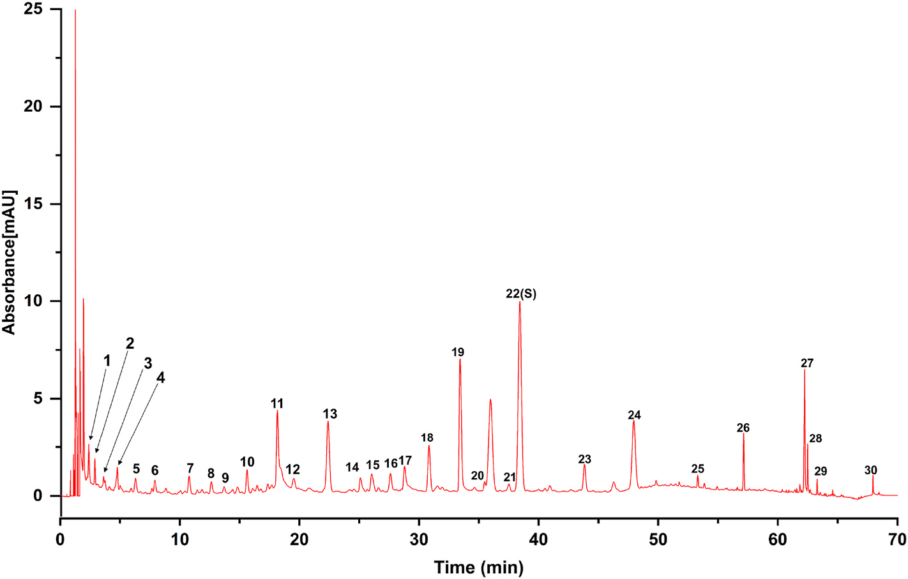
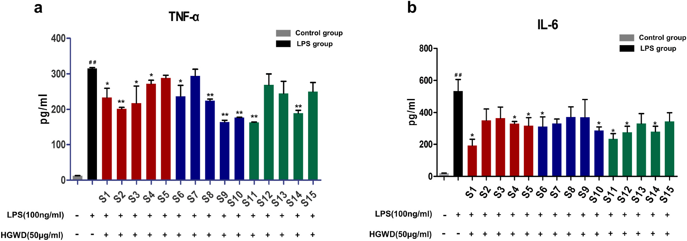
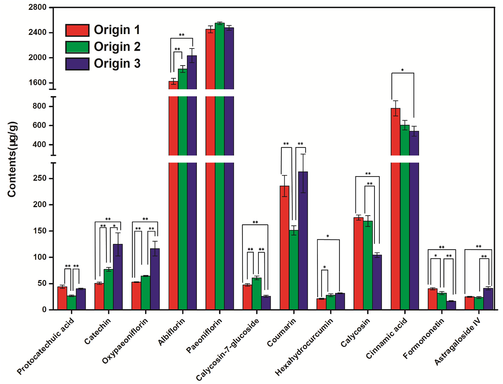

<!-- 方針: ほぼ全訳＋必要に応じた補足。原文の節構成（Introduction→Materials and methods→Results and discussion→Conclusion）に沿って訳出。「> 補足:」は訳者注。表は原文の数値をそのまま保持。 -->

## 書誌情報

- 標題（原題）: A comprehensive quality evaluation for Huangqi Guizhi Wuwu decoction by integrating UPLC-DAD/MS chemical profile and pharmacodynamics combined with chemometric analysis
- 著者: Maoyuan Jiang（共同筆頭）, Lele Yang（共同筆頭）, Liang Zou, Lei Zhang, Shengpeng Wang, Zhangfeng Zhong, Yitao Wang, Peng Li（責任著者）
- 所属: a マカオ大学中華医薬研究院 中医薬品質研究国家重点実験室（State Key Laboratory of Quality Research in Chinese Medicine, Institute of Chinese Medical Sciences, University of Macau, Macau, 999078, China）／b 成都大学食品生物工程学院（Chengdu, 610106, China）／c 四川省中医薬科学院実験動物センター（Chengdu, 610041, China）
- 掲載誌・巻号・DOI: Journal of Ethnopharmacology 319 (2024) 117325. DOI: https://doi.org/10.1016/j.jep.2023.117325
- インパクトファクター: 6.54（Journal of Ethnopharmacology, JCR 2024 / Clarivate。2023年版は4.8）
- 受理経過: 2023年7月13日受付、2023年9月30日改稿、2023年10月15日受理、2023年10月16日オンライン公開。0378-8741/© 2023 Elsevier B.V. All rights reserved.（オープンアクセスではない通常の著作権表示）
- 責任著者連絡先: pli1978@hotmail.com（P. Li）

> 補足: 黄耆桂枝五物湯（Huangqi Guizhi Wuwu Decoction, HGWD）は『金匱要略』に記載された古典方剤で、「血痺（けっぴ）」（しびれ・四肢痛を特徴とする「痺」証の一種）の治療に用いられてきた。現代では関節リウマチ（rheumatoid arthritis, RA）の治療に臨床応用されている。

## 要旨（Abstract）

Ethnopharmacological relevance（民族薬理学的関連性）: 黄耆桂枝五物湯（HGWD）は、『金匱要略』に原典を持つ古典的な漢方方剤であり、ヒトの「血痺」（「痺」証の一種）の治療に用いられてきた。臨床では、HGWDは関節リウマチ（RA）の治療に応用されている。

研究の目的: 薬効と化学的特徴の両方を反映する化学マーカーの特定は、中薬（TCM）の品質管理にとって極めて重要である。HGWDの抗RA効果を例として、本研究の目的は、全体的な化学プロファイルと生物活性データを組み合わせて化学マーカーを同定する包括的戦略を開発することであった。

材料と方法: 第一に、超高速液体クロマトグラフィー-ダイオードアレイ検出器（UPLC-DAD）指紋を確立・バリデーションし、異なる産地のHGWDの全体的品質を評価した。異なる地理的産地のHGWDに関連する特性マーカーは、UPLC-DAD指紋とケモメトリクス手法の組み合わせによりスクリーニングされた。第二に、15バッチのHGWD試料の化学プロファイルを、UPLCとハイブリッド線形イオントラップ-Orbitrap質量分析（UPLC-HRMS）の連携によって特徴づけた。次いで15検体のHGWD試料のin vitro抗RA活性を評価した。第三に、スペクトル-効果関係（spectrum-effect relationship）解析を実施し、品質マーカーとして利用しうる生物活性化合物を同定した。最後に、15バッチのHGWDにおける特性マーカーおよび品質マーカーの定量分析のために、UPLC-三連四重極タンデム質量分析法を最適化・確立した。

結果: UPLC-DAD指紋において合計30の共通ピークが割り当てられた。うち9ピークが特性マーカーとして認識された：プロトカテク酸（protocatechuic acid）、クマリン（coumarin）、桂皮酸（cinnamic acid）、オキシパエオニフロリン（oxypaeoniflorin）、パエオニフロリン（paeoniflorin）、カリコシン（calycosin）、フォルモノネチン（formononetin）、カテキン（catechin）、アルブミフロリン（albiflorin）。さらに、UPLC-HRMS化学プロファイルにおいて95の共通化合物が同定された。薬理学的解析により、15検体のHGWDの抗RA活性は大きく異なることが示された。スペクトル-効果関係解析により、抗RA活性と正の相関を示す30の潜在的生物活性成分が明らかになった。そのうち、相対含量1%を超える5化合物（パエオニフロリン、アストラガロシドIV、ヘキサヒドロクルクミン、フォルモノネチン、カリコシン-7-グルコシド）が品質マーカーとして選定され、その活性はLPS誘導RAW264.7マクロファージにおいて検証された。最終的に、上記12の代表成分が15バッチのHGWD試料において同時に定量された。

結論: 全体的な化学プロファイルと代表成分の評価を組み合わせることで、この体系的戦略はHGWDの品質評価を改善するための信頼性が高く有効な方法となりうる。

**略語**: TCMs, 中薬（Traditional Chinese medicines）; RA, 関節リウマチ（rheumatoid arthritis）; UPLC-DAD, 超高速液体クロマトグラフィー-ダイオードアレイ検出器; GC-MS, ガスクロマトグラフィー-質量分析; PLSR, 部分最小二乗回帰（partial least squares regression）; ANN, 人工神経回路網（artificial neural network）; HGWD, 黄耆桂枝五物湯（Huangqi Guizhi Wuwu Decoction）; AR, 黄耆（Astragali Radix）; PRA, 白芍（Paeoniae Radix Alba）; CR, 桂枝（Cinnamomi Ramulus）; ZRR, 生姜（Zingiberis Rhizoma Recens）; JF, 大棗（Jujubae Fructus）; TQ-MS/MS, 三連四重極タンデム質量分析; RSD, 相対標準偏差; MRM, 多重反応モニタリング（multiple reaction monitoring）; VIP, 変数重要度（variable importance in projection）。

**キーワード**: 品質評価（Quality evaluation）；Q-marker；化学指紋（Chemical fingerprint）；スペクトル-効果関係（Spectrum-effect relationship）；黄耆桂枝五物湯（Huangqi Guizhi Wuwu decoction）

## 1. 序論（Introduction）

多成分・多標的という特徴を持つ中薬（TCMs）、とりわけTCM方剤は、中国および東洋諸国で広く用いられてきた（Zhang et al., 2020）。TCMの化学構成成分は、多様な地理的産地、複数の基原種、および異なる前処理方法の影響を通常受ける（Jiang et al., 2022）。したがって、全体的な化学プロファイルを反映し代表的成分を評価する包括的かつ体系的な品質管理戦略は、臨床における良好な安全性・有効性を保証するために不可欠である。超高速液体クロマトグラフィー-ダイオードアレイ検出器（UPLC-DAD）指紋は広く検討されており（Sang et al., 2021）、TCMの全体的品質評価に適切に応用されている。加えて、薬効に関連する代表成分の精密な定量も、統合的な品質管理において有益である。しかし、多くの場合、TCMの有効性・安全性を推定するために定量的に検出されるのは1つないし数個の化学化合物のみである（National Medical Products Administration, 2020）。明らかに、これらの化合物はTCMの本来的・内在的特徴を反映できない。したがって、TCMの治療効果に最も大きく寄与する品質マーカー（Q-marker）は、治療効果の実質的基盤を理解し、薬理活性に基づく品質管理を開発する上で重要な役割を果たす。

これまで、高分解能・高感度を備えた多様な多成分分析技術がTCMの化学プロファイルの特徴づけに用いられてきた。例えばUPLC-DAD（Lan et al., 2021）、液体クロマトグラフィー-質量分析法（UPLC-MS）（Ji et al., 2021; Zhang et al., 2023）、ガスクロマトグラフィー-質量分析法（GC-MS）（Fu et al., 2021）、定量的核磁気共鳴法（QNMR）（Wang et al., 2022）などである。しかし、高スループット分析技術によって得られる膨大な化学情報の中から、Q-markerとして働く特定の化学化合物をスクリーニング・認識することはできない。このギャップを埋めるため、ケモメトリクス手法により薬効と化学プロファイルの相関（スペクトル-効果関係）を解析するアプローチ、例えばグレー関連解析（GRA）（Liu et al., 2022）、部分最小二乗回帰（PLSR）解析（Yu et al., 2022）、人工神経回路網（ANNs）（Yang et al., 2021）が提唱されている。特に、変数の数が試料数を大きく上回る場合にスペクトル-効果関係を決定する手法としてPLSRが頻繁に用いられる。したがって、多量の化学プロファイルデータを含むTCMについては、PLSRによってスペクトル-効果関係を確立することがより適切である（Gong et al., 2021）。

黄耆桂枝五物湯（HGWD）は古典的な漢方方剤であり、『金匱要略』に「養血温経（血を養い経絡を温める）」の効能を持つものとして原典が記されている（Liu et al., 2020）。HGWDは伝統的に、身体のしびれと四肢痛を特徴的症状とする「血痺」（「痺」証の一種）の治療に用いられてきた（Guan et al., 2019; Tian et al., 2020）。HGWDは白芍（Paeoniae Radix Alba, PRA）、桂枝（Cinnamomi Ramulus, CR）、黄耆（Astragali Radix, AR）、生姜（Zingiberis Rhizoma Recens, ZRR）、大棗（Jujubae Fructus, JF）の5つの生薬から構成される。現代の薬理学的研究により、HGWDが疼痛を緩和し、神経伝達物質を調節し、抗関節リウマチ（RA）作用を有することが明らかにされている（Zheng et al., 2020）。さらに、多くの臨床試験がHGWDのRA治療における信頼性の高い治療効果を示している（Cai and Hu, 1997; Liu, Z. et al., 2019; Shi et al., 2010; Wang and Zhang, 2004; Yang et al., 2019）。とりわけ、関節痛（Zhang and Lee, 2018）など、RAにより引き起こされる臨床症状は「血痺」の症状と類似している。先行研究（Li et al., 2016; Lin et al., 2022; Liu et al., 2017; Liu, J. et al., 2019）では、HGWDの抗RA効果が実証されている。例えば、HGWD投与により足関節滑膜の炎症が緩和されうる（Wang et al., 2022）。しかし、合理的な品質評価、とりわけRA治療の治療効果に最も寄与する化学成分についての評価が欠如している。したがって、効能を担う成分を探索することは重要な関心事である。異常な免疫細胞応答による炎症はRAの病態形成に関与する。これらの免疫細胞のうち、炎症性M1マクロファージは、炎症性サイトカイン（IL-6やTNF-αなど）レベルの上昇を誘導することにより関節の侵食を引き起こし、RAの進行を調節する上で決定的な役割を果たす（Sun et al., 2021）。古典的かつ成熟した炎症細胞モデルとして、LPS誘導RAW264.7マクロファージは抗RA化合物のスクリーニングに広く用いられている（Liu et al., 2021; Zhang et al., 2022）。

本研究では、HGWDの品質評価のために、全体的化学プロファイルの決定と化学マーカーの発見を統合する包括的戦略を提案する。特筆すべきは、化学マーカーが、地理的多様性を反映する特性マーカーと、薬理活性に基づくQ-markerの両方を含む特性的マーカーであることである。第一に、15の異なる由来のHGWD試料の全体的品質を評価するため、UPLC-DAD指紋を確立・バリデーションした。次に、30の共通ピークを持つUPLC-DAD指紋とケモメトリクスを効率的に組み合わせ、地理的産地に関連する特性マーカーのスクリーニングに成功した。第二に、指紋分析と組み合わせたハイブリッド線形イオントラップ（LTQ）-Orbitrap質量分析法により、15バッチのHGWD試料のUPLC-MS化学プロファイルを決定した。さらに、HGWDバッチの抗RA活性を評価した。スペクトル-効果関係解析を実施し、Q-markerとして働く潜在性を持つ生物活性成分を発見し、その活性をさらに検証した。最後に、UPLCと三連四重極タンデム質量分析（UPLC-TQ-MS/MS）を組み合わせた、12の代表成分を迅速かつ同時に定量する方法を最適化・確立し、15バッチのHGWDに首尾よく適用した。

## 2. 材料と方法（Materials and methods）

### 2.1. 材料と試薬

広州白雲山陳李済薬廠有限公司（Guangzhou Baiyunshan Pangaoshou Pharmaceutical Co., Ltd、広東省広州市）は、15バッチの黄耆（AR）・白芍（PRA）・桂枝（CR）・生姜（ZRR）・大棗（JF）を提供し、その基原と産地を明示した（Table S1）。すべての生薬は、マカオ大学のPeng Li教授により真正性が確認された。

プロトカテク酸（protocatechuic acid）、プロトカテクアルデヒド（protocatechualdehyde）、オキシパエオニフロリン（oxypaeoniflorin）、アルブミフロリン（albiflorin）、パエオニフロリン（paeoniflorin）、クマリン（coumarin）、カリコシン-7-グルコシド（calycosin-7-glucoside）、シンナムアルデヒド（cinnamaldehyde）、桂皮酸（cinnamic acid）、カリコシン（calycosin）、2-メトキシシンナムアルデヒド（2-methoxy cinnamaldehyde）、シンナミルアルコール（cinnamyl alcohol）、ベンゾイルパエオニフロリン（benzoylpaeoniflorin）、フォルモノネチン（formononetin）、アストラガロシドIV（astragaloside IV）、6-ジンゲロール（6-gingerol）、6-ショウガオール（6-shogaol）、アストラガロシドII（astragaloside II）、アストラガロシドI（astragaloside I）、8-ジンゲロール（8-gingerol）、イソクエルシトリン（isoquercitrin）、プロシアニジンB1（procyanidin B1）、カテキン（catechin）、プロシアニジンB2（procyanidin B2）、エピカテキン（epicatechin）、ヘキサヒドロクルクミン（hexahydrocurcumin）、ロイシン（leucine）の各標準品は、MUST Biotechnology Co., Ltd（中国成都）より供給された。LC-MSグレードのアセトニトリルおよびメタノールはBaker Company（米国サンフォード）より入手した。

RAW264.7マウスマクロファージはProcell Life Science and Technology Co., Ltd（中国武漢）より入手した。ウシ胎児血清（FBS）、リン酸緩衝生理食塩水（PBS）、Dulbecco's modified Eagle medium（DMEM）、およびトリプシン-EDTAはGIBCO（米国NY州Grand Island）より購入した。ジメチルスルホキシド（DMSO）とリポ多糖（LPS）はSigma-Aldrich Co.（米国MO州St. Louis）より提供された。デキサメタゾン、ペニシリン-ストレプトマイシン（Pen Strep）、CCK-8（2-(2-methoxy-4-nitrophenyl)-3-(4-nitrophenyl)-5-(2,4-disulfophenyl)-2H-tetrazolium, monosodium salt）はBeyotime Biotechnology（中国上海）より提供された。マウスの腫瘍壊死因子（TNF）-αおよびインターロイキン（IL）-6のELISAキットはすべてNeoBioscience（中国深圳）より入手した。

### 2.2. 試料溶液の調製と化学標準品

HGWD試料は、古典的な中医薬文献『金匱要略』に記載の通り、AR（41.25 g）、PRA（41.25 g）、CR（41.25 g）、JF（41.25 g）、ZRR（82.5 g）を1200 mLの蒸留水に0.5時間浸漬した後、1時間煎じることにより調製した。この溶液を2層のガーゼで濾過し、生薬1 gあたり1 mLとなるよう濃縮した。最終的に、濃縮溶液を凍結乾燥し、デシケーター内で保存した。

乾燥粉末試料（0.5 g）を70%メタノール水溶液（v/v）25 mLに再懸濁し、室温で30分間超音波処理した。次に、上清を13,800×gで10分間遠心分離して回収し、指紋分析および定量分析に用いた。単味生薬試料も同様の手順で調製した。各標準品を正確に秤量し、メタノールに溶解してストック溶液を調製した。分析前にさらに希釈することで必要な濃度の作業溶液を得た。

### 2.3. UPLC-DAD指紋分析

Dionex UltiMate 3000 rapid separation binary system（Dionex, Thermo Fisher Scientific Inc., USA）を用いてUPLC指紋を確立した。試料の分離にはHypersil GOLD C18カラム（150 mm × 2.1 mm, 1.9 μm, Thermo Fisher）を用い、カラム温度は40 °Cとした。流速は0.4 mL/minに設定した。移動相は0.2%ギ酸水溶液（v/v）（A）とアセトニトリル（B）から構成した。グラジエント溶出は以下の通り実施した：0–5分、5%B；5–25分、5–12%B；25–45分、12–20%B；45–55分、20–40%B；55–65分、40–95%B；65–70分、95%B。注入量は2 μLとした。UVスペクトルは波長280 nmで記録した。

### 2.4. 指紋分析の精度・併行精度・安定性

各共通ピークの参照ピークに対する相対保持時間（RRT）と相対ピーク面積（RPA）の平均値の相対標準偏差（RSD）を用いて、指紋分析法を評価した。具体的には、同一試料溶液を6回評価することで精度（precision）を評価した。並行して調製した6検体の試料溶液を用いて併行精度（repeatability）を評価した。同日内の0、3、6、9、12、24時間の各時点で同一試料を評価することで安定性（stability）を決定した。

### 2.5. LTQ-Orbitrap質量分析条件

ハイブリッドLTQ-Orbitrap質量分析計（Thermo Fisher Scientific, Bremen, Germany）をUPLC指紋分析システムに接続した。ポジティブ・ネガティブ両方のESIモードを、以下の最適パラメータで用いた：イオンスプレー電圧、4.5/−4.0 kV；キャピラリー温度、350/350 °C；キャピラリー電圧、35/−35 V；チューブレンズ電圧、100/−100 V。フルスキャンイベントはm/z 100–2000のスキャン範囲で実施し、スキャンサイクルは5つのデータ依存取得（DDA）イベントで構成した。高分解能Orbitrap質量分析計は分解能30000で用いた。DDAイベントでは、フルスキャンイベントで応答が最も高い5つのイオンのMS2フラグメンテーションデータを、ダイナミック・エクスクルージョンにより取得した。アイソレーション幅m/z 2.0、衝突誘起解離（CID）活性化は規格化衝突エネルギー35%に設定した。

### 2.6. 化学プロファイルデータの前処理

Xcalibur 2.1ソフトウェア（Thermo Fisher Scientific, USA）で取得した生データを、ピークの検出・アラインメント・フィルタリング・グルーピングのためThermo Compound Discoverer 3.2に取り込んだ。次に、統合されたピーク面積、m/z、保持時間（RT）を含むデータセットを得た。関連する標準品およびThermo Compound Discoverer 3.2のデータベースとの正確な質量・MS2フラグメンテーションの比較により、15バッチのHGWD試料に共通するピークを暫定的に同定した。各ピーク中の化合物の相対量は、各試料における全体のピーク面積に対する各化合物のピーク面積の比較により求め、15バッチの試料における各化合物の平均相対量を算出した。データの正規化は、統計解析モジュールを備えたMetaboAnalyst 5.0のオンラインアルゴリズムを用いて、さらなる多変量解析のために実施した。

### 2.7. 細胞培養

マウス単球マクロファージ白血病細胞株RAW264.7は、10% FBSおよび1%ペニシリン-ストレプトマイシンを含むDMEM中で、37 °C、5% CO2の条件下で培養した。乾燥HGWD粉末はDMSOに溶解し、必要濃度になるよう培地で希釈した。最終的なDMSO濃度は0.1%未満とした。

### 2.8. RAW264.7細胞生存率アッセイ

HGWD試料の細胞毒性活性は、RAW264.7細胞における比色CCK-8アッセイにより評価した。細胞（8 × 10^3 cells/well）を96ウェルプレートに播種し、細胞接着後に異なる濃度のHGWD試料溶液（6.25、12.5、25、50、100、200 μg/mL）を添加した。CO2インキュベーター内で37 °C、48時間インキュベーション後、10% CCK-8を各ウェルに加え、さらに37 °Cで2時間インキュベートした。SpectraMax M2マイクロプレートリーダー（Molecular Devices, USA）を用いて450 nmの吸光度を測定し、生存率を解析した。

### 2.9. LPS誘導RAW264.7細胞モデル

RAW264.7細胞を24ウェルプレートに10^5 cells/wellで培養し、15バッチのHGWD（50 μg/mL）の存在下または非存在下で、培地またはLPS（100 ng/mL、ウェル内最終濃度）で48時間処理した。その後、上清を回収し、市販ELISAキットを用いてTNF-αおよびIL-6の濃度を測定した。すべてのデータは以下のようにモデル群に対する低下率に換算した：ある指標の低下率 = (LPS群 − 薬物投与群)/LPS群 × 100%。

### 2.10. 定量分析のためのUPLC-TQ-MS/MS条件

標的分析対象物の定量に用いた装置は、Xevo TQ-S micro QQQ質量分析計（Waters Corp., UK）に接続したACQUITY I-Class UPLCシステムから構成した。クロマトグラフィーにはHypersil GOLD C18カラム（150 mm × 2.1 mm, 1.9 μm, Thermo Fisher）を40 °Cで用いた。注入量は2 μLとした。移動相は0.2%ギ酸水溶液（v/v）とメタノール（B）とした。適用したグラジエント溶出プログラムは以下の通り：0–3分、5–50%B；3–5分、50–95%B；5–7分、95%B；7–8分、95–5%B；8–10分、5%B。流速は0.3 mL/minに設定した。

ポジティブ・ネガティブ両モードでの多重反応モニタリング（MRM）を、以下の最適MSパラメータで実施した：キャピラリー電圧、3.0 kV；ソース温度、150 °C；脱溶媒温度、350 °C；コーンガス流量、30 L h⁻¹。MRMモードにおける最適化パラメータはTable S2に記載した。装置制御およびデータ処理はMassLynx 4.2ソフトウェア（Waters Corp., USA）により実行した。

### 2.11. UPLC-TQ-MS/MS法バリデーション

#### 2.11.1. 直線性と検出下限・定量下限

検量線を構築するため、適切な濃度の各種作業標準溶液を評価した。シグナル対ノイズ比（S/N）3における各分析対象物の濃度を検出下限（LLOD）とし、S/N比10における各分析対象物の濃度を定量下限（LLOQ）とした。

#### 2.11.2. 精度・併行精度・安定性・真度

精度試験では、同一の混合作業溶液を6回分析した。併行精度では、独立に調製した6検体を評価した。安定性については、同日内の6時点（0、3、6、9、12、24時間）で同一の試料溶液を評価した。回収実験も実施した。既知量の各化学標準品をHGWD試料に添加して並行して6検体を調製し、試料抽出手順を適用した。回収率（%）は以下のように算出した：回収率 (%) = (検出量 − 原量)/添加量 × 100%。

### 2.12. 統計解析

Similarity Evaluation System for Chromatographic Fingerprint of Traditional Chinese Medicine（version 2004A）を用いて、クロマトグラフィー指紋の類似度解析（SA）を自動的に評価した。ピークアライニングにより共通ピークを認識した。割り当てられた共通ピーク面積はMetaboAnalyst 5.0により正規化し、ケモメトリクス解析のためSIMCA-P+14.1（Umetrics, Umea, Sweden）に取り込んだ。生のMSおよびMSnフラグメンテーションデータはXcalibur 2.1ソフトウェアおよびThermo Compound Discoverer 3.2（Thermo Fisher Scientific, USA）を用いて取得・可視化した。質量許容範囲は10 ppm以内とした。定量的なUPLC-TQ-MS/MS解析にはMassLynx 4.2ソフトウェア（Waters Corp., USA）を用いた。

PLSRモデルは、各バッチのHGWDの共通ピーク（説明変数）と抗RA活性（目的変数）との相関を説明するため、SIMCA-P（SIMCA-P 14.1, Umetrics, Sweden）ソフトウェアを用いて構築した。回帰式のR2を用いて、回帰モデルの予測能を評価した。回帰係数と変数重要度（VIP）値を組み合わせることで、PLSRモデルにおける説明変数の目的変数への相対的な寄与を推定し、品質管理マーカーの候補となる活性化合物を同定した。

## 3. 結果と考察（Results and discussion）

### 3.1. HGWD試料調製の最適化

試料の再構成に用いるメタノール濃度の勾配（10%、40%、70%、100%メタノール）を分析し、HGWD抽出方法を最適化するため4つの異なる抽出時間（10、30、45、60分）を評価した。30～40分の範囲のピークは、メタノール濃度の上昇（10%–70%）に伴いシグナル強度が高くなり、70%メタノールが好ましい抽出溶媒であることが示された（Fig. S1）。Fig. S2に示すように、30分以降は抽出効率の明らかな増加は認められなかった。したがって、乾燥試料粉末は、試料質量と溶媒体積の比1:50で、超音波処理により30分間、70%メタノールで抽出した。

### 3.2. UPLC-DAD指紋条件の最適化

TCMの包括的な品質管理のためにより多くの化学情報を得るには、高感度の適切な検出器を採用すべきである。そこで、DADとエアロゾルベース検出器（CAD）の結果を比較したところ、DADはより多くの検出可能なピークを、とりわけ280 nmの検出波長において提供した（Fig. S3）。続いて、フルスキャンモード（190～400 nm）を用いることで、280 nmでより多くのピークと高いシグナル応答が観察されることが確認され、HGWDの全体的な化学プロファイルをより良く反映するためこの波長が選択された。次に、XSELECT CSH C18（150 mm × 3 mm, 2.5 μm, Waters）、Hypersil GOLD C8（150 mm × 2.1 mm, 3 μm, Thermo Fisher）、ACQUITY™ UPLC BEH C18（100 mm × 2.1 mm, 1.7 μm, Waters）、Hypersil GOLD C18（150 mm × 2.1 mm, 1.9 μm, Thermo Fisher）の各カラムを評価した。その結果、Hypersil GOLD C18カラムが、他の3カラムと比較してより良好なピーク形状と高い分解能を示すことがわかった（Fig. S4）。次に、アセトニトリル-水系とメタノール-水系の2種類の移動相を用いて比較したところ、メタノール-水系と比較してアセトニトリル-水系で良好な分解能が得られることが観察された（Fig. S5）。0.1%、0.2%、0.4%の異なる濃度のギ酸（FA）水溶液を移動相として用い、ピーク形状と分解能を最適化した。アセトニトリル-水系にFAを添加した条件（Fig. S6）は、添加しない条件よりも高いピーク応答を示した。ピークがより検出しやすくなること、また固定相がFAに耐性を持つことを考慮し、アセトニトリル-0.2%FAをHGWD分析に適した条件と決定した。さらに、グラジエント溶出プログラムを最適化し、「UPLC-DAD指紋分析」の節に記載の通り実施した。

### 3.3. UPLC-DAD指紋分析

提案されたUPLC-DAD法を、異なる地理的地域に由来する15バッチのHGWD試料の分析に適用し、得られたクロマトグラムをSimilarity Evaluation System for Chromatographic Fingerprint of Traditional Chinese Medicine（version 2004A）に取り込んで評価した（Fig. S7）。加えて、認識された30の共通ピークにより、HGWDの参照UPLC指紋を確立した（Fig. 1）。このうち、ピーク22（保持時間 = 38.33分）は桂皮酸（cinnamic acid）として同定され、高い分解能・対称的なピーク形状・適度な保持時間を持つことから、他の共通ピークの相対保持時間（RRT）と相対ピーク面積（RPA）を算出するための参照ピークとして選定された。さらに、プロトカテク酸4-グルコシド（ピーク1）、プロトカテク酸（ピーク2）、カテキン（ピーク5）、オキシパエオニフロリン（ピーク6）、プロシアニジンB2（ピーク7）、エピカテキン（ピーク8）、トリフィリンB（triphyllin B、ピーク9）、アルブミフロリン（ピーク10）、パエオニフロリン（ピーク11）、クマリン（ピーク13）、カリコシン-7-グルコシド（ピーク15）、エロラマイシンB（elloramycin B、ピーク17）、カリコシン（ピーク23）、2-メトキシシンナムアルデヒド（ピーク24）、フォルモノネチン（ピーク25）、6-ショウガオール（ピーク26）（Fig. 1）が、標準品との照合およびThermo Compound Discoverer 3.2データベースにより暫定的に同定された。

指紋分析の精度・併行精度・安定性の節で述べた通り、精度のRSDはRRTで0.7%未満、RPAで3.6%未満であった。併行精度については、RRTとRPAのRSDはそれぞれ0.9%以下、4.8%以下であった。安定性のRSDはRRTで0.5%未満、RPAで4.9%未満であり、試料が24時間にわたり安定であることが示された。したがって、提案したUPLC-DAD指紋はHGWDの品質評価に利用する上で信頼性が高いことが示された。

### 3.4. 類似度解析（SA）

15バッチすべてのHGWD試料の指紋は、参照指紋に対して類似していた。相関係数を用いて、各バッチのHGWD試料のクロマトグラムと参照指紋クロマトグラムとの類似度を比較した。Table 1に示す通り、相関係数は0.929～0.994の範囲であり、これらの試料の高い一貫性と安定性が示された。

#### Table 1. 15バッチのHGWDのクロマトグラム類似度

| | S1 | S2 | S3 | S4 | S5 | S6 | S7 | S8 | S9 | S10 | S11 | S12 | S13 | S14 | S15 | R |
| :-- | :-: | :-: | :-: | :-: | :-: | :-: | :-: | :-: | :-: | :-: | :-: | :-: | :-: | :-: | :-: | :-: |
| S1 | 1 | | | | | | | | | | | | | | | |
| S2 | 0.956 | 1 | | | | | | | | | | | | | | |
| S3 | 0.969 | 0.966 | 1 | | | | | | | | | | | | | |
| S4 | 0.977 | 0.956 | 0.992 | 1 | | | | | | | | | | | | |
| S5 | 0.969 | 0.956 | 0.964 | 0.98 | 1 | | | | | | | | | | | |
| S6 | 0.97 | 0.97 | 0.972 | 0.979 | 0.972 | 1 | | | | | | | | | | |
| S7 | 0.983 | 0.961 | 0.966 | 0.974 | 0.96 | 0.983 | 1 | | | | | | | | | |
| S8 | 0.907 | 0.949 | 0.932 | 0.914 | 0.875 | 0.947 | 0.945 | 1 | | | | | | | | |
| S9 | 0.992 | 0.97 | 0.97 | 0.978 | 0.973 | 0.983 | 0.994 | 0.931 | 1 | | | | | | | |
| S10 | 0.971 | 0.965 | 0.964 | 0.976 | 0.985 | 0.985 | 0.966 | 0.901 | 0.977 | 1 | | | | | | |
| S11 | 0.976 | 0.944 | 0.935 | 0.957 | 0.97 | 0.964 | 0.98 | 0.884 | 0.986 | 0.97 | 1 | | | | | |
| S12 | 0.952 | 0.934 | 0.943 | 0.935 | 0.907 | 0.931 | 0.935 | 0.876 | 0.948 | 0.937 | 0.929 | 1 | | | | |
| S13 | 0.87 | 0.868 | 0.92 | 0.893 | 0.817 | 0.89 | 0.906 | 0.926 | 0.885 | 0.835 | 0.827 | 0.883 | 1 | | | |
| S14 | 0.956 | 0.939 | 0.939 | 0.953 | 0.948 | 0.967 | 0.987 | 0.92 | 0.979 | 0.945 | 0.977 | 0.908 | 0.895 | 1 | | |
| S15 | 0.87 | 0.892 | 0.882 | 0.867 | 0.824 | 0.903 | 0.93 | 0.966 | 0.905 | 0.838 | 0.863 | 0.832 | 0.942 | 0.933 | 1 | |
| R | 0.979 | 0.975 | 0.982 | 0.981 | 0.961 | 0.989 | 0.994 | 0.960 | 0.992 | 0.970 | 0.968 | 0.949 | 0.929 | 0.980 | 0.936 | 1 |

> 補足: Rは参照（reference）指紋との相関を示す。

### 3.5. 特性マーカーをスクリーニングするための直交部分最小二乗判別分析（OPLS-DA）

TCMは数千年にわたる発展の中で、異なる生薬の地理的多様性を徐々に増大させてきた。本研究では、それぞれの主産地に由来する15バッチのAR・PRA・CR・ZRR・JFを代表的な地理的産地として収集した。15バッチのHGWD試料間の品質の違いをさらに同定するため、正規化された共通ピーク面積を用いて教師ありOPLS-DAモデルを構築した。構築したモデルの適合度（R2Y）と予測能（Q2）は、それぞれ97%と72%であった。Fig. S8aに示す検証結果は、構築したモデルの高い信頼性を示している。Fig. S8bに示すように、15バッチのHGWD試料はその由来に基づき3つの独立したゾーンに区別され、化学組成における内在的な違いを表しており、環境条件の変化がHGWDの化合物の組成・量に影響しうることを示している。続いて、区別されたクラスターに最も寄与する成分を、変数重要度（VIP）値に基づいてスクリーニングした。Fig. S8dに示すように、VIP値が1.00を超える16の共通ピークが選定された。さらに、これらの化合物はFig. S8cに示す通り最大の負荷量係数を有していた。このうち、プロトカテク酸（ピーク2）、クマリン（ピーク13）、桂皮酸（ピーク22）、オキシパエオニフロリン（ピーク6）、パエオニフロリン（ピーク11）、カリコシン（ピーク23）、フォルモノネチン（ピーク25）、カテキン（ピーク5）、アルブミフロリン（ピーク10）の9化合物が、地理的多様性を反映する特性マーカーとして同定・選定された。

### 3.6. UPLC-LTQ-Orbitrap質量分析により決定されたHGWDの化学プロファイル

各HGWD試料の化学組成を解析するため、ハイブリッドLTQ-Orbitrap質量分析計をUPLC指紋分析システムに接続した。ポジティブ・ネガティブモードにおけるHGWDの代表的な全イオンクロマトグラム（TIC）をFig. S9に示す。正確な質量・MS2フラグメンテーション値を、関連する標準品、文献データ（Cheng et al., 2020; Guo et al., 2010; Tong et al., 2021; Wang et al., 2019; Yang et al., 2020; Zhang et al., 2014）およびThermo Compound Discoverer 3.2データベースと比較することにより、15バッチのHGWD試料から95の共通ピークが暫定的に同定された。内訳はフェノール類27、フラボノイド配糖体20、テルペノイド配糖体13、フラボノイド10、有機酸8、糖類4、その他13種類であった（Table S3）。各化合物の由来解析は、各生薬のLC-MSプロファイルを検討することにより行い、5種の生薬のTICをFig. S10に示した。さらに、95の共通ピークの統合ピーク面積と保持時間からなるデータセットを、Thermo Compound Discoverer 3.2を用いて取得した。次いで、各ピーク面積をMetaboAnalyst 5.0オンラインアルゴリズムでさらなる多変量解析のため正規化し、結果をTable S4にまとめた。

### 3.7. 異なる産地のHGWD試料の生物活性

#### 3.7.1. 細胞生存率アッセイ

HGWDのRAW264.7細胞に対する毒性は、CCK-8アッセイにより評価された。6.25～200 μg/mLの濃度のHGWDは、48時間以内にRAW264.7細胞に対して毒性を示さなかった（Fig. 2）。

#### 3.7.2. LPS誘導RAW264.7細胞モデルにおけるHGWDの炎症性サイトカイン放出抑制

LPS刺激RAW264.7細胞からのTNF-αおよびIL-6の放出に対するHGWDの効果を観察した。LPS刺激後、TNF-αおよびIL-6のレベルは有意に増加し（p < 0.01, 対照群比較）、HGWD（50 μg/mL）で処理後は、TNF-αおよびIL-6の含量は低下した。さらに、15バッチのHGWDによって生じる抑制効果は互いに異なっていた（Fig. 3）。

### 3.8. PLSRによるスペクトル-効果関係解析

本研究では、SIMCA-Pソフトウェアにより回帰式を決定した。次に、回帰係数およびVIP値を用いて、各説明変数が目的変数に与える相対的影響を評価した。PLSR解析では、慣用的な方法（Thermo Compound Discovererによって検索されたすべてのピークをPLSR解析に取り込む方法）とは異なり、95試料の各ピークの正規化面積のみを独立変数（X）として用い、HGWDの各生物活性指標を個別に目的変数（Y）として扱った。

Fig. 4aに示す通り、回帰式のR2は0.9428であることが判明し、回帰モデルが良好な予測能を有することが示された。VIP>1の19のクロマトグラフィーピーク（P28、P27、P5、P94、P26、P3、P88、P11、P6、P58、P34、P84、P90、P57、P2、P83、P87、P14、P10）が、TNF-αの低下と正の相関を示した。解析結果はTable S5およびFig. 4c・eに示した。

Fig. 4bに示す通り、回帰式のR2は0.9672であることが判明した。VIP>1の15のクロマトグラフィーピーク（P57、P3、P80、P85、P73、P19、P44、P87、P82、P63、P55、P37、P76、P54、P83）が、IL-6の低下と正の相関を示した。解析結果はTable S6およびFig. 4d・fに示した。

### 3.9. 抗RA候補化合物の炎症性サイトカイン抑制効果の検証

Q-markerの基本的性質（特異性・測定可能性）（Liu et al., 2018; Yang et al., 2017）を踏まえ、HGWD中の30の潜在的抗炎症化合物のうち、相対含量1%を超える5化合物（Table S3）がQ-markerとして採用された：P34（パエオニフロリン、8.02%）、P84（アストラガロシドIV、1.24%）、P73（ヘキサヒドロクルクミン、1.60%）、P82（フォルモノネチン、3.39%）、P37（カリコシン-7-グルコシド、2.42%）。次いで、5つの潜在的抗RA化合物それぞれの炎症性サイトコインに対する抑制効果を評価した。陽性対照としてデキサメタゾンを用いた。

結果は、パエオニフロリンおよびアストラガロシドIVがLPS誘導RAW264.7細胞モデルにおいてTNF-αの放出を抑制しうること、ヘキサヒドロクルクミン、フォルモノネチン、カリコシン-7-グルコシドがIL-6の放出に対して抑制効果を発揮することを示した（Fig. S11）。パエオニフロリン、アストラガロシドIV、ヘキサヒドロクルクミン、フォルモノネチン、カリコシン-7-グルコシドのIC50値は、それぞれ144 μM、407 μM、76 μM、535 μM、686 μMであった。TNF-α産生を抑制する2化合物とIL-6放出を抑制する3化合物の活性は、正の回帰係数の順序と一致していた。

さらに、6-ショウガオール、没食子酸（gallic acid）、ロガニン（loganin）、ピノレジノール（pinoresinol）、リンゴ酸（malic acid）など、他の正の相関を示す化合物も抗炎症活性を有することが報告されている（Bischoff Kont and Furst, 2021; Choi et al., 2021; Lee et al., 2019; Tanaka et al., 2018）。結果として、確立されたPLSR解析は、HGWDのQ-markerをさらに絞り込みスクリーニングするために信頼できるものであった。

### 3.10. UPLC-TQ-MS/MS条件の最適化

地理的多様性と生物活性に基づく12の代表成分を同時定量するため、UPLC-TQ-MS/MS技術による定量分析を実施した。高感度・高選択性を達成するため、ポジティブ・ネガティブ両イオンモードでの多重反応モニタリング（MRM）を使用した。12種の標的分析対象物に関連するMS/MSパラメータは、干渉のない最良のピーク強度を達成するため、自動MS/MS最適化プログラム（Intelli Start）を用いて混合標準品により最適化した。ポジティブ・ネガティブモードにおける12種の標的分析対象物の代表的スペクトルをFig. S12に、最適化パラメータをTable S2に示した。指紋分析条件に基づき、複雑なHGWD試料中の12種の標的分析対象物の異性体干渉を排除するため、開発したMS/MSパラメータで移動相組成をさらに最適化した。結果として、アセトニトリル-0.2%FAと比較して、メタノール-0.2%FAですべての標的化合物についてより良好な分離が達成された。特にオキシパエオニフロリンについて顕著であった（Fig. S13）。したがって、定量にはメタノール-0.2%FAを移動相として採用した。

要約すると、MRMモードで最適パラメータを用いることで12の代表成分すべてがわずか7分間で独立に分離・検出され、ポジティブ・ネガティブモードにおける12の代表成分の代表的MS/MSスペクトルをFig. 5に示した。

### 3.11. UPLC-TQ-MS/MS定量分析法バリデーション

#### 3.11.1. 直線性・定量下限・検出下限

相関係数がいずれも0.990以上の、12種の標的分析対象物の検量線を構築し、その詳細をTable 2に示した。定量下限（LLOQ）は0.2～6.2 ng/mL、検出下限（LLOD）は0.04～1.6 ng/mLの範囲で決定された。以上の結果は、確立したUPLC-TQ-MS/MS法が信頼性が高く、高い感度を有することを示した。

#### Table 2. HGWD中12種の標的分析対象物の検量線・範囲・LLOD・LLOQ・回収率・精度・併行精度・安定性

| No. | 分析対象物 | 検量線a | r | 範囲(μg/mL) | LLOQb (ng/mL) | LLODc (ng/mL) | 回収率(%, n=6) | 精度(RSD, %) | 安定性(RSD, %) | 併行精度(RSD, %) |
| :-- | :-- | :-- | :-- | :-- | :-- | :-- | :-- | :-- | :-- | :-- |
| 1 | プロトカテク酸 | y = 12385.4x+1273.3 | 0.997 | 0.09–5.65 | 2.6 | 0.6 | 99.2 ± 1.9 | 0.6 | 1.7 | 1.4 |
| 2 | カテキン | y = 3816.3x+552.3 | 0.997 | 0.10–6.35 | 6.2 | 1.6 | 104.9 ± 2.0 | 0.4 | 1.2 | 2.7 |
| 3 | オキシパエオニフロリン | y = 164889.3x+13562.4 | 0.998 | 0.07–4.30 | 1.1 | 0.1 | 99.8 ± 1.7 | 0.8 | 1.1 | 1.3 |
| 4 | アルブミフロリン | y = 304230.1x+67631.5 | 0.990 | 0.91–58.13 | 3.5 | 0.9 | 100.4 ± 2.5 | 0.7 | 1.0 | 0.9 |
| 5 | パエオニフロリン | y = 334987.2x+78681.1 | 0.999 | 1.75–112.00 | 1.7 | 0.8 | 95.8 ± 3.4 | 1.2 | 1.9 | 1.1 |
| 6 | カリコシン-7-グルコシド | y = 394866.0x+18367.4 | 0.997 | 0.07–4.70 | 0.3 | 0.1 | 104.7 ± 6.5 | 2.1 | 1.6 | 2.4 |
| 7 | クマリン | y = 1323080.2x+96132.3 | 0.996 | 0.18–11.80 | 0.2 | 0.04 | 102.1 ± 1.9 | 0.8 | 1.6 | 1.5 |
| 8 | ヘキサヒドロクルクミン | y = 129197.0x+413.0 | 0.998 | 0.05–3.733 | 1.8 | 0.5 | 97.2 ± 6.9 | 1.5 | 1.8 | 2.3 |
| 9 | カリコシン | y = 60845.8x+2234.5 | 0.999 | 0.40–25.0 | 3.0 | 0.7 | 103.2 ± 6.1 | 1.2 | 1.4 | 2.6 |
| 10 | 桂皮酸 | y = 8359.3x+1815.6 | 0.993 | 0.40–25.80 | 3.1 | 1.6 | 103.7 ± 7.4 | 0.9 | 3.9 | 4.3 |
| 11 | フォルモノネチン | y = 284241.1x+10860.5 | 0.998 | 0.12–7.45 | 0.4 | 0.1 | 98.4 ± 1.4 | 1.2 | 1.3 | 1.0 |
| 12 | アストラガロシドIV | y = 93882.8x+1568.9 | 0.998 | 0.07–4.25 | 4.6 | 0.3 | 102.0 ± 8.4 | 1.5 | 1.8 | 4.6 |

a 検量線: yとxは、それぞれピーク面積と分析対象物の濃度（μg mL⁻1）として定義した。 b LLOQ, 定量下限, S/N=10。 c LLOD, 検出下限, S/N=3。

#### 3.11.2. 精度・併行精度・安定性・真度

精度については、2.1%以内のRSDが決定された。併行精度のRSDは0.9%～4.6%の範囲であった。安定性については、24時間にわたる12種の標的化合物のRSDは1.0%～3.9%であった。全分析対象物の全体的な平均回収率は許容範囲内であり、95.8%～104.9%の範囲であった（Table 2参照）。

### 3.12. UPLC-TQ-MS/MSによる12代表成分の定量

MRMモードによる最適なUPLC-TQ-MS/MS法を、15バッチのHGWD試料における12種の代表成分の定量に3連で適用した。HGWD試料中の12種の代表成分の全体的な平均含量をTable S7に、3つの異なる産地由来の12化合物の含量をFig. 6にまとめた。12種の代表成分の含量については、アルブミフロリンとパエオニフロリンが他の10化合物と比べてはるかに多量に存在していた。

## 4. 結論（Conclusion）

本研究では、UPLC-DAD指紋分析、UPLC-HRMS化学プロファイリング、薬力学的評価、ケモメトリクスと組み合わせた多成分定量を統合する包括的戦略を、HGWDの品質評価のために確立した。15検体のHGWDの指紋を決定し、30の共通ピークを同定して、それらの化学的類似性を評価した。

次に、提案したUPLC-DAD指紋とOPLS-DAモデルの組み合わせにより、地理的産地に関連する9つの特性マーカー：プロトカテク酸、クマリン、桂皮酸、オキシパエオニフロリン、パエオニフロリン、カリコシン、フォルモノネチン、カテキン、アルブミフロリンが同定された。さらなる品質評価のため、スペクトル-効果関係解析を実施し、HGWDのQ-markerとなる潜在性を持つ生物活性化合物を発見した。UPLC-HRMSに基づく化学プロファイリングにより、15バッチのHGWD試料中で95の共通化合物が暫定的に同定された。薬力学的評価は、異なるバッチの抗RA活性が大きく異なることを示した。合計30の潜在的な抗RA活性関連の生物活性化合物が、スペクトル-効果関係解析によりスクリーニングされた。相対含量1%を超える5化合物、パエオニフロリン、アストラガロシドIV、ヘキサヒドロクルクミン、フォルモノネチン、カリコシン-7-グルコシドが、HGWDのQ-markerとして採用された。最終的に、上記12の代表成分が15バッチのHGWD試料において同時に定量された。この包括的戦略は、HGWDの品質評価を改善するための信頼性が高く有効な方法となりうる。

## 利益相反

著者らは、本論文に報告された研究に影響を与えたと見なされうる既知の競合する金銭的利害関係または個人的関係がないことを宣言する。

## データの利用可能性

データは要求に応じて利用可能である（Data will be made available on request）。

## 謝辞

本研究はMacau Science and Technology Development Fund（0006/2020/AKP）およびResearch Committee of the University of Macau（MYRG 2022-00226-ICMS）の支援を受けた。

## 訳者補足（任意）

> 補足: 本論文は、同じ研究グループが手がけた熱毒寧注射液（RDN）の品質評価（本サイトの `rdn-uplc-orbitrap-spectrum-effect` 論文とは著者・製剤とも別の研究）とよく似た「化学プロファイル×薬理活性×ケモメトリクス」の統合戦略を、黄耆桂枝五物湯（HGWD）という関節リウマチ向け古典方剤に適用したものである。ポイントは、①UPLC-DAD指紋＋OPLS-DAで見出した「産地判別に効く成分（特性マーカー）」と、②UPLC-HRMSの化学プロファイル＋LPS誘導マクロファージでの抗炎症活性＋PLSR（スペクトル-効果関係解析）で見出した「薬効に効く成分（Q-marker）」を明確に区別して選定している点である。実務的には、産地・原料由来の識別と、臨床効能に基づく品質管理の両方を1つの分析パッケージ（UPLC-DAD指紋＋UPLC-HRMS＋UPLC-TQ-MS/MS定量）でカバーできることを示した点が参考になる。なお、本文中の図番号（Fig. S1～S13）で始まる図は補足資料（Supplementary data）に収録されており、本解説では取得できた本文中の主要な図（Fig. 1～6）のみを掲載した。
