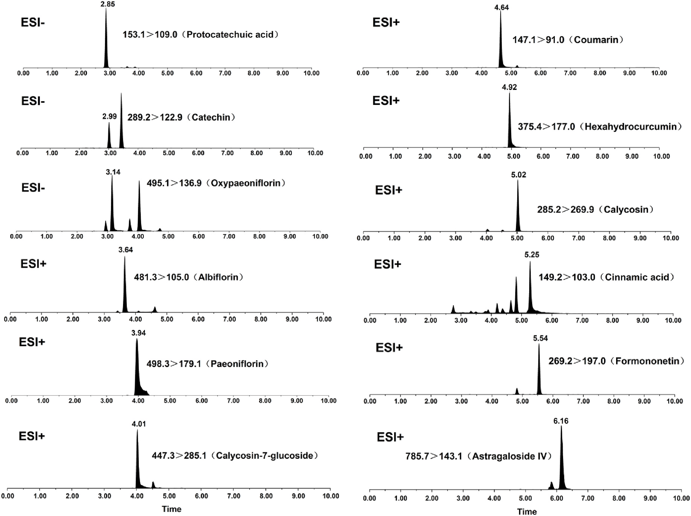

<!-- 方針: ほぼ全訳＋必要に応じた補足。原文構成（Abstract→Introduction→Materials and methods→Results and discussion→Conclusion）に沿って訳出。「> 補足:」は訳者注。 -->

## 書誌情報

- 原題: A comprehensive quality evaluation for Huangqi Guizhi Wuwu decoction by integrating UPLC-DAD/MS chemical profile and pharmacodynamics combined with chemometric analysis
- 著者: Maoyuan Jiang, Lele Yang, Liang Zou, Lei Zhang, Shengpeng Wang, Zhangfeng Zhong, Yitao Wang, Peng Li（責任著者）
- 所属: State Key Laboratory of Quality Research in Chinese Medicine, Institute of Chinese Medical Sciences, University of Macau（マカオ）／School of Food and Biological Engineering, Chengdu University（成都）／Laboratory Animal Center, Sichuan Academy of Chinese Medicine Sciences（成都）
- 掲載: *Journal of Ethnopharmacology* 319 (2024) 117325. https://doi.org/10.1016/j.jep.2023.117325
- インパクトファクター: **5.4**（*Journal of Ethnopharmacology*, JCR 2024 / Clarivate。2025年6月公表のJCR値。Scopus系サイトが示す「6.5前後」の数値はJCRの公式値ではないため採用せず）
- 受理経過: 受領 2023-07-13 / 改訂 2023-09-30 / 採録 2023-10-15 / オンライン公開 2023-10-16
- キーワード: Quality evaluation（品質評価）, Q-markers（品質マーカー）, Chemical fingerprint（化学指紋）, Spectrum-effect relationship（スペクトル-効果相関）, Huangqi Guizhi Wuwu decoction（黄耆桂枝五物湯）

> 補足: HGWD = 黄耆桂枝五物湯（Huangqi Guizhi Wuwu Decoction）。RA = リウマチ性関節炎（rheumatoid arthritis）。AR/PRA/CR/ZRR/JF はそれぞれ黄耆(Astragali Radix)・白芍(Paeoniae Radix Alba)・桂枝(Cinnamomi Ramulus)・生姜(Zingiberis Rhizoma Recens)・大棗(Jujubae Fructus)を指す。Q-marker = 品質マーカー（quality marker）。VIP = variable importance in projection（PLSR/OPLS-DAでの変数重要度）。

## 要旨（Abstract）

**民族薬理学的関連性:** 黄耆桂枝五物湯（HGWD）は『金匱要略』に原典を持つ古典的漢方処方で、人の「血痺」（「痺」証の一種）の治療に用いられてきた。臨床では、HGWDはリウマチ性関節炎（RA）の治療に応用されている。

**研究目的:** 薬効と化学的特徴の両方を反映する化学マーカーの特定は、TCM（伝統中国医学）の品質管理にとって重要な意義を持つ。本研究は、HGWDの抗RA作用を例に、全体的な化学プロファイルと生物活性データを組み合わせて化学マーカーを同定する包括的な戦略の構築を目的とした。

**材料と方法:** 第一に、超高速液体クロマトグラフィー-ダイオードアレイ検出器（UPLC-DAD）指紋分析法を確立・バリデーションし、異なる産地由来のHGWDの全体的な品質を評価した。UPLC-DAD指紋分析とケモメトリクス手法を組み合わせ、産地に関連する特徴的マーカーをスクリーニングした。第二に、15バッチのHGWD試料の化学プロファイルを、UPLC結合型ハイブリッド線形イオントラップ-Orbitrap質量分析（UPLC-HRMS）で特徴づけた。続いて、15バッチのHGWD試料のin vitro抗RA活性を評価した。第三に、スペクトル-効果相関解析を実施し、品質マーカー候補となり得る生物活性化合物を特定した。最後に、UPLC-トリプル四重極タンデム質量分析法を最適化・確立し、15バッチのHGWDにおける特徴的マーカーおよび品質マーカーの定量分析を行った。

**結果:** UPLC-DAD指紋分析では合計30個の共通ピークが割り当てられた。9個のピークが特徴的マーカーとして認識された：プロトカテク酸、クマリン、桂皮酸、オキシパエオニフロリン、パエオニフロリン、カリコシン、ホルモノネチン、カテキン、アルビフロリンである。さらに、UPLC-HRMS化学プロファイルでは95種の共通化合物が同定された。薬理解析の結果、15バッチのHGWD試料の抗RA活性は大きく異なることが示された。スペクトル-効果相関解析では、抗RA活性と正に相関する30種の潜在的生理活性成分が明らかになった。そのうち相対量1%を超える5化合物（パエオニフロリン、アストラガロシドIV、ヘキサヒドロクルクミン、ホルモノネチン、カリコシン-7-グルコシド）が品質マーカーとして選定され、その活性はLPS誘導RAW264.7マクロファージで検証された。最後に、上記12種の代表成分が15バッチのHGWD試料で同時に定量された。

**結論:** 全体的な化学プロファイルと代表成分評価を組み合わせたこの体系的戦略は、HGWDの品質評価を改善するための信頼性の高い有効な手法となり得る。

> 補足: Abbreviations（略語一覧、原文）: TCMs＝Traditional Chinese medicines（伝統中国医薬）; RA＝rheumatoid arthritis; UPLC-DAD＝ultra-performance liquid chromatography coupled with diode array detector; GC-MS＝gas chromatography-mass spectrometry; PLSR＝partial least squares regression; ANN＝artificial neural network; HGWD＝Huangqi Guizhi Wuwu Decoction; AR＝Astragali Radix; PRA＝Paeoniae Radix Alba; CR＝Cinnamomi Ramulus; ZRR＝Zingiberis Rhizoma Recens; JF＝Jujubae Fructus; TQ-MS/MS＝triple quadrupole tandem mass spectrometry; RSD＝relative standard deviation; MRM＝multiple reaction monitoring; VIP＝variable importance in projection。

## 1. 序論（Introduction）

伝統中国医薬（TCMs）は多成分・多標的という特徴を持ち、特に処方（方剤）は中国および東洋諸国で広く用いられてきた。TCMの化学成分は、多様な産地、含まれる複数の基原種、そして異なる前処理方法の影響を受けやすい。したがって、全体的な化学プロファイルを反映し、代表的成分を評価する包括的・体系的な品質管理戦略は、臨床における安全性と有効性を保証する上で不可欠である。超高速液体クロマトグラフィー-ダイオードアレイ検出器（UPLC-DAD）指紋分析は広く検討されており、TCMの全体的品質評価に適切に応用されている。加えて、薬効に関連する代表的成分の精密な定量も、統合的な品質管理において有益である。しかし多くの場合、TCMの有効性・安全性を推定するために定量的に検出されるのは1つないし数個の化学成分にとどまる（National Medical Products Administration, 2020）。これらの成分だけではTCMの本来の特性を正しく反映できないことは明らかである。したがって、TCMの治療効果に最も寄与する品質マーカー（Q-marker）は、治療効果の物質的基盤を理解し、薬理活性に基づく品質管理を開発する上で重要な役割を果たす。

これまで、高分解能かつ十分な感度を持つ様々な多成分分析技術がTCMの化学プロファイル特徴づけに用いられてきた。例えばUPLC-DAD、液体クロマトグラフィー-質量分析（UPLC-MS）、ガスクロマトグラフィー-質量分析（GC-MS）、定量的核磁気共鳴（QNMR）などである。しかし、高スループット分析技術によって得られる膨大な化学情報の中から、Q-markerとして機能する特定の化学化合物をスクリーニング・認識することはできない。このギャップを埋めるため、灰色関連解析（GRA）、部分最小二乗回帰（PLSR）解析、人工ニューラルネットワーク（ANN）といったケモメトリクス手法によって、薬効と化学プロファイルの相関（スペクトル-効果相関）を解析する手法が提案されてきた。特にPLSRは、試料数が変数数よりはるかに少ない場合のスペクトル-効果相関の決定によく用いられる。したがって、大量の化学プロファイルデータを含むTCMに対してPLSRによりスペクトル-効果相関を確立することがより適切である。

黄耆桂枝五物湯（HGWD）は古典的漢方処方で、『金匱要略』に「養血温経」の効能を持つものとして原典が記されている。HGWDは伝統的に、身体のしびれと四肢の痛みを特徴症状とする「血痺」（「痺」証の一種）の治療に用いられてきた。HGWDは白芍(PRA)・桂枝(CR)・黄耆(AR)・生姜(ZRR)・大棗(JF)の5つの生薬から構成される。現代の薬理研究では、HGWDが鎮痛作用、神経伝達物質の調節作用、そして抗リウマチ性関節炎（RA）作用を持つことが明らかにされている。さらに多くの臨床試験で、HGWDがRA治療において信頼できる治療効果を持つことが示されている。特に、関節痛などRAが引き起こす臨床症状は「血痺」の症状と類似している。これまでの科学研究でも、HGWDの抗RA効果が実証されている。例えば、足関節滑膜の炎症がHGWD投与によって軽減されることが示されている。しかし、特にRA治療への貢献度が最も高い化学成分について、合理的な品質評価が不足している。したがって、有効性に寄与する成分を明らかにすることが課題となる。異常な免疫細胞応答によって引き起こされる炎症は、RAの病態形成に関与している。これらの免疫細胞のうち、炎症惹起性のM1マクロファージは、炎症性サイトカイン（IL-6やTNF-αなど）レベルの上昇を誘導することで関節の破壊を引き起こし、RAの進行を制御する上で決定的な役割を果たす。古典的で成熟した炎症細胞モデルとして、LPS誘導RAW264.7マクロファージは抗RA化合物のスクリーニングに広く用いられてきた。

本研究では、全体的な化学プロファイルの決定と化学マーカーの発見を統合した包括的戦略をHGWDの品質評価のために提案した。ここでの化学マーカーとは、産地の多様性を反映する特徴的マーカーと、薬理活性に基づくQ-markerの両方を指す。第一に、異なる由来を持つ15バッチのHGWD試料の全体的品質を評価するため、UPLC-DAD指紋分析を確立・バリデーションした。次いで、30個の共通ピークを持つUPLC-DAD指紋とケモメトリクスを効率的に組み合わせ、産地に関連する特徴的マーカーを効果的にスクリーニングした。第二に、指紋分析に結合したハイブリッド線形イオントラップ(LTQ)-Orbitrap質量分析法により、15バッチのHGWD試料のUPLC-MS化学プロファイルを決定した。さらに、HGWD各バッチの抗RA活性を評価した。スペクトル-効果相関解析により、Q-markerとなり得る生理活性成分を発見し、その活性をさらに検証した。最後に、UPLCトリプル四重極タンデム質量分析（UPLC-TQ-MS/MS）による12種の代表成分の迅速・同時定量法を最適化・確立し、15バッチのHGWDに適用した。

## 2. 材料と方法（Materials and methods）

### 2.1 材料と試薬

広州白雲山板橋（Guangzhou Baiyunshan Pangaoshou Pharmaceutical Co., Ltd、広東省広州市）より、15バッチの黄耆(AR)、白芍(PRA)、桂枝(CR)、生姜(ZRR)、大棗(JF)の提供を受け、それぞれの基原種と産地が記録された（Table S1）。全ての生薬はマカオ大学のPeng Li教授により鑑定された。

対照標準品（プロトカテク酸、プロトカテクアルデヒド、オキシパエオニフロリン、アルビフロリン、パエオニフロリン、クマリン、カリコシン-7-グルコシド、シンナムアルデヒド、桂皮酸、カリコシン、2-メトキシシンナムアルデヒド、シンナミルアルコール、ベンゾイルパエオニフロリン、ホルモノネチン、アストラガロシドIV、6-ジンゲロール、6-ショウガオール、アストラガロシドII、アストラガロシドI、8-ジンゲロール、イソクエルシトリン、プロシアニジンB1、カテキン、プロシアニジンB2、エピカテキン、ヘキサヒドロクルクミン、ロイシン）は成都MUSTバイオテクノロジー社（中国・成都）より供給された。LC-MSグレードのアセトニトリルとメタノールはBaker社（米国・サンフォード）から入手した。

RAW264.7マウスマクロファージは武漢Procell Life Science and Technology社から入手した。ウシ胎児血清（FBS）、リン酸緩衝生理食塩水（PBS）、Dulbecco改変Eagle培地（DMEM）、トリプシン-EDTAはGIBCO社（米国・グランドアイランド）から購入した。ジメチルスルホキシド（DMSO）とリポ多糖（LPS）はSigma-Aldrich社（米国・セントルイス）から提供された。デキサメタゾン、ペニシリン-ストレプトマイシン（Pen Strep）、CCK-8（2-(2-メトキシ-4-ニトロフェニル)-3-(4-ニトロフェニル)-5-(2,4-ジスルホフェニル)-2H-テトラゾリウム、モノナトリウム塩）はBeyotime Biotechnology社（中国・上海）から提供された。マウスTNF-α・IL-6のELISAキットはいずれもNeoBioscience社（中国・深圳）から入手した。

### 2.2 試料溶液の調製と化学標準品

HGWD試料は古典的漢方文献「金匱要略」の記載どおりに調製した。AR(41.25 g)、PRA(41.25 g)、CR(41.25 g)、JF(41.25 g)、ZRR(82.5 g)を1200 mLの蒸留水に0.5時間浸漬した後、1時間煎じた。得られた溶液を2層のガーゼで濾過し、生薬1 gあたり1 mLとなるよう濃縮した。最終的に濃縮溶液を凍結乾燥し、乾燥剤入りの容器で保存した。

乾燥粉末試料（0.5 g）を25 mLの70%メタノール水溶液（v/v）に再溶解し、室温で30分間超音波処理した。上清を13,800×gで10分間遠心分離して回収し、指紋分析および定量分析に用いた。単味生薬の試料も同様の方法で調製した。各対照標準品を精密に秤量してメタノールに溶解しストック溶液を調製し、分析前にさらに希釈して必要な濃度の作業溶液を得た。

### 2.3 UPLC-DAD指紋分析

UPLC指紋分析には、Dionex UltiMate 3000 迅速分離バイナリーシステム（Dionex, Thermo Fisher Scientific社、米国）を用いた。試料分離にはHypersil GOLD C18カラム（150 mm × 2.1 mm, 1.9 μm、Thermo Fisher）を用い、カラム温度は40 ℃とした。流速は0.4 mL/minに設定した。移動相は0.2%ギ酸水溶液（v/v）(A)とアセトニトリル(B)で構成した。グラジエント溶出は以下のとおり実施した：0–5 min, 5% B; 5–25 min, 5–12% B; 25–45 min, 12–20% B; 45–55 min, 20–40% B; 55–65 min, 40–95% B; 65–70 min, 95% B。注入量は2 μLとした。UVスペクトルは波長280 nmで記録した。

### 2.4 指紋分析の精度・再現性・安定性

各共通ピークの平均相対保持時間（RRT）と相対ピーク面積（RPA）の参照ピークに対する相対標準偏差（RSD）を用いて、指紋分析法を評価した。精度は同一試料溶液を6回評価して求めた。再現性は並行して調製した6検体の試料溶液を用いて評価した。安定性は同一試料を同日内の0, 3, 6, 9, 12, 24時間の時点で評価して決定した。

### 2.5 LTQ-Orbitrap質量分析条件

ハイブリッドLTQ-Orbitrap質量分析計（Thermo Fisher Scientific社、ドイツ・ブレーメン）をUPLC指紋分析システムに接続した。ESI正負両モードを以下の最適パラメーターで使用した：イオンスプレー電圧 4.5/−4.0 kV；キャピラリー温度 350/350 ℃；キャピラリー電圧 35/−35 V；チューブレンズ電圧 100/−100 V。フルスキャンイベントはm/z 100–2000の範囲で実施し、5回のデータ依存取得（DDA）イベントでスキャンサイクルを構成した。高分解能Orbitrap質量分析計を分解能30000で使用した。DDAイベントでは、フルスキャンイベントで最も強い応答を示した5個のイオンについて、動的除外を伴うMS2フラグメンテーションデータを取得した。単離幅m/z 2.0で、衝突誘起解離(CID)の規格化衝突エネルギーは35%に設定した。

### 2.6 化学プロファイルデータの前処理

Xcalibur 2.1ソフトウェアで取得した生データをThermo Compound Discoverer 3.2（Thermo Fisher Scientific社、米国）に取り込み、ピーク検出・アラインメント・フィルタリング・グルーピングを行った。次に、統合ピーク面積、m/z、保持時間(RT)を含むデータセットを取得した。関連する対照標準品およびThermo Compound Discoverer 3.2内のデータベースとの正確な質量値・MS2フラグメンテーションとの比較により、15バッチのHGWD試料に共通するピークを暫定的に同定した。各ピークにおける化合物の相対量は、各試料内の全体のピーク面積に対する各化合物のピーク面積の比較により求め、15バッチの試料における各化合物の平均相対量を算出した。データの正規化はMetaboAnalyst 5.0オンラインアルゴリズムの統計解析モジュールを用いて、さらなる多変量解析のために実施した。

### 2.7 細胞培養

マウス単球マクロファージ白血病細胞株RAW264.7は、10%FBSと1%ペニシリン-ストレプトマイシンを含むDMEM中で、37 ℃・5%CO2で培養した。乾燥HGWD粉末はDMSOに溶解し、必要な濃度になるよう培地で希釈した。DMSOの最終濃度は0.1%未満とした。

### 2.8 RAW264.7細胞生存率アッセイ

HGWD試料の細胞毒性活性は、RAW264.7細胞における比色CCK-8アッセイにより試験した。細胞（8 × 10³ cells/well）を96ウェルプレートに播種し、細胞接着後に異なる濃度（6.25, 12.5, 25, 50, 100, 200 μg/mL）のHGWD試料溶液を添加した。37 ℃・CO2インキュベーター内で48時間培養後、各ウェルに10% CCK-8を添加し、37 ℃でさらに2時間インキュベートした。生存率は、SpectraMax M2マイクロプレートリーダー（Molecular Devices社、米国）を用いて450 nmでの吸光度を測定することで解析した。

### 2.9 LPS誘導RAW264.7細胞モデル

RAW264.7細胞を24ウェルプレートに10⁵ cells/wellで培養し、その後15バッチのHGWD（ウェル内最終濃度50 μg/mL）の存在下あるいは非存在下で、培地またはLPS（ウェル内最終濃度100 ng/mL）で48時間処理した。上清を回収し、市販のELISAキットを用いてTNF-αとIL-6の濃度を測定した。全てのデータは、モデル群（LPS単独群）を基準とした低下率に変換した：指標の低下率 = (LPS群 − 薬剤投与群)/LPS群 × 100%。

> 補足: 本文中では処理時間を「48 h」と記載しているが、後述の図3のキャプションでは同じ実験について「24 h」処理と記されている（原文ママ。両者の不一致は原著の記載どおりで、本訳では修正せず併記する）。

### 2.10 定量分析のためのUPLC-TQ-MS/MS条件

標的分析対象物の定量に用いた装置は、ACQUITY I-Class UPLCシステムにXevo TQ-S micro QQQ質量分析計（Waters Corp.社、英国）を接続したものである。クロマトグラフィーにはHypersil GOLD C18カラム（150 mm × 2.1 mm, 1.9 μm、Thermo Fisher）を40 ℃で使用した。注入量は2 μLとした。移動相は0.2%ギ酸水溶液(A)とメタノール(B)とした。グラジエント溶出プログラムは以下のとおり：0–3 min, 5–50% B; 3–5 min, 50–95% B; 5–7 min, 95% B; 7–8 min, 95–5% B; 8–10 min, 5% B。流速は0.3 mL/minとした。

多重反応モニタリング(MRM)を正負両モードで実施し、最適MSパラメーターは以下のとおりであった：キャピラリー電圧 3.0 kV；ソース温度 150 ℃；脱溶媒温度 350 ℃；コーンガス流量 30 L/h。MRMモードにおける最適化パラメーターはTable S2に示す。機器制御とデータ処理はMassLynx 4.2ソフトウェア（Waters Corp.社、米国）で実施した。

### 2.11 UPLC-TQ-MS/MS法バリデーション

#### 2.11.1 直線性、検出限界・定量限界

検量線の作成にあたり、適切な濃度の各種標準作業溶液を評価した。シグナル対ノイズ比(S/N)3における各分析対象物の濃度を検出下限(LLOD)とみなし、S/N比10における濃度を定量下限(LLOQ)とみなした。

#### 2.11.2 精度、再現性、安定性、正確性

精度試験では、同一の混合作業溶液を6回分析した。再現性については、独立に調製した6検体を試験した。安定性については、同一試料溶液を同日内の6時点(0, 3, 6, 9, 12, 24時間)で評価した。回収試験も実施した：既知量の各化学標準品をHGWD試料に添加して6検体を並行して調製し、試料抽出法を適用した。回収率(%)は以下の式で算出した：回収率(%) = (検出量 − 元の量)/添加量 × 100%。

### 2.12 統計解析

Similarity Evaluation System for Chromatographic Fingerprint of Traditional Chinese Medicine（version 2004A）を用いて、クロマトグラフィー指紋の類似度解析(SA)を自動的に評価した。共通ピークはピークアラインメントにより認識した。割り当てられた共通ピーク面積はMetaboAnalyst 5.0で正規化し、SIMCA-P+14.1（Umetrics社、スウェーデン・ウメオ）に取り込んでケモメトリクス解析を実施した。生MSおよびMSnフラグメンテーションデータはXcalibur 2.1ソフトウェアとThermo Compound Discoverer 3.2（Thermo Fisher Scientific社、米国）で取得・可視化した。質量許容範囲は10 ppm以内とした。定量的UPLC-TQ-MS/MS解析にはMassLynx 4.2ソフトウェア（Waters Corp.社、米国）を用いた。

PLSRモデルはSIMCA-P（SIMCA-P 14.1, Umetrics社、スウェーデン）ソフトウェアで構築し、各バッチのHGWDにおける共通ピーク（説明変数）とその抗RA活性（応答変数）との相関を説明した。回帰式のR2を用いて回帰モデルの予測能を評価した。回帰係数と変数重要度(VIP)値を組み合わせることで、PLSRモデルにおける応答変数への説明変数の相対的寄与を推定し、潜在的な品質管理マーカーとなり得る活性化合物を同定した。

## 3. 結果と考察（Results and discussion）

### 3.1 HGWD試料調製の最適化

試料の再構成のため、メタノール濃度の勾配（10%、40%、70%、100%）を分析し、HGWDの抽出方法を最適化するため4種類の異なる抽出時間（10, 30, 45, 60分）を評価した。30–40分の範囲のピークは、メタノール濃度の増加（10%–70%）に伴いシグナル強度が高くなり、70%メタノールが望ましい抽出溶媒であることが示された(Fig. S1)。Fig. S2に示すとおり、30分以降は抽出効率の明らかな増加は見られなかった。したがって、乾燥粉末試料は、試料質量：溶媒体積比1:50で70%メタノールを用い、30分間超音波抽出することとした。

### 3.2 UPLC-DAD指紋分析条件の最適化

TCMの包括的品質管理のためにより多くの化学情報を得るには、高感度な適切な検出器を採用する必要がある。したがってDADとエアロゾルベース検出器(CAD)の結果を比較したところ、DADの方がより多くの検出可能なピークを与え、特に検出波長280 nmでその傾向が顕著であった(Fig. S3)。続いて、フルスキャンモード（190–400 nm）を用いて、280 nmでより多くのピークとより高いシグナル応答が観察されることを確認し、この波長がHGWDの全体的化学プロファイルをより良く反映するとして選択した。次に、XSELECT CSH C18（150 mm × 3 mm, 2.5 μm, Waters）、Hypersil GOLD C8（150 mm × 2.1 mm, 3 μm, Thermo Fisher）、ACQUITY UPLC BEH C18（100 mm × 2.1 mm, 1.7 μm, Waters）、Hypersil GOLD C18（150 mm × 2.1 mm, 1.9 μm, Thermo Fisher）の4種のカラムを評価した。その結果、Hypersil GOLD C18カラムが他の3種と比較してより良好なピーク形状と高い分解能を与えることが分かった(Fig. S4)。次に、アセトニトリル-水系とメタノール-水系の2種類の移動相を用いて結果を比較したところ、メタノール-水系と比較してアセトニトリル-水系の方が良好な分解能が得られることが観察された(Fig. S5)。ピーク形状と分解能を最適化するため、0.1%、0.2%、0.4%の異なる濃度のギ酸(FA)水溶液を移動相として用いた。アセトニトリル-水よりも、FAを含むアセトニトリル-水の方がより高いピーク応答が観察された(Fig. S6)。ピークの検出性が向上し、また固定相がFAに耐性を持つことを考慮し、アセトニトリル-0.2% FAをHGWD分析に望ましい条件として決定した。さらに、グラジエント溶出プログラムを最適化し、UPLC-DAD指紋分析条件の項で述べたとおりに実施した。

### 3.3 UPLC-DAD指紋分析

提案されたUPLC-DAD法を、異なる産地由来の15バッチのHGWD試料の分析に適用し、得られたクロマトグラムをSimilarity Evaluation System for Chromatographic Fingerprint of Traditional Chinese Medicine（version 2004A）に取り込んで評価した(Fig. S7)。加えて、認識された30個の共通ピークを用いてHGWDの参照UPLC指紋を確立した(Fig. 1)。このうち、桂皮酸(保持時間 = 38.33分)と同定されたピーク22は、その高い分解能、対称的なピーク形状、適度な保持時間から、他の共通ピークの相対保持時間(RRT)と相対ピーク面積(RPA)を算出するための参照ピークとして選択された。さらに、プロトカテク酸4-グルコシド(ピーク1)、プロトカテク酸(ピーク2)、カテキン(ピーク5)、オキシパエオニフロリン(ピーク6)、プロシアニジンB2(ピーク7)、エピカテキン(ピーク8)、トリフィリンB(ピーク9)、アルビフロリン(ピーク10)、パエオニフロリン(ピーク11)、クマリン(ピーク13)、カリコシン-7-グルコシド(ピーク15)、エロラマイシンB(ピーク17)、カリコシン(ピーク23)、2-メトキシシンナムアルデヒド(ピーク24)、ホルモノネチン(ピーク25)、6-ショウガオール(ピーク26)(Fig. 1)が、対照標準品およびThermo Compound Discoverer 3.2データベースとの照合により暫定的に同定された。

指紋分析の精度・再現性・安定性の項で述べたとおり、精度のRSDはRRTで0.7%未満、RPAで3.6%未満であった。再現性については、RRTのRSDが0.9%以下、RPAのRSDが4.8%以下であった。安定性のRSDはRRTで0.5%未満、RPAで4.9%未満であり、試料が24時間安定であることが示された。したがって、提案されたUPLC-DAD指紋分析法はHGWDの品質評価に使用するうえで信頼できるものであった。

### 3.4 類似度解析(SA)

15バッチ全てのHGWD試料の指紋は、参照指紋と類似していた。各バッチHGWD試料のクロマトグラムと参照指紋クロマトグラムとの類似性を比較するため、相関係数を用いた。Table 1に示すとおり、0.929から0.994の範囲の相関係数が決定され、これらの試料の高い一貫性と安定性が示された。

**Table 1. 15バッチのHGWDのクロマトグラム類似度**

| No. | S1 | S2 | S3 | S4 | S5 | S6 | S7 | S8 | S9 | S10 | S11 | S12 | S13 | S14 | S15 | R |
|---|---|---|---|---|---|---|---|---|---|---|---|---|---|---|---|---|
| S1 | 1 | | | | | | | | | | | | | | | |
| S2 | 0.956 | 1 | | | | | | | | | | | | | | |
| S3 | 0.969 | 0.966 | 1 | | | | | | | | | | | | | |
| S4 | 0.977 | 0.956 | 0.992 | 1 | | | | | | | | | | | | |
| S5 | 0.969 | 0.956 | 0.964 | 0.98 | 1 | | | | | | | | | | | |
| S6 | 0.97 | 0.97 | 0.972 | 0.979 | 0.972 | 1 | | | | | | | | | | |
| S7 | 0.983 | 0.961 | 0.966 | 0.974 | 0.96 | 0.983 | 1 | | | | | | | | | |
| S8 | 0.907 | 0.949 | 0.932 | 0.914 | 0.875 | 0.947 | 0.945 | 1 | | | | | | | | |
| S9 | 0.992 | 0.97 | 0.97 | 0.978 | 0.973 | 0.983 | 0.994 | 0.931 | 1 | | | | | | | |
| S10 | 0.971 | 0.965 | 0.964 | 0.976 | 0.985 | 0.985 | 0.966 | 0.901 | 0.977 | 1 | | | | | | |
| S11 | 0.976 | 0.944 | 0.935 | 0.957 | 0.97 | 0.964 | 0.98 | 0.884 | 0.986 | 0.97 | 1 | | | | | |
| S12 | 0.952 | 0.934 | 0.943 | 0.935 | 0.907 | 0.931 | 0.935 | 0.876 | 0.948 | 0.937 | 0.929 | 1 | | | | |
| S13 | 0.87 | 0.868 | 0.92 | 0.893 | 0.817 | 0.89 | 0.906 | 0.926 | 0.885 | 0.835 | 0.827 | 0.883 | 1 | | | |
| S14 | 0.956 | 0.939 | 0.939 | 0.953 | 0.948 | 0.967 | 0.987 | 0.92 | 0.979 | 0.945 | 0.977 | 0.908 | 0.895 | 1 | | |
| S15 | 0.87 | 0.892 | 0.882 | 0.867 | 0.824 | 0.903 | 0.93 | 0.966 | 0.905 | 0.838 | 0.863 | 0.832 | 0.942 | 0.933 | 1 | |
| R | 0.979 | 0.975 | 0.982 | 0.981 | 0.961 | 0.989 | 0.994 | 0.960 | 0.992 | 0.970 | 0.968 | 0.949 | 0.929 | 0.980 | 0.936 | 1 |

> 補足: 空欄は原表でも数値が示されていない箇所（対称行列のため下三角部分のみ掲載）。Rは参照(Reference)指紋との相関係数を示す行。

### 3.5 特徴的マーカーをスクリーニングするための直交部分最小二乗判別分析(OPLS-DA)

TCMは数千年の発展の中で、生薬ごとの産地の多様性が徐々に拡大してきた。本研究では、代表的な産地として、それぞれの主要産地に由来する15バッチのAR、PRA、CR、ZRR、JFを収集した。15バッチのHGWD試料間の品質差異をさらに特定するため、正規化した共通ピーク面積を用いて教師あり型OPLS-DAモデルを構築した。構築モデルの適合度(R2Y)と予測性(Q2)はそれぞれ97%、72%であった。Fig. S8aに示す検証結果は、構築モデルの高い信頼性を示している。Fig. S8bに示すとおり、15バッチのHGWD試料は由来に基づき3つの独立した領域に分かれ、化学組成の本質的な差異を表し、環境条件の違いがHGWD中の成分の組成・含量に影響し得ることを示した。続いて、変数重要度(VIP)値に基づき、クラスター判別への寄与が最も大きい成分をスクリーニングした。Fig. S8dに示すとおり、VIP値が1.00を超える16個の共通ピークが選抜された。さらに、これらの化合物はFig. S8cに示すとおり最大の負荷量係数を有していた。このうち、プロトカテク酸(ピーク2)、クマリン(ピーク13)、桂皮酸(ピーク22)、オキシパエオニフロリン(ピーク6)、パエオニフロリン(ピーク11)、カリコシン(ピーク23)、ホルモノネチン(ピーク25)、カテキン(ピーク5)、アルビフロリン(ピーク10)の9化合物が、産地の多様性を反映する特徴的マーカーとして同定・選定された。

### 3.6 UPLC-LTQ-Orbitrap質量分析によるHGWDの化学プロファイル決定

ハイブリッドLTQ-Orbitrap質量分析計をUPLC指紋分析システムに接続し、各HGWD試料の化学組成を分析した。正負モードでのHGWDの代表的な全イオンクロマトグラム(TIC)をFig. S9に示す。関連する対照標準品との正確な質量・MS2フラグメンテーション値の比較、文献報告値（Cheng et al., 2020; Guo et al., 2010; Tong et al., 2021; Wang et al., 2019; Yang et al., 2020; Zhang et al., 2014）、およびThermo Compound Discoverer 3.2データベースとの照合により、15バッチのHGWD試料から95個の共通ピークが暫定的に同定された。内訳はフェノール類27種、フラボノイド配糖体20種、テルペノイド配糖体13種、フラボノイド10種、有機酸8種、糖類4種、その他13種であった(Table S3)。各化合物の由来解析は、各生薬のLC-MSプロファイルを検討することにより実施し、5種の生薬のTICをFig. S10に示した。さらに、95個の共通ピークの統合ピーク面積と保持時間からなるデータセットをThermo Compound Discoverer 3.2で取得した。その後、各ピーク面積をMetaboAnalyst 5.0オンラインアルゴリズムでさらなる多変量解析のために正規化し、結果をTable S4にまとめた。

### 3.7 異なる由来のHGWD試料の生物活性

#### 3.7.1 細胞生存率アッセイ

RAW264.7細胞に対するHGWDの毒性はCCK-8アッセイにより評価した。6.25から200 μg/mLの濃度範囲のHGWDは、48時間以内にRAW264.7細胞に対して毒性を示さなかった(Fig. 2)。

#### 3.7.2 HGWDはLPS誘導RAW264.7細胞モデルにおいて炎症性サイトカインの放出を抑制する

LPS刺激RAW264.7細胞からのTNF-αとIL-6の放出に対するHGWDの効果を観察した。LPS刺激後、TNF-αとIL-6のレベルは有意に上昇した(p < 0.01, 対照群比)が、HGWD（50 μg/mL）処理後にはTNF-αとIL-6の含量が低下した。さらに、15バッチのHGWDが生み出す抑制効果はそれぞれ異なっていた(Fig. 3)。

### 3.8 PLSRによるスペクトル-効果相関解析

本研究では、回帰式はSIMCA-Pソフトウェアにより決定した。次に、回帰係数とVIP値を用いて各説明変数の応答変数への相対的影響を評価した。PLSR解析では、従来法（Thermo Compound Discovererが検索した全ピークをPLSR解析に取り込む方法）とは異なり、95試料それぞれの正規化ピーク面積のみを説明変数(X)として用い、HGWDの各薬効指標を個別に応答変数(Y)とみなした。

Fig. 4aに示すとおり、回帰式のR2は0.9428であり、回帰モデルが良好な予測能を持つことが示された。VIP > 1の19個のクロマトグラフィーピークがTNF-αの低下と正に相関していた：P28, P27, P5, P94, P26, P3, P88, P11, P6, P58, P34, P84, P90, P57, P2, P83, P87, P14, P10。解析結果はTable S5およびFig. 4c, eに示した。

Fig. 4bに示すとおり、回帰式のR2は0.9672であった。VIP > 1の15個のクロマトグラフィーピークがIL-6の低下と正に相関していた：P57, P3, P80, P85, P73, P19, P44, P87, P82, P63, P55, P37, P76, P54, P83。解析結果はTable S6およびFig. 4d, fに示した。

### 3.9 潜在的抗RA化合物の炎症性サイトカインへの抑制効果の検証

品質マーカー(Q-marker)の基本的性質（特異性と測定可能性）を踏まえ、HGWD中の30個の潜在的抗炎症化合物のうち、相対量1%を超える5つの化学化合物がQ-markerとして採用された：P34（パエオニフロリン、8.02%）、P84（アストラガロシドIV、1.24%）、P73（ヘキサヒドロクルクミン、1.60%）、P82（ホルモノネチン、3.39%）、P37（カリコシン-7-グルコシド、2.42%）。次に、これら5つの潜在的抗RA化合物それぞれの炎症性サイトカインに対する抑制効果を評価した。陽性対照としてデキサメタゾンを用いた。

結果として、パエオニフロリンとアストラガロシドIVはLPS誘導RAW264.7細胞モデルにおいてTNF-αの放出を抑制でき、ヘキサヒドロクルクミン、ホルモノネチン、カリコシン-7-グルコシドはIL-6の放出に対して抑制効果を示すことが示された(Fig. S11)。パエオニフロリン、アストラガロシドIV、ヘキサヒドロクルクミン、ホルモノネチン、カリコシン-7-グルコシドのIC50値は、それぞれ144 μM、407 μM、76 μM、535 μM、686 μMであった。TNF-α産生を抑制した2化合物とIL-6放出を抑制した3化合物の活性は、正の回帰係数の順序と一致していた。

さらに、6-ショウガオール、没食子酸、ロガニン、ピノレジノール、リンゴ酸など、他の正に相関する化合物についても抗炎症活性が報告されている(Bischoff Kont and Furst, 2021; Choi et al., 2021; Lee et al., 2019; Tanaka et al., 2018)。以上の結果から、確立されたPLSR解析はHGWDのQ-markerの範囲を絞り込みさらにスクリーニングするうえで信頼できるものであった。

### 3.10 UPLC-TQ-MS/MS条件の最適化

産地の多様性と生物活性の両方に基づく12種の代表成分を同時に定量するため、UPLC-TQ-MS/MS技術による定量分析を実施した。定量分析における高い感度と選択性を達成するため、正負両イオンモードでの多重反応モニタリング(MRM)を用いた。12種の標的分析対象物の関連MS/MSパラメーターは、混合対照標準品を用い、自動MS/MS最適化プログラム(Intelli Start)によって干渉のない最良のピーク強度が得られるよう最適化した。12種の標的分析対象物の正負モードにおける典型的なスペクトルをFig. S12に、最適化パラメーターをTable S2に示した。指紋分析条件をベースに、複雑なHGWD試料中の12種の標的分析対象物の異性体からの干渉を排除するため、確立したMS/MSパラメーターに基づいて移動相組成をさらに最適化した。その結果、アセトニトリル-0.2% FAと比較して、メタノール-0.2% FAで全ての標的化合物においてより良好な分離が達成された。特にオキシパエオニフロリンで顕著であった(Fig. S13)。したがって、定量のための移動相としてメタノール-0.2% FAを採用した。

要約すると、最適パラメーターのMRMモードにより、12種の代表成分全てがわずか7分で独立して分離・検出され、HGWD試料中の12種の代表成分の正負モードにおける代表的なMS/MSスペクトルをFig. 5に示した。

### 3.11 UPLC-TQ-MS/MS定量分析法のバリデーション

#### 3.11.1 直線性ならびに定量限界・検出限界

12種の標的分析対象物の検量線(いずれも相関係数≥0.990)を構築した。詳細をTable 2に示す。定量下限(LLOQ)は0.2から6.2 ng/mL、検出下限(LLOD)は0.04から1.6 ng/mLの範囲で決定された。以上の結果から、確立されたUPLC-TQ-MS/MS法は信頼性が高く、高感度であることが示された。

**Table 2. HGWD中の12種の標的分析対象物の検量線、範囲、LLOD、LLOQ、回収率、精度、再現性、安定性**

| No. | 分析対象物 | 検量線 | r | 範囲(μg/mL) | LLOQ(ng/mL) | LLOD(ng/mL) | 回収率(%, n=6) | 精度(RSD, %) | 安定性(RSD, %) | 再現性(RSD, %) |
|---|---|---|---|---|---|---|---|---|---|---|
| 1 | プロトカテク酸 | y = 12385.4x+1273.3 | 0.997 | 0.09–5.65 | 2.6 | 0.6 | 99.2 ± 1.9 | 0.6 | 1.7 | 1.4 |
| 2 | カテキン | y = 3816.3x+552.3 | 0.997 | 0.10–6.35 | 6.2 | 1.6 | 104.9 ± 2.0 | 0.4 | 1.2 | 2.7 |
| 3 | オキシパエオニフロリン | y = 164889.3x+13562.4 | 0.998 | 0.07–4.30 | 1.1 | 0.1 | 99.8 ± 1.7 | 0.8 | 1.1 | 1.3 |
| 4 | アルビフロリン | y = 304230.1x+67631.5 | 0.990 | 0.91–58.13 | 3.5 | 0.9 | 100.4 ± 2.5 | 0.7 | 1.0 | 0.9 |
| 5 | パエオニフロリン | y = 334987.2x+78681.1 | 0.999 | 1.75–112.00 | 1.7 | 0.8 | 95.8 ± 3.4 | 1.2 | 1.9 | 1.1 |
| 6 | カリコシン-7-グルコシド | y = 394866.0x+18367.4 | 0.997 | 0.07–4.70 | 0.3 | 0.1 | 104.7 ± 6.5 | 2.1 | 1.6 | 2.4 |
| 7 | クマリン | y = 1323080.2x+96132.3 | 0.996 | 0.18–11.80 | 0.2 | 0.04 | 102.1 ± 1.9 | 0.8 | 1.6 | 1.5 |
| 8 | ヘキサヒドロクルクミン | y = 129197.0x+413.0 | 0.998 | 0.05–3.733 | 1.8 | 0.5 | 97.2 ± 6.9 | 1.5 | 1.8 | 2.3 |
| 9 | カリコシン | y = 60845.8x+2234.5 | 0.999 | 0.40–25.0 | 3.0 | 0.7 | 103.2 ± 6.1 | 1.2 | 1.4 | 2.6 |
| 10 | 桂皮酸 | y = 8359.3x+1815.6 | 0.993 | 0.40–25.80 | 3.1 | 1.6 | 103.7 ± 7.4 | 0.9 | 3.9 | 4.3 |
| 11 | ホルモノネチン | y = 284241.1x+10860.5 | 0.998 | 0.12–7.45 | 0.4 | 0.1 | 98.4 ± 1.4 | 1.2 | 1.3 | 1.0 |
| 12 | アストラガロシドIV | y = 93882.8x+1568.9 | 0.998 | 0.07–4.25 | 4.6 | 0.3 | 102.0 ± 8.4 | 1.5 | 1.8 | 4.6 |

> 補足: 検量線のyはピーク面積、xは分析対象物濃度(μg/mL)。LLOQ＝定量下限(S/N=10)、LLOD＝検出下限(S/N=3)。

#### 3.11.2 精度、再現性、安定性、正確性

精度については、2.1%以内のRSDが決定された。再現性のRSDは0.9%から4.6%の範囲であった。安定性については、12種の標的化合物のRSDが24時間で1.0%から3.9%の範囲であった。全分析対象物の全体平均回収率は95.8%から104.9%の範囲であり、許容可能であった（Table 2参照）。

### 3.12 UPLC-TQ-MS/MSによる12種の代表成分の定量

最適化したUPLC-TQ-MS/MS法（MRMモード）を、15バッチのHGWD試料中の12種の代表成分の定量に三重反復で適用した。HGWD試料中の12種の代表成分の全体平均含量はTable S7に示し、3つの異なる産地に由来する12化合物の含量はFig. 6にまとめた。12種の代表成分の含量については、アルビフロリンとパエオニフロリンが他の10化合物と比較してはるかに多量に存在していた。

> 補足: Fig.6のグラフは原文中では軸が途中で区切られた（軸を分割した）棒グラフとして示されており、パエオニフロリン・アルビフロリンが他成分より圧倒的に多いことが視覚的に示されている。ただし各成分の正確な含量(μg/g)の数値は本文中に明記されておらず、詳細な数値はTable S7（補足資料）を参照する必要がある（原文参照）。

## 4. 結論（Conclusion）

本研究では、UPLC-DAD指紋分析、UPLC-HRMS化学プロファイリング、薬力学的評価、多成分定量をケモメトリクスと組み合わせた包括的戦略を、HGWDの品質評価のために確立した。15検体のHGWD試料の指紋を決定し、30個の共通ピークを同定して化学的類似性を評価した。

次に、提案したUPLC-DAD指紋分析とOPLS-DAモデルの組み合わせにより、産地に関連する9個の特徴的マーカーを同定した：プロトカテク酸、クマリン、桂皮酸、オキシパエオニフロリン、パエオニフロリン、カリコシン、ホルモノネチン、カテキン、アルビフロリンである。さらなる品質評価のため、スペクトル-効果相関解析を実施し、HGWDのQ-markerとなり得る生理活性化合物を発見した。UPLC-HRMSに基づく化学プロファイリングにより、15バッチのHGWD試料において95個の共通化合物が暫定的に同定された。薬力学的評価により、異なるバッチ間で抗RA活性が大きく異なることが示された。スペクトル-効果相関解析により、抗RA活性と正に関連する30個の潜在的生理活性化合物がスクリーニングされた。相対量1%を超える5化合物（パエオニフロリン、アストラガロシドIV、ヘキサヒドロクルクミン、ホルモノネチン、カリコシン-7-グルコシド）がHGWDのQ-markerとして採用された。最後に、上記12種の代表成分が15バッチのHGWD試料で同時に定量された。この包括的戦略は、HGWDの品質評価を改善するための信頼性の高い効果的な手法となり得る。

> 補足: 著者貢献声明(CRediT)・利益相反声明・データ利用可能性・謝辞・参考文献リストは、品質評価の内容そのものとは直接関係しないため本訳では割愛する。謝辞欄には、本研究がMacau Science and Technology Development Fund(0006/2020/AKP)およびマカオ大学研究委員会(MYRG 2022-00226-ICMS)の助成を受けたことが記されている。

## 訳者補足

本研究は、単一・少数のマーカー成分による定量だけに頼らず、（1）UPLC-DAD指紋分析＋ケモメトリクス（OPLS-DA）による「産地由来の特徴」の把握、（2）UPLC-HRMSによる網羅的化学プロファイリング＋in vitro薬効試験＋PLSRスペクトル-効果相関解析による「薬効に寄与する成分」の絞り込み、（3）UPLC-TQ-MS/MSによる代表成分の同時定量、という三段構えでHGWDの品質評価体系を構築した点が特徴的である。実務的には、原料の産地・ロットによる指紋の類似度（相関係数0.929–0.994）や含量差（Fig. 6で示された産地間の有意差）をふまえ、産地表示・原料受入基準の設定に指紋分析＋特徴的マーカー（9成分）を用いる一方、製剤としての薬効担保にはQ-marker5成分（特にパエオニフロリンとアルビフロリンは含量が他成分より突出して多く、UPLC-TQ-MS/MSでの定量下限・回収率も良好）の規格化が現実的な運用として想定される。

限界として指摘できる点は次のとおりである。第一に、抗RA活性の評価はLPS誘導RAW264.7マクロファージという単一のin vitro炎症モデルに基づいており、in vivoでのRA病態やヒトでの有効性を直接裏付けるものではない。第二に、PLSRによるスペクトル-効果相関解析は15バッチという比較的少数の試料数に基づいており、説明変数（95ピーク）が試料数を大きく上回るため、統計的な過学習（オーバーフィッティング）のリスクは常に念頭に置く必要がある（論文中でもPLSRが「試料数が変数数より少ない場合」に適した手法として選ばれた背景が述べられている）。第三に、原文の多くの詳細な数値（Table S1–S7、Fig. S1–S13）は補足資料（Supplementary data）に格納されており、本訳の底本としたPDF本文からは数値そのものを確認できない箇所がある（本訳中で「原文参照」と明記した部分）。実務でこれらの詳細情報が必要な場合は、DOI (https://doi.org/10.1016/j.jep.2023.117325) から補足資料を別途参照されたい。また、2.9節（LPS誘導細胞モデルの処理時間）で本文と図3キャプションの間に「48 h」と「24 h」という記載の不一致が原文中にあり、本訳ではこれを修正せず両方を忠実に記載した。
