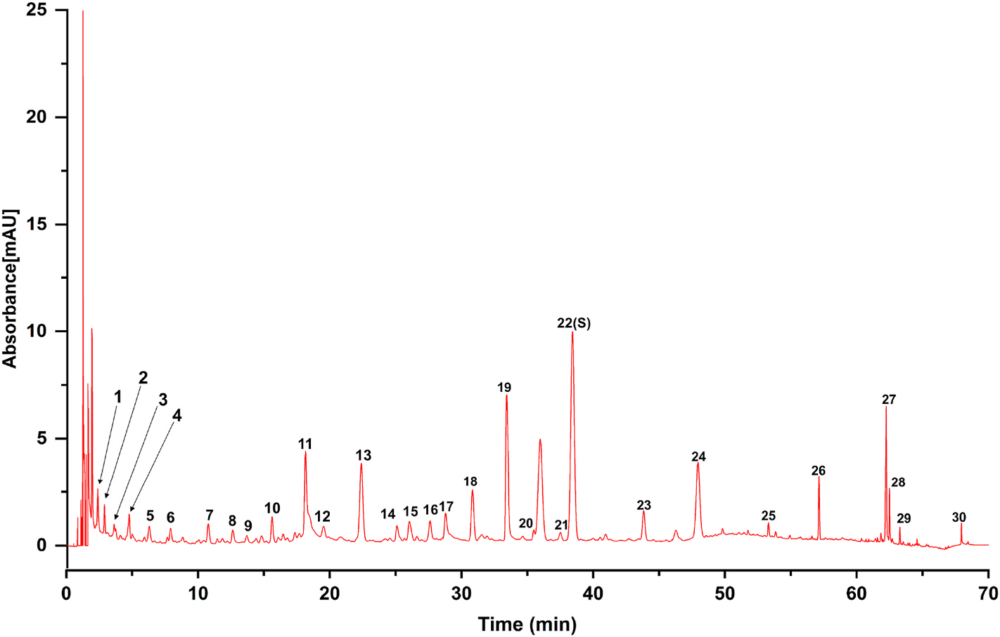
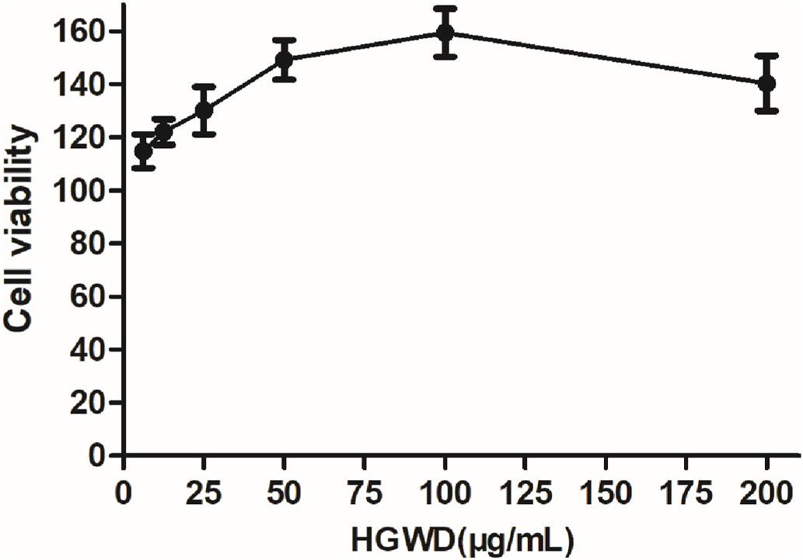
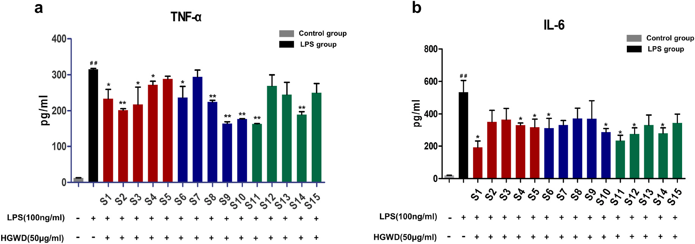
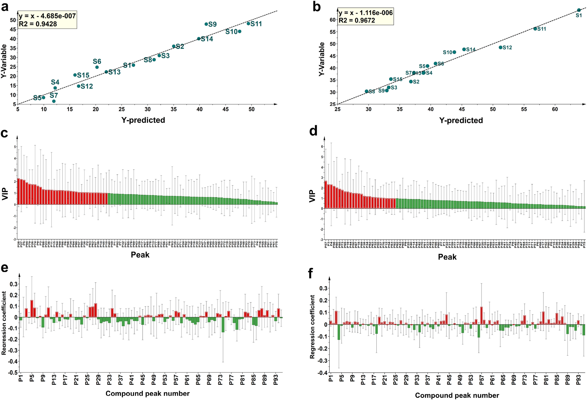
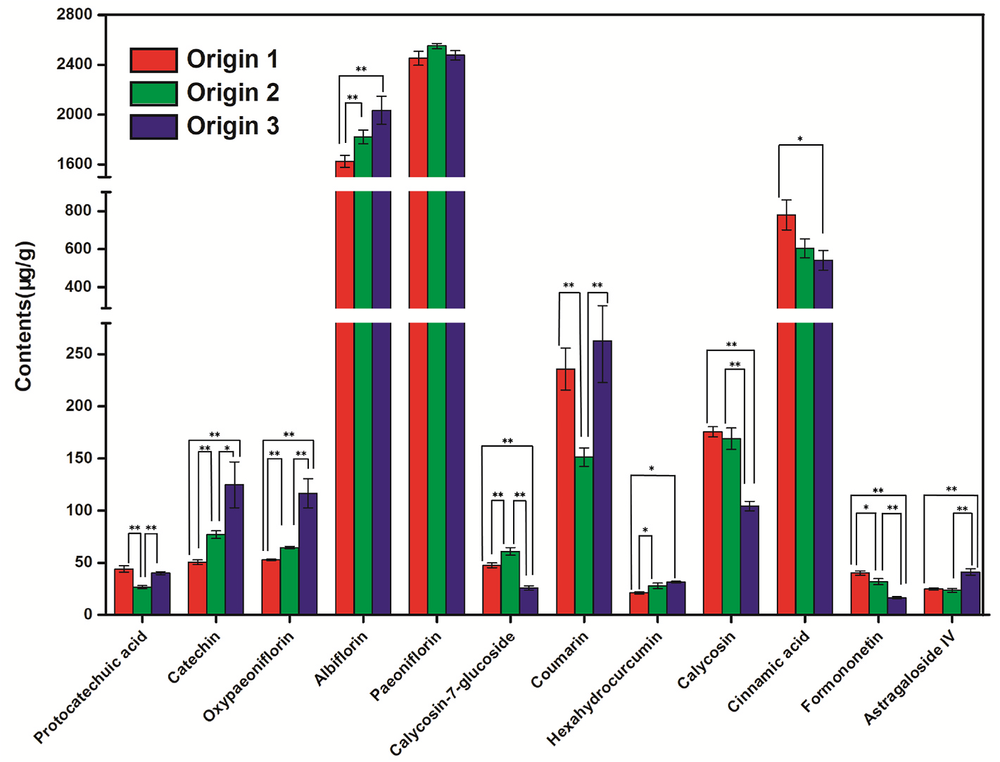

<!-- 方針: ほぼ全訳＋必要に応じた補足。原文構成に沿って訳出。「> 補足:」は訳者注。 -->

## 書誌情報

- 原題: A comprehensive quality evaluation for Huangqi Guizhi Wuwu decoction by integrating UPLC-DAD/MS chemical profile and pharmacodynamics combined with chemometric analysis
- 著者: Maoyuan Jiang, Lele Yang（両名は同等貢献）, Liang Zou, Lei Zhang, Shengpeng Wang, Zhangfeng Zhong, Yitao Wang, Peng Li（責任著者）
- 所属: 澳門大学 中医薬品質研究国家重点実験室・中華医薬研究院（マカオ）、成都大学 食品生物工程学院、四川省中医薬科学院 実験動物センター
- 掲載: *Journal of Ethnopharmacology* 319 (2024) 117325. https://doi.org/10.1016/j.jep.2023.117325
- インパクトファクター: **約5.4**（*Journal of Ethnopharmacology*, JCR 2024 / Clarivate, Q1・薬理学分野）
- 受領 2023-07-13 / 改訂 2023-09-30 / 採録 2023-10-15 / オンライン公開 2023-10-16

> 補足: 黄耆桂枝五物湯（Huangqi Guizhi Wuwu Decoction, HGWD／おうぎけいしごもつとう）は『金匱要略』に収載された古典方剤で、「血痺（けっぴ、"Bi"証の一種）」の治療に用いられてきた。臨床では**関節リウマチ（RA）**の治療に応用されている。構成生薬は**黄耆（Astragali Radix, AR）・白芍（Paeoniae Radix Alba, PRA）・桂枝（Cinnamomi Ramulus, CR）・生姜（Zingiberis Rhizoma Recens, ZRR）・大棗（Jujubae Fructus, JF）の5種**。本論文は、指紋・化学プロファイル・薬効・定量を組み合わせて薬効を反映するマーカーを見いだす「総合品質評価戦略」を提案している。

> 補足（IFについて）: J Ethnopharmacol の直近IFは集計サイトにより 5.4〜6.5 程度と幅がある（例: journalmetrics.org は JCR 2024 版で 5.4、他サイトは 6.5 前後を提示）。本稿では JCR 2024 相当として約5.4（Q1）を採用したが、正確な最新値は Clarivate JCR で確認されたい。

## 要旨（Abstract）

**民族薬理学的意義:** 黄耆桂枝五物湯（HGWD）は『金匱要略』に初出する古典的な中国方剤で、ヒトの「血痺」（"Bi"証の一種）の治療に用いられてきた。臨床では関節リウマチ（RA）の治療に応用されている。

**研究目的:** 薬効と化学的特徴の両方を反映する化学マーカーの特徴づけは、伝統中薬（TCM）の品質管理にとって非常に重要である。本研究は、HGWDの抗RA作用を例として、全体的な化学プロファイルと生物活性データを組み合わせて化学マーカーを同定するための包括的戦略の開発を目的とした。

**材料と方法:** 第一に、超高速液体クロマトグラフィー-ダイオードアレイ検出器（UPLC-DAD）による指紋を確立・バリデーションし、異なる産地のHGWDの全体的品質を評価した。UPLC-DAD指紋とケモメトリクス手法の組み合わせにより、産地の異なるHGWDに関連する特徴マーカーをスクリーニングした。第二に、15バッチのHGWD試料の化学プロファイルを、UPLCとハイブリッド型リニアイオントラップ-Orbitrap質量分析（UPLC-HRMS）を組み合わせて特徴づけた。次いで15試料の *in vitro* 抗RA活性を評価した。第三に、スペクトル-効果関係解析を行い、品質マーカーとして利用しうる生物活性化合物を同定した。最後に、15バッチのHGWD中の特徴マーカーおよび品質マーカーの定量分析のために、UPLC-三連四重極タンデム質量分析（UPLC-TQ-MS/MS）法を最適化・確立した。

**結果:** 合計で **30本の共通ピーク**をUPLC-DAD指紋に割り付けた。そのうち **9本**が特徴マーカーとして認識・選定された：**プロトカテク酸、クマリン、桂皮酸、オキシペオニフロリン、ペオニフロリン、カリコシン、ホルモノネチン、カテキン、アルビフロリン**。さらに、UPLC-HRMS化学プロファイルで **95種の共通化合物**を同定した。薬理学的解析により、15試料のHGWDの抗RA活性が大きく異なることが示された。スペクトル-効果関係解析により、抗RA活性と正相関する **30種の潜在的生物活性成分**が明らかになった。そのうち相対含量が **1%を超える5化合物**――**ペオニフロリン、アストラガロシドIV、ヘキサヒドロクルクミン、ホルモノネチン、カリコシン-7-グルコシド**――を品質マーカー（Q-marker）として選定し、その活性をLPS誘導RAW264.7マクロファージで検証した。最後に、上記の **代表12成分**を15バッチのHGWD中で同時定量した。

**結論:** 全体的化学プロファイルと代表成分評価を組み合わせた本系統的戦略は、HGWDの品質評価を改善する信頼性が高く有効な方法となりうる。

**略語:** TCMs, 伝統中薬; RA, 関節リウマチ; UPLC-DAD, ダイオードアレイ検出器付き超高速液体クロマトグラフィー; GC-MS, ガスクロマトグラフィー質量分析; PLSR, 部分最小二乗回帰; ANN, 人工ニューラルネットワーク; HGWD, 黄耆桂枝五物湯; AR, 黄耆（Astragali Radix）; PRA, 白芍（Paeoniae Radix Alba）; CR, 桂枝（Cinnamomi Ramulus）; ZRR, 生姜（Zingiberis Rhizoma Recens）; JF, 大棗（Jujubae Fructus）; TQ-MS/MS, 三連四重極タンデム質量分析; RSD, 相対標準偏差; MRM, 多重反応モニタリング; VIP, 投影に対する変数重要度。

## 1. 序論（Introduction）

伝統中薬（TCM）は「多成分・多標的」を特徴とし、とりわけTCM方剤は中国および東洋諸国で広く用いられてきた。TCMの化学成分は、多様な産地・含まれる複数の基原種・異なる前処理法によって通常大きく影響を受ける。したがって、全体的な化学プロファイルを反映しつつ代表成分を評価する、包括的かつ体系的な品質管理戦略が、臨床における良好な安全性・有効性を保証するために不可欠である。UPLC-DAD指紋は広く探究されており、TCMの全体的品質評価に適切に適用されている。加えて、薬効に関連する代表成分の精確な定量も統合的品質管理に有益である。しかし多くの場合、TCMの有効性・安全性の推定に定量的に検出されるのは1成分ないし数成分にとどまる。これらの成分ではTCMの真正かつ内在的な特徴を反映できないことは明らかである。したがって、あるTCMの治療効果に最も寄与する品質マーカー（Q-marker）は、治療効果の物質的基盤の理解と、薬理活性に基づく品質管理の開発において重要な役割を果たす。

これまで、高分解能かつ十分な感度をもつ多成分分析技術が、TCMの化学プロファイル特徴づけに用いられてきた。例として UPLC-DAD、液体クロマトグラフィー-質量分析（UPLC-MS）、ガスクロマトグラフィー-質量分析（GC-MS）、定量NMR（QNMR）などがある。しかし、これら高スループット分析で得られる豊富な化学情報から、Q-markerとして働く特定の化合物をスクリーニング・認識することはできない。この隔たりを埋めるため、薬効と化学プロファイルの相関（スペクトル-効果関係）をケモメトリクス手法で解析することが提案されてきた。手法にはグレー関連解析（GRA）、部分最小二乗回帰（PLSR）、人工ニューラルネットワーク（ANN）などがある。とりわけPLSRは、サンプル数が変数数よりはるかに少ない場合にスペクトル-効果関係を求めるのに頻用される。したがって、大量の化学プロファイルデータを含むTCMでは、PLSRによってスペクトル-効果関係を確立するのがより適切である。

黄耆桂枝五物湯（HGWD）は古典的な中国方剤として『金匱要略』に初出し、「血を養い経穴を温める」効能をもつ。HGWDは伝統的に、身体のしびれと四肢痛を特徴とする「血痺」（"Bi"証の一種）の治療に用いられてきた。HGWDは **白芍（PRA）・桂枝（CR）・黄耆（AR）・生姜（ZRR）・大棗（JF）** の5生薬からなる。現代薬理学研究により、HGWDが鎮痛作用・神経伝達物質の調節作用・抗関節リウマチ（RA）作用をもつことが示されている。さらに多くの臨床試験で、HGWDがRA治療に信頼できる治療効果をもつことが示されてきた。とりわけ、RAが引き起こす関節痛などの臨床症状は「血痺」の症状と類似している。既存の科学的研究はHGWDの抗RA作用を実証してきた（例えばHGWD治療で足関節滑膜の炎症が緩和されうる）。しかし、とくにRA治療の治療効果に最も寄与する化学成分について、合理的な品質評価が欠けている。したがって、薬効を担う成分の探索が関心事となる。異常な免疫細胞応答による炎症はRA病態に関与する。これらの免疫細胞のうち、炎症誘発性M1マクロファージは炎症性サイトカイン（IL-6やTNF-αなど）のレベル上昇を誘導して関節びらんを引き起こし、RA進行の制御に決定的である。古典的で成熟した炎症細胞モデルとして、LPS誘導RAW264.7マクロファージは抗RA化合物のスクリーニングに広く用いられてきた。

本研究では、全体的な化学プロファイルの決定と化学マーカーの発見を統合した包括的戦略をHGWDの品質評価のために提案した。ここで化学マーカーとは、産地多様性を反映する特徴マーカーと、薬理活性に基づくQ-markerである。第一に、UPLC-DAD指紋を確立・バリデーションし、異なる由来の15バッチのHGWD試料の全体的品質を評価した。次いで、30共通ピークをもつUPLC-DAD指紋とケモメトリクスを効率的に組み合わせ、産地に関連する特徴マーカーをスクリーニングした。第二に、ハイブリッド型リニアイオントラップ（LTQ）-Orbitrap質量分析法を指紋分析と組み合わせ、15バッチのUPLC-MS化学プロファイルを決定した。さらにHGWD各バッチの抗RA活性を評価した。スペクトル-効果関係解析を行い、Q-markerとなりうる生物活性成分を発見し、その活性をさらに検証した。最後に、UPLC-TQ-MS/MSによる代表12成分の迅速同時定量法を最適化・確立し、15バッチに適用した。

## 2. 材料と方法（Materials and Methods）

### 2.1. 材料・試薬

15バッチの **黄耆（AR）・白芍（PRA）・桂枝（CR）・生姜（ZRR）・大棗（JF）** は広州白雲山潘高寿薬業（中国・広東省広州）から提供を受け、基原種・産地が表示されていた（Table S1）。全生薬は澳門大学の Peng Li 教授により鑑定された。

対照標準品（プロトカテク酸、プロトカテクアルデヒド、オキシペオニフロリン、アルビフロリン、ペオニフロリン、クマリン、カリコシン-7-グルコシド、シンナムアルデヒド、桂皮酸、カリコシン、2-メトキシシンナムアルデヒド、シンナミルアルコール、ベンゾイルペオニフロリン、ホルモノネチン、アストラガロシドIV、6-ジンゲロール、6-ショウガオール、アストラガロシドII、アストラガロシドI、8-ジンゲロール、イソクエルシトリン、プロシアニジンB1、カテキン、プロシアニジンB2、エピカテキン、ヘキサヒドロクルクミン、ロイシン）は MUST Biotechnology（中国・成都）製。LC-MSグレードのアセトニトリルおよびメタノールは Baker Company（米国 Sanford）製。

RAW264.7 マウスマクロファージは Procell Life Science and Technology（中国・武漢）製。FBS・PBS・DMEM・トリプシン-EDTA は GIBCO（米国）、DMSOおよびLPSは Sigma-Aldrich（米国）、デキサメタゾン・ペニシリン-ストレプトマイシン・CCK-8 は Beyotime Biotechnology（中国・上海）製。マウスTNF-αおよびIL-6のELISAキットはいずれも NeoBioscience（中国・深圳）製。

### 2.2. 試料溶液の調製と化学標準品

HGWD試料は古典医書『金匱要略』の記載に従って調製した。すなわち、**AR 41.25 g・PRA 41.25 g・CR 41.25 g・JF 41.25 g・ZRR 82.5 g** を蒸留水1200 mLに0.5時間浸漬し、1時間煎じた。液をガーゼ2層でろ過し、生薬1 gあたり1 mLになるよう濃縮した。最後に濃縮液を凍結乾燥し、デシケーター中で保存した。

乾燥粉末試料 0.5 g を、70%メタノール水溶液（v/v）25 mL に室温で30分間超音波処理して再構成した。次いで **13,800×g で10分間遠心** して上清を採取し、指紋・定量分析に供した。単一生薬試料も同様に調製した。各対照標準品を精秤してメタノールに溶かしてストック溶液とし、分析前に希釈して所定濃度の作業溶液を得た。

### 2.3. UPLC-DAD指紋分析

UPLC指紋の確立には Dionex UltiMate 3000 高速分離バイナリシステム（Dionex, Thermo Fisher Scientific, 米国）を用いた。分離には **Hypersil GOLD C18（150 mm × 2.1 mm, 1.9 µm, Thermo Fisher）** を用い、カラム温度は **40 ℃**。流速は **0.4 mL/min**。移動相は **0.2% ギ酸水（v/v）（A）とアセトニトリル（B）** で構成した。グラジエント溶出は以下のとおり：

| 時間（min） | B（アセトニトリル）比 |
|---|---|
| 0–5 | 5% |
| 5–25 | 5 → 12% |
| 25–45 | 12 → 20% |
| 45–55 | 20 → 40% |
| 55–65 | 40 → 95% |
| 65–70 | 95% |

注入量は **2 µL**。UVスペクトルは **280 nm** の波長で記録した。

### 2.4. 指紋分析の併行精度・再現性・安定性

各共通ピークの、基準ピークに対する平均相対保持時間（RRT）と相対ピーク面積（RPA）のRSDにより、指紋分析法を評価した。精度（precision）は同一試料溶液を6回評価。再現性（repeatability）は並行調製した6つの試料溶液で評価。安定性（stability）は同一試料を同日内の 0・3・6・9・12・24 時間で評価した。

### 2.5. LTQ-Orbitrap質量分析条件

ハイブリッド型 LTQ-Orbitrap 質量分析計（Thermo Fisher Scientific, ドイツ Bremen）を UPLC指紋システムに接続した。正・負両ESIモードを用い、最適パラメータは次のとおり：イオンスプレー電圧 4.5／−4.0 kV、キャピラリー温度 350／350 ℃、キャピラリー電圧 35／−35 V、チューブレンズ電圧 100／−100 V。フルスキャンは m/z 100−2000 の範囲で行い、5件のデータ依存取得（DDA）イベントでスキャンサイクルを構成。Orbitrap高分解能質量分析部は分解能 **30000**。DDAでは、フルスキャンで応答が最も高い5イオンのMS2断片化データをダイナミックエクスクルージョンで取得。分離幅 m/z 2.0、衝突誘起解離（CID）の規格化衝突エネルギーは **35%**。

### 2.6. 化学プロファイルのデータ前処理

Xcalibur 2.1 で取得した生データを Thermo Compound Discoverer 3.2（Thermo Fisher Scientific, 米国）へ取り込み、ピーク検索・アライメント・フィルタリング・グルーピングを行った。積分ピーク面積・m/z・保持時間（RT）を含むデータセットを得た。精密質量とMS2断片化を関連する対照標準品および Thermo Compound Discoverer 3.2 のデータベースと比較して、15バッチ間の共通ピークを暫定同定した。各ピークの化合物の相対量は、各化合物のピーク面積を各試料の総ピーク面積と比較して求め、15バッチの平均相対量を算出した。データの正規化は MetaboAnalyst 5.0 オンラインアルゴリズム（統計解析モジュール）で行い、多変量解析に供した。

### 2.7. 細胞培養

マウス単球マクロファージ白血病細胞株 RAW264.7 を、10% FBS と 1% ペニシリン-ストレプトマイシンを含む DMEM 中、37 ℃・5% CO₂ で培養した。乾燥HGWD粉末をDMSOに溶解し、培地で希釈して所定濃度の溶液を得た。DMSOの最終濃度は0.1%未満とした。

### 2.8. RAW264.7細胞生存率アッセイ

HGWD試料の細胞毒性を RAW264.7 細胞で比色CCK-8アッセイにより試験した。細胞（8 × 10³ 細胞/ウェル）を96ウェルプレートに播種し、接着後に各種濃度のHGWD溶液（6.25・12.5・25・50・100・200 µg/mL）を添加した。37 ℃・CO₂ インキュベーターで48時間培養後、各ウェルに10% CCK-8 を加えて37 ℃で2時間培養。450 nmの吸光度を SpectraMax M2 マイクロプレートリーダー（Molecular Devices, 米国）で測定して生存率を解析した。

### 2.9. LPS誘導RAW264.7細胞モデル

RAW264.7 細胞を24ウェルプレートに 10⁵ 細胞/ウェル で培養し、15バッチのHGWD（50 µg/mL）の存在下または非存在下で、培地または **LPS（ウェル内最終濃度 100 ng/mL）** で48時間処理した。次いで上清を回収し、市販ELISAキットでTNF-αおよびIL-6のレベルを測定した。全データは、モデル群に対する低減率へ変換した：ある指標の低減率 =（LPS群 − 薬剤投与群）/ LPS群 × 100%。

### 2.10. 定量分析用UPLC-TQ-MS/MS条件

標的分析対象物の定量には、ACQUITY I-Class UPLC システムに Xevo TQ-S micro QQQ 質量分析計（Waters Corp., 英国）を接続した装置を用いた。クロマトグラフィーには **Hypersil GOLD C18（150 mm × 2.1 mm, 1.9 µm, Thermo Fisher）** を **40 ℃** で使用。注入量 **2 µL**。移動相は **0.2% ギ酸水（v/v）とメタノール（B）**。グラジエント溶出プログラムは以下のとおり：

| 時間（min） | B（メタノール）比 |
|---|---|
| 0–3 | 5 → 50% |
| 3–5 | 50 → 95% |
| 5–7 | 95% |
| 7–8 | 95 → 5% |
| 8–10 | 5% |

流速は **0.3 mL/min**。多重反応モニタリング（MRM）を正・負両モードで行い、最適MSパラメータは：キャピラリー電圧 3.0 kV、イオン源温度 150 ℃、脱溶媒温度 350 ℃、コーンガス流量 30 L h⁻¹。MRMモードの最適化パラメータは Table S2 に記載（原文の補足資料。**原文参照**）。装置制御・データ処理は MassLynx 4.2（Waters Corp., 米国）で実行。

### 2.11. UPLC-TQ-MS/MS法バリデーション

#### 2.11.1. 直線性・検出下限・定量下限

検量線構築のため、適切な濃度の各種作業標準溶液を評価した。S/N比が3となる各分析対象物の濃度を検出下限（LLOD）、S/N比が10となる濃度を定量下限（LLOQ）とした。

#### 2.11.2. 併行精度・再現性・安定性・正確性

精度試験では同一混合作業溶液を6回分析した。再現性は独立に調製した6試料で試験。安定性は同一試料溶液を同日内の6時点（0・3・6・9・12・24 時間）で評価した。回収実験も実施した。既知量の各化学標準品をHGWD試料に添加して並行に6試料を作り、試料抽出手順を適用した。回収率（%）=（検出量 − 元の量）/ 添加量 × 100%。

### 2.12. 統計解析

「伝統中薬クロマト指紋類似度評価システム（Version 2004A）」を用いてクロマト指紋の類似度解析（SA）を自動で評価した。共通ピークはピークアライメントで認識した。割り付けた共通ピーク面積を MetaboAnalyst 5.0 で正規化し、SIMCA-P + 14.1（Umetrics, スウェーデン Umeå）に取り込んでケモメトリクス解析を行った。生のMSおよびMSⁿ断片化データは Xcalibur 2.1 と Thermo Compound Discoverer 3.2 で取得・可視化した。質量許容範囲は 10 ppm 以内。定量UPLC-TQ-MS/MS解析には MassLynx 4.2 を用いた。

PLSRモデルは SIMCA-P（14.1, Umetrics, スウェーデン）で構築し、各バッチHGWDの共通ピーク（説明変数）とその抗RA活性（応答変数）の相関を説明した。回帰式の R² で回帰モデルの予測能を評価した。回帰係数と投影に対する変数重要度（VIP）値を組み合わせて、応答変数に対する説明変数の相対寄与を推定し、潜在的な品質管理マーカーとなる活性化合物を同定した。

## 3. 結果と考察（Results and Discussion）

### 3.1. HGWD試料調製の最適化

試料の再構成溶媒として、メタノール濃度のグラジエント（10%・40%・70%・100%）を分析し、抽出時間4条件（10・30・45・60分）を評価してHGWD抽出法を最適化した。30–40分の範囲のピークはメタノール濃度の上昇（10%→70%）に伴い信号強度が高くなり、70%メタノールが好ましい抽出溶媒であることが示された（Fig. S1）。Fig. S2 のとおり、30分を超えても抽出効率に明らかな増加はなかった。したがって、乾燥試料粉末は、試料質量:溶媒容量 = 1:50 の比で70%メタノールを用い、30分の超音波処理で抽出した。

> 補足: 図S1〜S13 は本論文の補足資料（Supplementary data）であり、本体PDFには含まれない。これらは「**原文参照**」とし、本稿では図を作成していない。

### 3.2. UPLC-DAD指紋条件の最適化

TCMの包括的品質管理には、より多くの化学情報を得るため高感度の検出器を採用すべきである。そこでDADとエアロゾルベース検出器（CAD）の結果を比較し、DADの方が、とくに検出波長280 nmで検出可能なピークが多かった（Fig. S3）。続いてフルスキャンモード（190〜400 nm）で、280 nmでより多くのピークと高い信号応答が観測されることを確認し、HGWDの全体的な化学プロファイルをよりよく反映するためこの波長を選定した。次に、XSELECT CSH C18（150 mm × 3 mm, 2.5 µm, Waters）、Hypersil GOLD C8（150 mm × 2.1 mm, 3 µm, Thermo Fisher）、ACQUITY UPLC BEH C18（100 mm × 2.1 mm, 1.7 µm, Waters）、Hypersil GOLD C18（150 mm × 2.1 mm, 1.9 µm, Thermo Fisher）の各カラムを評価した。**Hypersil GOLD C18** カラムが、他の3カラムに比べピーク形状と分解能に優れていた（Fig. S4）。次いでアセトニトリル-水系とメタノール-水系の2種の移動相を比較したところ、アセトニトリル-水系の方が良好な分解能が得られた（Fig. S5）。ギ酸（FA）水溶液の各濃度（0.1%・0.2%・0.4%）を移動相に用いてピーク形状・分解能を最適化した。FAを含むアセトニトリル-水系（Fig. S6）で、含まないものより高いピーク応答が観測された。ピークがより検出しやすいこと、固定相がFAに耐えうることを考慮し、**アセトニトリル-0.2% FA** をHGWD分析の移動相とした。さらに、UPLC-DAD指紋分析の節に記載のとおりグラジエント溶出プログラムを最適化した。

### 3.3. UPLC-DAD指紋分析

確立したUPLC-DAD法を、異なる地域由来の15バッチのHGWD試料の分析に適用し、得られたクロマトグラムを「伝統中薬クロマト指紋類似度評価システム（Version 2004A）」に取り込んで評価した（Fig. S7）。加えて、HGWDの基準UPLC指紋を **30本の認識された共通ピーク**で確立した（Fig. 1）。そのうち、**桂皮酸（cinnamic acid）と同定されたピーク22（保持時間 = 38.33 分）** を、高い分解能・対称なピーク形状・適度な保持時間ゆえに基準ピークに選定し、他の共通ピークの相対保持時間（RRT）と相対ピーク面積（RPA）を算出した。加えて、プロトカテク酸4-グルコシド（ピーク1）、プロトカテク酸（ピーク2）、カテキン（ピーク5）、オキシペオニフロリン（ピーク6）、プロシアニジンB2（ピーク7）、エピカテキン（ピーク8）、トリフィリンB（ピーク9）、アルビフロリン（ピーク10）、ペオニフロリン（ピーク11）、クマリン（ピーク13）、カリコシン-7-グルコシド（ピーク15）、エロラマイシンB（ピーク17）、カリコシン（ピーク23）、2-メトキシシンナムアルデヒド（ピーク24）、ホルモノネチン（ピーク25）、6-ショウガオール（ピーク26）を、対照標準品と Thermo Compound Discoverer 3.2 データベースとの照合により暫定同定した（Fig. 1）。

指紋分析の併行精度・再現性・安定性の結果は次のとおり：精度のRSDは RRTで0.7%未満・RPAで3.6%未満。再現性のRSDは RRTで≤0.9%・RPAで≤4.8%。安定性のRSDは RRTで0.5%未満・RPAで4.9%未満で、試料が24時間安定であることを示した。したがって、提案したUPLC-DAD指紋はHGWDの品質評価に信頼して使用できる。

### 3.4. 類似度解析（SA）

15バッチ全てのHGWD試料の指紋は基準指紋と類似していた。相関係数を用いて、各バッチのクロマトグラムと基準指紋クロマトグラムの類似度を比較した。Table 1 に示すとおり **相関係数は 0.929〜0.994** の範囲にあり、これら試料の高い一貫性と安定性を示した。

**Table 1. 15バッチHGWDのクロマトグラム類似度（相関係数）。** 各試料 S1〜S15 と基準指紋 R との相関を含む相関行列。以下は各試料の基準指紋 R に対する類似度を抜粋（行 R より）。

| 試料 | 基準Rとの相関係数 |
|---|---|
| S1 | 0.979 |
| S2 | 0.975 |
| S3 | 0.982 |
| S4 | 0.981 |
| S5 | 0.961 |
| S6 | 0.989 |
| S7 | 0.994 |
| S8 | 0.960 |
| S9 | 0.992 |
| S10 | 0.970 |
| S11 | 0.968 |
| S12 | 0.949 |
| S13 | 0.929 |
| S14 | 0.980 |
| S15 | 0.936 |

> 補足: 原文 Table 1 は S1〜S15 と基準R からなる 16×16 の相関行列（下三角）である。上表は本文で言及された「基準R との類似度 0.929〜0.994」を確認できるよう、最終行（R 行）の各試料に対する相関係数を抜粋した。最小は S13 の 0.929、最大は S7 の 0.994。試料間相関の全数値は原文の相関行列を参照。

### 3.5. 特徴マーカーをスクリーニングするための直交部分最小二乗判別分析（OPLS-DA）

数千年にわたるTCMの発展に伴い、生薬の産地多様性は次第に増大してきた。本研究では、主要産地に由来する AR・PRA・CR・ZRR・JF の15バッチを代表的な産地として収集した。15バッチ間の品質差をさらに同定するため、正規化した共通ピーク面積を用いて教師ありOPLS-DAモデルを確立した。確立したモデルの適合度（R²Y）と予測性（Q²）はそれぞれ **97%・72%** であった。検証結果（Fig. S8a）はモデルの高い信頼性を示した。Fig. S8b のとおり、15バッチは由来に基づき3つの独立した領域に分けられ、化学組成の内在的差異を表し、環境条件の変動がHGWD中の化合物の組成・量に影響しうることを示した。続いて、識別クラスターへの寄与が最大の成分を、VIP値に基づきスクリーニングした。Fig. S8d のとおり **VIP値 > 1.00 の16本の共通ピーク**を選定した。加えて、これらの化合物は Fig. S8c のとおり最大のローディング係数をもっていた。そのうち **9化合物**――**プロトカテク酸（ピーク2）、クマリン（ピーク13）、桂皮酸（ピーク22）、オキシペオニフロリン（ピーク6）、ペオニフロリン（ピーク11）、カリコシン（ピーク23）、ホルモノネチン（ピーク25）、カテキン（ピーク5）、アルビフロリン（ピーク10）**――を、産地多様性を反映する特徴マーカーとして同定・選定した。

### 3.6. UPLC-LTQ-Orbitrap質量分析によるHGWDの化学プロファイル

ハイブリッドLTQ-Orbitrap質量分析計をUPLC指紋システムに接続し、各HGWD試料の化学組成を解析した。正・負モードでのHGWDの代表的全イオンクロマトグラム（TIC）を Fig. S9 に示す。精密質量とMS2断片化を対照標準品・文献データ・Thermo Compound Discoverer 3.2 データベースと比較して、15バッチから **95種の共通ピークを暫定同定**した。その内訳は、**フェノール27・フラボノイド配糖体20・テルペノイド配糖体13・フラボノイド10・有機酸8・糖4・その他13**（Table S3。**原文参照**）。各化合物の由来解析は各生薬のLC-MSプロファイルを調べて行い、5生薬のTICを Fig. S10 に示した。さらに、95共通ピークの積分ピーク面積と保持時間のデータセットを得た。各ピーク面積を MetaboAnalyst 5.0 で正規化して多変量解析に供し、結果を Table S4 にまとめた（**原文参照**）。

### 3.7. 異なる産地のHGWD試料の生物活性

#### 3.7.1. 細胞生存率アッセイ

HGWDのRAW264.7細胞への毒性をCCK-8アッセイで評価した。6.25〜200 µg/mL の濃度範囲で、HGWDは48時間以内にRAW264.7細胞への毒性を示さなかった（Fig. 2）。

#### 3.7.2. HGWDによるLPS誘導RAW264.7細胞モデルでの炎症性サイトカイン放出の抑制

LPS刺激RAW264.7細胞からのTNF-αおよびIL-6放出に対するHGWDの作用を観察した。LPS刺激後、TNF-αとIL-6のレベルが有意に増加した（p < 0.01, 対 対照群）が、HGWD（50 µg/mL）処理後はTNF-αとIL-6の含量が低下した。さらに、15バッチのHGWDが生じる抑制効果は互いに異なっていた（Fig. 3）。

### 3.8. PLSRによるスペクトル-効果関係解析

本研究では、回帰式を SIMCA-P で決定した。次いで、回帰係数とVIP値を用いて、応答変数に対する各説明変数の相対的影響を評価した。PLSR解析では、従来法（Thermo Compound Discoverer で検索した全ピークをPLSRに投入）と異なり、95成分の正規化ピーク面積のみを独立変数（X）とし、HGWDの各生物活性指標を個別に従属変数（Y）とした。

Fig. 4a のとおり、回帰式の R² は **0.9428** で、回帰モデルが良好な予測能をもつことを示した。**VIP > 1 の19本のクロマトピーク**がTNF-α低減と正相関しており、P28, P27, P5, P94, P26, P3, P88, P11, P6, P58, P34, P84, P90, P57, P2, P83, P87, P14, P10 であった（Table S5・Fig. 4c, e。**原文参照**）。

Fig. 4b のとおり、回帰式の R² は **0.9672** であった。**VIP > 1 の15本のクロマトピーク**がIL-6低減と正相関しており、P57, P3, P80, P85, P73, P19, P44, P87, P82, P63, P55, P37, P76, P54, P83 であった（Table S6・Fig. 4d, f。**原文参照**）。

### 3.9. 潜在的抗RA化合物の炎症性サイトカイン抑制効果の検証

Q-markerの基本的性質（特異性と測定可能性）を踏まえ、HGWD中の30種の潜在的抗炎症化合物から、**相対含量 >1%（Table S3）の5化合物**をQ-markerとして採用した：**P34（ペオニフロリン, 8.02%）、P84（アストラガロシドIV, 1.24%）、P73（ヘキサヒドロクルクミン, 1.60%）、P82（ホルモノネチン, 3.39%）、P37（カリコシン-7-グルコシド, 2.42%）**。次いで、5種の潜在的抗RA化合物それぞれの炎症性サイトカイン抑制効果を評価した。陽性対照にはデキサメタゾンを用いた。

結果として、**ペオニフロリンとアストラガロシドIV** はLPS誘導RAW264.7細胞モデルでTNF-α放出を抑制でき、**ヘキサヒドロクルクミン・ホルモノネチン・カリコシン-7-グルコシド** はIL-6放出に抑制効果を示した（Fig. S11。**原文参照**）。**IC₅₀値**は、ペオニフロリン **144 µM**、アストラガロシドIV **407 µM**、ヘキサヒドロクルクミン **76 µM**、ホルモノネチン **535 µM**、カリコシン-7-グルコシド **686 µM** であった。TNF-α産生を抑制した2化合物とIL-6放出を抑制した3化合物の活性は、正の回帰係数の順序と一致した。

> 補足: 原文は5化合物のIC₅₀を「144, 407, 76, 535, 686 µM」の順で列挙している。文脈上この順序はペオニフロリン・アストラガロシドIV・ヘキサヒドロクルクミン・ホルモノネチン・カリコシン-7-グルコシドに対応する。IL-6抑制のヘキサヒドロクルクミン（76 µM）が最も低いIC₅₀（＝最も強い活性）を示す点が特徴的。

加えて、6-ショウガオール・没食子酸・ロガニン・ピノレシノール・リンゴ酸など他の正相関化合物も抗炎症活性が報告されている。結果として、確立したPLSR解析は、HGWDのQ-markerの範囲を絞り込みさらにスクリーニングするのに信頼できるものであった。

### 3.10. UPLC-TQ-MS/MS条件の最適化

産地多様性と生物活性に基づく12種の代表成分を同時定量するため、UPLC-TQ-MS/MS技術で定量分析を行った。正・負イオンモードのMRMを用いて定量分析の高感度・高選択性を実現した。12標的分析対象物の関連MS/MSパラメータを、混合対照標準品を用い自動MS/MS最適化プログラム（IntelliStart）で、干渉なく最良のピーク強度が得られるよう最適化した（代表スペクトルは Fig. S12、最適化パラメータは Table S2。**原文参照**）。指紋条件に基づき、開発したMS/MSパラメータで移動相組成をさらに最適化し、複雑なHGWD試料中の12標的分析対象物の異性体からの干渉を排除した。結果として、アセトニトリル-0.2% FA と比較して、**メタノール-0.2% FA** で全標的化合物、とくにオキシペオニフロリンの分離が改善した（Fig. S13。**原文参照**）。よってメタノール-0.2% FA を定量用移動相に採用した。

要約すると、12代表成分すべてが最適パラメータのMRMモードで **わずか7分** のうちに個別に分離・検出され、HGWD試料中の12代表成分の正・負モードの代表的MS/MSスペクトルを Fig. 5 に示した。

### 3.11. UPLC-TQ-MS/MS定量分析法バリデーション

#### 3.11.1. 直線性・定量下限・検出下限

12標的分析対象物の検量線（すべて相関係数 **r ≥ 0.990**）を構築した。詳細は Table 2 のとおり。**LLOQ は 0.2〜6.2 ng/mL、LLOD は 0.04〜1.6 ng/mL** の範囲であった。以上の結果は、確立したUPLC-TQ-MS/MS法が信頼性が高く高感度であることを示した。

#### 3.11.2. 併行精度・再現性・安定性・正確性

精度についてはRSD **2.1%以内**。再現性のRSDは **0.9〜4.6%**。安定性については、12標的化合物のRSDが24時間で **1.0〜3.9%**。全分析対象物の総合平均回収率は **95.8〜104.9%** で許容範囲であった（Table 2）。

**Table 2. HGWD中の12標的分析対象物の検量線・範囲・LLOD・LLOQ・回収率・精度・再現性・安定性。**
（検量線の y・x はそれぞれ分析対象物のピーク面積と濃度（µg/mL）。LLOQ は S/N = 10、LLOD は S/N = 3 の濃度。回収率は n = 6。）

| No. | 分析対象物 | 検量線 | r | 範囲（µg/mL） | LLOQ（ng/mL） | LLOD（ng/mL） | 回収率（%, n=6） | 精度（RSD %） | 安定性（RSD %） | 再現性（RSD %） |
|---|---|---|---|---|---|---|---|---|---|---|
| 1 | プロトカテク酸 | y = 12385.4x + 1273.3 | 0.997 | 0.09–5.65 | 2.6 | 0.6 | 99.2 ± 1.9 | 0.6 | 1.7 | 1.4 |
| 2 | カテキン | y = 3816.3x + 552.3 | 0.997 | 0.10–6.35 | 6.2 | 1.6 | 104.9 ± 2.0 | 0.4 | 1.2 | 2.7 |
| 3 | オキシペオニフロリン | y = 164889.3x + 13562.4 | 0.998 | 0.07–4.30 | 1.1 | 0.1 | 99.8 ± 1.7 | 0.8 | 1.1 | 1.3 |
| 4 | アルビフロリン | y = 304230.1x + 67631.5 | 0.990 | 0.91–58.13 | 3.5 | 0.9 | 100.4 ± 2.5 | 0.7 | 1.0 | 0.9 |
| 5 | ペオニフロリン | y = 334987.2x + 78681.1 | 0.999 | 1.75–112.00 | 1.7 | 0.8 | 95.8 ± 3.4 | 1.2 | 1.9 | 1.1 |
| 6 | カリコシン-7-グルコシド | y = 394866.0x + 18367.4 | 0.997 | 0.07–4.70 | 0.3 | 0.1 | 104.7 ± 6.5 | 2.1 | 1.6 | 2.4 |
| 7 | クマリン | y = 1323080.2x + 96132.3 | 0.996 | 0.18–11.80 | 0.2 | 0.04 | 102.1 ± 1.9 | 0.8 | 1.6 | 1.5 |
| 8 | ヘキサヒドロクルクミン | y = 129197.0x + 413.0 | 0.998 | 0.05–3.733 | 1.8 | 0.5 | 97.2 ± 6.9 | 1.5 | 1.8 | 2.3 |
| 9 | カリコシン | y = 60845.8x + 2234.5 | 0.999 | 0.40–25.0 | 3.0 | 0.7 | 103.2 ± 6.1 | 1.2 | 1.4 | 2.6 |
| 10 | 桂皮酸 | y = 8359.3x + 1815.6 | 0.993 | 0.40–25.80 | 3.1 | 1.6 | 103.7 ± 7.4 | 0.9 | 3.9 | 4.3 |
| 11 | ホルモノネチン | y = 284241.1x + 10860.5 | 0.998 | 0.12–7.45 | 0.4 | 0.1 | 98.4 ± 1.4 | 1.2 | 1.3 | 1.0 |
| 12 | アストラガロシドIV | y = 93882.8x + 1568.9 | 0.998 | 0.07–4.25 | 4.6 | 0.3 | 102.0 ± 8.4 | 1.5 | 1.8 | 4.6 |

### 3.12. UPLC-TQ-MS/MSによる12代表成分の定量

MRMモードの最適UPLC-TQ-MS/MS法を、15バッチのHGWD試料中の12代表成分の3連定量に適用した。12代表成分の全体平均含量は Table S7（**原文参照**）に、3つの異なる産地由来の12化合物の含量は Fig. 6 にまとめた。12代表成分の含量については、**アルビフロリンとペオニフロリン**が他の10化合物よりはるかに多く存在した。

## 4. 結論（Conclusion）

本研究では、UPLC-DAD指紋・UPLC-HRMS化学プロファイリング・薬効評価・多成分定量をケモメトリクスと組み合わせて統合した包括的戦略を、HGWDの品質評価のために確立した。15試料のHGWDの指紋を決定し、**30本の共通ピーク**を同定して化学的類似度を評価した。次いで、提案UPLC-DAD指紋とOPLS-DAモデルの組み合わせにより、産地に関連する **9種の特徴マーカー**（プロトカテク酸、クマリン、桂皮酸、オキシペオニフロリン、ペオニフロリン、カリコシン、ホルモノネチン、カテキン、アルビフロリン）を同定した。さらなる品質評価のため、スペクトル-効果関係解析を行い、Q-markerとなりうる生物活性化合物を発見した。UPLC-HRMSによる化学プロファイリングで15バッチから **95種の共通化合物**を暫定同定した。薬効評価により、異なるバッチの抗RA活性が大きく異なることが示された。スペクトル-効果関係解析により、抗RA活性と正相関する **30種の潜在的生物活性化合物**をスクリーニングした。相対含量 >1% の5化合物――**ペオニフロリン、アストラガロシドIV、ヘキサヒドロクルクミン、ホルモノネチン、カリコシン-7-グルコシド**――をHGWDのQ-markerとして採用した。最後に、上記の **代表12成分**を15バッチのHGWD試料中で同時定量した。この包括的戦略は、HGWDの品質評価を改善する信頼性が高く有効な方法となりうる。

## 訳者補足

> 本論文の位置づけ: 本研究は「単一〜数成分の定量だけでは方剤の真の品質を反映できない」という問題意識に対し、**4層の統合戦略**で答えたものである。すなわち――
>
> 1. **UPLC-DAD指紋（30共通ピーク）＋OPLS-DA** で「産地差を反映する特徴マーカー（9成分）」を選ぶ（＝**化学的な代表性**）。
> 2. **UPLC-LTQ-Orbitrap（HRMS）** で95成分まで化学プロファイルを広げる（＝**全体像の把握**）。
> 3. **LPS刺激RAW264.7でのTNF-α/IL-6抑制**を薬効指標に、**PLSRでスペクトル-効果解析**を行い「抗RA活性と正相関する成分（30成分→相対含量>1%の5成分をQ-marker）」を選ぶ（＝**薬効に基づく妥当性**）。
> 4. 1と3で選んだ計 **12成分をUPLC-TQ-MS/MSで同時定量**する（＝**実運用の定量法**）。
>
> ポイントは、Q-marker選定の根拠が「量が多いから」でも「産地で違うから」でもなく、**実際の薬効（サイトカイン抑制）との相関＋一定以上の存在量（>1%）＋標準品での活性検証（IC₅₀）**という多重の条件を満たしていること。これは Q-marker の「特異性・測定可能性・有効性への寄与」という要件を実データで裏づける典型的なワークフローである。
>
> なお、産地マーカー（例: カテキン・プロトカテク酸）とQ-marker（例: アストラガロシドIV・ヘキサヒドロクルクミン）は重ならない部分があり、「産地識別に効く成分」と「薬効を担う成分」が必ずしも一致しないことを示している点も実務的に示唆に富む。定量対象12成分は、この両集合の和（特徴マーカー9 + Q-marker由来で未収載のアストラガロシドIV・ヘキサヒドロクルクミン・カリコシン-7-グルコシド）にほぼ相当する。
>
> 補足資料（Table S1–S7・Fig. S1–S13）は本体PDFに含まれないため、産地別の成分含量の実数値（Fig. 6 / Table S7）や95成分の同定リスト（Table S3）などの詳細は「原文参照」とした。本文で確認できた定量パラメータ（検量線・LLOQ/LLOD・回収率・15ロット類似度）はすべて上表に網羅している。
