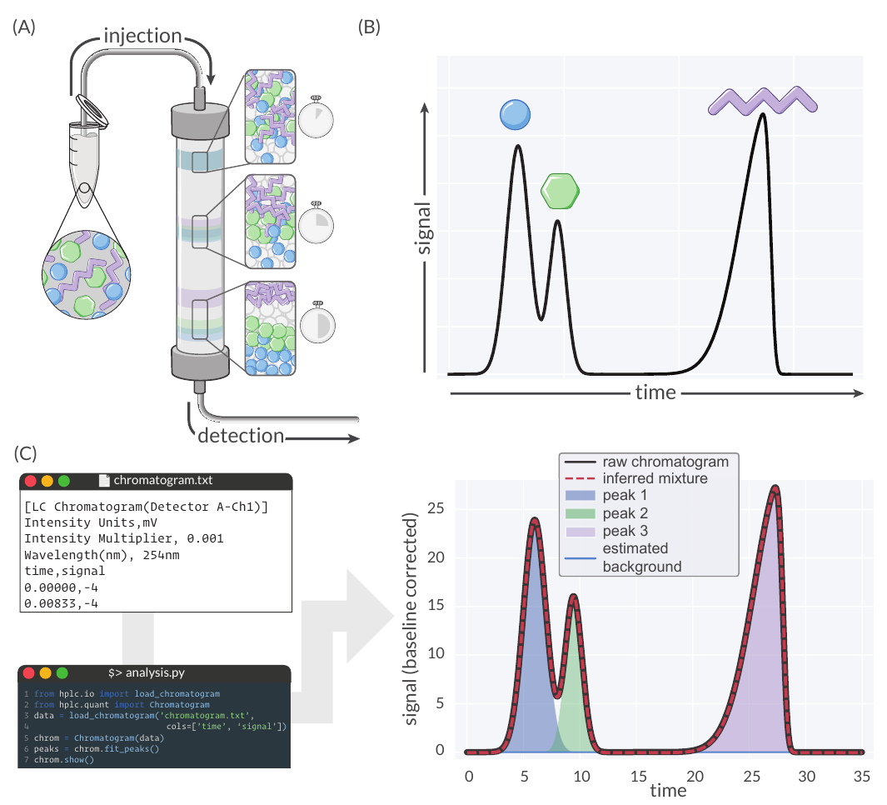
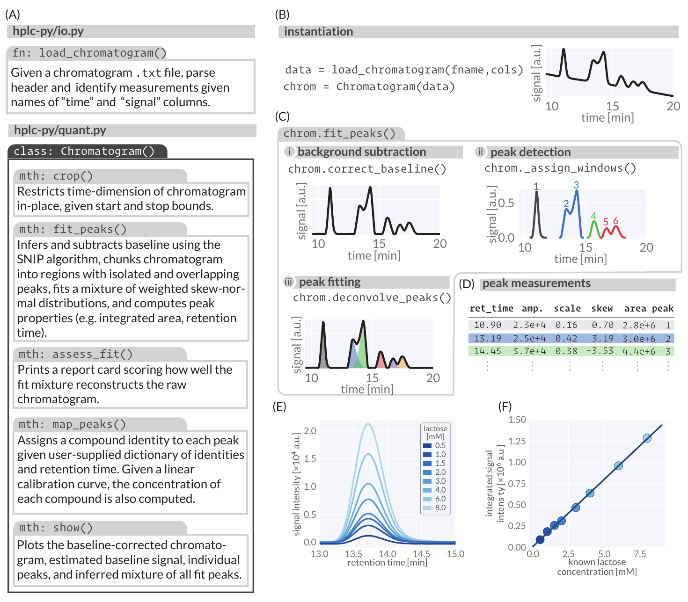
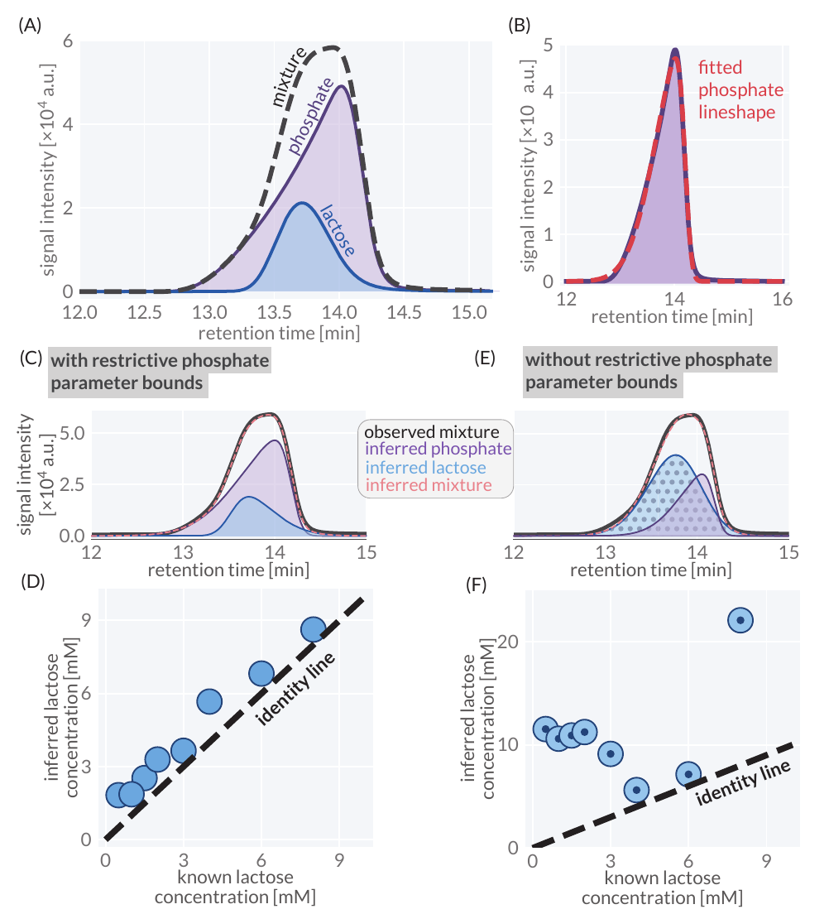

## 書誌情報

- 原題: hplc-py: A Python Utility For Rapid Quantification of Complex Chemical Chromatograms
- 著者: Griffin Chure、Jonas Cremer。所属: Stanford University, Department of Biology（米国カリフォルニア州）。責任著者: Griffin Chure。
- 掲載誌: Journal of Open Source Software, 9(94), 6270（2024）。[原論文・出版社ページ](https://joss.theoj.org/papers/10.21105/joss.06270)。
- 投稿: 2023年10月5日。公開: 2024年2月16日。担当編集者: Jeff Gostick。査読者: @florian-huber、@Kastakin。
- 雑誌IF: 要確認。2026年9月27日に[JOSS公式情報](https://joss.theoj.org/about)を確認したが、JCRの年次付き数値を確認できなかったため数値は掲載しない。
- 被引用数: 11件（[OpenAlexの当該論文レコード](https://openalex.org/W4391885430)、2026年9月27日取得）。データベースと取得日によって変わる。
- 原文のライセンス: [Creative Commons Attribution 4.0 International](https://creativecommons.org/licenses/by/4.0/)。著者が著作権を保持。本ページは日本語訳・注記を加えたもの。
- [ソフトウェア](https://github.com/cremerlab/hplc-py)／[公式ドキュメント](https://cremerlab.github.io/hplc-py/)。

## 概要

高速液体クロマトグラフィー（HPLC）およびガスクロマトグラフィーは、混合物中の化学成分を定量的に特徴づけることができる分析手法である［図1(A)］。試料調製および機械的自動化の技術的進歩により、HPLCはハイスループットなツールとなり（[Broeckhoven et al., 2019](https://www.chromatographyonline.com/view/modern-hplc-pumps-perspectives-principles-and-practices); [Kaplitz et al., 2020](https://doi.org/10.1021/acs.analchem.9b04713)）、得られるクロマトグラムの再現可能かつ迅速な解析という新たな課題が生じている。本稿では、パイプライン化されたワークフローにおいてクロマトグラム内の成分シグナルを迅速かつ高信頼に定量できるPythonパッケージであるhplc-pyを提案する。これは、i) ピークを含む時間ウィンドウを特定し、ii) 観測シグナルを再構成するように足し合わされる振幅重み付き歪正規分布（skew-normal distribution）の混合モデルのパラメータを推定する、というシグナル検出・定量アルゴリズムによって達成される。このアプローチは、高度に重複したシグナルのデコンボリューション（波形分離）に特に有効であり、クロマトグラフィー保持時間が類似している化学成分の正確な絶対定量を可能にする。

## 必要性

クロマトグラフィーは、化学混合物の高精度な定量および分離のための標準的な手法として多様な分野で定着している。クロマトグラフィーデータの解析における主要な目的は、各成分の時間積分シグナルを決定することであるが、化学的に類似した成分によってシグナルが強く重複する場合［図1(B)の青と緑の記号など］、このプロセスは困難となる。本稿の執筆時点で、オープンソースのPython 2.7ソフトウェアであるHappyTools（[Jansen et al., 2018](https://doi.org/10.1371/journal.pone.0200280)）、Microsoft Excelアプリケーション（[Cruz Villalon, 2023](https://doi.org/10.1021/acs.jchemed.2c00588)）、あるいはThermo-Fisher社のChromeleonやWaters社のEmpowerなどの商用ソリューションなど、シグナル定量に利用可能なツールの多くは、クロマトグラムの手動処理や得られた定量データの整理・確認に依存している。さらに、高度に重複したシグナルを高信頼にデコンボリューションできるツールは、我々の知る限り存在しない。hplc-pyは、わずか数行のコードで複雑なクロマトグラムの成分を迅速かつ確実に定量するためのプログラム用インターフェースを提供する［図1(C)］。hplc-pyのピーク検出・フィッティングアルゴリズムは、完全に重複したシグナルをデコンボリューションすることが可能であり、大規模な実験的最適化を行わなければ分離できないような混合物の正確な定量を可能にする。

図1: 化合物のクロマトグラフィー分離とhplc-pyによる検出。(A) クロマトグラフィーの原理の模式図。(B) パネルAに示した分離された3化合物の模擬クロマトグラム。(C) この模擬クロマトグラムをhplc-pyのChromatogramオブジェクトのメソッドに渡すことで、観測されたクロマトグラムを再構成するように合算される個々のシグナルのデコンボリューションと定量が可能となる。パネル(B)および(C)の生成に使用されたコードは、[GitHubリポジトリのpublicationブランチ](https://github.com/cremerlab/hplc-py/tree/publication)で公開されている。

### 図1(C)に示された入力と操作

図中の入力例は `LC Chromatogram(Detector A-Ch1)`、強度単位 mV、強度倍率 0.001、波長 254 nmである。`time,signal` 列の最初の2行は `0.00000,-4` と `0.00833,-4`。この入力例は図1の模擬データの表示であり、後述する乳糖実験の検出条件を示すものではない。

図中のコードは次の順に実行する。

1. `from hplc.io import load_chromatogram`
2. `from hplc.quant import Chromatogram`
3. `data = load_chromatogram('chromatogram.txt', cols=['time', 'signal'])`
4. `chrom = Chromatogram(data)`
5. `peaks = chrom.fit_peaks()`
6. `chrom.show()`

## 方法論

hplc-pyの主要な構成要素は図2(A)に示されている。ヘルパー関数 `load_chromatogram` は、生のテキストファイルを読み込み、ヘッダー内のメタデータをフィルタリングして、ユーザーが指定した列名に基づいて時間およびシグナルのデータを取得するために使用できる［図2(B)］。得られたpandasのDataFrameオブジェクトは `Chromatogram` オブジェクトに渡すことができ、このオブジェクトにはクロマトグラムの切り出し（クロップ）、フィッティング、スコアリング、定量、およびプロットを行うための多数のメソッドが備わっている。hplc-pyが採用している中核的なアルゴリズムのステップは図2(C)に図示されており、パッケージのドキュメントで詳細に説明されている。`Chromatogram` が生成されると、`.fit_peaks` メソッドを呼び出すことによって、観測クロマトグラムを構成するピークの自動検出と定量が実行できる。内部では、このメソッドは以下のステップを実行する3つのヘルパー関数［図2(C)に図示］を呼び出す：

### 図2(A) hplc-pyのデータモデルと主要メソッド

| モジュール / クラス | 関数 / メソッド | 説明 |
| :--- | :--- | :--- |
| `hplc-py/io.py` | `load_chromatogram()` | クロマトグラムの.txtファイルを受け取り、ヘッダーを解析して指定された「time」「signal」列名に基づいて測定データを特定する。 |
| `hplc-py/quant.py` ／ `Chromatogram()` | `crop()` | 指定された開始・終了境界に基づき、クロマトグラムの時間軸の範囲を限定し、元のデータを更新する。 |
| `hplc-py/quant.py` ／ `Chromatogram()` | `fit_peaks()` | SNIPアルゴリズムによりベースラインを推定・減算し、クロマトグラムを孤立ピークおよび重複ピークを含む領域に分割、重み付き歪正規分布の混合モデルをフィッティングして、ピーク特性（積分面積、保持時間など）を算出する。 |
| `hplc-py/quant.py` ／ `Chromatogram()` | `assess_fit()` | フィッティングされた混合モデルが生のクロマトグラムをどの程度再現できているかをスコア化したレポートカードを出力する。 |
| `hplc-py/quant.py` ／ `Chromatogram()` | `map_peaks()` | ユーザーが指定した化合物名と保持時間の辞書に基づき、各ピークに化合物の同定情報を割り当てる。線形検量線が与えられている場合は、各化合物の濃度も計算する。 |
| `hplc-py/quant.py` ／ `Chromatogram()` | `show()` | ベースライン補正済みクロマトグラム、推定ベースライン信号、個々のピーク、フィッティングされた全ピークの推定混合モデルをプロットする。 |

### i) 変動するベースラインの推定と補正

HPLCデータの解析における一般的な課題は、擬似的なバックグラウンドシグナルの特定と除去である。ベースライン変動の物理化学的要因は複雑であるが（[Choikhet et al., 2003](https://api.semanticscholar.org/CorpusID:19173011); [Felinger & Káré, 2004](https://doi.org/10.1016/j.chemolab.2004.01.018)）、その補正のために多数の手法が開発されてきた（[Macko & Berek, 2001](https://doi.org/10.1081/JLC-100103447); [Mecozzi, 2014](https://doi.org/10.1016/j.apcbee.2014.10.003)）。hplc-pyでは、分光データの平滑化のために元々開発されたSNIP（Sensitive Nonlinear Iterative Peak）法（[Morháč & Matoušek, 2008](https://doi.org/10.1366/000370208783412762)）を用いてこれが実装されている。

### ii) ピーク検出と時間領域への分割

変動するバックグラウンドが特定・補正された後、神経細胞の活動電位の信号処理で一般的な手法である局所突出度（topographic prominence）の閾値適用を通じて、ピークが存在するクロマトグラム領域が同定される（[Choi et al., 2017](https://doi.org/10.1088/1741-2552/aa5646)）。ピーク位置が特定されると、クロマトグラムは化学種が共溶出して重複する時間領域である「ウィンドウ」へとさらに切り出される。

### iii) 各時間領域への歪正規分布の混合モデルの当てはめ

$N$ 個のピークが割り当てられたピークウィンドウに対して、hplc-pyはそのウィンドウ内の観測シグナル $S$ に対し、$N$ 個の振幅重み付き歪正規分布の畳み込み（重ね合わせ）をフィッティングする。重み付き歪正規分布は、振幅 $A$、位置パラメータ $\tau$、スケールパラメータ $\sigma$、および歪度パラメータ $\alpha$ によってパラメータ化され、以下の形式をとる：

$$S(t) = \frac{A}{\sqrt{2\pi\sigma^2}} \exp \left[ -\frac{(t - \tau)^2}{2\sigma^2} \right] \left[ 1 + \operatorname{erf} \left( \frac{\alpha(t - \tau)}{\sqrt{2\sigma^2}} \right) \right] \tag{1}$$

ここで、$t$ は時点であり、$\operatorname{erf}$ は誤差関数である。クロマトグラムのピークは高い歪度を伴って非対称になることが多く、その特性が単一のパラメータ $\alpha$ で記述できるため、歪正規分布はクロマトグラムシグナルのフィッティングに有用である。

`.fit_peaks` メソッドは、各ピークの各パラメータの最良適合値を報告するPandas DataFrame［図2(D)］を返す。また、このメソッドは所与の時間ウィンドウにおける各化合物の式(1)の積分値も返し、これは分析対象物の濃度に線形に比例する（[Moosavi & Ghassabian, 2018](https://doi.org/10.5772/intechopen.72932)）。図2(E-F)は、hplc-pyのピーク定量アルゴリズムが、1桁にわたる濃度範囲の乳糖（ラクトース）溶液の標準曲線において、濃度と積分面積の間に線形関係をもたらすことを実証している。

図2(E)に表示された乳糖濃度は、0.5、1.0、1.5、2.0、3.0、4.0、6.0、8.0 mMである。

### 図2(D) ピーク測定値テーブル

| 保持時間 (`ret_time`) | 振幅 (`amp.`) | スケール (`scale`) | 歪度 (`skew`) | 面積 (`area`) | ピーク番号 (`peak`) |
| :---: | :---: | :---: | :---: | :---: | :---: |
| 10.90 | 2.3e+4 | 0.16 | 0.70 | 2.8e+6 | 1 |
| 13.19 | 2.5e+4 | 0.42 | 3.19 | 3.0e+6 | 2 |
| 14.45 | 3.7e+4 | 0.38 | -3.53 | 4.4e+6 | 3 |

図2: 実際のクロマトグラムに適用されたhplc-py実装のピーク定量アルゴリズム。(A) hplc-pyのデータモデル。(B) 生のクロマトグラムテキストファイルをPandas DataFrameとして読み込むことによるChromatogramオブジェクトの生成。(C) Chromatogramオブジェクトのfit_peaks()メソッドによって行われるピーク定量操作。(D) .fit_peaks()によって返される代表的なピーク定量テーブル。(E) 異なる濃度の乳糖（ラクトース）溶液の代表的なシグナル。(F) hplc-pyを用いてパネルEから生成された検量線。これらの一連の図を生成するために使用されたコードは、[GitHubリポジトリのpublicationブランチ](https://github.com/cremerlab/hplc-py/tree/publication)で公開されている。

## ピークパラメータの制約と重複信号

HPLCによる異なる化学種の分離効率は、カラムの化学的性質、溶媒、測定温度、カラム寸法など無数の変数に依存する。所与の実験構成において、一部の化学種が共溶出することは珍しくない。例えば、糖類である乳糖（ラクトース）［図3(A, 青)］と無機イオンであるリン酸［図3(A, 紫)］は、2.5 mM $\text{H}_2\text{SO}_4$ 移動相を用いたRezex Organic Acid H+ 8%カラム上でほぼ同一の溶出時間を示し、その結果、単一のピークと誤認されかねない重なり（畳み込み）を生じる［図3(A, 破線)］。その結果、他のHPLCデータ解析プログラムを用いた場合、これらのシグナルは分離不可能と分類され、それらを分離するにはさらなる実験的最適化が必要となる。

しかし、hplc-pyはシグナルそのものを経験的に積分するのではなく、重み付き分布の混合モデルをフィッティングするため、これらのシグナルを定量的に分離することが可能である。これは、重なり合う2つのシグナルのうち一方（リン酸など）のパラメータを厳密に制約することによって実行できる。例として、サンプル間でリン酸が一定濃度で存在する一方、乳糖濃度は変動し得るというユースケースを検討した。このようなシナリオの下では、hplc-pyを使用してリン酸ピークのサイズと形状を定義するパラメータを事前に独立して特徴づけることができる［図3(B)］。これらのパラメータが得られれば、混合物中のリン酸シグナルのパラメータ範囲を（hplc-pyのドキュメントに記載されているように）厳密に制約することができ［図3(C)］、乳糖ピークのパラメータ値を効果的に推定することが可能となる。このアプローチと図2(E)に示した乳糖の検量線（原文の参照番号。検量線自体は図2(F)、濃度別の波形は図2(E)）を用いることで、広範な乳糖・リン酸混合物中の乳糖濃度を正確に定量できた［図3(D)］。リン酸ピークと乳糖ピークの双方のパラメータを自由に推定させた場合、推定されたクロマトグラムの再構成が観測シグナルと一致しているにもかかわらず［図3(E)］、このような精度は失われる［図3(F)］。

総じて、hplc-pyは、分析対象物間に極めて大きな重複がある場合でも、実験者がクロマトグラムから化学シグナルを迅速に定量できるようにするプログラムから操作できるインターフェースを提供する。hplc-pyの各メソッドのデフォルトパラメータは典型的なHPLCクロマトグラフィーの出力に適するように調整されているが、バックグラウンド減算の度合いを制御するパラメータ、フィッティングパラメータの制約、さらには局所突出度が低いピークの推定の強制など、ピーク定量アルゴリズムのさまざまな側面を手動で簡単に調整できるようにしている。さらに、再構成の品質を評価するためにユーザーが利用できる経験則に基づく評価方法も開発したが、これは測定不確かさの尺度として使用するものではないことを強調しておく。我々は、hplc-pyが、結果の生成ではなく科学的解釈こそがHPLCベースの実験における次のボトルネックとなるようなツールとして機能することを期待している。

図3: hplc-pyは実際のクロマトグラムにおいて完全に重複したリン酸と乳糖のシグナルを正確に分離・定量する。(A) 2.5 mM $\text{H}_2\text{SO}_4$ 移動相を用いたRezex Organic Acid H+ (8%)カラムで検出された乳糖（青）、リン酸緩衝液（紫）、および乳糖・リン酸混合物の3つの重ね合わせクロマトグラム。(B) hplc-pyによって計算されたリン酸シグナル（紫）の最良適合ピーク形状（赤）。(C)および(E)はそれぞれ、リン酸パラメータを制約した場合と制約しない場合における、乳糖（青）およびリン酸（紫）の推定潜在分布波形。(D)および(F)はそれぞれ、リン酸パラメータを制約した場合と制約しない場合について、混合物中の既知濃度と比較した推定乳糖濃度プロット。この解析を実行し図を生成するために使用されたコードは、[GitHubリポジトリのpublicationブランチ](https://github.com/cremerlab/hplc-py/tree/publication)で公開されている。

> 補足: 原文論文の図3キャプションでは、波形プロットを(C)および(D)、濃度比較プロットを(E)および(F)と表記する誤りがあります。実際の図のパネル構成および本文の記述に基づくと、波形プロットは(C)（制約あり）および(E)（制約なし）であり、既知濃度と推定濃度の比較プロットは(D)（制約あり）および(F)（制約なし）に対応しています。本翻訳では本文および実際のパネル配置に合わせて正しい対応関係を明記しています。

## データとコードの公開

各図に示したデータの処理に用いたすべての実験データおよびコードは、hplc-py [GitHubリポジトリのpublicationブランチ](https://github.com/cremerlab/hplc-py/tree/publication)で公開されている。図3のデータは、リポジトリのpublicationブランチにある実験データフォルダのREADME.mdファイルに記載されている手順に従って収集された。

## 謝辞

ソフトウェアのニーズに関する広範な議論、および多様な種類のHPLCデータを用いた初期リリースのプロトタイピングを行ってくれたMarkus Arnoldini氏とRicha Sharma氏に感謝する。ソフトウェアの設計と実装について助言をいただいたOlivia Warren氏に感謝する。Griffin Chureは、NSF（全米科学財団）生物学分野博士研究員フェローシッププログラム（助成番号 2010807）からの財政的支援に謝意を表する。

## 参考文献

1. Broeckhoven, K., Shoykhet, K., & Dong, M. (2019). Modern HPLC Pumps: Perspectives, Principles, and Practices. *LCGC North America*, 37(6), 374–384. [https://www.chromatographyonline.com/view/modern-hplc-pumps-perspectives-principles-and-practices](https://www.chromatographyonline.com/view/modern-hplc-pumps-perspectives-principles-and-practices)
2. Choi, M.-H., Ahn, J., Park, D. J., Lee, S. M., Kim, K., Cho, D. D., Senok, S. S., Koo, K., & Goo, Y. S. (2017). Topographic Prominence Discriminator for the Detection of Short-Latency Spikes of Retinal Ganglion Cells. *Journal of Neural Engineering*, 14(1), 016017. [https://doi.org/10.1088/1741-2552/aa5646](https://doi.org/10.1088/1741-2552/aa5646)
3. Choikhet, K., Glatz, B., & Rozing, G. (2003). The Physicochemical Causes of Baseline Disturbances in HPLC: TFA-containing eluents. *LCGC International*, 6(2), 96–105. [https://api.semanticscholar.org/CorpusID:19173011](https://api.semanticscholar.org/CorpusID:19173011)
4. Cruz Villalon, G. (2023). Characterization of Chromatographic Peaks with Excel. *Journal of Chemical Education*, 100(2), 928–932. [https://doi.org/10.1021/acs.jchemed.2c00588](https://doi.org/10.1021/acs.jchemed.2c00588)
5. Felinger, A., & Káré, M. (2004). Wavelet Analysis of the Baseline Noise in HPLC. *Chemometrics and Intelligent Laboratory Systems*, 72(2), 225–232. [https://doi.org/10.1016/j.chemolab.2004.01.018](https://doi.org/10.1016/j.chemolab.2004.01.018)
6. Jansen, B. C., Hafkenscheid, L., Bondt, A., Gardner, R. A., Hendel, J. L., Wuhrer, M., & Spencer, D. I. R. (2018). HappyTools: A Software for High-Throughput HPLC Data Processing and Quantitation. *PLOS ONE*, 13(7), e0200280. [https://doi.org/10.1371/journal.pone.0200280](https://doi.org/10.1371/journal.pone.0200280)
7. Kaplitz, A. S., Kresge, G. A., Selover, B., Horvat, L., Franklin, E. G., Godinho, J. M., Grinias, K. M., Foster, S. W., Davis, J. J., & Grinias, J. P. (2020). High-Throughput and Ultrafast Liquid Chromatography. *Analytical Chemistry*, 92(1), 67–84. [https://doi.org/10.1021/acs.analchem.9b04713](https://doi.org/10.1021/acs.analchem.9b04713)
8. Macko, T., & Berek, D. (2001). Pressure Effects in Hplc: Influence of Pressure and Pressure Changes on Peak Shape, Base Line, and Retention Volume in Hplc Separations. *Journal of Liquid Chromatography & Related Technologies*, 24(9), 1275–1293. [https://doi.org/10.1081/JLC-100103447](https://doi.org/10.1081/JLC-100103447)
9. Mecozzi, M. (2014). A Polynomial Curve Fitting Method for Baseline Drift Correction in the Chromatographic Analysis of Hydrocarbons in Environmental Samples. *APCBEE Procedia*, 10, 2–6. [https://doi.org/10.1016/j.apcbee.2014.10.003](https://doi.org/10.1016/j.apcbee.2014.10.003)
10. Moosavi, S. M., & Ghassabian, S. (2018). Linearity of Calibration Curves for Analytical Methods: A Review of Criteria for Assessment of Method Reliability. In *Calibration and Validation of Analytical Methods - A Sampling of Current Approaches*. IntechOpen. [https://doi.org/10.5772/intechopen.72932](https://doi.org/10.5772/intechopen.72932)
11. Morháč, M., & Matoušek, V. (2008). Peak Clipping Algorithms for Background Estimation in Spectroscopic Data. *Applied Spectroscopy*, 62(1), 91–106. [https://doi.org/10.1366/000370208783412762](https://doi.org/10.1366/000370208783412762)

## 訳者補足

> 補足: 本ページはChure & Cremer（2024）の7ページのソフトウェア論文を、原文の節順に日本語化したものです。図は原論文の図1〜3を切り出して掲載し、図中の説明と表を日本語でも補いました。本文・図の出典は上記DOI、ライセンスはCC BY 4.0です。日本語訳・注記および冒頭のAI生成模式図は本ページで追加したものです。

> 補足: 原文の「convolution」は、ここでは複数のピーク形状を足して観測波形を再構成する文脈で使われています。確率分布同士の畳み込み積分を実行する、という意味で読み替えないよう注意してください。式(1)のαは非対称性を調整する形状パラメータであり、通常の統計量として計算する標準化三次モーメントの「歪度」と同じ値ではありません。

> 補足: 図3が示すのは、合成波形への当てはまりがよくても、乳糖とリン酸への寄与の分配を誤り得るという点です。独立した測定からリン酸ピークのパラメータ範囲を制限した例と、制限しない例を比較しています。あらゆる共溶出ピークを無条件で正しく分離できると実証した論文ではありません。原文自身も、再構成の品質指標を測定不確かさの指標として使わないよう述べています。

> 補足: 他ソフトウェアとの比較は2024年の論文執筆時点の著者の記述です。本ページは現在の製品機能を比較検証したものではありません。また、本文には検量線の回帰係数・決定係数・LOD/LOQ・濃度ごとの誤差率は記載されていないため、図から正確な値を作って補っていません。
